{0}------------------------------------------------

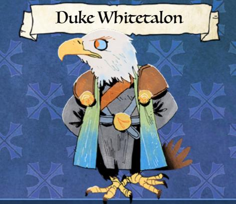

## EYRIE DYNASTIES

Duke Orias Whitetalon is the latest in a long line of Whitetalons, all of whom have occupied positions on or near the throne of the Dynasties. He is determined to ensure that his children have the same legacy preserved for them.

{1}------------------------------------------------

## Duke Whitetalon • Eagle

INJURY 3 MORALE 2 EXHAUSTION 3 Harm Dealt: 2 injury WEAR 4

#### Drive

To assert dominance over the whole of the Woodland

#### Moves

- •Make a pointed and dire threat
- •Attack from a position of superiority
- •Flee from a losing battle

### Equipment

The Whitetalon (ancestral family sword)

Request for the vagabonds: Enter a clearing and secretly create an opening in the clearing's defenses for his troops.

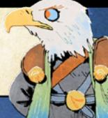

{2}------------------------------------------------

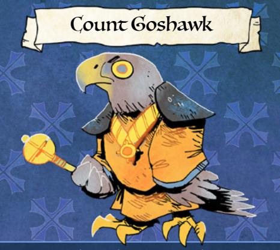

#### EYRIE DYNASTIES

Count Eamon Goshawk is of the Goshawk branch of Eyrie royalty—always nobles, rarely leaders. Eamon plans to stay close to power and come out of the war near the top.

{3}------------------------------------------------

## Count Goshawk • Goshawk

INJURY 1 EXHAUSTION 2 WEAR 2

Harm Dealt: 1 exhaustion

Drive

MORALE 2

To side with the winners of the war in the Woodland

#### Moves

- •Offer a bribe or reward
- •Backstab at an opportune moment
- •Blackmail into submission

## Equipment

Globus Accipiter (scepter of office)

Request for the vagabonds: Carry a message of secret alliance to an official of the Marquisate.

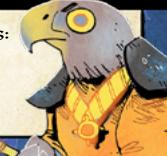

{4}------------------------------------------------

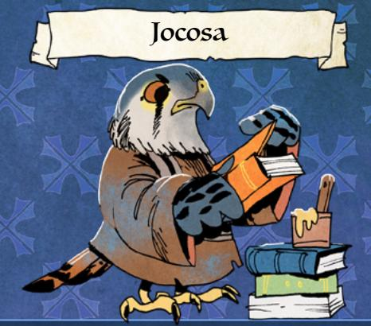

# EYRIE DYNASTIES

Jocosa is a brilliant librarian scholar of the Eyrie Dynasties, committed above all else to record and preserve the past. She is committed to the Eyrie only because it has the greatest archives, to her knowledge.

{5}------------------------------------------------

### Jocosa • Kestrel

INJURY 1 MORALE 3 EXHAUSTION 1 Harm Dealt: 1 exhaustion WEAR 1

#### Drive

To protect the legacy and history of the Eyrie

#### Moves

- •Provide valuable information
- •Desperately attack a threat to the books
- •Request and record insight and history

### Equipment

"An Accumulated History of the Eyrie"

Request for the vagabonds: Enter a ruin to retrieve a lost chronicle of an ancient Eyrie kingdom.

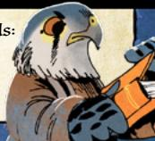

{6}------------------------------------------------

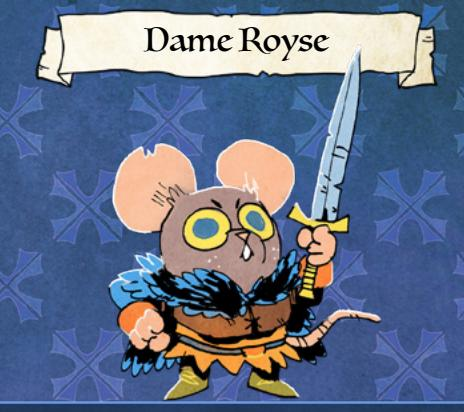

### EYRIE DYNASTIES

Dame Royse, honored knight of the Eyrie Dynasties and bearer of the Bluecloak, is one of the few nonavian legendary figures in the Eyrie. She commits to her ideals and her duties, to the point of overlooking many of the Eyrie's greater transgressions.

{7}------------------------------------------------

### Dame Royse • Mouse

INJURY 2 MORALE 3 EXHAUSTION 2 Harm Dealt: 1 injury WEAR 3

#### Drive

To uphold her honor and reputation

### Moves

- •Take on a worthy cause
- •Defend a weak or defenseless victim
- •Challenge to a duel

#### Equipment

Short sword, the Bluecloak (an honorable badge of office)

Request for the vagabonds: Aid her in bringing a rogue Eyrie knight to justice.

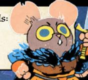

{8}------------------------------------------------

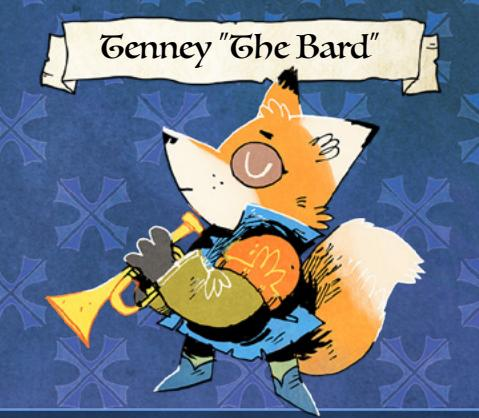

## EYRIE DYNASTIES

Tenney is "the Bard," troubadour of the Eyrie Dynasties and singer of their songs and stories. Sponsoring Tenney grants status for nobles of the Eyrie, and Tenney relies on that to live comfortably. The more powerful the noble who sponsors him, the greater his fame and status, and the more comfortable his life.

{9}------------------------------------------------

### Tenney "The Bard" • Fox

INJURY 1 MORALE 2 EXHAUSTION 2 Harm Dealt: 1 exhaustion WEAR 1

#### Drive

To rise in status and prominence in the Woodland

#### Moves

- •Put on a beautiful performance
- •Shower with sycophantic praise
- •Flee from violence

#### Equipment Brass trumpet

Request for the vagabonds: Protect his life from aristocrats incensed by some of his satirical songs.

{10}------------------------------------------------

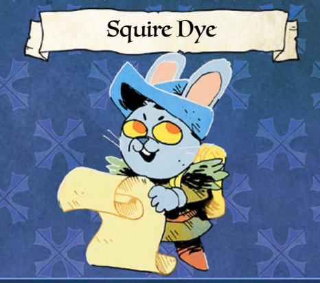

# EYRIE DYNASTIES

Dye is a squire and loyal courier within the Eyrie Dynasties, known for being fleet of foot and always capable of getting the message through. She does tend to read the messages, however, and sometimes takes it upon herself to alter them to keep the Eyrie from indulging its worst instincts.

{11}------------------------------------------------

### Squire Dye • Rabbit

INJURY 2 MORALE 2 EXHAUSTION 3 Harm Dealt: 1 exhaustion WEAR 1

Drive

To temper the Eyrie's worst impulses

Moves

- •Acrobatically escape from attacks
- •Offer help to those in need
- •Defuse a dangerous situation with words

Equipment Massive backpack

a massacre.

Request for the vagabonds: Help cover up the changes she made to a missive to prevent

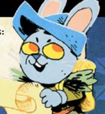

{12}------------------------------------------------

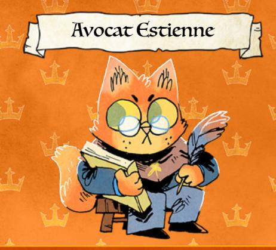

### MARQUISATE

Estienne is an avocat, a master bureaucrat and wielder of Marquisate law. She believes that the law will win out over any foe or injustice, and won't hesitate to use it to crack down on "undesirable elements."

{13}------------------------------------------------

## Avocat Estienne • Cat

INJURY 1 MORALE 2 EXHAUSTION 2 Harm Dealt: 1 exhaustion WEAR 1

Drive

To enforce and expand Marquisate law

## Moves

- •Seize ill-gotten goods
- •Hide behind guards and soldiers
- •Record and spread word of misdeeds

### Equipment

Bundles of Marquisate law and record

Request for the vagabonds: Seize goods she has identified as illegally withheld from taxes by local merchants.

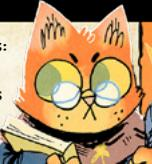

{14}------------------------------------------------

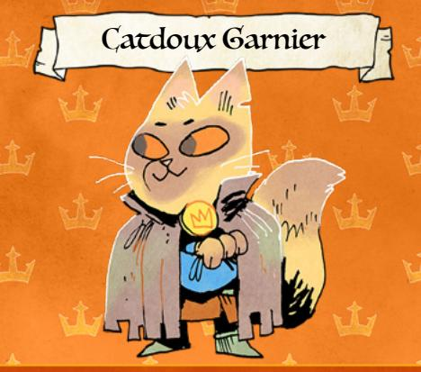

## MARQUISATE

Garnier came with the Marquise de Cat as a common soldier, seeing an opportunity. He has already risen to the rank of Catdoux (gentlecat). He aims for still more power, and is willing to do whatever it takes to achieve it.

{15}------------------------------------------------

### Catdoux Garnier • Cat

INJURY 2 EXHAUSTION 2 WEAR 2

MORALE 1 Harm Dealt: 1 injury

Drive

To rise in the ranks of the Marquisate

Moves

- •Make self-serving illicit deals
- •Backstab an opportune target
- •Spring a trap

Equipment

Assorted knives

Request for the vagabonds: Infiltrate, spy on, and collect blackmail against a rival noble.

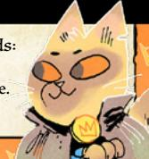

{16}------------------------------------------------

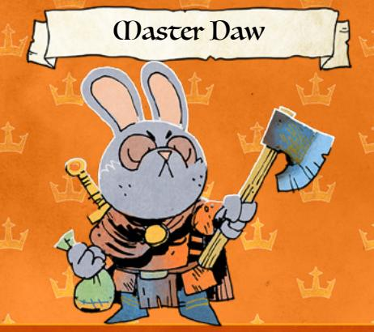

### MARQUISATE

Master Daw is a knighted servant of the Marquisate. He is a capable fighter and soldier for the Marquisate, and he truly believes in their order and their ability to improve the Woodland.

{17}------------------------------------------------

## Master Daw • Rabbit

Harm Dealt: 2 injury

INJURY 3 EXHAUSTION 2 WEAR 3

Drive

MORALE 2

To bring the Marquisate's benefits to the Woodland

#### Moves

- •Give a speech about the Marquisate's benefits
- •Politely ask opposition to submit
- •Attack unsubmitting opponents

#### Equipment

Axe, sword, and cloak

Request for the vagabonds: Protect a new invention he is transporting to a clearing in need.

{18}------------------------------------------------

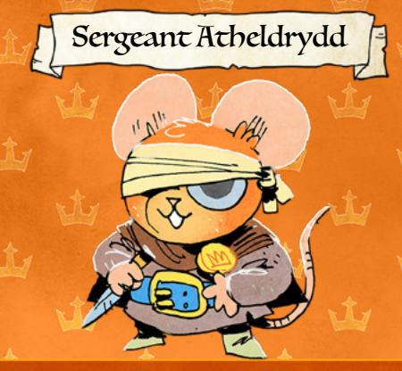

#### MARQUISATE

Sergeant Atheldrydd ("Drydd") is a soldier of the Marquisate, most interested in bringing the Marquisate and the Woodland together. Both can make the other better, she believes, and she's willing to knock heads to do it.

{19}------------------------------------------------

# Sergeant Atheldrydd • Mouse

INJURY 3 EXHAUSTION 3 WEAR 2

MORALE 3 Harm Dealt: 1 injury

Drive

To integrate the Woodland and the Marquisate

Moves

- •Enforce reasonable conversation
- •Recruit potential assets
- •Decisively attack dangerous threats

Equipment

Dagger, Marquisate badge

Request for the vagabonds: Help keep the peace in a clearing about to explode from internal conflict.

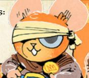

{20}------------------------------------------------

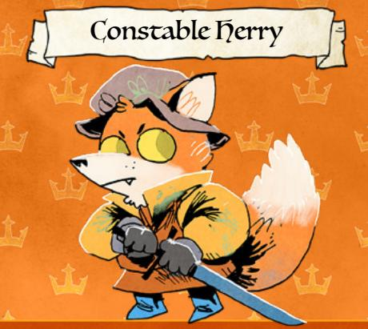

### MARQUISATE

Herry is a constable of the Marquisate out to enforce its laws and keep its citizens safe. Herry is a Marquisate loyalist, but believes he's serving good.

{21}------------------------------------------------

### Constable Herry • Fox

INJURY 2 EXHAUSTION 2 WEAR 2

MORALE 3 Harm Dealt: 2 injury

Drive

To defend Marquisate citizens and clearings

Moves

•Interrogate a threat

•Arrest a known foe

•Extend friendship to Marquisate allies

Equipment

Bluesteel sword

Request for the vagabonds: Apprehend a local rabblerouser on suspicion of being a Woodland Alliance agent.

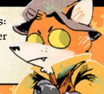

{22}------------------------------------------------

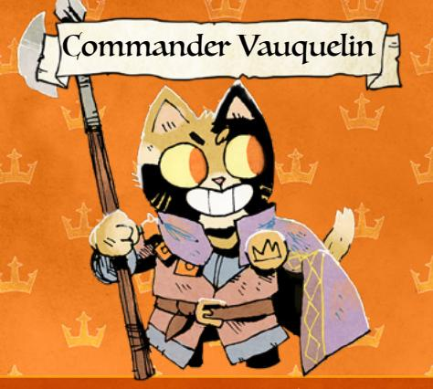

#### MARQUISATE

Commander Vauquelin of the Marquisate military is one of its foremost leaders and most dangerous commanders, prosecuting the war across the Woodland.

{23}------------------------------------------------

# Commander Vauquelin • Cat

INJURY 3 MORALE 3 EXHAUSTION 3 Harm Dealt: 1 injury WEAR 3

Drive

To grow the Marquisate at all costs

#### Moves

- •Threaten with overwhelming force
- •Attack unyielding foes
- •Annex useful assets and allies

Equipment Halberd

> Request for the vagabonds: Lead an enemy troop into a Marquisate ambush.

{24}------------------------------------------------

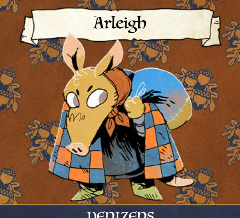

### DENIZENS

Arleigh is a traveling merchant of the Woodland, always on the lookout for good deals, good opportunities, and good partners.

{25}------------------------------------------------

# Arleigh • Anteater

INJURY 1 EXHAUSTION 3 WEAR 3

Harm Dealt: 1 exhaustion

Drive

MORALE 1

To make a good business deal

Moves

- •Find out what a denizen wants
- •Make a pitch to buy or sell
- •Barter their way out of trouble

Equipment

Satchel of assorted curios

Request for the vagabonds: Help them "reappropriate" a confiscated satchel of valuables.

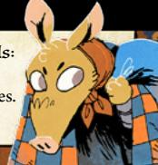

{26}------------------------------------------------

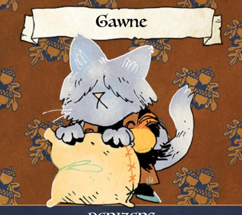

# DENIZENS

Gawne is a baker's assistant and former Marquisate soldier—now deserted. He traveled to the Woodland as a soldier, but has since become a denizen; he desperately wants to be left alone by the factions and their struggles.

{27}------------------------------------------------

# Gawne • Cat

INJURY 1 EXHAUSTION 1 WEAR 1

Harm Dealt: 1 injury

Drive

MORALE 1

To live a simple, quiet life

Moves

- •Deflect conversation away from himself
- •Avoid dangerous denizens
- •Sneak away and hide

Equipment

Apron and flour, old sword

Request for the vagabonds: Protect him and his family from Marquisate inquisitors.

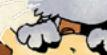

{28}------------------------------------------------

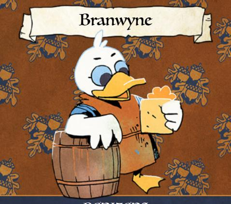

## DENIZENS

Branwyne does odd jobs around clearings, picking up whatever work needs doing that way, she hears as much rumor and gossip as she can. She'll happily share it, especially in trade for more.

{29}------------------------------------------------

### Branwyne • Duck

INJURY 1 MORALE 2 EXHAUSTION 2 Harm Dealt: 1 exhaustion WEAR 1

Drive

To trade gossip and secrets

#### Moves

- •Pry secrets from interesting denizens
- •Offer up interesting gossip to a grateful audience
- •Submit and divert attention with rumors

### Equipment

Assorted notes on gossip

Request for the vagabonds: Investigate a suspicious denizen of her clearing.

{30}------------------------------------------------

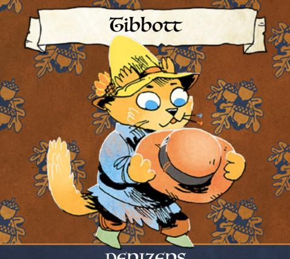

# DENIZENS

Tibbott is an excellent haberdasher, a hatmaker extraordinaire—but more importantly, he's a voice for peace and compromise.

{31}------------------------------------------------

### Tibbott • Ferret

INJURY 1 MORALE 2 EXHAUSTION 1 Harm Dealt: 1 exhaustion WEAR 2

Drive To protect the denizens

#### Moves

- •Perform his job superbly
- •Defuse an escalating situation
- •Stand against a bully

Equipment Excellent hats

> Request for the vagabonds: Lend their voices to his in convincing another local leader to avoid conflict.

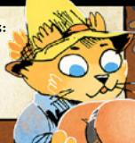

{32}------------------------------------------------

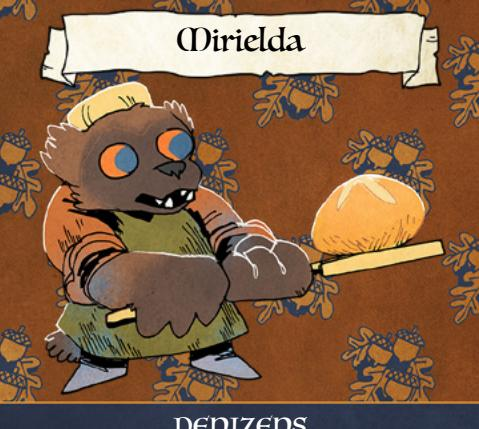

## DENIZENS

Mirielda is an expert and beloved baker, as well as parent and guardian to many children, including adopted orphans. She is fiercely defensive of her family.

{33}------------------------------------------------

## Mirielda • Wolverine

INJURY 1 MORALE 1 EXHAUSTION 2 Harm Dealt: 1 exhaustion WEAR 1

Drive To support her family

Moves •Ply with excellent bread

•Fiercely defend her family

•Avoid getting involved

Equipment Bread and pastries

> Request for the vagabonds: Rescue one of her children who joined—unknown to her, willingly—a warring faction.

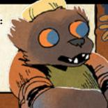

{34}------------------------------------------------

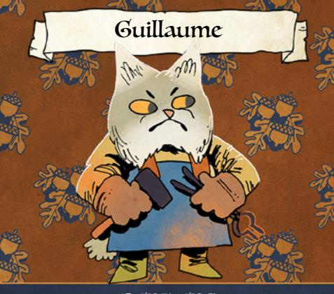

## DENIZENS

Guillaume is a blacksmith from Le Monde de Cat, the far-off empire from which hails the Marquise. He left to get away from its tyranny, and he wants the Marquisate gone from his Woodland home.

{35}------------------------------------------------

### Guillaume • Lynx

INJURY 2 MORALE 1 EXHAUSTION 2 Harm Dealt: 1 injury WEAR 2

Drive To oust the Marquisate

Moves

- •Offer his services to Marquisate foes
- •Sabotage Marquisate work
- •Share secrets and drinks for the same

Equipment Blacksmith tools

> Request for the vagabonds: Burn down a repository of Marquisate weaponry.

{36}------------------------------------------------

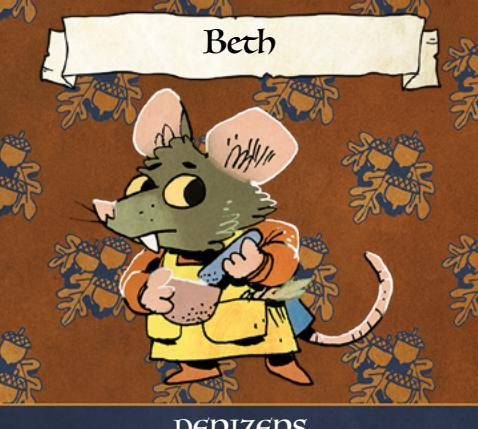

## DENIZENS

Beth is an alchemist and herbalist, a healer and a surgeon. She will help anyone who needs it, regardless of faction.

{37}------------------------------------------------

## Beth • Rat

INJURY 1 EXHAUSTION 2 WEAR 2

MORALE 1 Harm Dealt: 1 exhaustion

#### Drive

To take care of the sick and wounded

## Moves

- •Race to help someone in trouble
- •Offer a newly invented medicine
- •Surrender to avoid conflict

#### Equipment

Alchemist's herbs and medicines

Request for the vagabonds: Collect valuable medicinal herbs from a dangerous cave in the forest so she can save a life.

{38}------------------------------------------------

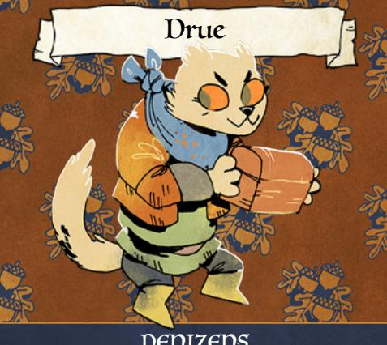

# DENIZENS

Drue is a bandit, thief, and robber. He's no match for a real vagabond, and he knows it...but he'll never turn down a chance to get rich quick.

{39}------------------------------------------------

## Drue • Weasel

INJURY 2 EXHAUSTION 2 WEAR 2

MORALE 1 Harm Dealt: 2 injury

Drive To get rich

Moves

- •Steal valuable items
- •Spring an ambush
- •Surrender to superior force

Equipment

Razor sharp knives

Request for the vagabonds: Assist him in stealing a treasure stored inside the safest room of the local constabulary.

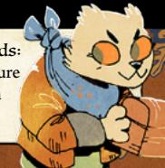

{40}------------------------------------------------

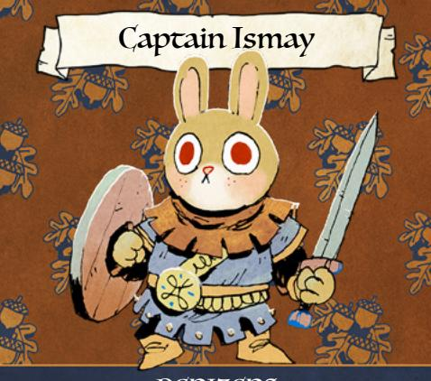

## DENIZENS

Ismay is a large, powerful rabbit guard captain. She's never been a soldier, but she sees herself as a wall between dangers and the rest of the denizens.

{41}------------------------------------------------

## Captain Ismay • Rabbit

INJURY 3 MORALE 2 EXHAUSTION 2 Harm Dealt: 2 injury WEAR 3

Drive To guard her home

## Moves

- •Physically subdue a threat
- •Side with the oldest denizen around
- •Make friends with non-threatening denizens

Equipment Sword, shield, and armor

Request for the vagabonds: Covertly deal with a dangerous denizen recently arrived in the clearing.

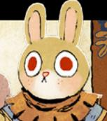

{42}------------------------------------------------

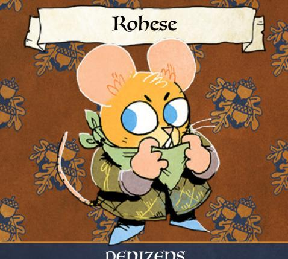

## DENIZENS

Rohese wants to unite the Woodland—or at least, its criminal elements. She has very few moral rules, but she will defend those who are loyal to her, and punish those who are not.

{43}------------------------------------------------

### Rohese • Mouse

INJURY 2 MORALE 1 EXHAUSTION 2 Harm Dealt: 1 exhaustion WEAR 3

#### Drive

To grow a criminal network across the Woodland

### Moves

- •Offer a bribe and a threat simultaneously
- •Deploy dangerous followers to solve problems
- •Reward loyalty

## Equipment

Fake "Woodland Alliance" bandana

Request for the vagabonds: Track down, apprehend, and return a criminal who betrayed her.

{44}------------------------------------------------

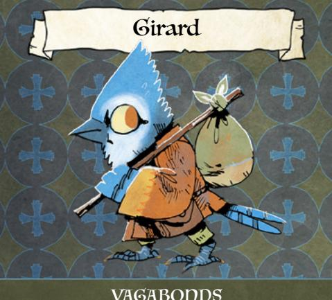

#### VAGABONDS

Girard is a wandering, exploring vagabond, intrigued both by all the different clearings and by the ruins and secrets held in between.

{45}------------------------------------------------

## Girard • Bluejay

INJURY 1 MORALE 2 EXHAUSTION 2 Harm Dealt: 1 injury WEAR 1

Drive

To make discoveries across the Woodland

Moves

- •Seek and explore an interesting locale
- •Strike at danger from cover
- •Exchange discoveries for discoveries

Equipment Shortbow, satchel

> Request for the vagabonds: Back him up in an expedition to a secret, ancient, dangerous ruin.

{46}------------------------------------------------

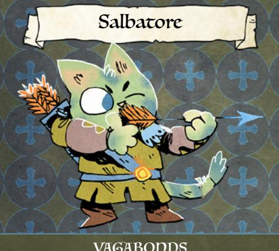

### VAGABONDS

Salbatore devoted himself to a singular cause—becoming the greatest archer in the Woodland. He will undertake any job that earns him more prestige for his goal.

{47}------------------------------------------------

### Salbatore • Cat

INJURY 2 EXHAUSTION 2 WEAR 2

MORALE 1 Harm Dealt: 2 injury

#### Drive

To be known as the greatest archer in the Woodland

#### Moves

- •Make a ridiculous shot with his bow
- •Brag and boast about his excellence
- •Flee from close-up fights

#### Equipment

Purpleheart wood bow

Request for the vagabonds: Help set up an competition with the best archers of the factions.

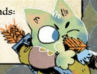

{48}------------------------------------------------

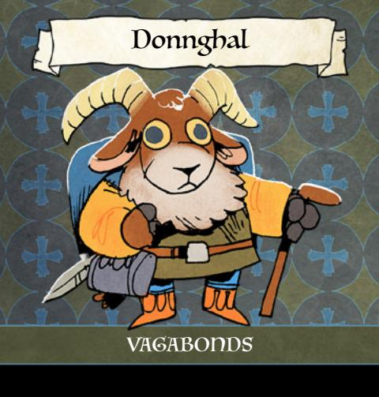

Donnghal is a vagabond wanderer with one true goal—to find the rumored, mythical kingdom of his ancestors hidden on, under, or around the Woodland's hills and mountains.

{49}------------------------------------------------

### Donnghal • Sheep

INJURY 2 EXHAUSTION 3 WEAR 2

Harm Dealt: 2 exhaustion

Drive

MORALE 2

To find the lost civilization of Hala Corach

#### Moves

•Charge and headbutt

•Obstinately refuse until he gets his way

•Befriend someone who shows interest in his quest

Equipment Walking stick, sword

Request for the vagabonds: Help him obtain a valuable atlas from an ancient civilization of the Woodland.

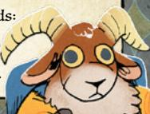

{50}------------------------------------------------

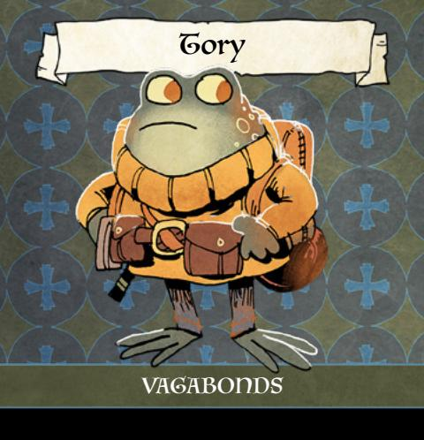

Tory has no allegiances or loyalty to anyone or anything. She has found that someone like her can profit enormously from ongoing wars like the one ravaging the Woodland.

{51}------------------------------------------------

## Tory • Toad

INJURY 3 EXHAUSTION 2 WEAR 3

MORALE 1 Harm Dealt: 1 exhaustion

#### Drive

To keep the war going indefinitely

#### Moves

- •Hop into a better position
- •Trick a denizen into fighting another denizen
- •Offer aid to combatants in exchange for cash

#### Equipment

Pouches full of assorted supplies

Request for the vagabonds: Sabotage a meeting proposing a temporary truce between warring factions.

{52}------------------------------------------------

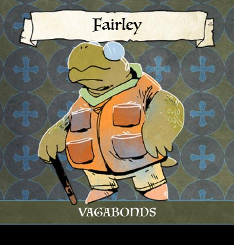

Fairley has seen the Woodland over the course of countless decades. She has seen it change and return and change again. She now only desires to see it one more time, in full, in her old age.

{53}------------------------------------------------

## Fairley • Tortoise

INJURY 3 EXHAUSTION 1 WEAR 2

MORALE 2 Harm Dealt: 1 injury

#### Drive

To visit as many clearings and wonders as possible

#### Moves

- •Spin and take a blow on hard shell
- •Share unfinished tales and legends
- •Smack with her cane to end unneeded fighting

Equipment Swordcane

> Request for the vagabonds: Escort her into a dangerous clearing, well-changed from what she remembers

{54}------------------------------------------------

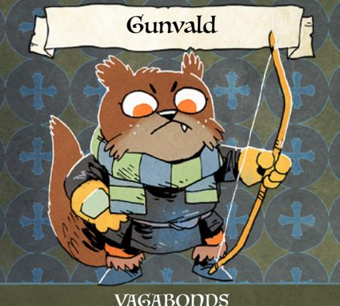

### VAGABONDS

Gunvald is an otter with an obsession—the Raft Bandits, a crew of outlaws and brigands who fight along the river and waterways of the Woodland. His obsession has driven him out of any faction, and he pursues it with heedless drive.

{55}------------------------------------------------

### Gunvald • Otter

INJURY 3 EXHAUSTION 2 WEAR 2

MORALE 3 Harm Dealt: 1 injury

Drive To defeat the Raft Bandits

### Moves

- •Accurately make an impossible shot
- •Exhort others into providing aid
- •Take on incredible risk without hesitation

Equipment Longbow

> Request for the vagabonds: Act as bait in one of his ploys to draw out the Raft Bandits and destroy them.

{56}------------------------------------------------

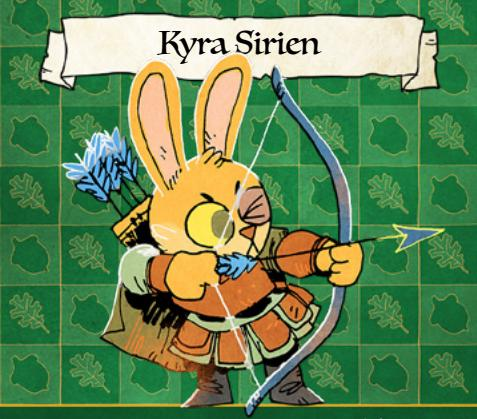

### WOODLAND ALLIANCE

Kyra Sirien is young enough to not have known a Woodland before the Grand Civil War, and old enough to refuse a Woodland ruled by anybody but the denizens themselves. She wants to upend the old ways of the Woodland and create a new Alliance across all the clearings...even if the clearings don't all agree.

{57}------------------------------------------------

## Kyra Sirien • Rabbit

Harm Dealt: 1 injury

INJURY 3 EXHAUSTION 4 WEAR 2

Drive

MORALE 4

To establish a new Woodland Alliance government and society

### Moves

- •Attack without warning
- •Assume command of a group
- •Passionately give a speech about freedom

### Equipment

Shortbow, knife, leather armor

Request for the vagabonds: Help her destroy a cache of goods and treasure held by a dominant faction.

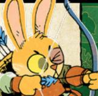

{58}------------------------------------------------

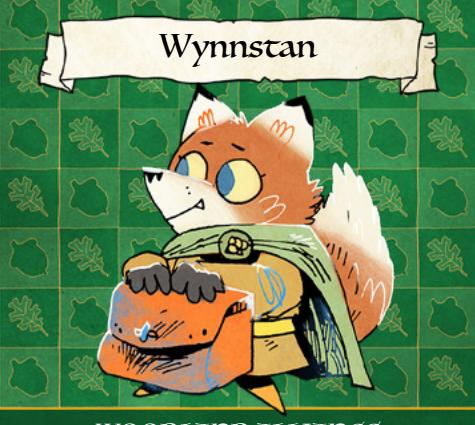

## WOODLAND ALLIANCE

Wynnstan joined the Woodland Alliance to help the denizens...but he did not want to fight in battles. He does his best to help those who are suffering, all while believing he's too weak, too cowardly, to fight sword to sword.

{59}------------------------------------------------

### Wynnstan • Fox

INJURY 1 MORALE 1 EXHAUSTION 3 Harm Dealt: 1 exhaustion WEAR 2

### Drive

To relieve the suffering of the most oppressed denizens of the Woodland

### Moves

- •Provide aid and support without hesitation
- •Talk down a foe with kindness and mercy
- •Freeze in the face of real aggression

#### Equipment Medicine bag

Request for the vagabonds: Destroy the arms and armor of a local oppressor, to force them into a peaceful resolution.

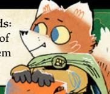

{60}------------------------------------------------

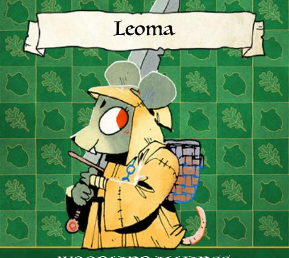

# WOODLAND ALLIANCE

Leoma was always a capable mercenary, but since joining the Woodland Alliance she has grown her reputation as a saboteur, assassin, and all-around fearsome outlaw. She aims to undermine the other factions through fear, destruction, and any other means necessary.

{61}------------------------------------------------

### Leoma • Mouse

INJURY 3 MORALE 2 EXHAUSTION 3 Harm Dealt: 2 injury WEAR 2

### Drive

To terrorize enemy factions into making mistakes

### Moves

- •Challenge the toughest enemy in a fight
- •Put on a show of ferocity and force
- •Destroy the environment to gain an advantage

# Equipment

The Mouse Claw (greatsword)

Request for the vagabonds: Help her ambush a faction leader, to keep the field clear and give her a shot at assassination.

{62}------------------------------------------------

### WOODLAND ALLIANCE

Cenric is a capable, valued blacksmith... and a rebel agitator. Cenric sees total war as the only way to freedom, and he pushes anyone he can towards that cause, using any means available to him.

{63}------------------------------------------------

### Cenric • Skunk

INJURY 2 MORALE 2 EXHAUSTION 2 Harm Dealt: 1 injury WEAR 3

### Drive

To provoke the Woodland to all-out war against tyrants

### Moves

- •Provide valuable arms to any rebels
- •Sway neutral parties towards rebellion
- •Put on an innocuous face to untrusted denizens

Equipment Blacksmith tools

> Request for the vagabonds: Wear an enemy faction's colors and be seen setting a clearing on fire to drive anger against that faction.

{64}------------------------------------------------

#### WOODLAND ALLIANCE

Imogene is a young squirrel, absolutely fierce in her beliefs, but untrained and untempered. She is determined to free her home, though she doesn't have a well-constructed plan to do so.

{65}------------------------------------------------

## Imogene • Squirrel

INJURY 2 MORALE 3 EXHAUSTION 2 Harm Dealt: 1 injury WEAR 1

Drive

To free her home clearing

Moves

- •Attack suddenly and without warning
- •Openly speak about the need for rebellion
- •Exhort others for aid, training, and equipment

Equipment Nicked old sword

> Request for the vagabonds: Help her and some friends to burn down the local official's home.

{66}------------------------------------------------

# WOODLAND ALLIANCE

Camdyn is an experienced warrior, capable strategist, and worthy leader of the Woodland Alliance. He sees the Alliance as the best path to a better future for all the Woodland, and he sees his role as tempering the Alliance's wilder impulses.

{67}------------------------------------------------

## Camdyn • Fox

INJURY 3 MORALE 3 EXHAUSTION 3 Harm Dealt: 1 injury WEAR 3

## Drive

To pursue a better future for the whole Woodland

## Moves

- •Exhibit restraint, calm, and dispassion
- •Share a plan to solve a real problem
- •Strike from a position of superiority

### Equipment

Axe, shield, and armor

Request for the vagabonds: Rescue a band of young Woodland Alliance firebrands.

{68}------------------------------------------------

### RIVERFOLK COMPANY

Audgunn is an experienced and wealthy skipper of the Riverfolk Company; he speaks on their behalf for the establishment of Company-owned trading posts all along the Woodland's rivers.

{69}------------------------------------------------

## Skipper Audgunn • Otter

INJURY 1 EXHAUSTION 2 WEAR 2

Harm Dealt: 1 exhaustion

Drive

MORALE 2

To make Company presence and trading posts integral to the Woodland

#### Moves

- •Offer valuable trade goods at discount prices
- •Butter up powerful denizens
- •Call in favors and friendships

Equipment Luxurious greatcoat

Request for the vagabonds: Pressure a local denizen leader into allowing the Company to build a trading post there.

{70}------------------------------------------------

### RIVERFOLK COMPANY

Gage is a counter of the Riverfolk Company, a locally recruited denizen who keeps track of contracts, exchange rates, and more. He is in it, unequivocally, for the money.

{71}------------------------------------------------

### Counter Gage • Fox

INJURY 1 MORALE 1 EXHAUSTION 1 Harm Dealt: 1 exhaustion WEAR 3

#### Drive

To acquire goods, currency, and value

#### Moves

- •Wield paperwork, contracts, and documents to get his way
- •Solve a problem through pay or bribery
- •Make threats on behalf of the Company

### Equipment

Sacks of gold and goods, glasses, contracts

Request for the vagabonds: Steal an incoming trade wagon to put pressure on a rich denizen.

{72}------------------------------------------------

### RIVERFOLK COMPANY

Selby is a boatwright, obsessed with what makes a good boat and how to overcome any water, any weather, any route. He thinks Woodland resources, woods, and techniques may be the key to finishing his dream project—an utterly unsinkable boat.

{73}------------------------------------------------

### Wright Selby • Otter

INJURY 1 MORALE 1 EXHAUSTION 2 Harm Dealt: 1 exhaustion WEAR 2

Drive

To design the perfect boat

#### Moves

- •Excitedly overshare about boat-making
- •Undertake dangerous experiments and investigations
- •Make deals with anyone for important resources

Equipment Boatwright tools

> Request for the vagabonds: Find and return with wood from a secret grove of legendary trees, the perfect material for his boat.

{74}------------------------------------------------

### RIVERFOLK COMPANY

Ernaca, a counter of the Company, believes in the Company's commitment to fair dealing and trade. She won't stand for shady business, and wants to make sure the Company is seen as the beacon of honest trade she sees it as.

{75}------------------------------------------------

## Counter Ernaca • Otter

INJURY 2 EXHAUSTION 2 WEAR 2

Harm Dealt: 1 exhaustion

Drive

MORALE 2

To defend the Company's reputation

# Moves

- •Make an appraisal and deal in good faith
- •Openly call out injustice or unfairness
- •Offer a mutually beneficial deal to those in need

### Equipment

Appraisal tools, myriad small valuable goods

Request for the vagabonds: Capture a shady Company boat skipper who has been making false deals.

{76}------------------------------------------------

### RIVERFOLK COMPANY

Magney skippers the Company boat *Starflow*, the pride of the whole Company fleet. He is the tip of the Company's spear, and he is not afraid to take mercenary contracts or to start a fight on behalf of the Company.

{77}------------------------------------------------

## Skipper Magney • Otter

INJURY 3 EXHAUSTION 2 WEAR 2

MORALE 2 Harm Dealt: 2 exhaustion

#### Drive

To control the Woodland's waterways

### Moves

- •Retreat from land to his boat
- •Launch daring attacks from his boat
- •Make veiled threats

### Equipment

Oar, coins in many denominations

Request for the vagabonds: Temporarily join his crew for a mercenary contract against a river clearing.

{78}------------------------------------------------

Qasira Ri'Jal is a Tongue of the Dragon, one of the members of the Lizard Cult specifically ordained to share the word of the Dragon. Qasira is determined to be the first voice preaching these words that many denizens ever hear.

{79}------------------------------------------------

## Qasira Ri'Jal • Lizard

Harm Dealt: 2 exhaustion

INJURY 1 EXHAUSTION 3 WEAR 1

Drive

MORALE 3

To bring the word of the Dragon to new clearings

#### Moves

- •Begin a sermon about the Dragon
- •Defend herself with powerful staff strikes
- •Share hope with the downtrodden

Equipment Staff, robes

> Request for the vagabonds: Protect the secret temple she built for her sermons to the downtrodden of a clearing.

{80}------------------------------------------------

Ubade Mo'Set is a Claw of the Dragon, a soldier of the Lizard Cult. He was granted a special mission—to find heretics and members of the sect who left the light of the Dragon. He brings them to justice for their sins.

{81}------------------------------------------------

# Ubade Mo'Set • Lizard

INJURY 3 EXHAUSTION 2 WEAR 2

Harm Dealt: 2 injury

Drive

MORALE 3

To slay the unfaithful

# Moves

- •Harshly question a witness or suspect
- •Hunt and slay an unfaithful denizen
- •Perform a rite of absolution

### Equipment

Dragonclaw dagger, shield

Request for the vagabonds: Help him to covertly ambush and kidnap a dangerous Lizard Cult heretic.

{82}------------------------------------------------

### LIZARD CULT

Abda He'Biba is an Eye of the Dragon, a seeker of knowledge and truth. She believes there are ancient ruins of the Dragon Empire hidden in the Woodland, and she would do anything to find them.

{83}------------------------------------------------

## Abda He'Biba • Lizard

INJURY 1 EXHAUSTION 2 WEAR 1

MORALE 1

Drive

To uncover lost ruins of the Dragon Empire

Harm Dealt: 1 exhaustion

## Moves

- •Provide the history of places and things
- •Steal anything of historic provenance
- •Flee from any violent threat

### Equipment

"In Fire's Eye" (tome of draconic lore)

Request for the vagabonds: Steal an important artifact from the cache of a local lord.

{84}------------------------------------------------

## LIZARD CULT

Talib is an uncasted runner of the Lizard Cult, responsible only for carrying messages between more important cultists. But he is determined to become a great hero, and actively looks for chances to engage with danger and prove himself.

{85}------------------------------------------------

## Talib • Lizard

INJURY 1 EXHAUSTION 3 WEAR 2

Harm Dealt: 1 exhaustion

MORALE 2

Drive To become a hero of the Lizard Cult

# Moves

- •Perform feats of speed and acrobatics
- •Emphasize and exaggerate his deeds
- •Plead for a chance to perform heroics

### Equipment

Armor, missives from cultists

Request for the vagabonds: Help him single-handedly defeat a guard captain who is hostile to the Lizard Cult.

{86}------------------------------------------------

## LIZARD CULT

Aiza Ri'Awan is a Tongue of the Dragon, and a proselytizer. She knows the value of converting the powerful, and she will use any means to get them to commit to the Lizard Cult.

{87}------------------------------------------------

## Aiza Ri'Awan • Lizard

INJURY 1 EXHAUSTION 2 WEAR 2

MORALE 4 Harm Dealt: 1 exhaustion

Drive

To convert powerful denizens

Moves

- •Persuade with promises and bribes
- •Reveal secrets as blackmail
- •Call in favors and powerful allies

Equipment

Silverskull badge of office, robes

Request for the vagabonds: Protect a treasure being sent to a powerful possible convert.

{88}------------------------------------------------

# CORVID CONSPIRACY

Alfhard has been a soldier in nearly every military in the Woodland. He uses his knowledge of their structures and traditions to infiltrate them on behalf of the Corvid Conspiracy.

{89}------------------------------------------------

## Alfhard • Crow

INJURY 2 EXHAUSTION 2 WEAR 2

MORALE 2 Harm Dealt: 2 injury

#### Drive

To undermine militaries from within

# Moves

- •Masquerade as a soldier
- •Sow discord among fellow soldiers
- •Mercilessly strike a possible discoverer

#### Equipment

Spiked club, patchwork armor

Request for the vagabonds: Help him frame a military officer for wrongdoing.

{90}------------------------------------------------

# CORVID CONSPIRACY

Mallory is an alchemist and explosives expert. She suffered the loss of her family at the hands of the Woodland's great powers, and she is determined to burn down their greatest edifices as revenge.

{91}------------------------------------------------

## Mallory • Crow

INJURY 1 EXHAUSTION 2 WEAR 3

MORALE 2 Harm Dealt: 3 injury

Drive

To destroy the halls of power

Moves

- •Ask others to test dangerous mixtures
- •Trigger an explosive trap
- •Plead for help with overthrowing all tyrants

Equipment

Explosive vials

Request for the vagabonds: Plant a packet of explosives in a grand manor of a local lord.

{92}------------------------------------------------

## CORVID CONSPIRACY

Odilie is an accomplished raider of the Corvid Conspiracy, and leads an entire force of Conspiracy fighters. She aims to break the military hold of the other factions on the clearings, one at a time, launching raids from the cover of darkness and bringing chaos to their forces.

{93}------------------------------------------------

### Odilie • Crow

INJURY 3 EXHAUSTION 2 WEAR 2

Harm Dealt: 1 injury

Drive

MORALE 2

To free clearings from any military rule

# Moves

- •Reveal hidden allies and warriors
- •Strike from shadows without warning
- •Slice at enemy weaknesses

Equipment

Longsword, leather

Request for the vagabonds: Create a massive distraction to allow her soldiers to conduct a raid on a local fort.

{94}------------------------------------------------

# CORVID CONSPIRACY

Blanchard doesn't serve the Conspiracy out of loyalty or belief—he's an opportunist. And this opportunity, to use the Conspiracy's violent might to extort valuables out of the wealthy of the Woodland, is one Blanchard cannot give up.

{95}------------------------------------------------

## Blanchard • Crow

INJURY 2 EXHAUSTION 2 WEAR 2

Harm Dealt: 1 exhaustion

Drive

MORALE 1

To grow rich from extorted goods

# Moves

- •Reveal a secret smuggler's route
- •Ferret out hidden valuables
- •Threaten denizens to take valuables

Equipment

Crates full of goods

Request for the vagabonds: Deliver on a threat against a wealthy vagabond, and burn down their crop fields.

{96}------------------------------------------------

# CORVID CONSPIRACY

Stigr believes in the anarchic cause of the Corvid Conspiracy, through and through. He tries to convince others to join in with the Conspiracy's attempt to free the Woodland from all rule.

{97}------------------------------------------------

### Stigr • Crow

INJURY 1 EXHAUSTION 3 WEAR 2

Harm Dealt: 1 exhaustion

Drive

MORALE 3

To bring full freedom to the Woodland

### Moves

- •Share the virtues of utopian anarchism
- •Play up others' fears of oppression
- •Reveal and use nonlethal traps

### Equipment

Plentiful traveling supplies

Request for the vagabonds: Spy on a powerful faction leader for the Conspiracy.

{98}------------------------------------------------

#### GRAND DUCHY

Valeria knows firsthand the Duchy at its best. She knows how good it can be to recruit new workers to her crew and to the Duchy itself, freeing them from Woodland subservience to the safety of the Burrow.

{99}------------------------------------------------

### Foremole Valeria • Mole

INJURY 2 MORALE 2 EXHAUSTION 3 Harm Dealt: 1 injury WEAR 3

#### Drive

To recruit new subjects of the Duchy and send them to the Burrow

#### Moves

- •Reveal a secret tunnel
- •Offer a fair wage for work and allegiance
- •Escape from conflict through tunnels

### Equipment

Heavy armor, mining equipment

Request for the vagabonds: Help smuggle a group of would-be new recruits to a secret tunnel leading to the Burrow.

{100}------------------------------------------------

#### GRAND DUCHY

Thaddeus is a cartographer of the Underground Duchy. He acts as a kind of advanced scout in his investigations of the Woodland, although all he really cares about is seeing and mapping everything.

{101}------------------------------------------------

### Thaddeus • Mole

INJURY 1 MORALE 2 EXHAUSTION 3 Harm Dealt: 1 exhaustion WEAR 1

Drive

To see the whole of the Woodland

## Moves

- •Use a map to reveal new useful details
- •Cheerfully interview interesting or knowledgeable denizens
- •Share information gladly

Equipment Countless maps

> Request for the vagabonds: Help him explore an old, lost trail that connects two clearings.

{102}------------------------------------------------

#### GRAND DUCHY

Callista is a cook from the Underground Duchy. She arrived in the Woodland years ago, and while she loves the Woodland's many different denizens and cultures, she also misses the Burrow. She looks forward to the Duchy's control of the Woodland, and all the diversity that the Woodland will bring to the Duchy.

{103}------------------------------------------------

### Callista • Mole

INJURY 1 MORALE 1 EXHAUSTION 2 Harm Dealt: 1 exhaustion WEAR 1

Drive

To grow the Duchy's ideology and culture

Moves

- •Engage a denizen about their past
- •Share food and a story of the Duchy
- •Submit in the face of violence

Equipment

Pots and pans

Request for the vagabonds: Work for a Duchy Baron as local liasons with the denizens.

{104}------------------------------------------------

#### GRAND DUCHY

Vortigernus, Baron of Dirt, believes that money and trade line the path to take over the Woodland. He is determined to defeat all other factions through coin.

{105}------------------------------------------------

### Baron Vortigernus • Mole

INJURY 1 EXHAUSTION 1 WEAR 3

MORALE 2 Harm Dealt: 1 exhaustion

#### Drive

To exploit Woodland resources and enrich the Duchy

#### Moves

- •Seize a valuable resource
- •Barter with Duchy goods and coin
- •Dismiss denizens' personal concerns

# Equipment

Noble raiment

Request for the vagabonds: Destroy a local faction's cache of supplies, increasing demand for the Duchy's goods.

{106}------------------------------------------------

#### GRAND DUCHY

Hersilia, Captain and Squire of the Duchy, is one of the greatest tacticians in all the Burrow. She sees the Woodland as a potential source of danger down the line, so she is determined to take it and subjugate it now.

{107}------------------------------------------------

## Captain Hersilia • Mole

INJURY 3 MORALE 3 EXHAUSTION 2 Harm Dealt: 2 injury WEAR 3

Drive

To militarily demolish opposition

Moves

- •Strike in force from a secret tunnel
- •Smash with a mighty two-handed blow
- •Ask for and accept surrender from foes

Equipment

Armor, Freedom (great hammer)

Request for the vagabonds: Carry a military ultimatum to the leadership of a clearing.

{108}------------------------------------------------

# Creating NPCs

- 1. Choose a name, species, description, and job (sample species on the back).
- 2. Select a faction (list on the back).
- 3. Create a drive (samples on the back).
  - 4. Give them harm tracks with 1 to 5 boxes of injury, exhaustion, wear, and morale harm.
- 5. Choose their weapon:
  - Range: intimate, close, far
  - Harm: at least 1-injury or 1-exhaustion
- 6. Add other equipment: armor, clothing, books, or heirlooms.
- 7. Write three moves describing how the NPC might act or react.

{109}------------------------------------------------

#### sample species

*badger, bat, beaver, bluejay, cat, fox, hawk, lizard, mouse, opossum, otter, owl, raccoon, rabbit, squirrel, wolf*

#### list of factions

*Marquisate, Corvid Conspiracy, Denizens, Eyrie Dynasties, Grand Duchy, Lizard Cult, Riverfolk Company, Vagabond, Woodland Alliance*

#### sample drives

*to get revenge, to get rich, to make family safe, to make home safe, to gain power, to explore, to build something magnificent, to resist invaders, to defend the weak, to destroy an enemy, to wage war to prove worth, to undermine a figure of power, to find comfort, to serve a higher cause, to escape, to negotiate peaceful resolutions, to survive at all costs, to earn social status and position, to take control, to exert power and authority on others, to lay waste*