{0}------------------------------------------------

# Battle Axe

{1}------------------------------------------------

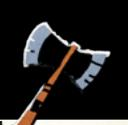

### Battle Axe wear 6

Range CLOSE

Harm 1 INJURY

weapon skill tags

Cleave, Storm a Group

special tags

+ **Large**: Mark exhaustion when inflicting harm with this weapon to inflict 1 additional harm.

*A double-headed axe is always an intimidating sight.*

{2}------------------------------------------------

# Birdcatcher

{3}------------------------------------------------

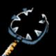

### Birdcatcher

wear 5

Range CLOSE

Harm 1 INJURY

weapon skill tags

### Vicious Strike

special tags

- +**Reach**: When you *engage in melee*, mark wear on this weapon to inflict harm instead of trading harm; you cannot use this tag if your enemy's weapon also has *reach*.
- +**Barbed**: When you catch someone with this weapon's end, mark exhaustion to move to intimate range and *grapple* them as if you had rolled a 10+.

{4}------------------------------------------------

# Blowgun

{5}------------------------------------------------

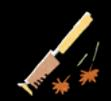

Range FAR

Harm 1 EXHAUSTION

special tags

+ **Poison**: When you *target a vulnerable foe*, inflict exhaustion instead of injury; your target is poisoned until cured. While poisoned, each time they take a significant or strenuous action, inflict exhaustion. If they fall unconscious, inflict injury every 6 hours until they receive the cure or perish.

{6}------------------------------------------------

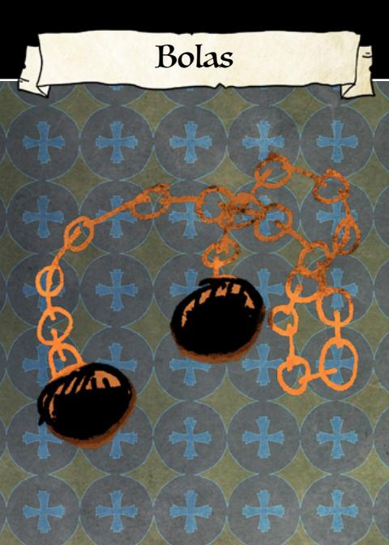

{7}------------------------------------------------

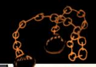

Range FAR

Harm SPECIAL

### special tags

+ **Entangling**: When you *target a vulnerable foe* with this weapon, aim for the head or the feet.

If the feet, then on a hit, instead of inflicting harm, your target becomes entangled and falls. They must take time to free themselves before moving.

If the head, then on a hit, mark wear and inflict 2-injury.

{8}------------------------------------------------

{9}------------------------------------------------

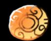

### Buckler

wear 3

### special tags

+ **Metal rim**: When you absorb injury as wear on this shield in close combat, you may mark an additional wear to immediately strike back with the edge of the shield and inflict injury.

*A small shield for parrying or quick punches.*

{10}------------------------------------------------

{11}------------------------------------------------

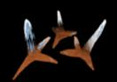

Range —

Harm SPECIAL

special tags

+ **Scattered spike**: When you throw out caltrops to cover a door, path, or small area, mark any amount of wear. Anyone who crosses the caltrops must either take time and pass cautiously, or mark injury for each wear you marked to cover the area.

*An array of small spikes is always a vagabond's friend.*

{12}------------------------------------------------

# Clockwork Wristbow

{13}------------------------------------------------

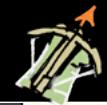

### Clockwork Wristbow

wear 4

Range FAR

Harm 1 INJURY

weapon skill tags

Quick Shot

special tags

+ **Hidden**: Mark exhaustion when being searched or examined to ensure this item goes unnoticed.

Mark wear to *attempt the blindside roguish feat* if you don't have it, or to take a 10+ to *blindside* if you do have it.

{14}------------------------------------------------

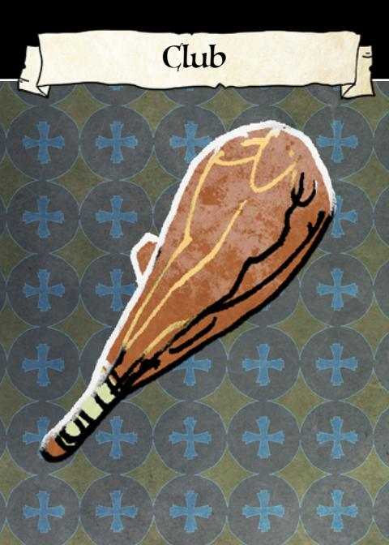

{15}------------------------------------------------

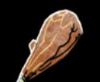

Range CLOSE

Harm 1 INJURY

weapon skill tags

Disarm, Cleave

special tags

- + **Heavy bludgeon**: Mark exhaustion to ignore your enemy's armor when you inflict harm.
- **Slow**: When you *engage in melee* with this weapon, choose one fewer option. Mark wear to ignore this effect.

{16}------------------------------------------------

# Crossbow

{17}------------------------------------------------

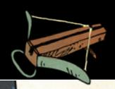

### Crossbow

wear 6

Range FAR

Harm 1 INJURY

weapon skill tags

### Trick Shot

special tags

- + **Iron bolts**: This weapon inflicts 1 additional wear when its harm is absorbed by armor.
- + **Hair trigger**: Mark wear to *target a vulnerable foe* at close range instead of far.

{18}------------------------------------------------

## Daggers

{19}------------------------------------------------

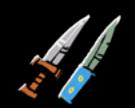

wear | 8

Range INTIMATE, CLOSE

Harm 1 INJURY

weapon skill tags

### Vicious Strike

special tags

- +**Quick**: Mark exhaustion to *engage in melee* with Finesse instead of Might.
- +**Throwable**: Mark exhaustion to *target a vulnerable foe* with this weapon at far range.
- +**Akimbo**: Mark exhaustion when wielding a dagger in each hand to inflict 1 additional injury.

{20}------------------------------------------------

{21}------------------------------------------------

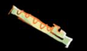

### special tags

- + **Intriguing**: Mark wear when you play this instrument to ask an audience member a question from *figure someone out*.
- + **Soothing**: Mark exhaustion when you play this instrument in a quiet moment to clear exhaustion from each of your listeners.

*Music can light up the darkest forest night.*

{22}------------------------------------------------

# Gauntlet

{23}------------------------------------------------

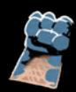

### Gauntlet wear 6

Range INTIMATE

Harm 1 EXHAUSTION

weapon skill tags

## Vicious Strike

- special tags + **Blunted**: This weapon inflicts exhaustion, not injury.
- + **Versatile**: When you move to or from a range this weapon can reach, mark wear to make a quick strike and inflict injury on any opponent in this weapon's range.

{24}------------------------------------------------

# Greatsword

{25}------------------------------------------------

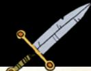

### Greatsword wear 7

Range CLOSE

Harm 1 INJURY

weapon skill tags Storm a Group

special tags

- + **Foxfolk steel**: Ignore the first box of wear you mark on this item each session.
- + **Large**: Mark exhaustion when inflicting harm with this weapon to inflict 1 additional harm.

{26}------------------------------------------------

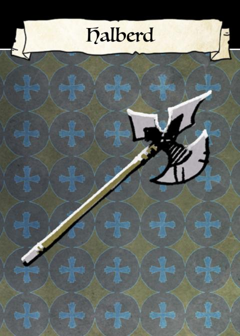

{27}------------------------------------------------

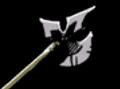

Range CLOSE

Harm 1 INJURY

weapon skill tags

Cleave, Disarm

special tags

+ **Reach**: When you *engage in melee*, mark wear on this weapon to inflict harm instead of trading harm; you cannot use this tag if your enemy's weapon also has *reach*.

*Preferred weapon of Marquisate guards everywhere.*

{28}------------------------------------------------

# Herb Satchel

{29}------------------------------------------------

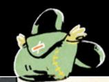

### Herb Satchel

wear 3

special tags

+ **Healer's kit**: When you use these supplies to provide medical aid to someone (including yourself), mark wear to clear exhaustion from them, or mark 2-wear to clear injury from them.

*Vagabonds learn how to find medicinal herbs by necessity.*

{30}------------------------------------------------

# Kite Shield

{31}------------------------------------------------

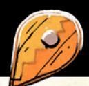

## Kite Shield

wear 5

### special tags

- + **Arrow-proof**: Ignore the first hit dealing injury from arrows that you suffer in a scene.
- + **Thick**: When you mark wear on this shield to block a hit, you only ever mark 1-wear, even if you are blocking more harm from a single hit.

*A peculiar design adopted by Woodland denizens with a flair for aesthetics.*

{32}------------------------------------------------

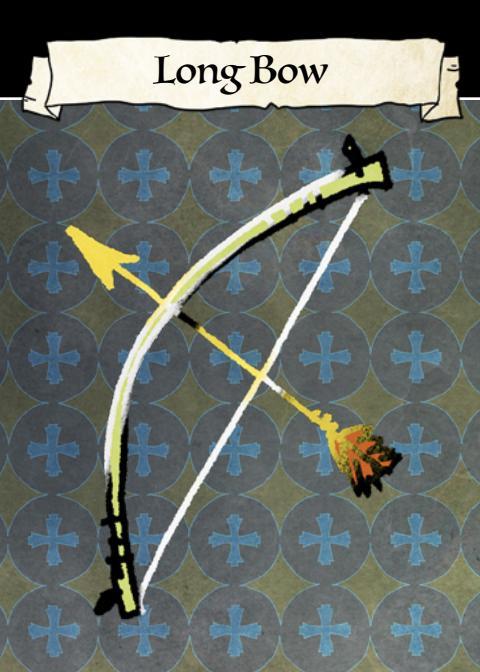

{33}------------------------------------------------

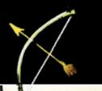

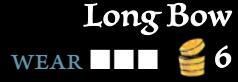

Range FAR

Harm 1 INJURY

weapon skill tags Harry, Trick Shot

special tags

+ **Heavy Draw Weight**: When you *target a vulnerable foe* with this bow, mark exhaustion to inflict 1 additional injury.

*A good bow and a good eye are all it takes.*

{34}------------------------------------------------

# Longsword

{35}------------------------------------------------

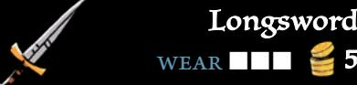

wear 5

Range CLOSE

Harm 1 INJURY

weapon skill tags

### Parry

special tags

+ **Sharp**: Mark wear when inflicting harm with this weapon to inflict 1 additional harm.

*Longswords are the most common kind of blade in the Woodland.*

{36}------------------------------------------------

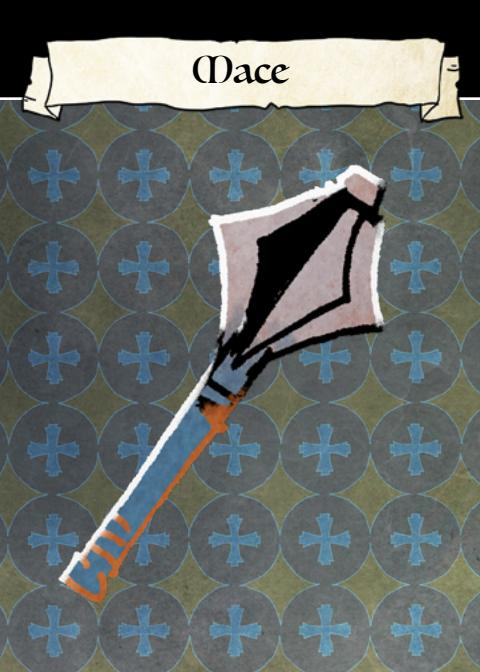

{37}------------------------------------------------

Range CLOSE

Harm 1 INJURY

weapon skill tags

Cleave

special tags

+ **Iron Flanges**: This weapon inflicts 1 additional wear when its harm is absorbed by armor.

*A weighted weapon with flanges perfect for breaking through iron.*

{38}------------------------------------------------

# Parrying Dagger

{39}------------------------------------------------

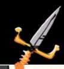

## Parrying Dagger

wear 4

Range CLOSE, INTIMATE

Harm 1 INJURY

weapon skill tags

Parry

special tags

+ **Hilt Guard**: When you *parry* with this weapon, you can mark wear instead of exhaustion.

*With a guard designed to jerk a blade out of a grip, it's more dangerous than it seems.*

{40}------------------------------------------------

# Push Dagger

{41}------------------------------------------------

## Push Dagger wear 4

Range INTIMATE

Harm 1 INJURY

weapon skill tags

### Vicious Strike

special tags

+**Hidden**: Mark exhaustion when being searched or examined to ensure this item goes unnoticed.

Mark wear to *attempt the blindside roguish feat* if you don't have it, or to take a 10+ to *blindside* if you do have it.

+**Punch Through**: Mark exhaustion when dealing harm at intimate range to ignore your enemy's armor.

{42}------------------------------------------------

# Rapier

{43}------------------------------------------------

Harm 1 INJURY

weapon skill tags Parry, Disarm

special tags

+ **Quick**: Mark exhaustion to *engage in melee* with Finesse instead of Might.

*Fast and double-edged.*

{44}------------------------------------------------

# Recurve Bow

{45}------------------------------------------------

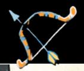

## Recurve Bow

wear 6

Range FAR

Harm 1 INJURY

weapon skill tags

Quick Shot, Harry

special tags

+ **Short Limbs**: Mark wear to fire a *quick shot* at far range.

*Bent to add more force to the draw while still letting it fire fast.*

{46}------------------------------------------------

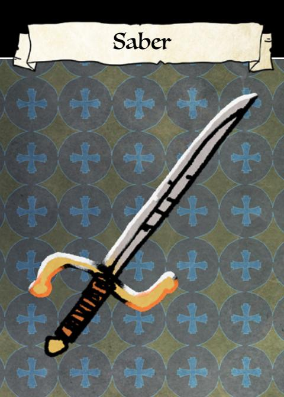

{47}------------------------------------------------

Range

CLOSE

Harm 1 INJURY

weapon skill tags

### Disarm

special tags

+ **Ceremonial**: Choose an attached faction. While this item is displayed, treat yourself as having +1 Reputation with that faction, and -1 Reputation with other factions.

*A pretty sword can say plenty without being used.*

{48}------------------------------------------------

# Salamander Spit

{49}------------------------------------------------

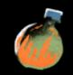

### Salamander Spit

wear 3

Range CLOSE, INTIMATE

Harm SPECIAL

### special tags

- + **Throwable**: Mark exhaustion to *target a vulnerable foe* with this weapon at far range.
- -**Expendable**: When you throw this weapon, it is automatically destroyed.
- +**Explosive**: When this item is destroyed, it explodes and deals 3-injury to everyone in its range (close). It also starts fires and destroys structures. +

{50}------------------------------------------------

## Scorpion Tail

{51}------------------------------------------------

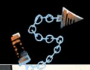

## Scorpion Tail

wear 5

Range CLOSE

Harm 1 INJURY

weapon skill tags

### Disarm

special tags

+**Entangling**: When you *target a vulnerable foe* with this weapon, aim for the head or the feet.

If the feet, then on a hit, instead of inflicting harm, your target becomes entangled and falls. They must take time to free themselves before moving.

If the head, then on a hit, mark wear and inflict 2-injury.

{52}------------------------------------------------

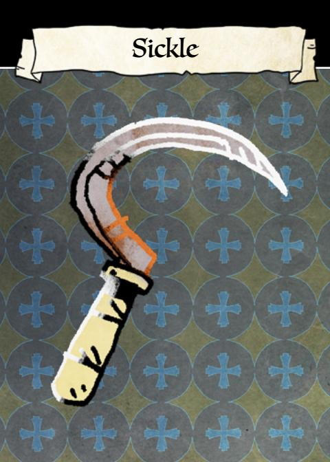

{53}------------------------------------------------

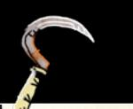

Range CLOSE

Harm 1 INJURY

weapon skill tags

### Cleave

special tags

+ **Sharp**: Mark wear when inflicting harm with this weapon to inflict 1 additional harm.

*Farming implements are often repurposed as weapons.*

{54}------------------------------------------------

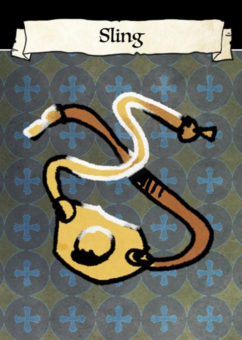

{55}------------------------------------------------

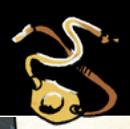

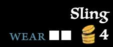

Range FAR

Harm 1 INJURY

weapon skill tags

Trick Shot

special tags + **Tricky**: When you use this item to *trick an NPC* by distracting them at a distance, on a 7–9 mark wear to eliminate one option from the *trick an NPC* move before the NPC picks.

*Even a rock can be dangerous in the right paws.*

{56}------------------------------------------------

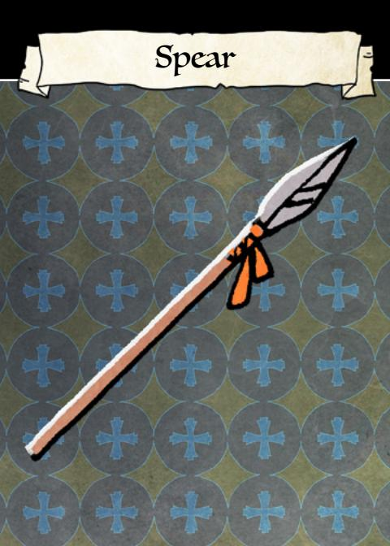

{57}------------------------------------------------

Range CLOSE

Harm 1 INJURY

### special tags

- +**Reach**: When you *engage in melee*, mark wear on this weapon to inflict harm instead of trading harm; you cannot use this tag if your enemy's weapon also has *reach*.
- +**Throwable**: Mark exhaustion to *target a vulnerable foe* with this weapon at far range.

*Keeping an enemy at bay can't be overestimated.*

{58}------------------------------------------------

Staff

{59}------------------------------------------------

Range CLOSE

Harm 1 EXHAUSTION

weapon skill tags

### Disarm

special tags

- + **Blunted**: This weapon inflicts exhaustion, not injury.
- + **Unassuming**: Until you harm an enemy, they will never deem you more of a threat than other vagabonds with arms and armor.

{60}------------------------------------------------

## Swordbreaker Blade

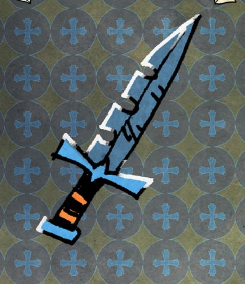

{61}------------------------------------------------

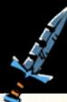

### Swordbreaker Blade

wear 6

Range CLOSE

Harm 1 INJURY

weapon skill tags Cleave, Disarm

special tags

+ **Notched**: When you inflict wear on armor or another weapon, mark wear to inflict 2 additional wear.

*Specialized and designed to snap through metal.*

{62}------------------------------------------------

# Targe Shield

{63}------------------------------------------------

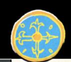

## Targe Shield

wear 4

### special tags

+ **Metal boss**: When you *engage in melee* with an opponent, mark wear to inflict exhaustion in addition to all other harm.

*Featuring a raised "boss" in the center, perfect for quick blows.*

{64}------------------------------------------------

# Throwing Axe

{65}------------------------------------------------

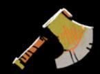

### Throwing Axe wear 5

Range CLOSE

Harm 1 INJURY

weapon skill tags

### Cleave

special tags

- + **Throwable**: Mark exhaustion to *target a vulnerable foe* with this weapon at far range.
- + **Sharp**: Mark wear when inflicting harm with this weapon to inflict 1 additional harm.

{66}------------------------------------------------

# Warhammer

{67}------------------------------------------------

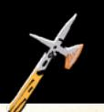

## Warhammer wear 6

Range CLOSE

Harm 1 INJURY

weapon skill tags

Cleave

special tags

- + **Heavy bludgeon**: Mark exhaustion to ignore your enemy's armor when you inflict harm.
- + **Large**: Mark exhaustion when inflicting harm with this weapon to inflict 1 additional harm.

{68}------------------------------------------------

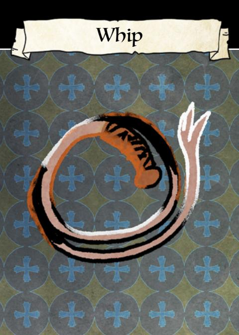

{69}------------------------------------------------

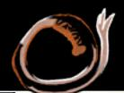

Range CLOSE

Harm 1 INJURY

weapon skill tags

### Disarm

special tags

+**Entangling**: When you *target a vulnerable foe* with this weapon, aim for the head or the feet.

If the feet, then on a hit, instead of inflicting harm, your target becomes entangled and falls. They must take time to free themselves before moving.

If the head, then on a hit, mark wear and inflict 2-injury.

{70}------------------------------------------------

## Cleave

When you **cleave armored foes at close range**, mark exhaustion and roll with Might. On a hit, you smash through their defenses and equipment; inflict 3-wear. On a 7–9, you overextend your weapon or yourself: mark wear or end up in a bad spot, your choice.

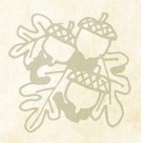

{71}------------------------------------------------

## Engage in Melee

When you **engage an enemy** in melee at close or intimate range, roll with Might. On a hit, trade harm. On a 10+, pick 3. On a 7-9, pick 1.

- inflict serious (+1) harm
- suffer little (-1) harm
- shift your range one step
- impress, dismay, or frighten your foe

{72}------------------------------------------------

## Disarm

When you **target an opponent's weapon with your strikes at close range**, roll with Finesse. On a hit, they have to mark 2-exhaustion or lose their weapon—it's well out of reach. On a 10+, they have to mark 3-exhaustion instead of 2.

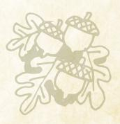

{73}------------------------------------------------

## Engage in Melee

When you **engage an enemy** in melee at close or intimate range, roll with Might. On a hit, trade harm. On a 10+, pick 3. On a 7-9, pick 1.

- inflict serious (+1) harm
- suffer little (-1) harm
- shift your range one step
- impress, dismay, or frighten your foe

{74}------------------------------------------------

## Parry

When you **try to parry the attacks of an enemy at close range**, mark exhaustion and roll with Finesse. On a hit, you consume their attention. On a 10+, all 3. On a 7–9, pick 1.

- you inflict morale or exhaustion (GM's choice)
- you disarm your opponent; their weapon is out of hand, but in reach
- you don't suffer any harm

{75}------------------------------------------------

## Engage in Melee

When you **engage an enemy** in melee at close or intimate range, roll with Might. On a hit, trade harm. On a 10+, pick 3. On a 7-9, pick 1.

- inflict serious (+1) harm
- suffer little (-1) harm
- shift your range one step
- impress, dismay, or frighten your foe

{76}------------------------------------------------

## Vicious Strike

When you **viciously strike an opponent where they are weak at intimate or close range**, mark exhaustion and roll with Might. On a hit, they suffer serious (+1) harm and cannot mark wear on their armor to block it. On a 10+, you get away with the strike. On a 7–9, they score a blow against you as well.

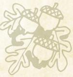

{77}------------------------------------------------

## Engage in Melee

When you **engage an enemy** in melee at close or intimate range, roll with Might. On a hit, trade harm. On a 10+, pick 3. On a 7-9, pick 1.

- inflict serious (+1) harm
- suffer little (-1) harm
- shift your range one step
- impress, dismay, or frighten your foe

{78}------------------------------------------------

## Confuse Senses

When you **throw something to confuse an opponent's senses at close or intimate range**, roll with Finesse. On a hit, you've thrown them off balance, blinded them, deafened them, or confused them, and given yourself an opportunity. On a 10+, they have to take some time to get their bearings and restore their senses before they can act clearly again. On a 7–9, you have just a few moments.

{79}------------------------------------------------

## Grapple an Enemy

When you grapple with an enemy at intimate range, roll with Might. On a hit, you choose simultaneously. Continue making choices until someone disengages, falls unconscious, or dies. On a 10+, you make one choice first, before beginning to make simultaneous choices.

- you strike a fast blow; inflict injury
- you wear them down; they mark exhaustion
- you exploit weakness; mark exhaustion to inflict 2-injury
- · you withdraw; disengage to close range

{80}------------------------------------------------

## Improvise a Weapon

When you **make a weapon out of improvised materials around you**, roll with Cunning. On a hit, you make a weapon; the GM will tell you its range tag and at least one other beneficial tag based on the materials you used. On a 7–9, the weapon also has a weakness tag.

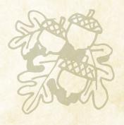

{81}------------------------------------------------

## Grapple an Enemy

When you grapple with an enemy at intimate range, roll with Might. On a hit, you choose simultaneously. Continue making choices until someone disengages, falls unconscious, or dies. On a 10+, you make one choice first, before beginning to make simultaneous choices.

- you strike a fast blow; inflict injury
- you wear them down; they mark exhaustion
- you exploit weakness; mark exhaustion to inflict 2-injury
- · you withdraw; disengage to close range

{82}------------------------------------------------

## Storm a Group

When you **storm a group of foes in melee**, mark exhaustion and roll with Might. On a hit, trade harm. On a 10+, choose 2. On a 7–9, choose 1.

- you show them up; you inflict 2-morale
- you keep them off balance and confused; you inflict 2-exhaustion
- you avoid their blows to the best of your ability; you suffer little (-1) harm
- you use them against each other; mark exhaustion again and they inflict their harm against themselves

{83}------------------------------------------------

## Grapple an Enemy

When you grapple with an enemy at intimate range, roll with Might. On a hit, you choose simultaneously. Continue making choices until someone disengages, falls unconscious, or dies. On a 10+, you make one choice first, before beginning to make simultaneous choices.

- you strike a fast blow; inflict injury
- you wear them down; they mark exhaustion
- you exploit weakness; mark exhaustion to inflict 2-injury
- · you withdraw; disengage to close range

{84}------------------------------------------------

## Harry a Group

When you **harry a group of enemies at far range**, mark wear and roll with Cunning. On a 10+, both. On a 7–9, choose 1.

- inflict 2-morale
- they are pinned or blocked

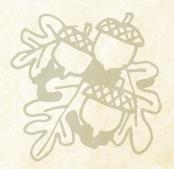

{85}------------------------------------------------

## Garget Someone

When you target a vulnerable foe at far range, roll with Finesse. On a hit, you inflict injury. On a 10+, you can strike again before they get to cover—inflict injury again—or keep your position hidden, your choice.

{86}------------------------------------------------

## Quick Shot

When you **fire a snap shot at an enemy at close range**, roll with Luck. On a hit, inflict injury. On a 7–9, choose 1. On a 10+, choose 2.

- you don't mark wear
- you don't mark exhaustion
- you move quickly and change your position (and, if you choose, range)
- you keep your target at bay—they don't move

{87}------------------------------------------------

## Garget Someone

When you target a vulnerable foe at far range, roll with Finesse. On a hit, you inflict injury. On a 10+, you can strike again before they get to cover—inflict injury again—or keep your position hidden, your choice.

{88}------------------------------------------------

## Trick Shot

When you **fire a clever shot designed to take advantage of the environment at any range**, mark wear and roll with Finesse. On a 7–9, choose 2. On a 10+, choose 3.

- your shot lands in any target of your choice within range, even if it's behind cover or hidden (inflicting injury or wear if appropriate)
- your shot strikes a second available target of your choice
- your shot cuts something, breaks something, or knocks something over, your choice
- your shot distracts an opponent and provides an opportunity

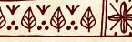

{89}------------------------------------------------

## Garget Someone

When you target a vulnerable foe at far range, roll with Finesse. On a hit, you inflict injury. On a 10+, you can strike again before they get to cover—inflict injury again—or keep your position hidden, your choice.

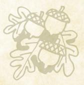