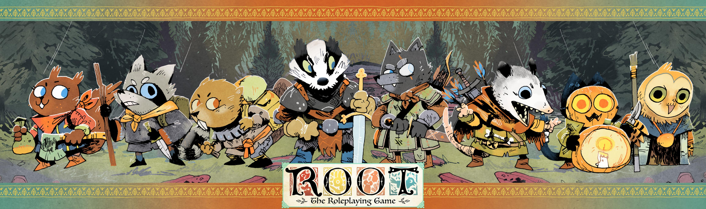

{0}------------------------------------------------

# npcs

| Name                      | I   | W   | Ε   | М   | Attack                                |
| ------------------------- | --- | --- | --- | --- | ------------------------------------- |
| Conscript/Average Denizen | 1   | 1   | 1   | 1   | Simple short sword: 1-injury          |
| Trained Soldier           | 2   | 2   | 1   | 2   | Longsword: 1-injury                   |
| Elite Soldier             | 2   | 2   | 2   | 3   | Morning star: 1-injury, 1-wear        |
| Huge Brute                | 3   | 3   | 2   | 2   | Giant hammer: 2-injury                |
| Political Leader          | 1   | 1   | 2   | 3   | Officer's blade: 1-injury             |
| Criminal                  | . 1 | 2   | 2   | 1   | Shortbow: 1-injury                    |
| Vagabond                  | 3   | 2   | 3   | 2   | Tricky weapon: 1-injury, 1-exhaustion |
| Bear                      | 5   | 2   | 5   | 4   | Massive claws: 3-injury, 1-wear       |

I=Injury, W=Wear, E=Exhaustion, M=Morale

### Random Character Traits Table

| 2d6 | 1            | 2               | 3          | 4           | 5            | 6          |
|-----|--------------|-----------------|------------|-------------|--------------|------------|
| 1   | Impostor     | Kind            | Peaceful   | Commanding  | Well-armed   | Ambitious  |
| 2   | Angry        | Young           | Innocent   | Foolhardy   | Manipulative | Suspicious |
| 3   | Impoverished | Prejudiced      | Hopeful    | Loyal       | Novice       | Cunning    |
| 4   | Gullible     | Expert          | Rebellious | Cynical     | Humble       | Bejeweled  |
| 5   | Honorable    | Straightforward | Brave      | Deceitful   | Scarred      | Hateful    |
| 6   | Greedy       | Strange         | Committed  | Belligerent | Friendly     | Secretive  |

# Groups of NPCs as mobs

| group size             | mob type   | harm boxes               | attack               |
|------------------------|------------|--------------------------|----------------------|
| 5-10 average denizens  | small mob  | +2 to average harm track | deals x2 normal harm |
| 11-20 average denizens | medium mob | +4 to average harm track | deals x3 normal harm |
| 21+ average denizens   | large mob  | +6 to average harm track | deals x4 normal harm |

## Dames

Aimee • Alvin • Alvse • Anders • Avlius • Balil • Bhea • Billi • Braden • Buford • Cesspyr Cinder • Cloak • Constance • Cugel • Dagmund • Dawna • Dewly • Doneel • Dugan Gemma • Golden • Greta • Gustav • Harper • Helma • Henny • Hinnic • Howerd Igrin • Ilso • Inda • Iovan • Irwen • Jacly • Jasper • Jinx • Johann • Jorild • Kalid • Keilee Kagan • Keera • Konnor • Laina • Lindyn • Lockler • Longtooth • Luciana • Magnhild Masgood • Mint • Monca • Murty • Nail • Nan • Neeya • Nigel • Nomi • Olaga • Omin Orry • Otho • Oxley • Painda • Pattee • Phona • Pintin • Prewitt • Quay • Quentin Tammora • Thickfur • Timber • Tondric • Ulveny • Ulvid • Ummery • Urma • Vance Vennic • Vittora • Vost • Wanda • Wettlecress • Whickam • Woodleaf • Xander • Xara Xeelie • Xim • Yasmin • Yates • Yolenda • Yotterie • Zachrie • Zain • Zinat • Zoic • Zola

### Species

badger • bat • beaver • bluejay • cardinal • cat • crow • fox • hawk • lizard • mole mouse • opossum • otter • owl • rabbit • raccoon • sparrow • squirrel • vulture • wolf

| Tag         | Effect                                                                                                                                                         |
|-------------|----------------------------------------------------------------------------------------------------------------------------------------------------------------|
| Arrow-proof | Ignore the first hit dealing injury from arrows that you suffer in a scene.                                                                                     |
| Blunted     | This weapon inflicts exhaustion, not injury.                                                                                                                   |
| Ceremonial  | Choose an attached faction. While this item is displayed, tre yourself as having +1 Reputation with that faction, and -1 Reputation with other factions. |
| Comfortable | This item counts as 1 fewer Load.                                                                                                                              |
| Eaglecraft  | Mark wear when engaging in melee to both make and suffer another exchange of harm.                                                                             |
| Fast        | Mark wear when engaging in melee to suffer 1 fewer harm, even on a miss.                                                                                       |
| Friendly    | When you meet someone important, mark exhaustion to ro with your Reputation +1.                                                                                |
|             |                                                                                                                                                                |

|           |              |            | - " |
|-----------|--------------|------------|-----|
| 4         | 5            | 6          |     |
| ommanding | Well-armed   | Ambitious  | FI  |
| Foolhardy | Manipulative | Suspicious | F   |
| Loyal     | Novice       | Cunning    | Н   |
| Cynical   | Humble       | Bejeweled  |     |
| Deceitful | Scarred      | Hateful    | In  |
| D III .   | "            |            |     |

| group size             | mob type   | harm boxes               | attack               |
|------------------------|------------|--------------------------|----------------------|
| 5-10 average denizens  | small mob  | +2 to average harm track | deals x2 normal harm |
| 11-20 average denizens | medium mob | +4 to average harm track | deals x3 normal harm |
| 21+ average denizens   | large mob  | +6 to average harm track | deals x4 normal harm |

Echo • Ellaine • Emmie • Ewan • Eward • Faye • Flannera • Fog • Foster • Frink • Gamila Quill • Quinella • Ramus • Reece • Rhodia • Roric • Rose • Sarra • Selwin • Sorin • Stasee

| Equipment Tags |                                                                                                                                                            |  |  |
|---------------|------------------------------------------------------------------------------------------------------------------------------------------------------------|--|--|
| Tag           | Effect                                                                                                                                                     |  |  |
| Arrow-proof   | Ignore the first hit dealing injury from arrows that you suffer in a scene.                                                                                |  |  |
| Blunted       | This weapon inflicts exhaustion, not injury.                                                                                                               |  |  |
| Ceremonial    | Choose an attached faction. While this item is displayed, treat yourself as having +1 Reputation with that faction, and -1 Reputation with other factions. |  |  |
| Comfortable   | This item counts as 1 fewer Load.                                                                                                                          |  |  |
| Eaglecraft    | Mark wear when engaging in melee to both make and suffer another exchange of harm.                                                                         |  |  |
| Fast          | Mark wear when engaging in melee to suffer 1 fewer harm, even on a miss.                                                                                   |  |  |
| Friendly      | When you meet someone important, mark exhaustion to roll with your Reputation +1.                                                                          |  |  |
| exible        | When you grapple with someone, mark exhaustion to ignore the first choice they make.                                                                       |  |  |
| xfolk steel   | Ignore the first box of wear you mark on this item each session.                                                                                           |  |  |
| eavy bludgeon | Mark exhaustion to ignore your enemy's armor when you inflict harm.                                                                                        |  |  |
| Iron bolts    | This weapon inflicts 1 additional wear when its harm is absorbed by armor.                                                                                 |  |  |
| arge          | Mark exhaustion when inflicting harm with this weapon to                                                                                                   |  |  |

# inflict 1 additional harm. After creation, this item is worth +3-Value. Luxury Mousefolk steel Mark wear to engage in melee using Cunning instead of Might. Ouick Mark exhaustion to engage in melee with Finesse instead of Might. Rabbitfolk steel Mark wear to engage in melee with Finesse instead of Might. When you engage in melee, mark wear on this weapon to inflict harm instead of trading harm; you cannot use this tag if your enemy's weapon also has reach. Mark wear when inflicting harm with this weapon to inflict 1 additional harm. When you take a few seconds to repair this armor after a fight, Tightly woven

clear 1-wear you marked during the fight.

1-exhaustion when you take it off.

This item counts as 1 additional Load.

item. Mark exhaustion to hide it.

threat than other vagabonds with arms and armor.

Mark 1-exhaustion when you don your armor—clear

fewer option. Mark wear to ignore this effect.

When you engage in melee with this weapon, choose one

Take -1 to meet someone important while they can see this

Until you harm an enemy, they will never deem you more of a

Unassuming

Cumbersome

More tags in the core book on page 186

Slow

Weighty

## Agendas

- Make the Woodland seem large, alive, and real
- Make the vagabonds' lives adventurous and important
- Play to find out what happens

## Principles

Reputation

+2

Actions Reputation Effect

- Describe the world like a living painting.
- Address yourself to the characters, not the players.
- Be a fan of the vagabonds.
- Make your move but misdirect.
- Sometimes, disclaim decision-making.
- Make the factions and their reach a constant presence.
- Give denizens drives and fears.
- Follow the ripples of every major action. • Call upon their station and reputation.
- Bring danger to seemingly safe settings.

being a real enemy.

Reputation Awards & Penalties

Extraordinary service: Rescue a leader, deliver crucial goods

Minor injury: Interfere with a leader's plan, harm minor figure

Real opposition: Stop a leader's plan, substantially support foes

Average service: Deliver valuable goods, protect faction resources

Minor service: Do a small favor for a leader, deliver minor goods or items

Minor infraction: Meaningfully or publically slight a leader, misdemeanors

Legendary service: Deliver the leader of or destroy an enemy faction

### GM Moves

- Inflict injury, exhaustion, wear, depletion, or morale (as established).
- Reveal an unwelcome truth.
- Show signs of an approaching threat. Capture someone.
- Put someone in a spot.

Legendary - You are a hero of the faction, about whom positive stories (some true, some false) are

Esteemed - You are an honored figure of the faction, whose deeds are recognized.

Respected - You are treated with politeness and valued by members of the faction.

Disdained - You are disliked by the faction, treated with mild contempt and derision.

Reviled - You are deeply scorned by the faction, viewed as a real problem two steps away from

Feared or Hated - You are a foe to the faction, seen with a combination of deep fear and deep hatred.

Unknown or Ambivalent - You are either unknown to the faction, or the faction

lacks a clear and consistent view of your actions and character

Heroic service: Deliver unique/priceless items, deliver a clearing without support 7-8 prestige

Praiseworthy service: Enact a leader's plan successfully, protect faction agents 3-4 prestige

**Grave infraction:** Fight many guards or soldiers, openly destroy crucial resources 5-6 notoriety

Critical opposition: Steal a unique/priceless item, take away control of a clearing 7-8 notoriety

**Unforgivable offense:** Slav the leader of the faction, massively injure faction aims 9+ notoriety

- Disrupt someone's plans and schemes. Make them an offer to get their way.
- Show them what a faction thinks of them.
- Turn their move back on them.
- Activate a downside of their background. reputation, or equipment.

After every move, "what do you do?"

Reputation Effect

9+ prestige

5-6 prestige

2 prestige

1 prestige

1 notoriety

2 notoriety

3-4 notoriety

# Basic Moves Griggers

| Trigger                                   | Roll    |
|-------------------------------------------|---------|
| Attempt a roguish feat you are skilled in | Finesse |
| Try to figure someone out                 | Charm   |
| Persuade an NPC with promises or threats  | Charm   |
| Read a tense situation                    | Cunning |
| Trick an NPC to get what you want         | Cunning |
| Trust fate to get through trouble         | Luck    |
| Wreck something                           | Might   |
| Help or interfere with another Vagabond   | Stat La |
| Plead with another Vagabond               |         |

## Travel Moves

### Gravel Along the Path

When you travel from clearing to clearing along the path, the

- at a relaxing pace; everyone clears 3-exhaustion; the band
- at an average pace: everyone clears 2-exhaustion; the band
- 1-depletion for supplies: +1 to the roll.
- urgently fast: everyone marks exhaustion; +2 to the roll. On a hit, you reach the next clearing in a timely fashion. On a 10+, the trip is uninterrupted and quick. On a 7-9, you encounter something noteworthy on the path—a caravan, a battleground, or something else odd passing through. On a miss, you are caught in the middle of a dangerous situation before you arrive at the next clearing.

### Gravel Chrough the Forest

- carefully, avoiding trouble: the band collectively marks one
- as quickly as possible: everyone marks exhaustion and depletion;

On a hit, you pass through the forest to any clearing on the other side. Along the way, one of you spots an interesting site; you leave markers so you can return after you finish your trip. On a 10+, the transit is largely safe. On a 7-9, something from the forest is following you; you can let it track you, or every vagabond marks exhaustion to lose it. On a miss, you run afoul of one of the forest's dangers during the trip, and you can't escape it easily; deal with it before you can reach the clearing on the other side.

# band collectively decides how it travels and one member rolls:

- collectively marks a total of 2-depletion; -I to the roll.
- collectively marks 1-depletion; +0 to the roll.
- safely, quickly, and under the radar; the band collectively marks

## When you travel from clearing to clearing through the forest,

- the band collectively decides how it travels and one member rolls: • slowly, foraging heavily: everyone clears 2-depletion; the band collectively marks an exhaustion for each band member; -I to
- depletion or exhaustion for each band member; +1 to the roll.
- +2 to the roll.

Weapon Moves Triggers

| Name | Trained Only | Trigger | Cost | Roll |
|------------------|----------------------------------|-------------------------------------------------------------------------------|-----------------------|---------|
| Engage in Melee  |                                  | engage an enemy in melee at close or intimate range                           |                       | Might   |
| Grapple an Enemy |                                  | grapple with an enemy at intimate range                                       |                       | Might   |
| Target Someone   |                                  | target a vulnerable foe at far range                                          |                       | Finesse |
| Cleave           |                                  | cleave armored foes at close range                                            |                       | Finesse |
| Confuse Senses   |                                  | throw something to confuse an opponent's senses at close or intimate range    | mark exhaustion       | Might   |
| Disarm           | •                                | target an opponent's weapon with your strikes at close range                  |                       | Finesse |
| Harry a Group    |                                  | harry a group of enemies at far range                                         | mark wear             | Cunning |
| Improvise Weapon | •                                | make a weapon out of improvised materials around you                          |                       | Cunning |
| Parry            |                                  | try to parry the attacks of an enemy at close range                           | mark exhaustion       | Finesse |
| Quick Shot       | •                                | fire a snap shot at an enemy at close range                                   | And the second        | Luck    |
| Storm a Group    | •                                | storm a group of foes in melee                                                |                       |         |
| Trick Shot       | •                                | fire a clever shot designed to take advantage of the environment at any range | mark wear on your bow | Finesse |
| Vicious Strike   | <b>3. 1. 1. 1. 1. 1. 1. 1. 1</b> | viciously strike an opponent where they are weak at intimate or close range   | mark exhaustion       | Might   |

# Roquish Feats

| Feat Name       | Description                                   | Risks                                                       |  |
|-----------------|-----------------------------------------------|-------------------------------------------------------------|--|
| Acrobatics      | Adeptly climbing, vaulting, jumping.          | Break something, detection, plunge into danger              |  |
|                 |                                               | Draw unwanted attention, leave evidence, plunge into danger |  |
| Counterfeit     | Copying, forgery, fakery.                     | Leave evidence, take too long, weak result                  |  |
| Disable Device  | Disarming traps, turning off mechanisms.      | Break something, draw unwanted attention, expend resources  |  |
| Hide            | Disappear from view, remain hidden.           | Expend resources, leave evidence, take too long             |  |
| Pick lock       | Open a locked door, chest, etc.               | Break something, detection, plunge into danger              |  |
| Pick pocket     | Subtly steal from a pocket.                   | Leave evidence, take too long, weak result                  |  |
| Sleight of Hand | Palming, switching, ditching, flourishes.     | Draw unwanted attention, leave evidence, weak result        |  |
| Sneak           | Get into or out of places without being seen. | Break something, draw unwanted attention, plunge            |  |

# Random Valuable Items Table

| 2d6 | 1                         | 2                       | 3                      | 4                       | 5                          | 6                      |
|-----|---------------------------|-------------------------|------------------------|-------------------------|----------------------------|------------------------|
| 1   | Secret military plans     | Glass case of rare bees | Ancient wooden tome | Flask of rare poison | Beautiful glass marbles | Cask of amber wine     |
| 2   | Signet ring               | Telescope               | Abacus                 | Box of snuff            | Ornate shield              | Rare spices            |
| 3   | Ruby brooch               | Huge chalice            | Wall clock             | Stone stylus            | Satchel of coin            | Compass                |
| 4   | Illuminated manuscript | Handcrafted game set    | Waxen writing tablet   | Miniature automaton  | Etched ritual dagger    | Fine leafleather boots |
| 5   | Elegant clothing          | Rare liqueur            | Bronzed flower         | Glowstones              | Silver chain belt          | Ensigiled cape         |
| 6   | Silverhead cane           | Gold glasses            | Brass locket           | Steel bracers           | Jeweled eye                | Pearl necklace         |

# Risks Definitions

### BREAK SOMETHING

Break something you're carrying or in the environment. Possibly mark wear.

### DETECTION

Straight up get noticed by onlooker.

# DRAW UNWANTED ATTENTION

Either create hostile onlookers where before no one cared, or call attention without actually being detected.

### EXPEND RESOURCES

Use up supplies. Mark depletion or exhaustion as the GM chooses.

### LEAVE EVIDENCE

Leave behind evidence that can later lead an investigation against you or expose your allies to

### PLUNGE INTO DANGER

Seize the chance to act and run into a more dangerous situation.

## TAKE TOO LONG

Take too much time, leading the situation to change around you in some meaningful way.

## WEAK RESULT

Get a hard choice about exactly what you want, or just straight up don't quite get everything you want.

Root" and Leder Games" logo and key art TM & © 2017 Leder Games, Text and design TM & © 2021 Maggie Games, All rights reserved.

{1}------------------------------------------------

