{0}------------------------------------------------

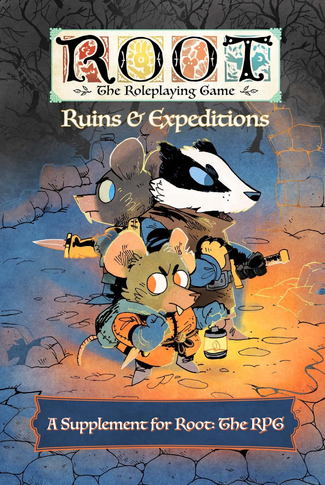

{1}------------------------------------------------

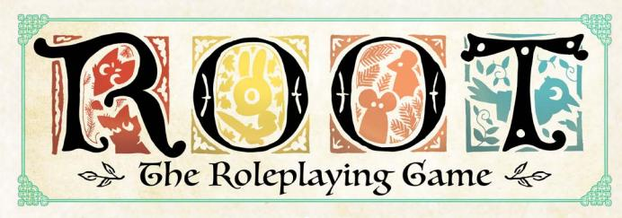

# Ruins & Expeditions

Design: Elizabeth Chaipraditkul, Brendan Conway, Coyote Crow, Mark Diaz Truman, Karington Hess, Monte Lin, and Alexi Sargeant

Writing: David Castro, Elizabeth Chaipraditkul, Brendan Conway, Coyote Crow, Mark Diaz Truman, Sasha Goldstein, and Monte Lin

Developmental Editing: Elizabeth Chaipraditkul, Brendan Conway, and Mark Diaz Truman

Copy Editing: Kate Unrau

Layout: Miguel Ángel Espinoza & Elizabeth Chaipraditkul

Additional Layout: Mark Diaz Truman

Art: Kyle Ferrin

Art Direction: Marissa Kelly

Proofreading: Katherine Fackrell

Root Board Game Design: Cole Wehrle

Root Board Game Graphic Design & Layout: Cole Wehrle, Kyle Ferrin, Nick Brachmann, and Jaime Willems

Root Board Game Concept: Patrick Leder

Root: The Roleplaying Game text and design @ 2019-2025 Magpie Games. All rights reserved. Root: A Game of Woodland Right and Might @ 2025 Leder Games. All rights reserved. Leder Games logo and Root art TM & @ 2017-2025. All rights reserved.

Special thanks to Meguey and Vincent Baker for creating Apocalypse World, the Leder Games team for allowing us to play in their brilliant world, and the more than 4,000 Kickstarter backers who made this book possible. We are humbled by your collective encouragement and support.

{2}------------------------------------------------

# Table of Contents

| Ruins & Expeditions1                    |
|-----------------------------------------|
| Greetings, brave explorer! 3         |
| New Factions5                           |
| The Hundreds6                           |
| The Keepers in Iron11                   |
| Revised Woodland Setup15                |
| Faction Phase:                          |
| The Hundreds 20                      |
| Faction Phase:                          |
| Keepers in Iron25                       |
| New Moves  29                     |
| & Skills  29                      |
| New Weapon Skills30                     |
| New Reputation Moves  33          |
| New Drives38                            |
| New Natures 40                       |
| New Connections 42                   |
| New Species Moves45                     |
| New Species Abilities 49             |
| New Equipment  51                 |
| New Tags 53                          |
| New Pre-Made Equipment58                |
| New Playbooks 65                     |
| The Dealer67                            |
| The Gourmand73                          |
| The Hunter77                            |
| The Nomad 81                         |
| The Orphan85                            |
| The Scourge  89                   |
| Beneath the Surface93                   |
| Ruins & Relics 97                    |
| The Ancients 98                      |
| Adding Existing Ruins to the Map 101 |
| Discovering New Ruins101                |
| Diving Deep Into the Ruins104           |
| Creating the Ruins109                   |
| Random Ruin Generation111               |
| Random Ruin                             |
| Layout Generation112                    |
| Portraying the Ruins113                 |
| Relics115                               |

| Monsters of                 |     |
|-----------------------------|-----|
| the Woodland121             |     |
| Creating Monsters144        |     |
|                             |     |
| Clearings of                |     |
| the Woodlands147            |     |
| Longbarrow Crag             | 149 |
| Description149              |     |
| Conflicts150                |     |
| Important Residents155      |     |
| Important Locations160      |     |
| Special Rules               | 161 |
| Introducing the Clearing162 |     |
| Pricklegrass Marsh          | 164 |
| Description164              |     |
| Conflicts165                |     |
| Important Residents170      |     |
| Important Locations         | 175 |
| Special Rules176            |     |
| Introducing the Clearing178 |     |
| Ricklebell Falls180         |     |
| Description180              |     |
| Conflicts181                |     |
| Important Residents186      |     |
| Important Locations190      |     |
| Special Rules               | 191 |
| Introducing the Clearing    | 191 |

{3}------------------------------------------------

# Greetings, brave explorer!

Ruins & Expeditions is the second supplement for Root: The RPG, a pen-andpaper tabletop roleplaying game based on Root: A Woodland Game of Might and Right, a board game designed by Cole Wehrle and featuring art from Kyle Ferrin. In Root: The RPG, you and your friends take on the role of vagabonds, rogues of the Woodland who act as something between knaves and heroes as they travel from clearing to clearing taking on jobs to make ends meet.

In this new supplement, you'll find a radical expansion to the world of Root new factions, new mechanics, new character types, and brand new rules for exploring the ruins all over the Woodland. In addition, you'll also find rules for introducing monsters to your game of Root: The RPG, enormous beasts that pose a threat to even the toughest vagabond.

You do need to know how to play Root: The RPG to make use of this book! In fact, you'll need a copy of both the Root: The RPG core book and the first supplement, Travelers & Outsiders, to make full use of this book in your game. 

{4}------------------------------------------------

Here's what you can find in Ruins & Expeditions:

- New Factions (Chapter I) adds two new expansion factions—the Hundreds and the Keepers in Iron—from the Marauders expansion for ROOT: A WOODLAND GAME OF MIGHT AND RIGHT, including descriptions of the faction as both a background faction and an intervening conquering faction in the War. In addition, this chapter also gives you tools to integrate both of the new factions into the faction phase.
- New Moves & Skills (Chapter 2) expands your game by introducing new weapon skills, reputation moves, drives, natures, connections, and species moves. All of these mechanics are easy to introduce to your game, building on existing systems to give your players new options!
- New Equipment (Chapter 3) offers dozens of new tags alongside new pre-made weapons, armor, and other gear. All of these tags (and equipment) are easy to integrate into an existing campaign, allowing players to have lots of options for making their new equipment great.
- New Playbooks (Chapter 4) adds six new playbooks to Root: The RPG including the Dealer, the Hunter, the Orphan, and more. Each of the playbooks comes with a full set of mechanics alongside instructions for how best to play the playbook, notes on each playbook's moves, and GM advice for how to support the playbook during play.
- Ruins & Relics (Chapter 5) expands the rules for including ruins in Root: The RPG, including mechanics for adding ruins to the map, discovering new ruins, and exploring the ruins in greater detail than ever before! In addition, this chapter also includes the history of the Ancients, the mysterious culture—now vanished—that originally built many of the ruins found dotting the Woodland. Finally, this chapter also gives rules for relics, the unique items of the Ancients.
- Monsters of the Woodland (Chapter 6) adds giant beasts to Root: The RPG, titanic threats that offer even the toughest vagabonds a real fight. The chapter includes ten fully illustrated monsters that can be included in any campaign, as well as specific rules for creating your own monsters, including special monster traits and instincts to bring them to life in your game!
- Clearings of the Woodland (Chapter 7) features three new clearings focused on the new expansion factions, the ruins, and monsters—
   Longbarrow Crag, Pricklegrass Marsh, and Ricklebell Falls. These clearings offer unique opportunities to pit vagabonds against incredible ruins, dangerous monsters, and both the Hundreds and Keepers in Iron!

Finally, you can find the playbooks and other Root: The RPG materials for print at www.magpiegames.com/root. Enjoy your time in the Woodland!

{5}------------------------------------------------

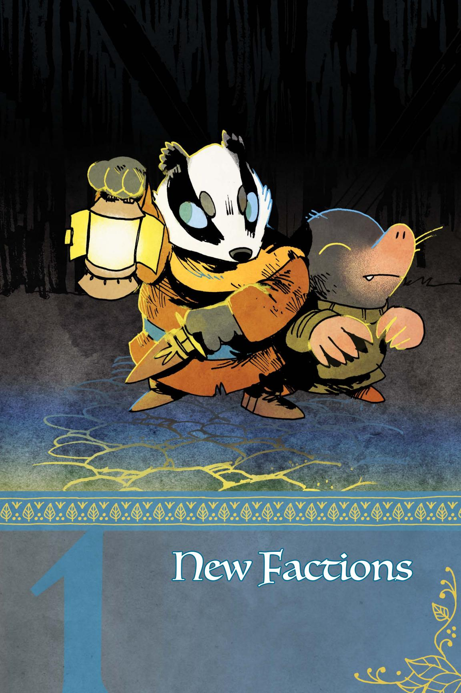

{6}------------------------------------------------

5.22

he many factions of the Woodland War covered in Root: The RPG and Travelers & Outsiders are not the only factions one might find in the Woodland. While the traditional struggle

between the Marquisate, Eyrie Dynasties, and Woodland Alliance might dominate most tales of the Woodland War, your version of the conflict can include any combination of factions—even a combination that contains none of the factions found in the core book. This chapter offers two new factions and gives guidelines for including them in existing games and new games alike!

The **Hundreds** are a mob of angry discontents, led by a terrible demagogue—the Lord of the Hundreds—against the established (or remaining) powers of the Woodland. The Keepers in Iron are a noble order of knights, committed to discovering and securing relics they find scattered across the Woodland in the dark forests and deep ruins.

This chapter offers instructions for adding both factions to the Woodland map, then expands the faction roll (Root: The RPG, page 240) to include them and their various actions. For Gamemasters using the more complex faction phase system found in Travelers and Outsiders (page 184), this chapter also contains information on how both the Hundreds and the Keepers in Iron take actions during the faction phase.

Both the Hundreds and the Keepers in Iron are wonderful factions to add during play, reflections of how the Woodland might change as the conflict develops. In the event that you decide to add them after you've already begun play, you can still use the setup instructions to add their buildings and forces to your map of the Woodland.

# The Nundreds

A terrifying mob of true believers, con artists, and opportunists, the Hundreds are a faction dedicated to the vision of a single demagogue—the Lord of the Hundreds. Calling upon all of the downtrodden and dispossessed of the Woodland, the Lord of the Hundreds has inspired a horde of denizens in the pursuit of "justice" against the other factions of the Woodland War. Some of the Hundreds might truly believe in that cause, but many understand "justice" to be a thin veneer that gives them cover to claim that the movement has some other goal than simply the accumulation of power. The Hundreds are thus a strange faction: they have almost no internal structure, no goals beyond pillaging and burning, and no clear ideology beyond power for power's sake.

{7}------------------------------------------------

#### The Hundreds in the Background

The first signs of the Hundreds in the Woodland were little more than whispers, rumors of a charismatic rat who was recruiting denizens with promises of "freedom" and "liberation" from the suffering of the War. Those who listened closely to the murmurings of discontent deserters and the tall tales of lonely bandits would inevitably come across such stories, all claiming that the rat was a uniquely gifted orator and leader, a balm for what ailed the Woodland and its endless War.

Was this rat a skilled con artist? A delusional dreamer? No one seemed to know. But those who claimed to have met the self-proclaimed "Lord of the Hundreds" said that the rat was alternately grandiose and bitter, winning over the crowd in one moment with fantastical promises…then stirring their worst hatreds in the next with obvious lies.

But no one knew where to find this rat. Or their name. This "Lord" remained a mystery, a shadow no one could quite pin down who led a movement that didn't exist.

And yet…roving bands of brigands began to wear a red rat insignia—the supposed sign of the Hundreds—and claimed to "serve a savior who will rise to free the Woodland" from the terrible injustice of the War. Worse yet, denizens driven out of clearings by the War began to paint the red rat in their refugee camps and shantytowns, telling all who would listen about "the true voice of the Woodland" who will one day punish the wicked. The movement had arrived… even if the rat himself continued to remain a mystery.

For most denizens, the Hundreds they meet appear as wild evangelists, followers of a dangerous demagogue who has enlisted ordinary denizens into a foolish cult that compels them to shout loudly about injustices. That said, the Lord's message is surprisingly influential; a fair number of denizens have packed their bags and set off to the Lord's new clearing to serve the Hundreds, moved to give up everything by the simplicity of the Lord's promise—the powers-that-be will suffer for what they have done to the Woodland.

In a strange twist, vagabonds who make a living seeking out artifacts and relics from unexplored ruins sometimes report running into poorly equipped members of the Hundreds who end up stranded or lost while looking for treasures they think will endear them to their new Lord. These mad expeditions can sometimes reach far away from the Hundreds' limited center of power, as denizens caught up in the fervor of an idea they barely understand latch onto a dangerous dream. Yet, even they don't know exactly where to find the Lord even if they did manage to get their hands on a relic worthy of his attention.

Chapter 1: New Factions 7

{8}------------------------------------------------

#### The Hundreds in the Woodland War

As mysterious as the Hundreds were when they first appeared in the Woodland, there is nothing subtle about their presence once the Lord of the Hundreds openly declares war against the other factions. The brigand bands that once wore insignias with unclear meaning, the dispossessed refugees drawn to the Lord's promises, the deserters and traitors who have nowhere else to go—all of them take up arms and throw themselves into marauding across the Woodland, overtaking nearby clearings and clashing with the other factions.

The Lord of the Hundreds rose up in just one clearing, easily driving out the controlling faction at the head of a mob that seemed to emerge from nowhere and declaring it to be a new day for the Woodland, an opportunity to reject the mistakes that had led to so much tragedy and suffering. According to the Lord, all those who wished to seek peace ought to join the Hundreds and together they would shatter their bondage and win a true freedom from the tyranny of selfish factions.

To show the Lord's power, all of the valuables in the clearing were gathered up and placed together, a Hoard that marked the Hundreds' collective influence and wealth. The Lord graciously accepted responsibility for the Hoard, ordering the Hundreds to seek out more valuables which could be added to it to inspire the denizens of the Woodland. "The time had come," the Lord said, "for those with power to fear those who have none." And so the horde set out to conquer all there was to conquer in the name of justice, freedom, and their Lord.

The Hundreds aren't a particularly organized or trained force—a few of them might have some military training or experience, but even they are unlikely to hold authority enough to manage the risen mass of denizens. What the Hundreds lack in skill they make up for in numbers and recklessness, throwing themselves against the barricades and garrisons of their targeted clearings until those defenses crumble under the sheer weight of the attack. Their fervor for their cause and dedication to their Lord make them a dangerous foe, willing to withstand losses that would force many dedicated military units of the Woodland War to retreat! Any who fall become new cause for retribution, spurring their fellows on even further…

Once a clearing has submitted (and the retreating faction has been purged), the Hundreds waste little time in pillaging anything they can find of value, taking gold, equipment, and other materials back to the Hoard, hoping to raise their status in the Hundreds by impressing their dear leader with the most precious trinkets and the most impressive artifacts. In just a few short days, anything worth adding to the Hoard is stripped and removed…and the Hundreds begin to look for the next clearing that could be conquered in the name of "freeing" the Woodland.

{9}------------------------------------------------

For the ordinary denizens who live in a "liberated" clearing, the initial raids are merely the beginning of their suffering. Once the Hundreds have their hands on a clearing, they actively oppress the denizens who live there, demanding more tribute and service to the Hundreds' cause. Most denizens already sympathetic to the cause of the Hundreds leave to join the mob long before the attack; those who are left bear no strong ties to the Hundreds' retributive drive, but fear and oppression are strong motivators. The conquered denizens willing to throw their lot in with the Hundreds—joining the mob in oppressing their neighbors and friends—are rewarded, and those who resist are either driven out, broken, or executed. Before long, the only unaligned denizens who remain in a clearing controlled by the Hundreds are those who are too impoverished, desperate, or foolish to get out.

Control of conquered clearings is largely overseen by those who have earned some degree of status with the Lord of the Hundreds—sycophants, true believers, and grifters who have convinced the Lord that they can be trusted to bring back the finest treasures to the Hoard. The Lord often grants these cronies with grandiose titles: "Liberator," "High Secretary," "Grand General," and so on. These "friends" of the Lord fight amongst themselves as often as they fight against the Hundreds' foes, constantly trying to position themselves as the most loyal… but often finding themselves expelled or executed when the Lord decides they might be a threat to his power.

# Strongholds

Over time, the clearings held by the Hundreds undergo a radical transformation; they cease to be ordinary towns and villages filled with the politics common to the Woodland and instead become a reflection of the Hundreds' intolerance and rigidity. Dissent is extinguished. Disloyalty is punished. Those who are able to leave try to escape to other clearings, and those who can't get out are forced to become complicit…or give up hope. Either way, the "freedom" promised by the Lord of the Hundreds never arrives.

The moronic lackeys and cruel scammers who are often put in charge of such clearings are usually pleased by the conformity and social collapse. After all, it's far easier to control a clearing that has no capacity for disagreement than one filled with raucous politics. Unopposed by any rival power structure, the leaders quickly impose huge "taxes" on anything brought into the clearing, round up and expel anyone they deem suspicious, and shut down every municipal service that doesn't help them keep control. Anyone who isn't serving the Hundreds has to struggle to stay on their feet.

{10}------------------------------------------------

The Hundreds call these oppressed clearings strongholds, an irony completely lost on them even as these clearings suffer in the face of chaotic food shortages and shrinking populations. While other factions might want to defend a clearing with strong walls and active garrisons, the Hundreds prefer their strongholds to be defended with rigorous social control, even if it means the clearing itself is greatly weakened. Often, other factions won't even try to take a stronghold; why bother conquering a starved clearing filled with nothing but true believers?

That said, the rabid devotion and despairing submission found in every stronghold is a hotbed for recruitment. Those denizens who stay tend to be actively supporting the Hundreds' cause, cowed into compliance, or benefiting through some other illicit method.

Whatever the case may be, these desperate souls are easily swayed into joining the Hundreds' larger forces. The leaders of strongholds are always looking for new loyalists, and often use the scarcities the strongholds face as opportunities to unite new forces to serve the cause, such as sending bands of Hundreds to steal the resources needed from other clearings. After all, nothing unites a mob like a target that can be blamed for their problems.

Despite all these challenges, the strongholds of the Hundreds are the center of the faction's political and social life. Most denizens who join the Hundreds live in and around strongholds, eager to be close to their brethren.

The Lord of the Hundreds, despite claiming to be a mighty warrior, is rarely found outside these strongholds. If a new Lord need be anointed, they would rise from one of the most established strongholds in the Woodland. In fact, it might have already happened; the individual bearing the title of Lord of the Hundreds is now practically yoked to the same forces he wielded, and he can be replaced with a new figurehead relatively easily if need be. His death would simply be more fodder for outrage.

{11}------------------------------------------------

# The Keepers in Iron

The Keepers in Iron are a stunning sight throughout the Woodland, wandering templars in ornate and magnificent armor seeking rare relics from an ancient age. Devoted to uncovering precious artifacts—primarily fragile figurines, mysterious tablets, and fantastic jewelry—the Keepers must delve deep in the darkest and most dangerous areas of the forest, discovering the ruins yet untouched by the denizens and their clearings (or diving deep into the ruins already known) in order to locate these lost relics. That said, lone knights who venture into the forest often don't return. It's not unusual for a Keeper knight to depart a clearing with a lead on a relic—and supplies for the trip—and never be seen again. The dangers of the deep forest and undiscovered ruins are great, and sometimes no amount of devotion to their cause can protect the Keepers from those lethal hazards. That said, there are few foes more formidable than an old Keeper in Iron, a survivor of multiple delves and expeditions.

# The Keepers in Iron in the Background

Denizens and vagabonds who grow close to the Keepers hear tales of "the Expulsion," a decree once laid down, ages upon ages ago, by the Woodland's then-powers-that-be that banished the Keepers in Iron from the Woodland, forcing them to wander for many years before finally returning. The disagreement that sparked the Expulsion is unclear—the Keepers' own records are vague at best—but nearly everyone agrees the Keepers were once a noble order serving the Woodland's political elites…only to find themselves betrayed by those very leaders when the Keepers' power and authority grew too great. To this day, it is rare for any Keeper to trust political elites—the memory of the Expulsion may have faded, but the betrayal itself feels like a fresh wound.

Since the start of the War, the Keepers, always reluctant to return to the Woodlands en masse, have begun to send a few of their order to see what can be learned about the relics they once protected. These lone knights must do their best to recover the artifacts they seek with limited resources—they lack the large retinue and reliable support that would be available if the Keepers moved into the Woodland as an order. Sometimes knights end up recruiting a group of vagabonds to accompany them as they delve into the forest, seeking new ruins to explore alongside the only other Woodland residents—the vagabonds—who can tackle the challenges of the forest itself; other times that means working on behalf of other factions—setting aside their distrust of elites and almost becoming vagabonds themselves—in order to supply and fund their arboreal ventures.

{12}------------------------------------------------

While some denizens view the Keepers as little more than mercenaries—soldiers of fortune working for the Woodland's warring factions in exchange for supplies and resources without much regard for the shifting political landscape of the larger war—those who get to know them are often struck by the intensity of the Keepers' reverence for the faction's larger goal…and for the relics themselves. The Keepers' mission isn't overtly fueled by a specific religious cause, but the passion with which they devote themselves to retrieving and safeguarding what is left of the ancient Woodland is one of their greatest strengths.

Many of the Keepers are badgers clad in the bulky armor for which the Keepers are famous, but their cause is open to any who would swear an oath to their order and undertake their charge. Of course, any denizen who takes up the Keepers' banner should expect to find arms and armor suitable to the difficult job of delving into the Woodland's forests to find the precious relics the Keepers seek.

# The Keepers in the Woodland War

Lone knights usually have little influence on the Woodland War…but the Keepers, as an order, can have a much greater impact. The full presence of the Keepers in Iron in the Woodland means they can hold clearings, win battles, and attract a large retinue of denizens loyal to their cause. Suddenly, the Keepers are more than knights-errant seeking individual relics; they are an inspiring force to which many denizens can devote their lives, even those who can only offer support as craftspeople, cooks, weavers, or cobblers. They become a faction to be reckoned with, one that could seize control of the whole of the Woodland and win the War.

In order to facilitate the work of so many denizens, the Keepers establish waystations in key clearings, temporary encampments that aid in the work of discovering, cataloging, and preparing the relics the knights seek through their delves. Unlike the workshops of the Marquisate or the bases of the Woodland Alliance, these waystations are kept mobile; the Keepers can break them down and move them to a new location, directing their retinue of loyal denizens wherever they need to go to best support the most important delves.

Structurally, the Keepers divide their forces into three groups: martial knights, commander knights, and sergeant knights. Martial knights are those who lead the Keepers' loyal forces, both into battle against the other factions and into the forest on delves. Commander knights are the administrators and leaders who are most often found directing the Keepers' work at the waystations. Sergeant knights are those who have fully joined the order, but more as support staff or ordinary soldiers; some rise to the level of banner knights, but such a promotion is rare. Alongside these knights serve a host of pages and squires, applicants to the order who have not yet been accepted as full knights themselves.

{13}------------------------------------------------

The shift from a loose collection of individual knights to an order waging war against the other factions of the Woodland War has a larger implication for the Keepers' work—at some point, the relics begin to matter less than the control the Keepers want to wield over the Woodland's clearings. Winning the Woodland War becomes a goal unto itself, and merely obtaining relics and sending them home isn't enough. The relics themselves are still deeply important—they motivate and focus the Keepers' work in the Woodland—but fighting a war means devoting the order to winning that War.

The Keepers own leadership caste doesn't agree on which reasons are dominant. Some claim that winning the war for the Woodland would give them an infinite amount of time to seek out relics. Others seem to view the Woodland itself as a kind of holy land, a place honored by the Ancients and their ruins. Still others believe that the purpose and mission of the Keepers should expand beyond simply obtaining relics to serving the actual denizens of the Woodland.

For at least some of the Keepers, however, the answer to the questions raised by their dedication to the War is simple: no one else can be trusted to lead the Woodland. The Explusion's scars—the years wandering outside the Woodland—linger and fester, pushing the Keepers to see themselves as the only true protectors of the Woodland's future. If they are not willing to step up and guide the Woodland to some sort of peace, who will?

{14}------------------------------------------------

# Relics

The relics the Keepers in Iron seek are not artifacts belonging to their own history. The intricate figurines, precious tablets, and stunning jewelry—alongside weapons sharper than any seen in the Woodland and armor crafted with uniquely light, yet hard, alloys—largely belong to a group they call the Ancients, a culture that predates virtually all of the existing factions and their cultural influence. The Ancients devoted themselves to crafting objects of true beauty, items whose worth is unmistakable and unique, capable of withstanding the stresses of time.

But the value of the relics doesn't reside in their historical value; the artistry and make is unparalleled, far beyond what any denizens could currently construct. Even with time and expensive tools, the crafters of the Woodland are unable to replicate relics—some secrets have been lost to time along with the Ancients themselves. On occasion, a particularly skilled denizen may create something similar, but there is no substitute for the methods needed to construct a relic of the Ancients.

If the Keepers have any religious ardor or fanaticism to their cause, it lies here, in their devotion to the Ancients—most see the Ancients as representative of a better, lost past. Their duty to find and protect the relics lives in this commitment to venerating a lost but noble history. The most forward-looking Keepers believe that perhaps by reclaiming these pieces, they might find their way to restore the greatness of the Ancients to the Woodland and beyond. The most traditionalist Keepers believe that they are simply stewards of a past that cannot be reclaimed, and all they can do is keep these relics out of the hands of lesser denizens.

The Keepers secret some relics away as soon as they are discovered—sometimes even quietly escorting them out of the Woodland—but they keep other relics as inspirational tokens or useful tools. It is hard for the denizens of a clearing to deny the power of the Keepers' cause when the knights display a breathtaking figurine they have recovered from a lost ruin; it is difficult to resist a Keeper siege when the knights have secured a relic drill strong enough to burrow through stone walls.

Of course, the Keepers aren't the only faction seeking relics. The other factions will happily bid immense sums to obtain a discovered relic…but they certainly won't commit their own soldiers to suicide missions into the ruins. Some might send vagabonds to find relics...but even vagabonds are cautious about the danger that lurks in the forests and deep ruins. Every vagabond knows of a vagabond who undertook such a journey and did not return…

On the whole, these relics are still dramatically rare. If they do arise in the hands of someone besides the Keepers, their bearers often refuse to sell; a true relic is often priceless, depending on its size, quality, and capabilities. When that happens, the Keepers often feel forced to take more drastic action to secure the relic for safekeeping…

{15}------------------------------------------------

# Revised Woodland Setup

Here is the full order of all the factions during Woodland setup, including the two new factions—the Keepers in Iron and the Hundreds. Skip over any factions that aren't in play in your version of the Woodland.

You can find the rules for setting up all the base factions—Marquisate, Eyrie Dynasties, Woodland Alliance, and Denizens—on page 228 of the Root: Gbe RPG core book and the four expansion factions—Lizard Cult, Riverfolk Company, Grand Duchy, and Corvid Conspiracy—on page 179 of Travelers & Outsiders. Read on here for the rules for the new factions!

#### Revised Order

10

| # | Factions          |  |
|---|-------------------|--|
| 1 | Marquisate        |  |
| 2 | Eyrie Dynasties   |  |
| 3 | Woodland Alliance |  |
| 4 | Lizard Cult       |  |
| 5 | Riverfolk Company |  |
| 6 | Grand Duchy       |  |
| 7 | Corvid Conspiracy |  |
| 8 | Hundreds          |  |
| 9 | Keepers in Iron   |  |
|   |                   |  |

Denizens

#### Eighth: The Hundreds

The Hundreds begin play in a corner of the Woodland. If any of the other "corner-focused" factions in the game—the Marquisate, the Eyrie Dynasties, the Lizard Cult, or the Grand Duchy—are in play, they will likely have occupied some corners already. Choose a corner for the Hundreds using this rubric:

- If all corners are controlled by factions, choose a random alternative clearing that doesn't have a major base of any other faction, using the random clearing table (Root: The RPG, page 62).
- If 3 out of 4 corners are controlled by factions, the Hundreds begin with their stronghold in the fourth.
- If 2 out of 4 corners are controlled by factions, the Hundreds begin in one of the two unoccupied corners, chosen randomly.
- If I out of 4 corners are controlled by factions, the Hundreds begin in the opposite corner across the Woodland.
- If none of the corners are controlled by factions, then roll for a random corner using the Woodland Corner table (Root: The RPG, page 228).

The Hundreds add their presence, a mob, a stronghold, and warriors to their corner clearing. The Lord of the Hundreds is likely there, and the Hundreds as a whole have full control over the clearing.

For each remaining clearing, roll to see if the Hundreds have managed to score a foothold in that clearing with a mob of angry dissenters. Use the Mob Table for the roll.

#### Oob Table

| Choo Gable |                                                     |  |
|------------|-----------------------------------------------------|--|
| 2d6*       | Result                                              |  |
| 0–6        | No mob                                              |  |
| 7–9        | If controlled by another faction, place a mob there |  |
| 10–12      | Place a mob there                                   |  |

\*Roll (2d6 - the number of clearings between mob and the stronghold)

{16}------------------------------------------------

Each mob of the Hundreds means the following:

- The mob is centered around at least one leader, often a lieutenant of the Hundreds
- The mob is ready to begin to act and cause damage to the factions or ruling powers of that clearing

Other clearings might have the inklings of support for the Hundreds, but only the clearings with a mob are about to ignite to violence.

Finally, roll to see if the Hundreds have assembled any hoards in their clearings. There is always a hoard with a total Value of 30 located in the same clearing as the stronghold. For every other clearing with a mob, roll on the Hoard table. The presence of a Hoard indicates that the followers have gathered a substantial number of valuable items for the Lord.

#### Doard Table

| 2d6                                                                                                                                     | Result                                                                                                                                                                                                   |
|-----------------------------------------------------------------------------------------------------------------------------------------|----------------------------------------------------------------------------------------------------------------------------------------------------------------------------------------------------------|
| 0–6                                                                                                                                     | No hoard                                                                                                                                                                                                 |
| 7–9                                                                                                                                     | If there are any structures built by another faction in that clearing, destroy two (your choice) and create a hoard with value equal to 5 per structure destroyed. If there are no structures, no hoard. |
| 10–12 Destroy all structures built by another faction in that clearing. Create a hoard with equal to 10 plus 5 per structure destroyed. |                                                                                                                                                                                                          |

During the Denizens turn during setup, do not remove the Hundreds' stronghold or Hundreds' control of the stronghold's clearing.

#### Ninth: The Keepers in Iron

The Keepers in Iron always begin play with at least one waystation in a clearing with a ruin nearby. If you haven't added ruins to your starting Woodland map, do so now (see page 101 for how to add ruins to the Woodland map)!

Roll a random clearing using the Random Clearing Table (Root: The RPG, page 62). Starting there, trace the fewest paths to a clearing directly adjacent to a ruin. If there is a tie, split the tie by your choice or roll a d6 for each possible path and use the highest result (rerolling any further ties). Place the Keepers' waystation in that clearing; that is the center of their power in the Woodland so far. The Keepers may not control that clearing. Roll on the Keepers' Control table to determine if they have control of the clearing with the waystation.

Lastly, find the next closest ruin to the Keepers' waystation. Roll to determine if the Keepers have set up a second waystation in a clearing adjacent to that ruin, using the Second Waystation table. If so, place the waystation in the clearing closest to that ruin (rolling off for ties as you did with paths above). Then, use the Keepers' Control table to see if the Keepers have taken control of that clearing.

{17}------------------------------------------------

During the Denizens' turn in setup, you can remove Keepers' control of a clearing, but do not remove the waystation.

#### Keepers' Control

| 2d6   | Keepers in Control                                                                                 |
|-------|----------------------------------------------------------------------------------------------------|
| 2–6   | No                                                                                                 |
| 7–9   | Yes, if clearing uncontrolled by any other faction; no, if clearing already controlled |
| 10-12 | Yes                                                                                                |

#### Second Waystation

|       | 1                                                                                                                              |
|-------|--------------------------------------------------------------------------------------------------------------------------------|
| 2d6   | Second Waystation                                                                                                              |
| 2–6   | No                                                                                                                             |
| 7–9   | Yes, if they control the clearing with the first waystation; no, if they do not control the clearing with the first waystation |
| 10-12 | Yes                                                                                                                            |

# New Faction Roll Mechanics

Here is the simpler system from the core book, reprinted with all boons and moves including the new factions in this book and those from **Travelers** & Outsiders.

#### Faction Roll

When time passes, roll for each non-denizen faction. Start with the faction that controls the most clearings, then work down the list:

- +I if the faction operated unfettered by PC actions since the last roll
- -I if the faction has recently suffered a blow from the PC vagabonds
- ◆ -I if the faction controls the most clearings (and is thus a juicy target)

Add +1 if the faction in question controls the following:

- Marquisate: 5+ total clearings, workshops, sawmills, or recruiters
- Eyrie Dynasties: 2+ Roosts or 4+ clearings
- Woodland Alliance: 3+ sympathy or at least one base
- Lizard Cult: 2+ gardens
- Riverfolk Company: 3+ trading posts
- Grand Duchy: 2+ clearings and at least one market and one citadel
- Corvid Conspiracy: plots in 3+ clearings
- The Hundreds: Mobs in 4+ clearings
- Keepers in Iron: 2+ waystations

On a hit, the faction scores a victory; choose one minor boon. On a 10+, choose another minor boon—in the same clearing or another—or a major boon instead. On a miss, the faction suffers a defeat—it loses control of a clearing (returning it to the control of its own denizens); a fortification or structure (Roost, base, Marquisate building, garden, citadel, market, trading post, or other at GM's discretion); or a valuable resource.

{18}------------------------------------------------

#### **MINOR BOONS**

**Attack**: Take control of a clearing adjacent to one already controlled. If that clearing has fortifications, destroy those instead. If that clearing has no fortifications but has a Roost, a Woodland Alliance base, any Marquisate structures, or a Grand Duchy citadel or market, destroy all of those instead.

**Fortify**: Fortify a controlled clearing with defensive structures and more troops. The next time an enemy faction would take control of a fortified clearing, they only remove the fortifications instead.

**Obtain**: Gain a valuable resource from the forests, ruins, or a clearing. On the next faction roll, the faction takes +2 if it retains control of the resource.

**Establish cells**: Add sympathy to any two clearings. [Woodland Alliance]

**Stamp cells**: Remove sympathy from all clearings the faction controls. [All factions except Woodland Alliance]

**Build industry**: Construct one sawmill, workshop, or recruiting post in each of two different controlled clearings. [Marquisate]

**Begin/finish building garden**: Begin construction of a single garden in a clearing with Lizard Cult presence, or finish a garden begun on a prior faction roll. [Lizard Cult]

**Proselytize**: Add Lizard Cult presence to any clearing. [Lizard Cult]

**Conduct commerce**: Add Riverfolk Company presence to any clearing. [Riverfolk Company]

**Build trading post**: Construct one trading post in a clearing with Riverfolk Company presence. [Riverfolk Company]

**Connect tunnel**: Build a tunnel from the Burrow to any clearing, making it "adjacent" to the Burrow for the Duchy. [Underground Duchy]

**Build market or citadel**: Build a market or a citadel in a controlled clearing. [Underground Duchy]

**Expand network**: Add Corvid Conspiracy presence to up to two clearings adjacent to its presence. [Corvid Conspiracy]

**Enact plot**: Launch a plot in a clearing with Corvid Conspiracy presence. [Corvid Conspiracy]

**Stamp plot**: Remove all plots from all clearings the faction controls. [All factions except Corvid Conspiracy]

**Incite mob:** Add Hundreds Mob to any clearing adjacent to a clearing with a mob or Hundreds stronghold. [The Hundreds]

**Build hoard:** Roll 1d6 and divide by two, round up. Destroy that many structures from other factions, starting with non-fortifications and ending with fortifications if any are there, and create (or add to an existing hoard) a hoard of total value equal to that number times 5. If there are no structures from other factions, create (or add to an existing hoard) a hoard of value 5, representing spoils taken from the denizens of the clearing. Mark that clearing; the Hundreds cannot build a hoard there again until it has had time to recover. [The Hundreds]

**Quell mob:** Remove Hundreds Mob from one clearing the faction controls. [All factions except the Hundreds]

**Send cadre:** Add Keepers in Iron presence to any clearing. [Keepers in Iron]

**Move waystation:** Move a Keepers in Iron waystation to another clearing with Keepers in Iron presence. [Keepers in Iron]

{19}------------------------------------------------

#### **MAJOR BOONS**

**Revolt**: A revolt occurs in a clearing with sympathy; the Woodland Alliance gains a base there, taking control and removing all other faction structures. [Woodland Alliance]

**Build roost**: Add a Roost to a clearing the Eyrie controls without a Roost. [Eyrie]

**Capture**: Seize an important figure in an enemy faction; that faction takes -1 on all faction rolls while that figure is held captive.

**Rapidly build garden**: Begin and finish construction of a single garden in a clearing with Lizard Cult presence. Take control of that clearing. [Lizard Cult]

**Trade war**: Take control of a clearing with a trade post and add a trade post to an adjacent clearing. [Riverfolk Company]

**Culminate plot**: Bring a plot to fruition, giving the Conspiracy control over the clearing and either destroying or subverting all buildings and warriors in the clearing (as fits the fiction). The plot is not removed—it remains active (ongoing protection racket, ongoing extortion, etc.). If the Conspiracy loses control, the plot must be stamped out, lest it culminate in a new form. [Corvid Conspiracy]

**Wild uprising:** A full uprising occurs in a clearing with a mob and a hoard. The Hundreds gain control of that clearing, add warriors there, and remove all other faction structures and fortifications. The hoard is sent back to the stronghold of the Hundreds, reaching the destination clearing after time passes next. [The Hundreds]

**Establish waystation**: Add a Keepers in Iron waystation to a clearing with Keepers in Iron presence that doesn't already have a waystation. [Keepers in Iron]

**Discover ruins:** In a clearing with a Keepers in Iron waystation and presence with the fewest number of proximate ruins in the Woodland, the Keepers in Iron discover a new ruin likely to hold relics. Add a ruin to the map near that clearing. [Keepers in Iron]

Chapter 1: New Factions 19

{20}------------------------------------------------

# Faction Phase: The Hundreds

The Hundreds are a faction by virtue of their effect upon the Woodland, and their adherence to the credo of the Lord of Hundreds…but they're only a couple steps above a terrifying mob, in truth. They represent two things above all: extreme discontent with the factions and the state of the Woodland as a whole, and devotion to a figure acting as the avatar of that discontent. The exact structure of their faction, its specific beliefs, its leaders…all of it is subordinate to those two ideas. The intense feelings

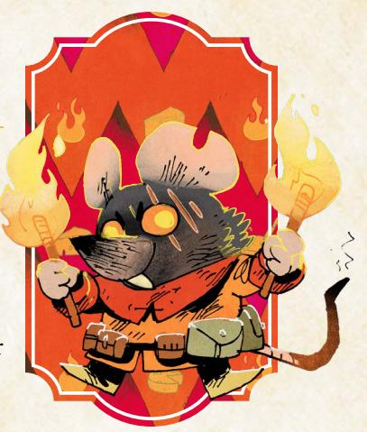

at the heart of the Hundreds give them the momentum and strength of will to run across the Woodland and change everything…but those very same feelings also make them more akin to a dangerous wildfire than an organization.

# Portraying the Hundreds

The Hundreds' two drives are:

- ·*To topple the old, weak, and failing structures of the Woodland*
- ·*To commit quickly, fully, and dangerously to new and fast "solutions"*

The Hundreds' first drive corresponds with the first stage of their presence in any given clearing across the Woodland. This is the representation of their extreme discontent. The way things are doesn't work, the Hundreds say, and must be torn down. This drive only demands a target be some portion of "old," "weak," or "failing" to be worth toppling, which means nearly any existing power structure can easily become the target of the Hundreds' ire.

The Hundreds' second drive corresponds with the second stage of their presence in the Woodland, and represents their devotion to the Lord of Hundreds, this avatar of their discontent. After the existing order is torn down, the Hundreds do set themselves to building a new order…but any more involved discussion among them would prove that the Hundreds likely have no agreement on what the new order should be. Instead, they all simply agree to follow the vision of their Lord, which of course means following the vision of the Lord's lieutenants, whatever that vision might be. Rarely is that vision a thoughtful and long-considered structure.

{21}------------------------------------------------

The grievances of any individual member of the Hundreds are likely real. There are many, many reasons to be discontent in the Woodland, and many of those reasons tie directly to the structures and injustices of the existing Woodland powers. Make sure to give the members of the Hundreds their due credit; some of them might be power hungry or opportunistic, but some are justly upset with something in their lives…they just have no idea how to truly address the problem. So they commit to the destructive violence of the Hundreds, because at least something will change if they cast down all the powers of the Woodland.

There lives the biggest difference between the Woodland Alliance and the Hundreds. The Alliance is united by denizens rebelling against the factions in at least somewhat organized fashion, united by a vision of a free, better Woodland, even if they all disagree about how to achieve that vision. The Hundreds are united by discontent and chaos, by emotion barely directed through a tyrannical leader toward the cause of destruction and acquisition. The Hundreds have no real sense of a better Woodland, beyond one where the guilty are cast down, and the Lord of the Hundreds reigns.

Even given all that about the members of the Hundreds, the leadership is a different story. Those who rise up to the top of the Hundreds are rarely those with the best of intentions and the greatest of plans. They tend to be entirely willing to ride the emotions of the rest of the Hundreds, riling the masses up and directing their rage against targets of the leaders' choice. The Hundreds' leaders are usually fairly content lining their pockets with the spoils of destruction.

Such leaders also tend to be either the cronies of the current Lord, willing to kowtow and praise the Lord as needed; manipulative schemers who become indispensable to the Hundreds and the Lord, despite their distastefulness; or heroes of the Hundreds, lifted up on a tide of mass support…and unlikely to remain in leadership for long.

Attempting to stay in power within the Hundreds is a fool's errand—no one can ever predict where the angry mob will take them. Thus, the leaders of the Hundreds shift fairly often…including the Lord. If the PCs meet a Lord of the Hundreds, and then later in the same campaign try to meet with them again… they might find that the Lord of the Hundreds has been completely replaced, with no one in the Hundreds as a whole any the wiser! The position is as much a figurehead as it is a real, powerful leader, considering the Hundreds' anarchic structure.

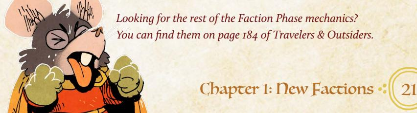

{22}------------------------------------------------

# Elements of the Hundreds

The Hundreds are represented in the Woodland by four basic elements: the stronghold, mobs, hoards, and warriors.

The stronghold is the center of the Hundreds' power, the place where the Lord is most likely to rule from and perhaps the only real thing the Hundreds have built. Usually, they turn existing structures into their stronghold, but it is the one place in all the Woodland that will be hardest to dislodge them from.

A mob represents a group of angry, discontented denizens ready to spring to violence. The Hundreds do attract plenty of warriors: soldiers who desert their faction, bandits who are looking for an excuse to perform their banditry, etc. But mobs are defined by numbers, more than by skilled fighters—a dangerous group that can overwhelm any military force through sheer numbers. What's more, a mob usually represents the denizens inside the clearing, difficult to find and oust and capable of forming into a mass without warning. Mobs can destroy the very structures the other factions build up with ease, and can ultimately throw open the gates to the Hundreds.

A hoard reflects the Hundreds' practice of grabbing all the wealth and items of value they can, and then piling them all up. Creating a hoard is an assertion of the Hundreds' power—they are implicitly claiming that they can just take these things, and that the other powers can't take them back. Of course, it also means the Hundreds can pull from the hoard to supply their own efforts, though usually that is something that only the Lord of the Hundreds and their lieutenants will do. In the long run, the Hundreds expect to send every hoard back to the stronghold to be added to one giant stash there, though it can take some time to actually send the hoards along the Woodland paths. Hoards do have a Value associated with them which represents the general overarching worth of all the items collected there; use that Value if vagabonds manage to secure a hoard and plunder it. That Value is also referenced sometimes as the Hundreds spend Value. If the Hundreds should spend Value from a hoard and it doesn't have enough, they don't spend the Value and they do not perform the associated act.

The warriors of the Hundreds are like the soldiers of other factions, representing capable fighters who serve in the closest thing the Hundreds have to a structured organization. The warriors consist of anyone who wants to follow the Lord—bandits, deserters, converts and more—and who have the skills to fight at a level higher than the average denizen. Such forces might be able to face off against soldiers of other factions, but usually they're more important for securing final control of a clearing, after a mob has successfully damaged local power structures and created an opportunity.

{23}------------------------------------------------

#### The Hundreds Cycle

In general, the cycle of the Hundreds in any given clearing follows this pattern:

- 1. A mob arises in a clearing, damaging and eventually overthrowing the dominant powers of its clearing
- 2. The mob collects valuables they gather into a hoard.
- 3. Eventually, when the Hundreds have taken control of the clearing as a whole with their own warriors, they send the hoard back to the stronghold.

In all cases, however, it takes time for each event to happen; to ensure that a mob doesn't form, destroy its clearing, and send back a hoard all in the same period of time, the actual order in which you resolve the Hundreds' process is reversed.

When time passes, first, for each hoard in the Woodland, roll to see if the Lord of the Hundreds dispatches warriors to seize that clearing and secure that hoard. One at a time, roll 2d6 for each hoard in the Woodland except at the stronghold. Add +1 to the roll for any given hoard for every 5-value in that hoard. On a miss, the Lord of the Hundreds does not send any warriors to secure the clearing and the hoard yet. On a 7-9, the Lord of the Hundreds sends warriors only if the Lord's mood is Bitter or Lavish; otherwise, they send no warriors. On a 10+, the Lord of the Hundreds sends warriors.

If the Lord of the Hundreds sends warriors, deplete the size of the stronghold's hoard by 5-value for each clearing the Lord attacks. When the Lord of the Hundreds sends warriors to a clearing, they take control of that clearing, and send its hoard back to the stronghold…but that hoard will only arrive when next time passes, and is otherwise potentially vulnerable on the paths.

For each mob in the Woodland, roll to see if it causes damage and collects a hoard. Roll 2d6. On a miss, nothing happens. On a 7-9, the mob causes damage; roll 1d6 and divide by two (round up). The mob destroys that many other structures in the clearing, starting with non-fortifications. For each destroyed structure, the mob adds 5-Value to the local hoard. On a 10+, the mob destroys all structures in the clearing, including fortifications, and adds 5-Value for each to the local hoard.

{24}------------------------------------------------

If, in either case, there are no faction structures remaining in the clearing, the mob lays waste to the clearing, destroying its own infrastructure and adding 5-value to the local hoard. No fortifications or structures can be constructed in the clearing until it has had time to recover. A mob in a clearing that has not yet recovered from being laid to waste will no longer roll to add to the hoard or cause damage in its clearing.

Lastly, the GM determined if new mobs form anywhere else in the Woodland:

Pick the two clearings without a mob, and with the highest level of turmoil (GM's choice). Roll 2d6 for each. On a miss, nothing happens. On a 7-9, a mob forms there if the clearing is controlled by a faction. On a 10+, a mob forms there.

# The Lord's Mood

The Lord of the Hundreds is moody and capricious, and their mood can have an effect on what the Hundreds do as a whole. The Lord's mood will change if the Lord is replaced, or whenever time passes. After resolving mobs, hoards, and warriors, roll 1d6 (+1 per 10-value at the Lord's stronghold) to see what the Lord's new mood is, and the effect of that mood.

#### Lord's Mood

| Results | Mood                                                                                                                                                                                                                                                              |
|---------|-------------------------------------------------------------------------------------------------------------------------------------------------------------------------------------------------------------------------------------------------------------------|
| 1       | Bitter–Before resolving mobs, hoards, and warriors, roll 1d6 for each mob. On a 5-6, they become warriors and seize control of their clearing. Also, sends warriors on a 7-9 instead of a 10+.                                                              |
| 2–3     | Relentless or Wrathful–Before resolving warriors, the Lord of the Hundreds automatically dispatches warriors to seize the largest hoard in the Woodland without depleting the stronghold's hoard.                                                           |
| 4–5     | Grandiose or Jubilant– Before rolling to place new mobs, add a mob to two random clearings in the Woodland.                                                                                                                                                    |
| 6+      | Lavish–Before rolling to send warriors, spend 15-value from the stronghold hoard to automatically send warriors and seize the closest uncontrolled clearing to the stronghold (ties broken by GM's choice). Also, sends warriors on a 7-9 instead of a 10+. |

{25}------------------------------------------------

# Faction Phase: Keepers in Iron

The Keepers in Iron are a fairly insular organization, with their own specific goals, codes, and means of action. As an organization, they aren't usually all that interested in the clearings and the denizens, let alone the War. They're actually closest to the Riverfolk Company in how they play into the overall Woodland; a powerful force that can be an "addition" to a clearing, coexisting alongside other structures as they pursue their own goals. They usually don't actually seek control or dominance

over the clearing, except insofar as it is a means to getting what they actually want: relics. But the tension in their faction orbits their potential to act; if they did choose to become involved, they could change the course of the Woodland.

#### Portraying the Keepers in Iron

The Keepers' two drives are:

- ·*To obtain as many of the Ancients' relics as possible*
- ·*To keep to their own codes of law, duty, and honor*

The Keepers' first drive is the most obvious—they pursue relics and seek power in areas where relics are likely to be found. They send out their own cadres of armored Keepers to scout out new relics across the Woodland, or to secure relics deep inside dangerous ruins. They pay high prices to obtain relics from those who've already secured them from ruins, and when a deal isn't possible, they wield force to grab those relics. For any given Keeper, a relic is the highest value item they could obtain, and usually they're willing to sacrifice other ends to gain a relic.

The Keepers' second drive is the binding force that keeps them from razing the Woodland...and a set of ideals likely to embroil them in the Woodlands' affairs. The Keepers are not so devoted to their purpose that they will do anything to obtain their relics; they have knightly codes of conduct and structure that guide their actions. While Keepers use force to take relics from unworthy holders who won't sell, they try to come to a peaceable solution first. They are barred from wielding their strength in arms against the meek. They are bound to honorable treatment of others, including avoiding deception and guile wherever possible. All of this adds up to a strict hierarchy of behaviors that constrains what the Keepers are willing to do to accomplish their goals.

{26}------------------------------------------------

As an institution, the Keepers are a tightly knit order of oaths and fealty, now caught between these two impulses. Older, more established Keepers generally seek relics and wish to remain apart from Woodland affairs as much as possible; they would deem themselves victorious if they took all the relics from the Woodland and then departed. Many younger Keepers—especially those who did join the organization from the Woodland—do not see the situation quite as cleanly. They believe that the Woodland is the old home of the Ancients, and the relics buried under its earth will never be fully excavated. The only way to truly obtain all the Ancients' relics is to occupy the Woodland as a whole, resolve its war and take control.

What's more, these reformers and upstarts within the Keepers see their faction as having a duty in honor to stop such unnecessary, needless conflict across the Woodland. The Keepers, they claim, do not simply want to obtain relics just to have them. They seek relics to preserve and perhaps even restore the greatness of the Ancients' world—and that implies a duty to the world they currently live in. The Keepers can't simply remain purely aloof and separate; they are obligated by honor to become engaged.

In short term play, the Keepers are fairly easy to use; if a relic is in play, or a ruin is nearby, the Keepers are likely close in some form. They might hire the vagabonds, pay for a relic, compete with the vagabonds to investigate a relic, or more. You can always bring the Keepers into a conflict by just introducing a relic.

In long term play, however, the conflict within the Keepers in Iron as a whole is the key to presenting them as an interesting faction with complex motivations. The Keepers who pursue only relics might eventually perform terrible acts in pursuit of relics—exhibiting a willingness to overturn the Keepers' other codes and laws if the possible reward is more relics. Other Keepers will focus on the Woodland. At their best, this can manifest as concern for the denizens, an attempt to defend them and protect them from the ravages of the War. At their worst, this becomes a tyrannical drive to take control of clearings that cannot protect or govern themselves, forcing them to serve only the will of the Keepers.

In practical terms, don't worry about tracking every single relic the Keepers have. Assume that at any given time, they as a faction have many relics held in their waystations and with their cadres. Relics make great pieces for stories, but they aren't a resource for the Keepers; the Keepers generally will avoid using the relics in favor of keeping them safe. There is no point at which the Keepers will "have all the relics" of the Woodland; there are always more to find amid ruins and vaults. You can see examples of relics that you can add to your Woodland—or use as an example for constructing your own relicts—on [page 115.](#page-115-1)

{27}------------------------------------------------

#### Delving for Relics

When time passes, every waystation sends a cadre of Keepers into the nearest adjacent ruins to seek relics.

For each ruin the Keepers send at least one cadre toward, roll 2d6 and add +1 for each cadre sent there past the first. On a miss, the Keepers are lost to a danger of the ruin or a threat encountered along the way. On a hit, the Keepers delve into the ruin and return with a relic. On a 7-9, the Keepers encounter serious danger; if there were multiple cadres, then all but one are lost, and the waystations corresponding to the lost cadres are also lost. If there was only one cadre, then it brings a threat back from the ruin to the clearing in which its waystation was located; that waystation cannot move or seize until the threat is dealt with. On a 10+, the Keepers delve into the ruin and return to their waystation(s) without issue.

# Seizing Clearings

After delving, any waystations that did not lose at least one cadre and that are not pinned down by a threat might try to seize control of their clearings if they don't already have it.

For each such waystation, roll 2d6 with the following modifiers:

- +I if a faction other than the denizens is in command of the clearing
- +I if the faction in command of the clearing is weakened in any way
- -I if the faction in command of the clearing has a strong position
- -I if the faction in command of the clearing isn't opposed to the Keepers presence in the clearing
- -I if there is no ruin adjacent to the clearing
- -I if the waystation moved to the clearing when last time passed

On a 10+, the Keepers seize control of the clearing through brute force. On a 7-9, the Keepers embroil the clearing in a struggle for control; if the opposing faction does not respond or the vagabonds do not interfere, the Keepers will seize control when time passes. On a miss, the Keepers do not attempt to seize control and try to remain neutral toward the other factions and powers of the clearing.

{28}------------------------------------------------

#### Waystations

After the Keeepers in Iron delve, waystations might move. A waystation cannot move, however, if it has been pinned down by a threat it pulled from a local ruin!

For each waystation, roll 2d6 with the following modifiers:

- +I if the waystation recently secured a relic
- +I if another non-denizen faction is in control of the clearing
- -I if the Keepers are in control of the waystation's clearing
- -I if active conflicts exist between the Keepers in Iron and other factions

On a miss, the waystation does not move. On a 7-9, the waystation moves if there is any other waystation adjacent to the same ruin as it; otherwise, the waystation remains where it is. If it moves, it moves to the closest clearing adjacent to a different ruin. On a 10+, the waystation moves to the closest clearing adjacent to a ruin, even if it is the same ruin. If at all possible, it moves to a clearing that it has not yet moved to.

Waystations take all Keepers presence in their clearing with them when they move, adding presence and the waystation to the new clearing. New waystations are rare, but they can be added to the map as more ruins and relics are found.

Every time a new relic is delivered to a faction or a new ruin is discovered, roll 2d6. On a 10+, add a new waystation. On a 7-9, add a new waystation only if there are 1 or fewer waystations. On a miss, don't add a new waystation.

{29}------------------------------------------------

{30}------------------------------------------------

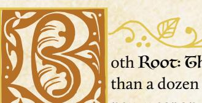

oth Root: The RPG and Travelers & Outsiders offer more than a dozen different roguish feats and Reputation moves, new weapon skills and species abilities, and much, much more.

Altogether, they offer plenty of options to play a full campaign and to develop PCs in many different ways. But having still more options for development, for specific options and abilities, allows you to tailor your campaign to exactly your needs!

In this chapter, there are:

- · New weapon skills, all of which exist to supplement those in the core book and which follow the same overarching rules.
- · New Reputation moves, some of which give you more options in general, and some of which give you faction-specific moves.
- · New drives, any of which can be swapped in with the drives on a PC's playbook using the end of session move (page 130 of the core book).
- · New natures, any of which can be swapped in with the natures on a PC's playbook using the end of session move (page 130 of the core book).
- · New connections, any of which can be swapped in with the connections on a PC's playbook using the end of session move (page 130 of the core book).

# **New Weapon Skills**

These weapon skills in general follow the same rules as weapon skills in the Root: The RPG core book (page 89). In order to use one of these skills, you must have learned the skill (recording it on your character sheet), usually by advancing; you must have a weapon tagged with the skill; and you must be able to trigger the move as appropriate within the fiction.

If a move includes the "no tag required" label, you do not need a weapon with the tag in order to use the weapon skill. Moves like surprise jab or frightful flourish don't require a weapon tag because they either don't rely on the weapon or can be used with any weapon.

さい命し、このでは命し、このでは一命し、この

{31}------------------------------------------------

#### Sweep **special**

When you *sweep your bow at an enemy or group of enemies at close range* (even with a bow not tagged with close range), mark exhaustion and roll with Finesse. On a 7-9, you succeed; they scatter and fall back a range, creating an opportunity for you or your allies. On a 10+, pick one as well:

- · they stumble and slip, buying you more time
- · they crash into each other; inflict 1-injury
- · they are frightened or dismayed; inflict 1-morale harm

You turn suddenly toward the soldiers pursuing you, swinging your longbow wildly to push them away from you. You're *sweeping* your bow!

*Sweeping* scatters your foes when they get too close, forcing them back to a range that's more advantageous for your weapon. The bow itself has to be hefty enough to scare them—it must still be tagged with the *sweep* weapon skill—but *sweeping* sets you up to shoot them with the bow once you've got them at a better range.

Of course, whipping a bow around to drive back your enemies is tiring! You can only keep your foes at bay for so long before you run out of exhaustion.

#### Pommel Strike **special**

When you *deftly use the enlarged pommel of your weapon to strike an enemy at intimate range* (even with a weapon not tagged for intimate range), roll with Luck. On a hit, they mark 2-exhaustion. On a 10+, they must also pick 1:

- · you seize an advantageous position in the fight
- · you shake their confidence; inflict 1-morale harm
- · you knock them off-kilter; their next blow does -1 harm

Your enemy pushes in close, their knife gleaming...and that's when you bring the pommel of your hammer down on their face. You're using *pommel strike*!

*Pommel strike* gives a weapon that normally wouldn't work at intimate range a way to strike opponents who get close. The weapon has to have a pommel sturdy enough to do real damage, but it's likely your foe won't see it coming!

If you roll a 10+ while using *pommel strike*, you have to seize the moment to take advantage of your advantageous position or your foe's weakness; if you walk away or ignore them, they'll have enough time to recover.

{32}------------------------------------------------

#### Frightful Flourish **special no tag required**

When you *flourish your weapon in a fanciful and terrifying way when you engage a new enemy*, roll with Charm. On a hit, your new opponent suffers 2-morale harm as you demonstrate your battle prowess, but you must mark an exhaustion as you over-exert yourself in the frightening performance. On a 10+, your martial display only bolsters your resolve; you do not mark exhaustion.

You step over the body of a felled foe toward a new oppoenent, swinging your bloody mace above your head as you glower. You're using *frightful flourish*!

*Frightful flourish* can be used with any weapon; it's much more about your skill and panache in the moment than whatever armament you're wielding. You can only use it, however, as you engage a new foe, showing off what you can do with your weapon before you cross swords. Often, a *frightful flourish* is all you need to send weak foes running...

#### Surprise Jab **special**

When you *strike with a surprise weapon at intimate range*, mark exhaustion and roll with Finesse. On a hit, inflict your weapon's harm. On a 10+, pick 3. On a 7-9, pick 1.

- · you inflict serious (+1) harm (you may pick this option multiple times)
- · your enemy must mark 2-exhaustion or drop what they are holding
- · you seize something vulnerable from them (item, position, etc.)

You pull a small dagger from your boot, fiercely slashing at a mighty enemy who doesn't expect your attack. You're using *surprise jab*!

While many vagabonds are capable of blindsiding opponents with a roguish feat, it's hard to catch someone by surprise when you're in the middle of a fight. *Surprise jab* covers those moments where the weapon itself is a surprise—a hidden dagger, a concealed crossbow, etc.

Note that once you've used *surprise jab* once during a fight, you'd have to hide the weapon to use it a second time with the same piece of equipment. Once your foe knows you have a small wrist crossbow up your sleeve, they tend to be ready for you to use it!

{33}------------------------------------------------

# New Reputation Moves

These moves supplement the Reputation moves included in the Root: The RPG core book on page 111. They still all have a Reputation requirement, meaning that you cannot use these moves at all unless your Reputation with the appropriate faction is at the correct level.

#### Forge Resistance **REQUIRES REPUTATION +2**

When you *promise to lead a group of downtrodden NPCs when they are faced with a frightful situation, desperate odds, or organized oppression*, roll with your Reputation for their faction. On a hit, they rally, finding new strength in your words; they coalesce into an appropriately-sized group that will follow you. On a 10+, a capable leader also emerges from the group to lead alongside you; they will tell you what you need to do to inspire them to lead on their own. On a miss, your attempt to hearten the downtrodden draws unwanted attention from their enemies, trampling the hope you wished to foster; mark 2-notoriety with those you tried to lead and brace yourself for their enemies.

As the armed soldiers invading Riverwest Reach march forward, you climb up on the roof of a building and promise to keep them safe in the fight to come. You're *forging resistance*!

*Forging resistance* is a move that allows you to turn your positive reputation with a group into a temporary position of leadership, a rallying cry that binds together a mob into a group that can follow your orders. In the event that you use them as a weapon, the GM can use the group rules to determine how much damage they do and how much harm they can take.

If you do whatever is necessary to inspire the capable leader who emerged from you *forging resistance* to act on their own in the future—like publicly support their role or kill off their greatest rival—you no longer need to lead the group yourself to keep it together. From that point forward, the new leader can keep the group together...but that doesn't mean they are always an ally. You'll have to maintain that relationship to ensure a group led by another stays on your side.

{34}------------------------------------------------

#### Call Upon The Enemies of Your Enemies **REQUIRES REPUTATION -3**

When you *spread word that you're looking for allies against a powerful foe in the area*, roll with your Reputation with that foe's faction, treating your Reputation as positive (+3) for this roll. On a hit, you discover powerful allies who are willing to help, but they're beset by their own internal squabbles. On a 7-9, you realize that your foe has eyes and ears amongst them; you risk exposing your new friends to serious consequences if you move them to action while the traitor is still active. On a miss, your foolish call for help leads you right into a trap set by your enemies.

You drop a few coins into a beggar's cup, asking if anyone around might be willing to help you deal with the Marquisate governor. As her eyes widen everyone knows the Marquis hates and fear you—you smile. You're *calling upon the enemies of your enemies*!

*Calling upon the enemies of your enemies* requires you to take a risk with an intensely negative Reputation; in order to find some support for taking on a powerful foe, you need to go around announcing that you're looking for help. You can be subtle about it—whispering in back rooms and obliquely asking about the power structure fo the clearing—but you have to be obvious enough that you stand a reasonable chance of finding the people you want to find.

But if you do find such allies, they are exactly the kind of help you need: powerful friends who can make a real difference. Of course, they might need some help themselves getting past their internal drama and figuring out a plan for taking on your mutual enemies.

If you *call upon the enemies of your enemies* and discover that there is a traitor in the midst of your new allies, it doesn't mean you know exactly who it is that's betrayed the group. You might have to do some work finding them—or convincing the rest of the group they aren't to be trusted when you do find them—but if you don't address the traitor before you move against your real foe, the consequences will be dire for your new friends.

{35}------------------------------------------------

#### Impress An Audience

**REQUIRES DENIZENS REPUTATION +2** 

When you try to *impress a group of denizens with a tale of your folk heroism*, roll with Reputation with the Denizens. On a hit, they are suitably awed by your noble deeds; hold 1. You can spend that hold to have a plucky denizen step forward to help you in a useful way when you're in need of assistance. On a 10+, the denizen you call forward with your hold is important or particularly skilled. On a miss, hold 1, but the local denizens are so convinced of your heroism that they need you to help them with an urgent problem; agree to what they're asking of you or mark 2-notoriety and lose the hold.

As the local denizens of Pricklegrass Marsh gather around, you tell the tale of your fight against the mighty bear that once terrorized Blackpaw's Dam, hoping to dazzle them with your heroic deeds. You're *impressing an audience*!

*Impressing an audience* allows you to excite the imaginations of the denizens of a clearing, convincing them that you are more than just a simple traveler or cold mercenary—when you successfully *impress an audience*, you become a folk hero, a larger-than-life figure who inspires hope in the ordinary denizens of the Woodland.

Your tale of folk heroism needs to be inspiring! Stealing from the rich and giving to the poor, slaying terrible monsters, protecting the innocent—all the kind of things that would make the denizens stand up for you when you're in trouble. None of this has to be true, of course, but it needs to be compelling!

Note that i*mpressing an audience* only works for the denizens themselves, the ordinary people of the Woodland who aren't affiliated with one of the other factions in the Woodland War. You can't impress the Marquisate or Lizard Cult with your folk hero feats; those political factions aren't going to be swayed by your charming adventures.

The hold you generate by *impressing an audience* lasts as long as you're in the clearing; if you leave the clearing and return, you likely still have the hold, so long as the denizens might reasonably remember you. If you've been away long enough for the denizens to forget you, you'll have to *impress* them all over again.

If the denizens ask you to solve an urgent problem in the clearing, you have to work on it right away. If you say you'll do it, but you don't make any real progress, then you'll mark 2-notoriety and lose the hold when they figure out you were leading them on.

{36}------------------------------------------------

#### Incite a Mob **hundreds**

**REQUIRES HUNDREDS REPUTATION +2**

When you c*all upon a mob of the Hundreds to join you in razing a building or looting something valuable*, roll with Reputation with the Hundreds. On a hit, a small group joins you in your merry destruction, doing their fair share of the work until there's no more razing or looting to do. On a 10+, the group is larger (medium group) or especially devoted (two additional morale boxes). On a miss, your small group is poorly trained and of foul humor; they outstay their welcome with you and are impossible to control in any meaningful way.

You call for a mob of Hundreds to take the Governor's mansion—he can't oppress them if the building is burned to the ground! You're *inciting a mob*!

It takes only a little push for members of the Hundreds to turn to violence, and any vagabond with a high Reputation with the Hundreds knows how to push. *Inciting a mob* means that you're rallying any and all of the brigands around you to take immediate action, likely by reminding them of the opportunity they have to make a mess of things!

You have to at least give the appearance of rioting along with them to *incite the mob*—you can't send them off to burn things down without you. You can, however, slink away once the rioting is underway to crack open a safe or kill a particular noble, but the mob has to believe you're on their side for you to *incite* them!

If things go poorly, it's likely that the mob still loots and razes the target you designated...but they also don't follow your instructions or even see you as one of them. A mob unleashed in such a faction is likely a danger to you too...

{37}------------------------------------------------

#### Shepherd Relic **keepers in iron**

#### **REQUIRES KEEPERS IN IRON REPUTATION +2**

When you *request the Keepers in Iron grant you a relic to aid your cause*, roll with Reputation with the Keepers. On a hit, they offer you a relic you can use to pursue your goals in the Woodland; the GM will tell you what the relic does and under what condition they will expect it to be returned. On a 7-9, pick 1. On a 10+. pick 3:

- · the relic can exploit a weakness of your enemy (or of an obstacle)
- · the relic strengthens your position with a powerful NPC, your choice
- · the relic can bolster your allies when working with you for the cause
- · the relic has properties that work in an unusually beneficial way

On a miss, the Keepers still offer you a relic—pick 1, as with a 7-9—but you must also agree to shepherd another item or person for them to a clearing of their choice.

You stand before a commander knight of the Keepers in Iron and ask for help holding off the Marquisate's forces in Elstone's Ridge. Surely they have a relic that can help you and your band? You're trying to *shepherd a relic*!

Those vagabonds who earn the trust of the Keepers in Iron sometimes get the opportunity to make use of their precious relics—majestic weapons, armor, and other tools of the Ancients that the knights have collected from across the Woodland. No two relics are alike, and each is a powerful force; they can turn the tide of a battle, inspire frightened soldiers, cleave through steel...and more.

The Keepers in Iron care more about the vagabond who is *shepherding the relic* than the specific cause. So long as you offer the Keepers a reasonable motive for supporting you in your fight—and you have Reputation +2—they are likely to offer something fitting. They won't throw their support behind a clearly unjust cause or something that hurts their own interests, but they believe deeply in those who have earned their trust.

Of course, the Keepers in Iron have to have a relic nearby for them to offer it to you; you can implore a wandering knight to grant you such a gift, but unless they have a relic on them (or nearby), they can't give you one. It's far easier to request a relic from a waystation filled with knights!

Check out [page 115](#page-115-1) for more on the relics and their capabilities, including more on the Ancients and the kinds of relics they created..

{38}------------------------------------------------

# New Drives

Each of these four new drives functions exactly like the drives on the original playbooks (see the Root: The RPG core book, page 171, for more on drives). They represent ways for a vagabond to advance during the course of play. Any vagabond can swap to these drives using the session move (see the Root: The RPG core book, page 130). At the GM's discretion, a brand new vagabond character can be made using these drives instead of the ones on their playbook.

#### Diplomacy

*Advance when you aid in forging a treaty, diplomatic venture, or formal agreement between two (or more) conflicting groups.*

The War has torn communities apart, and vagabonds are often in a unique position—as outsiders—to help stitch them back together. Vagabonds engaged in diplomacy, however, need to do more than just talk; be prepared to put in extra muscle and legwork solving problems before you can build coalitions. You don't have to be a leader in this endeavor, just assist in some way. In your quest for peace, however, remember that the groups must be in some warm-to-hot conflict. Mild annoyance or petty hatreds aren't enough, so the groups have to be on the brink of blows, at least socially or economically. Lastly, the treaty, venture, or agreement has to be agreed upon in some kind of official way. It could be verbal with both sides present in a town hall, representatives sent to sign a document, or votes on both sides relayed to the diplomatic third party. The warring groups can be the Factions, warring families, a labor union versus an owner, or any large, influential body of denizens against another.

#### Dowser

*Advance when you help a clearing discover and claim a valuable natural resource.*

Clearings, while mostly self-sufficient, always need a means to expand or to save for lean times. The more replenishable resources a clearing possesses, the greater the clearing's chances of surviving a harsh winter, natural disaster, or invasion of hostile soldiers. Yet denizens tend to be too busy dealing with their own immediate needs to search the forest for resources. This is where vagabonds can be helpful! The natural resource has to be something found in the forest that isn't otherwise available to any other clearing (trees don't count, for example). It can't be claimed by another clearing either. It can be a hot spring, an underground river, a vein of ore, or even a rare fruit or berry patch. In other words, the resource must have the potential to change the fortunes of the clearing—a single chunk of iron isn't enough. Finally, note that you must delve into the forest to find these resources; you won't find what you're looking for on a well-worn path between the clearings.

{39}------------------------------------------------

#### Folklorist

*Advance when you prove a local folktale or legend true or false.*

Every clearing has its own stories of local flora, fauna, and phenomena that bring a chill or smile (or both) to adult and child alike. Who else but a vagabond can discover the truth behind these stories? While this drive overlaps a bit with Mysteries, you are more interested in things rooted in a clearing's history and thus in a clearing's identity. Denizens may be invested, too invested, in proving the folktale true or false, and some people may already know the truth and want it suppressed. Regardless, accomplishing the drive requires you to talk to the denizens, get their takes on the tale, and discover the importance it has to the clearing. That said, the folklore that interests you tends to be spooky, strange, and/or dangerous, otherwise where is the challenge? Lastly, the evidence you find must definitively prove things one way or the other; lack of evidence doesn't prove something didn't happen.

#### Guardian

*Advance when you protect a clearing from a large beast by defeating it or chasing it away.*

Whether you want a challenge, are tired of merely fighting bandits, or consider the larger beasts of the forest the greatest threat to denizens, you have chosen to confront these dangerous animals. The large beast has to be threatening the clearing, directly or indirectly. The beast could trample a needed crop or block an important trade route to another clearing, if not attacking the clearing itself. Note that "chasing it away" counts, as long as the beast won't return. This can include frightening it, luring it away to a more tempting target (hopefully not another clearing!), or harming it enough that it moves on to a different territory. Also, you can get help from your fellow vagabonds or the denizens as long as you lead the charge. Needless to say, it has to be an animal of some sort. A giant tree ready to topple over or a large band of bandits pretending to be a large beast doesn't count.

{40}------------------------------------------------

# New Natures

Each of these four new natures functions exactly like the natures on the original playbooks (see the Root: The RPG core book, page 49, for more on natures). They represent ways for a vagabond to clear exhaustion during the course of play. Any vagabond can swap to these natures using the end of session move (see the Root: The RPG core book, page 130). At the GM's discretion, a brand new vagabond character can be made using one of these natures instead of either of the ones on their playbook, but we recommend starting with the playbook-specific ones and changing as the character does.

#### Advisor

*Clear your exhaustion track when you help uplift an NPC to an influential or leadership position.*

A vagabond with this nature enjoys working in the background, letting others lead (and take the heat) while they support the leaders (and pull the strings) behind the scenes. To invoke this nature, you need a good eye for identifying a worthy candidate (or convenient patsy). However, to actually uplift an NPC, you have to actively push, campaign, convince, negotiate, manipulate, or threaten the right people to gain support and win them that leadership position. This doesn't require a formal voting process; as long as public opinion shifts just enough for the NPC to lay claim to the position, you have done your due diligence. Also, this NPC has to be someone who needs your help, whether they don't have the skills, the ruthlessness, or the desire to campaign. Jumping on the bandwagon for a fledgling leader who already has broad support doesn't count.

#### Charitable

*Clear your exhaustion track when you gift a valuable treasure to the leaders of the clearing.*

A vagabond with this nature has similarities to one with the Generous nature, but has less focus on basic charity and more on finding and gifting cultural, symbolic, and historical treasures. It's not only about the monetary value, specifically, and more about what the gift means to the leaders of the clearing; you need to understand their needs and wants and discover what they find valuable or significant. It could be a relic about the founding of the clearing, lost to the ruins or a stolen religious artifact or the rusted weapon of a fallen hero. It could even be an ancient written contract detailing the line of succession or voting laws. The phrase "leaders of the clearing" has some flexibility; it doesn't necessarily mean elected leaders and could include local community leaders, someone respected by the clearing, or even a rebel leader beloved by their followers.

{41}------------------------------------------------

#### Dove

*Clear your exhaustion track when you convince a hostile group to give up their fight and disband.*

A vagabond with this nature has witnessed the endless conflict and aftermath of the War and seeks to tamp it down, one skirmish at a time. You tend to intervene at any sign of hostility, seeking to de-escalate first and find permanent solutions later. A "hostile group" must be one ready to go to violence; if the vagabond doesn't step in, someone or something gets hurt or destroyed. In addition, a single angry individual doesn't count in this case; the dangerous mob mentally is key here, threatening to spill over into a larger conflict. "To give up their fight and disband" means you can't just cause this group to merely pause or even change targets. You have to get them to give up violence as the solution and then break up as a mobilized group, no longer motivated as a faceless mob. The anger can still be there, but the urge to destroy must end, at least for now.

#### Handy

*Clear your exhaustion track when you agree to help a clearing by repairing a much-needed tool or resource.*

A vagabond with this nature is helpful and crafty (or thinks they are). You might not be able to solve the factional violence or repair broken hearts and spirits, but you can at least repair a broken *thing* to make life easier. You need to mingle with the community first to figure out what they need and what was lost. While helping an individual is laudable, you need to agree to fix something the whole clearing needs. This also focuses on tools and resources the clearing once had, once depended on, which are now broken or inaccessible. This context doesn't include a resource forgotten or misplaced (since that fits more with the Dowser drive); otherwise, the community won't be able to tell the Vagabond what needs fixing. Examples include a fallow field that refuses to be replenished, a grain mill lacking maintenance, mining equipment broken down, or an abandoned well with tainted water.

{42}------------------------------------------------

# New Connections

These four new connections supplement the base connections used on every playbook (see the Root: The RPG core book, page 50). These new connections all function just as the base connections do, representing a relationship between two vagabonds. A connection is written on one vagabond's character sheet, and that vagabond is the one who makes the choices, triggers the moves, and otherwise most directly "uses" the connection. Vagabonds can swap in these connections during the course of play using the end of session move (on page 130 of the Root: The RPG core book). At the GM's discretion, a new vagabond's pre-written connections can be modified to use one of these.

#### Ex-Convict

*When you fill in this connection, you each mark 2-notoriety with one faction. When you read a tense situation, you can always ask "What is most valuable here?" for free, even on a miss. Both you and your connection get a +1 when acting on any of your answers.*

You and the vagabond with whom you share your connection have a sordid history with a specific faction. The crime you supposedly committed might be the source of your bond, or your punishment (or perhaps your evasion thereof) might be the reason for your connection. One or both of you might be falsely accused, or the crime might not be seen as a crime to denizens or the other factions. Yet one faction still sees you as a criminal. That said, the crime can't be something too heinous since the notoriety affects only one faction! It could have been fraud, theft, a violent interaction with a faction member, or a betrayal of faction secrets. Meanwhile, your imprisonment or evasion from the authorities has also given you a keen sense of survival and an eye for exploiting advantages. So when you *read a tense situation*, you automatically default to selfish opportunism. After all, society has failed you, so you have only yourself, and perhaps your connection, to depend on.

{43}------------------------------------------------

#### Loyalist

*When you fill in this connection, you each mark 2-prestige with the faction you once served together. When you ask for a favor from that faction, you may mark 2-exhaustion to take 10+ instead of rolling.*

You and the vagabond with whom you share your connection once served a particular faction well, and you still maintain strong relations with them. Your connection may no longer be in contact with the faction, or might not even like the faction anymore, but they are still in good favor with them. You, however, kept in touch with the faction, even while you resisted recruitment (or if you *once* belonged, resisted rejoining.) You might agree with the faction's goals or simply see them as useful contacts and clients. And even though you aren't a part of that faction anymore, you and the other faction members still have a friendly, mutual bond. In addition, whatever you did for the faction was big enough to earn you a reciprocal kind of loyalty. As such you can navigate the bureaucracy or social niceties to get their help by leveraging that social debt, even if it takes some effort.

#### Refugee

*You and your connection are from a clearing that no longer exists. You both share a common cultural practice; when you mark depletion to practice it publicly, a local denizen—either another survivor like yourselves or someone sympathetic to your loss—comes forward to offer you comfort and aid.*

You and another vagabond came from the same clearing, one that has since faded into memory. The clearing doesn't have to have died from a direct attack from the War; it could have suffered from plague, famine, migration, or another denizen-made or natural disaster. It could have even fallen apart some time ago, its denizens scattered far and wide, although most refugees are from communities whose memory is still fresh! Because of your history, you and your connection have a shared cultural understanding and actively keep the memory of the clearing alive through cultural practice. Such rituals should be done deliberately and out in the open, be it visual (like a prayer or portable symbol), audible (like an old folk song or hymn), or even olfactory (such as a special dish or specific herbs and spices). You do this in order to signal to other survivors or denizens in the know that you have not forgotten your clearing and neither should they.

{44}------------------------------------------------

#### Veteran

*When you fight side-by-side or back-to-back with them, both of you have access to the parry weapon move regardless of weapon type, as long as you remain within intimate range of each other. If you choose to inflict morale or exhaustion upon a successful parry, you inflict an additional morale or exhaustion.*

You and another vagabond have fought on the front lines of the War and defended each other through the thick of it. This doesn't necessarily mean either of you was a leader or an officer, but it does mean you are both experienced in the War. You could have been a volunteer, conscript, mercenary, irregular, or clearing militia member. This War bond is something non-veterans will never understand. Note that you now are no longer part of an army or militia, whether tired of the rigid structure or more interested in striking out on your own. You understand each other's fighting styles and, when together, shore up each other's weaknesses with a strong defensive style. As a veteran, you also know how to force your foes to overextend themselves while conserving your own energy—you don't get to claim medals you earn by dying.

{45}------------------------------------------------

# New Species Moves

These new species moves expand on the options found in Travelers & Outsiders (page 58); they are additional playbook moves that can be taken at character creation or during advancement to represent a vagabond's innate abilities or learned traits common to the vagabond's species. Remember that these moves count toward a vagabond's total limit of moves from their own playbook!

#### Camouflage

**Applicable species: Lizard, Toad**

When you target someone, you can mark exhaustion to keep hidden, even on a 7-9 or when you choose to strike again.

#### Clicktongue

**Applicable species: Cat, Mouse, Small Bird**

When you use clicks, hand gestures, and body language to coordinate with another vagabond who is helping you, they can conceal their assistance or create an opportunity for you without marking exhaustion.

#### Curl Up

**Applicable species: Hedgehog, Tortoise**

When you curl up to bolster yourself from incoming harm, roll with Might instead of Luck when trusting fate; on a 7-9, you can always mark exhaustion to avoid the cost imposed by the GM.

#### Mesmerizing Gaze

**Applicable species: Bird of Prey, Cat, Lizard**

When you get an NPC alone and have time without distractions to hypnotize them, you can trick an NPC rolling with Charm instead of Cunning.

{46}------------------------------------------------

#### Drawing Up Plans

**Applicable species: Beaver, Corvid**

When you work with the leaders of a clearing to organize a large-scale project, roll with Charm. On a hit, the people of the clearing rally behind your efforts and finish the project. On a 7-9, choose 1. On a 10+ choose 3:

- · the project doesn't take a lot of time
- · the project doesn't use up a clearing resource
- · the project is high-quality and lasting
- · no one resents your orders

On a miss, your involvement in the project draws negative attention before it can be completed; mark 2-notoriety with a relevant faction that gets involved to stop you.

#### Eyes on the Back of Your Head

**Applicable species: Bird of Prey, Cat**

When someone ambushes you, springs a trap on you, or tries to sneak up on you, roll with Cunning. On a hit, you react before they can strike; your ambusher must choose one:

- · they cause a commotion; they draw unwanted attention to their attack
- · they stumble and hesitate; you take +1 ongoing against them for the scene
- · they lose their nerve; they mark 2-morale harm before the fight starts

On a 10+, you clear exhaustion or you pick for them, your choice. On a miss, you find out too late that you're outnumbered or pinned down, but you still react before they can strike; mark exhaustion to force them to pick from the list anyway.

#### Spines

**Applicable species: Hedgehog**

Mark exhaustion to inflict 1-injury to anyone in intimate range.

46 Root: The Roleplaying Game

{47}------------------------------------------------

#### Long Reach

**Applicable species: Toad, Lizard**

Take the Pickpocket roguish feat (it does not count toward your limit). When you grab something just outside of close range (or closer) with your sticky tongue, you can roll with Might instead of Finesse.

#### One Hawk's Trash

**Applicable species: Racoon, Squirrel, Rat**

When you dig around in a giant trash heap looking for information about the local denizens, mark exhaustion and roll with Luck. On a hit, pick 1 from the list below. On a 10+, you also find an item worth 1-Value or clear 2-depletion, your choice:

- · you find something a high-status NPC threw away; the GM will tell you about their hidden allies and who threatens their position
- · you find something a vulnerable NPC threw away; the GM will tell you how you can help them or exploit their vulnerability
- · you find something a dangerous NPC threw away; the GM will tell you their hidden weakness or vulnerabilities

On a miss, you are confronted by another group of scavengers who don't like the competition.

#### Nocturnal Senses

**Applicable species: Bat, Cat, Bird of Prey**

When you read a tense situation in total darkness, you can always ask How can I use the darkness to my advantage? even on a miss.

#### Sense of Danger

**Applicable species: Mouse, Rabbit, Squirrel**

Take +1 Cunning (max +3).

{48}------------------------------------------------

#### Posturing

**Applicable species: Bird of Prey, Lizard**

When you persuade an NPC with threats, roll with Might instead of Charm. In addition, on a hit, you may also mark exhaustion to ensure they don't tell anyone about what they've agreed to do for you.

#### Scent Spray

**Applicable species: Hedgehog, Skunk**

When you use your scent when confusing senses, roll with Might instead of Finesse. You can mark exhaustion to turn a miss into a 7-9 result.

#### Shell

**Applicable species: Tortoise**

You can always parry—even when you don't have a weapon—and don't have to mark exhaustion the first time you parry in a scene.

#### Steady as a Rock

**Applicable species: Hedgehog, Tortoise**

When you dedicate yourself to protecting another vagabond in a fight, mark exhaustion and hold 3. During the fight, mark exhaustion or spend 1 hold while in intimate range of that vagabond to do one of the following:

- · act as a shield; prevent injury to them from a single attack
- · act as an improvised weapon (close, large, unwieldy) for them
- · act as a brace; give +1 to their weapon move attacking a target in close or far range

48 Root: The Roleplaying Game

{49}------------------------------------------------

# New Species Abilities

#### Badger

Mark exhaustion to activate an ability:

- Gain access to or escape a location by burrowing through an earthen wall
- Gain a piece of useful info via your keen vision, scent, or hearing
- Clamber up a vertical surface or treacherous and narrow path

**Instinct move:** Once per session, clear exhaustion when you break or damage a significant structure or feature.

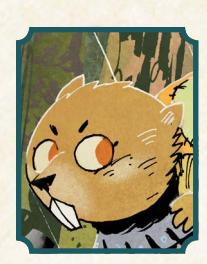

#### Beaver

Mark exhaustion to activate an ability:

- Chew through material softer than stone, if given time
- Hide underwater for a lengthy period of time
- Gain access to or escape a location by swimming underwater

**Instinct move:** Once per session, clear exhaustion when you build a shelter for you and your allies to hunker down in.

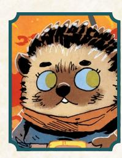

#### Hedgehog

Mark exhaustion to activate an ability:

- Lash out with spines; inflict 1-injury at intimate range
- Camouflage yourself with a local scent
- Absorb a blow with spines; suffer 2-injury less from an attack

**Instinct move:** Once per session, clear exhaustion when you accomplish something important on your own, without help.

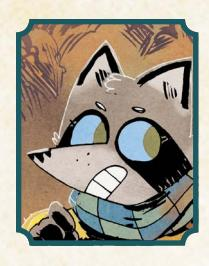

#### Raccoon

Mark exhaustion to activate an ability:

- Sprint at speeds beyond nearly all other denizens
- Hide something small on your person; it cannot be found by anyone else
- Clamber up a vertical surface or treacherous and narrow path

**Instinct move:** Once per session, clear exhaustion when you find something valuable in ruins or trash.

{50}------------------------------------------------

#### Rat

Mark exhaustion to activate an ability:

- Clamber up a vertical surface or treacherous and narrow path
- Chew right through a rope, cord, or other fiber in record time
- Gain access to or escape a location by squeezing through a tight space

**Instinct move:** Once per session, clear exhaustion when you intimidate or threaten someone (or some monster) larger or stronger than you.

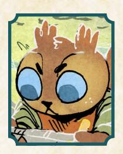

#### Squirrel

Mark exhaustion to activate an ability:

- Sniff out a hidden stash of food or resources
- Carry an extra 1-Load in your mouth
- Clamber up a vertical surface or a treacherous and narrow path

**Instinct move:** Once per session, clear exhaustion when you successfully warn an NPC of an impending threat.

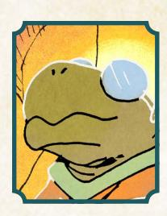

#### Tortoise

Mark exhaustion to activate an ability:

- Negate all harm from a single blow when attacked from behind
- Dig into loose soil and dirt, emerging sometime later from a different, reachable point
- Choose an additional option (max. 3) when parrying, even on a miss.

**Instinct move:** Once per session, clear exhaustion when you accomplish something at a slow and steady pace instead of rushing.

{51}------------------------------------------------

New Equipment

{52}------------------------------------------------

n addition to the new natures, drives, and connections found in Chapter 2 (page 29), this chapter details new rules for additional equipment for Root: The RPG, including new

positive and negative tags for weapons, armor, and other gear, alongside a new list of common Woodland equipment that showcases the new tags.

As a quick reminder, here is a summary of the basic rules for equipment in Root: The RPG, explained in full starting on page 182 of the Root: The RPG core book:

- · Equipment refers to important, larger, specific, and nonreplaceable items. Items like lockpicks, torches, or other expendable gear are better represented by depletion, unless there's something about the gear that makes it special or unique.
- · All equipment has wear, a special harm track unique to an individual piece of equipment, representing the equipment's durability. When all the boxes of a wear track are full, then the associated piece of equipment is damaged pretty badly. If you ever need to mark wear on equipment with a full wear track, it is destroyed entirely, beyond repair.
- · Tags represent special traits, moves, abilities, and other mechanical effects that a piece of equipment might bear. You can see a full list of tags starting on page 186 of the Root: The RPG core book.
- · Weapon skill move tags (weapon move tags or weapon skill tags for short) are a specific kind of tag that allows a wielding vagabond to use a particular weapon skill move—as long as they also have the appropriate weapon skill. You can read more about weapon skills starting on page 90 of the Root: The RPG core book.
- · A weapon has at least one **range** by default. That is the range at which the weapon can reach enemies, the range at which it is effective. There are only three ranges—intimate, close, and far. For more on ranges, see page 91 of the Root: The RPG core book.
- · Equipment also has a **Load**, a measure of its weight and bulk. Most pieces of equipment have between o and 2 Load, from small items like daggers (Load o) to larger items like a sword (Load 1) or even a warhammer or greatsword featuring the Weighty tag to represent its bulk (Load 2). Every vagabond can carry only so much Load without being burdened—4 by default, modified by the vagabond's Might. Carrying more than the maximum means the vagabond is burdened, slowed by the gear they are carrying. Vagabonds can't carry more than twice their maximum Load.

上命し、いらいと一命し、いらいと一命し、いらい

{53}------------------------------------------------

Instructions for buying, selling, and crafting gear can be found starting on page 184 of the Root: The RPG core book. In short, each box of wear, additional range past the first, special tag, and weapon skill tag adds 1-Value to the total price of a piece of gear; negative tags (flaws) reduce the total price of a piece of equipment by 1-Value each. Buying or selling a piece of gear is based on the Value of the gear, but might be modified by the social situation. Crafting the gear requires you to pay a skilled enough craftsdenizen (akin to buying it) or requires a Tinker—or otherwise capable vagabond—and materials as determined by the GM, usually through the **Toolbox** move (see page 162 of the Root: The RPG core book) and often equal in Value to the equipment's price, although the Luxury special tag can mess with this calculation.

# New Tags

The list of tags found on page 186 of the Root: The RPG core book is not by any means exhaustive. Enterprising vagabonds, inventors, and blacksmiths all endeavor to develop new weapons, armor, and other gear in the Woodland, and you are always free to create new tags to reflect their innovative ideas or give mechanical weight to everyday equipment.

As a reminder, equipment tags are special traits held by a piece of equipment that give it additional abilities. Each positive tag adds 1-Value to the overall worth of the item in question. Each negative tag refunds 1-Value from the overall worth of the item, lowering its price by 1-Value.

In parentheses after each tag, you'll once again find an idea of the kind of item the tag could apply to; although, as always, use these tags as inspiration to create more specific or appropriate tags as you need them.

# Positive Tags

These positive tags, like the others listed on page 186 of the Root: The RPG core book, can be added to any appropriate weapon, armor, or other piece of gear:

- + **Badgerfolk Hilt:** When wielding this weapon, you can mark wear to avoid being disarmed. (Hilted weapons)
- + **Beguiling:** When you *attempt to trick or persuade an NPC* while you wield or display this item, mark exhaustion when you roll a 12+ to include Mastery (Travelers & Outsiders, page 69) options. (Armor, clothes, trinkets)
- + **Binding:** When you *engage in melee at close range*, add this choice to the list: mark wear to wrap up your opponent's weapon; then, mark up to 2-exhaustion. Your opponent must mark the same amount of exhaustion, or you wrench the weapon from their hands. (Chains, whips)

{54}------------------------------------------------

- + **Concave:** When you *engage in melee* while holding this shield, mark exhaustion on a hit to knock your opponent off balance; you create an opportunity for yourself or your allies. (Shields)
- + **Corvidfolk Cloth**: When you use this item to approach an unsuspecting target, mark wear to roll Blindside or Pickpocket as if you had those feats. If you do have those feats, mark wear in the same situation to instead take +1 ongoing for the scene. (Cloaks, hoods)
- + **Cranecarved:** When you *use the Longshot weapon skill with this bow*, do not mark exhaustion. (Bows)
- + Deflecting: You may mark wear on this weapon as if it was a shield or armor; it does not count as a shield or armor for any other effects. (Hand protection, specialized swords)
- + **Ensigiled**: This item is marked with a faction's seal. When wielding or displaying this item, you can make the faction-specific Reputation move associated with that faction as if your Reputation was one level higher [max+4].
- + **Fascinating**: After you *meet someone important*, mark exhaustion and pick 1; you tell them how you used the item to…
  - Defend a faction, person, or clearing; they will tell you some current news relevant to that thing
  - Fight a faction, person, or idea; they will reveal their true allegiance in the conflict you've described
  - Serve a faction, person, or cause; they will point you toward others who share your loyalty to that thing You can mark exhaustion to ask a followup question; they must answer it honestly, but can be cagey with the details. (Anything)
- + **Lizardhewn Grip**: The first time you *parry the attacks of an enemy* with this weapon in a fight, do not mark exhaustion. (Light weapons)
- + **Menacing:** While wielding or displaying this item, you can *intimidate enemy troops with* -1 Reputation—instead of -2 Reputation or lower—and you always inflict an additional morale harm on the group, even on a miss. (Armor, weapons)
- + **Otterfolk Webbing**: Increase your carrying capacity by 2-Load. (Armor, clothes, packs)

{55}------------------------------------------------

- + **Rallying:** While you wield or display this item, you can *lead troops of a faction in battle* with +2 Reputation—instead of +3 Reputation—with their faction; you always gain 1 additional hold, even on a miss. (Anything)
- + **Ratfolk Iron**: When you *engage in melee*, mark exhaustion to choose an additional option. (Weapons)
- + **Ripper:** When you inflict injury on an opponent with this weapon, you may mark wear; if you do, they must mark 2-exhaustion, or they permanently lose 1 injury box. This tag costs 2-Value instead of 1-Value. (Edged weapons)
- + Seasoned: When adding ingredients to this item for cooking, treat the meal as an item with the Refreshing tag and Wear equal to the amount of Depletion or Value spent on those ingredients. (Cookware)
- + **Specialized:** When you craft this item, choose a move from your playbook that you haven't unlocked. While you wield or wear this item, you can mark wear and exhaustion to make use of that move for the scene. This tag costs 2-Value instead of 1-Value. (Anything)
- + Silenced: Mark wear to attempt the Blindside roguish feat if you don't have it; if you do have Blindside, mark wear to ensure that you do not draw unwanted attention, even on a miss. (Crossbows, bows)
- + **Symbolic:** Choose a faction; when you *endorse or vilify a new leader* of that faction, remove an option from the list before the GM picks. (Anything)
- + **Tapered:** When you *attempt the Blindside roguish feat*, mark wear to inflict an additional 2-harm. (Daggers)
- + **Thornback:** When an opponent grabs you while you are wearing this item**,** mark exhaustion to inflict 1-injury. Until they let you go, they suffer 1-injury each time they act against you. (Armor)
- + Well-Kept: This piece of armor has been well-maintained and repaired over the years, so much so that it is very difficult to destroy. This armor is never destroyed for all of its wear being filled; it can only be destroyed by filling every box of wear, and then taking direct, intentional action to destroy it with specialized tools or a particularly destructive environment. (Old but sturdy armor)

{56}------------------------------------------------

# Negative Tags

These tags, like the others listed on page 188 of the Root: The RPG core book, can be added to any appropriate weapon, armor, or other piece of gear:

- **Borrowed:** This item is on loan from a high-status benefactor and must eventually be returned. When you create an item with this tag, name the faction, and the GM names the benefactor. Your benefactor is always able to find you, and has many envoys at their disposal. When time passes, one comes to collect; roll with Luck. On a hit, the envoy asks for a favor; do it, and you can keep the item. On a 10+, the envoy also gives you a chance to purchase the item instead; the GM will tell you the cost. On a miss, you must return the item or face grave consequences. This tag refunds 6-Value instead of 1-Value. (Anything)
- **Brittle:** The first time you mark wear on this item during a session, mark an additional box. Any time a foe inflicts wear on this item, they inflict 1 additional wear. (Armor, tools, weapons)
- **Burdensome:** When you *travel from clearing to clearing along the path*, you may only do so at a relaxed or average pace. (Armor)
- **Clumsy:** When you engage in melee with this item, you cannot choose to suffer little (–1) harm. When you *wreck something* with this item, you always cause collateral damage, even on a 10+. (Explosives, weapons)
- **Contraband**: When this item is created, choose a faction that recognizes it as illegal. When someone in a position of authority with that faction discovers you are carrying this item, mark 2-notoriety; they will immediately attempt to confiscate it. You may apply this tag again to select an additional faction. (Armor, clothes, weapons)
- **Coveted:** When you first arrive in a clearing, roll with Luck. On a hit, this item attracts unwanted attention from the local denizens; the GM will tell you who has their eye on it. On a 7-9, their interest is intense; they offer to purchase it, try to steal it, or simply attempt to take it, GM's choice. On a 10+, the interest is good-natured—admiration of the craft, interest in the object's history—and modest. On a miss, someone powerful in the clearing decides to pursue this item, even at great cost. (Anything)
- **Custom Fitted:** This item can only be wielded or worn by a particular species of animal common in the Woodland. When this item is created, choose the single type of animal that can use it—all others find it nearly impossible to use and must mark an exhaustion to take any meaningful action while doing so. This tag cannot be chosen by a player when creating an item; only the GM can assign this tag to an item. (Anything)

{57}------------------------------------------------

- **Eerie:** When you *persuade* someone while displaying this item and roll 7-9 or a miss, mark notoriety in addition to any other consequences of your roll. (Anything strange and unusual)
- **Flamboyant:** When you *attempt a roguish feat to sneak or hide*, you incur an additional risk, even when using Mastery options. (Anything)
- **Loose Weave:** For each injury you absorb with this armor, mark 2-wear instead of 1-wear. This tag refunds 2-Value instead of 1-Value. (Chain armor)
- **Shabby:** In addition to any other consequences, mark wear on this item when you roll a miss while wielding it. (Weapons, tools, etc.)
- **Softwood:** When you mark wear on this shield instead of marking injury, mark additional wear. Mark exhaustion to ignore this effect. (Shields)
- **Suspicious:** When you wear, wield, or otherwise display this item, you must mark an additional exhaustion to attempt to evade detection or hide from someone actively looking for you. (Anything)
- **Unbalanced:** When you *engage in melee*, you pick one fewer option on a hit. (Heavy weapons)
- **Unimpressive**: While you wield or wear this item, you always inflict one fewer morale harm and take -1 to *meet someone important*. (Armor, Weapons)

{58}------------------------------------------------

# New Pre-Made Equipment

Here is a new set of pre-made equipment, weapons, armor, and other gear all commonly found in the Woodland. Use these when you need to stat up a piece of equipment quickly, or when you need a template you can change to make something special.

As a reminder, adding a tag, weapon move tag, additional range, or box of wear increases Value by 1 each, while removing a tag, range, or box of wear decreases Value by 1 each. The only exception are negative tags: adding a negative tag decreases Value by 1, and removing a negative tag increases Value by 1.

#### Weapons

#### **Acute Razor**

**Value:** 5 | **Load:** 1 | **Range:** Intimate; close **Weapon skill tags:** Vicious strike

- + **Ripper:** When you inflict injury on an opponent with this weapon, you may mark wear; if you do, they must mark 2-exhaustion, or they permanently lose 1 injury box. This tag costs 2-Value instead of 1-Value. (Edged weapons)
- + **Silenced**: Mark wear to attempt the Blindside roguish feat if you don't have it; if you do have Blindside, mark wear to ensure that you do not draw unwanted attention, even on a miss. (Crossbows, bows)
- **Unbalanced**: When you *engage in melee*, you pick one fewer option on a hit. (Heavy weapons)

#### **Badgerfolk Broadsword**

**Value:** 9| **Load:** 1 | **Range:** Close **Weapon skill tags:** Cleave, disarm, storm a group

- + **Badgerfolk Hilt**: When wielding this weapon, you can mark wear to avoid being disarmed. (Hilted weapons)
- + **Ceremonial (Keepers in Iron)**: Choose an attached faction. While this item is displayed, treat yourself as having +1 Reputation with that faction, and –1 Reputation with other factions. (Anything)
- + **Reach**: When you *engage in melee*, mark wear on this weapon to inflict harm instead of trading harm; you cannot use this tag if your enemy's weapon also has **reach**. (Large, tall weapons)
- **Clumsy**: When you engage in melee with this item, you cannot choose to suffer little (–1) harm. When you *wreck something* with this item, you always cause collateral damage, even on a 10+. (Explosives, weapons)

{59}------------------------------------------------

#### **Blade of Last Breaths**

**Value:** 5| **Load:** 0| **Range:** Intimate, close **Weapon skill tags:** Vicious strike

- + **Precise**: Mark wear to ignore your enemy's armor when you inflict harm. (Thin weapons)
- + **Tapered**: When you *attempt the Blindside roguish feat*, mark wear to inflict an additional 2-harm. (Daggers)
- **Cursed**: Allied NPCs suffer morale harm when they see you bearing this item. (Anything with a hateful myth around it)

#### **Birdsbane Chain**

**Value:** 5| **Load:** 1 | **Range:** Close **Weapon skill tags:** Switch hands

- + **Barbed**: When you catch someone with this weapon's end, mark exhaustion to move to intimate range and *grapple with them* as if you had rolled a 10+. (Spears, axes, chains)
- + **Binding**: When you *engage in melee at close range*, add this choice to the list: mark wear to wrap up your opponent's weapon; then, mark up to 2-exhaustion. Your opponent must mark the same amount of exhaustion, or you wrench the weapon from their hands. (Chains, whips)
- **Suspicious**: When you wear, wield, or otherwise display this item, you must mark an additional exhaustion to attempt to evade detection or hide from someone actively looking for you. (Anything)

#### **Bull Thistle Blowgun**

**Value:** 4 | **Load:** 0 | **Range:** Far **Weapon skill tags:** N/A

- + **Accurate**: When you inflict injury with this weapon, mark exhaustion to target a specific part of your target's body and impair it until they have time to heal. (Bow, knives)
- + **Common**: When repairing this item, you can repair twice as much wear for the same Value. (Anything)
- + **Poison**: When you *target a vulnerable foe*, inflict exhaustion instead of injury; your target is poisoned until cured. While poisoned, each time they take a significant or strenuous action, inflict exhaustion. If they fall unconscious, inflict injury every 6 hours until they receive the cure or perish. (Anything envenomed or poisoned)
- **Fragile**: When you make a weapon move with this weapon, mark wear on it. Mark exhaustion to ignore this effect. (Light weapons)

#### **Elegant Bow**

**Value:** 8 | **Load:** 1 | **Range:** Far **Weapon skill tags:** Long shot

- + **Cranecarved**: When you *use the Longshot weapon skill with this bow*, do not mark exhaustion. (Bows)
- + **Heavy Draw Weight**: When you *target a vulnerable* foe with this bow, mark exhaustion to inflict 1 additional injury. (Bow)
- + **Light**: This item doesn't count towards your Load. (Anything made from lighter materials than normal)
- **Brittle**: The first time you mark wear on this item during a session, mark an additional box. Any time a foe inflicts wear on this item, they inflict 1 additional wear. (Armor, tools, weapons)

{60}------------------------------------------------

#### **Knucklebones**

**Value:** 4 | **Load:** 1 | **Range:** Intimate **Weapon skill tags:** N/A

+ **Nasty**: When you *grapple with an enemy*, both yours and your enemy's first choice is doubled in effect. (Heavy gauntlet or other heavy weapon)

#### **Ratfolk Saber**

**Value:** 8 | **Load:** 1 | **Range:** Close **Weapon skill tags:** Paired fighting

- + **Ratfolk Iron**: When you *engage in melee*, mark exhaustion to choose an additional option. (Weapons)
- + **Ripper**: When you inflict injury on an opponent with this weapon, you may mark wear; if you do, they must mark 2-exhaustion, or they permanently lose 1 injury box. This tag costs 2-Value instead of 1-Value. (Edged weapons)
- **Custom Fitted (rats)**: This item can only be wielded or worn by a particular species of animal common in the Woodland. When this item is created, choose the single type of animal that can use it—all others find it nearly impossible to use and must mark an exhaustion to take any meaningful action while doing so. This tag cannot be chosen by a player when creating an item; only the GM can assign this tag to an item.

#### **Reptilian Half-pike**

**Value:** 6 | **Load:** 1 | **Range:** Close **Weapon skill tags:** Parry, lunge

- + **Lizardhewn Grip**: The first time you *parry the attacks of an enemy* with this weapon in a fight, do not mark exhaustion. (Light weapons)
- + **Throwable**: Mark exhaustion to *target a vulnerable foe* with this weapon at far range. (Daggers, grenades)
- **Conspicuous**: When *you target a vulnerable foe* at far range, you cannot keep your position hidden, even on a 10+. Mark wear to ignore this effect. (Any far-range weapon that is particularly noisy or visible)

#### **Vineleather Wraps**

**Value:** 5 | **Load:** 0

**Weapon skill tags:** Hammerpaws\*

+ **Deflecting**: You may mark wear on this weapon as if it was a shield or armor. (It does not count as a shield or armor for any other effects.) (Hand protection, specialized swords)

*\*Note: Hammerpaws doesn't require any tagged weapons to use, but this tag means this weapon can be wielded along with Hammerpaws without making the vagabond "armed" and removing access to Hammerpaws.*

{61}------------------------------------------------

#### **Gigantic Claymore**

**Value:** 5 | **Load:** 2 | **Range:** Close **Weapon skill tags:** Battle Fury, cleave

- + **Large**: Mark exhaustion when inflicting harm with this weapon to inflict 1 additional harm. (Weapons)
- + **Menacing**: While wielding or displaying this item, you can *intimidate enemy troops* with -1 Reputation—instead of -2 Reputation or lower—and you always inflict an additional morale harm on the group, even on a miss. (Armor, weapons)
- + **Badgerfolk Hilt**: When wielding this weapon, you can mark wear to avoid being disarmed. (Hilted weapons)
- **Bulky**: This weapon cannot be hidden and is always visible while on your body. Mark exhaustion whenever you *attempt a roguish feat* or *trust fate* to sneak, hide, blindside, or perform an act of acrobatics. (Large weapons)
- **Clumsy**: When you engage in melee with this item, you cannot choose to suffer little (–1) harm. When you *wreck something* with this item, you always cause collateral damage, even on a 10+. (Explosives, weapons)
- **Weighty**: This item counts as 1 additional Load. (Anything large)

#### ARMOR

#### **Concave Shield**

**Value:** 3 | **Load:** 1

- + **Concave**: When you *engage in melee* while holding this shield, mark exhaustion—on a hit—to knock your opponent off balance; you create an opportunity for yourself or your allies. (Shields)
- **Softwood**: When you mark wear on this shield instead of marking injury, mark additional wear. Mark exhaustion to ignore this effect. (Shields)

#### **Sacrificial Leathers**

**Value:** 3 | **Load:** 1

- + **Ensigiled (Lizard Cult)**: This item is marked with a faction's seal. When wielding or displaying this item, you can make the faction-specific Reputation move associated with that faction as if your Reputation was one level higher [max+4].
- + **Flexible**: When you *grapple* with someone, mark exhaustion to ignore the first choice they make. (Armor)
- **Immoral**: While this item is displayed, you cannot *persuade* or *ask for a favor* from denizens most directly insulted by its immoral nature. Take -1 to *ask for a favor* from all other denizens while this item is visible. (Cat claw knuckles, bird beak necklace, etc.)

{62}------------------------------------------------

#### **Keepers' Cuirass**

**Value:** 7 | **Load:** 2

- + **Reinforced**: While wearing this armor, you may absorb injury as exhaustion 1-for-1 instead of absorbing it as wear. (Armor)
- + **Thornback**: When an opponent grabs you while you are wearing this item, mark exhaustion to inflict 1-injury. Until they let you go, they suffer 1-injury each time they act against you. (Armor)
- + **Well-Kept**: This piece of armor has been well-maintained and repaired over the years, so much so that it is very difficult to destroy. This armor is never destroyed for all of its wear being filled; it can only be destroyed by filling every box of wear, and then taking direct, intentional action to destroy it with specialized tools or a particularly destructive environment. (Old but sturdy armor)
- **Weighty**: This item counts as 1 additional Load. (Anything large)

#### **Shining Aegis**

**Value:** 4 | **Load:** 2

- + **Distracting**: When you *grapple with an enemy* while you wield or display this item, mark exhaustion to change a miss to a 7-9 or a 7-9 to a 10+. (Anything visibly or audibly distracting for your enemy)
- + **Inspiring**: When you use this item to *help another vagabond*, you can mark wear instead of exhaustion. (Anything)
- + **Symbolic**: Choose a faction; when you *endorse or vilify a new leader* of that faction, remove an option from the list before the GM picks. (Anything)
- **Cumbersome**: Mark 1-exhaustion when you don your armor—clear 1-exhaustion when you take it off. (Heavy armor)
- **Flamboyant**: When you *attempt a roguish feat to sneak or hide*, you incur an additional risk, even when using Mastery options. (Anything)
- **Weighty**: This item counts as 1 additional Load. (Anything large)

# GEAR

#### **Cloak of the Corvid King**

**Value:** 4 | **Load:** 0

- + **Corvidfolk Cloth**: When you use this item to approach an unsuspecting target, mark wear to roll Blindside or Pickpocket as if you had those feats. If you do have those feats, mark wear in the same situation to instead take +1 ongoing for the scene. (Cloaks, hoods)
- + **Ensigiled (Corvid Conspiracy)**: This item is marked with a faction's seal. When wielding or displaying this item, you can make the faction-specific Reputation move associated with that faction as if your Reputation was one level higher [max+4].
- **Contraband (Eyrie Dynasties & Grand Duchy)**: When this item is created, choose a faction that recognizes it as illegal. When someone in a position of authority with that faction discovers you are carrying this item, mark 2-notoriety; they will immediately attempt to confiscate it. You may apply this tag again to select an additional faction. (Armor, clothes, weapons)

{63}------------------------------------------------

#### **Ancient Diadem**

**Value:** 9 | **Load:** 0

- + **Fascinating**: After you meet someone important, mark exhaustion and pick 1; you tell them how you used the item to…
  - Defend a faction, person, or clearing; they will tell you some current news relevant to that thing
  - Fight a faction, person, or idea; they will reveal their true allegiance in the conflict you've described
  - Serve a faction, person, or cause; they will point you toward others who share your loyalty to that thing

You can mark exhaustion to ask a followup question; they must answer it honestly, but can be cagey with the details. (Anything)

- + **Legendary**: This item has its own reputation track, referred to as Legend, equivalent to 15 boxes of Prestige. It starts with Legend +1, and has no Legend boxes marked. To reach Legend +2, it would have to have 10 boxes of Legend marked, and then would clear its track. To reach Legend +3, it would have to have 15 boxes of Legend marked. This item also has a favored faction and a hated faction. Any time you wield this item openly, you do not mark prestige or notoriety at all. Instead, you mark Legend on this item when you aid the favored faction and injure the hated faction. For Reputation moves, roll with the item's Legend instead of your own Reputation. Whenever any session goes by in which you did not mark any Legend on this item, clear 1 box of Legend from this item. If you have no boxes to clear, reduce its Legend by 1. (Anything)
- + **Luxury**: After creation, this item is worth +3-Value. (Anything)
- **Coveted**: When you first arrive in a clearing, roll with Luck. On a hit, this item attracts unwanted attention from the local denizens; the GM will tell you who has their eye on it. On a 7-9, their interest is intense; they offer to purchase it, try to steal it, or simply attempt to take it, GM's choice. On a 10+, the interest is good-natured admiration of the craft, interest in the object's history—and modest. On a miss, someone powerful in the clearing decides to pursue this item, even at great cost. (Anything)
- **Eerie**: When you persuade someone while displaying this item and roll 7-9 or a miss, mark notoriety in addition to any other consequences of your roll. (Anything strange and unusual)

{64}------------------------------------------------

#### **Cast-iron Cookpot**

**Value:** 2 | **Load:** 2

- + **Seasoned**: When adding ingredients to this item for cooking, treat the meal as an item with the Refreshing tag and Wear equal to the amount of Depletion or Value spent on those ingredients.
- **Weighty**: This item counts as 1 additional Load. (Anything large)

#### **Lichenlily Brooch**

**Value:** 7 | **Load:** 0

- + **Beguiling**: When you *attempt to trick or persuade an NPC* while you wield or display this item, mark exhaustion when you roll a 12+ to include Mastery (Travelers & Outsiders, page 69) options. (Armor, clothes, trinkets)
- + **Luxury**: After creation, this item is worth +3-Value. (Anything)
- **Flamboyant**: When you *attempt a roguish feat to sneak or hide*, you incur an additional risk, even when using Mastery options. (Anything)

#### **Oilskin Pouch**

**Value:** 3 | **Load:** 0

- + **Otterfolk Webbing**: Increase your carrying capacity by 2-Load. (Armor, clothes, packs)
- + **Sturdy**: When you would mark wear on this item, you may mark exhaustion instead. You cannot mark exhaustion to absorb injury with this tag. (Anything)
- **Ugly**: Take –1 to *meet someone* important while they can see this item. Mark exhaustion to hide it. (Weapons or handheld items)

{65}------------------------------------------------

{66}------------------------------------------------

う、思ソ

he playbooks available in **Root:** The RPG core book are not the only vagabonds who wander the Woodland in search of treasure, adventure, and justice. There are other outlaws and

oddballs traveling from clearing to clearing, seeking work and building reputations for their deeds and misdeeds alike.

The six additional playbooks featured here expand the original list to encompass those additional types. Each of these new vagabonds can easily integrate into an existing band...or compose a new band in total, without any from the original set. For more on the individual parts of the playbooks, make sure to check out Chapter 4: Making Vagabonds in the Root: The RPG core book starting on page 41.

The list of playbooks included in this chapter is:

- Dealer A savvy, wheeling-and-dealing vagabond, trying to deliver valuable items like relics and artifacts while investing the funds into clearings to deliver greater and greater returns.
- Gourmand A perfectionist, artistic vagabond, treating their cooking as an art form and seeking to make the greatest meals the Woodland has ever seen.
- Nunter A particularly cast-out, dangerous vagabond with the skills needed to slay the greatest beasts of the forests.
- Nomad A traveling, inquisitive vagabond from lands far away, visiting the Woodland to learn more but driven always onward by an insatiable wanderlust.
- Orphan A juvenile, naive young would-be vagabond, trying to learn the ropes and how to become truly capable...but learning potentially dangerous lessons from the vagabonds around them.
- Scourge A vengeful, lethal vagabond, hunting those who wronged them in the past and always ready to add new names to the list of those who deserve punishment.

While any of these new playbooks can be included in a game of **Root: Gbe RPG**, they are probably best suited to experienced players. Many of them invoke additional mechanics and systems, and all of them push the game in a new direction. It might be best for a new player to start with one of the original nine playbooks first!

{67}------------------------------------------------

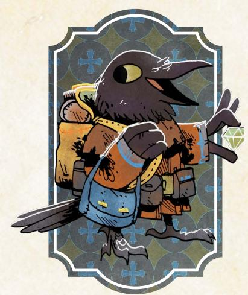

# The Dealer

*You traffic in important items—relics, artifacts, and more. But you aren't just putting money away for a rainy day; you've got an empire to build!*

#### Species

• fox, mouse, rabbit, bird, crow, other

#### Demeanor

• boisterous, gossipy, ingratiating, quiet

#### Details

- he, she, they, shifting
- cold, colorful, scruffy, slick
- coat full of pockets, lots of rings, squashed top hat, fancy cane

#### Charm +1

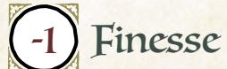

Add +1 to a stat of your choice, to a max of +2

#### Weapon Skills

Choose one weapon skill to start

- Harry
- Improvise
- Quick Shot
- Storm a Group

# Roguish Feats

You start with this one: Counterfeit

Equipment Starting Value 11

| Your Nature choose one |  |  |  |
|------------------------|--|--|--|
|------------------------|--|--|--|

- Kingpin: Clear your exhaustion track when you make a public example of someone threatening your business interests.
- Broker: Clear your exhaustion track when you convince someone influential to enter a mutually beneficial partnership.

#### Your Drives choose two

- Crime: Advance when you illicitly score a significant prize or pull off an illegal caper against impressive odds.
- Greed: Advance when you secure a serious payday or treasure.
- Loyalty: You're loyal to someone; name them. Advance when you obey their order at a great cost to yourself.
- Clean Paws: Advance when you accomplish an illicit, criminal goal while maintaining a believable veneer of innocence.

#### Your Connections

See Root: The RPG page 51 for mechanical effects.

- Friend: \_\_\_\_\_\_\_\_\_\_\_\_ was there to bail me out when an illicit deal went terribly wrong. How did they help me? What over-the-top gift did I use to express my gratitude?
- Partner:\_\_\_\_\_\_\_\_\_\_\_\_ and I worked together to bring a treasure to a faction, succeeding despite another faction trying to sabotage us. What did we recover for the faction we helped?

{68}------------------------------------------------

#### Dealer Moves

you get **whisper network**, **investments!**, and one more**!**

#### Whisper Network

At the start of play—or when time passes—name an active faction, and roll with Cunning. On a hit, your network gives you a lead on a treasure desired by a high-status member of that faction, someone who is willing to pay fairly (roughly 6-Value per member of your band) and guarantee your safety upon delivering the treasure; the GM picks up to two:

- the treasure is in a hard-to-reach area (ex: a forest ruin, far-off clearing, etc.)
- the treasure is held securely by another faction or vagabond
- the treasure is in a particularly dangerous location

On a 10+, the treasure is extremely valuable to the faction...so much that another faction (GM's choice) would pay to keep it out of their hands. On a miss, someone approaches you—on behalf of a powerful patron from the faction—to demand you secure for them an item you had previously sold to a different faction; take the job or mark 3-notoriety and make an enemy of the patron.

#### Investments!

You start play with 10-value of gold earmarked for Investments. When you **invest at least 5-Value worth of coin into expanding your business interests** in a clearing, choose one Investment [\(page 70](#page-70-0)) for purchase. You can select any available Investment, but some Investments require you to buy a cheaper version before upgrading to the more expensive version. You can only purchase one new Investment from each level (5-Value, 10-Value, 15-Value) at a time; you have to wait for time to pass before investing again.

#### Market Research

When you **figure someone out**, you can always ask (even on a miss), "What does your character desperately need?" Take +1 when acting on the answer.

#### Dishonest Scales

Gain the roguish feats *Pick pocket* and *Sleight of hand* (they don't count against your limit). When you **attempt a roguish feat** as part of a conspiracy to defraud someone of an asset or holding, roll with Cunning instead of Finesse.

#### Better Part of Valor

When you **dramatically feign death during a fight** in a way that puts you out of reach—falling off a cliff, casting yourself into the river, etc.—roll with Cunning. On a hit, your opposition falls for your ruse, and you live to fight another day. On a 7-9, you also lose something precious—coin, a weapon, etc. On a miss, the ruse fails: you suffer 2-injury...and your enemies are still right on your tail!

#### Always Be Crowing

Take +1 Cunning (max +3).

{69}------------------------------------------------

#### Background Questions

| Where do you call home?                                                                                                     | Whom have you left behind?                                                                                           |
|-----------------------------------------------------------------------------------------------------------------------------|----------------------------------------------------------------------------------------------------------------------|
| " clearing " the forest " a place far from here Who taught you the trade?                                 | " my family " my loved one " my former business partner " my protégé " my one true friend |
| " a retired vagabond " an infamous crimelord " a duplicitous faction leader " my misunderstood parents | Which faction have you given the most lucrative deals? (mark four prestige for appropriate group)              |
| " my ne'er-do-well grandparent                                                                                           | From which faction have you stolen a treasure already? (mark two notoriety for appropriate group)           |

Savvy, calculating, ambitious, risky. The Dealer is a businessperson at heart; they're skilled at making coin by selling rare objects, and then spending that coin to make more coin. The playbook will be appealing to anyone who likes to play with a pretty clear sense of "progression." Find treasures and complete deals to earn coin, then spend that coin on Investments!

That said, when you're playing the Dealer, you have to start to care about something. It's easy, especially early on, to just play into the Value cycle. But your Investments represent a commitment to a particular clearing—after all, if that clearing is torched by a rampaging horde of the Hundreds, your investments will likely be lost! If it's taken over by a conquering army of the Eyrie Dynasties—who just so happen to hate your guts—then you're going to have a hard time collecting a return! Seek the moment when your investments change to actually caring about clearings and their well-being.

Your natures reflect two kinds of doing business. "Kingpin" turns you into a an intimidating, illicit entrepreneur, willing to make threats and take action to protect your interests. "Broker" puts your focus on finding deals with mutual benefit. Think about what kind of tenor you're interested in your Dealer having with their deals before you pick your nature.

Your drives further help set up the different kinds of Dealer you might be. "Greed" is pretty easy and obvious, but "Crime" and "Clean Paws" let you aim for particular ends of that spectrum—whether you'd rather be a black market dealer or a respectable businesscrow. "Loyalty" is a great drive for expanding your Dealer to have more commitments and connections than just seeking coin, especially if they can be loyal to a particular clearing they're invested in!

Chapter 4: New Playbooks 69

{70}------------------------------------------------

#### Investment List

The Dealer pays Value to make investments in clearings. These investments are each available once for any given clearing; you could, for example, invest in Local Toughs in many different clearings. Pay attention to which investments are upgrades, requiring you to get those earlier investments in their clearing first. Some investments offer a one-time benefit, and others offer a continuing benefit. Every investment exists in its clearing; if something untoward happens to that clearing, it is always possible for some of your investments to be lost!

70 Root: The Roleplaying Game

{71}------------------------------------------------

| " Know the Territory                                                                                                                                                                                                                                                                                                                                                                                                                                                                            |
|----------------------------------------------------------------------------------------------------------------------------------------------------------------------------------------------------------------------------------------------------------------------------------------------------------------------------------------------------------------------------------------------------------------------------------------------------------------------------------------------------|
| You establish yourself as a patron of a local historian. When you consult the custodian of lore about a fabled treasure in the area, roll with Cunning. On a 7–9, ask 1. On a 10+, ask 3. Take +1 ongoing when acting on the answers. • What dangers or risks are associated with the treasure? • What other powerful people would be interested in the treasure? • What stories are told of those who have sought the treasure? • How is the treasure connected to? |
| " Brick and Mortar                                                                                                                                                                                                                                                                                                                                                                                                                                                                              |
| You establish a physical storefront in the clearing with legal goods on display—and a secure backroom for other dealings. While you are within your establishment, roll with +1 when you attempt a roguish feat, figure someone out, persuade an NPC, read a tense situation, or trick an NPC.                                                                                                                                                                                            |
| " Lending House                                                                                                                                                                                                                                                                                                                                                                                                                                                                                 |
| [Upgrades Risky Loan] You are known within the clearing as a moneylender; each time you visit this clearing, you can call in a Risky Loan your agents gave to a local business in your absence.                                                                                                                                                                                                                                                                                              |
| 15-Value Investments                                                                                                                                                                                                                                                                                                                                                                                                                                                                               |
| " Eager Apprentice                                                                                                                                                                                                                                                                                                                                                                                                                                                                              |
| You have secured a vagabond apprentice, someone who you one day hope to inherit your empire. Make a second PC; work with the GM to include the new character into the band. You can't help or interfere with your own characters.                                                                                                                                                                                                                                                            |
| " One Of Us                                                                                                                                                                                                                                                                                                                                                                                                                                                                                     |
| [Upgrades Friends in High Places] Your increasing influence earns you acclaim and respect from all who live here. Specify one significant change you make to the clearing using your newfound power; whenever you roll your Reputation                                                                                                                                                                                                                                                       |
| with someone who calls this clearing home, treat your Reputation as a +3.                                                                                                                                                                                                                                                                                                                                                                                                                          |
| " A Feast for Crows You and your fellow vagabonds arrange for a day of feasts and celebration, earning you the favor of the clearing's controlling faction. Each vagabond clears all notoriety with that faction and either sets their Reputation to +0 or marks 10-prestige. No member of your band can have a -3 Reputation with the faction you're impressing to purchase this Investment.                                                                                    |
| " Showroom                                                                                                                                                                                                                                                                                                                                                                                                                                                                                      |

[Upgrades Brick and Mortar]: Rather than sell the treasures you acquire, you can install them into your showroom. Each treasure installed this way earns you 5-prestige with each active faction in the Woodland and clears your

exhaustion track.

{72}------------------------------------------------

#### Notes on The Dealer Moves

For *Whisper Network*, the move itself represents the network of contacts you've built up across the Woodland to keep you clued in to who needs what. The faction you name doesn't have to be friendly; even a bitter enemy could desperately want something, and if you're hoping to make amends, bringing a valuable object is a great way to do it! The GM always picks exactly what you're being asked to recover, by which specific person, and the conditions that complicate your retrieval (up to two from the list). On a 10+, whatever you're seeking is extraordinarily valuable to the faction in question...which means other factions would pay to keep it out of their paws. The advantage of a 10+ is that you get a bit of a choice of which faction to deliver the object to, and you can even try to set up a bidding war! The second faction is always willing to meet or beat the original price, and the first faction might be willing to raise the price as well...but those negotiations will have to be handled in person. On a miss, the item you had previously sold to another faction can be something you sold during the course of the campaign, or it can be something you sold before the game even began. Work with the GM to make those details make sense.

For *Investments!*, keep in mind the key restrictions: you can only make any given investment for each individual clearing a single time; you often will have to buy a lower-level investment before upgrading to a higher-level one; you can only invest in increments of 5, 10, or 15 Value; and at any given time, you can only purchase one investment at each increment. If you want to make more investments, you'll have to return after time passes. This move gives you 10-Value for investments to start; you can spend it when you make your character, or wait until the right time. You can't use it for any other purpose. You can supplement that 10-Value with additional coin you earn elsewhere.

For *Market Research*, keep in mind you can always ask the question whenever you *figure someone out*. It does not count against the total number of questions you can ask when you *figure someone out*.

For *Dishonest Scales*, *attempting a roguish feat* as "part of a conspiracy to defraud someone of an asset or holding" means that you're trying to steal something by talking or tricking someone, and it isn't a spur of the moment decision. If you have a plan to steal something from someone—and it involves trickery as opposed to simply breaking and entering—you can consider it part of a conspiracy to defraud someone of an asset or holding.

For *Better Part of Valor*, you must put yourself out of reach. If you feign death but leave yourself where your foes can actually check you, then this move doesn't trigger. You've got to dramatically throw yourself off a balcony or into a raging river! The GM tells you what you lost on a 7-9, imposing any cost that makes sense. On any hit, your foes won't search for you, at least for long enough for you to collect your wits and get away.

{73}------------------------------------------------

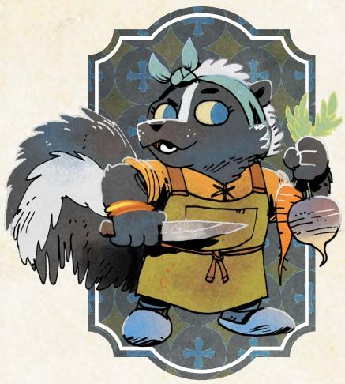

# The Gourmand

*You are a master of turning ingredients into artful meals. But the best ingredients are in the wider Woodland—for your art, you're willing to go anywhere and do anything!*

#### Species

• fox, mouse, rabbit, bird, skunk, other

#### Demeanor

• clumsy, endearing, sly, thoughtful

#### Details

- he, she, they, shifting
- fastidious, rumpled, proper, colorful
- camping pot, collection of spices, oversized coat, fancy chef knife

#### Your Nature choose one

- Perfectionsit: Clear your exhaustion track when you disdainfully refuse something (a deal, an item, payment, etc.) because you (unreasonably) demand better.
- Provider: Clear your exhaustion track when you provide comfort, solace, or sustenance to someone otherwise bereft at a cost to yourself or your comrades.

#### Your Drives choose two

- Ambition: Advance when you increase your reputation with any faction.
- Clean paws: Advance when you accomplish an illicit, criminal goal while maintaining a believable veneer of innocence.
- Discovery: Advance when you encounter a new wonder or ruin in the forests.
- Loyalty: You're loyal to someone; name them. Advance when you obey their order at a great cost to yourself.

# Your Connections

See Root: The RPG page 51 for mechanical effects.

- Family: Once, I took care of \_\_\_\_\_\_\_\_\_\_\_\_, helping them find their feet and keeping them sustained, but now they resist me trying to care for them. What happened between us?
- Friend: \_\_\_\_\_\_\_\_\_\_\_\_ always helped provide me with the ingredients I needed in exchange for a square meal...though they never hesitated to tell me when my recipes needed work. What is the strangest thing they brought me?

Charm +1

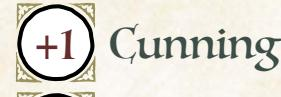

Finesse +1

Luck 0

Add +1 to a stat of your choice, to a max of +2

#### Weapon Skills

Choose one weapon skill to start

- Confuse Senses
- Improvise
- Quick Shot
- Trick Shot

#### Roguish Feats Pick any two to start.

Equipment Starting Value 8

Chapter 4: New Playbooks 73

{74}------------------------------------------------

# Gourmand Moves

you get **herbs & spices**, **recipe for success**, and **excellent service**

#### Herbs & Spices

When you **assess appropriate surroundings for ingredients**, roll with Cunning. On a hit, you spy something useful; the GM will tell you what ingredient you spot (1-Value+), and how you might harvest it safely. On a 10+, it's extremely valuable, worth at least 3-Value. On a miss, you can't find anything you can convince yourself is acceptable; mark 2-exhaustion.

#### Recipe for Success

When you **try to cook an impressive meal**, roll with Finesse. On a hit, the meal is finished; choose benefits for the eater(s) equal to the ingredients' Value and 1 cost. On a 10+, the meal is exceptionally impressive; choose an additional 2 benefits. On a miss, things go embarrassingly awry; mark 3-exhaustion and finish the meal (choosing benefits as normal) or you cannot clear exhaustion until the next time you successfully cook an impressive meal, your choice. Benefits: *Clear 2-exhaustion (can be chosen twice); clear 1-injury (can be chosen twice); achieve clarity—the GM provides insight on your problems; your heart is lifted—clear all morale (NPCs) or gain +1 ongoing to achieve a goal this session (PCs)* Costs: *It takes a lot of time; mark 2-depletion; mark 2-exhaustion; mark 1-injury*

#### Excellent Service

When you **serve an impressive meal to an important NPC**, roll with Charm. On a hit, your entire service impresses them alongside the meal; they express their gratitude. Choose 1 from below. On a 10+, they feel incredibly grateful to you; choose 2 from below. If the meal you served was exceptionally impressive, choose an additional 1 from below. Each option below can be chosen twice.

- they will answer a question truthfully
- they will spread word of your greatness; take 3-prestige with their faction
- they will counter word of your misdeeds; erase 2-notoriety with their faction
- they will provide you with a gift worth 2-Value
- they will provide you help as if you had rolled a 10+ to *ask them for a favor*

#### The Perfect Filet

Take the weapon skill *Vicious Strike* (it does not count against your advancement limit). When you **use** *Vicious Strike* **with a kitchen implement**, roll with Finesse instead of Might.

#### Campfire Cook

When you **cook for vagabonds resting rough**, mark 1-exhaustion or 1-depletion to allow each of them to clear an additional 2-exhaustion.

#### Renowned Culinary Master

When you **persuade an NPC with a promise of an impressive meal**, you may add your Reputation with their faction in addition to your Charm (max +4).

{75}------------------------------------------------

#### Background Questions

| Where do you call home?                                                                                                                                      | Who inspired your love of cuisine?                                                                                 |
|--------------------------------------------------------------------------------------------------------------------------------------------------------------|--------------------------------------------------------------------------------------------------------------------|
| " clearing                                                                                                                                                | " My parents                                                                                                    |
| " the forest                                                                                                                                              | " An older sibling                                                                                              |
| " a place far from here                                                                                                                                   | " A renowned teacher                                                                                            |
| Why are you a vagabond?                                                                                                                                      | " A child or ward " A beloved cook of my home                                                             |
| " I want to perfect my craft " I swore to give someone a perfect meal with hard-to-find ingredients " I was driven to flee by a rival chef | Which faction most recognizes your skill as a culinary genius? (set your reputation with that faction at +1) |
| " I crave the most exceptional tastes in the Woodland " I seek fame as the greatest chef in the Woodland                                      | Which faction wishes to claim your service? (mark two prestige for appropriate group)                        |

Artistic, exacting, generous, unthreatening. The Gourmand can turn simple ingredients into delicious feasts and exceptional ingredients into a divine repast.

As the Gourmand, you have ambitions that reach well beyond merely cooking each day. You are seeking some extraordinary aspect of your craft—even if you once held a cushy or easy job as an ordinary cook—and the only way you will find it is out in the Woodland. You have the skills to be a chef to royalty, but not the temperament...at least, not right now. Make sure you know what you seek, and why it is so hard to find.

Your natures help direct you to whatever it is you seek. If you are a "Perfectionist," then you are seeking the best of the best of the best; you will settle for nothing less. If you are a "Provider," then you are constantly seeking the pleasure that comes form helping those less fortunate, but that will always keep you away from those very halls of power where you could find a fortune.

Your drives help focus your obsession into particular directions, such as raising your reputation with a faction or discovering new ingredients. Think about how your drives direct you to pay attention to the factions—you are at some risk of losing yourself in your own little culinary world, so the ties that get you to look up and pay attention to the wider war are valuable to your story!

Your three main moves create a flow for your cooking. *Herbs & Spices* gets you your ingredients; *Recipe for Success* allows you to cook extraordinary meals; and *Excellent Service* helps you to actually present and serve those meals in a way that can get you further advantages. If you're at a loss at any time, refer to that cycle and wherever you are in it to figure out what you need to do next.

{76}------------------------------------------------

#### Notes on The Gourmand Moves

For *Herbs & Spices*, you can only evaluate any given area once until time passes again; you can't simply assess an area over and over. The Value of the ingredients is real; you could try to sell them! But for a Gourmand, it's most useful for *Recipe for Success*, guaranteeing you a baseline Value without having to spend any additional Value. The ingredients you find with this move can feed approximately 4-5 eaters.

For *Recipe for Success*, you can try to cook an impressive meal with any ingredients, but the more valuable the ingredients, the more likely you are to be able to provide many benefits. Work the GM if you're unclear on the Value of your ingredients for any given meal; the Value should reflect the quality of the ingredients for about four or so eaters. If you are serving a vast banquet, for example, the Value spent on the overall feast would obviously be higher just because you must work with more food—but for this move, pay attention only to the average Value for four or so eaters. That said, even if you are serving a great feast (and have enough ingredients to do so), this move provides its benefits to everyone who eats. The effects go straight to the eater; they are the ones who clear exhaustion or gain insight, for example. On a miss, you can always choose to finish the meal as normal so long as you have the exhaustion to mark; if you don't mark the exhaustion, then the meal is a mess that provides no benefits, and you cannot clear exhaustion for any reason or by any means until you use this move successfully again.

For *Excellent Service*, you do not have to be serving a meal you cooked to trigger the move...but the meal must be impressive, and the NPC must be important. This move only covers the quality of your actual service, acting as a waiter for them. Keep in mind that if you get a 10+, each option may be chosen twice. Note that the move has no specific miss condition; the GM gets to say what happens on a miss based on what fits the situation, including being interrupted or making a terrible faux pas during your service of the meal.

For *The Perfect Filet*, a kitchen implement is any tool you would use, first and foremost, to cook! You can have a knife that is especially sharp, but if it's intended as a combat knife, then it's not a kitchen implement anymore.

For *Campfire Cook*, vagabonds are "resting rough" any time that they are sleeping out in the forest, along a path, or otherwise without safe, built lodgings. You can use this to supplement one of the travel moves appropriately, or any time that the vagabonds take in a meal in appropriate circumstances. The "additional 2-exhaustion" they can clear is in addition to whatever the move or the normal meal would allow them to clear.

For *Renowned Culinary Master*, remember that the max bonus of +4 applies to the total of your Charm and your Reputation. To persuade an NPC with the promise of an impressive meal, they do have to have some awareness of who you are and believe that you can actually provide that meal.

{77}------------------------------------------------

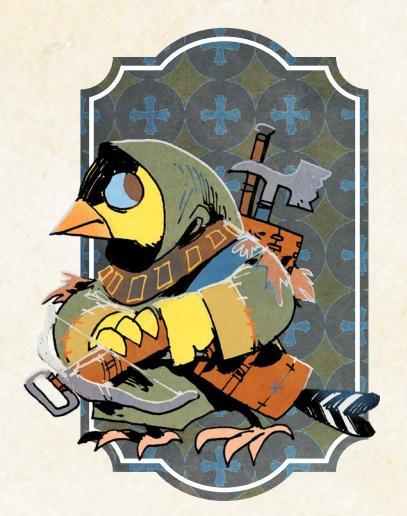

# The Hunter

*You are a quick, intelligent foe of the great monsters of the Woodland. But the very skills that make you suited for addressing those threats make you a poor fit for anything else.*

#### Species

• fox, mouse, rabbit, bird, goldfinch, other

#### Demeanor

• awkward, piercing, gentle, direct

#### Details

- he, she, they, shifting
- worn, monocolor, startling, hard
- tethered trophies, iconic necklace, coils of thick rope, prosthetic limb

#### Charm -1

Add +1 to a stat of your choice, to a max of +2

#### Weapon Skills

Choose one weapon skill to start

- Cleave
- Confuse Senses
- Storm a Group
- Vicious Strike

#### Roguish Feats

You start with these three: Blindside, Disable Device, Hide

Equipment Starting Value 8

#### Your Nature choose one

- Skeptic: Clear your exhaustion track when you openly and dangerously question the motives of a powerful character.
- Romantic: Clear your exhaustion track when you make yourself vulnerable to someone you hope you can trust.

#### Your Drives choose two

- Justice: Advance when you achieve justice for someone wronged by a powerful, wealthy, or high-status individual.
- Protection: Name your ward. Advance when you protect them from significant danger, or when time passes and your ward is safe.
- Freedom: Advance when you free a group of denizens from oppression.
- Greed: Advance when you secure a serious payday or treasure.

#### Your Connections

See Root: The RPG page 51 for mechanical effects.

- Watcher: I have doubts about \_\_\_\_\_\_\_\_\_\_\_\_ and their motivations ever since they harmed some denizens with their actions. What did they do, exactly? Why don't they seem to feel they did something wrong?
- Peer: \_\_\_\_\_\_\_\_\_\_\_\_ assisted me in dealing with a dangerous monster that had come to threaten a whole clearing. What did we defeat? How did we defeat it? Why doesn't the clearing feel more indebted to us?

{78}------------------------------------------------

#### Hunter Moves

you get **traps and snares**, then choose two more

#### Traps and Snares

When you **spend time setting up traps in an area**, roll with Finesse. On a hit, mark any amount of depletion (min. 1) to create a Traps item with wear equal to twice the depletion marked. On a 10+, the Traps have +4 wear. Mark wear on the Traps to establish a trap at any range to a foe in the area—you can **engage in melee** or **target** with the trap, or mark wear again to use a weapon skill, rolling +0 in all cases. If the move tells you to suffer harm instead mark wear on the Traps. If a trap inflicts harm, mark wear on the Traps to inflict +1 harm. On a miss, you discover a serious problem; you can't set up traps until you deal with it.

#### Follow the Trail

When you **track someone or something,** roll with Cunning. On a 10+, you have a clear sense of where they are going; the GM will tell you where. On a 7-9, the trail is fleeting or the target is on the move; if you don't follow immediately, you won't find their final destination. On a miss, the GM will tell you what new danger comes upon you while you investigate the trail.

#### Slayer of Beasts

Mark exhaustion and 2-notoriety with a target's faction to **make a pointed threat** as per the Reputation Move, rolling with Might instead of Reputation.

#### Waste Not

When you **scavenge through the remains of a recent battle to find hidden items**, mark 2-notoriety with the faction of anyone present and connected to the remains, then roll with Finesse. On a 7-9, choose 1; on a 10+, both.

- y0u find some valuable items (3-6-Value); the GM tells you how much
- you find an item useful to you right now; the GM tells you how it helps On a miss, you find a few smaller hidden things (1 or 2-Value) but you are haunted by what you've done and seen; mark 2-exhaustion.

#### Poultices, Ointments, and Brews

When you have time, you can make useful potions. You may spend depletion, 1-for-1, to prep concoctions, each with a single effect upon consumption. Choose:

- **Healing**: Mark exhaustion to clear 1-injury.
- **Awareness**: Mark exhaustion to ask a question from **read a tense situation**.
- **Energy**: Clear all exhaustion; at the end of the scene, mark 2-injury.
- **Quickness**: Mark exhaustion to speedily change your range from a foe.
- **Fury**: Mark exhaustion to fill yourself with a chemical rage and inflict an additional 1-injury the next time you inflict harm this scene.

#### A Hunter's Look

You built a reputation as an effective professional. When you **meet someone important for the first time**, if you approach as a hunter, you may mark notoriety with their faction to roll at +1 instead of your Reputation.

{79}------------------------------------------------

#### Background Questions

| Where do you call home?                                                                                                                                                                                                                                                                                       | Whom have you left behind?                                                                                                                                  |
|---------------------------------------------------------------------------------------------------------------------------------------------------------------------------------------------------------------------------------------------------------------------------------------------------------------|-------------------------------------------------------------------------------------------------------------------------------------------------------------|
| " clearing " the forest " a place far from here Why are you a vagabond? " I am judged strange by others " I could not ply my craft otherwise " I can't stand society's lies and games " I have never known any other life " I am pursuing an errant loved one | " my mentor " my family " my partner " my love " my child Set your Denizen reputation to -2. Which faction have you served |
|                                                                                                                                                                                                                                                                                                               | the most? (mark two prestige for appropriate group) With which faction have you earned                                                                |
|                                                                                                                                                                                                                                                                                                               | a special enmity? (mark one notoriety                                                                                                                       |

Deadly, thoughtful, strange, elusive. The Hunter is a slayer of dangerous monsters, capable of facing beasts that even other vagabonds find too daunting.

for appropriate group)

As the Hunter, you are prepared to pursue many different kinds of foe, but you are implicitly aimed at these great beasts. When playing the Hunter, you should seek opportunities to flex your skills, including asking local denizens about these kinds of threats. GMs should be sure to bring monsters into the Woodland if you're playing the Hunter. Similarly, if everyone has agreed that they are not interested in monsters as described on [page 121](#page-121-1) of this book, then the Hunter may not be a good playbook for your game.

On the flip side, the Hunter is so good at fighting monsters that they might want to veer away from everything else! Your natures are particularly important as elements that push the Hunter to interact with other characters. A "Skeptic" Hunter continually creates problems by openly questioning powerful people, and a "Romantic" hunter keeps falling for the wrong people! Keep in mind that for the "Romantic" nature, the fact that you hope you can trust them means you can't know, for sure, that you can trust them; there still has to be significant doubt for there to be hope.

Your drives are also just as important for incentivizing you to get involved with the Woodland itself. "Greed" gives you plenty of reason to seek new jobs killing monsters, but "Justice," "Protection," and "Freedom" all aim you at other causes you might have beyond just monster-hunting. Pick drives that represent the ways in which you are interested in getting involved with the Woodland!

{80}------------------------------------------------

#### Notes on The Hunter Moves

For *Traps & Snares*, you are spending time and resources (through depletion) to set up a series of traps, and then revealing them as you need them. The single Traps item you create is just a representation of all the traps you have left throughout the area. When you establish a trap, you can say that the trap is at any range to your target to ensure you can use whatever move you want. You can either *engage in melee* or *target a foe* just by establishing the trap at the cost of 1-depletion, but any other weapon move you use costs an additional 1-depletion. You must be trained in any weapon skill move you try to use with your Traps. Using your Traps can never cause you to suffer additional harm; be sure to only mark such harm as wear on the Traps item. Bey default, any given trap deals 1-injury in harm, but you can mark an additional wear on the Traps item to have it deal +1-injury, and if the GM agrees, any given trap might deal exhaustion or depletion harm based on its form. Each trap is usually a single-use trap; if you want to attack with a trap again, you'll have to establish a new one by marking another wear on your Traps item.

For *Follow the Trail,* a 10+ guarantees you full knowledge about exactly where they are going. You are then free to act on that knowledge at your discretion. A 7-9, however, requires you to act and follow them immediately to find out where they are going; if you do not, they escape, and you won't be able to find them.

For *Slayer of Beasts*, the only requirements to *make a pointed threat* are marking the exhaustion and the notoriety; you do not need -3 Reputation with their faction. When you roll with Might, simply roll as normal instead of inverting it the way you would have inverted your Reputation. Read more about this move on page 118 of the Root: The RPG core book.

For *Waste Not*, you can only use this move if the battle was "recent." That is a relative assessment, and the GM is the final arbiter of whether or not the site of the battle is fresh enough to offer you opportunities. In general, no battle older than a week could be considered "recent." A battle usually means a fight of the Woodland War between at least two factions, but it might also include a battle against a beast, or some kind of disastrous internal conflict. You only mark 2-notoriety if someone of the factions involved in the fight is looking on; they are disgusted by you rooting through the remains of their compatriots. If no one connected to a faction involved in the conflict is around, you can loot freely.

For *Poultices, Ointments, and Brews*, you must have time to prepare concoctions. You do not have any concoctions unless you explicitly spend the time and resources to brew them. They provide their effect to any character who imbibes them, and they are consumed when used.

For *A Hunter's Look*, you use the value of +1 instead of your Reputation when you identify yourself as a hunter before *meeting someone important for the first time*. It entirely replaces your Reputation value, whatever it might be.

{81}------------------------------------------------

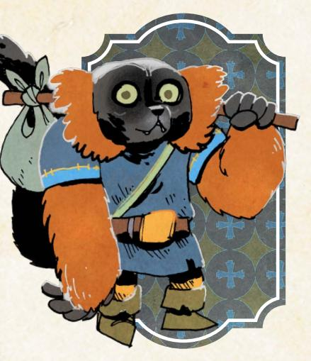

# The Nomad

*You aren't from the Woodland; you've traveled far and wide, and your journey brought you here. You seek to see all there is to see in this land at war with itself.*

#### Species

• fox, mouse, rabbit, bird, lemur, other

#### Demeanor

• loquacious, naive, stubborn, wise

#### Details

- he, she, they, shifting
- colorful, eclectic, intricate, curious
- linen trousers, folk embroidery, whittling supplies, beaded jewelry

#### Your Nature choose one

- Fool: Clear your exhaustion track when you embarrass an authority by publicly stating a truth no one else wants to tell them.
- Sage: Clear your exhaustion track when you convince an ordinary denizen to give up on a custom, tradition, or role that no longer serves them.

#### Your Drives choose two

- Principles: Advance when you express or embody your moral principles at great cost to yourself or your allies.
- Freedom: Advance when you free a group of denizens from oppression.
- Thrills: Advance when you escape from certain death or incarceration.
- Wanderlust: Advance when you finish a journey to a clearing.

#### Your Connections

See Root: The RPG page 51 for mechanical effects.

- Watcher: I was passing through a clearing when I saw \_\_\_\_\_\_\_\_\_\_\_\_ doing something truly brave and deeply foolish. Which one was it? What did I learn from it?
- Protector: I think \_\_\_\_\_\_\_\_\_\_\_\_ is still wet behind the ears. If they're going to survive, they're going to need me looking out for them. What am I intent on teaching them?

Charm 0

Cunning 0

Finesse 0

Luck +1

Add +1 to a stat of your choice, to a max of +2

#### Weapon Skills

Choose one weapon skill to start

 Cleave

 Parry

 Storm a Group

 Trick Shot

Roguish Feats Pick any three to start.

Equipment Starting Value 7

{82}------------------------------------------------

#### Nomad Moves

you get Itchy Feet, **Stranger in a Strange Land**, and one more

| " | Itchy Feet |
|---|------------|
|---|------------|

When you **put your past experiences on the road to use solving a problem**, mark a condition below to take a 10+ instead of rolling on any move:

- **Bored**: cross out a box of exhaustion; you can't clear it. Learn a new skill or tradition from a local to clear *Bored*.
- **Irritable**: take -2 to **persuading NPCs**. Experience a new relaxing or luxurious local custom to clear *Irritable*.
- **Lethargic**: take -2 to **tricking an NPC**. Enjoy a new stimulating or exciting local amusement to clear *Lethargic*.
- **Distracted**: take -2 to **attempting roguish feats**. Help a local denizen complete a laborious, mundane project to clear *Distracted*.

When you leave a clearing and hit the open road, clear one of your marked conditions and give the group +1 forward to their chosen travel move.

#### Stranger in a Strange Land

When you **wander about a clearing by yourself to observe the locals and their customs**, roll with Luck. On a 7–9, ask one. On a 10+, ask two.

- *Who has the most potential to change things here?*
- *What is this clearing's greatest vulnerability?*
- *Who here can be trusted by my band of vagabonds?*
- *What is the greatest threat to the controlling faction's hold?*

On a miss, your curious meandering leads you right into the middle of an awkward, dangerous, or incriminating situation you should have seen coming.

#### Truth to Power

When you **share your perspective as an outsider** to **sway an NPC** authority figure, mark exhaustion to roll with Luck instead of Reputation.

#### Born Under a Wandering Star

Take one extra box of exhaustion. When you travel from clearing to clearing by path at a relaxing or average pace, clear your exhaustion track after the roll.

#### I've Seen This Before

When you **offer comfort—a story, a meal, a song—to an NPC paralyzed by emotion**, roll with Luck. On a hit, you bring them back to themselves, and they immediately strive to make things right. On a 10+, they are truly thankful for your wisdom; mark 2-prestige with their faction as well. On a miss, you realize too late how badly you misjudged things; they reveal the terrible truth.

#### I'll Take That

Take the weapon skill *Disarm* (it does not count against your limit). When you **disarm** someone who is threatening someone weaker, roll with Might instead of Finesse; if they lose the weapon, mark exhaustion again to end up with it.

{83}------------------------------------------------

#### Background Questions

#### Why do you wander?

| I seek to find a loved one who left me behind           |
|---------------------------------------------------------|
|                                                         |
|                                                         |
|                                                         |
|                                                         |
|                                                         |
| I was born into a nomadic community of fellow wanderers |
| My desire for knowledge transcends all borders          |

| " | I have sworn to serve this band, for   |
|---|----------------------------------------|
|   | their good and for mine                |
| " | I am consistently entertained by their |

- antics and adventures
- They know the Woodland well, and I see them as guides
- They are destined for greatness, and I want to see their rise

Which faction have you served the most? (mark two prestige for appropriate group)

With which faction have you earned a special enmity? (mark one notoriety for appropriate group)

Eccentric, unsettled, agog, disconnected. The Nomad is a traveling vagabond, not from the Woodland but interested in seeing everything it has to offer.

As the Nomad, you aren't from the Woodland...but you are fascinated by it. Your interest is experiencing the place, and that means moving from clearing to clearing, taking in everything you can as you go. You're a constant outsider, which means you have both plenty to learn and plenty to teach. You can be the voice that calls out the flaws of the Woodland, just as much as you might be the target of a great deal of ire for those frustrated with other aspects of their lives.

Your natures encourage you to use your outsider's perspective to get involved in the challenges of each clearing. "Fool" pushes you to embarass figures of power with unwelcome truths no one else will state—so don't hesitate to get in the faces of powerful figures and call them out. "Sage" encourages you to do much the same for ordinary denizens by showing them other ways without the useless customs they maintain out of simple tradition. In both cases, the Nomad is more than just a passive observer; you should interact and participate, sharing your own thoughts as much as you learn about this place.

The most important balance to strike as the Nomad is between moving on and getting involved for an extended period. Depending upon the other vagabonds in your band, you might be under a lot of pressure to stick around. You can do that, but it wll slowly drain your resources. Make sure you aren't making it unnecessarily difficult to stay when your band of vagabonds has business in a clearing, while also pushing them to move on when the time is right.

{84}------------------------------------------------

#### Notes on The Nomad Moves

For *Itchy Feet*, in order to trigger the move you do have to explain a past experience and how it relates to this moment, but you can be creative as you describe experiences from before your campaign even began, from places far from the Woodland. Use this move before you roll; instead of rolling, you take the 10+. The real cost of using this move is marking one of the conditions. As long as that condition is marked, you continue to experience its effects. The only way to clear a condition is to either fulfill its special requirement, or to leave a clearing and hit the road. Heading into the forest will do it, but leaving a forest won't clear a condition you have to reach a new clearing and leave it again to clear another condition!

For *Stranger in a Strange Land*, you ask the questions of the GM, who answers honestly. The questions represent things you learned as you wandered about, including truths that no one in the clearing may openly acknowledge. Work with the GM to establish exactly how you learned any of these truths, including where you went and whom you spoke to as you poked around.

For *Truth to Power*, when you share your perspective as an outsider, it allows you to use the **sway** Reputation move (core book, page 117) without having the necessary reputation. As long as you mark the exhaustion, you can use that move with your Luck instead of your Reputation, ignoring the prerequisite.

For *Born Under a Wandering Star*, remember that you clear your exhaustion track after the roll, after any additional costs have been paid to travel between clearings.

For*I've Seen This Before*, "an NPC paralyzed by emotion" is an NPC who is unable to act, stuck in a moment by their feelings and their situation. For example, an NPC who has lost so much that they don't have the will to fight back against an oppressor would be paralyzed by emotion; so too would an NPC who feels obligated to their Marquisate parents and won't defy them, even though they wish they could. This move allows you to help break them out of their paralysis; when you bring them back to themselves, they can begin to move again, taking action. You don't get to control what they do, but they will "strive to make things right" that means they will do their best to make amends and rectify a bad situation however they can. On a miss, "they reveal the terrible truth" refers to them showing that they were never paralyzed the way you had imagined, and their beliefs about right and wrong in their situation are wildly different than what you would have hoped for or expected.

For *I'll Take That*, "someone who is threatening someone weaker" is an assessment made from your perspective. It might turn out that the situation wasn't what you had imagined, but so long as you honestly believe someone weaker is being threatened, you can trigger this move. When you mark exhaustion after they lose their weapon, you immediately grab it and take control of it, instead of it simply being cast to the side.

{85}------------------------------------------------

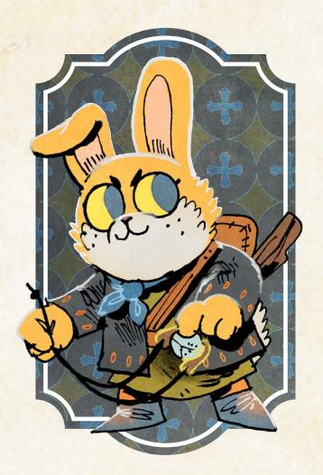

# The Orphan

*You grew up alone, your parents lost in the war or simply unable to care for you. Now you've set out to find your own way, learning the ways of the forest and roads from the vagabonds who know them best.*

#### Species

• fox, mouse, rabbit, bird, other

#### Demeanor

• resolute, energetic, gullible, tough

#### Details

- he, she, they, shifting
- bright-eyed, messy, haunted, small
- family memento, hooded cloak, patchwork vest, threadbare trousers

#### Charm 0

Cunning 0

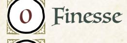

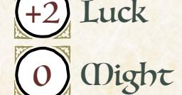

Add +1 to a stat of your choice, to a max of +2

#### Weapon Skills

Choose one weapon skill to start

- Disarm
- Harry
- Quick Shot
- Trick Shot

#### Roguish Feats

You start with these three: Acrobatics, Pick pocket, Sleight of hand

Equipment Starting Value 8

#### Your Nature choose one

- Defiant: Clear your exhaustion track when you set out alone to deal with a serious problem without consulting your band.
- Scrappy: Clear your exhaustion track when you take out a dangerous foe without marking depletion or wear.

#### Your Drives choose two

- Ambition: Advance when you increase your reputation with any faction.
- Discovery: Advance when you encounter a new wonder or ruin in the forests.
- Thrills: Advance when you escape from certain death or incarceration.
- Chaos: Advance when you topple a tyrannical or dangerously overbearing figure or order.

# Your Connections

See Root: The RPG page 51 for mechanical effects.

- Protector: \_\_\_\_\_\_\_\_\_\_\_\_ reminds me of a lost family member or loved one. What is it about them that makes me feel like they need my protection?
- Family: \_\_\_\_\_\_\_\_\_\_\_\_ has treated me like family from the day we met. How do I prove myself worthy of their belief in me?

{86}------------------------------------------------

#### Orphan Moves

you get **still learnin'**, then choose two more

| " Still Learnin' What you lack in experience, you make up for in enthusiasm; you have a confidence track to reflect your surefire gumption. Choose one of the other vagabonds as your idol: When you are acting as you think your idol would act, you can mark your time; when you do so, reset the track completely to the full six boxes. You can never return to idolizing the same character a second time.                                                                                                          | Confidence: confidence track to take 10+ for any move. When you fulfill your idol's nature, clear the track and cross out one of the boxes. You can change your idol at any |
|-----------------------------------------------------------------------------------------------------------------------------------------------------------------------------------------------------------------------------------------------------------------------------------------------------------------------------------------------------------------------------------------------------------------------------------------------------------------------------------------------------------------------------------------------|-----------------------------------------------------------------------------------------------------------------------------------------------------------------------------------|
| " Easily Overlooked When you attempt these feats while something (or someone else) is offering a distraction, roll with Luck instead Finesse.                                                                                                                                                                                                                                                                                                                                                                                        | You gain the roguish feats Hide and Sneak (they do not count against your total).                                                                                                 |
| " Found Family Take two more connections. Mark exhaustion to suddenly appear in a scene with one of your connections, tumbling out of a hiding spot or nearby area, provided nothing would have kept you from reaching your fellow vagabond.                                                                                                                                                                                                                                                                                      |                                                                                                                                                                                   |
| " Street Smarts When you spend time talking to urchins and outcasts in a clearing, roll with 10+, ask two follow-up questions; the GM will answer honestly. • you find an out-of-the-way place where the band can lay low • you learn about a vulnerable target the band can exploit • you discover a hidden or secret way into an important location On a miss, your snooping has been noticed; the GM will tell you who takes an interest in you and what you'll have to do to get them to leave you alone | Luck. On a hit, you get an inkling of the clearing's best-kept secrets; pick 1. On a                                                                                              |
| " Underestimated Until you prove yourself to be a threat, no one will treat you as one. The first As soon as your Reputation with any faction reaches +2 or -2, lose this move and choose another.                                                                                                                                                                                                                                                                                                                                | time you would mark notoriety with a faction in a session, mark one fewer box.                                                                                                    |
| " Cutting Words When you trick an NPC by openly provoking them with insults, roll with Luck instead of Cunning. When you provoke another vagabond by openly mocking them, say what you want them to do and mark up to 3-exhaustion; they have to take the bait and do as you want or mark the same amount of exhaustion.                                                                                                                                                                                                       |                                                                                                                                                                                   |

{87}------------------------------------------------

#### Background Questions

#### Who took care of you?

 A large foster family, known to care for orphans A gang of urchins, who no longer see me as a child An older sibling, who gave up their dreams to care for me A traveling charlatan, who taught me the art of the con

#### Why are you a vagabond?

- I am distantly related to a member of the band
- I am apprenticing under a member of the band
- I promised the band a reward for helping me find my parents
- I simply won't leave them alone

Which faction have you served the most? (mark two prestige for appropriate group)

With which faction have you earned a special enmity? (mark one notoriety for appropriate group)

Young, naïve, determined, aspiring. The Orphan is brimming with potential, but they're still early on their journey to becoming a true vagabond.

As the Orphan, you are playing a character who *wants* to be a vagabond, but isn't really there yet. Your starting stats aren't great (except for Luck), and the GM is likely to identify tasks you have a harder time with that another vagabond can do handily. But the playbook is exciting for exactly those reasons. Play because you want to struggle, grow, and (sometimes) outshine everyone!

Both of your natures give you incentive to push yourself to the boundaries of your capabilities. "Defiant" encourages you to try to solve things without checking in with the other vagabonds, and thanks to moves like *Still Learnin'*, you have a decent chance of succeeding! But the problem you face has to be something actually dangerous and complex. "Scrappy" encourages you to to try to defeat dangerous foes while marking only exhaustion or injury during the fight. If you fight alongside other vagabonds, you might still be able to trigger "Scrappy," but you have to be the one to take the foe out. If no one would honestly give you the credit of defeating the foe, then "Scrappy" won't trigger.

As the Orphan, you must carefully veer back and forth between working with lots of other vagabonds and taking action on your own. You want to spend time with vagabonds so you can adopt them as your idols, throw questions at them, and explore both them and yourself. Then, you want to go out on your own and apply your learnings to dangerous situations! Make sure you don't go too far in either direction; too much time alone means you won't have any real relationships, and too much time with the band won't give you any spotlight. You're a student, and that means moving in and out of the others' shadows.

{88}------------------------------------------------

#### Notes on The Orphan Moves

For *Still Learnin'*, you are the final arbiter of whether you are acting as you think your idol would act, but you have to be honest about the assessment. If you use this move, you are saying something real about how you see your idol and what they would do. What's more, as they watch your actions, they become aware of how you see them. They might not want to intervene or get involved with your perspective... but if they think you see them in a way wildly out of sync with their own identity, they might want to say something about who they really are and how they would act! After that, you can't really deviate from what they have told you when using this move, unless there is some strong justification for doing so. The GM acts as the final arbiter for that kind of judgment. Fulfilling your idol's nature works exactly the same as if you had the nature on your own character sheet, but you clear your Confidence track instead of your exhaustion track. Changing your idol will also clear your Confidence track...but once you have moved on from someone as your idol, you can never name them as your idol again! You can only name the other PC vagabonds as idols, so at some point, you'll either be stuck with the last available PC as your idol, or you won't be able to have any of them as an idol—that's a good sign that it's time to move on and either retire or change playbooks.

For *Easily Overlooked*, you need someone or something else to provide an active distraction to use Luck or Finesse. So long as a distraction is present, you're set!

For *Found Family*, take any two connections from the full available set, including their mechanical effects and benefits. You can mark exhaustion to appear with any of your connections, including these two new ones and your original connections. You cannot use this move to appear with another character if there is no way to make sense of your sudden appearance.

For *Street Smarts*, nearly every clearing will have some urchins and outcasts—it's usually just a matter of finding them and endearing yourself to them to get them to talk to you. The follow-up questions you get on a 10+ should directly relate to the core piece of information you gain on a hit.

For *Underestimated*, "a threat" is always an assessment in the eye of the beholder, both for how they treat you and for when they might see you as a threat, but in general, someone who doesn't see you as a threat won't seek any harsh punishments for your misdeeds, nor will they target you in a conflict. They'll start to see you as a threat when you prove yourself a capable or dangerous figure. Remember that if you become too famous (or infamous), you lose this move and cannot take it again, but you gain another move from this playbook to replace it (or from a different playboook if you already have the other Orphan moves).

For *Cutting Words*, when you try to provoke another PC vagabond to action, remember that the cost for them to ignore your words is exactly the same as however much exhaustion you mark.

{89}------------------------------------------------

# The Scourge

*You have been wronged by someone powerful, left for dead by your nemesis after they took everything from you. Now you pursue justice for yourself and others, no matter the cost.*

#### Species

• fox, mouse, rabbit, bird, other

#### Demeanor

• taciturn, intense, weary, argumentative

#### Details

- he, she, they, shifting
- impoverished, odd, worn, youthful
- patched castoffs, feathered hat, tattered sketchbook, glass eye

#### Charm 0

Cunning 0

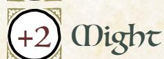

Add +1 to a stat of your choice, to a max of +2

#### Weapon Skills

Choose one weapon skill to start

- Cleave
- Quick Shot
- Storm a Group
- Vicious Strike

#### Roguish Feats

You start with this one: Acrobatics

Equipment Starting Value 11

| Your Nature choose one |  |  |  |
|------------------------|--|--|--|
|------------------------|--|--|--|

- Rescuer: Clear your exhaustion track when you sacrifice an advantage to prioritize saving the lives of the vulnerable.
- Dissident: Clear your exhaustion track when you publicly align yourself with someone wronged by the powers-that-be.

#### Your Drives choose two

- Infamy: Advance when you decrease your reputation with any faction.
- Justice: Advance when you achieve justice for someone wronged by a powerful, wealthy, or highstatus individual.
- Protection: Name your ward. Advance when you protect them from significant danger, or when time passes and your ward is safe.
- Revenge: Name your foe. Advance when you cause significant harm to them or their interests.

#### Your Connections

See Root: The RPG page 51 for mechanical effects.

- Protector: \_\_\_\_\_\_\_\_\_\_\_\_ is too trusting and needs someone watching their back. They remind me of someone I've lost. Whom do they remind me of, and how?
- Partner: \_\_\_\_\_\_\_\_\_\_\_\_ and I went up against the forces of a faction in order to bring down an evildoer connected to my nemesis. Who was the evildoer, and why did my partner also want revenge on them?

{90}------------------------------------------------

# Scourge Moves

you get **the list**, then choose two more

90 Root: The Roleplaying Game

| " The List names:                                                                                                                                                                                                                                                                                                                                                                                                                                                                                                                                                                                                                                                                                                                                                                                                                                   |  |  |  |  |  |
|--------------------------------------------------------------------------------------------------------------------------------------------------------------------------------------------------------------------------------------------------------------------------------------------------------------------------------------------------------------------------------------------------------------------------------------------------------------------------------------------------------------------------------------------------------------------------------------------------------------------------------------------------------------------------------------------------------------------------------------------------------------------------------------------------------------------------------------------------------------|--|--|--|--|--|
| At the start of the game, put two names on your list: your nemesis, and their key accomplice. Take +1 ongoing to pursue vengeance against anyone on your list. When you wreak vengeance upon someone on your list, remove them and take a Mark from the list below. Once per session, you may add an NPC to your list by taking a Mark:                                                                                                                                                                                                                                                                                                                                                                                                                                                                                                          |  |  |  |  |  |
| Marks:                                                                                                                                                                                                                                                                                                                                                                                                                                                                                                                                                                                                                                                                                                                                                                                                                                                       |  |  |  |  |  |
| " Next time you talk of your joyful life before your loss, clear 2-exhaustion. " Next time you talk about your nemesis's treachery, clear 2-exhaustion. " Your anger ever boils; take +1 to wreck something, and -1 to ask for a favor. " You weary of paltry concerns; mark exhaustion when you persuade an NPC. Take +1 to all weapon moves while you have 3+ exhaustion marked. " Only retribution satisfies; you cannot clear more than 1 exhaustion from resting. Clear 2 exhaustion when you add a wrongdoer to your list. " Vengeance begets vengeance; an NPC avenger begins pursuing you for retribution, targeting you at your weakest moments. " You lose yourself entirely to your vengeance; your character is no longer a PC. The GM may have them appear in again in the future as an NPC. |  |  |  |  |  |
| " Never Stop Making Them Pay Take an additional box of exhaustion. Once per battle, you may mark exhaustion after inflicting injury to inflict an additional 2-injury.                                                                                                                                                                                                                                                                                                                                                                                                                                                                                                                                                                                                                                                                              |  |  |  |  |  |
| " Take It From Me, Kid When you persuade an NPC by offering your bitter, hard-won wisdom, roll with exhaustion currently marked (max+4) instead of Charm. On a miss, they reject your worldview violently or embrace it all too fervently.                                                                                                                                                                                                                                                                                                                                                                                                                                                                                                                                                                                                       |  |  |  |  |  |
| " I Am the Night Take the roguish feats Hide and Sneak (they don't count against your maximum for advancement). When you attempt a roguish feat to hide or sneak while investigating wrongdoing or pursuing vengeance, roll with Luck instead of Finesse.                                                                                                                                                                                                                                                                                                                                                                                                                                                                                                                                                                                     |  |  |  |  |  |
| " At Your Mercy When you spare an NPC whom you could have destroyed or humiliated, roll with Luck. On a hit, your gesture of mercy soothes your troubled soul (clear all exhaustion) or elicits material gratitude (clear 2 or more depletion, GM's choice). On a 10+, both. On a miss, someone—perhaps even the one you spared—is quick to take malicious advantage of your foolhardy gesture.                                                                                                                                                                                                                                                                                                                                                                                                                                            |  |  |  |  |  |
| " Today is a Good Day to Die Take +1 Luck (max +3).                                                                                                                                                                                                                                                                                                                                                                                                                                                                                                                                                                                                                                                                                                                                                                                                    |  |  |  |  |  |

{91}------------------------------------------------

#### Background Questions

| Where do you call home?                                                                                               | What did they take from you?                                                                          |
|-----------------------------------------------------------------------------------------------------------------------|-------------------------------------------------------------------------------------------------------|
| " clearing "                                                                                                    | " My parents "                                                                                  |
| the forest " a place far from here                                                                              | My betrothed " My band of comrades                                                              |
| Who wronged you?                                                                                                      | " My honorable reputation " My identity                                                      |
| " A prominent aristocrat " A vindictive crime boss " A treacherous sibling " A powerful vagabond | Which faction have you served the most? (mark two prestige for appropriate group)               |
| " An enigmatic mystery                                                                                             | With which faction have you earned a special enmity? (mark one notoriety for appropriate group) |

Obsessed, righteous, baleful, indomitable. The Scourge is determined to obtain justice—or vengeance—against those who wronged them and others.

As the Scourge, you are devoted to your List—the set of individuals you seek vengeance against. You likely never want your List to be empty; it's the measure of your revenge and the source of your bonuses! If you find yourself with an empty List and no desire to add more names, then it's time to change playbooks.

Your natures help to expand your focus beyond your own vengeance. "Rescuer" directly challenges you to save lives instead of fostering your own advantages for your own goals. "Dissident" pushes you to stick your neck out for others who have been wronged by the powers of the Woodland, taking on their struggles as your own. In both cases, use your natures to help ensure you don't become too bogged down in your own search for revenge; they add nuance and new characters for you to care about as you go from clearing to clearing.

When picking your drives, aim your character in the directions you are most interested in actively exploring. Your "Revenge" drive is going to direct you at one particular target (whose name should absolutely be on your List!), and your "Justice" drive is going to play into your overall bent toward punishing the wrongdoers of the Woodland...but both of them will encourage you to play even harder into your List, hastening your Marks and potentially losing your character to their quest for vengeance! "Infamy" will likely reward you for just doing what you need to do on your quest for vengeance, but it will also encourage you to be a firebrand and a disruptor in general, instead of just a cold, calculating punisher. "Protection" adds a strong additional link to anohter character to give your Scourge more depth; choose your ward wisely!

{92}------------------------------------------------

#### Notes on The Scourge Moves

For *The List*, the +1 ongoing to pursue vengeance against anyone on your list helps you out so long as you are making a move that can be easily connected to your quest for vengeance. You can't gain this bonus in disconnected self-defense—if you're fighting some random guard, you can't take +1 just because they might end your life! But you could gain this bonus if you're pulling yourself up a cliff while your nemesis taunts you from above; their presence makes the vengeance much more directly connected. The GM is the final arbiter of whether or not your action deserves the bonus. Wreaking vengeance upon a name on the List should also be fairly easy to see; it represents the point at which, thanks to your actions, they have suffered and been laid low. The GM is the final arbiter of whether you wreak vengeance and have to take a Mark. Most of your Marks place some new effect upon your character, and that effect is permanent; you cannot remove Marks. You may choose to take your last Mark early if you want, turning your PC into an NPC devoted to vengeance, but usually you will only take that last Mark if you have no others to take. When you choose to add names to your List, be sure to try to add significant characters against whom you cannot pursue simple, easy vengeance. Your List is far better used for foes who have a lasting, resilient presence in the Woodland than for local bullies.

For *Never Stop Making Them Pay*, remember that you can only use this effect once during any given fight, and you can only use it if you are already dealing injury.

For *Take It From Me, Kid*, treat this move as any other move that allows you to roll with a different stat, simply using your current exhaustion marked instead of another stat.

For *I Am the Night*, the swap of Luck for Finesse works in both cases, whether you are pursuing vengeance or investigating wrongdoing.

For *At Your Mercy*, sparing the NPC means letting them go, leaving them unharmed, or something equivalent; you must stop before crossing a meaningful line in order to be considered to have spared them. They, and most who see the action, must understand that you spared them, that you could have destroyed them but chose to do otherwise. If the gesture elicits material gratitude, that gratitude can, but does not have to, come directly from the person you spared. It could also come from a watcher, someone who cares about the person you spared. If you roll a miss, the GM will tell you exactly how your kindness and mercy is turned against you, immediately. It's not enough that the person you spared swears vengeance for some later day; they do something right here and now.

{93}------------------------------------------------

# Beneath the Surface

Every playbook in Root: The RPG has its own focus and brings its own issues to the fore. To better play into the styles of the individual playbooks over the course of a campaign, here are some GM-side guidelines and a few playbook-specific GM moves you can use during play. These tips cover all the new playbooks in this book, with some additional information on the Dealer in particular.

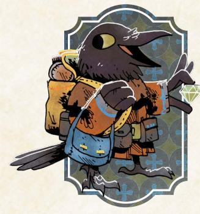

#### The Dealer

The Dealer is focused on Value more than nearly any other vagabond in the game, because they have an entire system all their own for investing their coin and trying to make more. Playing the Dealer can be very satisfying for a player who wants to focus on gaining and spending their value in a clear cycle, but as the GM, you will be responsible for ensuring that the Dealer can't just sit behind a desk and make notes in their budget books.

The Dealer, by default, trades in important, valuable items like relics. Make sure to bring their trade back to these items, especially with their *Whisper Network*. When you are choosing options for that move, your goal is always to make a treasure so valuable they can't ignore it, with just enough difficulty to obtain it that they won't blow it off and decide to make their money in an easier way!

The Dealer's *Investments* are a crucial component of their entire play cycle, too, but those *Investments* can seem much more player-driven. After all, the Dealer has to choose to pour their hard-won coin into a clearing to make any of them; you can't goad them into it! But your role as the GM is to create spaces that they might be interested in. At the start of a game, the Dealer can hold their initial Value for investments in reserve, looking for a clearing that interests them—so try to make clearings that are interesting! Doing so usually involves following the overall principles of play as normal, but pay close attention to how stable a clearing feels, and how attached to the NPCs the Dealer (or other vagabonds) become. The Dealer is unlikely to want to invest in a clearing that might burst into rebellion or terrible conflict at any minute, nor are they likely to invest in a clearing that they believe is populated by unlikable characters.

- Nave an NPC ask them for an interesting investment
- Entice them with an irresistible deal or opportunity to make coin
- Show them the consequences of their investments, good and bad

{94}------------------------------------------------

Food and supplies matter for every vagabond band, but usually only insofar as they help clear exhaustion. But the Gourmand transforms what might be a maintenance-level activity into new opportunities and potential advantages. As the GM, make sure to emphasize both the treasures that a Gourmand would care about—cooking implements and rare herbs—and the potential effects of their art form. The

Gourmand always starts with a trio of moves that cover the full range of mealmaking, from collecting components to cooking them up to serving the dishes, so be sure to draw attention to meals and feasts in a way you might otherwise gloss over. The Gourmand needs characters to cook for and chances to cook! Over time, the other vagabonds will see the potential benefits, but until they seek such chances, periodically offer them up yourself.

- Create opportunities to prepare and serve meals to hungry NPCs
- Nighlight valuable and interesting potential ingredients
- Present rivals and critics, potential threats to their reputation

#### The Dunter

On their face, the Hunter is about one and only one thing: hunting monsters. They're great at it, better than any other vagabond or warrior in the entire Woodland, and that is part of the joy of the playbook. If you have a Hunter in your game, then monsters must be a part of your Woodland and your story; otherwise, their entire special aspect won't be able to come alive! Be prepared to introduce monsters

regularly with a Hunter in play...but also keep in mind that what makes the Hunter interesting is everything else around hunting monsters. They have to interact with other denizens and the factions of the Woodland to get their jobs, to spend their coin, to resupply, to recover...and when the Hunter deals with other characters, they tend to run into trouble! As the GM, make sure that the Hunter never gets to simply skip over those dealings; they are a crucial element in making the Hunter a fleshed-out, interesting character.

- Share rumors of a terrifying monster with a reward for its defeat
- Confront them with the reverberations of their reputation and deeds
- · Push NPCs to become personally embroiled with them

{95}------------------------------------------------

All vagabonds are travelers. But the Nomad takes this aspect of the band one step higher. With a Nomad in your game, the entire band will be under greater pressure to move on to new clearings. As the GM, your role is to both provide additional incentives and reasons to move along—rumors of new conflicts, interesting opportunities, strange and fascinating customs or celebrations, and so on—and

to help guide the band through any of their own disputes about whether or not it is time to move on. The Nomad will be looking for chances to move to a new clearing, so don't double-down on an endless string of new conflicts within one place! When inside of one clearing, however, reflect the Nomad's outsider status back at them: they can be met with mistrust, but they also see opportunities to solve problems with a new perspective.

- · Pass on rumors of great opportunities in other clearings
- Display characters who need a new perspective on their problems
- · Confront them with a mistrust of outsiders and travelers

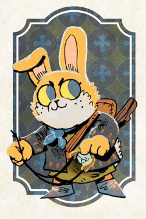

# The Orphan

The Orphan is a nascent character; they aren't really even a vagabond yet! The fundamental ideas you might apply to a vagabond—that a vagabond is by default more competent than the average denizen, that by being a vagabond they immediately get a level of respect, fear, and infamy, and so on—don't necessarily apply to the Orphan. Keep an eye on the fiction around the Orphan; for example, a vagabond

without any real pressure on them might be able to comfortably climb the side of a building without even making a move, but an Orphan probably wouldn't! At the same time, the Orphan's most important relationship—the one with their idol—is oriented toward the other PCs. As the GM, then, your role is to help remind the players that the relationship exists. Prompt the Orphan to consider if they are acting as they think their idol would, if they are fulfilling their idol's nature, or if it's time to change their idols.

- \* Openly draw attention to how they are not yet a full vagabond
- Nave NPCs underestimate and mock them
- Isolate them with opportunities to act on their own

{96}------------------------------------------------

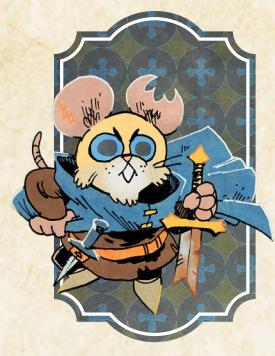

# The Scourge

Vengeance! The Scourge has their goal: inflict revenge upon their nemesis, the nemesis's accomplice, and anyone else whose name winds up on the Scourge's list. As the GM, that puts a lot of pressure on you. You need to provide NPCs who make good choices for adding to the list—villains, questionable figures, tyrants, and so on—and you need to portray their nemesis and accomplices in a

compelling, interesting way. The Scourge's player will help guide you to their understanding of the nemesis during character creation, and you shouldn't aim to undermine that comprehension much; if they want their nemesis to be the single most corrupt and dangerous figure in all the Woodland, go with it!

The point of the nemesis is to give the Scourge a worthy direction to pursue—the nemesis needs to be present in the story. Their effect upon the Woodland should be on display every now and then, even if the nemesis has their own stronghold on the entire other end of the Woodland, and they should regularly have large effects when they take center stage, using their own agents and allies to accomplish their goals (and remind the Scourge of their mission). And the nemesis themself can show up as a recurring foe! The tension between the Scourge being obsessed over a foe the rest of the band doesn't care as much about, and the nemesis of the Scourge becoming the enemy of the entire band, is productive and fun!

If the Scourge seems to be on track to defeat their nemesis "early," however, that can still be okay—follow the fiction and keep it dramatic, but don't try to keep the nemesis from defeat in an unnatural way. Such a story would become about something else, instead: what does the Scourge do now? They can always easily add new names to their List, after all. Do they just keep seeking new foes to defeat? Do they let their drive for endless vengeance drive them into destruction? Play to that question with any version of the Scourge; remind them that they get a big bonus against names on their list, and the only cost to add someone new is a single measly mark...

- Show the influence of their nemesis upon the current situation
- Present a new foe with no connection to their nemesis at all
- Gempt them with chances to find a life beyond vengeance

{97}------------------------------------------------

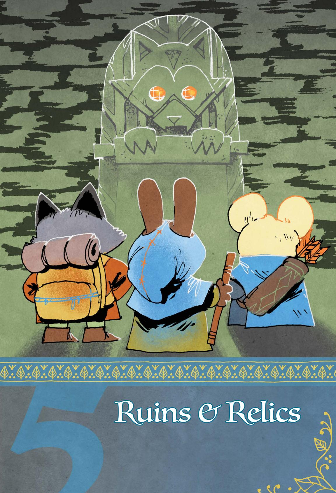

{98}------------------------------------------------

う。思シ

agabonds have always had a special relationship with the ruins of the Woodland. For many denizens, even the ruins nearest to their clearings are sources of danger, filled with monsters and

bandits that emerge only to cause trouble. Vagabonds, however, see the potential the ruins have to offer—shelter, food, gold, maybe even precious relics of a time long ago.

This chapter dramatically expands the tools available for playing Root: The RPG in and around the ruins. Here you will find the origin story for the ruins—and the Ancients who made them—as well as rules for adding ruins to your map, finding new ruins during play, and delving deep into those ruins themselves. Finally, there is a section dedicated to the powerful relics, items of incalculable value due to their unique and forgotten construction, that vagabonds may pull from the ruins when they are willing to risk tail and limb to get them.

# The Ancients

Most vagabonds are all too familiar with the powers-that-be of the Woodland, those who have joined the War in an attempt to finally control the clearings and resources that the Woodland has to offer. But most vagabonds know little more than myth and legend about a different force that ruled the Woodland, a people so lost to the sands of time that even the most educated can only guess at their true identity—the Ancients.

# A People Long Lost

The people who chroniclers refer to as "the Ancients" were the first group of denizens that occupied the Woodlands, long before even the Eyrie Dynasties ruled their roosts. Although they were the first (or so the stories claim!), the Ancients were far from primitive or simple—their science, technology, crafts, and arts were advanced far beyond anything known in the modern Woodland. As a people, the Ancients were capable of feats that most denizens would regard as virtually impossible.

Instead of using their power and wealth to carve out clearings on the surface, however, the Ancients instead built their civilization underground, pushing down into the earth with structures whose construction seems impossible even to the industrious moles of the Grand Duchy. Far from the dangers of the forests, the Ancients thrived and expanded, digging ever deeper as their culture enjoyed unprecedented prosperity.

では今し、いらいとは今し、いらいとは今し、いら

{99}------------------------------------------------

Though many Woodland denizens have devoted themselves to studying the Ancients' technologies and relics, little is actually known of the Ancients' culture itself. That said, it is clear that they had a cultural prohibition against selfrepresentation—their murals and statues and other forms of visual art never represent the Ancients themselves. Instead, they appear to have been fascinated with the world outside themselves, developing art, technology, and histories that focused on their understanding of the natural world. Brave explorers who come face to face with the Ancients' legacy will find beautiful abstract art or scientifically accurate instructions instead of self-portraits or statues.

Yet, just as surely as the Ancients once ruled all they touched...they disappeared. Today, the uppermost shoots of their underground kingdom have become the ruins of the Woodland, filled with their treasures—both literal and cultural—and relics, the remaining artifacts and objets d'art that represent the vast and amazing technology the Ancients regarded as commonplace. Nothing else remains.

# History Became Legend

What caused the Ancients to vanish? No one knows. The chroniclers and scholars of the most distant histories of the Woodland say that the records point only to some threat, a darkness that had spread so far that the Ancients could not overcome it. Just as they had a prohibition on representing their own image, so too did they resist the urge to represent their enemies; the records are meager and incomplete, and no one knows what made this particular threat so dire to a people that had so much influence over their world.

It is not clear if the Ancients fled the Woodland, were wiped out by the darkness, or merely dissolved as a culture...but they are no longer present in the Woodland. Their mark, however, is eternal, both in the ruins they left behind and in the myths and legends told about them today. After all, some in the Eyrie Dynasty lay claim to a lineage extending all the way back to the Ancients, insisting that their ancestors didn't disappear but simply moved above into the naturally superior treetops and roosts, and many of the relics they constructed have stood the test of time...and may yet turn the tide of the Woodland War.

The lack of concrete answers has spurred brave explorers to search for truths that can only be found deep underground, in the spaces the Ancients once thought of as home. Beneath the earth—in the ruins, amidst fierce monsters and dangerous terrain—some believe there are still documents and records that would reveal more about the Ancients. Some of these explorers set out alone, hoping to weather the trials of the ruins on their own, but many hire vagabonds to go with them, knowing that only a vagabond has the skill necessary to delve deeply into the ruins and return home in one piece.

{100}------------------------------------------------

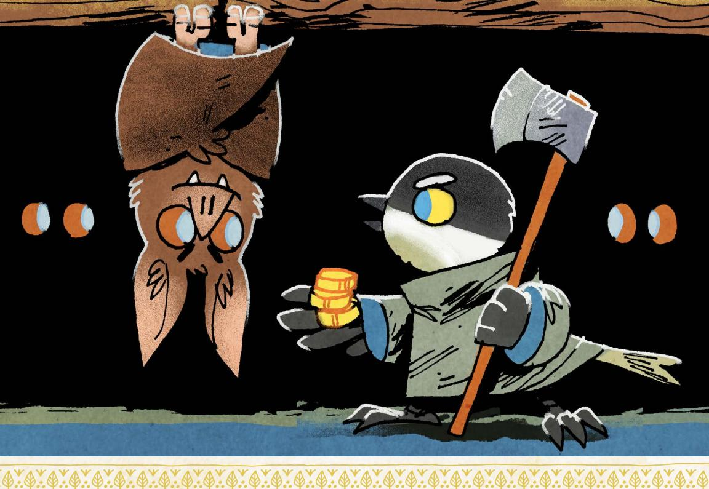

# Layers Upon Layers

In truth, not all ruins belong solely to the Ancients. Often, those who came later built their own structures and sites of worship on top of what the Ancients had already constructed, creating something of a hybrid that made use of what was already there, or even built their own sites to mimic what they found of the Ancients' designs. Adventurous vagabonds tell tales of lizard temples with murals dedicated to the Great Wyrm, cavernous structures built for bats to hold large meetings, and Eyrie Dynasty halls fit for kings and nobles, all found in ruins that either bear the marks of the Ancients or pay homage to their craft.

Yet as anyone digs more deeply into the ruins, they are more and more likely to reach something only the Ancients could have built. Many levels below the surface—where the Woodland's true secrets and treasures still reside—is the domain of those who came long, long before the Woodland War

Now, the powerful and the desperate alike are all too eager to have vagabonds delve deep into these ruins for a taste of the Ancient's power. From rumors of vast stores of gold and jewels to the obvious and persuasive power of the relics that are still to be found, vagabonds have no shortage of reasons—or employers—that might compel them to go deeper into the ruins than anyone has gone in quite some time...

{101}------------------------------------------------

# Adding Existing Ruins to the Map

When first making your Woodland, you can add a few ruins dotted across the map! There can always be more ruins, buried and hidden or recently discovered, added to the game later. But these ruins would be known places of value and danger.

Every Woodland has at least two known ruins, along with additional known ruins determined randomly. After you have determined all the clearings and their connections—but before you start assigning initial control to the factions roll 1d6 and divide by two (round up) to determine how many additional known ruins dot the Woodland.

| 1d6 | Ruin Location                                                                                 |
|-----|-----------------------------------------------------------------------------------------------|
| 1   | Below (or above) the clearing itself                                                       |
| 2   | In the closest forest to the North (west)                                                  |
| 3   | In the closest forest to the South (east)                                                  |
| 4   | In the closest forest to the West (south)                                                  |
| 5   | In the closest forest to the East (north)                                                  |
| 6   | Directly along the path leading from the clearing, toward the center of the Woodland |

Then, determine the ruins' location. Use the random clearing table (page 62, Root: The RPG) to determine a clearing local to each ruin. Then, roll 1d6 on the ruin location table to see where the ruin is located, relative to its clearing. Forests are the large spaces between clearings; when determining which forest, the parenthetical direction acts as a tiebreaker.

# Discovering New Ruins

Beyond the ruins initially added to the Woodland map, vagabonds are known for finding new ruins tucked away in the darkness of the forest, off the safe paths. Newer ruins are, of course, some of the most valuable; the Keepers in Iron, for example, are always eager to hear of new ruins that might still contain relics of the Ancients, untouched by the bandits who pillage better known sites.

Wealth and power aren't the only reasons vagabonds might seek out new ruins. Often, ruins are home to monsters, and vagabonds searching for missing denizens—or hunting monsters directly—may find that they must seek out an undiscovered ruin near a clearing to track down the beast they seek.

The moves presented in this section give vagabonds new tools for finding ruins in the forest, as well as rules for returning from the depths of the forest to a nearby clearing from the newly discovered ruins. After all, what good is it to rescue someone, gather up treasure, and loot relics if you can't make it back to a safe clearing to celebrate your victories?

{102}------------------------------------------------

#### Search for Ruins

When you travel into the forest to search for ruins, one member of the band rolls for the group:

- · if the band has a detailed map of the area, take +1
- · if any vagabond has +2 Luck or greater, take +1
- · if any vagabond has more than 1-injury marked, take -1
- · if the band doesn't have a local guide, take -1

On a hit, you find the site you seek, safely arriving at the gates of the ruins! On a 10+, you discover a safe and inviting area nearby; everyone can clear an exhaustion if you make camp before delving deeper. On a 7-9, you instead spot a threat of the ruins blocking your path forward; you'll have to find a way past or through it to enter the ruins themselves. On a miss, the ruins find you; a threat of the ruins drags you deeper in before you have time to prepare for your delve.

You and your band leave Ricklebell Falls, following a map you hope will lead you to an unexplored ruin in the forest. You're *searching for ruins*!

Going into the forest is always dangerous, but intentionally looking for a ruin means you're driven to go deeper. The search might take hours or days, but the entire thing is covered by this single move, and—just as with other travel moves—only one person rolls for the whole band.

The roll is modified by the fiction surrounding your band's departure. If at least one vagabond in the group has +2 Luck or greater, you get a +1; if at least one vagabond has 2-injury harm (or more) marked as you set out, you get a -1. Similarly, a decent map gets you an additional +1 and the absence of a local guide gets you an additional -1. These modifiers stack, so it's possible to roll with anything between a -2 and +2.

Having **"a detailed map of the area"** or **"a local guide"** means you're bringing those resources along with you. They don't have to be perfect, but both the map and the guide need to be reasonably accurate to count.

On a hit, you find the ruin you're seeking without problems along the journey; you manage to slip past the monsters and other hazards of the forest unharmed. On a 10+, you even find **"a safe and inviting area"** to rest and recuperate before you go inside. But on a 7-9 or a miss, you find yourself in real danger close to the ruins—either you find your way to the ruins blocked or something grabs you and drags you in before you can prepare yourself for what is ahead.

You can read more about threats of the ruins on [page 114](#page-114-0)!

{103}------------------------------------------------

#### Return from a Forest Ruin

When you return from a forest ruin, the band collectively decides how it travels and one member of the band rolls for the group:

- · calmly and quietly, taking time to retrace your steps. The band collectively marks 1-depletion for each member; +0 to the roll.
- · quickly and efficiently, conserving resources. Everyone marks 1-exhaustion; +1 to the roll.
- · fleeing toward safety. Everyone marks 2-exhaustion or 2-injury—their choice—and 2-wear; +2 to the roll.

On a hit, you make it to a nearby clearing—carrying whatever you obtained on your delve—and largely avoid the dangers and obstacles of the forest. On a 7-9, your return to civilization, however, is marred by a reminder of the War and its consequences. On a miss, something catches up with you before you can make it out of the forest…or you discover too late that someone you don't trust awaits your return!

You and your band have left the ruins, journeying through the forest to return back to Longbarrow Crag. You're *returning from a forest ruin*!

Escaping a forest ruin doesn't mean you're safe—you've got to make it all the way back to a clearing before you can breathe easy. As with other travel moves, the band has to decide how it travels; you have to be able to pay the costs—marking exhaustion, depletion, etc.—so some of the options may not be available to you after some time in the ruins.

Traveling **"calmly and quietly"** means you're taking the time to go back the way you came, camping along the way and using up supplies. You only get to roll with a +0, but no one has to mark exhaustion or injury.

Traveling **"quickly and efficiently"** means you stick to an intense pace—and don't have to camp—but every member of the band has to mark exhaustion. You get a +1 to the roll to reflect your speed, but the cost is great.

**"Fleeing toward safety"** means you move as quickly as possible through the woods. Everyone gets beat up on the way back, but it's an option you can choose even if you have no depletion or exhaustion left to mark,.

Encountering **"a reminder of the War"** might be an active threat (like a band of soldiers) or a fleeting opportunity (like the remains of a battle), but you're almost back to safety! "**Something catching up with you"** or **"someone is awaiting your return"** means that trouble finds you; you'll have to deal with whatever is chasing you or waiting for you in order to make it to the clearing.

{104}------------------------------------------------

# Diving Deep Into the Ruins

When a band of vagabonds wants to dive into the ruins, they must go beyond the areas normal denizens regularly visit. For a forest ruin, that might be the very first level of the ruin—pristine and untouched by denizen paws—but for ruins closer to the clearings, the first few levels may already have been pillaged. These moves support the exploration by offering vagabonds ways to push down into the deeper levels to find more meaningful treasure and relics

Since ruins are often filled with areas that are falling in on themselves—sloping floors leading to half-broken halls, submerged areas where water has overtaken the structure, etc.—think of each "level" as a large, unexplored space in the ruin at roughly the same depth. When the vagabonds go deeper, they enter a new level.

#### Press Forward

When you press forward into a new area of the deep ruins, a member of the band must mark 1-depletion; if you can't or won't mark depletion, a threat of the ruin comes to bear on your band.

You light a torch as the gloom of the deep ruins grows deeper, ducking under a rock shelf as you enter a large cavern. You're *pressing forward*!

Journeying deeper into the ruins is always costly—you have to consume food, water, and torches to keep going. Every time you *press forward*, someone in your band has to mark depletion to represent those resources getting used up... or some threat of the ruins [\(page 114\)](#page-114-0) catches up with the group.

"A new area of the deep ruins" means you've entered a new section of the same level; if you are descending deeper into the ruins, you're *delving deeper* ([page 105\)](#page-105-0) instead. The GM is the ultimate arbiter of what counts as *pressing forward*, but it always marks a transition within a given level. Usually, going from one room to another is sufficient, but the GM might decide that several close rooms right next to each other might make up a single area for the purposes of *pressing forward*.

{105}------------------------------------------------

#### Delve Deeper

When you delve deeper into a ruin toward a new level through an open pathway, one member of the band rolls for the group:

- · if every member of the band is free of injury, take +1.
- · if the band collectively marks 2-depletion and 2-wear, take +1.
- · if the band is dealing with an active threat or crisis, take -2.

On a hit, your band moves to the next level of the deep ruins. On a 10+, your descent is auspicious; you find some natural resources or a secure place to camp, your choice. On a miss, you descend…but a serious threat of the ruins comes to bear, trapping you on the lower level until you deal with it or find another route.

As you are exploring a ruin, you find a hole descending into deeper caves you throw down a rope and begin to climb! You're *delving deeper*!

If your band wishes to find the true secrets of the Woodlands—relics of the Ancients, lost heraldry of the Eyrie Dynasties, etc.—you will need to go deeper into the ruins, exploring areas no one has touched in eons.

**"Every member of the band is free of injury"** means that no one who is descending to the next level has any injury harm marked. Some members of your band might stay behind to help you earn that +1 to the roll, but they will have to face the other threats of the ruins alone; it will take time to return to them.

When your band **"marks 2-depletion and 2-wear,"** anyone in the band can mark the depletion and wear, even splitting it up among the members of the band.

**"The band is dealing with an active threat or crisis"** means that something is putting the band in genuine danger as you descend. That might be a monster, but it could also be a spreading fire, collapsing ceiling, or other natural disaster.

On a hit, you move down into a new level of the ruins, even discovering some immediate resource like running water or edible plans on a strong hit. The danger mounts as you descend; the threats of the ruins you confront in the first and second levels of a ruin are much easier to contain than those faced in the fourth and fifth levels. But the rewards are far greater at those depths, both in the secrets you might discover and in the gold and relics you might retrieve.

On a miss, a threat of the ruins [\(page 114](#page-114-0)) finds your band, trapping you on the new level of the ruins. Your band will have to not only deal with the new threat, but you must also find some new way to the surface if you can't find some way to resolve whatever is blocking your retreat.

{106}------------------------------------------------

#### Scavenge for Resources

When your band scavenges for resources in the deep ruins, one member of the band rolls a number of dice equal to the level you are on currently, plus however many safe chambers are adjacent to the band's location. Individual vagabonds in the band can spend these dice by their value to:

- · 1-2: recover 1-depletion
- · 3-4: recover 1-depletion and 1-wear
- · 5-6: clear 2-depletion or discover an item worth 3-value

The band can only make this move once per level of the ruins; you must descend to a new level in order to scavenge again.

Your band is running out of supplies in the deep ruins. You look around for anything useful in the piles of debris. You're *scavenging for resources*!

Most moves that ask you to roll dice in Root: The RPG require you to roll 2d6, but *scavenging for resources* means you roll a whole bunch of dice! Count up the number of adjacent safe chambers—rooms you feel you can enter and exit safely—and add it to the level of the ruins to figure out how many dice you get to roll. Each die's result is worked out independently; you don't need to add them up to get a total because you use each die to figure out what you find.

Spending a die that shows a 1 or a 2 means you've found something that will recover one box of depletion. That might be a small patch of edible vegetables, a trickle of fresh water, or even adventuring gear left behind by someone who tried to explore the ruins before you. Sometimes this might mean you add something new to the map!

Spending a die that shows a 3 or 4 means you've found something better—enough to both clear a box of depletion and a box of wear. Usually, spending this kind of die implies that you've found something more useful than just basic resources, likely something someone else—maybe even the Ancients—left behind.

Spending a die that shows a 5 or 6 means you've found enough resources to clear 2-depletion...or something worth 3-value. You get to pick which one, but the GM will tell you what you find either way.

You can only make this move once on a given level of the ruins, so be cautious about when you decide to *scavenge*. Once you've *scavenged* on a specific level, there's not much left to find until you delve deeper and get to a new level of the ruins you can explore for the first time. For that reason, it's usually better to explore each level of the ruins for a while—uncovering safe areas and even *making camp* [\(page 107\)](#page-107-0)—before you throw your efforts into *scavenging*.

{107}------------------------------------------------

#### Make Camp in the Ruins

When your band makes camp in the deep ruins, each member of the band marks any amount of depletion, and one member of the band rolls with the total (max +4, including the bonuses below).

- · if there's a useful resource nearby (water, food, etc), take +1.
- · if there's shelter or security (caves, stone doors, etc.), take +1.
- · if a member of the band forgoes any benefits to stand watch, take +1.

On a hit, the band gets some rest; each member clears an exhaustion. On a 7-9, each member also picks 1. On a 10+, they instead pick 2:

- · you get some sleep; clear an additional exhaustion.
- · you have time for makeshift repairs; clear 1-wear.
- · you map the area; take an extra die when *scavenging* this level.

On a miss, the supplies you spent are wasted as a threat of the ruin suddenly comes to bear; tell the GM the watch order, and they will tell you who first spots the danger now upon you.

Tired and hungry, your band of vagabonds decides you've gone far enough into the ruins for today; it's time to rest. You're *making camp in the ruins*!

*Making camp* is a collective activity; each vagabond marks as much depletion as they want to spend—using up rations, creating a fire, etc.—and one vagabond rolls with a +1 for every depletion marked. In addition, your band adds +1 for every fictional condition you meet, but the total bonus can't be more than +4.

A **"useful resource"** has to be enough for the whole group. A single mushroom isn't enough for a band of five vagabonds, but a mushroom patch is plenty.

**"Shelter and security"** have to be truly secure from local monsters and other treasure hunters...and big enough for the whole band. A safe cave with one entrance is usually sufficient—it doesn't have to be behind a locked door provided that it gives your band a way to see major threats coming.

**"A member of the band standing watch"** means one vagabond doesn't get to do anything but look out for threats; they don't get any benefits from the move.

For anyone not standing watch, they clear an exhaustion and get to pick some additional benefits—one from the list on a soft hit, two from the list on a strong hit. If someone chooses to take an extra die while scavenging, then they add that die to the pool when the band next *scavenges for resources* ([page 106\)](#page-106-0).

On a miss, a threat of the ruin interrupts your respite before anyone can get any benefits, plunging the group into danger and wasting the resources you've spent.

Chapter 5: New Playbooks 107

{108}------------------------------------------------

# Retreat Back to the Surface

When you retreat from the ruins back to the surface, one member of the band rolls for the group:

- · if you can chart a course out through safe rooms, take +1.
- · if each member of the band marks 1-exhaustion, take +1.
- · if the band is retreating in the face of an active threat, take -1.
- · if any member of the band is burdened, take -2

On a 10+, you scramble back to the surface, emerging to relative safety wherever you first entered the ruins. On a 7-9, one threat of the ruins blocks your escape; you must deal with it before you can claw your way out. On a miss, you find yourself trapped between an obstacle that blocks your path forward and a threat that won't stop advancing.

Gold and relics secured, your band starts the long journey back to Pricklegrass Marsh from the depths of the ruins. You're *retreating back to the surface*!

Eventually, your band will need to return to the surface, bringing back whatever you found or learned in the ruins. But the journey back up can still be perilous the ruins have a tendency to surprise even the most prepared of vagabonds.

**"Charting a course through safe rooms"** means you can draw a clear path, across all levels of the ruins you need to cross, that only features rooms you can enter and exit freely without danger. If there's a giant spider still roaming the level above you and likely to be in your way, you probably can't earn this bonus.

**"Retreating in the face of an active threat"** means the band flees from a monster or natural disaster (or something else), deciding it's better to run than fight.

**"A member of the band is burdened"** when they are carrying more Load than their maximum (4+Might); if any member of the band is burdened, then they are slowing down the rest of the group as they climb back to the surface.

On a strong hit, your band emerges from the ruins without paying any further costs; on a weak hit, you'll have to first deal with one threat of the ruins before you can escape completely. The GM will tell you what danger you face, but it probably looks like a monster or other shift in the ruin that blocks your way!

On a miss, you get caught between two threats—an obstacle in front of you and something coming up behind you. These problems might both be monsters, but they could also be a fire or cave-in pushing you to keep moving or keeping you from escaping quickly. Once you've overcome the obstacle, you're free to leave...but you might also need to *return from a forest ruin* before you make it back to a clearing.

{109}------------------------------------------------

# Creating the Ruins

Marking the ruins on the map only tells you where they are relative to the clearings. When the vagabonds enter the ruins themselves, you (as the GM) have to represent the ruins in all their glory—their layout, the monsters that inhabit them, and the treasures the vagabonds might find. Here are some tips:

# Before The Vagabonds Enter

In order portray a ruin, you have to know some broad truths about it. Consider the questions below—answering them will give you a lot of material to work with during a delve into the ruins. Alternatively, you can use the random generation tables found on [page 111](#page-111-1) to generate a ruin using a few die rolls.

#### Who left their mark on these ruins? Why?

The Ancients built many incredible structures during their time as masters of the Woodland, but many other groups either built their own structures in the distant past or made use of The Ancients' structures themselves. Think about which group (or multiple groups) constructed the ruin and how they left their mark.

Each ruin once had an alternate purpose—a sacred site, a throne for a king, a scientific laboratory. Choose a purpose for the ruin so that you have a set of central themes to return to during the delve. A ruin that was a barracks for a massive army will have living quarters and training areas; a ruin that was a prison for a powerful foe will have many different security systems...

#### Why is this place a ruin?

Most ruins have been abandoned for some time, but mere emptiness doesn't make it a ruin. Decide on the events which literally *ruined* this place—an earthquake, a flood, rampant vegetation, etc. Portray that force as often as you can when describing what the vagabonds see and feel in the ruin.

#### Who lives here now?

Ruins are valuable, secure sites in the middle of the dangerous forest. Consider who has made use of that safety, and pick a few different monsters (or denizens) that have made the ruin their home. See [page 121](#page-121-1) for more on monsters!

#### What might happen during a delve?

While you don't want to plan any specific chain of events to occur while the vagabond delve into a ruin, you do want to have a few escalations on hand in case you need them. Think about a few things that might be interesting during the delve and write them down; you'll want to have them on hand during play.

Chapter 5: New Playbooks 109

{110}------------------------------------------------

## During the Vagabonds' Delve

As the vagabonds descend into the ruins, your prep work gives you a solid grounding for presenting the ruin to the vagabonds. Don't try and work out the whole ruin in advance—it's a lot of work, and they might not see all of it! Instead, focus on the spaces the vagabonds are moving through and answer the following questions throughout the delve. If you want to let the ruin grow organically, you can use the random ruin layout generator on [page 112](#page-112-1) instead!

#### Are there more rooms on this level?

As the vagabonds explore, provide opportunities for more exploration—rooms with multiple exits, all branching off into new rooms. Since vagabonds have to pay a price to *press forward*, you want to give them reasons to keep looking! But no ruin has infinite rooms—eventually the vagabonds will have explored everything they can reasonably reach without excavating the ruin further.

#### Are there more levels in this ruin?

As with the ruins' rooms, additional levels encourage the vagabonds to push their luck, digging deeper to search for whatever they came here to find. But no ruin has infinite levels either—every ruin worth the name is at least a few levels deep, but very rare is the ruin that extends deeper than five or six levels below the surface of the Woodland.

#### What might the vagabonds find?

Often, the vagabonds are looking for a specific thing—a relic, a monster to hunt, a missing person, etc.—when they enter the ruins, but take some time to think about what else might be found on each level, especially as they *delve deeper*. Are there more relics? Other monsters? Note down what the band might find so you can bring it into play as they explore.

# Using Other Materials

If you want to bring in materials from other roleplaying games—especially dungeons meant to be explored by hardy adventurers—this system for ruins will support you! Just adjust the theme of the dungeon to match Root: The RPG by altering the antagonists the band might encounter. The features of the dungeon traps, obstacles, the map—all still fit; just remember that the band has to mark depletion every time they enter a new area of the same level by *pressing forward*!

As for the antagonists, you can easily transform them into monsters ([page 121\)](#page-121-1) or traditional Root: The RPG foes. Skeletons might become giant fire ants [\(page](#page-126-0)  [126\)](#page-126-0) or Eyrie soldiers turned bandits; a mighty lich might become a giant spider [\(page 128\)](#page-128-0) or a vagabond who discovered a relic that warped their nature.

{111}------------------------------------------------

# Random Ruin Generation

If you'd like to generate your ruins through random rolls, you can use the tables below to create a ruin procedurally:

#### Has any other faction reshaped the ruins?

| 2d6 |                                                                         |
|-----|-------------------------------------------------------------------------|
| 2-7 | No, no faction has reshaped these ruins since they were built.          |
| 8-9 | Yes, one faction has reshaped these ruins since they were built.        |
| 10+ | Yes, more than one faction has reshaped the ruins since they were built |

# What were the ruins originally for?

| 2d6 | 1-2          | 3-4                  | 5-6              |
|-----|--------------|----------------------|------------------|
| 1-2 | Sacred site  | Manufacturing center | Military outpost |
| 3-4 | Royal palace | Mausoleum            | Monastery        |
| 5-6 | Trade center | Laboratory           | Settlement       |

#### Why is this place a ruin?

| 2d6 | 1-2                                | 3-4                        | 5-6                |
|-----|------------------------------------|----------------------------|--------------------|
| 1-2 | Earthquake or volcanic activity | Poison or flammable gas | Vegetal overgrowth |
| 3-4 | Flood                              | Structural collapse        | Destructive traps  |
| 5-6 | Fire                               | Monster invasion           | Sinkholes          |

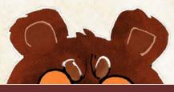

#### Who lives here now?

| 2d6 | 1-2                                 | 3-4                                    | 5-6                                      |
|-----|-------------------------------------|----------------------------------------|------------------------------------------|
| 1-2 | Bandits and thieves                 | Historians or scientists               | Colony of monsters                       |
| 3-4 | Mercenaries or treasurer hunters | Ecosystem of 3+ species of monsters | Unique or bizarre species of monsters |
| 5-6 | Fugitives or refugees               | Single terrifying monster           | Band of vagabonds                        |

{112}------------------------------------------------

# Random Ruin Layout Generation

Instead of deciding room by room how the ruin will emerge during play, you can also generate the layout of a ruin procedurally using these tables:

When the band enters a room, roll on this table:

| 2d6+rooms explored on this level | Are there more rooms?                      |
|-------------------------------------|--------------------------------------------|
| 3-4                                 | Yes, three exits lead to three new rooms   |
| 5-6                                 | Yes, two exits lead to two new rooms       |
| 7-9                                 | Yes, only one exit to one new roomr        |
| 10-12                               | Yes, one exit to a room that is a dead end |
| 13+                                 | No, this room is a dead end                |

When the band enters a new level of the ruin after the first, roll on these two tables:

| 1d6+new level | Are there more levels?                     |
|---------------|--------------------------------------------|
| 7 or less     | Yes, there are more levels below this one  |
| 8+            | No, this level is the last one in the ruin |
| 1d6+new level | What's on this level?                      |

| 1d6+new level | What's on this level?                                                              |
|---------------|------------------------------------------------------------------------------------|
| 3-6           | 5 Value worth of coin and standard equipment, split among 1-2 items             |
| 7-9           | 10 Value worth of coin and standard equipment, split among 2-3 items            |
| 10-13         | 10 Value of coin/equipment—split among 2-3 items—and one relic of the Ancients  |
| 14            | 15 Value of coin/equipment—split among 2-3 items—and two relics of the Ancients |

{113}------------------------------------------------

# Portraying the Ruins

From monster hunting playbooks to new ruin-focused equipment, the whole of this book is designed to give vagabonds lots to do in the ruins—all you have to do is portray the ruins as a dangerous, rewarding place to explore! Here are some tips to make that portrayal ring true for the vagabonds as they delve.

# Draw the Map as You Go

It's tempting to map out the whole ruin in advance, but remember your agendas and principles (Root: The RPG, page 198)—you still want to *play to find out what happens*! Instead, draw the map as you go, adding new rooms as the vagabonds explore so that the ruin stays fresh to both you and them. Lean heavily on your prep—if you've chosen why the ruin exists and create the rooms on the fly, a lot of what the vagabonds find will come naturally!

# Monsters and Relics

Monsters [\(page 121](#page-121-1)) are one of the most important tools for bringing the ruins to life. As the vagabonds descend, they are less likely to encounter another group of denizens—bandits, for example, tend to stick to the upper levels of the ruins. Monsters fill an important gap, allowing you to introduce sentient opposition anywhere in the ruins; spiders, scorpions, and snakes all love the deep ruins!

At the same time, relics—detailed later in this chapter on [page 115](#page-115-1)—give vagabonds real reasons to dive deeply. Relics aren't just slightly better than the average piece of equipment; they are truly unique items crafted using Ancient methods that have since been lost to the sands of time.

In both cases, foreshadow the presence of monsters and relics over and over again to the vagabonds. Give them patrons organizing an expedition to recover a relic... or less qualified treasurer hunters who do not return after delving deep—all reasons for the vagabonds to roll up their sleeves, grab their gear, and dive deep themselves.

# Keys and Locks

The existence of relics also allows you to push the boundaries of believable obstacles in the ruins. The vagabonds may encounter fantastic puzzles, locked doors, or even strange materials—all evidence of the Ancients' amazing technology. For example, a door that leads deeper into the ruins may only be opened with a crystal orb found in a different section, far from the door itself.

Don't forget your principles as you introduce these elements. Root: The RPG is a game about exciting adventure, so be a fan of the vagabonds and give them obvious tools to engage the fiction and avoid difficult or exhausting puzzles.

{114}------------------------------------------------

# Threats of the Ruins

Finally, several of the ruin moves describe a **threat of the ruins** coming to bear on the vagabonds. Often, that's an obvious threat—the monster they are hunting, a cave-in right under their feet, etc.—but if you ever get stuck, here's a list of threats you can bring to bear, sorted by level of the ruin.

#### Level 1 Threats

The threats vagabonds encounter in the first level of the ruins can be dangerous, but they are less immediate and rarely focused on the vagabonds themselves.

- · A protective or docile monster appears nearby
- · A group of bandits or soldiers spots the vagabonds
- · A minor natural obstacle—a small fire or cave-in—endangers one vagabond
- · A shift in the ruins reshapes the layout, cutting off paths for the vagabonds
- · Signs appear of a bullheaded or predatory monster living on a lower level

#### Level 2 or 3 Threats

Threats in the second and third levels of the ruins ramp up the danger considerably, making the vagabonds think carefully about resources and plans.

- · A bullheaded or predatory monster appears nearby
- · Another vagabond exploring the ruins attacks (or steals from) the band
- · A major natural event—a flood, a large cave-in—threatens multiple vagabonds
- · A broken relic of the Ancients endangers one of the vagabonds
- · A trap or puzzle appears in the vagabonds' path with no obvious way around

#### Level 4+ Threads

As the band descends deeper into the ruins, the threats become more dire and urgent. By the time they reach the true depths—beneath Level 3—the vagabonds need to feel any wrong move could lead to death...or worse.

- · A predatory monster attacks the band without warning
- · A bullheaded or protective monster attacks the band for intruding
- · A catastrophic collapse or flood threatens the entire band
- · A working relic of the Ancients puts multiple vagabonds in danger
- · A portion of the ruin shifts or transforms, splitting the band apart

The goal of these threats is to give you, the GM, a way to push the story forward—a new obstacle, a new antagonist, etc. If you feel like the threat that should come to bear on the vagabonds is obvious, use it! If the band has seen signs of a giant spider, then a move that asks for you to introduce a threat of the ruins can absolutely rely on the work you've already done to set up that threat!

{115}------------------------------------------------

# Relics

Hidden away in the deepest ruins, artifacts of the Ancients lie untouched by denizen paws, treasures beyond reason that many would kill to possess. These relics are pursued—especially the Keepers in Iron—but they are so rare that many think they are merely a myth.

The truth is that there are fantastical objects left behind by the Ancients, tools and objets d'art (along with weapons and armor) whose construction defies all expectations. Sometimes they are made of materials no one recognizes or bear strange symbols and markings, but the one unifying factor among them is their incredible gifts, abilities, or powers that eclipse anything that could be constructed by an ordinary crafter of the Woodland.

The average relic has two to three of these abilities, some of which require the user to activate them in a particular way or charge them before they can function. That said, relics are items with wear and load, even if they are priceless!

Each relic is unique, so there's no standardized guide to creating new relics; any GM who wants to add a relic to their campaign can use the examples below or write a custom relic with unique powers (or modify one from another source).

## The Resonance Chime

#### Wear: 5 | Load: 0

Wooden chimes are used across the Woodland by skilled woodcrafters to create a pleasant natural music. Metal chimes are an extravagance known only to the truly wealthy. But the Resonance Chime is something else entirely. A blueish metal shot through with purple veins, the Resonance Chime somehow channels sound along its length. One end of the Chime is tapered inward, and the other expands outward slightly, giving the vaguest sense of a musical horn. When sound enters into the tapered end—the Listening end—it expands and grows louder when it leaves the other, expanded, Speaking end. The Resonance Chime seems capable of doing anything from expanding the voice of a speaker to reach a full crowd, to funneling a distant sound into a user's waiting ear. Usually, anyone carrying the Resonance Chime has to keep both ends plugged when not in use, to make sure it doesn't capture undesired sounds and spit them out more loudly at inopportune moments…but when the Speaking end alone is unplugged, and sound is poured into the Listening end, it can produce some dangerous effects.

The Resonance Chime is not an object of fable—most theories suggest that it was a fairly common tool used in ages past, to communicate across long distances. Perhaps in a vast array of such chimes, it could send messages even farther…

Chapter 5: New Playbooks 115

{116}------------------------------------------------

#### Ability: Listen

*When the Listening end of the Resonance Chime is aimed at any sound no closer than about 10 feet away and no farther than about 100 feet away, the Chime amplifies the sound out of its Speaking end. Someone who puts their ear to the Speaking end can hear conversations and suspicious noises easily this way. (If the Listening end is aimed at a conversation closer than 10 feet, it tends to produce too much noise for it to be effective as a listening device.)*

#### Ability: Speak

*When a user speaks into the Listening end of the Resonance Chime, their voice is amplified to reach up to 100 feet away as it exits the Speaking end of the Chime. They can easily speak to crowds or to distant individuals in this way. If speaking to a whole crowd at once, the Resonance Chime adds +1 ongoing to any moves to sway or affect the crowd when used in this way.*

#### Ability: Boom Charges:

*When the Speaking end of the Resonance Chime is plugged and sound is poured into the Listening end from close up, the sound becomes trapped inside the Chime, building up until it is released all at once. One shout into the Listening end is enough to start the resonance, marking one charge. Prolonged, extended, or particularly loud sounds can mark more charges all at once, at the GM's discretion.* 

*As long as the Chime has charges marked, the sound continues to build; after a few minutes have passed, the GM marks another charge, and rolls 1d6; if the GM rolls under the number of charges marked on the Chime, then they mark as many boxes of wear as their roll. (For example, if the Chime has 3 charges, and the GM rolls a 2, they mark 2 wear.) If the Chime ever builds charge but has no more boxes to mark, the GM instead marks 2 boxes of wear on the Chime. The Chime can break in this way, exploding and releasing the sound all at once.* 

*If the Chime explodes, then the thunderous force sweeps out from it. An explosion affects everything up to and including Close range if it has 1-3 charges, and everything up to and including Far range if it has 4 or more charges.* 

*If the Chime's Speaking end is unplugged before the Chime explodes, it instead releases all of its charges in the direction of the Speaking end, reaching up to Close range (1-3 charges) or even up to Far range (4-6 charges). In both cases, the Chime inflicts exhaustion equal to its charges marked. If the target doesn't have enough exhaustion boxes to absorb all that harm, they take the excess as injury, possibly killing them. After discharging by unplugging the Speaking end, the Chime loses all charges.*

{117}------------------------------------------------

#### The Sunsap Prism

#### Wear: 4 (special; see Sunlight Uncontained) | Load: 0

It looks like a treasure on its face, a flawless prismatic crystal filled with golden sap. It gleams and glitters, but its true value only shows when it is left in the sun for a day. The sap somehow seems to absorb the warmth and light of the sun; after a day spent lying out under direct sunlight, the golden sap moves more fluidly and less viscously inside the prism, and it almost sparkles. When the prism is shaken forcefully, the sap begins to glow, exuding sunlight and warmth until it either runs out of its charge, or until someone gently rings the sides of the crystal in the correct sequence.

The Sunsap Prism is an oddity of the past, something that stories suggest was replicated countless times, with entire great halls filled with such gleaming sunlight prisms. But no one has ever found any evidence of others existing… save for this one relic.

#### Sunlight Contained Charges:

*The Sunsap Prism is usually depleted when found; no charges are marked. When the Sunsap Prism is left in sunlight for a day, it fully charges. Mark every charge box. Shake the Sunsap Prism forcefully to activate it, clearing a charge box and causing the Prism to exude a pleasant, bright light and warmth the equivalent of direct sunlight on a pleasant day. After being activated, the Prism will continue to emit light until it is entirely depleted or turned off. Clear another charge every time a few hours of activation pass. To turn it off, a user must know the special sequence of taps upon the prism's panels.*

#### Sunlight Uncontained

*The Sunsap Prism is durable, but not impossible to break with enough force—the equivalent of 4-wear marked on it in a single blow. If shattered, it releases all of its sunlight all at once; every unmarked charge box on the Prism inflicts 2-Injury on any creature within about 15 feet, and every creature who can see the exploding Prism is temporarily blinded.*

{118}------------------------------------------------

## The Calling Spear

#### Wear: 6 | Load: 1

Experienced metallurgeons might be familiar with the most basic principles of magnetism, especially through the use of lodestones. But the way that the Calling Spear works would baffle even them—some kind of directed, focused magnetism that only ever connects the spear and its gauntlet.

The gauntlet—a mix of copper and chrome and oddly oversized for any creature's paw—comes with the spear; when discovered, the gauntlet is most likely gripping the spear, and its digits are nigh-impossible to pry free of the spear's shaft. The spear itself is thin, the same mix of copper and a silvery metal, with a widened leaf-like razor sharp tip and channels spiraling down from the point.

Inside the gauntlet, there are small levers at the tip of each digit; when toggled down, they activate the calling mechanism and draw the spear back to the gauntlet, through the air, through water, even from the other side of a wall. The draw has about as much force as a strong wielder's throw. When the switches are toggled up, the mechanism turns off and the gauntlet and the spear are disconnected; the spear can be thrown without difficulty. In fact, the spear is rather perfectly designed to be thrown, those channels carved down its length helping it spin aerodynamically toward its target.

#### Throw

*The spear can be thrown easily, precisely, and at high speeds. It has an effective range of Far when thrown. When used to target someone, it inflicts 2-injury. On a 10+, instead of a second shot, it may simply deal another +2 injury. It can be used for any appropriate weapon skill moves at far range; treat it as if it has all appropriate weapon skill tags (GM's discretion).* 

#### Call

*The spear can be called back by toggling the switches in the gauntlet on. The spear will fling itself back toward the gauntlet as best it can; as long as the user is unrestrained, they can catch the spear without much difficulty. The spear can be caught or otherwise captured as it flies through the air, but it will continue to pull toward the gauntlet, with about the same force as a hearty denizen pulling on it.*

#### Spear

*When used to engage in melee, the spear has close range and deals a total of 2-injury. If the gauntlet is toggled on, then the user cannot drop the spear for any reason in melee. The spear is not designed specifically for melee use, and is not treated as if it has any melee-oriented weapon skill tags.*

118 Root: The Roleplaying Game

{119}------------------------------------------------

#### The Stonewood Armor

#### Wear: Special; see tags below | Load: 2

Stories of Ancient Woodland monarchs often include the Stonewood Armor as a sign of their invincible prowess, their indomitable might. Made out of layered plates of petrified wood, the Stonewood Armor is immediately identifiable—even those who have simply heard stories about it would recognize the patterns of wooden veins forming diamond shapes up and down its arms and legs, just as described in the tales. The only color on the armor besides the gray-brown of petrified wood is the plume of green leaves atop the helmet…at least, when the Armor is well-fed. When the Armor is hungry, those leaves turn brownish and hang limply.

The Stonewood Armor almost seems to be a living plant unto itself; denizens familiar with the trees and plants of the Woodland can recognize signs of it being somehow alive, the plates held together by strands of hardened root. But that belies its darkest truth. The stories all say the Stonewood Armor draws strength from the Woodland, and that it does, quite directly. It bonds with the foliage and vegetation of the Woodland, drawing life itself from them to keep itself strong. Each time it feasts, it leaves a dead spot in the Woodland, killing all the plants in its reach to feed itself.

#### Invulnerable

*The Stonewood Armor cannot be destroyed or meaningfully damaged while assembled. When disassembled, it is possible that devoted antagonists might find a way to break individual pieces, but it would require extraordinary mechanisms and effort.* 

#### Strength of the Wood Charges:

*When you leave the Stonewood Armor amid vegetation for at least a day, it will branch out and parasitically draw strength from that vegetation. Each day that it is left amid lush vegetation, it destroys that vegetation in a 40 foot radius—leaving it decayed and ruined—and marks every charge. If it is left for only half a day, it gains half as many charges; if it is left for less than half a day, it gains no charges. If it is left amid sparser vegetation, then it doesn't have enough material to draw from and marks no charges.*

*When you take a blow while wearing the Stonewood Armor, expend a marked charge to simply cancel out the blow.*

#### Bulky, Cumbersome, Weighty

*The Stonewood Armor is treated as if it has all three of these negative tags. (The additional load of Weighty is factored in above.)*

{120}------------------------------------------------

## The Cornucopian Cauldron

#### Wear: Special (see Indestructible Alloy) | Load: 0

Stories of the Cornucopian Cauldron say that any food placed in it is increased tenfold, that a simple meal could feed a whole army and give them enough strength to fight back rivers and climb mountains. In truth, it appears to be just a cauldron, albeit a well-made one. Well-seasoned, well-maintained, wellused, but certainly not capable of creating food from nothing. Pretty in its way, patterned with sprawling vines and berries, with shoots of wheat and corn. But just a very good cauldron, of more value to a cook than to a king.

Its true value sits in its composition. It's another alloy of the Ancients, black metal shot speckled with green and strands of blue. It is durable but also light and easy to carry. Metallurgeons of the Eyrie or the Marquisate would become rich beyond their wildest dreams, were they capable of recreating the Cornucopian Cauldron's materials.

Regardless, the Cornucopian Cauldron is hearty enough to be used as a makeshift shield or piece of armor…if the wielder is willing to deal with an object clearly not designed for such a purpose, and look more than a bit silly while doing it.

#### Indestructible Alloy

*The Cornucopian Cauldron is more or less impossible to destroy. Even if used to block the strikes of a strong, angry foe, it won't bend or break.* 

#### Armor?

*One could wear the Cauldron as a makeshift helmet, or try to wield it as a shield, or even as a weapon…but that was never its intended purpose. When used as armor or a shield, it gives -1 ongoing to all physical moves made, but all incoming injury or exhaustion is reduced by 1. Notably, anyone wielding the Cauldron in this way also looks quite foolish and will likely be taunted or disregarded as a serious threat.*

#### Cooking

*The Cornucopian Cauldron is an excellent cooking tool. If used to cook meals and assist with exhaustion recovery, every 1-depletion spent on cooking creates a meal for about 5 denizens that clears 2-exhaustion; every additional depletion spent on the meal would improve the exhaustion cleared by another 2-exhaustion. Any vagabond who uses the Cornucopain Cauldron in any cooking moves automatically takes +1 ongoing on those moves.* 

{121}------------------------------------------------

the Woodland

{122}------------------------------------------------

he monsters of the Woodland are usually found deep in the forests, off the paths that most denizens regard as safe. Some are even more reclusive and rare, haunting the lower ruins

or the dark waters of the largest lakes and rivers that lie between the clearings. From giant fish and fearsome beetles to swarms of enormous dragonflies and ants, these terrifying beasts are one of the primary reasons the darkest forests and deepest ruins are so lethal to those who seek the Woodland's wild and unexplored spaces.

Yet the great monsters of the Woodland are more than mere legends or myths, hidden in shadow and whispered about around a campfire. The denizens of the forest *know* they are real...and they deal with them more often than they would like. Fishers who spend their lives pulling food from the Woodland's lakes know that it's only a matter of time before they encounter a fish that thinks of them as a meal; the brave denizens who patrol the edges of a clearing keep an eye out for the signs of these great beasts—great bears, giant spiders, massive snakes, and more—as much as they look for evidence of deadly bandits and enemy soldiers.

#### Formidable Foes

While the monsters of the Woodland vary in size and lethality, they are distinguished from ordinary bugs, anthropods, and crustaceans by the danger they pose. These creatures are usually large, often many times the size of a single vagabond, and they wield ragged claws, sharp teeth, and deadly poisons to hunt down or drive off anything that attracts their attention. Some of them are predatory and will gladly stalk and kill denizens, but even those who are merely territorial are a serious threat.

Only a fool would hunt one of these monsters without careful planning; even the most disciplined soldiers of the Marquisate and the martial knights of the Keepers in Iron fear these lethal monsters. But just as every denizen knows that the monsters of the Woodland are real, so too do they know the only group that regularly deals with them successfully—vagabonds!

If a family of giant crabs moves close to a clearing—disrupting the clearing's fishing grounds and trade routes—the local denizens are far more likely to look for a few brave (or foolish!) vagabonds than they are to throw themselves into driving off the monsters. After all, it's much easier for a Marquisate commander to find another vagabond than it is to replace a whole patrol of soldiers.

{123}------------------------------------------------

#### A Woodland Bestiary

In the pages that follow, you can find examples of the monsters the vagabonds may encounter in their travels. Each one describes the beast—including where the vagabonds might find such a creature—then offers some thoughts on how to use them in play. Finally, each listing contains harm tracks for each monster, as well as monster traits that bring their most interesting features into play.

- Giant Trout In the deepest lakes, a shimmering menace lurks in the darkness, ready to rise to the surface and consume those foolish enough to enter its waters.
- Giant Fire Ants Individually weak, the threat of the Woodland's fire ants lies in their numbers; vast swarms of chitinous warriors can overwhelm a band of vagabonds in mere minutes.
- Giant Spider There is little in the Woodland as cunning, deadly, and dangerous as a giant spider; they haunt the trees and tunnels of the Woodland, waiting for prey that will never see the spider coming.
- **Giant Snake** One of the most common monsters in the Woodland, the giant snake is as common as it is deadly; nearly every vagabond has encountered a giant snake at some point in their travels.
- **Giant Scorpion** Found mostly in the cool darkness of the ruins, giant scorpions are known both for their bulk and their venom, either of which are likely to kill any denizen foolish enough to get close.
- Giant Hornet Few monsters are as angry as the giant hornet, especially when something disturbs their nest or queen; they are relentless and cruel in their pursuit of any who would harm their nest.
- Giant Honey Bee Not every monster desires to hunt and devour the denizens of the Woodlands; giant honey bees are mostly peaceful, but the lure of their honey is so great...
- Giant Hercules Beetle Brandishing large horns and a might carapace, the giant beetle is a frightening sight, but they are largely docile. Experienced vagabonds know that their buik still makes them dangerous, especially in mating season!
- Giant Alligator Some Lizard Cultists may claim giant alligators are cousins
  to the Great Wyrm, but any denizen who has dealt with a giant alligator
  personally knows they are hunger personified—a raging, empty maw.
- Giant Carnivorous Plant The Woodland has many dangerous fauna... and some dangerous flora as well. Immobile and enticing, the giant carnivorous plant has lured more than one vagabond to their doom.

{124}------------------------------------------------

**Description:** In the lakes and deep waters of the Woodland, rumors abound of fish large enough to swallow unsuspecting fishers alive, boat and all. Fortunately, most of these rumors are just that—stories meant to keep young denizens from swimming out too far into dangerous waters; tales spun by old fisherfolk who long to relive the glory days of their youth around the fire.

Sometimes, the stories have more…teeth. Fishers returning to port with torn nets, broken rods, and boats scored with teeth marks; veteran anglers sailing home with eyes hollow, hearts shaken, and the word "monster" upon their trembling lips. In some clearings, kingly bounties have been posted for the capture of these legendary beasts. These generous rewards have attracted the attention of many vagabonds, many of whom set out on the water ready for a hunt…never to be seen nor heard from again.

GM Advice: The giant trout is a truly dangerous foe. It is tough, deals a lot of damage, and can swallow a vagabond whole. This monster works best as a looming threat, one the vagabonds have to prepare and plan for lest they enter a fight they cannot win. Bands without martial characters may need to find completely alternative ways of dealing with such a beast!

Because a giant trout is so dangerous, introducing this monster requires some forethought about why the vagabonds would engage it. Perhaps a fisherman lost someone to the creature and is willing to pay someone to kill it…or maybe a clearing without anything to offer has to beg the vagabonds for help. That said, a band could always happen upon a giant trout by chance while traveling from one clearing to another across a large body of water…

Long before the PCs engage the trout, foreshadow the danger it represents: dark shapes in the water, the flick of a fin as it slips beneath the dark waters, an ominous splash in the distance.

When the vagabonds finally face the giant trout, be sure to play up the epic nature of this life and death struggle. Have the vagabonds come eye to eye with the massive creature, describe how it thrashes through the water, threatening to capsize their boat or how it spreads its mighty jaws before the vagabonds to reveal a gaping maw.

{125}------------------------------------------------

# Giant Grout Statblock |

• **Bullheaded**: Once angered or injured, this monster attacks directly and fiercely, repeatedly pursuing its prey until successful or driven off.

#### TRAITS:

- Aquatic: Characters can't target this monster with weapon moves while it's underwater without special equipment (spears, underwater mines, etc.).
- Terrifying: Engaging in melee with this monster requires vagabonds to mark exhaustion. NPCs will never voluntarily engage it, except in large mobs.
- **Aggressive**: This monster marks exhaustion when inflicting harm to inflict an additional harm.
- Entangling (Vomerine Teeth): After inflicting harm on a vulnerable target, this monster marks exhaustion to entangle their target; the target cannot shift ranges or use any ranged weaponry until they successfully break free.

{126}------------------------------------------------

**Description:** The factions of the Woodland aren't the only ones expanding their influence from clearing to clearing. From time to time, a legion of giant fire ants goes on the march both above and below ground, digging new tunnels in eternally loyal service to their queen. The forces of the Grand Duchy, in particular, are all too familiar with the sting of the fire ants; more than one burrow has stories about a neighboring burrow swallowed up by a tide of red chitin.

Some of these ant colonies have taken up residence in ancient ruins. Displacing them is a complex challenge for factions looking to delve into the ancient ruins—especially the Keepers in Iron. Several expeditions have found their ventures stymied by the venomous pests, driven back from underground treasures by bugs who only care about expanding their hive.

If their numbers grow and food becomes scarce, the fire ants sometimes move above ground in droves to search for sustenance for burgeoning hives. The emergence of these ants often leads controlling factions to hire vagabonds to exterminate the ants before an entire clearing is lost.

GM Advice: A single giant fire ant is easy to kill, but a swarm can overwhelm even a well-armed band of vagabonds. Within their nest, the ants attack with little provocation—often fighting to the death. Only the call of their queen can calm them! Outside their territory, they are usually skittish, retreating as soon as they encounter serious resistance.

Vagabonds are most likely to confront giant ants in and around ruins or the ants' nest. Factions who send vagabonds out to investigate rumors of stolen supplies or missing soldiers usually don't know that giant ants are lurking in the woods, but it won't take long for the vagabonds to realize who is responsible when they find a few giant ant corpses and clear signs of things being dragged toward the nest.

When the vagabonds confront a swarm of giant ants, be sure to narrate when the party is close to being overrun or when they are close to driving the ants away. If they are overrun, you don't have to kill any of the vagabonds; you can instead run them off—with serious injuries—or even have one or two heavily injured

vagabonds be dragged down into the hive when the ants believe them to be dead.

126 Root: The Roleplaying Game

{127}------------------------------------------------

#### Giant Fire Ant Statblocks Harm Inflicted*: 1-injury (Individual)* **Instinct:** •**Protective:** This monster aggressively defends its home, fighting to the death against intruders; if found outside its home, the monster will retreat if confronted or provoked. **Traits:** •**Swarm (support 6) :** When more than a small mob of these monsters gather (10), they gain a swarm track with ten boxes, half of which begin marked, and a number of d6s equal to their support. Any injury done to them clears a swarm box instead of inflicting harm; if the track is cleared, the swarm disperses. When something would attract more monsters to the swarm, the GM rolls 1d6 from the support pool and and marks half (round up) the total on the track to add more monsters, then discards the die; if the track is filled, characters engaged with the swarm are overrun—killed, captured, or run off, GM's choice. If the support pool is exhausted, no more of the monsters appear. •**Hardened (Chitinous Shell):** This monster ignores the first injury harm inflicted by every successful attack; this tag does not reduce injury done to a swarm track. •**Venomous (Sting):** The first time this monster injures a target, it marks exhaustion when inflicting injury to inflict 2-exhaustion. •**Sharp (Mandibles):** When harm inflicted by this monster is marked as wear, the target of the attack must mark 1 additional wear. •**Hivemind:** This monster does not suffer morale harm; if the queen ant is ever killed, the colony disperses and fades over a few weeks as the drones seek out a new colony to join. **Moves:** •Bury someone beneath a tide of bodies •Clamp down on a limb or weapon Individual **exhaustion injury wear morale** Small Mob **exhaustion injury wear morale** Swarm **Swarm Track** Queen **exhaustion injury wear morale**

•Scurry across rough or even vertical terrain

•Summon giant fire ants to the area

{128}------------------------------------------------

**Description:** Though descriptions of the giant spiders of the woodland vary, all are linked by three touchstones: the number of appendages (eight); the number of eyes (eight, again); and a pulsing, strange abdomen swollen with all the denizens who couldn't run fast enough.

Ground species are highly territorial, and far more aggressive than their arboreal cousins. The latter aren't docile, but prefer their sticky webs to do the work of capturing prey. Failing that, both species are imbued with enough venom to paralyze their targets. What the spider cannot eat now, it will eat later; the giant spiders use their digestive enzymes to slowly liquefy their prey before drinking up their insides.

That isn't to say giant spiders don't have their uses. The Corvid Conspiracy is always interested in acquiring spider venom for their poisonous plots, while well-educated herbalists covet samples of both their silk and venom for medicinal study. Outside the Woodland, clothing made from giant spider byproducts is regarded as the height of luxury and fashion, and the River Company is always happy to purchase the raw materials necessary to weave it.

GM Advice: The threat a giant spider poses can be easily tailored to a band's abilities, as well as nearby locations. Terrestrial species tend to hole up in caves, ruins, and other dank places, such as catacombs, while arboreal varieties might infest forest canopies, abandoned bell towers, and roosts. Even when they aren't directly involved in attacking a clearing, giant spiders can sow chaos by virtue of their mere existence, attracting vagabonds and other flavors of adventurers keen to hunt the beasts.

In battle, giant spiders depend largely on their ability to get the drop on their opponents. They are quick heavy-hitters, but if they're unable to subdue their intended prey quickly, they often flee, more interested in living to fight another day than they are in dying for any particular cause. Their lengthy exhaustion track enables them to defend themselves rigorously, but they look for a way out as soon as the tide turns.

As you're considering how to best incorporate giant spiders into your campaign, remember that tension is fundamental to suspense. Before the vagabonds encounter the creature, you can leave a trail of eerie breadcrumbs for them to follow: thick, sticky webs blocking a forest path; the desiccated remains of another monster; an outpost devoid of residents who have either fled the threat, or succumbed to it. Perhaps there's a survivor whose grisly tales set the vagabonds on their path, or whose rescue opens up other opportunities down the line.

{129}------------------------------------------------

# Giant Spider Statblock |

#### INSTINCT

• **Predatory**: This monster is constantly searching for food, attacking anything it thinks it can consume; if seriously threatened, flees to safety.

#### TRAITS:

- Aggressive (Terrestrial Species): When attacking a target that appears threatening or dangerous, this monster marks exhaustion when inflicting harm to inflict an additional harm.
- **Stealthy (Arboreal Species)**: Once per session, this monster can appear without warning, grab a character, and vanish, bringing their captive back to a safe place or lair.
- Entangling (Webs): After inflicting harm on a vulnerable target, this monster marks exhaustion to entangle their target; the target cannot shift ranges or use any ranged weaponry until they successfully break free.
- Terrifying: Engaging in melee with this monster requires vagabonds to mark exhaustion. NPCs will never voluntarily engage it, except in large mobs.

• **Venomous (Bite)**: The first time this monster injures a target with its venomous part each fight—teeth, stinger, etc.—it marks one exhaustion when inflicting injury to inflict 2-exhaustion.

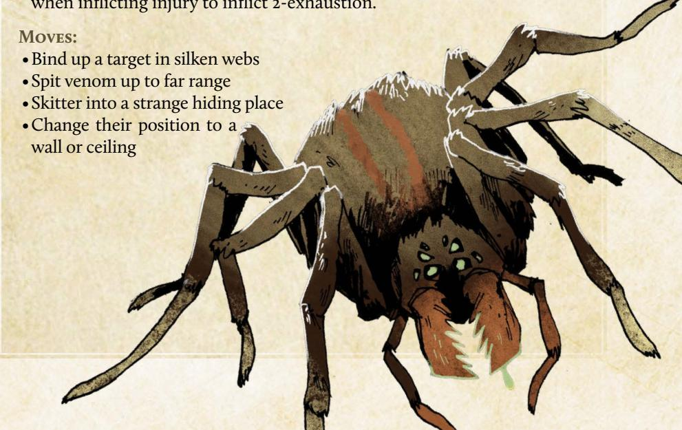

{130}------------------------------------------------

**Description:** For the Woodland's burrowing species, snakes are often a chief concern, a constant threat that can sneak up on the most attentive digger of holes. But for those who dive even deeper than where most molefolk fear to tread, the threat looms larger. There, in the world's most forgotten places, coils the stuff of nightmares: leviathans, capable of swallowing bands of vagabonds and their illgotten gains whole. From the barnacle-crusted sea snakes of Bertram's Cove to the timber rattlers brumating in Sixtoe Stand's limestone crevasses, the Woodland teems with serpentine life. Yet not all Giant Snakes are created equally, making cataloguing these highly adaptable predators an important field of study for ambitious vagabonds who wish to see all the various monsters of the Woodland.

So-called "snake oil" is a favorite con of the woodland's charlatans, who often charge exorbitant amounts of coin for shed skin suspended in a jar of vegetable oil. That said, giant snakes' scales can be molded into armor and shields, or as construction material. Certain branches of the Lizard Cult use a diluted version of giant snake venom in their rituals, believing the right supplicant can achieve communion with the Great Wyrm through imbibing.

GM Advice: Giant snakes are one of the most common threats and can range from an easily banished nuisance to a legendary foe. A smaller version might have 2–3 fewer boxes of each harm track and lack the Venomous trait, while the largest might double every harm track and add Terrifying. Some snakes might also have traits like Hardened or Sharp to reflect the toughness of their scales or teeth!

A giant snake's primary drive is to consume, with survival coming in at a close second. Almost all species have speed on their side, and can easily overwhelm vagabonds with their proclivity for changing range before most can blink. In addition to using the Stealthy trait to snatch up a single character and abscond with them back to the snake's lair, most snakes also vary their tactics based on the terrain—broad open spaces mean the snake will strike from multiple angles before retreating, while tight tunnels allow the snake to limit the number of characters who can attack it at once to only one or two combatants.

{131}------------------------------------------------

| Siant Snake Statblock                                                                                                                                                                          |                                                                                                                                                                                                                                                                                                                                                                                                                                                                                                                                                                                                                                                                                                                                                                                                                                                                                                                                                                                                                                                                                                                                                                                                                                                                                                                                                                                                                                                                                                                                                                                                                                                                                                                                                                                                                                                                                                                                                                                                                                                                                                                                |
|------------------------------------------------------------------------------------------------------------------------------------------------------------------------------------------------|--------------------------------------------------------------------------------------------------------------------------------------------------------------------------------------------------------------------------------------------------------------------------------------------------------------------------------------------------------------------------------------------------------------------------------------------------------------------------------------------------------------------------------------------------------------------------------------------------------------------------------------------------------------------------------------------------------------------------------------------------------------------------------------------------------------------------------------------------------------------------------------------------------------------------------------------------------------------------------------------------------------------------------------------------------------------------------------------------------------------------------------------------------------------------------------------------------------------------------------------------------------------------------------------------------------------------------------------------------------------------------------------------------------------------------------------------------------------------------------------------------------------------------------------------------------------------------------------------------------------------------------------------------------------------------------------------------------------------------------------------------------------------------------------------------------------------------------------------------------------------------------------------------------------------------------------------------------------------------------------------------------------------------------------------------------------------------------------------------------------------------|
|                                                                                                                                                                                                | EXHAUSTION                                                                                                                                                                                                                                                                                                                                                                                                                                                                                                                                                                                                                                                                                                                                                                                                                                                                                                                                                                                                                                                                                                                                                                                                                                                                                                                                                                                                                                                                                                                                                                                                                                                                                                                                                                                                                                                                                                                                                                                                                                                                                                                     |
|                                                                                                                                                                                                | INJURY                                                                                                                                                                                                                                                                                                                                                                                                                                                                                                                                                                                                                                                                                                                                                                                                                                                                                                                                                                                                                                                                                                                                                                                                                                                                                                                                                                                                                                                                                                                                                                                                                                                                                                                                                                                                                                                                                                                                                                                                                                                                                                                         |
|                                                                                                                                                                                                | WEAR                                                                                                                                                                                                                                                                                                                                                                                                                                                                                                                                                                                                                                                                                                                                                                                                                                                                                                                                                                                                                                                                                                                                                                                                                                                                                                                                                                                                                                                                                                                                                                                                                                                                                                                                                                                                                                                                                                                                                                                                                                                                                                                           |
|                                                                                                                                                                                                | MORALE                                                                                                                                                                                                                                                                                                                                                                                                                                                                                                                                                                                                                                                                                                                                                                                                                                                                                                                                                                                                                                                                                                                                                                                                                                                                                                                                                                                                                                                                                                                                                                                                                                                                                                                                                                                                                                                                                                                                                                                                                                                                                                                         |
| larm Inflicted: 2-injury                                                                                                                                                                       |                                                                                                                                                                                                                                                                                                                                                                                                                                                                                                                                                                                                                                                                                                                                                                                                                                                                                                                                                                                                                                                                                                                                                                                                                                                                                                                                                                                                                                                                                                                                                                                                                                                                                                                                                                                                                                                                                                                                                                                                                                                                                                                                |
|                                                                                                                                                                                                |                                                                                                                                                                                                                                                                                                                                                                                                                                                                                                                                                                                                                                                                                                                                                                                                                                                                                                                                                                                                                                                                                                                                                                                                                                                                                                                                                                                                                                                                                                                                                                                                                                                                                                                                                                                                                                                                                                                                                                                                                                                                                                                                |
|                                                                                                                                                                                                | stantly searching for food, attacking f seriously threatened, flees to safety.                                                                                                                                                                                                                                                                                                                                                                                                                                                                                                                                                                                                                                                                                                                                                                                                                                                                                                                                                                                                                                                                                                                                                                                                                                                                                                                                                                                                                                                                                                                                                                                                                                                                                                                                                                                                                                                                                                                                                                                                                                                 |
|                                                                                                                                                                                                | and the state of the state of the state of the state of the state of the state of the state of the state of the state of the state of the state of the state of the state of the state of the state of the state of the state of the state of the state of the state of the state of the state of the state of the state of the state of the state of the state of the state of the state of the state of the state of the state of the state of the state of the state of the state of the state of the state of the state of the state of the state of the state of the state of the state of the state of the state of the state of the state of the state of the state of the state of the state of the state of the state of the state of the state of the state of the state of the state of the state of the state of the state of the state of the state of the state of the state of the state of the state of the state of the state of the state of the state of the state of the state of the state of the state of the state of the state of the state of the state of the state of the state of the state of the state of the state of the state of the state of the state of the state of the state of the state of the state of the state of the state of the state of the state of the state of the state of the state of the state of the state of the state of the state of the state of the state of the state of the state of the state of the state of the state of the state of the state of the state of the state of the state of the state of the state of the state of the state of the state of the state of the state of the state of the state of the state of the state of the state of the state of the state of the state of the state of the state of the state of the state of the state of the state of the state of the state of the state of the state of the state of the state of the state of the state of the state of the state of the state of the state of the state of the state of the state of the state of the state of the state of the state of the state of the state of t |
| Entangling (Coils): After inflicting homoster marks exhaustion to entangranges or use any ranged weaponry to Slippery: Grappling or restraining the group of characters and special equipages. | gle their target; the target cannot shift until they successfully break free. his monster requires at least a small                                                                                                                                                                                                                                                                                                                                                                                                                                                                                                                                                                                                                                                                                                                                                                                                                                                                                                                                                                                                                                                                                                                                                                                                                                                                                                                                                                                                                                                                                                                                                                                                                                                                                                                                                                                                                                                                                                                                                                                                      |
| grappling hooks, etc.). <b>Stealthy</b> : Once per session, this monster can appear without                                                                                                    | 1,05                                                                                                                                                                                                                                                                                                                                                                                                                                                                                                                                                                                                                                                                                                                                                                                                                                                                                                                                                                                                                                                                                                                                                                                                                                                                                                                                                                                                                                                                                                                                                                                                                                                                                                                                                                                                                                                                                                                                                                                                                                                                                                                           |
| warning, grab a character, and vanish, bringing their captive                                                                                                                                  |                                                                                                                                                                                                                                                                                                                                                                                                                                                                                                                                                                                                                                                                                                                                                                                                                                                                                                                                                                                                                                                                                                                                                                                                                                                                                                                                                                                                                                                                                                                                                                                                                                                                                                                                                                                                                                                                                                                                                                                                                                                                                                                                |
| back to a safe place or lair.                                                                                                                                                                  | 1                                                                                                                                                                                                                                                                                                                                                                                                                                                                                                                                                                                                                                                                                                                                                                                                                                                                                                                                                                                                                                                                                                                                                                                                                                                                                                                                                                                                                                                                                                                                                                                                                                                                                                                                                                                                                                                                                                                                                                                                                                                                                                                              |
| <b>Venomous (Bite)</b> : The first time this monster injures                                                                                                                                   | (OR                                                                                                                                                                                                                                                                                                                                                                                                                                                                                                                                                                                                                                                                                                                                                                                                                                                                                                                                                                                                                                                                                                                                                                                                                                                                                                                                                                                                                                                                                                                                                                                                                                                                                                                                                                                                                                                                                                                                                                                                                                                                                                                            |
| a target with its venomous                                                                                                                                                                     | 166                                                                                                                                                                                                                                                                                                                                                                                                                                                                                                                                                                                                                                                                                                                                                                                                                                                                                                                                                                                                                                                                                                                                                                                                                                                                                                                                                                                                                                                                                                                                                                                                                                                                                                                                                                                                                                                                                                                                                                                                                                                                                                                            |
| part each fight—teeth,                                                                                                                                                                         | The state of the state of the state of the state of the state of the state of the state of the state of the state of the state of the state of the state of the state of the state of the state of the state of the state of the state of the state of the state of the state of the state of the state of the state of the state of the state of the state of the state of the state of the state of the state of the state of the state of the state of the state of the state of the state of the state of the state of the state of the state of the state of the state of the state of the state of the state of the state of the state of the state of the state of the state of the state of the state of the state of the state of the state of the state of the state of the state of the state of the state of the state of the state of the state of the state of the state of the state of the state of the state of the state of the state of the state of the state of the state of the state of the state of the state of the state of the state of the state of the state of the state of the state of the state of the state of the state of the state of the state of the state of the state of the state of the state of the state of the state of the state of the state of the state of the state of the state of the state of the state of the state of the state of the state of the state of the state of the state of the state of the state of the state of the state of the state of the state of the state of the state of the state of the state of the state of the state of the state of the state of the state of the state of the state of the state of the state of the state of the state of the state of the state of the state of the state of the state of the state of the state of the state of the state of the state of the state of the state of the state of the state of the state of the state of the state of the state of the state of the state of the state of the state of the state of the state of the state of the state of the state of the state of the state of the s |
| stinger, etc.—it marks                                                                                                                                                                         | GHT.                                                                                                                                                                                                                                                                                                                                                                                                                                                                                                                                                                                                                                                                                                                                                                                                                                                                                                                                                                                                                                                                                                                                                                                                                                                                                                                                                                                                                                                                                                                                                                                                                                                                                                                                                                                                                                                                                                                                                                                                                                                                                                                           |
| one exhaustion when                                                                                                                                                                            |                                                                                                                                                                                                                                                                                                                                                                                                                                                                                                                                                                                                                                                                                                                                                                                                                                                                                                                                                                                                                                                                                                                                                                                                                                                                                                                                                                                                                                                                                                                                                                                                                                                                                                                                                                                                                                                                                                                                                                                                                                                                                                                                |
| inflicting injury to inflict 2-exhaustion.                                                                                                                                                     |                                                                                                                                                                                                                                                                                                                                                                                                                                                                                                                                                                                                                                                                                                                                                                                                                                                                                                                                                                                                                                                                                                                                                                                                                                                                                                                                                                                                                                                                                                                                                                                                                                                                                                                                                                                                                                                                                                                                                                                                                                                                                                                                |
| minet z-exmaustion.                                                                                                                                                                            |                                                                                                                                                                                                                                                                                                                                                                                                                                                                                                                                                                                                                                                                                                                                                                                                                                                                                                                                                                                                                                                                                                                                                                                                                                                                                                                                                                                                                                                                                                                                                                                                                                                                                                                                                                                                                                                                                                                                                                                                                                                                                                                                |
| loves:                                                                                                                                                                                         |                                                                                                                                                                                                                                                                                                                                                                                                                                                                                                                                                                                                                                                                                                                                                                                                                                                                                                                                                                                                                                                                                                                                                                                                                                                                                                                                                                                                                                                                                                                                                                                                                                                                                                                                                                                                                                                                                                                                                                                                                                                                                                                                |
| Coil around a target, restraining them                                                                                                                                                         |                                                                                                                                                                                                                                                                                                                                                                                                                                                                                                                                                                                                                                                                                                                                                                                                                                                                                                                                                                                                                                                                                                                                                                                                                                                                                                                                                                                                                                                                                                                                                                                                                                                                                                                                                                                                                                                                                                                                                                                                                                                                                                                                |
| Sacrifice a position                                                                                                                                                                           |                                                                                                                                                                                                                                                                                                                                                                                                                                                                                                                                                                                                                                                                                                                                                                                                                                                                                                                                                                                                                                                                                                                                                                                                                                                                                                                                                                                                                                                                                                                                                                                                                                                                                                                                                                                                                                                                                                                                                                                                                                                                                                                                |
| in favor of a swift and                                                                                                                                                                        |                                                                                                                                                                                                                                                                                                                                                                                                                                                                                                                                                                                                                                                                                                                                                                                                                                                                                                                                                                                                                                                                                                                                                                                                                                                                                                                                                                                                                                                                                                                                                                                                                                                                                                                                                                                                                                                                                                                                                                                                                                                                                                                                |
| powerful strike                                                                                                                                                                                |                                                                                                                                                                                                                                                                                                                                                                                                                                                                                                                                                                                                                                                                                                                                                                                                                                                                                                                                                                                                                                                                                                                                                                                                                                                                                                                                                                                                                                                                                                                                                                                                                                                                                                                                                                                                                                                                                                                                                                                                                                                                                                                                |
| Slip into a hard-to-                                                                                                                                                                           |                                                                                                                                                                                                                                                                                                                                                                                                                                                                                                                                                                                                                                                                                                                                                                                                                                                                                                                                                                                                                                                                                                                                                                                                                                                                                                                                                                                                                                                                                                                                                                                                                                                                                                                                                                                                                                                                                                                                                                                                                                                                                                                                |
| reach place to avoid damage                                                                                                                                                                    |                                                                                                                                                                                                                                                                                                                                                                                                                                                                                                                                                                                                                                                                                                                                                                                                                                                                                                                                                                                                                                                                                                                                                                                                                                                                                                                                                                                                                                                                                                                                                                                                                                                                                                                                                                                                                                                                                                                                                                                                                                                                                                                                |
| Immediately strike and then chang                                                                                                                                                              | ge range                                                                                                                                                                                                                                                                                                                                                                                                                                                                                                                                                                                                                                                                                                                                                                                                                                                                                                                                                                                                                                                                                                                                                                                                                                                                                                                                                                                                                                                                                                                                                                                                                                                                                                                                                                                                                                                                                                                                                                                                                                                                                                                       |
| before anyone can react                                                                                                                                                                        |                                                                                                                                                                                                                                                                                                                                                                                                                                                                                                                                                                                                                                                                                                                                                                                                                                                                                                                                                                                                                                                                                                                                                                                                                                                                                                                                                                                                                                                                                                                                                                                                                                                                                                                                                                                                                                                                                                                                                                                                                                                                                                                                |

{132}------------------------------------------------

**Description:** Few arthropods are as well-armed and well-armored as the Giant Scorpion. Sporting two massive, crab-like pincers and a long, sickleshaped tail, these aggressive predators pose a triple-threat to anything they deem to be aggressive toward them. And of course, one mustn't forget the venom sac attached to their stinger.

While giant scorpions tend to prefer arid climates, sightings have been reported in virtually all corners of the Woodland. Wherever there is significant vegetation or debris for them to hide under, they flourish, and are especially fond of ruins, where expedition crews are likely to find them breeding or hibernating in dark, seething clusters.

Weapons and armor crafted from the scorpion's chitin are exceedingly rare, given the effort it takes to acquire it (and expensive, unless those commissioning it can provide the materials). The River Company is always looking for more carapaces to stockpile, and are the most common source of Giant Scorpion bounties.

GM Advice: Giant scorpions are formidable, but not impossible to defeat—a soft, gooey center lurks beneath their hardened exoskeletons, one they hope to distract enemies from by employing diversionary and brutish tactics. The closer a vagabond gets to a giant scorpion, the more likely they are to inflict an injury between the scorpion's natural plating; thus, these beasts prefer to keep their prey (or potential predators) at a distance, using multi-target attacks such as its tail swipe or blinding sand to give itself time to widen the gap—while ensuring its targets remain within range of its stinger.

Should the giant scorpion incapacitate something it deems edible, it will try to escape with them in its claws, provided it believes it can get away. If any remaining threats seem too great, the scorpion will continue to attempt to drive it off or flee—whichever increases its odds of survival. A giant scorpion is unlikely to devour a victim in the midst of a battle; they prefer to eat their meals in a place of safety, as the slow process of extracting their prey's innards can leave the scorpion vulnerable to attack. That delay gives vagabonds time to rescue any friends or beloved NPCs the giant scorpion might have dragged off as a snack!

{133}------------------------------------------------

| Giant Scorpion Statblock                                                                                                                                                                                                                                                                                                                                                                                                                                                                                                                                                                                                                                                                                                                                                                                                                                                                                                                                                                                                                                                                                                                                                                                                                                                                                                                                                                                                                                                                                                                                                                                                                                                                                                                                                                                                                                                                                                                                                                                                                                                                                                      |   |
|-------------------------------------------------------------------------------------------------------------------------------------------------------------------------------------------------------------------------------------------------------------------------------------------------------------------------------------------------------------------------------------------------------------------------------------------------------------------------------------------------------------------------------------------------------------------------------------------------------------------------------------------------------------------------------------------------------------------------------------------------------------------------------------------------------------------------------------------------------------------------------------------------------------------------------------------------------------------------------------------------------------------------------------------------------------------------------------------------------------------------------------------------------------------------------------------------------------------------------------------------------------------------------------------------------------------------------------------------------------------------------------------------------------------------------------------------------------------------------------------------------------------------------------------------------------------------------------------------------------------------------------------------------------------------------------------------------------------------------------------------------------------------------------------------------------------------------------------------------------------------------------------------------------------------------------------------------------------------------------------------------------------------------------------------------------------------------------------------------------------------------|---|
| EXHAUSTION                                                                                                                                                                                                                                                                                                                                                                                                                                                                                                                                                                                                                                                                                                                                                                                                                                                                                                                                                                                                                                                                                                                                                                                                                                                                                                                                                                                                                                                                                                                                                                                                                                                                                                                                                                                                                                                                                                                                                                                                                                                                                                                    |   |
|                                                                                                                                                                                                                                                                                                                                                                                                                                                                                                                                                                                                                                                                                                                                                                                                                                                                                                                                                                                                                                                                                                                                                                                                                                                                                                                                                                                                                                                                                                                                                                                                                                                                                                                                                                                                                                                                                                                                                                                                                                                                                                                               |   |
| □ ♦ □ □ □ □ WEAR                                                                                                                                                                                                                                                                                                                                                                                                                                                                                                                                                                                                                                                                                                                                                                                                                                                                                                                                                                                                                                                                                                                                                                                                                                                                                                                                                                                                                                                                                                                                                                                                                                                                                                                                                                                                                                                                                                                                                                                                                                                                                                              |   |
| □ ♦ □ □ □ □ MORALE                                                                                                                                                                                                                                                                                                                                                                                                                                                                                                                                                                                                                                                                                                                                                                                                                                                                                                                                                                                                                                                                                                                                                                                                                                                                                                                                                                                                                                                                                                                                                                                                                                                                                                                                                                                                                                                                                                                                                                                                                                                                                                            |   |
| Harm Inflicted: 2-injury                                                                                                                                                                                                                                                                                                                                                                                                                                                                                                                                                                                                                                                                                                                                                                                                                                                                                                                                                                                                                                                                                                                                                                                                                                                                                                                                                                                                                                                                                                                                                                                                                                                                                                                                                                                                                                                                                                                                                                                                                                                                                                      |   |
| Instinct:                                                                                                                                                                                                                                                                                                                                                                                                                                                                                                                                                                                                                                                                                                                                                                                                                                                                                                                                                                                                                                                                                                                                                                                                                                                                                                                                                                                                                                                                                                                                                                                                                                                                                                                                                                                                                                                                                                                                                                                                                                                                                                                     |   |
| • <b>Protective</b> : This monster aggressively defends its home, fighting to the death against intruders; if found outside its home, the monster will retreat if confronted or provoked.                                                                                                                                                                                                                                                                                                                                                                                                                                                                                                                                                                                                                                                                                                                                                                                                                                                                                                                                                                                                                                                                                                                                                                                                                                                                                                                                                                                                                                                                                                                                                                                                                                                                                                                                                                                                                                                                                                                                     |   |
| TRAITS:                                                                                                                                                                                                                                                                                                                                                                                                                                                                                                                                                                                                                                                                                                                                                                                                                                                                                                                                                                                                                                                                                                                                                                                                                                                                                                                                                                                                                                                                                                                                                                                                                                                                                                                                                                                                                                                                                                                                                                                                                                                                                                                       |   |
| • Hardened (Chitinous Shell): This monster ignores the first injury inflicted by every successful attack; this tag does not reduce injury done to a swarm track.                                                                                                                                                                                                                                                                                                                                                                                                                                                                                                                                                                                                                                                                                                                                                                                                                                                                                                                                                                                                                                                                                                                                                                                                                                                                                                                                                                                                                                                                                                                                                                                                                                                                                                                                                                                                                                                                                                                                                              |   |
| • Sharp (Pincers): When harm inflicted by this monster is marked as wear,                                                                                                                                                                                                                                                                                                                                                                                                                                                                                                                                                                                                                                                                                                                                                                                                                                                                                                                                                                                                                                                                                                                                                                                                                                                                                                                                                                                                                                                                                                                                                                                                                                                                                                                                                                                                                                                                                                                                                                                                                                                     |   |
| • Titanic: This creature cannot be restrained without equipment                                                                                                                                                                                                                                                                                                                                                                                                                                                                                                                                                                                                                                                                                                                                                                                                                                                                                                                                                                                                                                                                                                                                                                                                                                                                                                                                                                                                                                                                                                                                                                                                                                                                                                                                                                                                                                                                                                                                                                                                                                                               |   |
| • <b>Itanic</b> : I his creature cannot be restrained without equipment specifically designed for its containment.                                                                                                                                                                                                                                                                                                                                                                                                                                                                                                                                                                                                                                                                                                                                                                                                                                                                                                                                                                                                                                                                                                                                                                                                                                                                                                                                                                                                                                                                                                                                                                                                                                                                                                                                                                                                                                                                                                                                                                                                            |   |
| • Venomous (Stinger): The first time this monster                                                                                                                                                                                                                                                                                                                                                                                                                                                                                                                                                                                                                                                                                                                                                                                                                                                                                                                                                                                                                                                                                                                                                                                                                                                                                                                                                                                                                                                                                                                                                                                                                                                                                                                                                                                                                                                                                                                                                                                                                                                                             |   |
| injures a target with its venomous part                                                                                                                                                                                                                                                                                                                                                                                                                                                                                                                                                                                                                                                                                                                                                                                                                                                                                                                                                                                                                                                                                                                                                                                                                                                                                                                                                                                                                                                                                                                                                                                                                                                                                                                                                                                                                                                                                                                                                                                                                                                                                       |   |
| each fight—teeth, stinger, etc.—\nit marks one exhaustion when inflicting                                                                                                                                                                                                                                                                                                                                                                                                                                                                                                                                                                                                                                                                                                                                                                                                                                                                                                                                                                                                                                                                                                                                                                                                                                                                                                                                                                                                                                                                                                                                                                                                                                                                                                                                                                                                                                                                                                                                                                                                                                                     |   |
| injury to inflict 2-exhaustion.                                                                                                                                                                                                                                                                                                                                                                                                                                                                                                                                                                                                                                                                                                                                                                                                                                                                                                                                                                                                                                                                                                                                                                                                                                                                                                                                                                                                                                                                                                                                                                                                                                                                                                                                                                                                                                                                                                                                                                                                                                                                                               |   |
| Moves:                                                                                                                                                                                                                                                                                                                                                                                                                                                                                                                                                                                                                                                                                                                                                                                                                                                                                                                                                                                                                                                                                                                                                                                                                                                                                                                                                                                                                                                                                                                                                                                                                                                                                                                                                                                                                                                                                                                                                                                                                                                                                                                        |   |
| Sweep multiple targets with its tail                                                                                                                                                                                                                                                                                                                                                                                                                                                                                                                                                                                                                                                                                                                                                                                                                                                                                                                                                                                                                                                                                                                                                                                                                                                                                                                                                                                                                                                                                                                                                                                                                                                                                                                                                                                                                                                                                                                                                                                                                                                                                          | , |
| Scale a vertical surface to gain an advantage                                                                                                                                                                                                                                                                                                                                                                                                                                                                                                                                                                                                                                                                                                                                                                                                                                                                                                                                                                                                                                                                                                                                                                                                                                                                                                                                                                                                                                                                                                                                                                                                                                                                                                                                                                                                                                                                                                                                                                                                                                                                                 | B |
| • Throw up sand or dirt to blind enemies                                                                                                                                                                                                                                                                                                                                                                                                                                                                                                                                                                                                                                                                                                                                                                                                                                                                                                                                                                                                                                                                                                                                                                                                                                                                                                                                                                                                                                                                                                                                                                                                                                                                                                                                                                                                                                                                                                                                                                                                                                                                                      | 1 |
| • Rush forward into a target, knocking them prone                                                                                                                                                                                                                                                                                                                                                                                                                                                                                                                                                                                                                                                                                                                                                                                                                                                                                                                                                                                                                                                                                                                                                                                                                                                                                                                                                                                                                                                                                                                                                                                                                                                                                                                                                                                                                                                                                                                                                                                                                                                                             |   |
|                                                                                                                                                                                                                                                                                                                                                                                                                                                                                                                                                                                                                                                                                                                                                                                                                                                                                                                                                                                                                                                                                                                                                                                                                                                                                                                                                                                                                                                                                                                                                                                                                                                                                                                                                                                                                                                                                                                                                                                                                                                                                                                               |   |
|                                                                                                                                                                                                                                                                                                                                                                                                                                                                                                                                                                                                                                                                                                                                                                                                                                                                                                                                                                                                                                                                                                                                                                                                                                                                                                                                                                                                                                                                                                                                                                                                                                                                                                                                                                                                                                                                                                                                                                                                                                                                                                                               | F |
|                                                                                                                                                                                                                                                                                                                                                                                                                                                                                                                                                                                                                                                                                                                                                                                                                                                                                                                                                                                                                                                                                                                                                                                                                                                                                                                                                                                                                                                                                                                                                                                                                                                                                                                                                                                                                                                                                                                                                                                                                                                                                                                               |   |
|                                                                                                                                                                                                                                                                                                                                                                                                                                                                                                                                                                                                                                                                                                                                                                                                                                                                                                                                                                                                                                                                                                                                                                                                                                                                                                                                                                                                                                                                                                                                                                                                                                                                                                                                                                                                                                                                                                                                                                                                                                                                                                                               |   |
|                                                                                                                                                                                                                                                                                                                                                                                                                                                                                                                                                                                                                                                                                                                                                                                                                                                                                                                                                                                                                                                                                                                                                                                                                                                                                                                                                                                                                                                                                                                                                                                                                                                                                                                                                                                                                                                                                                                                                                                                                                                                                                                               |   |
|                                                                                                                                                                                                                                                                                                                                                                                                                                                                                                                                                                                                                                                                                                                                                                                                                                                                                                                                                                                                                                                                                                                                                                                                                                                                                                                                                                                                                                                                                                                                                                                                                                                                                                                                                                                                                                                                                                                                                                                                                                                                                                                               |   |
|                                                                                                                                                                                                                                                                                                                                                                                                                                                                                                                                                                                                                                                                                                                                                                                                                                                                                                                                                                                                                                                                                                                                                                                                                                                                                                                                                                                                                                                                                                                                                                                                                                                                                                                                                                                                                                                                                                                                                                                                                                                                                                                               |   |
|                                                                                                                                                                                                                                                                                                                                                                                                                                                                                                                                                                                                                                                                                                                                                                                                                                                                                                                                                                                                                                                                                                                                                                                                                                                                                                                                                                                                                                                                                                                                                                                                                                                                                                                                                                                                                                                                                                                                                                                                                                                                                                                               |   |
|                                                                                                                                                                                                                                                                                                                                                                                                                                                                                                                                                                                                                                                                                                                                                                                                                                                                                                                                                                                                                                                                                                                                                                                                                                                                                                                                                                                                                                                                                                                                                                                                                                                                                                                                                                                                                                                                                                                                                                                                                                                                                                                               |   |
| ALE CONTRACTOR OF THE PARTY OF THE PARTY OF THE PARTY OF THE PARTY OF THE PARTY OF THE PARTY OF THE PARTY OF THE PARTY OF THE PARTY OF THE PARTY OF THE PARTY OF THE PARTY OF THE PARTY OF THE PARTY OF THE PARTY OF THE PARTY OF THE PARTY OF THE PARTY OF THE PARTY OF THE PARTY OF THE PARTY OF THE PARTY OF THE PARTY OF THE PARTY OF THE PARTY OF THE PARTY OF THE PARTY OF THE PARTY OF THE PARTY OF THE PARTY OF THE PARTY OF THE PARTY OF THE PARTY OF THE PARTY OF THE PARTY OF THE PARTY OF THE PARTY OF THE PARTY OF THE PARTY OF THE PARTY OF THE PARTY OF THE PARTY OF THE PARTY OF THE PARTY OF THE PARTY OF THE PARTY OF THE PARTY OF THE PARTY OF THE PARTY OF THE PARTY OF THE PARTY OF THE PARTY OF THE PARTY OF THE PARTY OF THE PARTY OF THE PARTY OF THE PARTY OF THE PARTY OF THE PARTY OF THE PARTY OF THE PARTY OF THE PARTY OF THE PARTY OF THE PARTY OF THE PARTY OF THE PARTY OF THE PARTY OF THE PARTY OF THE PARTY OF THE PARTY OF THE PARTY OF THE PARTY OF THE PARTY OF THE PARTY OF THE PARTY OF THE PARTY OF THE PARTY OF THE PARTY OF THE PARTY OF THE PARTY OF THE PARTY OF THE PARTY OF THE PARTY OF THE PARTY OF THE PARTY OF THE PARTY OF THE PARTY OF THE PARTY OF THE PARTY OF THE PARTY OF THE PARTY OF THE PARTY OF THE PARTY OF THE PARTY OF THE PARTY OF THE PARTY OF THE PARTY OF THE PARTY OF THE PARTY OF THE PARTY OF THE PARTY OF THE PARTY OF THE PARTY OF THE PARTY OF THE PARTY OF THE PARTY OF THE PARTY OF THE PARTY OF THE PARTY OF THE PARTY OF THE PARTY OF THE PARTY OF THE PARTY OF THE PARTY OF THE PARTY OF THE PARTY OF THE PARTY OF THE PARTY OF THE PARTY OF THE PARTY OF THE PARTY OF THE PARTY OF THE PARTY OF THE PARTY OF THE PARTY OF THE PARTY OF THE PARTY OF THE PARTY OF THE PARTY OF THE PARTY OF THE PARTY OF THE PARTY OF THE PARTY OF THE PARTY OF THE PARTY OF THE PARTY OF THE PARTY OF THE PARTY OF THE PARTY OF THE PARTY OF THE PARTY OF THE PARTY OF THE PARTY OF THE PARTY OF THE PARTY OF THE PARTY OF THE PARTY OF THE PARTY OF THE PARTY OF THE PARTY OF THE PARTY OF THE PARTY OF THE PARTY OF THE PARTY OF THE PARTY OF THE PARTY OF |   |
|                                                                                                                                                                                                                                                                                                                                                                                                                                                                                                                                                                                                                                                                                                                                                                                                                                                                                                                                                                                                                                                                                                                                                                                                                                                                                                                                                                                                                                                                                                                                                                                                                                                                                                                                                                                                                                                                                                                                                                                                                                                                                                                               |   |
|                                                                                                                                                                                                                                                                                                                                                                                                                                                                                                                                                                                                                                                                                                                                                                                                                                                                                                                                                                                                                                                                                                                                                                                                                                                                                                                                                                                                                                                                                                                                                                                                                                                                                                                                                                                                                                                                                                                                                                                                                                                                                                                               |   |

{134}------------------------------------------------

**Description:** What is the difference between a giant bee and a giant hornet? For most denizens of the Woodland, the answer is rather simple: a giant bee can sting you… but a giant hornet will sting you. Indeed, these aggressive carnivorous hunters often make meals out of their more docile insect cousins. Giant hornets are fiercely territorial, defending their hives, their hunting ground, and themselves with deadly force. They tend to prefer to attack in large numbers, often summoning more hornets by releasing powerful attack pheromones to draw others into the fray.

Giant conacle hives are the surest sign of the hornet's presence, spewing forth dozens of hungry hornets when the hive is disrupted or threatened. Denizens report livestock, and even friends, being carried off on deadly wings. The hornets have even disrupted trade in some areas by making it impossible for merchants to travel safely from one clearing to another. Some merchant caravans have taken to hiring vagabonds to ride ahead and clear the road of such pests; this has been met with varying degrees of success.

GM Advice: These winged hunters are highly territorial and highly aggressive when threatened. They ignore most nonthreatening creatures, but—when they do engage—they sting their prey with deadly venom before tearing them apart with razor sharp mandibles. They can also release an attack pheromone capable of summoning nearby giant hornets to come to their defense. It is possible that an interaction with a single hornet can quickly spiral out of control for the vagabonds as many more hornets enter the fight.

The vagabonds might encounter these monsters in the forest as they traverse the Woodlands—hornet hives pop up anywhere the insects can find enough stability to make a home. Be sure to describe how they drone aggressively as they take to the sky, their sharp mandibles and deadly stinger poised to attack. Narrate how they show little fear, throwing themselves at attackers in an attempt to bite and sting them.

It is also possible that the band is tasked by a faction like the Riverfolk Company with tracking and locating a hornets' nest that is interfering with local trade or by the denizens themselves to protect a swarm of local giant bees whose honey fuels the local economy. But just as often it is the Marquisate or Eyrie Dynasties who would hire the vagabonds to rescue one of their members who has been carried away by the hornets before the denizen meets a grisly fate.

{135}------------------------------------------------

# Giant Hornets Statblocks

Harm Inflicted*: 2-injury* 

#### **Instinct:**

•**Bullheaded**: This monster ignores nonthreatening creatures, but attacks fiercely when angered or injured, repeatedly pursuing its prey until successful or driven off.

#### **Traits:**

- •**Swarm (support 8) :** When more than a small mob of these monsters gather (10), they gain a swarm track with ten boxes, half of which begin marked, and a number of d6s equal to their support. Any injury done to them clears a swarm box instead of inflicting harm; if the track is cleared, the swarm disperses. When something would attract more monsters to the swarm, the GM rolls 1d6 from the support pool and and marks half (round up) the total on the track to add more monsters, then discards the die; if the track is filled, characters engaged with the swarm are overrun—killed, captured, or run off, GM's choice. If the support pool is exhausted, no more of the monsters appear.
- •**Hardened (Chitinous Shell):** This monster ignores the first injury harm inflicted by every successful attack; this tag does not reduce injury done to a swarm track.
- •**Venomous (Sting):** The first time this monster injures a target, it marks exhaustion when inflicting injury to inflict 2-exhaustion.
- •**Flying**: This monster can fly and hover, allowing it to move quickly over any terrain and change ranges quickly

#### **Moves:**

- •Zip into the air to avoid entanglements
- •Bite through a branch, restraint, or piece of gear
- •Work in concert to overwhelm an attacker in a swarm of chitin and stingers
- •Summon nearby giant hornets to the area

#### Individual

**exhaustion**

**injury**

**wear**

**morale**

#### Small Mob

**exhaustion**

**injury**

**wear**

**morale**

#### Swarm

**Swarm Track**

#### Queen

**exhaustion**

**injury**

**wear**

{136}------------------------------------------------

of flora and fauna, grand and mysterious. The humble giant honey bee plays a vital role in the success of the large plants across the Woodland. From early spring on, they buzz from flower to flower collecting nectar and spreading pollen; by summer, their beehives are buzzing with dozens—or even hundreds—of giant bees collecting nectar in service to their queen. The bees craft delicious honey from these combs, a rare delicacy sought after by many cooks for its delectable sweetness.

Yet these insects are understandably reluctant to share their golden bounty. They are normally docile, but they will swarm and attack when provoked or when their hive is threatened. The giant honey bees' defenses are two fold, sheer numbers and venomous stingers, the latter of which is as deadly to the bee as it is to a potential attacker. These defenses are able to dissuade all but the most determined of looters.

Of course, the Woodland is rife with rumors and tales of hidden hives filled to the brim with delicious honey worth more than its weight in gold. A number of merchants and chefs of great renown have offered to empty their coin purses to any vagabonds who can locate the golden liquidy treasure troves.

GM Advice: When encountered away from their hive, these insects are usually docile unless cornered or attacked, often emitting an agitated buzzing noise to indicate their irritation. When provoked, these creatures rely on sheer numbers to drive attackers away by secreting a pheromone to attract other giant honey bees to their defense. These monsters rely on their sting only as a last resort as it is as fatal to them as it is their attacker. A group of vagabonds could find themselves quickly overrun should they agitate a group of these docile pollinators.

It is possible for the vagabonds to happen upon a group of these pollinators as they are traveling, perhaps accidentally upsetting a small swarm of bees or stumbling into a hive without realizing their error, but it's more likely they will be the defenses of a hive the vagabonds want to burgle. When introducing these antagonists, focus on the droning sound of the bee, the thin coating of dusty pollen, as well as the barb of its deadly stinger—the bees ward away any attackers, but they are ultimately reluctant to actually use their stinger!

{137}------------------------------------------------

#### Giant Honey Bees Statblocks Harm Inflicted*: 1-injury* **Instinct:** •**Docile:** This monster ignores anything its own size (or smaller) and flees when seriously threatened; only fights if absolutely necessary. **Traits:** •**Swarm (support 8) :** When more than a small mob of these monsters gather (10), they gain a swarm track with ten boxes, half of which begin marked, and a number of d6s equal to their support. Any injury done to them clears a swarm box instead of inflicting harm; if the track is cleared, the swarm disperses. When something would attract more monsters to the swarm, the GM rolls 1d6 from the support pool and and marks half (round up) the total on the track to add more monsters, then discards the die; if the track is filled, characters engaged with the swarm are overrun—killed, captured, or run off, GM's choice. If the support pool is exhausted, no more of the monsters appear. •**Venomous (Sting):** The first time this monster injures a target, it marks exhaustion when inflicting injury to inflict 2-exhaustion. •**Flying**: This monster can fly and hover, allowing it to move quickly over any terrain and change ranges quickly •**Hivemind**: This monster does not suffer morale harm; if the queen is ever killed, the colony disperses and fades over a few weeks as the drones seek out a new colony to join. **Moves:** •Buzz lazily into the air, avoiding attackers •Shake violently, releasing a cloud of pollen •Work in concert to bury an attacker in a swarm of bodies •Summon nearby giant bees to the area Individual **exhaustion injury wear morale** Small Mob **exhaustion injury wear morale** Swarm **Swarm Track** Queen **exhaustion injury wear morale**

{138}------------------------------------------------

**Description:** When one thinks of strength, a beetle is not normally what is called to mind. Yet the giant hercules beetle is one of the most powerful insects in all the woodlands. Capable of carrying a hundred times its body weight, this mighty insect can clamp down upon and toss rivals and would-be attackers a great distance using its powerful horns. Fortunately for the denizens of the Woodland, these creatures are quite docile. Indeed, these gentle giants are content to subside on rotting wood and tree sap, both plentiful in the humid undergrowth of the many trees of the forest.

However, travelers can quickly find themselves in a world of danger if they do not show these mighty beasts the proper respect. The price for angering a giant hercules beetle could be broken bones or worse. During mating season, these titans struggle for dominance in clashes of epic proportions. Wise denizens know to avoid any pair of these creatures locked in such a titanic struggle, lest they be crushed by a beetle who doesn't even realize there are onlookers!

GM Advice: Giant hercules beetles are quite content to be left alone, flying from feeding ground to feeding ground ignoring most of the other creatures of the forest. When challenged, they will fight back with brute strength and a thick carapace, smashing into attackers—but they will retreat to the skies as soon as they feel they can get away safely.

Unlike many of the other monsters of the Woodland, the hercules beetle is not sought after for its parts or killed for glory. Instead, they are more likely to be desired as beasts of burden by agents of the Marquisate or Eyrie Dynasties, the kind of monster that can help plow a field, carry trade supplies great distances, or even transport military equipment from clearing to clearing. And who better to send into the forest to get one of these beasts than a vagabond?

When portraying the giant hercules beetle, represent their strength as a force in any encounter. The hercules beetle may not be aggressive, but it can be terrifying! When two males contest for dominance, for example, they throw each other around into the air and knock down trees that would take denizens weeks to cut to the ground.

{139}------------------------------------------------

# Giant hercules Beetle Statblock |

• **Docile:** This monster ignores anything its own size (or smaller) and flees when seriously threatened; only fights if absolutely necessary.

#### TRAITS:

- Hardened (Chitinous Shell): This monster ignores the first injury harm inflicted by every successful attack; this tag does not reduce injury done to a swarm track.
- Flying: This monster can fly and hover, allowing it to move quickly over any terrain and change ranges quickly.
- Catapult (Powerful Horns): This monster is capable of picking up and flinging attackers. Characters who suffer harm from this monster must mark exhaustion or be flung away to a far range.

#### MOVES:

• Take flight, buzzing around on unsteady wings

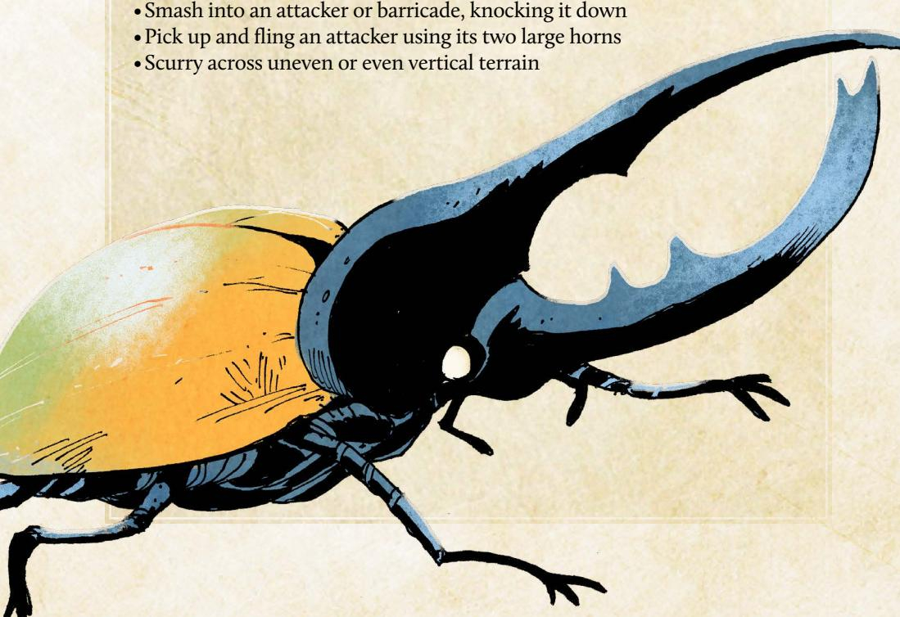

{140}------------------------------------------------

**Description:** Somewhere in the swamps and bayous of the Woodland lurks a true monster. The only evidence of its passing are the massive tracks found sunken into the mud and the stories told by survivors. A few denizens have fashioned crude weapons from the creature's teeth, which are as long and as sharp as a sword, and crude armor and shields from the massive scales found on the banks of the wetlands.

There are claims that the beast has attacked clearings and larger boats. Survivors claim that the waters were calm and still until…SNAP! Then half their boat was missing and they had to scramble back to shore. Some have dismissed these as fairy tales, but rumors of lost clearings have begun to grow. Unsettling stories of a massive beast of scales and teeth stalking the bayous have caused some denizens to pack up and seek safer harbors. And indeed some swamp dwellers claim to feel watched by a massive set of eyes that glow in the dark. Watching. Waiting. Hungry.

Some Lizard Cultists journey to the swamps in order to see these signs, worshipping them as evidence of the power of the Great Wyrm. A few foolish Cultists even seek to give themselves to this terrifying predator, believing that their sacrifice will bring them closer to the Wyrm itself.

GM Advice: The giant alligator is the ultimate ambush predator, capable of lying perfectly still for hours and waiting for the perfect moment to strike. When it does, it is able to strike out with crushing jaws and a thrashing tail to grab its prey…even on land. No one is safe from its hungry jaws.

Be sure to describe the sheer scale and force of this beast whenever it appears! The alligator's powerful jaws house teeth as long and as sharp as swords, and its hide is tough enough to withstand the most powerful blows from the most dangerous vagabonds. This creature should not be taken lightly. Vagabonds who seek out the giant alligator may very well meet their end in its deadly jaws.

It's easy to introduce the alligator as a threat—the vagabonds might come across a community still reeling from a giant alligator attack or be hired by a wealthy merchant looking for someone capable of slaying such a beast and returning with its valuable hide and teeth. Even if the vagabonds happen upon a giant alligator by chance, they are likely to be thrown into a desperate fight for survival. But no matter how the alligator first appears, remember that it's a truly terrifying antagonist; even the most capable vagabonds are at risk of great injury or death when facing such a fearsome foe.

{141}------------------------------------------------

#### Giant Alligator Statblock EXHAUSTION MORALE HARM INFLICTED: 3-injury • Predatory: This monster is constantly searching for food, attacking anything it thinks it can consume; if seriously threatened, flees to safety. TRAITS: • Aquatic: Characters can't target this monster with weapon moves while it's underwater without special equipment (spears, underwater mines, etc.). • Entangling (Jaws): After inflicting harm on a vulnerable target, this monster marks exhaustion to entangle their target; the target cannot shift ranges or use any ranged weaponry until they successfully break free. • Sharp (Teeth): When harm inflicted by this monster is marked as wear, the target of the attack must mark I additional wear. • Terrifying: Engaging in melee with this monster requires vagabonds to mark exhaustion. NPCs will never voluntarily engage it, except in large mobs. • Aggressive: When attacking a target that appears threatening or dangerous, this monster marks exhaustion when inflicting harm to inflict an additional harm. MOVES: Lash out with hungry jaws, smashing through obstacles • Dive beneath the water, avoiding all attacks • Trample over attackers on land Thrash about tearing apart attackers and breaking restraints

{142}------------------------------------------------

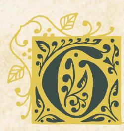

# Giant Carnivorous Plant

**Description:** Many denizens know how important it is to eat your vegetables. What many do not know is that there are vegetables that would eat them if given the chance! Most chalk up rumors of carnivorous plants as tall tales used to scare children, but folk who have travelled deep into the untamed and untouched Woodland claim to have entered groves where most dare not tread. Within these silent glades are found dangerous and deadly plants that find sustenance in the things they can consume.

Stories from survivors are varied. Some claim the roots themselves rose up to attack. Others claim vines entangled them and dragged them towards a terrible maw filled with acid and torment. Still others claim they simply stumbled into the grove by accident and quickly found themselves surrounded by angry plants. The one thing they can all agree on is that there is something alive deep within the forest…and it is hungry.

GM Advice: The Woodland is filled with all manner of deadly fauna… and sometimes even deadly flora!

Individual carnivorous plants are dangerous, but a grove of them can work in tandem to drag prey kicking and screaming to their pitcherlike mouths to feed. While the plants can't move, they will disrupt any attempt to flee, using their vines and roots to drag members of their band back into danger. Portray the silence of the plant's "hunting ground," before you show vines writhing in the shadows and roots slipping over the vagabond's boots, but let loose with the full force of the carnivorous flora when they attack!

The vagabonds might run into carnivorous plants as they explore the forests, but they might also be sent deep into the Woodland in search of the plant specifically, seeking to obtain a rare flower to help save a village from plague, cure a rare disease, or even add to the collection of a high-ranking Marquisate collector. The carnivorous plant is rare enough that the every part of it—or the whole thing itself—would be worth bringing back to a clearing for the right buyer.

{143}------------------------------------------------

#### Giant Carnivorous Plant Statblock

| EXHAUSTION |
|------------|
| INJURY     |
| WEAR       |
| MORALE     |

#### HARM INFLICTED: 1-injury

#### INSTINCT:

• **Predatory:** This monster is constantly searching for food, attacking anything it thinks it can consume; if seriously threatened, flees to safety.

#### TRAITS:

- Rooted: This monster cannot move.
- **Acidic**: This monster deals 1-wear each time it deals 1-injury; if the target cannot (or chooses not to) mark wear, they suffer an additional 1-injury.
- Entangling (Roots): After inflicting harm on a vulnerable target, this monster marks exhaustion to entangle their target; the target cannot shift ranges or use any ranged weaponry until they successfully break free.

#### Moves:

• Cut through gear or equipment with razor sharp leaves

• Ensnare a creature with vines and drag it closer.

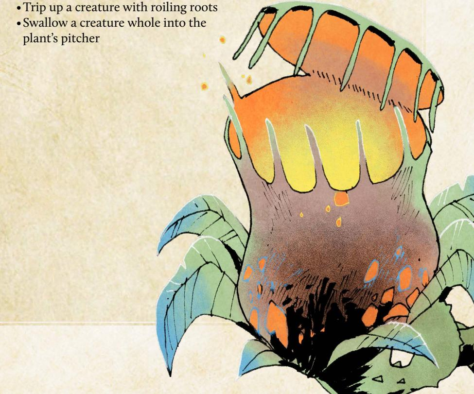

{144}------------------------------------------------

# Creating Monsters

The monsters found in Ruins & Expeditions aren't the only ones found in the Woodland—there are many more terrifying foes and charming beasts than any one vagabond could catalog. Here are some tips for creating your own monsters:

#### Pick a Creature

First, select a creature! Monsters in **Root**: **The RPG** are typically arthropods—spiders, insects, and crustaceans—along with snakes, fish, and other species that don't show up as ordinary denizens. Lizards, for example, aren't usually monsters because they are regular denizens of the Woodland.

# Assign harm Gracks

Give your new monster harm tracks according to how it appears in the fiction—boxes for injury, exhaustion, wear, and morale. A vagabond has roughly four harm boxes per category, so a monster with eight injury boxes is twice as tough as a single vagabond! And while monsters usually don't have gear, they do get wear boxes to represent their scales or hides.

Most swarm monsters—like bees or ants—don't have any morale. Instead they have the trait Hivemind (page 145), which means they instead follow their queen's orders at all times, even unto death.

Finally, decide how much harm they will inflict with an ordinary attack. Most monsters deal 1- or 2-injury, but very dangerous monsters deal more and some monsters actually deal exhaustion damage with blunt or tiring attacks.

#### Choose an Instinct

The monsters of the Woodland generally fall into a few different behavioral categories; choose one for your new monster:

- Bullheaded: This monster ignores nonthreatening creatures, but attacks fiercely when angered or injured, repeatedly pursuing its prey until successful or driven off.
- Docile: This monster ignores anything its own size (or smaller) and flees when seriously threatened; only fights if absolutely necessary.
- **Predatory**: This monster is constantly searching for food, attacking anything it thinks it can consume; if seriously threatened, flees to safety.
- PROTECTIVE: This monster aggressively defends its home, fighting to the death against intruders; if found outside its home, the monster will retreat if confronted or provoked.

144): Root: The Roleplaying Game

{145}------------------------------------------------

#### Select Monster Graits

Monsters in **Root: The RPG** get traits in much the same way that vagabond gear has traits—specific mechanics that kick in to represent the monster's strengths (or weaknesses). Most monsters have three to five of these traits; it's hard to work more than that into an actual scene during play, so don't go overboard.

Most traits don't ask you (as the GM) to make any choices. Hardened monsters, for example, ignore the first injury harm automatically; you don't have to do anything for the trait to have an effect in a fight.

- ACIDIC: This monster deals I-wear each time it deals I-injury; if the target cannot (or chooses not to) mark wear, they suffer an additional I-injury.
- AFRAID: When a source of fear approaches this monster, it automatically marks morale.
- AGGRESSIVE: When attacking a target that appears threatening or dangerous, this monster marks exhaustion when inflicting harm to inflict an additional harm.
- AQUATIC: Characters can't target this monster with weapon moves while it's underwater without special equipment (spears, underwater mines, etc.).
- CATAPULT: This monster is capable of picking up and flinging attackers. Characters who suffer harm from this monster must mark exhaustion or be flung away to a far range.
- Entangling: After inflicting harm on a vulnerable target, this monster marks exhaustion to entangle their target; the target cannot shift ranges or use any ranged weaponry until they successfully break free.
- FASCINATED: The monster is drawn to the object of its fascination and must approach it if possible.
- FLYING: This monster can fly and hover, allowing it to move quickly over any terrain and change ranges quickly
- HARDENED: This monster ignores the first injury harm inflicted by every successful attack; this tag does not reduce injury done to a swarm track.
- • HIVEMIND: This monster does not suffer morale harm; if the queen is ever killed, the colony disperses and fades over a few weeks as the drones seek out a new colony to join.
- ROOTED: This monster cannot move.
- Sharp: When harm inflicted by this monster is marked as wear, the target of the attack must mark I additional wear.
- SLIPPERY: Grappling or restraining this monster requires at least a small group of characters and special equipment (nets, ropes, grappling hooks, etc.).
- STEALTHY: Once per session, this monster can appear without warning, grab a character, and vanish, bringing their captive back to a safe place or lair.

{146}------------------------------------------------

- SWARM (SUPPORT X): When more than a small mob of these monsters gather (10), they gain a swarm track with ten boxes, half of which begin marked, and a number of d6s equal to their support. Any injury done to them clears a swarm box instead of inflicting harm; if the track is cleared, the swarm disperses. When something would attract more monsters to the swarm, the GM rolls 1d6 from the support pool and and marks half (round up) the total on the track to add more monsters, then discards the die; if the track is filled, characters engaged with the swarm are overrun—killed, captured, or run off, GM's choice. If the support pool is exhausted, no more of the monsters appear.
- Swipe: When this monster attacks and inflicts harm on a target near to another foe, this monster marks exhaustion to inflict 2-harm on the additional nearby foe.
- Terrifying: Engaging in melee with this monster requires vagabonds to mark exhaustion. NPCs will never voluntarily engage it, except in large mobs.
- TITANIC: This creature cannot be restrained without equipment specifically designed for its containment.
- VENOMOUS: The first time this monster injures a target with its venomous part each fight—teeth, stinger, etc.—it marks exhaustion when inflicting injury to inflict 2-exhaustion.

The list here isn't all-encompassing. If you'd like to design new monster traits, go for it! You can design something totally from scratch or base it on an existing trait.

#### Choose Moves

Finally, outline a few things that the monster will do when it's time for you to make a move. For example, the giant alligator (page 140) will "Lash out with hungry jaws, smashing through obstacles" while the giant honeybee will "Buzz lazily into the air, avoiding attackers." Creating moves gives you a go to list of things to do when you need an idea, and it challenges you to deliver on the threat the monster poses when the PCs roll a miss.

#### Example Monster:

Mark decides to introduce a new monster to the seaside clearing the vagabonds are going to visit next. He thinks about a giant seagull...but he quickly realizes gulls are just birds! Instead he decides to include a giant crab—a large crustacean that can go toe-to-toe with a vagabond by themselves. He assigns harm tracks 5-injury, 6-exhaustion, 3-wear, and 4-morale; the crabs are formidable but not terrifying.

He picks **Protective** as the crab's instinct—they just want to hold on to their part of the beach—and chooses a few monster traits he thinks fit: **Swarm** (support 4), **Hardened** (Shell), and **Sharp** (Pincer). Finally, Mark thinks of a few moves he can make using the crabs, including "clamp down on an exposed limb or weapon."

146): Root: The Roleplaying Game

{147}------------------------------------------------

# Clearings of the Woodlands

{148}------------------------------------------------

hile the mechanics of Root: The RPG consistently create opportunities for you and your players to engage new conflicts and discover surprising twists in the story, the game often

works best when you take the time to prepare a clearing for the vagabonds before they arrive. Root: The RPG is a game of contested loyalties and difficult choices—themes that are much easier to center for your players when you have taken some time to prepare conflicts, NPCs, locations, and special rules in advance of the session.

This book contains three clearings that feature both the new factions in this book—the Keepers in Iron and the Hundreds—as well as opportunities to include both monsters and ruins in your Woodland:

- · Longbarrow Crag was recently liberated from House Condor of the Eyrie Dynasty, but a conflict between the Lizard Cult and the liberating Keepers in Iron knights over the ruins that lie beneath the clearing itself threatens to destroy the newly-won peace. As tensions mount between the two factions over who has the right to occupy the ruins, a clever trio of Corvid Conspiracy thieves schemes and plots to steal the fortune House Condor left behind.
- · Pricklegrass Marsh was once ruled by the Marquisate, but the clearing is now run by Madbeak, a Hundreds lieutenant whose cruelty is all too familiar to the local denizens. Unable to assault the clearing directly, Marquisate forces have been ordered to poison the water to weaken the Hundreds' forces...but Captain Pursilla Pawpierre isn't so sure she can stomach the deaths that would result.
- · **Ricklebell Falls** is beset with troubles the ruling Riverfolk Company can't seem to get their paws around—a giant trout, local Woodland Alliance organizers, and a growing sense of discontent with the Company's civic policies. Despite the relative abundance that the rivers leading into the clearing bring each year, the Company's tariffs and fees have left the denizens with few options and many debts, a situation that is quickly spiraling toward revolution!

Each of these clearings have everything you need to run a session of Root: The RPG, including descriptions of all the conflicts, a list of important residents (with stats), important locations, and special rules. They also contain information about what would have happened if the vagabonds never arrived in the clearing, a baseline you can use to judge what will happen if the vagabonds decide (or fail) to intervene.

As always, these clearings contain plenty of room for you to add your own characters, conflicts, and locations. Good luck!

{149}------------------------------------------------

# Longbarrow Crag

# Description

Built above extensive (and poorly explored) ruins, on a series of cliff faces connected by stone and rope bridges, Longbarrow Crag had for generations been the holding of House Condor of the Eyrie Dynasties. Yet when the Keepers in Iron heard rumors of precious relics in the ruins below the Barrow, a large force of Keepers—led by their commander, Sir Maximilian—devoted themselves to a siege of many months to drive out House Condor and seize the clearing for themselves.

At the top of the Crag lies the former homes of the Dynastic aristocrats, now the wayhouses and barracks of the Keepers. Not unlike the layers of exposed stone that make up the majority of the Crag itself, the clearing's society is stratified based on proximity to the open air and sun. While the wealthiest live at the top, the poorest and outcasts live in Downtrodden, the base of the Crag almost forever in the shadow of structures and stone. The only section lower than the Downtrodden is the ruins themselves, the area in which the local Lizard Cult established their Garden after being pushed out of every other level of society by House Condor. While the denizens of Downtrodden do not trust the Cult or its leader, the Voice of the Dragon, Lyssa Twicebitten, those living in the ruins do provide food and medicines to those above them without asking for anything in return but acceptance.

But the Keepers have changed everything now that House Condor is gone. The various manses that once were the homes of House Condor and the other rich denizens of Topside, the highest level of the Crag, are now warehouses for dusty crates of weapons and supplies. Gilded Talon Hall, the most famous of Topside's beer halls, now has the muddy boots of knights, pages, and administrations trampling their expensive rugs, coming and going as if it were a common mess hall. The libraries of the Condors have been combed over by archivists, looking for hints and signs of other relics hidden both in the ruins below and in clearings elsewhere.

{150}------------------------------------------------

## At First Sight

All paths entering Longbarrow Crag lead only to the ritzy surface neighborhood of manses and fancy market shops. The area no longer holds the same glitz and glamor that it once did—commandeered and repurposed to the needs of the much more spartan Keepers—but there is no shortage of expensive architecture and the shops are well stocked with inventory.

Pedestrians in this area see quickly that the road leads to a wide stone bridge spanning the deep chasm, crisscrossed with other bridges. As the gorge descends, the bridges are less well maintained, stone giving way to wood, wood itself giving way to tendrils of rope. The further down one travels, the less sunlight they see reaching the buildings that line the stone face of the Crag. One would imagine that very little sunlight makes it to the lowest levels at all.

Up ahead is the downward staircase leading to a path barely wide enough for people to walk two abreast. From there, it spirals all around the edge of Crag on one side, the gray stone of the earth; on the other, the empty expanse of sky leading to the next highest bridge or the ruins hundreds of feet below.

# Conflicts

Longbarrow Crag is the site of more drama than a band of vagabonds can handle on their own, but the following four issues rise above the others. *A Time for Relics* is the largest conflict, while the other three loom in the background.

# Core Conflict: A Time for Relics

While historically the residents of the Crag shunned the local enclave of the Lizard Cult, forcing them to find refuge within the otherwise abandoned ruins below, the Keepers have adopted a softer policy. Sir Maximilian himself swore on his honor—upon seizing the clearing—that the Cult would be allowed to practice their faith without the interference of the Keepers. This protection and the ousting of House Condor allowed the Voice of the Dragon, Lyssa Twicebitten, to complete the Garden now situated above the ruins.

Now that the Keepers in Iron hold the clearing, Maximilian has turned his gaze to the ruins to search for relics, the same ruins upon which the Garden now sits. One relic, in particular, fascinates the old badger: ancient scrolls tell of a gleaming armor, the Silver Scales, said to be indestructible and almost weightless. Few remember the stories of the nearly mythical warrior Adonis Deadfeather, but when he carved this clearing out from the Woodlands, he was wearing the Silver Scales. It is said he found the armor in the ruins that were there before the clearing was cut from the Woodland, on a skeleton sitting upon a throne of skulls.

{151}------------------------------------------------

As Maximilian oversees the construction of the Keepers' new waystation, he sends a page directly to the Cult—for the search for the Silver Scales to begin, the Cultists living in the ruins must abandon their homes and holy places and move elsewhere. The Keepers still don't care if the Cultists practice their faith within the Crag or not, but they must cede their land to the knights.

Tired of being pushed around by one government or another, Voice Twicebitten has had enough. Proudly and vocally, she has decided to stand her ground, claiming the ruins and everything on, in, and under them to be the Hoard of the Dragon and thus theirs. For the most part, Twicebitten knows that they stand no chance against the Keepers should they face a stand-up fight. The Cult has very few Claws at this Garden, and while they are ever faithful that they have the Dragon's fire in their hearts, many of them will die. Thus far, they have closed their gates to all, no longer offering their help to anyone outside of the cult.

She believes that there could be some way for cooler heads to prevail. Lyssa doesn't actually care about the armor; she cares about no longer being pushed around by whatever the powers that be of the day is. She doesn't think that the Knight Commander will push the issue, underestimating his resolve.

#### How It Develops

*If the vagabonds never came to the Crag, the Keepers of Iron would respond with military force to the Cult's refusal to vacate the ruins. Without intervention, the same weapons and tactics that won them the clearing above the ruins would in short order win them the ruins as well, at the cost of the lives of the Cultists who refused to back down. The Garden would be torn down, and the remaining Cultists would become refugees. Once they break through the Garden and into the Ruins beneath, they find the tomb of Adonis Deadfeather, and around his moldering bones, the stillgleaming Silver Scales, as if the generations of time hadn't tarnished the metal at all.*

# Conflict: Dragonhearts

The Longbarrow Garden is not free of political conflict; other voices think that the Great Dragon would be better served if they struck out at the Keepers before the Keepers can marshal their forces to take the ruins. Namely, Norrin Fullmoon, a bat convert who leads the few Claws that call the Garden home, believes that the Cult should be carrying out attacks on the Keepers immediately to defend their home and protect the Garden.

Fullmoon has offered more than just a military tactic to persuade the Cult: they also claim that the Great Dragon came to them in a dream, telling them of a new doctrine, that any Seeker who either dies in the battle (or kills an enemy of the Dragon) will be anointed—posthumously if necessary—as an Acolyte in the blood of nonbelievers, joining the Dragon forever for their courage and faith.

{152}------------------------------------------------

If Lyssa believed this had any chance of working, she might be fine accepting this dream as new doctrine…but it won't, and this plan threatens her power when she is most politically vulnerable. Why is the Great Dragon speaking to Norrin when the Speaker is Lyssa? Does this mean that she's lost the favor of their god? There haven't been many non-lizard Speakers of the Dragons in Longbarrow, and of those none who were converts rather than denizens born into the Cult. But this is a special moment, say Fullmoon's followers, and maybe a special voice is needed.

Lyssa can't afford division in her ranks right now, not with the Keepers at the gates looking to push them out of the only home they've known. She doesn't believe that any follower of the Great Dragon should turn on another, but she may be running out of options to try to keep control of her Garden and protect them from enemies without and within.

#### How It Develops

*If the vagabonds never came to the Crag, Lyssa would have to do something to prevent the oncoming schism within her Garden. Fueled by fear and desperation and unwilling to throw her followers to the blades of the Keepers—she would reject Norrin Fullmoon's new doctrine, dubbing him a heretic. Norrin and the Cultists who believe in his dream would be kicked out of the Garden, disavowed by the Voice of the Dragon. Of course, apostasy rarely stops a true fanatic; Norrin would lead his followers in an ultimately foolhardy attack on the waystation that would lead to their deaths.*

# Conflict: A Murder Most Foul

While the battle for control of the Crag was underway, House Condor paid off the Riverfolk Company to withhold much-needed goods from the Keepers. The Condors had stores of goods that would last them many months, but the Keepers were relying on regularly delivered supplies to keep the siege going. The Keepers, in response, turned to the Sootclaw Sisters: Fiona, Gris, and Wisteria, who moved into the Crag to replace their failed Riverfolk supply lines. Sir Maximilian knew that the ravens were likely members of the Corvid Conspiracy, but the enemy of one's own enemy can be considered at least an ally, if not a friend, especially when you have a battle to win. The Sisters delivered enough goods and equipment to the Keepers, sometimes even stealing from the supplies the Riverfolk Company was withholding!

But that siege is over, and the money and access that the Keepers gave the Sisters has solidified their foothold in the society of the clearing. On the surface, the Sisters run a respectable import and export business, but they're in fact agents in a deeper scheme. The Corvid Conspiracy ordered that the clearing return to the instability of war and, thus, has begun plans to commit 

{153}------------------------------------------------

acts of violence against both sides of the conflict, playing each side against the other until such a time where the Conspiracy can enact their ultimate plan: stealing the accumulated wealth left behind by the ousted House Condor.

When the Keepers took the clearing, they cared little for the precious metals, gems, and art left all around them. They seized the hard cash, but anything that would require sale was left to be warehoused and dealt with once the Scales have been recovered and moved on. Ultimately, this means the valuables are still there—just waiting to be stolen by an enterprising trio of sisters! While the Keepers and Cult occupy each other, the Sisters will break into the Condor Manse and take the wealth.

Fiona spends her time with the Cultists, trying to convince them no one in the Crag will help them but themselves, that the Cult must fight for their right to exist. Gris goes back to Sir Maximilian, telling them that while they have been asked by Lyssa for armaments and supplies to make war, they have refused. Lastly, Wisteria does reconnaissance, planting bombs where she believes they will cause the most chaos and finding out where the Keepers hid the goods.

#### How It Develops

*If the vagabonds never came to the Crag, Wisteria would set off the bombs she's planted all over the clearing just as the tension between the two sides reaches a boiling point. The explosion would destroy Zenith Bridge, the highest stone bridge in the clearing. Beyond killing the dozens who were on the bridge and those nearby when the explosion goes off, the stone of the destroyed bridge would destroy other bridges as it falls to the ground, killing dozens more.*

*As the Crag is rocked by fear and chaos, the Corvids would undertake their plot, making off with more money than most residents of the clearing would see in a lifetime. The Keepers wouldn't notice that the wealth is gone for a long while, and by then, the Sootclaws would have moved on and changed their names.*

# Conflict: In Extremis

House Condor didn't care about the people who lived in Downtrodden, nor particularly did the Keepers once they got control of the clearing. The denizens of Downtrodden have lived in the shadow of the rest of Longbarrow Crag for time immemorial—for most parts of the day, literally so. While none of them truly trust the Cult, the lizards and their converts have done a great service for the neighboring community, providing free food grown in the garden as well as child care and medicine to whomever came to them in need. Of course, the Cult would happily accept any recipients who embraced the word of the Great Dragon, but conversion was never a prerequisite for aid.

{154}------------------------------------------------

For the first time since the gates of the Garden were erected on the ruins, they are closed. Citizens of Downtrodden were given no warning; one day as they made their way down through the valley to the Garden, the path was no longer open to them. No one came to tell them why this was happening. Families that spent years relying on the kindness of the Lizard Cult now had nowhere to go.

With few options, all eyes turned to one: Felix Deadfeather. Many years before the siege, Felix was an Eyrie playboy, but he ran afoul of his House's patriarch and was cast down, disinherited, and left with only what petty personal wealth he owned, which he quickly squandered. Within a few years, he found himself in Downtrodden like so many others, but his fall had granted him some humility, and it was not long before he became a community leader, the de facto mayor of the poorest section of the clearing.

Fear and desperation are horrible bedfellows, the people of Downtrodden have war looming around them once again, and the only good thing many could look forward to—a modest but warm meal from the Lizard Cult—is gone as well. Some say this is evidence that the Cult should never have been trusted, that they lulled Downtrodden into a false sense of aid only to push them down again. Others blame the greed of the Keepers, their need to dig up every piece of shiny metal instead of tending to the needs of those denizens in their clearings. Violence is on the horizon if nothing changes, but Deadfeather will do anything to prevent blood from spilling in Downtrodden. Felix, himself, believes that the Keepers could quell this by stepping into the Garden's place to provide for the clearing's most vulnerable denizens, and he plans to petition Sir Maximilian for a peaceful solution before things get further out of control.

#### How It Develops

*If the vagabonds never came to the Crag, riots would spill out of Downtrodden when the residents realized that nothing was going to change. Denizens need food, not pleas for peace. Rioters would take up whatever arms they can put their paws, claws, and wings upon and storm both the Garden's gate and the mess halls of the Keepers, killing any who stand against them and taking all the food they can carry. Caught off guard, both Sir Maximilian and Voice Lyssa Twicebitten would be killed in the chaos. Furthermore, Sootclaw Commons, with Gris Sootclaw inside, would be burned down as it is looted. Of course, once the knights of the Keepers ready themselves in a counterattack, most of the attackers would fall to their blades.*

{155}------------------------------------------------

# Important Residents

| □□□ EXHAUSTION                             |  |  |
|--------------------------------------------|--|--|
|                                            |  |  |
| □□□□ WEAR                                  |  |  |
| □□□□ MORALE                                |  |  |
| <b>DRIVE:</b> To recover the Silver Scales |  |  |
| Moves:                                     |  |  |
| Command his knights into                   |  |  |
| battle against any foes                    |  |  |
| Give a rousing speech                      |  |  |
| that inspires a group                      |  |  |
| to do hard things                          |  |  |
| • Engage in single combat                  |  |  |
| with overwhelming force                    |  |  |
| EQUIPMENT:                                 |  |  |

#### Sir Maximilian

The Commander Knight of the Keepers in Iron, Maximilian has spent the last few months embroiled in war with House Condor to claim the Crag for his cause. It hasn't been a month since his victory...and he finds himself on the war's doorstep again. He doesn't want a fight, and he would love for the Cult to peacefully move elsewhere in the Crag, but he has no misconceptions about the stubbornness of the Cult once they've constructed a Garden. He cannot, however, back down. The resources and lives he paid to take the clearing demands the successful acquisition of the Silver Scales.

| EXHAUSTION |
|------------|
| INJURY     |
| WEAR       |
| MORALE     |

· Commander Knight's helm

**DRIVE:** To protect her Garden and Cultists

#### Moves:

Plate armorGreatsword

- Proselytize the tenets of the faith to unbelievers
- Rally believers to endure ongoing hardships with grace
- Empathize with the hardships of others earnestly

#### **EQUIPMENT:**

- Lizard Cult vestments
- Blessed blade

# Lyssa Gwicebitten

The Voice of the Dragon, Twicebitten has spent the majority of her life protecting her clutch from the discrimination and violence handed down freely by House Condor. She was promised that life would be different under the rule of the Keepers and their Sir Maximilian, that they could worship and live as they pleased, only to have orders come by page that they'd have to move from the home they worked hard to build. No more. Lyssa has given and given and will give no more. The Garden in the ruins is her home, and she will not see it be destroyed so that the Keepers can dig up some meaningless trinket.

Special: *Voice of the Dragon:* Mark I-exhaustion to clear one box of injury, exhaustion, or morale from another member of the Lizard Cult.

{156}------------------------------------------------

| EXHAUSTION |
|------------|
| INJURY     |
| WEAR       |
| MORALE     |

**Drive:** To push the Lizard Cult to war

#### Moves:

- Purposefully misuse doctrine to further her goals
- Convince the rabble that they are isolated from the world
- · Lash out with a lethal blow

#### **EQUIPMENT:**

- Seeker Lizard Cult robes
- Sacrificial dagger

#### Fiona Sootclaw

Living with the Lizard Cult, this Sootclaw Sister has the ear of the Voice of the Dragon. She pretends that she cares about the Cult's plight when, in fact, all she cares about is trying to push them into acting against the Keepers, driving the clearing ever closer to war. As it is rare that anyone shows the Cult any sort of sympathy, Lyssa struggles to avoid playing directly into Fiona's talons. To assuage Lyssa's remaining hesitation, Fiona claims to have accepted the word of the Great Dragon, becoming a Seeker herself. She has no intention of actually converting, but what's one sacrificed Lizard Cultist to achieve her sister's goals?

# □□ EXHAUSTION □ INJURY □□ WEAR □□ MORALE

**Drive:** To push the Keepers in Iron to war

#### Moves:

- Allow themself to be disrespected to further their goals
- Lead Keeper Knights to false evidence
- Lie in wait for the right time to act

#### **EQUIPMENT:**

- Bespoke leather armor,
- Brace of throwing daggers
- Forged letter from the Lizard Cult

#### Gris Sootclaw

Gris can be found in the hallowed halls of the Keepers nearly daily of late, trying to convince anyone who will listen that the Lizard Cult is looking to weaponize their movement. Banking on the relationship between the ravens and the Keepers, they hope that they will be able to convince the Knight Commander.

Sir Maximilian doesn't believe them, but he still has to investigate the threat either way. He deploys a squad of Keeper Knights to look into it, to which Gris follows along. Gris more easily convinces them that while they won't supply the Cultist themselves, someone else may. Of course, this was part of the plot the Sisters hatched. Hopefully, implanting the seed that they also can't prevent the desperate Cultists from going anywhere else to buy what they need to defend their home will drive the Keepers out of their garrison and to action. This way, the Sisters can go after their actual target, the wealth of the Condor Manse in Topside.

{157}------------------------------------------------

| □□□ EXHAUSTION |
|----------------|
| □□ INJURY      |
| □□ WEAR        |
| □□□ MORALE     |

**DRIVE:** To spark war in the Crag

#### Moves:

- Move quietly and quickly to a new location
- Attack someone vulnerable from the shadows
- Convince someone that she is on their side

#### EQUIPMENT:

- Weapons and armor for a group of warriors
- Explosives
- Traps

#### Wisteria Sootclaw

While her sisters play the Cultists against the Keepers more directly, Wisteria has the most complex and dangerous part of their plot, actually moving throughout the clearing to find places to place the Sootclaw explosives so they can feign that the Cult has started active hostilities against the Keepers. If she hears about a schism within the Cult from her sister Fiona (see Dragonheart), Wisteria will of course seek them out as well, giving them the weapons and explosives instead, so that they can do the dirty work for her, claiming that the goods came from her "Seeker" sibling as a donation to the Dragon's crusade.

| EXHAUSTIC |
|-----------|
| INJURY    |
| WEAR      |
| MORALE    |

**DRIVE:** To follow the role the Dragon has bestowed

#### Moves:

- Inspire fanatical courage among the Claws of the Dragon
- Launch an ambush against an unsuspecting enemy
- Give an impassioned speech about what the Dragon demands

#### **EQUIPMENT:**

- Blessed Claw of the Dragon scale mail
- Longsword
- Combat vestments

#### Norrin Fullmoon

The Dragon came to him in a dream. This is the truth as he experienced it. He doesn't want to be the Voice of the Dragon, and he doesn't want to take over the Garden. All he wants is to defend his brothers and sisters as he has always done. It isn't his fault that the Dragon chose to bless him, a lowly bat from the Crag, to carry this mission, but it is his duty to carry it out. If Lyssa doesn't want to listen to their god, that is her choice, and when she comes before the fangs and flame, she will have to answer for it.

{158}------------------------------------------------

# ☐ EXHAUSTION ☐ INJURY ☐ WEAR ☐ ☐ MORALE

**Drive:** Protect the people of Downtrodden

#### Moves:

- Find common ground between two parties in conflict
- Enlist his former contacts in the higher classes to act for him
- Shame others into living up to their better natures

#### EQUIPMENT:

- Worn clothing
- House Condor signet ring

#### Felix Deadfeather

Once a wine-soaked playboy of a cadet branch of House Condor, Felix finds himself the erstwhile leader of Downtrodden after being disinherited and cast out from his former splendor. It is here, at what many would call the bottom of the barrel, where he found his quality. Embroiled in the chaos wrought when the gates to the Garden closed, Deadfeather does everything he can to provide for his denizens, spending what little political capital he has left to get denizens jobs in the above clearing. It isn't enough, and fear wracks his heart, for all the denizens that live in Downtrodden under his wings are between a rock and a hard place. Whenever anything bad befalls the Crag, it's the denizens of Downtrodden that get hit the worst.

# EXHAUSTION INJURY WEAR MORALE

**DRIVE:** To Protect the Lizard Cult

#### Moves:

- Engage in guerilla style combat
- Ignore attempts to intimidate them
- Rally their forces with prayers to the Great Dragon

#### **EQUIPMENT:**

- Blessed leather armor
- Anointed scimitar
- Cultist vestments

# Claws of the Dragon

While the Lizard Cult is welcoming to all, even an open hand still sports Claws. What these warriors lack in military experience and equipment, they have in faith and fervor. Many of these fighters follow Norrin Fullmoon—even if Lyssa Twicebitten excommunicates him—but the Garden is never without defenders.

If needed, you can create specific individual Claws by using the GM's NPC creation rules, being sure to always give them at least 1 box of Wear for their armor, 3 boxes of Morale for their faith, and 1-injury and 1-exhaustion harm for their weapons.

Note: These stats represent a squad of the Claws of the Dragon, the most common size of group the PCs are likely to encounter in any given situation. Claws of the Dragons can choose to inflict morale instead of injury harm when attacking enemies of the Lizard Cult.

158

158 Root: The Roleplaying Game

{159}------------------------------------------------

# CONTRACTOR EXHAUSTION CONTRACTOR INJURY CONTRACTOR INJURY CONTRACTOR INJURY CONTRACTOR INJURY CONTRACTOR INJURY CONTRACTOR INJURY CONTRACTOR INJURY CONTRACTOR INJURY CONTRACTOR INJURY CONTRACTOR INJURY CONTRACTOR INJURY CONTRACTOR INJURY CONTRACTOR INJURY CONTRACTOR INJURY CONTRACTOR INJURY CONTRACTOR INJURY CONTRACTOR INJURY CONTRACTOR INJURY CONTRACTOR INJURY CONTRACTOR INJURY CONTRACTOR INJURY CONTRACTOR INJURY CONTRACTOR INJURY CONTRACTOR INJURY CONTRACTOR INJURY CONTRACTOR INJURY CONTRACTOR INJURY CONTRACTOR INJURY CONTRACTOR INJURY CONTRACTOR INJURY CONTRACTOR INJURY CONTRACTOR INJURY CONTRACTOR INJURY CONTRACTOR INJURY CONTRACTOR INJURY CONTRACTOR INJURY CONTRACTOR INJURY CONTRACTOR INJURY CONTRACTOR INJURY CONTRACTOR INJURY CONTRACTOR INJURY CONTRACTOR INJURY CONTRACTOR INJURY CONTRACTOR INJURY CONTRACTOR INJURY CONTRACTOR INJURY CONTRACTOR INJURY CONTRACTOR INJURY CONTRACTOR INJURY CONTRACTOR INJURY CONTRACTOR INJURY CONTRACTOR INJURY CONTRACTOR INJURY CONTRACTOR INJURY CONTRACTOR INJURY CONTRACTOR INJURY CONTRACTOR INJURY CONTRACTOR INJURY CONTRACTOR INJURY CONTRACTOR INJURY CONTRACTOR INJURY CONTRACTOR INJURY CONTRACTOR INJURY CONTRACTOR INJURY CONTRACTOR INJURY CONTRACTOR INJURY CONTRACTOR INJURY CONTRACTOR INJURY CONTRACTOR INJURY CONTRACTOR INJURY CONTRACTOR INJURY CONTRACTOR INJURY CONTRACTOR INJURY CONTRACTOR INJURY CONTRACTOR INJURY CONTRACTOR INJURY CONTRACTOR INJURY CONTRACTOR INJURY CONTRACTOR INJURY CONTRACTOR INJURY CONTRACTOR INJURY CONTRACTOR INJURY CONTRACTOR INJURY CONTRACTOR INJURY CONTRACTOR INJURY CONTRACTOR INJURY CONTRACTOR INJURY CONTRACTOR INJURY CONTRACTOR INJURY CONTRACTOR INJURY CONTRACTOR INJURY CONTRACTOR INJURY CONTRACTOR INJURY CONTRACTOR INJURY CONTRACTOR INJURY CONTRACTOR INJURY CONTRACTOR INJURY CONTRACTOR INJURY CONTRACTOR INJURY CONTRACTOR INJURY CONTRACTOR INJURY CONTRACTOR INJURY CONTRACTOR INJURY CONTRACTOR INJURY CONTRACTOR INJURY CONTRACTOR INJURY CONTRACTOR INJURY CONTRACTOR INJURY CONTRACTOR INJURY CONTRACTOR INJURY CONTRACTOR INJURY CONTRACTOR INJURY CONTRACT

**Drive:** To secure the Longbarrow Ruins

#### Moves:

- Hunt down interlopers
- Arrest and imprison a wrongdoer
- Intimidate through a show of force

#### **EQUIPMENT:**

- Scale mail
- Well cared-for longsword
- Shield

# Keepers in Iron Knights

Battle hardened and readily trained, these knights had beaten back the Eyrie Dynasty, a real army with properly equipped and armed soldiers. For the most part, the rank-and-file badgers of the Keepers want to march down to Longbarrow Ruins and take the area by force. More than enough of their siblings in arms died to take the clearing for them to make them care about these Cultists.

If needed, you can create specific individual Knights by using the GM's NPC creation rules, being sure to always give them at least 2 boxes of wear for their armor and 2-injury harm for their weapons.

Note: These stats represent a squad of the Keepers in Iron Knights, the most common size of group the PCs are likely to encounter in any given situation.

{160}------------------------------------------------

| exhaustion   |
|----------------------|
|  injury         |
|            |
| wear         |
|  morale  |
|                 |
|                      |

Drive: *To take food and goods for the denizens of Downtrodden*

#### **Moves:**

- Ambush opposing combatants or targets of interest
- Cajole others into compliance through threats and pleas
- Take over a space through vastly superior numbers

#### **Equipment:**

- Common clothes
- Rusty and improvised weapons
- Bricks

# Rioting Downtrodden Denizens

With hostile forces on either side of them and the general life of a denizen of Downtrodden constantly teetering on the brink of disaster, the center cannot hold. Something's got to give, and if nothing else, the peace of the Longbarrow Crags slums will. Unarmored and, when not fighting hand to hand, wielding whatever tools or bricks they can get their paws on, these denizens have no chance against anyone with any modicum of armament or training. But none of that matters when you have children to feed. On their own, they will not stand up to anyone, but together, as a community, they use their anger and fear to give them strength.

**Note:** These stats represent a large crowd of Rioters, the most common size group the PCs are likely to encounter in any given situation.

# Important Locations

# Downtrodden

Downtrodden is found in the lowest regions of the Crags, where the poorest members of the clearing reside in the figurative and, oftentimes, literal shadow of their betters higher up in the Crag. As the sun passes overhead, the walkways, bridges, and structures that connect the various sides of the clearing cast their shadows on everything beneath them. As far down as Downtrodden is, a clear view of the sun is a rare sight indeed. Anyone is welcome here, as none who find themselves there have much other choice about where to be while remaining in the Crag. Everyone knows each other here, and while outsiders are shunned, those with airs of fanciness are given a side eye.

{161}------------------------------------------------

#### Longbarrow Gardens

Situated over the ruins at the bottom of the Crag, this walled community was established here because it was the only location left to them by the tyrannical House Condor. Not even the residents of Downtrodden made their homes in the area, believing the ruins to be haunted, cursed, or otherwise unlucky. None of this bothered Lyssa Twicebitten, who led her followers to build a home and farm that provides not only for themselves, but for the community of Downtrodden above them.

# Longbarrow Waystation

Utilizing the manor that was at the center of Topside, the former seat of House Condor's power, the Keepers in Iron now use the estate as their headquarters and base of operations. Make no mistake, the knights do not see themselves as replacing the House as nobles. The throne room sits filled with crates of grain and sundries, as even the Knight Commander sleeps in the barracks with his men. Each day, the Waystation is a busy place, runners traveling back and forth within the clearing and preparing for trips throughout the broader Woodland. Each day at dawn, Sir Maximilian can be found standing at the Perch, the highest point in the Crag from which the whole clearing can be seen.

# Sootclaw Commons

A sprawling marketplace on the level just under the Waystation, Sootclaw Commons is the center of commerce for the upper crust of the Crag since the Keepers won the war against House Condor. Part shopping center and part social gathering place, the Commons serves as the place to be seen if you're someone to be seen in Longbarrow Crag. The Keepers make their presence known, and regular patrols move through the space, but nevertheless the raven Sisters who own it can run their more illicit activities under their snouts.

# Special Rules

When you try to push an opponent off a walkway or narrow path above the Crag, roll with Might. On a hit, you hit them hard, sending your target careening over the edge. On a 10+, they scream as they fall; inflict morale harm on their allies present. On a miss, they scramble out of your way at the last moment; you catch yourself from going over, but you're left hanging over the edge, about to fall!

Chapter 7: Clearings of the Woodlands 161

{162}------------------------------------------------

# Introducing the Clearing

The vagabonds find the Crag a tense place when they initially enter. The everyday denizen never liked that their clearing hosted a Lizard Cult Garden, and many wouldn't exactly mind if their new masters gave them the final push out of the clearing that House Condor was never committed enough to accomplish themselves. For the most part, however, they want an end of hostilities and a return to normalcy. In Downtrodden, the Cult is more favorably thought of as they provided goods and services free of charge to anyone who needed it until the current conflict, which soured the opinion of the Keepers for those denizens.

Depending on what works best for your group, they are likely to encounter one of the following NPCs as they get their bearings:

- · A few Keeper in Iron knights bring the vagabonds to **Sir Maximilian**; he's delighted that someone might be able to go talk some sense in the Cult and get them to move. He offers fair pay for the vagabonds to mediate the situation...and implies that if they can't get it done, he would be willing to pay for them to pursue other methods that might get the Cult to move.
- · **Lyssa Twicebitten** stops the vagabonds as they approach the Garden, wary that they might be working for the Keepers in Iron. Once she determines they are vagabonds, she attempts to convince them to stand with the Cult in defense of the Garden, promising them an opportunity to search the ruins for themselves.
- · One (or more) of the **Sootclaw Sisters** pulls the vagabonds aside as they enter the clearing, scoping them out as potential partners in their heist. Assuming the vagabonds are open to making some coin, the Sootclaw Sisters tell the vagabonds enough of the plan to keep them interested...but are wary of sharing too much in case the vagabonds try to cut them out!

The action could go a few ways from here. As things continue, make an escalation—a move designed to intensify the situation and draw the PCs in further. Escalations can provide new opportunities, create new dangers, or close down outlets for escape. If things get too quiet or slow, or if the vagabonds aren't sure what to do, make an escalation. Here are some examples:

· Sir Maximilian's patience wears thin, and under pressure from his superiors in the faction, he must show the Lizard Cult that he means business. In a show of force, the barracks of the Waystation empty, badgers armored in gleaming steel plate marching across all of the bridges and pathways from the very top of the Crag down to the Ruins, led by the Knight Commander himself. The knights encircle the Garden, beginning a siege of the Cult's home; no one is allowed in…and no one is allowed out.

{163}------------------------------------------------

- · Tensions within and without the Garden hit a fever pitch. The new doctrine dreamt of by Norrin Fullmoon is picking up steam, and if Twicebitten does nothing, the Cult will be pushed to ruinous violence and a fight that the Voice of the Dragon knows they cannot win. In an act that surprises all within the Cult, Lyssa Twicebitten rescinds her blessings from Fullmoon, dubbing him a heretic and casting him out of the Garden. His followers, mostly other Claws, leave with him, greatly weakening the Cult's martial forces.
- · Seeing that the Claws are doing nothing but riling his already on-edge denizens, Felix Deadfeather goes to the Knight Commander himself, spending the last of his political capital in Topside to do so. Seeing how winning the hearts and minds of the denizens of Downtrodden would help his cause, Sir Maximilian offers his aid. Shipments of food and medicine from the Keepers flood the slum, along with the knights to give it out and help the needy. Coming to their aid sours the already mistrustful denizens against the Cult even further, and when the Claws return to rally people against the Keepers, they're met with rage and violence.
- · Pushed by desperation and rage, youths from Downtrodden make their way to the starlit surface of the clearing. Because of the former glitz and glam of the neighborhood, it is common for the Riverfolk Company to make their deliveries of goods at night, when the majority of the area is empty. These youths use improvised weaponry and stealth to kill the guards and merchants of the Company, stealing the food and goods, smuggling them back to Downtrodden and leaving the bodies there for the Keepers and the rich of the Crag to find.
- · On a routine patrol, the Keepers discover a planted device underneath a bridge. This leads to an extensive search of the other bridges, finding more under many of them. They are all identical to the explosives that were sold to the Keepers by the Sootclaw Sisters, despite their insistence that they had not offered their services to the Cult. With the Keepers on their tail feathers, the Sisters must hatch their plot early, using their explosives to surprise the guards of the warehouses where the vast wealth of the Crag resides.

Kindhearted vagabonds may want to try to aid the desperate situation in Downtrodden, or else empathize with the plight of the Lizard Cult, siding with them against their most recent oppressors. More traditional vagabonds, however, may share the common distrust of the Cult and their unorthodox religion, siding with the Keepers on that basis alone. Vagabonds with a more mercenary inclination may instead find the Sootclaw Sisters and become embroiled in the conflict as their agents, especially if they already have connections to the Corvid Conspiracy. Of course, if the vagabonds want to get in good with the Keepers in Iron to take up a career in relic hunting, aiding them in recovering the Silver Scales—by bypassing the Garden and plumbing the ruins themselves—would make great strides toward that goal.

{164}------------------------------------------------

# Pricklegrass Marsh

# Description

Pricklegrass Marsh is known for two things: the nigh-indestructible swaths of sharp, tall grass surrounding the clearing...and the humiliating defeat the Hundreds recently dealt to the Marquisate when they seized it. Even as the Marquisate returns to lay siege to the clearing, no one can deny that the Hundreds' reckless tactics won them a victory no one expected—perhaps not even the Hundreds themselves.

Long before the Hundreds overwhelmed Pricklegrass Marsh's defenses, however, the denizens of the marsh chafed against Marquisate rule. The clearing is prized for the merchant byways cutting safe passage through the marsh, but the artists who lived there had little say in how things were run. Most denizens didn't mind the change of leadership when the Hundreds triumphed over the Marquisate soldiers the denizens foolishly thought the Hundreds' brand of anarchy meant freedom. But the wild and rapacious mob—led by the notorious Killian "Madbeak"—have done nothing but ransack and exploit the clearing's resources since taking control.

The denizens are struggling under Madbeak, but the Hundreds' hold is difficult to dislodge. Most homes in the clearing are built into the trees that rise above the marsh itself, and the Hundreds control every way up into the trees and down into the marsh. Hunger now grips the colony, the first sign that the siege is working, but there is little sign that the Hundreds are prepared to give up what they've seized.

Unwilling to wait for the inevitable, the Marquisate has ordered Pursilla Pawpierre to poison the waters around the clearing! Pursilla has released five of the ten barrels of toxin she has with her—enough to make people very sick, but not to kill anyone—hoping that she doesn't have to release more. While the pricklegrass seems unaffected by the toxins, the people of the marsh are rapidly falling ill, trapped between the tenacity of Pawpierre and the ruthless tyranny of Madbeak. A deadly reckoning looms if Pursilla is forced to release the final five barrels and the marsh teeters on the brink of collapse.

The denizens of Pricklegrass Marsh are finally coming to terms with the fact that they are ruled by "anarchist" tyrants. But is that enough to convince them to support the Marquisate itself? And who will rule the ashes if Pricklegrass Marsh is destroyed by the very factions trying to claim it?

{165}------------------------------------------------

## At First Sight

Pricklegrass Marsh is a land of harsh beauty and slow decay, where the tall, sharp eponymous grass grows in endless swaths, daring anyone to brave its perilous blades. The pricklegrass is everywhere and makes the marsh nighimpossible to cross except by the merchant boat byways. Bordering the deep, tranquil waters of the Warmtide Sea, the treetop clearing is the only place of respite in the giant marsh, a waystation for anyone traveling through such dangerous territory.

While the homes of Pricklegrass Marsh once formed a colorful, self-reliant colony, they are now drab and disfigured. Colorful glass light-catchers lay shattered and trampled on the ground, murals are scrawled over with crude words, and all but three sculptures around town have been (most inartistically) beheaded. Worse yet, the Marquisate's secret campaign to poison the anarchist Hundreds has turned the clearing into a festering swamp of illness. Lethargic denizens no longer scurry happily from place to place, but stagger through their days muttering to themselves about what in the world could be making them so sick.

# Conflicts

The siege at Pricklegrass Marsh is the site of multiple conflicts, but the following four issues rise above the others. *Poisoning Pricklegrass* is the most intense conflict, but the other three are ripe for vagabonds looking for trouble.

# Core Conflict: Poisoning Pricklegrass

In order to reclaim the marsh from the disorderly Hundreds, the Marquisate has sent a battalion of troops led by one of their finest commanders—Pursilla Pawpierre. Alongside her second-in-command, Tom Clawroy, Pawpierre has been instructed to lay siege to the settlement, starving the Hundreds until they are willing to come to terms with their betters.

However, Pursilla and Tom have a secret: they were given ten barrels of a newlydesigned toxin to poison the waters of the clearing and kill the Hundreds (and anyone left in the clearing), leaving it open for the Marquisate to claim without a fight. The two have already released five of the ten barrels into the water, but Pursilla doesn't want to release more—she still has a soft spot for the denizens of the clearing! However, her Marquisate superiors expect her to follow orders; it's only a matter of time before they send someone to check on her progress.

Chapter 7: Clearings of the Woodlands 165

{166}------------------------------------------------

Pursilla hopes the bout of sickness in the clearing now—the result of the first five barrels released—is enough to cause the Hundreds to lose interest in the clearing and move on before her reticence is discovered. If it's not, she needs someone who can help her bring this siege to an end some other way (see *Pursilla's Gambit* on [page 167\)](#page-167-0).

True to his name, Madbeak has become deeply paranoid since the siege began. Denizens of the marsh are falling ill left and right, and Madbeak has holed himself up in the highest tree of the clearing issuing increasingly unreasonable demands. He's seized what food is left in the marsh and begun badly rationing it to the clearing—feeding his people first and giving what scraps that are left to the remaining denizens. He's also pulling random denizens into his hideout to "interrogate" them about the people who fall ill. The only people he truly trusts are the group of brigands he arrived at the clearing with and a soft-hearted bunny named Rupert, a local denizen whom he calls "Me Softears."

To that end—Madbeak is looking for an outside adviser, someone free from Marquisate corruption, to help him. Madbeak believes that someone in the clearing is working against him on behalf of the Marquisate, poisoning the clearing to weaken the resolve of his forces. He doesn't know what to do about this siege, and if he feels truly without any choices, he's likely to make a very dangerous decision for everyone. He has sent out patrols to comb the marsh in search of someone competent enough to get to the bottom of things. If that fails, he'll start pushing denizens out of the trees one by one till the siege ends.

#### How It Develops

*If the vagabonds never come to the marsh, Madbeak never finds someone to help investigate the poisoning. He would be true to his word—and start pushing innocent denizens out of the trees to their deaths. Horrified by a wave of bodies falling from the clearing, Pursilla and Tom will call out to the denizens, offering them safe haven with the Marquisate if they leave the Hundreds. When few denizens are willing (or able) to take up her offer, Pursilla will release the remaining poison into the water supply, considering it a kindness for the denizens who live in constant terror of Madbeak's tyranny. With the Hundreds' forces weakened, the Marquisate would quickly take back the clearing, albeit with far fewer denizens than when they arrived. Devastated, Pursilla resigns her commission, allowing Tom to take Madbeak back to the Marquisate to stand trial; Tom uses the opportunity to secure a long overdue promotion.*

{167}------------------------------------------------

# Conflict: Pursilla's Gambit

Pursilla Pawpierre knows her orders: reclaim Pricklegrass Marsh for the Marquisate, even if she has to poison the clearing to do it. Luckily, only her second-in-command Tom Clawroy knows the true purpose of the toxic barrels; Pursilla has been able to drag her feet on deploying the full set in the hopes that there's some other way to resolve the conflict. When Pursilla was a young cat, her first station was at Pricklegrass Marsh, and she gained a soft spot for its inhabitants. The colony of weird artists chafed against Marquisate rule, but they were always kind to her, personally helping her deal with the terrible rashes and bald spots she got from dealing with the local pricklegrass. She doesn't want to murder them.

Instead, Pursilla believes if the denizens were to distract the Hundreds with an uprising of sorts, select Marquisate forces could sneak into the clearing, kill Madbeak, and reclaim the clearing. Her plan wouldn't be bloodless, but it would be a more honorable victory than killing everyone. The problem is that Pursilla has no way of coordinating her plan with the denizens in the trees. Not only does she need to convince them it's a good idea, but she needs someone to coordinate the attack, and it can't be her or any of her forces, because they are too recognizable, even out of uniform. For the last few weeks, she's kept her eyes on the road, hoping for some vagabonds (or someone!) to arrive and help her out.

Tom, on the other hand, has no such positive associations with the marsh, doesn't see his captain's plan as practical without skilled allies, and wants to be done with the siege as quickly as possible. He respects Pawpierre, but that only goes so far; if she isn't able to find a workable solution and deal with the Hundreds quickly, he'll push her to use the toxin by threatening to report her to their superiors for dereliction of duty.

#### How It Develops

*If the vagabonds never come to the clearing, Pursilla isn't able to rally the denizens. In a desperate attempt to save the locals from poisoning, she challenges Madbeak to a duel for control of the clearing. During the fight, Pursilla gains the upper hand, but Madbeak—who never intended to fight fair—orders his brigands to attack. They murder Pursilla as the horrified denizens look on. Tom, witness to the duel, tries to save his leader and is also murdered in the process. Seizing on this great opportunity, Madbeak leads an attack against the Marquisate, whose morale is shattered by the loss of their leaders. The Hundreds break the siege, allowing them to resupply their forces as the Marquisate troops retreat in fear.*

{168}------------------------------------------------

# Conflict: Rhonda's Hunger

Everybody in Pricklegrass Marsh knows Rhonda—as the tall tale goes, she's a giant crocodile whose sheer loathing of all things good has caused her to grow far larger and live far longer than any crocodile ever should. Rhonda is the reason no one lives in stilt houses closer to the ground; in minutes, the large reptile could easily dismantle one to get at the tasty denizens inside. In her old age, though, Rhonda has become relatively lazy—she tends to be an opportunistic hunter who prefers to go after lone boats or static targets rather than larger groups who could ruin a good meal by putting up a fight.

And yet…Madbeak sees Rhonda as a potential *solution* to his Marquisate problem. In fact, Madbeak has become quite obsessed with Rhonda—he loves her strength and deadly nature—and he is convinced that if he can lure Rhonda to the water surrounding the clearing, she'll make short work of the Marquisate troops. To that end, he's been sending out groups of his brigands (most often birds) to find Rhonda, harass her, and draw her to the clearing. So far he hasn't been successful because each time Rhonda has managed to catch herself a tasty snack, and the chase makes her sleepy…but it's only a matter of time before the Hundreds manage to draw her toward the Marquisate troops.

Mooney Proudfoot is the owner of an outpost on the edge of the marsh that Madbeak's brigands often camp at before rousing Rhonda, and he is probably the only denizen aware of Madbeak's plan. He's heard the Hundreds brigands talking about the campaign, and he knows it's only a matter of time before Rhonda goes charging into the nearby clearing chasing one of Madbeak's agents. He's got his eye out for someone who could put a stop to this scheme, but he's not foolish enough to take on Rhonda—or the Hundreds—alone.

#### How It Develops

*If nothing is done about Madbeak's dogged campaign, Madbeak eventually gets his wish. Rhonda torpedoes into the waters around in clearing as a force of pure destruction. She immediately attacks the unprepared Marquisate troops, killing Tom and dozens of other soldiers. The Marquisate troops break ranks, just as many of their boats are destroyed. In the chaos, the toxin barrels are smashed and end up washing downstream ineffectively. Pursilla would just manage an escape and be forced to report her failure back to the Marquisate; she will be court-martialed and demoted, and the Marquisate abandons Pricklegrass Marsh in favor of other fronts.*

{169}------------------------------------------------

## Conflict: Turning a Twin

Lorelai and Rupert Bushtail are twin rabbits who grew up in Pricklegrass Marsh. As the only children to their parents, who had expected many more, these two bunnies were the sole focus of their parents' love and adoration. While Lorelai thrived under her parents' watchful eyes—becoming a painter like her father—Rupert chafed under their constant oppressive attention. He longed for freedom! So when the Hundreds seized the clearing he joined up immediately, not fully understanding the consequences of his brash actions. Immediately, Lorelai and Rupert had a falling out; Lorelai could not support her brother backing a tyrant like Madbeak.

Now Rupert has become Madbeak's trusted companion—akin to a servant, but called "a friend"—forced to run errands, deliver messages, and even taste food for the paranoid Madbeak. "Me Softears," as Madbeak likes to call him, would never betray the seagull because he is far too loyal and cowardly—or so Madbeak assumes. In reality, Rupert's loathing for his master has grown by leaps and bounds, but he knows that doing anything against the Hundreds would mean death.

Lorelai heard about Rupert's new position from a group of Madbeak's scouts who stopped at Mooney's Outpost (where she now lives and works). She couldn't believe it! She has known her brother her entire life and knows that, though he sometimes makes rash choices, he has a good and brave heart. She knows that Rupert can't be Madbeak's willing lackey, not after everything the Hundreds have done to their home.

Lorelai hasn't seen her brother since he became part of Madbeak's inner circle, but she believes that if she can reach him and talk some sense into him, he'll turn on Madbeak, maybe even be willing to poison the cruel seagull. The problem is that Lorelai needs help sneaking into the clearing and getting to her brother. She's afraid of getting caught, and though she's willing to do it alone, she's looking for help so she doesn't get captured…or worse.

#### How It Develops

*If nothing is done, Lorelai enters the clearing herself to speak with Rupert. While the two bunnies are talking, Lorelai is caught by Madbeak's forces and brought to the seagull. Killian murders Lorelai in front of her brother; Rupert tries to stop him and is also killed in the process. The siblings die in each other's arms before being unceremoniously kicked off the clearing with a note from Madbeak—"well, ain't that a shame, Me Softears turned traitor." The cruel treatment of two young bunnies stirs an anger in the denizens who riot and attack the Hundreds, but without any help from the Marquisate, most of them are murdered.* 

{170}------------------------------------------------

# Important Residents

| □□□ EXHAUSTION | 1 |
|----------------|---|
| □□□ INJURY     |   |
| ☐ WEAR         |   |
| □□□ MORALE     |   |

**DRIVE:** To maintain control of the clearing

#### Moves:

- Lash out with an unexpected attack
- Threaten someone with an unhinged story
- Manipulate a weakness in another

#### **EQUIPMENT:**

- A jagged scimitar
- An eye patch that changes location between two good eyes
- A gruesome rabbitfoot charm

#### Killian "Madbeak"

Killian Madbeak is a stone-cold seagull murderer with a cracked beak and pirate-like way about him, which would be comical if he didn't love killing so much. He joined the Hundreds because they stand for everything he loves—wanton chaos. A true epitome of Hundreds' philosophy, he quickly rose in the ranks and became an important regional leader...and maybe one day a candidate for Lord! He took Pricklegrass Marsh because he could and because he loves a little drama. Having a stranglehold on the only trade route in the area means he can harass and loot to his heart's content. The only thing that currently stands in his way is the Marquisate, the banal colonizers whose very presence makes Madbeak rant and rave

|       | EXHAUSTION |
|-------|------------|
|       | INJURY     |
|       | WEAR       |
|       | MORALE     |
| ••••• |            |

**DRIVE:** To take back the clearing without hurting too many innocents

#### Moves:

- Inspire courage in the down-trodden
- Strike out with startling precision
- Demand a compromise to unfair terms

#### **EQUIPMENT:**

- An intricate silver rapier
- Multiple emblems of Marquisate honors
- A beautiful locket containing a prized hank of fur

# Captain Pursilla Pawpierre

Pursilla is a brown cat with a mane of pristine fur, sparkling blue eyes, and a velvet vest bearing a number of ranks and awards for bravery. Within the marsh, however, her fur hangs heavily around her face and the luster of her medals is faded by condensation from the humidity. Though she's sometimes seen as a softpaw back home, outsiders often see the captain as the best the Marquisate has to offer because she uses her cunning to find creative solutions to difficult problems. In her youth, Pursilla spent a lot of time in the marsh, and she has a soft spot for its inhabitants; she is unwilling to follow her orders, knowing what these actions will cost the denizens who live here.

{171}------------------------------------------------

| □□ EXHAUSTION       |
|---------------------|
| □□ INJURY           |
| □□□ WEAR            |
| □□ MORALE           |
| Drive To get out of |

**Drive:** To get out of Pricklegrass Marsh quickly

#### Moves:

- Scrutinize a situation correctly
- Diffuse a tense situation with a smile
- Cite Marquisate law

#### **EQUIPMENT:**

- A braided leather whip
- · A vial of antitoxin
- A bottle of fine wine

#### Gom Clawroy

Tom is a strong-bodied tabby cat with a wicked smile that melts even the sternest hearts. Unfortunately, his manner doesn't match his looks; the moment Tom opens his mouth, a litany of Marquisate procedures and rules spill forth. This urge to do things by the book is also why he is so deeply valued by Captain Pawpierre, but also why the two often butt heads. Where Pursilla sees opportunity, Tom sees roadblocks, but when the two work together, they're a highly effective team.

|               | EXHAUSTION |
|---------------|------------|
| $\neg \vdash$ | INILIDY    |

☐☐ WEAR
☐☐ MORALE

**DRIVE:** To lure Rhonda into the clearing

#### Moves:

- Taunt an enemy to get their attention
- Flee a tense situation
- Make a believable bold claim with no intention to deliver

#### **EQUIPMENT:**

- Bag of crocodile treats
- A steel knife
- · A small wooden buckler

#### Jacksworth

Jacksworth is a scraggly corvid of mixed parentage. A few white feathers peek from his wings, but he is the size and has the beak of a crow. Jacksworth is one of Madbeak's trusted brigands and leads the groups of "Rhonda Rousers" that are attempting to drag the crocodile into the conflict. However, Jacksworth has fallen out of favor lately as his attempts to bait Rhonda to the clearing have been less effective...and Killian has been showering a bunny named Rupert with all his affections. Jacksworth idolizes Madbeak and will do nearly anything to get back into his good graces.

{172}------------------------------------------------

| EXHAUSTION |
|------------|
| INJURY     |
| WEAR       |
| MORALE     |

**DRIVE:** To look out for those who don't have enough

#### Moves:

- Spin an uplifting yarn
- Warn against foolish action with a funny anecdote
- Lighten the situation with a joke

#### EQUIPMENT:

- · A heavy steel cooking ladle
- A yummy sweet roll
- A pipe and smoking herbs

#### Mooney

Mooney is a scraggly raccoon cook who owns an outpost at the edge of the clearing. His matted fur hangs off his body clinging to saggy skin, which he claims once held a robust and glorious form. Mooney seems to have a yarn or anecdote about his youthful adventures that he can apply to any given situation, but the veracity of these ever-changing tales is always questionable. What is clear, though, is that this clever raccoon has lived a long, interesting life, and he is still as sharp as ever.

| ☐ EXHAUSTION               |  |
|----------------------------|--|
| ☐ INJURY                   |  |
| □ WEAR                     |  |
| □□ MORALE                  |  |
| Drive: To save her brother |  |

#### Moves:

- Forge a connection with an unlikely ally
- Sneak by in the shadows
- · Plead for her life

#### **EQUIPMENT:**

- A locket with a photo of Rupert
- A threadbare cloak
- · A bag with a few coins

#### Lorelai Bushtail

Lorelai Bushtail is a young rabbit who used to spend her days painting and helping traveling merchants navigate the marshes. However, when the Hundreds rolled into town and her brother, Rupert, joined them, she fled the clearing to Mooney's Outpost, where she works as a waitress. Normally, Lorelai is a chipper bunny, but she misses her brother and is deeply worried about her home. She wants things to go back to the way they were; at least the Marquisate always made sure there was enough food in the clearing and let her live her life relatively freely.

{173}------------------------------------------------

# EXHAUSTION INJURY WEAR MORALE DRIVE: To be free of Madbeak

#### Moves:

- Slip out of someone's grasp
- Placate an angry person with impossible promises
- Spot something out of place

#### **EQUIPMENT:**

- A locket with a photo of Lorelai
- A pocketknife
- A list of unreasonable demands from Madbeak

#### Rupert Bushtail

Unlike his sister, Lorelai, Rupert was never very social and led a pretty self-sheltered life. When the Hundreds rolled in and ousted the Marquisate, he joined immediately, mostly because they seemed like fun. However, he quickly learned about their capricious cruelty. Everything was worse when Killian Madbeak took him under his wing (sometimes quite literally) after Rupert accidentally knocked over Madbeak's drink at the local bar—the leader of the Hundreds loved how Rupert begged for his life...and decided to keep him around instead of murdering him. Now Rupert can't tell if Madbeak is keeping him as a pet and messenger boy because he likes the rabbit or because he takes a sick pleasure in seeing Rupert squirm.

# □□□□ EXHAUSTION □□□ INJURY □□ WEAR □□□ MORALE

**DRIVE:** To lure Rhonda to the clearing

#### Moves:

- Encircle a lonely target
- Goad someone into attacking
- Fly away to escape harm

#### **EQUIPMENT:**

- Nets, ropes, and spears
- Horn to call for help

#### Rhonda Rousers

This group represents a group of flying seagulls and crows that Madbeak has sent out to harass Rhonda. When they're not in the clearing, they enjoy drinks at Mooney's Outpost, where they're relatively well behaved (for a group of the Hundreds), as it is one of the only good places to relax outside the purview of Madbeak for miles.

Note: These stats represent a group of roughly ten brigands. Create individual Rousers as needed using the NPC creation rules on page 212 of the Root: The RPG core book.

#### Rhonda

Rhonda is a terrifying giant alligator. SNAP! SNAP! This clearing also has a special move for Rhonda on page 177.

{174}------------------------------------------------

#### **exhaustion injury wear morale**

Drive*: To follow Madbeak's orders*

#### **Moves:**

- •Intimidate a weaker target
- Take something that isn't tied down
- Carouse and destroy in equal measure

#### **Equipment:**

- Clubs and knives
- Bottle of moonshine

#### **exhaustion injury wear morale**

Drive*: To follow Marquisate orders*

#### **Moves:**

- Rally to fight a dangerous foe
- Flawlessly follow orders
- Display cat-like grace

#### **Equipment:**

- Fine marquisate swords
- Marquisate muster whistles
- Once-pristine uniforms cut by Pricklegrass

#### Hundreds Brigands

This group represents a basic group of Hundreds brigands; they are usually spread around the clearing, and the vagabonds are likely to run head first directly into only a few of them at once. That said, fights with the brigands are rarely quiet, and the others of their cohort are spoiling for a fight vagabonds will only have a few key moments to subdue a small group of brigands before more of their ilk run in! When fighting together, these brigands are disorganized, but brutal and destructive.

**Note:** The attached stats represent a whole group of approximately twenty brigands. Create individual Hundreds brigands as needed using the NPC creation rules on page 212 of the Root: The RPG core book.

# Marquisate Soldiers

This group represents a group of cat soldiers laying siege to the clearing. The soldiers are located at the base of the treetop clearings and take shifts between sleeping, watching the water byways, and watching the trees. Normally, the soldiers are in groups of five or six, but they will muster to their fellow soldiers if called. It takes longer for the Marquisate to muster than it does for the Hundreds brigands to throw themselves into a fight, but when fighting as a combined force, the soldiers are disciplined, careful, and skilled in warfare tactics.

**Note:** The attached stats represent a whole group of approximately twenty soldiers. Create individual Marquisate soldiers as needed using the NPC creation rules on page 212 of the Root: The RPG core book.

{175}------------------------------------------------

# Important Locations

# Mooney's Outpost

Mooney's Outpost is just on the edge of Pricklegrass Marsh near the sea, the last point of rest before the long boat journey to the clearing proper. Run by its namesake, a scruffy, elderly raccoon with a hearty laugh and a love for storytelling, the outpost welcomes all who set aside their differences to rest from the hardships of the marsh. Despite its dilapidated state, the outpost is a haven for all. Its proximity to open water (and Rhonda's laziness) keeps it relatively safe from the crocodile's hunger, making it a rare sanctuary on the marsh's edge.

# Madbeak's "Fortress"

Before the Marquisate's expulsion, its troops operated from a small treetop barracks in the clearing. When the Hundreds seized control, Madbeak took over the building, hoarding all the clearing's food inside. He boarded up all but one entrance, while his brigands covered the exterior with anti-Marquisate graffiti and random tags of profanity. Despite Madbeak's modifications, Pursilla and Tom could navigate the building with ease, having spent considerable time there during the Marquisate's occupation.

#### The Nest

The town's Nest was once a brightly painted tree hollow that served as a town square. When it rained, the Nest played host to story-filled evenings by the fire; on temperate nights, lively drum circles filled the hollow. Now its colorful walls are marred by graffiti left by the Hundreds, turning the once cheerful space into a chaotic eyesore. While it remains a gathering spot, it's often overrun by brigands using it as their hangout, making it a rowdy and unwelcoming place for the clearing's denizens.

# The Marquisate's Flotilla

Several Marquisate boats, moored together by rope, rest beneath the treetop clearing, serving as housing for the troops. Most boats remain in excellent condition, underscoring the Marquisate's readiness to maintain their grip on the area. The Marquisate troops have also seized the dock, setting up a tent to coordinate siege efforts. A rope-operated elevator, once used by non-flying or non-climbing denizens to access the town, now hangs locked above, drawn up by Madbeak to prevent his enemies from using it.

Chapter 7: Clearings of the Woodlands 175

{176}------------------------------------------------

# Special Rules

#### Marquisate Toxin

When you come into contact with the Marquisate toxin via food or water, roll with Might. On a 7–9, you fight off the worst of the toxin; mark 1-injury. On a 10+, your tummy roils, but you're strong enough to resist the toxin's effect. On a miss, mark 2-injury as the toxin ravages your body; if you come into contact with the toxin again, mark 1-injury instead of rolling this move.

#### Pricklegrass

When you travel from clearing to clearing through the pricklegrass, the band decides how it travels from the list below and one member of the band rolls for the group:

- · Hastily, trying to get through as quickly as possible; everyone marks 2-exhaustion; -1 to the roll
- · Slowly, picking their way through carefully; everyone marks exhaustion; +0 to the roll
- · Aggressively, pushing their way through the sharp grass; everyone marks exhaustion, depletion, and 2-injury; +1 to the roll

On a hit, you pick your way through the grass to any clearing on the other side. Along the way, one of you spots an interesting site free of the grass; you leave markers so you can return later. On a 10+, the transit is largely safe. On a 7–9, the grass tears at your body and mind alike; mark an additional exhaustion and 2-wear. On a miss, you get turned around in the pricklegrass and end up running directly into a very hungry Rhonda…

**Special**: Birds can fly over pricklegrass, but they have nowhere to land for miles (except the clearing or Mooney's Outpost, depending on where they start). If they decide to fly rather than taking an established route or cutting their own path, they must mark 1-exhaustion each time.

{177}------------------------------------------------

#### Luring Rhonda

When you try to lure Rhonda into a conflict, roll with Cunning. On a hit, you can fool her into attacking someone or something of your choice. On a 10+, you also pick 1:

- · She won't cause lasting structural damage.
- · She won't target an ally when she's done.
- · She won't hurt anyone seriously, even your target.
- · She won't be angry that you fooled her.

On a miss, you've done nothing but attract her attention and rile her up. Good luck!

{178}------------------------------------------------

# Introducing the Clearing

Assuming the vagabonds are coming by land, it's a good idea to start them just as they see the clearing. Mention the trials of traveling through pricklegrass, how even looking at it made them feel incredibly itchy, and maybe even give the most curious of your vagabonds a superficial rash from where they couldn't resist touching the grass to see if it was really as bad as everyone says.

A perceptive vagabond approaching the clearing will notice the waters and small trees of the clearing aren't doing well, the lowest branches are bare of leaves, and a few dead fish float at the surface of the water. They might not immediately realize that the waters are poisoned, but they can clearly see the vegetation has been exposed to something toxic or harmful.

Depending on what works best for your group, as they just see the treetops of the clearing poking above the pricklegrass, they encounter one of the following NPCS:

- **Tom Clawroy** and a group of Marquisate troops stop the vagabonds just ahead of the clearing. He explains the clearing is incredibly dangerous and they should turn around immediately. If the vagabonds have a good Reputation with the Marquisate, it isn't hard for them to convince Tom to speak to his superior, Pursilla. If they have a neutral or negative Reputation with the Marquisate, they'll need to convince Tom of their willingness to help if they want to avoid his ire. If the vagabonds have a -3 Reputation with the Marquisate, Tom is likely to take them to Pursilla in chains (if he can).
- **Jacksworth** notices the vagabonds on one of his flying patrols looking for Rhonda. A curious corvid, he likely invites the vagabonds to the clearing. Convincing Jacksworth doesn't take much—he likes a bit of drama—and if the vagabonds act up…maybe gutting a few of them would make Madbeak happier with Jacksworth.
- **Lorelai** could be making her way to the Marquisate to ask for entrance to the colony again so she can get her brother. A lone bunny in a single sloop is notable in the waters of the marsh, and Lorelai is a friendly sort, and happy to give them information about the clearing. This request is likely to be denied by the Marquisate (for Lorelai's own good) if the vagabonds don't intervene.
- Vagabonds traveling by boat may actually encounter Rhonda before they see any denizens of the clearing! She would likely ambush them from the murky water—attempting to snap a vagabond up and gobble them down—then pursue them with vigor. When they eventually put some distance between themselves and the giant alligator, the vagabonds could run into **Mooney**, a wonderful source of information about the conflicts in the clearing who can point them toward the other NPCs.

{179}------------------------------------------------

The action could go a few ways from here. As things continue, make an escalation—a move designed to intensify the situation and draw the PCs in further. Escalations can provide new opportunities, create new dangers, or close down outlets for escape. If things get too quiet or slow, or if the vagabonds aren't sure what to do, make an escalation. Here are some examples:

- Rhonda sniffs out a snack and decides to attack. She stalks the vagabonds on their boat and attacks. If the vagabonds don't flee in time, their boat is destroyed and some will get seriously injured.
- A boat of Marquisate resupply, which stopped at Mooney's outpost, is attacked by starving Hundreds brigands. If nothing is done, the brutal fight ends up hurting some of the denizens who were stationed at Mooney's Outpost, and while the Marquisate win the fight, some brigands manage to escape with food, strengthening the Hundreds' position in the colony.
- Madbeak captures Lorelai, who managed to sneak into the clearing. She's imprisoned, and if nothing is done, she starves there.

Don't be afraid to escalate things as Pursilla is forced to use the toxin. The vagabonds can interact with the clearing in a number of ways, but the worst would be indifference. Most vagabonds are likely to want to help the situation before the toxin is released, but if "wait and see" is their tactic, the Marquisate's plan works.

Once the other five barrels of toxin are released, Denizens and members of the Hundreds quickly fall ill and die—in which case, chaos breaks out as the Hundreds attempt to flee the clearing just to be cut down by Marquisate troops. At this point, it turns from the vagabonds helping the situation in one way or another—to them having the opportunity to save as many denizens as possible in the chaos.

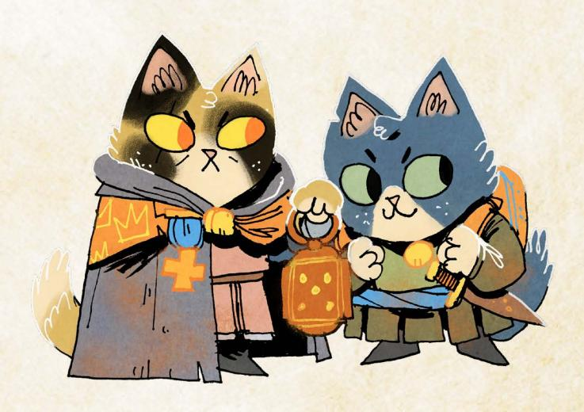

Chapter 7: Clearings of the Woodlands 179

{180}------------------------------------------------

# Ricklebell Falls

# Description

Nestled in the very center of the Woodland, Ricklebell Falls is a lush clearing where cascading waterfalls meet winding rivers. Known for its lively trade and serene beauty, Ricklebell Falls has long been a waypoint for merchants and wanderers, its rivers and falls forming natural trade routes that can transport goods and denizens virtually anywhere in the Woodland in a fraction of the time it takes to walk a single path.

When the Riverfolk Company first arrived in the Woodland, Ricklebell Falls quickly caught their attention. A pair of savvy and ambitious Company leaders, Captain Horntooter and Captain Splashpaw felt it was the perfect site for a permanent trading post, and they promised wealth and stability to those willing to help the Company take control.

Yet the Company's rule—informal as it is—has been less than ideal. After an initial honeymoon period of investment and mutual rule, the Company's greed has now infected every part of their management of the clearing. Tariffs on imported and exported goods have never been higher, and Company contracts are getting more exploitative by the day. Worse still, the Company has been completely unable to protect the clearing from threats like the giant trout that's been attacking boats on their way to and from the clearing!

But deeper trouble is brewing for the Company—Juniper Quickfoot, a resolute and charismatic organizer, has convinced the Woodland Alliance that Ricklebell Falls could be a vital stronghold. The clearing's position at the Woodland's center makes it a crucial link in the Alliance's growing network, and the discontent of its residents offers fertile ground for rebellion. Juniper has already rallied many of the clearing's overlooked laborers and disillusioned denizens, painting a vision of self-rule and equality, and it's just a matter of time before they are ready to revolt.

{181}------------------------------------------------

## At First Sight

A constant mist drifts through Ricklebell Falls, rising from the roaring cascade at the clearing's edge. The web of rivers and streams wind through the clearing and feed into the falls, a jagged cliff from which water tumbles into a basin and then flows out to the rest of Woodland. The air is thick with moisture, carrying scents of fresh water, mossy stone, and faint woodsmoke, and the temperatures are cool even in the middle of summer. Despite the danger of the giant trout, the area around the clearing teems with boats, many flying the flags of the Riverfolk Company.

The clearing itself is a patchwork of wooden platforms and rope bridges suspended above the riverbanks, with more stable housing built up onto the land. Closer to the falls, sturdy wooden buildings and creaking waterwheels use the falls for the local mill, while the docks bustle with trade boats and ferries. At the waterfall's base lies a stone plaza connecting to floating gardens where crops grow in beds of water, and families of denizens tend to them with love and care as the hustle and bustle of capitalism goes on all around them.

# Conflicts

Ricklebell Falls has many issues for the vagabonds to try to solve, but the following four issues rise above the others. *Real Big Fish* is the largest conflict, while the other three loom in the background.

# Core Conflict: Real Big Fish

Ricklebell Falls was founded on the banks of three rivers, an auspicious place to build a port to transport goods throughout the Woodland. The Riverfolk Company now depends on these waters for trade and travel, but so do the denizens of the clearing—the majority of the clearing's denizens still use the rivers for fishing and farming, and it's not uncommon to see foreign unaffiliated merchants plying their wares from distant clearings.

However, a colossal fish—dubbed "the Terror" by locals—has recently been wreaking havoc on boats sailing near the clearing. The creature attacks with ferocity, smashing cargo-laden barges and leaving sailors stranded or injured. It shows no sign of letting up its watery crusade. Tensions are rising as this menace threatens not just Company operations but also the livelihoods of everyone in the clearing.

Chapter 7: Clearings of the Woodlands 181

{182}------------------------------------------------

What few know is that the Woodland Alliance is responsible for the Terror they lured the beast to Ricklebell Falls intentionally, hoping to use the monster to disrupt the Company's control over the region. Firebrand organizer Juniper Quickfoot jumped at the chance to throw a wrench into the Company's plans… but the fish is far more than she can handle. She's still hoping the Terror disrupts Company operations, but no one can deny things have gotten out of paw. She worries that she may need help getting the fish to leave, even if the Company withdraws from the clearing.

The Riverfolk Company, however, is determined to restore order in the face of the fishy menace. Led by Captain Milo Splashpaw, a seasoned otter with a reputation for charming just about anyone, it has begun organizing hunts to eliminate the Terror. Yet some denizens suspect Splashpaw is using the crisis to tighten his grip on the clearing; he's commandeering ships, giving orders, and offering "protection contracts" to frightened locals at exorbitant prices.

#### How It Develops

*If the vagabonds never came to the Falls, Captain Splashpaw's efforts to end the Terror's threat would lead him straight into the jaws of the beast—he would manage to corner the Terror but find out too late that facing the monster and killing it are two different things. The Woodland Alliance would seize the moment to strike, liberating the clearing from the Company while everyone was still reeling from Splashpaw's death. Firmly in control of the clearing, Juniper would begin to make reforms…while putting out word to the rest of the Woodland that she needed help dealing with a fish!*

{183}------------------------------------------------

#### Conflict: Catch-22

No one in the clearing has any doubt: the Woodland Alliance's fiery organizer, Juniper Quickfoot, is the heart of resistance in the Falls. Her speeches against the Company's exploitative policies—high tariffs, forced trade in Riverfolk Script, and monopolized control of the waterways—have electrified the denizens. More importantly, Woodland Alliance rallies and demonstrations are growing in size, with workers and fishers taking to the streets demanding reform.

The Riverfolk Company is desperate to stop Juniper but knows arresting her outright would ignite chaos in the clearing. Juniper is careful to criticize the Company without outright demanding revolution, and she's quite beloved by many of the most important denizens. After all, her family used to own the general store!

Unwilling to let such sedition flourish, Captain Horntooter has decided to offer up a bounty for any vagabonds willing to remove her as a problem permanently or otherwise. Of course, such a bounty has to be kept secret, so it's fallen upon Riverfolk Company agents and clerks to spread the word throughout the Woodland without upsetting the denizens.

Meanwhile, Juniper herself thinks the time has come for a decisive strike—her brother Hythem has told her that Horntooter is keeping two sets of books: one for the local unions to look at as they negotiate rates and another for the Company itself. Hythem is pretty sure that the first set is fraudulent—he saw it up close when he was doing construction work for the Company—and Juniper has been looking around for someone who could help her expose this duplicity to the denizens of the clearing by stealing both set of books.

Without those doctored books, however, Juniper is stuck with the usual Woodland Alliance playbook—keep riling up the denizens until the Company can't take it anymore. While she's getting frustrated with how long the revolution is taking, she knows she's got to keep escalating to get the Company out of the Falls.

#### How It Develops

*If the vagabonds never came to the clearing, frustrations with the Riverfolk Company's policies would lead to a large protest turning violent—local denizens led by a few Woodland Alliance members would set several Riverfolk Company boats on fire! Angered by the "needless" destruction of property, Captain Horntoooter would send Company soldiers to arrest Juniper for the crime. Surprisingly, the denizens of the clearing would do little to protect her! The vast majority of the clearing would be conflicted about the burning of the boats and decide to let the Company sort out what happened. Seeing how little resistance Juniper's arrest sparked, the Company would become even more draconian, imposing a curfew and travel restrictions as Juniper languished in prison awaiting a "fair trial."*

{184}------------------------------------------------

# Conflict: Operation Ivy

While the falls are the most obvious attraction of the clearing, Ricklebell Falls is also well-known for the extensive set of ruins that lie a few miles west in the nearby forest. Rumor has it that the ruins hold an ancient relic, but the journey into the forest is extremely dangerous, and only the most courageous or foolhardy attempts to seek out the ruins intentionally.

Yet despite those dangers, Helmfried—a sworn knight of the Keepers in Iron has arrived in the clearing in search of companions for an expedition into those very ruins. Helmfried insists the mission is a noble one; he believes recovering the relic could protect the Woodland and help restore balance amid the Woodland War.

But not everyone shares his eager excitement for danger. Most denizens are skeptical that they would return from such a journey, and many are suspicious that it's a fool's errand, since no one truly knows if the relic is even there. Either way, Helmfried has had little luck getting anyone to sign up—the only one who has agreed to join him is Isabel Quickfoot, the youngest member of the Quickfoot clan.

While Isabel is an adult, her agreement to join Helmfried on this quest has angered both Juniper and Hythem, her two oldest siblings. They cannot believe that Isabel would put her life on the line for something so esoteric, but both of them have already talked themselves blue in the ears trying to get her to rethink her position. They'd love to find someone to talk sense into her…or physically restrain her from leaving if it gets that far.

Despite the growing tension in the clearing, Helmfried remains resolute, gathering those who are willing to brave the dangers of the forest. But as he prepares to venture deeper into the woods, it's clear he's not truly prepared for what lies ahead.

#### How It Develops

*If the vagabonds never came to the clearing, Helmfried's quest for the relic would spiral into disaster. He would eventually convince a few denizens to join him on his quest, but without sufficient support or experience, the group would become lost in the perilous forest. The first time they encountered a deadly trap or dangerous creatures, Helmfried's companions would meet an untimely end. When Helmfried returned to Ricklebell Falls alone, the clearing would see only his failure and blame him for the deaths of the local denizens. The Quickfoot clan would be especially upset; Juniper and Hythem would attack Helmfried and kill him for losing their younger sibling.*

{185}------------------------------------------------

# Conflict: Pressure Cooker

Long before the Company dominated Ricklebell Falls, the Quickfoot family ran a bustling general store by the river, a gathering place for all and a store that had everything. But a few years ago, after a drought upriver disrupted the local economy, the Quickfoots were forced to sell the store to Captain Horntooter and the newly arrived Riverfolk Company. Horntooter promised to keep the store running for the community, but after just a few months, he shuttered it completely.

Years later, many in Ricklebell Falls still mourn the loss of the Quickfoot general store. Juniper herself remembers working the counter when her father stepped out to make a delivery, her ears barely tall enough for someone to notice she was available to take orders. Now, of course, the Company supplies all the goods to the clearing, and the prices have never been worse.

Eager to see the family store returned, Hythem Quickfoot, Juniper's brother, has struck a precarious deal to reopen the store; the Company named its price, and Hythem agreed to take out a loan from the Company to pay it. There's just one condition for the loan: the store must operate only in Riverfolk Script. This arrangement returns the store to the family, but it also binds Hythem tightly to the Company's expanding Script economy.

When Hythem told Juniper about his plan, she was so horrified that the two of them had an awful row. Now Hythem is contemplating a different strategy what if he had the money outright to buy back the store? He's spent the last few years working for the Company, including doing carpentry work on the main vault in the trading post. If he could find someone who would help him execute a clever heist to rob that very vault—one that would leave him clear of all suspicion—maybe he could buy the family store back on his own terms! But what kind of foolish thief would agree to rob the Riverfolk Company?

#### How It Develops

*If the vagabonds never came to the clearing, Hythem would eventually try to do the heist alone. Unfortunately, he would be caught red-pawed in the act, and the Company would quickly realize the opportunity his relationship to Juniper provided them. Captain Horntooter would propose a brutal deal to the Quickfoot family: Juniper must turn herself in and confess to sedition…or they will hang Hythem for his crimes. Terrified that the Company will kill her brother, Juniper would agree… and Hythem's punishment would be transmuted to jail time instead of execution. Without their leader, the denizens excited about the Woodland Alliance would lose faith in the movement and depart for other clearings, paving the way for the Riverfolk Company to further entrench their position in Ricklebell Falls with both Quickfoot siblings in chains.*

{186}------------------------------------------------

# Important Residents

|     | EXHAUSTION |
|-----|------------|
|     | INJURY     |
|     | WEAR       |
|     | MORALE     |
| D T | 1 1        |

**DRIVE:** To make as much money as possible

#### Moves:

- Intimidate a target with financial ruin
- Bribe a denizen to get his way in that moment
- Run away from a direct conflict

#### **EQUIPMENT:**

- · A big, fancy hat
- · Ledger with fake profits
- Safe key

# Captain Horntooter

Captain Horntooter is a loyal Riverfolk
Company mole through and through. At
least that is what he aggressively professes
to anyone willing to listen. In truth, he's
loyal to the Company as far as it allows him
to make copious amounts of money with
relatively little work. The personal feat
Horntooter is most proud of is two sets
of ledgers for the clearing. One, which he
shows the denizens of the clearing when
he's negotiating with them, says the clearing\nisn't making as much profit as it could. The
second, which he keeps for the Company,
shows the incredible profits he's pulling out
of Ricklebell Falls month after month.

| EXHAUSTION |
|------------|
| INJURY     |
| WEAR       |
| MORALE     |
|         |

**DRIVE:** To kill the giant trout

#### Moves:

- Rally an ally with a courageous speech
- Dodge out of harm's way
- · Parry a deadly blow

#### **EQUIPMENT:**

- A well-made scimitar
- Bottle of fine rum
- Embroidered kerchief from a paramour

# Captain Splashpaw

The dashing Captain Splashpaw joined the Riverfolk Company young—just as his parents did!—and never gave it a second thought...until he was stuck in a mercantile company with little to no excitement. Over the years, he built up his position within the Company to something he could live with year to year, taking the most daring assignments and using his innate charisma to win the day. Now he sees hunting down and killing the giant trout as the crowning achievement to his career, an adventure truly worthy of his bravery and talent.

{187}------------------------------------------------

| □□□ EXHAUSTION |
|----------------|
| □□ INJURY      |
| □□ WEAR        |
| □□□□ MORALE    |
|                |

**DRIVE:** To get the Riverfolk Company out of Ricklebell Falls

#### Moves:

- Hearten the downtrodden with kind words
- Rally allies to keep fighting
- Force a bully to stand down

#### EQUIPMENT:

- Well-made leather jerkin
- Old general store notebook
- Lockpicks

#### Juniper Quickfoot

Juniper Quickfoot grew up in Ricklebell Falls and loves the clearing. When she saw how the Riverfolk Company was exploiting its denizens, she knew she had to do something. Not only has she been organizing the denizens against the Company, but she also lured the giant trout to the falls in hopes of disrupting the Company's trade. Unfortunately, the trout is now a menace to the clearing, and Juniper now regrets what she has done. Her anxiety over the trout truly harming a denizen is eating her up inside, and she needs help to get rid of the fish.

| ☐ EXHAUSTION                                       |  |
|----------------------------------------------------|--|
| ☐ INJURY                                           |  |
| □ WEAR                                             |  |
| □□ MORALE                                          |  |
| <b>DRIVE:</b> To reopen his family's general store |  |
| Moves:                                             |  |

- Calm tempers with a logical solution
- Build something useful
- Appraise the true value of an item

#### **EOUIPMENT:**

- Set of carpentry tools
- Leather belt
- Worn general store shirt

# Tythem Quickfoot

Hythem Quickfoot grew up in Ricklebell Falls alongside his sisters, Juniper and Isabel. Ever since his family's general store closed down, his dream has been to reopen it and recapture some of the happiness of the best years of his life. However, in order to do so, he has to either take a loan from the Riverfolk Company and betray everything his sister has been working for or try to steal from the Company to fund his dreams. Hythem is overwhelmed by all the choices he faces, and he fears the wrong decision could spell disaster for his future.

{188}------------------------------------------------

| EXHAUSTION |
|------------|
| INJURY     |
| WEAR       |
| MORALE     |

**DRIVE:** To leave Ricklebell Falls

#### Moves:

- Lift spirits with a friendly anecdote
- Dive headfirst into danger
- Defuse a situation with humor

#### **EQUIPMENT:**

- A poorly made sword and shield
- Quickfoot clan sigil necklace
- Key to the shuttered general store

#### Isabel Quickfoot

Isabel's dreams have always been much (much) bigger than she is—and bigger than the clearing for that matter. As the youngest member of the Quickfoot clan, she barely remembers her family's general store; she instead dreams of leaving the clearing and exploring the excitement the Woodland has to offer. She's currently swept up in the stories of relics she has heard from Helmfried, a Keepers of Iron knight, and she has agreed to accompany him into the nearby ruins. Isabel sees this as a test run for finally escaping the clearing...if things with Helmfried go well, maybe she can even train to become a knight herself!

| 0000 | EXHAUSTION |
|------|------------|
|      | INJURY     |
|      | WEAR       |
|      | MORALE     |

**Drive:** *To retrieve the relic in the ruins* 

#### Moves:

- Strike out with impressive force
- Calm tempers with historical knowledge
- Smooth conflict with a tale of peace

#### EQUIPMENT:

- Keeper's plate armor
- · Well-made sword and shield

#### Sir Helmfried

Sir Helmfried is a noble knight and a staunch, longtime member of the Keepers in Iron. Where many different factions vie for control of the Woodland, his goal is to bring peace to the Woodland once and for all. To that end. he's spent years of his knighthood searching for relics to unite the disparate factions. Now, in Ricklebell Falls, he believes he's found a path to this very item in nearby ruins! No one believes him, except for one lone rabbit of the Quickfoot clan, Isabel, who is willing to accompany him into the ruins. However, Sir Helmfried is sure that is all he needs: lesser stories have been written on more, and perhaps this new venture will be the greatest story of all!

{189}------------------------------------------------

#### **exhaustion injury wear morale**

Drive*: To protect the interests of the Company*

Harm Dealt*: 2-injury*

#### **Moves:**

- Ambush opposing soldiers or targets of interest
- Pull back from a fight they aren't clearly winning
- Threaten potential enemies into submission

#### **Equipment:**

- Hammers and axes
- Hardened plant armor and chainmail

## Riverfolk Mercenaries

These mercenaries can be called on if either Captain needs support. Most of the time, they are all together, so vagabonds have to deal with the whole group. If needed, you can create specific individual mercenaries: use the GM's NPC creation rules, being sure to always give them at least 2 boxes of wear for their armor, and 1-injury harm for their weapons.

Note: These stats represent a squad of the mercenaries, the most common size of group the PCs are likely to encounter in any given situation.

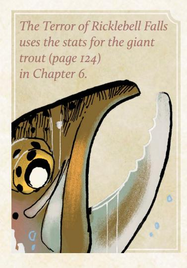

# The Terror of Ricklebell Falls

Lured to the clearing by Juniper Quickfoot, the giant trout that has come to occupy the waters near Ricklebell Falls is the meanest fish in the Woodland, often rising from the deep waters to smash boats and consume cargo with gusto. While Juniper originally lured the fish here with bait, the trout is fully fed and happy to stay put where it is—now that it has settled into its new home, Juniper will need to find some other way to get rid of it.

{190}------------------------------------------------

# Important Locations

#### Riverfolk Headquarters

Rising awkwardly above the riverfront, the Riverfolk Company's headquarters is a gaudy structure of polished driftwood and colorful banners. It clashes, as if almost on purpose, with the quaint, tidy homes of the Falls. Locals call it "the Eyesore." Behind a large and imposing door in Captain Horntooter's office is a heavy iron safe. Inside the safe is the true financial ledger—proof of double dealings, crooked contracts, and the Company's tightening grip on Ricklebell Falls—as well as a vast supply of coins and other valuables.

# The Old General Store

The old general store now lies shuttered in the center of the clearing, a stark reminder of the Riverfolk Company's iron grip. The clearing's youth see it differently. Under cover of night, young denizens sneak inside to tell stories, sing songs, and make merry. Led by Isabel Quickfoot, who stole the last key, they've even welcomed Sir Helmfried (sworn to secrecy) to regale them with tales of daring and distant lands.

# Falls Hideout

Tucked behind the falls is a hidden Woodland Alliance hideout. Accessible only via a slick and mossy ledge, the cavern hums with whispered plans and flickering lanternlight. Crates of handwritten pamphlets and a makeshift table fill the space where Juniper Quickfoot and her allies organize their efforts to push the Riverfolk Company out of the clearing. Safe from Riverfolk eyes and guarded by the deafening roar of the falls, this hideout serves as a command center for the resistance.

# Spawning Pool

Near the outskirts of Ricklebell Falls, the giant trout has begun pushing a large amount of sediment and boulders to one bank, creating the perfect location to lay eggs. Aside from natural materials, it's also brought the hulls of fishing boats and just about anything else pilfered from its destructive exploits. If the trout is able to spawn in the nest it has built, it will likely call a mate to fertilize those eggs, bringing yet another terrifying monster to the waters of Ricklebell Falls.

{191}------------------------------------------------

# Special Rules

#### Penny for a Song

When you try to "sing for your supper," by providing an entertaining performance to a local denizen in Ricklebell Falls, roll with Charm. On a hit, they offer you and your companions a place to sleep and modest food as thanks, enough to get through a single night; clear 2-exhaustion each. On a 10+, your performance inspires them; they share a story of their own that points toward some hidden adventure or opportunity in the clearing. On a miss, your attempts to move them only remind them that you're not from the Falls; you mark 2-notoriety with the denizens, and everyone present in your band marks 1-notoriety with them as well.

# Introducing the Clearing

Assuming the vagabonds are coming by water, they encounter numerous warning boards on the edges of the rivers feeding into the clearing ushering them to get off their boats, IMMEDIATELY. After the vagabonds disembark and enter the clearing proper by foot, mention the quaint homes built into the sides of giant trees and the picturesque cobblestone pathways that lead deeper into the clearing. Emphasize the good infrastructure for all manner of trade and the history woven into the age of some of the structures.

Depending on what your group might find most fun, they encounter one of the following NPCs:

- · **Captain Horntooter** spots the vagabonds as they enter and immediately halts their journey through the clearing. He greets them formally, but his tone lightens if any in the group are allies of the Riverfolk Company. First, he ensures there are no Woodland Alliance members among them, and if not, he asks them to "remove" Juniper Quickfoot from the clearing—he will pay handsomely to see her sedition come to an end. If he figures out the group includes Woodland Alliance allies, he makes a quick note in his notebook and sends the vagabonds to ask Captain Splashpaw about a fish.
- · **Juniper Quickfoot** approaches the vagabonds deeper in the clearing, hoping they were sent as backup from the Woodland Alliance. When she finds out they aren't, she explains what the Riverfolk Company has done to the clearing and tries to get them on the side of the "little guy." She has it on good record that Horntooter has two sets of ledgers, and they're the proof

{192}------------------------------------------------

- she needs of his corruption. She asks the vagabonds to look into getting the ledgers…and maybe even help her with a fish before it hurts someone.
- · **Sir Helmfried** bumps into the vagabonds on the edge of the clearing and offers them a spot at his camp. He regales them by firelight with tales of his past exploits and visions of a better Woodland. Once the vagabonds have enjoyed the knight's company long enough and make signs of leaving, he offers them a chance to join his exploration of the ruins and become part of one of his tales.

The action could go a few ways from here. As things continue, make an escalation—a move designed to intensify the situation and draw the PCs in further. Escalations can provide new opportunities, create new dangers, or close down outlets for escape. If things get too quiet or slow, or if the vagabonds aren't sure what to do, make an escalation. Here are some examples:

- · The giant trout attacks a merchant vessel laden with goods. If the vagabonds don't help, the goods sink to the bottom of the falls, and the merchants are eaten by the giant trout.
- · A midnight party in the old general store gets out of hand, and Captain Horntooter uses it as an excuse to arrest Juniper Quickfoot and throw her in jail; he doesn't have a plan yet, but holding her puts the rest of the Woodland Alliance on high alert!
- · Juniper Quickfoot organizes a protest against the Riverfolk Company, and Captain Horntooter sends his mercenaries down to "keep the peace." A protester ends up provoking one of the mercenaries; the protest turns into an all-out brawl, and many protesters end up injured.
- · The Woodland Alliance sends several hardened soldiers to the clearing to launch a genuine revolt. They use bombs and other weapons of war against the Riverfolk Company, openly sparking a conflict for which the denizens are not prepared.

Don't be afraid to make the giant trout a real and present danger and then relate it back to the Woodland conflicts in the clearing. For example, a trading boat arrives at the docks, its hull torn. The crew says the Terror attacked them upriver, much closer than it's ever been. The Riverfolk Company tightens its hold in response: they commandeer two local ferries "for public safety" and offer new protection contracts—at double the rate.

{193}------------------------------------------------

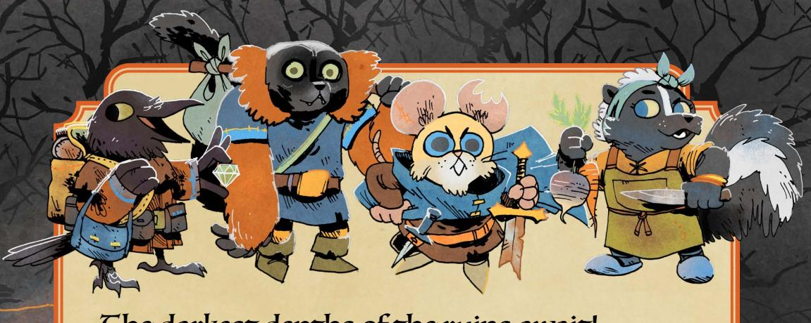

#### The darkest depths of the ruins await!

The ruins of the Woodland are places of danger, darkness, and treasure—the perfect place for a band of vagabonds to make a fortune undertaking quests no other denizen dare undertake. As the Hundreds terrorize the Woodlands and the Keepers in Iron search for relics, what might the vagabonds uncover in the places once forgotten? And who—if anyone—will pay them a fair price for what they find?

Ruins & Expeditions is a supplement for Root: The Roleplaying Game—the officially-licensed tabletop RPG based on the award-winning Root: A Game of Woodland Might and Right board game by Leder Games—that expands the game to include the first four expansion factions!

Here's what you'll find inside this book:

- · New rules for exploring the ruins of the Woodland, alongside expanded rules for the monsters, relics, and dangers found inside such lost places.
- · Six new playbooks, expanding the types of vagabonds you can play to include monster hunters, traveling nomads, entrepreneurs, and more.
- Two new expansion factions—The Hundreds and The Keepers in Iron—each with mechanics for including them in the expanded faction turn.
- · Dozens of additional moves and tags, including weapons skills, roguish feats, natures, drives, connections, equipment tags, and pre-made gear.
- · Three new clearings—*Longbarrow Crag*, *Pricklegrass Marsh*, and *Ricklebell Falls*—that focus on adventures involving ruins, relics, and monsters.

**Root: The RPG** is a fantasy adventure tabletop roleplaying game for three to six players of woodland creatures fighting for money, justice, and freedom from powers far greater than them. The Woodland calls!

Players Time 3-6 2-4 hrs

Rating Everyone

Root\* and Leder Games\* logo and key art TM & © 2017 Leder Games. All Rights Reserved. © 2025 Magpie Games. 1135 Broadway Blvd #26463, Albuquerque, NM 87101 UK REP: Complizon Ltd, 128 City Road, London ECIV 2NX. +443300010562, uk@complizon.com. EU REP: Complizon OÜ Sepapaja tn 6, Tallinn, 15551, Estonia. +3727123712, eu@complizon.com