{0}------------------------------------------------

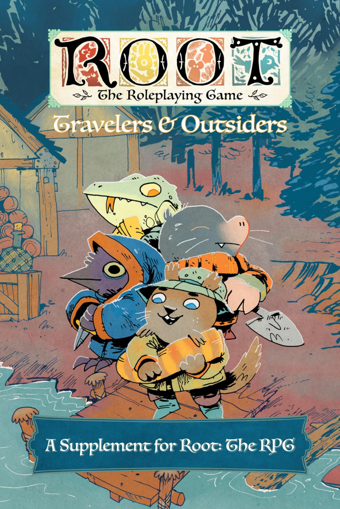

{1}------------------------------------------------

# Travelers & Outsiders

Design: Brendan Conway, Sarah Doom, Marissa Kelly, Simon Moody, Sarah "Sam" Saltiel, Mark Diaz Truman

Writing: Brendan Conway, Danielle Lauzon, Simon Moody, Mark Diaz Truman, Camdon Wright

Developmental Editing: Brendan Conway & Mark Diaz Truman

Copy Editing: Monte Lin & Kate Unrau

Layout: Miguel Ángel Espinoza

Art: Kyle Ferrin

Art Direction: Marissa Kelly

Proofreading: Katherine Fackrell

Root Board Game Design: Cole Wehrle

Root Board Game Graphic Design & Layout: Cole Wehrle, Kyle Ferrin, Nick Brachmann, and Jaime Willems

Root Board Game Concept: Patrick Leder

Root: The Roleplaying Game text and design @ 2019-2021 Magpie Games. All rights reserved. Root: A Game of Woodland Right and Might @ 2017 Leder Games. All rights reserved. Leder Games logo and Root art TM & @ 2017-2020. All rights reserved.

Special thanks to Meguey and Vincent Baker for creating Apocalypse World, the Leder Games team for allowing us to play in their brilliant world, and the more than 6,000 Kickstarter backers who made Root: The RPG possible. We are humbled by your collective encouragement and support.

Printed by LongPack Games. First printing 2021.

{2}------------------------------------------------

### Table of Contents

| The Woodland Expanded5                       | The War Advances 177         |
|----------------------------------------------|---------------------------------|
| The Riverfolk Company9                       | Woodland Setup178               |
| The Lizard Cult12                            | Faction Roll 182             |
| The Grand Duchy 16                        | The Faction Phase184            |
| The Corvid Conspiracy19                      | The Marquisate 186           |
| New Moves & Skills 23                     | The Eyrie Dynasties190          |
| New Weapon Skills24                          | The Woodland Alliance 193    |
| New Reputation Moves 31                   | The Lizard Cult197              |
| New Roguish Feats42                          | The Riverfolk Company201        |
| New Drives45                                 | The Grand Duchy  206      |
|                                              | The Corvid Conspiracy210        |
| New Natures50                                | The Denizens213                 |
| New Connections 54                        | Using the Board Game  215 |
| Masteries & More57                           | Clearings of                    |
| Species Moves58                              |                                 |
| Species Moves as Playbook Moves. 60       | the Woodland217                 |
| Species Abilities System  64           | Making Your Own Clearing219     |
| Masteries 69                              | Heartwood  221            |
| Custom Moves77                               | Description 221              |
| New Equipment 79                          | Conflicts222                    |
| New Tags81                                   | Important Residents228          |
| New Pre-Made Equipment85                     | Important Locations234          |
|                                              | Special Rules 235            |
| New Playbooks 91                          | Introducing the Clearing236     |
| The Champion93                               |                                 |
| The Chronicler97                             | Sundew Bend238                  |
| The Exile 101                             | Description238                  |
| The Envoy105                                 | Conflict239                     |
| The Heretic 109                           | Important Residents245          |
| The Pirate 113                            | Important Locations252          |
| The Prince 117                            | Special Rules254                |
| The Raconteur121                             | Introducing the Clearing 255 |
| The Raider 125                            |                                 |
| The Seeker129                                |                                 |
| Tailoring                                    |                                 |
|                                              |                                 |
| Campaign Play133 The First Session 134 |                                 |
| During the Campaign  141               |                                 |
|                                              |                                 |
| Ending the Campaign 145                   |                                 |
| Beneath the Surface (Playbooks)150           |                                 |

Wilds at the Edge [.............................160](#page-160-0)

{3}------------------------------------------------

### Welcome, fair traveler!

Travelers & Outsiders is the first supplement for Root: The RPG, a pen-andpaper tabletop roleplaying game based on Root: A Woodland Game of Might and Right, a board game designed by Cole Wehrle and featuring art from Kyle Ferrin. In Root: The RPG, you and your friends take on the role of vagabonds, rogues of the Woodland who act as something between knaves and heroes as they travel from clearing to clearing taking on jobs to make ends meet.

In these pages, you'll discover a whole new world of adventure—new mechanics, new character types, new systems for the Gamemaster (GM), and more! Each chapter of Travelers & Outsiders builds upon the existing rules of Root: The RPG, adding in expansion factions like the Lizard Cult and the Corvid Conspiracy, and offering new options for players and GMs alike.

Of course, you do need to know how to play Root: The RPG to make use of this book! All of the material here is supplementary—you need a copy of the Root: The RPG core book to get all the rules for playing the core game.

{4}------------------------------------------------

#### Here's what you can find in Gravelers & Outsiders:

- The Woodland Expanded (Chapter 1) adds the four expansion factions—the Riverfolk Company, the Lizard Cult, the Grand Duchy, and the Corvid Conspiracy—to Root: The RPG, including descriptions of each faction as both a background faction and an intervening, conquering faction in the War.
- New Moves & Skills (Chapter 2) expands your game by introducing new weapon skills, reputation moves, roguish feats, drives, natures, and connections. All of these mechanics are easy to introduce to your game, building on existing systems to give your players new options!
- Masteries & More (Chapter 3) goes beyond creating new instances of existing systems to offer brand new rules for introducing species mechanics—including two different systems for making species matter—as well as advice for writing custom moves and masteries, specializations that allow PCs to get triumphant results on a 12+.
- New Equipment (Chapter 4) offers dozens of new tags alongside new pre-made weapons, armor, and other gear. All of these tags (and equipment) are easy to integrate into an existing campaign, allowing players to have lots of options for making their new equipment great!
- New Playbooks (Chapter 5) adds ten new playbooks to Root: Gbe RPG, including the Champion, the Pirate, the Raconteur, and more! Each of the playbooks comes with a full set of mechanics alongside instructions for how best to play the playbook and notes on each playbook's moves.
- Tailoring Campaign Play (Chapter 6) expands on the GM advice in the Root: Ghe RPG core book to talk about running a long-term campaign, including advice for the first session of a campaign, tips for managing the PCs' ongoing adventures, and ideas for how to bring a campaign to a close. In addition, this chapter also includes GM advice for all nineteen playbooks, a system for introducing large-scale random events like new factions entering the War, generational play, and rules for leaving the Woodland entirely!
- The War Advances (Chapter 7) replaces the simple faction roll in the Root: Gbe RPG core book with a robust system—the faction turn—for managing conflict between the factions directly when time passes. This chapter contains new rules for all eight factions, including the newly introduced expansion factions, as well as instructions for using the board game, Root: A WOODLAND GAME OF MIGHT AND RIGHT, as part of your campaign.
- Clearings of the Woodland (Chapter 8) features two new clearings focused on the new expansion factions—*Heartwood* and *Sundew Bend*—alongside a guide to creating your own clearings for your campaign.

Finally, you can find these playbooks and other **Root**: The RPG materials for print at <a href="https://www.magpiegames.com/root">www.magpiegames.com/root</a>. Enjoy your time in the Woodland!

{5}------------------------------------------------

The Woodland Expanded

{6}------------------------------------------------

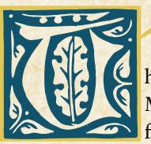

he Woodland is populated by various factions, from the Marquisate to the Woodland Alliance, but these are not the only factions that exist in the world. Other factions exist in and around

the Woodland, but due to internal Woodland politics and external factors, never rose to prominence. This chapter presents four new factions you can use in your games of **Root**: **Ghe** RPG and gives guidelines for including them in an existing game, or creating a new game with them.

The Riverfolk Company are entrepreneurs seeking a profit. They buy, trade, and sell literally anything and everything the Woodland could need. The Lizard Cult is a religious sect, proselytizing to the denizens of the Woodland and offering succor to the most downtrodden and poor in the area. The Grand Duchy seeks to overtake the Woodland, incorporating the denizens into its highly political Duchy. The Corvid Conspiracy weaves itself secretly into every clearing of the Woodland, attempting to subtly gain power over all of them.

Each of these mighty factions normally exists in or around the Woodland, but as unimportant actors or background elements easy to dismiss in the light of a burgeoning war. For any of these factions to become a major player, several aspects of history and the current state of the Woodland would need to change to accommodate them. This doesn't entail just removing one faction and inserting another, though it might be that simple in some cases. Any of these groups could move into a power vacuum left by another major player, maybe even two.

When deciding how to use these four new factions in your Root: Gbe RPG campaign, you should consider which ones you want to add, and which ones you are removing. Making these adjustments requires some finagling of the Woodland's story to allow the factions to change. You can either rewrite the history of the Woodland to explain how one faction never rose while another did, or you can advance the current story of the Woodland, having a faction or two fall while another rises.

Also consider which roles each of the factions fulfill and how they interact. A game filled with nothing but highly political factions in the Marquisate, the Eyrie Dynasties, the Woodland Alliance, and the Grand Duchy all vying for dominance transforms your Woodland into a high-conflict, byzantine web of political maneuvering. Similarly, having no political powers involved—by removing those actors and only having the Lizard Cult, Riverfolk Company, and Corvid Conspiracy acting in the setting—could lead to oblique, nonphysical conflicts between factions competing over cultures, economics, beliefs, or ideologies.

{7}------------------------------------------------

#### Changing the History

Which factions you remove or add are entirely up to you, but it is worth considering how the Woodland got to where it is. If either of the Eyrie Dynasties or the Marquisate had never come to power in the Woodland, this would have the largest impact on the state of the Woodland. Would the Woodland Alliance still have as much motivation to form if two seemingly tyrannical powers had not been vying for control of the Woodland? Would the Grand Duchy see the Woodland as an easy prize and attempt to take it over instead of the Marquisate?

Imagine if the Eyrie Dynasties had never gathered enough steam to regroup and attempt to retake the Woodland. Instead of the denizens choosing to side with a known element against the Marquisate, they might have instead chosen to join the Lizard Cult as a way to bolster themselves against the perceived ravages of the Marquisate. If the Corvid Conspiracy was involved, it might have hamstrung the Eyrie Dynasties from the inside and might now be using them as a proxy for their insidious actions. The Woodland Alliance might find themselves attempting to fight back against two different invading forces of the Grand Duchy and the Marquisate, who are both embroiling the denizens in their proxy wars.

Imagine if the Marquisate had never invaded the Woodland. Maybe they were driven back by a Woodland bolstered by the Corvid Conspiracy. When the Eyrie finally returned to try to retake power, they might have found the clearings infested with the Lizard Cult, who violently opposed them, rather than the Marquisate. The Grand Duchy might take the place of the Marquisate completely, seeing the weakened Woodland as easy pickings after the Great Civil War. When the Woodland Alliance rose up to resist the Eyrie retaking the Woodland, they might have discovered their new Riverfolk Company allies were selling to the enemy.

Imagine if the Woodland Alliance had never formed to resist the Marquisate and the Eyrie Dynasties. Maybe the denizens turned to the Grand Duchy, taken in by their seemingly orderly system and polite manners. The Lizard Cult offers the denizens an alternative to the factions at war and presents a source of freedom through religion. The Corvid Conspiracy could be using disenfranchised denizens to fight a shadow war against the Marquisate and Eyrie Dynasties. The Riverfolk Company may stick to the streams and rivers, but their influence may bring hope and jobs to a population seeking release from the oppression of the Marquisate or the Eyrie.

{8}------------------------------------------------

### Moving Forward

If your game is already underway, or if you aren't comfortable with changing the Woodland's history, you can also advance the Woodland's story to make room for new factions. Imagine what would happen if the Eyrie Dynasties finally buckled under the weight of their own stubborn traditions. Or if the combined efforts of the Eyrie Dynasties and the Woodland Alliance drove the Marquisate back. These factions would not be gone completely, but their influence would diminish to allow someone else to fill a void.

If the Woodland Alliance is subdued or destroyed, the denizens leading them might go into hiding. The dredges of the Alliance might still be around, but they hold no sway or influence. Their members might join forces with another faction in search of a new fight. They might also be open to outside influence, their hardship and trauma giving someone the ability to take advantage of them.

The Marquisate might finally win their war against the Eyrie Dynasties, or the Dynasties themselves might break under the weight of their ridiculous edicts and rules. Individual fiefdoms might still exist in the clearings, but the Dynasties would be no more. Such a collapse might leave room for someone else to step in to push against the Marquisate. It might also just leave the denizens of the Woodland full of anxiety about an unchecked invading force.

The Marquisate is overextended, and many factors could cause them to leave the Woodland. Major losses to the Woodland Alliance or Eyrie Dynasties might force them to retreat or regroup, or they may face challenges at home that require them to withdraw their troops. While the Marquise may still watch the Woodland from a distance, she cannot afford to leave more than a few isolated troops in the area. Such a power vacuum would beg to be filled, allowing for any number of factions to step into the Marquisate's place.

In these scenarios, one of the factions falls, and another faction may rise in its place. The various new factions can step into voids that make sense for them. The Riverfolk Company might move in to capitalize on instability, to make war on the other Woodland factions, or even to make money while helping clearings rebuild after the end of strife. The Lizard Cult is looking for more followers, picking from the downtrodden specifically. It will move into places where denizens are being oppressed and offer them protection. The Grand Duchy will move to fill a political void or will enjoy political intrigue with other political factions. The Corvid Conspiracy thrives in chaos and will flock to places where uprisings have been unsuccessful, where a power vacuum needs filling, or where folks are getting too complacent.

{9}------------------------------------------------

### The Riverfolk Company

Across the Woodland, denizens can watch riverboats laden with goods float along the waterways. These boats, captained by denizens of all species and crewed by merchants and mercenaries, make up the Riverfolk Company. Their merchants set up shops in clearings along rivers and streams, selling literally anything a denizen could want as long as they can afford the price. The Riverfolk accept barter and trade for goods and services, but some Company representatives are pushing for the use of River Scrip, a note indicating they owe a good or service to the holder, as a general currency within the Woodland.

### The Riverfolk Company in the Background

The Riverfolk Company has been around for as long as anyone can remember. As the name suggests, the Riverfolk are primarily based around rivers, but they also use the roads to get their goods and services to Woodland clearings. They recruit new members, merchants and mercenaries, in the areas they service to extend their reach and profit margins. The Riverfolk Company is not generally powerful enough to control a clearing or even dominate its economy (though exceptions do exist), but over time a clearing might become dependent on the Company's goods and services, especially if that clearing is under the sway of a trading post.

For most of their history, the Riverfolk haven't paid any more attention to the Woodland than their other areas of operation. They might have a representative in a single clearing along a river, or one who travels up and down the river, hitting a new clearing every few months before starting their return trip to wherever they came from. The Riverfolk Company merchants seem to be always on the move, seeking out a new angle for a deal, or proselytizing about River Scrip to those who do business with them. When the Eyrie Dynasties ruled the Woodland, a river trader might come through a clearing once a year to sell their wares before moving downriver to the next clearing. Without the Eyrie's byzantine traditions to navigate, the Riverfolk Company traders seem to arrive more frequently and stay just a little longer.

A Company merchant's wares change between clearings as they take goods used for trade in one clearing to sell in another for profit. No matter what they actually carry, Company merchants pride themselves in having what the denizens want, and they will happily take special orders or offer to find just the right thing to satisfy a customer. The Company merchants are often trained in a variety of skills, including combat, allowing them to offer their services for trade if their goods don't strike a customer's fancy.

If a denizen can't afford the price of a necessary good, they can work for the Company to pay off a debt. If a denizen is willing to accept River Scrip in

{10}------------------------------------------------

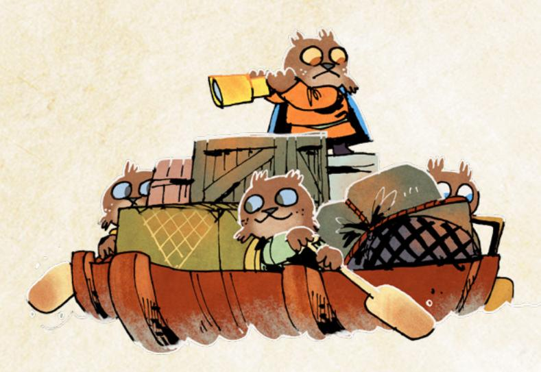

return for a good, the Company will give them a better price than through normal trade. River Scrip is simply a note of promise, backed by the Riverfolk Company's considerable force and reputation, that states that any Company merchant will accept it in return for goods and services. All Company merchants honor River Scrip and push for its use as a way to cut down on loss of stock to sell when making trades. Few clearings are widely using River Scrip at the moment, but the idea is catching on, especially when the Company accepts it at a premium over other trade goods.

The Riverfolk Company has a policy to buy low and sell high, and haggling with a Company merchant is not for the faint of heart. They are not easily won over, and they know the value of a good, even if they are underpricing it for their own ends. There's absolutely no overselling to a Company merchant. The Riverfolk Company has a reputation for always delivering what it promises... which means denizens continue to deal with them despite their almost predatory practices.

### The Riverfolk Company in the Woodland War

The Riverfolk Company are more than happy to take advantage of the Woodland War. As clearings gear up for conflict, the Riverfolk are there to provide weapons and supplies. As other clearings recover from devastating attacks, the Riverfolk are there to provide building supplies and food. As factions lose soldiers and look to replenish their ranks, the Riverfolk Company mercenaries are happy to accept goods for their swords. These aren't charitable dealings, of course; a clearing must pay for the Riverfolk Company's services as always. But some skippers in the Riverfolk Company are not completely without empathy and often offer small discounts to clearings in need.

{11}------------------------------------------------

The Riverfolk are in the Woodland to make a profit, but more than that, they wish to drive the Woodland economy of supply and demand. Where they see an opportunity, they take it, and they seek to control all the major supply chains of goods throughout the area. Even as Company agents and skippers are seemingly always willing to make a deal, they take great care in determining what they sell and particularly what they buy. If it seems supply is too high within the Woodland, they will buy up the surplus and ship it outside the Woodland to sell at three times the price. Then when the denizens need that good, it is artificially scarce, and the Riverfolk Company are there to sell it back at a higher price.

The Riverfolk have built trading posts in several key clearings throughout the Woodland. These trading posts serve as bases of operations for all Company agents and outposts for mercenaries to stage through. The Company use their trading posts to keep a constant eye on the Woodland economy, and they influence it quickly. Merchants keep in contact with each other and strike deals to set prices, sell passage on river boats, contract out services, or presell wares before a boat comes through the clearing. With mercenaries always on tap at the trading posts, the Riverfolk create a central location for anyone looking for goods and services to go. If anyone attempts to make an aggressive move against the Company, they simply mobilize their mercenaries as a functional militia to drive off the aggressors. They may not have enough mercenaries to compete in consistent direct conflict with other major factions, but they certainly have enough to pose a threat when attacked.

Clearings with trading posts find trading with the Riverfolk Company fast, convenient, and often cheaper than other local merchants. The Riverfolk Company end up dominating the market in a clearing with a trading post, driving their competition out of business. Clearings with Company trading posts boom economically but become completely dependent on them.

### The Company

In the Riverfolk Company, a merchant co-op, every individual merchant is a free agent who owns a share of the Company. Most merchants are referred to as "skippers" or "captains"—traditionally they have boats or rafts of some kind—but the term applies even to overland Company merchants. Each captain tithes a percentage of their profits to the organization, money the Riverfolk use to build permanent structures and fund River Scrip production, and that they keep in case the Company needs to take action as a whole rather than individual units. "Buy low, sell high" is the only real rule for a Company merchant. Each skipper sets their own prices, but those working in close proximity to one another discuss and set prices so that they can each ensure they all maximize their profits.

{12}------------------------------------------------

### The Lizard Cult

Nestled in their gardens, denizens who are part of the Lizard Cult give worship to the Great Dragon. Viewed as strange fanatics, they cultivate beautiful groves within clearings as part of their worship, and they are insistent on spreading the word of their religion to any who will listen. Within the Woodland, what the Cult believes is less important than what it does. It takes in the outcasts, downtrodden, and disenfranchised, and it gives them succor and a purpose. The Cult ministers to the sick and indigent, and it provides places of healing and sanctuary within their gardens. It converts denizens to the Cult's way of life, attempting a gentle approach at first. But if a clearing is resistant, the Lizard Cult doesn't mind using a little force to show them the way.

### The Lizard Cult in the Background

The teachings of the Lizard Cult only started making their way into the Woodland within the past decade or so. A small contingent of Cultists arrived in the Woodland from their desert home, proselytizing their beliefs. They traveled from clearing to clearing, speaking to any who would listen and finding converts among the outcasts of Woodland society. Prior to the Woodland War, the Lizard Cult found little success establishing a firm foothold in the Woodland due to its outsider status. Some denizens viewed the Cult with a wary stance, especially with the Marquisate's invasion forces serving as a stark reminder of the troubles foreigners may bring. That didn't stop the acolytes from trying, and they successfully established small groups in outlying clearings and in those with little Eyrie Dynasties presence—a foothold for their conversion, but a tenuous one.

Spread by traveling acolytes, the Cult's teachings bring hope to the downtrodden and provide a purpose to outcasts. The Cult speaks of the light of the Great Dragon (or the Wyrm, or any of several other names), whom Cult members devote all their worship to. The Great Dragon teaches that the Cult should provide for those who cannot provide for themselves, as the Great Dragon will provide for those who are loyal. The Cult thus offers real aid to those in need, and its ministrations bring a peace of mind to many denizens. As such, the Cult's reputation as a group is relatively positive among those who truly encounter its members—among those who remain aloof and know the Lizard Cult only through stories, it is often seen as a creeping threat, an insidious heresy that inculcates a belief in monstrous things.

When a denizen sees a Lizard Cult member in a clearing, it is often a missionary traveling to spread the word. It's rare to find a clearing with a garden. The vast Lizard Cult orthodox religion hasn't sent many new missionaries into the Woodland, beyond the initial wave of pilgrims, and its teachings haven't

{13}------------------------------------------------

caught on with the Woodland as a whole. Those it has converted take up the pilgrimage, attempting to spread the word to other clearings.

The Lizard Cult's presence in a clearing is anything but subtle. Traveling acolytes proselytize and actively try to convert denizens while providing succor even if they make few inroads. If the acolyte happens to convert a denizen, then the two stay longer trying to convert even more. They try to establish themselves as a spiritual authority, and quickly the denizens' own traditions get swept into Lizard Cult religious practices.

### The Lizard Cult in the Woodland War

With the advent of the full Woodland War, the Lizard Cult is sending more missionaries to the Woodland than ever, and it makes no bones as to its purpose there. The Cult seeks to convert as many denizens to its beliefs as it can. Acolytes refer to it as "bringing them into the garden," and they hope to make all the Woodland a grand garden for the Great Dragon. The Cult's methodology amid the War is straightforward. Acolytes establish a foothold in a clearing with a small group and convert the outcasts of society. As the Cult grows in power, it builds permanent settlements it calls gardens. Gardens are grand shrines to the Great Dragon—they serve as places of worship, homes for members, and shelters for those seeking aid.

On the surface, Lizard Cult worship is a blend of practical rules and rituals that look a lot like traditions. Acolytes preach about the Great Dragon, but most denizens have no real connection to it. Basic members, called seekers, rarely see much more than standard feast days, festivals, prayer services, and charity work.

{14}------------------------------------------------

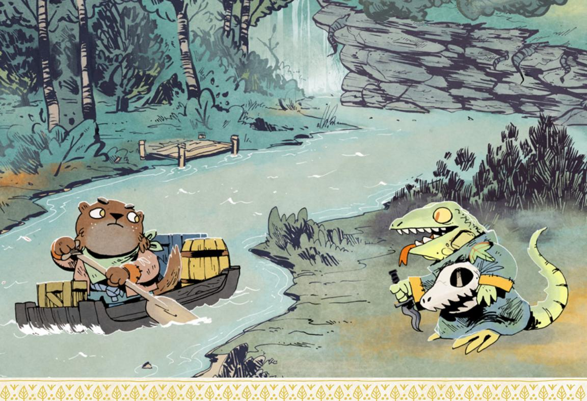

To become an acolyte, to reach the true inner circle of worship, the Lizard Cult member must perform a sacrifice. Those who are sacrificed are always willing, and to be chosen as a sacrifice to the Great Dragon is a grand honor that comes with several days of ceremony, feasts, and celebration. Yet, at the end of the day, someone dies to elevate another acolyte to the robes.

The Lizard Cult is fanatical about its beliefs, but not immutable. Many of the acolytes are Woodland converts themselves, and they blend their older traditions with Lizard Cult beliefs as a way to make it more palatable to their friends and families. Once the Lizard Cult has more than a few converts in a clearing, they establish a garden. With these gardens comes a more aggressive mindset. Rather than the soft indoctrination of the lowest and poorest clearing members, the Cult exerts pressure on all denizens to convert. Seekers are welcomed into the garden proper, and sometimes those who forcefully rebuke the teachings of the Cult find its members ready and willing to respond with violence.

The Lizard Cult doesn't have an army, but neither does it have directives against violence. Its members, seekers and acolytes alike, pressure others to join, and this sometimes leads to violent clashes. The firmer the grip the Cult has on a clearing, the more dangerous its membership can be to nonbelievers. This is especially true against birds—in Lizard Cult orthodoxy, the Great Dragon has deemed birds as unworthy of fiery salvation and therefore denizens to be reviled.

{15}------------------------------------------------

### Doctrines

The Lizard Cult has a firm hierarchy. At the top of each clearing's sect is a single acolyte—the Voice of the Dragon—who presides over a garden. Officially, all Woodland acolytes are subordinate to an acolyte council back in the Cult's desert home—the Heart of the Dragon, the council is called—but in practice, this goes unenforced, and the local Voices make all their own decisions and doctrines.

At the very bottom of the hierarchy are seekers (formally known as Seekers of the Dragon), the general membership who have not yet gone through their sacrifice ritual to become acolytes. Above them are acolytes, and above them is the supreme acolyte for the garden, the Voice of the Dragon. Acolytes have specific duties to the Cult, and their duties set them apart from one another in castes. The Tongues of the Dragon are missionaries and pilgrims, ordained to spread the Great Dragon's word. The Claws of the Dragon are the Cult's soldiers, specifically charged with protecting the Cult and, sometimes, with rooting out heretics. The Eyes of the Dragon seek out information about the Dragon and spy for the Cult.

Acolytes are chosen for these roles based on skill, but sometimes on seniority and favoritism. Uncasted acolytes (sometimes called "Drakes") often work hard to prove themselves to a caste they hope to join. Seekers normally have only one route to progress through the hierarchy: perform a sacrifice, sending the sacrificed individual to an eternity joined with the Dragon's beneficence. Some Voices are rumored to make local exceptions from time to time, allowing sacrifices of food or valuables for ascension to the rank of acolyte, even though those sacrifices are technically disallowed by orthodoxy.

Individual gardens within the Woodland tend to express different variations on the word of the Great Dragon due to cultural differences. This leads to some clashes over doctrine, ideology, and heterodoxy. This isn't to say that the Lizard Cult is prone to infighting or instability. But it does mean that the message gets muddied between one clearing and another. Giving mixed messages to denizens seems to suit their purpose well though, as no one on the outside can point to one particular belief or practice as particularly bad when there are so many options to choose from.

{16}------------------------------------------------

### The Grand Duchy

Traveling via expansive tunnel networks, the moles of the Grand Duchy—also known to the denizens as the Great Underground Duchy—spend most of their time beneath the earth. They work tirelessly to construct tunnels from their neighboring realm into the Woodland in hopes of one day overtaking the resource-rich forest. The Duchy's ultimate goal is to subjugate the denizens after invading and conquering all the clearings. If it weren't so mired in political intrigue, it might even be unstoppable. Instead, the Grand Duchy moves slowly, needing approvals from the appropriate ministers before it can take even the smallest actions. In the meantime, the Duchy builds up propaganda to convince the Woodland denizens how wonderful being a Duchy citizen is, anticipating that the denizens won't realize how few of its promises it can truly deliver on.

### The Grand Duchy in the Background

The Grand Duchy arose from a group of disparate mole domains, all tired of what they perceived as oppression by surface-dwelling denizens. As the Duchy formed, it created a series of ministerial roles to oversee different aspects of its newly formed government. The Duchy hoped it would promote unity as well as ensuring no one mole was in charge of all the others.

As the Duchy grew into its own, the ministers felt they knew best and refused to act unless action served their interests. What was supposed to be a system of checks and balances turned into a race to garner favors and support in order to get anything done. This codified into the Grand Duchy a highly political atmosphere, where actions take a great deal of haggling and planning to coalesce. The Duchy's motivations never wavered, though. It will never again bend to surface-creature whims, and its preference would be for the Duchy to just rule everyone.

The Duchy has set its sights on the Woodland and has been building tunnels in the outlying area for years in preparation for a future invasion. Political intrigue being what it is, the Duchy is poised, but has never yet been ready to strike. Several key tunnels remain unbuilt—awaiting ministerial approval—and supply requisitions languish in wait. What tunnels have been built are currently used for information gathering and Duchy propaganda sharing, but not much else.

Most denizens rarely see a Duchy citizen, but they are around. Those denizens who travel the less trodden paths, or who have illicit dealings, find them at the head of small smuggling operations, using their tunnels to smuggle goods and people between clearings. These underground citizens share Grand Duchy propaganda, barter for information on Eyrie Dynasties- or Marquisatecontrolled clearings, and generally try to pave the way for the Duchy when the time is finally right to strike.

{17}------------------------------------------------

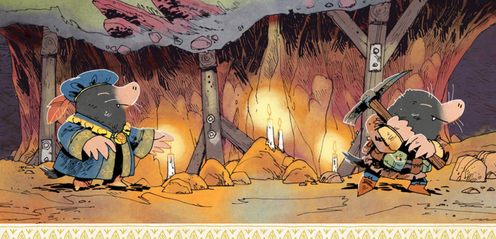

### The Grand Duchy in the Woodland War

Grand Duchy invasions are insidious things. At first, denizens won't find them marching down trails or smashing doors, launching sieges or large battles. Instead the Duchy either uses propaganda to win over the hearts and minds of a clearing or simply declares a clearing its sovereign domain and strikes with sudden, overwhelming force. It has an army which moves through the Duchy's tunnels, shows up in a clearing overnight, and quickly subdues and subverts local defenses.

Clearings nearest to the Grand Duchy's homeland have already seen this happen. The Duchy's forces undermine the current government, promising its leaders prominent roles within the Duchy in return for their loyalty. Sometimes the takeovers aren't so peaceful, but the Duchy always promises the best for those who pledge their loyalty quickly.

Grand Duchy messaging is insidious. It promises a stable government, a place for all denizens, and a chance for anyone to become a leader. In truth, the Duchy seeks absolute domination over the Woodland and subjugation of its denizens. Sure, a denizen might get promoted to city leader in a provisional government for a few months, but then a lord from the Duchy will come in and take over their duties. The denizen now has a new title, and role, but these are mostly meaningless pleasantries used to dupe the populace.

The Duchy moves in stops and spurts. An initiative awaiting approval may languish for weeks, but when it is finally approved, the citizens get busy enacting the plan. Its invasion force is particularly efficient at moving into a clearing, setting up a provisional government, and spreading Duchy propaganda. It comes in with dozens of wondrous promises to win over new citizens, though delivery of those promises usually falls flat as politicking between ministers can grind the Duchy's plans to a halt.

{18}------------------------------------------------

### Parliament

The Grand Duchy is led by a parliament filled with individual leaders who head different departments. The parliament has nine major roles, six of which are replicated in miniature within clearing governance. The other three are oversight positions in the parliament: the Duchess of Mud, Baron of Dirt, and Earl of Stone. Not every single Grand Duchy clearing has every one of the six replicated positions, of course—bureaucracies take time to solidify.

The Foremole is in charge of building new buildings, such as citadels and markets, for the Duchy. Foremoles tend to be matter-of-fact individuals who seek building supplies, laborers, and resources over political clout or future actions.

Captains are the Duchy's elite fighters; Marshals lead the soldiers and troops for the Duchy. Both often ask for payment, political favors, better appointments, and sometimes hard-to-find goods. Brigadiers control the Marshals and Captains, and getting Captains and Marshals to act may be as simple as convincing the Brigadier to mobilize them. This does cost the Brigadier, though, as any minister has the right to ask for negotiation before acting—meaning those attempting to get a Brigadier to act may need to both pay the Brigadier and compensate them for the payments they will have to make to Captains and Marshals.

Bankers make money for the Duchy. They deal in trade, smuggling, production, and any other money-making endeavor, so long as they profit from the outcome.

Mayors oversee a clearing and all the ministers who act within their geographical area. They can act to make a particularly stubborn minister take action—in particular by engaging the process to remove a local minister from their position but may seek more esoteric rewards for pulling such strong political clout.

The Duchess of Mud oversees all of the Duchy's territory and tunnels, and the Duchess chooses when and where to expand. Those seeking to invade a new clearing need the Duchess of Mud on board to build the tunnels and oversee the work. Such an action takes a lot of resources, and the Duchess will want compensation, along with the prestige of their name attached to the endeavor.

The Baron of Dirt oversees all the markets and the economy for the Duchy. When someone wants to build a new market, or branch into a new way to make money, they need the Baron of Dirt's permission. The Baron of Dirt wants wealth for the Duchy and will often approve a project only when they are thoroughly convinced that it will turn a profit by the next year.

The Earl of Stone is in charge of strongholds, the military, and conflict. To go to war, the Duchy must have the permission of the Earl of Stone. The Earl is cautious about where and when to send Duchy troops and requires not only the normal bribes and political sway but also detailed plans of troop movement and resources before agreeing to an action.

18 Root: The Roleplaying Game

{19}------------------------------------------------

### The Corvid Conspiracy

Whispers and hushed voices speak of a group of frightening taloned figures meeting in shadowed places to pursue dark ends. The Corvid Conspiracy is a criminal organization bent on changing the Woodland from the shadows. The Corvids remember what rule was like under the Eyrie Dynasties and have no intention of letting it happen again. They work in secret, plotting and scheming to infiltrate clearings and gain control. Those in power are aware the Conspiracy exists but paint it as nothing more than a group of delinquents. While it is true that the Corvids resort to criminal means to raise funds and enact plots, what they truly seek is to control the Woodland, by hook or by crook, and ensure their families are never treated poorly again.

### The Corvid Conspiracy in the Background

The Corvid Conspiracy started when the Eyrie Dynasties ruled the Woodland. A group of crows and ravens migrated to the Woodland, tired of domains like Le Monde de Cat and eager to live under righteous bird rule. Instead of being welcomed, the Eyrie exploited these immigrant birds, and their rigid edicts and traditions neglected to protect the Corvids from those in the Woodland who saw them as easy and vulnerable targets.

These immigrants eventually banded together to protect their own and others exploited by the Eyrie, offering shelter, protection, and whatever aid they could. They built networks of mutual support, bringing food and goods to those in need, and looking for ways to work together to make life better.

To fund such endeavors, they turned to crime. They stole from the Eyrie, smuggled needed goods into clearings to bypass outrageous taxes, peddled illegal items, and beat up any Eyrie guards who got too close to their chosen communities. Why obey laws laid down by illegitimate rulers?

As time went on, the Conspiracy grew from those roots. If the Conspiracy could just control the Woodland, then they wouldn't need to keep being criminals. If they could get rid of the Eyrie Dynasties, they could ensure no one slipped through the cracks. If only they could act without anyone catching wind and stopping them before it was too late. Until that end, they would bide their time as criminals, amassing the means to finally enact their plans.

When the Great Civil War fractured the Eyrie Dynasties, the more ideological denizens among the Corvids believed their mission was a moot point. After all, the reason they came together in the first place was to protect their own from the excesses and cruelties of the Eyrie.

{20}------------------------------------------------

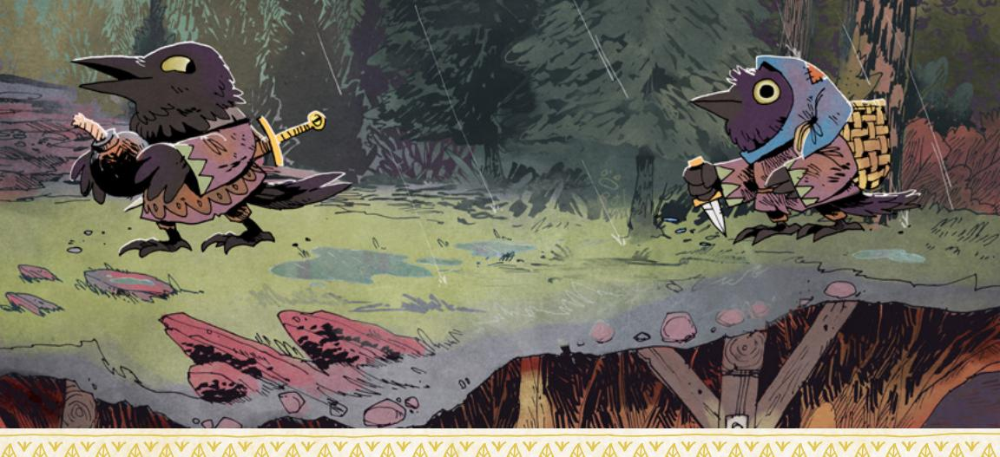

Yet those of the Conspiracy who had grown more accustomed to the power and resources of their criminal network were more reluctant to relinquish what they had built. They began to work independently from each other, with their own small underground fiefdoms, turning clearings toward their own ends and seeking criminal arrangements that continued to consolidate power.

What was once a widespread Conspiracy soon dwindled to a handful of agents and smaller criminal groups, loosely connected, spread among a few clearings. Many individual agents may still think of themselves as serving the cause, but the overall force is no longer what it once was.

Strife in the Woodland has kept the Corvids active, though they are far from capable of exerting influence without greatly increasing their membership. The Corvid Conspiracy is a secretive group, but not so secretive that no one knows it exists. Recruitment requires exposure, and local leaders are wary of letting the Conspiracy get too organized within their purview due to their criminal activities.

Instead, the Corvids often stick to the criminal underbellies of clearings, dealing in all forms of illegal activity, like smuggling, manufacturing drugs, thievery, extortion, and arson. Due to their low numbers, they hire out for many activities, paying well and protecting anyone who works for them. Outside those few clearings where they have a presence, most denizens never see a conspirator or their effects.

The Eyrie Dynasties, of course, still whisper and worry about the Corvid Conspiracy, a dangerous foe that formed right under their watchful eyes and beaks. Many crows within the Eyrie are viewed suspiciously—even if they have no history of conspiracy or sedition—and many Eyrie leaders make special efforts to shield their plans and schemes from the watchful eyes of other birds.

{21}------------------------------------------------

### The Corvid Conspiracy in the Woodland War

While the Corvid Conspiracy is a criminal organization, it has never forgotten its history and initial directive. The threat of new tyrannies in the Woodland War pushes the Conspiracy back together, to act and spread influence, and to strive for control of the Woodland again. Criminal activities remain a particular strength of the Conspiracy, but now acts of vandalism, political upset, and violent change dominate its endeavors. While their ultimate goals and plans are a secret, the Corvids move to act in the open, creating chaos as they go.

Ultimately, the Corvid Conspiracy wants complete control over the Woodland. It does not have an army poised to strike or an elite force ready to move into position. Instead, it has a whisper network throughout the many clearings of the Woodland. The Conspiracy has been recruiting and seeding operatives and agents throughout the area for years, and even after a lull with the fall of the Eyrie Dynasties in the Civil War, the Corvids can activate those agents in fast and furious fashion.

What's more, the Corvid Conspiracy has a plot for every clearing, a plan for every political situation in which the Corvids find themselves. In one clearing, they may need to violently overthrow the ruling Eyrie leader and replace her with one more in line with their desires. In another, they have already positioned one of their members as a high-level official. In yet another, they are slowly strangling the economy to push out the local Marquisate guards. They always have a plan in motion, even if it's not always obvious where it's going.

But the Corvid Conspiracy's members are still true to their roots. They want to bring stability and peace to the Woodland and create a place that is safe for all its denizens, not just the ones in high places. And yet...their chosen method for enacting such change comes with violence.

The Corvids' criminal activity is sometimes the sole desire of more selfish members, but more often it is a cover for deeper plots. Conspiracy members extort money from their political opponents using blackmail, threats, and deception. They sabotage their enemies' transportation and travel routes, setting snares across trails and stealing goods for their own use.

And when those things don't work, they will plant bombs in residences and places of governance in an attempt to kill their political rivals. If they think someone has caught on to them, they drop a trail of false leads that catches some poor patsy in the crossfire. All the while, they move their operatives under everyone's noses towards other ends.

{22}------------------------------------------------

#### Murmurings

The Corvid Conspiracy is not a huge organization, but they have a large impact. A clearing may only have a handful of agents running an entire Conspiracy operation, conspirators using go-betweens and lower-level agents to organize many of their plots. Just a few leaders can hire out muscle, control the local bandits, and build a network of denizens who often have no clue they are even working for the Corvid Conspiracy! When many operatives are working in the same clearing at any one time, a few might run the standard criminal activity and engineer the plots, while others infiltrate the ruling body, seizing upon their numbers to expand their reach.

Each clearing has a head conspirator, and together the conspirators of all the clearings make up the Council of Crows. Each member of the Council of Crows has worked their way up from the streets to a leadership position. Current Council members can sponsor new ones to lead the Conspiracy's operations in a clearing, but generally speaking, a denizen becomes a Council member through their own successes. Despite its reliance on blackmail, favors, and scheming, the Conspiracy is a bit of a meritocracy, and those who prove to be effective rise to positions of authority over their clearings.

The Council of Crows meets regularly to determine the direction of the Conspiracy's plots in each clearing. Ultimately, each Council member has final say in what happens in their clearing, but they like to discuss. This leads sometimes to bickering about the right way to proceed, as a small but vocal faction of the group wishes to take a more active role in the political atmosphere of the Woodland, rather than acting from the shadows. Instead of bribing or threatening officials to get what they want, why not just become the official? The other members mostly feel this is too risky a maneuver. If they are fully out in the open, then their enemies know exactly where to strike.

In general, of course, the other factions of the Woodland are aware that the Corvid Conspiracy exists and work to stamp them out. Individual denizens may think they're a myth, but those with power, and those with something to lose from Conspiracy operations, know that they are real and pursue the Corvids' demise.

Agents keep a level of anonymity in their actions by conscripting hapless denizens to do their grunt work for them. Need someone to set a bomb in a Marquisate lumber yard? Promise to bring medicine to a young beaver's ailing aunt and he will happily drop the package off with no questions asked. Need someone to mislead an Eyrie guard? Offer room and board to an orphaned mouse and she will gladly play her part. The agents do the more intricate work—procuring materials, making bombs and traps, or infiltrating and spying on enemies—but they have no compunction about gaining outside aid.

{23}------------------------------------------------

{24}------------------------------------------------

n the core book of Root: **Ghe** RPG, there are ten different special weapon skills, six different Reputation moves, nine different roguish feats, and more. Altogether, it's plenty of

options to play a full campaign and to develop PCs in many different ways. But having still more specific options for development allows you to tailor your campaign to exactly your needs!

In this chapter, there are:

- New weapon skills, all of which exist to supplement those in the core book and which follow the same overarching rules.
- New Reputation moves, some of which give you more options in general, and some of which give you faction-specific moves.
- New roguish feats, all of which supplement the feats in the core book and which follow the same overarching rules.
- New drives, any of which can be swapped in with the drives on a PC's playbook using the session move (page 130 of the core book).
- New natures, any of which can be swapped in with the natures on a PC's playbook using the end of session move (page 130 of the core book).
- New connections, any of which can be swapped in with the connections on a PC's playbook using the end of session move (page 130 of the core book).

### **New Weapon Skills**

These weapon skills in general follow the same rules as weapon skills in the **Root**: **Ghe RPG** core book (page 89). In order to use one of these skills, you must have learned the skill, usually by advancing; you must have a weapon tagged with the skill; and you must be able to trigger the move as appropriate within the fiction.

If a move includes the "no tag required" label, you do not need a weapon with the tag in order to use the weapon skill. Moves like *hurl* or *hammerpaws* don't require a weapon tag because they either don't rely on the weapon or can be used with any weapon.

いると、このことには一会一つ、このことに一会して、この

{25}------------------------------------------------

#### Battle Fury **special**

When you *fling yourself into a fury of weapon, tooth, and claw in an allout attack at intimate range*, mark wear on your weapon and roll with Luck. On a hit, fill your exhaustion track. For each box you mark, inflict 2-injury on your target. On a 7-9, your target also inflicts their harm upon you. **This move does not require the weapon to be tagged with intimate range; weapons with close range may also be used**.

You roar and fling yourself at a foe, not grappling them so much as lashing out wildly as you bear them to the ground. You're engaging in *battle fury*!

*Battle fury* is for mad, nigh-wild strikes made at intimate range. It requires training, less to cover expert movements and skilled action, more to teach the sheer ferocity necessary to be effective, to keep your opponent off-balance and to ignore their return strikes.

The cost of *battle fury* is that it will always fill your exhaustion track—but the advantage is that you might be able to take out a single dangerous foe all at once! Keep in mind they inflict harm on you on a 7-9, so you might be in grave danger...and if they have friends, you're not going to be in a good position to keep fighting them.

#### Charge **special**

When you *charge at an opponent at far range*, mark exhaustion and roll with Might. On a hit, they must choose to either mark 2-exhaustion or allow you to push them—you say where they are driven, and you say what range you now stand at. On a 10+, inflict morale harm on them as well.

You see the archer nocking another arrow, so you put your head down and barrel towards them, weapon first, with all your might and all your speed. You're *charging*!

*Charging* is for closing distance quickly, and for driving your foe into a position you might find more advantageous. Your opponent can resist your charge by marking 2-exhaustion—that means they're keeping their distance, trying to flee and maintain the same range. But If they don't mark 2-exhaustion, then you get to say exactly what range you are at from them, and you get to say exactly to what location they have been driven.

{26}------------------------------------------------

#### Durl special no tag required

When you *hurl a weapon or dangerous object not intended for throwing at an enemy at far range*, mark exhaustion and roll with Might. On a hit, your hurled weapon strikes your target; mark wear on the weapon and inflict 1-injury and 1-exhaustion on your target. On a 7-9, choose 1. On a 10+, choose 2.

- mark an additional wear on the hurled item to inflict an additional
   1-injury
- the hurled item rebounds to somewhere reachable, instead of out of sight or out of reach
- your target is knocked off their feet by the throw

You heft your warhammer over your head and with a mighty shout, send it spinning end over end, straight at an opponent. You're *hurling* your weapon!

*Hurling* a weapon allows you to attack at far range with weapons that are not designed for that purpose. If you are throwing a weapon meant to be thrown, you're *targeting someone* instead. This is for throwing a boulder...or your battleaxe.

If you don't choose "the hurled item rebounds to somewhere reachable," then it lands somewhere else (the GM will tell you where).

#### Lunge SPECIAL

When you *make an outright lunge at a foe within close range*, choose an amount of injury between 1-injury and 3-injury and roll with Finesse. On a hit, you inflict that amount of injury—ignoring armor—but if your target survives (or if other foes are present) they can take advantage of your over-extension to inflict the same amount on you. On a 7-9, they can inflict 1-injury more upon you than you had originally chosen to inflict upon them.

You and your foe are circling each other when, suddenly, you leap forward, rapier extended, point aimed straight at their midsection! You're *lunging*!

A *lunge* is a bit like a single all-out attack. It has more finesse and grace than a *battle fury*, but it is putting you significantly at risk in an attempt to score a winning blow all at once, one that your opposition can't mark wear to absorb.

Make sure to pick the amount of injury you wish to deal before rolling. You're committed to that amount—so if you roll a 7-9, they get to deal I-injury more unless you successfully take them out first!

{27}------------------------------------------------

#### Paired Fighting SPECIAL

When you and another vagabond *pair fight back to back against foes at close range*, you each mark exhaustion and one of you rolls with the following modifiers (max +3):

- +I if you have a connection with each other
- +1 if you are outnumbered
- +1 for every 2 additional exhaustion you mark between the two of you

On a hit, you together inflict 1-injury on every foe within close range (or 3-injury total against a group), and you each suffer 1-injury. On a 7-9, choose 1. On a 10+, choose 2.

- you each suffer little (-1) harm
- you inflict an additional 2-injury to any single target (including a single group) of your choice
- you inflict 2-morale harm
- you create a path for the two of you to retreat or advance

You and your friend heft your swords and stand back to back as the Eyrie soldiers surround you. They charge, but the two of you know exactly how to fight in coordinated fashion, sweeping around each other, rolling over each other's backs, and pulling off all manner of joint maneuvers. You're performing *paired fighting!* 

**Paired fighting** does require both vagabonds to have this skill, and both vagabonds to have a weapon with the **paired fighting** weapon skill tag. Otherwise, you can't use the move.

The benefit, however, is a powerful move that allows the two of you to together take on whole troops of foes with relatively little harm, acting as effectively or more so than either one of you could independently.

{28}------------------------------------------------

#### Dammerpaws SPECIAL NO TAG REQUIRED

When you *come to blows with an armed opponent at close or intimate range while you are unarmed*, roll with Finesse. On a hit, they inflict their harm on you. On a 7-9, choose 2. On a 10+, choose 3.

- you inflict 2-exhaustion on your opponent
- you shift your range one step
- you deflect some of their incoming blows; suffer little (-1) harm
- you inflict wear on their equipment with precise strikes
- you take an object from them; they must mark exhaustion to stop you

You put up your paws as the hammer-wielding vagabond swings at you. With all the force you can muster, you send punches hurtling at their weapon arms. You're using *hammerpaws*!

**Hammerpaws** is for unarmed combat, where you're landing heavy, powerful strikes at exactly the right place. Usually if you're unarmed, you're likely to be at a massive disadvantage compared to an armed foe—not least because their weapon likely has greater reach than yours. **Hammerpaws** lets you have a chance at fighting armed foes even when your paws are empty!

*Hammerpaws* is less effective at straight-forwardly inflicting injury on a foe than, say, *engaging in melee*. But it can help you inflict exhaustion, wear, or even steal something from your foe!

Rarely, you might choose to "inflict wear on their equipment with precise strikes" and have it matter exactly which piece of equipment you inflict wear on. If you're fighting most NPCs, all their equipment is abstracted to a single wear track, so it wouldn't matter. You might want to narrate striking at a particular piece of gear, but all of the wear goes on the same track!

But if you're fighting, say, another PC, or if you're tracking wear on a single vitally important piece of equipment, then you get to choose exactly which piece of equipment suffers the wear. Remember that any piece of gear that has no wear remaining is destroyed if you target it by choosing this option.

{29}------------------------------------------------

#### Pinpoint Shot SPECIAL

When you *take the time to fire a shot at far range with pinpoint accura*cy, roll with Cunning. On a hit, you put the shot exactly where you choose:

- if you target an NPC's weak point, inflict 3-injury (unblockable by armor)
- if you target a piece of equipment's weak point, inflict 2-wear
- if you target something in the environment, you strike it, cut it, or break it as appropriate

On a 7-9, your current vantage point isn't quite right; you need to move to a better one before you can make the perfect shot. Mark exhaustion to scramble there, and then choose as normal.

You hold the bowstring tight, breathing shallowly until it's the perfect moment to send the arrow exactly where you need it to go. You're firing a *pinpoint shot*!

**Pinpoint shot** is for "sniper" shots—a hard shot to take in the middle of a big fight—the kind that can pierce weak points in armor. It can still be used to target specific environmental elements, but it differs from **trick shot** in that it's more effective at actually dealing harm to opponents, and less effective at accomplishing a full range of different effects and striking multiple targets.

On a 7-9, you don't have to take any special action to take up your second vantage point—you just mark exhaustion, then you make your choice as normal.

#### Long Shot Special

When you *pull hard on your bow's draw to extend its range beyond far*, mark wear and exhaustion to roll any far range weapon move (*target someone*, *pinpoint shot*, etc.) with Might instead of the move's normal stat, paying the additional cost(s) of the weapon move as well. This weapon skill requires your weapon to be tagged with far range, this skill, and the tag for whatever weapon move you are using (if needed).

You pull back an arrow, stretching your bow to its limit, and aim it into the sky so the shot will arc and travel at massive distances. You're firing a *long shot*!

The advantage of this move is that it allows you to fire shots at distances that normally would be impossible. If your foes are beyond far range, you would normally be unable to act against them. But with *long shot*, you can make normal moves at excessive ranges—albeit at a cost. There isn't a tag for "farther than far," so you only need the far range tag to use this move!

29

{30}------------------------------------------------

#### Point-Blank Shot SPECIAL

When you fire a shot at point-blank range (intimate range), mark any combination of up to 2-wear and up to 2-exhaustion, and roll with Luck. On a hit, you put your shot into your target; inflict injury equivalent to the wear and exhaustion you marked, combined. On a 10+, you can also skip back after your shot, moving to close range before your opponent can grab you or otherwise retaliate. Your weapon does not need to be tagged with intimate range to use this weapon skill.

You duck under the sword-swing, drawing an arrow as you do, and release it straight into the armored plate of your enemy. You're firing a point-blank shot!

Firing a point-blank shot can cost you significant exhaustion or wear, but at the benefit of inflicting a lot of injury, fast, as all of that force goes straight into your target. Dancing back to close range after you fire on a 10+ will keep you safe from immediate reprisals; otherwise, your opponent (if they're still standing) can grab you at intimate range.

#### Switch hands Special

When you shift your grip to change your dominant hand in the middle of an extended bout with a foe, roll with Finesse. On a 7-9, choose 1. On a 10+, choose 2:

- your new dominant hand is fresher; clear 2-exhaustion
- your opponent is startled by the shift; they mark morale harm
- your shift gives you an immediate opportunity; mark exhaustion to seize it and inflict 2-injury

You smirk at the enemy duelist as you switch your rapier from your left paw to your right paw. You're switching hands!

Switching hands requires well-balanced and designed weapons and grips hence requiring the weapon to be tagged appropriately. You can't confidently switch with just any old weapon, and you may only use this move once during any given extended bout with a foe. Once you've changed hands once, it doesn't help to switch hands again!

**Switching** lets you get a quick refresh or put your enemy at a disadvantage—it won't win you the fight on its own, but it can give you a chance to recover!

{31}------------------------------------------------

### **New Reputation Moves**

These moves supplement the Reputation moves included in the **Root: Ghe** RPG core book on page III. They still all have a Reputation requirement, meaning that you cannot use these moves at all unless your Reputation with the appropriate faction is at the correct level.

Some of these new moves are universal—you can use them with any faction, as long as your Reputation is at the right level—and some are specific to a given faction.

#### Endorse a New Leader

**REQUIRES REPUTATION +1** 

When you *openly endorse an individual as the new leader of a faction's forces and/or presence in a clearing*, roll with Reputation with that faction. On a hit, you throw your support behind that individual and the faction's representatives in that clearing react. On a 7-9, the GM chooses 2. On a 10+, the GM chooses 1.

- the faction's current leadership in the clearing is directly opposed; you need to handle them before your endorsed candidate can take over
- the denizens of the clearing aren't on board; you need to speak to denizen leadership and convince them, or expect direct opposition
- the faction's enemies in the clearing want to take advantage of the shift in power; keep an eye out for conspiracies and plots

On a miss, after you publicly announce your support something new and dangerous is revealed about the leadership or the individual you endorsed that reframes the situation.

You speak to the crowd of assembled denizens, telling them that it's time for new leadership of Scarlett's Hollow, and you think that Cesspyr Thistle is exactly the right rabbit for the job. You're *endorsing a new leader*!

**Endorse a new leader** is a move for helping to swap local leadership without requiring you to resort to violence or covert action to achieve your end. The results of the move all require you to take further action to ensure the leader of your choice comes to power. That action isn't guaranteed to be easy or simple, but it gives you a chance and a path to ensure that your chosen leader rises.

Endorse a new leader does require you to have someone in mind—if you simply want to remove the old leader, you're looking to vilify a leader instead.

{32}------------------------------------------------

### Vilify a Leader

**REQUIRES REPUTATION +1** 

When you *openly vilify an existing leader of a faction's forces and/or presence in a clearing*, roll with Reputation with that faction. On a hit, you've stirred up dissent—the leader's departure from power is set in motion. They will be removed from power when next time passes... unless they take other action (alliances, use of force, etc.) to quash the dissent. In the meantime, on a 7-9, the GM chooses 2. On a 10+, the GM chooses 1.

- your words are taken up and elaborated upon; resistance to the leader you targeted threatens to get out of control, involving violence or arson
- the leader (or their defenders and supporters) grows more radical in their defensiveness; they will respond to any threats to their position with force
- you are singled out for your blunt outspokenness; expect reprisals

On a miss, your words wind up stoking opposition—more denizens, agents, and faction members come out in support of the leader you tried to vilify.

You give a speech to the collected denizens exclaiming how Mayor Hopplefur is driven only by greed, with no interest in the welfare of the denizens of their clearing. You're *vilifying a leader*!

*Vilify a leader* is the flip side of *endorse a new leader*. It preys more upon feelings of dissent and dissatisfaction, meaning that the results of this move are more volatile. But you can use it to set the wheels of change in motion... although those wheels rarely take the cart where you expect.

If nothing dramatic or untoward happens, then on a hit on this move, the old leader would be deposed the next time that time passes. The response of the denizens and the current leadership, however, can derail that plan, as each one takes actions that change the issues at stake and redirect attention and energy.

{33}------------------------------------------------

#### Lead Groops in Battle

#### **REQUIRES REPUTATION +3**

When you *lead troops of a faction in battle*, roll with Reputation with that faction. On a hit, they accept you as their commander for the fight. On a 7-9, hold 2. On a 10+, hold 3. Spend your hold 1-for-1 during the fight to commit them to:

- take and hold a location
- rout a substantial enemy presence
- take an enemy leader captive
- destroy a fortification or resource
- defend a group or location

On a miss, your troops engage in battle but with a confused command structure—they wind up embroiled in chaotic battle across the entire area, and in their confusion, they're losing.

You stand at the head of the Woodland Alliance troops, arrayed in their green cloaks behind you. You lift up your sword, pointing its tip right at the Marquisate's general, and shout—"CHARGE!" You're *leading troops in battle!* 

**Leading troops in battle** is for directly leading them in the midst of the conflict—not for planning in advance. You might trigger the move in advance of the battle as you rally the troops, and then spend your hold during the battle, but you must actively *lead the troops during battle* to spend the hold—no leading from the rear!

When you spend a hold, the troops around you take on that goal and accomplish it to the best of their ability. Only if the situation changes substantially can they be derailed from their task.

To *lead the troops*, there of course have to be troops. This move won't generate soldiers out of nothing; use other Reputation moves to requisition some faction soldiers if you can!

{34}------------------------------------------------

#### Running Large Battles

Moves like *lead troops in battle* and *intimidate enemy troops* can help you add nuance and description to larger-scale battles, but remember you only need to "run" large battles where the vagabonds are present. If they're not around, then you can resolve the battle entirely off-screen, according to your agendas and principles.

When the vagabonds are around, they're still the center of the action. Focus on them and their specific fights against particular troops and enemy soldiers. In particular, the more enemy commanders or named enemy characters who can get into the fight with the vagabonds, the better—your game becomes a lot less dramatic, fast, if the vagabonds are just fighting squad after squad of faceless enemy soldiers.

It can help, before diving into a large-scale battle with the vagabonds around, to jot down who you think the ultimate likely winner is (all things being equal). Play to that end—the only way that side is going to lose is if some massive, surprising things happen. And massive, surprising things are a vagabond specialty!

#### Intimidate Enemy Groops

**REQUIRES REPUTATION -2** 

When you *draw attention to yourself and threaten enemy troops by wielding your Reputation through an intimidating display*, roll with Reputation with the enemy's faction, treating it as positive (+2 or +3) for this roll. On a hit, you put fear into the enemy. On a 7-9, pick I. On a 10+, pick 2.

- the enemy troops won't act until their leader makes a rallying speech or cry to them—the leader is exposed and vulnerable to attack
- the enemy troops will target you, above all else, when they attack
- the enemy troops are rattled; inflict 2-morale harm on the group

On a miss, the enemy is invigorated by their anger at you, and they act right now, in full force.

You stand before the massed enemy Eyrie troops, and you lift up your axe, the terrible weapon known as Featherclipper. You shout how each and every one of them will face your wrath and feel the edge of your infamous weapon. You're *intimidating enemy troops*!

*Intimidating enemy troops* does require you to have a low Reputation, but it also requires you to put on an appropriately intimidating display to wield your own Reputation. If you're known as a dangerous, terrifying destroyer, then shouting, waving your sword around, and being generally physically threatening can work

34 Root: The Roleplaying Game

{35}------------------------------------------------

just fine. If you're known to be a cheater, trickster, and liar, then the display probably has to play into tricks you might have lured them into, traps you might have planned, and your own cocksure smile.

If the enemy troops won't act until rallied, it means you have a chance to single out their leader, targeting them independently of their troops. It can also be used to buy you time when you need it! If the enemy troops target you, above all else, it means you'll face the terrible brunt of their force...but others won't.

#### Plan New Project MARQUISATE

**REQUIRES MARQUISATE REPUTATION +2** 

When you *convince Marquisate officers to begin a new significant project*, roll with Reputation with the Marquisate. On a hit, they begin the project. On a 7-9, the GM chooses 3. On a 10+, the GM chooses 2.

- it will take time; check back in after time passes
- it requires special resources; the Marquisate agents will tell you what they need
- it requires elimination of a threat first; the Marquisate agents will point you at the threat
- it can't be quite what you asked for—just something close enough; the Marquisate agents will tell you what form it takes

On a miss, the Marquisate cannot undertake your project right now because the Marquisate's resources—and you—are required elsewhere; the GM will tell you why, and where.

You meet with the local Marquisate governor and tell her to get working on a new bridge to cross the river and connect this clearing to Blackpaw's Dam. You're *planning a new project*!

This faction-specific Reputation move is geared to take advantage of the Marquisate's particular skillset in developing infrastructure and industry. It doesn't have to—you can convince the Marquisate to begin a project like "take over Blackpaw's Dam"—but it can just as easily be such things as "research a cure to the purple plague."

Whatever conditions the GM gives you on the project, once they are all fulfilled, the project moves forward. If you deliver the special resources, eliminate the threat, accept the limited form, or allow enough time to pass as needed, your project will move forward.

If the GM is using the full faction specific rules on page 184 of this book, they can track the new project as they would other Marquisate projects.

35

{36}------------------------------------------------

### Wield Bureaucracy EYRIE

**REQUIRES EYRIE REPUTATION +2** 

When you wield the bureaucracy of the Eyrie Dynasties to achieve your ends while time passes, roll with Reputation with the Eyrie. On 7-9, choose 1. On a 10+, choose 2.

- vou gather information from your contacts; ask the GM any three questions about the Woodland, and they will answer truthfully from the Eyrie's perspective
- you push the Eyrie to allocate resources just a bit differently; they will deliver some available resource to a clearing of your choice, as long as it makes any sense to do so
- you add a stipulation to an upcoming Eyrie attack or action; the soldiers will follow it.
- you arrange a meeting or audience with any Eyrie individual at a place of your choosing; the GM will tell you when the meeting takes place
- you get Eyrie courts to add or repeal a legal requirement within any one Eyrie-controlled clearing; the Eyrie theoretically must follow it

On a miss, the Eyrie's bureaucracy plays back, and you find yourself charged with a duty you hadn't planned on from Eyrie authorities; fulfill it before time passes next, or mark 3-notoriety.

You sit at a desk, sifting through ledgers and documents, sending out letters... and by the end of your toil, the local clearing's draconian laws are repealed! You're wielding bureaucracy!

Wielding bureaucracy takes time, which means it's only triggered while time passes. You can always say that you're spending time interacting with Eyrie contacts and issuing requests or letters over that period of time. Of course, if you're on the road the whole time, or in hiding, then it's going to be hard to wield bureaucracy.

What's important to note about this move is that it isn't direct control. Instead, you are manipulating the byzantine structure of the Eyrie Dynasties to produce your desired outcomes.

"Adding a stipulation to an attack or action" means that you can add a condition or a rule those troops must follow, like "No structures will be harmed or destroyed during the attack" or "Security at the event will be minimal."

"Adding a legal requirement" means the Eyrie functionally adopts a new rule in the clearing of your choice; although, as always, just because there is a law, that doesn't mean the local denizens follow it to the letter...

{37}------------------------------------------------

#### Incite Revolt WOODLAND ALLIANCE

#### **REQUIRES WOODLAND ALLIANCE REPUTATION +2**

When you *incite local Woodland Alliance sympathizers and agents to revolt*, roll with Reputation with the Woodland Alliance. On a hit, the revolt is imminent—you have to prepare! It will take place when next time passes. On 7-9, the GM chooses 2. On a 10+, the GM chooses 1.

- you need to convince at least one local sympathizer to get important resources or support for the revolt; otherwise, it will fail
- you need to weaken, destroy, or incapacitate a specific opposing force; otherwise, the revolt will fail
- you need to steal weapons or equipment for local sympathizers; otherwise, the revolt will fail
- you need to rally a local group by doing them a favor; otherwise, the revolt will fail

On a miss, the revolt fires off *right now*—well before you are ready, and while the opposing forces might be prepared for you. Good luck.

At the meeting of the secret Woodland Alliance cell, you bang your talons on the table and say, "The time to strike is now!" You're *inciting revolt*!

*Incite revolt* lets you set off a fully-fledged Woodland Alliance revolt! The Woodland Alliance as an organization builds towards these revolts across the board, but with this move you can spur them into action a bit earlier than normal. You must take on much of the burden of making sure the revolt can successfully take place, however; if you don't fulfill the conditions the GM sets, the revolt will be in trouble, and it will fail when next time passes and it fires off.

The Woodland Alliance must have a presence in the clearing—probably at least one full cell of revolutionaries—in order for you to trigger this move. You can't incite Woodland sympathizers and agents if there aren't any around!

On a miss, you were too persuasive, friend—the revolution is *now*! And there's a good chance no one is ready, and your opposition is too well-prepared, and... this isn't going to go as planned. Good luck!

{38}------------------------------------------------

#### Preach to the Choir LIZARD CULT

**REQUIRES LIZARD CULT REPUTATION +2** 

When you *preach a sermon with a message to a crowd of Lizard Cultists*, roll with Reputation with the Lizard Cult. On a 10+, hold 3. On a 7-9, hold 1. Spend your hold 1-for-1 to make the crowd:

- bring someone forward and deliver them
- bring forward goods and offerings (providing you with at least 6-Value)
- unite and fight for you, destroying or attacking a target of your choice
- repair or defend something of your choice
- go quietly back to their lives

On a miss, the mob hears your message incorrectly, and acts on that belief.

You preach to a group of Lizard Cultists, telling a parable about a noble lizard who brought other animals under the shade, even as they recoiled from her scaly touch, to save them from the hot desert sun. You're *preaching to the choir!* 

This move lets you rapidly convert a group of Lizard Cultists in a clearing into an active, functional mass. They can bring you things (including valuables); they can attack things; they can repair or defend things; and all of it quickly and almost out of nothing.

That said, they are an invigorated group of the faithful—they aren't necessarily acting with reason or restraint. That's why you might want to save one hold to send them back quietly to their lives—otherwise, the group you incense will keep acting as they choose, no longer following your guidelines.

On a miss, they *definitely* don't act the way you planned for them to act! You'll have to find some new way to stop them—another sermon isn't going to halt their understanding of your message.

{39}------------------------------------------------

### Conduct Sanctioned Trade **riverfolk company**

**REQUIRES RIVERFOLK COMPANY REPUTATION +2**

When you *write up an exchange of goods or services between any parties and sign it in the name of the Riverfolk Company*, roll with Reputation with the Riverfolk Company. On a hit, you form a proper agreement the Company will uphold, by force if it must—name the parties (including you), their responsibilities and promises, and any extra penalties for breach of contract. On a 7-9, Company support—mercenaries, trade embargos, etc.—still comes, but at a cost; when you want a Company agent to help uphold the contract, you'll have to offer a 1-Value bribe before they will act. On a 10+, the contract is airtight; provided you have a copy in hand, Company agents will enforce the contract in full. On a miss, your contract has a loophole or error in it; the Riverfolk Company won't enforce it, and it's only a matter of time before a participating party takes advantage.

In exchange for food supplies, the local rebels agree to start selling local iron ore back to the Eyrie—and you've ratified the exchange with Riverfolk Company authority and sanction. You're *conducting sanctioned trade*!

Using this move means you've learned enough Riverfolk Company practice, and gained enough status in the Company, that you can write up a contract and have the Company ratify it under its own bylaws. You can ratify contracts that don't inherently have anything to do with the Company itself, either—the Company will always come back for a percentage of those contracts, of course, but its authority exists in legal trade, not in any specific location. Stamping a contract with Company insignias means the contract is enforced by Company might, and the Company takes that seriously.

Creating a contract should get the Riverfolk Company and all its individual agents on your side, and on a 10+, it does just that! No agent of the Company can ignore the contract—at least, not without utterly sundering their professional ties and organizational bylaws. On a 7-9, the contract isn't quite enough. You have to play the Company's own internal game of politics to get your way, even after showing them the contract; a 1-Value bribe gets things moving, but at the GM's discretion, agents might accept other bribes.

As implied above, in incredibly rare circumstances, some Riverfolk Company agents might ignore even a contract created with a 10+—but that's because that agent is prepared to, say, defect to a whole new faction, or start a rebellion to destroy the entire structure of the Company. So if that happens...watch out!

{40}------------------------------------------------

#### Gap Criminal Networks CORVID CONSPIRACY

**REQUIRES REPUTATION +2 WITH THE CORVID CONSPIRACY** 

When you *tap the local Corvid Conspiracy networks for a favor*, pick your favor from the list below and roll with Reputation with the Corvid Conspiracy.

- illicit goods, left in a hidden drop location for you
- assassination, accomplished quietly and without fuss
- sabotage, conducted on valuable equipment
- blackmail, collected and delivered to you for use
- secret intelligence, captured and safely sent to you

On a 7-9, the Conspiracy fulfills the favor, but leaves a request for you too—a favor for a favor. On a 10+, the Conspiracy just leaves a reminder that it might call upon you at some later date. On a miss, your illicit communications with the Conspiracy go awry—someone else gets your request, and they aren't happy.

You let a Corvid Conspiracy runner know that you're looking for some black powder explosives, and lo and behold, a couple days later you receive an anonymous note telling you to nab the third apple barrel to reach the market that day. You *tapped criminal networks*!

**Tapping criminal networks** is a move for using the Corvid Conspiracy's favor-based underground economy to get what you want. They have agents capable of all manner of terrible action, and you can trade favors with them to get things done.

Whatever favor you ask for comes to bear—you've earned enough Reputation with the Conspiracy that they'll fulfill favors you ask for, but they might ask for things in exchange. On a 7-9, you don't have to complete their request before they fulfill yours, but if you don't do as they ask soon, you can expect some notoriety with the Conspiracy coming your way.

{41}------------------------------------------------

#### Requisition Permits GRAND DUCHY

#### **REQUIRES REPUTATION +2 WITH THE GRAND DUCHY**

When you *requisition permits from the Grand Duchy*, roll with Reputation with the Duchy. On a hit, you can requisition a permit with certain access rights granted. These rights remain legal until when next time passes. On a 7-9, choose 2 access rights. On a 10+ choose 3.

- you are permitted to travel through Grand Duchy tunnels with the aid of a Duchy guide, allowing you to move between any two clearings connected by tunnels without making a roll
- you are permitted to obtain supplies from Grand Duchy caches and citadels with impunity; any time you reach such a cache, you may take up to 4-Value in supplies, no questions asked
- you are permitted access to members of Duchy Parliament; you can ask any Duchy outpost for news on their locations, and you can always gain access to them, no questions asked
- you are permitted to pass freely and without molestation in Duchy controlled areas, no matter whether you are carrying weapons or obvious contraband or not
- you are permitted to act directly against or harm any individuals not openly protected by the Duchy, and any individuals openly protected against the Duchy if you can prove their culpability in a crime

On a miss, a Duchy official comes to interrogate you about your requests for permit; expect undesirable scrutiny.

You head down to the local Duchy citadel and requisition an underground tunnel travel permit. You're *requisitioning permits!* 

Requisitioning permits doesn't sound that exciting, but it's the best way to get access to the Duchy's unique assets and powers, or to slip past the Duchy's more restrictive confines. Imagine each of these permits as a kind of legal patent with your rights established; all Duchy soldiers and citizens are by law required to acknowledge your rights. In some situations, they might not, most likely because an individual Duchy official is particularly incensed at you—but those are few and far between.

None of these permits last forever, so use them or lose them! Of course, trying to adjust a permit to extend its expiration date or pass it off as still valid sounds like a use of the Counterfeit roguish feat or *tricking an NPC*...

{42}------------------------------------------------

### New Roguish Feats

These roguish feats supplement the nine roguish feats in the Root: The RPG core book (page 68). These new feats expand the options and situations covered by roguish feats, giving vagabonds new ways to advance and learn, and new ways to control a situation (instead of relying on *trusting fate*).

A vagabond can take these roguish feats just like others—they can earn them through advancement, or through some moves. At the GM's discretion, a vagabond can swap one of their starting roguish feats with one of these. Those situations should be rare, limited to times when a vagabond's entire concept is better supported by one of these new feats.

Generally speaking, these roguish feats are very specific. They're useful and cover brand new situations, but they won't come into play quite as often as some of the others. That said, as always GMs are encouraged to think of ways these feats might come into play, in order to **be a fan of the PCs**.

### Options for New Roguish Feats

**Cover Up** - Rolling unconscious guards into bushes where they won't be found, re-arranging a murder scene to look like an accident (or vice versa), obfuscating signs that the band was ever here—any attempt to remove evidence of roguish activity, or otherwise make a scene appear to be something it isn't, falls under this feat. Any attempt to Cover Up allows a vagabond to control the narrative about the truth of a scene, making an observer believe whatever the vagabond wants, so long as the vagabond has enough time to set up the scene. What separates a Cover Up feat from *tricking an NPC* comes down to the time and precision involved. Tricks are immediate and often improvised, whereas a Cover Up feat requires more moving pieces to craft a believable facade. That doesn't mean a Cover Up feat can't be quick or reactive—if another vagabond leaves some evidence of their actions, a vagabond with this feat can try to make it go away but runs the risk of getting caught in the act.

**Mastermind -** Organizing the band into position to launch a heist, directing denizens to form a fire brigade, leading an allied squad in a perfectly-timed pincer attack—any attempt to give commands or make tactical decisions falls under the Mastermind feat. Once a vagabond gathers information or *reads a tense situation*, they can use this feat to create tactical plans and direct others through nigh-military command. The main advantage you get through the use of this move is positioning your allies exactly where they need to be to be of greatest use. A hit with the Mastermind feat can act as a kind of prep that means anyone in the plan is exactly where they need to be—at least until the plan is derailed.

{43}------------------------------------------------

#### New Roguish Feats

| Name       | Description                                                                           | Risks                                                         |  |
|------------|---------------------------------------------------------------------------------------|---------------------------------------------------------------|--|
| Cover Up   | Remove incriminating evidence, obfuscate a scene's true nature                     | Detection, expend resources, take too long                 |  |
| Mastermind | Giving orders to NPCs, directing roguish operations, positioning tactical elements | Draw unwanted attention, plunge into danger, take too long |  |
| Set Trap   | Lay an ambush, rig simple booby traps                                                 | Detection, expend resources, leave evidence                |  |
| Tracking   | Hunt someone down, identify tracks, follow a trail of clues                        | Detection, plunge into danger, take too long               |  |
| Use Device | Operate machinery, wield ancient devices or artifacts, attempt vehicular stunts    | Break something, plunge into danger, weak result           |  |

This isn't a substitute for trying to *persuade an NPC*; Mastermind won't work with individuals or groups who aren't already likely to listen to you. Mastermind roguish feats can only be attempted if you already have the attention of—and influence over—the people you're ordering around. Remember, if they wouldn't already listen to you, you can't attempt this feat! Mastermind feats can also cover getting people and things into the right place at the right time, especially if using the flashback rules on page 71 of the Root: The RPG core book.

**Set Trap** - Brushing branches and leaves over a hastily-dug pit trap, wedging timed Corvid explosives under a bridge, keeping your bow ready while providing overwatch from a hidden position—any attempt to create a trap or an opportunity for a surprise attack falls under the Set Trap roguish feat. Whenever a vagabond might *trust fate* to lay a trap for someone, a skilled vagabond can use this feat to do so with far more precision. Set Trap can sometimes bypass an attempt at the Blindside roguish feat, but only if it affects a single target, and if the fiction supports the situation. For example, if you set a snare and *trick* a single foe into crossing over it, then they might be taken out all at once. Anything beyond the scope of a single-individual-oriented trap can be staged with this feat but you have to Blindside to actually capitalize on your preparation. Think of it a bit like Hiding before Blindsiding. For example, a vagabond can prepare a roadside ambush for a group with a Set Trap feat, lining up mostly-sawed trees to fall in the road and block their retreat, and then attempt a Blindside feat to rain arrows down on their quarries. This feat only covers ambushes and traps setting something to fail or misfire is more likely a Disable Device feat if it's done carefully, or *wrecking something* if it's fast and furious.

{44}------------------------------------------------

**Tracking** - Pursuing a mark through rain-soaked alleys, tracking a bear back to their lair, determining soldiers' movements by boot prints—any attempt to pursue or track down someone falls under the Tracking roguish feat. Tracking is about the actual act of finding and following others, not about staying hidden or staying out of sight—like the Hide or Sneak roguish feats—although a complication or miss will likely lead to those feats in order to keep one's cover.

**Use Device** - Driving a clockwork logging contraption, activating a ruin's flamespitting statues to repel rivals, banking a hang glider into thick foliage to evade Eyrie commandos on your tail—any attempt to control or activate machines or devices falls under this feat. Whereas Disable Device is about breaking a device or stopping its effects, Use Device is about making a contraption work for you. A vagabond with this feat has a knack for mechanics even if they're not a Tinker; they can figure things out on the fly, even if they've never seen how something works before. This feat also covers attempts to maneuver vehicles. Instead of *trusting fate* to steer a raft through rapids or jump a minecart over a gaping chasm, a vagabond can attempt to Use Device.

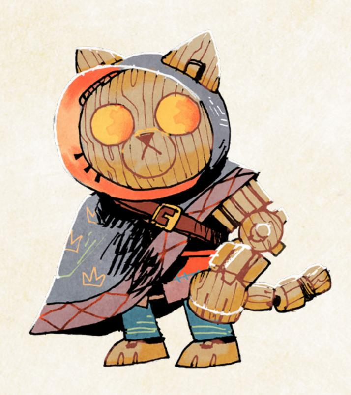

{45}------------------------------------------------

### New Drives

Each of these twelve new drives functions exactly like the drives on the original playbooks (see the Root: The RPG core book, page 171, for more on drives). They represent ways for a vagabond to advance during the course of play. Any vagabond can swap to these drives using the session move (see the Root: The RPG core book, page 130). At the GM's discretion, a brand new vagabond character can be made using these drives instead of the ones on their playbook.

#### Antimilitarist

*Advance when you sabotage a non-denizen faction's armies or their ability to wage war.*

"Sabotage" can entail burning an army's supplies, wrecking siege weapons, or even falsifying or destroying orders, as long as a faction's military is significantly hampered. A vagabond with this drive is pursuing an end to the War in the Woodland and is enacting that change by ruining every faction's ability to fight, regardless of their politics or beliefs.

#### Atonement

*Advance when you earn forgiveness from someone you or your allies previously harmed.*

This drive requires you to prove you understand how you've hurt someone and truly make things right. Simply apologizing for your actions or behavior isn't sufficient proof—you have to mean it and sincerely attempt to remedy the situation. "Earning forgiveness" will be different for each person but you can *figure someone out* to try and understand both how they're feeling and what they might want from you. "Previous harm" can't be something you just did five seconds ago, and it can't be a mild slight or insult. You might make amends for things that happen during a session, things established in character creation, or consequences of your actions discovered upon returning to a clearing you've previously been to.

{46}------------------------------------------------

#### Development

*Advance when you contribute to a lasting development or improvement to an entire clearing.*

Contributing to "a lasting development or improvement" can involve actively helping to create a permanent structure, like working with the denizens to build a new mill for a farm, or helping troops reinforce a clearing's decrepit walls. It can also involve creating a permanent opportunity like clearing out a ruin in order for a new structure to be built over it. These upgrades must be for the benefit of the entire clearing, even if everyone in the clearing doesn't agree with it—not every development will be altruistic or universally loved. You don't need to singlehandedly create such an improvement—providing labor, expertise, or supplies all count towards triggering this drive. Whatever the development is, remember that it needs to be "lasting," meaning it should fundamentally change the clearing and become an important location of some kind.

#### Devotion

*You follow an organized or folk religion; name it and describe its beliefs. Advance when you get a non-believer to share in one of your beliefs or practices.*

You may choose to follow one of the existing faiths of the Woodland (like the beliefs of the Lizard Cult) or create your own. You don't need to come up with every detail of your religion when you choose this drive—just make note of the most important beliefs and practices your faith asks of you. Think of a few big things that you must (or must not) do, such as "I must not kill," "I must pray to the Wyrm every morning," or "I must donate to the impoverished." When someone outside of your faith willingly joins you in one of those rituals or aspects of your beliefs, you advance. This drive isn't really about proselytizing; it's about sharing your beliefs with others in the hopes that they'll understand and appreciate what you practice.

#### Discord

*Advance when your actions create or intensify a serious conflict between two factions.*

Although every faction is always at odds with each other, they aren't always in direct confrontation. You probably don't care who's fighting whom so long as the Woodland is in chaos. "Creating or intensifying a serious conflict" goes beyond simple misunderstandings or squabbles—troops are dispatched, roads are blocked, relations sour. A conflict must arise where there wasn't one before, or you need to pour fuel on the fire of an existing feud. The outcome of your subterfuge may be noticeable right away, or you might find out when *time passes* or at the end of a session.

{47}------------------------------------------------

#### Esprit de Corps

*Advance when you win a battle against enemy soldiers alongside friends and allies.*

This drive emphasizes a vagabond's pursuit of military camaraderie—it only triggers after winning a battle, specifically against enemy soldiers, and in the presence of friends and allies. "Enemy soldiers" means they are real combatants—bandits, a rabble, or a mob wouldn't count. A battle can be any kind of combat engagement but it needs to be some kind of direct confrontation, whether it's a siege or a skirmish in an open field. You don't need to be leading those friends and allies to trigger the drive—as long as you've won the day with comrades-in-arms, you qualify.

#### Folk Hero

*Advance when you perform a significant act of service or heroism on behalf of the denizens.*

"A significant act of service or heroism" should involve creating some kind of lasting change to a clearing or overcoming a major obstacle. Simply helping one person with their troubles isn't enough to qualify for this drive—your act must make things better for the denizens going forward. Since this must be "on behalf of the denizens," it should be something the denizens actually asked you to do, or your actions should address a real problem of theirs—not just something you *think* is a problem. Just because you *think* Eyrie control of their clearing is a major problem doesn't mean ousting the Eyrie governor qualifies not when the governor was also providing food for the clearing, and the ouster leaves the clearing in chaos.

#### Glory

*Advance when you defeat a worthy foe in single combat.*

"A worthy foe" must be an enemy who can believably match or exceed your combat capabilities, and whose defeat is significant or meaningful. If you can be entirely confident you'll win against an opponent, then they're not "worthy". "Worthy" looks different for each vagabond—a nimble duelist might advance after defeating another skilled, dexterous fighter or a massive brute whose heavy swings make up for their lack of speed. "In single combat" means no other vagabond can interfere with your fight.

{48}------------------------------------------------

#### Mysteries

*Advance when you discover the truth behind strange phenomena or goings-on within a clearing.*

Whatever unusual activity appears to be going on in a clearing, "discovering the truth" means learning what's beneath that facade. You need to find the answer for yourself, whether by unmasking a false monster, locating the source of a "cursed" crop blight, or cornering a huckster with evidence and obtaining a confession. "Strange phenomena or goings-on" can be anything suspicious or unusual, from the mundane (like suspicious behavior of denizens) to paranormal phenomena with reasonable explanations.

#### Partisan

*Name a faction. Advance when you successfully complete a mission given to you by an important member of that faction.*

As a vagabond, you are a deniable asset for each faction but your outsider status means you're never truly seen as one of them. By taking this drive, you indicate you've taken a clear side as a dedicated freelancer for a particular side of the War. "An important member" of a faction must hold some position of power or influence, and the most obvious way to pursue this drive is to *meet someone important* and ask for (or be given) an assignment. Missions must be "given"—you can't assign yourself a mission, so be sure to talk to important representatives of your chosen faction often! For the MC, "a mission" can be just about anything but it should either advance the goals of the vagabond's chosen faction, or the personal goals of whoever gave you the task. A mission is complete when all of its objectives are met, whether or not you immediately report back to your handler.

#### Traveler

*Advance when you replace a valuable or meaningful item with one that represents the local culture.*

You can't trigger this drive by ditching your equipment and picking up a replacement off the ground. The equipment you leave behind has to be something valuable to you—it can't be something you might have thrown out anyway because it's not worth the weight to carry. The equipment you replace it with needs to reflect the essential nature of the clearing you're in, or otherwise represent a central aspect of its culture. You might acquire a sword from a clearing known for its fine steelwork, cookware and spices suited to a regional specialty dish, or a musical instrument tied to a clearing's heritage. Whatever equipment you leave behind is of no further use to you, and you become a walking tapestry of the Woodland with each new acquisition.

{49}------------------------------------------------

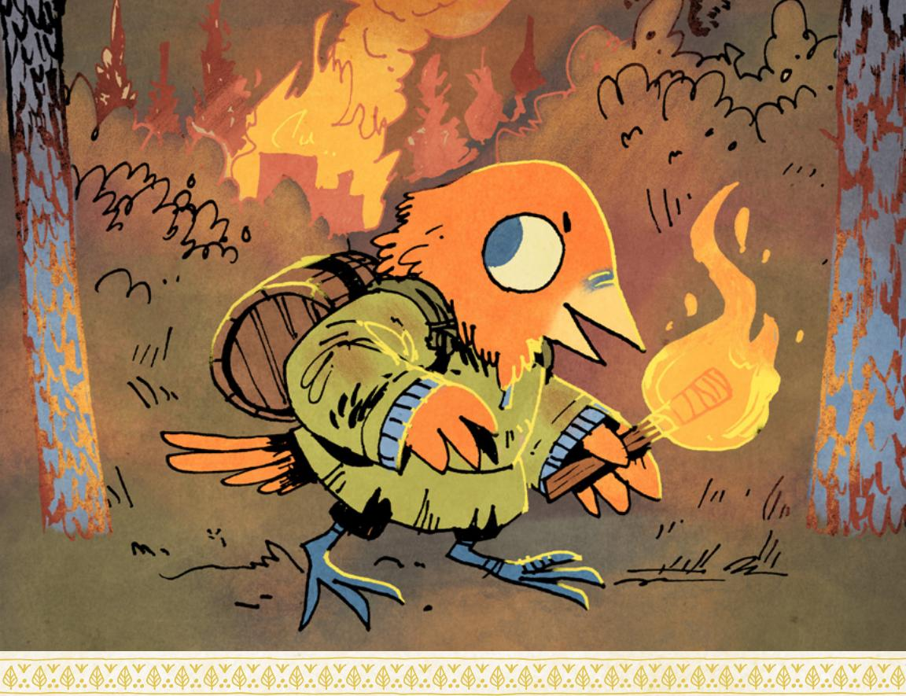

#### Wanted

*You've got a bounty on your head; name your crime(s). Advance when you defeat or evade capture by a serious threat trying to cash in on your bounty.*

If you take this drive at character creation, your background questions probably point to what crimes you're wanted for. If you choose this drive during play, work with the MC to decide who put the bounty out on you and why. Whatever crimes you're wanted for, they're serious enough that you risk capture anywhere you go. "Evading capture" means there's a genuine chance you would have been caught by pursuers. "A serious threat" has to be truly dangerous and they must be chasing you specifically for your bounty—the MC might send a squad of hardened commandos, a famous detective looking to pad their career, or even a coin-hungry vagabond after you.

{50}------------------------------------------------

### New Natures

Each of these twelve new natures functions exactly like the natures on the original playbooks (see the Root: The RPG core book, page 49, for more on natures). They represent ways for a vagabond to clear exhaustion during the course of play. Any vagabond can swap to these natures using the end of session move (see the Root: The RPG core book, page 130). At the GM's discretion, a brand new vagabond character can be made using one of these natures instead of either of the ones on their playbook, but we recommend starting with the playbook-specific ones and changing as the character does.

#### Braggart

*Clear your exhaustion track when you confidently and publicly accept an excessively perilous challenge.*

A vagabond with this nature often lets their overconfidence and desire for attention get the better of them. Boastfully accepting a challenge when you and your challenger are alone behind closed doors isn't enough to clear exhaustion—you need an audience to show off in front of. If the clearing's ruling council is there with you, that might count; the key is that enough denizens have seen the challenge and your acceptance that you can't reasonably deny it. By "confidently and publicly" accepting a challenge, you show others that you don't just think you can get the job done—you *know* you can do it, and with one arm tied behind your back! An "excessively perilous challenge" must be truly dangerous or foolhardy, something no reasonable denizen would attempt...but for a vagabond of your skill and confidence, it'll surely be no trouble to pull off! Right?

#### Commander

*Clear your exhaustion track when you assert authority over a group of non-vagabonds in a tense situation.*

A vagabond with this nature wants to be in charge when the chips are down and isn't shy about throwing their weight around to claim that authority. You might have a background in a leadership role, like a military officer, labor foreman, or noble. You might be an outright bully or a charismatic leader. However your nature formed, you feel most comfortable telling others what to do. The ones you can most easily command aren't vagabonds—they're too independent to order around and they don't organize well. Look for opportunities to lead groups of NPCs in action, or command the attention of a room. You can clear exhaustion just as easily rallying troops in combat as you can calming down frightened denizens during a bank heist.

{51}------------------------------------------------

#### Cowardly

*Clear your exhaustion track when you willingly surrender to hostile forces.*

A vagabond with this nature is often conflict-averse to an extreme—rather than risk harm, their instinct is to give up instead of fight. When you "willingly surrender" you're doing so because you want to; you make the choice to give in to your opponents. If you're forced to surrender by your harm tracks spilling over, then you don't invoke this nature. You must also surrender in earnest; you may sometimes be pushing an ulterior motive, like being brought into the prison beneath the fortress (so that you're inside the fortress walls), but even with the motive you're truly surrendering. If you're hiding lockpicks and knives with full intent to easily escape as soon as you're brought inside, you're not really surrendering—not least because in a true surrender, you can count on your captors searching you and finding any such contraband. Think of "true surrender" as giving up a significant amount of your character's bodily autonomy until you've been placed somewhere new, be it into a cell, a stockade, irons, or whatever else your captors choose.

#### Curious

*Clear your exhaustion track when you enter danger to investigate an interesting situation or location further.*

This nature speaks to your desire to learn more about the world and its goingson, regardless of any obvious hazards in your way. Your hunger for knowledge takes priority over your companions' warnings or immediate threats. This nature means you will often be the one at the head of the band, plunging headfirst into strange, exciting, or outright deadly situations and places to discover their true natures. You only invoke this nature when you "enter danger"—pursuing knowledge devoid of danger won't invoke this nature.

#### Generous

*Clear your exhaustion track when you provide meaningful quantities of supplies to those in need.*

"Meaningful quantities of supplies" means enough to make a significant improvement or change to the recipients' lives. For example, if a clearing is starving then providing them all with enough food for just a single meal might suffice. If an NPC comes to you and asks for help—"We're in desperate need of \_\_\_!"—then whatever they're asking for is clearly a "meaningful quantity" for them. If you're offering your own supplies, whatever you provide should be at significant cost to your depletion. Otherwise, you'll need to gather supplies from elsewhere to provide that much-needed aid.

{52}------------------------------------------------

#### Gossip

*Clear your exhaustion track when you reveal new and important information to someone who can act on it.*

A vagabond with this nature just can't keep their mouth shut, even when they know they should. Your nature speaks to some manipulative tendencies—you need to reveal information to "someone who can act on it," perhaps in hopes that you can compel them to do something you want. Note that they don't necessarily have to act on it for you to invoke your nature; you just have to reveal the information to someone who could actually use it meaningfully. "New and important information" must be knowledge the recipient didn't already have, knowledge that is actionable in some way, and knowledge that can affect their (or others') goals or well-being.

#### Improviser

*Clear your exhaustion track when you attempt to solve a technical problem without appropriate tools or skills.*

A vagabond with this nature is good at thinking on their feet and making do with whatever materials are on hand, even if they aren't the Tinker. You might be a whiz at jury-rigging solutions or you might love the thrill of fiddling with devices under pressure. "A technical problem" must involve crafts, mechanics, etc. and have some stakes in play or prevent you from advancing or accomplishing something (dismantling a haywire machine, cracking a safe to rob a mark). "Without appropriate tools or skills" means you either don't know how to do the task at hand or you don't have the right tools—your depletion track might be full or the problem might require specialized gear you lack.

#### Inspiring

*Clear your exhaustion track when you take action that clears the morale track of an NPC or group of NPCs.*

A vagabond with this nature tries to stand firm when things look dire in order to give others hope. You specifically care about convincing other NPCs to press on—at some level, you want to be a leader, and your fellow vagabonds are free spirits, far less susceptible to this kind of inspiration. Remember, you can't just give a speech to trigger your nature; the NPCs you're focused on have to believe you. When you clear their morale harm tracks, you invoke this nature and clear your exhaustion. Devoid of a special move helping you do so, the GM is the final arbiter of what clears a morale harm track, but generally speaking, actions that reinvigorate, provide hope, or push NPCs to strive even in the face of danger or hardship should all clear their morale harm.

{53}------------------------------------------------

#### Martyr

*Clear your exhaustion track when you engage overwhelming odds to protect others.*

A vagabond with this nature believes in heroism at the expense of selfpreservation. By invoking this nature, you're filled with resolve in the face of overwhelming hostile forces and accept your fate, so long as it means keeping others safe. "Overwhelming odds'' are more than you could possibly handle, whether you're facing a small group of elite fighters with far superior training and equipment or a horde of raiders spurred on by a warlord. You have to be engaging these enemies for the purpose of protecting others to clear exhaustion. You might be covering the band's escape from a heist, defending a village of denizens from invaders, or making a heroic last stand over injured allies. If you're engaging them with a legitimate and believable hope of victory, though, you're not invoking this nature.

#### Muckraker

*Clear your exhaustion track when you enter somewhere off-limits to discover incriminating secrets.*

A vagabond with this nature is likely never satisfied with whatever's on the surface of a situation. Whether you want to expose corruption or keep a record of blackmail material, you're not afraid to get your hands dirty to chase information down. "Somewhere off-limits" can be any restricted, forbidden, or guarded area but you can't clear exhaustion unless you're entering it for the purpose of gathering some kind of compromising evidence. Breaking into a noble's manor, for example, is only one step in completing this goal—when you manage to sneak into their office to rifle through their communiques, that's when you trigger your nature. And if you break into the town treasury to fill your pockets with coin, that won't trigger this nature at all.

#### Populist

*Clear your exhaustion track when you publicly try to rally a group of denizens to take action against injustice.*

A vagabond with this nature is invigorated not just by fighting injustice, but by filling the common folk with that same righteous indignation. You see yourself as a leader and a comrade of the denizens. To clear exhaustion you must rally and lead those denizens in public. No hiding behind closed doors for you those who would oppress the denizens must know and fear your presence! What's more, you can't just rally a group of denizens in general—you have to rally them to take some clear action, right now. Giving a speech isn't enough if it doesn't lead to action.

{54}------------------------------------------------

#### Vain

*Clear your exhaustion track when you make a big show of intervening in a situation that doesn't involve you to help or protect someone.*

A vagabond with this nature can't stand not being the center of attention. When you trigger this nature by making a big display about stepping in to save the day, you're giving in to your desire to be the main character of a moment. Protecting others and offering aid are part and parcel of being a vagabond, but a Vain vagabond makes others' troubles their business. Remember that whatever you're getting involved in didn't involve you before you decided to step in—you need to be interfering (even if you don't see it that way) to trigger your nature. You can still invoke this nature if someone wants you to intervene, just so long as you shove your snout into a situation that didn't involve you. And if they didn't want you to intervene at all, you can be guaranteed that you're invoking this nature!

### New Connections

These six new connections supplement the base connections used on every playbook (see the Root: The RPG core book, page 50). These new connections all function just as the base connections do, representing a relationship between two vagabonds. A connection is written on one vagabond's character sheet, and that vagabond is the one who makes the choices, triggers the moves, and otherwise most directly "uses" the connection. Vagabonds can swap in these connections during the course of play using the end of session move (on page 130 of the Root: The RPG core book). At the GM's discretion, a new vagabond's pre-written connections can be modified to use one of these.

#### Battle-Sibling

*When you fight side-by-side or back-to-back with them, take +1 ongoing to weapon moves as long as you remain within intimate range of each other.*

You trust the vagabond you share this connection with, having shed blood alongside them. You know their moves and know how to best complement their combat style. When the two of you are together, you're an unstoppable fighting force. So long as the two of you remain at that intimate range, you maintain the bonus to weapon moves. As soon as either of you shifts ranges away from each other to close or far, you lose this benefit. If you manage to regroup and go back-to-back or side-by-side again during the same scene or fight, you can regain the benefit of this connection. Note that they do not also gain the same benefit, unless they take a Battle-Sibling connection with you as well.

{55}------------------------------------------------

#### Confidant

*When they come to you in confidence with a problem, mark exhaustion to suggest a course of action to resolve it; if they do as you say to the best of their ability, they clear their exhaustion track.*

This connection speaks to a deep level of trust between you and another vagabond that they simply don't have with the rest of the band. They see you as someone they can talk to about anything, especially weighty personal issues, and they value your guidance. By marking exhaustion, you perform the emotional labor of listening to them and offering a solution. The bond you both share is strong enough that following your advice lets them clear exhaustion. Remember that they need to come to you with a problem—you might suspect something is wrong but they need to approach you on their own terms in order to gain the benefits of this connection. This connection is best served if you make sure they know that they can come to you to receive this benefit; you should remind the other player often.

#### Enabler

*When you plead with them to join you in reckless action and they agree, they take +1 ongoing to follow the plan in addition to clearing exhaustion.*

You bring out the best and the worst in the vagabond you share this connection with. You might be true friends...or you might just be a bad influence. Regardless, it's hard for them to say no to you and your schemes when you turn on the charm (or the tears). On some level, they either enjoy or are invigorated by your antagonism. Because you can only gain this benefit once per game session (as you can only *plead* once per session), and you have to push them to "reckless action," make your connection count and push them into truly dangerous schemes to get the most out of it!

#### Lover

*Once per session when you share a quiet moment of intimacy, just the two of you, choose one:*

- · *Offer them affection; if they accept it, they clear 3-exhaustion.*
- · *Make them a promise; you take +1 ongoing to keep your word.*

When you take this connection, you see yourself as a caring romantic partner of another vagabond. If the vagabond you share this connection with doesn't also have you as their Lover, it doesn't mean you're not in a relationship—it just means they see your partnership in a slightly different light or fulfil a different role for you. "A quiet moment of intimacy" has no immediate threat; it must be a calm space for the two of you to share your innermost feelings.

{56}------------------------------------------------

"Offering affection" can be physical or emotional. "Make them a promise" must be actionable; "I promise to be awesome" won't work, but "I promise to keep our fellow vagabond Tandy safe from harm in the upcoming fight" is perfect. The promises should always center your relationship, their interests, or either of your well-beings—so if Tandy is of deep importance to the other vagabond, then the example works perfectly.

#### Protégé

Once per game session, when you spend time training with them, choose one and hold 1:

- Learn tricks of the trade; they choose which roguish feat they teach you, and you may spend hold to attempt that roguish feat as if you had it.
- Spar with them; they choose which weapon skill they teach you, and you may spend hold to use that weapon skill as if you had it.
- Ask them about how they see the world; spend hold to take +1 forward to prove them right or wrong.

This connection reflects a mentorship dynamic you've developed with another vagabond. You might see them as a grizzled veteran or just an expert in their field, but regardless they've offered to teach you or you've asked to study under them. You might not always agree with their tutelage, such as when you spend hold to prove their worldview wrong, but you want to learn from them—what do you teach them in return? When you train together, work with the other player to roleplay a scene that reflects what you're learning from them this time. When you spend your hold to activate your chosen benefit later in the session, consider flashing back to that moment to showcase what you took away from that moment and how you put it into action.

#### Rival

When you challenge them to take a completely unnecessary and excessive risk to prove themself, they take +1 forward to accept and meet your provocation; if they decline, they mark exhaustion instead.

You and the vagabond you share this connection with are always trying to outdo each other in increasingly absurd or excessive ways. You might share a love of healthy competition or have more serious beef. Taking this connection means the vagabond you choose can be riled up by your words and it frustrates them to pass up an opportunity to meet your challenges. These provocations aren't just risky—they're "completely unnecessary and excessive." The provocations need to push the other vagabond to prove themself, so call their talents into question when you challenge them.

{57}------------------------------------------------

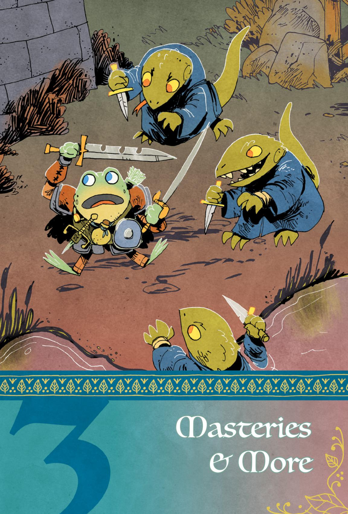

{58}------------------------------------------------

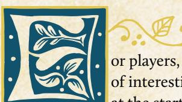

or players, the base game of Root: The RPG provides plenty of interesting ways to develop and define their vagabonds, both at the start of and over the course of play. Many of the options

in the core book are expanded still further in this book—check out the last chapter, Chapter 2, for those expansions!

This chapter is about adding whole new ways of adjusting, expanding, growing, and defining characters and even your game. From adding species moves that give species some mechanical definition, to advancing into masteries that give PCs extraordinary results when they roll a 12+, to guidance on creating whole new custom moves, here you'll find brand new ways you can add new ideas to your game to expand your options and choices.

### Species Moves

By default in Root: The RPG, the different animal species aren't different mechanically. They are different in the fiction—birds can obviously fly, moles can burrow, wolves have good hearing, etc.—but any uncertainty that arises around these differences is easily resolved within the scope of the basic moves.

A wolf wants to listen closely? They either hear anything around them, or if there's some uncertainty about what they might hear, they assess a situation. A bird wants to fly to the top of the tree? If there is no tension, they just do it; if there is tension and uncertainty, then maybe it's attempting a roguish feat, or even just trusting fate.

But it can be fun to have more definition to the species' special abilities, adding interesting features to vagabond characters! A way for a player to call out their eagle's claws, rabbit's long hopping legs, or frog's amphibian nature, for example, with more than just the somewhat abstract basic moves.

This section is all about serving that goal. There are two versions of the species move system, and you'll find both here—the first one provides full-on moves, while the second provides a fairly versatile way to easily account for new species using custom abilities. But before getting into the mechanics, there are a few baseline principles to get straight.

一番「これでいる」ないない。

{59}------------------------------------------------

#### Denizens are Wildly Different

All denizens represent a grand and multitudinous variety of being. If you have two foxes, they are certainly far from identical—at bare minimum they're likely to be different culturally if they come from two different clearings, or two different social strata, or two different households! It's just as likely that they have different degrees of these inherent species abilities. A fox who files their nails every day is going to be a lot less likely to have anything close to claws than a fox who lives in the forest and uses their claws as their primary weapon!

Do not conceive of these abilities as true for all members of a given species. They can be true; a given denizen of a given species might have these abilities; but they are not guaranteed for every member of that species. They don't define some "essence" of the species, some essential trait that must be universal to them all. Such a thing doesn't really exist in Root: The RPG!

### Learning & Innate Ability

The species moves cover a combination of learning and innate ability. Some of them refer directly to the traits that an animal likely has—like claws or wings—but others refer to traits that an animal of that species would likely acquire through socialization. Adhering to the principle above means there are always plentiful exceptions to any such social acquisition, but that doesn't mean the socialization is absent—not least because the views of other animals, other species, can have a great impact in influencing how a denizen sees themself and acts growing up.

So when a species move for a mole grants a character the Hide roguish feat, the move is just as much saying that moles are socialized by their own family and culture and by the other denizens around them to hide, as it is saying that a mole is somehow naturally gifted with large paws and digging ability. Both ways of thinking can be incorporated into the move, and it's up to the player of that mole to say which factors matter the most.

### Description Over Balance

The species move systems described below aren't designed to set you up with a perfectly balanced character whose abilities are on par with a non-speciesmove-using character. Instead, these frameworks are here to provide additional ways to define and individualize your character, which means they're not guaranteed to grant you an equivalent stat bonus from move to move, or the same number of moves, or meet any other balancing test you might think up.

Use these systems because you're interested in adding additional definition to your characters, not because you're looking for an edge. The goal of these systems is to make species matter in interesting ways!

{60}------------------------------------------------

#### Species (Doves as Separate Advances

Alternatively, if you're interested in characters with lots of options, you can take a new species move as appropriate to the fiction with each advancement, to a maximum of two total species moves. In this mode, they don't count against the number of moves you can have from your own playbook. All PCs can wind up with two more moves than usual, as a result.

### Species Moves as Playbook Moves

The first way to incorporate species moves into your game is essentially as additional playbook moves. This method uses fully-fledged moves, equivalent to any you'd find on a playbook, to define species abilities.

Implementing this system is simple:

- When you make a character, you can choose a species move appropriate for your animal species instead of choosing one of your playbook moves.
- You can take a new species move as an advancement, as long as it is appropriate to the fiction; you let your previously shorn talons grow long, thereby letting you take *Built-In Weapons* (page 61), for example.
- When you advance your character, any species moves count toward the limit of moves from your own playbook.

Every one of these moves calls out some appropriate species, noting a few animal types the move would normally fit. These lists aren't intended to be all-encompassing—players can play an enormous variety of animal species in **Root**: **Ghe RPG**, far more than could be easily listed. Those appropriate species are pulled from those you are most likely to encounter in the Woodland, selected to provide a baseline for thinking about which animals might have the move. In the end, it's always down to a discussion at your table, with your GM and the other players, to determine if a move is appropriate to your species or your concept of your character.

{61}------------------------------------------------

#### Species (Noves List

#### Built-In Weapons

Applicable species: Cat, Fox, Bird of Prey, Lizard

Your claws, fangs, or talons are natural weaponry, with intimate range, using up no Load and inflicting injury instead of exhaustion. Choose one weapon tag from the list:

- Barbed: When you catch someone with this weapon's end, mark exhaustion to move to intimate range and *grapple with them* as if you had rolled a 10+.
- Fast: Mark wear when **engaging in melee** to suffer I fewer harm, even on a miss.
- Intimidating: When you flaunt this item to *persuade an NPC* through threats, you can mark 2-notoriety with their faction to shift a miss to a 7-9 or a 7-9 to a 10+.
- Precise: Mark wear to ignore your enemy's armor when you inflict harm.
- Quick: Mark exhaustion to engage in melee with Finesse instead of Might.
- Sharp: Mark wear when inflicting harm with this weapon to inflict I additional harm.
- Signature: Whenever you earn prestige or notoriety while showing this item, mark I additional prestige or notoriety.

And one weapon flaw from the list:

- Identifiable: This item is known to be associated with a particular individual. Anyone who sees it instantly recognizes it and associates you with that individual.
- Slow: When you **engage in melee** with this weapon, choose one fewer option. Mark wear to ignore this effect.
- Ugly: Take –I to *meet someone important* while they can see this item. Mark exhaustion to hide it.
- Unwieldy: Take a -I to all weapon moves—both basic and special weapon moves—made with this weapon. Mark exhaustion to ignore this effect.

{62}------------------------------------------------

#### Cached Resources

Applicable species: Fox, Squirrel, Mole

You've hidden resources all over the forest, sometimes even in locations that you've since forgotten. When you search for one of your caches, roll with Cunning. On a hit, you find a stash of resources; clear 2-depletion. On a 7-9, the search takes forever; mark exhaustion. On a miss, your wandering puts you in danger before you realize it.

#### Garner Sympathy

Applicable species: Rabbit, Mouse, Corvid

When you *plead with a PC* by guilting them into going along with you, mark exhaustion to allow them to clear 2-exhaustion instead of one when they agree to what you have proposed.

#### Scenting the Clearing

Applicable species: Cat, Dog, Wolf

When you sniff out the details of a new clearing, roll with Cunning. On a 10+, ask two questions from the list below. On a 7-9, ask one.

- What's the most surprising scent l pick up in the clearing's most public area?
- What interesting scent trail catches my attention, and where does it lead?
- What scent has somebody taken efforts to hide, and where do I smell it?
- What smells like the most dangerous place in the clearing?
- What smells like the safest place in the clearing?

On a miss, ask one, but your sniffing around leaves you distracted from another threat; it gets the drop on you.

{63}------------------------------------------------

#### Searching the Cracks

Applicable species: Fox, Mouse, Otter

When you carefully search someone's private space for secrets, roll with Luck. On a hit, the GM will either tell you there are none here—they're not hiding anything—or that you found something surprising, incriminating, or telling. On a 7-9, you leave no evidence behind or you can take something with you, your choice. On a 10+, both, or you can plant something. On a miss, something you find is strange and distracts you... just long enough to be caught!

#### Stroke of Luck

Applicable species: Rabbit

Take +1 Luck (max +3).

#### Gight Squeeze

Applicable species: Mouse, Cat, Lizard

When you squeeze through a tight space, roll with Finesse. On a hit, you make it through to the other side. On a 7-9, mark injury or mark 3-wear on your gear, your choice. On a miss, you're stuck and something on the other side isn't looking too friendly.

#### Convenient Hideout

Applicable species: Fox, Rabbit

Your eyes are adept at finding good, safe places to hunker down. When you attempt to lay low in the forest, roll with Cunning. On a hit, you find a convenient hideout nearby. On a 10+, pick 2. On a 7-9, pick 1:

- Food and water are easily accessible from the hideout
- The area is untouched and undisturbed by other denizens or threats
- The route to the hideout is safe and easy

On a miss, you reach the hideout—choose I—but you aren't alone when you arrive.

{64}------------------------------------------------

#### Nine Lives

**Applicable species: Cat, Corvids**

Once per session, when you mark your last box of injury, mark exhaustion to ignore the blow entirely and stay on your feet long enough for one last act of heroism. Once the deed is done, you collapse, unconscious.

#### Underground Tunnels

**Applicable species: Rabbit, Mouse, Mole**

Take the *Hide* roguish feat (it does not count against your limit). When you *attempt to hide by burrowing underground*, roll with Might instead of Finesse.

### Species Abilities System

The second way to incorporate species-traits into your game is with an ability system that gives every character a few active ways that they can take speciesspecific actions without adding the complexities of whole new moves.

In this system, you automatically get your species' abilities at character creation. Every species has three abilities, and at any appropriate time during play, you can use an ability by marking exhaustion.

You still have to be able to take the fictional action—no "lashing out with fangs and claws" when your paws are bound, for example. But otherwise, the only thing you have to do to trigger an ability is to mark exhaustion.

These abilities come with no uncertainty. As long as you can feasibly perform the action of the ability, you can mark exhaustion to get the effect. Just remember that the world moves around you—when you mark exhaustion and get the effect of "lashing out with fangs and claws," your opponent won't just sit there and take it; they'll respond.

Each of these sets of abilities also comes with an **instinct move**. Your instinct move becomes, essentially, another Nature, another way to clear your exhaustion as long as you follow your instincts. It's triggered and functions more or less exactly like Natures (page 49 in the Root: The RPG core book), but it only clears a single exhaustion and you can only use it once per session.

{65}------------------------------------------------

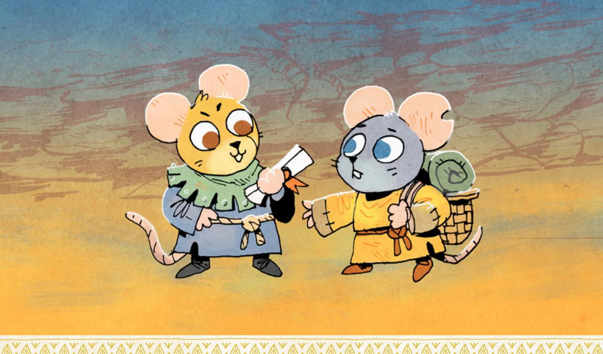

### Making Your Own Species Abilities

If you want to create a set of species abilities for an animal not listed here, follow these guidelines.

First, give them three different abilities. If any of the abilities on the lists below match up, use them—mix and match! There's no reason to write a whole new ability if "Sniff out a hidden stash of food or resources" pretty much sums up what you want your new species to be able to do.

If you need to write new abilities because none of them quite match, focus on abilities that just allow the vagabond to take some action, with no uncertainty. Add enough specificity to the action that it doesn't replace a basic move for all situations—they can "fly to any location within a clearing in moments," for example, which doesn't utterly preclude any basic move, as there will be situations when the vagabond is still trying to move but that ability doesn't apply.

If you want to write a more mechanical ability, limit its effects to inflicting 1-harm (of whatever type is appropriate); adding a +1 to a peripheral or less commonly used move; or providing a 12+ on a basic move but in a highly specific situation. You want the abilities to be useful and meaningful, but you don't want them to start to matter more than the basic moves!

The final list of three abilities should include no more than two highly mechanical abilities, and no more than one ability that gives a +1 or a 12+ on a move. If you end up with three mechanical abilities, you're likely giving the abilities too much weight in your game.

{66}------------------------------------------------

Then, after you've come up with your three abilities, create an instinct move for the species. These should always be unique to the species. All instinct moves are limited to restoring a single exhaustion only once per session, so they can be a bit easier to trigger, but you always want them to encourage the vagabond to do something interesting, dangerous, or distinctive. "Use the cover of darkness to your advantage in a dangerous situation" is interesting and cool, with a bit of specificity that means it's not too easy to use. "Spend several hours basking in heat" requires time and a source of heat; while the action itself isn't super exciting, the requirements help limit its use in interesting ways.

#### Species Ability Lists

#### Fox

Mark exhaustion to activate an ability:

- Sniff out a hidden stash of food or resources.
- Take a +1 to *travel through the forest* between clearings
- Lash out with fangs and claws; inflict 1-injury

Instinct move: Once per session, clear exhaustion when you use the cover of darkness to your advantage in a dangerous situation.

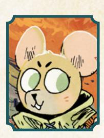

#### Mouse

Mark exhaustion to activate an ability:

- Gain access to or escape a location by squeezing through a tight space.
- Sniff out a hidden stash of food or resources
- Take a 12+ instead of rolling when *tricking an NPC* into underestimating you

Instinct move: Once per session, clear exhaustion when you scout out an area in advance of a conflict or scheme.

#### Rabbit

Mark exhaustion to activate an ability:

- Gain access to or escape a location by burrowing underground
- Sprint at speeds beyond nearly all other denizens
- Listen in on a nearby conversation without drawing attention

Instinct move: Once per session, clear exhaustion when you convince your allies to pursue a new strategy when a plan goes awry.

{67}------------------------------------------------

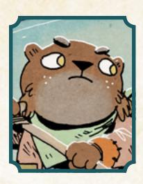

#### Otter

Mark exhaustion to activate an ability:

- Gain access to or escape a location by swimming underwater
- Improvise a simple but functional tool from nearby resources
- Find safe shelter for your band, regardless of your environment

Instinct move: Once per session, clear exhaustion when you keep the group together in circumstances that threaten to divide you.

#### Bird of Prey

Mark exhaustion to activate an ability:

- Track a denizen from the air without revealing yourself
- Lash out with talons and beak; inflict 1-injury
- Fly to any location within a clearing in a few moments

Instinct move: Once per session, clear exhaustion when you acquire information that gives you an advantage over an enemy.

#### Cat

Mark exhaustion to activate an ability:

- Track a denizen through an unguarded dark area without revealing yourself
- Fall from any height without harm
- Lash out with fangs and claws; inflict 1-injury

Instinct move: Once per session, clear exhaustion when you catch and corner someone you're hunting.

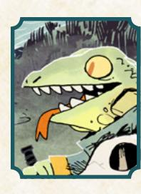

#### Lizard

Mark exhaustion to activate an ability:

- Quickly scurry through a survivable dangerous environment without suffering injury
- Gain access to or escape a location by squeezing through a tight space
- Clamber up a vertical surface or treacherous and narrow path

Instinct move: Once per session, clear exhaustion when you spend several hours basking in heat.

{68}------------------------------------------------

#### Corvid

Mark exhaustion to activate an ability:

- Sniff out a hidden stash of food or resources
- Snatch and pocket a single valuable or shiny object vulnerable to you
- Fly away into the darkness of night, losing any pursuers

Instinct move: Once per session, clear exhaustion when you use a tool or piece of equipment in a surprising or innovative way.

#### Small Bird

Mark exhaustion to activate an ability:

- Fly to any location within a clearing in a few moments
- Find a perfect hiding place out of sight of a pursuer
- Take a 12+ to *attempt a roguish feat of acrobatics* or *trust fate* when acting acrobatically, as long as you are carrying 2-Load or less

Instinct move: Once per session, clear exhaustion when you manage to lose or avoid unwanted attention.

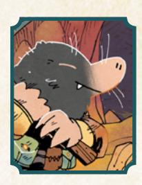

#### Mole

Mark exhaustion to activate an ability:

- Dig into loose soil and dirt, emerging sometime later from a different, reachable point
- Touch nose to earth and detect vibrations of any nearby denizens.
- Take a +1 to *travel through the forest* between clearings

Instinct move: Once per session, clear exhaustion when you handle a beautiful, well-crafted, or otherwise tactilely pleasing object you haven't held before.

{69}------------------------------------------------

### Masteries

As the vagabonds advance through your campaign of Root: The RPG, they will get any number of new abilities (moves), new equipment, and simple improvements that can make a big difference to their potency (like raising stats or growing their harm tracks). Experienced vagabonds are formidable, capable of standing against many threats that send new PCs back to the forest to rest up and heal.

**Masteries** represent a new avenue for growth devoted to specialization. Instead of getting a whole new ability that changes how the character might approach situations entirely, or a stat boost that helpfully improves everything the character does with that stat, masteries allow a vagabond to obtain new, phenomenally better results from the basic moves and the weapon moves.

The core structure of a mastery is simple—it adds a new tier of results beyond 10+/full hits, a tier called **triumphs** representing results of 12 or higher. If you have the mastery for a given move, then you can get a miss (total of 6-), a partial hit (total of 7-9), a full hit (total of 10-11), or a triumph (total of 12+).

Triumphs give you phenomenally better results in the fiction than you might achieve otherwise—the equivalent of "critical hits" or "critical successes," where not only do you achieve your goal, but you also achieve something extra.

### Gaining a Mastery

You can gain a mastery as part of your normal advancement. Effectively, add this option to your list of advancement options:

· Master one basic move or up to two weapon skills you already know (max of 2 basic moves and 4 weapon skills mastered)

Each time you take this advancement, you can master a single basic move or two weapon skills. You must already possess those weapon skills to master them. You can only take this advancement a maximum of four times total twice for basic moves and twice for weapon skills.

While it's always great to tie advancements to the fiction, you don't have to do anything special to select a mastery once you advance. You already have the weapon skill you're mastering—or you're mastering a basic move—so it's safe to assume you've been using it as a vagabond for some time. You don't need a special teacher or months to practice, although you might introduce those ideas when you select the advancement to flavor your mastery!

{70}------------------------------------------------

#### **Mastery List**

Below, you'll find lists of masteries keyed to the basic moves and to the weapon skill moves. There are no masteries listed for the basic weapon moves—mastery in combat is represented by gaining skills and mastering those—although there are a few playbook moves such as Skill Against Skill Alone (*The Champion*, page 93) and Greatest of the Age (*The Exile*, page 101) that use a similar framework of 12+ results with basic weapon moves. Overall, however, the basic weapon moves are "basic" in the first place because they represent a lower level of skill with a lower ceiling for improvement.

Each move presented below comes with some advice that can be shared with a player who takes the move, explaining a bit more about the requirements, restrictions, or limits of their mastery.

#### Basic Ooves

#### Attempt a Roguish Feat MASTERY

On a 12+, in addition to the results of a 10+, choose one:

- immediately accomplish a second appropriate roguish feat, whether or not you possess that feat, as if you had rolled a 10+
- clear 2-exhaustion as you exert control over yourself and the situation

Remember that the second roguish feat you choose does not have to be one you are trained in—this is your chance to carry over your success right into a second roguish feat you haven't learned yet, without taking a risk!

#### Figure Someone Out MASTERY

On a 12+, in addition to the results of the 10+, mark down their name on your character sheet; from this point forward, you can always tell if they are lying to you. If you roll a 12+ against a character whose name you have already marked down, you instead take +1 ongoing to act on the answers to the questions you ask.

Marking down an NPC's name is a permanent change. You received enough insight into their character that you can read them at a low level, reliably, from that point forward. You should remind the GM if you're interacting with someone whose name you have marked down, so the GM remembers to tell you if they are lying.

70 Root: The Roleplaying Game

{71}------------------------------------------------

The +1 ongoing you gain for repeatedly figuring someone out with a 12+ lasts until the answers to your questions no longer matter, just like with *reading a tense situation*. If you discover that someone "wishes you would go away," for example, then your +1 ongoing would likely only last until they think you've left the area.

#### Persuade an NPC **mastery**

On a 12+, in addition to the results of the 10+, you may mark exhaustion to treat this move as a 12+ on the *sway an NPC* Reputation move, even if you don't have a high enough Reputation with their faction to normally *sway the NPC* in question.

The *sway an NPC* move is on page 117 of the Root: The RPG core book; it allows you to rewrite the drives of NPCs who are *swayed*, convincing them to view the world in a different way. You are so convincing that you change hearts and minds when you're just trying to get stuff done! Again, remember that a triumph (12+) here lets you ignore the normal Reputation requirements to use *sway an NPC*.

#### Read a Tense Situation **mastery**

On a 12+, in addition to the results of the 10+, you may also ask, "How could I \_\_\_\_\_\_\_\_\_\_\_\_\_\_\_\_\_\_\_\_?" and fill in the blank with any action you hope to accomplish. If you follow the answer to that question, take a 12+ on the first move you make toward your desired outcome, instead of rolling.

The extra question you get to ask is a lot like the equivalent question from *figure someone out*. You can name any course of action you want; as long as there is a way to accomplish that end using your surroundings and your own abilities, the GM will tell you what it is. Follow those guidelines, and on the first move you would trigger you can take a 12+ instead of rolling.

{72}------------------------------------------------

#### Trick an NPC **mastery**

On a 12+, they buy into your deception utterly and entirely; it would take obvious, incontrovertible evidence to shake their belief. You can always return to the same character and play up the same trick again, taking a 10+ to *trick* them the same way instead of rolling.

For this mastery, make a note that your mark buys your deception. You can also embellish your deception after you roll a 12+ to add more hooks that they might buy as well, additional schemes you can then benefit from later.

The key here is that whatever lie you're selling, they buy into in a way that can give you benefits again, and again, and again—if you're pretending you deserve access to the armory, then the guards now so thoroughly buy your deceit that they'll keep letting you in until someone else gives them incontrovertible evidence that you aren't who you say, or unambiguous orders that they should stop letting you in.

#### Trust Fate **mastery**

On a 12+, fate smiles upon you as you receive an incredible and surprising windfall of luck. You accomplish your aim without cost, and you receive an immediate fortunate benefit; the GM will tell you what bounty befalls you.

Mastering *trust fate* is a combination of being able to instantly recognize fleeting opportunities and chances to twist the odds in your favor, and also just being incredibly lucky. The line between unconscious skill or ability and just plain coincidence is blurred, especially here. But whatever the windfall of luck that befalls you, it's serendipitous and nearly unachievable through any other means.

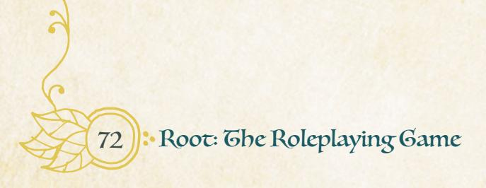

{73}------------------------------------------------

#### Wreck Something MASTERY

On a 12+, in addition to the results of the 10+, choose one from the list:

- inflict 2-injury on any foes in the area (from splinters, debris, falling infrastructure, etc.)
- you break, smash, or destroy something far larger and more substantial than you normally could (an entire building, a mountain face, etc.)
- you can grab up shards of useful material from the wreckage; clear
   2-depletion

Two out of three options here just adjust the manner in which you wreck something to gain an additional benefit—harm to enemies, clearing depletion—but "Break, smash, or destroy something far larger and more substantial" does allow you to expand what you were originally wrecking and what your original goal might have been. You can go from smashing your jail cell's door to smashing the entire wing of the prison, for example, knocking down support beams whose destruction causes a larger, structural failure.

#### Weapon Skills

#### Cleave MASTERY

On a 12+, you inflict 6-wear instead. Any excess wear instead becomes injury or exhaustion (your choice) dealt to your foes.

As with most direct combat moves, the primary focus is use against NPCs. NPCs won't have individual wear tracks for different pieces of equipment. As a result, there will be no situation in which their sword is broken but they still have wear on their armor to mark to absorb the injury; when you inflict 6-wear, it's going to entirely obliterate their defenses and inflict the excess directly as injury or exhaustion to the NPCs.

If a situation arises in which this move is used against a PC, the cleaving vagabond can select the piece of equipment targeted by the 6-wear as appropriate. Excess wear is still inflicted as injury or exhaustion at the choice of the attacking vagabond.

{74}------------------------------------------------

#### Confuse Senses MASTERY

On a 12+, choose one:

- you successfully confuse the senses of a whole group; apply the results of the 10+ move to any foes you choose in range
- you knock a single foe so off-kilter you can take them out exactly as you choose right now, without triggering any move

Confusing the senses of a whole group lets you expand exactly what you did when you triggered the move to include many additional individuals in the area. "You can take them out exactly as you choose" means that you get to say what happens to them, whether they're knocked unconscious instantly, or they have a dagger to their throat with no chance at escape.

#### Disarm MASTERY

On a 12+, your opponent both marks 3-exhaustion and loses their weapon.

Note that this result is *not* in addition to the 10+ result of the move. Instead, it is effectively the 10+ result, but where your opponent must suffer both consequences instead of choosing one over the other (and with I additional exhaustion inflicted). Just like with a regular hit on this move, your opponent may still try to recover their weapon, but it is knocked away in such a fashion that it's not immediately easy to collect.

#### harry a Group MASTERY

On a 12+, in addition to the results of the 10+, you inflict an additional 2-injury or 2-morale, your choice.

On a triumph (a 12+), you still pin the targets and inflict the base 2-morale. You can also choose to inflict injury, allowing the weapon skill to actually cause harm to your targets, or choose to deal 2 additional morale, for a total of 4-morale—hopefully enough that you have a good chance of totally overwhelming your targets.

{75}------------------------------------------------

#### Improvise a Weapon MASTERY

On a 12+, you may choose your weapon's range and two beneficial tags it bears (as long as they make sense to the item).

Note that this result is *not* in addition to the 10+ result of the move. You create a new item with two beneficial tags and a range that makes sense—with the GM acting as final arbiter of whether the tags fit the item, but not actually choosing them.

#### Parry MASTERY

On a 12+, in addition to the results of the 10+, you can immediately riposte, choosing one:

- you inflict 2-injury with a strike that pierces their defenses; they cannot absorb the injury with armor
- you inflict 2-morale with an insulting line or gesture that demeans them
- you inflict 2-exhaustion with a quick punch or blow intended to disorient and knock them out

If you choose to inflict 2-injury, they cannot absorb the harm with armor. Make sure that for whatever you choose, you describe what you are actually doing as the follow-up to your parry—this is a chance for you to show off as the ultimate swashbuckler!

#### Quick Shot MASTERY

On a 12+, take all four options from the list and inflict 2-injury instead of 1-injury.

Instead of the results of the normal 10+ on this move, you get all four options from the list, and the base harm you deal becomes 2-injury instead of 1-injury. You don't have to move or change position every time you roll a 12+, but the option is available to you.

{76}------------------------------------------------

#### Storm a Group MASTERY

On a 12+, take all four options from the list and choose one for double effect.

Instead of the results of the normal 10+ on this move, you get all four options from the list, and choose one for double effect. If you double an option from the list that includes a cost (like mark exhaustion), you must pay the cost a second time. Remember that you do still trade harm as normal, modified by the options you choose.

#### Grick Shot MASTERY

On a 12+, take all four options from the list, and your shot strikes a third available target of your choice.

Instead of the normal 10+ on this move, you get all four options from the list, and you treat it as if you get an extra option that adds a third target struck by your shot. Remember that the harm you inflict applies in full to all three targets!

#### Vicious Strike MASTERY

On a 12+, in addition to the results of the 10+, you strike them so well you incapacitate them, choosing one from the list:

- they cannot change position—fleeing, advancing, maneuvering, etc. until they receive medical aid
- they cannot wield a weapon until they receive medical aid
- they cannot communicate until they receive medical aid

Incapacitating an enemy is a fictional effect that leaves them less able to function, removing certain moves and actions they might take—they can't run if they can't change position; they can't trade harm or fight back if they can't wield a weapon; and they can't call for help if they can't communicate.

{77}------------------------------------------------

### Custom Moves

Your game of Root: The RPG doesn't have to be limited to the moves you find here or in the core book. You may find yourself wishing for a specific move to match a very particular situation—a move for dodging the particularly ruthless traps of an Eyrie ruin, or a move for using astrology to make predictions about the future, or a move for playing a particularly vicious and cunning strategy game. The moves provided throughout this chapter will give you a solid framework, but you might want to bring a bit more specificity, a bit more flavor, to your game.

That's a fantastic instinct, and you should want to bring new and fun moves to your campaign! In fact, you can easily create your own custom moves to fulfill these specific needs in your game.

To make a custom move, you need to give it a trigger and an effect. Together, they form the structure, "When [x] happens, [y] happens, " allowing you to set up a fictional origin for the move that leads into the mechanics and other outcomes that drive play!

### Trigger

To reiterate from Chapter 3: The Fundamentals in the Root: The RPG core book, a move's trigger is the phrase that describes when it comes into effect the "when [x] happens" part of the move. A trigger points to the moment the move draws attention to in the fiction. Sometimes designing a very specific trigger, suited even to a single location, can be great—that's exactly what custom moves are for!

When you design custom moves, you want your trigger to point to a moment of uncertainty, when the GM wouldn't be certain of what happens next. The move helps fill in the gap, or guides the GM away from what they think might happen if they just had to decide without any dice. But in order to have meaningful uncertainty, you need the trigger to point to interesting ideas in the fiction:

A trigger of "When you dash across the molten lava" is clear, effective, and exciting—it points to an obvious situation where there is a lot of uncertainty! What's more, there are other moves that can address that situation, but it's specific and interesting enough that a custom move can provide new and different results.

A trigger of "When you walk across the clearing" is odd on the surface because the situation seems to have absolutely no uncertainty to it, nothing to be resolved. Denizens walk across clearings regularly without any tension, right?

{78}------------------------------------------------

That kind of trigger is either a weak trigger—pointing at a situation that's not inherently loaded with consequence and dramatic effect—or it's saying that the situation is more complicated than it seems. Maybe here, in this clearing, it actually *is* dangerous to walk across the clearing. If that's the desired goal, make sure that's clear in the trigger and the move, through and through.

Think about exactly what the situation is that you want to cover, and why it's uncertain. That uncertainty supports moves with die rolls and interesting, surprising results.

If the situation isn't uncertain so much as requiring greater specificity, then a custom move can still do the job. For example, a move that says "When you take strenuous action in the gas-filled mine, mark exhaustion" is great! There's no uncertainty—no roll of the dice, no random results, no real question to the move, just a simple "every time you do this, the same thing happens" structure. But the move calls out an interesting situation and pins an effect to it that suits the fiction. Speaking of effects...

### Effect

A move's effect is the other portion of your work, the "[y] happens" part of the move. The interesting trigger has to find some resolution, so the move helps the group figure out how things resolve once the trigger is hit.

Most of the time, your effects will be based on a roll. PCs roll 2d6 with one of their stats, and on a 10+, things go their way; on a 7-9, they get what they want but at a cost or with a complication; and on a 6-, things go awry in a way that's interesting, exciting, or different—never merely failure.

There are many different ways to write up a move's effects, from descriptive statements to lists of options. Take a look at the moves throughout this book and the Root: The RPG core book for some ideas on structures you can use. In general, lists are better when you want to give interesting options to the player, while direct statements are better for quick resolution and clear effects.

Don't hesitate to add costs or benefits into your move—everything from the harm tracks to the Reputation tracks to Value exists to be played with in your custom moves!

If you want a move that just adds an interesting effect to a setting or character, to draw them out, then you might not use a dice roll at all, as the "gaseous mine" example above calls out. A move without a dicme roll won't have nearly the same uncertainty, however, so make sure you only use those kinds of moves when you want to draw attention to a direct cause and effect relationship.

{79}------------------------------------------------

{80}------------------------------------------------

n addition to the new natures, drives, and connections found in Chapter 3 (page 57), this chapter details new rules for additional equipment for Root: The RPG, including new

positive and negative tags for weapons, armor, and other gear, alongside a new list of common Woodland equipment that showcases the new tags.

As a quick reminder, here is a summary of the basic rules for equipment in Root: The RPG, explained in full starting on page 182 of the Root: The RPG core book:

- Equipment refers to important, larger, specific, and nonreplaceable items. Items like lockpicks, torches, or other expendable gear are better represented by depletion, unless there's something about the gear that makes it special or unique.
- All equipment has wear, a special harm track unique to an individual piece of equipment, representing the equipment's durability. When all the boxes of a wear track are full, then the associated piece of equipment is damaged pretty badly. If you ever need to mark wear on equipment with a full wear track, it is destroyed entirely, beyond repair.
- Tags represent special traits, moves, abilities, and other mechanical effects that a piece of equipment might bear. You can see a list of tags starting on page 186 of the Root: The RPG core book.
- Weapon skill move tags (weapon move tags or weapon skill tags for short) are a specific kind of tag that allows a wielding vagabond to use a particular weapon skill move—as long as they also have the appropriate weapon skill. You can read more about weapon skills starting on page 90 of the Root: The RPG core book.
- A weapon has at least one **range** by default. That is the range at which the weapon can reach enemies, the range at which it is effective. There are only three ranges—intimate, close, and far. For more on ranges, see page 91 of the Root: The RPG core book.
- Equipment also has a **Load**, a measure of its weight and bulk. Most pieces of equipment have between o and 2 Load, from small items like daggers (Load o) to larger items like a sword (Load 1) or even a warhammer or greatsword featuring the Weighty tag to represent its bulk (Load 2). Every vagabond can carry only so much Load without being burdened—4 by default, modified by the vagabond's Might. Carrying more than the maximum means the vagabond is burdened, slowed by the gear they are carrying. Vagabonds can't carry more than twice their maximum Load.

上命し、このでは一番し、このでは一番し、このでは、このでは、このでは、このでは、このでは、このでは、このでは、このでは

{81}------------------------------------------------

Instructions for buying, selling, and crafting gear can be found starting on page 184 of the Root: The RPG core book. In short, each box of wear, additional range past the first, special tag, and weapon skill tag adds 1-Value to the total price of a piece of gear; negative tags (flaws) reduce the total price of a piece of equipment by 1-Value each. Buying or selling a piece of gear is based on the Value of the gear, but might be modified by the social situation. Crafting the gear requires you to pay a skilled enough craftsdenizen (akin to buying it) or requires a Tinker—or otherwise capable vagabond—and materials as determined by the GM, usually through the **Toolbox** move (see page 162 of the Root: The RPG core book) and often equal in Value to the equipment's price, although the Luxury special tag can mess with this calculation.

### New Tags

The list of tags found on page 186 of the Root: The RPG core book are not by any means exhaustive. Enterprising vagabonds, inventors, and blacksmiths all endeavor to develop new weapons, armor, and other gear in the Woodland, and you are always free to create new tags to reflect their innovative ideas or give mechanical weight to everyday equipment.

As a reminder, equipment tags are special traits held by a piece of equipment that give it additional abilities. Each positive tag adds 1-Value to the overall worth of the item in question. Each negative tag refunds 1-Value from the overall worth of the item, lowering its price by 1-Value.

In parentheses after each tag, you'll once again find an idea of the kind of item the tag could apply to; although, as always, use these tags as inspiration to create more specific or appropriate tags as you need them.

### Positive Tags

These positive tags, like the others listed on page 186 of the Root: The RPG core book, can be added to any appropriate weapon, armor, or other piece of gear:

- + **Accurate**: When you inflict injury with this weapon, mark exhaustion to target a specific part of your target's body and impair it until they have time to heal. (Bow, knives)
- + Barbed: When you catch someone with this weapon's end, mark exhaustion to move to intimate range and *grapple with them* as if you had rolled a 10+. (Spears, axes, chains)
- + **Blend**: When you use this item to blend into the appropriate environment, mark wear to roll Sneak or Hide as if you had those feats. If you do have those feats, mark wear in the same situation to instead take +1 ongoing for the scene. (Camouflage, local clothing, etc.)

{82}------------------------------------------------

- + **Cathartic**: When you use this item for a recreational activity with another vagabond, mark 2-wear for both vagabonds to each clear 2-exhaustion. (Art supplies, bow and arrow, etc.)
- + **Common**: When repairing this item, you can repair twice as much wear for the same Value. (Anything)
- + **Disarming**: When wearing this item, you are underestimated. Mark exhaustion to change a miss to a 7-9 or a 7-9 to a 10+ when *tricking an NPC by appearing weak or nonthreatening*. (Tattered-seeming clothes, burlap robes)
- + **Distracting**: When you *grapple with an enemy* while you wield or display this item, mark exhaustion to change a miss to a 7-9 or a 7-9 to a 10+. (Anything visibly or audibly distracting for your enemy)
- + **Disguised**: Until this item is revealed as a weapon, it will be treated as if it isn't one. When you *attempt the Blindside roguish feat* with this weapon while it is still unrevealed, mark wear to shift a miss to a 7-9 or a 7-9 to a 10+. (Any weapon disguised as a commonplace object)
- + **Hidden**: Mark exhaustion when being searched or examined to ensure this item goes unnoticed. Mark wear to *attempt the Blindside roguish feat* if you don't have it, or to take a 10+ to Blindside if you do have it. (Stiletto, baton)
- + **Impressive**: When you *storm a group* wielding this item, mark wear to inflict 2-morale harm on them, in addition to the consequences of your roll. (Skull-shaped hammer, black sword)
- + **Incendiary**: This item inspires members of one faction, and angers and upsets members of another. When you openly give this item to an interested party in order to spread its message, mark prestige equal to this item's Value with the positive faction, and notoriety equal to this item's Value with the negative faction. (Pamphlets, libel, slanderous texts)
- + **Intimidating**: When you flaunt this item to *persuade an NPC* through threats, you can mark 2-notoriety with their faction to shift a miss to a 7-9 or a 7-9 to a 10+. (Any weapon)
- + **Inspiring**: When you use this item to *help another vagabond*, you can mark wear instead of exhaustion. (Anything)
- + **Invigorating**: When you consume this item, mark 2-injury to clear all your exhaustion and add 2 boxes to your exhaustion track for the rest of the scene (they go away at the end of the scene, whether they are marked or unmarked, with no further harmful effects either way). (Stimulant)

{83}------------------------------------------------

#### A Miss to a Hit?

Some of the positive tags in this chapter can change a miss to a hit (7–9) or a soft hit (7-9) to a strong hit (10+). If a vagabond uses one of these abilities, other vagabonds cannot *interfere* with the roll to change it back to a miss from a 7-9 or a 7-9 from a 10+, but it's possible a vagabond could *interfere* before the ability is used—for example, turning a total roll of 8 into a 6 by interfering, only to find that the vagabond they *interfered* with turns the roll back into a hit by activating the tag.

- + **Legendary**: This item has its own reputation track, referred to as Legend, equivalent to 15 boxes of Prestige. It starts with Legend +1, and has no Legend boxes marked. To reach Legend +2, it would have to have 10 boxes of Legend marked, and then would clear its track. To reach Legend +3, it would have to have 15 boxes of Legend marked. This item also has a favored faction and a hated faction. Any time you wield this item openly, you do not mark prestige or notoriety at all. Instead, you mark Legend on this item when you aid the favored faction and injure the hated faction. For Reputation moves, roll with the item's Legend instead of your own Reputation. Whenever any session goes by in which you did not mark any Legend on this item, clear 1 box of Legend from this item. If you have no boxes to clear, reduce its Legend by 1. (Anything)
- + **Light**: This item doesn't count towards your Load. (Anything made from lighter materials than normal)
- + **Nasty**: When you *grapple with an enemy*, both yours and your enemy's first choice is doubled in effect. (Heavy gauntlet or other heavy weapon)
- + **Poison**: When you *target a vulnerable foe*, inflict exhaustion instead of injury; your target is poisoned until cured. While poisoned, each time they take a significant or strenuous action, inflict exhaustion. If they fall unconscious, inflict injury every 6 hours until they receive the cure or perish. (Anything envenomed or poisoned)
- + **Precise**: Mark wear to ignore your enemy's armor when you inflict harm. (Thin weapons)
- + **Reinforced**: While wearing this armor, you may absorb injury as exhaustion 1-for-1 instead of absorbing it as wear. (Armor)
- + **Sturdy**: When you would mark wear on this item, you may mark exhaustion instead. You cannot mark exhaustion to absorb injury with this tag. (Anything)

{84}------------------------------------------------

#### Negative Tags

These tags, like the others listed on page 188 of the Root: The RPG core book, can be added to any appropriate weapon, armor, or other piece of gear.

- **Conspicuous**: When you *target a vulnerable foe at far range*, you cannot keep your position hidden, even on a 10+. Mark wear to ignore this effect. (Any far-range weapon that is particularly noisy or visible)
- **Cursed**: Allied NPCs suffer morale harm when they see you bearing this item. (Anything with a hateful myth around it)
- **Dangerous**: Mark injury—in addition to any other consequences—when you make a weapon move with this item and roll a 7-9. (Some explosives, difficult weapons)
- **Hard to Hold**: When you *grapple with an enemy*, if you roll a 7-9, you lose your grip on this item in addition to the other consequences of your roll. Mark exhaustion to ignore this effect. (Anything with poor grip)
- **Identifiable**: This item is known to be associated with a particular individual. Anyone who sees it instantly recognizes it and associates you with that individual. (Anything)
- **Immoral**: While this item is displayed, you cannot *persuade* or *ask for a favor* from denizens most directly insulted by its immoral nature. Take -1 to *ask for a favor* from all other denizens while this item is visible. (Cat claw knuckles, bird beak necklace, etc.)
- **Incriminating**: When any significant individual member of the faction offended by this item first sees you bearing it, mark notoriety with that faction. (Anything)
- **Makeshift**: This item cannot be repaired. This negative tag refunds 2-Value instead of 1-Value. (Anything created with *Improvise a Weapon*)
- **Noisy**: When you *wreck something* using this item, you always attract attention, regardless of the roll. (Explosives)
- **Scarce**: The tools to repair this item are not commonplace. Standard repairs can clear wear to one box fewer than maximum (so an item with 3 boxes of wear could only ever be repaired through standard means to 2-wear marked). Full repairs for this item require specialists with rare equipment. (Anything antique or rare)

{85}------------------------------------------------

### New Pre-Made Equipment

Here is a new set of pre-made equipment, weapons, armor, and other gear all commonly found in the Woodland. Use these when you need to stat up a piece of equipment quickly, or when you need a template you can change to make something special.

As a reminder, adding a tag, weapon move tag, additional range, or box of wear increases Value by 1 each, while removing a tag, range, or box of wear decreases Value by 1 each. The only exception are negative tags: adding a negative tag decreases Value by 1, and removing a negative tag increases Value by 1

#### Weapons

#### **Lizard Cult Ritual Blade**

**Value:** 3 | **Load:** 0 | **Range:** Intimate, close **Weapon skill tags:** Vicious strike

- + **Intimidating**: When you flaunt this item to *persuade an NPC* through threats, you can mark 2-notoriety with their faction to shift a miss to a 7-9 or a 7-9 to a 10+.
- **Incriminating**: When any individual member of the faction offended by this item (the Lizard Cult) first sees you bearing it, mark notoriety with that faction.

#### **Spiked Flail/Chain**

**Value:** 5 | **Load:** 1 | **Range:** Close **Weapon skill tags:** Storm a group, cleave

- + **Impressive**: When you *storm a group* wielding this item, mark wear to inflict 2-morale harm on them, in addition to the consequences of your roll.
- **Dangerous**: Mark injury—in addition to any other consequences—when you make a weapon move with this item and roll a 7-9.

#### **Spring-loaded Wristblade**

**Value:** 6 | **Load:** 0 | **Range:** Intimate **Weapon skill tags:** Vicious strike

- + **Hidden**: Mark exhaustion when being searched or examined to ensure this item goes unnoticed. Mark wear to *attempt the Blindside roguish feat* if you don't have it, or to take a 10+ to Blindside if you do have it.
- + **Accurate**: When you inflict injury with this weapon, mark exhaustion to target a specific part of your target's body and impair it until they have time to heal.
- **Scarce**: The tools to repair this item are not commonplace. Standard repairs can clear wear to one box fewer than maximum (so an item with 3 boxes of wear could only ever be repaired through standard means to 2-wear marked). Full repairs for this item require specialists with rare equipment.

{86}------------------------------------------------

#### **Lizard Stinger**

**Value:** 4 | **Load:** 0 | **Range:** Intimate

- + **Hidden**: Mark exhaustion when being searched or examined to ensure this item goes unnoticed. Mark wear to *attempt the Blindside roguish feat* if you don't have it, or to take a 10+ to Blindside if you do have it.
- + **Poison**: When you *target a vulnerable foe*, inflict exhaustion instead of injury; your target is poisoned until cured. While poisoned, each time they take a significant or strenuous action, inflict exhaustion. If they fall unconscious, inflict injury every 6 hours until they receive the cure or perish.

#### **Dueling Rapier**

**Value:** 6 | **Load:** 1 | **Range:** Close **Weapon skill tags:** Disarm, parry

- + **Precise**: Mark wear to ignore your enemy's armor when you inflict harm.
- + **Quick**: Mark exhaustion to *engage in melee* with Finesse instead of Might.
- **Fragile**: When you make a weapon move with this weapon, mark wear on it. Mark exhaustion to ignore this effect.

#### **Bird Talon Gauntlets**

**Value:** 4 | **Load:** 1 | **Range:** Intimate, close **Weapon skill tags:** Vicious strike

- + **Nasty**: When you *grapple with an enemy*, both yours and your enemy's first choice is doubled in effect.
- **Immoral**: While this item is displayed, you cannot *persuade* or *ask for a favor* from denizens most directly insulted by its immoral nature (birds). Take -1 to *ask for a favor* from all other denizens while this item is visible.

#### **Royal Oak Bow**

**Value:** 7 | **Load:** 1 | **Range:** Far **Weapon skill tags:** Trick shot

- + **Accurate**: When you inflict injury with this weapon, mark exhaustion to target a specific part of your target's body and impair it until they have time to heal.
- + **Heavy Draw Weight**: When you *target a vulnerable foe* with this bow, mark exhaustion to inflict 1 additional injury.
- **Weighty**: This item counts as 1 additional Load.

#### **Riverboat Paddle**

**Value:** 2 | **Load:** 1 | **Range:** Close **Weapon skill tags:** Storm a group

- + **Blunted**: This weapon inflicts exhaustion, not injury.
- **Hard to Hold**: When you *grapple with an enemy*, if you roll a 7-9, you lose your grip on this item in addition to the other consequences of your roll. Mark exhaustion to ignore this effect.
- **Unwieldy**: Take a –1 to all weapon moves—both basic and special weapon moves—made with this weapon. Mark exhaustion to ignore this effect.

#### **Stiletto Dagger**

**Value:** 5 | **Load:** 0 | **Range:** Intimate **Weapon skill tags:** Vicious strike

- + **Precise**: Mark wear to ignore your enemy's armor when you inflict harm.
- + **Hidden**: Mark exhaustion when being searched or examined to ensure this item goes unnoticed. Mark wear to *attempt the Blindside roguish feat* if you don't have it, or to take a 10+ to Blindside if you do have it.

{87}------------------------------------------------

#### **Automatic Crossbow**

**Value:** 5 | **Load:** 1 | **Range:** Far **Weapon skill tags:** Harry a group, storm a group

- + **Hair Trigger**: Mark wear to *target a vulnerable foe* at close range instead of far.
- **Conspicuous**: When you *target a vulnerable foe* at far range, you cannot keep your position hidden, even on a 10+. Mark wear to ignore this effect.
- **Scarce**: The tools to repair this item are not commonplace. Standard repairs can clear wear to one box fewer than maximum (so an item with 3 boxes of wear could only ever be repaired through standard means to 2-wear marked). Full repairs for this item require specialists with rare equipment.

#### **Polearm**

**Value:** 6 | **Load:** 1 | **Range:** Close **Weapon skill tags:** Cleave, disarm

- + **Common**: When repairing this item, you can repair twice as much wear for the same Value.
- + **Reach**: When you *engage in melee*, mark wear on this weapon to inflict harm instead of trading harm; you cannot use this tag if your enemy's weapon also has Reach.
- **Bulky**: This weapon cannot be hidden and is always visible while on your body. Mark exhaustion whenever you *attempt a roguish feat* or *trust fate* to sneak, hide, blindside, or perform an act of acrobatics

#### **Harp Bow**

**Value:** 6 | **Load:** 1 | **Range:** Close **Weapon skill tags:** Quick shot

- + **Disguised**: Until this item is revealed as a weapon, it will be treated as if it wasn't one. When you *attempt the Blindside roguish feat* with this weapon while it is still unrevealed, mark wear to shift a miss to a 7-9 or a 7-9 to a 10+.
- + **Short Limbs**: Mark wear to fire a *quick shot* at far range.
- **Fragile**: When you make a weapon move with this weapon, mark wear on it. Mark exhaustion to ignore this effect.

#### **Sword Cane**

**Value:** 6 | **Load:** 1 | **Range:** Close **Weapon skill tags:** Parry, disarm

- + **Disguised**: Until this item is revealed as a weapon, it will be treated as if it wasn't one. When you *attempt the Blindside roguish feat* with this weapon while it is still unrevealed, mark wear to shift a miss to a 7-9 or a 7-9 to a 10+.
- + **Quick**: Mark exhaustion to *engage in melee* with Finesse instead of Might
- **Hard to Hold**: When you *grapple with an enemy*, if you roll a 7-9, you lose your grip on this item in addition to the other consequences of your roll. Mark exhaustion to ignore this effect.

{88}------------------------------------------------

#### **Blade of the Last Dynasty / Sword of the True King**

**Value:** 12 | **Load:** 1 | **Range:** Close | **Weapon skill tags:** Parry, vicious strike

- + **Legendary**: This item has its own reputation track, referred to as Legend, equivalent to 15 boxes of Prestige. It starts with Legend +1, and has no Legend boxes marked. To reach Legend +2, it would have to have 10 boxes of Legend marked, and then would clear its track. To reach Legend +3, it would have to have 15 boxes of Legend marked. This item also has a favored faction (the Eyrie) and a hated faction (the Alliance). Any time you wield this item openly, you do not mark prestige or notoriety at all. Instead, you mark Legend on this item when you aid the favored faction and injure the hated faction. For Reputation moves, roll with the item's Legend instead of your own Reputation. Whenever any session goes by in which you did not mark any Legend on this item, clear 1 box of Legend from this item. If you have no boxes to clear, reduce its Legend by 1.
- + **Eaglecraft**: Mark wear when *engaging in melee* to both make and suffer another exchange of harm.
- + **Luxury**: After creation, this item is worth +3-Value.
- **Identifiable**: This item is known to be associated with a particular individual. Anyone who sees it instantly recognizes it and associates you with that individual.

### Armor

#### **Bear Skull Helmet**

**Value:** 2 | **Load:** 1

- + **Impressive**: When you *storm a group* wielding this item, mark wear to inflict 2-morale harm on them, in addition to the consequences of your roll.
- **Cursed**: Allied NPCs suffer morale harm when they see you holding this item.

#### **Spiked Shield**

**Value:** 4 | **Load:** 1

- + **Nasty**: When you *grapple with an enemy*, both yours and your enemy's first choice is doubled in effect.
- + **Distracting**: When you *grapple with an enemy* while you wield or display this item, mark exhaustion to change a 7-9 to a 10+ or a miss to a 7-9.

#### **Heavy Gambeson**

**Value:** 2 | **Load:** 1

+ **Reinforced**: While wearing this armor, you may absorb injury as exhaustion 1-for-1 instead of absorbing it as wear.

#### **Scavenged Armor**

**Value:** 2 | **Load:** 1

- + **Disarming**: When wearing this item, you are underestimated. Mark exhaustion to change a 7-9 to a 10+ or a miss to a 7-9 when *tricking an NPC* by appearing weak or nonthreatening.
- **Makeshift**: This item cannot be repaired. This negative tag refunds 2-Value instead of 1 Value.

{89}------------------------------------------------

#### **Turtle Shell Pavise**

**Value:** 5 | **Load:** 1

- + **Arrow-proof**: Ignore the first hit dealing injury from arrows that you suffer in a scene.
- + **Thick**: When you mark wear on this shield to block a hit, you only ever mark 1-wear, even if you are blocking more harm from a single hit.
- **Immoral**: While this item is displayed, you cannot *persuade* or *ask for a favor* from denizens most directly insulted by its immoral nature (turtles). Take -1 to *ask for a favor* from all other denizens while this item is visible.

### Gear

#### **Collapsible Paraglider**

**Value:** 4 | **Load:** 2

- + **Thief Kit**: When you *attempt a roguish feat* appropriate for this item, you may mark wear on this item instead of marking exhaustion to avoid a risk coming to bear on a 7–9.
- + **Sturdy**: When you would mark wear on this item, you may mark exhaustion instead. You cannot mark exhaustion to absorb injury with this tag.
- **Weighty**: This item counts as 1 additional Load.

#### **Libelous Documents**

**Value:** 3 | **Load:** 1

- + **Incendiary**: This item inspires members of one faction, and angers and upsets members of another. When you openly give this item to an interested party in order to spread its message, mark prestige equal to this item's Value with the positive faction, and notoriety equal to this item's Value with the negative faction.
- **Incriminating**: When any significant individual member of the faction offended by this item first sees you bearing it, mark notoriety with that faction.

#### **Forest Cloak**

**Value:** 3 | **Load:** 1

+ **Blend**: When you use this item to blend into the appropriate environment, mark wear to roll Sneak or Hide as if you had those feats. If you do have those feats, mark wear to instead take +1 ongoing for the scene.

#### **Portable Easel & Paints**

**Value:** 4 | **Load:** 2

- + **Cathartic**: When you use this item for a recreational activity with another vagabond, mark 2-wear for both vagabonds to each clear 2-exhaustion.
- **Weighty**: This item counts as 1 additional Load.

#### **Corvid Explosives**

**Value:** 2 | **Load:** 1

- + **Mighty**: When you *wreck something* with this item, mark 2-wear to shift a miss to a 7–9 or a 7–9 to a 10+ result.
- **Noisy**: When you *wreck something*  using this item, you always attract attention, regardless of the roll.

{90}------------------------------------------------

#### **Box of Fine Snuff**

**Value:** 6 | **Load:** 0

- + **Invigorating**: When you consume this item, mark 2-injury to clear all your exhaustion and add 2 boxes to your exhaustion for the rest of the scene (they go away at the end of the scene, whether they are marked or unmarked, with no further harmful effects either way).
- + **Luxury**: After creation, this item is worth +3-Value.

#### **Belt of Smoke Bombs**

**Value:** 4 | **Load:** 0

- + **Thief Kit**: When you *attempt a roguish feat* appropriate for this item, you may mark wear on this item instead of marking exhaustion to avoid a risk coming to bear on a 7–9.
- + **Light**: This item doesn't count towards your Load.

#### **Masterwork Instrument**

**Value:** 6 | **Load:** 1

- + **Inspiring**: When you use this item to *help another vagabond*, you can mark wear instead of exhaustion.
- + **Signature**: Whenever you earn prestige or notoriety while showing this item, mark 1 additional prestige or notoriety.

#### **Grappling Gun**

**Value:** 4 | **Load:** 1

- + **Thief Kit**: When you *attempt a roguish feat* appropriate for this item, you may mark wear on this item instead of marking exhaustion to avoid a risk coming to bear on a 7–9.
- **Scarce**: The tools to repair this item are not commonplace. Standard repairs can clear wear to one box fewer than maximum (so an item with 3 boxes of wear could only ever be repaired through standard means to 2-wear marked). Full repairs for this item require specialists with rare equipment.

#### **Performer's Garb**

**Value:** 4 | **Load:** 1

- + **Disarming**: When wearing this item, you are underestimated. Mark exhaustion to change a 7-9 to a 10+ or a miss to a 7-9 when *tricking an NPC* by appearing weak or nonthreatening.
- + **Distracting**: When you *grapple with an enemy* while you wield or display this item, mark exhaustion to change a 7-9 to a 10+ or a miss to a 7-9.

{91}------------------------------------------------

{92}------------------------------------------------

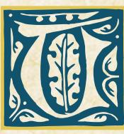

he playbooks available in Root

he playbooks available in Root: The RPG core book are not the only vagabonds who wander the Woodland in search of treasure, adventure, and justice. There are other outlaws and

oddballs traveling from clearing to clearing, seeking work and building reputations for their deeds and misdeeds alike.

The ten additional playbooks featured here expand the original list to encompass those additional types. Each of these new vagabonds can easily integrate into an existing band...or compose a new band in total, without any from the original set. For more on the individual parts of the playbooks, make sure to check out Chapter 4: Making Vagabonds in the Root: Ghe RPG core book starting on page 41.

The list of playbooks included in this chapter is:

- Champion A heroic, capable vagabond dedicated to the cause of the Woodland War and the denizens caught up in the conflict.
- Chronicler An erudite, focused vagabond, whose interest in history and learning can work Woodland wonders.
- Envoy A diplomatic, professional vagabond, acting often as an agent for the greater powers and factions of the Woodland.
- Exile A dangerous, banished vagabond, forced to find a new direction after their enemies drove them out of their faction.
- **Nerectic** A fervent, disruptive vagabond whose belief in a cause makes others uneasy and wary of their intentions.
- Pirace A water-based, mischievous vagabond whose true home and true love is the river and the lakes of the Woodland.
- **Prince** A second-generation, skillful vagabond, determined to follow the paths laid down by their vagabond parents.
- Raconteur A flashy, romantic vagabond, interested in singing songs and spinning tales across the Woodland.
- Raider A battle-hardened, intimidating vagabond, interested in taking treasures from those who can't hold on to what's theirs.
- Secker An adventurous, daring vagabond, interested in exploring the secrets and mysteries of the ruins of the Woodland.

While any of these new playbooks can be included in a game of **Root**: **Gbe RPG**, they are probably best suited to experienced players. Many of them invoke additional mechanics and systems, and all of them push the game in a new direction. It might be best for a new player to start with one of the original nine playbooks first!

{93}------------------------------------------------

# The Champion

*You are a would-be hero and legend, a defender of the innocent and a standard-bearer of lost causes. Yours is the heroic narrative, even if you sometimes oversimplify things.*

#### Species

• fox, mouse, rabbit, bird, dog, other

#### Demeanor

• gruff, thoughtful, dramatic, kind

#### Details

- he, she, they, shifting
- stout, focused, disheveled, vain
- ornate belt, heirloom ring, poetry book, token of chivalry

#### Charm +1

Cunning -1

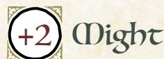

Add +1 to a stat of your choice, to a max of +2

### Weapon Skills

Choose one weapon skill to start

- Cleave
- Quick Shot
- Storm a Group
- Trick Shot

### Roguish Feats

You start with this one: Sleight of Hand

Equipment Starting Value 11

#### Your Nature choose one

- Advocate: Clear your exhaustion track when you confront a powerful NPC about their mistreatment of the powerless or weak.
- Exemplar: Clear your exhaustion track when you publicly take on a challenging task on behalf of the Just and those they represent.

#### Your Drives choose two

- Justice: Advance when you achieve justice for someone wronged by a powerful, wealthy, or high-status individual.
- Principles: Advance when you express or embody your moral principles at great cost to yourself or your allies.
- Loyalty: You're loyal to someone; name them. Advance when you obey their order at a great cost to yourself.
- Ambition: Advance when you increase your reputation with any faction.

#### Your Connections

See Root: The RPG page 51 for mechanical effects.

- Protector: \_\_\_\_\_\_\_\_\_\_\_\_ is a true hero, someone whom even I look up to for their moral clarity. What did they do that convinced me of their righteousness?
- Family: \_\_\_\_\_\_\_\_\_\_\_\_ and I are more-or-less siblings after years spent in each other's company. Why have we struggled to get along in the past?

{94}------------------------------------------------

#### Champion Moves

you get **take up the call**, then choose one more

 Take Up the Call

Name two non-denizen factions: declare one to be the best hope for the Woodland (*The Just*) and the other evil tyrants (*The Enemy*). Take +1 ongoing to protect members of the Just or harm agents of the Enemy. You may switch which factions you consider to be the Just or the Enemy at the end of any session by clearing all prestige from the faction which no longer inspires you; your reputation with both factions remains the same.

|                                           | session by clearing all prestige from the faction which no longer inspires you; your reputation with both factions remains the same.                                                                                                                                                                                                                                                                                                                                                       |
|-------------------------------------------|-----------------------------------------------------------------------------------------------------------------------------------------------------------------------------------------------------------------------------------------------------------------------------------------------------------------------------------------------------------------------------------------------------------------------------------------------------------------------------------------------|
|                                           | The Just: The Enemy:                                                                                                                                                                                                                                                                                                                                                                                                                                                                          |
|                                           | Choose a role you often fill as a champion:                                                                                                                                                                                                                                                                                                                                                                                                                                                   |
| " " "                               | Luminary: When you persuade an NPC to fight for the Just or resist the charms of the Enemy, roll with Might instead of Charm. Paladin: When you inflict harm on the Enemy, inflict 1 additional harm; when you suffer harm protecting the Just, suffer 1 fewer harm. Emissary: When you mark prestige with the Just, mark an additional prestige. When you mark notoriety with the Enemy, mark an additional notoriety.                                                        |
| " Of the People                        | When your band travels along a path at a relaxing pace, roll with +1 instead of -1. On a hit, you encounter friendly faces on the journey who offer food and assistance; your band marks half as much depletion as normal. On a 7-9, the characters you meet are in a bit of trouble; they expect you to lend a hand. On a miss, a dangerous foe committed to ending your "righteousness" catches you (and your friends) unaware and unprepared.                               |
| "                                         | Skill Against Skill Alone When you grapple with an enemy and roll a 12+, you may take their blows to incapacitate them; suffer their full harm to fill their exhaustion or injury track.                                                                                                                                                                                                                                                                                                |
| " A Just Cause were led to believe. | When you threaten an authority on behalf of the downtrodden, mark notoriety with the authority's faction and roll with Might. On a hit, the force of your defiance unnerves them; they must make a concession right now to your cause or openly attack you. On a 10+, your words are inspirational; you and your allies take a +1 ongoing against them and their allies if they attack you. On a miss, the authority reveals that the cause you champion is not as just as you |
| " Raw Force to roll with Might.     | Take one of the following weapon skills: Disarm or Parry (it does not count against your limit). When you use either weapon skill, you can mark exhaustion                                                                                                                                                                                                                                                                                                                                 |

{95}------------------------------------------------

#### Background Questions

| Where do you call home?                                                                                      | Whom have you left behind?                                                              |
|--------------------------------------------------------------------------------------------------------------|-----------------------------------------------------------------------------------------|
| " clearing                                                                                                | " my spouse                                                                          |
| " the forest                                                                                              | " my mentor                                                                          |
| " a place far from here                                                                                   | " my best friend                                                                     |
| Why are you a vagabond?                                                                                      | " my ward                                                                            |
|                                                                                                              | " my commander                                                                       |
| " I seek justice for all the Woodland " I wish to become a legend across many clearings          | Which faction have you served the most? (mark two prestige for appropriate group) |
| " My enemies will burn any home I try to make " I have sworn to redeem a lost or failed cause | With which faction have you earned a special enmity? (mark one notoriety             |
| " I am running from a terrible secret                                                                     | for appropriate group)                                                                  |

Driven, noble, righteous, fervent. The Champion is a would-be hero who has chosen a side in the Woodland War, an eager representative of one of the factions…and a scourge and enemy of another.

As the Champion, you are a capable warrior and dangerous opponent, but you're also a self-proclaimed voice for the ordinary denizens of the Woodland. You're intensely interested in ensuring those who rule the Woodland do right by even the smallest mouse—which means taking a side among the real contenders in the battle for Woodland rule.

Those you consider the Just are your idea of "the good guys," your idea of the faction that can actually deliver a better, united, righteous future for the whole Woodland. The Just can't be the denizens—they aren't a united faction like the Woodland Alliance; they're just the individual dwellers of the myriad clearings, leading independent lives. Remember that you don't want the Woodland to devolve into a bunch of smaller fiefdoms. Someone has to rule the Woodland, right? You know which faction can be trusted to govern justly…and which faction must be opposed with every ounce of strength you have to give to the cause.

That said, the Enemy doesn't always need to stand as a symbol of all that is terrible. You may oppose them because you find some part of their philosophy to be dangerous, or because a particular leader within the faction can't be trusted. Be aware, though, that the more intense your loathing of the Enemy, the less likely you can change your opposition to them in the future. It's much easier to decide that a disorganized faction has become trustworthy than to accept that the monsters you've fought your whole life are redeemable.

{96}------------------------------------------------

Provided your band can make use of your cause, you'll likely find they are willing to support your demands for justice. But if you don't bother convincing your band that the Just are truly worth supporting—and the Enemy is worth opposing—you may find your vagabond friends are willing to let you fight the good fight alone. You can always change your beliefs—if you find yourself out of sync with your band, maybe it's time to reevaluate whose side you're on! As you learn more about the Woodland, it's pretty likely you'll develop a more nuanced image of justice, after all.

Your two natures, "Advocate" and "Exemplar," both point to the work you need to do to build your legacy. The powerful NPC you confront about their mistreatment of the weak can be from any faction, including the one you've labeled as the Just. After all, they above all others should act justly! And if you take on a task for the Just in private, it's totally fine if you're the one that makes it public; the denizens deserve to know of the good work you do.

#### Notes on The Champion Moves

For *Take Up the Call*, pick the two factions from the list of factions included in your campaign. You can't name the Marquisate if the Marquise and her forces aren't really present in the Woodland. If you decide to change which faction you consider the Just or the Enemy, you can also change the role you fill to match your new understanding of your work as a champion. When you make the switch, remember that you always keep whatever notoriety you've accrued with the Enemy.

The +1 ongoing for protecting members of the Just or harming agents of the Enemy only covers moves directly in line with those goals. Take the +1 when you *persuade* an authority to release members of the Just from prison, but you can't take the +1 to *trick someone* into giving you access to a location that might be useful to the cause.

For *Of the People*, you completely replace the –1 you would normally roll when you *travel along a path at a relaxing pace* with a +1. Everyone still clears 3-exhaustion, and you still have to mark a total of 2-depletion. If you meet friendly faces on the path using this move, you can expect them to have already heard of your exploits as a champion of justice.

For *Skill Against Skill Alone*, you have to suffer the full harm they would normally inflict before you can fill their exhaustion or injury track. If you're facing a bear that normally inflicts 5-injury, you've got to mark it all—and still be standing—in order to break the bear's neck with your paws and fill its injury track.

For *A Just Cause*, name what you want them to do to address the problems of the downtrodden, and say what you will do if they don't act. The authority doesn't have to give in completely if they make a concession, but their offering must be in line with your threat. If they attack you, the +1 ongoing lasts for the rest of the scene.

For *Raw Force*, remember that your weapons must also have the weapon skill tag for *disarm* or *parry* to make use of the associated weapon move.

{97}------------------------------------------------

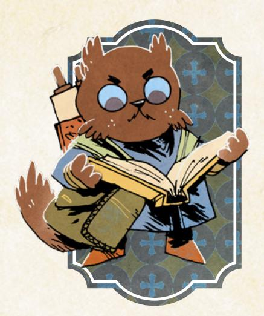

# The Chronicler

*You are a sage who honors history and the written word, keeper of lost, banned, or forbidden texts of truths the great Woodland powers would rather be forgotten.*

#### Species

• fox, mouse, rabbit, bird, otter, other

#### Demeanor

• clumsy, endearing, sly, thoughtful

#### Details

- he, she, they, shifting
- fastidious, rumpled, proper, colorful
- old scrolls, letter of introduction, small glasses, vest with secret pockets

#### Charm -1

Add +1 to a stat of your choice, to a max of +2

#### Weapon Skills

Choose one weapon skill to start

- Confuse Senses
- Improvise
- Parry
- Trick Shot

#### Roguish Feats

You start with these: Counterfeit, Disable Device, Pickpocket

Equipment Starting Value 8

#### Your Nature choose one

- Observer: Clear your exhaustion track when you enter a dangerous situation to try to witness a significant or secret event or meet an important individual.
- Activist: Clear your exhaustion track when you publicly confront the leadership of a clearing about changes you think are vital to the community's success.

#### Your Drives choose two

- Justice: Advance when you achieve justice for someone wronged by a powerful, wealthy, or high-status individual.
- Discovery: Advance when you encounter a new wonder or ruin in the forests.
- Ambition: Advance when you increase your reputation with any faction.
- Clean Paws: Advance when you accomplish an illicit, criminal goal while maintaining a believable veneer of innocence.

#### Your Connections

See Root: The RPG page 51 for mechanical effects.

- Partner: \_\_\_\_\_\_\_\_\_ and I exposed a dark secret of a faction, leading to a meaningful political change. What was it? And which member of that faction hates us for it?
- Peer: I think \_\_\_\_\_\_\_\_\_ sees the truth of the world, and I value their perspective deeply. What kinds of information do they see that I often overlook?

{98}------------------------------------------------

#### Chronicler Moves

you get **the worth of a book**, then choose two more

#### The Worth of a Book

When you **study your tomes and scrolls to discover old techniques or methods**  to solve an intractable problem—curing a deadly disease, ending a drought, legally unseating a leader, etc.—decide what you want to accomplish and tell the GM. The GM will give you between 1 to 4 conditions you must fulfill to discover a path forward, including time taken, additional information needed, mentors or translators needed, facilities/tools needed, or the limits of your solution. When you fulfill the conditions, you gain whatever knowledge you were seeking—it's up to you to put it to use.

#### An Eye for the Real Story

When you *read a tense situation*, mark exhaustion—even on a miss—to spot someone who knows more than they're letting on. Take a +1 ongoing to convince them to share their secrets with you when you get them in private.

#### Search the Records

When you **examine the documents, records, or assorted notes of an important NPC (your call)**, roll with Cunning. On a hit, you discover evidence of their secrets; the GM will tell you who would pay for the information you've uncovered. On a 10+, you also take a 12+ instead of rolling the next time you try to *figure them out*. On a miss, your search yields terrible news—someone is acting against you or your interests in an unexpected arena.

#### Loremaster

When you **consult your knowledge in order to understand a political conflict**, roll with Cunning. On a hit, the GM tells you what information you remember that completes your understanding of the messy situation. On a 10+, you can ask a followup question; the GM will answer honestly. On a miss, something about the situation doesn't fit the history—the GM will tell you what has radically shifted.

#### Good Advice

When you **offer an NPC advice about a sticky situation**, offer them the best advice you've got and roll with Cunning. On a hit, they see the wisdom of your suggestion; they have to mark exhaustion or incorporate your advice into their plans. On a 7-9, you let something about your own plans or allegiances slip as you try to help them out. On a miss, the advice angers or offends them; the GM will tell you what local custom you've overstepped with your meddling.

#### Dedicated Scholar

Take an extra box of exhaustion. When you **acquire a new tome or scroll documenting the history of the Woodland**, clear your exhaustion track.

{99}------------------------------------------------

#### Background Questions

| Whom have you left behind?                                                                            |
|-------------------------------------------------------------------------------------------------------|
| " my parents                                                                                       |
| " an older sibling                                                                                 |
| " an old mentor                                                                                    |
| " a lover or friend " a formal school                                                        |
| Which faction have you served the most? (mark two prestige for                                     |
| appropriate group)                                                                                    |
| With which faction have you earned a special enmity? (mark one notoriety for appropriate group) |
|                                                                                                       |

Curious, perceptive, clever, demanding. The Chronicler is a historian of the Woodland, a scribe and scholar dedicated to uncovering and recording the secrets others might prefer to keep hidden.

As the Chronicler, you have a unique relationship with information. You're good at getting it—searching through documents, reading the room, finding those with the real story—and you know how to put it to use to get things done. Other vagabonds might sharpen their blade before a fight; you know that no strike of the sword is as mighty as a properly placed stroke of the pen.

But your inquisitive demeanor is likely to get you into trouble—denizens with secrets don't want their business spread around. You may need a fellow vagabond with a sword to keep that pen in good working order. If you're ready to learn the truth (and spread it to the Woodland), make sure to have a few friends on hand to help you keep your head!

Your two natures, "Observer" and "Activist," reflect your desire both to get the Woodland's secrets and to use them to make life better for denizens and their communities. "Observer" puts you in harm's way, but it doesn't say you have to go alone! "Activist," on the other hand, demands you make a public pronouncement about a "vital" change; you have to believe in the value of the change, although fulfilling your nature doesn't require you to present a dissertation on the subject.

Your drives point you towards all sorts of goals you can latch onto as you dig into the Woodland's history. You might take on the causes of the local community, dedicate yourself to exploring the forests, or even champion one of the factions in the Woodland War!

{100}------------------------------------------------

#### Notes on The Chronicler (Doves

For The Worth of a Book, you are a bearer of real knowledge, a vagabond who can end a plague, reshape a clearing's infrastructure, or even reform failed institutions with knowledge that can pave a path to solve otherwise intractable problems.

- "Time taken" means the GM can tell you how long it will take to study your materials; you need a safe space to consult your tomes and scrolls for all that time, and new events may occur while you're busy.
- "Information needed," "mentors or translators needed," and "facilities/ tools needed" all center around additional resources or aid of a specialized nature that you need to accomplish your goal. Obtain those resources or aid to fulfill the condition. The GM will tell you what specifically you need—whether it's a general category ("a translator of Ancient Ka-Kaw") or a specific thing or person you've heard of ("the old sage Philias Wren").
- "The limits of your solution" means the GM can tell you in what way you can't quite manage the full extent of what you hope to accomplish; if you want to unseat an important member of the Marquisate, the GM might tell you that the limit is only removing their authority over this clearing, not removing them from power entirely. Accept that limit, and the condition is satisfied.

Once you satisfy the conditions, you earn the knowledge—a cure for the plague, a new plan for aqueducts, a legal case to establish a trade guild—but you still have to put that knowledge into practice. The cure still has to be made and distributed; the aqueducts still have to be constructed; the legal case still has to sit before a court.

For An Eye for the Real Story, you can decide to mark the exhaustion before, during, or after you read a tense situation. The GM will tell you who you discover when you mark the exhaustion; it's up to you to get them alone to get the bonus.

For **Search the Records**, you must make use of the information granting you the 12+ to *figure someone out* in a reasonable time period; if you leave the clearing and come back, the situation may have changed.

For Loremaster, you need to be explicit when triggering the move; consulting your knowledge might just look like you are thinking hard. Your knowledge of Woodland history is broad! Nearly any political conflict is a fair target of this move, since even the newest turmoil has roots in old disputes.

For Good Advice, you don't have to wait for NPCs to ask for advice—you're offering it! That said, the NPC must be someone who would consider your thoughts on the sticky situation in question. Most denizens are willing to listen to a vagabond with a good idea, but your bitter rival might shut you down before you can get a word in!

For **Dedicated Scholar**, acquiring a new tome or scroll filled with Woodland history effectively becomes a second nature. Whatever you get your hands on has to be a work of some significance to trigger the move!

{101}------------------------------------------------

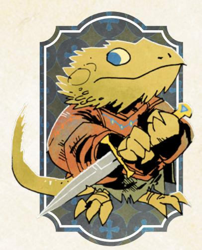

# The Exile

*You were once a prominent member of a powerful faction, but now you are exiled from it, and defined by what you do in relation to the group you once called your own.*

#### Species

• fox, mouse, rabbit, bird, lizard, other

#### Demeanor

• bitter, cautious, clever, vain

#### Details

- he, she, they, shifting
- shabby, flashy, formal, inconspicuous
- precious heirloom, mark of privilege, ragged cloak, old book

Cunning -1

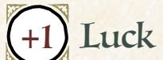

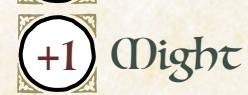

Add +1 to a stat of your choice, to a max of +2

#### Weapon Skills

Choose one weapon skill to start

- Cleave
- Quick Shot
- Storm a Group
- Vicious Strike

#### Roguish Feats You start with this one:

Sneak

Equipment Starting Value 11

|  | Your Nature choose one |  |  |
|--|------------------------|--|--|
|--|------------------------|--|--|

- Schemer: Clear your exhaustion track when you promise valuable resources to a dangerous Woodland figure to secure their aid.
- Avenger: Clear your exhaustion track when you openly attack those who have wronged you or your sworn vassals and wards.

#### Your Drives choose two

- Loyalty: You're loyal to someone; name them. Advance when you obey their order at a great cost to yourself.
- Revenge: Name your foe. Advance when you cause significant harm to them or their interests.
- Chaos: Advance when you topple a tyrannical or dangerously overbearing figure or order.
- Infamy: Advance when you decrease your reputation with any faction.

#### Your Connections

See Root: The RPG page 51 for mechanical effects.

- Protector: I see greatness in \_\_\_\_\_\_\_\_\_ that I wish to nurture...and perhaps turn to my own purposes. What is it about them that inspires me so?
- Family: \_\_\_\_\_\_\_\_\_ sheltered me in the earliest days of my exile when I was at my most vulnerable. Why did they offer me such kindness in my moment of need?

{102}------------------------------------------------

#### Exile Moves

you get **known by all**, then choose two more

| " | Known by All |  |
|---|--------------|--|
|---|--------------|--|

When you **first encounter an important NPC from your former faction**, you may declare them to be an old ally—choose and mark one unmarked option from the list below instead of *meeting someone important*—and roll.

 They shared your political networks; roll with +1.

 You worked closely with them for years; roll with +2.

 They were a loyal friend or dutiful servitor; roll with +3.

On a hit, their loyalty has not diminished; they offer whatever aid they can, even risking their own reputation and safety. On a 7-9, they can only assist you if they can pretend you forced their hand and cover their tracks when you leave; mark as much notoriety with their faction as you added to your roll. On a miss, your attempt to reconnect only reveals your desperation; mark as much notoriety as you added to your roll and know that those who hunt you will be here soon. When you have **marked all three options,** clear them all; your agents will tell you of an opportunity to redeem yourself in the eyes of your faction now that they know you are still active.

#### Above It All

When you *trick an NPC* into granting you access or information by pretending to be a high-ranking faction leader, roll with Charm instead of Cunning.

#### I Bring You...

When you **spend time talking to the denizens of a clearing**, mark exhaustion to learn what vital resource or fugitive the powers that be seek. When you deliver a vital resource or prisoner to a faction, you may *ask for a favor* from the faction as if you rolled a 12+ in addition to marking prestige. If your Reputation with that faction is already +2 or greater, you may instead *sway the NPC* whose cause you most directly benefited with your contribution as if you rolled a 12+.

#### Greatest of the Age

When you *engage an enemy in melee*, you take all four options and one for double effect when you roll a 12+.

#### Born to Be a King

Take +1 Charm (max+3).

#### Fancy Paper

You gain the roguish feat *Counterfeit* (it does not count against your limit). When you *attempt a roguish feat* to produce counterfeit documents using your intimate knowledge of your home faction's politics and procedures, mark notoriety with that faction to make the move as if you had rolled a 12+.

{103}------------------------------------------------

### Background Questions

| Where do you call home?                       | Why are you a vagabond?                |  |
|-----------------------------------------------|----------------------------------------|--|
| " clearing                                 | " I seek a new home in the Woodland |  |
| " the forest                               | " I want to reclaim my prestige     |  |
| " a place far from here                    | " I wish to make amends for my sins |  |
| What caused your fall?                        | " I seek revenge against my enemies |  |
| " I led a failed coup or rebellion         | Which faction exiled you? (set your    |  |
| " I committed a terrible crime             | reputation with them to -2)            |  |
| " I was betrayed by my closest allies      |                                        |  |
| " I fell prey to my rival's schemes        | Which faction now seeks your loyalty   |  |
| Why were you exiled (not killed)?             | or allegiance? (set your reputation    |  |
| " a complex legal system protected my life | with them to +1)                       |  |
| " the last of my allies saved my life      |                                        |  |
| " my enemies granted me mercy              |                                        |  |
| " I fled before facing judgment            |                                        |  |

Resilient, fallen, persistent, dangerous. The Exile is a former power player of the Woodland, a once important figure who has been consigned to the life of a vagabond upon banishment from their former faction.

As the Exile, you have a unique relationship with one of the factions in the Woodland War; everyone in that faction likely knows you and probably has an opinion about you and your fall. Other vagabonds may be able to slip into a clearing without drawing much attention—you tend to make a scene wherever you go!

*Known by All* lets you decide when (and how often) you meet your former allies. Use it as often as you'd like, but know that traipsing across the Woodland invoking old alliances will make it easier for those who hunt you to find and confront you. Of course, if you want to start a fight with your old enemies, there's no reason to be shy…

Your natures, "Schemer" and "Avenger," speak to the choices you face now that you've been cast out into the Woodland. Will you plot your return to power by forging alliances with former enemies and dangerous outlaws? Or will you focus on destroying those who wronged you and your loyal vassals? Whatever you choose, look for opportunities to dig into the politics of the clearings—you'll find many allies and enemies alike amongst those who seek power in the Woodland. Either way, you don't have to deliver the resources to activate "Schemer"—just promising the resources is enough. Nor do you have to win the fight to activate "Avenger"; all that matters is that you strike openly with blade, bow, or claw.

Your drives similarly point you at powerful people, close allies…and vengeance. Decide early on how to handle your exile, and choose drives that fit your goals.

Chapter 5: New Playbooks 103

{104}------------------------------------------------

If you want to reclaim your position, look to "Loyalty" and "Chaos"; if you want to burn down those who hurt you, "Revenge" and "Infamy" are more likely to suit your plans. You may find yourself in a tough spot if you try to both reclaim your old standing and burn down your old faction at the same time. But remember, you can change your mind about your goal over time if you want—switching drives and natures—even though it can be especially difficult to reverse some of the work you've already undertaken.

#### Notes on The Exile Moves

For *Known by All*, you can only declare an NPC an old ally the first time you meet them; remember that this move completely replaces *meeting someone important* when you use it. Other PCs in your band may still *meet someone important*, but you're declaring that you definitely know this particular figure! If you get a 7–9, you immediately mark the notoriety; the ally starts the ruse right then and there, possibly requiring you to play along as a threatening outcast who is forcing their hand.

The agents who come forward with an opportunity after you've marked all three options don't have to be the same characters you're declaring as old allies. You may have other members of your former faction who want to see you return to power! The GM details those agents and their relationship to you.

For *Above It All*, you don't have to claim to be a member of your former faction. As long as you're *tricking someone* by pretending to be a high-ranking member of an active Woodland faction, you can use the move.

For *I Bring You…*, the information you gather by marking exhaustion is the result of you asking around about the current gossip. If you deliver a vital resource or prisoner to a faction without asking around first, you can still *ask for a favor* as if you rolled a 12+.

For *Greatest of the Age*, you get all the options listed while *engaging an enemy in melee* on a 12+ and one option a second time. If you "inflict serious (+1) harm" or "suffer little (–1) harm" for double effect, then you get a +2-harm or –2-harm modifier to the outcome; if you "shift your range one step" for double effect, then you shift your range twice. Selecting "impress, dismay, or frighten your foe" for double effect indicates that you greatly shake the will and resolve of your opposition, perhaps inflicting additional morale harm or just scaring them off entirely; the GM details the full effect.

For *Fancy Paper*, you are using your knowledge of terminology, style, patterns, insignias and so on—nothing that requires any special equipment to replicate. The GM may still have you mark depletion to pull together the basic supplies like ink, paper, wax, and other accoutrements necessary for the ruse, as with any Counterfeit attempt.

{105}------------------------------------------------

# The Envoy

*You are a professional representative, capable of speaking for other powers while maintaining plausible deniability, fashioned as the ultimate neutral agent and diplomatic mercenary.* 

#### Species

• fox, mouse, rabbit, bird, bat, other

#### Demeanor

• commanding, kind, professional, sleazy

#### Details

- he, she, they, shifting
- bucolic, decadent, elegant, traveled
- fancy boots, token of esteem, rugged scarf, pipe and leaf

#### Charm 0

Add +1 to a stat of your choice, to a max of +2

#### Weapon Skills

Choose one weapon skill to start

- Confuse Senses
- Improvise
- Parry
- Quick Shot

### Roguish Feats

You start with these: Hide, Sneak, Pick Lock

Equipment Starting Value 8

#### Your Nature choose one

- Agent: Clear your exhaustion track when you convince someone influential to allow you to represent their interests.
- Sworn: Clear your exhaustion track when you openly commit to resolve a dangerous conflict on behalf of someone vulnerable.

#### Your Drives choose two

- Loyalty: You're loyal to someone; name them. Advance when you obey their order at a great cost to yourself.
- Greed: Advance when you secure a serious payday or treasure.
- Ambition: Advance when you increase your reputation with any faction.
- Clean Paws: Advance when you accomplish an illicit, criminal goal while maintaining a believable veneer of innocence.

#### Your Connections

See Root: The RPG page 51 for mechanical effects.

- Watcher: \_\_\_\_\_\_\_\_\_\_\_\_ reminds me of a powerful political figure of the Woodland. Whom do they resemble? Why is the resemblance so striking to me?
- Peer: \_\_\_\_\_\_\_\_\_\_\_\_ and I negotiated a truce between two warring parties within a clearing. Why were they so important to closing the deal?

{106}------------------------------------------------

### Envoy Moves

you get **diplomat**, then choose two more

#### Diplomat +0 +1 +2 +3

You are known across the Woodland as an accomplished diplomat; **you have a track (Diplomat) to reflect your professional reputation, starting at a +1**. When you raise your reputation with any faction, raise Diplomat; when you lower your reputation with any faction, lower Diplomat. You cannot lower Diplomat below +0 or raise it above +3.

- Mark exhaustion to use Diplomat when you *ask for a favor* or *meet someone important* for the first time, regardless of the faction of your target.
- When you *persuade* or *figure out* an important NPC while acting on behalf of another—not you or your band—roll with Diplomat instead of Charm.

#### Fancy Meeting You Here

When you **carouse in a popular locale**, roll with Luck. On a hit, you meet a lackey of a powerful faction in the area—the GM will tell you what they do for the faction, and you tell the GM when and how you met them in the past. On a 10+, they get sloppy: they let a secret slip about the faction's plans or offer to introduce you to the faction's leaders on friendly terms. On a miss, someone who is looking for you finds you first.

#### Turncoat

You gain the roguish feats *Blindside* and *Counterfeit* (they do not count against your limit). When you *attempt a roguish feat to Blindside* someone who trusts you, roll with Cunning instead of Finesse.

#### Plots and Schemes

Take +1 Cunning (max+3).

#### Trust in Me

When you **soothe or placate an angry NPC**, roll with Cunning. On a hit, you calm their rage. On a 7-9, choose 1. On a 10+, choose 2:

- They reveal an unexpected vulnerability
- They hesitate in their fury; you create an opportunity
- They take you further into their confidence

On a miss, you can only calm them by redirecting their frustrations.

#### Kiss the Ring

When you **exit a meeting with someone rich or powerful**, say you took a few of their things and roll with Cunning. On a hit, the GM tells you what valuable or interesting item you got. On a 7-9, it will be missed, but not until you are gone; mark notoriety with that faction. On a miss, they're going to notice; mark 2-notoriety with that faction and either run or come up with a good excuse.

{107}------------------------------------------------

### Background Questions

| Where do you call home?                    | Whom have you left behind?            |  |
|--------------------------------------------|---------------------------------------|--|
| " clearing                              | " my commander                     |  |
| " the forest                            | " my family                        |  |
| " a place far from here                 | " my loved one                     |  |
|                                            | " my master                        |  |
| Why are you a vagabond?                    | " my mentor                        |  |
| " I am called to serve a noble cause    |                                       |  |
| " I want to make a name for myself with | Which faction have you served         |  |
| every faction                              | the most? (mark two prestige for      |  |
| " I hold no loyalty save to the highest | appropriate group)                    |  |
| bidder                                     |                                       |  |
| " I have many conflicting loyalties     | With which faction have you earned    |  |
| " I seek the truth behind an ally's     | a special enmity? (mark one notoriety |  |
| disappearance                              | for appropriate group)                |  |

Charming, subtle, political, respected. The Envoy is the trusted neutral agent of the Woodland, a political operative and mercenary whose greatest asset is the plausible deniability they offer to the powers that be.

As the Envoy, you have a light touch for a vagabond—one of the few outcasts who is welcome nearly anywhere you go. Every faction has a use for you! They may wish to employ you to resolve some difficult situation, to deliver a message or threat, or even just to help them understand how best to proceed in a conflict with unfamiliar foes. You are useful to their plans, and they will gladly offer you prestige and coin if you're willing to work on their behalf.

But you are still a vagabond. The factions of the Woodland find you valuable precisely because you are expendable, and many won't hesitate to turn on you if they feel you've outstayed your welcome. Don't be afraid to use your moves— *Turncoat*, *Trust in Me*, *Kiss the Ring*—to turn on them before they cast you aside, and never forget to use your position and influence to secure the best deal you can from the powers that be. Just be careful not to acquire too much notoriety, lest your status as a diplomat be called into question!

Your natures, "Agent" and "Sworn," both involve you working on someone else's behalf. "Agent" points you at powerful, influential denizens, those who need a vagabond like you to carry messages and negotiate deals. "Sworn" puts the focus on the vulnerable and downtrodden, setting you up as a mediator for those who have no other advocates. The former is perfect if you want to endear yourself to the powers that be; choose the latter if you prefer to instead be a hero to the masses.

{108}------------------------------------------------

You will often be called upon by the band to negotiate on their behalf too, so lean into those connections and your drives as you act as the negotiator for the other PCs. Remember to *plead* with other vagabonds to go along with the deals you've struck; sometimes it takes just a little push to get everyone on the same page.

#### Notes on The Envoy Moves

You can use *Diplomat* instead of the normal stat when you meet the conditions listed, effectively leveraging your professional reputation over your personal reputation or natural attributes. You are "acting on behalf of another" anytime you are working for an NPC instead of yourself, even if you expect to benefit from their success.

For *Fancy Meeting You Here*, you need time to carouse and indulge long enough to meet someone of note. You can suggest a faction, seeking out one particular group, but ultimately the lackey you encounter is detailed by the GM. On a hit, you establish the relationship, but it's still up to you to *figure out*, *persuade*, or *trick* your new mark.

For *Turncoat*, the denizen who trusts you must believe you are on their side long enough to turn their back or reveal a weakness in their defenses. It's unlikely anyone you just met trusts you, unless you've *tricked* them into thinking you're someone they already know or someone loyal to the same cause or faction.

For *Trust in Me*, the peace you grant an NPC on a hit lasts only for a scene or two. As soon as the situation flares up again, the NPC will return to their rage. No matter how long the reprieve, however, the other benefits you gain are generally more permanent. The vulnerability they reveal remains true beyond their anger, and the trust they place in you when they take you further into their confidence remains until you betray it. The opportunity you create when they hesitate is more transient, based on that moment, but it's always possible a job opportunity might remain on the table past that scene.

For *Kiss the Ring*, you establish that you swiped a few things after the scene in which you met with someone wealthy or powerful; you don't have to decide in advance that you're stealing. If you score a full hit, you get away clean, but a weak hit means someone not only noticed the theft, but also directly associated the larceny with you. On a miss, you may have swiped something valuable the GM will tell you—but whatever you took matters enough that the folks you stole it from notice right away, even if it's effectively worthless. Mark the notoriety regardless of how you react to their discovery of your thieving…and make your decision to run or lie quickly!

{109}------------------------------------------------

## The Heretic

*You are a fervent believer in a cause or ideology that most Woodland denizens and factions find distasteful and unacceptable, even if your beliefs are genuinely for the greater good of the denizens.*

#### Species

• fox, mouse, rabbit, bird, other

#### Demeanor

• passionate, naive, eccentric, proud

#### Details

- he, she, they, shifting
- unkempt, young, cleareyed, lithe
- colorful robes, facial tattoo, token of belief, unique jewelry

#### Charm +2

Cunning 0

Add +1 to a stat of your choice, to a max of +2

#### Weapon Skills

Choose one weapon skill to start

- Cleave
- Disarm
- Quick Shot
- Storm a Group

#### Roguish Feats

You start with these: Counterfeit, Sleight of Hand

Equipment Starting Value 9

#### Your Nature choose one

- Believer: Clear your exhaustion track when you publicly call out a symbol or authority dedicated to beliefs opposed to yours.
- Healer: Clear your exhaustion track when you attempt to start a dialogue between two foes from different factions.

#### Your Drives choose two

- Principles: Advance when you express or embody your moral principles at great cost to yourself or your allies.
- Protection: Name your ward. Advance when you protect them from significant danger, or when time passes and your ward is safe.
- Freedom: Advance when you free a group of denizens from oppression.
- Chaos: Advance when you topple a tyrannical or dangerously overbearing figure or order.

### Your Connections

See Root: The RPG page 51 for mechanical effects.

- Protector: \_\_\_\_\_\_\_\_\_\_\_\_ has come to share my beliefs; I must stand with them, no matter the cost. What happened to us that convinced them of the wisdom of my cause?
- Watcher: \_\_\_\_\_\_\_\_\_\_\_\_ was once hurt greatly by someone who shared my cause. Why do I think I might still win them over? What have I already tried to do to earn their trust?

{110}------------------------------------------------

#### Heretic Moves

you get **friends indeed** & **hear me**, then choose one more

#### Friends Indeed

When you **first seek out those who share your cause** after arriving in a clearing, roll with Charm. On a hit, you find one or two; they provide what they can in service to your collective work. On a 7-9, they also tell you about a threat to your shared ideology that has arisen in the clearing. On a miss, you are caught by someone in the clearing who openly despises your kind.

#### Hear Me!

When you **give an inspiring speech to a persuadable crowd** in the service of your cause, mark exhaustion and roll with Charm. On a hit, you sway them; pick 2. On a 7-9, you must put yourself at the crowd's mercy and lead them directly for them to follow through.

- They tear down an opposing symbol
- They overthrow a vulnerable tyrant
- They destroy the trappings of tradition
- They elevate someone overlooked
- They deliver justice to the wicked

On a miss, the crowd is moved to action but ignores your guidance, leading to terrible consequences.

#### Destroy Something Beautiful

When you *wreck* **a false idol or symbol of oppression** alongside your allies, roll with Charm instead of Might; you and all your allies clear an exhaustion, even on a miss.

#### Devilish Charm

When you *trick an NPC* you've previously aided or impressed, mark exhaustion to make the move as if you had rolled a 12+ instead of rolling.

#### Center of the Universe

Take +1 Charm (max +3).

#### You Shall Not Pass

When you plant yourself in the way of your enemies, roll with Charm. On a hit, your foes cannot get past you until they take you down—brace yourself. On a 10+ choose 1. On a 7-9, choose 2:

- You suffer +1 harm from all your enemies' attacks
- A single enemy (GM's choice) slips past you
- You cannot retreat from your position

On a miss, your enemies find or create a new way past you that makes your situation far worse.

{111}------------------------------------------------

### Background Questions

| Where do you call home?                                                                                                                                                                 |                                                                                                                                                                                                                                                                                               |  |  |  |  |
|-----------------------------------------------------------------------------------------------------------------------------------------------------------------------------------------|-----------------------------------------------------------------------------------------------------------------------------------------------------------------------------------------------------------------------------------------------------------------------------------------------|--|--|--|--|
| " clearing " the forest                                                                                                                                                        | " a place far from here                                                                                                                                                                                                                                                                    |  |  |  |  |
| What are the fundamental tenets of your cause? (Pick 2): " To overturn a tradition " To exalt the worthy " To unseat the corrupt " To uplift the downtrodden | Whom have you left behind? " my devotee " my family " " my guru my secret love Which faction is known to hate those who share your cause? (set your Reputation with them to -1) Which faction is known to harbor those who share your cause? (set your |  |  |  |  |
| " To destroy a falsehood Why are you a vagabond? " I must make amends for my past                                                                                           |                                                                                                                                                                                                                                                                                               |  |  |  |  |
| " I want to bring my truth to all " I seek still greater understanding " I'm being hunted by the powerful                                                                | Reputation with them to +1)                                                                                                                                                                                                                                                                   |  |  |  |  |

Abrasive, outspoken, committed, divergent. The Heretic is a vagabond who has come to adhere to a cause or ideology that has no true home in any clearing or faction, a believer who refuses to compromise on what truly matters.

As the Heretic, you have a belief system that drives you to action, an internal motivation that pushes you to take risks in order to make the world a better place. You don't have to subscribe to a particularly complex religious or cultural belief system, but you do need to pick at least two fundamental tenets and be clear about how and why they matter to you. Work with the GM to make sure it's understood what other denizens who subscribe to this ideology think as well.

Make sure your band knows what you believe! They will have to live with the consequences of your beliefs nearly as often as you do; you don't want them to be surprised by your ideology. You may be driven by your cause, but as long as you are a PC, you must have a place in the band as well. Find ways through your connections, drives, and other relationships to balance your beliefs against your membership in the band.

Your natures, "Believer" and "Healer," are deeply contrasting. "Believer" focuses on your enacting the tenets of your cause in the world, calling out authorities who hold opposing beliefs—such confrontations almost always lead to further conflicts. "Healer," in contrast, focuses on resolving conflicts between foes from different factions, relying less on your ideology and more on the general idea that you see the world differently from the rest of the Woodland; you're more open to new ways of resolving old fights, and starting a productive conversation between those foes will activate the nature.

{112}------------------------------------------------

Your drives can help you direct yourself towards your beliefs—several of them line up with the two fundamental tenets of your cause, and picking the ones that match perfectly is a great way to ensure that you are rewarded for adhering to your belief system.

#### Notes on The Heretic Moves

For *Friends Indeed*, whatever denizens you find are true believers like you, but they may be keeping their allegiance to your cause quiet to avoid trouble. Few of them will be vagabonds whose outcast status insulates them from the consequences of being outspoken, and just as few will be members of other factions who must keep their beliefs well hidden to remain in their positions. The sympathetic ordinary denizens you find will often know better than to flaunt their odd beliefs.

For *Hear Me*, the crowd must be persuadable! In other words, you must have a reasonable chance at moving them to action. You can't use this move to turn the Marquisate army against its leaders unless you have some way of making that army susceptible to your words and your cause. If you must put yourself at the crowd's mercy and lead them, you must join them in the work you've called them to do and expose yourself as a main leader of the movement.

For *Destroy Something Beautiful*, you need at least one other accomplice for this move to trigger. You can't *wreck something* by yourself using this move.

For *Devilish Charm*, you're working the long game when you *trick someone* you helped or impressed. You've got to have earned at least a bit of their trust in a previous scene or encounter to take advantage of it later!

For *You Shall Not Pass*, you've got to have a reasonable chance of holding off your enemies with your position, like on a bridge or at some other chokepoint like a doorway or a hallway. It doesn't have to be a perfect block to their progress, but you can't stop them in a big open field! If you choose to suffer additional harm, every attack against you inflicts additional harm until you abandon your position; if you choose that you can't retreat, it means your avenue of escape is cut off…and your only options are victory or defeat.

{113}------------------------------------------------

# The Pirate

*You are a rogue boat captain, at home on the waters of the Woodland's rivers, lakes, or bays, free from the sway of land-bound life and more than willing to do whatever it takes to maintain that freedom.* 

#### Species

• fox, mouse, rabbit, bird, rat, other

#### Demeanor

• honest, flamboyant, stoic, strange

#### Details

- he, she, they, shifting
- branded, fancy, grizzled, attractive
- flashy hat, lucky trinket, flask of rum, lodestone and compass

#### Charm +1

Cunning 0

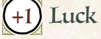

Add +1 to a stat of your choice, to a max of +2

#### Weapon Skills

Choose one weapon skill to start

- Parry
- Storm a Group
- Trick Shot
- Vicious Strike

#### Roguish Feats

You start with these: Acrobatics, Blinside, Pick Lock

Equipment Starting Value 8

#### Your Nature choose one

- Rogue: Clear your exhaustion track when you attempt to doublecross, triplecross, or betray a powerful or dangerous NPC.
- Merchant: Clear your exhaustion track when you carry valuable goods or treasure past danger, difficulty, or blockade.

#### Your Drives choose two

- Freedom: Advance when you free a group of denizens from oppression.
- Revenge: Name your foe. Advance when you cause significant harm to them or their interests.
- Crime: Advance when you illicitly score a significant prize or pull off an illegal caper against impressive odds.
- Infamy: Advance when you decrease your reputation with any faction.

### Your Connections

See Root: The RPG page 51 for mechanical effects.

- Partner: \_\_\_\_\_\_\_\_\_\_ and I seized valuable cargo from a faction together. Who did we rob? Why?
- Family: \_\_\_\_\_\_\_\_\_\_ had a good relationship with my former captain. How have they supported me in taking on the role as my own?

{114}------------------------------------------------

#### Pirate Moves

you get **small ship** & **sail on**, then choose one more

| " | Small Ship |
|---|------------|
|---|------------|

By default, your ship has a wear track with four boxes. Mark wear when it suffers serious damage or when a move calls for it. When your ship's wear track is filled, it is dead in the water and must be repaired at port. If you must mark wear on your ship but its whole track is full, your ship is lost. If you ever lose the ship the GM may present you with an opportunity to get a new one.

| Your Ship's Name: Wear                                                                                                                                                                                                                                                                                                                                                                                                |                               |
|---------------------------------------------------------------------------------------------------------------------------------------------------------------------------------------------------------------------------------------------------------------------------------------------------------------------------------------------------------------------------------------------------------------------------|-------------------------------|
| Blessings (choose 2):                                                                                                                                                                                                                                                                                                                                                                                                     |                               |
| " stocked: your ship gains a 2-box depletion track of cargo and gear " nimble: take +1 ongoing to tricking NPCs when relying on your ship's speed " renowned: take +1 to Reputation with a chosen faction while on your ship " swift: once per session, mark wear to outrun any pursuer on the water                                                                                                 |                               |
| Flaws (choose 2):                                                                                                                                                                                                                                                                                                                                                                                                         |                               |
| " dreaded: take -1 to Reputation with a chosen faction while on your ship " rickety: your ship has one fewer box of wear than usual " clumsy: take -1 ongoing to trusting fate when piloting your ship carefully " stolen: someone dangerous is pursuing you to recover their property                                                                                                               |                               |
| " Sail On When you travel from clearing to clearing by ship, mark wear on the ship and roll with Luck. On a hit, you reach the next port; the GM will tell you one (mostly) friendly denizen you know there. On a 7-9, they are holding a grudge—work it out or offer at least 2-Value to let things go. On a miss, you are caught in a dangerous situation along your route before you arrive at port. |                               |
| " Swashbuckler When you first charge into battle by swinging, diving, or leaping to engage an enemy in melee at close range, roll with Luck instead of Might.                                                                                                                                                                                                                                                    |                               |
| " Eye for Treasure When you ask around a port about valuable trade, roll with Luck. On a hit, you learn of nearby cargo worth your time. On a 10+, you know exactly where the cargo is held or how to intercept the shipment. On a miss, you hear only of well-guarded or difficult-to-reach cargoand your questions start drawing attention.                                                              |                               |
| " Plenty of Rum Once per session, you may plead with a vagabond a second time in a session by sharing your rum (mark depletion) with the target of your pleading.                                                                                                                                                                                                                                                |                               |
| " Sea Legs When you attempt a roguish feat aboard a ship perform Acrobatics, roll with Luck instead of Finesse.                                                                                                                                                                                                                                                                                               | to Blindside, Sneak, Hide, or |

114 Root: The Roleplaying Game

{115}------------------------------------------------

### Background Questions

| Where do you call home?                                                                              | What happened to your captain?                                              |
|------------------------------------------------------------------------------------------------------|-----------------------------------------------------------------------------|
| " clearing                                                                                        | " disappearance                                                          |
| " the forest                                                                                      | " died in a blaze of glory                                               |
| " a place far from here                                                                           | " mutiny                                                                 |
|                                                                                                      | " imprisonment                                                           |
| Why are you a vagabond?                                                                              | " retirement                                                             |
| " I believe I'm haunted by a powerful curse                                                    | Which faction have you served                                               |
| " I hear the call of gold and silver                                                              | the most? (mark two prestige for                                            |
| " I am despised by other denizens                                                                 | appropriate group)                                                          |
| " I am fleeing the legal consequences of my piracy " I wish to build a network of fellow | With which faction have you earned a special enmity? (mark one notoriety |
| pirates and freebooters                                                                              | for appropriate group)                                                      |

Flamboyant, connected, skillful, chaotic. The Pirate is the captain of a ship, capable of moving cargo and people up and down the rivers of the Woodland, all while finding a little extra time for mischief and adventure!

As the Pirate, you're a bit of a paradox: you love chaos and adventure and double crosses and rumors...yet you also have the responsibility of managing your boat and its cargo! The truth is that your position as captain is what makes your chaotic adventures possible—you aren't bound to any home because your true place in the Woodland is on your boat. No one can demand your servitude when you rule the rivers!

Your natures, "Rogue" and "Merchant," highlight two different aspects of a life on the open water: treachery and cargo. "Rogue" rewards you for changing sides or finding a better deal, but you don't need to succeed at treachery to activate your nature—you just have to take the first steps towards the double cross. You can also activate your nature multiple times by betraying your current employer, then betraying your new ally to go back to the original deal! Triple cross! "Merchant," however, requires that you actually have the cargo on hand as you try to pass "danger, difficulty, or blockade," but your nature activates as soon as that obstacle becomes a threat to you and your cargo!

While your boat is a huge asset for you and your band, don't be afraid to venture away from it in search of adventure. You won't be able to make use of your boat directly, but only one of your moves really relies on it; the others and all your basic moves, weapon moves, and roguish feats—are all available to you when you're on dry land.

{116}------------------------------------------------

#### Notes on The Pirate (Doves

For *Small Ship*, you have a small riverboat (or equivalent vessel) capable of hauling your band and some cargo across the rivers or lakes of the Woodland. Your ship—like any other meaningful piece of equipment—has a wear track. Fill the track, and the ship must be repaired by a skilled craftsdenizen; the ship is lost if you ever have to mark wear when the track is full. You can't just throw your boat over your shoulder and hike with it to the next clearing, so you have to find somewhere to dock it and someone to keep it safe if you need to travel by foot to the next clearing.

- If you choose "stocked," you can use the additional depletion track whenever you're on your boat; clearing the depletion from your ship's track works like clearing depletion from your own track.
- If you choose "renowned" or "dreaded," you choose the affected faction at the start of play and only apply the modifier to your Reputation when you're on, near, or around your ship (or when you invoke it in a conversation directly). In other words, if someone can't see your ship and doesn't know you captain her, the modifier doesn't apply.
- If you choose "stolen," whoever is hunting you has the means and focus to hunt you all across the Woodland; you can't stay in one place for long.

For *Sail On*, you can travel between clearings along rivers or over a lake instead of *traveling along a path* or *through the forest*, provided a waterway connects the two clearings. Neither you nor any of the other vagabonds have to mark any exhaustion or depletion in addition to the wear you mark on the ship. If whoever you know in port is holding a grudge, they will act against you—alerting the authorities, refusing you service, etc.—if you don't work it out or offer them a bribe.

For *Swashbuckler*, you can only make use of Luck when you first charge into battle with a spectacular entrance. That said, if you've defeated one foe and you charge into battle against someone different with enough distance to swing, dive, or leap into the fight, you may be able to use the move again in the same scene.

For *Eye for Treasure*, the cargo you hear of may be in port...or it may have just left on a boat bound for another clearing. Either way, it's on you to get access to it, track it down, or make use of the information you've gained; you only get specific information about the cargo on a 10+.

For *Plenty of Rum*, you get to *plead* with a fellow vagabond a second time in the same session by marking depletion. You can *plead* with the same vagabond about a new issue or with a new vagabond for the first time, but you can't *plead* about the same issue (and offer 2-exhaustion) with the same vagabond; once the target of your pleading has decided, that's it. Convince a different vagabond, me heartie!

For **Sea Legs**, you can use Luck instead of Finesse to perform roguish feats on any ship, not just your own vessel.

{117}------------------------------------------------

# The Prince

*You are a second-generation vagabond, heir to your parents' masteries and knowledge, but also born to this life of roguery and independence—you are not a vagabond by your own volition.*

#### Species

• fox, mouse, rabbit, bird, other

#### Demeanor

• arrogant, curious, foolhardy, brave

#### Details

- he, she, they, shifting
- bright-eyed, practical, short, simple
- trusty backpack, comfortable jacket, family compass, walking stick

#### Charm -1

Add +1 to a stat of your choice, to a max of +2

#### Weapon Skills

Choose one weapon skill to start

- Confuse Senses
- Disarm
- Harry Parry

#### Roguish Feats

You start with Hide and Sneak. Then choose any two more roguish feats.

Equipment Starting Value 7

#### Your Nature choose one

- Scion: Clear your exhaustion track when you enter danger to attack the enemies or defend the allies of your parents.
- Trailblazer: Clear your exhaustion track when you depart on a wild and risky new course of action with others.

#### Your Drives choose two

- Protection: Name your ward. Advance when you protect them from significant danger, or when time passes and your ward is safe.
- Freedom: Advance when you free a group of denizens from oppression.
- Crime: Advance when you illicitly score a significant prize or pull off an illegal caper against impressive odds.
- Wanderlust: Advance when you finish a journey to a clearing.

#### Your Connections

See Root: The RPG page 51 for mechanical effects.

- Peer: \_\_\_\_\_\_\_\_\_\_ used to work with one of my parents and invited me to join the band when I came of age. How did I impress them with my talents?
- Family: \_\_\_\_\_\_\_\_\_\_ was mentored by one of my parents. What vagabond skills did they learn from my parents that I've always struggled to master?

{118}------------------------------------------------

#### Prince Moves

you get **heirloom weapon** & **legacy**, then choose one more

| " Heirloom Weapon Wear                                                                                                                                                                                                                                                                                                                                                                       |
|----------------------------------------------------------------------------------------------------------------------------------------------------------------------------------------------------------------------------------------------------------------------------------------------------------------------------------------------------------------------------------------------------|
| Your parents bestowed a family heirloom upon you—it has 4 boxes of wear, and whatever its Value, it is priceless to you. If the weapon is ever destroyed, the GM will tell you what tasks you must undertake to restore it.                                                                                                                                                                  |
| • Choose a weapon type: dagger, axe, hammer, sword, spear, crossbow, bow • Choose an appropriate range: intimate, close, far • Choose two features:                                                                                                                                                                                                                                 |
| " Reliable: +2 boxes of wear and an additional range. " Feared: When you engage in combat against foes who recognize this weapon, inflict morale harm on them.                                                                                                                                                                                                                         |
| " Deadly: When you inflict harm with this weapon, inflict +1 harm. " Double-Headed: One edge inflicts injury, the other exhaustion. Declare which side you are using at the start of a fight.                                                                                                                                                                                          |
| " Flexible: Choose 2 weapon skill tags for this weapon. " Unique: Your weapon is of unusual design; once per session, mark exhaustion to ignore the harm inflicted on you by a single attack.                                                                                                                                                                                          |
| " Rousing: After you successfully inflict injury on a dangerous enemy, mark wear to clear exhaustion from every ally who saw you land the blow.                                                                                                                                                                                                                                              |
| " Legacy When you meet someone important for the first time, mark your legacy track to take a 10+ instead of rolling. When your legacy track is full, tell the GM, clear the track, and roll. Take +1 for each "yes" to the following questions:                                                                                                                                       |
| • Are you in a clearing? • Do you have +2 or -2 Reputation with • Is anyone looking for you? at least one faction? On a hit, someone with unfinished business with your parents finds you. On a 10+, they arrive without warning. On a miss, an ordinary denizen warns you about someone who might seek you out; mark your legacy track.                                |
| " One of Us When you try to figure out or persuade vagabonds, bandits, revolutionaries, or outcasts, roll with Luck instead of Charm.                                                                                                                                                                                                                                                     |
| " Tall Tales When you attempt to impress a crowd with a wild story, roll with Luck. On a hit, the crowd is moved; everyone in your band takes +1 ongoing to persuade or trick someone in line with the story. On a 10+, someone foolish even approaches you with profitable work! On a miss, your stories attract someone in desperate need of help you're not equipped to give. |
| " No Jail Can Hold Me Take the roguish feat Pick Lock (it does not count against your limit). When you attempt to escape confinement, mark exhaustion to shift a miss to a 7-9.                                                                                                                                                                                                           |
| " Favored Take +1 Luck (max+3).                                                                                                                                                                                                                                                                                                                                                              |

118 Root: The Roleplaying Game

{119}------------------------------------------------

#### Background Questions

#### Why did your parents raise you as a vagabond?

 they rejected the ordinary life of a clearing of the Woodland they feared their enemies would find them if they settled down they wanted me to make my own choices free of society's influence they never fit in with the denizens they didn't know how else to live

#### What happened to your parents?

- captured by a powerful faction felled by a rival vagabond retired to a Woodland clearing missing in the forest, now presumed dead
- killed in battle by agents of a powerful faction

Which faction did your parents serve the most? (mark two prestige for appropriate group)

With faction did your parents most often oppose? (mark one notoriety for appropriate group)

Precocious, scrappy, savvy, inheritor. The Prince is a scion of a vagabond family, a second-generation rogue who has come into their own in the shadow of their parent's legacy, acquiring their skills, their tools…and their old allies and enemies.

The Prince is a younger character—not a child per se, but also not a denizen whose own adventures and accomplishments have eclipsed their parents' legacy. They are a skilled and competent vagabond! After all, they've been raised from birth to be an outlaw!

As the Prince, your Heirloom Weapon is a huge part of your character—take the time to design something that excites you and give it a cool story! Maybe that's a reliable crossbow with flexible skills your parents stole from an Eyrie weaponsmith or a deadly sword with a feared reputation they forged themselves long before the Marquisate came to the Woodland.

Your natures point to your past or your future. "Scion" activates when you engage old conflicts, protecting those who were allied with your parents and attacking old enemies. "Trailblazer," on the other hand, activates when you join, follow, or lead a group in some new, risky, and exciting direction. It doesn't have to be a literal new path—a new plan or new idea is good enough—but you have to be pursuing a new way of doing things, a new approach, a new direction, any of which comes with its own array of unknowns and new surprises.

Either way, get used to the idea that many denizens of the Woodland already think they know you. Your drives give you some goals you may choose to focus on, but you'll find no shortage of NPCs in the Woodland who think they already know what side you should be on based on how your parents handled things.

{120}------------------------------------------------

#### Notes on The Prince (Noves

For *Heirloom Weapon*, you still get your normal equipment like everyone else and your family's unique gift. Other than its unique powers, the weapon functions as normal—marking wear, engaging in melee, etc. If it's destroyed, the tasks the GM gives you might involve forging it anew, gathering information about it from allies of your parents, or traveling to a specific clearing to restore it.

- If you choose "Reliable," you must choose two ranges that work for the weapon (i.e., a sword can't be intimate and far).
- If you choose "Feared," you inflict the morale harm when you draw or display the weapon for the first time in the combat.
- If you choose "Deadly," you cannot choose to do less harm with the weapon; you must always apply your full harm to the target, including the +1 harm.
- If you choose "Double-Headed," the GM may allow you to switch your stance if you get a moment to reset your fighting stance and balance.
- If you choose "Flexible," you can choose any weapon skill tags you like; make sure you take the weapons skills as well to make use of the tags.
- If you choose "Unique," you choose to mark the exhaustion and avoid all the harm from a single attack once you know the full impact of the blow. Make sure to tell the table how your heirloom weapon helps you narrowly escape!
- If you choose "Rousing," you can activate this ability as many times in a scene as you would like, marking wear each time.

For *Legacy*, marking the legacy track means whoever you are meeting has heard of you and your parents; you can play up the connection between their faction and yourself or your parents to take the +I forward. When you mark the third box, clear the track and roll immediately. For the questions of that move, someone is "looking for you" if you've previously established in the fiction that someone—a faction, an ally of your parents, etc.—is trying to find you. The results of filling in all three boxes in a prior instance will often lead to someone "looking for you"!

For *Tall Tales*, the crowd is moved in line with your story. If you regale them with a tale of your band killing a fearsome bear, they are likely to be persuaded that you can rid them of a similar trouble; if you brag that you freed a clearing from the tyrannical Marquisate, they are likely to be tricked into thinking you are members of the Woodland Alliance. The +1 ongoing lasts until your band leaves the clearing or your tall tale is revealed to be an exaggeration. Note that your tale can be true if your band has done some exciting, wild stuff.

For **No Jail Can Hold Me**, you can mark exhaustion to shift a miss to a 7–9 when you're picking a lock, shimmying out of ropes, or making any other move designed to secure your freedom. You cannot be held by mere bonds or cages!

{121}------------------------------------------------

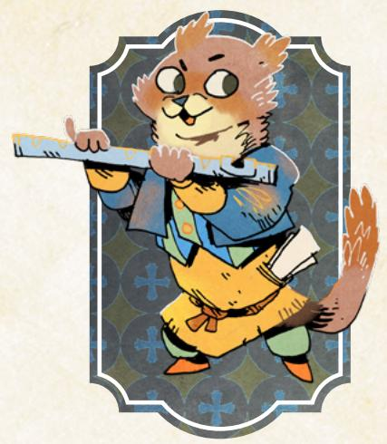

# The Raconteur

*You are a storyteller, making coin and earning trust by moving amid the clearings and weaving tales that ultimately teach the denizens what you want them to believe about the Woodland's goings-on.*

#### Species

• fox, mouse, rabbit, bird, weasel, other

#### Demeanor

• ingenuous, passionate, verbose, smooth

#### Details

- he, she, they, shifting
- shabby, flashy, haphazard, effete
- gold tooth, swirling cloak, homespun memento, tuning fork

#### Charm +2

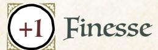

Add +1 to a stat of your choice, to a max of +2

#### Weapon Skills

Choose one weapon skill to start

- Confuse Senses
- Disarm
- Improvise
- Vicious Strike

#### Roguish Feats

You start with these: Counterfeit, Pickpocket, Pick Lock

Equipment Starting Value 8

|  | Your Nature choose one |  |  |
|--|------------------------|--|--|
|--|------------------------|--|--|

- Legend: Clear your exhaustion track when you put on a performace in front of a large, attentive audience.
- Companion: Clear your exhaustion track when you effusively praise a friend to a powerful person or group.

#### Your Drives choose two

- Discovery: Advance when you encounter a new wonder or ruin in the forests.
- Thrills: Advance when you escape from certain death or incarceration.
- Infamy: Advance when you decrease your reputation with any faction.
- Clean Paws: Advance when you accomplish an illicit, criminal goal while maintaining a believable veneer of innocence.

#### Your Connections

See Root: The RPG page 51 for mechanical effects.

- Friend: \_\_\_\_\_\_\_\_\_\_ and I still talk about the time we were run out of a clearing, even though we thought our adventures would lead the powers that be to treat us as heroes. What did we do? How did it go wrong?
- Family: \_\_\_\_\_\_\_\_\_\_\_ and I have been through battles, ruin-delves, heists, and more together. Which particular incident made us close? How did I make it famous?

{122}------------------------------------------------

### Raconteur (Doves

YOU GET TOOLS OF THE TRADE, THEN CHOOSE TWO MORE

| & Gools of the Grade Wear LLL                                                                                                                                                                                                                                                                                                                                                                                                                                                                                                  |
|--------------------------------------------------------------------------------------------------------------------------------------------------------------------------------------------------------------------------------------------------------------------------------------------------------------------------------------------------------------------------------------------------------------------------------------------------------------------------------------------------------------------------------|
| You have a valued (at least to you) symbol of your skill and talent; it starts with 3 boxes of wear and whatever its Value, it is essentially priceless to you.                                                                                                                                                                                                                                                                                                                                                                |
| <ul> <li>Choose a type: musical instrument, poetry book, unique costume, stage prop</li> <li>Choose a look: battered, fancy, delicate, stained, pristine</li> <li>Choose three features:</li> </ul>                                                                                                                                                                                                                                                                                                                            |
| ☐ <b>Sturdy</b> : +2 boxes of wear; when you tend to your symbol after a public performance, clear a box of wear.                                                                                                                                                                                                                                                                                                                                                                                                              |
| ☐ Enchanting: Mark wear instead of exhaustion to add +2 when you help                                                                                                                                                                                                                                                                                                                                                                                                                                                          |
| another vagabond by distracting someone with your performance.                                                                                                                                                                                                                                                                                                                                                                                                                                                                 |
| ☐ Versatile: Choose two equipment tags for your symbol.                                                                                                                                                                                                                                                                                                                                                                                                                                                                        |
| ☐ <b>Revealing</b> : When you perform in public, mark wear to ask any one character who watched "what truly motivates your character?"; take +1 when acting on                                                                                                                                                                                                                                                                                                                                                                 |
| The answer.                                                                                                                                                                                                                                                                                                                                                                                                                                                                                                                    |
| Pleasant: When you perform for your band while <i>traveling along the path</i> , mark wear to clear up to 2 additional exhaustion from each vagabond.                                                                                                                                                                                                                                                                                                                                                                          |
| When you first put on an earnest, public performance in a clearing, roll with                                                                                                                                                                                                                                                                                                                                                                                                                                                  |
| Charm. On a hit, name a faction you flatter; an important member comes forward                                                                                                                                                                                                                                                                                                                                                                                                                                                 |
| to offer you work. On a 10+, mark prestige with their faction as well. On a miss, you                                                                                                                                                                                                                                                                                                                                                                                                                                          |
| draw the worst kind of attention to you and your friends.                                                                                                                                                                                                                                                                                                                                                                                                                                                                      |
| ☐ Adoring Fans                                                                                                                                                                                                                                                                                                                                                                                                                                                                                                                 |
| When you <b>first enter a clearing</b> , roll with Charm. On a hit, a fan recognizes you; they relate gossip, offer a place to stay, and show your band around. On a 10+, your fan will go even further to help you. On a miss, you meet a fan with good intentions who immediately makes your situation much, much worse.                                                                                                                                                                                                     |
| ☐ All Eyes on (De                                                                                                                                                                                                                                                                                                                                                                                                                                                                                                              |
| When you <b>create</b> a <b>distraction through outlandish performance</b> , mark exhaustion and roll with Charm. On a hit, the room can't look away; your allies take +1 ongoing to <i>Sneak</i> , <i>Hide</i> , <i>Pickpocket</i> , or <i>trust fate</i> while you perform. On a 10+, hold I; spend the hold to grant an ally a +3 for one of the aforementioned rolls instead. On a miss, your audience finds something about your performance insulting or misguided; they fall over themselves to give you their opinion. |
| Quick Fingers, Quicker Eyes When you read a tense situation while performing, you may always ask one question, even on a miss.                                                                                                                                                                                                                                                                                                                                                                                                 |
| □ Silver Gongue                                                                                                                                                                                                                                                                                                                                                                                                                                                                                                                |
| When you <i>persuade an NPC</i> with a colorful anecdote, mark exhaustion on a hit to make them reveal something important and relevant about the situation.                                                                                                                                                                                                                                                                                                                                                                   |
| □ Sweet as honey                                                                                                                                                                                                                                                                                                                                                                                                                                                                                                               |
| Take +1 Charm (max +3).                                                                                                                                                                                                                                                                                                                                                                                                                                                                                                        |
|                                                                                                                                                                                                                                                                                                                                                                                                                                                                                                                                |
| 122): Root: The Roleplaying Game                                                                                                                                                                                                                                                                                                                                                                                                                                                                                               |

{123}------------------------------------------------

#### Background Questions

| Where do you call home?                                           | Whom have you wronged and how?                               |
|-------------------------------------------------------------------|--------------------------------------------------------------|
| " clearing                                                     | " a lover, with my words                                  |
| " the forest                                                   | " a friend, with my actions                               |
| " a place far from here                                        | " an innocent, with my silence                            |
| Why are you a vagabond? " I want to see all of the Woodland | " an ally, with my inaction " a sibling, many times |
| " I want to find a worthy hero to write                        | Which faction have you served                                |
| about                                                             | the most? (mark two prestige for                             |
| " I want to witness a legendary                                | appropriate group)                                           |
| moment firsthand                                                  | With which faction have you earned                           |
| " I want to find the kind of true love                         | a special enmity? (mark one notoriety                        |
| found in epic poetry                                              | for appropriate group)                                       |
| " I have been run out of too many                              |                                                              |
| clearings to stay still                                           |                                                              |

Dashing, adroit, distracting, audacious. The Raconteur is a performer and a storyteller, a vagabond who shapes the future of the Woodland with a song or story.

The Raconteur is a lover, not a fighter. They would far rather sing a song than swing a sword! That doesn't mean the Raconteur is a pushover; they can fight like any other vagabond and also shape public opinion, their performances impacting how the denizens think about the events of the Woodland.

The symbol of your skill is a crucial part of your character. When you get out your symbol, everyone knows you're about to launch into a performance! Take some time to work out both what it is and how you got it. You might have a versatile, revealing, and delicate costume you created yourself as you taught yourself your trade, or a battered book of pleasant and enchanting poetry that you were given as a young student in a faraway land. Either way, declaring how you obtained both your skill and your symbol is crucial to fleshing out your character.

Your natures, "Legend" and "Companion," both give you an excuse to show off your talent. "Legend" puts the focus on your performance, assuming you can gather a large audience. "Companion" requires smaller audiences and a less extravagant production, but you still need to put on a show to talk up a friend in a meaningful way, one that endears your subject to the targeted person or group.

Your drives should remind you that you must create stories to provide the best performances! Likely some part of why you are a vagabond is to be in the thick of it, participating in and witnessing firsthand the escapades of heroic figures so you can memorialize them later (perhaps with a bit of embellishment).

{124}------------------------------------------------

#### Dotes on The Ranconteur Moves

For *Tools of the Trade*, you still get your normal equipment like everyone else; your symbol of your skill and talent is in addition to your regular gear.

- If you choose "Sturdy," it only takes you a few minutes to tend to your symbol and clear I-wear: cleaning your instrument or costume, storing a book, etc.
- If you choose "Enchanting," you are far better at *helping* with distracting performances; you don't mark exhaustion when you mark wear, and you add +2 instead of +1. If you want to conceal your aid or interference or create an opportunity or obstacle in addition to adding +2, you must mark exhaustion.
- If you choose "Revealing," the bonus lasts until you leave the clearing or the denizen's motivation changes substantially.
- If you choose "Pleasant," you can perform for your band no matter which option your band chooses for traveling. You clear the exhaustion after all other costs are considered, which means that someone might mark 2-exhaustion for traveling and then immediately clear that 2-exhaustion thanks to your performance.

Anyone who offers you work after a public performance hails from the faction your performance flattered. The performance can't be merely ironic or silly; it's got to be an earnest attempt to convey your artistic intent, even if that intent is satirical towards one faction and complimentary towards another.

For *Adoring Fans*, the move triggers the first time you enter a clearing. You've got to leave the clearing for some time before the move triggers a second time—going for a walk in the woods for a few hours and coming back doesn't count as "first entering a clearing." On a weak hit, your fan will do everything a friendly host would do...but they aren't going to take any risks, like breaking the law or hurting someone, to help you. On a 10+, they are willing to do much, much more, however, even to the point of putting themselves in danger.

For *All Eyes on Me*, note that you can't put on an earnest performance (*Tools of the Trade*) and a distracting, outlandish performance at the same time. You decide who your allies are that receive the +1 ongoing while you perform, and you must spend your hold—granting the +3—before that particular ally rolls.

For *Quick Fingers, Quicker Eyes*, your performance can be small or more intimate; you don't have to be engaging in a large, public performance to ask your additional question.

For *Silver Tongue*, the colorful anecdote can't be a trick unto itself, even if the story isn't true or factual; you're *persuading* someone with a story, not *tricking* them into doing what you want. You can say "Oh, I've fought plenty of bears before!"—and regale someone with tales of your adventures fighting those bears—to *persuade* them to let you hunt down a bear for them, but you can't use this move to *trick* them into thinking you're "Edgar Bearsbane, the famous slayer of bears."

{125}------------------------------------------------

## The Raider

*You are a bandit, a thief-by-force, dangerous and threatening, but perhaps with the capacity to turn your axe to good use...and all the better if you get paid for it.*

#### Species

• fox, mouse, rabbit, bird, other

#### Demeanor

• intimidating, jovial, curt, curious

#### Details

- he, she, they, shifting
- well-groomed, huge, scarred, lean
- sigil pendant, dark cloak, face paint, sentimental talisman

#### Charm 0

Add +1 to a stat of your choice, to a max of +2

#### Weapon Skills

Choose one weapon skill to start

- Cleave
- Confuse Senses
- Storm a Group
- Vicious Strike

#### Roguish Feats

You start with these: Acrobatics, Blindside

Equipment Starting Value 9

| Your Nature choose one |  |  |  |
|------------------------|--|--|--|
|------------------------|--|--|--|

- Bandit: Clear your exhaustion track when you try to use the threat of force to secure valuables from formidable opposition.
- Hero: Clear your exhaustion track when you outright attack a dangerous, oppressive, or villainous NPC.

#### Your Drives choose two

- Loyalty: You're loyal to someone; name them. Advance when you obey their order at a great cost to yourself.
- Chaos: Advance when you topple a tyrannical or dangerously overbearing figure or order.
- Crime: Advance when you illicitly score a significant prize or pull off an illegal caper against impressive odds.
- Greed: Advance when you secure a serious payday or treasure.

#### Your Connections

See Root: The RPG page 51 for mechanical effects.

- Protector: The first time I saw \_\_\_\_\_\_\_\_\_\_\_\_ they piqued my curiosity; I went out of my way to protect them from the ire of my own band. What about them sparked my loyalty?
- Watcher: \_\_\_\_\_\_\_\_\_\_\_\_ bested me in combat when I got out of hand. How? Why did I thank them for it?

{126}------------------------------------------------

#### Raider Moves choose three Eye For Battle When you *read a tense situation* just as violence breaks out, roll with Might instead of Cunning. Ironhide When **a group inflicts harm on you**, suffer 2 fewer harm from each attack (minimum 1-harm); when you inflict harm on a group, inflict 1 additional harm. Loot and Plunder When you **loot a rich area for valuables**, roll with Finesse. On a hit, something out of the ordinary catches your eye; claim it and it's yours. On a 10+ all 3. on a

- 7-9 choose 1: • It is worth a lot of money (+2-Value)
- It is of special value to a particular faction (+4 prestige if traded to them)
- It is extremely durable (+1-wear)

On a miss, you can get your hands on it, but it is sought by dangerous denizens who are all too willing to kill to take it from whoever possesses it.

#### Merciful Might

When you **try to befriend an NPC you've saved from the wrath of another**, spend time helping them further (mark exhaustion) or buy them a drink (mark depletion). Your continued kindness pays dividends; they'll share a valuable secret or grant you a serious favor.

#### Plan of Attack

When you **work out a plan of attack with someone**, roll with Might. On a 10+, hold 3. On a 7-9, hold 2. You can spend your hold 1-for-1, regardless of distance, while the plan is being carried out to:

- Lend a hand; add +1 to someone's roll (choose after rolling)
- Soften a blow; reduce by one the harm someone suffers from a single attack
- Ensure your gear holds; allow someone to ignore marking depletion or wear On a miss, hold 1, but your plan encounters some disastrous opposition right from the start.

#### Fearsome Visage

You can *make a pointed threat* or *publicly draw attention to yourself* as an enemy of a faction when you have a Reputation of 0 or lower with that faction, not just the usual -3 or -2 reputation required. Remember, you roll as if your negative reputation was positive, so a -1 Reputation becomes a +1 for the roll and a 0 remains a 0.

{127}------------------------------------------------

#### Background Questions

| Where do you call home?                                                                                                                                                                   | Whom have you left behind?                                                                                                                                                                       |
|-------------------------------------------------------------------------------------------------------------------------------------------------------------------------------------------|--------------------------------------------------------------------------------------------------------------------------------------------------------------------------------------------------|
| " clearing " the forest " a place far from here Why are you a vagabond? " I am feared by most denizens                                                            | " my mentor " my ward " my loved one " my sibling " my best friend                                                                                                    |
| " I wish to see all the Woodlands have to offer " I refuse to serve someone unworthy " I seek to overthrow all oppressors " I am running from powerful enemies | Which faction have you served the most? (mark two prestige for appropriate group) With which faction have you earned a special enmity? (mark one notoriety for appropriate group) |

Rough, pragmatic, threatening, dangerous. The Raider is a bandit of the Woodland, a brigand who takes what they want by the sword, forgoing stealth and guile in favor of raw force.

The Raider is an aggressive fighter. They are as strong as some of the other martial vagabonds—the Arbiter, the Ronin, the Champion—and they have moves like *Plan of Attack* and *Fearsome Visage* that allow them to set the conflict on their terms, leaving even the strongest forces vulnerable and exposed. Woe to any opposition that underestimates how much damage the Raider and their allies can do!

As the Raider, you can strike some heavy blows against even the most dangerous opposition, but you've got to decide whose side you're on. Do you want to forge an alliance with a faction that pays well and stays out of your way? Or do you want to keep things even, seeking a balance with all the factions of the Woodland War in the hopes they worry about bigger problems? Do you fight for someone else or yourself?

Your natures, "Bandit" and "Hero," give you the option of affirming what others think of you or attempting to rise above your baser instincts in the service of others. "Bandit" rewards you for attempting to seize valuables from real, dangerous opposition—a whole unit of Marquisate soldiers, for example—while "Hero" incentivizes you to take the side of the vulnerable. The latter may still turn a profit if the dangerous or villainous NPCs have valuables for you to seize, but it's not guaranteed! Either way, you don't have to win either fight to activate your nature; clear your exhaustion when you make the attempt!

{128}------------------------------------------------

That said, the Raider tends to come across as a villain themselves, even when they mostly target the powerful and cruel. Look to your connections and drives to find reasons to restrain your violence productively and work with your band to accomplish objectives greater than mere banditry. After all, there will be plenty of loot along the way!

#### Notes on The Raider Moves

For *Eye for Battle*, you can be the reason that violence is breaking out—just tell the GM you want to *read a tense situation* as you throw the first punch.

For *Ironhide*, you're much more effective fighting groups than any other vagabond; the harm the group inflicts on you is reduced greatly, but it's still a minimum of 1-harm. Your harm is also increased; you inflict one additional harm that can be further raised by choosing an option like "inflict serious (+1) harm." A group has to consist of at least five opponents to count as a group (see Root: The RPG, page 214 for more on groups).

For *Loot and Plunder*, you're taking stock of an area you've already gained access to or captured, looking for valuables a cut above the ordinary spoils. On a hit, the GM will tell you what you find, including the Value and wear of the item. If you choose that it's worth a lot of money or is extremely durable, add Value or wear to whatever the GM told you; if you choose that it's of special value to a faction, you can gain +4 prestige with that faction for returning the item to them.

For *Merciful Might*, you mark the exhaustion or depletion after you save the NPC, further spending time helping them out or buying a drink. If you don't have the time (or money) to spend, you can't trigger the move.

For *Plan of Attack*, you can't invoke any of the benefits for yourself, but you can spend your hold at any time during the plan's execution to help any ally—even an NPC—involved in the plan; tell the GM how your planning improved your ally's chances of success or helped them avoid a cost.

For *Fearsome Visage*, you usually can't even trigger *make a pointed threat* or *publicly draw attention to yourself* until you have an appropriately negative Reputation; this move allows you to make those moves with a –1 or +0 Reputation because you are so well known as a threat to any faction that doesn't see you positively.

{129}------------------------------------------------

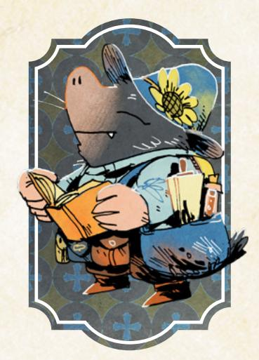

# The Seeker

*You are an explorer by nature, interested in freeranging discovery, delving into ruins, and uncovering whatever secret wonders and ancient truths lie hidden amid the Woodland.*

#### Species

• fox, mouse, rabbit, bird, mole, other

#### Demeanor

• absentminded, driven, jovial, quiet

#### Details

- he, she, they, shifting
- honest, traveled, whimsical, young
- trusty satchel, large and grandiose hat, book of stamps, sturdy boots

#### Charm -1

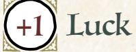

Add +1 to a stat of your choice, to a max of +2

#### Weapon Skills Choose one weapon skill

to start

- Confuse Senses
- Disarm Parry
- Trick Shot

#### Roguish Feats

You start with these: Acrobatics, Disable Device, Pick Lock

Equipment Starting Value 8

| Your Nature choose one |  |  |  |
|------------------------|--|--|--|
|------------------------|--|--|--|

- Explorer: Clear your exhaustion track when you enter a ruin or other dangerous area of the forest.
- Historian: Clear your exhaustion track when you refuse to allow someone to cover up or obscure the truth.

#### Your Drives choose two

- Justice: Advance when you achieve justice for someone wronged by a powerful, wealthy, or high-status individual.
- Discovery: Advance when you encounter a new wonder or ruin in the forests.
- Greed: Advance when you secure a serious payday or treasure.
- Wanderlust: Advance when you finish a journey to a clearing.

#### Your Connections

See Root: The RPG page 51 for mechanical effects.

- Partner: \_\_\_\_\_\_\_\_\_\_\_\_ and I have seen the wonders of the Woodland together. What makes them a stalwart companion on my travels?
- Peer: \_\_\_\_\_\_\_\_\_\_\_\_ is famous for a discovery of their own. I greatly respect them! What did they discover? How?

{130}------------------------------------------------

### Seeker Moves

you get **word on the street**, then choose two more

#### Word on the Street

When you **spend time in a clearing talking with locals**, roll with Finesse. On a hit, you catch wind of a nearby unexplored wonder or ruin; someone promises to take you to it for a fair fee (1-Value). On a 7-9, the dangers make their price steeper—an additional 1-Value of coin or gear. On a miss, the location is under threat—soon it will be plundered, destroyed, or claimed by another power.

#### Never Lost

Take two additional boxes of injury and depletion you can mark when you confront dangers within a ruin and a +1 ongoing to *trusting fate* and **performing roguish feats** while exploring such ancient locales.

#### Treasurer Hunter

When you **sell the treasures you found in a ruin** at market, roll with Cunning. On a hit, you find some buyers. On a 7-9, take 1. On a 10+, both:

- You get a good price; you get double what such findings are usually worth
- You are popular; mark two prestige with the controlling faction On a miss, you still sell the items for a fair price, but someone powerful takes offense at your plunder of such sacred sites.

#### Adventurer Contract

When you **try to convince a powerful NPC to supply an exploratory adventure**, roll with Cunning. On a hit, they give you 8-Value in resources and depletion—but you must fulfill a request. On a 10+, they ask for something general—more riches, information, a prize or trophy. On a 7-9, they want something specific—a singular treasure, secret knowledge, a lost ritual. On a miss, they mount a competing expedition based on what you have told them.

#### Watch the Signs

When you **first attune yourself to a ruin or mysterious site** by taking in its signs, symbols, particular traits, and layout, roll with Cunning. On a 10+, hold 3. On a 7-9, hold 2. On a miss, you may mark exhaustion to hold 1. While within that ruin or mysterious site, you can spend your hold 1-for-1 to:

- Identify the quickest path to the closest valuable treasure or knowledge
- Disarm a trap or overcome a natural hazard without cost
- Name a character within reach about to suffer harm; you suffer it instead
- Name a character in the ruin; you cross the distance to them instantly
- Take cover in the ruin; ignore all harm from a single attack or catastrophe

#### Unstable Ground

When you use a rough or chaotic environment—slippery rocks, a crowded market, etc.—to gain an advantage over your opponents in a fight, you can *grapple with them* using Finesse instead of Might.

{131}------------------------------------------------

#### Background Questions

| Where do you call home?                                                                                                               | Whom have you left behind?                                                                              |
|---------------------------------------------------------------------------------------------------------------------------------------|---------------------------------------------------------------------------------------------------------|
| " clearing " the forest " a place far from here Why are you a vagabond?                                             | " my family " my spouse or loved one " my best friend " my fellow explorer         |
| " I want to wander the Woodland. " I'm seeking answers to a mystery " I need to find and reconnect with a loved one | " my idol Which faction have you served the most? (mark two prestige for appropriate group) |
| " I am pursuing a treasure " I stole and sold something precious from someone dangerous                                   | With which faction have you earned a special enmity? (mark one notoriety for appropriate group)   |

Obsessed, prepared, experienced, perceptive. The Seeker is an expert on the ruins and mysteries of the forest, an excavator of old treasures and forbidden places who seeks riches and answers in equal measure.

As the Seeker, you've got a bunch of useful skills for getting into difficult places, whether you're gaining entrance to an ancient Eyrie ruin or breaking into a vault in a Marquisate-controlled clearing. You're also pretty good at *trusting fate* to see you through difficult times! Some may see you as nothing more than a glorified tourist, but you're a vagabond through and through, capable of the same amount of trouble as any other outlaw!

That said, your focus is always going to be the ruins and mysteries of the forest. One of your natures—"Explorer"—points directly at the ruins, and *Word on the Street* allows you to hear of nearby sites when you get some time to talk to the locals. Most of your other moves also give you unique abilities inside and around ruins, and you can usually create all manner of profitable opportunities for your band. But your other nature—"Historian"—points to a deeper truth: you seek knowledge and answers about the Woodland, the truth behind the ruins and mysteries of the forest. You know that there are secrets hidden everywhere, both in the ruins and in the clearings, that must be exposed. You and your band are some of the only denizens that can stand up to those who would cover up or obscure the truth!

Your drives are all designed to help further point at the reasons why you seek answers—is it greed? Is it curiosity? Is it just a general desire to see and do new things? Pick the drives that most satisfy your reasons for delving into ruins and other places you shouldn't go.

{132}------------------------------------------------

#### Notes on The Seeker Moves

For *Word on the Street*, you need to spend a bit chatting with locals to trigger the move. It's possible you could find the local wonder or ruin on your own, but paying the fee ensures you get there quickly and without issue. On a miss, you might still be able to hire someone to take you to the site, but you'll have to negotiate a fair price.

For *Never Lost*, you don't have to transfer any injury or depletion you marked in these boxes when you leave a ruin, and those boxes go away; they represent your ability to navigate the ruin and acquire resources within it. The next time you enter a ruin, you get two cleared boxes of injury and two cleared boxes of depletion, no matter what you marked in the last ruin.

For *Treasurer Hunter*, the buyers might be the wealthy elites of a clearing looking for treasures worthy of their status or ordinary denizens who wish to recover their own heritage from the ruins. Either way, a hit means everyone is happy with the sale and eager to pay extra or award you prestige; a miss means you still get paid—less than you would on a hit—but someone isn't happy with your entrepreneurial spirit.

For *Adventurer Contract*, your benefactor's request is determined by how strong a hit you get. A weaker hit means a more specific request; a strong hit means something more general and easier to obtain or deliver. If you don't honor the request on and after your expedition, the NPC will take action in accordance with their nature…up to and including attempting to murder those vagabonds who made promises they didn't intend to keep!

For *Watch the Signs*, it doesn't take long to attune to a ruin or mysterious site; a few minutes is usually enough if you're able to concentrate and stay alert. The benefits happen immediately—and in full—when you spend hold: if you "cross the distance" to someone else in the ruin, for example, you take a shortcut that gets you there instantly, and if you "disarm a trap without cost," you shut it down without marking depletion, injury, or exhaustion.

For *Unstable Ground*, the environment has to be chaotic enough to knock your opponent off balance. A room that's on fire is plenty tumultuous, but a lightly attended town meeting is not, even if it's held in a small or cramped room.

{133}------------------------------------------------

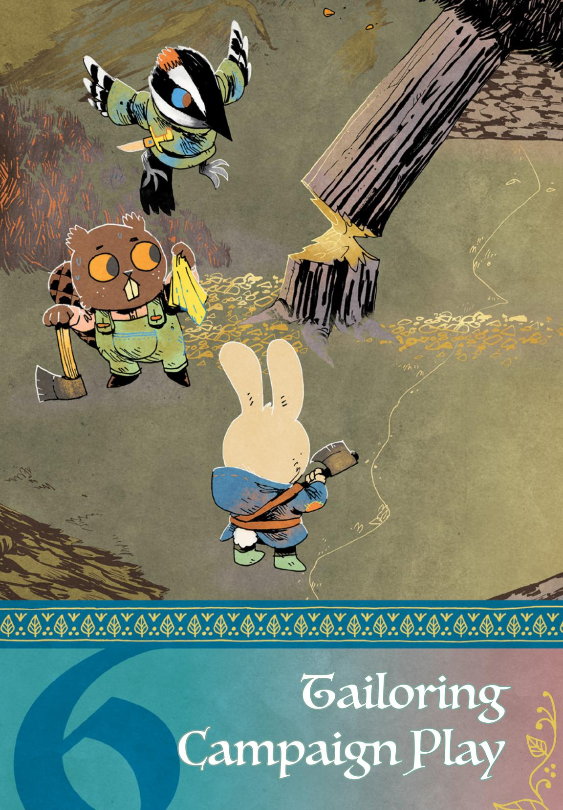

{134}------------------------------------------------

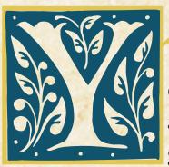

ou can easily play a single game of Root: The RPG and have a satisfying, heroic, charming, and brilliant adventure. But the game comes alive when you play a full campaign, when the

madcap antics of your last adventure have real consequences, when the powerful factions of the War aren't just immovable forces, but actually come to notice the vagabonds and care about them—for good or ill.

The core book for Root: the RPG contains plenty of guidance for playing a satisfying campaign of Root: The RPG. This chapter is about expanding that information and providing still more tools to bring your version of the Woodland to life for many sessions.

### The First Session

Every campaign of Root: the RPG starts with one session. Running a good first session is key to getting players invested in your Woodland and creating good inciting incidents from which a whole campaign will flow. The tips here can be useful when you're only playing a single session, but they're primarily focused on helping you set up a strong start to a campaign.

#### Before the First Session

There are a few things you need to do before your first session:

First, make sure you've read the core book. Players can probably get away with reading only Chapters 2-5, but if you're running the game, you should really read the whole thing. Don't worry about memorizing everything—just make sure you have some idea where to find things in the book when you need to look them up!

Second, make sure you have the needed materials. You need all the playbooks you're using—printed if you're playing in person or available online if you're playing digitally. You want the full set of moves sheets, including the basic moves, the weapon skill moves, the reputation moves, and the travel moves. If you're playing a one-shot game without much use for Reputation or travel, you might eschew those.

Third, make sure you know your location. Start with a few details about the clearing or ruin where you're starting. If it's a clearing, include details about some of its major figures and conflicts. If it's a ruin, think about whose ruin it is, what is valuable about it, and why you're picking up there. For a long-term game, get a map of the Woodland (Root: The RPG core book, page 225), premade and ready to put in front of players.

るが、このでは、一番「これでは、一番」という。

{135}------------------------------------------------

#### Starting the First Session

**First, explain a bit about your Woodland and starting clearing**. You might work with your players to decide which factions you're playing with, or you might have already decided on the factions you want to see in your game. Either way, this is the time to tell the players a bit about the Woodland overall, about how the War has progressed in this version of it, and about which factions are at play and where they hold power. Use the Woodland map to support your discussion as you go, and provide your players with a few details about the clearing or ruin where you're starting. That way, players can make PCs who fit your Woodland and the starting situation.

**Second, make characters**. Spread out the playbooks if you're in person, and go through them one by one, explaining a smidge about them. Let each player take the one that most interests them.

Then, give the players some time to create their characters, filling out each section. Make sure you're available to answer questions as they come up, and to guide the group through the process, explaining what they should be doing next and what decisions they should be making. Encourage the players to discuss their choices out loud to build up excitement, but don't put pressure on anyone—it's fine if they make characters with their heads down and share a bit later in the process.

Players should fill in everything except for their connections before the next step.

**Third, introduce the characters to each other**. Go through the players one by one, having each player introduce their character, saying their name, describing what the others see when they look at the character, and explaining a bit about the character's background and interests. Ask probing questions the whole while—help the players fill in details and create interesting new facets with leading questions like "Why does the Marquisate care so deeply about the crime you committed?" or "What was the last thing you and your parents angrily said to each other before you left to be a vagabond?"

**Fourth, fill in the connections**. Go back through the players, having them each choose one connection and fill in the name of another PC. Ask questions to help flesh out their relationship. Once every PC has one connection, go back through again, filling in the second connection.

{136}------------------------------------------------

#### During the First Session

Your goals during the first session are these:

- Build on the decisions the players have made during character creation
- Get to know the vagabonds through their actions and interactions with each other and the clearing
- Set the stakes for the Woodland War and the struggle between the factions
- Go through the basic moves and several of the other mechanics of the game (definitely Reputation at least)
- Create an interesting inciting incident to lead to more adventure

After your players have made their characters and connected them to each other, take a break. While your players have a snack or use the restroom, look at your preparation for your starting place, be it a clearing or a ruin. If any changes occur to you to hook into the PCs and their issues, ways to introduce NPCs who matter to them, or objects they care about, make those changes. When your players come back from their break, make sure you speak a bit about why the PCs are going to this location—looking for treasure in a ruin, hoping to repair equipment at a clearing (and likely needing to start with some depletion or wear marked, see below), etc.

Dive into the game with the vagabonds arriving at the location. If it's a clearing, make sure they get some sense of the clearing's main problems and issues immediately, whether through an incident they witness (and might intercede in) or by being approached quickly by an NPC who would like to hire their services. Involve them in the clearing's issues; entice them with beds, food, gold, and equipment if need be. Play on any personal relationships or connections to the clearing as well.

If it's a ruin, dive into play as more of a romp through a potentially dangerous place. Make sure the ruin isn't devoid of NPCs—another group of vagabonds, bandits, soldiers, grave robbers, treasure hunters, refugees, etc. The ruin itself can be a physical threat, but without NPCs to interact with and provide a different kind of tension, ruins often run flat quickly. It's hard to *persuade* and *trick* NPCs—or *engage them in melee*—if there aren't any around!

If you want to make sure the cycle of play is accelerated into action, then start your PCs with a few boxes of their harm tracks marked—three to six total boxes per PC, spread among their exhaustion, injury, and depletion tracks. If you would like their equipment to start somewhat dinged up, then have them mark 2-wear total on whatever equipment they choose, in addition to the harm.

{137}------------------------------------------------

#### One-Shot Gips

If you are playing a one-shot—meaning a single session of the game, intended to stand alone—you can either treat your session as if it were the first session of a whole new campaign, or you can play it as a more directed, singular game.

A "one-shot as first session" follows many of the same tips and ideas in this section, excepting anything forward looking—no reason to think about what happens next or the consequences of the PCs' actions when there is no second session!

A "directed one-shot" means you have a much stronger, tighter situation. You not only tell the PCs that they are arriving in Bennary Field, but you also tell them that they are arriving after having barely escaped the nearby Marquisate prison, and they are looking for a way to get to safety. The immediate reasons the PCs are in this situation are pre-chosen and very clear. That way, you can also predict when the session has met its ending—when that initial situation is resolved for good or ill. If the prison escapees are captured again, then the one-shot is over, same as if the prison escapees successfully ditch their pursuers and trek away into the Woodland.

Either way, don't expend unneeded effort on one-shots. For example, if you're just playing a one-shot, you don't need a map of the whole Woodland; you can just use a few details about the one or two places where play will take place.

<u></u>

Starting the vagabonds with no harm marked is also an option—it just means they won't be under the gun for a little while, as they have plenty of ways to absorb consequences on their myriad harm tracks. They'll get to be awesome and exciting from the start, and they'll feel like they get away scot-free (until they realize that they're out of harm to mark and up against real trouble).

During the first session, make sure the players collectively encounter the following mechanics:

- Every basic move, at least once
- Prestige or notoriety gain
- Marking harm tracks and the use of nature to clear exhaustion
- Drives and advancement

{138}------------------------------------------------

#### Key Beats

Here are some other key things to strive for during your first session, ideas and moments that will help make for a solid first experience for your players:

- Engage in action
- Offer up opportunities to trigger drives and natures
- Ask questions constantly
- Call out moves when they happen
- Offer moves when the players flinch
- Frame scenes with multiple PCs
- Give them a chance to be awesome

#### **ENGAGE IN ACTION**

Having action scenes—not necessarily combat, but action—in your first session of **Root**: **Ghe RPG** is practically a must. The vagabonds get a chance to show off their myriad skills for getting into and out of dangerous situations, and you get to have a thrilling, over-the-top encounter. So make GM moves to escalate to the point of action, of vagabonds racing around, diving out of windows, wielding swords, and so on.

#### OFFER UP OPPORTUNITIES TO TRIGGER DRIVES AND NATURES

Throughout a campaign of **Root: Ghe RPG**, you'll be providing opportunities for PCs to hit their drives and natures. But it's especially important to at least show the PCs how those systems work so they can also participate in pushing towards those triggers. You don't have to provide a chance for every single PC to hit every single drive and nature, but you should try to hold them in your head, and make GM moves towards a few drives and natures a bit more aggressively than you might otherwise.

#### **ASK QUESTIONS CONSTANTLY**

When you start a game of **Root**: **Ghe RPG**, there are plenty of holes, blank spaces left throughout your fictional world and the backstories of the PCs. Ask questions constantly to fill in those holes! And use leading questions, pointed questions that aren't just entirely open-ended. When a PC comes into the tavern, ask "What impression would the taverngoers have of you? What music would be playing on the soundtrack?" When they speak to the bartender, ask "You've probably met this denizen before, right? Are you good buddies? Why?" You'll flesh out your world far more quickly than you think.

{139}------------------------------------------------

#### **Call Out Moves When They Happen**

As the GM, you're probably the most familiar with the rules of the game. You can help all the other players get used to the rules by calling out moves and triggers when they happen. Over time, players will learn to call out moves themselves, to say, "I want to *trick* him," prompting you to ask, "Okay, how do you do that?" But in that first session, the phrase "It sounds like you're trying to [trigger x move]…" is going to be one you utter a lot. That's great! It helps prime everyone to see what triggering a move looks like, and to think about the moves during play.

#### **Offer Moves When the Players Flinch**

Sometimes, especially in that first session, players can feel stymied, confused, unclear on what they can or should do. Help them out! Suggest that they might want to get more information by *figuring someone out* or *reading a tense situation*. Point out that they could get past the guard by *persuading* her, *tricking* her, maybe even vaulting over the wall by *attempting a roguish feat*. When the players are still learning the game, it helps to have someone familiar with the rules and the possibilities prompt some of the action.

#### **Frame Scenes with Multiple PCs**

It can be easy for vagabonds to start pursuing their own goals or desires, splitting up and doing their own thing. When you frame scenes as the GM, you can say who is present in the scene—and that means you can help combat this impulse to split up. Frame scenes with multiple PCs present so that they have a chance to interact, speak to each other, learn about each other, and help each other out! It helps you share the spotlight between them and build the group as a band.

#### **Give Them a Chance to Be Awesome**

The easiest way to get players quickly into the mindset of Root: The RPG is to let them play with their abilities, expertises, and action-oriented moves. Putting them into dangerous situations where they take action, trick or talk their way out of trouble, and otherwise pull out all their tricks is a good idea! They'll take actions that can have consequences in the next session and beyond, giving you plenty to play with for the campaign, while having an awesome adventure up front.

{140}------------------------------------------------

### After the First Session

When you're done with the first session of a campaign, take a look at your notes. Take a look at the NPCs you've developed, the events that occurred, the factions at play, the nature of your clearing. Start percolating on how things will play out next, based on the vagabonds' actions. You can draw on the PCs' backstories, but that might come more easily down the line—for now, make sure that what the vagabonds do *matters* and really changes the fiction.

In many first sessions of Root: The RPG (and one-shots, as well), PCs play fast and loose, causing chaos, setting fires, butting right into dangerous foes without any hesitation. They play like action adventurers! The key to thinking about your next session is to really extend the natural consequences of those actions, good and bad.

If the PCs saved someone from prison, that character probably feels indebted to them and may offer them aid or a reward…but only if the vagabonds can retrieve the reward from where it's held in a faction's storehouse. If the PCs fought and defeated a powerful member of a faction, then that character will come back after them, hunting them, determined to redeem themself! If the PCs caused major damage to a clearing, then its denizens will be in real trouble…they may come after the PCs in anger or plead with the vagabonds for aid.

Think about how the PCs' actions changed the situation in myriad ways, and who all would be interested in those changes, whether supporting or undoing them. That will give you plenty of ideas to draw on for new troubles, problems, and characters to introduce in future sessions.

You can also take this time to start looking into the larger faction mechanics ([page 182\)](#page-182-1) or the character-specific campaign mechanics [\(page 150\)](#page-150-1) and prompt further new surprising and interesting things. The first session is the inciting incident of your entire campaign, the start of your vagabonds' story! Make it count!

{141}------------------------------------------------

### During the Campaign

As you play out the campaign, your most important job as the GM is to maintain and support the campaign by using all the myriad tools and systems built into Root: The RPG. Internalize your agendas, your principles, and your moves, and always play to them (page 196 of the core book). Use the random generators to create new requests, new rumors, and new events to spice up your play (page 236 of the core book or 160 of this book). Use the faction mechanics [\(page 182](#page-182-1) of this book) to have the factions change the Woodland and progress the War. GMing a game of Root: The RPG is much more about using these systems wisely than about coming up with a big story for the vagabonds, and you'll find yourself well-supported with all of the general tools throughout this book and the Root: The RPG core book.

Here are a few additional principles and ideas that can help you build an amazing campaign while you honor those existing systems:

### Watch for Recurring Places and Characters

The Woodland that you create has twelve clearings. In all likelihood, the vagabonds won't even visit all twelve, let alone become invested in each one. They will invest a lot of time, effort, and emotion in one or two clearings, and those should be the focus of play. The other clearings can make great settings for periodic missions, quests, or events, but the vagabonds will likely always choose to return to their most important clearings.

You don't have to force the issue—just follow the vagabonds wherever they choose to go—but if the vagabonds pay a lot of attention to a particular clearing, that's a signal that you should, as well. That clearing is now a more important place, and keeping an eye on it, its issues, and the ways that it changes becomes all the more important. Your effort is far better spent focusing on those important clearings than trying to fully map out all conflicts and nuance across all twelve.

Similarly, pay attention to the NPCs that the vagabonds pay attention to. If the PCs focus on a foe from their past, then that foe is worth bringing back time and again. If the PCs focus on some random sergeant they made enemies with in the very first session, then that sergeant should recur as well, perhaps even moving up the faction ranks to become more and more dangerous. If the PCs try to protect and aid a local blacksmith, then that blacksmith might in turn become a frequent face, whether because the blacksmith also rises to prominence as a leader in their clearing, or because they start traveling between clearings, encountering the PCs the Woodland over.

{142}------------------------------------------------

Any NPC the PCs pay close attention to becomes a good choice for you to invest your off-screen thinking and preparation. You never plan any specific plots or tracks of events—but you can plan on a given NPC arriving in a new clearing, or creating a new complication or set of problems, or hunting the PCs. Your stable of recurring NPCs becomes a great choice for hard moves, as well—a recurring foe can always arrive where least they're wanted as a hard move, and a recurring ally can be put in danger or captured.

### Give Their Actions Weight

The principles, moves, and agendas for GMing (page 196 of the core book) all guide you to this place, but it's worth emphasizing again—the vagabonds' actions should have real weight upon the Woodland. The factions and their War are huge, dangerous, and difficult for any individual to influence. But the vagabonds are heroes and larger-than-life figures, in the end—if any individual has the power to affect the factions, to change the course of the War, it's them.

Honor their actions, their fights, and their words. What they do always has consequence, and the more you can build off that consequence, the better. If they encourage and help a denizen to become a leader to their community, then that leader actually takes up the vagabonds' words and encouragement as best they can—albeit not without problems. If they casually break into a prison or defeat a whole guard station, then the faction in charge of those forces responds with fear and caution, amping up its defenses substantially to actually honor the threat the vagabonds proved themselves to be.

The more often a consequence or change to the Woodland points back to something the vagabonds actually did, the better. Always be looking to tie things back to how the vagabonds' own actions led to the current situation, for good or for ill.

### Make Time Pass

Root: The RPG can flow forward as an endless string of events, one after another, always with plenty to pay attention to and focus on. There's always another adventure, another threat, another escapade. You can fall into the temptation of constantly following the PCs, almost without a break, just watching their lives flow by from hour to hour.

Break up that flow; use time jumps to allow the world to move forward, to grow and change, to have the consequences of the vagabonds' actions actually come to the fore and to have the Woodland War advance. That's the most important element to internalize as a GM: when the timeline advances, it's just a chance for you to make GM moves that change the Woodland and keep it alive and fresh.

The easiest way to do this is with time passing when the vagabonds travel from

{143}------------------------------------------------

clearing to clearing—those trips can take days or even weeks for particularly long trips. Don't hesitate to make time passing a "consequence" of traveling—it may seem like it's no big deal, but whenever a week or more passes, it's a chance for you to make moves and change the Woodland.

Time passing isn't meant to be a weapon against the PCs, preventing them from acting while the clock moves forward. If they're desperate to say they would have acted, then it's reasonable to let them, although that can be simple enough to handle through custom moves (see [page 77\)](#page-77-1). But for the most part, you're better off having time pass when every player is on the same page that the vagabonds are resting, participating in some long, slow project, or otherwise not taking any action that requires moment-to-moment attention. In particular, use time passing to give the PCs a bit of a reset, too—they can recover most of their exhaustion and some of their depletion, injury, or wear whenever time passes. Usually if a week passes, you can just let them recover their exhaustion and, depending upon their fictional circumstances and the aid they are receiving, some amount of the other harm tracks.

### Reward and Consume Resources

Over the course of play, the vagabonds will take on jobs for powerful parties: they'll plunder golden treasures from lost ruins; they'll steal their foes' legendary weapons; and they'll otherwise seek and obtain useful or valuable resources. If the vagabonds are seeking those resources, all the better—their pursuits will help them obtain new cool equipment and valuables. But even if they aren't purposefully pursuing those resources, you should keep in mind that they exist, and the PCs will encounter and obtain such resources whether they seek them or not.

The simplest way to do this is to give cool or exciting new pieces of equipment to particularly notable characters, especially foes. When a foe is defeated, that piece of equipment becomes something a PC can take from them, if only to sell. You don't have to fully write up the equipment in terms of Value and wear and tags until it is about to fall (or already has fallen) into a PC's hands. Before that point, focus on making the equipment notable, memorable, and cool.

PCs who try to loot too much—say, by taking every single piece of equipment from every single foe they face and defeat—should be reminded of their Load limits and the fact that the Woodland is a place intended to make internal sense. If they're selling, they need a buyer, and it may not be easy to find a buyer with the money and interest to pay for 10 or 20 swords all at once.

But NPCs who are happy and thankful for the PCs' aid will also provide them with rewards, be they pouches of coin (1- to 3-Value) or new, custom-made equipment. Gratitude can extend beyond the fulfillment of a contract alone.

Chapter 6: Tailoring Campaign Play 143

{144}------------------------------------------------

One of the best ways to signal that the PCs' actions have consequences is to have NPCs take note and respond with these symbols of gratitude.

The flip side of rewarding the PCs with resources is also demanding they use up those resources. Inflict wear on equipment; inflict depletion on the PCs; have NPCs ask for money (or equivalent resources) to take action; and so on. If PCs are never under the gun for their resources, never really seeking repairs or brand-new equipment to replace the lost, then one of the fundamental cycles of Root: The RPG falls apart. A PC who is unsure what to do or which side of a complicated conflict to stand with can always make a decision based on profit, resources, or equipment—and that requires a pressure that pushes the PCs to seek more money or new equipment.

### Shake Things Up

Root: The RPG is all about playing to find out what happens next. On the one hand, that means you shouldn't plan out the events of your game—the PCs' actions have to have meaning and consequence, such that they can completely disrupt any planned chain of events. On the other hand, that means you never want the game to be boringly predictable—if everybody at the table is 100% confident of "what happens next" in a way that deflates the game, then it's time for something to happen that breaks those expectations.

Make sure to keep your campaign of Root: The RPG fresh as you play. If the Woodland War is tipping too far into one direction, such that the victor seems clear—shake it up by using one of the events later in this chapter [\(page 160\)](#page-160-1) or just straight up introducing a whole new faction into the Woodland, one that's going to complicate the entire situation. If one NPC has become a predictable, evil villain with no nuance, reveal truths about them that complicate the PCs' understanding and give them new insight. If one clearing appears like a frustrating quagmire of bad leadership and bad decisions, perhaps a new leader begins to rise, one who represents a kind of hope.

Don't upend every possible prediction—Root: The RPG requires the perception of internal consistency, a feeling that the world fits together and makes sense. Players making predictions is a sign that they believe the world is, on some level, predictable and therefore sensible. If you try to shake things up when it is unwarranted, you can easily tire the players with endless chaos and unpredictability. For example, introducing a new faction when the War is beginning to simplify or come to an end (but the campaign isn't over) is a great move; introducing a new faction just because, however, can be disruptive and chaotic, and doing it more than once risks increasing that sense of uncontrolled, unpredictable, and uninteresting chaos each time. But players becoming bored by predictable outcomes can kill all the momentum of a campaign, and it's a sure sign that you need to shake things up.

{145}------------------------------------------------

### Ending the Campaign

At some point, your Woodland no longer looks anything like it did when you started. The War has churned through one or two factions, and new ones have been introduced. The vagabonds have become the heroes of some factions, or the terrible villains of others and earned many, many advancements. The challenges that face them involve massively changing the Woodland or leading huge forces. When you get to this stage, you're probably close to the end of your campaign.

### When to End Your Campaign

At some level, you can play a campaign of Root: The RPG for a very long time. If you're cycling in new PCs, continuing to change the Woodland, experiencing new adventures and new conflicts, the game can last for quite some time.

But aside from reasons beyond the game itself— like your group wanting to try something new, or not having the time for RPGs anymore—there are a few signs that suggest it might be time for you to bring your campaign to a close.

- · **The PCs have advanced a great deal or aren't advancing much anymore.** Once the average vagabond has about 12 advancements, they're significantly beyond their initial limitations and difficulties, such that they functionally aren't facing the same challenges anymore. Oftentimes, this will lead to players caring less and less about pursuing their drives (and thereby advancing) and just pursuing what they want in the fiction. Just because players are pursuing their own goals instead of drives doesn't mean the campaign must end—but it's a sign that the game has become something different, and it's likely that once the PCs achieve their big in-fiction goals—like toppling a faction—the campaign could easily come to a close.
- · **The PCs Reputations are highly polarized and fairly similar**. When the PCs achieve +3s and –3s for their Reputations, maintain those polarized scores through consistent action, and largely fall into the same Reputations for the myriad factions, then one of the major shifting facets of the game is no longer dynamically changing. That suggests that the PCs are shifting away from being true vagabonds with shifting, mercenary allegiances, and instead have become committed to particular causes and goals in the Woodland. That's great, especially for a big, epic conclusion to your campaign! But it's not tenable over the long run—essentially, once PCs have reached such high or low Reputations, they're just next door to not being vagabonds anymore, and that's a good sign the campaign is coming to an end.

{146}------------------------------------------------

· **One or two factions have lost, and/or one or two factions are very powerful and likely to win**. If the conflict between the factions in the Woodland looks like it's coming to a close—with only one or two factions dominant, and the others falling by the wayside or even being totally destroyed—that's a good sign the campaign is coming to a close. You can always try to revitalize that kind of campaign by introducing a new faction, but instead, consider how long you've been playing and where the PCs are. It might be more satisfying for all involved to wrap up this conflict and come to a conclusion instead of trying to goose it into a new conflict.

### How to End Your Campaign

If you think it's about time to end your campaign, there are a few things you need to do, and a few things you might *think* you need to do but don't.

#### Don't Force It

Root: The RPG is all about playing to find out what happens—it doesn't thrive well if you plan out exactly what the events are. You can know exactly what will happen if the vagabonds never interfere with the situation—in that case, there would be no uncertainty, and everything would fall under your (the GM's) call. But the instant the PCs get involved, the situation changes and becomes something wildly different.

As such, you might think that ending your campaign means planning out a big three or four session concluding arc, to make sure it closes with a bang. After all, you need a finale! But don't make such a plan and then force it down the players' throats!

Coming up with a plan that heightens the factions' actions and activities, that brings villains' own schemes to fruition, that requires the PCs to take drastic and immediate action to stave off the worst possible fate—that's perfect. But it's much more difficult to plan on it taking exactly four sessions, with important plot beats happening at specific points in time. The heightened plans of the NPCs and factions exist in the same way they always have—as part of the Woodland landscape for the PCs to interact with and respond to as they will.

You're a lot safer saying "We have one or two sessions left" once you've moved into a place where the PCs have responded, they have a plan, and they are enacting their plan, with some big final conflict right around the corner. But otherwise, you are still responsible for playing to find out and being a fan of the PCs, letting them come up with the plans they choose, no matter where they take the story. Play to find out what happens, and you'll find your finale is far more satisfying than a heavily scripted three-episode extravaganza.

{147}------------------------------------------------

#### Amp It Up

As stated, once you have a sense that your campaign is ending, that's a good time to pull out all the stops.

The Marquisate has had plans and developments all throughout the campaign to increase its army through mechanical soldiers? Well, now it's actually deploying a vast mechanical army in an all-out attack upon the Eyrie Dynasties.

The Arbiter has become a dire foe of the most dangerous assassin in the Lizard Cult? Well, now that assassin is determined to take the Arbiter down, no matter the cost, including burning down a whole clearing to draw the Arbiter out for a final battle.

As always, you (the GM) are responsible for the plans and schemes of the NPCs and the factions, and with the conclusion of your campaign, those plans and schemes can reach their most intense, most irrevocable, and highest stakes. The factions will pull out their last-ditch efforts to win the War; enemies will try dangerous, risky ploys to defeat the vagabonds; allies will rally to desperate fights. 

{148}------------------------------------------------

You're still playing to find out, but the moves you make no longer have to be restrained or slowly build tension. Your whole campaign has been doing that work—now's the time to deliver the goods! Big battles, powerful and very dangerous enemies (with lots of injury, exhaustion, wear, and morale), and the final clashes of conflicting philosophies!

In turn, this is your chance to make dramatically hard moves against the PCs. The stakes are terribly high—if ever there was a time for a PC to die heroically in battle against a terrible villain, it's now!

#### Wrap It Up

Run through all the big questions and plotlines and characters from throughout your campaign, and get some sense of which of those are still unresolved and interesting by making a list of questions you want to explore through the finale. Try to come up with one or two for the group of vagabonds as a group, one or two for the Woodland setting as a whole, one or two for each major clearing (of which there should be two or three at most), and one or two for each PC.

With five PCs, that's going to generate a list of up to 20 questions—and that may seem like a lot! But your job is to really drill down to which of those questions are the best to ultimately resolve, and to come up with ways that multiple questions can actually combine into fewer shared answers. There's no reason to resolve "What happened to the evil Sergeant Clayfur?" and "Will Ripper's Den free itself from Marquisate control?" separately, when you can have Sergeant Clayfur be the face of Marquisate control.

As always, you're still playing to find out—you're not planning an answer, exactly. You're planning which questions you'll draw attention to through your moves and the situations that arise, such that the PCs' actions will help come to an answer.

You almost certainly won't bring back every single character who has ever been important throughout your campaign—you don't have enough time or space. So make sure you have a sense of the most important stuff that the players themselves also care about.

#### Build to a Big Conclusion

The easiest and simplest way to make sure your campaign has a big, satisfying end is to bring it to a gigantic over-the-top conflict. That doesn't have to be an actual physical battle (though it very, very often will be)—it could be the final moment of confronting the Marquise de Cat herself and convincing her to leave the Woodland, even in the face of her insidious adviser saying the opposite!

{149}------------------------------------------------

The further you get into your campaign's conclusion, the clearer the big, final confrontation will become. If you've only just decided to start concluding your campaign, it's possible that the PCs have several different conflicts they might pick up, but once they do pick one up and respond to it, you'll begin to have an idea of how the big, final conflict might take shape.

That big, final conflict doesn't have to resolve every last thread, even of the questions you proposed in the prior step. The key is that it presents a culmination of a real conflict that has plagued the vagabonds and the Woodland throughout the campaign, something that they can deal with seemingly once and for all. The more complicated, the higher the stakes, the more difficult, the better. This isn't a time for a simple conflict—the vagabonds almost certainly have plenty of tools for handling smaller, simpler conflicts at this stage. It's a time for the biggest, most intense form of the conflict at the highest level so the vagabonds are really facing off against the big forces of the Woodland.

And once you get into that conclusion, don't pull your punches—but always remember that the hard moves you make don't have to be about "failure." When a PC rolls a miss in their desperate plea to convince the Marquise de Cat to leave the Woodland, it doesn't mean the Marquise says "No!" It could just as easily mean the Marquise looks like she's convinced…only to have the insidious adviser stab her in a surprise attack! When a PC rolls a miss in a duel with the Lizard Cult assassin, it could mean the assassin deals a lethal blow to the PC… but it could also mean the assassin throws away all semblance of morality, lighting the homes of the innocent denizens nearby on fire to distract the PC and leave them utterly vulnerable!

You can modulate your moves to amp up the drama, all without ever seizing victory from the PCs. Making victory cost a great deal is a far more effective move in this kind of epic conclusion.

#### Remember the Epilogues

And finally, once you're all the way through the epic final conflict, and most of the major questions you singled out have been resolved, and you're really ready to close things out…make sure to give every player a chance to describe an epilogue for their PC. At this stage, let go of the need for uncertainty entirely, and just allow them to describe what happens, what their PC does, where they go, and what effect they have on the Woodland. Give each player a chance, even those whose PCs have paid the ultimate price in the final battle. They get a chance to say how their legacy reshapes the Woodland. Epilogues like these are crucial for a final satisfying punctuation mark on such an awesome campaign.

{150}------------------------------------------------

### Beneath the Surface (Playbooks)

Every playbook in Root: Ghe RPG has its own focus and brings its own issues to the fore. To better play into the styles of the individual playbooks over the course of a campaign, here are some GM-side guidelines and a few playbook-specific GM moves you can use during play. These tips include every playbook in the game as of publication, whether in the core book or in Gravelers & Outsiders.

#### Adventurer

The Adventurer is one of the most social and charismatic playbooks in the entire core set. They are going to try to solve problems by talking—sometimes by tricking, but most often by persuading. That's great! Be sure to give them NPCs who are receptive to their words, who can actually be convinced, whose minds can be changed without ulterior motive or deception. But also make sure

there are NPCs who pose a real challenge to them—true believers who won't be easily swayed, tricksters who lie and betray, dangerous warriors who strike first.

- Nave someone commit to the Adventurer's ideals and words fully
- \* Betray the Adventurer's trust
- Strike at their noblest ideals

#### Arbiter

The Arbiter is a very capable fighter, so having one in your game means providing them with fights. Those fights don't always have to be evenly matched—giving the Arbiter a chance to show off against weaker foes can be very satisfying, as can matching the Arbiter against truly dangerous enemies capable of standing toe-to-toe with them. But just as importantly, the Arbiter needs enemies to

stand against and innocents to protect. They are an interventionist force, so be sure to confront them with opportunities to intervene.

- · Garget innocents in front of them
- Offer them resources to serve a principle
- Threaten them with overpowering tyranny

{151}------------------------------------------------

### Champion

The Champion is a warrior, not unlike the Arbiter, but they are even more so a fighter for causes. They seek reasons to fight, and they simplify the world into good and bad, right and wrong, just and unjust. Part of the arc of the Champion will always involve challenges to that outlook, as well. The causes and challenges to the Champion, then, are yours to support and supply. Make sure to give the

Champion clear causes to champion, clear enemies to face, and moments that remove the clarity and simplicity from both.

- · Begthem for aid
- · Cause great harm or suffering in front of them
- Add complicating details to characters around them

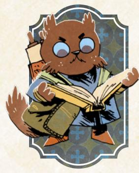

#### Chronicler

The Chronicler is focused on history and learning—on an understanding of truth and the past. Without a Chronicler in play, it's possible to play most of a campaign of **Root**: **Ghe RPG** without ever really contending with issues of false narratives or fake histories, but the Chronicler demands that those issues become real. Emphasize that current powers, current leaders, build their strength on the stories of the

past. Those stories have a real effect on the present, and they are often built on lies. The Chronicler can face those stories, destroy them, strengthen them, and reshape the Woodland through them. What's more, through the knowledge they have gained, the Chronicler can create opportunities to effect real, broad, overwhelming change throughout the Woodland. Remind the Chronicler that they have such a potent tool at their disposal!

- Spread rumors of a valuable secret history or text
- (Dake claims of power and truth based on the past
- Share purposeful lies about history and current events

{152}------------------------------------------------

### Envoy

The Envoy specializes in acting as an intermediary, a deniable asset for use by the factions. Their power lives in their ability to negotiate independently. To give them a chance to show off, make sure that other factions largely treat them as a valuable resource. Any faction will always have a use for an Envoy, even if that use is somewhat... duplicitous. After all, they can send in an Envoy to keep

a foe distracted with diplomacy while the sponsoring faction takes other actions. The Envoy is going to face difficult decisions about how to (and if they should) remain aloof and neutral among the factions just by virtue of constantly dealing with them, so always make sure the factions take a repeated interest in the Envoy and their skills.

- · Offer them a lucrative assignment
- · Blame them for their sponsor-faction's misdeeds or failures
- Confront them with difficult negotiations

#### Exile

The Exile is a vagabond, yes, but they are just as much or more of a player within the War between the factions. Their faction of origin may hate them, and they might never be able to rise back to a high Reputation with that faction (at least, not without really changing the entire leadership of the faction to friendly faces). But they still care and will seek either to repair their Reputation with

their home faction or to find a new home. Expect the Exile to play at the level of factions and influence, and give them offers and rewards that affect those elements of the Woodland. You won't have to do too much to complicate their position in interesting ways—their starting faction relationships and the fiction surround them; the notoriety and prestige they will naturally accrue push them into interesting places. The key as a GM is to recognize the Exile as a truly skilled political player—they might be down and out right now, but no canny operator within any faction would ever ignore the Exile.

- Offer them favors and prestige for difficult jobs
- Provide opportunities to depose unfriendly leaders
- Confront them with the continued problems of their past

{153}------------------------------------------------

#### **harrier**

The Harrier is a smuggler, a courier, and an acrobat all rolled up into one. They're expert at moving, getting into and out of places, and even crossing the Woodland. As such, when you have a Harrier in your game, locations become all the more important. The Harrier needs interesting strongholds to break into, secret passages to discover, and difficult paths to tread. The Harrier's skill

lies in traversal, and NPCs should recognize that too—they'll definitely want to entrust important messages to a messenger who will never fail to deliver.

- Offer them difficult but lucrative jobs
- Confront them with dangerous passage
- Present rumors or evidence of an interesting locale

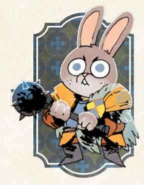

#### heretic

The Heretic is a fervent believer in a dangerous or problematic ideology. The key to helping the Heretic be an interesting full character lies in the balance between skepticism and loyalty—the Heretic cannot be just a doubted mad rabbit or a beloved prophet, but something in between. The Heretic's moves will help the Heretic find some friendly faces scattered around the Woodland,

denizens who actually believe in and share the Heretic's ideology. If someone does have beliefs in accord with the Heretic, the Heretic should feel the difference of having a real ally. But always make sure there are far more who doubt and suspect the Heretic, and who pose a threat to those friendly believers (who, after all, probably aren't vagabonds themselves).

- Offer support and interest from a believer
- Gake away safety with a persecutor
- Provide opportunities to give a speech or sermon to a group

{154}------------------------------------------------

#### Pirate

The Pirate has a ship and requires one key feature—travel along the water. The Pirate doesn't *have* to remain aboard a boat at all times, of course, but their boat means they will likely want to travel along the river or lake when possible. Having a Pirate means making sure the Woodland has appropriate waterways so that the Pirate isn't inherently unable to operate—if you're just starting out, feel free to

add waterways that make sense; otherwise, if you're already playing, the Pirate may not be a good choice for a new player. The Pirate also seeks opportunities for piracy—battling other ships on the water, stealing cargo they might be able to sell, etc. Make sure that the waterways are alive with trade for all the factions.

- \* Chase them on the water or on land
- Spread rumors of appealing targets
- Threaten their ship or their cargo

#### Prince

The Prince is tied to a prior generation of vagabonds, and the issues they face today should be similarly tied to the past. They keep running into their parents' allies, their parents' enemies, and the consequences of their parents' actions—essentially dealing with the fullness of their parents' legacy wherever they go. That doesn't mean the Prince is without chances to define their identity, to claim

their own legacy and path, but opportunities to do so entirely without reference to their parents are few and far between. In effect, the same way that your job as GM is to make the vagabonds' actions have consequences, your job for the Prince is to make their *parents*' actions have consequences that the Prince is still contending with today, for good or for ill.

- Confront them with a terrible truth about their parent(s)
- Gempt them with a chance for recognition on their own
- (Dake them choose to support or walk back their parents' actions

{155}------------------------------------------------

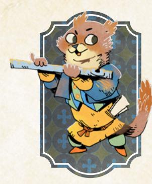

#### Raconteur

The Raconteur is a storyteller, first and foremost. They might be a singer, dancer, actor, whatever—but wherever they go, they don't just spread innocent, harmless entertainments. They spread *ideas*, versions of the world and history and themes that can have consequences, albeit without the Raconteur having precise control over those effects. Oftentimes, the Raconteur will play a more jesterly

role, joking and being lighthearted and playing songs for background color or as a distraction while other vagabonds take direct action. But always ask the Raconteur what stories they are telling, about whom, and what those stories mean—above and beyond all the normal vagabond actions that can have deep consequences, the tales the Raconteur chooses to share can spread like wildfire across the Woodland.

- Challenge them with a rival performer or a distortion of their work
- · Show how the stories they tell can lead to unforeseen ideas spreading
- · Confront them with a demand for direct action

#### Raider

The Raider is a fighter, just as much or more so than the Arbiter or the Champion. But where those playbooks are often about using physical force in service of a cause, the Raider is about a selfish use of force, to get what they want, when they want it, by punching and swinging an axe. As such, the chief issue the Raider most often encounters is a tip towards villainy—they look more like a straight-up

bandit than any other vagabond playbook. Work with the Raider and their player throughout play to help explore the parts of them that are not villainous, that add depth and make them both sympathetic and sympathized with. Ask them leading questions, and confront them with denizens who need help of their particularly combative variety.

- Attack them with an equivalent or greater physical threat
- · Submit to them and beg them for mercy or help
- Reveal a situation that pure force cannot resolve

{156}------------------------------------------------

### Ranger

The Ranger seems a nature-loving loner on the surface, but they're just as much a member of the vagabond band as any other. As the GM, it's your job to help the Ranger stick with the band, giving them opportunities to light out and stealth past danger, while always reconnecting them with the other vagabonds. The Ranger is capable of straight-up confrontation but is often more adept at indirect routes

to victory, slipping away from danger and poisoning foes' food or drink. These are the coolest moments for the Ranger, and if they manage to defeat an entire barrack without ever unsheathing a blade, that's awesome! Just make sure to make moves after that epic victory that push the Ranger back towards the rest of the band.

- Threaten them in a way that requires another vagabond's help
- Offer them paths through shadows
- · (Dake an NPC pass judgment on their tactics

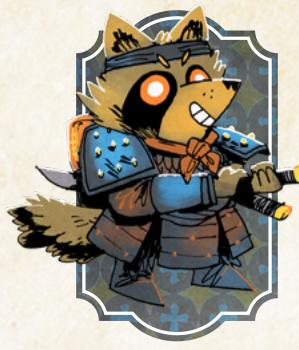

#### Ronin

The Ronin is a masterful warrior in search of something new experiences, new lessons, new skills, new causes, and lords to serve. By asking questions during character creation, try to determine what the Ronin is most interested in, and then constantly provide varied and contradictory examples of that thing throughout their journeys. If everyone playing the game is on the same

page about it, you can bring in the Ronin's nature as someone definitely from elsewhere, especially with how the Woodland factions view the Ronin—they'll often see a dangerous outsider or a useful tool, and they'll try to confront or manipulate the Ronin accordingly. Providing adversity similar to this is key to helping the Ronin's journey to find a new place be appropriately dramatic.

- \* Show them new teachers lords and rivals
- · Give them chances to show off their skills, combat and otherwise, to NPCs who underestimate them
- Challenge them with worthy causes to consider and join

{157}------------------------------------------------

#### Scoundrel

The Scoundrel is a miscreant: dangerous, explosive, and chaotic. The upside is that the Scoundrel's responses and actions will largely fall into a comprehensible set—causing trouble and lighting things on fire, for instance. The downside is that a completely unrestrained Scoundrel can actually disrupt the rest of the band's narratives and actions in a way that can grow old fast. As GM, be sure to provide

the Scoundrel with opportunities to light fires, dive through windows, and so on, but also find things the Scoundrel actually cares about and play on them. Invite them to participate by asking them not "Do you care about any denizens who live here?" but instead "Who in this place do you care about and why?" Help them find the hooks they need to be a fully fleshed-out character, chaos and all.

- Ask them questions about what they care about and why
- Provide opportunities for explosive and dangerous action
- Return to the consequences of their actions, good and ill

#### Seeker

The Seeker is an explorer, very likely focused on ruins in particular. Having a Seeker in the vagabond band means that you have to make ruins a presence throughout your campaign, to honor their abilities and their interests. Obviously, not every single session of a campaign needs to be in a ruin, but your go-to solution for forested locations should default to ruins. Where are the bandits

hiding? Where is the lost diadem of the Mole Empress? Where does the special medicinal flower grow? Where is the bear hiding out? In a ruin. In turn, the more you can do to make other PCs' goals and interests live inside the ruins, as well, the more you can do to ensure that every PC is interested in the same adventurous locations as the Seeker.

- \* Bribe them with word about a fascinating location or place to explore
- Present them with opportunities to show off their talents
- \* Attempt to steal from them their spoils or their chances to explore

{158}------------------------------------------------

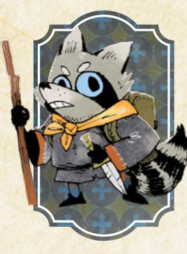

#### **Ghief**

The Thief is an expert at criminal action and roguish feats, and very much a "problem-solver." When they're confronted with a problem that can be solved through their roguish feats, they will try to solve it directly with their high Finesse. It's not at all a problem if the Thief blows straight through some obstacles or challenges without issue; they're likely to pay some costs along the

way, even if they're only using up exhaustion. Don't undermine these moments! Part of the fun of the Thief is using competence and skill to overcome challenges. But then, confront them with other problems, problems they can't overcome by sneaking or stealing—denizens who need to be persuaded, foes who need to be fought blade-to-blade—but where the Thief will need their comrades and will need to think creatively.

- Offer them dangerous jobs to restore worn-down harm tracks
- · Sometimes, directly attack and threaten them
- · Present targets of personal value instead of monetary value

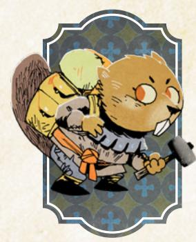

#### Ginker

The Tinker is a technical character, interested in equipment and devices. They can obviate the need for the vagabonds to find friendly smiths and merchants, but they should never entirely resolve those problems—their **Toolbox** move will still require them to periodically obtain additional resources to achieve their goals, and having access to a friend's forge and tools is a common, interesting

requirement. Use the Tinker's Toolbox move to create all manner of interesting challenges by pointing at new characters, new places, and new challenges; the requirements you can set with that move are all designed to generate interesting fiction. Even if the requirement is just about how long it takes, that gives you, the GM, an opportunity to make moves in the world. Having a Tinker in your group means the PCs actually have a way to resolve nearly any problem, even if it takes a lot of time and resources to do so, so always point the Tinker back at their Toolbox move.

- Confront them with difficult, towering problems
- Damage equipment and resources around them
- Provide opportunities to invent impressive new solutions at a cost

{159}------------------------------------------------

### Vagrant

The Vagrant is a charmer and a liar, solving problems with words first and foremost. They're not always inherently sycophantic or groveling, but they often tend to say whatever they need to in order to get their way. A side effect of tricking their way through the world is that the Vagrant will rarely want to return to places they've been—after all, if they left a trail of deception behind them, then

the only thing facing them on a return trip will be the consequences of those lies. As a GM, make sure to give the Vagrant reasons to return where they came from, to show them those consequences in a varied way—some denizens angry, some still believing exactly what the vagabond said—and to help build relationships that can pierce through the Vagrant's tricksy exterior.

- Show them the consequences of their tricks
- · (Dake an NPC believe in and care about them, truly
- Confront them with problems that cannot be talked past

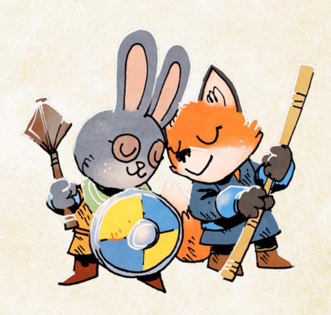

{160}------------------------------------------------

### Wilds at the Edge

Simply running a campaign of Root: The RPG is usually enough to keep any GM busy, but if you'd like to push the boundaries of what you can do while playing the game, here are a few options you can use in your campaign.

### Major Random Events

Your campaign of Root: The RPG covers a longer span of time: your vagabonds move around the Woodland (traveling maybe even weeks at a time), the factions push and pull for control over the clearings, the seasons turn, and the weather changes. The passage of time gives the campaign a chance to show the consequences of actions, to show how the factions' and vagabonds' choices have a real effect upon the Woodland.

But there are plenty of times when something completely unexpected or unforeseen can occur, changing the entire nature of the world and demanding a new response from everyone, be they the leaders of powerful factions or scrappy vagabonds traveling the Woodland.

Major random events are huge and important—not the small-scale random event of "A fire started, and the clearing can no longer produce enough food!" That kind of random event is best served when setting up a clearing's issues and conflicts, made through a GM move. It deeply affects that clearing, but other clearings might never even be aware of what's going on with that smaller-scale event.

Instead, major random events are wide-scale—"A fire in the biggest breadbasket clearing of the Woodland leads to widespread food shortages everywhere!"—reshaping the Woodland all on their own and creating a whole new situation that complicates your story. They are the kind of events that remind the vagabonds that the Woodland is real…and that they, the PCs, can never really control the future of the whole of the setting, no matter which faction they ally with or oppose.

As such, these events are best used sparsely, if at all. They certainly aren't necessary to play a full campaign of Root: The RPG; you can come to a wonderfully satisfying conclusion without ever hitting this kind of major event. If you and your group don't like the sound of some major, surprising event really reshaping the Woodland in the face of all the vagabonds' hard work, then you should leave these random events out of your game.

{161}------------------------------------------------

#### When to Use Random Events

The simplest answer is "when your campaign is stagnating." The objective of using these events is to shake up your world in new and interesting ways. If your Woodland War has achieved a state in which one faction is largely winning and seems unlikely to ever fall behind, these major events can help shake things up again, leaving them uncertain. These moves are here to keep your overarching campaign fresh. So if you find your campaign seems to have arrived in a state where the War has a foregone conclusion, these events are a fantastic tool.

You can also introduce these events into your game in a more procedural fashion.

At the end of every session, roll, taking +1 for each of the following statements that are true:

- The Woodland is currently chaotic, complex, and interesting (not settling down or becoming static)
- You have played five or fewer sessions
- The total number of character advancements among the PCs is six or fewer

On a hit, nothing happens—keep playing as usual. On a miss, however, a major random event comes into play. Roll on the Random Events table, and spend some time between sessions thinking about the exact consequences of the event and how to bring it to the fore.

#### Random Events

| 2d6 | 1–2                                                                | 3–4                                                              | 5–6                                                                         |
|-----|--------------------------------------------------------------------|------------------------------------------------------------------|-----------------------------------------------------------------------------|
| 1–2 | Schemes come to fruition (introduce new faction)                   | Extreme weather slowly damages entire Woodland                   | Dangerous sickness begins to spread among Woodland denizens           |
| 3–4 | Valuable new technology requiring new resource discovered | Losing faction makes submissive alliance (introduce new faction) | Sickness or parasite begins to spread among Woodland plants           |
| 5–6 | A star falls on the Woodland                                    | Massive storm or earthquake reshapes the Woodland                | Winning faction draws ire of "sleeping giant" (introduce new faction) |

The next few sections detail each of these random events in more detail, including giving you some custom mechanics for bringing each event to life.

{162}------------------------------------------------

#### **Schemes come to fruition (introduce new faction)**

A hidden, secret plan that has been growing within the Woodland for some time suddenly comes to fruition, and without warning, a new faction springs to power. Perhaps the Corvid Conspiracy suddenly launches a coordinated cross-Woodland seizure of power; perhaps the Riverfolk Company, after slowly building trust and value as the most important trading house in the Woodland, suddenly restricts prices and trade to control riverside clearings.

This event introduces a new faction into the Woodland and is best suited to introducing a more covert or manipulative faction—it can be good for the Grand Duchy to suddenly launch a concerted surprise attack across the Woodland, but this event wouldn't cover the kind of direct Marquisate invasion, for example, that started the War. This event doesn't require an old faction to be removed from power inherently, but if you would take your faction count up to four or more factions, consider how the scheme's fruition might eliminate one of the other (nondenizen) factions, perhaps just by weakening them to the point of irrelevancy.

To introduce a new faction with this event, pick four target clearings—any four in which the schemers centered their efforts. Suddenly, without warning, this new faction clears out any fortifications or structures of opposing factions from those four clearings and seizes control in whatever way is appropriate to their means. Then proceed to include them in faction rolls as usual [\(page 182\)](#page-182-1).

#### **Extreme weather slowly damages entire Woodland**

A terrible winter sets in, worse than any seen in living memory. A harsh, burning summer makes trees dry and combustible, makes water scarce, and kills crops. This event doesn't happen in a singular moment, and it is best built up to as the PCs come to see signs of the worsening weather over the course of one or two sessions, before its most dramatic effects come into play.

Ultimately, though, the effect is that every clearing in the Woodland suffers the same intense weather. Many clearings will be better suited than others to suffer those ill effects, but that kind of inequality of harm only leads to further problems across the Woodland. Consider how any given clearing's conflicts and issues would change with the advent of these new harsh conditions. And even if time moves on and the seasons would turn again, the aftereffects of the extreme weather won't leave the Woodland quickly.

To show the effects of the extreme weather, give each clearing a Value Health—a numerical representation of the Value the clearing's economy can support. Even though every individual denizen might have a different amount of money, this limited Value represents the overall economic health of a clearing, pushed to the brink by bad conditions.

{163}------------------------------------------------

No individual vagabond can receive more Value (including cleared depletion, worth 1-Value per cleared box) from a clearing than its Value Health without receiving specific or difficult-to-attain aid from wealthier denizens.

| Value Health | Clearing's Financial Health                                                                                                                                                                                                                       |  |
|--------------|---------------------------------------------------------------------------------------------------------------------------------------------------------------------------------------------------------------------------------------------------|--|
| 1–2          | Most clearings without special resources or aid: In the midst of a major Woodland crisis of weather and resources, most clearings will have precious few extra resources to share with vagabonds. A clearing at this level is on the brink. |  |
| 3–4          | A clearing at this level is surviving the crisis relatively intact, though not faring as well as it would if there was no crisis.                                                                                                              |  |
| 5–6          | A clearing at this level is surviving the crisis as well as it would have survived without the crisis—it is set up well with its own resources to weather the harsh conditions.                                                                |  |
| 7+           | A clearing at this level is profiting from the crisis in some way, likely through trade with worse-off clearings.                                                                                                                              |  |

Value Health only rarely changes. For every 3-Value in general supplies or 1-Value of vitally important goods that the vagabonds contribute to a stressed clearing, increase its Value Health by 1.

{164}------------------------------------------------

### Dangerous sickness begins to spread among Woodland denizens

An illness begins to spread across the denizens of the Woodland, affecting most, without regard for species or social status or wealth. The Woodland is not well-equipped for any kind of widespread medical care or public health campaigns, and most clearings would just have to weather the illness.

To show the effect of the sickness, emphasize it in your description of the clearing based on the clearing's Outbreak Rating (see below). To randomly determine if any given NPC is infected, roll a single d6; the NPC is infected on a 1–2 if the clearing's Outbreak Rating is 1, infected on a 1–4 if the clearing's Outbreak Rating is 2, and infected on a 1–5 if the clearing's Outbreak Rating is a 3. The actual symptoms of the sickness and the way it shows itself shouldn't be bizarre or lethal—this isn't a disease that causes denizens' fur to turn purple or causes them to literally burst into flames in the sun. They have fevers, they are tired, they are in pain, they are confused and off-kilter, and they have a hard time being active. An infected NPC should have I fewer exhaustion for a minor infection, 2 fewer exhaustion for a moderate infection, and 3 fewer exhaustion for a major infection.

If PCs come into close contact with the infected without taking any precautions, they roll with Might at the end of the session. On a hit, the PC remains uninfected. On a miss, the PC becomes infected. Once infected, the PC crosses off one exhaustion box—they cannot clear this box at all while infected. At the end of every session, an infected PC rolls with Might again. On a hit, the PC is moving towards becoming healthy; they can uncross one crossed-off exhaustion box, treating it as normal again. On a miss, the infection worsens; they must cross off another exhaustion box. If all their exhaustion boxes are crossed off by infection and they must cross off another, they are in terrible straits—they will die at the end of the session without a cure.

To represent the spread of the sickness when time passes, pick three adjacent clearings where the outbreak has begun, and give one of them an Outbreak Rating of 2 (this is where the sickness began), and the other two an Outbreak Rating of 1. When time passes, roll 2d6, and add +1 to the roll for every 3 total points of Outbreak Rating in the Woodland. On a 7–9, choose one option from below per clearing with an Outbreak Rating. On a 10+, both.

- The clearing's Outbreak Rating goes up by +1
- The disease spreads to an adjacent clearing without an outbreak, giving it an Outbreak Rating of I

On a miss, every clearing's Outbreak Rating decreases by 1.

{165}------------------------------------------------

An Outbreak Rating of 1 means the sickness is spreading in the clearing, but denizens may not be highly aware or fixated on it yet—those who are sick may just remain home. An Outbreak Rating of 2 means the sickness is very apparent in the clearing, and the clearing's functions have been impacted. An Outbreak Rating of 3 means the disease is widespread, and every denizen directly knows at least one other denizen who is infected and in danger.

The disease can be stymied by vagabond action—characters like the Tinker or the Chronicler have their ways to just find solutions, and NPCs throughout the Woodland can use the vagabonds' help in pursuing ancient knowledge, hidden secrets, or lost herbs and resources to make cures. If the PCs get involved with attempts to cure the disease, then the needed components for an NPC to cure the disease should always be clear—if the PCs do secure the proper treatise or the right flowers, then the NPC can create a cure, although it may take some time. But then, those resources—the treatise, the flowers, and even the NPC apothecary or doctor themselves—should be treated as any other incredibly valuable resource of the Woodland. If there is a chance that a cure can be found in the white-orange flowers of the mountain clearing, then every faction in the Woodland will try to secure control over those flowers.

The factions and NPCs of the Woodland will come up with a cure on their own eventually, but it will take even more time.

Whenever time passes, roll 2d6–3 to see if a faction independently invented a cure. Add +1 to the roll for each prior roll of this sort. On a hit, the faction creates a cure. On a 10+, the cure is potent; any clearing to which the cure is distributed reduces its Outbreak Rating by 2 whenever time passes. On a 7–9, the cure is effective but less potent; any clearing to which the cure is distributed reduces its Outbreak Rating by 1 whenever time passes. On a miss, no cure is yet forthcoming.

To determine which faction invented the cure, roll randomly for a particular clearing, and then roll randomly to determine if it is one of the factions present in that clearing, or if it was the denizens themselves.

If you are interested in making the event even more divisive and dangerous, then perhaps one species of denizen remains unaffected—for example, the illness doesn't appear to affect mice nearly as much as rabbits, foxes, or birds. The effect of that kind of unequal distribution of cases could lead to massive strife throughout the Woodland, especially as the denizens seize on any reason at all for the spread of the disease. Every clearing's resources would be strained, and panicked denizens could flock to the most dangerous of voices.

{166}------------------------------------------------

### VALUABLE NEW TECHNOLOGY REQUIRING NEW RESOURCE DISCOVERED

A major technology innovation, powered by a previously disregarded or largely ignored resource, stands to reshape the whole Woodland. Carts, self-moving, powered by the special long-burning yellow trees of the Woodland; weapons, powerful and far-ranging, using the explosive bluerocks from the mountains; and more.

Control of the new technology and the resource required to make it work becomes massively important to the Woodland War—the technology, even if it isn't blatantly martial in its applications, more or less guarantees the victory of a faction that solely controls it. In turn, that means every faction will do their best to find new caches of the resource, to steal plans and documents, to gather its own version of the technology. The conflict between the factions ceases to be about overall Woodland control and becomes centered in this one, primary thing. Suddenly, the places where the resource can be found are the most important holdings.

To introduce the new technology and valuable new resource into the Woodland, decide what the new technology is, what resource it requires, and who in the Woodland developed it. Examples include guns (and a gunpowder analogue), basic engines (and a fuel or steam-power analogue), powerful medicine (which must be made from a particular herb or plant), and a fast-growing hearty crop (which needs a particular climate in the clearing). Pinpoint where the resource is on the map—highlighting the location of a single well-known cache, controlled by the faction in charge of the nearest clearing—and the clearing where the technology is most produced and present at the moment.

Every time you make faction rolls within the core book's system (repeated on page 182), add the following options:

- Minor boon: obtain a usable blueprint of the new technology
- Major boon: discover a new cache of the resource to power the technology

If you are using the full faction system within this book (page 184), focus instead on the fiction tied to those options—a faction might gain a blueprint through research, or by kidnapping artisans from another faction, or by intercepting documents, etc. They might create an alternative synthetic fuel, or discover a new resource cache, or steal a store of fuel, etc. All of these options can be accomplished using their existing mechanics.

{167}------------------------------------------------

#### **Losing faction makes submissive alliance (introduce new faction)**

A faction that is losing the Woodland War—or believes it is losing the War might use any number of desperate tactics and strategies to try to survive. The most desperate? Not giving in to their direct foes—no, every faction is far too proud for that outcome—but instead, pledging some kind of loyalty or submission to another new power to create a partnership that bolsters the losing faction's strength enough to soldier on. The Marquisate or the Eyrie Dynasties could submit to the Grand Duchy or the Riverfolk Company; the Woodland Alliance could submit to the Corvid Conspiracy; nearly any faction could pledge to adopt the Lizard Cult's theology to gain access to the Cult's resources. This event reveals that, true or not, the leaders of the faction in question believed their situation was absolutely dire, and they were willing to bet everything on this submissive alliance…and the introduction of a whole new power to the Woodland.

To represent the new alliance in your campaign, introduce the new faction by supplanting the old. Control of at least half of the old faction's clearings (rounded up) switches to the new faction—the new faction would pick the most favorable clearings to take. The old faction can continue to be a presence, but can never harm or attack its partner. Or the old faction (if you would be at 4+ factions total) can completely fade away, sublimated into and disintegrated by the weight of the new faction. What remains of it would either be a rogue force or a subordinate, nigh-powerless presence.

#### **Sickness or parasite begins to spread among Woodland plants**

The Woodland is its trees, its vines, its berry bushes…its plant life. When some kind of invasive species, parasite, or disease begins to kill off the plants, the result can be just as disastrous as any other unforeseen event—especially as it reshapes the Woodland, both depriving clearings of the ample resources they've come to depend on and creating wide new expanses of cleared-out land. What happens to the Woodland when the dangerous forest that used to keep clearings all but separate (except for the paths) suddenly opens up?

To represent the death of the Woodland's forests, pick one forest where the infection begins—one area bounded by paths, clearings, or the edge of the map. Mark that area as infected. When time passes, take the following steps in order: any ailing forest area becomes dead; any infected forest area becomes ailing; and up to three total forest areas (your choice) adjacent to an infected or ailing forest area become infected.

The infection spreads fairly rapidly and without uncertainty—short of investigating the infection and finding some way to prevent it through 

{168}------------------------------------------------

herbicide or other means, the only way to stop the infection is to burn down the next areas of forest to create a kind of break.

An infected area shows signs of sickness and dying trees; adjacent clearings begin to suffer some ill effects to local plant-based resources, but nothing dire yet. An ailing area has begun to suffer real harm from the damage to the trees and plants; food and resource shortages in neighboring clearings are common. A dead area is full of lifeless trees; they will crack and fall apart in the next significant storm. It becomes much easier to travel, especially for military forces willing to clear-cut the dead trees. Dead forested areas no longer require any special skill or risk to travel; travel over them as if they were paths.

#### **A star falls on the Woodland**

For ages, denizens of the Woodland have looked up, wondering what lives in the sky above them, what lies in the inky blackness, what those twinkling lights might portend. Very rarely, astral phenomena occur and have a major impact on the denizens—when strange, beautiful colored lights dance above, or when the moon disappears all of a sudden. Plenty of lost civilizations seem to have had astronomical knowledge long since lost, and now the denizens rely upon folklore and seers.

So when a star falls from the sky and lands among the denizens, smashing a crater into the earth and burning with an otherworldly hue, it is no surprise that the denizens take notice. The meteorite that lands in the Woodland doesn't have to cause any real damage (though it could) to have a major effect on Woodland psyches, to lead to doomsaying and belief in strange omens and prophecies.

To represent the fall of the star on the Woodland, take your Woodland map and drop a single die on it from about three or four inches above. If the die falls off the side of the map, just drop it again until it stays on. That's where the meteorite lands; add a crater to that location. Any paths beneath it are destroyed; any forest is blown apart; any clearing is left in ruins. In general, the reaction of the factions and denizens depends upon the state of the Woodland, but incorporate the following key motivations when you take your faction turns.

Factions will try to seize control of the crater and the meteorite; the meteorite iron can be valuable in its own way, but the superstitious power of the meteorite might be just as valuable as a symbol of the faction's power and righteous claim to rule.

Individual denizens will try to seize power by interpreting what this means, claiming the fallen star is an omen in favor of this faction or that; as the War rages on, individuals whose predictions happen to be right will rise to even greater power, eventually usurping clearing leadership with new cults.

{169}------------------------------------------------

#### **Massive storm or earthquake reshapes Woodland**

The Woodland is, far and away, a stable place. Storms come and go, but the forests survive, and the land remains stable under denizens' paws. But every couple generations, the Woodland might face a strange, surprising, incredible event—a storm that levels massive swathes of trees, an earthquake that tears the earth asunder, a flood that washes whole clearings into the bay. And now that time has come again, as the Woodland changes in a sudden, violent fashion.

To introduce the effects of a massive storm or earthquake to your Woodland, first decide which event it actually is—if you're undecided, roll 1d6, with evens being a storm and odds being an earthquake.

Then, scatter four dice across your Woodland map. For an earthquake, drop them on the map from about three inches above the center. For a storm, gently toss them onto the map from the edge corresponding to the nearest body of water. (If you aren't sure which edge that is, pick one at random.)

The location of the die represents a heavily impacted area, and the number you roll on the die indicates the severity of the effect in that area.

| Roll | General Effect              | Storm Effect                                                                                                                                                                                                                                                                 | Earthquake Effect                                                                                                                                                                                                                                                                        |
|------|-----------------------------|------------------------------------------------------------------------------------------------------------------------------------------------------------------------------------------------------------------------------------------------------------------------------|------------------------------------------------------------------------------------------------------------------------------------------------------------------------------------------------------------------------------------------------------------------------------------------|
| 1–2  | Significant, but limited | The storm in this area caused damage, harming any nearby clearing, damaging any nearby paths, but not flattening or utterly destroying anything.                                                                                                                 | The earthquake in this area caused damage, destroying buildings and damaging nearby paths but not causing any irrevocable harm.                                                                                                                                              |
| 3–4  | Substantial destruction  | The storm in this area caused substantial damage, flooding or blowing trees all over nearby paths, flattening some nearby buildings, and pushing back the forest. Any nearby clearings are damaged and nearby paths are inaccessible until time passes. | The earthquake in this area caused substantial damage, flattening most of a nearby clearing or causing landslides to cover the entirety of nearby paths. One nearby clearing or path is highly damaged or inaccessible until significant repairs are undertaken. |
| 5–6  | Massive devastation      | The storm in this area wrecked the environment, flattening trees, blasting away clearings, and washing away paths. Any nearby clearings and paths are damaged and inaccessible until significant repairs are undertaken; nearby forest is erased.       | The earthquake in this area left a massive trail of devastation and chasms. One nearby clearing or path is utterly destroyed; others are damaged until significant repairs are undertaken.                                                                             |

{170}------------------------------------------------

#### **Winning faction draws ire of "sleeping giant" (introduce new faction)**

Other factions, the ones not currently active within the Woodland War, are not without their opinions on the outcome of the War. Many of the uninvolved factions don't want there to be a winner in the Woodland War—they'd rather the involved factions just keep warring, weakening themselves and each other, until they are no longer threats in any context outside of the Woodland.

If one faction is actually winning the War, or at least appears to be, then one of the uninvolved factions might step up and enter the War to prevent a winner from coming out on top. An uninvolved Marquise de Cat could invade to stop the Eyrie Dynasties from reasserting control; an uninvolved Riverfolk Company could send plentiful merchants and mercenaries into the Woodland to ensure the Woodland Alliance can't build a new Woodland-wide government that might be able to exist free from the Company's interference; an uninvolved Lizard Cult might send missionaries galore to unite the denizens against the ever-present, controlling talons of a dominant Corvid Conspiracy.

To represent the introduction of a new faction in response to one faction's excessive victory, first determine who is "winning" in the War. The key here isn't any objective measure of success; it's about the faction that appears to be winning to the majority of denizens and outsiders, regardless of any actual facts. The intervening powers may or may not actually understand the situation on the ground—but there is gossip and rumor that points them toward doing *something* to keep another faction from "winning."

Thinking about who appears to be winning can lead you to some interesting outcomes. The Corvid Conspiracy, for example, might rarely appear to be winning because of the largely covert nature of its actions, while the Marquisate might appear to be winning because it controls so many clearings, regardless of how destabilized it actually is. If you have doubt, go with the most overt faction among the possible "winning" factions; factions that have a subtle touch enjoy a bit of anonymity when it comes to the intervention of outside powers hoping to keep the region destabilized.

Once you've determined who is "winning" the War, choose an unintroduced faction who would most have issue with that "winner" actually emerging victorious. For example, if the Woodland Alliance appears to be winning, and the Eyrie Dynasties aren't currently in the War, they would absolutely object to a Woodland in which the Alliance is victorious; they'd make a great faction to introduce in opposition. Because this assessment depends heavily upon which factions are involved in your game, you'll have to make the call yourself, but the Opposed Foes table on the opposite page can give you some guidance.

{171}------------------------------------------------

#### Opposed Foes

| Winning Faction Opposed Foes |                                                         |
|------------------------------|---------------------------------------------------------|
| Marquisate                   | Eyrie Dynasties, Grand Duchy, Woodland Alliance         |
| Eyrie Dynasties              | Marquisate, Grand Duchy, Woodland Alliance              |
| Woodland Alliance            | Eyrie Dynasties, Marquisate, Riverfolk Company          |
| Riverfolk Company            | Corvid Conspiracy, Lizard Cult, Eyrie Dynasties         |
| Lizard Cult                  | Woodland Alliance, Riverfolk Company, Corvid Conspiracy |
| Corvid Conspiracy            | Marquisate, Woodland Alliance, Riverfolk Company        |
| Grand Duchy                  | Marquisate, Eyrie Dynasties, Woodland Alliance          |

Once you know which new faction is going to be introduced, they invade the Woodland. Set them up as having attacked and taken control over two total clearings, one of which came from the "winning" faction, and the other of which came from (if possible) uncontrolled clearings or from clearings controlled by any of the other "losing" factions. Then include them in all new faction turns as appropriate.

### Generational Play

You might bring your campaign to a close with a single massive final struggle, as the vagabonds try to enact their last great change. Or you might simply end your story with the vagabonds still on the road, still searching for answers to their questions and gold to line their pockets. Or you might narrate some final end for each character, declaring an epilogue (page 149) that wraps up each individual story.

Then, you could call it quits...or you could start again with a new generation of vagabonds! Generational play involves taking the "end" of your Woodland, and using it as a jumping off point for a new campaign set years later. The PCs are a new set of vagabonds, and the old PCs are the movers and shakers of the new Woodland.

To set up your campaign for generational play, follow these steps:

- Determine the fate of each vagabond
- Shift forward one or more decades—change the Woodland landscape
- Create new vagabonds, each with a tie to the past
- Play!

{172}------------------------------------------------

#### Determine the Fate of Each Vagabond

Each player can choose a finale for their vagabond, assuming they still live. Have each player choose one option, adding a bit of description to emphasize what the denizens of the Woodland hear or know about the vagabond's fate:

- The vagabond settles down into a clearing and takes up a simpler life
- The vagabond becomes a leading figure of a remaining faction
- The vagabond departs the Woodland for other faraway places
- The vagabond remains active as a roguish independent figure

#### Shift Forward One or (Dore Decades— Change the Woodland Landscape

Next, "time passes" in your Woodland at a high scale. At least one decade, and possibly more, passes. You don't have to define exactly how many years fly by—the only requirement is that enough time passed that the Woodland would "reset," achieving a new form that new PCs can approach with fresh eyes.

When you advance time by one or more decades, take the following steps:

- Add one path—connect two unconnected clearings in proximity to each other.
- Choose any two paths—cross them out. They were overgrown or lost and have not been repaired. To choose at random, drop two dice on your map from three to four inches above, and eliminate the two closest paths.
- Rename one clearing—something has massively changed its structure and identity. Treat that clearing as if it were a brand-new clearing, and think about what cataclysm or other event so thoroughly reset its identity.
- Choose which factions will be active in the Woodland after the time jump. At least one of them should be a holdover; the others can be new or holdovers.
- For holdover factions, roll 2d6: On a 7–9, the faction loses one clearing it had control over at the end of your campaign and gains a different one (determine randomly or choose each). On a 10+, it loses one clearing it controlled and gains two. On a miss, it loses two clearings it controlled and gains one.
- For new factions, add them as if they were new, including their taking control over currently controlled clearings (page 178, and page 228 of the core book).

#### Create New Vagabonds, Each with a Tie to the Past

Create new vagabonds as if you are starting a brand-new campaign, but have each new vagabond declare a tie to at least one of the old vagabonds—maybe they were trained by the older generation; maybe they're hunting a vagabond of the older generation for a crime they may or may not have committed; or maybe the new vagabond seeks to topple the old vagabond's new regime within a faction. And with that, you're good to go!

172): Root: The Roleplaying Game

{173}------------------------------------------------

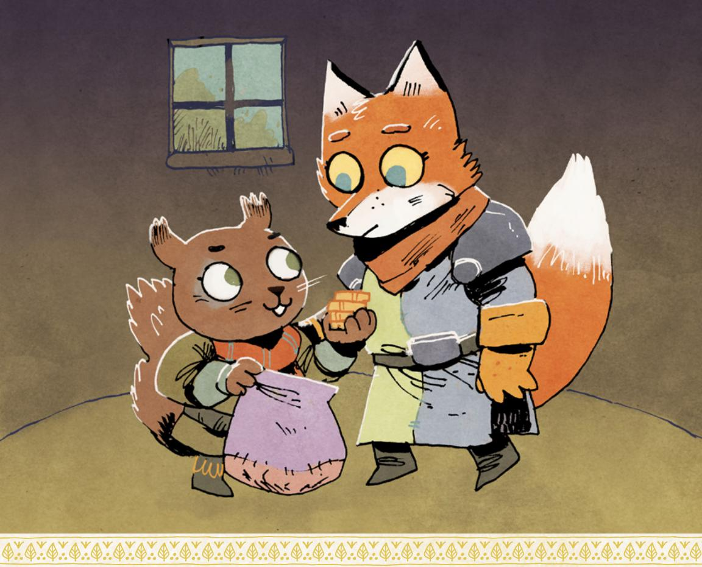

### Moving to a New Woodland

Most denizens of the Woodland think of it in just those terms—*the* Woodland, the only Woodland. The one that matters. There is no other Woodland for them to seek refuge within, for no other Woodland matters quite like this one.

But the forest is enormous, and while this batch of clearings has ample resources, enough to attract the attention of plenty of powerful factions…it's not necessarily the only batch of clearings in the middle of the thick forest. It's always possible for the vagabonds—the individuals best suited to trekking through the depths of the forest to find a new home—to find a new patch of clearings, a new place to continue their story and maybe start anew…

Before undertaking such a journey, however, players and characters alike should understand a few things. There are no easy paths to the next Woodland, no clear trails for the vagabonds to follow. There will be costs to be paid when the band leaves one Woodland for another—costs that cannot be avoided.

{174}------------------------------------------------

#### Graveling Between Woodlands

First, any group thinking of moving away from their existing Woodland should understand that this isn't a small trip. In the fiction, the kind of journey to go to another patch of clearings elsewhere in the woods is long, dangerous, and not easily undertaken. It's not the kind of journey that vagabonds can take regularly—so you're not expanding your Woodland to two different collections of 12 clearings so much as you are replacing it entirely.

To represent this, when vagabonds travel from one set of Woodland clearings to another, they each roll 2d6. On a 10+, they choose two; on a 7-9, they choose three; and on a miss, they choose four.

- Suffer 5-injury; this can be blocked by armor as normal
- Mark 6 boxes of exhaustion and depletion, in any combination
- Lose I piece of equipment of Value 5 or less
- Mark 4-wear (total) on equipment, in any combination

These costs inform the state in which the vagabonds enter the new Woodland—they are tired, spent, and in desperate need of supplies and a good night's sleep. They will need to quickly understand the clearing of their arrival and find some way to get some help or indulge their drives. There are new opportunities—and new factions—for them to encounter, but they begin their lives in the new Woodland under harsh conditions.

### Setting Out on the Journey

To move to a new Woodland, the players and characters should both have a discussion. The decision to go should certainly be unanimous at the player level—if not everybody is interested in leaving the Woodland, then you should discuss exactly why those who want to leave wish to do so, and why those who want to stay wish to do so. As always, this is part and parcel of being on the same page with all players to make sure everyone is having a good time!

It's possible that proposing such a journey might split your band! In that case, the desire for half the band to leave for greener forests might actually be an indicator that those characters are simply ready to retire. There's nothing that says the whole band has to be dragged out into a new set of clearings if half the group is content to deal with their current problems in the Woodland.

In fact, the primary reason to move Woodlands is if the situation in the original set of clearings has become so dire that continuing there is simply untenable. One faction has taken a commanding lead—the story of the War there is functionally

{175}------------------------------------------------

#### Traveling Back Home

In general, players should be discouraged from traveling between sets of Woodland clearings. It's an arduous journey, and any individual set of clearings has plenty of room for storytelling inside of its boundaries. This trip is only for those vagabonds brave (or desperate) enough to make an epic journey across an unfriendly land.

Should the group ever wish to travel back to their old Woodland, however, they must make the same move again. The GM reshapes their old Woodland according to what makes sense in their absence; they should not expect to find it at all similar to what they left.

over. Or one vagabond has achieved such a low reputation with the dominant faction (or even the denizens) that they will be functionally hunted wherever they go; their only option is to leave. Journeying to a new set of clearings can act as a bit of a reset, a chance to start anew; but it is far from a cure-all.

If the band does decide to make the long, hard trip to another Woodland, take a session to settle as many loose ends as you can with the existing clearings and the NPCs who live in them. Now is the time for tearful goodbyes! The band is about to set out on a journey they may never return from, and all of their allies would be interested in seeing them one last time. And there may be a few enemies who might want to take one last swing at the vagabonds before they go...

### Creating a New Woodland

If the vagabonds leave one Woodland for another, the GM creates the new Woodland just as if they were creating one from scratch. It should have no more than one (non-denizen) faction in common with the old Woodland. The factions competing and battling over this new set of clearings can make up a different set, whose struggle has followed a different course so far.

If the players have chosen this option, the GM should be thoughtful about what the vagabonds say they want from their new home. Are they running from an enemy? Seeking riches in far-off lands? Merely looking for new adventures?

The GM should design the new Woodland to play to some of those ideas, but they should also think about what is unexpected or different about this new Woodland. Perhaps the main faction in control is one the vagabonds have not met before their travels; perhaps the treasures they say they seek are located in ruins that are even more dangerous than those they once knew back home.

{176}------------------------------------------------

#### What You Keep

Every vagabond traveling to a new Woodland keeps most everything—their stats, their equipment, their drives, their nature, their advancements, etc. The only thing that changes substantially is their reputation.

Any Reputation with a faction that is no longer present in the new Woodland can be recorded off to the side, and then erased; it won't be actively tracked or changing, and by recording it to the side, if that faction ever does arrive in the new Woodland, or if the vagabond returns to the old, it can be added back into the tracker.

Any Reputation with a non-denizen faction that is present in the new Woodland shifts one full point towards 0. So a Reputation of –2 would become –1; a Reputation of +1 would become 0. The faction still has some knowledge of you from your old exploits, but that knowledge is diluted by distance.

Your Reputation with the denizens resets to 0. This group of denizens is functionally an entirely different community from the other, and they don't have any internal knowledge of you. You can similarly record your old denizen Reputation on the side, in the event you return to the old Woodland.

{177}------------------------------------------------

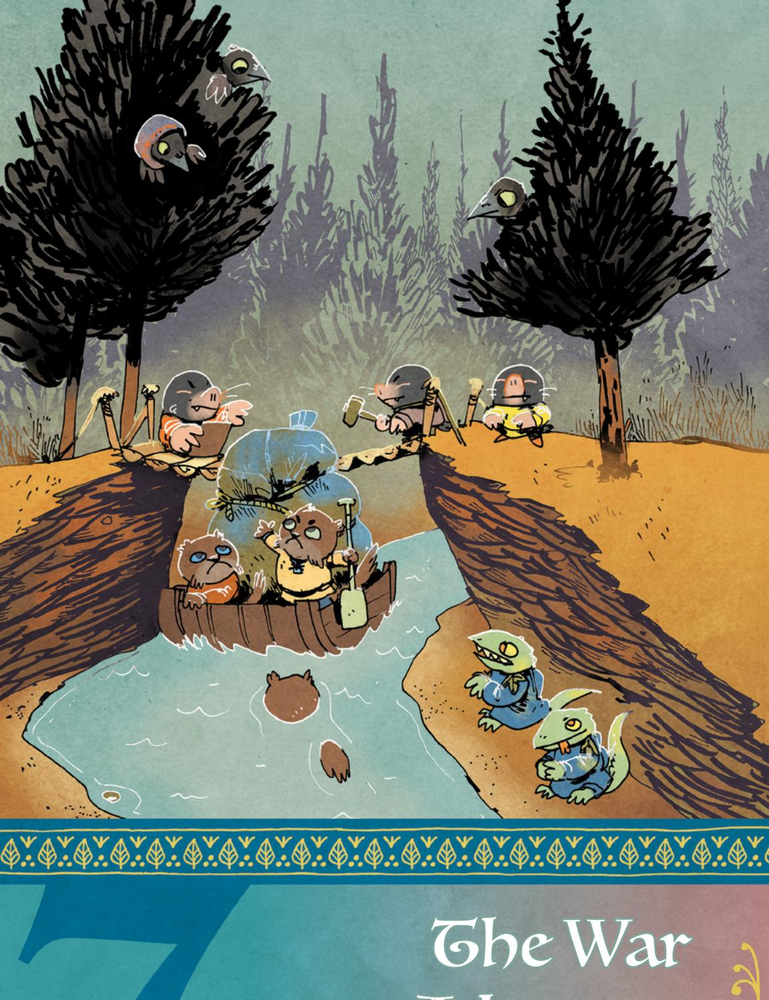

Advances

{178}------------------------------------------------

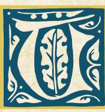

he Root: The RPG core book contains the basic rules for creating your Woodland map and modeling the ongoing War in the Woodland using the faction roll (page 182). This chapter

opens with instructions for adding the four expansion factions—the Grand Duchy, the Corvid Conspiracy, the Riverfolk Company, and the Lizard Cult—to the Woodland map at the start of play, then expands the faction roll to include these new factions and their various actions and machinations.

In addition to that expansion, this chapter also contains a more complex and intricate faction-specific system that creates unexpected, interesting, and unique outcomes with more nuance and detail than the faction roll. The steps of this new faction phase system (page 184) take a bit longer to run through, but the reward is a living, fleshed-out Woodland, all without preplanning every political move, every chaotic event, and every devious scheme.

Finally, this chapter also contains information on using ROOT: A GAME of Woodland Might and Right to set up your game of Root: The RPG. The board game is already a fantastic system for playing out the dynamics of these factions, and it can easily be used to set up your own Woodland for your vagabond band.

### Woodland Setup

### Control of Clearings

When including additional expansion factions, create your clearings and paths as normal (page 224 of the core book), then run through the Woodland setup in the following order: Marquisate, Eyrie Dynasties, Woodland Alliance, Lizard Cult, Riverfolk Company, Grand Duchy, Corvid Conspiracy, and then Denizens. If a faction is not included in your game, skip its setup instructions!

#### Random Clearing

|     |             | 0           |
|-----|-------------|-------------|
| 2d6 | 1-3         | 4-6         |
| 1   | Clearing 1  | Clearing 2  |
| 2   | Clearing 3  | Clearing 4  |
| 3   | Clearing 5  | Clearing 6  |
| 4   | Clearing 7  | Clearing 8  |
| 5   | Clearing 9  | Clearing 10 |
| 6   | Clearing 11 | Clearing 12 |

You can find the rules for setting up all the base factions on page 228 of the Root: The RPG core book, but read on here for the rules for the new factions!

{179}------------------------------------------------

#### Outcast Table

| 1d6 | Outcast Denizen Type |
|-----|----------------------|
| 1–2 | Fox                  |
| 3–4 | Rabbit               |
| 5–6 | Mouse                |

#### Random Corner Table

| 1d6 | Woodland Corner  |
|-----|------------------|
| 1   | Northwest Corner |
| 2   | Northeast Corner |
| 3   | Southwest Corner |
| 4   | Southeast Corner |
| 5–6 | Reroll           |

#### Map Edge Table

| 1d6 | Map Edge |
|-----|----------|
| 1   | Top      |
| 2   | Bottom   |
| 3   | Left     |
| 4   | Right    |
| 5–6 | Reroll   |

#### Fourth: The Lizard Cult

Roll on the Outcast Table to determine which population of denizens is, at the start of play, the most downtrodden and thus the most likely to be interested in the messages of the Lizard Cult. From the clearings where that denizen species is dominant, choose two at random for the Lizard Cult to have presence.

Then, place one garden and give control to the Lizard Cult in a corner of the Woodland. Choose the corner opposite the Marquisate stronghold or Eyrie Roost if possible. If both are in play, choose either of the other two corners at random. If neither is in play, roll for a random corner.

#### Fifth: The Riverfolk Company

The Riverfolk Company almost always enter into the Woodland using waterways, and they place a heavy emphasis on travel across rivers and lakes. If you have not already added a river or a lake to your Woodland, do so now, using the following process.

First, determine randomly if you are adding a river, lake, or both. Roll a die: on a 1–3, add a river; 4–5, add a lake; 6, add both.

To add a river, choose a random edge of the map using the Map Edge Table.

Draw the river moving into the Woodland from that edge, towards the single closest clearing to that edge, so that the river passes into that clearing and past it. Then, determine where the river exits the Woodland.

If you are drawing both a lake and a river, then the river empties into the lake. If you are drawing just a river, roll again for a random map edge—the river exits at that edge. Connect it to the nearest clearing as before. The river will otherwise wind its way between entrance and exit, across and throughout the Woodland.

If you have a lake and a river, then the lake will connect directly to (and either flow into or from) the lake. To fill in the path of the river as it wends its way through your Woodland, drop a handful of dice—about 5 or 6—on the map, from about 6 inches above. Draw the river's course so it winds around those dice, connecting with any clearing it gets particularly close to, and ultimately exiting at the appropriate location.

{180}------------------------------------------------

#### Control vs Presence

In the new additions to the boons, you'll find mentions of "presence," as in "Corvid Conspiracy presence" or "Lizard Cult presence." These factions don't wage war as directly as do the Marquisate or the Eyrie Dynasties, and as such, they must build up presence in a clearing before being able to act. Presence means they have some significant set of agents or supporters in the clearing—a bit like sympathy for the Woodland Alliance, but not focused on building up to an eventual insurgent action.

Presence is binary—a faction either has a presence in the clearing, meaning they have a buildup of agents or resources there, taking action in the clearing, or they don't.

Presence cannot, in and of itself, provide control over a clearing. Every faction that gains presence has an alternative way to gain control of clearings.

Don't track presence for other factions—they are much more militarily oriented, so they are unlikely to have "presences" that can easily coexist with other factions.

To add a lake, choose a single large space adjacent to a clearing. Roll randomly for the clearing using the table on page 178 if needed. The lake begins there. For each nearby clearing, roll 2d6 and subtract –1 for each clearing past the first connected to the lake. If you roll a hit, then expand the lake to connect to that clearing. Don't erase more than two paths to expand the lake, and stop

Then, add the Riverfolk Company. The Riverfolk Company begin with presence in four different clearings. Choose the clearings using the following criteria—the four clearings with the most "yeses" are the four with Riverfolk presence:

- Is the clearing on a lake or river?
- Does the clearing have 3 or more paths connecting it to other clearings?
- Does the clearing have 4 or more paths connecting it to other clearings?
- Does the clearing have any valuable resources in it or nearby?

expanding the lake once four clearings are connected to it.

For the single clearing with the most yeses, give the Riverfolk Company control and place a trading post in that clearing. If there is a tie, break the tie randomly. If the clearing with the most yeses cannot be given to the Riverfolk Company—it includes the Marquisate stronghold or an Eyrie Roost, for example—go to the second most yeses.

{181}------------------------------------------------

#### Sixth: The Grand Duchy

The Grand Duchy begins with a tunnel and an invading force (providing control of the clearing) in a corner of the Woodland. See the Duchy Invasion Table to see which corner to use, depending upon which factions are in play.

Then, for any and all clearings directly connected to that starting clearing, roll 2d6. On a 10+, the Duchy takes control of that clearing.

Finally, roll for a random clearing in the Woodland; reroll if the result is a clearing the Grand Duchy has control of. Add a tunnel to that random clearing.

#### Seventh: The Corvid Conspiracy

The Corvid Conspiracy start with presence spread out across the Woodland. Roll for four random clearings. Each of these clearings starts with Corvid Conspiracy presence, but none starts with Corvid Conspiracy control.

#### Last: The Denizens

As the last step whenever you set up the Woodland, roll to see if control to any of the clearings has returned to the denizens. Do not roll for the Marquisate stronghold, any Eyrie Dynasties Roost clearings, or the Woodland Alliance base clearing. Do not roll for any uncontrolled clearings, either—they simply remain uncontrolled.

Becoming uncontrolled is most often the result of a faction's withdrawal or retreat, or of a faction's forces in that clearing becoming independent. Notably, this is not the result of a Woodland Alliance revolt or uprising.

#### Duchy Invasion Table

| Factions in Play                                | Which Corner the Duchy Invades                                            |
|-------------------------------------------------|------------------------------------------------------------------------------|
| Marquisate, Eyrie, Lizard Cult               | The only corner that no other faction has used as their starting point |
| Any combination of two of the above factions | Either of the two remaining corners at random                             |
| Any one of the above factions                | The opposite corner to that faction                                       |
| None of the above factions                   | Choose randomly using the Random Corner Table (page 179)               |

#### Denizen Control

| 2d6   | Result               |
|-------|----------------------|
| 1–10  | Remains in control   |
| 11–12 | Becomes uncontrolled |
|       |                      |
|       |                      |

{182}------------------------------------------------

### Faction Roll

Here is the simpler system from the core book, reprinted with all boons and moves needed to incorporate all the new factions in this book.

#### Faction Roll

When time passes, roll for each non-denizen faction. Start with the faction that controls the most clearings, then work down the list:

- +I if the faction operated unfettered by PC actions since the last roll
- -I if the faction has recently suffered a blow from the PC vagabonds
- -I if the faction controls the most clearings (and is thus a juicy target)

Add +1 if the faction in question controls the following:

- Marquisate: 5+ total clearings, workshops, sawmills, or recruiters
- Eyrie Dynasties: 2+ Roosts or 4+ clearings
- Woodland Alliance: 3+ sympathy or at least one base
- Lizard Cult: 2+ gardens
- Riverfolk Company: 3+ trading posts
- Grand Duchy: 2+ clearings and at least one market and one citadel
- Corvid Conspiracy: plots in 3+ clearings

On a hit, the faction scores a victory; choose one minor boon. On a 10+, choose another minor boon—in the same clearing or another—or a major boon instead. On a miss, the faction suffers a defeat—it loses control of a clearing (returning it to the control of its own denizens); a fortification or structure (Roost, base, Marquisate building, garden, citadel, market, trading post, or other at GM's discretion); or a valuable resource.

#### **MINOR BOONS**

**Attack**: Take control of a clearing adjacent to one already controlled. If that clearing has fortifications, destroy those instead. If that clearing has no fortifications but has a Roost, a Woodland Alliance base, any Marquisate structures, or a Grand Duchy citadel or market, destroy all of those instead.

**Fortify:** Fortify a controlled clearing with defensive structures and more troops. The next time an enemy faction would take control of a fortified clearing, they only remove the fortifications instead.

**Obtain:** Gain a valuable resource from the forests, ruins, or a clearing. On the next faction roll, the faction takes +2 if it retains control of the resource.

Establish cells: Add sympathy to any two clearings. [Woodland Alliance]

**Stamp cells**: Remove sympathy from all clearings the faction controls. [All factions except Woodland Alliance]

{183}------------------------------------------------

**Build industry**: Construct one sawmill, workshop, or recruiting post in each of two different controlled clearings. [Marquisate]

**Begin/finish building garden**: Begin construction of a single garden in a clearing with Lizard Cult presence, or finish a garden begun on a prior faction roll. [Lizard Cult]

**Proselytize**: Add Lizard Cult presence to any clearing. [Lizard Cult]

**Conduct commerce**: Add Riverfolk Company presence to any clearing. [Riverfolk Company]

**Build trading post**: Construct one trading post in a clearing with Riverfolk Company presence. [Riverfolk Company]

**Connect tunnel**: Build a tunnel from the Burrow to any clearing, making it "adjacent" to the Burrow for the Duchy. [Underground Duchy]

**Build market or citadel**: Build a market or a citadel in a controlled clearing. [Underground Duchy]

**Expand network**: Add Corvid Conspiracy presence to up to two clearings adjacent to its presence. [Corvid Conspiracy]

**Enact plot**: Launch a plot in a clearing with Corvid Conspiracy presence. (A plot here means the Corvid Conspiracy is undertaking illicit action to gain power—exactly what they are doing is up to you.) [Corvid Conspiracy]

**Stamp plot**: Remove all plots from all clearings the faction controls. [All factions except Corvid Conspiracy]

#### **MAJOR BOONS**

**Revolt**: A revolt occurs in a clearing with sympathy; the Woodland Alliance gains a base there, taking control and removing all other faction structures. [Woodland Alliance]

**Build Roost**: Add a Roost to a clearing the Eyrie controls without a Roost. [Eyrie]

**Capture**: Seize an important figure in an enemy faction; that faction takes –1 on all faction rolls while that figure is held captive.

**Rapidly build garden**: Begin and finish construction of a single garden in a clearing with Lizard Cult presence. Take control of that clearing. [Lizard Cult]

**Trade war**: Take control of a clearing with a trade post and add a trade post to an adjacent clearing. [Riverfolk Company]

**Culminate plot**: Bring a plot to fruition, giving the Conspiracy control over the clearing and either destroying or subverting all buildings and warriors in the clearing (as fits the fiction). The plot is not removed—it remains active (think ongoing protection racket, ongoing extortion, etc.). If the Conspiracy loses control, the plot must be stamped out, lest it culminate in a new form. [Corvid Conspiracy]

{184}------------------------------------------------

### The Faction Phase

The faction roll ([page 182](#page-182-1)) is a simple way to handle factions acting whenever time passes. The "faction phase," however, is a more complex and intricate way to handle the same idea, giving each faction a much more robust and unique system that dictates its own actions, plots, and events.

Think of the faction phase occurring whenever time passes, so the faction roll and faction phase are somewhat synchronous. But the faction phase is the series of individual rolls, decisions, and processes you must make in order to fully track the conduct of each faction instead of the quick and simple faction roll that resolves with just a few choices.

| Faction Order Table |  |
|---------------------|--|

| Order | Faction           |
|-------|-------------------|
| 1     | Marquisate        |
| 2     | Eyrie Dynasties   |
| 3     | Woodland Alliance |
| 4     | Lizard Cult       |
| 5     | Riverfolk Company |
| 6     | Grand Duchy       |
| 7     | Corvid Conspiracy |
| 8     | Denizens          |

The faction phase takes more time to implement successfully, but the outcomes are organic and surprising. If you have little time, and you feel comfortable making those dramatic moves on your own according to your agendas, principles, moves, and the established fiction—and using the faction roll system described in the core book—then go for it! But especially early on, if you find yourself questioning exactly what can happen next, these rules are here to help.

In general, follow the faction phase in the order the factions are presented here and listed in the Faction Order Table. Within each faction, follow the steps as described under that header, in order. This is of great consequence for factions like the Woodland Alliance, for example, in that you should first judge military actions, then revolts, then sympathy. If you aren't including a faction in your game, skip it; only do the faction phase actions for factions that are present in the narrative.

For each faction, you'll find a description and its two overarching drives, alongside its instructions for the faction phase. These drives are like an NPC's drives (Root: The RPG core book, page 201) in that they dictate how the organization acts as a whole. But every faction has two drives to represent the two competing impulses at its heart. Any given NPC representative of a faction might represent either drive, a balance point between them, or anywhere else on that continuum.

The overall portrayal section is intended to give you some guidelines for bringing the faction as a group to life—how to think as that faction when you make decisions within these rules, for example. But these factions are not characters. They make the decisions that you, the GM, want them to make for interesting and dramatic action. Don't worry about them making the best possible plan for their success—they'll act in their own favor, but you're better off not spending huge amounts of time planning out exactly what they'll do.

{185}------------------------------------------------

In addition, you might find that an action taken by a late-acting faction, like the Riverfolk Company, might make the actions the Marquisate took earlier in the order make less sense. Why would the Marquise de Cat hire the Company when Riverfolk mercenaries destroyed her keep? In these cases, you might either need to invent a justification based on the fiction—the Company's attack came after the Marquisate purchased resources—or you might need to revisit the Marquisate's actions and reconfigure them to make sense for the fiction you've created.

#### Time Passes

As stated previously, all of the faction-specific rules presented here kick into action during the faction phase, when time passes—that is to say, when you advance the timeline of the Woodland without portraying every individual moment. Time can pass when the vagabonds travel between distant clearings or when they rest and recover, staying in a single clearing for a couple weeks. It is not the case that literally all these actions take place only during those times, but that "time passing" is a useful trigger for knowing when to focus on the larger Woodland War. These events might have taken place simultaneously with the vagabonds' other adventures, and they just didn't hear about them.

A "faction phase" refers to the general notion of time passing, and to the GM using these rules for each present faction to determine what happened to it. Since faction phases likely require some rolling and attention, they are usually best handled either during a break in a single session of play, or between sessions. You don't always have to do a faction phase when time passes, but you should usually try to do so, to make sure the factions are moving and acting.

### Rumors

Changes that the factions might wreak upon the Woodland won't be immediately apparent to the vagabonds unless they wander through the appropriate clearings. Instead, after each faction phase or whenever time passes, each vagabond can pick up rumors from their contacts and the denizens themselves.

When you *pick up rumors while time passes*, roll with your Reputation with a faction of your choice. On a hit, you pick up rumors pointing at one important event or undertaking of that faction while time passed. On a 10+, you may ask a follow-up question. On a miss, you hear a couple of rumors, some of which might be true, some of which might be false.

{186}------------------------------------------------

### The Marquisate

The Marquisate represents an invading foreign power, but not exactly a full-on invading empire. The Marquise de Cat, leader of the Marquisate, represents Le Monde de Cat…but is not its direct agent. The Marquise serves herself and her own ends, and while she must obey the edicts of the home country, her goal is to create a functional, resource-rich, and obedient domain for herself, carving her own fiefdom out of a place Le Monde de Cat does not directly control.

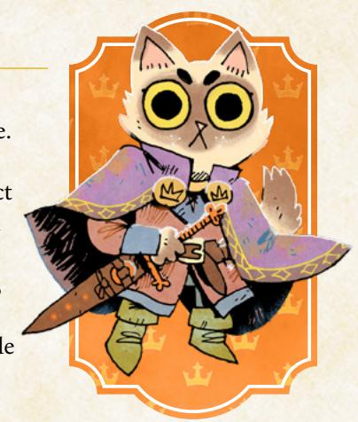

### Portraying the Marquisate

The Marquisate's two overarching drives are:

- ·*To take control over the Woodland and its vast resources (including its inhabitants)*
- ·*To ensure the Woodland is an internally reliant, functional society*

The Marquisate's first drive is all about its imperialistic, colonialist desire for control. The Marquisate wishes to ultimately be the sole real power of the Woodland, although it is content to have de facto power over de jure power, ruling through obedient local leaders.

The Marquisate's second drive is about its desire for the Woodland to be much more than a burned-out, strip-mined, slash-cut husk. The Marquisate does not want to run the Woodland into the ground. Instead, it wants the Woodland to be a bastion of strength. In essence, the Marquisate aims to actually improve the Woodland and its denizens' lives—but ultimately because doing so will benefit the Marquisate.

As an institution, the Marquisate is focused on progress, control, and order. It has a fairly clean and clear hierarchy, but it lacks the resources to accomplish its ends without further bolstering from the Woodland. As such, it will regularly woo the denizens and the clearings, improving their lives so they are more likely both to help the Marquisate now, and to be of greater benefit in the future.

The Marquisate will always focus on building its own strength and on destroying obvious, dangerous opposition. It will sometimes ignore less obvious threats (like the Riverfolk Company or Corvid Conspiracy) to target direct opponents (like the Eyrie).

{187}------------------------------------------------

#### Resources

The Marquisate has numerous resources with which to accomplish its goals. Keep track of the Marquisate's resources on a list when you include the faction in your game. Each resource should refer to a single significant group, installation, or commodity. Generally, think of them as important, "clearing-level" resources—not the army as a whole (because that stretches across all the Woodland), but a significant individual force that could invade a clearing. Not a basic squad of soldiers (because that's not going to affect a whole clearing), but an elite assassination squad that can depose the leader of any clearing. Not just "Iron," but the "Iron of the Limmery Post Mine."

#### Starting Resources:

- The Stronghold and Guard
- The First Regiment Soldiers

#### Sample Resources:

- Sawmill
- Recruiting Station
- Workshop
- Mine
- Farmland
- Elite Soldiers
- Elite Assassins or Spies

Resources exist in the Woodland. They can be destroyed or stolen (especially by the vagabonds). If they are active somewhere in the Woodland (say, for a project), they aren't present elsewhere. You don't have to track every single resource's exact location at all times, but you should have enough of an idea about the resources the Marquisate posseses that you can place them when you need to on the map. If a resource is destroyed or damaged by the actions of another faction, then make sure to remove it from the Marquisate.

Whenever the Marquisate takes a new clearing, it gets at least one new resource. At your discretion, it might get more for particularly rich clearings, based on the established fiction of that clearing and that clearing's own resources and advantages.

At the start of the game, give the Marquisate the resources named above under "Starting Resources," plus one resource of your choice for each clearing it controls.

#### Projects

The Marquisate surged across the Woodland early on because there was no real power to oppose it, but since that time, it has encountered significant resistance and found itself pushed back. It might seem as if the Marquisate is thus fighting a retreating action, being slowly pushed out of its clearings.

Instead, the Marquisate is working towards its goals still, in a slow, inexorable fashion. As it builds up a stronger, more industrialized, more loyal, or more orderly power base, it can start to push back into the clearings it lost, ultimately extending across the whole of the Woodland.

{188}------------------------------------------------

To represent this, the Marquisate works on projects. An individual project consists of a goal, a means, a countdown clock, and major actors.

A project's goal is the intended purpose— "retake Opensky Haven," "build a lumber mill in Windgap Refuge," "create a clockwork army," etc. Nearly anything that might feasibly fit the Marquisate's abilities can be a project, but make sure you split overly large projects into multiple individual projects—so, no "take over the Woodland"! Instead, split that idea into its constituent clearings and the creation of the resources for the overall endeavor. Projects can absolutely include eliminating other factions' presence, sympathy, or plots.

#### Sample Projects

- Conquer [x clearing]
- Build a new sawmill in [x clearing]
- Assassinate [x important NPC]
- Build a new path between [x clearing] and [y clearing]
- Recruit a new force of soldiers from [x clearing]
- · Build new arms and equipment for [x soldier forcel
- Eliminate dissident sympathy from [x clearing]

A project's **means** is the manner by which it seeks to pursue its project. Specifically, choose at least one appropriate resource that the Marquisate is using to accomplish its project. Each resource can apply to one project at a time, as long as it makes fictional sense. If there are no appropriate resources for a project, the Marquisate can't undertake it.

A project's **countdown clock** is a representation of how difficult the project is, and how long it will take to complete. A countdown clock consists of 4, 6, 8, or 10 segments, depending upon whether the project is easy, reasonable, difficult, or far-fetched. An easy project is one that the Marquisate can certainly accomplish with time; a reasonable project is one that has some risks but seems within the Marquisate's capabilities; a difficult project is one that the Marquisate must really stretch itself and its resources to accomplish; and a farfetched project is an outlandish, strange, or exceedingly difficult project, one that will tax the Marquisate substantially.

As the project pushes towards completion, you fill in segments of its countdown clock. If events occur that would significantly set back the project—a targeted clearing is reinforced, or the workshop where the clockwork army is being built is burned down—erase segments from the countdown clock, or eliminate the project altogether. If it's a setback, erase I segment, or 2 segments for a major setback. If the project would have to start over from scratch, erase all segments. If the project is now impossible, then all progress is lost.

A project's major actors are two to three important NPC characters associated with the project, spearheading its efforts. Reuse existing NPCs wherever possible for this.

{189}------------------------------------------------

The Marquisate should always have three projects going. They can be whatever you choose that make sense for the larger organization according to the Woodland situation and the War as a whole.

During a faction phase, when time passes, assign the Marquisate's resources to its projects. Assign them as makes sense to you in the fiction—a resource must be able to actually contribute to the goal for it to be assigned. Each project's means must be assigned to that project. If you cannot assign every one of the Marquisate's resources to projects, that is not a problem—those resources are simply not committed yet.

After resources are assigned to the Marquisate's projects, roll 2d6 for each project, with the following modifications:

- +I for each resource assigned to the project
- ◆ -1 if there is direct opposition to the project, or -2 for significant direct opposition

On a hit, fill in segments of the project's countdown clock equal to the number of assigned resources. On a 10+, fill in 1 additional segment. On a 7-9, one resource assigned to the project is damaged or destroyed. On a miss, unexpected events (weather, a fire, a drought) interfere with the project, stymieing it entirely and destroying one assigned resource.

After the roll, if the clock is not filled, then the project is ongoing; those resources remain committed to the wider project when you pick up play, meaning that they are present in the appropriate clearings, doing the work of advancing the project. During the next faction phase, the Marquisate can reassign those resources or keep them committed, where they will again contribute to the next roll.

When the clock is full, the project comes to fruition, and the Marquisate achieves its ends—gaining new resources, conquering new clearings, or otherwise changing the Woodland as the project suggests. The vagabonds will see these changes if they are in the area, but otherwise, they might only hear about these changes through rumor.

When the project's countdown clock is full, the Marquisate accomplishes its goals regardless of opposition. The opposition might slow it down by removing its resources or undoing its progress with that opposition's own faction mechanics, but once the Marquisate finishes the clock, it conquers the clearing, builds the device, or whatever else the project was intended to accomplish, no matter who opposes the project or what forces they've mustered in opposition.

189

{190}------------------------------------------------

### The Eyrie Dynasties

The Eyrie Dynasties represent the old powers and sovereigns of the Woodland. Once, they ruled the Woodland whole, but now they are stuck in a battle for control with the other, newer powers. They are a feudal, monarchic, bureaucratic, traditional power. Not an invading outside force—the Eyrie Dynasties are rooted within the Woodland—but far from a liberator. Ultimately, the Eyrie is as defined by the internal power struggles among its own nobility as it is by its outward drives.

### Portraying the Eyrie Dynasties

The Eyrie Dynasties' two drives are:

- ·*To reconquer the Woodland entirely*
- ·*To beat back other dangerous, usurping powers*

The Eyrie's first drive is tyrannical and regressive—a desire to control, to conquer, and to command. The Eyrie ultimately would only accept local governments that are explicitly subordinate to and integrated within its own structures. These are the structures of the Eyrie of the past, and the Eyrie Dynasties of the present seek nothing so much as a return to those glory days.

The Eyrie's second drive is paternalistic. The Eyrie Dynasties see the Marquisate for certain as an invading power, and they want to keep the Woodland free of that kind of external meddling. The Woodland Alliance is a dangerous, young, nascent organization—the most sympathetic members of the Eyrie can understand the Alliance's cause but do not believe it has the planning or maturity to actually govern once it is victorious. Other factions are even more alien than the Marquisate—Lizard Cultists, Duchy tunnels, and Riverfolk trading posts all upset the natural order as well! This drive for the Eyrie is all about a desire to protect the Woodland—because the Eyrie does see the Woodland not as a fief or a territory, but as its own home.

As an institution, the Eyrie Dynasties are privileged and grasping. They are led by figures who seek power for themselves and their own benefit, and who then seek to hold onto the power they have claimed. And the Eyrie Dynasties do have power and resources. They have loyalists spread across the Woodland, accumulated stores of treasure and matériel, old guard experienced veterans… plenty that should ease their way into control of the Woodland.

{191}------------------------------------------------

The reason they do not easily seize control is the infighting that results from the struggles between members. It is a rare Eyrie official who is satisfied with their lot, and most are more than willing to use circumstance, Eyrie tradition, and subterfuge in different combinations to take more power. This infighting inherently leaves the Eyrie scattered, unfocused, and poorly prepared to handle crises.

On the whole, the Eyrie will target big, visible powers—in any game in which it is present, the Marquisate is almost always the Eyrie's number one target. The Woodland Alliance appears to the Eyrie as dismissible, until it absolutely cannot be dismissed. Other powers are watched cautiously—as soon as they appear to hold real power, they become targets of the Eyrie's ire.

#### Roosts

Throughout map creation and the rest of the game, the Eyrie Dynasties may build Roosts. A Roost is a center of power, a physical space coupled with an actual bureaucratic structure. A Roost can almost be understood as a combination of a noble court, a small keep or safe building, and a set of governing institutions. In essence, when the Eyrie builds a Roost, they gain direct control over the clearing. The Eyrie Dynasties would, as an institution, like to have a Roost in every clearing, but they are limited to seven Roosts around the map in total. They cannot build another Roost if they already have seven Roosts in the Woodland.

### Bureaucracy

The Eyrie Dynasties are defined by a deeply shifting, changing, and complicated internal bureaucracy and court. There are many nobles and agents and courtesans, all vying for power—such that anyone who is the official ruler or leader might have little to no power compared to their viziers.

To represent this, when time passes, during the faction phase, roll a single die for each clearing the Eyrie Dynasties control. After rolling, gather the dice into sets based on the number showing—all the 1s and 2s, all the 3s and 4s and all the 5s and 6s. If there are more than three dice in a set, start a second set of the same value. For example, if you rolled two 3s and two 4s, you would actually have one set of three dice, and a second set of one die, both with the value "3–4 - Build!"

Each set of dice allows the Eyrie to undertake one action, according to the Eyrie Bureaucracy Table.

However, if the total of all rolled dice is 18 + Number of Roosts or higher—for example, a total dice roll of 23 or more alongside 5 Roosts in the Woodland the Eyrie Dynasties face a major crisis. Take actions on behalf of the Eyrie with the Bureaucracy Table as normal until the dice spent on actions sums up to 18 or higher, and then roll for a random major crisis. Once a major crisis is reached, the Eyrie can take no further actions this faction phase.

{192}------------------------------------------------

#### Eyrie Bureaucracy Table

| Dice Set Value | 1 die                                                                                                            | 2 dice                                                                                                                                                                                         | 3 dice                                                                                                                                                                          |
|----------------|------------------------------------------------------------------------------------------------------------------|------------------------------------------------------------------------------------------------------------------------------------------------------------------------------------------------|---------------------------------------------------------------------------------------------------------------------------------------------------------------------------------|
| 1–2 - Sway!    | Sway the denizens of a controlled clearing to quell dissent or trouble.                                 | Sway the denizens of a controlled clearing to build significant loyalty among a particular cohort; can remove sympathy, a plot, or one faction's presence from the clearing. | Sway the denizens of a controlled clearing to build overarching loyalty across most denizens; can remove all sympathy, plots, and presence from the clearing. |
| 3–4 - Build!   | Begin construction of a Roost or other significant building, or finish a construction already begun. | Begin and finish the construction of a Roost or other significant building.                                                                                                              | Begin and finish the construction of up to two major building projects, Roosts or otherwise.                                                                           |
| 5–6 - Attack!  | Begin an attack on another clearing, or finish (victoriously) an attack already begun.                  | Begin and finish (victoriously) an attack on another clearing.                                                                                                                           | Begin and finish (victoriously) an attack on another clearing. Build a Roost there.                                                                                    |

#### Eyrie Major Crises

| 1d6 | Crisis                                                                                                                                                                                                                                               |  |
|-----|------------------------------------------------------------------------------------------------------------------------------------------------------------------------------------------------------------------------------------------------------|--|
| 1   | Succession Crisis—a natural disaster, illness, or other circumstance outside of control befalls the Eyrie's leadership, destroying one Roost and leading to strife between leading powers of the Eyrie.                                        |  |
| 2   | Tactical Disarray—miscommunications and poor planning abound as the Eyrie are forced to retreat from one of their holdings, ceding a clearing to independence.                                                                                    |  |
| 3   | Hierarchical Disobedience—at least one clearing's governor refuses the orders handed down by the structure of the Eyrie Dynasties, leading to the Eyrie's processes grinding to a halt until they can bring the offending clearing(s) to heel. |  |
| 4   | Overthrow—one important NPC of the Eyrie overthrows the dominant regime. Until the regime settles, every individual Eyrie bastion and group is on its own for making decisions and has access only to local resources.                         |  |
| 5   | Internal Dispute—two important NPCs of the Eyrie have a massive dispute in what the Eyrie should pursue next, leading to Eyrie forces across the Woodland receiving conflicting orders and taking unnecessary, contradictory actions.          |  |
| 6   | Resource Misallocation—bureaucratic mishaps lead to one clearing having far too much of                                                                                                                                                              |  |

Whatever crisis you roll occurs at the same time as the Eyrie's other actions and ultimately grinds the Eyrie's forward progress to a halt. The vagabonds can become aware of these either through rumor or by seeing the affected clearings, and they can shift the outcome of these catastrophes. If unaffected by the vagabond band, the catastrophe will resolve itself during the next faction phase, instead of the Eyrie making any other bureaucracy roll during the faction phase. When the catastrophe "resolves itself," the Eyrie more or less return to a state of stability, the specifics of which are decided upon by the GM.

one resource and far too little of another, and a second clearing having the inverse problem!

{193}------------------------------------------------

### The Woodland Alliance

The Woodland Alliance is a new organized rebellion in the Woodland. There have been rebellions and uprisings before, but the Woodland Alliance is noteworthy in its cross-clearing organization and capabilities. While its ability to fight with the Eyrie and the Marquisate at the start of play is very limited, it still has the chance to actually take the Woodland and free it from those powers.

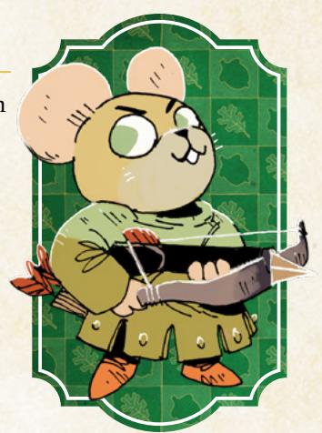

#### Portraying the Woodland Alliance

The Woodland Alliance's overarching drives are:

- ·*To remove any domineering, tyrannical, or outsider power from the Woodland*
- ·*To pave a path to a new and better government order for the Woodland*

The Woodland Alliance's first drive is all about the core nature of its revolt. The Marquisate is a foreign invader—its dominion over the Woodland is both tyrannical and unwanted by the denizens. The Eyrie Dynasties are from the Woodland, but they represent an old, fascist order—they are just as unacceptable. The Woodland Alliance is going to fight back against any and all of those powers until they no longer exert dominant control over any clearing.

The Woodland Alliance's second drive is about hope and the promise of a better tomorrow. At its best, the Woodland Alliance promises a better future, a freer tomorrow, and a new government. Exactly what that government is, the Alliance as a whole does not agree upon. Exactly how this new world will work, that's a problem the Alliance has consigned to tomorrow. But this drive is about how the Alliance pushes towards better outcomes for the Woodland as a whole—a Woodland burned to ashes is contrary to their goals.

As an institution, the Woodland Alliance is bound together by a shared goal to oust the other factions from power in the Woodland. They are defined in opposition to other factions. In practice, this means it's a bit like the proverbial "dog chasing a car." If the Woodland Alliance achieved its goal, and the other factions were entirely ousted, it would fall apart as its myriad members pushed for their own individual visions of what the Woodland should become. That diversity of agents and leadership is a crucial component in portraying the Woodland Alliance—its members largely agree that the other factions must be dealt with, but the exact "how" and "why" vary widely.

{194}------------------------------------------------

Similarly, the Woodland Alliance is not defined by a shared opinion towards the denizens. Some Alliance members are absolutely "hero-of-the-people" types, but others see the denizens' complacency as the reason the Woodland is under threat in the first place. Some would protect the denizens at all costs, while others would easily sacrifice a clearing or two to win the War. Portraying the Woodland Alliance, in general, requires adherence to the fact that the Woodland Alliance and the Denizens are two different factions. Their goals are not in sync.

The Woodland Alliance will always target the other factions with as much practical force as it can muster. It will try to target the strongest faction in the Woodland, but more generally the Alliance will seize any opportunity to strike a blow available to it.

### **Wilitary Actions**

The Woodland Alliance will use its bases and built-up military forces to wage outright war upon the other factions when it can. If the Alliance has a base, they will make use of it!

When time passes, for each base the Woodland Alliance has in the Woodland, it attacks a clearing controlled by another non-denizen faction, connected by paths to a Woodland Alliance–controlled clearing. Roll 2d6 for the attack, with the following modifiers:

- -I if the attacked clearing has a Roost, a stronghold, a fortification, or other notable faction-built defensive structure
- -I if the attacked clearing has any other notable buildup of forces or elite defenders
- +1 if more than one Woodland Alliance-controlled clearing is adjacent to the target
- +1 if the clearing has Woodland Alliance sympathy

On a 7–9, the attack damages the opposing faction's control over the targeted clearing but is unsuccessful at ousting them. The opposition's forces are reduced, their defenses damaged. If they have a Roost, stronghold, or other equivalent fortification structure, then that is destroyed. Sympathy is added to the target clearing (if not already present) to indicate the Woodland Alliance's growing strength in that clearing. On a 10+, the Alliance attack succeeds, and the clearing is now under Woodland Alliance control.

{195}------------------------------------------------

#### Revolt

The Woodland Alliance also seeks "revolts," moments when the Woodland Alliance sympathizers in the clearing can actually surge into action and quickly take control of the clearing, ousting any non-denizen faction previously in control there. Revolts are very open and obvious; after a revolt, the Alliance starts using that clearing as a base of operations for more direct actions, recruiting actual soldiers and deploying them more like one of the other major factions.

When time passes, during the faction phase, after adjudicating sympathy in all clearings, roll to see if any revolt occurs. Roll 2d6 for each sympathetic clearing, with the following adjustments to the result:

- ◆ −2 if the Marquisate keep, Eyrie Roost, or equivalent stronghold of the controlling faction is present
- +I if the denizens are in control of that clearing

On a 7–9, the clearing is preparing for revolt; make a note of such. Attempts to remove sympathy from this clearing during the next faction phase take a -2, and rolling for a revolt from this clearing during the next faction phase takes a +1. On a 10+, the clearing revolts. The Woodland Alliance takes control of the clearing, quickly establishing a base and some openly acknowledged soldiers. The former controller of the clearing is ousted and forced to retreat. If there was a Roost, fortress, or similar base of power there, it is destroyed by the Alliance.

{196}------------------------------------------------

### Sympathy

After taking military actions and staging revolts, the Woodland Alliance gathers "sympathy" in clearings across the Woodland. Sympathy here doesn't just mean localized attitudes favorable to the Woodland—it means that the clearing in question is sympathetic and radicalized enough that, functionally, a Woodland Alliance cell exists in the clearing, and that cell takes actions to push the clearing towards an outright revolt.

Sympathy isn't contiguous, so it can spring up nearly anywhere, as long as the conditions are right and the Woodland Alliance deploys some resources there. But other factions have a tendency to stamp out sympathy, whether that's through direct action (finding cell members and imprisoning them) or by undercutting the cell indirectly (building public sentiment against the Woodland Alliance).

When time passes, during the faction phase, the Woodland Alliance can add sympathy for itself into any two clearings of its choice.

Then, for every sympathetic clearing that is not controlled by the Woodland Alliance, roll to see if that sympathy is stamped out. Roll 2d6 for each sympathetic clearing with the following adjustments to the result:

- -I if the clearing changed control between the last faction phase and now
- → I if the clearing is denizen controlled
- +2 if the controlling faction has a stronghold, Roost, or other fortification in the clearing
- +I if the controlling faction has any other kind of notably strong buildup or presence in that clearing

On a hit, the sympathy in that clearing is wiped out. On a 7-9, that faction takes a -1 to eradicate sympathy in any further rolls during this faction phase.

"Notably strong buildup or presence in that clearing" here means anything that would catch your attention as the GM. If you can't think of anything, then it's not "notable," but this caveat can capture moments where you know the Eyrie is building up military forces in a clearing, or the Marquisate has just constructed a mechanical army near the Marquisate keep.

{197}------------------------------------------------

### The Lizard Cult

The Lizard Cult is a religious movement and organization, drawn in origin from a far-off theocratic power, but taking a new, adaptable form here in the Woodland. The hierarchy at the heart of the Lizard Cult is still part of the teachings of the first missionaries, the lizards who traveled from afar to bring the word of the Great Wyrm to the Woodland. But to convert new members into the Cult, they couldn't adhere only to the strict rules of a far-off place—they had to adapt their learnings to the Woodland, and so they have, capitalizing on a nascent spiritual revolution among the trees.

### Portraying the Lizard Cult

The Lizard Cult's two drives are:

- ·*To improve the lives of the Woodland denizens through good works and good teachings*
- ·*To convert the Woodland denizens in mind and practice*

The Lizard Cult's first drive is a seemingly altruistic one. The Cult's followers build gardens—lush, verdant, full of fruit and medicinal herbs, beautiful and functional—and then share the bounty of those gardens with the denizens. They will defend the denizens from assault, sometimes bodily throwing themselves in front of soldiers to halt the violence. They will share learning with children, spending time day after day teaching important lessons. They will serve and contribute, and they better the denizens' lives.

But the "seemingly altruistic" aspect lives inside the interpretation of "better." Lizard Cult members often focus on the obvious—providing food to the hungry, water to the thirsty, shelter to the homeless. But they also can "improve" the lives of the denizens in ways that the Lizard Cult is confident are good—for example, by insisting the denizens take up arms in holy struggle against their oppressors.

The Lizard Cult's second drive is the more aggressive of the two and represents the Lizard Cult's reason for being in the Woodland in the first place. They aim to spread their faith and their belief as far and wide as possible, and they are willing to take extraordinary action in pursuit of that end. And it isn't enough for them to be satisfied just with acceptance as a part of the Woodland—they ultimately seek total conversion and fully-fledged belief.

{198}------------------------------------------------

As an institution, the Lizard Cult is an odd mix of things: rigid hierarchy and rules; flexible beliefs and practices designed to attract new converts; altruistic intent and actions; and hard-edged fervency. The Lizard Cult doesn't have nearly the organizational or military strength that the Marquisate or Eyrie might, but it is built on a base of followers who are devoted to it and its cause they do not serve the Cult for pay or to keep their families safe, but instead because they believe serving is the right thing to do. That devotion is the Cult's truest strength.

The practices of the Lizard Cult can complicate the degree to which the denizens are receptive towards it. The nature of the sacrifice needed to become a member, the icons and images taken from a place fairly alien to most Woodlanders, the strictness…if the Lizard Cult has had difficulty gaining a foothold in the Woodland, it is because denizens weren't yet receptive to the Cult. But now the denizens are as receptive to the Cult's messaging as they would ever be. Add to that numerous Cult apostles and missionaries who are willing to change the Cult's teachings and practices to better suit the Woodland—even incorporating Woodland beliefs and traditions—and the likelihood of denizens, especially the downtrodden, throwing themselves wholeheartedly into the Cult grows a hundredfold.

The Cult's overall relationship with the other factions of the Woodland lives in that battle for hearts and minds. The Cult has defenders and would fight to protect itself and its members if it had to, but the real struggle is over belief and loyalty. It will work to lure members of other factions into its fold, just as it works to supply aid and succor to denizens and thereby earn their adherence. Where the Cult is met with violence and stamped out, it takes on the visage of martyrdom; where the Cult is met with tolerance and acceptance, it returns the same until its presence has become indistinguishable from the majority of a clearing's occupants.

### Faith and Martyrdom

On the whole, the Lizard Cult will focus its efforts on converting the most downtrodden of the masses in the Woodland. This will practically never be birds—a combination of leftover social inequity from the days of the Eyrie's dominion and elements of Lizard Cult orthodoxy that are fairly anti-avian excludes the birds from being good targets for conversion and mercy—but the rabbits, mice, and foxes of the Woodland are exactly the denizens the Lizard Cult will focus on recruiting.

During the faction phase, determine the four clearings in the Woodland whose denizens are in the most desperate or dire straits. Use your judgment as the GM to make the call on which four clearings those are; if you need to break the tie, you can roll for a random clearing, or roll on the Outcast Table to see which kind of denizen is the most widely downtrodden and viewed with disdain or mistrust across the Woodland and then choose a clearing with an appropriate majority population.

{199}------------------------------------------------

#### Outcast Table

| 1d6 | Outcast |  |  |
|-----|---------|--|--|
| 1–2 | Foxes   |  |  |
| 3–4 | Mice    |  |  |
| 5–6 | Rabbits |  |  |

The four clearings you select are the viable targets for Lizard Cult action—they may have presence in other clearings, seeing as a single Lizard Cult disciple can spread the word of the Great Wyrm and rally some support, but clearings in dire straits represent places where the Cult's efforts to aid the denizens will be most appreciated.

In each of those four clearings, the Cult gains one acolyte, a representative of the Cult who holds real sway in the clearing. The Cult gains one more acolyte for every garden in the Woodland. The Cult also gains an acolyte for every action another faction takes against it—removing its people, destroying its gardens, etc. These extra acolytes must be assigned to one of the four dire clearings, as the Cult desires.

The Cult can "spend" acolytes to make changes—using their influence to achieve an outcome. The acolyte must build up influence before acting again. The Cult will always act if it has enough acolytes to take an appropriate action within the clearing, but it won't take an action it doesn't have to take, and it won't repeat the same action unless necessary. For example, the Cult won't convert denizens a second time unless its first group of converts has been imprisoned.

The Cult will always work its way down the list of acolyte actions within a clearing, advancing towards building a garden and securing control there. The Cult will always tend to build gardens instead of converting gardens, but if it gains extra acolytes because it was attacked by other factions, that might give it the extra impetus needed to convert a garden outright.

#### Acolyte Actions

| Acolytes Spent | Action                                                                                                                                                                                                                                                                |
|----------------|-----------------------------------------------------------------------------------------------------------------------------------------------------------------------------------------------------------------------------------------------------------------------|
| 1              | Convert denizens - a small group of denizens within the clearing are converted to the Cult, granting presence within the clearing.                                                                                                                                 |
| 2              | Convert forces - a small set of faction forces within the clearing are (secretly or publicly as appropriate) converted to the Cult.                                                                                                                                |
| 3              | Remove threats - through intimidation, violence, pressure, or other means, non converted threats to the Cult in the clearing are removed; this action can eliminate fortifications and other structures, as well as sympathy and presence of enemy factions. |
| 4              | Build a garden - the Cult builds a new garden in the clearing, taking control from whatever faction had been dominant and establishing a strong, stable sect there.                                                                                                |
| 5              | Convert a garden - the Cult converts an existing faction structure into a garden, taking control and successfully converting the majority of the faction's presence and forces in the clearing instead of ousting it.                                           |

{200}------------------------------------------------

#### Inquisition

The other factions of the Woodland strongly dislike the Lizard Cult—not only is the Cult alien and strange, but it also has the potential to unravel the careful control the other factions have spent time building up across the Woodland. Whenever possible, the other factions do their best to remove Cultists from the clearings they control.

After spending acolytes, roll to see if the Lizard Cult's presence is removed by controlling factions, upset by its rhetoric and its preaching. Roll once for the entire Woodland, modified by the following:

- +I if the Lizard Cult has presence in six or more clearings
- +I if the Lizard Cult has built three or more gardens
- -ı if the Lizard Cult has presence in three or more clearings where the outcast denizens are the dominant population
- -I if the Lizard Cult has been the target of any significant military action

On a hit, there is enough anti-Cult sentiment to oust its members from one clearing; determine which clearing randomly from those where it has presence but not control. On a 10+, oust its members from two clearings. On a miss, sentiment is on the Cult's side; it gains presence in a new random clearing.

{201}------------------------------------------------

### The Riverfolk Company

The Riverfolk Company are a mercantile guild, a collection of individual agents, merchants, and mercenaries working together under a common set of rules and an agreed-upon hierarchy. The Company goes where it's lucrative to be and, as an institution, has no problem serving as many sides of a conflict as possible. If the Company became the lifeline, the institution upon which a clearing (or even the Woodland as a whole) depended upon for all its important resources...that would be perfect from the Company's perspective.

### Portraying the Riverfolk Company

The Riverfolk Company's two drives are:

- ·*To make maximum profit from the Woodland, its resources, and its denizens*
- ·*To become the dominant providers in the Woodland*

The Riverfolk Company's first principle is about straightforward acquisitional greed. The Company is a merchant guild, and it exists to make profit through trade. That means the Company wants to capitalize on the resources available in the Woodland, and it wants to capitalize on the existing economies in the Woodland. Every clearing has something to offer, from labor to wood to food to metal, and the Company as an institution is geared to identify those valuables and figure out ways to obtain them and begin selling them for greater wealth.

The Company's second principle is about a more insidious kind of mercantile imperialism. The Company doesn't just want to squeeze every place dry and leave behind an empty husk, as the first principle might indicate. That way lies an ultimate poverty. Instead, the Company wants to become the single dominant provider, keeping the places that provide it with resources functional enough to continue to provide, even as those places become so dependent upon the Company that it more or less controls them.

The Riverfolk Company's dominant ethos is a kind of capitalistic opportunism that is to say, the Company identifies ways to make money, and it pursues those opportunities. That requires both the long-term and the short-term thinking its two principles point to, from trying to immediately and clearly gain wealth, to trying to support communities that might provide a significant return on investment later. But it's always framed around the idea of a very pragmatic sense of gain; there's no point in investment without the chance for profit later.

{202}------------------------------------------------

Individual merchant captains (skippers) might form attachments and pursue connections (or even mercy) in different places, and they might be greeted with cheers and happiness by delighted denizens who desperately need the skippers' shipments of food and medicine. But just as likely, a more mercenary skipper will dock their ship laden with medicinal herbs…and jack up the prices to take the denizens of the clearing for all they are worth.

The Riverfolk Company do not seek direct, forceful control of clearings in the way of many of the other factions. Its members don't aim to occupy or use soldiers to command denizens. But the control it desires—becoming the only provider of consistent, real value, such that even if another faction occupies the clearing with soldiers, those soldiers can't eat if they don't buy from the Company—is still a form of domination. At its most benevolent, the Riverfolk Company can ease the burdens of life in a clearing by providing hard-to-obtain but important resources. At its most insidious, the Company can functionally trap and enslave denizens through debt and dependency on its services.

As a merchant guild, the Company never seeks direct conflict with any faction on behalf of itself, but the Company does have mercenaries at its beck and call if it needs to defend itself. And it is more than happy to sell the services of those mercenaries to other factions, thus sending Riverfolk Company agents into direct conflict—just, on behalf of another faction. But the Company seeks to creep its way into and around other factions' presence, making them dependent and subordinate to the Company's will.

### Debt, Funds, and Trading Posts

The Riverfolk Company, as a faction, try to obtain funds from their actions throughout the Woodland, ultimately using those funds to reinvest, build further infrastructure, and wheedle their way into all the clearings.

At the start of play, the Riverfolk Company have three funds. They receive additional funds from their structures and trade routes, as well as when they cash in debt on other factions. They earn debt from other factions when those factions use the Company's services.

When time passes, during the faction phase, the Riverfolk Company spend the funds they have accrued.

{203}------------------------------------------------

#### Earning Debt

At the beginning of every other faction's turn, that faction may "purchase" Riverfolk Company resources. Crucially, this roll happens on other factions' turns, so make sure you remember to do it if you're using this system and the Riverfolk Company!

On the other faction's turn, roll 2d6, with the following modifiers:

- +I if the faction owes o-debt to the Riverfolk Company
- +I if the faction is losing in a conflict with another faction
- +1 if the faction is in desperate need of aid
- -I if the faction has recently acquired a valuable new resource
- -I if the faction is leading in the Woodland War
- -I if the faction owes 3-debt or more to the Riverfolk Company

On a hit, that faction buys a service from the Riverfolk Company. On a 10+, the faction buys two services. You choose purchased services based on what would be most valuable to that faction. On a miss, the faction doesn't buy any services from the Riverfolk Company and reclaims 1-debt from the Riverfolk Company, reducing their debts owed by one.

#### Services:

- **RIVERBOATS:** A faction that buys riverboats treats all clearings along the body of water as adjacent.
- **MERCENARIES:** A faction that buys mercenaries assigns them to a clearing adjacent to that faction's control or presence; the mercenaries attack the clearing, destroying fortifications or structures, or delivering control of the clearing to the purchasing faction.
- **RESOURCES:** A faction that buys resources takes a +1 on any roll it makes during this turn.

For each service the Riverfolk Company sell to another faction, they take I-debt on that faction, indicating that the faction owes the Riverfolk a sum of money. This isn't a favor or an informal currency—this is straight-up financial credit, and the Company will keep strict track of it.

{204}------------------------------------------------

#### Earning Funds

On its turn within the faction phase, the Riverfolk Company earns a baseline amount of funds based on how it is spread throughout the Woodland:

- I for each functional trading post in the Woodland
- I for every two clearings with a non-tradingpost Riverfolk Company trade contract
- I for every clearing the Riverfolk Company controls

The Riverfolk Company can then cash in debt on any faction to earn additional funds, according to the Debt to Funds Table. By default, the Company will wait until it can cash in 4-debt on a faction before doing so, but if you judge that the Company desperately needs funds for its actions, then it can cash in early at your discretion.

#### Debt to Funds

| Total Debt Cashed In | Funds Earned |
|----------------------|--------------|
| 1                    | 1            |
| 2                    | 2            |
| 3                    | 4            |
| 4                    | 6            |

#### Spending Funds

The Riverfolk Company spends as many of their funds as they can during every faction phase.

| Funds | Action                                                                                     |
|-------|--------------------------------------------------------------------------------------------|
| 1     | Attack a clearing adjacent to Riverfolk Company control (destroying structures and forces) |
| 1     | Send an emissary to any clearing                                                           |
| 1     | Form a trade contract in a clearing with an emissary                                       |
| 2     | Build a trading post in a clearing with a trade contract                                   |
| 3     | Take control of a clearing with a trading post                                             |

"Send an emissary" means that the Riverfolk Company have agents engaging with a clearing over which they do not have control. Imagine this as the Company assigning a skipper and their ship to add the clearing to its trade routes.

"Form a trade contract" means that the Riverfolk Company's representatives in the clearing create a consistent, codified trading arrangement with the government or with important denizens of the clearing in question. The arrangement provides funds to the Company and important supplies to the clearing.

204): Root: The Roleplaying Game

{205}------------------------------------------------

"Build a trading post" means that the Riverfolk Company build a new structure from which to host significant trading conduct over the Woodland, from setting prices to haggling complicated deals to codifying and storing. The trading post means the Company now has a permanent presence in the clearing, guarded by Riverfolk soldiers.

"Take control of a clearing with a trading post" means the Riverfolk Company assume control over the clearing, either indirectly by controlling trade to such an extent that the clearing is at the Company's mercy, or directly by seizing control of its government. The Riverfolk Company cannot seize control of clearings with fortifications, like the Marquisate stronghold or other defenses that allow the factions there to be self-sufficient.

"Attack a clearing (destroying structures and forces)" means the Riverfolk Company work to destroy the assets of other factions. Most likely they attack those assets outright with mercenaries, but "attack" can cover any action the Riverfolk Company would take to deplete those resources directly, including gifting money to other factions so they can do it. Attacking a clearing in this fashion does not grant the Company control over the attacked clearing.

#### Eviction

Finally, the Riverfolk Company might be ousted from clearings where they have presence but not control. Determine the faction that controls the most clearings with Riverfolk Company presence. If there is a tie, go to the faction with the least debt held by the Riverfolk Company. If it's still a tie, determine randomly.

Roll for that faction to see if it ousts the Company from one of its clearings. Roll with the following:

- -I if the faction owes any debt to the Company
- -I if the faction owes 3-debt or more to the Company
- +I if the faction has suffered any ill effects at the hands of the Company or thanks to a Company-sold service
- +1 if the faction is under threat in the clearing(s) in question

On a 10+, the faction removes Company presence from one clearing it controls of its choice. On a 7–9, the Company can instead choose to forgive 2-debt from the faction. On a miss, the Riverfolk Company are secure in that faction's clearings.

{206}------------------------------------------------

### The Grand Duchy

The Grand Duchy (also sometimes known as the Great Underground Duchy or just the Underground Duchy) is a fiercely feudal underground nation. The Duchy is an aggressive, imperialistic power, actively seeking new subordinate fiefdoms and territories to continue to feed the homeland. It has its own parliament and its own complicated internal politics that simultaneously drive further expansion and action and stymie the Duchy's efforts when bureaucracy clogs up. But the Duchy is not to be underestimated—it is the military equivalent of the Marquisate and the Eyrie, with the additional benefit of building tunnel systems that allow it to strike where it chooses without warning.

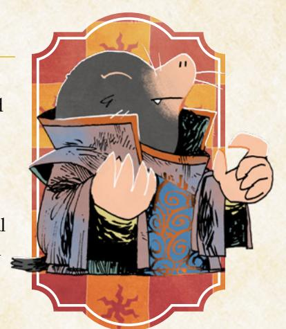

### Portraying the Grand Duchy

The Grand Duchy's two drives are:

- ·*To bring the Woodland to heel under the Duchy's rule and leadership*
- ·*To eliminate chaos, strife, and disorder*

The Duchy's first drive is entirely about domination and control. The Duchy wants the Woodland's resources to be its own, and the only means by which the Duchy is equipped to achieve that end is outright military invasion and control. There is room in this drive for minor variations—for example, areas controlled by a denizen governor who was, of course, handpicked by Duchy operatives to enforce their will. But all in all, the Duchy wants the Woodland to obey when it makes a demand.

The Duchy's second drive is about the primary benefit it offers to the Woodland—stability. The Duchy's actual governance can be exploitative and is often defined by the bureaucratic whims of its own parliament…but at its best, it's far, far safer and more stable than the equivalent status of the average clearing. A Duchy-controlled clearing that faces a flood or a famine, for example, is easily bolstered by additional Duchy resources and agents arriving from underground tunnels. While the Duchy is absolutely an authoritarian state and can be oppressive and tyrannical, it can also eliminate the conditions that make life in the Woodland so difficult.

{207}------------------------------------------------

As an institution, the Duchy is an overbearing tyrannical nation. It has no elected officials, only appointed officers and nobles. The population of nonmoles that call the Duchy home isn't zero, but it's a substantial minority, especially in the Duchy's capital of the Burrow. It sees territories and other populations as resources to be used. It's not impossible that, with a real push for revolution, the Duchy might change—if the system were altered, if new leaders replaced the old, etc. But as an organization, the Duchy is likely to veer closest to straight-up villainy in its aims and goals.

The Duchy's myriad representatives and officers are always themselves trying to balance any sense of righteousness with what they actually are ordered to do. Most of them are used to being cogs in the larger machine, fulfilling the functions to which they are set. Even those in positions of authority are highly aware of the boundaries of what they are allowed to do or say. So while an individual Duchy officer is still a fleshed-out character with a personality and needs and drives all their own, they are also less likely to truly stand out from the Grand Duchy and act in contravention of its desires and goals for any kind of higher ideal.

The greatest challenge for you as the GM in portraying the Duchy will be to add enough nuance that the Duchy can appear as both ally and foe. In that, emphasize both the humanity ("denizenity") of the Grand Duchy's representatives, and the resources and power of the Grand Duchy. The Duchy is an institution that can make huge changes to the Woodland, but it's also an institution that makes changes to its own benefit long before it voluntarily makes life better for the denizens or other factions.

As far as the Duchy's representatives go, they're still characters, with other interests and with personalities, and they're capable of empathy. Some will be monsters, but some will come to care about individual denizens, or even be moved to aid a whole clearing's population. They will run headfirst into the problems of dealing with the larger faction and its own selfish goals, but they can stand as possible allies, just like any other denizen.

As far as the Grand Duchy's power goes, it is both very advantageous as an ally, and very dangerous as a foe. Much like the Marquisate and the Eyrie, its reach and strength are not to be underestimated, and the Duchy is perhaps even better funded and secure in its position than the Marquisate (a relatively unsupported arm of a far-off empire) or the Eyrie (a shadow of its former self and power). In other words, the Duchy is the closest thing to an empire the vagabonds face in the Woodlands; portray it accordingly.

{208}------------------------------------------------

### Duchy Actions

During the faction phase, when time passes, the Grand Duchy takes actions to further its invasion of the Woodland. But it also tries to rally the support of its top leaders in parliament, for without their investment, it's severely hamstrung in what it can actually do.

The Duchy has action points during each faction phase, equivalent to 2 + the number of clearings it controls + any it receives from parliament.

It spends those action points to build new tunnels, invade new clearings, and fortify controlled clearings. Each turn, the Duchy can build one tunnel, perform one invasion, and build a market and/or a citadel in any number of clearings.

First, the Duchy will invest points in building a new tunnel if it doesn't already have one connecting the Burrow to a clearing the Duchy does not control. The tunnel the Duchy builds will always connect the Burrow to a valuable clearing or target. If you can't pick one the Duchy would target, roll for a random clearing.

Then, the Duchy will invest points in invading a clearing connected by tunnel or by path, whichever is cheaper. Finally, it will spend points on other actions, including fortifying clearings and eliminating presence or sympathy from clearings where it has control. The Duchy will invade the most valuable clearing it can afford to invade.

#### Action Point Cost Table

| Action                                                                        | Point Cost                                                                                                                              |  |
|-------------------------------------------------------------------------------|-----------------------------------------------------------------------------------------------------------------------------------------|--|
| Build a new tunnel from Burrow to unconnected clearing                     | 1 + the number of tunnels already built                                                                                                 |  |
| Invade from the Burrow along a tunnel                                         | 4 + 1 for each significant fortification in the target clearing                                                                      |  |
| Build a market or citadel in a controlled clearing                            | 2 each                                                                                                                                  |  |
| Invade from one clearing to an adjacent clearing along paths               | 7 – the number of Duchy-controlled clearings adjacent to the target + 2 for each significant fortification in the target clearing |  |
| Target and remove sympathy, a plot, or presence from a controlled clearing | 2                                                                                                                                       |  |

The action points costs for the Duchy to take any of these actions can be found in the Action Point Cost Table. Some of the ministers who support the War ([page 209\)](#page-209-0) may modify these costs or provide free actions the Duchy can take during the faction phase.

{209}------------------------------------------------

#### Parliament and Sway

Nine ministers make up parliament. They are all important officials, though they can be replaced and deposed. They rarely visit the Woodland directly.

At the start of play, roll a die for each minister—an odd result indicates they are against the War; an even result indicates they are in favor of it. If you end two faction phases in a row with every minister against the War, then the Duchy will withdraw from the Woodland, abandoning its claim by the next faction phase.

| Against | Minister                                                             | For |
|---------|----------------------------------------------------------------------|-----|
|         | Foremole: Builds one market or citadel at no cost each faction phase |     |
|         | Captain: Reduces the cost of tunnel invasion by 1                    |     |
|         | Marshal: Reduces the cost of path invasion by 1                      |     |
|         | Brigadier: Allows for a second invasion along path or tunnel         |     |
|         | Banker: Provides 1 action point                                      |     |
|         | Mayor: Copies another minister's ability at random                   |     |
|         | Duchess of Mud: Provides 1 action point per tunnel                   |     |
|         | Baron of Dirt: Provides 1 action point per market                    |     |
|         | Earl of Stone: Provides 1 action point per citadel                   |     |

After it takes its actions, the Duchy rolls to see where members of its parliament fall on the issue of the Woodland War—whether they can be counted on for support, or whether they are cautiously holding back.

When the Duchy assesses the state of its ministers with regard to the War, roll with the following modifiers:

- +1 if the Duchy has acquired any new clearings or major resources since the last roll
- +I if the Duchy has at least five clearings under its control
- +I if any other faction has suffered a major blow since the last roll
- -1 if the Duchy has lost any clearings or major resources since the last roll
- -I if any faction controls more clearings than the Duchy

On a hit, one minister shifts from being against the War to being for the War, and another shifts from being for the War to being against the War—pick two, or choose randomly. On a 10+, an additional minister shifts from being against the War to being for the War. On a miss, two ministers shift from being for the War to being against the War.

{210}------------------------------------------------

### The Corvid Conspiracy

The Corvid Conspiracy is an anarchic, criminal organization, beholden to no great power and busy launching criminal plots and conspiracies across the Woodland. For the most part, the Corvids operate secretly in hidden cells and places, ostensibly trying to remain out of sight of the authorities of the Woodland.

And yet, the Conspiracy worms its way into everything. Denizens come to owe Conspiracy members numerous favors—the Conspiracy often provides aid and goods without any demand for restitution, knowing that a debt is powerful currency

indeed. Leaders accept Conspiracy bribes and find themselves under the sway of the Corvids. Soldiers sent against the Conspiracy rapidly find that the power of coin may far outweigh the terrible might of the threats the Conspiracy can make…and deliver on.

The Corvid Conspiracy's two drives are:

- ·*To create a subversive cell wherever possible in the Woodland*
- ·*To undermine systems of codified power and authority*

The Corvid Conspiracy's first drive is about ubiquity and having exactly the right agents, favors, and resources in the right places at the right time. The Conspiracy doesn't have the might to go toe-to-toe with any of the fully militarized powers of the Woodland, and likely never will. But the Conspiracy's leaders know full well that they can derail an entire army with the right words placed in the right ears. To do that, they need beaks ready to speak those words wherever and whenever possible. They need agents and allies and pawns all over the Woodland, in the halls of power and in the homes of peasants. They need spies and assassins and thieves and more, ready to act when given the order.

The Corvid Conspiracy's second drive is about the real threat and power of the Corvid Conspiracy—to find the cracks in existing systems, to wheedle its way in, and to spread those cracks wide. No system is ever without its imperfections, and the Corvid Conspiracy's expertise lies in finding those weaknesses and exploiting them. Blackmail, bribery, intimidation, manipulation—whatever it takes, the Conspiracy comes to subvert the will and purpose of codified power and authority, bending it to the Corvid's will. Even the more chaotic powers, like the Woodland Alliance, can fall prey to the manipulations of the Corvid Conspiracy!

210 Root: The Roleplaying Game

{211}------------------------------------------------

As an institution, the Corvid Conspiracy is deeply informal—at least as far as most know. Within its ranks, it has a known and understood hierarchy of agents and chiefs, a clear divide between the corvids who make decisions and the corvids who enact those decisions in the world. But when the Conspiracy interfaces with civilians, its agents act as members of the communities, as one of them. That's not some Corvid Conspiracy chieftain—it's Uncle Goldfoot! Everybody knows you can trust Uncle Goldfoot; he brought food to May when she was starving that one time, and he protected Juster's house from the Marquisate taxcat.

Tied to this is a subtle contradiction built inside of the Corvid Conspiracy its members are simultaneously very well-known and purposefully unacknowledged. Relatively few members of the Conspiracy are fully secret in their roles; most denizens, if pressed, could identify the Conspiracy's agents based on reputation and rumor. But therein lies the dilemma—you would have to press those denizens very, very hard to get them to point a claw in the Conspiracy's direction.

The Conspiracy's existence and acts might never be entirely hidden, but a kind of collective fear and collective appreciation leads to the Conspiracy never being explicitly acknowledged or spoken about. Even the larger factions will avoid referring to the Conspiracy—what self-respecting faction of the Woodland would deal with a criminal conspiracy, let alone allow it to continue to exist in their controlled clearings? What conquering power would want to admit control of a clearing might not extend into the deepest criminal shadows?

And yet most larger factions find themselves needing the Conspiracy, whether to obtain rare or illicit resources, to gain information, or just because the Conspiracy is so interwoven into the clearing's makeup that they can't hope to rule without the Corvids' consent. Vagabonds can often take on roles no one wants to play in a clearing, but vagabonds—by their nature—will leave and move on to other clearings. The Conspiracy is always present. Always watching.

The Conspiracy isn't innately evil or darkly selfish—its members and leadership know well the utility of quid pro quo arrangements, and they do deliver useful, important, or necessary goods and services to many, especially the denizens themselves. Every criminal organization, at some level, must exist to serve some broad need, and many denizens know that the Conspiracy might be willing to provide when no one else will even offer to help.

But agents of the Conspiracy don't ever truly act out of the goodness of their own hearts. Even when they appear to be doing just that, doing favors for denizens with no request for recompense or reminder of debt, they are consciously doing it to earn another currency—goodwill—which they can cash in later.

{212}------------------------------------------------

### Plots

The Corvid Conspiracy acts subtly and quietly in the War, spreading influence and corrupting systems, until suddenly unleashing the might of its traps and accrued resources without warning.

#### Plot Quantity Table

| 1d6 | Number of Conspiracies |  |
|-----|------------------------|--|
| 1–2 | 1                      |  |
| 3–5 | 2                      |  |
| 6   | 3                      |  |

Every faction phase, the Corvid Conspiracy adds

presence to any one clearing in the Woodland. Determine it at random. Then, the Conspiracy launches any culminated plots they planted on prior faction phases.

Roll 2d6. On a 7–9, one plot reaches fruition. On a 10+, up to two plots reach fruition. On a miss, one plot is eliminated and another reaches fruition (if there is a second). When a plot reaches fruition, choose one plot from the list as appropriate for that clearing, and that effect takes place.

Next, the surviving plots encounter opposition from other factions.

Then, the Corvids plant plots in clearings where the Conspiracy has presence. Roll 1d6 on the Plot Quantity Table; place that many plots. No more than one plot may be in any clearing at a time. A "plot" means the Conspiracy is pursuing some secret goal, although you do not have to choose the plot's nature when you place the plot.

The plots affect the clearings in secret, although any faction present becomes aware that something is up. Once the Corvid Conspiracy has placed a plot into a clearing, that plot is advancing towards fruition—on a later faction phase, it might culminate and produce an effect, at which point the plot is over and it is removed.

Each plot has its own effect when it reaches completion. When the Corvid Conspiracy brings a plot to fruition, select an effect from the Plot Effects Table.

#### Plot Effects Table

| Plot Name     | Effect                                                                                                                                                                          |  |
|---------------|---------------------------------------------------------------------------------------------------------------------------------------------------------------------------------|--|
| Bomb          | Remove a fortification from the clearing, or destroy another faction's military forces in the clearing.                                                                      |  |
| Snare         | Destroy or trap a path from this clearing.                                                                                                                                      |  |
| Extortion     | Force another faction in the clearing to take a particular action.                                                                                                              |  |
| Raid          | Capture a leader or valuable resource from a faction, or gain presence in up to three adjacent clearings.                                                                    |  |
| Obtain Favors | Perform some valuable service for local denizens, earning their goodwill and defense—the denizens become a fortification for the Corvid Conspiracy.                          |  |
| Seize         | Take control of vulnerable clearing—lacking significant military presence or fortifications—after successfully Extorting or Obtaining Favors in a previous faction phase. |  |

212 Root: The Roleplaying Game

{213}------------------------------------------------

### The Denizens

The denizens are a "faction" only in that they share information and stories across the Woodland, and in that they generally share a similar goal—to live their lives comfortably and in peace. They may seek fortune or fame in brief moments, but denizens as a whole would rather live quiet, unassuming lives than even consider taking to the road as a soldier or vagabond.

Thus, this faction is the equivalent of "the citizenry," "the civilians," the individuals living throughout the Woodland who are unassociated

or committed to a particular faction, but who are forced to live with those factions' rule and actions, especially the factions that control the clearings in which they live and work.

### Portraying the Denizens

There is generally no need to portray the denizens as a faction—their unity as a group is very weak, defined by their shared position outside of the other factions. The denizens of one clearing can be wildly different in ideology, temperament, history, and culture compared to the denizens of another clearing. They have no driving ideology and only rarely think of themselves as part of a community that extends past their individual clearing or family.

The denizens only have a single drive of note as a faction:

### ·*To live peacefully and comfortably*

For the most part, when individual denizens come to seek a greater goal than a simple and peaceful life, they will likely join one of the other factions. A denizen who decides that the Marquisate could remake the Woodland for the better isn't really *just a denizen* by the time they join up with the Marquisate and march on a new clearing!

The denizen faction as a whole is thus characterized by keeping its head down until it absolutely cannot, taking real action only in the most drastic, dramatic, or intense of cases. The denizens might have an uprising, for example, but that uprising would be a lot less like the organized Woodland Alliance revolt, and more like an outraged mob getting lucky and causing enough chaos and damage to force a faction to retreat.

{214}------------------------------------------------

#### Denizen Uprisings

The only action the denizens take during a faction phase is to sometimes have an uprising that restores control of a clearing to the denizens directly. These moments are rare, though, and likely the result of extreme situations—starvation, abuse, and other chaotic occurrences that arise when the faction governing the clearing can no longer adequately manage their holdings.

Uprisings are unplanned and, therefore, often dangerous and damaging to the clearing—rarely does a denizen uprising lead to a more stable and well cared-for clearing, at least in the short term. A Woodland Alliance revolt is dedicated to seizing the reins of power and establishing a new controlling faciton; an uprising is a riot that hopes to throw out the powers that be without a concrete plan for the future!

A denizen uprising can never happen in a well-fortified and controlled clearing. An Eyrie Roost, a Woodland Alliance base, a Grand Duchy citadel—all would block a denizen uprising. Don't even roll for those clearings. Furthermore, no Marquisate-controlled clearing ever has an uprising—the Marquisate controls its clearings too tightly for the denizens to chaotically revolt. Finally, uprisings generally do nothing to affect non-controlling factions, especially ones defined by presence—the Woodland Alliance, Riverfolk Company, Lizard Cult, and Corvid Conspiracy can all weather an uprising relatively intact, as long as they aren't the ones in control being targeted by the uprising.

During the faction phase, roll for each non-denizen faction-controlled clearing, with the following modifiers:

- +1 if the clearing has undergone intensely oppressive, chaotic, or destructive circumstances
- +1 if the clearing has changed control since the last faction phase
  On a 12+, the denizens of the clearing have an uprising and overthrow
  the controlling faction, restoring control to themselves...at least for
  now.

Uncontrolled clearings are ripe targets for factions seeking to grow a base of power in the Woodland, but denizens who have thrown out the old powers are unlikely to welcome new overlords with open arms. It's not unusual for a faction that controls a nearby clearing to hire vagabonds as neutral diplomats to win over the populace of an uncontrolled clearing so that the faction can move in and take control at a later date.

{215}------------------------------------------------

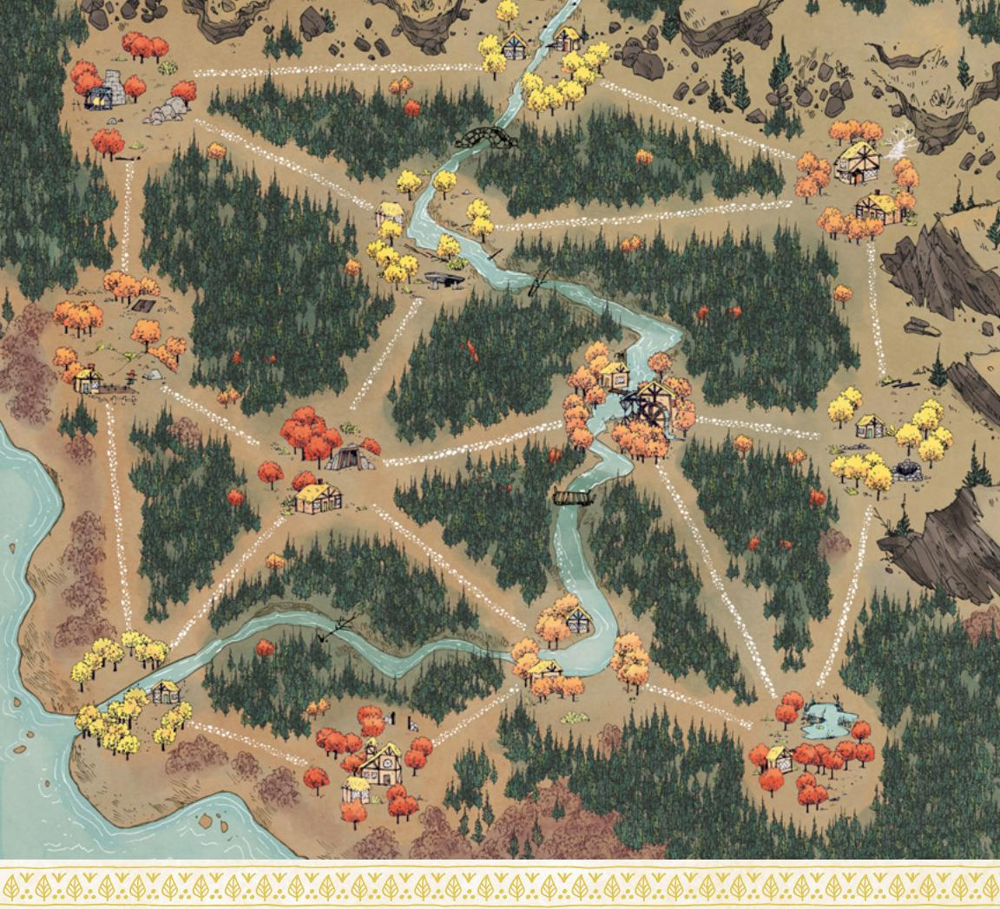

### Using the Board Game

If you have Root: A Game of Woodland Might and Right, you can actually use your board game to help set up your version of the Woodland!

This is a lot simpler than it might sound. Essentially, to create a Woodland using your version of the board game, set up the board game as normal. Choose your map—this will be the map of the Woodland that you use for the entirety of your campaign of Root: The RPG. You can name the clearings later, but the paths, the position of the clearings, and the dominant populations will all be the same.

Choose the factions you're going to play as for the board game—those will be the higher-level factions present in your version of the Woodland for Root: The RPG. DO NOT choose the Vagabond to play for the board game, but any others are fair game.

{216}------------------------------------------------

Then, play three full rounds of the board game! Play it as normal, with every player playing to win, just like a standard version of the board game. A "full round" means that every player has gotten a turn, so by the time you finish, every player will have had three turns.

Then, stop playing, and take note of your Woodland! If you'd like to give it a chance for further dynamism, you can always play a fourth round, but three is likely enough to have an interesting Woodland where things have shifted substantially.

#### Make sure to take note of:

- Which factions are in control of which clearings, including clearings that are uncontrolled (or nigh-uncontrolled—when thinking about it for **Root**: **Ghe RPG**, a single military unit might provide control in the board game but would barely be holding onto control in the fictional setting of your RPG campaign).
- Any buildings built in the Woodland: the Marquisate keep and structures, Eyrie Dynasty Roosts, Woodland Alliance bases, Lizard Cult gardens, Riverfolk Company trading posts, and Great Underground Duchy tunnels/citadels/markets.
- Any ruins located on the map. These shouldn't have changed at all because you aren't playing with the vagabonds, but it's good to note where they are and what clearings they might have been affecting definite jobs that nearby factions will want to hire vagabonds for!
- Any interesting battles or fights that had taken place during those three turns—anything that catches your attention.
   Those fights will leave scars on the involved clearings.
- Any faction-specific resources or tokens—Woodland Alliance sympathy, the current Lizard Cult outcast suit, any Corvid Conspiracy plots, etc.
- The winning (and losing) factions on the point track—this provides a general sense in the Woodland for who is winning and who is losing, and NPCs will act accordingly on all sides of the Woodland War.
- Anything else that caught your attention—betrayals, clever moves, interesting card plays, etc. That can all be fodder for interesting history and events!

At this stage, either roll randomly or decide on the names for your twelve clearings, and then make characters—you're ready to play! You can bring in the events that occurred during the first few turns as the "history" of the Woodland, such as the vagabonds might know it.

If you want to see time pass in the Woodland, you could play another set of turns—or even just a single turn—to represent a few weeks or months passing while the vagabonds rest or travel. Just remember to update your current game board map to reflect whatever trouble the vagabonds caused in your Woodland!

{217}------------------------------------------------

Woodland

{218}------------------------------------------------

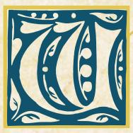

hile the mechanics of Root: The RPG consistently create opportunities for you and your players to engage new conflicts and discover surprising twists in the story, the game often

works best when you take the time to prepare a clearing for the vagabonds before they arrive. Root: Ghe RPG is a game of contested loyalties and difficult choices—themes that are much easier to center for your players when you have taken some time to prepare conflicts, NPCs, locations, and special rules in advance of the session.

This chapter offers some advice about creating your own clearings from scratch, including tips on making the most of the essential components of a clearing, alongside a few new clearings that feature the four expansion factions (page 5) from this book:

- Heartwood is a mouse-dominated clearing controlled by the Grand Duchy, a hotbed of political unrest which Mayor Cornelius VonSkyward is struggling to control...just as his plans to expand the local tunnel network and establish a new artisans guild are coming to fruition. Yet, the Corvid Conspiracy lurks in the background, ready to take advantage of unrest among the local denizens—the ordinary citizens who feel the Duchy hasn't lived up to its promises—by spreading chaos and corruption.
- Sundew Bend is a formerly abandoned clearing—the rabbit-dominated populace burned down their homes and fled the Bend years ago to avoid attempts by the Marquisate to establish an outpost in the area. While the denizens foraged in the woods, staying alive despite the dangers, the Lizard Cult established new, beautiful gardens, supported by the imports of the Riverfolk Company. The return of the denizens to the clearing has left both factions on edge; the denizens want their homes back, but the Company and the Cult don't want to give up what they've built.

Both of these clearings have everything you need to run a session of **Root: Ghe RPG**, including descriptions of all the conflicts, a list of important residents (with stats), important locations, and special rules. They also contain information about what would have happened if the vagabonds never arrived in the clearing, a baseline you can use to judge what will happen if the vagabonds decide (or fail) to intervene.

As always, these clearings contain plenty of room for you to add your own characters, conflicts, and locations. Good luck!

218 Root: The Roleplaying Game

{219}------------------------------------------------

### Making Your Own Clearing

If you want to make your own clearings with new conflicts, the model provided in *Heartwood* (page 221) and *Sundew Bend* (page 238) is a good start for your prep. Here are a few of the core components of a clearing used in all published clearings, alongside instructions for how best to make use of these elements.

### Name and Description

Pick a **name** for the clearing, alongside **a brief description** of the major conflicts you'd like to see the PCs engage with while there. Think also about what the vagabonds might see as they enter the clearing—"At First Sight" text can easily convey the feeling of the clearing as the PCs approach.

#### Conflicts

Since you're playing to find out what happens (Root: Ghe RPG core book, page 197), you don't want to box the vagabonds into a specific conflict with a specific set of outcomes—the joy of playing Root: Ghe RPG is discovering the unexpected adventure! That said, define at least one core conflict and a few additional conflicts you expect to explore through the clearing.

- Core conflicts are the fundamental issues of a clearing, the obvious problems that the vagabonds can't avoid, even if they try. Create one core conflict, then make it obvious there's a problem or issue as the vagabonds enter the clearing.
- Additional conflicts are less readily apparent, perhaps requiring some digging
  on the part of the PCs to understand that a conflict is even happening.
   Think about two to three additional conflicts, tying NPCs and locations
  to them so you're ready to talk about them when the PCs look around!

### Important Residents

The characters whom the vagabonds meet are how the Woodland comes to life, and providing a variety of interesting, exciting, threatening, complicated, and intriguing NPCs is one of your most important goals. Take some time before you play to create useful NPC outlines, complete with harm tracks and drives so you're ready to portray them when they show up in the story. And tie them to conflicts!

### Important Locations

The vagabonds can't see the whole clearing all at once; they need some locations they can understand and engage with as they wander the clearing. Create a few interesting locations that you're ready to use—a mix of dynamic spots that grab the eyes and quieter locales that might house some secrets.

Chapter 8: Clearings of the Woodland : 219

{220}------------------------------------------------

### Special Rules

If your clearing needs special rules, like custom moves [\(page 77\)](#page-77-1), try to design them ahead of time. If you know, for example, you need moves for exploring mines or sailing boats, don't try to design them in the middle of the session!

Not every clearing needs special rules! If you feel like the existing moves and mechanics cover everything you expect the vagabonds to do in your clearing, don't write up a dozen special moves you probably don't need...

### Introducing the Clearing

Finally, take a few minutes before play to think about how to introduce the clearing. Which NPCs will approach the PCs with offers of work or intimidating threats? What conflicts are obviously on display as the vagabonds arrive?

Think also in terms of escalations—specific events you can introduce if the session slows down and you need to ramp up the pressure. Be specific when prepping escalations! It's easy to say "Someone causes trouble," but you will be grateful for your own prep work if you've already decided that "Dru Gale will send soldiers to round up and execute his political opposition!"

### Additional Tips

Once you've got those elements in play, you're ready to go! But here are a few additional tips that might be useful as you prep clearings for your players:

#### Create Messy Situations

In Root: The RPG, there may be individual denizens who are heroic or villainous, but the overall factions themselves cannot be easily defined by good and evil. There might be a noble, kind, caring mouse who offers the vagabonds aid—but she wants absolutely no part in the larger Woodland wars, and will resist anyone who wants to play at war. There might be a villainous bird in command of a contingent of Eyrie forces in the clearing—but if removed from power, their lieutenant will take over, and that lieutenant might be even more dangerous. Make it messy!

#### Tie In Your Players

One of the biggest advantages you have as a GM—over any published material—is knowing your players and their interests. Design clearings that strike right at the heart of the PCs' conflicts, looking for opportunities to challenge their allegiances to their allies and complicate their relationships with rivals and enemies. Don't be afraid to include the denizens they left behind, the ones they defined at character creation, to draw them into their problems!

{221}------------------------------------------------

# Heartwood

### Description

Heartwood is a quiet clearing, a minor rest stop for travelers and an oftenunderappreciated exporter of high-quality lumber. Once known throughout the Woodland for skilled woodcarvers, Heartwood's reputation has waned after it fell under the watchful (and obtrusive) eye of the Grand Duchy.

While mistrust and unrest now flourish within the mouse-dominated clearing, Heartwood was once a symbol of cooperation with the Duchy; swayed by promises of a better life, the residents of Heartwood worked alongside the Duchy to cast off their Marquisate occupiers in the hopes that the Duchy could bring peace and prosperity amidst the Woodland War. The "liberation" of Heartwood was originally cause for much rejoicing among the denizens!

As the Duchy's plans have faltered—and new red tape and regulations have limited exports—many residents openly wonder if they made the right decision. The lumber that was once exported to virtually every other clearing in the Woodland now sits in lumberyards unsold, the proper paperwork required unfiled by the locals denizens who are still struggling to navigate the Duchy's labyrinthine system of approvals and taxes.

Mayor Cornelius VonSkyward has plans to rejuvenate the local economy with a new tunnel that will live up to the Duchy's promises—finally linking Heartwood to other Woodland clearings directly—and a new organization—The Heartwood Artisan Woodcarvers Guild—to oversee the flow of goods and manage the paperwork. Two key mole representatives of the Grand Duchy's parliament, Rufus Arvica and Lucilla Publius, are visiting the clearing to oversee these initiatives; Cornelius knows their approval is crucial.

But the Corvid Conspiracy lurks in the shadows, eager to upset Cornelius's efforts and enact their own plans for the clearing. Crawford Night, Corvid agent extraordinaire, has been working to stoke tensions and create conflict behind the scenes while maintaining a plausibly deniable cover. He wants the incorruptible and stubborn Cornelius to fail so that the Conspiracy can finally install Deputy Mayor Helena Tenpenny, a Corvid agent herself, as Mayor of Heartwood...

{222}------------------------------------------------

### At First Sight

Rust-colored dirt, jagged rocks, and tall evergreen trees surround the wooden buildings that make up Heartwood. The smell of freshly cut wood from the nearby sawmill hangs heavy in the air and leaves little doubt about the importance of lumber to the town's economy.

 Two half-finished, single-story buildings stand near the main road leading into Heartwood's center. The slight weathering of the exposed wooden frames hints that work on these structures halted some time ago.

A large colorfully-painted banner hung across the road is being taken down by a group of mice. The word "Founders" is briefly visible as the denizens neatly fold and flatten the decoration. Voices carry across the road and while the exact content of their words isn't audible from this distance, the unhappy tones and grim expressions of the mice are unmistakable. Two moles in formal military uniforms watch over them as they work.

Intricately carved wooden statues, posts, doors, and railings decorate the entire town, bringing an unexpected beauty to its otherwise mundane buildings.

### Conflicts

Heartwood is beset by many troubles, but the vagabonds are most likely to encounter the following conflicts. One of them—*The Founders' March*—is the core issue for the clearing, while the others are conflicts likely to appear.

### Core Conflict: The Founders' March

Two years ago, the residents of Heartwood helped the Grand Duchy seize Heartwood from the Marquisate, joining the Duchy's military forces in a coordinated strike on the unwitting Marquisate troops. Emerging from tunnels below the clearing, the Duchy's soldiers were met with local supplies, support, and intelligence that led to a clean sweep of the Marquisate's already tenuous hold on Heartwood.

Yet what started as a partnership—the Duchy had promised peaceful civic improvements to the clearing in place of the Marquisate's aggressive military occupation—has slowly degraded as a tremendous amount of Duchy paperwork and regular delays took hold in Heartwood. The denizens of the clearing once believed the Duchy could help them build a thriving trade hub; now the Duchy has imposed daily bouts of paperwork and complex taxes that have strangled the economy and left many out of work.

As tensions rose over the past few years, the Duchy has responded by

222 Root: The Roleplaying Game

{223}------------------------------------------------

demanding greater and greater displays of fealty from the denizens, insisting that old traditions be put aside for new Duchy sensibilities on the issues of the day. Many denizens are bristling under what they increasingly see as a colonial power masquerading as helpful benefactors who never live up to their word.

Nowhere is the conflict more evident than the cancellation of the Founders' Day festival, a beloved annual event that Duchy official Lucilla Publius claims will be used to showcase embarrassing anti-Duchy sedition. The festival has been one of the most successful trade events of the year (even during the Marquisate occupation), but at Lucilla's request, Mayor Cornelius has denied the permits for the event completely! Most residents are outraged, and some appear to be willing to do something about it!

Summer Swiftland, a descendant of Heartwood's founder Valoria Swiftland, is organizing a march, calling upon the angry denizens to stand up for themselves. Initial discussions between Summer—as a representative of the denizens—and Cornelius held some promise for restoring the festival without protests, but Cornelius fears that any concession to the denizens of Heartwood at this point might cost him Lucilla's support for his own projects, the tunnel and the new Heartwood Artisan Woodcarvers Guild.

Each leader involved in the negotiations to address the Founders' March has their own position on the issues at hand:

- Summer Swiftland wants the festival restored, and she's convinced the march could be an efficacious show of solidarity among Heartwood's denizens. She believes the Duchy will offer concessions when faced with a unified population, like an advisory seat in the local government for the denizens or a relaxation of trade restrictions. She is unwavering in her focus on a better future for Heartwood.
- \* Cornelius VonSkyward wants both of his proposed plans—the tunnel and the guild—to be approved by the Parliamentary representatives. Thus, he needs to look like he has Heartwood under control; he wants Summer and other community leaders to publicly support his administration. Ideally, he would also like Summer to step aside and let him run the clearing without any further opposition...

Yet any possible resolution has been derailed by the stubbornness of both sides. Cornelius claims the denizens of Heartwood are simply impatient and need to show some fealty to the Duchy in order to ensure their partnership thrives; Summer says the Duchy has had long enough to show progress and further delays are evidence of their mendacity. Now neither side will even talk to the other at all!

{224}------------------------------------------------

#### How it Develops

*If the vagabonds never arrived in Heartwood, the town guard would imprison Summer and the other denizens who gathered for the chaotic and tumultuous march. Summer would be led very publicly to the town jail...and would never be seen again in Heartwood. The official Duchy statement would be that she was remanded into the custody of officials from the Duchy homeland.*

*Summer's disappearance would inspire "The Ballad of Cornelius VonDuchy":*

*"So lift a mug and remember the mole Who came to town and the dreams he stole Cornelius the fool, the liar, and thief A Grand Duchy of words that led to our grief"*

*As the song spreads, Cornelius would be removed as mayor, humiliated and in disgrace, his plans for the tunnels and the guild both failing as his allies withdraw their support for his continued governance.*

*In his place, Helena would be appointed mayor—the Conspiracy would gain control of the clearing, using it to organize a black market for woodcarvings from the region instead of an open, transparent, and fair guild. The residents of Heartwood would be forced to labor under the dual injustice of the Duchy's paperwork and the Conspiracy's criminal "taxes."*

### Conflict: The Smallest Change

Two things are certain; Duchy bureaucrats always have a form that needs to be filed...and courier Penelope Primrose is always on time. Yet Penelope missed a delivery of crucial documents, leaving Rufus Arvica, aide to the Duchess of Mud, without the paperwork he needs to approve a newly proposed tunnel in Heartwood.

Rufus is worried about Penelope's tardiness. Penelope and her guards travel regularly using the Duchy's system of tunnels; she is unlikely to be lost. Worse yet, the documents in Penelope's possession are quite valuable—plans for Cornelius's new tunnel linking Heartwood to new clearings. And the worst of all, Rufus and Penelope have been in love for some time—though their relationship is riddled with fits and starts as their respective duties call them away from each other.

Rufus has demanded Cornelius send a force to tunnel 1439, Penelope's last known location. Yet Captain Pleasant Strong refuses to deviate from protocol, even when both Cornelius and Rufus demand it. Standard procedure dictates Pleasant must wait another two days before dispatching a search team. Desperate to get things moving, Rufus has asked the deputy mayor, Helena Tenpenny, to see if she can find some way to circumvent the red tape and find someone to locate the courier.

Like any good Conspirator, Helena has an angle. She has already agreed to help Rufus—so long as he agrees not to look too closely at the returned tunnel plans. Helena knows a cursory examination by Rufus would uncover any secret

224 Root: The Roleplaying Game

{225}------------------------------------------------

changes she tried to make, so she needs Rufus's complicity to subtly alter the expansion's route to give the Conspiracy access to the Duchy's tunnel network. Rufus hates the price Helena has set, but his will to say no erodes every moment that Penelope remains missing. Helena, meanwhile, has already begun looking for a good group of agents to find Penelope and alter the plans, and she offers a substantial bonus in addition to the reward already offered by the Duchy.

#### How it Develops

*If the vagabonds never arrived in Heartwood, Rufus would agree to Helena's terms and send out a group of ill-equipped miscreants and ne'er-do-wells—the only crew Helena and Crawford could assemble to do the job in time. That poor group of agents would fail to find Penelope before Captain Strong sends a search party of Duchy soldiers. Helena's crew becomes lost in the tunnels, while the Duchy soldiers discover Penelope and her two guards trapped in the rubble. All three would be dead, slowly crushed under the debris. Despite some damage, the plans would be usable and replacements not needed.* 

*Basic investigation would prove that if the rescuers had arrived sooner, Penelope would have survived. Grief stricken, Rufus would turn his pain and anger upon Helena, accusing the deputy mayor of purposely delaying the search and sending out fools instead of competent agents. Helena would be forced to flee Heartwood to avoid Rufus's wrath, leaving Crawford to manage the Conspiracy...and find someone new to replace Cornelius as mayor.*

### Conflict: A Cook's Tale

Two nights ago, a formal reception for Lucilla Publius, aide to the Baron of Dirt, was marred by an attack. Lucilla came to Heartwood to review the mayor's proposal to create an artisan woodcarvers guild, but the feast planned for the night of her arrival went terribly awry when every guest became violently ill shortly after the soup was served.

Duchy agents quickly discovered small chunks of purple snakeroot in the kitchen's soup pot. Head cook Arlo Cutter was the only member of the kitchen staff seen preparing the soup; he was immediately arrested for the attempted assassination of a Parliamentary official.

Arlo is a beloved mouse resident of Heartwood; everyone is truly shocked at the crime he allegedly committed. Summer Swiftland sees Arlo regularly and has been caring for his daughter Ayla while he is in jail. Arlo hasn't said a word about his guilt or innocence to the local guard, but he has confessed to Summer that he did add the snakeroot, claiming that he wasn't trying to kill Lucilla only make her sick (and teach the Duchy a lesson). Summer can tell Arlo is lying about his reasons, but doesn't know why he would lie.

What Arlo hasn't shared with Summer is that he added the snakeroot to the soup at the not-so-innocent request of Crawford Night and Helena Tenpenny.

Chapter 8: Clearings of the Woodland 225

{226}------------------------------------------------

Crawford smuggled in medicine over the winter when Ayla fell ill, asking for nothing in return; but then some time later, he asked for Arlo's help in removing the dangerous Lucilla Publius from Heartwood. Arlo at first told himself that Crawford's request to add the snakeroot to the soup was a small price to pay for his daughter's life...but as the actual act drew nearer, he became more and more reluctant. Finally, when the time came, he acted—making a "mistake" that avoided Lucilla's death, but hopefully looked convincing enough that Crawford wouldn't deem Arlo's actions a betrayal.

Crawford intended the tainted soup to kill Lucilla and ruin Cornelius's chances of getting the Heartwood Artisan Woodcarvers Guild approved, but Arlo used the snakeroot in the entire pot of soup instead of just Lucilla's bowl. The diluted toxin wasn't enough to kill anyone.

Lucilla became deeply paranoid after what she saw as an obvious assassination attempt by an idiot—the only reason she survived was because Arlo was a fool. Her increasing paranoia and contempt for Heartwood drives her to ever greater heights of tyrannical commands...and making her all the more demanding of Cornelius, raising the bar on the loyalty and commitment he must show to the Duchy for his own projects to be approved.

Crawford wishes Lucilla had simply been removed, but he also thinks there is almost no likelihood of the Heartwood Artisan Woodcarvers Guild receiving any kind of approval from the paranoid and angry Lucilla. The crow has shifted his focus to other conflicts that might derail the mayor's plans. Crawford is counting on Arlo's fear for Ayla's safety to keep the mouse cook's snout shut. Summer knows that Arlo didn't intend to kill anyone, but she has had no luck convincing him to offer up any information that might explain further.

Lucilla herself has also asked for any denizen with information about the attempt on her life to come forward under an agreement of amnesty. She senses a deeper hand at play and wants to get to the bottom of it. So far, no one has taken her up on her offer.

#### How it Develops

*If the vagabonds never arrived in Heartwood, Arlo would be convicted of treason, attempted murder of a parliamentary official, attempted murder of 17 Duchy citizens, and sentenced to public execution. At Lucilla's order, soldiers would go door to door forcing denizens out of their homes and businesses to watch Arlo's sentence carried out.* 

*Fear of the Duchy's power and might would be palpable over the coming days. Lucilla would see to it that the Duchy deemed Heartwood's denizens as untrustworthy and dangerous, ensuring they and Cornelius lose their chance at building the woodcarvers guild and also lose their voice in guiding Heartwood's future. Ayla would continue to live with Summer and in time officially become part of her family.* 

{227}------------------------------------------------

#### Form 17b: Confirmation of Danger

Several woodcutters have gone missing and Chance Blackwood, chief woodcutter, has asked for help from Captain Pleasant Strong from the Duchy's guard force. The Captain's unit is responsible for security for that logging section of the forest. Despite his claim that he can't act because no one in his squad has proof of danger, Chance suspects it is simply cowardice. She has collected a small number of coins and baubles from the families of the missing workers in hopes of either bribing the guards or hiring vagabonds with the skills to help.

The official Duchy policy requires guards to abide by the criteria laid out by Form 17b: Confirmation of Danger. The form requires verifiable eyewitness statements, proof of major injury, a verified presence of an impending threat, or proven loss of life. Captain Strong is the arbiter of what is considered verification of danger.

Woodcutters have started working in pairs to minimize danger but even that hasn't kept people safe. Today Chance's sister Daphne and fellow woodcutter Kevin disappeared while felling a tree in the backwoods. The only evidence at the worksite was a small torn piece of bloody fabric, an unusual mark in the upper part of a tree, and drag marks that enter the woods but quickly disappear. Chance is sure that the mark on the tree came from a bear's claw but Captain Strong claims it is simply an errant axe mark.

Given the direction of the drag marks and the possible presence of a bear, she has an idea where its den might be. Chance is frantically trying to find denizens with the skills to back her up in the search for the two latest missing woodcutters. She knows that going alone means certain death but she is running out of options. Other workers want to help but worry about what will happen to their families if things go badly.

#### How it Develops

*If the vagabonds never arrived in Heartwood, Chance would go after Kevin and Daphne on her own. She returns badly injured but still breathing. Her wounds would be the final piece that would force Captain Strong to complete Form 17b and hunt down the ursine predator.* 

*Sadly, Kevin and Daphne would not survive to be rescued. The giant bear would be killed and the remains of other missing denizens discovered in its den. Captain Strong would receive honors for his bravery and become something of a local hero to townsfolk after they hear a distorted form of the truth, telling how he single-handedly felled the beast and wept over the remains of its victims.* 

*Chance would eventually recover from her injuries but be unable to ever work as a woodcutter again due to her damaged arms. Her bitterness at seeing Captain Strong celebrated as a hero would drive her to move away from Heartwood and seek work elsewhere in the Woodland.*

{228}------------------------------------------------

### Important Residents

| EXHAUSTION INJURY WEAR MORALE                                                                                                |  |
|------------------------------------------------------------------------------------------------------------------------------|--|
| <b>DRIVE:</b> To gain political powe                                                                                         |  |
| Moves:  • Stop progress with a request for paperwork • Confuse with political doublespeak • Use the system to achieve a goal |  |
| • A satchel of forms • A magnifying glass                                                                                    |  |

#### Cornelius VonSkyward

Cornelius is certainly a pompous bureaucrat of a mole with an intense love of power and procedure. He is also a public servant that takes his responsibility to the Duchy and those under his leadership seriously. He wants to grow Heartwood into something special and genuinely doesn't understand why the denizens are so impatient. From his perspective, the system takes time but it works. He is on the cusp of making the Heartwood Artisan Woodcarvers Guild a reality, which would be a major political win.

| ☐ EXHAUSTION                         |  |  |
|--------------------------------------|--|--|
| ☐ INJURY                             |  |  |
| WEAR                                 |  |  |
| □□□□ MORALE                          |  |  |
| <b>Drive:</b> To keep Heartwood safe |  |  |

- Teach with the power of song
- Build trust through honesty
- Step forward to lead

#### **EQUIPMENT:**

- · Small lute
- Locket with a small painting of her mom inside

#### Summer Swiftland

Summer's ties to Heartwood are rooted in the town's founding mice. She carries on the Swiftland family tradition of leadership and offering guidance to any residents in need. The weight of that responsibility sometimes wears her down but her desire to affect change for those that need her never wavers. In good times, she can often be found singing in the town square near city hall. She sings songs that cover Heartwood's history, tells folk tales, and mourns the losses of those that came before.

{229}------------------------------------------------

| □□□□ EXHAUSTION                    |  |  |
|------------------------------------|--|--|
| ☐ INJURY                           |  |  |
| □□ WEAR                            |  |  |
| □□□ MORALE                         |  |  |
| <b>Drive:</b> To make the delivery |  |  |

#### Moves:

- Move improbably fast
- · Head in the right direction
- Produce a key for any lock

#### EQUIPMENT:

- Oversized ring of keys
- Courier pouch
- Hidden dagger

### Penelope Primrose

Penelope is a plucky mouse with a heart for adventure. Some question her sense of selfpreservation in the execution of her duties, and she is the most highly respected courier in the entire Grand Duchy. After the death of her parents, Penelope was taken in by a loving mole family that raised her in the traditions of the Duchy. Through them, she learned the importance of serving the Duchy and its leaders. She takes great pride in her ability to make every delivery given to her, safely and on time. She has had a love affair going on with Rufus Arvica for some time now, albeit only when the two find each other in the same location—she loves the way he sees the tunnels as alive and beautiful, though she can never see herself settling down, with him or any other.

**Note:** Penelope should start with 2-wear, 2-exhaustion, and 1-injury marked if she is discovered while still crushed by the debris in the tunnel.

| EXHAUSTION |
|------------|
| INJURY     |
| WEAR       |
| MORALE     |

**DRIVE:** To place Helena Tenpenny in the mayorship of Heartwood

#### Moves:

- Blend anonymously in a crowd
- Turn strangers into friends with the right offer
- Apply pressure with a vicious threat

#### **EQUIPMENT:**

- Hollow walking stick
- Notebook filled with random letters and numbers

### Crawford Night

Upon first meeting, Crawford looks for all the world to be a very average, friendly, and straightforward crow. Crawford prefers to help people in their darkest time without asking anything in return. This gives him emotional leverage over others that doesn't break down easily—his assets are among the most loyal in the entire Conspiracy. But there are times when kindness is not a viable option. In those moments his target hears the darkness of his voice when issuing a threat. Few ever live long after seeing the cold indifference in his eyes when he follows through.

{230}------------------------------------------------

| □ E  | XHAUSTION |
|------|-----------|
| ☐ II | NJURY     |
| □ W  | /EAR      |
|      | IORALE    |

**DRIVE:** To provide for and protect Ayla

#### Moves:

- Share a bit of food or drink
- Quietly take decisive action
- Describe a heartwarming memory of his daughter

#### EQUIPMENT:

- Meat cleaver
- Thick canvas apron

#### Arlo Cutter

Arlo is an exceptional cook, loyal friend, and devoted family mouse. His cakes, breads, stews, and roasted vegetables are well known and coveted throughout the area. While many think of chefs as loud and boisterous personalities, Arlo is a soft-spoken mouse that listens respectfully to those around him. The one exception is when he is with his daughter, Ayla. The pure loving joy and enthusiasm that they share together is a gift to all that witness it. All of this paints a picture of a soul that none in Heartwood ever expected to poison anyone, let alone attempt murder—but Arlo will never say or do anything that could put Ayla in even more danger by implicating Crawford.

**Note:** The listed equipment represents what Arlo would normally be carrying, but he is currently imprisoned, and has none of it.

#### **EXHAUSTION** ☐ INJURY WEAR MORALE

**DRIVE**: To save the woodcutters and her sister

#### Moves:

- Fell the strongest of barriers with an axe
- Display knowledge of the forest
- Discover a path in the deepest woods

#### EQUIPMENT:

- Double headed axe
- Sharpening stone
- Thick leather belt

#### Chance Blackwood

Chance is a thick-armed mouse that leads the local woodcutters. She takes her responsibility as their leader and advocate very seriously. Chance grew up in the woods and is the third generation of her family to make their living from forestry. She is deeply concerned with the recent disappearance of her fellow woodcutters, and distraught with the disappearance of her sister Daphne today. She has previously worked hard to keep morale up with an unending stream of terrible and usually inappropriate jokes, but now she uses those jokes to hide what she can of her panic. Her gruff nature and good humor are appreciated during these difficult times.

{231}------------------------------------------------

|                                                   | EXHAUSTION |  |
|---------------------------------------------------|------------|--|
|                                                   | □□□ INJURY |  |
|                                                   | □□□ WEAR   |  |
|                                                   | □□ MORALE  |  |
| <b>Drive:</b> To gain glory while avoiding danger |            |  |
| Moves:                                            |            |  |
| Rally the troops to action                        |            |  |
| Attack with precision                             |            |  |

- Shield himself from danger

#### EQUIPMENT:

- Standard issue armor
- Shield
- War pick

### Captain Pleasant Strong

Captain Pleasant Strong is an ambitious soldier who has managed to move his way up the ranks primarily on the strength of his paperwork and ability to take credit for the work of others. On the surface, he is the model mole of a Duchy soldier. In reality, he is a coward that cares little for the world around him. His carefully crafted facade of the heroic protector covers his unwillingness to risk his personal safety unless absolutely forced to.

| EXHAUSTION |
|------------|
| INJURY     |
| WEAR       |
| MORALE     |

**DRIVE:** To tighten the Duchy's fist around Heartwood

#### Moves:

- Issue a decree to stymie denizen power or growth
- Make a sudden decision to seize power
- Point out the flaw in a plan

#### **EOUIPMENT:**

- Ledger
- Case of quills
- · Large ink bottle

#### Lucilla Publius

Lucilla serves the Baron of Dirt and acts as the final word on what new business ventures and investments the Duchy allows to move forward in Heartwood. Her job requires her to be equal parts actuary, accountant, logistician, and sage. Lucilla strives to understand situations in their entirety and to solve puzzles no matter who is involved. This has served her well in her position over the years but also made her several enemies in the Duchy's upper ranks. Lucilla has little patience for the shortsightedness demonstrated by most of her fellow parliamentarians, Rufus Arvica in particular. After the assassination attempt on her life, she is becoming more and more harsh, more and more convinced that Heartwood cannot be of any profit or use without strict Duchy control.

{232}------------------------------------------------

| ☐ EXHAUSTION |
|--------------|
| □□ INJURY    |
| WEAR         |
| □□□ MORALE   |

**DRIVE:** To save Penelope and serve the Duchy

#### Moves:

- Decry a wasteful decision
- · See through faulty logic
- Get needed supplies suddenly

#### **EQUIPMENT:**

- Set of blueprints
- Official wax seal of the Duchy
- Pick axe

#### Rufus Arvica

Rufus is a mole with a lifetime's accumulation of dirt in his claws. His entire life has been devoted to the Duchy's system of tunnels, their growth, and the legacy he will leave behind. To Rufus, the tunnels are the intersection of art and engineering. Where others see a labyrinth of tunnels, he sees a beautifully intricate system of arteries carrying life to every part of the Duchy. Just about the only thing he sees as more beautiful is Penelope Primrose. with whom he has a torrid romance whenever their work carries them to the same place. In general, he strives to ensure that few resources are wasted in the ever-growing expansion of the Duchy's reach. He is always seeking to better understand the intricacies of politics and looks up to Lucilla Publius as a mentor and role model.

| EXHAUSTION |
|------------|
| INJURY     |
| WEAR       |
| MORALE     |

**Drive:** To become mayor of Heartwood

#### Moves:

- Falsify documents
- Deescalate a situation with placating words
- Lie with practiced ease

#### **EQUIPMENT:**

- Pouch of incriminating documents
- Skeleton key
- Mayoral wax seal

#### helena Genpenny

Helena is the deputy mayor of Heartwood and a mole that most describe as timid upon first meeting her. She is one of the last people her superiors suspect of being an agent for the Corvid Conspiracy but that relationship has allowed her to move up the Duchy's political ranks. Coldly calculating, Helena does what is in her best interest without remorse or ego. Cornelius adores her and considers Helena a trusted friend.

{233}------------------------------------------------

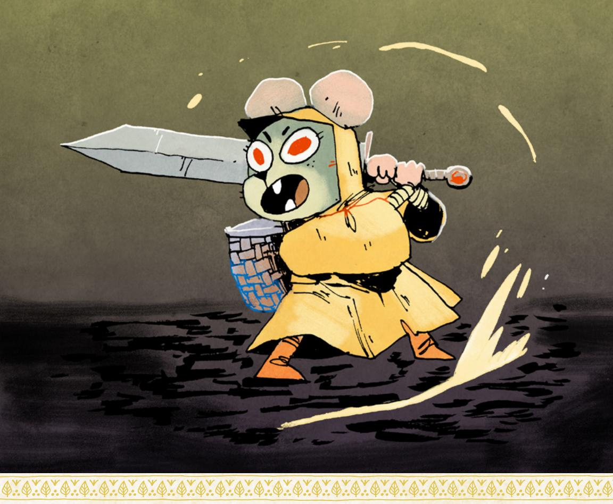

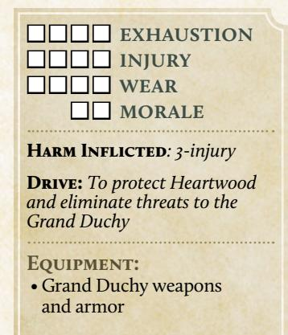

### Grand Duchy Soldiers

Heartwood has a company of 89 Duchy soldiers stationed in Heartwood. Brigadier Claudius Mundus normally commands the town's entire military force with subordinate Captains taking control of a squad of eight Grand Duchy soldiers, but Mundus has been called away to another clearing, leaving Pleasant Strong in temporary command. The fighting force is highly trained, well regimented, and strictly adheres to the chain of command.

**Note:** The average Duchy patrol is around eight soldiers and uses the attached stats. Create individual soldiers as needed using the NPC creation rules on page 212 of the Root: The RPG core book

{234}------------------------------------------------

### Important Locations

### City Hall

A large two-story wooden building sits off of the town square with a large sign out front that labels it as City Hall. Attached to the roof is a statue of a large mouse locked in battle with a bear. Two soldiers stand guard at the front entrance with more inside. Both Mayor Cornelius VonSkyward and Brigadier Claudius Mundus have their offices inside of the government building. There are offices for visiting dignitaries and both civilian and military aides, and it is also home to the town courthouse.

### Heartwood Jail

On Heartwood's western edge, the town jail sits isolated from the rest of the town's buildings. Constructed from massive hardwood beams, the structure is impressive despite its relatively small size. Inside are four cells, each built with a combination of iron bars and the same thick beams. When there is a prisoner, guards rotate every two hours. Two guards sit inside the building with one patrolling the parameter. The jail normally sits empty and unguarded but with the recent incarceration of a suspected poisoner, the building is now fully staffed.

### Tunnel 1439

This is a part of a tunnel subsystem primarily devoted to couriers and the covert movement of Duchy officials. It is not as well traveled as the rest of the underground network due to its specialized and discrete nature. Maintenance on these areas does not occur with the same regularity that of the main system so issues are often discovered en route. Tunnel 1439 leads directly from the Duchy homeland to Heartwood with six stops at various clearings along the way.

### Dangerous Woods

The denizens of Heartwood have been logging the forests surrounding the town for many generations. Trees have always been chosen individually with new trees planted every year. While there are open spaces between the trees from areas already cleared, the forest still feels healthy and intact. The area currently being worked by the woodcutters is surrounded by low, rocky foothills. A small logging road intended for the carts used to transport the freshly cut logs runs through the middle of the area.

{235}------------------------------------------------

### Special Rules

When you **discreetly seek out agents of the Corvid Conspiracy in Heartwood**, roll with your Reputation with them. On a hit, an agent of the Conspiracy is willing to take you to meet with Crawford Night. On a 7-9, your guide demands payment first—2-Value—and a favor to be named later; mark notoriety if you are unwilling to make such a commitment. On a miss, your bumbling inquiries only alert the agents of the Conspiracy; mark 2-notoriety with the Corvid Conspiracy as one of those agents corners you to get some answers...

When you search the tunnels below Heartwood for missing denizens, roll with Cunning. On a 7-9, you find a trail you can follow, but there's a large obstacle or danger ahead that makes the journey difficult. On a 10+, you get a stroke of luck; the path is clear and your search successful. On a miss, a collapse of the tunnel nearly buries you; mark 2-injury and 2-exhaustion as you dig yourself out.

When you travel from clearing to clearing through the unfinished tunnels connected to Heartwood, the band collectively decides how it travels and one member rolls:

- quietly, secretly, mostly in darkness: the band collectively marks a total of 2-depletion; -2 to the roll
- openly, fowardly, torches lit: the band collectively marks a total of 2-exhaustion and 4-depletion; +o to the roll
- urgently, rushing, burning bright: the band collectively marks 5-exhaustion and 5-depletion; +2 to the roll

On a hit, you travel through the tunnels to a clearing nearby. On a 10+, the journey is quiet and largely unobstructed. On a 7-9, you encounter a danger or obstacle along the path; mark an additional exhaustion and depletion each to navigate around it...or blunder right through it and do your best, your choice. On a miss, something in the tunnels is hunting you; it strikes the night before you reach your destination.

{236}------------------------------------------------

### Introducing the Clearing

The town of Heartwood is an inland crossroads through which roads to several major clearings spread out. Because of its central location, it is a natural place for the vagabonds to rest and resupply. Because it serves a variety of travelers, residents are less fearful than at other clearings when strangers arrive in town. The Duchy imposes heavy taxes on every official sale, but the denizens are happy to give the vagabonds good prices if the money changes hands quietly.

Three of Heartwood's key leaders are more or less present as they enter town:

- Cornelius VonSkyward is ever the consummate politician who welcomes the vagabonds with warmth and questions about what brings them to Heartwood. He is likely to offer a job if the conversation goes well. He can, with the proper filing of Form 927-5, allocate discretionary funds to hire unaffiliated vagabonds to eliminate threats to Duchy assets. He wants Summer Swiftland to be forced to either publicly acknowledge his authority over Heartwood or have her leave the clearing.
- Summer Swiftland believes in the strength of popular resistance but understands the reality of the power imbalance between the local denizens and the Grand Duchy. She is looking for help from those like the vagabonds that she thinks Cornelius can't bully. She is willing to hire the vagabonds as negotiators, muscle, or even daring escape artists (if they can rescue Arlo without implicating her).
- Melena Genpenny watches the entire situation unfold from the mayor's side. If the vagabonds reject or ignore advances from both Cornelius and Summer, Helena makes contact with them later. She is happy to hire them to rescue Penelope and alter the plans for the tunnel. She will never mention Crawford Night's name or that of the Corvid Conspiracy to any vagabond with a less than positive reputation with the Conspiracy.

As things continue, make an escalation—a move designed to intensify the situation and draw the PCs in further. Escalations can provide new opportunities, create new dangers, or close down outlets for escape. If things get too quiet or slow, or the vagabonds aren't sure what to do, make an escalation. Here are some examples:

• The vagabonds are bumped and shoved as a group of playing mouse pups, sent by Crawford Night, runs through the area. One of the vagabonds feels a sudden weight in their pocket and discovers a small bag of coins with a note. "Midnight. Behind city hall. More coin to follow. - A friend." Crawford wants to hire the vagabonds to cause more trouble between the denizens and the Duchy.

{237}------------------------------------------------

- Two Duchy guards have Chance Blackwood backed against the wall of a building. She yells, "Cowards! You do nothing while our friends and family disappear!" She shouts over their shoulder towards a nearby crowd, "Who will join me tracking down whatever monster hunts our brave people? These fools won't even accept my money to do what's right!" Denizens in the area, clearly not warriors, shift uncomfortably and look down to avoid Chance's questioning glare.
- The vagabonds are awakened by loud huffing noises and the crack of breaking wood. Screams erupt from nearby denizens. The metallic scent of blood fills the area and the unmistakable roar of a bear cuts through the night from nearby.
- A sobbing young mouse, Arlo's daughter Ayla, stands in front of a poster in the town square. Scrawled across the paper are the words, "Please help my daddy. Reward my toys." A guard is about to rip it off of the post while explaining that she isn't allowed to put signs up unless they've been approved by the mayor.

If the vagabonds choose to engage with the conflict *A Cook's Tale* (page 225), there are several possible approaches. Summer could help them find evidence pointing towards the work of an outside assassin or simply hire them outright to break Arlo out of prison. If Arlo could be convinced that it would be safer or better for Ayla to reveal the truth than to keep his snout shut, he might expose Crawford Night's involvement and share the entire story. Lucilla wants the truth and will spare Arlo (only exiling him, of course) if she knows the true source of the attack.

Because Helena Tenpenny is firmly entrenched in both the Grand Duchy and the Corvid Conspiracy, she can be used to help escalate or resolve conflicts with either faction. If her involvement with Crawford is proven, she paints herself as a victim of the Corvid Conspiracy and claims her treachery was only due to fearing for her safety. If her secret is kept, she could set up the mayor to be killed, kidnapped, or humiliated by the vagabonds.

Both Cornelius and Summer want the guild to be approved but are at odds due to a fundamental lack of communication and the need to look strong to those they serve. Summer needs the town to see her as their protector and advocate. Cornelius needs the Duchy to see him as a smart and capable leader that has control of Heartwood. Crawford Night wants control of the town to use as a tool to further the Conspiracy's goals.

Use these escalations, singularly or in combination, to move the story forward and push Heartwood towards a moment where it feels like a point of no return for all involved. Bring the problem to the PCs' doorstep, create dangerous and fraught situations, and keep applying pressure until they have to make a choice and deal with the fallout from those decisions. Build tension and have fun!

{238}------------------------------------------------

# Sundew Bend

### Description

Marquisate troops arrived in Sundew Bend nearly five years ago, intending to establish an outpost in the clearing. The unit assigned to Sundew Bend was particularly callous, seizing supplies—and even killing a few locals who resisted—before moving on to attack nearby Eyrie forces. But they left behind the built-up garrison infrastructure with notices that the denizens were to touch none of it—the Marquisate would be back.

Faced with the cruel reality of the soldiers' return, the elder rabbits of the village council decided to "salt the earth," leaving nothing behind for the Marquisate (or the Eyrie) to exploit. The denizens of Sundew Bend burned their fields, homes, and village stockpiles...and fled into the woods, promising themselves to return to their clearing.

The Woodland War raged in the area for years, subsiding only when both the Marquisate and Eyrie Dynasties relocated troops from Sundew Bend and its environs to other parts of the Woodland. The original denizens returned exhausted by years of nomadic wandering—only to find that the Lizard Cult had taken over the abandoned area, transforming the ashen rubble into the greatest of gardens. The Riverfolk Company, in turn, established a trading post in the clearing as well, building docks and warehouses on what little land the Cult did not seize and delivering construction and gardening supplies.

Unsure how to proceed, the original denizens of Sundew Bend resigned themselves to a makeshift camp at the edge of the clearing, using the nowfamiliar forest for shelter. Many refugees from other clearings have joined their wandering band over the last five years, and the camp is overflowing with enough denizens that some whisper that the poorly armed, untrained mob could retake the clearing by force. After all…they faced worse in the forest.

Yet the leader of the refugees, Clem Glenn, believes the situation can be resolved without violence by negotiating the return of at least some of their land. Trademaster Edric Hoegl of the Riverfolk Company and Elder Opal Moonrider of the Lizard Cult have both agreed to discuss the issue, but Clem knows he has a time limit—Tasha Eelpen, another refugee, has gathered enough support for a more violent solution...

{239}------------------------------------------------

### At First Sight

Clouds hang low across the clearing, rejecting the rising sun's attempt to greet the workers as they slog towards the lush gardens in the middle of the clearing. The dour weather is normal for this time of year, but the river seems to be on the verge of flooding beyond its seasonally expected rise.

The two large warehouses clustered at the docks, surrounded by tall wooden fences, and the nearby outbuildings are stark in their utilitarian design. They seem downright crude when compared to the carved gates of the Lizard Cult's central compound. A network of muddy trails spread out from the main road that runs between the trading post and the Cult's compound.

Terraced gardens, filled with crops and exotic flowers, fill the center of the clearing adjacent to the Cult's buildings. Construction on new terraces in the areas has clearly begun, alongside aqueducts and other complex water delivery systems that sustain the crops.

### Conflict

Sundew Bend is beset by many troubles, but the vagabonds are most likely to encounter the following conflicts. One of them—*The Denizens Return*—is the core issue for the clearing, while the others are conflicts likely to appear.

### Core Conflict: The Denizens Return

Elder Opal Moonrider was once gifted with what they interpreted as a holy vision—a dream of a charred and barren clearing transformed into the greatest of gardens for the Grand Dragon. Together with a few other acolytes, Opal found Sundew Bend after years of wandering the Woodland, seeking a clearing that matched the vision even when it appeared to be nothing more than a false prophecy. Upon finally discovering Sundew Bend, Opal looked upon the ashen clearing as an opportunity for a supreme act of faith...and immediately set to building the first garden.

The bustling development in Sundew Bend quickly attracted the attention of the Riverfolk Company, specifically Trademaster Edric Hoegl, a skipper who prides himself on seizing rare opportunities and understanding his customer's needs. Trademaster Hoegl was fascinated with the project that Elder Opal has undertaken—admiring the audacity and grit such work would require and petitioned his superiors at the Company to open trade negotiations immediately, offering supplies in exchange for the Cult's crops.

Just a few weeks later, the Riverfolk Company proved themselves an invaluable trading partner—moving food grown in the garden to other clearings and

{240}------------------------------------------------

construction and gardening materials into Sundew Bend. Elder Opal was delighted! After all, was this not also a part of the Great Wyrm's will?

Despite the often joyous success of the existing partnership, the sudden arrival of an army of ragged denizens has set both the Cult and the Company on edge—both factions believed that Sundew Bend had been completely abandoned! No denizens remained when the Cult seized the land; no one protested when the Company built a new trading post on the fallen remnants of the old docks near the river.

And yet...more than a hundred hungry, forest-tested denizens now eye both the new trading post and the fragile gardens. Violence looms large, but everyone knows that trade will slow to a trickle if the trading post is seized...and only the most devout Cultists actually know how to manage the gardens and their complex irrigation.

Both Opal and Edric have sent emissaries to the refugees offering land, support, food, and money...with conditions. The Cult wants the returning denizens to convert and work in the gardens, helping to preserve Opal's glorious vision;

{241}------------------------------------------------

the Company would be happy to see Sundew Bend be rebuilt without such conversion, but is demanding the local economy be run on River Scrip instead of coin or open barter.

Clem Glenn, the leader of the refugees, has been unable to sell the other refugees on either of these compromises. While a few are willing to convert to the Cult's strange practices, most of the denizens aren't interested in joining up as cultists to secure their home. The Company's offer sounds better—River Scrip is a trusted currency all along the river—but many of the older refugees recognize that handing control of their internal economy over to the Company would give them little bargaining power in future negotiations.

Thus, the returning denizens themselves are split on how to move forward now that they have finally returned to Sundew Bend: Tasha Eelpen, a Marquisate deserter, thinks the refugees should seize the clearings from both factions and live with the consequences...while Clem, the former mayor of Sundew Bend, still believes there is room for negotiation with the new claimants.

Clem is a well-liked and honored member of the refugee group—he disagreed with the original plan to leave Sundew, but went along with the group and guided them through many a terrible situation in the forest. But his steady leadership doesn't hold the same attraction as it did in the dangerous forests, not when Tasha's more active proposals promise true, unabashed victory something these refugees have found in short supply.

#### How it develops

*If the vagabonds never arrived in Sundew Bend, the denizens would eventually rally to Tasha Eelpen's cause and attack both the Cult compound and the trading post, attempting to sack both and reclaim the clearing.* 

*Just as the fighting begins, however, Clem would take one last stand, blocking the trail into the clearing and demanding the denizens find another way. While the violent mob around Tasha raged and shouted at Clem, one of its members would lash out, killing Clem with a thrown rock to the head.*

*Shocked by Clem's sudden demise, the other refugees would back down, their anger subsiding into grief. Tasha's attempts to rally the mob would fail, and any remaining attacking denizens would be easily held off by the Company and Cult. The terrible attack so feared by both the Cult and the Company would sputter out and die off.*

*Left without anywhere to go, the denizens would abandon their forest encampment, some joining one of the clearing's factions, others departing to desperately seek refuge in another clearing altogether, and still others returning to the woods and their nomadic, near-vagabond lives.*

Chapter 8: Clearings of the Woodland 241

{242}------------------------------------------------

### Conflict: The Price of Faith

The Company and the Cult have worked for more than a year to rebuild Sundew Bend, transforming the ashen rubble into beautiful gardens and the scorched docks into a thriving port. Their success has attracted new denizens (in addition to the refugees) as word has spread—some arriving by boat to work at the port for the Company, others traveling on pilgrimage to the miraculous gardens.

But the balance of power between the two partners shifted just before the returning refugees arrived. Hibiscus Gray, exchequer for the Cult, stopped selling crops and buying supplies from the Riverfolk Company completely, demanding they agree to new prices for the foodstuffs and a 10% tithe on all shipments through Sundew Bend, "a small fee worthy of the garden's beauty."

Flummoxed by the sudden drop in revenue, Edric has begun putting pressure on the Cult by sending his forces to steal key pieces of gardening and construction materials under the cover of night. Plows, small carts, pickaxes, and other supplies have all disappeared recently, and the Cult has been forced to rely on their stockpiles of wood and fertilizer to keep their garden construction on track. While Hibiscus suspects Edric of the crime, there is no way to prove anything!

Hoping to weather the shortages, Hibiscus secretly sent a small group of drakes (Lizard Cult followers) upstream to procure replacement equipment and supplies. Company forces discovered them on their return, and Edric took them captive at the trading post, accusing the seekers of stealing the supplies from the Company's warehouse. The captives are being kept inside of a locked room in the basement of the trading post; so far Opal and the other acolytes have been unable to free them.

The Cult offers free lodging, three lavish daily meals, and a sizable stipend to vagabonds that join their forces under the command of Silverpelt, the commander of the local Claws of the Dragon; Silverpelt needs some additional forces to stage a rescue of the captured acolytes. On the other hand, Edric Hoegl offers a tidy sum to anyone willing to make sure the Cult's stockpiled supplies don't last the week...

#### How it develops

*If the vagabonds never arrived in Sundew Bend, the trading post would pay some of the desperate refugees to burn down warehouses filled with supplies. Several Cult seekers and acolytes would be killed trying to fight the fire and multiple buildings would be destroyed. While the Cult would still be able to harvest fresh food from the gardens, the loss of their stockpiles would force them to resume trade with the Company at steep markups.*

*Frustrated by her failures, Silverpelt would attempt to rescue the acolytes herself without sufficient support. Company forces, led by Solfrid Pawsmore, would kill Silverpelt and the other Claws of the Dragon, leaving the Cult in Sundew Bend without any real defenses.* 

*Unable to compete financially or physically with the Company, the Cult would be forced to concede most of the clearing, retaining only their compound and existing gardens.*

242 Root: The Roleplaying Game

{243}------------------------------------------------

### Conflict: The Cult Provides

Solfrid Pawsmore, enforcer and second-in-command of the trading post, has come to suspect that Trademaster Hoegl is plotting something—secret messages arriving at night, covert meetings in the dark forest, notes thrown into a fire instead of carefully filed away. Solfrid has concluded that Edric is doing *something* with the nascent Woodland Alliance, but the Trademaster has kept his true motivations (and machinations) to himself, even when Solfrid has hinted at what she knows.

Solfrid has a plan to discover the truth—the pollen from the Woodland's Heart flower, grown only in Sundew Bend, is a powerful intoxicant that also acts as a "truth serum"; anyone under its effects answers questions honestly and loses their short-term memories when the pollen's effects wear off. Unfortunately, the drug can be fatal if the dosage is even a little off. There are rumors that another flower unseen for several years, River's Breath, has pollen that acts as an antidote to the effects of the Woodland's Heart.

Solfrid wants someone to kidnap and drug Edric (using Woodland's Heart) and discover the truth. She's largely unwilling to drug Edric herself—she's not familiar with herbalism and such a direct action is risky. But if a group of vagabonds could drug Edric, Solfrid thinks she could find out what Edric is up to, and if necessary, use the information to get the Company to strip Edric of his title and promote her to skipper of the trading post.

For his part, Edric doesn't care that Solfrid has grown suspicious. He's conspiring with agents of the Woodland Alliance to undermine the Cult. Company leadership hasn't given him permission to negotiate with them, but Edric's trying to do a deal anyway, hoping that forgiveness is more forthcoming than permission, and views Solfrid as too stupid to figure out his schemes. He has documented all of his negotiations on ledgers in a secret safe under his floorboards—he remains a Riverfolk Company Skipper and still ultimately wants to present proper books to the Company—and he readily confesses to their existence and location if drugged.

#### How it develops

*If the vagabonds never arrived in Sundew Bend, Solfrid would try to surreptitiously drug Edric herself via his morning coffee. The dose would prove to be fatal to Hoegl, leaving Solfrid without answers...but with an opportunity to seize control. Solfrid's guilt and ambitions would seize her will, and she would quickly blame the Cult for poisoning Edric and start planning the Company's "vengeance" on the Lizard Cult for their treachery.*

*The Cult would honestly deny any involvement, but the anger amongst the Company would allow Solfrid to distract from her crimes by plotting the assassination of Hibiscus Gray, the most likely Cult culprit, using Company mercenaries. Solfrid would order the murder a week after Edric's death, and the resulting assassinations would spark open warfare between the two factions.*

Chapter 8: Clearings of the Woodland 243

{244}------------------------------------------------

### Conflict: Seeds of History

The Company has made formal work offers to the refugees, but the Cult has been more charitable, giving them free food and operating a school for children at the Cult's compound. Emmy Summer, an elder rabbit, agreed to help Peeta Clawrunner, a bat seeker and cook, with the school, telling stories of Sundew Bend to the children. Emmy mostly helped to keep the children entertained with fictitious stories, but...she is proud of Sundew Bend. Soon, she started to sneak in bits of real history—embellished and made thrilling or fantastical...but grounded in truth.

One day, Silverpelt, a former vagabond turned Claw of the Dragon, overheard Emmy telling the tale of the River's Breath flower, an antidote to the Woodland's Heart said to have been stored away long ago in a secret vault by the people of Sundew Bend. Silverpelt quickly realized the secret seed vault was real, taking the elder hostage and forcing her to reveal what she knew. The Cult has now taken possession of the vault and the secret barrels filled with seed, posting a rotating guard while managing to keep the seizure almost entirely under wraps.

Excited by the discovery (and ignorant of the means), Opal has arranged for seekers from nearby clearings to take the seeds and distribute them throughout the Woodland. These plants, unseen anywhere else, would be a huge boon to the Cult to improve their gardens—using the Woodland's Heart and River's Breath pollen to produce both the powerful drug and its antidote—and bring beauty to the faithful.

Silverpelt continues to hold Emmy in secret, in a burrow at the edges of the clearing—she knows Opal would never approve, but she can't bring herself to execute the elder. At some point, Silverpelt knows she has to make a terrible choice.

While none of the denizens yet realize that Emmy is missing, Bee "Baby" Glenn is convinced she disappeared the same day he saw Silverpelt asking Emmy questions. The only person Baby trusts—his father, Clem—is busy trying to keep the refugees in check, so Baby has been looking for someone to listen to his story and rescue Emmy. He is looking for mighty warriors...or maybe even heroes.

#### How it develops

*If the vagabonds never arrived in Sundew Bend, Silverpelt would eventually kill Emmy and dump her body far away. Baby, ashamed he was unable to rescue Emmy, would be inconsolable for months, eventually leaving the clearing to become a vagabond himself.*

*The Cult would send seeds from both the Woodland's Heart and River's Breath to select gardens throughout the Woodland. The flowers and their pollen would become such an important resource that the Cult sends reinforcements to all clearings that grow them, including Sundew Bend—helping the local garden to become something closer to a beautiful fortress with enough martial power to fend off and defeat the Riverfolk Company. Denizens from the camp would be offered opportunities to move to other Cult clearings to work as cultivation specialists.*

244 Root: The Roleplaying Game

{245}------------------------------------------------

### Important Residents

| □□□□ EXHAUSTION                               |  |  |
|-----------------------------------------------|--|--|
|                                               |  |  |
| □□□ WEAR                                      |  |  |
| □□□ MORALE                                    |  |  |
| D                                             |  |  |
| <b>Drive:</b> To move up the Company's ladder |  |  |
| Company's tadder                              |  |  |
| Moves:                                        |  |  |
| Appear without warning                        |  |  |
| Throw a knife with                            |  |  |
| unerring accuracy                             |  |  |
| Panic an opponent     with a smile            |  |  |
|                                               |  |  |
| EQUIPMENT:                                    |  |  |

Hidden knivesSpyglass

#### Solfrid Pawsmore

An incredibly charming otter that keeps the docks under her constantly watchful eye, Solfrid is the one trading post official most feared by the workers. It only took a couple of instances of denizens falling asleep on the job—only to be awakened with a knife to the throat and a terrible smile—for her to establish her authority.

When Edric Hoegl has a problem that needs to be solved, Solfrid resolves it in the Company's favor. She believes in the Company, its methods and its purpose. Yet...she hungers for more power and control and would gladly take over the trading post as soon as the opportunity presents itself. She has no real loyalty to Edric, and while she might not usurp him as long as such an action could hurt the Company, the instant she can without cost to the Riverfolk, she will...

| EXHAUSTIO INIURY |
|---------------------|
| WEAR                |
| MORALE              |

**Drive:** To build faith in the Cult through service

#### Moves:

- Restore hope with a bowl of warm stew
- Earnestly demand the truth
- Remind the faithful of their duty to the Cult

#### **EQUIPMENT:**

- Wooden ladle
- Bubbling cauldron of stew
- Razor sharp cleaver

### Peeta Clawrunner

This bat with a wide smile and kindly eyes is in charge of the kitchens for the Cult. He is quick to offer food to those in need if the Cult's current situation allows it. He is a genuinely caring soul who wants to make the clearing the best it can be.

He is also a true believer in both the Cult's teaching and Opal Moonrider's vision for the garden. He would sacrifice himself without hesitation for the good of either. He knows that Silverpelt holds Emmy hostage, but he believes the Cult will release her unharmed once they are done asking her questions.

{246}------------------------------------------------

| □□□ EXHAUSTION |
|----------------|
| □□ INJURY      |
| □□□ WEAR       |
| □□□□ MORALE    |

**DRIVE:** To gain control of the clearing's economy

#### Moves:

- Force someone into a bad deal
- Tell a believable lie with conviction
- Notice a crucial small detail

#### **EQUIPMENT:**

- High quality armor and sword
- Key to the local Company treasury vault
- Golden stylus

# | EXHAUSTION | INJURY | WEAR | MORALE

**DRIVE:** To find a safe home for his people

#### Moves:

- Calm a crowd with a stirring speech
- Organize an escape from danger
- Protect others by stepping forward

#### **EQUIPMENT:**

- Wooden walking stick
- Backpack with bits of dried food

#### Edric hoegl

Edric is a stern otter known both for his ability to drive a hard bargain and for his almost preternatural business-development instincts. Regardless of whether it's force, bloodshed, blackmail, or simply superior pricing needed to close a deal, he's willing to do what's necessary...and often knows what's required before anyone else does. As he proudly reminds those that work at the trading post, "The deal justifies the means...and the deal is always afoot."

Edric lives his life with stark simplicity. His living quarters, office, and clothing are plain to the point of standing out for their lack of personality. There are only two exceptions to this: the intricately engraved sword he wears at his waist and the ornate carved stylus he uses to sign every contract.

#### Clement "Clem" Glenn

Clem, a bunny born in Sundew Bend, still has clear memories of his life during that time. His wife, Hazel, was killed for resisting the Marquisate army during its initial invasion of the clearing. Two of his three children were killed over the next several years—lost to dangers in the forest—leaving only him and his son Baby.

Clem has accepted the mantle of leadership not due to a desire for power but instead to fill a void desperately needed by his community. The burden of that responsibility weighs heavily on him and he hopes to find a safer and more permanent home inside of the clearing for everyone. He is convinced that violence is not the answer to their problems, no matter how tempting Tasha Eelpen makes it sound.

{247}------------------------------------------------

| □□□□ EXHAUSTION                                 |
|-------------------------------------------------|
| □□□ INJURY                                      |
| □□□ WEAR                                        |
| □□ MORALE                                       |
|                                                 |
| <b>DRIVE:</b> To retake Sundew Bend at any cost |
| at any cost                                     |
| Moves:                                          |
| Share a hard truth                              |
| with an enemy                                   |
| <ul> <li>Demand action now,</li> </ul>          |
| no matter the cost                              |
| Strike at or threaten an                        |

#### **EQUIPMENT:**

• Marquisate sword

enemy's weakness

- Ragged armor
- Faded military insignia

| □□□ EXHAUSTION □□□ INJURY □□□ WEAR □□ MORALE                    |
|-----------------------------------------------------------------|
| HARM INFLICTED: 2-injury                                        |
| <b>DRIVE:</b> To protect the Company's interests in Sundew Bend |
| EQUIPMENT: • Common weapons and light armor                     |

#### Tasha Eelpen

Tasha is a former Marquisate fox soldier who signed up for the War believing it would advance her career. After several major battles, she grew deeply discontented with the leadership of the Marquisate's forces...and took an "indefinite leave" from the Marquisate military. She joined the refugee band a few years ago and has repeatedly proven herself a capable leader in tough spots.

Since arriving at Sundew Bend, Tasha has been vocal about seizing the clearing—the garden and the docks—no matter the cost. Tired of the forest, she would rather deal with angry otters and difficult irrigation than go back to their wandering ways.

### Company (Dercenaries

The Riverfolk Company trafficks in all sorts of goods, but none are in demand quite like the mercenaries they move up and down the river in the service of the factions fighting the Woodland War. The ongoing conflict has depleted most military forces, and the Company is all too happy to charge a premium to supply enough troops to keep fighting to the Marquisate, the Eyrie Dynasties, and any other buyer with deep enough pockets. Of course, the constant deployment of such forces means they sometimes aren't available to skippers like Edric, but a quick requisition form can usually ensure at least a patrol or two are on hand to address problems.

**Note:** The attached stats are the traits for a single mercenary. An entire unit together—roughly eight mercenaries—gains +2 harm boxes and doubles their inflicted harm when acting as a small group.

{248}------------------------------------------------

# □□ EXHAUSTION □ INJURY □ WEAR □□□ MORALE

**DRIVE:** To be heroic and help those in need

#### Moves:

- Share a story about the clearing
- Call for help from competent adults
- Sneak past adults into secure areas

#### **EQUIPMENT:**

- Inaccurate map of the Sundew Bend settlement
- Shovel
- Personal journal

### Bee "Baby" Glenn

Clem's only living child, Baby, is a shining light of hope in the oppressive reality that Sundew Bend brings each day. Baby is eager to help all in need but also precociously wary of a dangerous world.

Baby has no personal memory of the clearing, having only been an infant when his family was forced to flee. He has committed every story, piece of history, and rumor that the adults have shared with him to his journal. He has a special bond with Emmy Summer, the elderly rabbit who keeps all of Sundew Bend's stories since the clearing was burned.

| EXHAUSTION |
|------------|
| INJURY     |
| WEAR       |
| MORALE     |

**DRIVE:** To ensure that the stories of Sundew will continue to be told

#### Moves:

- Recall a fact previously lost to history
- Remain quietly aloof when questioned
- Give unsolicited advice

#### **EQUIPMENT:**

- Illustrated scroll
- Jar containing ashes from her childhood home
- Personal journal

### Emmy Summer

This elderly bunny is the only remaining living member of the original Sundew Bend village council that made the decision to burn the old clearing to the ground and flee. She has appointed herself the keeper of stories for Sundew Bend both to preserve the past and as an act of penance for being part of the destruction of her childhood home.

As the twilight of her time draws to an end, Emmy works to share the stories and legends of the community with the younger members of the group, albeit with a flare for the dramatic. She has a particular fondness for Baby, as she believes he will one day be a great hero.

{249}------------------------------------------------

| DDD EXHAUSTION DDD INJURY DDDD WEAR |
|-------------------------------------|
| □□□□□ WEAR                          |
| HARM INFLICTED: 4-injury            |
| DRIVE: To reclaim Sundew            |
| Bend from non-denizen factions      |

#### Denizen Militia

The denizens who have survived the forest for these past few years have become a tough bunch of wanderers. They've fought bears together, taken refuge in ruins, and killed bandits, telling stories of Sundew Bend to keep their spirits bright in moments of darkness. Now that they've arrived, however, they've found the conflict to be more complicated than expected, and they are starting to listen to Tasha's promises of a clearing free of these intruders. Their swords may be dull and their spirits weakened...but these denizens are still capable of putting up a real fight if pushed to that point.

**Note:** The average militia group is a mob of around 20 members and uses the attached stats. Create individual militia members as needed using the NPC creation rules on page 212 of the Root: The RPG core book; give them 2-3 boxes of exhaustion and injury, but reduce their wear and morale to 1-2 boxes to reflect the cost of their forest travels.

#### **EXHAUSTION** INJURY WEAR MORALE **DRIVE:** To secure the Cult's control of Sundew Bend

#### Moves:

- Win a negotiation with economic pressure
- Haughtily deny involvement with a plan gone wrong
- Hide behind the power of the Cult

#### EQUIPMENT:

- A meticulously maintained ledger
- A small vial of poisoned ink

### **hibiscus** Gray

Hibiscus, a lizard, is incredibly precise with his words and even more so with every contract. Tasked with growing the Lizard Cult's local coffers, he has been very effective at balancing short-term losses for long-term gains.

While he keeps careful control of all financial decisions, he delegates more physical tasks to Silverpelt and the other Claws of the Dragon. Though devoted to the Cult, he wouldn't die for it if escape presented itself.

{250}------------------------------------------------

| □□□□ EXHAUSTION | 1 |
|-----------------|---|
| □□□□ INJURY     |   |
| □□□□ WEAR       |   |
| □□ MORALE       |   |
|                 |   |

**DRIVE:** To prove her commitment to the Great Wyrm

#### Moves:

- Outsmart an ambush or trap
- End a conversation with a cold stare
- Smash through a physical barrier

#### **EQUIPMENT:**

- High quality armor and sword
- Oaken shield
- Battle horn

### Silverpelt

A recently converted otter, Silverpelt joined the Lizard Cult in Sundew Bend after years of adventuring as a vagabond. Moved by Opal's words to join the Cult, she quickly rose from seeker to acolyte, becoming the leader of the Claws of the Dragon within the year. She is eager to show that her faith is deeper than it might appear and is willing to take risks to prove to Opal and the others that they have not misplaced their faith in her.

# □□□ EXHAUSTION □ INJURY □□ WEAR □□□ MORALE

**DRIVE:** To turn Sundew into the greatest of all gardens

#### Moves:

- Summon the guards for protection
- Enrapture an audience with the spoken word
- End a conversation with the declaration of a vision

#### **EQUIPMENT:**

- Thick woolen robes and a golden helmet
- Pouch of Woodland's Heart flower seeds
- An exquisitely carved bone staff

#### Opal Moonrider

A particularly driven rabbit acolyte, Opal has spent their whole life following a vision they had as a child—terraced gardens amidst ashes that missionaries of the Cult explained as a gift from the Great Wyrm. They are a devout believer in the Cult and the importance of the garden. Convincing them to stray from that path would be a monumental task.

As the Voice of Sundew Bend, Opal genuinely wants to help those that come willingly into the Cult's embrace. They stay purposely ignorant of the means Hibiscus and Silverpelt use to solve problems, and they've decided to allow seekers to "sacrifice" seed and other grains (instead of the usual sacrifices) in the hopes that a swell of new cultists can help seize control of the clearing. After all, the Cult can always return to the more traditional ways later...

Opal always speaks as if in a dreamlike state—their words spilling out with an unusually poetic meter. Most find their speeches a bit perplexing, wholly inspirational, and with a hint of an otherworldly presence.

{251}------------------------------------------------

| exhaustion                                               |
|-----------------------------------------------------------------|
| injury                                                   |
| wear                                                     |
| morale                                                  |
| Harm Inflicted: 2-injury                                        |
| Drive: To protect the Lizard Cult's interests in Sundew Bend |
|                                                                 |

#### **Equipment:**

• Common weapons and light armor

### Lizard Cult Guards

While the Lizard Cult is not a heavily militarized religion, they are not without armed guards. Patrols of seekers—with the occasional acolyte—watch over the compound and the gardens, look out for trouble, and try to keep the cultists safe. They mostly follow orders from Silverpelt, but they are quick to come to the aid of any senior cultist in need of their assistance.

Note: The average guard unit is five to ten seekers and uses the attached stats. Create individual guards as needed using the NPC creation rules on page 212 of the Root: The RPG core book; some of the individual guards might be acolytes—the Claws of the Dragon with 3 harm boxes of each type, capable of inflicting 2-injury per attack.

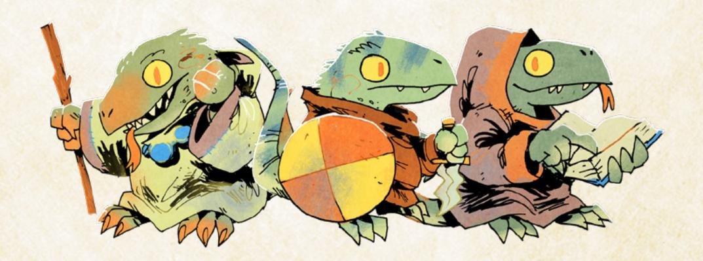

{252}------------------------------------------------

### Important Locations

#### Sundew Bend Grading Post

The Sundew Bend Trading Post is made up of a tight group of buildings, a sturdy awning, and a large storefront. Tall wooden walls with a thick wooden gate at their center surround the entire area. The rear of the trading post backs to the river where a busy dock covered in wooden crates accepts cargo from across the Woodland.

Workers stay in a large bunkhouse, and the upper level of the storefront has private living spaces for Edric Hoegl, Solfrid Pawsmore, and their families. There are always at least two guards patrolling inside the walls who swap out every ten hours.

### Sundew Lizard Cult Compound

The main road from the trading post leads to an ornately carved wooden arch that welcomes the Woodland faithful into the compound. Protective walls spread out from the arch and surround the area. Lush green foliage lines the paths inside the walls as one of the many tangible tributes to the Great Wyrm.

A score of barracks, many still empty, stand along the southern area of the compound. A large meeting and dining hall is located to the north with a bustling kitchen at the building's rear. Three warehouses are clustered to the eastern edge of the compound and always under heavy guard.

- Warehouse #1 contains dry goods to feed the compound. Spices, preserved meats, flour, and oil fill the building. Peeta Clawrunner, the Cult's cook, and his kitchen staff have unrestricted access to this building.
- Warehouse #2 contains specialty gardening supplies: bone meal, sealed containers of seeds, garden tools, coils of rope, and ladders of varying sizes. Cult members and denizens working in the gardens have access to the building during normal work hours.
- Warehouse #3 contains the Claws' armory, moderately valuable Cult documents and books, and a variety of overflow storage crates. Only Hibiscus Gray and the guards have unrestricted access to this warehouse.

Warehouse #I is the most vulnerable to attack. Peeta runs an informal school for children of both the Cult members and the local denizens nearby, teaching the ways of the Cult, basic reading, and basic counting skills. It is normal to see children running around throughout the compound during their breaks, and many workers come and go each day.

{253}------------------------------------------------

#### The Gardens

The Cult's compound opens to an already impressive set of gardens. Each massive garden terrace consists of three tiers—the lowest is filled with food crops, the middle with standard Lizard Cult flora, and the uppermost is reserved exclusively for the flower of Sundew Bend, Woodland's Heart.

Each level of the garden is connected by several wooden ladders. Narrow rope bridges at the uppermost section connect each terrace to the adjoining terrace. During the day, both cultists and local denizens work the existing terraces and construct new ones.

### The Denizen Camp

A small group of ramshackle buildings stands at the western edge of the forest. Only the desperate would be willing to live so close to the boundary of safety that the clearing brings. The smell of wood smoke and damp straw hangs heavy in the air. The expected aroma of cooking food is noticeably absent and many of the denizens appear bedraggled and hungry.

The structures here aren't solid enough to keep out the driving rain let alone the danger that the forest presents. The rabbits are welcoming, if hesitant, around strangers, eager to hear news of other clearings. Many speak openly about seizing Sundew Bend, but the talk of violence makes the other refugees obviously nervous. It's easy to find Tasha Eelpen wandering through the camp, attempting to sway people to her cause.

### Seed Vault

The entrance to the tunnel is mostly buried under dirt and the base of a burned tree stump. A short climb down into the opening leads to a sharply angled downward sloping passage adorned with murals from skilled rabbit artisans. There are no lights or torches inside the structure. The vault itself contains barrels of flower seeds, notebooks of local plant lore, and a letter from the previous denizen council of Sundew Bend.

Silverpelt and her acolytes, on high alert for trouble, guard the area. The vault's entrance is surrounded by charred husks of trees, mounds of muddy earth, and a complete lack of living vegetation.

{254}------------------------------------------------

### Special Rules

Woodland's Heart is a startlingly red flower whose pollen is a powerful and dangerous intoxicant; too much is lethal. Denizens under its effect lose their ability for subtlety, answer questions honestly, and are known to suffer from memory loss.

When you ingest the pollen of Woodland's Heart, roll with Might. On a hit, you must answer the next two significant questions asked of you truthfully. On a 7 - 9, you also pick 2:

- you lose an important memory forever
- you cannot lie at all for the rest of the scene
- you won't remember that you ingested the drug

On a miss, answer one question honestly before the poison knocks you out. You'll need to find an antidote before the pollen slowly kills you.

When you give the pollen of Woodland's Heart to an NPC, roll with Luck. On a hit, they answer two questions honestly before they pass out. On a 10+, they also won't remember you gave them the pollen or you can keep them awake (and honest) for a scene, your choice. On a miss, the dose is sure to be fatal; find an antidote quickly or else!

River's Breath is a mirror version of the Heart—nightblooming pale lavender petals whose pollen is an antidote to the effects of the Woodland's Heart. It can even save those dying from an overdose of the Heart's pollen, if administered in time.

When you ingest the pollen of River's Breath, take a 12+ instead of rolling when you next ingest the pollen of Woodland's Heart.

When you give River's Breath pollen to someone dying from Woodland's Heart, roll with Cunning. On a hit, the antidote works and they'll make a full recovery. On a 10+, they also recover all harm caused by the poison.

**For NPCs:** On a miss, you're too late—the poison has claimed them. It haunts you; you are unable to clear exhaustion until you honor their death.

**For PCs:** On a miss, you save them, but they've lost a piece of who they were and must change one of their drives.

{255}------------------------------------------------

### Introducing the Clearing

Sundew Bend is a welcome stop in a relatively isolated part of the Woodlands to restock supplies for the vagabonds. With the tensions that have built in the clearing, newcomers are of great interest to all of the leaders in the area. Some natural options for introductions include:

- Edric Hoegl. He invites them into the trading post and questions them to make sure that they're not agents of the Cult. He tries to hire them to destroy the warehouses and offers free weapons and supplies as payment. If any of them are friendly with the Woodland Alliance, he might also be interested in hiring them as emissaries to his new allies.
- Opal Moonrider. With a flourish of robes and grand pronouncements, Opal invites the vagabonds to dinner at the Cult's dining hall. They also introduce the group to Hibiscus Gray at dinner. Hibiscus wants to make the best use of their talents and pays well for success. He is extremely interested in whatever skills the band has that can be put to use, especially with regard to freeing the captive group of drakes held by the Riverfolk Company.
- Clem Glenn. Clem is desperately looking for help for his struggling community and invites them to share in what little food they have. He lets them know he has a meeting with both Opal and Edric to negotiate land for the denizens, but has little to offer the vagabonds in terms of payment for their help.

If the PCs stop to talk with the inhabitants of the clearing, they receive a spectrum of opinions about what is happening. Cult members are mostly happy with their lives but may feel the Cult is overly demanding on their time. Others believe the conflict with the trading post distracts from the holy work of tending the gardens and may even consider Hibiscus's economic maneuverings as blasphemous.

Denizens from the camp have a clear understanding that their situation is unsustainable and something needs to change soon. If asked why they don't just leave the clearing for somewhere easier, they speak about their history, ties to the land, the struggle of sacrificing their home only to have lost it anyway. The clearing is tied to their grief at what they lost and their sense of self.

The Riverfolk at the trading post see the financial opportunities that the clearing brings. Some worry that Edric is pushing things too far and that the entire situation will explode, driving out the cult and making the trading post no longer viable. Many want to see Edric make some minor concessions to return things to profitability; others, like Solfrid, have grown suspicious of Edric's other dealings...

{256}------------------------------------------------

With three distinct groups in the clearing, there is a lot of space for the PCs to support the NPC that interests them and their playstyle. As things continue, make an escalation—a move designed to intensify the situation and draw the PCs in further. Escalations can provide new opportunities, create new dangers, or close down outlets for escape. If things get too quiet or slow, or the vagabonds aren't sure what to do, make an escalation. Here are some examples:

- Tasha Eelpen attempts to hire the vagabonds to strike at key locations in both the Cult's compound and the Company trading post. She's taken up a collection from the other denizens and can pay well to have the vagabonds smooth the path toward a clearing-wide massacre.
- Solfrid Pawsmore announces the public execution of the group of Cultists who were caught sneaking in supplies to the clearing. Peeta Clawrunner comes to the PCs to beg for them to intervene.
- Hibiscus Gray demands that the children attending Peeta Clawrunner's school start working a shift in the gardens to help pay for their parents' tithe and compensate the Cult for their education. Two guards are dragging Baby off towards the gardens while he yells for help.
- An intense rainstorm moves in, flooding parts of the clearing at an alarming rate. The denizen's camp is rapidly being washed away due to its poor construction and the heavy rains. Clem comes looking for help, but time is short!
- Denizens start shouting that there is a fire at the trading post.

  The PCs catch sight of Silverpelt sneaking away as the screams of frightened children come from the main building's living quarters.

If players engage with the conflict *Seeds of History* (page 244), Emmy provides information about the seeds and their uses if rescued. While others in the camp have much of the same knowledge, Emmy is the camp's leading expert. Of course, the Cult is in charge of the seed vault now, and trying to take the seeds leads to a whole new conflict...

Use these escalations, singularly or in combination, to push Sundew Bend to the point where all sides are desperate enough that the situation exploding feels inevitable. At the heart of the central conflict is the question: should one group have power over the rest or can compromise between all three factions be found? Bring the problem to their doorstep, create dangerous and fraught situations, and keep applying pressure until the PCs have to make a choice and deal with the fallout from those decisions. Have fun!

{257}------------------------------------------------

#### New faces haunt the Woodland's paths!

As the War rages on, new factions take interest in the Woodland's resources. The Riverfolk Company sends trade boats up and down the rivers; the Lizard Cult makes a new push for converts; the Grand Duchy digs tunnels to seize new territory; and the Corvid Conspiracy toils to claim ill-beggoten gains from the foolish. Who are these new factions? And what do they have in store for the Woodland?

**Gravelers** & Outsiders is a supplement for Root: The Roleplaying Game—the officially-licensed tabletop RPG based on the award-winning Root: A Game of Woodland (Dight and Right board game by Leder Games—that expands the game to include the first four expansion factions!

Here's what you'll find inside this book:

- Ten new playbooks, expanding the types of vagabonds you can play to include pirates, raiders, scholars, heretics, raconteurs, and more.
- · Four new expansion factions—The Riverfolk Company, Lizard Cult, Grand Duchy, and Corvid Conspiracy—for you to add to any campaign.
- · Dozens of expanded moves and tags, including weapons skills, roguish feats, natures, drives, connections, equipment tags, and pre-made gear.
- · Robust faction turn mechanics that bring the setting to life as factions seize holdings, build structures, and plot mischief across the Woodland.
- · Two new clearings—*Heartwood* and *Sundew Bend*—that focus on adventures involving the new expansion factions and their conflicts.

**Root: Ghe RPG** is a fantasy adventure tabletop roleplaying game for three to six players of woodland creatures fighting for money, justice, and freedom from powers far greater than them. The Woodland calls!

Players Time 3-6 2-4 hrs

Rating Everyone

Root" and Leder Games" logo and key art TM & © 2017 Leder Games. All Rights Reserved