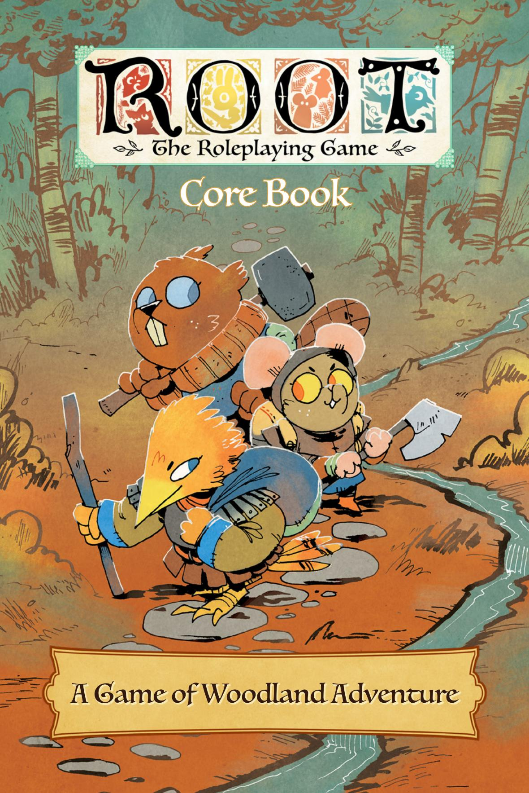
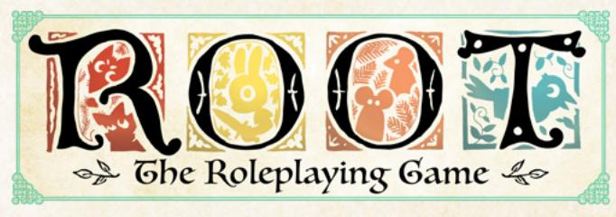
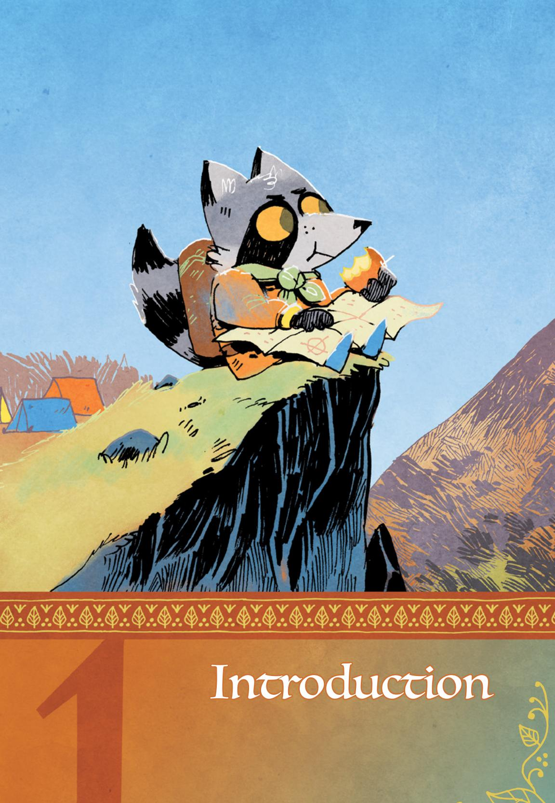
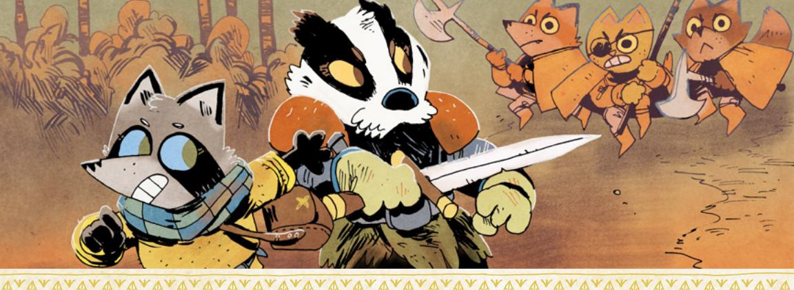
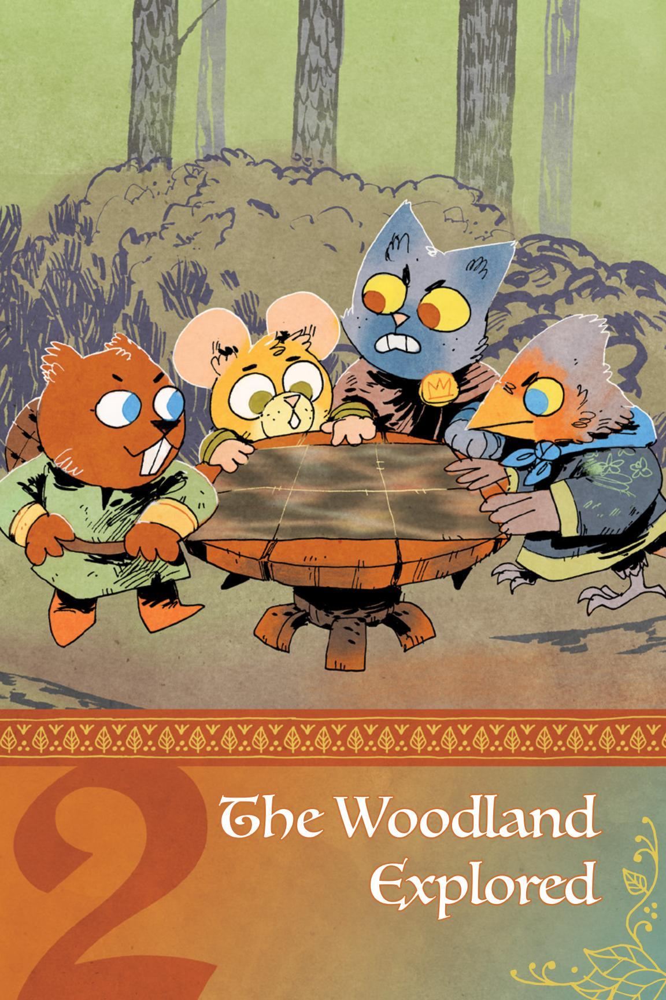
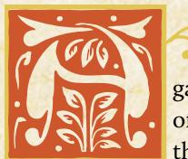

{0}------------------------------------------------

{1}------------------------------------------------

# Core Book

Design: Brendan Conway & Mark Diaz Truman Development & Writing: Brendan Conway Additional Writing: Sarah Doom & Mark Diaz Truman Developmental Editing: Mark Diaz Truman Copy Editing: Kate Unrau

Layout: Miguel Ángel Espinoza

Art: Kyle Ferrin

Art Direction: Marissa Kelly

Proofreading: Katherine Fackrell

Root Board Game Design: Cole Wehrle

Root Board Game Graphic Design & Layout: Cole Wehrle, Kyle Ferrin, Nick Brachmann, and Jaime Willems

Root Board Game Concept: Patrick Leder

Root: The Roleplaying Game text and design @ 2019-2021 Magpie Games. All rights reserved. Root: A Game of Woodland Right and Might @ 2017 Leder Games. All rights reserved. Leder Games logo and Root art TM & @ 2017-2020. All rights reserved.

Printed by LongPack Games. First printing 2021.

{2}------------------------------------------------

# Table of Contents

| Introduction3                                    |     |
|--------------------------------------------------|-----|
| The Woodland8                                    |     |
| Playing to Find Out 9                         |     |
| What You'll Need10                               |     |
| The Woodland Explored11                          |     |
| What Is the Woodland?12                          |     |
| The History of the Woodland13 The Present War | 20  |
|                                                  |     |
| The Fundamentals                                 | 25  |
| The Conversation26                               |     |
| Moves and Uncertainty29                          |     |
| Starting the Game                                | 35  |
| Why Play?                                        | 40  |
| Making Vagabonds41                               |     |
| Choosing a Playbook42                            |     |
| Filling Out the Playbook43                       |     |
| Core Rules                                    | 63  |
| Using Moves in Play                              | 64  |
| Basic Moves                                      | 68  |
| Weapon Moves                                     | 89  |
| Reputation110                                    |     |
| Travel Moves121                                  |     |
| Harm                                             | 125 |
| Session Moves130                                 |     |
| Playbooks 131                                 |     |
| The Adventurer133                                |     |
| The Arbiter137                                   |     |
| The Harrier                                      | 141 |
| The Ranger145                                    |     |
| The Ronin149                                     |     |
| The Scoundrel153                                 |     |
| The Thief                                        | 157 |
| The Tinker                                       | 161 |
| The Vagrant165                                   |     |

| Advancement &               |     |
|-----------------------------|-----|
| Equipment                   | 169 |
| Advancement170              |     |
| Changing Your Character177  |     |
| Equipment181                |     |
| Running the Woodland        | 193 |
| The GM194                   |     |
| Agendas196                  |     |
| Always Say198               |     |
| Principles199               |     |
| GM Moves                    | 202 |
| NPCs                        | 212 |
| Fight Scenes216             |     |
| When You're Not Busy 222 |     |
| The Woodland at War         | 223 |
| Making the Woodland 224  |     |
| Fleshing Out Your Clearings | 235 |
| Gelilah's Grove 241      |     |
| Conflicts and Issues243     |     |
| Important Residents247      |     |
| Important Locations         | 253 |
| Special Rules254            |     |
| Introducing the Clearing    | 255 |
| Index 256                |     |

{3}------------------------------------------------

{4}------------------------------------------------

oot: The Roleplaying Game is a pen-and-paper tabletop storytelling game. Alongside a few friends, you spin out the stories of roguish vagabonds as they journey throughout the

Woodland, acting as something between knaves and heroes!

You meet up with your friends, whether it's around an actual table, in an online call, or whatever way fits your group. Most of you have your own character, an individual vagabond in your band, sometimes acting as a rogue, a scamp, a survivor, and maybe a hero. One of you is the Gamemaster (GM) and describes the rest of the world and all the other characters in it. Every now and then, when you describe something chancy or complicated or tense, you roll some dice to find out what happens. Over a bunch of individual meetings—sessions—you and your friends play out a larger story of these miscreants and legends of the Woodland.

#### What Is Root?

ROOT: A GAME OF WOODLAND MIGHT AND RIGHT is a board game created and published by Leder Games, designed by Cole Wehrle and with art by Kyle Ferrin. The game was originally published in 2018 and, since then, has racked up a slew of awards, including four Golden Geek Awards and the Origin Award for Best Board Game in 2019.

The board game is an asymmetric wargame featuring wildly different factions of anthropomorphic animals vying for power. The Marquise de Cat and her minions try to build workshops and lumber mills to take control of the Woodland, while the Eyrie Dynasties manage a complicated bureaucratic "program" of orders, and the Woodland Alliance starts with no pieces on the board, only to spring forth with sudden force as a surging insurrection against the greater powers. The base game includes one faction—the Vagabond—who acts as a single, isolated roguish figure, moving throughout the Woodland, switching allegiances between the other factions, and performing quests for the denizens of the Woodland.

At the time of writing, two additional expansions are available for the board game: one that adds the mercenary Riverfolk Company and the cryptic Lizard Cult; and another that adds the arrogant Great Underground Duchy and the anarchic Corvid Conspiracy. A third—The Marauder Expansion—will soon be available for fans as well!

**Root: The Roleplaying Game** is based on the same fictional world as Root: A Game of Woodland Might and Right, playing with many of the same themes and ideas, but from a different perspective—that of a tabletop roleplaying game focused on the vagabonds themselves.

さい金しいいといるしいいといるしいい

{5}------------------------------------------------

# What Is a Tabletop Roleplaying Game?

A tabletop roleplaying game (often abbreviated to TTRPG or RPG) is a kind of storytelling game that you play at your table with pen, paper, and dice. It plays out as if you and your friends were cooperatively and conversationally telling a story together. Over a few hours—or many sessions—your collective story evolves and changes, going to new and unexpected places based on your characters' actions.

Most players each take on the role of a character in the setting of the game. You describe what that character looks like and what they do. You say what they say, either describing their words ("I say something apologetic!") or speaking for them verbatim ("I say, 'You'll never catch me, Count Ragar!'"). You think about what they think and feel, and you guide all of their actions.

You do all of that alongside your friends playing their own characters. You work together in times of danger, and you argue with each other in times of drama. You flesh out friendships, rivalries, romances, and more, all from the perspectives of these fictional characters.

One of your friends plays a special role—the Gamemaster or GM. They portray the rest of the world, including all the other characters. They tell you what your character sees, hears, smells, and so on. They describe what the nonplayer characters—NPCs—do or say. They fill in any holes in the setting so that everyone at the table shares the same imaginary world in their heads.

Very importantly, the GM isn't at all playing *against* the other players. They're here to try to represent the world faithfully and interestingly—to say what happens and what exists in a way that makes the fictional world *make sense*. And they're here to keep things compelling, fun, and exciting—which includes honoring how awesome the other players' characters are!

# What Makes Root: The Roleplaying Game Unique?

Root: The Roleplaying Game is a tabletop roleplaying game in which the characters you play are anthropomorphic animal vagabonds—miscreants, rogues, outcasts, and renegade heroes—adventuring across the Woodland. The vagabonds are highly skilled and capable, but they're not really at home anywhere in the myriad clearings of the Woodland. So they move around, traveling the paths and crossing the dangerous forests, taking jobs for pay and equipment.

Whether they mean to be or not, the vagabonds are often drawn into the overarching conflict between the powerful factions of the Woodland. As those factions wage war against each other, the vagabonds may prove the key to tipping the balance in favor of one faction or the other…or they may act as heroes, protecting the average Woodland denizens from a war that might consume them. Whatever they do and whomever they support is your choice as you play!

{6}------------------------------------------------

# How Does Tabletop Roleplaying Work?

For the most part, a tabletop roleplaying game plays like a conversation—you take turns speaking, describing the action or sharing dialogue, reacting to each other, switching back and forth between in-character speech and out-of-character speech. But the conversation leads to places of uncertainty, times when no one is sure exactly what to say next, when no one knows what happens in the story. When one character tries to jump from a flaming tree to another, across a seven-foot gap, no one knows for sure what happens, whether they successfully reach the next tree or go plummeting to the ground!

In those moments, you turn to the game's rules. The rules of **Root: The RPG** help you to figure out what happens in moments of tense uncertainty, guiding the conversation forward into new, interesting, and surprising outcomes. The rules themselves will provide plenty of guidance on exactly when they come into play, what to do to resolve a situation, and what the outcomes are. But much of the time, the GM will have to provide some additional interpretation to help the mechanics fit the very specific situation in your game.

What's more, the GM also acts as a kind of impartial judge, helping the table determine when the rules actually come into play. If there's ever doubt about whether or not the rules apply, the GM acts as the final arbiter and decision maker.

For example, in the aforementioned case, when a character is jumping from a flaming tree to another tree about seven feet away, the GM might look at the rules and the situations in which they're supposed to come into play, and then decide that, yes, there *absolutely is uncertainty here*. Time to go to the rules!

If, on the other hand, a character is jumping from one tree to another when there's no fire and the two trees are touching, the GM might look at the rules, look at the situations in which they're supposed to come into play, and decide that *there's no real uncertainty here*. There's no tension. The character just does it.

#### Think of it like this:

- Each player is in control of their own character in this fictional, imaginary world.
- The GM describes the rest of the world, including other characters in it.
- When no one knows what happens next, the rules come in to provide interesting results. The GM helps to interpret the rules, calling out when they come in to play and which rules are relevant.
- The GM acts as a kind of interpreter, making the rules and outcomes fit the specifics of your fictional world at that particular moment.

{7}------------------------------------------------

# Trials & Adventure

As you progress further through this game and this book, keep a few important ideas in mind—core precepts of Root: The Roleplaying Game, its setting, its tone, and its themes. Specifically, Root: The RPG tells stories of adventure and action amid greater drama and political conflict. The Woodland, the overall setting of Root: The RPG, is a place where a vagabond can cut a rope and fly up as a chandelier falls…and it is a place embroiled in war, where deposing the local sheriff can have real, dangerous consequences.

Just to be clear up front—the Woodland is populated by anthropomorphic animals. There are no humans at all in the Woodland. In general, the anthropomorphic animals—the denizens—are around the same size, and they all have the same general capabilities as a human. For more on how Root: The RPG handles the anthropomorphic animals, see [page 43](#page-43-1).

The vagabonds are always capable characters with the skills necessary to undertake difficult, dangerous tasks and come through more or less unscathed. They're social outcasts at the start of play, separated from the backing or support that might allow them to focus on larger issues. So they take on the distasteful or complicated tasks that others throughout the Woodland pay them for, anything from getting rid of a dangerous bear, to exploring newly uncovered caverns, to stealing important military documents from a foe. All of these jobs become their own fun adventures, as things inevitably become more complicated than the vagabonds originally anticipate. They run into guards while carrying contraband—will they fight or talk their way out of trouble? They wind up accidentally knocking over a lantern in the middle of a scroll repository—will they try to put out the flames or just bolt?

But their actions inevitably have an effect on the Woodland at a higher scale. When they deliver those stolen military documents to their employer, they have just given one faction a significant advantage over another—and the Woodland changes to reflect that. When they set that fire in the scroll repository, the treaty protecting that clearing from invasion goes up in smoke—and another faction invades.

Even though, at any given moment, the story you're telling will likely be about one particular caper, one specific adventure or situation, the actions that your vagabonds undertake can have consequences that ripple across the Woodland. And when you play a full campaign, you'll not only encounter the effects of your own actions, but you'll also revisit the places you changed and see exactly what happened, for example, after you accidentally set that fire.

This combination produces stories with immediate, in-the-moment excitement and action, accompanied by long term storylines and meaning.

{8}------------------------------------------------

# The Woodland

For ages, different factions have fought for control of the Woodland's denizens and its resources, all amid conditions that amplify the threat of any battle. The place has always been dangerous, the thick woods concealing a multitude of threats from bears to bandits. It has resources to support life, but only after a great effort has been poured into creating a safe place. The clearings carved out of the forest are the best examples of this safety, little pockets where the greatest dangers have been pushed back—and a whole new set of dangers have taken their place.

The denizens of the Woodland have seen war fairly recently. The Grand Civil War between the Eyrie Dynasties rocked the Woodland a few decades ago, tearing down whatever remained of the Eyrie's established order. Some clearings were left to govern themselves after the conflict. Others found themselves endangered without the aid of Eyrie soldiers to guard the clearing or nearby paths. While different clearings were affected in different ways to different extents, no place was left untouched, no life unchanged.

In the absence of another great power controlling the Woodland, the Marquise de Cat, a powerful and dangerous noble of a far-off empire, swept in to seize opportunity. She led her forces to invade the Woodland, bringing it under her control in the Marquisate. The Marquisate might have total control if the Eyrie Dynasties hadn't recovered enough to try to retake the Woodland…and if the Woodland itself didn't threaten rebellion with the newfound Woodland Alliance.

Now, more upheaval seems imminent. The Marquisate looks upon the Woodland with hungry eyes, eager to squeeze resources out of it; the Eyrie's claws stretch out to reclaim their lost territory; the Woodland Alliance arises to push back all other powers; and more factions gaze upon the Woodland from afar, a gleam in their eyes.

War returns to the Woodland, and the vagabonds will be drawn in.

{9}------------------------------------------------

# Playing to Find Out

Root: The RPG depends upon one core principle, woven throughout the game from its setting to its mechanics: *play to find out what happens*.

There may come a time when you think you know exactly what should happen next when dealing with some Eyrie lieutenant. You just *know* that the lieutenant should hate your character, and they should wind up in a duel to the death!

But let those feelings go. Play to find out what happens. Don't pre-plan!

The mechanics in Root: The RPG push you towards unexpected, surprising outcomes. They complicate any situation where you think you "know" what should happen. Let the game and the story go where it will and surprise you! Don't fight the mechanics when they suggest an outcome you never would've predicted—go with them! We promise, the story you tell will be better for it.

# Playing Safely

When you let the story go where it will, there are times when it can threaten to go someplace that makes someone uncomfortable. That's okay, just so long as you and your group have the tools you need to handle just such a situation.

In general, it's always a good idea to talk about the game. Talk about it before you start, talk about it during play, talk about it after. Check in with your players. Be mature and understanding with each other. Beyond that, there are many tools for keeping your table on the same page, to make sure the game is comfortable and fun for everyone. The X-Card is one of our favorites!

#### X-Card

The X-Card is a handy tool originally developed by John Stavropoulos. Take an index card or a piece of paper and draw an X on it, and then put it in the middle of your table. That's your X-Card. If someone is feeling uncomfortable in any way because of something happening in the game, they can point to the X-Card, tap on the X-Card, hold up the X-Card—whatever works for them.

In that moment, everybody in the group agrees to stop and edit out whatever was X-Carded. The player who uses the X-Card doesn't have to explain themselves, though the other players may have a few questions just to make sure they understand exactly what was X-Carded.

In practice, the X-Card is as important just to have as it is to actually use. A lot of players feel much more comfortable knowing that the X-Card is there, whether or not they actually have to use it. It's an especially great tool when you're playing with people you don't know all that well!

Chaper 1: Introduction 9

{10}------------------------------------------------

# What You'll Need

To play **Root**: **The RPG**, you need a few friends willing to commit to playing at least one session lasting 2–4 hours. A single session of Root is fun, but the game will come alive if you can string together multiple linked sessions. You also need one player to be the GM and 2–5 players to portray the main characters of the game, the player characters or PCs.

#### Dice

You need at least two six-sided dice, like the kind you find in Monopoly or Risk. One pair is enough to play, but it's a lot better to have one pair of dice for each player. The GM doesn't need their own pair.

# Playbooks

You need a printed copy of each of the playbooks you're using in your game. This book comes with nine playbooks, and you can easily have all nine printed and ready to use. The **Travelers** & Outsiders expansion book comes with another ten playbooks. We recommend either defaulting to the nine in this book, or choosing a selection of the total available when you start a game.

# Woodland Map

The GM fleshes out a map of the Woodland, either before or during the first session. That map can be scribbled on a sheet of paper, drawn over one of the map images we've provided, or even built off the map from the ROOT: A GAME OF WOODLAND MIGHT AND RIGHT board game.

#### Additional Materials

Here are some other materials you'll need or want:

- The Equipment Deck—to give you plenty of easy-to-reference pieces of equipment to use throughout the game.
- The Denizen Deck—to give you inspiration for denizen NPCs, along with all of their in-game mechanics and statistics.
- Printed copies of the basic moves, weapon moves, reputation moves, and travel moves—one copy for each player including the GM.
- A printed copy of the GM materials.
- Pencils, paper, and other materials for marking up your sheets and maps.

You can find the materials for running a game of **Root**: **The RPG** as downloads, along with more information on the decks, at www.magpiegames.com/root.

{11}------------------------------------------------

{12}------------------------------------------------

game of Root: The RPG is always set against the backdrop of the Woodland—but it's not always the same backdrop. In this chapter, you'll find the essential qualities of the Woodland,

the things that must be true, along with plenty of information and guidance to set up your version of the Woodland for your game. But that's crucial—the version of the Woodland you use for your game is your version of the Woodland.

When you set up the board game ROOT: A GAME OF WOODLAND MIGHT AND RIGHT, you choose which faction each player will play. In exactly the same way, when you set up a game of Root: The RPG, you make decisions about your particular version of the Woodland—who the major players are, what the current state of the Woodland is, and more.

Maybe in your version, the Marquisate and the Eyrie have smashed each other to pieces, and the real story is about the Woodland Alliance competing with the Lizard Cult and the Riverfolk Company (two factions you can find more about in the Travelers & Outsiders supplement to this game). Maybe the Marquisate destroyed the Eyrie and quelled the Woodland Alliance, and the story is primarily about the Marquisate contending with an invasion from the Great Underground Duchy (again, see Travelers & Outsiders).

Everything in this chapter is here to guide you—to provide tools, concepts, and starting points to build from—but not to tell you exactly how things are, without any room for adjustment. Keep that in mind as you continue through the chapter: every Woodland is different...and yet every Woodland is the same.
