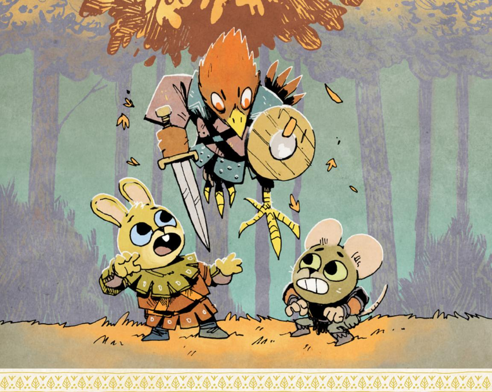
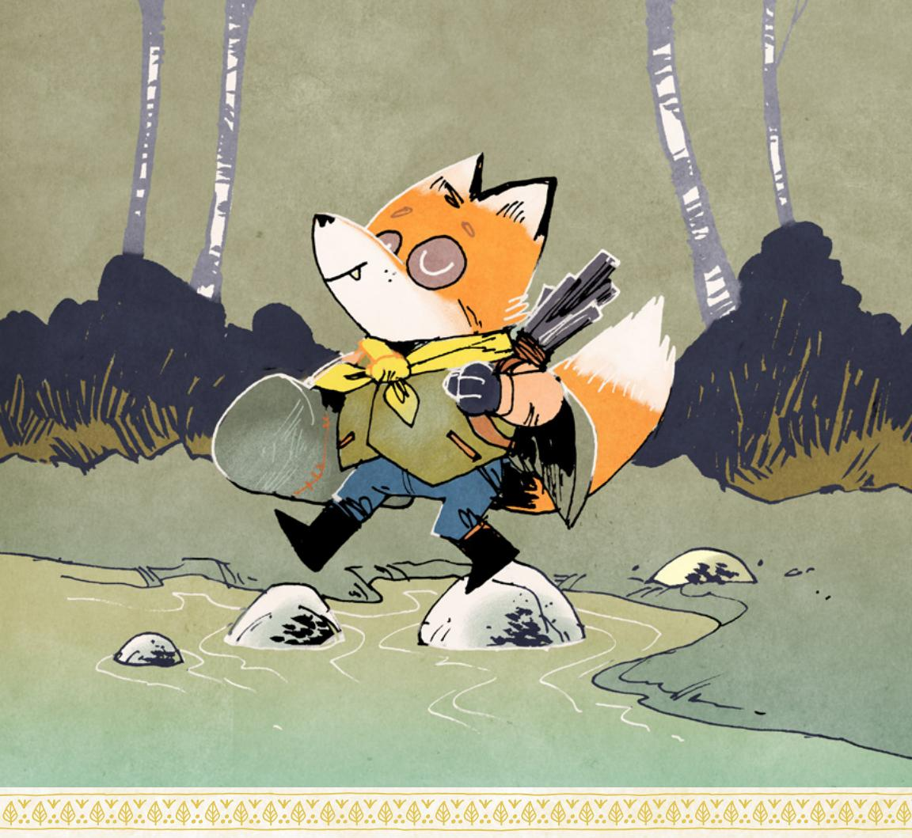
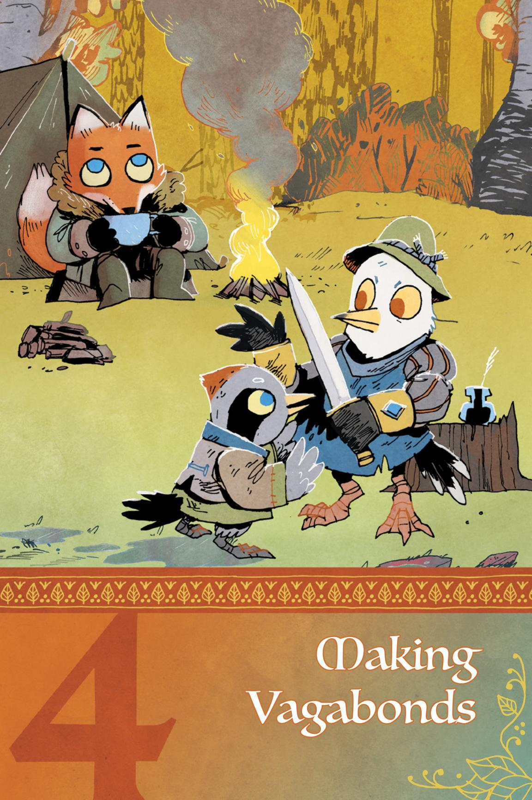
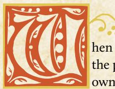

# The Conversation

What does a roleplaying game actually look like during play? If you were to watch a group sitting down to a game of Root: The RPG, what would you see and hear?

You'd see, at its most basic, a conversation playing out.

That's what a roleplaying game like Root: The RPG is at heart—an ongoing conversation between the players where they take turns talking about what happens next, who says what, how the world and other characters react, and so on.

When you hear "taking turns," don't think of something deeply rigid and regimented, like taking turns in a traditional board game—instead, think about an actual conversation you'd have with your friends. You "take turns" speaking, asking each other questions, joking, sometimes interjecting. It flows naturally and easily, and much of the time that's how Root: The RPG will feel during play!

Within the conversation, each player has a few roles to fill and jobs to do, things that direct their part of the conversation. Most of the players in the game have their own singular character—a player character, or PC—for whom they speak. The player describes what their character is doing or what their character looks like. They speak on behalf of their character, saying what the character says. They ask questions about what their character sees or knows, or where their character is.

But one person in the conversation has a different role: the Gamemaster, or GM role. The GM is still a participant in the conversations, but instead of speaking for one individual character, they speak on behalf of the entire rest of the fictional world. They describe the environment around the characters; they speak on behalf of all of the non-player characters, or NPCs, of the fictional world; they even say what happens when a character takes an action, though they often have help from the rules.

るが、このこれの一のでは、一のでは、一のでは、一のできるこれでは、

{27}------------------------------------------------

The conversation between you and your friends is always about the characters of your game, what they do, and the world around them. It's almost as if you're telling a story together, but not quite—the conversation in Root: The RPG unravels and reveals a story over time, especially when you look back on it, but while you're playing, you're thinking much more immediately, considering what to say next in the conversation. You respond to the questions and statements of the other people in the conversation, and follow them wherever they take you.

# Example

*I'm the Gamemaster, playing with some friends—Mark playing Mint the Ranger; Marissa playing Tali the Adventurer; Miguel playing Guy the Scoundrel; and Sam playing Hester the Tinker.*

*"The cave mouth yawns wide, a big black hole amid the forest greenery around it," I say. "It matches the description of Bernird the smith perfectly—if he's right, the bear is in there."*

*"Oh, I don't want to go in there," Sam says, speaking for Hester. "Maybe we can lure it out?"*

*"We could do that," Mark says, speaking for Mint. "Maybe we use one of us as bait, and the others lie in wait on top of the cave! Who here is good at shooting arrows?"*

*Mark, Miguel, and Sam raise their hands. "I don't have a bow," says Marissa, speaking for Tali.*

*"Looks like we have our bait!" says Miguel, speaking for Guy. "Don't worry, we'll get the bear before he can get his paws on you."*

*"I feel very reassured." Marissa laughs.*

# Framing Scenes

To make the conversation flow, you have to **frame scenes**. You have to set up situations in your game, in your story and your fiction, that then spur further conversation and give players enough information to make decisions.

A **scene** here is like a scene in a movie or a book, with a bunch of characters in a place, talking to each other or taking actions. The scene ends when it's time to move on and change something important—the location changes, or the characters in the scene change, or what they're doing changes, or time advances. For Root: The RPG, you can even think of a scene as a discrete chunk of the overall conversation of the game, as if it were one topic that you discuss to completion before moving on to a new topic.

So every time you start a session of Root: The RPG, the GM starts things off by framing a scene. When the time comes, they end the scene, too, and frame a new one. That's one of the key responsibilities of the GM—framing and ending scenes.

Chapter 3: The Fundamentals 27

{28}------------------------------------------------

The GM doesn't always frame scenes single-handedly—a player can suggest a scene, or ask for a scene, or build off something another player suggests. But the GM is the final arbiter of the scene framing.

When the GM frames a new scene, they describe the setting of the scene, which characters are there, and what's happening, if anything. The GM provides the important details so the conversation can begin. They don't have to cover every single exacting detail that might possibly matter—that's part of the conversation! Other players can ask questions of the GM, adding to the conversation by fleshing it out. But the GM has to frame the scene with enough detail that the players know what questions to ask.

#### Hard Scene Framing

Framing a scene doesn't mean starting at the "beginning" of a moment. You might frame a scene where the characters enter the room, introduce themselves, and start talking; but you also might frame a scene where the conversation is already going strong, someone has just insulted another character's beliefs, and daggers are close to being drawn.

That second example is called **hard scene framing**. There's no room for negotiation, no room to adjust and aim for a different kind of scene—the characters are in the scene, in that moment, dealing with that situation, and they have to react as best they can.

# Example

*Tali the Adventurer, Marissa's character, wants to go talk to the Earl of Flathome to try to talk him into freeing some unwitting, innocent denizens from his prisons. I could frame the scene with Tali talking her way past the guards and into the Earl's office…but instead, I decide to frame the scene hard.*

*"Tali, we pick up with you standing in the Earl's office. He's sitting behind his desk, his wings folded in front of him, his yellow eyes focused on you. Behind you, two of his elite hawk guardians stand with halberds—ready for anything to go wrong, or for the Earl to give the word. They've already disarmed you as a condition to get inside. The Earl opens his beak and says, 'So, vagabond. I hope this is worthy of my time.' What do you do?"*

# "What Do You Do?"

A key component to the conversation is the repeated refrain: "What do you do?" It's what the GM says to turn the conversation back to another player, a way of saying "It's your turn!" It prompts action, or it suggests that the players need more information to make a decision.

{29}------------------------------------------------

Root: The RPG is all about action in the most direct way—it's about characters *doing things*. Leaping through windows, swinging swords, picking locks, running away. And characters can do things by talking, for sure—but it's about talking with a purpose, not just idly discussing things. They're talking to figure out what a foe is thinking, or to trick a silly guard into doing what they want, or to convince a Woodland Alliance conspirator to trust them with a secret.

"What do you do?" is a crucial question that ensures everyone is *able* to say what they actually do. When the GM asks the question, if a player can't answer because they don't understand the situation enough, then it's important to take a step back and make sure everyone's on the same page. But if a player doesn't want to answer because they don't want their character to have to make a hard choice…then the Woodland will move around them, whether they like it or not!

# Moves and Uncertainty

Sometimes, though, you'll wind up in a moment where you don't know what happens next. It's not clear who should speak in the conversation or what they should say. A lot of the time, this happens when a PC takes an action whose outcome is uncertain. When a PC walks through a doorway, there's no uncertainty; the GM says what happens—and what happens is the PC walks through the doorway into a new room. When a PC dives out of a glass window three stories up, though, there's plenty of uncertainty! Are they cut by the glass? Do they catch a branch outside? Do they plummet to the ground below? Are they hurt?

In those moments, the table, and also the conversation, turns to the rules of Root: The RPG and the dice to resolve the uncertainty. Root: The RPG uses a rules structure with **moves**, which are discrete chunks of program-like rules covering lots of different areas within the game. There are lots of moves in the game, from basic moves that every PC will use, to playbook-specific moves that only those characters of a particular playbook can use. But almost all moves have a similar basic structure, with a **trigger** and a **result**.

The trigger tells you *when* the move comes into play. Triggers are always phrased as "When you do [x]…" or "When [x] happens…" They are both prescriptive and descriptive. If you want to roll the dice for the move, and get the results offered by the move, then you have to hit the trigger by taking action in the fiction. If you wind up taking the appropriate action in the fiction, then it doesn't matter whether or not you want to roll the dice—you've triggered the move, and its results come into play. The result tells you what outcomes of the move are possible.

{30}------------------------------------------------

A common way to phrase the way moves work is "To do it, do it." If you want the results of the move to *engage someone in melee*, then you have to do that in the world of the game—in the fiction (see "The Fiction" on [page 33](#page-33-0))—by describing yourself swinging your sword and dashing forward. And if you decide to start sword-fighting someone, then you're going to roll *engage someone in melee*. You took the action, so now you roll for results on the move…and to roll for results on the move, you must take the action.

The results of the move always come to bear after the move is triggered. Some moves will just say what happens: "When you do [x], [y] happens." But many moves require a die roll to see what happens: "When you do [x], roll with a stat (Charm, Cunning, Finesse, Luck, or Might), and depending on what you rolled, [y] or [z]] happens." You can see more on interpreting those results in "Hits and Misses" on [page 32](#page-32-0). Follow the full results of the move as written—don't fudge them or ignore them! You won't have to. Because a move can't possibly be perfectly suited to the exact situation in the fiction—it has to be open enough to apply to several similar situations—it will always require a GM to interpret the results to fit them to your specific fiction. That's perfect for making sure that the move and its results make sense.

{31}------------------------------------------------

Once you're done applying and interpreting the results of the move, then you go right back to the conversation, responding to those results, saying new things, and moving forward.

That's the flow of the game and the conversation in Root: The RPG. All the players and the GM talk, following the conversation as it flows, responding to each other's statements and questions, until you reach one of these moments when a move is triggered, when everyone is uncertain about what comes next. Then the rules kick in, you resolve the moment of uncertainty, and you get back to the overarching conversation. Sometimes you might reach a series of these moments in a row, but the pattern remains the same.

# Example

*Marissa, Tali's player, describes Tali sitting down nervously in the chair across from the Earl. "I try to put on a serious face. 'Thank you for meeting with me, Earl,'" she says*

*As the GM, I speak for NPCs like the Earl, and I choose to set a dismissive tone. "'Yes, yes, get on with it,' the Earl says, waving one wing at you dismissively."*

*"Right. 'I come to speak to you on behalf of Greta and Prewitt, the two rabbits you imprisoned for being Woodland Alliance spies. They're not spies at all—they're just foolish young bunnies who said things they shouldn't have. They don't deserve to be locked up for a youthful mistake, my lord Earl.' I look down when I say the last bit, I'm trying to look deferential."*

*I make the Earl's scoffing snort. "'You would have me release two individuals who might be dangerous spies, just because you think they're not? I need to make an example of these dissidents for the clearing.'"*

*"'But releasing them will make a different kind of example. It will show you're merciful, and it will deflate the Woodland Alliance's efforts in the clearing. The denizens will be grateful to you, and their will to fight will vanish.'"*

*I'm beginning to feel that uncertainty—I'm not sure how the Earl would react. He might hate being lectured by a vagabond, but he's also a shrewd operator, and Tali is making a good point. I look at the list of moves, and see the trigger for persuade someone: "When you persuade an NPC with promises or threats, roll with Charm."*

*"Hey, Tali, it sounds like you're persuading the Earl. You're promising him that if he does what you want, the Woodland Alliance presence in the clearing will start to die down. Is that about right?"*

*Marissa groans, but nods. "Yeah, I guess I am. I don't like that promise, but it makes sense."*

*"Great! Time to roll, then!"*

The only times you use the dice during the conversation are when the moves and rules call for it. Especially if you're familiar with other roleplaying games, you may feel a desire to use the dice to resolve moments in the conversation that you think are uncertain, even when there isn't actually a move to roll.

{32}------------------------------------------------

Don't do that. If there isn't a move to resolve the uncertainty in that moment, then it's actually not uncertain—the resolution is the GM's call, based on their agendas, principles, and moves (see page 194 for more on those GM tools).

#### **Hits and Wisses**

When a move asks you to roll, you'll grab two six-sided dice (hereafter referred to as 2d6) and roll them. Most of the time you'll be rolling with something, meaning you'll add one of your stats to the result of the 2d6. So if you roll with Charm, and your Charm is a +1, you'll roll the 2d6 and add 1 to the result.

Moves with dice rolls split up the outcomes in the same categories:

- A 7 or higher is called a "hit" and means you'll get at least the main thing you wanted.
- A 10 or higher is called a "strong hit" and means you'll get almost all you wanted, or some additional benefit.
- A 7–9 is called a "weak hit" and means you'll get the main thing you wanted, but usually with some cost or complication attached.
- A 6 or less is called a "miss" and means that the GM gets to say what happens next, with an eye towards complicating the situation dramatically.

Crucially, try not to think in terms of concrete success or failure. It can be an easy shorthand to say "a 7 or higher is a success and a 6 or less is a failure," but that's not quite right, and it's depriving you of useful tools for making your game much more interesting! A 7 or higher is a hit, which means the player making the move will probably get the key thing they wanted...but it could be very messy, complicating the "success" in a way that makes it far from a pure victory. And a 6 or lower might, at the GM's discretion, translate into a "failure," where you don't get the thing you wanted...but it just as easily might turn into a situation where you get exactly what you wanted and it turned out to be *the wrong thing to want*, or a situation where you get what you wanted but in a way that far exceeds what you had intended.

Misses are opportunities for the GM to make their own moves—to say what happens—and they provide some of the most interesting complications in the entire game. Don't deflate them by thinking of them just as failures!

# Example

Marissa rolls for Tali's **persuade** move—2d6 plus Tali's Charm of +2. The dice, unfortunately, come up a 1 and a 2—a total of a 5. A miss. I think about what to do, and I see Tali's reputation with the Eyrie Dynasties—a -1, not tremendously low, but low enough to change the Earl's opinions. It gives me an idea!

"Yeah, the Earl looks at you, considering your words, and then a terrible grin comes over his face. 'An interesting proposal, indeed. The one flaw, of course, is that I

{33}------------------------------------------------

*cannot be seen as too merciful—that will diminish my position in the Eyrie. No, I cannot just release two prisoners and have nothing to show for it but the denizens' gratitude. I will need another prisoner to replace them. Perhaps a dangerous vagabond, a wanton would-be criminal who is a threat to our order. Someone whom the denizens of this clearing won't care about. Someone I can imprison with impunity and execute quickly.' He looks over to those two hawks with halberds. 'Take this one into custody. She's a criminal and a threat to the clearing.' Then he turns his yellow eyes on you again, that cruel smile still showing. 'Thank you for your help. It is most appreciated.' What do you do?"*

One more important note here: the GM never rolls dice for moves during play. The GM may roll dice for random tables to set things up—see "Making the Woodland" on [page 224](#page-224-1)—but they won't roll dice to resolve what happens. It's always the players rolling dice on behalf of their PCs. That keeps the focus on those PCs, their actions, and the results of those actions.

# The Fiction

When you play Root: The RPG, your conversations are about **the fiction**—the full, encompassing, fictional world of your game. The fiction includes all the characters, the places, and the events of your ongoing game. It doesn't just cover the things that happen during your conversation—if one PC is the child of two important Eyrie nobles, and their backstory says that those Eyrie nobles were overthrown and have gone missing, then all of that is part of the fiction, too.

Think of the fiction almost as the "canon" of your game. What's true? What's questionable? What's been established? What makes sense? The fiction starts off primed by everything in this book (see Chapter 1), but it changes as you play. Everything you say and do during the game adds to and changes your fiction.

The fiction is all important to a game of Root: The RPG. Everything that goes on in the game has to take it into account. It creates the boundaries of the conversation that you're having.

Can a bird character fly? To answer, you go to the fiction: yes, they can fly. They have wings, and they live in the upper parts of the clearings. It makes sense. And now that you've said that, from that point forward, all players can reasonably assume a bird can fly.

Can a fox character fly? Go to the fiction: no, they can't fly on their own. They have no wings, they live on the ground. And now that you've said that, from that point forward, all players can reasonably assume foxes aren't going to be found in the sky.

Can a bird character fly if they're covered in plate mail and carrying a giant hammer and three sacks full of gold? Go to the fiction: no, it's too much. They can't take off; they're too heavy. Now, all players can make assumptions about

{34}------------------------------------------------

how birds have to deal with weight—birds are probably more predisposed to wear lighter armor and carry lighter weapons if they care about flying.

Can a fox character fly if they're wearing a leafy gliding apparatus made by an expert Tinker? Go to the fiction: well, the Tinker built it, and we know how skilled they are. But it still seems very dodgy. So, maybe? They can probably fly, but can they fly well? Or safely? Sounds like either the answer lies in a move the Tinker made when constructing the gliding apparatus…or that the fox is *trusting fate* now. Either way, we'll use a move to resolve the uncertainty.

That last example shows how crucial the fiction is. Understanding the fiction is how you can comprehend what is possible, and what actions and statements and truths make sense in the conversation. Most importantly, when you encounter a moment of uncertainty, the fiction helps you understand how and when moves are triggered.

# Shared Understanding

When you play Root: The RPG, the world of the game, the fiction, doesn't exist in any one player's mind, not even the Gamemaster's. It exists between everyone playing the game, a shared imagined world with its own truths, history, and rules. To play well and effectively, to use moves and resolve uncertainty, you must all be on the same page with the way you understand the fiction.

Let's say your character tells the guard, "I have served the Marquisate nobly, and you should allow me to enter the clearing." You must understand the fiction in that moment to recognize whether the character is telling the truth and trying to *persuade* the guard, or whether the character is lying and trying to *trick* the guard.

It's crucial not only to have an understanding of the fiction, but to have a **shared** understanding of the fiction. If you actually believe that you're telling the truth when you say you served the Marquisate nobly, but the GM believes that you're lying and tricking the guard, then there's a problem—you don't have a shared understanding of the fiction, enough for the correct move to be used and the conversation to flow forward.

When that happens, though, it's easy to resolve—just have a conversation to get on the same page!

{35}------------------------------------------------

# Example

*"Okay, so you're lying? You're tricking the guard?"*

*"No, no! I mean it! We served the Marquisate that time, when we helped them recover their stolen jewels!"*

*"Yeah, but then you burned down their workshop, Opensky Haven."*

*"True, but these guys don't know about that! And to prove we're on the Marquisate's side, I can show them the medal the Marquise gave us after the jewel thing!"*

*"Hmm. Okay then—let's say that you're telling the truth and trying to persuade them right now."*

Your game can be derailed if the players bring different assumptions about the fiction to the game, but just like everything else, it's all part of the conversation—so always clarify, ask questions, and make sure everybody's understanding of the fiction is more or less the same.

# Starting the Game

Before you get going with your game of Root: The RPG, there are a few things you need to prep, and a few things you need to hold in your mind.

# Preparing to Play

Make sure you know the space you're playing in. Whether it's a table with chairs or an online video call, think through what you're doing; how to adapt to the number of players; and the need for character sheets, reference sheets, and dice. To start, each player needs their character sheet (for their particular playbook), a basic moves reference sheet, and a character creation reference sheet. The GM needs their GM reference sheets and should probably also have a basic move reference sheet and a character creation reference sheet.

Each player needs a way to roll 2d6. You can get away with a single pair of dice in a pinch, but it's way easier if everyone has their own set. If you're playing online, pick out a shared dice roller and set it up. In tense moments, it's a lot of fun to watch together as the dice fall!

Each player needs some pencils and paper for extra notes. The GM, in particular, must be able to take notes on the Woodland, on individual clearings, and on NPCs. The Woodland Notepads are a great resource for these notes.

You'll need your map of the Woodland, be it a piece of paper, an online sketch, the board game map, whatever.

Finally, you'll need some time, probably between 3 and 4 hours. The first time you play, character creation is likely to take up to 2 hours to fill out all the

{36}------------------------------------------------

details, set up all the connections, and so on. From that point forward, a good session or "episode" of play can take about 3 or 4 hours to play out, so try to plan for at least that much.

# Woodland Expectations

Before you start play, everyone should be on generally the same page. That usually means that the GM will provide a base-level explanation—drawn from Chapter 2 starting on [page 11](#page-11-1)—of the Woodland, the factions at play, the nature of the denizens of the Woodland, etc. And the players can and should ask questions to make sure everybody's understanding of the Woodland is aligned.

But here are a few expectations that you should have about the Woodland to keep you in sync with the rest of the game.

#### The Balance Tips Towards Fable

What do foxes—notable carnivores—eat in the Woodland?

Do birds have hands?

Is a wolf the same size as a mouse?

Root: The RPG tips a bit towards fable in its setting, in the answers to these questions and more. The focus isn't on straight realism—obviously not, when the game is about empires ruled by talking, upright, armor-wearing cats and birds!

So focusing too much on these setting details is not only unproductive, it's also contrary to the core setting of Root: The RPG. When you play, your focus is on the characters; the choices they make; and the difficulties of the Woodland and the factions around them—not on the specifics of exactly how a bird holds a sword.

If you find yourself saying about a bird, "Okay, he picks up the satchel in his hand," it's a slip, sure, because a bird doesn't really have hands! But by no means is it worth lots of effort to get right. So let these more specific, more questionable details slide—they're not as important for you to get right as the dramatic character situations and conflicts.

So what do foxes eat? What everybody else eats. Probably a decent amount of bread or hard tack.

Do birds have hands? More or less.

Is a wolf the same size as a mouse? Depends on the wolf and the mouse!

{37}------------------------------------------------

#### Close to Medieval…But with a Hint of the Fantastic

The Woodland in Root: The RPG is medieval in style. The kind of clothing characters wear, the kinds of weapons and equipment they carry, the kinds of problems they face…if you hold fictional medieval settings in mind when thinking about all these details, you'll be on the right track. The Woodland's history isn't a perfect mirror of the real world's history—for example, the kind of gender discrimination you might have expected in real medieval Europe is completely absent from the Woodland—but for the most part, you can easily function by holding medieval tropes in your mind.

There are, however, places and ways that the Woodland is significantly more fantastic than any real medieval setting. The Marquisate is rumored to have impressive, ample clockwork mechanisms—maybe they engage in a scheme to launch clockwork armies across the Woodland. Ancient astrologers of the

{38}------------------------------------------------

Eyrie Dynasties may actually have gleaned important insights from the stars themselves. A Tinker vagabond may be able to rig up incredible devices out of branches, spider silk, cogs, and vines.

Don't shy away from these fantastic tidbits for the sake of adherence to the harsh medievalism of the larger setting. The strange, the unusual, the extraordinary, the otherworldly, even the nigh-supernatural—these are quite rare in the Woodland, but your vagabonds' story is a tale that might feature some surprising twists!

# Heroism with an Edge

The vagabonds of Root: The RPG aren't straightforwardly heroes. They're probably closer to anti-heroes by default, but even that isn't quite right. They'll often be self-centered and greedy, both because of the mechanics, and because the Woodland is a harsh, rough place. The vagabonds have had to be just as harsh and rough to survive as long as they have.

Some of them might have heroic aspirations, and over the course of play, they might change. But always, there's an edge. The vagabonds are pushed towards that same selfishness. The choices they face are never straightforward or simplistically heroic. The entire Woodland interferes with direct, obvious heroism.

Everyone should be on the same page that the Woodland is neither a place of great evil nor purest goodness. There may be antagonists who are capable of great evil and terrible acts…but they're isolated. Their followers won't be the same. And no one is inherently evil.

The Marquisate, the Eyrie Dynasties, and even the Woodland Alliance…they are all, for better and worse, a mix of grey, of good and bad. A Marquisate general's belief—that nigh-totalitarian control of the Woodland is a good thing—may be wrongheaded and evil, but they might still have the best of intentions, trying to rid the Woodland of the violence and pain that has plagued it throughout its existence.

If a PC chooses to believe that a situation is simpler, then that's on them. But the players and GM should all be on the same page that the Woodland is a complex place where nothing shakes out as easily as it might look.

# Focus on the Vagabond Band

Root: The RPG is geared towards telling stories about a band of vagabonds. That's crucial to keep in your mind as you play—the game isn't about soldiers in the organization of the Marquisate, or up-and-coming nobles of the Eyrie Dynasties. The mechanics and playbooks of the game won't support those stories nearly as effectively as the stories of a band of vagabonds.

{39}------------------------------------------------

That means two key things:

- If a character stops being a vagabond, they no longer fit the story of the game.
- If a character splits off from the band, the overarching group, for good, then they no longer fit the story of the game.

Vagabonds are defined by their independence and their traveling natures. They may grow in power in relationship to any of the factions but, ultimately, they're not a part of those factions—with all the costs and benefits associated with remaining apart. If they ever fully join a faction, then they're not really vagabonds anymore. Similarly, vagabonds travel across the Woodland, moving over path and forest. They may have a "home base," a particular place they like to come back to, where they can find safety and rest...but it's not the same as a real home, a place they call their own and don't want to leave. If vagabonds ever settle down, then they're not really vagabonds anymore.

A vagabond band is not all that common—most vagabonds travel independently and come together for temporary jobs before disbanding again—but that's why it's so special, and that's why **Root**: **The RPG** is about a band. The vagabonds in the band are connected by professional ties, by friendship, by real support and care, by mutual self-interest, or by something else altogether. Whatever it is, they're connected, and they've decided that they're better off sticking together than splitting up. If that ever changes and a vagabond wants to leave the band, then they're moving away from the game's spotlight.

In any of these cases, the most likely result is that the vagabond PC who stops being a vagabond or splits off from the band isn't a PC anymore. They might still be a character in the overall Woodland and in the fiction...but they're not one of the main characters of the story you're telling anymore. It's almost like when a character leaves a TV show; they might come back to guest star in an episode, but they're not part of the main cast anymore.

That's okay! Sometimes those moves make the most sense for a character and a story! None of this is to suggest that you *can't* have a vagabond settle down or split off from the band. The real takeaway here is that a character who does either of these things is moving away from the tone and focus of the game—so it's probably best to only do these things when everyone involved is okay with that character ceasing to be a PC. The player can easily make a new vagabond to jump into the band (see page 179), but the original character no longer fits the story and is, in one way or another, retired as a PC.

{40}------------------------------------------------

# Why Play?

So, what will Root: The RPG do for you that is special to it, that you won't necessarily find elsewhere? Why play?

Because you get to play cat adventurers, bird warriors, mouse thieves, and fox con artists—all in a world filled with animal characters ranging from heroic to villainous and everything in between.

Because you get to tell the story of awesome, chaotic, skilled, surprising characters having adventures across an ever-changing landscape.

Because you get to actually change that landscape—the Woodland will respond to your characters' actions, good and bad, driving your choices home to you.

Because you can stand strong against dangerous powers, keeping innocents safe from their oppression, and come through victorious—if not unscathed.

Because telling dramatic stories about skilled and capable characters in tense situations is a path to moving, funny, involving, and exciting moments.

Because you want to go on capers, have heists, and rebel against tyranny, all in a world that might actually respond to your actions.

Because the Woodland is in danger, and you and your friends may be its greatest hope…if you can just avoid burying yourselves in trouble first.

{41}------------------------------------------------

{42}------------------------------------------------

hen you start any game of Root: The RPG, you have to make the player characters. Each player (except the GM) makes their own, and together these PCs constitute the band and the main

cast of your game. So this is not a duty to take lightly!

One important thing to know throughout the process—expect to flesh everything out as you go. Add details to descriptions and objects. Think about the questions someone might have about your character, and think about what the answers are. Never be afraid to add more detail above and beyond what's listed on your character sheet—that's how full, rich characters are made!
