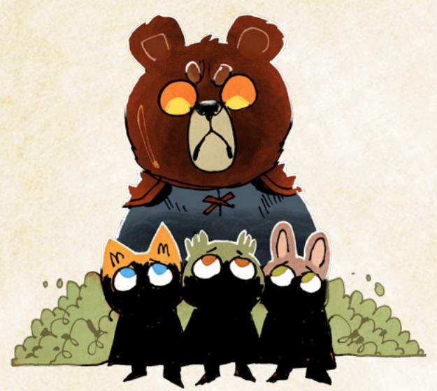
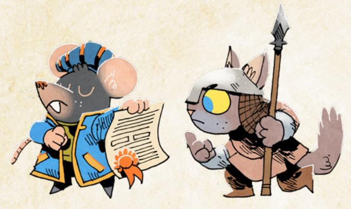
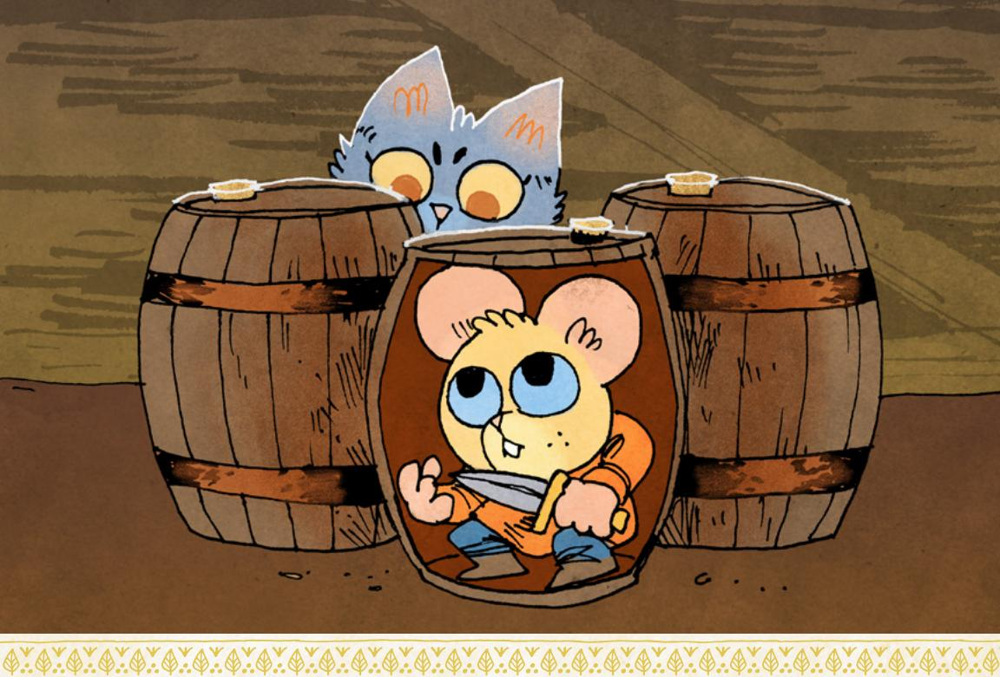
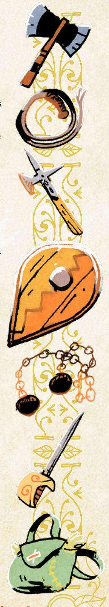
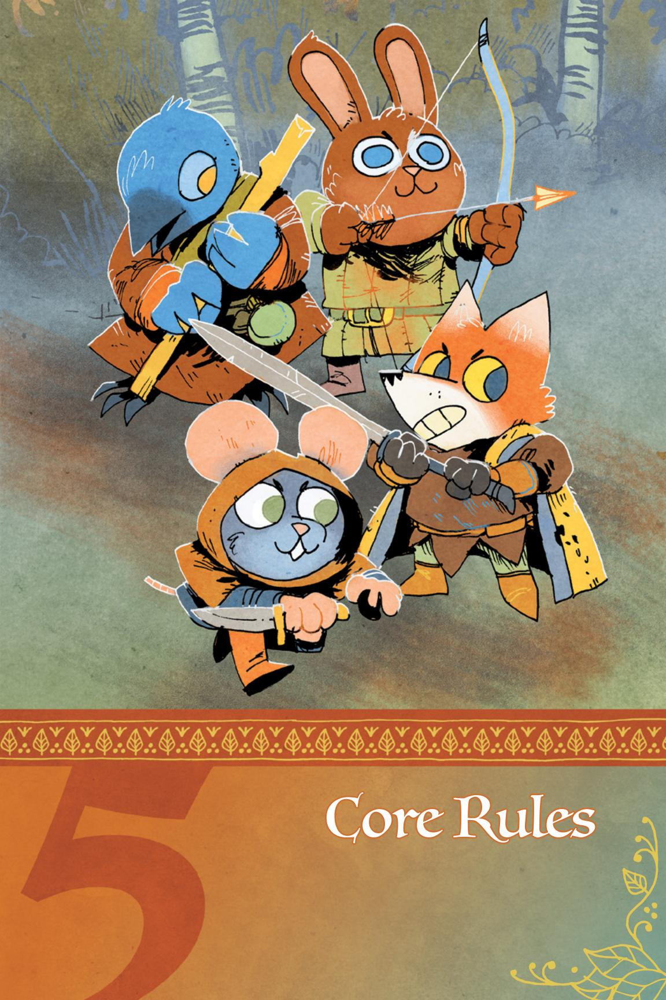
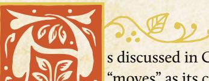

# Choosing a Playbook

To make a vagabond PC, you first need to pick a playbook. A playbook is a particular archetype, a set of ideas bound together as a guideline for your character—but not a straitjacket. Each playbook has plenty of room for you to build a unique vagabond!

There are nine playbooks in this book, each corresponding to one of the vagabonds in ROOT: A GAME OF WOODLAND MIGHT AND RIGHT, ROOT: THE RIVERFOLK COMPANY EXPANSION, and ROOT: THE Underground Expansion. These are the playbooks you'll find: The Adventurer, The Arbiter, The Harrier, The Ranger, The Ronin, The Scoundrel, The Thief, The Tinker, and The Vagrant. Each player will pick their own playbook, and no doubling up—each player must choose a different playbook than the others. That way you'll have a band of vagabonds with different traits, different problems, and different skill sets.

Each playbook is its own unique double-sided sheet. When you make your character, you'll print out your particular playbook and write all the pertinent information on those sheets, using it as the actual record of all your traits, abilities, equipment, and more, so this book often uses the terms "playbook" and "character sheet" interchangeably.

For more on the individual playbooks, see page 132.

# Example

*Derrick is making his new character. He looks at the playbooks to see what* matches his interests. He'd like a socially oriented character—not so much a fighter—so he's looking at the Adventurer and the Vagrant. Since Marissa is interested in playing the Adventurer, though, he decides to take the Vagrant.

上命し、こうべいのでしゅう、このでいるこうで

{43}------------------------------------------------

# Filling Out the Playbook

While you're picking your playbook, you should be looking them over a bit. Once you know exactly which one you'll play, make sure you have that whole playbook in front of you. Skim it over, taking a look at your playbook's particular elements.

Next, work your way through the playbook, filling out many sections entirely, making some notes and marks in other sections. You'll make all of the crucial decisions to create your character's core framework through this process. Your character will continue to change and grow over time, and many parts of your playbook will change to match—but the decisions you make now will have a great effect on your character's identity and capabilities.

# Name, Species, Details, and Demeanor

For these sections, you pick your name, your species, your details, and your demeanor. Choosing these elements can help sketch out the initial skeleton of your character. You can always revisit these later if you change your mind and want to pick something that better matches your developing character.

#### Name

For name, choose one option from the name list on the character creation worksheet or make up a similar option of your own. You might also have a nickname, like Scar or Patches, that other denizens call you!

#### Species

Your species is what kind of animal you are; either pick one option from the list, or add your own in the blank. There are four common animals in the Woodland—birds, foxes, mice, and rabbits. Other animals are less common, but the Woodland is a big place filled with lots of different creatures.

In fact, your species can more or less be anything, with a few limits:

- Don't pick an animal that is bigger than a wolf in the real world. All denizens in Root: The RPG are more or less person-sized, but it starts feeling a bit strange if you bring in larger animals...and in the background of the Woodland, a lot of the larger animals (deer, bears) are particularly strange or dangerous.
- Don't choose purely aquatic animals. Amphibious animals can work, but no fish. The denizens of the Woodland—and the other player characters—are going to be skewed heavily to land animals. Make sure you're picking an animal that can physically interact with the other denizens, and about whom you won't be asking every five seconds, "But how do your gills work above water? How can you breathe?"

{44}------------------------------------------------

Animals don't come with any special traits or abilities, beyond what makes sense in the fiction. Birds can fly. Moles can dig. Beavers can chew through wood. Foxes can scent other animals with ease. And on and on.

These abilities aren't special—they fit into the existing moves perfectly! When a bird tries to fly, if there's no tension and no uncertainty, then she just does. When she tries to fly to evade a flash flood, well, that sounds like *trusting fate*, or *attempting the roguish feat of acrobatics*. When a mole tries to dig a tunnel, if there's no tension and no uncertainty, then he just does. If he needs to dig a tunnel with perfect secrecy that comes up inside the Mayor's house…then maybe he's *attempting the roguish feat of sneaking*. And so on.

The biggest effect of choosing a particular species for your character is social. If you're a bird, then a lot of denizens will automatically associate you with the Eyrie Dynasties. If you're a cat, then they'll associate you with the Marquisate. If you're a rabbit, fox, or mouse, you'll be seen as a downtrodden, regular denizen of the Woodland. If you're a lizard, wolf, toad, anteater, or some other animal from afar, then you might be viewed with suspicion and mistrust. Everybody in the Woodland carries their own expectations and prejudices, and unfortunately, your species affects how others see you, even if you try your best to distance yourself from those factions.

#### Details

For details, you have three lines of options with a few details that are mostly unique to your playbook. Circle at least one option from each line, or fill in your own and circle it. You can circle more options if you choose for them to apply.

The first line is always the pronouns that your character uses; the second line is a small physical description of your character, to prime other players

{45}------------------------------------------------

for picturing the character in their heads; and the third line is an interesting detail or item that you carry, not generally something of great use or particular advantage, but a trinket that means something to you.

#### Demeanor

For demeanor, choose one option and circle it, or fill in your own. Demeanor is just a short cue about your character's overall bearing and personality. As always, this is meant to be a prompt, a way to get you started with options that fit your playbook well—it's not meant to be a hard limit.

# Example

*Derrick looks at the name list and likes the sound of "Jinx." He considers for a minute making Jinx a mouse, but "opossum" keeps calling to him. Derrick likes the image of a vagabond who solves problems by playing dead and feels that an opossum is great for that! He circles it, picturing Jinx as a grey-furred rat-tailed opossum. But even though the character is an opossum, Jinx doesn't get any special advantage by playing dead—instead, Derrick will still roll to trick an NPC when Jinx tries, and that's when the Cunning stat will matter—but that's all something to think about later.*

*For details, Derrick chooses from the pronouns line that Jinx uses "they" pronouns, and "patchwork" from the physical description line sounds good—Derrick sees Jinx as having patched-up clothes sewn from countless other garments. He likes three of the trinket options, so he circles all three—"tattered cloak," "luck charm," and "gambling paraphernalia." The good luck charm feels right, but he'll figure out what it is later. He sees the gambling paraphernalia as dice and a cup to roll them.*

# Background Questions

The background questions are prompts to get you thinking about and filling in your character's past. Every vagabond has a past, and those elements are great story fodder for interesting, dramatic scenes down the line.

Each playbook has five questions, and each question has a few answers you can select. The five questions are usually the same on every playbook, although some of the options differ from playbook to playbook. If you feel strongly, you can answer a question with a different answer from those provided, but you should see if the presented answers work at all—most of them have plenty of wiggle room to provide more specifics and further detail.

#### Where Do You Call Home?

This question is a combination of "where are you from?" and "what place matters deeply to you?" If you're a vagabond, you don't really have a place where you're settled, where you live day in and day out. But many vagabonds have a

{46}------------------------------------------------

place in their hearts held in special fondness, whether because they're from that place, or because they return to that place when they need to rest for a time. That's your home. Saying that it's one of the clearings means that clearing is an important place to you; saying it's the forest means that somewhere in the wilds of the Woodlands, you have a safe space to rest; and saying that it's a place far from here means that you're likely from elsewhere, not attached to any particular spaces in the Woodland.

#### Why Are You a Vagabond?

Every PC in a game of Root: The RPG is a vagabond. That means they don't settle down, they keep traveling around the Woodland, and they've had to acquire some degree of skill. But most importantly, they choose to continue being vagabonds. Answering why you are a vagabond speaks both to the events that brought you to be a vagabond in the first place, and to the reasons you continue to be a vagabond today. What's more, if you find the answer to this question is ever resolved, then it's fair to ask if that character would retire and settle down. If they wouldn't give up a life of adventuring yet…you need a new reason to keep being a vagabond.

#### Whom Have You Left Behind?

Becoming a vagabond always means leaving others behind, one way or another. Whether it's friends and family you left behind at your home or it's a teacher you left behind as you struck out on your own, there's someone who meant a great deal to you whom you left to move throughout the Woodland as a vagabond. When you choose your answer to this question, you choose a character of significance to you. Make sure you think about some details for them, like their name, species, why you left them, and where they might still be found.

#### Which Faction Have You Served the Most and With Which Have You Earned a Special Enmity?

Both of these questions have to do with your vagabond's relationship to the major factions present in your game. The factions are the powers like the Marquisate, the Eyrie Dynasties, the Woodland Alliance, and the denizens themselves. For each of these questions, you choose one faction, establishing that you've either aided them or harmed them in the past through your actions as a vagabond. Whatever you did, it was no little thing—the faction as a whole cares about and remembers what you did, to the point that your actions continue to influence their current feelings about you.

You mark two prestige with the faction you served, and one notoriety with the faction you harmed. Marking prestige means that you are coming closer to forming a good reputation with that faction. Marking notoriety means that you

{47}------------------------------------------------

are coming closer to forming a bad reputation with that faction. You can choose the same faction for both questions if you like—it means you've both helped and injured the same faction. For more on prestige and notoriety, see [page 110.](#page-110-1)

And make sure over the course of character creation you think a bit about what you did to help or hurt those factions. There are plenty of other places throughout character creation where you might be able to flesh those details out, like when you establish your connections with other PCs ([page 50\)](#page-50-0) or when you establish the vagabond band's daring exploit [\(page 61\)](#page-61-0), so you don't necessarily have to decide right away. But at some point during character creation (most often when you introduce your character to the other players), you will explain what you did to help and hurt those two factions, so make sure it's percolating as you move forward.

# Example

*It's time for Derrick to fill in the background of Jinx. He decides that Jinx is from somewhere far from here—Jinx is an opossum and they see themself as coming from a family of opossums living deep in the woods. The reason Jinx is a vagabond, Derrick decides, is that they are on the run for their lies and tricks. Jinx has run one too many cons in one too many places; nearly anywhere they'd go, there are probably a few denizens who might recognize them and try to take retribution.*

*Derrick also decides that Jinx recently left behind their best friend and former partner in crime, a combination of two of the answers on the Vagrant playbook. Derrick sees this friend, named Pell, as another scammer who ultimately settled down and left the life of endless tricks. He names the clearing Pell still lives in, based on the options on the map. Finally, Derrick decides that Jinx has served the Woodland Alliance the most—Jinx's tricks have been useful for the would-be rebels—and has earned a special enmity with the denizens themselves. The regular denizens of the Woodland are annoyed by the Vagrant's cons. Derrick marks two prestige with the Woodland Alliance, and one notoriety with the denizens.*

{48}------------------------------------------------

# The Stats

Every PC in Root: The RPG has five stats that measure, as a rough baseline, how good they are at particular things. Those five stats are: Charm, Cunning, Finesse, Luck, and Might.

Charm represents a character's facility with conversation, dialogue, and social interaction. The higher Charm a character has, the more likely they are to be able to persuade NPCs to act as they wish, or to figure out what's going on in other characters' heads.

Cunning represents a character's craftiness, perceptiveness, and cleverness. The higher Cunning a character has, the more likely they are to be able to trick NPCs to act as they wish, or to take in the situation around them and determine effective courses of action.

Finesse represents a character's manual dexterity and skill with their hands. The higher Finesse a character has, the more likely they are to be able to perform complicated roguish feats and do things like shoot a bow accurately.

Luck represents a character's sheer willpower, survivability, and, well…luck. The higher Luck a character has, the more likely they are to be able to scrape through dangerous or complicated situations more or less intact, but never without a price.

Might represents a character's pure physical strength. The higher Might a character has, the more likely they are to be able to smash apart doors or locks, or to be absolutely deadly in close-up melee combat.

Your playbook comes with a pre-chosen set of stats, showcasing the particular kind of character that playbook represents. You can adjust your character's prechosen set of stats slightly by adding +1 to any one stat of your choice, but you can't raise any stat beyond a +2 (right now).

In general, a +0 represents an average stat for a vagabond—which is still better than most Woodland denizens. Anything below a 0 means that when the vagabond tries to use that stat, they're taking a real risk. Anything above a 0 means that when the vagabond tries to use that stat, they're likely to remain in control and get what they want.

# Example

*As a Vagrant, Jinx's starting stats are Charm +2, Cunning +1, Finesse –1, Might 0, and Luck 0. Derrick gets to add +1 to any one stat of his choice, as long as he doesn't raise it above a +2. Charm's out, then. Derrick thinks about Luck—he can see Jinx as someone who's relied on sheer good luck and will to make it through tough situations—but he ultimately chooses Cunning so that Jinx can run their tricks with even greater facility.*

{49}------------------------------------------------

# Who Decides?

Who decides when you have achieved your drive or followed your nature? Does the player call it out, or is it the GM's call?

Ultimately, it's the GM's call, but the answer is often somewhere in the middle. If the GM notices that a vagabond has fulfilled their nature or drive, the GM should call it out—it's a chance to get on the same page about how and when it is fulfilled, and to give that character an appropriate reward for dramatic play. In practice, though, it's a lot harder for the GM to keep track of every vagabond's natures and drives along with everything else going on in the game. So the most likely course of events is that the vagabond's player fulfills their nature or drive and calls it out.

If a player thinks they have hit their condition for a nature or drive, they should say so aloud. Most of the time, the GM will be on the same page, and everyone will agree that you've fulfilled it. If the GM does disagree, then it's a good opportunity to get on the same page about what the drive or nature means. And if the character's drive or nature doesn't feel right anymore, it's always possible to change it—see [page 177](#page-177-1) for more!

# Nature & Drives

Every vagabond PC has a nature and two drives. Your **nature** speaks to your inner character, a kind of baseline description of what you feel, how you act, and most importantly, how you relieve stress. Your nature describes a way that you can clear all of your exhaustion track, usually by getting into trouble or giving in to some difficult urge. Exhaustion is one of your harm tracks, measuring how tired your character is; clearing it gives you a burst of energy to be much more effective. For more on exhaustion, see [page 55](#page-55-0).

You are never required to follow your nature, but you will likely want to over the course of play, whether because it makes sense for your character or because you need to clear your exhaustion track. Pick a nature that you're interested in actually following; if you can't see yourself ever fulfilling your nature, then it's not a good choice.

Your **drives**, on the other hand, speak to deep wants within your character. If your nature is a kind of dangerous instinct of your vagabond, then your drives are desires that come up again and again. Your drives each give you a condition by which you can advance—fulfill the condition, and your vagabond grows just a bit stronger, just a bit more effective. For more on advancement, see [page 170.](#page-170-1)

You have two drives, and you can advance once for each drive per session. Similar to your nature, pick drives that you're interested in pursuing. During

{50}------------------------------------------------

play you will look for opportunities to fulfill your drives and advance, so if you're not interested in doing that for a particular drive, it's not a good choice.

# Example

*Derrick knows that he wants Jinx to be a tricksy con artist. He looks at the Vagrant's two natures, Drunk and Hustler, and instantly chooses Hustler—it fits Jinx's mischievous, deceptive manner way better. Then, Derrick looks at the Vagrant's drives. Clean Paws kind of speaks to his desire for Jinx to trick other people into acting how Jinx wants and then appear to be innocent…but he's most interested in Chaos and Thrills. Derrick can see Jinx trying to fulfill those drives much more often during play, so he picks Chaos and Thrills as Jinx's two drives.*

# Connections

Your connections set up your relationships with the other vagabonds in your band. Most vagabonds have heard of each other and know about each other's reputations—they're all in the same "profession," after all. But you and your fellow PCs are particularly connected to one another. You've worked together, pulled heists together, fled from the authorities together. You're friends, coworkers, allies, maybe even family. Your connections establish those relationships between you.

Each connection includes a few elements: a category, a sentence with a blank space, and a mechanical effect. The category is a general notion of how you feel about the other vagabond in the connection—you see them as family, a fellow professional, a friend, etc. The sentence is a description of the actual, specific relationship and history you have with each other. You'll fill in the blank with the name of the other vagabond in the connection. Finally, the mechanical effect is a change, tweak, or advantage that you get because of your relationship. Unless otherwise noted, the mechanical effect applies only to you.

Every player has two connections on their own playbook. Each connection links you and another PC. You'll wind up with at least the two connections on your own playbook linking you to other PCs, but you might wind up with more connections when other PCs choose your character to fill in the blanks on their own connections.

When you make your characters, you fill in your connections last. After everyone has made their characters in all other respects, go around the table one at a time. Choose a single connection, and fill in the blank with the name of another PC vagabond. Always choose a PC—never an NPC denizen or vagabond. If there are questions about the connection, answer them. The GM may ask a few additional questions to fill in details of the connection, to make sure it's fleshed out and everyone has a shared understanding of the PCs' histories with each other.

{51}------------------------------------------------

After you've gone around once, go around a second time, filling in names for the second connection. Don't pick the same vagabond for both of your connections. It's fine if you fill in another vagabond's name in a connection on your own playbook, and they fill in your name in a connection on their playbook. Think about how the connections build on each other to flesh out your relationship.

Every connection in this book has one of six mechanical effects, depending upon the type of connection. Most mechanical effects list a specific trigger for when they come into effect during play—for example, the Protector connection only comes into effect "when they are in reach." The Partner connection has an immediate effect that comes into play as soon as you establish the connection, as well as an ongoing effect during play. As mentioned above, the specific fictional relationship of the connection varies a bit based on the prompt for the connection. Here are the mechanical effects, listed for reference.

#### Protector

*When they are in reach, mark exhaustion to take a blow meant for them. If you do, take +1 ongoing to weapon moves for the rest of the scene.*

# Partner

*When you fill in this connection, you each mark 2-prestige with the faction you helped, and mark 2-notoriety with the faction you harmed. During play, if you are spotted together, then any prestige or notoriety gains with those factions are doubled for the two of you.*

#### Watcher

*When you figure them out, you always hold 1, even on a miss. When you plead with them to go along with you, you can let them clear 2-exhaustion instead of 1.*

#### Friend

*When you help them, you can mark 2-exhaustion to give a +2, instead of 1-exhaustion for a +1.*

# Professional

*If you share information with them after reading a tense situation, you both benefit from the +1 for acting on the answers. If you help them while they attempt a roguish feat, you gain choices on the help move as if you had marked 2-exhaustion when you mark 1-exhaustion.*

#### Family

*When you help them fulfill their nature, you both clear your exhaustion track.*

{52}------------------------------------------------

#### Example

After hearing about all the other characters, Derrick introduces Jinx—mischievous con artist that they are. When it's Derrick's turn to select a connection, he thinks about which connection to use with which fellow PC. First, he chooses to fill in Jinx's Family connection—"After \_\_\_\_\_ and I pulled off an impressive heist and stole something very valuable from a powerful faction, my bad choices landed me in dire straits. But they bailed me out, and we've been close ever since."—with the Thief, Cloak. It makes sense to Derrick—Jinx and Cloak are two of the characters most interested in straight theft, and after talking about it a bit, they decide to say that they stole a whole cart of gold from the Marquisate. Then, after it comes around to Derrick's turn again, he chooses to fill in Jinx's second connection, the Watcher connection—"\_\_\_\_ saw through one of my cons and turned it back on me. How? Why did we forgive each other?"—with the Harrier, Quinella. He figures that she managed to scam Jinx for the coin they were trying to get out of her, and that the two got along fine after because Jinx was so impressed!

# Faction Reputation

This is how you keep track of the ways other factions view you. Your reputation is the number you have circled for a given faction, ranging between -3 and +3. The higher the number, the better a faction's view of you. A +0 means members of the faction haven't heard much about you, or what they've heard is conflicted—they're not sure if you're a friend or foe. A +3 means that members of the faction view you as practically a hero, certainly as one of their own. A -3 means that members of the faction view you as a dire threat—and they'll probably try to take you down on sight.

# -3 | | | | -2 | | | | | -1 | | | | | | | | | | | | |

Write the name of each faction in your game into the blanks on your character sheet (make sure you remember to include "Denizens" in that set!). When play starts, not counting any boxes you marked for connections or your background connections, your reputation is a o with each of those factions—circle the number o to indicate that.

Every time you're told to mark I prestige with a faction, mark a box to the right of the o on that faction's line. Every time you're told to mark I notoriety with a faction, you mark a box to the left of the o on that faction's line.

-3 | | | | -2 | | | | -1 | | | | | | | | | | | | | |

{53}------------------------------------------------

To go from a +1 reputation to a +2 reputation, you must fill all the prestige boxes between 0 and +2, ten boxes in total. Similarly, to go from +2 to +3 reputation, you must fill all the prestige boxes between 0 and +3, fifteen boxes in total.

Notoriety works much the same way. When you've filled all the boxes between o and -1, you would lower your reputation, erasing the circle around the o and circling the -1, and clearing all your marked notoriety with that faction. To go from -1 to -2 reputation requires you to fill all the notoriety boxes between o and -2—six boxes in total. To go from -2 to -3 reputation requires you to fill all the notoriety boxes between o and -3—nine boxes in total.

If your reputation is above 0, then filling all the notoriety boxes between 0 and -1 will drop it a level. For example, if your reputation is +2, and you fill the three notoriety boxes between 0 and -1, erase your +2 reputation, circle +1, and erase all the marked notoriety boxes for that faction.

If your reputation is below 0, then filling in all the prestige boxes between 0 and +1 will raise it a level. For example, if your reputation is -2, and you fill the five prestige boxes between 0 and +1, erase your -2 reputation and circle -1, and erase all the marked prestige boxes for that faction.

$$-3 \bigcirc \bigcirc \bigcirc -2 \bigcirc \bigcirc \bigcirc \bigcirc \bigcirc \bigcirc \bigcirc \bigcirc \bigcirc \bigcirc \bigcirc \bigcirc \bigcirc \bigcirc \bigcirc$$

{54}------------------------------------------------

During character creation, you'll only change your reputation through background questions and some connections—but it's not impossible to start with a +1 or a -1.

Prestige and notoriety tracks are independent from each other. When you mark enough prestige that your Reputation would go up, you only clear your prestige. When you mark enough notoriety that your Reputation would go down, you only clear your notoriety. Whenever Reputation would change, the relevant track—and only that track—is cleared.

If a Reputation loss or gain shifts the threshold for when prestige or notoriety would shift Reputation, the new threshold applies. This might lead you to instantly make two changes to your Reputation that ultimately cancel each other out, but clear out much of your prestige and notoriety.

When you clear prestige or notoriety because of a Reputation change, you should only clear as much as you need to reach the new number. Any extra prestige or notoriety is left over, starting from +0, to apply to the next Reputation shift.

 $-3 \bigcirc \bigcirc -2 \bigcirc \bigcirc -1 \boxtimes \boxtimes \boxtimes +0 \boxtimes \boxtimes \boxtimes \boxtimes \boxtimes (+1) \boxtimes \boxtimes \bigcirc \bigcirc +2 \bigcirc \bigcirc \bigcirc +3$

-3 O O -2 O O -1 O O O O O O O O O O O O O O O O

-3 ○ ○ 0 -2 ○ ○ 0 -1 ○ ○ ○ +0 ⊠ ⊠ ○ ○ ○ (+1) ○ ○ ○ ○ +2 ○ ○ ○ ○ +3

# Example

Because they served the Woodland Alliance most, Jinx has two boxes of prestige—the first two to the right of the o—marked. And because they managed to earn a special enmity with the denizens, they have the first box of notoriety—the first to the left of the o—marked. Then, because Keera the Arbiter chose Jinx for her Partner connection, Derrick has to mark two additional prestige boxes with the faction Jinx and Keera helped, and two additional notoriety with the faction Jinx and Keera harmed. Derrick winds up marking two prestige with the Marquisate, and two notoriety with the denizens—pushing Jinx to a —I reputation with the denizens! Derrick erases the o, circles the —I, and clears all the notoriety for the denizen track.

{55}------------------------------------------------

# Moves

Every playbook comes with its own set of moves—special abilities, expertises, advantages, and traits that a vagabond might have. Sometimes, playbook moves will just change your stats. Sometimes, they'll give you a whole new trigger and result. All of the moves on a playbook are geared to support that playbook's overall archetype.

When you create your character, you'll usually get to choose three out of six of your moves to start with. Choose moves that sound interesting and exciting to you!

For more on the playbooks and their moves, see Chapter 5.

# Example

*Derrick has to pick three playbook moves for Jinx from the Vagrant playbook. He takes a look at his options and likes the look of Let's Play, a move that lets Jinx gamble to get information out of people; Pocket Sand, a move that Derrick hopes will give Jinx some options in a fight; and Desperate Smile, which Derrick thinks fits Jinx's likelihood to rely on desperate begging to save their skin. Derrick likes the look of Instigator and Charm Offensive as more ways to handle fights, but he thinks the other playbook moves suit his character better to start. He notes Instigator and Charm Offensive for future advancements.*

# Harm Tracks

Your harm tracks represent different kinds of "harm" or "costs" you might suffer. Usually, you'll want to keep them as empty and unmarked as possible.

Every PC vagabond has three harm tracks: depletion, exhaustion, and injury. They all start the game four boxes long. You won't have to make any changes to these tracks during character creation.

**Depletion** tracks how much assorted equipment and supplies you're carrying. You can mark depletion to have a small, useful item, pulling it from a pouch at the right moment. You can also mark depletion for extra money, or on some moves that ask you to pay it as a cost. When all the boxes on your depletion harm track are filled, then your pockets are empty—you can't mark any more depletion, for any reason.

**Exhaustion** tracks how much energy you have left, and how tired you are. You won't choose to mark exhaustion without a specific move, effect, or GM move asking you to, but several moves have you pay exhaustion to avoid some consequence (like *attempt a roguish feat*, see [page 68\)](#page-68-1). When all the boxes on your exhaustion harm track are filled, you're utterly drained, just about to drop into unconsciousness or powerlessness—in this state, you can't choose to mark exhaustion for any reason, and if something else inflicts exhaustion harm on you, you become unconscious or entirely removed from action.

{56}------------------------------------------------

**Injury** tracks how much physical harm you've suffered. Similar to exhaustion, you won't choose to mark injury without a specific move or effect asking you to. Injury is usually inflicted upon you when things go wrong—when you fall too far, when someone's sword connects with you, and so on. When all the boxes on your injury track are filled, you're on death's door. You're barely able to function physically—definitely no running, jumping, or fighting (if you try, you're asking the GM to make a hard move against you)—and you need medical attention immediately. If something inflicts injury harm on you while your injury track is filled, then your character perishes.

To see more on harm and harm tracks, see [page 125.](#page-125-1)

# Roguish Feats

Roguish feats represent particular larcenous skills that a vagabond has picked up. Vagabonds are very skilled—no one lasts long as a vagabond if they aren't possessed of enough willpower and skill, so the only vagabonds around for an extended time are all widely capable, with their own smaller array of specialized skills. Roguish feats are how Root: The RPG represents some of the criminal abilities vagabonds have acquired over their careers.

Roguish feats are used hand in hand with *attempting a roguish feat*. Over the course of play, you often attempt tasks that fall in line with a roguish feat. If you have that feat marked on your playbook—abbreviated to "having that roguish feat"—then you're *attempting a roguish feat*: you roll with Finesse, and the move will give you more controlled results. If you *don't* have that feat marked on your playbook—abbreviated as "not having that roguish feat"—then you're *trusting fate*: you roll with Luck, and no matter how well you roll, you're going to pay a cost or suffer a complication. For more on both these moves, see [page 83.](#page-83-0)

Put another way—having a roguish feat means that you're much more likely to keep control of a situation in which you're counting on your larcenous abilities. Not having the feat doesn't mean you can't attempt those acts, but it does mean that you are going to face some consequence or messy circumstance whenever you do.

Most playbooks have your roguish feats pre-selected, so you don't have a choice to make. Some playbooks give you a choice, and you pick one or more from the list.

# Example

*Derrick doesn't need to pick any roguish feats for Jinx—for the Vagrant, they're preselected as Pick Lock and Sleight of Hand. Derrick likes the look of Sneak for sure, and makes a note of it for future advancement. For now, though, when Jinx sneaks, Derrick will roll to trust fate.*

{57}------------------------------------------------

# Weapon Skills

**Weapon skills** represent special combat-related techniques that a vagabond has mastered. The same way that roguish feats represent particular larcenous skills a vagabond has picked up, weapon skills represent combat skills a vagabond has acquired. They are advanced moves giving vagabonds special, particularly effective maneuvers during fights. They give vagabonds the ability to contend with dangerous, potent enemies, and with larger groups of foes—though even then, they're far from invulnerable.

There are three basic weapon moves that all characters have access to—*engage in melee*, *target someone*, and *grapple with someone*. As long as a vagabond is in the right place to use those moves in the fiction—they have the right equipment, they're at the right range, etc.—they can use those moves. For example, any vagabond can *target a foe* at far range if they have a bow.

In order to use any of the other weapon moves, a vagabond needs to have the weapon skill marked on their playbook. Most of the weapon moves also require the vagabond to wield an appropriate weapon, tagged with that skill, though there are some exceptions like *improvise weapon*. The important takeaway for you is this: it's not enough to just have the weapon skill marked on your playbook, and it's not enough to just have a weapon with the right tag. For most weapon moves, you must have both.

{58}------------------------------------------------

When you're creating your character, you pick one weapon skill to start with from a set of four specific to your playbook. The set of four is bolded on your playbook; the bolding only matters for character creation. From that point forward, you can get more weapon skills through advancement or special moves, and all of them are open to you. For more on advancement and weapon skills, see [page 176](#page-176-0).

You may get more weapon skills during character creation through a playbook move, like *Dirty Fighter* on the Ranger playbook. Usually, these moves grant weapon skills that don't count against your maximum limit of six weapon skills gained through normal advancement. Mark weapon skills you gain through a move with a single slash instead of a full X, to indicate they don't count against your maximum.

For more on weapon moves and how to use them, see [page 89.](#page-89-1)

# Example

*Derrick gets to pick Jinx's starting weapon skill from Improvise, Parry, Quick Shot, and Vicious Strike. Improvise seems handy and like it fits Jinx's style, but Derrick settles on Vicious Strike—Jinx is the type to take advantage of dirty fighting across the board.*

# Equipment

Vagabonds have plenty of bags, satchels, pouches, backpacks, pockets, and more. They carry plenty of knickknacks, coins, assorted herbs, and more. Most of that stuff is represented by the depletion harm track (see [page 125](#page-125-1) for more on depletion) as general gear your vagabond carries.

When Root: The RPG refers to equipment, it refers to important, larger, specific, and non-replaceable items. Your sword or your bow are pieces of equipment. Your armor is a piece of equipment, as is your shield. Arrows aren't equipment in the same way…unless they're very special arrows. A lockpick isn't equipment and is better represented by depletion…unless it's a masterwork, unbreakable lockpick.

In terms of the game's rules, a piece of equipment is something that has both a **wear** track and its own **tags**. **Wear** is a special harm track unique to an individual piece of equipment, representing the equipment's durability. When all the boxes of a wear track are full, then the associated piece of equipment is damaged pretty badly, to the point that it's barely functional. If you ever need to mark another box of wear on a piece of equipment with a full wear track, then the equipment is destroyed entirely, beyond repair.

{59}------------------------------------------------

**Tags** represent special traits, moves, abilities, and other mechanical effects that a piece of equipment might bear. They range from traits that make a weapon more effective in combat, to abilities that make a flute particularly useful for putting on shows.

**Weapon move tags** are a specific kind of tag that allows a wielding vagabond to use a particular weapon move—as long as they also have the appropriate weapon skill (see [page 90](#page-90-0)).

A weapon will also have at least 1 Range by default. That is the range at which the weapon can reach enemies, the range at which it is effective. There are only three ranges—intimate, close, and far. For more on ranges, see [page 91](#page-91-0).

If an item isn't significant enough to have wear or tags, then it isn't a piece of equipment within the game's rules—it can be discarded, forgotten, lost, and ignored without much trouble. This is the difference between a single, unimportant torch, and a special bull's-eye lantern crafted with colored glass from the far away Domain of the cats.

# Load

You can't carry an infinite amount of equipment without consequence. Every vagabond can carry only so much **Load** without being burdened—4 by default, modified by your Might. If you have a Might of +1, you can carry 5 Load; if you have a Might of –1, you can carry 3 Load. Carrying handheld, pocket-sized, or lighter wearable items doesn't use up any Load. But larger, significant, or heavier items use up 1 Load.

Think of Load as an indicator of large and obvious items when someone sees your vagabond. Your armor, your sword, your bow, your shield—someone looking at your character would see them all on the body, hanging from a scabbard, slung over a shoulder—and each would use up 1 Load. The knife that your character has in their boot, however, wouldn't use up any Load.

A particularly large or bulky item might have a flaw tag that makes it take up 2 Load—a huge sword, for example. If an item is small or easy to carry, then even if it has wear, you can carry it without it using up any of your Load.

{60}------------------------------------------------

If you're ever carrying more Load than your maximum, then you're burdened meaning that you're slow, you're not able to move quickly or easily, and the GM will make moves as appropriate. You absolutely cannot carry more Load than twice your maximum.

#### Buying Equipment at Character Creation

When you create your character, you also get to choose your equipment, keeping in mind your Load. You get some amount of **Value** to spend on customizing what equipment you carry.

Root: The RPG represents "money" in the form of Value—an abstracted measure of general worth. Every faction uses different coinage, and many clearings rely primarily on barter, so Value is how the game represents currency as a mechanic. Every piece of equipment is worth a certain amount of Value, based on this simple formula:

#### **Boxes of Wear + Extra Ranges + Special Tags + Weapon Move Tags – Flaw Tags**

A sword with three boxes of wear, one special tag, one weapon skill tag, and no flaw tags would have a Value of 5.

You can spend your starting Value however you choose, and you get to keep anything you don't spend in coinage or valuable goods that you're carrying and can use for money later. For more on equipment, including a list of equipment tags and pre-made items, see [page 181](#page-181-1).

# Example

*Derrick has 8 Value to spend for Jinx on equipment. He knows he wants Jinx to have a special dagger, so he picks out a baseline dagger from Chapter 7 [\(page 191\)](#page-191-0), and adjusts its traits a bit. Ultimately, he winds up with a blade that has two boxes of wear, two ranges (intimate and close), the Vicious Strike weapon move tag (to make sure he can use his starting weapon skill), and the Mousefolk Steel special tag, for a total cost of 5 Value. He names it the Jinxblade and records it on the equipment section of his sheet.*

*He also decides that he wants something armor-esque, but that Jinx wouldn't really be wearing armor. He picks out a robe with one box of wear and the special trait Friendly, for a total cost of 2 Value. That leaves Jinx with 1 Value leftover, which Derrick chooses to hold onto as a bag of coin. The Jinxblade started as a dagger, but Derrick and the GM agree that because of its two ranges, it's more of a short sword now, so it uses up 1 Load. Jinx's robes are specifically light and cloth, so they don't use up any Load, and the bag of money is small enough to just fit in their pouches, so it uses up no Load. Jinx is only using up 1 of their 4 total Load!*

{61}------------------------------------------------

# The Vagabond Band's Daring Exploit

Finally, the last step in all character creation is one for the group to do collectively. When you start play, your group of vagabonds, called a **band**, didn't just come together yesterday. You all know each other and have some initial relationships, thanks to your connections, but the whole group has been together for a bit of time before play even begins.

To represent this, you and your band has accomplished some daring exploit together. They might have changed your map of the Woodland (see [page 224](#page-224-1)  for more on the Woodland map). To determine what you have accomplished together, roll 1d6 to find the corresponding exploit on the list:

- **1. Added a new path:** Draw a new line connecting two clearings. Try to use a different color or style of line (dotted or dashed) to indicate the new path as different from all of the old paths. Every vagabond in the group marks prestige and notoriety with any factions connected by the new path. Explain how you built the new path. When you travel along your band's path, take +1 to the roll.
- **2. Destroyed an existing path:** Add an X or other symbol indicating the place where you damaged or destroyed the path. Don't destroy the only path connecting a clearing to the rest of the Woodland. Every vagabond in the group marks prestige and notoriety with any factions connected by the destroyed path. Explain how you destroyed the path. When you travel through the forest where the path used to be, take +1 to the roll.
- **3. Changed ownership of a clearing:** Change which faction is in control of a clearing, or remove all faction control and return it to the denizens. Every vagabond in the group marks 3-prestige with the faction now in control, and marks 3-notoriety with the faction removed from control. Explain how and why you changed the ownership of the clearing.
- **4. Defended a clearing from faction attack:** Every vagabond in the group marks 3-prestige with the defending faction, and marks 3-notoriety with the attacking faction. Explain which clearing you defended, how you defended it, and why you defended the clearing from changing hands. Mark the clearing that launched the attack and the clearing you defended by drawing a dotted arrow from the attacker to the defender—that conflict is likely to flare up again.
- **5. Discovered and explored a valuable ruin of the forest:** Add the explored ruin to the map and describe some aspects of the ruin, including which denizens once lived there. If you shared information about the ruin with a faction, every vagabond in the group marks prestige with that faction. If you sold your finds from the ruin, every vagabond in the group gains 3 Value worth of coin or equipment. If you kept your finds from the ruin, the GM will tell you what artifact you found.

{62}------------------------------------------------

**6. Performed a remarkable heist:** This heist earns the vagabonds more Value to start, and greater reputations. Every vagabond in the group marks 2-prestige with the faction you helped in your exploit, and 2-notoriety with the faction you harmed in your exploit. Every vagabond gains 2 Value worth of coin or equipment. Explain what you stole, why it was remarkable, and how taking it harmed one faction and aided another. Mark the site of your heist and what you stole on the map.

#### Random Faction

| 1d6 | Faction                      |
|-----|------------------------------|
| 1   | Denizens                     |
| 2   | Your 1st faction             |
| 3   | Your 2nd faction             |
| 4   | Your 3rd faction             |
| 5   | Your 4th faction, or reroll. |
| 6   | Your 5th faction, or reroll  |

#### Random Clearing

| 2d6 | 1-3         | 4-6         |
|-----|-------------|-------------|
| 1   | Clearing 1  | Clearing 2  |
| 2   | Clearing 3  | Clearing 4  |
| 3   | Clearing 5  | Clearing 6  |
| 4   | Clearing 7  | Clearing 8  |
| 5   | Clearing 9  | Clearing 10 |
| 6   | Clearing 11 | Clearing 12 |

The group of vagabonds can collectively choose which clearing they affected, and which factions (from those that make sense in the fiction) were involved. If they cannot agree, or if the players want a random choice, then the GM can determine these aspects randomly.

To determine factions randomly, roll 1d6 using your existing factions on the **Random Faction** table. Most games of Root: The RPG only feature four factions; the GM can reroll a 5 or 6.

To determine a random clearing, either drop a d6 on your map and choose the clearing closest to where the die falls, or roll 2d6 and use the **Random Clearing** table to choose which clearing was affected.

After determining which exploit the band accomplished, where they accomplished it, and which factions were involved, spend some time fleshing out details. The GM can ask questions of different PCs throughout to have each player fill in more details!

# Ready for Adventure!

Once you've established your band's exploits, you're ready to play! The whole of the Woodland awaits you—daring adventure, political intrigue, mysterious ruins...and any kind of trouble someone is willing to pay your band to handle.

{63}------------------------------------------------

{64}------------------------------------------------

s discussed in Chapter 3 (page 26), Root: The RPG uses "moves" as its core rules framework during play—in other words, the moves of the game are the mechanisms used more

than anything else while you're playing. Each of the many different kinds of moves is a sort of nugget of rules, its own process for resolving a moment in the game's conversation wherein no one quite knows what happens next. This chapter introduces most of the different kinds of moves, breaking down how they work, and explaining all the associated mechanics and rules of the game.

First is a breakdown of the basic moves on page 68. These are the most common moves used in the entire game, available to all PCs at all times. Next is a breakdown of specialized moves, used in more specific circumstances, but very important when they come up. These include weapon moves (page 89), reputation moves (page 110), travel moves (page 121), and session moves (page 130).

After explaining the basic moves, this chapter covers an explanation of several related rules and mechanics, including the harm tracks—depletion, exhaustion, injury, and morale.
