# Using Doves in Play

All of these moves are **player-facing**—that means they're usable by the players of Root: The RPG whenever their PCs act in the fiction. The GM should know the moves and how they work, especially to support the players in using them, but only the players (through the PCs' actions) can actually take the actions that trigger them.

That's the most important thing to understand about how to use all of these moves during play: To do it, you do it. Every move has a trigger and a result. To get the result, a PC has to perform the trigger. If a PC performs the trigger, they get the result. No exceptions—if a PC triggers a move, it happens.

If your Tinker's eyes dart around a room filled with hostile guards, looking for an escape, then you are reading a tense situation. If your Arbiter punches the door to try to knock it down, then you are wrecking something. If your Thief pickpockets a rich cat noble, then they're attempting a roquish feat (or trusting fate if they don't have the pickpocket feat marked on their character sheet!).

では今し、いらいとは今し、いらいとは今し、いら

{65}------------------------------------------------

If you want to *persuade* that bandit leader to let you go, then you'd better hit that move's trigger by making a promise or a threat. If you want to *trick* your way past a guard and into a building, then you need to describe what you do to trick her, whether it's throwing a rock or shouting "LOOK OUT! FIRE!" If you want to *figure someone out* and ask the question, "how could I get your character to \_\_\_\_\_\_\_?" then you need to seize the opportunity to do that in a situation where you can watch them and try to see what's in their mind.

The GM can help by calling attention to the moves and their triggers during play, and the GM acts as the ultimate arbiter of whether or not a move has been triggered. But all of the moves that follow in this chapter depend on a PC triggering them in some way.

# Using Moves to Resolve Uncertainty

The last crucial element to keep in mind—these moves are not limits on what you can do! You can describe your character doing anything they could reasonably do within the game's world, within the fiction. If you're playing a bird, then you could describe your character flying, as long as they're not overburdened, or chained up, or what have you. It doesn't matter that there is no particular move for "flying"—it's a thing that your character could reasonably do within the game's world, so you can do it!

Angling for a particular move is useful because it can help resolve uncertainty and often in your favor if you have a high stat for that move. But it isn't necessary! You can just describe what your character does, what they say, and how they act. If the things you describe, say, or do trigger a move, then you or the GM can call it out. If nothing you do triggers a move, that's fine—it just means you haven't reached any moments of uncertainty, and the GM can just tell you what happens in response to the things you're doing.

The way moves are invoked is most obvious when you have a conversation with an NPC. Your PC and the NPC might trade words, going sentence after sentence, without ever triggering a move. Not every sentence needs to be a move—the GM can just respond to your PC based on their understanding of the NPC, with no uncertainty. But the moment that the conversation drifts towards a real attempt to *persuade*, or an attempt to *trick*, or an attempt to *figure the NPC out*—that's when a move is triggered and the dice come out!

{66}------------------------------------------------

# Types of Moves

As mentioned at the start of the chapter, there are a few different types of moves, all used in different situations:

The **basic moves** are used throughout play, and PCs can trigger them in nearly any scene. Because all PCs can trigger the basic moves, they're the most important for everyone to know, including the GM. They cover a wide array of the major situations that you encounter during play, and knowing how and when basic moves are triggered, and what they do when they're triggered, helps everyone to play better and more smoothly!

The **weapon moves** only come up around physical combats. Everyone should be relatively familiar with the three basic weapon moves—*engage in melee*, *target someone*, and *grapple with someone*—for similar reasons as with the basic moves. But players only need to familiarize themselves with the special weapon moves that they can actually use. In turn, it's useful if the GM is familiar with all the weapon moves to help the players out. But ultimately these abilities are so specialized and potent the GM can rely on the players to know their own moves and abilities, and to call out when they're triggered.

**Reputation moves** are usually triggered in situations where PCs are encountering important representatives of the factions for the first time, or when they're trying to ask for favors from the factions. There aren't many reputation moves and, as with the others, if everyone knows them, then everyone can help call out when they come into play. But these moves are often missed by the players during play, so it's particularly helpful if the GM has these moves in mind to call out regularly when they come up.

**Travel moves** are all about the vagabond band moving from one clearing to another. They're only triggered when the vagabonds want to travel between clearings, so as long as the GM and players know they exist, you don't have to know them that well; you can get by looking them up when they actually are triggered.

**Session moves**, as the name implies, are triggered once per session at the end of play. When you're closing up your game for the night, that's when a session move triggers. Though they happen once every session, you can get by looking them up every time you need to—just like with the travel moves—because they are triggered at the same time every time.

{67}------------------------------------------------

# Mold, +1 Forward, and +1 Ongoing

Some moves use a few additional, specialized terms in their results. Here's a short rundown:

- Hold is a resource, a "point" that you *hold* onto until you spend it as per the move. For example, in the move *figure someone out*, on a hit you get some hold, which you can spend one for one to ask the other character's player a question. The purpose of hold is that you don't have to spend it immediately. You can, if that's what you want—but you absolutely do not have to. You can hold it for as long as is reasonable, usually until the situation or the scene meaningfully changes (GM's call), and spend it when you choose using the parameters of the move.
- +I Forward means that on your very next roll, you add +I to the result. Sometimes, the move granting you +I forward will give you a more specific situation in which you apply the +I—for example, a move saying "take +I forward against the NPC" means you only take +I on the next move you make that is "against" the NPC, involving them and directed towards them.
- +I Ongoing is similar to +I forward, but instead of applying only to the very next roll you make, it continues to be added to every roll that fits the move's conditions. For example, a move saying "take +I ongoing against the NPC" means you take +I on each and every move you make that is "against" the NPC. "Ongoing" bonuses usually end either when the move says they do, or when the situation or scene has dramatically changed (GM's call).

{68}------------------------------------------------

# Basic Moves

As mentioned earlier, every PC in Root: The RPG can use every basic move. Basic moves are the most likely to come up during play. They both resolve common situations of uncertainty and drive the story forward in interesting ways.

The eight basic moves available to all vagabonds are *attempt a roguish feat*, *figure someone out*, *persuade an NPC*, *read a tense situation*, *trick an NPC*, *trust fate*, *wreck something*, and *help or interfere*.

# Attempt a Roguish Feat

When you *attempt a roguish feat you are skilled in*, say your goal and roll with Finesse. On a hit, you achieve your goal. On a 7-9, mark exhaustion or one risk of your feat (GM's choice) comes to bear. When you attempt a roguish feat you are NOT skilled in, you are trusting fate.

You know where the stolen Marquisate gold is, and you're ready to climb up the wall, sneak in through the window, and crack the lock on the door. Whichever specific task you're doing, you're *attempting a roguish feat*!

*Attempting a roguish feat* is for applying the skills your vagabond has picked up in illicit, non-combat arenas. It's for lockpicking, pickpocketing, sneaking, and so on—but only when your vagabond is actually skilled in that arena.

Every vagabond has a list of roguish feats on their playbook, and they start play with some already selected. Look at the **Roguish Feats** table for a list of the feats, descriptions of each, and their accompanying risks.

If you have a roguish feat marked on your playbook, then awesome! You're skilled at that particular action, and when you try to use the related skills in some way, you're *attempting a roguish feat*.

Crucially—if you don't have the roguish feat marked on your character sheet when you're taking the appropriate action, then you're not *attempting a roguish feat*. Instead, you're *trusting fate*! All vagabonds are skilled enough in general that they can rely on luck to try to pull off these roguish feats, but they get much more consistent, reliable results when they actually are skilled in the appropriate roguish feat. See more on *trusting fate* on [page 82.](#page-82-0)

When you *attempt a roguish feat*, always start by stating your goal—the thing you're trying to accomplish with your roguish feat. That helps you and the GM pick the correct roguish feat for your aims. For example, if your goal is "Get inside the guard tower," then you're sneaking—getting into or out of a place

{69}------------------------------------------------

#### Roguish Feats

| Feat               | Description                                     | Risks                                                           |
|--------------------|-------------------------------------------------|-----------------------------------------------------------------|
| Acrobatics         | Adeptly climbing, vaulting, jumping          | Break something, detection, plunge into danger                  |
| Blindside          | Backstab, murder, sneak attack, sucker punch | Draw unwanted attention, leave evidence, plunge into danger  |
| Counterfeit        | Copying, forgery, fakery                        | Leave evidence, take too long, weak result                      |
| Disable Device  | Disarming traps, turning off mechanisms      | Break something, draw unwanted attention, expend resources   |
| Hide               | Disappear from view, remain hidden           | Expend resources, leave evidence, take too long                 |
| Pick Lock          | Open a locked door, chest, etc.                 | Break something, detection, plunge into danger                  |
| Pickpocket         | Subtly steal from a pocket                      | Leave evidence, take too long, weak result                      |
| Sleight of Hand | Palming, switching, ditching, flourishes     | Draw unwanted attention, leave evidence, weak result         |
| Sneak              | Get into or out of places without being seen | Break something, draw unwanted attention, plunge into danger |

without being seen. On the other hand, if you just want to escape the notice of the guards coming down the hall, you're probably hiding—disappearing and staying in one place—instead of sneaking!

Knowing your goal also means you know what's at stake with the move—on a hit (7+), you accomplish your goal, and that cannot be taken away from you by any other conditions of the move. If your goal is to get into the guard tower, you get into the guard tower! If your goal is to avoid those guards coming down the hall, then you avoid the guards!

On a 7–9, though, a risk of your feat comes to bear, or you must mark exhaustion. The choice between "risk" and "exhaustion" is the player's, not the GM's—so the player who made the roll can choose to avoid risks if they have exhaustion to spare! But if they do choose to have a risk come to bear (or if they don't have enough exhaustion to mark), then the GM determines what risk complicates the situation.

The table of all the feats has common, suggested risks associated with particular feat, but the specific situation you're in may indicate that some of those common risks shouldn't apply, and other risks should apply. For example, if you're performing a feat of acrobatics to get to the roof of a building while fires surge up from within, maybe on a 7–9 you actually take too long and the fire is poking through the roof when you get there! Ultimately, it's the GM's call, and the player doesn't get to know exactly what will go wrong before they make the choice between marking exhaustion or suffering a risk.

{70}------------------------------------------------

#### Options for Attempt a Roguish Feat

The roguish feats are themselves self-explanatory, but here's a bit more on each:

**Acrobatics** - Clambering up trees, vaulting a chasm, swinging from a vine onto a riverboat—any kind of complicated, impressive act of moving can fall under the acrobatics roguish feat. If you're racing from guards or soldiers, then this feat might be the right one—just so long as the escape is acrobatic! If you're just running on the ground in straight lines, you're not doing anything acrobatic, but if you're leaping over barrels, scaling walls, and so on, this roguish feat is for you!

**Blindside** - Surging from the dark without warning to strike a blackjack across someone's head, leaping out of a wardrobe and stabbing at a foe—any attempt to strike without warning and take an enemy out (lethally or non-lethally) is a blindside. You need the fictional positioning to blindside an opponent: you need to be hiding or your foe needs to be distracted. That also means you likely can't blindside a fully armored foe with a stiletto—they're too well protected.

**Counterfeit** - Creating fake patents of Eyrie nobility, writing a false message from a superior to a Marquisate officer—any attempt to create a written document falls under the counterfeit roguish feat. Any vagabond who has this feat has the familiarity with myriad sigils and forms of writing to counterfeit all manner of documents. If they need especially rare or complicated materials to counterfeit something—say, gold leaf for the ornamentation on a patent of nobility—then the GM can ask them to mark depletion for those special materials. But for the most part, someone with this roguish feat is likely prepared to use it, and shouldn't have to mark depletion as a base cost (although it's a great risk coming to bear on a 7–9).

**Disable Device** - Disabling the ancient machinery of a ruined trap, sabotaging a siege weapon—any attempt to disable or sabotage a machine or device falls under this feat. This sits as the flipside of the *wreck something* basic move. If you're destroying something through knowledge and finesse, you're *attempting a roguish feat* (disable device); if you're smashing it to pieces, you're *wrecking* it.

**Hide** - Slipping into a closet and closing the door, finding a spot among some barrels—any attempt to remain stationary, still, and unobserved until danger or time has passed falls under the hide roguish feat. Hiding is often reactive, something a vagabond will do in response to an incoming danger to survive it.

**Pick Lock** - Opening up a locked chest or a locked door—any attempt to get past a lock through finesse and care falls under the pick lock roguish feat. Like disable device, this sits alongside the *wreck something* basic move. You can get through a locked door by smashing it open, or by picking the lock.

{71}------------------------------------------------

# Flashbacks

For the most part, all of these moves are used in the present, during the action. But sometimes, you can use a move in a flashback when you would have had time to prepare for the current situation. A roguish feat like counterfeit is great for this—the vagabond whipped up some documents in the past to use them right now, but you resolve the move in the present, to see how good the work on the documents was. It can be hard to use counterfeit in advance of when the counterfeited material is needed. So if a vagabond wants to use counterfeit in the moment they need an item to set up a flashback where they wrote it out before—that can be great!

To use a move in a flashback in this way, it has to make sense in the fiction—the vagabond needs to have had time to actually take the action in the past, and knowledge that would've reasonably led them to expect this outcome. And a vagabond needs to expend resources to set up the flashback, usually exhaustion (for their time and effort) or depletion (for actual physical resources). The GM sets the cost as appropriate, but usually no more than 1 or 2 total exhaustion or depletion anything more, and it's probably too much to use the move in flashback.

Finally, depletion itself is a great way to set up simple resources. See [page 126](#page-126-0) for more on how to spend depletion to have a simple useful item the moment you need it!

**Pickpocket** - Slipping a coin pouch off a merchant's belt, lifting orders from the pocket of an officer's uniform—any attempt to steal something subtly and covertly from a denizen falls under the pickpocket roguish feat. This isn't for legerdemain or stealing things from a table, for example—those fall under sleight of hand. But when you're stealing something from another character, you're picking pockets.

**Sleight of Hand** - Making a key disappear from sight to a secret pocket on your person, covertly lifting a piece of paper from among many on a table any attempt to perform a deft act of legerdemain that doesn't directly involve another denizen falls under the sleight of hand roguish feat. If it does involve another denizen, it's much more likely to be picking a pocket.

**Sneak** - Slipping down a hallway to the prince's quarters, racing quietly through the dark along a wall to reach the crack—any attempt to move quietly, silently, and secretly from place to place falls under the sneak roguish feat. Sneak isn't useful for avoiding attention within a location—it's only useful for moving from place to place. Hide is the feat for avoiding attention within a location.

{72}------------------------------------------------

#### Risks of Attempting a Roguish Feat

The risks of the roguish feats are largely in the GM's control. The GM picks the appropriate applicable risk and the exact way it manifests. But it's useful to have a bit of information on what each risk is:

- Break something Break something you're carrying or in the environment. Possibly mark wear.
- **Detection** Straight up get noticed by an onlooker. It has to matter.
- **Draw unwanted attention** Either create hostile onlookers where before no one cared, or call attention without actually being detected. Increase the danger in the area.
- Expend resources Use up supplies. Mark depletion or exhaustion as the GM chooses.
- Leave evidence Leave behind evidence that can later lead an investigation against you or expose your allies to retribution.
- Plunge into danger Seize the chance to perform the feat and wind up running straight into a more dangerous situation.
- Take too long Take too much time, leading the situation to change around you in some meaningful way.
- Weak result Get a hard choice about exactly what you want, or straight up don't quite get everything you want.

# Example

Cloak, played by Brendan, is on the run from a whole platoon of Marquisate soldiers! He races to the edge of the clearing and leaps up to fly over the 15-foot wall surrounding the clearing before the soldiers can open fire with their bows!

"This sounds like it's uncertain, going over the wall, fast, while they're firing arrows at you. Do you have acrobatics?" the GM asks.

"Yes! Attempting a roguish feat!" Brendan rolls with Finesse and gets a 7-9!

"Okay, you get over the wall," the GM says. But one risk comes to bear. The GM takes a look at the common risks: detection doesn't matter, as Cloak is already very much detected. And plunging into danger doesn't seem fun—that just seems like repeating the situation. "When you fly over the wall, leaving all those soldiers behind, you accidentally catch your belt and tear some pouches. Mark depletion!"

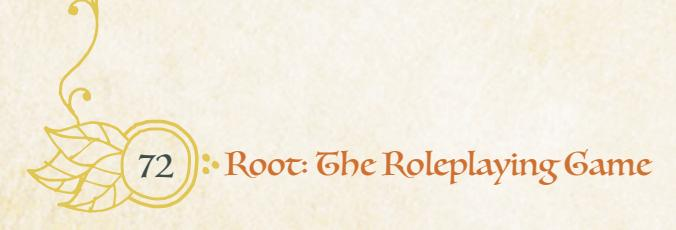

{73}------------------------------------------------

# Figure Someone Out

When you *try to figure someone out*, roll with Charm. On a 10+, hold 3. On a 7-9, hold I. While interacting with them, spend your hold I for I to ask their player a question:

- is your character telling the truth?
- what is your character really feeling?
- what does your character intend to do?
- what does your character wish I'd do?
- how could I get your character to \_\_\_\_\_\_?

You and the fox captain of the Eyrie guard are seated across the table from each other, staring each other down, each trying to get inside the other's head. In this moment, you're trying to *figure someone out*!

**Figuring someone out** is for getting into another character's head, trying to figure out what makes them tick in this scene, what they want and how you might be able to get them to act differently. It's a move for those intense moments when a character is staring down someone else, but it's just as often a move for when you and a "friend" are laughing together and your eyes dart towards them to determine what they are really laughing at.

Figuring someone out usually requires interacting with someone. You have to be talking to them, watching them, saying something to see how they react and then gauging that reaction. The GM might make exceptions for when you're watching someone without their knowledge—for example, when you're in the rafters watching someone from above—but those situations are only for when you have an especially perfect vantage point to watch people who are active.

When you get a hit on *figuring someone out*, you get hold to spend on questions. That means you don't have to ask all the questions up front—you can wait and talk to them more, shifting the conversation, before you spend your hold. But if you want to spend all your hold to ask all those questions up front, that's awesome too!

When you spend a hold to ask a question, you're not asking it in character, in the fiction of the game world. You're asking it at the player level, as yourself outside the Woodland and the fiction, and the other player must answer it at the same level, honestly. If you're figuring out an NPC, then the GM answers for them.

{74}------------------------------------------------

#### Options for Figure Someone Out

**"Is your character telling the truth?"** is with reference to something the other character just said, and it's about the character's belief. If they believe what they said is true, then the answer is "yes," regardless of whether or not it is actually true.

**"What is your character really feeling?"** provides information about emotions first and foremost, but the really is important. When you ask the question, you get what's below the surface, even if you don't get a deep explanation of why they are feeling that way.

**"What does your character intend to do?"** provides information about that character's immediate plans. This isn't "What is your grand scheme for taking over the Woodland?" but "When we finish talking, what are you going to do next?"

**"What does your character wish I'd do?"** acts as an inverted version of "What does your character intend to do?", essentially asking that question but with reference to what they want you to do. This question can focus a bit more on the long term—**"**I want you to fight alongside my faction in the war" might be an appropriate answer.

**"How could I get your character to** \_\_\_\_\_\_\_\_\_**?"** is an open-ended question; fill in the blank with whatever you want. That also means it's the one question you might spend multiple hold on, filling in the blank with different statements. If you do whatever it is they ask of you, then they are obligated to do whatever you'd asked of them. This bypasses the need for any other move—no need to *persuade* or *plead* with them—as long as you asked the question and performed the task they asked. The other player can also legitimately say "You cannot get me to do that" if it is actually true. In that case, the player—not the character—believes that there is absolutely no way that the character would ever take that action.

# Example

*Copper the Ronin, played by Grace, is trying to get a Woodland Alliance operative to lead her to the Woodland Alliance cell in the clearing. "Ah, this is going nowhere," she says. "Can I figure her out? I'm watching her carefully, gauging her every reaction." Grace rolls with Charm and gets a 10+. "I'll spend 1 hold. How could I get you to take me to your boss?"*

*The GM considers. "Her eyes keep shifting to sack of food on your back—she may be a loyal Alliance agent, but her clearing hasn't seen much food in weeks. Give her a bribe, 1-Value of food, and she'll help you out."*

*"Awesome! I'm going to hold onto my other hold then, for now," says Grace. "I give her the bribe—I'll mark off a depletion for 1-Value of food."*

*"She takes the food from you, her eyes wide; it's been a while since she's seen this much good food. She starts chowing down as she gets up and gestures for you to follow."*

{75}------------------------------------------------

# Persuade an NPC

When you *persuade an NPC* with promises or threats, roll with Charm. On a 10+, they see things your way, provided you have given them a strong motive or reasonable bribe. On a 7–9, they aren't sure; the GM will tell you what you need to do to sway them.

You're trying to get into the Mayor's special dinner, and you pull out a knife to threaten the guard into letting you past. You're *persuading an NPC*!

*Persuade an NPC* is for getting NPCs to act the way you want them to, but in an overt, fairly clear way—essentially using bribes or threats. It can only be used on NPCs, as well. If you want another vagabond to go along with you, then you should talk to them and, at best, *plead with them* (see [page 88](#page-88-0) for more on *pleading*). *Persuade an NPC* can only be used on individual NPCs. The promises and threats you make are always catered to individual NPCs, and the more denizens you're trying to make a promise or threat to at once, the more likely it is that things go awry and someone is displeased—without another special move helping out, trying to persuade a group is more *trusting fate* than anything else.

When you *persuade an NPC*, you're trying to get them to do something. At heart, this move isn't about changing beliefs or ideology—that kind of of move is more *swaying an NPC* with your Reputation (see [page 117\)](#page-117-0). Instead, this move is about getting an NPC to actually take some concrete action. And while you can try to *persuade an NPC* to act in a particular way in the future, if the situation changes enough, they can change their mind. Most often, you use this move to get an NPC to take action right now, so always try to have an idea for what action you want them to take.

You must always *persuade* using a promise or a threat. A promise means that you've promised they'll get something they want if they do what you ask, whether you take the action to give it to them, or someone else does—the proverbial "carrot." A threat means that you've threatened to do something bad to them or to something they care about if they don't do what you want—the proverbial "stick."

Finally, persuading an NPC is an honest move. You ultimately might not follow through on your end of the bargain, whether because you can't or because you choose not to, but you're not trying to deceive the NPC into doing what you want. At bare minimum, you believe you could fulfill your end of the bargain, delivering on your promise or your threat in a meaningful fashion. Especially on a 10+, you aren't bound to do so—the situation might change, and you can always reconsider...but at the time you make the move, you aren't trying to fool them. If you are tricking them, then you're using the *trick an NPC* move (see [page 79\)](#page-79-0).

{76}------------------------------------------------

#### Options for Persuade an NPC

**The 10+ result, "provided you have given them a strong motive or reasonable bribe,"** means that the NPC will do what you want, just so long as the promise or threat you've made to trigger the move is significant enough and matters enough to them that it could get them to take action. A strong motive or reasonable bribe for a low-level guard is going to be different than for the Mayor of the clearing, so it's always dependent upon the situation and the character. For the most part, this result means the NPC takes the action you want, but you might have to sell it a little more, with a little prick of a knife or a little coin greased across a paw.

**On a 7–9,** however, you have to take some concrete action here and now to get the NPC to act. You are never left in the dark here; the GM tells you exactly what you need to do to get them to act how you want. Do it, and the NPC will act that way. But this might require you to actually follow through on a bit of your threat, or to pay a significant bribe, or to share a secret, or to make good on at least a portion of your promise, etc. It means your words alone aren't enough, and the NPC needs some proof before they will act.

# Example

*Tali the Adventurer, played by Marissa, wants an Eyrie captain to leave the area with all his soldiers so she can set it up as a Woodland Alliance camp. "But you and your squad don't even want to be here! It's just an old ruin, and it's hot out here, and there's no point!" Marissa says.*

*"It sounds like you're trying to persuade the captain, but you haven't made a promise or a threat yet," says the GM.*

*"Hm, you're right. Okay, how about, 'If you head back to town, I promise, I'll put in a good word for you with Duke Whitetalon. How's that sound?'"*

*The GM arches an eyebrow. "Can you do that? Do you even know Duke Whitetalon? This sounds more like it's a trick than a persuade."*

*"Fair," says Marissa. "How about, 'If you head back to town, I promise I'll make it worth your while,' and I pull out a big pouch of gold." Marissa knows that she's only promising the gold—on a 10+, she won't have to give it to him right away!*

*"Nice!"*

*Marissa rolls with Charm and gets a 7–9.*

*"The captain is looking at the pouch of gold with greed in his eyes. 'How about you give me the gold up front, and then I'll go,' he says. You're going to have to give him the gold, but then he'll head out." Marissa groans, but agrees, and marks the gold off her character sheet.*

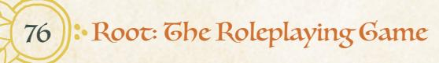

{77}------------------------------------------------

#### Read a Tense Situation

When you *read a tense situation*, roll with Cunning. On a 7–9, ask I. On a 10+, ask 3. Take +I when acting on the answers.

- what's my best way out / in / through?
- who or what is the biggest threat?
- who or what is most vulnerable to me?
- what should I be on the lookout for?
- who is in control here?

Woodland Alliance rebels have just sprung out of the bushes pointing bows at you! Your eyes dart around the path, trying to look for a way out of here—you're *reading a tense situation*!

**Reading a tense situation** is for evaluating your surroundings and circumstances to figure out how to make the best of a bad scenario. The situation has to be tense to read it, which means there has to be some sense of uncertainty, danger, or concern. If the situation isn't tense—there's no electric thrill of danger or threat in the air—then you can't read it.

When you get a hit while *reading a tense situation*, you can ask some questions from the list. You ask your questions immediately—you can ask them one at a time, but you can't save any for later in the same scene. They refer to the situation right then and there, so no holding onto the questions!

The GM answers all the questions (one of their roles being to describe the world) and answers truthfully. All of the answers they give are "true"—if they say that something is the best way through, then it is actually the best way. Sometimes, the GM can just answer the question, but other times the GM and the player will go back and forth a bit to make sure they both understand exactly what question is being asked so the GM can provide the appropriate answer.

When you act on the answer to the questions you receive, you take a +I to any moves you make—meaning that *reading a tense situation* gives you both a path to follow and a bonus to follow that path. That bonus is normally non-transferable—only the vagabond who read the situation gets the +I to follow the answers to their questions—but the Professional connection allows vagabonds to share the bonus (see more on connections on page 50).

{78}------------------------------------------------

#### Options for Reading a Tense Situation

**"What's my best way out/in/through?"** lets the player find out how to get out of or past a bad situation. The player gets to choose which option it is, whether out, in, or through. Whatever the GM says is the best way...but that doesn't have to mean the best way is actually good. The "best way" into a heavily guarded fortress might still be terrible!

**"Who or what is the biggest threat?"** tells the player what to either focus on, or run from! The biggest threat isn't always the single deadliest combatant, either—it might be the commander, tactically leading troops with brilliant acumen. But sometimes the answer will be perfectly obvious—of course the giant grizzly bear is the biggest threat! The question may still be worth asking because of the +1 bonus to act on the answers.

**"Who or what is most vulnerable to me?"** has a bit of leeway around what "vulnerable" means. It might mean "susceptible to my attacks," but it also might mean "likely to believe my lies," or "easily swayed by my reputation." As with all of these options, GM and player should ask questions and go back and forth to make sure everyone is on the same page about the question being asked and the reason the answer fits.

**"What should I be on the lookout for?"** flags a danger, threat, or problem in the area. It doesn't have to be a brand-new problem, either. Finding out that something you thought would be a problem will definitely be a problem is still useful, not least because of the +1 to act on the answer!

**"Who is in control here?"** is the question most directed towards subtlety and secrets. It's possible that the real power in the scene—the character really in control—is not at all whom you expected, and this question points that out. On the other hand, this question might point out that everything is exactly as it seems—power lies in the most obvious place! When you ask this question, make sure you and the GM both have a sense for what "control" means in this situation, as well. A bear might be the biggest threat, but the enemy vagabond who stands at the front of the bear's cave with a sword, preventing anyone from fleeing, may actually be in control!

# Example

*Jinx the Vagrant, played by Derrick, has managed to talk their way into a secret Woodland Alliance gathering in a cellar. While Jinx is mingling, trying to look inconspicuous, an old enemy—Drylla Vines—walks into the meeting. "She doesn't see you," says the GM, "but you're pretty sure it's a matter of time."*

*"Ah, crud. Okay, I think this is a tense situation—I'm going to read it." Derrick rolls with Cunning and gets a 10+. "First, I want to ask, what's the best way out?" Derrick says.*

*"Well, the meeting just started—bolting now would be conspicuous. But you*

78 Root: The Roleplaying Game

{79}------------------------------------------------

definitely saw some lookouts outside when you came in. You've either got to wait out the whole meeting, or bluff your way out by pretending you're a lookout."

"Okay. But I want to get something for my pains. Who or what here is most vulnerable to me?"

"Hm. Drylla is definitely vulnerable to you—she doesn't know you're here, and you have a chance to move against her right now."

"Sweet. And finally, might as well—who is in control here?"

"Oh, yeah—you begin to realize that as Drylla walks around, all the other Woodland Alliance agents are sort of deferring to her. They came here to listen to her—she's in charge! What do you do now?"

# Grick an NPC

When you *trick an NPC* to get what you want, roll with Cunning. On a hit, they take the bait and do what you want. On a 7–9, they can instead choose one:

- they hesitate; you shake their confidence or weaken their morale.
- they stumble; you gain a critical opportunity.
- they overreact; take +1 forward against them.

The Eyrie sergeant has come to the ruins to take you captive—so you hide and cry out that you have him and all his soldiers surrounded (by allies that don't exist). If they don't leave now, your allies will take them all! You're *tricking an NPC*!

*Trick an NPC* is a move for deception, trickery, cons, and lies. If you're telling the truth or honestly trying to change someone's mind, then you're *persuading an NPC*. But if you're deceiving an NPC, then you're *tricking them*.

As the name of the move suggests, just like *persuade an NPC*, you can only use this move on NPCs. You can't trick a PC with a move; you can lie to another PC, but they can always *figure someone out* and see if you are lying!

*Tricking an NPC* doesn't always have to mean a single NPC. You can conceivably trick a group—if the trick you're pulling is big enough, and the group is really a group. A good rule of thumb—if the GM would stat up the group as a group, instead of as individual members, then you can probably trick them. See page 212 for more on how the GM stats up NPCs!

When you *trick an NPC* you should know exactly what you want the NPC to do. This is immediate—you are trying to get them to do something right now. If you need them to do something at all long-term, you're better off *persuading them*, or *figuring them* out and asking "How could I get you to \_\_\_\_\_?"

{80}------------------------------------------------

There has to be at least some believability to your trick or deception for the move to trigger; if they couldn't possibly believe your deception, then it's not a trick at all. You can't convince a soldier of the Eyrie that you are secretly their liege lord whose face was changed by a strange creature of the trees...not without lots of other weird elements filling out a context where they might possibly believe that nonsense. At best, you'd be *trusting fate* to buy time while your friends move into position, desperately spouting unbelievable silliness to keep the enemy just offbalance enough to give a fellow vagabond a chance to blindside the soldier

#### Options for Trick an NPC

**"They take the bait and do what you want"** means that the NPC does exactly the thing you're trying to trick them to do. On a 10+, the NPC falls for your trick, and you get what you wanted!

On a 7–9, however, they might not do what you want. The NPC (meaning, the GM on the NPC's behalf) gets to choose to either hesitate, stumble, overreact, or fall for the trick and do what you wanted. The PC doesn't get to choose which means there's a decent chance that the NPC might not fall for the trick entirely. But GMs are, as always, encouraged to be fans of the PCs and follow the fiction. There may be times when an NPC could choose another option but doesn't, because it makes more sense that they buy the trick.

**"They hesitate"** means that the NPC is uncertain about what to do next. They may back down or retreat from the situation. Underlings will often seek out a superior to confirm what they should be doing. Most NPCs also have a morale harm track, and "they hesitate" is a good reason for the GM to mark morale harm on the NPC (see more on morale harm on [page 125](#page-125-1)). You might not get the bandit to put her sword away, but you can shake her confidence and inflict morale harm, buying yourself a bit of time and the chance to get her to retreat entirely.

**"They stumble"** means that the NPC makes a mistake, trips up, leaves an opening. The PC gets an opportunity, one they can seize on to take action and get something they might want. The NPC doesn't entirely fall for the trick they don't simply do what the PC wanted—but they might give the PC another opening to get a similar effect if the PC is willing to take a risk and seize the chance. You might not get the guard to let you onto a boat willingly, but maybe you can push him overboard when he takes his eyes off you for a moment!

**"They overreact"** means that the NPC gets upset, angry, overexcited, or something similar. They might fall for the trick too much. They don't do exactly what the PC wanted, again—but their overreaction gives the PC a mild advantage against them, in the form of +1 forward. You might not get the merchant to purchase your fake gold alone, but they might offer the same amount of money to buy every single thing in your bag!

{81}------------------------------------------------

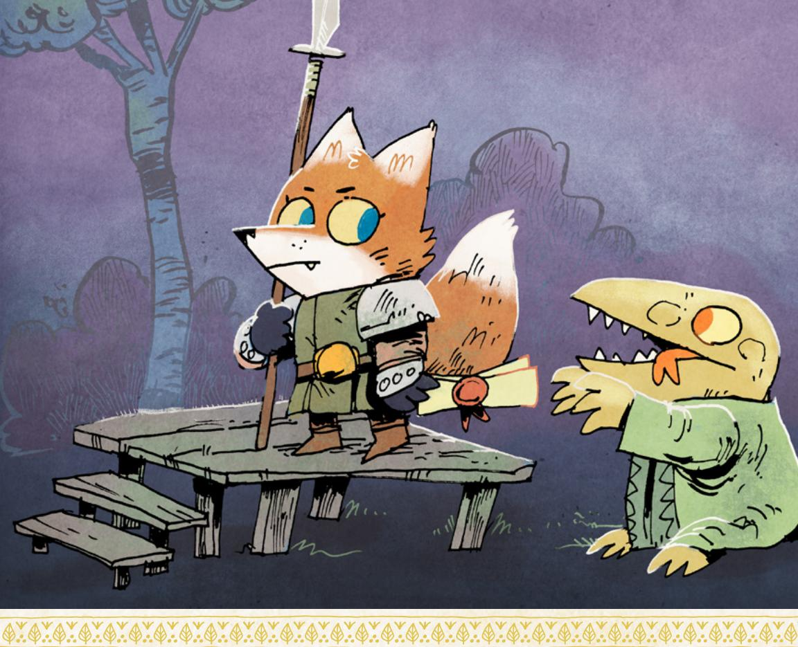

# Example

*Guy the Scoundrel, played by Miguel, was trying to escape from danger with a friendly merchant in tow, when he ran right into the hideout of the notorious bandit—the Timber Wolf! "'Who are you?' the Timber Wolf asks, leveling his axe at you," says the GM.*

*"'I'm a friend! I'm here to help you out!'" Miguel exclaims as Guy.*

*"Hmm, it sounds like you're trying to trick him but it's not quite enough yet. Just saying 'I'm a friend' isn't particularly convincing," says the GM.*

*"I turn to the merchant. 'Look, I brought you this hostage as proof! He's a successful merchant, you can probably ransom him back for lots of coin!'" Miguel says.*

*The GM laughs and asks Miguel to roll to trick an NPC. Miguel rolls and gets a 7–9. The GM thinks about what to choose—the Timber Wolf hesitating doesn't seem like it will change the situation. Overreacting might be interesting, but stumbling and providing an opportunity seems the best choice. "Okay, the Timber Wolf is obviously thrown and confused. He puts his axe down and comes real close, grabbing the merchant and patting him down to see if he's carrying any valuables. He's in reach, unarmed, and not paying any attention to you. What do you do, Guy?"*

{82}------------------------------------------------

# Trust Fate

When you *trust fate* to get through trouble, roll with Luck. On a hit, you scrape by or barrel through; the GM will tell you what it costs you. On a 10+, fortune favors the bold; your panache also earns you a fleeting opportunity.

Pyreus Coldsteel is walking towards you, a sword in each paw, while the fires lick the tapestries on one side of the room. Only one option—you dive out the window, tuck and roll, and hope the drop wasn't really all that high. You're *trusting fate* to get through trouble!

*Trust fate* is the move for taking tremendous risks, flinging yourself into trouble and hoping you come out the other side, and generally being a swashbuckling rogue! It acts a bit as the underlying basic move for the entire game. If you're taking action that feels risky and chancy, and you're unsure of what's going to happen, but no other move applies—you're probably *trusting fate*. If *any* other move fits better, then it's probably that move instead.

Because *trusting fate* to get through trouble is such a widely applicable trigger, you should always keep that criterion in mind—if any other move applies, then it's not *trusting fate*—along with the idea that you're only trusting fate if you're taking a real, uncertain, substantial risk. A bird character isn't trusting fate to fly up to the top of even a very high building if there's no risk or chance to it. If they're fleeing from Marquisate guards and trying to get out of the clearing at high speed, then they're only *trusting fate* if they don't have the acrobatics roguish feat; if they do have it, then they're *attempting a roguish feat*. But if the bird has a net thrown over them while they fly up through a burning canopy of leaves and massed Marquisate siege weaponry fires on them from below? Even if they have the acrobatics roguish feat, it's probably *trusting fate*—the situation is just too dire to be anything else!

Use this move when the situation is risky, over the top, and chancy enough that the main determinant of whether or not things go well is a vagabond's sheer grit and luck. Keep in mind that it's always possible for the GM to impose a baseline cost on such a risky action, regardless of what the results are. If you dive out of a tree from 30 feet in the air, you may suffer injury no matter what the question becomes "Just how much injury do you suffer?"

# Options for Trust Fate

**"On a hit, you scrape by or barrel through; the GM will tell you what it costs you"** means that on any hit—any result of 7+—you manage to accomplish your main goal, but always with some cost or complication. If you dive through glass, then you'll reach the ground below—but not without suffering some injury.

{83}------------------------------------------------

# Trusting Fate vs Other Moves

Here's a bit more on when to use *trusting fate* instead of one of the other moves:

- If a PC acts and no other move quite fits the situation, but it's still risky and chancy, then it's *trusting fate*.
- If a PC acts and their chances for success are ridiculously low, even if another move might trigger, then it's *trusting fate*.

Both these situations are moments in which the GM can rely on the dice to say how things go; rather than saying, "No, that doesn't work," the GM can turn to *trust fate* to find out what happens!

If you're picking a lock without the roguish feat, then the lock is picked, but probably not without paying depletion. Even on a 10+, you don't avoid the cost or complication. Wear, depletion, exhaustion, and injury are all fine costs, as are more fictional costs that make your victory messy.

**"On a 10+, fortune favors the bold; your panache also earns you a fleeting opportunity"** means that instead of avoiding the cost on a 10+, you actually get a chance for some extra benefit! It's icing on the cake for taking such a huge risk, above and beyond the core success of the move. The GM says what the opportunity is, and tells you what you must do to seize it. Getting a 10+ doesn't mean you automatically get a benefit—it just means you get an opportunity, a chance. Maybe you see something valuable you can grab on the way out of the burning room—but it'll mean getting a bit more burned. Maybe when you fall from a tree, you spot a place you can land out of sight of any enemies, just without anything soft to cushion your fall, increasing the injury you suffer.

# Example

*Copper the Ronin, played by Grace, is talking to the Baroness Redly of the Eyrie Dynasties, trying to get her to give up information about where she will next lead her troops, when she gets a miss while trying to figure someone out!*

*"The Baroness sees you looking at her so closely, Copper, and tilts her head. 'You know, I do believe you seem familiar. I've heard reports of a raccoon vagabond causing trouble out in the Woodland, fighting Eyrie soldiers with a blade...just like that one.' She gestures at your sword. It's pretty clear she's about a moment away from figuring out who you really are. What do you do?" says the GM.*

*"I say…'Ah, yes, yes, I know well of whom you speak. That is the brigand Copper! But I, Baroness, I, am...her twin! My name is Bronze! And I am certainly nothing like that criminal!' Am I tricking her?" asks Grace.*

{84}------------------------------------------------

*"Uh...no. You're Bronze's 'good twin'? Yeah, trust fate there." Grace rolls with Luck and gets a 10+! "The Baroness looks at you with surprise in her eyes. 'Oh indeed? Well, then. If you are this brigand's twin, then you likely know all about her tactics... and I would imagine that sword is just like hers. I would very much appreciate seeing that blade.' She holds out one paw. If you want her to buy this, you're going to have to hand over your sword for her to examine—leaving you unarmed." But it was a 10+, so Copper gets a fleeting opportunity, too! "If you do this, though, and fully commit, telling her all about your 'evil twin,' all about your exploits and your tactics and your strategies, you'll get to mark 2-prestige with the Eyrie—the Baroness will actually be impressed by what she hears about the real Copper! What do you do?"*

# Wreck Something

When you *wreck something*, roll with Might. On a hit, you seriously break it; it can't be used again until it's repaired. On a 7–9, you're imprecise and dangerous; you cause collateral damage, attract attention, or end up in a bad spot, GM's choice.

Your friend is locked behind bars inside a prison, so you reach out and begin to pull the bars apart! You're *wrecking something*!

*Wreck something* is for breaking, smashing, and ruining objects. You can't "wreck" a living being—it's just for nonliving things. Wrecking also isn't subtle. When you wreck something, you're using brute force to break it. If you're relying on smarts, there's a good chance you're *attempting a roguish feat*.

There are obvious cases of wrecking—smashing down a door, ripping apart jail cell bars, snapping a lock, cutting down a tree—but it can also extend to other methods that rely on pure strength. Rolling a boulder down a hill at a building, knocking down a tree into something else—these are all great ways to *wreck something*!

*Wrecking something* is fairly versatile, as well. If you want to wreck a cave and bring the ceiling down, as long as there's some way you can actually do that (knocking out support beams, shoving your sword into a crack and prying it apart, etc.), go for it! If you want to wreck a road to make it impassable, go for it! As long as it's an object and not a character you can probably wreck it!

Of course, remember that moves are based on uncertainty—in this case, the uncertainty of whether or not you can successfully wreck the thing in the first place, and the uncertainty of what the other consequences of wrecking it will be. If you're tearing a piece of paper apart, you're not really wrecking it—you know you can tear it apart, and you know that the immediate consequences of ripping the paper are likely to be entirely insignificant. Kicking in a door might be wrecking it if the door is locked with a dead bolt—it's uncertain whether you can kick it in in

{85}------------------------------------------------

the first place—but there might be no uncertainty if it's already unlocked, or if you don't actually need to use enough force to break the door or draw any attention. The move only triggers when you're trying to *wreck something* that requires lots of effort, and/or something strong enough or significant enough to cause further complications when you use enough force to break it.

#### Options for Wreck Something

**"On a hit, you seriously break it; it can't be used again until it's repaired"** means just that. The door, the lock, the wall—they'll require repairs to be useful in their intended fashion again. Of course, smashing a lock will open the lock, and smashing a door will open the door.

**"You're imprecise and dangerous; you cause collateral damage, attract attention, or end up in a bad spot, GM's choice"** means that on a 7–9, the wreckage you create gets a bit out of hand and causes problems for you. The GM will tell you how.

**"Collateral damage"** means someone or something else—not you—is harmed by your act of *wrecking something*. The cave-in catches a friend, or the door falls onto someone on the other side! Collateral damage can even apply to a tool you use to accomplish the wrecking, marking wear on the item or depletion on the vagabond.

**"Attract attention"** means that someone or something is going to come running to see what made that noise. *Wrecking something* is already a fairly loud action to take, but "attracting attention" means that no matter how safe you thought you were, danger is on its way.

**"End up in a bad spot"** means that the GM can complicate your situation and put you in a tough, difficult position right now. The cave ceiling sure does come down, but you're trapped inside! The tree sure does come down, but now it's rolling towards you!

# Example

*Keera the Arbiter, played by Kate, decides that enough is enough—she's going to knock down this guard tower from which the guards are pelting her with arrows. First, she reads a tense situation and gets a question. Kate asks, "Who or what is most vulnerable to me? I'm looking specifically for 'vulnerable' so I can wreck the tower."*

*"Well, the tower's sturdy, but you can maybe knock down that big dead tree next to the tower directly into it. That's definitely vulnerable to you," says the GM.*

*"Excellent! I go wreck that!" says Kate.*

*"How do you do that?" asks the GM.*

*"I break out my greatsword and hack at its base until it's broken enough that I can just shoulder-check it!" The GM nods and Kate rolls with Might, getting a 7–9.*

Chapter 5: Core Rules 85

{86}------------------------------------------------

*"Awesome! So you totally knock the tree down, and it smashes into the guard tower, breaking the stones at the top and slowly starting to tip the whole thing over. Trouble is, the guard tower is now falling towards the blacksmith's forge behind it and the blacksmith is still inside!" The GM is inflicting collateral damage but still giving Keera a chance to respond. "What do you do?"*

# Help or Interfere

When you *help or interfere* with another vagabond, mark exhaustion to add +1 or –2 to their roll (after rolling). Mark exhaustion again to select one of the following:

- · conceal your help or interference
- · create an opportunity or obstacle

Your friend is frantically waving back at the clearing and claiming the Woodland Alliance is attacking to trick the guards into leaving—so you jump in, screaming about how it's horrible and they're lighting fires everywhere! You're *helping* your friend to *trick an NPC*!

By default, PCs make moves individually. You trigger your move on your own, make the roll, and then make your own choices. But your fellow vagabonds can influence a move you make by either *helping or interfering*.

*Helping or interfering* is a major move in which there is no roll—you just mark exhaustion, and the move happens. There's no uncertainty to the outcome, only the question of how much you're willing to pay to accomplish your end.

Unlike most moves, you only use the *help or interfere* move after you've seen what the other vagabond has rolled. You might say something that describes you physically helping, but don't trigger the move and pay its costs until you actually see the dice result.

When you help, you can give them a +1, and when you interfere, you can give them a –2. There's no point in triggering the move for a friend who already got a 10+, and there's no point in triggering the move against a foe who already got a 6–. Similarly, if only one vagabond can help, then they're only able to affect the result if it's a 6 or a 9—on all other numbers, there's no point in helping. In those cases, even if you do something in the fiction to *help or interfere*, you don't make the move—you'd just be paying the move's costs with no effect.

To *help or interfere*, you also have to be able to actually do something that would impact the outcome of the other vagabond's move! If you're nowhere near each other, you probably can't *help or interfere*. If your friend is doing something

{87}------------------------------------------------

highly technical and precise and you lack equivalent skills, you might not be able to help. If your friend is lying to a guard while you're gagged in the corner of a cell, you probably can't help or interfere. So make sure you know exactly what you're doing that is either helping or interfering with their move.

Multiple vagabonds can *help or interfere* with the same move. As long as all the vagabonds are willing to pay the appropriate costs, the bonuses or penalties they provide will stack on top of each other.

#### Options for Help or Interfere

Each vagabond who helps or interferes must mark exhaustion individually to provide the +1 or –2 as appropriate.

You can only mark 2-exhaustion total—one for the +1 or –2, and a second for the concealment of your aid or interference, or for creating the opportunity or obstacle. You cannot spend 3-exhaustion to get all the options.

**"Conceal your aid or interference"** means that you aren't tied to the results of the move in the same way. Any watcher wouldn't know clearly that you had just intervened for good or ill. If you don't take this option, you give yourself away, and anyone watching the situation knows you tipped the scales. You'll be tied to the results of the move, whatever they are—for example, if a *wreck* move you helped winds up "drawing attention," then attention is drawn to you, as well.

**"Create an opportunity or obstacle"** is a way to get an additional benefit from your help. An opportunity is a chance the GM describes and fleshes out, based on your help, to get some extra benefit on top of the move; an obstacle is a new difficulty or problem that further inhibits your opposition's actions.

# Example

*Quinella the Harrier, played by Sarah, wants to interfere with Keera's attempt to persuade an Eyrie sergeant to lead his troops away from angry denizens (with Woodland Alliance infiltrators!). Kate, Keera's player, rolled a total of 10 for her persuade an NPC move. "I don't want this situation to get calmer—I want the denizens to rebel! I start a chant from the sidelines, something like 'Get out Eyrie!'" says Sarah.*

*"You can only bring the roll down to an 8, though, by providing a –2 through interfering. Is that okay?"*

*"Yep! I'm hoping that Keera won't be willing to do what she has to do to get the guy to leave on a 7–9." Sarah marks exhaustion for interfering.*

*"Do you want to hide your interference, or create an obstacle?" asks the GM.*

*"Oh, I think I'll hide my interference. I start the chant, and then I slip away quietly," says Sarah.*

*"Excellent. Mark another exhaustion!"*

{88}------------------------------------------------

# Plead with a PC

When you *plead with a PC* to go along with you, they clear 1-exhaustion if they agree to what you've proposed. You may use this move only once per session.

You really want to go chase down the Marquisate treasure wagon, but your friend wants to stay in town, so you look at them and say, in a whining tone, "Pleeeeaaaase?" You're *pleading with a PC* to go along with you!

*Pleading with a PC* to go along with you is the one real way you can mechanically bribe another PC into following your plans. You can always *figure out* another PC, of course, asking them "How could I get you to \_\_\_\_\_?" and then taking appropriate action. But if you don't want to do that, you can plead with them!

Pleading just means that you're making an impassioned plea in whatever manner suits your character's personality.

When you *plead with another PC*, they don't have to agree. They can turn down the offer to go their own way. If they do, that still counts as your one use of this move per session.

Use this move both in the fiction and on the level of the players themselves. If another PC turns down your offer, then they're signaling that they are adamant about not doing that thing—so move on and find something else to do!

# Example

*Tali the Adventurer, played by Marissa, wants the group to remain where they are, in Crestfallow Falls, to try to deal with the terrifying Woodland Alliance leader in the area, but her fellow vagabond, Hester the Tinker (played by Sam), is interested in leaving to earn prestige elsewhere. "'Come on, Hester! We need to help these people! Please, let's stay here and finish what we started,'" says Marissa as Tali. "I want to offer you a cleared exhaustion to stay!"*

*"No, I really want to get on the road," says Sam.*

*Marissa keys in on Sam turning down the offer, and says, "Okay, I get it, let's hit the road. But I'm going to push us to come back here eventually!"*

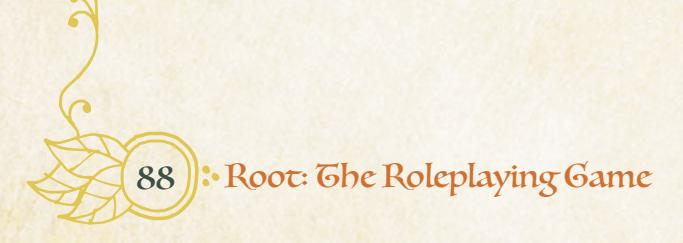

{89}------------------------------------------------

#### Get Along to Play Along

In general, the PCs are a team—a band of vagabonds. They might not always agree, might not always get along, but this game isn't about the strife between those vagabonds. If they're arguing so much that the entire group is at risk of fracturing, then that's going to interfere mightily with Root: The RPG!

Think of it in terms of the game's general holding environment, a way to talk about the baseline premise of the game—if the game were a TV show, this would be the fundamental promise of that TV show. If a TV show is set in a space station, then when someone leaves the space station forever, they leave the TV show. Well, in Root: The RPG, the show is set in and around the exploits of this band of vagabonds. If someone leaves the group, then they leave the show! That can be fine if a player wants to start up a whole new character (see more on adding new characters to the game on [page 179\)](#page-179-0), but no one should be surprised to find out that internal conflicts between their characters lead to the exit of one character from the game!

So keep in mind that this is a game in which your group of vagabonds ultimately always chooses to stick together and work together, and if that ever changes, it means some characters are likely exiting the narrative.

# Weapon Moves

Even though the rest of the moves give you plenty of ways to resolve problems or overcome obstacles, there are going to be times when you get into a real fight. Swords come out, bows are drawn and fired, and lives are on the line.

All of the basic moves still apply to those fights—you can absolutely *read a tense situation* to try to get an edge in a fight or *figure out* your opponent in an attempt to see what they really want while you're sword to sword. You can even make a threat and try to *persuade an NPC* to surrender—though if they're ready to fight, it's probably going to take some doing to convince them that surrender is a better option.

This section covers the **weapon moves**, special moves that are used only for fighting or fighting-adjacent activities. These aren't used nearly as much as the basic moves because they're so tied to fighting; the vagabonds *trick* and *persuade* the denizens of the Woodland every day, but fights aren't usually a daily occurrence. Any time you use one of these weapon moves, you're starting a fight (or getting really close to starting one) if one hasn't already broken out.

{90}------------------------------------------------

#### Enter Combat!

"Starting a fight" here doesn't mean engaging a whole new tactical subsystem that transmogrifies play. These weapon moves are much more likely to come into play during a fight, yes, but the overall structure of the game remains the same: a conversation, bouncing back and forth, saying what your character does, triggering moves when appropriate. A "fight" in Root: The RPG is just a fictional description, not a mechanical one.

There's more advice on how to run fights on [page 216](#page-216-1) of the GM's section, but the key takeaway for players is not to expect some switch to flip and now things are on, and that's why these moves are activated. Instead, think of it more in fictional terms—you wouldn't just throw a punch randomly as part of a regular conversation. If you do throw a punch…you're likely to get punched back. And that's how a fight breaks out.

# Basic vs Special Skills

There are three weapon moves that all characters can use, just like the basic moves: *engage in melee*, *grapple an enemy*, and *target someone*. These moves are combat abilities all vagabonds have based on their experience as outsiders the average denizen of the Woodland wouldn't be able to engage in melee nearly as well as a vagabond, let alone fire a bow with accuracy!

Then there are special weapon moves, called **weapon skills**. A weapon skill is a highly specific technique and ability that a vagabond might have learned in their travels, but there's no guarantee that any two vagabonds have anything close to the same weapon skills. They are a bit like roguish feats (see [page 68\)](#page-68-1), but instead of being a part of a larger basic move like *attempt a roguish* feat, the weapon skills each have their own individual move.

Weapon skills also tie heavily into equipment. To use a weapon skill, you have to have a weapon suited to that particular maneuver. You can't pull off an expert-level *disarm* or *parry* with just any sword. You can't fire off a *trick shot* with just any bow. A master has to have the right tools! To see more about equipment and tags, see [page 181.](#page-181-1)

{91}------------------------------------------------

In practice, to use one of these weapon skills, you must meet all of the following:

- Have the weapon skill marked on your character's playbook, indicating that the vagabond has learned the skill in question.
- Wield a weapon tagged with the same weapon skill, indicating that the weapon is well-suited to that particular maneuver.
- Satisfy the specific conditions of the weapon skill move, performing the trigger of the move in the fiction.

It's never enough to just have the skill marked, or just have a weapon with the right tag. You need both the skill and the tag on a weapon to use one of the special weapon skills during a fight.

# Ranges

Many of the weapon moves refer to a particular range, meaning a distance between you and your target. Range in **Root: The RPG** is not a carefully measured thing—you don't keep track of specific quantities of distance, and you're certainly never that worried about the difference between someone 25 feet away and someone 20 feet away. Instead, **Root: The RPG** uses three basic ranges entirely based on the fiction.

- Intimate: You're right up in each other's faces, easily in touching range, breaking each other's personal space bubbles. The kind of range you'd be in to start wrestling, to poke a finger into someone's chest, to hug someone.
- Close: You're close enough to talk comfortably, to fight with weapons—not close enough to touch without effort, but certainly close enough to lunge at the other denizen and reach them. The kind of range you'd be in to sword-fight (or to fistfight from a distance), to walk in each other's company without holding hands, to easily toss something.
- Far: You're far enough that you have to speak louder, even yelling, to hear each other—but you still can hear each other. The kind of range you'd be in to shoot a bow, to spot each other from a distance, to be able to easily break line of sight and hide.

Anything farther than far range is functionally too far to be accessible for combat—you'll have to close distance to be able to use any of these weapon moves.

If you don't have a weapon that can hit at the appropriate range, then you aren't able to inflict any harm at that range, and you aren't able to trigger moves that only work at that range.

{92}------------------------------------------------

# Basic Weapon Moves

#### Engage in Melee

When you engage an enemy in melee at close or intimate range, roll with Might. On a hit, trade harm. On a 10+, pick 3. On a 7-9, pick 1.

- inflict serious (+1) harm
- suffer little (-1) harm
- shift your range one step
- impress, dismay, or frighten your foe

You're swinging your sword at your foe while they, axe in hand, charge you down. You're engaging an enemy in melee!

This is the all-purpose "fight close-up with weapons" move, the "swords clashing" move, the "battle of staves" move, and so on. Every time your vagabond engages an opponent in an exchange of melee strikes, they're engaging in melee!

You have to exchange blows to trigger engaging in melee—you're taking swings, they're blocking your swings and returning attacks. This move covers a whole exchange of blows, not one strike. If your enemy isn't capable of returning attacks, then you're not engaging them in melee—you're just hitting them, and you just inflict your harm on them.

An "enemy" can also cover small groups of foes, instead of just individual combatants. Just keep in mind, a group of enemies is likely to inflict phenomenally more harm and be much harder to defeat—and a large group of enemies might be too big to actually engage in melee, leading you to trust **fate** to deal with a whole large group of soldiers. If you really want to be able to handle groups of enemies, look into storming a group on page 106. There's also more on the mechanics of fighting groups on page 214.

Engaging in melee can also include fist fights, instead of just fights using weapons. The difference is between boxing and wrestling. If you're up close, wrapping limbs around each other, then you're grappling (page 94). If you're keeping a bit of distance, holding up a guard, sending a series of punches at your enemy without getting tied up in their limbs, then you're engaging in melee although, that kind of melee is very likely to turn into a grapple at any moment!

"Trade harm" means that you inflict your harm on your target, and your target inflicts their harm on you. The two of you are engaged in a series of blows against each other, so you each inflict harm on the other.

{93}------------------------------------------------

#### Harm

One of the primary effects of weapon moves is the infliction of harm. There's more about harm later on in this chapter on [page 125](#page-125-1), but for now, here's what you need to know:

- "Harm" is a generic term encompassing depletion (resource expenditure), exhaustion (energy expenditure), injury (bodily harm), wear (damage to equipment), and morale (NPC-only will to fight).
- Harm is determined based on the weapon or fictional cause of the harm—a quarterstaff might inflict exhaustion, while a giant sword might inflict 2-injury.
- Characters in a fight can absorb injury on their armor or shield, marking wear on the equipment to reduce the injury harm they suffer on a one-for-one basis.

**By default, every weapon—bows, swords, and the like—inflicts 1-injury harm, and fists inflict 1-exhaustion harm.** Many pieces of equipment have ways to inflict additional harm at some cost. Some non-edged, blunted weapons subdue an enemy instead of injuring them, inflicting exhaustion harm instead of injury. That is all reliant upon the particular traits of the weapons in the fight.

# Options for Engage in Melee

**"Inflict serious (+1) harm"** means that you inflict 1 additional harm of whatever kind you already inflicted. You're striking a particularly vicious, dramatic blow, managing to find a weak point in armor or trip your opponent up so your blade cuts them deeply. If you're inflicting injury, then you inflict +1 injury harm, and if you inflict exhaustion harm, you inflict +1 exhaustion harm.

**"Suffer little (–1) harm"** means that you suffer 1 fewer harm from your opponent's attack. Simply reduce the amount of harm they inflict by 1 before marking any of your own harm boxes or wear boxes.

**"Shift your range one step"** means that after you exchange blows, you either slip in closer or pull back farther, advancing or retreating as you choose. You can go from intimate range to close range, from close range to far range, or from close range to intimate range. It's a great way to set yourself up to *grapple* immediately after, or to retreat past the range of melee weapons.

**"Impress, dismay, or frighten your foe"** means that you managed to make an impression on your opponent in your exchange of blows. The exact nature of the outcome is left to the GM, whether it means that your opponent is awed and pauses, giving you a chance to act in some other way, or that your opponent is terrified of you and flees. Often, the GM will have the NPC mark morale harm (see morale harm on [page 125\)](#page-125-2).

Chapter 5: Core Rules 93

{94}------------------------------------------------

#### Example

Mint the Ranger, played by Mark, draws his sword as he's charged down by a fox bandit with an axe. He rolls to engage in melee, getting a 10+. Mint has suffered a fair amount of wear on his armor and has most of his exhaustion marked, so he'd prefer not to stick it out up close. He thinks he can switch to his bow and safely fire some arrows from a distance, or even just get the bandit to flee. He chooses to shift his range to far and impress, dismay, or frighten his foe. Mark describes Mint deftly weaving his blade through the air, turning back axe blows left and right before jabbing quickly and leaping backward. Mint inflicts his weapon's harm—1-injury—on the fox bandit, and the fox bandit inflicts her weapon's harm—1-injury—on Mint. At the end of the exchange, Mint is back out of melee range, having shifted to far instead of close, and the fox bandit is frightened by the vagabond's skill—the GM describes the fox bandit turning tail and fleeing.

# Grapple an Enemy

When you *grapple with an enemy at intimate range*, roll with Might. On a hit, you choose simultaneously. Continue making choices until someone disengages, falls unconscious, or dies. On a 10+, you make one choice first, before beginning to make simultaneous choices.

- you strike a fast blow; inflict injury
- you wear them down; they mark exhaustion
- you exploit weakness; mark exhaustion to inflict 2-injury
- you withdraw; disengage to close range

You're face-to-face with your opponent, your paws and their wings entangled, rolling around in the dust and punching each other. You're *grappling an enemy!*

This is the move for up-close intimate wrestling, when you're all tied up with your foe. *Grappling* is inherently a "weaponless" move—you *grapple* with your limbs, not your sword. However, some weapons might have tags or abilities that make them useful while *grappling* (see more on tags on page 186). It's also only for wrestling with a single opponent—if you wind up *grappling* with multiple opponents, you're in trouble, and you're likely *trusting fate* to get out.

*Grapple an enemy* is a small and fast exchange of blows that lasts until someone either loses or concedes. You make choices from the list, inflicting harm (injury or exhaustion) on each other or disengaging from the grapple.

{95}------------------------------------------------

On a hit (7+) you both choose simultaneously, writing down your choices on scraps of paper and revealing them at the same time, or just saying them aloud at the same time, or something similar. Both of your choices take effect simultaneously. For example, if your opponent inflicts injury on you as you are disengaging, then you mark injury as you escape to close range and end the grapple.

On a 10+, you get to make the first choice, picking a single option that immediately comes into effect, before then beginning to make simultaneous choices, the same as if you had rolled a 7+.

# Options for Grapple an Enemy

**"You strike a fast blow"** means that you jab your opponent, hard and fast, inflicting 1-injury to them from the strike.

**"You wear them down"** means that you push against your opponent, your muscles struggling against theirs, wearing them down and forcing them to mark exhaustion.

**"You exploit weakness"** means that you see an opportunity in your struggle against your opponent, and you take it. You mark exhaustion, and you inflict 2-injury harm on them.

**"You withdraw"** means that you break out of the fight and return to close range with your opponent, ending the grapple and the exchange of choices. This is the only way, besides going unconscious or dying, that a character can end the grapple.

# Example

*Keera the Arbiter, played by Kate, has closed to intimate range with an Eyrie hawk guard, and now grabs him with both paws in order to grapple him. She rolls with Might and gets a 10+. As she and the hawk guard begin wrestling, she makes one early choice and decides to exploit a weakness, going for a low blow and marking exhaustion to inflict 2-injury on the hawk guard. The hawk takes the 2-injury on his armor, marking boxes of wear—but that uses them all up, and because the hawk is an NPC, that's all he has. Then, both Kate and the GM write down their next choices on slips of paper, revealing them simultaneously. Kate chooses for Keera to strike a fast blow and inflict injury, while the GM chooses for the hawk guard to wear Keera down and make her mark exhaustion. Keera is punching the hawk guard with fast, hard strikes while the hawk tries to overpower her. Keera has 2-exhaustion marked, but the hawk guard has 1-injury marked now—and because the hawk guard only has 3-injury boxes in total, if he marks 2 more, he will be unconscious or dying! Kate and the GM both write down another choice on their slips of paper and reveal them simultaneously. Kate chooses for Keera to strike another fast blow, while the GM chooses for the hawk guard to disengage. Keera inflicts 1 more injury on the hawk guard, marking the second out of his three boxes, but then the hawk disengages to close range—and likely to try to run for help! The grapple ends; Keera has to catch the hawk to grapple him again if she wants to continue to wrestle him into submission.*

{96}------------------------------------------------

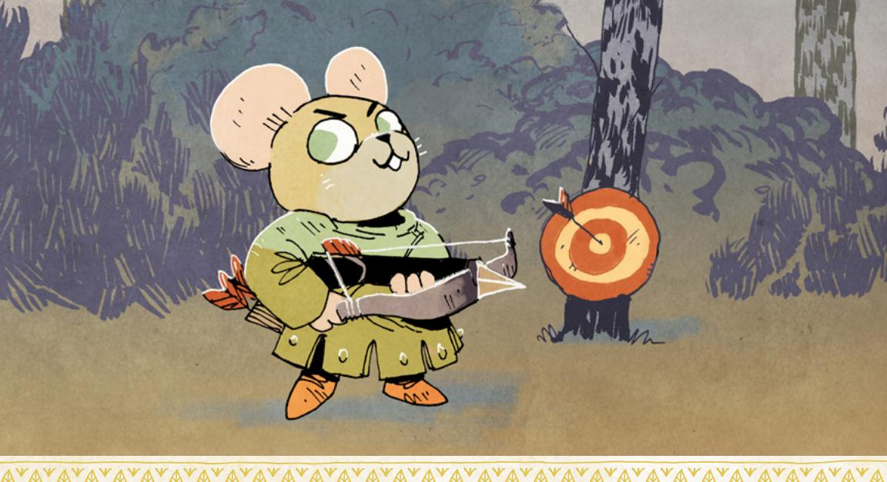

# Target Someone

When you *target a vulnerable foe at far range*, roll with Finesse. On a hit, you inflict injury. On a 10+, you can strike again before they get to cover—inflict injury again—or keep your position hidden, your choice.

You draw back your arrow, sight down the shaft, and let loose at the Woodland Alliance rebel charging at you. You're *targeting someone*!

This move is the basic weapon move for ranged attacks, using bows and thrown weapons. The base range of the move is *far*—using bows and crossbows at close range is a bit trickier and often requires special skills or weapons. If you try to fire a bow at close range without any special skills or weapon tags, you're probably just handing the GM a golden opportunity to make a move against you and tell you how it all goes awry (see more on golden opportunities on [page 203\)](#page-203-0).

To use this move, you must take aim at a *vulnerable* foe—that is to say, a foe who might actually be injured or affected by your attack. If you're shooting a simple shortbow at an enemy clad from head to toe in plate armor, then your enemy might not be vulnerable to you—their armor is just too thick. Similarly, you might not be able to successfully target someone who is hiding amid the battlements and crenellations of a castle wall—they're not vulnerable to you while they're so well hidden behind cover.

{97}------------------------------------------------

#### Options for Target Someone

On a hit with *target someone*, you inflict 1-injury on them by default. That might be modified by whatever specific weapon you're using.

On a 10+, you can choose to fire another shot, inflicting injury a second time or remaining hidden. Keeping your position hidden means that your opponent isn't sure from where they were shot. It may not be possible to keep your position hidden if you're standing upright in the middle of an empty field—but if you're in the middle of a melee, or if you're firing from cover, you can ensure your foe doesn't know where you're shooting from.

# Example

*Cloak the Thief, played by Brendan, lifts his bow and takes aim on the lead guard of a caravan moving down a Woodland path. He's hidden up in the branches of a tree, at far range. He rolls to target someone, rolling with Finesse, and gets a 10+. His arrow arcs down and strikes the guard, inflicting injury (which the guard marks as wear). Then, Brendan chooses to have Cloak keep his position hidden so the guards won't know where the arrow came from. But the guards are alert now, and they start to break out their own bows…*

# Weapon Skill Moves

#### Cleave **special**

When you *cleave armored foes at close range*, mark exhaustion and roll with Might. On a hit, you smash through their defenses and equipment; inflict 3-wear. On a 7–9, you overextend your weapon or yourself: mark wear or end up in a bad spot, your choice.

You heft your warhammer and smash it into the armored guard in front of you, right on the breastplate, with all your might. You're *cleaving*!

The *cleave* weapon skill is all about breaking armor and tearing it to pieces. It's a specialized move for dealing with foes who are dangerously well protected.

Using *cleave* often looks a lot like engaging an enemy in melee—the difference lies in the character's intent, and in marking exhaustion. If you want to inflict injury, then you are *engaging in melee*; if you want to break armor, then you are *cleaving*. If you can't mark exhaustion, you can't *cleave*—hitting hard enough to break armor is tiring!

{98}------------------------------------------------

Weapons specialized for cleaving are usually large and heavy, capable of breaking or ripping even the strongest armor.

#### Options for Cleave

On any hit, you inflict 3-wear on your enemy, wholly on their armor. If you inflict more wear than they have boxes to mark, you can rest assured that you have utterly destroyed their armor.

**"You overextend your weapon or yourself"** means that you pushed yourself too hard with your full-strength strikes. You choose either to mark wear on your weapon or to be pushed into a bad spot—the GM will tell you exactly what the bad spot looks like if you choose that option.

# Confuse Senses **special**

When you *throw something to confuse an opponent's senses at close or intimate range*, roll with Finesse. On a hit, you've thrown them off balance, blinded them, deafened them, or confused them, and given yourself an opportunity. On a 10+, they have to take some time to get their bearings and restore their senses before they can act clearly again. On a 7–9, you have just a few moments.

You're scrabbling back to your feet after a massive hammer strike knocked you down; you fill your paw with dirt as you stand back up, throwing it into your opponent's face to stun them! You're *confusing their senses*!

The *confuse senses* weapon skill is all about throwing your opponent off balance using dirty tactics. You're throwing dirt in their eyes, you're throwing a smoke bomb on the ground, you're waving a torch in their face, etc. The move is used to create opportunities for something else, whether it's escaping or getting in close for a strike while they're off-balance.

*Confuse senses* can work on multiple opponents at once if you have the right way to distract a group and thwart their senses. Throwing dirt can probably only *confuse* one enemy at a time, but using a flash bomb or a smoke bomb might do the trick against a group.

Unlike most other weapon skills, *confuse senses* doesn't require a tagged weapon for you to use it—you just have to have something on hand that might work to impair your target, and you need to have the weapon skill marked on your playbook.

{99}------------------------------------------------

#### Options for Confuse Senses

**"You've thrown them off-balance, blinded them, deafened them, or confused them"** just means you did whichever one is most appropriate to your particular method of confusing their senses.

**"[You've] given yourself an opportunity"** means that you have a chance to take some action without your opponent interfering or reacting. The player says what they want to do next and the GM tells them if the opportunity allows for that—but much of the time, the opportunity will eliminate uncertainty and allow the PC to just act without needing to make another move. No need to roll dice to see if you can escape when your opponent is busy trying to brush the sand out of their eyes!

**"They have to take some time to get their bearings and restore their senses before they can act clearly again"** means your opponent is busy for a few minutes while they clear their head, clean their eyes, or whatever else they might have to do. The opportunity that their confused senses provides you is more significant—you have more time before they can react. You might be able to steal something from the room around them and escape, all before they get back to themselves.

**"You have just a few moments"** means your opportunity is fleeting—only enough for a single strike of your weapon or a dash out the window!

# Disarm **special**

When you *target an opponent's weapon with your strikes at close range*, roll with Finesse. On a hit, they have to mark 2-exhaustion or lose their weapon—it's well out of reach. On a 10+, they have to mark 3-exhaustion instead of 2.

You and your opponent are circling each other before you suddenly lash out with your sword, aiming for the hilt of their blade, trying to knock it from their grasp! You're *disarming*!

*Disarm* is a weapon skill for quickly leaving your enemy unarmed or forcing them to pay a terrible cost to hold onto their weapon. Because the move always leaves the option for your opponent to either drop their weapon or suffer exhaustion, it won't reliably inflict harm on your foe—but hopefully an enemy who drops their weapon is a great deal easier to handle!

Weapons tagged with the *disarm* weapon skill are likely longer (like a rapier) and may have some kind of notch or guard that allows the wielder to catch the enemy weapon, twist, and rip it from their foe's grasp.

{100}------------------------------------------------

#### Options for Disarm

When you get a hit with *disarm*, your opponent must choose to either mark some exhaustion or drop their weapon. On a 10+, they must mark 3-exhaustion. On a 7–9, they must mark 2-exhaustion. If they don't have enough boxes to mark, they can still choose to mark exhaustion instead of dropping their weapon, but that means they fall unconscious or are otherwise entirely removed from the fight—they manage to keep their paws on their weapon, but you take advantage of the moment to punch them and knock them out, for example.

If your opponent drops their weapon, that doesn't mean they drop it at their feet, where it is easily reacquired. It's well out of reach. You *disarm* them, and the weapon falls some distance away, likely within close or far range (except, for example, if it falls off a bridge—mind your surroundings!). It may not be out of the scene, but your opponent has to scramble to snap it back up, giving you ample opportunity to respond to any attempt they make to rearm themselves.

Remember that once an enemy is disarmed, there's a good chance they can't really *engage in melee* anymore, or at the very least, they might not be able to inflict harm on you when you trade harm with them. It's not exactly noble, but there are a lot of advantages to fighting an unarmed foe while you have a sword!

# Harry a Group **special**

When you *harry a group of enemies at far range*, mark wear and roll with Cunning. On a 10+, both. On a 7–9, choose 1:

- · inflict 2-morale harm
- · they are pinned or blocked

A group of bandits is coming your way; you lift your bow and fire arrow after arrow, letting them rain down on the incoming foes. You're *harrying a group*!

*Harrying a group* is essentially "suppressing fire." You're firing a hail of arrows in the hopes of making your foes keep their heads down, not really worrying if any given arrow hits any given target. That's also why it's always against a group of foes—when you're firing at a single enemy, you might as well just *target* them. The skill represents your ability to fire arrows very rapidly, and to fire them with just enough accuracy that your foe is forced to duck and seek cover.

*Harrying a group* uses up your arrows and puts fatigue on your bow, so you have to mark wear to use it. It also only works at far range, when you can fire from enough distance that you can put many arrows into the air safely before anyone can react and reach you.

{101}------------------------------------------------

Weapons tagged with the *harry a group* weapon skill are likely to be strong, sturdy, shorter bows, designed to be quickly drawn and fired.

#### Options for Harry a Group

**"Inflict 2-morale harm"** means that the GM marks 2-morale harm on a targeted group of NPCs. They become frightened, confused, and thrown into disarray—much more likely to break, flee, or even surrender.

**"They are pinned or blocked"** means that your targets are unable to safely act or move from cover while you're firing. You've given the rest of your vagabond band a chance to move or act in some way while you pepper your foes with fire. Of course, if you switch to some different act, then you've stopped firing arrows, and your foes are no longer pinned or blocked from acting.

# Improvise a Weapon **special**

When you *make a weapon out of improvised materials around you*, roll with Cunning. On a hit, you make a weapon; the GM will tell you its range tag and at least one other beneficial tag based on the materials you used. On a 7–9, the weapon also has a weakness tag.

The Marquisate has found you in the bar! You quickly knock over your barstool and break off a leg, holding it up in front of you as a makeshift weapon. You're *improvising a weapon*!

*Improvising a weapon* is about arming yourself quickly and effectively using makeshift tools or items. The weapons you make by *improvising* will never really match up with those you get from a blacksmith, but they can get you through trouble in a pinch. Broken bottles, table legs, rocks tied hurriedly to branches—these are weapons of desperation, but they're better than nothing!

The skill for *improvising weapons* represents your knowledge of and practice at stringing together materials into a usable item. Anyone can try to smash a bottle to create a jagged edge, but most denizens will just wind up with a pawful of unusable broken glass.

*Improvising a weapon* never requires a specific weapon tagged with the skill, but it does require some supplies. If you're in a prison cell, you're probably going to have a hard time *improvising a weapon*…although, enterprising vagabonds with the right skill set can do a lot a with a fork and a plate…

{102}------------------------------------------------

#### Options for Improvise a Weapon

When you make a weapon, you describe what you're using and what you're hoping to make. On a hit, the GM will feed you the weapon's details, including its range and at least one other beneficial tag. See more on equipment tags on page 186. A few good examples of beneficial tags for improvised weapons include:

- Blunted: This weapon inflicts exhaustion harm, not injury harm.
- Fast: Mark wear when engaging in melee to suffer I fewer harm, even on a miss.
- Flexible: When you *grapple with someone*, mark exhaustion to ignore the first choice they make.
- Quick: Mark exhaustion to engage with Finesse instead of Might.
- **Sharp:** Mark wear when dealing harm with this weapon to inflict I additional harm.

On a 7–9, the GM will also tell you a weakness tag the item might have, something that makes it less effective. A few good examples of weakness tags include:

- Fragile: When you make a weapon move with this weapon, mark wear on it. Mark exhaustion to ignore this effect.
- **Slow:** When you *engage in melee* with this weapon, choose one fewer option. Mark wear to ignore this effect.
- Unwieldy: Take a –I to all weapon moves—both basic and special weapon moves—made with this weapon. Mark exhaustion to ignore this effect.

An improvised weapon has the equivalent of zero boxes of wear. If you have to mark wear on it, then the weapon is destroyed entirely.

#### Parry SPECIAL

When you *try to parry the attacks of an enemy at close range*, mark exhaustion and roll with Finesse. On a hit, you consume their attention. On a 10+, all 3. On a 7-9, pick I.

- you inflict morale or exhaustion harm (GM's choice)
- you disarm your opponent; their weapon is out of hand, but in reach
- you don't suffer any harm

Your enemy hefts their club and lashes out at your leg—but you bring your staff into the way, and proceed to twist it around the club, throwing your enemy's strike off entirely. You're *parrying*!

**Parry**, as a weapon skill, is all about keeping an enemy preoccupied and off-balance, without being able to inflict harm on you. When you **engage in melee** with an enemy, you're assumed to be doing some degree of parrying and

{103}------------------------------------------------

dodging automatically. So having the skill represents that you are particularly adept at deflecting incoming strikes, at keeping your enemy's attention on you while you manage to neutralize their offensive.

Triggering the *parry* weapon skill move comes down to intent—it might look like you're *engaging in melee,* but if your goal is to keep your enemy preoccupied while deflecting their strikes, you're *parrying*. You must mark exhaustion to use the *parry* weapon skill, as well.

Crucially, *parrying* does not inflict any harm on your opponent by default, but it does put you at risk of suffering harm—your opponent is still attacking you, after all. If you don't choose "you don't suffer any harm," then you are guaranteed to suffer harm from your opponent.

Weapons tagged with the *parry* weapon skill are maneuverable and a bit lighter, often with hand guards or other elements that let them catch blades, like a longsword or a rapier.

#### Options for Parry

**"On a hit, you consume their attention"** means that your opponent is entirely focused on you. They aren't paying attention to your allies or to theirs. They aren't paying attention to anything else going on in the world around them. It's a great way to give your allies an opportunity to take other action, or to keep a particularly dangerous opponent distracted in a single fight while the rest of your band wins the larger battle.

**"You inflict morale or exhaustion harm (GM's choice)"** means that you inflict 1-morale or 1-exhaustion harm on your opponent, but the GM chooses which kind of harm it is. Your foe's response dictates which kind of harm they suffer if they're becoming infuriated at your parrying, then it's likely morale harm, while if they're becoming exhausted by making countless ineffectual strikes, then it's exhaustion harm.

**"You disarm your opponent; their weapon is out of hand, but in reach"** means that your opponent loses their weapon, but they can get it back. This is not entirely dissimilar to disarming your opponent with the *disarm* skill, but with *parry*, your opponent can definitely reclaim their weapon. That might give you an opportunity to flee or strike back as they reach down to pick it up, but disarming your opponent with parry does not put them entirely at your mercy the way *disarm* does.

**"You don't suffer any harm"** means that your opponent's strikes do not land on you. If you do not choose this option, you suffer harm from your opponent's attacks, whatever their normal inflicted harm might be.

{104}------------------------------------------------

#### Quick Shot SPECIAL

When you *fire a snap shot at an enemy at close range*, roll with Luck. On a hit, inflict injury. On a 7–9, choose 1. On a 10+, choose 2.

- · you don't mark wear
- you don't mark exhaustion
- you move quickly and change your position (and, if you choose, range)
- you keep your target at bay—they don't move

A ruffian with a hammer is closing in on you where you're hiding behind a tree, so you quickly step out of cover and loose an arrow at her, with barely any time to aim. You're making a *quick shot*!

At its core, the *quick shot* weapon skill is designed for using a bow or other ranged weapon at close range. Most ranged weapons are tagged for far range, but with *quick shot*, you can fire them right up close at an enemy when you would otherwise be fighting sword to sword. The disadvantage of making a *quick shot*, of course, is that you can't really aim all that well when you have only a second to pull and loose your arrow.

The *quick shot* weapon skill is also useful because it might surprise a foe—you can make a *quick shot* without having your bow up and already aimed. But the risks of firing from the hip are fairly high. The move uses Luck, and it has a lot of potential costs, so you likely won't want to use it every time you're shooting!

Weapons tagged with *quick shot* are generally smaller or more compact, more easily readied and fired. *Quick shot* does require the bow to be ready to use at close range, as well, so the bow must have that additional range.

#### Options for Quick Shot

"On a hit, inflict injury" is the baseline effect of a *quick shot*—on any hit, you will inflict 1-injury (and possible more, based on your weapon).

"You don't mark wear" and "You don't mark exhaustion" are choices to eliminate the costs of the move. If you don't choose "you don't mark wear," you must mark wear on your weapon. If you don't choose "you don't mark exhaustion," you must mark exhaustion. On a 10+, you can choose both of these options to eliminate all the costs, but then you get no other advantages or effects besides inflicting injury.

"You move quickly and change your position (and, if you choose, range)" means that your *quick shot* gave you a chance to shift where you are. You can take cover, dive out a window, even close in or move away (changing your range from close to intimate, or from close to far).

{105}------------------------------------------------

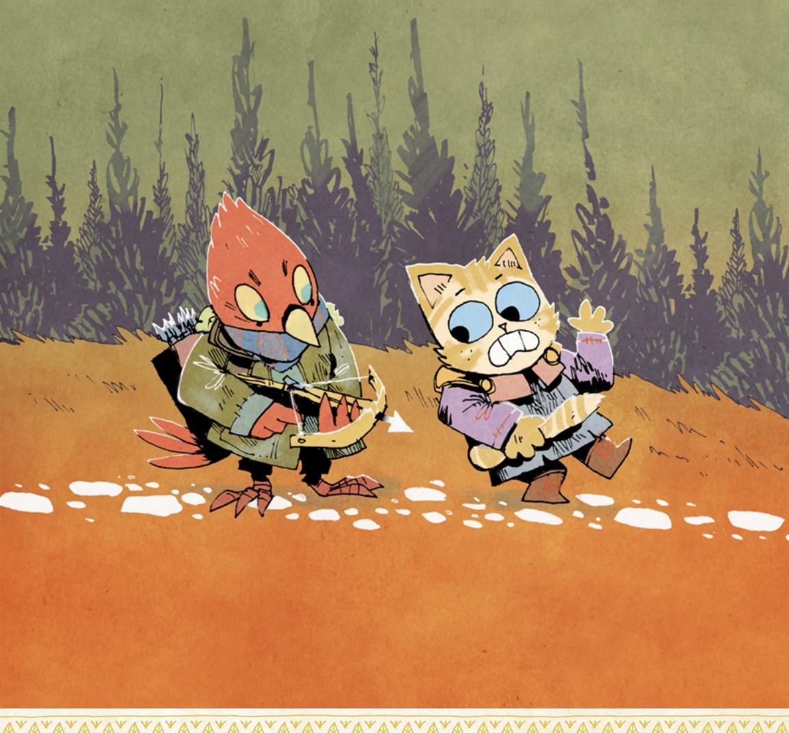

**"You keep your target at bay—they don't move"** means that your enemy can't change their position or take cover. If you do choose this, your opponent is functionally pinned. If you don't choose this, however, they won't stay still when you fire an arrow at them; regardless of whether you choose to move quickly and change your position, they will move and change theirs, up to and including changing ranges.

If you move quickly and change your position but you do not choose to keep your target at bay, then you can both move—but you get to see first how they move before you decide how you move and change your position.

{106}------------------------------------------------

#### Storm a Group SPECIAL

When you *storm a group of foes in melee*, mark exhaustion and roll with Might. On a hit, trade harm. On a 10+, choose 2.On a 7-9, choose 1.

- you show them up; you inflict 2-morale harm
- you keep them off-balance and confused; you inflict 2-exhaustion
- you avoid their blows to the best of your ability; you suffer little (-1) harm
- you use them against each other; mark exhaustion again and they inflict their harm against themselves

You heft your twin swords and leap off the wall, directly into the midst of the soldiers. Before they know what's happening, you're whirling and slashing like a devil. You're *storming a group*!

**Storming a group** is the best method available to most vagabonds for actually fighting a whole group of enemies. Most of the time, a group of enemies—even a mob of villagers!—is pretty dangerous for an individual vagabond to engage with directly. But if a vagabond can **storm a group**, then they have the skill set to keep multiple combatants preoccupied and off-balance, enough to survive and maybe even come out on top!

**Storming a group** is only for melee—if you want to deal with a group from afar, you're looking to *harry a group* (page 100) with a ranged weapon. Just like *engaging in melee*, *storming a group* works only at close or intimate range.

You have to mark exhaustion to **storm a group**. It costs you a lot of energy to successfully balance a fight against many foes at once.

Weapons tagged with the **storm a group** weapon skill are likely to be some combination of very fast, long, or wide-sweeping. A massive two-handed hammer might do it, as might a pair of fast scimitars.

#### Options for Storm a Group

Trading harm for **storming a group** works just like trading harm for engaging in melee. Just remember that a group's inflicted harm is likely far greater than any individual combatant (see more on group harm on page 214).

**"You show them up; you inflict 2-morale harm on them"** means that you've rattled the group you're fighting. They weren't expecting any single denizen to be able to put up such a good fight! The GM marks 2-morale harm on them.

"You keep them off-balance and confused; you inflict 2-exhaustion on them" means that you're whirling around, doing your best to ensure that the whole group can't find its feet. The GM marks 2-exhaustion harm on the group.

{107}------------------------------------------------

"You avoid their blows to the best of your ability; you suffer little (-1) harm" means that you're ducking, weaving, and bobbing, trying to stay just out of reach of the deadliest strikes against you. You suffer I fewer harm when you trade harm with them during this exchange.

"You use them against each other; you mark exhaustion again and they inflict their harm against themselves" means that you're not only ducking and diving, but you're trying to get members of the group to hit each other. It costs you in energy—you must mark exhaustion—but you can make the group inflict its own harm on itself, wielding its power against it in addition to the harm you inflicted.

#### Grick Shot SPECIAL

When you *fire a clever shot designed to take advantage of the environ- ment at any range*, mark wear and roll with Finesse. On a 7–9, choose 2.
On a 10+, choose 3.

- your shot lands in any target of your choice within range, even if it's behind cover or hidden (inflicting injury or wear if appropriate)
- your shot strikes a second available target of your choice
- your shot cuts something, breaks something, or knocks something over, your choice
- your shot distracts an opponent and provides an opportunity

The sheriff is hiding behind the bar, and you're on the other side of the tavern, hiding behind a table. You take a quick look at the environment and plan your shot—you'll fire an arrow at the lantern over there, where it will ricochet into the shelves of bottles above the bar, knocking them down on top of the sheriff. You're firing a *trick shot*!

The *trick shot* weapon skill represents your ability to land ridiculous, complicated, and impressive shots with a bow, a sling, or other ranged weapons. This is for ricocheting an arrow around corners, or putting a slung rock exactly where it will hit the crank and drop the drawbridge. If you don't have the skill, trying one of these incredible shots is *trusting fate* at best, and much more likely just outside of your abilities.

You can make a *trick shot* at any range as long as you have a ranged weapon. You can make *trick shots* only at ranges the weapon is tagged with—usually far range, but sometimes close as well (and very rarely intimate).

You must always mark wear on your weapon to make a *trick shot*. Firing such a complicated shot requires you to use your weapon in unintended ways, and it always puts undue stress on the weapon!

{108}------------------------------------------------

Weapons tagged with the *trick shot* weapon skill are always ranged and are usually of particularly high quality, designed to be contorted and twisted to make incredible shots without breaking. The weapon must be tagged with the range at which you use the *trick shot*.

#### Options for Trick Shot

**"Your shot lands in any target of your choice within range, even if it's behind cover or hidden (inflicting injury or wear if appropriate)"** means that you control exactly where your shot ends up. If you want your arrow to hit a specific foe or land in a specific place, you should choose this option. The advantage here is that a *trick shot* can easily hit a foe who might otherwise be out of reach, hidden behind cover. If you don't choose this option, the GM can decide where your shot ultimately lands (after all of the other options take effect).

**"Your shot strikes a second available target of your choice"** means that you ricocheted your shot, successfully hitting two individual targets (and inflicting injury or wear if appropriate on both). If you want to make sure your shot hits a single target, choose the first option and say where your shot lands; this option is only for when you chose the first option, and you would like to hit a second target. If you don't choose this option, all it means is that you don't strike two targets.

**"Your shot cuts something, breaks something, or knocks something over, your choice"** means that your shot changes your environment in some way. Choose this when you want to make sure you cut a rope, knock over shelves, or hit a button, etc. If you don't choose this, then the GM says how, if at all, the environment around you is affected by your *trick shot*.

**"Your shot distracts an opponent and provides an opportunity"** means that your shot successfully diverts attention as you choose. For example, when you fire an arrow and ricochet it, so that a guard is distracted by an arrow coming from an unexpected direction, you've diverted the guard's attention and created a chance for you (or an ally) to act. This option is about using your shot as a deception. If you don't choose this option, then your opponent might be impressed by your shot, but they won't be confused.

{109}------------------------------------------------

#### Vicious Strike **special**

When you *viciously strike an opponent where they are weak at intimate or close range*, mark exhaustion and roll with Might. On a hit, they suffer serious (+1) harm and cannot mark wear on their armor to block it. On a 10+, you get away with the strike. On a 7–9, they score a blow against you as well.

After another vagabond fires an arrow into the soldier's knee, you decide to take advantage of the wound—when you close in on the soldier, you thrust your dagger right at their knee! You're making a *vicious strike*!

*Vicious strike* as a weapon skill is all about knowing exactly where and how to strike an opponent to inflict the most damage. It's not particularly nice—more like a "sucker punch" or a "cheap shot"—but it's effective.

A *vicious strike* is not an exchange of blows, by default. You're making a significant enough attack that this move resolves the single strike and its immediate aftermath.

To use *vicious strike*, you have to know where your opponent is weak. Sometimes it's obvious, but sometimes you'll have to use another move to get a read on the situation first—or even create a weakness, like an unarmored area. You must also mark exhaustion when you trigger the move.

Weapons tagged with *vicious strike* are usually dangerous and fast, often small, and effective at targeting specific areas on your opponent—something like a dagger, for example.

#### Options for Vicious Strike

**"They suffer serious (+1) harm and cannot mark wear on their armor to block it"** means exactly what it says—the harm you inflict with *vicious strike* is always one more than your usual, and your foe cannot use armor (or shields) to absorb the harm as wear.

**"You get away with the strike"** means that you hit your opponent where they are weak and dance backward without consequence—they don't get to return a blow.

**"They score a blow against you as well"** means your opponent also makes an attack on you before you can get away, most likely inflicting harm on you (although, at the GM's discretion, their "shot" might be something like grabbing you).

{110}------------------------------------------------

# Reputation

As your vagabonds take action across the Woodland, the powerful factions waging war for control will come to know your vagabonds' names, whether for good or for ill. Your Reputation with each faction represents how that faction thinks of you, be it as a hero, as a villain, or not at all. You have a different Reputation value with faction, meaning that it's possible (albeit very difficult) to have a positive Reputation with every faction! It's also possible to have a negative Reputation with every faction...

Your Reputation always serves as a baseline of how a member of that faction will react to you, and how well known you are. If your Reputation with a given faction is a 0, that indicates the faction as a whole largely doesn't know much about you or have an opinion on you—it's just as likely members of that faction haven't heard of you as it is that they are ambivalent. If your Reputation is a +3 or –3, members of that faction have certainly all heard of you and can likely recognize you on sight (as long as you aren't hiding your distinctive features). Check out the **Reputation** table for more on how creatures of the Woodland generally react to your character's reputation.

Beyond establishing initial reactions towards your character, Reputation allows you to use additional moves to wield your Reputation in your own favor. You might be able to ask for boons from a friendly faction or make threats against an enemy faction!

The first moves in this section are about marking prestige and marking notoriety, the two resources that change your Reputation with a faction. You can see more about how marking prestige and notoriety works on your Reputation track—with visual examples—on [page 52](#page-52-0).

# Mark Prestige

When you mark prestige, mark the next box on the positive (right) side of 0 on the appropriate faction's track. When you mark enough boxes to reach (not pass, reach) the next highest positive number on the track, your Reputation with that faction increases! Clear all prestige boxes on the track, and circle the next highest number up from your current Reputation. If you had –2 Reputation and marked enough prestige to increase your Reputation, you would circle –1; if you had +0 Reputation, you would circle +1. Note that this means you need to mark five boxes to advance from –2 to –1, or from –1 to +0, or from +0 to +1 Reputation, but you need to mark ten boxes to advance from +1 to +2, and 15 boxes to advance from +2 to +3.

{111}------------------------------------------------

#### Reputation

| Value | Description                                                                                                                                       |
|-------|---------------------------------------------------------------------------------------------------------------------------------------------------|
| +3    | Legendary - You are a hero of the faction, about whom positive stories (some true, some false) are regularly told.                             |
| +2    | Esteemed - You are an honored figure of the faction, whose deeds are recognized.                                                                  |
| +1    | Respected - You are treated with politeness and valued by members of the faction.                                                                 |
| +0    | Unknown or Ambivalent - You are either unknown to the faction, or the faction lacks a clear and consistent view of your actions and character. |
| –1    | Disdained - You are disliked by the faction, treated with mild contempt and derision.                                                             |
| –2    | Reviled - You are deeply scorned by the faction, viewed as a real problem two steps away from being a real enemy.                              |
| –3    | Feared or Hated - You are a foe to the faction, seen with a combination of deep fear and deep hatred.                                          |

# Mark Notoriety

When you mark notoriety, mark the next box on the negative (left) side of 0 on the appropriate faction's track. When you mark enough boxes to reach (not pass, reach) the next lowest negative number on the track, clear all notoriety boxes on the track and circle the next lowest number down from your current Reputation. If you had +2 Reputation and marked enough notoriety to damage your Reputation, you would circle +1; if you had +0 Reputation, you would circle –1. Note that this means you need to mark three boxes to drop from +3 to +2, from +2 to +1, from +1 to +0, or from +0 to –1, but you need to mark six boxes to drop from –1 to –2, and nine boxes to drop from –2 to –3.

# Reputation Moves

The rest of the moves in this section are the special moves you can use your Reputation for in a more active fashion. Some of them require you to have a certain Reputation level with a given faction to use, but otherwise all of these moves can be used by any vagabond towards any members of any faction.

Each PC tracks Reputation independently, and each PC tracks Reputation for each faction independently of the others. It's possible for one vagabond to have a great Reputation with a faction while their friends are all perceived as foes.

These moves require the vagabond to roll with their Reputation with a faction. If multiple vagabonds are meaningfully involved in the situation, just sum up their Reputations and roll with the total (min –3, max +4). Only a vagabond with the minimum Reputation requirements can actually make the more extreme moves, even if the combined Reputation of the group would reach the requirement.

{112}------------------------------------------------

# Ask for a Favor

When you *ask for a reasonable favor based on your reputation*, roll with Reputation with the appropriate faction. On a hit, they'll grant you what you want. On a 7–9, it costs your rep a bit; clear prestige or mark notoriety, your choice. On a miss, they refuse and view you with suspicion; mark notoriety.

You arrive at the Marquisate-controlled clearing tired, without food or supplies, your armor tattered, and your weapon broken. You beg the Marquisate viceroy to resupply you, referring to the time you supplied the Marquisate with those Eyrie secrets. You're *asking for a favor*!

*Asking for a favor* is the move to use when you are hoping to cash in on your good Reputation with a faction. If you need equipment, a place to stay for the night, even backup in one of your endeavors, there's a good chance that *asking for a favor* is what you want to do.

"A reasonable favor based on your reputation" is always based on the fiction even if you have an excellent Reputation with a faction, asking the leader of a famine-starved clearing to provide food may be unreasonable. But in general, here is some inspiration for reasonable favors at different levels of Reputation:

| Reputation | Favor                                                                          |
|------------|--------------------------------------------------------------------------------|
| +2, +3     | Minor military backup, 5- or 6-Value in monetary or physical resources         |
| +1         | Free equipment repair, full depletion resupply, a comfortable place to stay    |
| +0         | Information, one or two boxes of depletion resupply, a barebones place to stay |
| –1         | A few moments to hear you out                                                  |
| –2, –3     | A head start                                                                   |

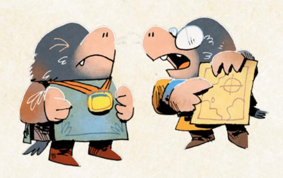

{113}------------------------------------------------

#### Secret Faction Loyalties

A vagabond goes to ask a favor of a denizen...and that denizen is secretly a member of the Woodland Alliance! The vagabond doesn't know that yet, though. So do they roll with their Reputation with the denizens, or with the Woodland Alliance?

The answer: the Woodland Alliance.

Vagabonds are sharp enough to pick up on small cues and signs of an NPC's loyalties, especially when those NPCs aren't really trying to hide it, or aren't that deft at hiding their loyalties. The GM always tells PCs to roll with the correct Reputation, even if it "gives away" the true loyalty of an NPC.

In the rarest of cases, an NPC might be deep undercover, hiding who they are with great skill and verve—and in those cases, a GM should tell the PCs to roll only with the faction of that NPC's cover identity. But those situations are fringe cases, exceptions and not the rule.

# Meet Someone Important

When you *meet with someone important for the first time*, roll with Reputation for their faction. On a hit, you're aware of their wider reputation (if any), and they're aware of yours (if any). On a 7-9, pick one. On a 10+, both.

- you've heard stories; ask a question about them, and the GM will tell you one story you've heard about them or their interests as an answer.
- they've heard something in your favor; take +I forward when you first try to play up your connection with them and their faction.

On a miss, you only know the basics about them, and they've heard stories about you and the things you've done, true or false—prepare for major complications.

You arrive at Opensky Haven, and you're met at the gate by an eagle wearing a laurel, a massive bronze scepter in one wing, flanked by elite Eyrie guards on all sides. You look at the eagle as their piercing eyes take you in. You're *meeting someone important!*

**Meeting someone important** is the move for encountering significant NPCs—the kind who are likely returning members of your game's cast, movers and shakers of either the setting or the drama. "Someone important" is pretty versatile in usage. It can refer to characters who are leaders of factions, generals

{114}------------------------------------------------

and mayors and guard captains, but it can also refer to the friendly local veteran blacksmith, or an entrepreneurial young raccoon, or a rebel fox who hasn't quite been accepted by the Woodland Alliance yet. "Important" is more of a fictional designation agreed upon by the players (including the GM) at the table than it is some kind of objective quality. Use the "important" designation to avoid needing to use this move for every individual guard, every individual shopkeep, every individual assorted denizen; any time you use this move, everyone at the table is agreeing that this character matters to your story.

This move covers more nuanced aspects of what you've heard about the important character, and what they've heard about you. Non-important NPCs—the kind you wouldn't use this move for—have likely heard information about the PCs based upon their reputations, and the PCs likely haven't heard anything about those non-important NPCs. For more on the basic ways in which NPCs will react to a PC's Reputation, see [page 110](#page-110-1).

**"You're aware of their wider reputation (if any) and they're aware of yours (if any)"** means that you've heard whatever information is shared and spread about each other. If there are widespread stories about the important NPC's cruelty or magnanimity, for example, you would have heard those. You might not have heard anything if the other character is a local figure who has kept themself below the radar of the Woodland. They might not have heard anything about you if you have a Reputation close to 0.

**"You've heard stories"** means that you've heard more than what you would've learned from general gossip and news. You can ask the GM a question to clarify what you've heard, but the GM only answers with another story—it might be true, it might be exaggerated, and the only way to find out is to look into it.

**"They've heard something in your favor"** means one of the stories that did catch their ear about you managed to make them a bit more favorable towards you. When you play up your own relationship to them and their faction, you can take +1 forward on an appropriate move. This is all about a positive relationship—you play up how you helped other denizens in another clearing, getting this denizen to trust you more, for example.

On a miss for this move, you don't know nearly as much about them as you would like, and they've heard plenty about you. They might not have a purely negative attitude towards you—but whatever attitude they have, whatever they think about you, it's going to cause you trouble.

{115}------------------------------------------------

#### Draw Attention

#### **REQUIRES –2 OR LOWER REPUTATION**

When you *try to publicly draw attention to yourself as an enemy of a faction*, roll with Reputation for that faction, treating it as positive (+2 or +3) for this roll. On a hit, you draw out the faction's resources to oppose you; brace yourself. On a 7-9, choose 1; on a 10+, choose 2.

- the faction employs significant military strength to chase you down
- the faction deploys an available, capable NPC agent (of your choice) to chase you down
- the faction is rattled by your threat; mark 2-notoriety with them

On a miss, your enemies are already moving against you quietly; the GM tells you how they catch you unprepared.

You know the Marquisate is about to launch an attack on the local Woodland Alliance cell, so you step out in front of the local Marquisate general's quarters. You call out a challenge, loud enough the general should be able to hear you from inside, calling him a coward and asking for a duel. You're *drawing attention* to yourself!

Draw attention is the move for large-scale misdirection. It might look like you're *tricking an NPC*, but the chief difference is that you're relying on your negative Reputation instead of cleverness—you're not so much deceiving as you are making yourself a big, obvious target and threat. With a low enough Reputation (–2 or lower), you might present such a good target that your foes can't help but come after you.

When you roll this move, treat your negative Reputation as positive for purposes of adding it to the dice result. You must have a-2 Reputation or a-3 Reputation with the appropriate faction to make the move, so you will either be rolling with a+2 or a+3 on the actual roll.

"You draw out the faction's resources to oppose you; brace yourself," means that you got what you wanted—the faction is coming after you, but they aren't going to take it easy on you.

"The faction employs significant military strength to chase you down" means that they have deployed actual real military resources against you—squads of soldiers, couriers to spread news of your whereabouts, even large siege-level weapons to try to destroy the entire area you're in. The good news? If those resources are coming after you, they aren't somewhere else! This is a great way for you to draw military forces away from another target.

{116}------------------------------------------------

**"The faction deploys an available, capable NPC agent (of your choice) to chase you down"** means that the faction is using somebody you should be afraid of to come after you. A capable assassin, a well-trained knight, a dangerous and powerful political figure—whoever they are, they are a real threat entirely on their own. "Of your choice" here means that you can direct which agent is coming for you if you have an idea in mind—for example, if you want your old nemesis Sergeant Whitefur to come after you, you can name her! If you don't have someone in mind, though, you can leave it up to the GM to decide, or you can suggest a brand-new character from your vagabond's backstory.

**"The faction is rattled by your threat; mark 2-notoriety with them"** means that you've only made yourself more of a threat to your enemies. You can't choose this option if you don't have two boxes to mark, although that should only happen if you're at –3 Reputation and also have all nine notoriety boxes marked.

Remember that on a 10+ here, you **must** choose two options!

**"On a miss, your enemies are moving against you quietly; the GM tells you how they catch you unprepared"** means that your whole ploy to draw attention to yourself inadvertently played right into your enemies' hands. They were already making moves against you behind the scenes, and now they've got you in their sights. You're in deep trouble! Note here that "enemies" can be left up to the GM's interpretation—it doesn't always have to be the faction you've called out if there's another enemy that might fictionally make sense. But even if it is the faction you wanted to call out, the difference here is that on a hit, you have a chance to control the situation, but on a miss, you are entirely at their mercy as they spring some trap on you.

{117}------------------------------------------------

# Sway an NPC

#### **REQUIRES +2 OR HIGHER REPUTATION**

When you *try to sway an open or vulnerable NPC by appealing to their belief in your reputation*, roll with Reputation for their faction. On a hit, you can change their mind about the world; say what you want them to believe, and the GM will rewrite their drive accordingly. On a 7–9, you use up some goodwill; clear 3-prestige. If you don't have enough prestige to clear, mark the remainder in notoriety. On a miss, the NPC takes the wrong message away from what you say; the GM will rewrite their drive accordingly.

You're pleading with the Mayor of Limmery Post, begging her to end her crackdown on any dissent in the clearing. You've only ever worked for the denizens' favor, you say to her, and you know her mindset won't help anyone. You're *swaying an NPC*!

Sway an NPC is the move for truly changing someone's mind instead of merely *persuading* them. Think of the difference as offering someone a good reason to do something specific (persuasion) and getting someone to see the world in a whole new way (swaying). The latter can lead to real, significant, ongoing change!

In order for you to sway an NPC, they have to be open and vulnerable to you, and you have to appeal to their belief in your reputation. If you've betrayed this specific NPC before it might not matter what your Reputation is—they probably aren't open to what you're saying. "Open and vulnerable" also means you probably can't sway the NPC again and again and again before they become "closed"...no matter how highly they think of you.

**"On a hit, you can change their mind about the world; say what you want them to believe, and the GM will rewrite their drive accordingly"** means exactly what it says. You and the GM have a conversation about how you're trying to change their mind, what new belief you hope they hold, and then the GM will rewrite the NPC's drive based on what you say. You might take an NPC whose drive is "To utterly destroy the Marquisate and its supporters" and change their drive to "To defend the denizens of the Woodland," for example.

**"On a 7–9, you use up some goodwill; clear 3-prestige"** means that changing someone's mind like this comes at a a cost. You're using up your clout to get it done.

**"On a miss, the NPC takes the wrong message away from what you say; the GM will rewrite their drive accordingly"** means that you've successfully changed the NPC's mind, but not the way you wanted. The GM gets to decide how exactly they misunderstand you, but expect an exaggerated or twisted version of what you had hoped to achieve by *swaying* them.

Chapter 5: Core Rules 117

{118}------------------------------------------------

# Make a Pointed Threat

**REQUIRES -3 REPUTATION**

When you *make a pointed threat to an NPC by wielding your reputation*, roll with Reputation for their faction, treating it as positive (+3) for this roll. On a 10+, they are rattled; they must surrender, retreat, or charge, GM's choice. On a 7–9, you must make a demonstration of your dangerous intent first, before they are rattled. On a miss, your reputation precedes you; they reveal how they prepared for someone like you.

The local Woodland Alliance cell has openly attacked the clearing…and you're trying to stop them. You face off against their leader and tell them if they hurt anyone, you're never ever going to stop hunting them—you're the famous Fang of the Marquisate! You're *making a pointed threat*!

*Making a pointed threat* is a way to use your extremely negative Reputation to get your enemy to back down or make a mistake. It's most useful in situations where you couldn't normally *persuade*—enemies with whom you have a –3 Reputation are unlikely to listen to you! You treat your –3 Reputation as +3 for purposes of the roll—add +3 to whatever you roll on 2d6.

On a 10+, the NPC is rattled—the GM chooses whether they surrender, retreat, or charge. "Surrender" means give in to you and your demands; "retreat" means they withdraw; and "charge" means they attack you, hard, fast, and poorly. If an NPC "charges" at you, they are still giving you the upper hand—they're not thinking straight, and you can take advantage of their carelessness.

**"On a 7–9, you must make a demonstration of your dangerous intent first, before they are rattled"** means that they will be rattled—you did get a hit, after all—but you have to prove your dangerous Reputation and your threat here and now. This demonstration has to be something significant, something the target would feel as real, upsetting, and serious. Drawing your sword can be intimidating, but likely isn't enough. Drawing the sword you took from the enemy faction's greatest hero and showing it off might do the trick. Drawing the sword and putting its edge against a hostage's throat definitely sends a message.

**"On a miss, your reputation precedes you; they reveal how they prepared for someone like you"** means that when you try to make your pointed threat, you find out that you've stumbled right into a terrible trap. Your Reputation is fearsome and dangerous, after all—your foes probably heard about your approach and cooked something up just for this situation. It might be guards hidden somewhere nearby; it might be poison slipped into the food you just left; but whatever it is, it'll be bad.

{119}------------------------------------------------

# Nested Moves and Uncertainty

When you make a pointed threat, you may have to make a demonstration of your dangerous intent, acting in some additional way for the move to resolve. Sometimes that further action won't have any uncertainty—like drawing your blade along the cheek of your hostage without needing to trigger any new move.

Rarely, the action might trigger another move—like *wrecking* one of the support struts of a building. That's okay! But the stakes of the first move are now going to be resolved by the second. The consequences of the second move cannot derail the results of the first—if you pull off the necessary condition from the first move (like making your demonstration), then you still get the results of the first move.

# Command Resources

**REQUIRES +3 REPUTATION**

When you *command an NPC to give you significant, valuable resources*, roll with Reputation for their faction. On a 10+, you get what you need as soon as they can get it to you. On a 7–9, they impose a condition on how you can use the resources, or what you must return to the faction in recompense. On a miss, they don't have what you need, but they tell you a way you can get it at a steep cost or some serious difficulty.

You storm into the local Marquisate legate's office, smash your dagger down into their map of the Woodland, and demand they assign troops to follow you to a local clearing help free it from the Eyrie Dynasties. You're *commanding resources*!

*Command resources* is the move for wielding your positive Reputation like a hammer to get what you want from allies. You've achieved such a high Reputation—you're basically a legend among that faction—that you can straight up give them commands, and they can't possibly just brush you off.

**"…Give you significant, valuable resources"** means that you aren't just giving any command—you're commanding them to give you resources you otherwise couldn't get under your control. *Commanding* them to give you a bed for the night isn't really a "significant, valuable resource" so this move wouldn't be triggered; but *commanding* them to assign a whole siege weapon to you would definitely trigger this move.

{120}------------------------------------------------

There is no restriction on whom this move can be used—if you've managed to earn and maintain a +3 Reputation with the Marquisate, you've earned the right to make these demands even on the Marquise de Cat herself.

**"You get what you need as soon as they can get it to you"** means exactly what it sounds like—they might not be able to get you those resources immediately, but as soon as they possibly can, they do.

**"They impose a condition on how you can use the resources, or what you must return to the faction in recompense"** means that you don't get what you wanted without strings. Exactly what they ask for is up to the GM, but it will either be a restriction on the resources' use or a favor you have to give them in return. A restriction just complicates your relationship with the faction—break the restriction and you'll likely earn notoriety—by complicating what you're allowed to do. "You can't use the siege weapon to destroy the clearing's main wall" is a good example of a restriction. A favor in return doesn't need to involve the resource but often will, and failing to return the favor will also earn you notoriety. "You have to hand over the eagle governor of the clearing after you win" is a good example of a favor.

**"On a miss, they don't have what you need, but they tell you a way you can get it at a steep cost or some serious difficulty"** means that they aren't refusing you—they just straight up cannot help you out, not without a lot of trouble. Perhaps the siege weapon you're asking for has been taken by the enemy—if you can free it, you can have it. Perhaps the siege weapon is crucial to a current battle the faction is fighting—you have to provide them with enough resources to hire mercenaries to shore up their forces before you can get the weapon. In all such cases, you still have a chance of getting it, but only through a path that's quite costly.

{121}------------------------------------------------

# Travel Moves

The vagabonds don't have real homes. They journey across the Woodland, moving from clearing to clearing. Sometimes they cross the paths of the Woodland, and sometimes they cross the dangerous forests. But travel is always a crucial part of the vagabonds' tales, and these moves are here to support the game with interesting uncertainty when the vagabonds begin a new journey.

# Gravel Ghrough the Forest

When you *travel from clearing to clearing through the forest*, the band collectively decides how it travels and one member of the band rolls for the group:

- slowly, foraging heavily: everyone clears 2-depletion; the band collectively marks an exhaustion for each band member; -1 to the roll
- carefully, avoiding trouble: the band collectively marks one depletion or exhaustion for each band member; +1 to the roll
- as quickly as possible: everyone marks exhaustion and depletion;
   to the roll

On a hit, you pass through the forest to any clearing on the other side. Along the way, one of you spots an interesting site; you leave markers so you can return after you finish your trip. On a 10+, the transit is largely safe. On a 7–9, something from the forest is following you; you can let it track you, or every vagabond marks exhaustion to lose it. On a miss, you run afoul of one of the forest's dangers during the trip, and you can't escape it easily; deal with it before you can reach the clearing on the other side.

You and your band depart from Opensky Haven, diving into the forest to try to take a shortcut to nearby Mellowhill. You're *traveling through the forest!*

**Traveling through the forest** is dangerous—only vagabonds are brave and skilled enough to do it often. But there's no better way to quickly cut across a wide swath of the Woodland and arrive at an important destination.

When you *travel through the forest*, the band collectively decides how it travels, including where it's going—any clearing on the other side of an intervening forest, no matter how far away it would be by path. That means all the players should have a discussion. If there is real disagreement, it's a great chance to *plead with another PC* to convince other PCs to go along with you (page 88), or to find out just how committed to their plans they are. If there is still major disagreement, go with the majority vote of the players.

{122}------------------------------------------------

Traveling **"slowly, foraging heavily,"** means the band is taking its time and replenishing its supplies from the forest as it goes. Each PC in the band gets to clear 2-depletion, but the group as a whole has to mark at least 1-exhaustion for each PC. So a band of four vagabonds would still allow each vagabond to clear 2-depletion, but would have to mark 4-exhaustion collectively. That means one PC might mark 3-exhaustion and another PC might mark a single exhaustion, or two PCs might mark 2-exhaustion each, or each PC might mark exhaustion…just as long as the total exhaustion marked equals the number of PCs. The band takes –1 to the roll, then, for its slowness.

Traveling **"carefully, avoiding trouble,"** means the band is moving safely through the forest, but not slowly enough to gather supplies. The band must collectively mark a total number of exhaustion and depletion equal to the PCs. A band of four vagabonds might have one PC mark 2-depletion and another PC mark 2-exhaustion, or might have two PCs each mark depletion and a third PC mark 2-exhaustion, or one PC mark depletion and 3-exhaustion…as long as the total of both kinds of harm marked is the same amount as the number of PCs in the band. The band takes +1 to the roll, then, for its relative speed.

Traveling **"as quickly as possible"** means the band is tearing its way across the forest. It's the best possible way to arrive at your destination fast, but it's very costly. Each PC in the band has to mark both depletion and exhaustion. The band takes +2 to the roll, then, for moving so quickly.

**"Along the way, one of you spots an interesting site; you leave markers so you can return after you finish your trip"** means you found something interesting in the forest, but it doesn't derail your travels. Going through the forest always reveals another interesting place to return to, but you are never obligated to visit it. You can find it again later without having to make this move again, and without paying further costs, if you and your band chooses to return to the forest. An interesting place might be a ruin, a bandit camp, a large animal cave, or even another vagabond's hiding place. The GM will tell you what the interesting site is.

**"The transit is largely safe"** means you arrive at your destination clearing without any significant difficulty. **"Something from the forest is following you"** means that you have a bit of trouble; it won't stop you from arriving at your destination, but it might cause you problems when you do arrive, or even later down the line. If every vagabond marks exhaustion, then the band can avoid the threat.

On a miss, a danger of the forest stands in your way; the band cannot arrive at its destination without dealing with that danger. The GM will tell the band what the danger is, and the conversation of play picks up with that situation, using all the basic moves to play out the conflict. Once the danger is resolved, the band can journey on to its destination without making this move again.

{123}------------------------------------------------

#### Gravel Along the Path

When you *travel from clearing to clearing along the path*, the band collectively decides how it travels and one member of the band rolls for the group:

- at a relaxing pace: everyone clears 3-exhaustion; the band collectively marks a total of 2-depletion; -I to the roll
- at an average pace: everyone clears 2-exhaustion; the band collectively marks 1-depletion; +0 to the roll
- safely, quickly, and under the radar: the band collectively marks 1-depletion for supplies; +1 to the roll
- urgently fast: everyone marks exhaustion; +2 to the roll

On a hit, you reach the next clearing in a timely fashion. On a 10+, the trip is uninterrupted and quick. On a 7-9, you encounter something noteworthy on the path—a caravan, a battleground, or something else odd passing through. On a miss, you are caught in the middle of a dangerous situation before you arrive at the next clearing.

You and your band depart from Opensky Haven, taking the path to the neighboring clearing of Pruitt's Brook. You're *traveling along the path!*

Traveling along the path is, in general, safer than going through the forest—that's the point of the paths. But you're also more likely to encounter forces of a faction or other denizens on the path, as only vagabonds are brave enough (or foolish enough) to travel through the forest.

When you travel along the path, the group collectively decides how it travels. That means all the players should have a discussion. If there is real disagreement, it's a great chance to *plead with another PC* to convince other PCs to go along with you (page 88), or to find out just how committed to their plans they are. If there is still major disagreement, go with the majority vote of the players.

Traveling "at a relaxing pace" means taking your time, ensuring you won't be exhausted. The advantage is that you clear exhaustion—each vagabond gets to clear 3-exhaustion. The disadvantage is that it costs you more in food and supplies, and it makes you more likely to run into something along the road. The band must collectively mark 2-depletion—that means between the entire group of vagabonds, as long as two boxes of depletion are marked, the condition is satisfied. Both can be marked by a single vagabond, or they can be marked by two different vagabonds.

{124}------------------------------------------------

Traveling **"at an average pace"** is less costly in resources (the band only has to mark a single box of depletion among its members) and in the chance to run into something, but it's also less relaxing—vagabonds only clear 2-exhaustion each.

Traveling **"safely, quickly, and under the radar"** means you're being cautious as you move along the road, trying to avoid any conflicts or dangerous situations. You don't get to clear any exhaustion and someone in the band still has to mark a single box of depletion, but you also take +1 on the roll, meaning you are much less likely to run into something.

Traveling **"urgently fast"** gets you to your destination as fast as possible, but moving at such speeds is costly. Each member of the band has to mark exhaustion for the pace.

**"Reaching the next clearing in a timely fashion"** means that you arrive at your destination pretty much as fast as any denizen would've expected. "The trip is uninterrupted and quick" means that you arrive even faster than expected—it's the best way to ensure that you overtake some other group on your journey.

**"You encounter something noteworthy on the path"** means that your journey isn't uneventful. Something is on your path—the GM will tell you what—and you might allow yourselves to be diverted to investigate. But most of what you encounter can also be ignored to continue your journey. For example, if you come across the remains of a battle, then you can choose to move on instead of investigating further, but merely encountering the battle will tell you something about the events of the war. The GM can simply tell the band about what they encounter, and then allow them to arrive at the clearing. If the band wants to stop and spend time on the noteworthy encounter, they are more than welcome to, using the other moves of the game. When they are done, they can journey on to their original destination without making this move again.

**"You are caught in the middle of a dangerous situation before you arrive at the next clearing"** means that you do not arrive at your destination. The GM will tell you what dangerous situation halts your progress and demands your attention. You have to contend with the situation before you can return to the path. When you have dealt with the dangerous situation, you can choose to finish your journey to the original clearing without making this move again.

{125}------------------------------------------------

# Harm

In Root: The RPG, every character has a few different ways to track their status—their harm tracks. For each track, when more boxes are marked, the character is worse off, depending upon the track in question. In these rules, "harm" is an all-purpose word to refer to all of these tracks.

Vagabond PCs have three harm tracks for three kinds of harm: depletion, exhaustion, and injury.

**Depletion** represents a character's all-purpose funds and assorted goods and supplies. Vagabonds are covered in pouches, belts, and pockets, and they carry all sorts of additional equipment. There's no point in tracking all of it because of how much of it there would be, so Root: The RPG uses depletion instead. An unmarked box of depletion represents some amount of equipment or supplies the vagabond is carrying; a marked box of depletion represents empty pockets and pouches.

**Exhaustion** represents a character's energy, strength, and capacity for pushing ahead. Vagabonds are particularly vivacious, so they have plenty of exhaustion boxes to mark when applying themselves substantially to some big effort. An unmarked box of exhaustion represents energy a character is ready to commit; a marked box of exhaustion represents tiredness and used-up energy.

**Injury** represents a character's health and overall physical well-being. Vagabonds are hardy, but even the hardiest vagabond can be laid low by sword strokes and hammer strikes. As vagabonds mark injury, they push ever closer to incapacitation and even death. An unmarked box of injury represents a portion of good health; a marked box of injury represents just that—injury, a wound, damage done to the body.

There are two other kinds of important harm: wear and morale.

**Wear** is a kind of harm track held only by items and NPCs. Wear represents equipment's durability, its strength, its own "health." On an item, it tracks how much structural damage the item has endured, and how much it can endure before being destroyed. On an NPC, it's a general tracker for all of that NPC's equipment— GMs don't track NPC equipment individually. An unmarked box of wear represents functional, if not pristine, condition; a marked box of wear represents damage to the weapon, nicks and breaks and cracks and loosened fastening.

**Morale** is a kind of harm track held only by NPCs. It tracks an NPC's will to keep resisting (most likely, resisting the vagabonds), to keep fighting, or to keep arguing. An unmarked box of morale represents an NPC's commitment to their drives and causes; a marked box of morale represents that NPC's will draining away.

{126}------------------------------------------------

#### Marking Depletion

Sometimes a vagabond marks depletion because their pouches get torn when they tumble out a window, but vagabonds often mark depletion because they need some all-purpose "stuff"; anything a vagabond might be carrying on their person in their pouches or backpack is fair game. It's never high quality, but it's always good enough.

Here a few items a vagabond could pull from their bag by marking one depletion:

- 1-Value of coin
- a torch, small lantern, or a few candles
- a 30ft length of rope
- a grappling hook
- climbing gloves
- food and water for a day
- fire-starting kit
- basic lockpicks
- supplies for repairs or healing (see clearing wear and injury, page 128)
- small pocket knife (for carving, not fighting)
- small smoke bomb
- mirror
- quill, parchment, ink
- basic map
- flask of oil or alcohol
- bedroll
- ball bearings

# Marking harm

Throughout Root: The RPG, you'll find a few ways of representing and marking harm. Here is a technical and specific breakdown of all of those ways:

- "Mark [harm]" means you mark a single box of that harm track.
- "Mark 2-[harm]" means you mark two boxes of that harm track. The same applies for "mark 3-[harm]" and "mark 4-[harm]" and so on.
- "Inflict [harm]" means you cause your target to mark a single box of that track.
- "Inflict 2-[harm]" means you cause your target to mark two boxes of that harm track. The same applies for "inflict 3-[harm]", "inflict 4-[harm]", etc.
- "Clear [harm]" means you clear a single marked box of that harm track.
- "Clear 2-[harm]" means you clear two boxes of that harm track, and so on.
- "Clear all [harm]" means that you clear all marked boxes of that harm track.
- "Harm," as described above, refers to the general idea of all the different kinds of harm. If something says "inflict harm," then the harm is suited to the fictional situation; for example, when you engage in melee, you might inflict harm, with that harm being dependent upon the weapon you're wielding.
- \* "Suffer harm," as in the construction "When you suffer harm," refers to when you mark harm on your own harm tracks.
- "Additional [harm]" means that the amount of harm is increased. If no amount is specified, increase it by one.
- "Fewer [harm]" means that the amount of harm is decreased. If no amount is specified, decrease it by one.

126 Root: The Roleplaying Game

{127}------------------------------------------------

# Harm Past the End of the Track

When you mark harm, it means you're using up resources and approaching some dangerous fate past the end of the harm track. If you've marked all the boxes on a given track, then you're in some dangerous state:

**If all your depletion is marked**, your pockets are empty. You're broke, unless you're carrying some extra treasure. This is likely the least dangerous track to have full, but it still leaves you without a significant resource.

**If all your exhaustion is marked**, you're wiped out, on the door of collapsing entirely. You can still move, still act, but you can't push yourself any further without the risk of utter collapse and even unconsciousness.

**If all your injury is marked**, you're on death's door. You've been wounded, injured, and hurt so much that while you're still alive now, all it would take is another wound to finish you. You likely need medical attention, now.

**If all of an item's wear is marked**, the item is about to break. It's only damaged now, but all it would take is a bit more stress to fracture it irreparably. For an NPC, it means their equipment is damaged and ready to break, similarly.

**If all of an NPC's morale is marked**, then they're just about ready to retreat or submit entirely. Just a bit more pressure on them, and they will cave.

The real risk and cost comes when you have all your harm boxes marked, and you need to mark one more. Most of the time this will be inflicted upon you as the result of someone else's actions and efforts, but sometimes you can choose to push past the end of your track, depending upon the situation. For example, you can always choose to push your equipment to the breaking point and mark wear when you have no boxes left to mark, and at the GM's discretion you might be able to mark exhaustion when you have no boxes left to mark and push yourself past your limits. You can't choose to mark depletion when you have no boxes left to mark—you don't have anything in your pockets!

**If you need to mark depletion when your depletion track is full**, you are utterly spent and can't mark it. There is no greater negative effect here marking depletion is usually voluntary, or the result of losing some of your equipment in a scrape or a tussle. When your track is full you have nothing left to lose. You cannot ever choose to mark depletion when your track is full, but any depletion inflicted upon you when your track is full is ignored.

**If you need to mark exhaustion when your exhaustion track is full**, you collapse into submission or even unconsciousness. The GM decides what your state is. You aren't dead—not right away—but you are helpless and at your enemy's mercy. Your friends might be able to save you, but you can't act on your own; maybe you're dazed and concussed...or just so tired your body won't respond.

Chapter 5: Core Rules 127

{128}------------------------------------------------

If you need to mark injury when your injury track is full, you die. Depending upon the situation, you might have a last moment to act, and almost always you'll get last words. But marking injury past the end of your track is the end of your character. This is by far the direst result of a full harm track, so be wary of it.

If you need to mark wear when your item's wear track is full, the item is damaged beyond repair. Up until this point, an item can always be fixed. At this point, the item has endured so much damage, "repairing it" is more or less making it anew. You can cross the item off your equipment list.

If an NPC needs to mark morale when their morale track is full, they submit or flee, immediately and entirely. They're done resisting, and they capitulate to any foe or aggressor without question—though the exact nature of that capitulation will vary depending upon the NPC's personality.

# Clearing harm

Over the course of **Root**: **The RPG**, you will mark harm on all your tracks, and eventually you'll be in real danger of needing to mark harm past the end—so you need to find a way to clear them out from time to time!

You can clear depletion by gaining new supplies or money—filling your pockets with useful items and coin again. Gathering useful supplies from the forest and scrounging about in someone's home both clear depletion.

- Clear I-depletion: a small payment from a denizen, rummaging through a normal denizen's larder, a few hours spent foraging in the forest
- Clear 2-depletion: a decent wage from a denizen, rummaging through a normal denizen's whole house, a day or so spent foraging in the forest
- Clear 3-depletion: a decent wage from a wealthy denizen, rummaging through a workshop of a wealthy denizen, a couple days spent foraging in the forest
- Clear 4-depletion: a significant wage from a powerful denizen, rummaging through a wealthy denizen's whole house, a week spent foraging in the forest

You can clear exhaustion by fulfilling your nature (page 49), or by getting some good rest—sleeping, recovering, and taking a break. Getting a night's rest in a real bed is the best way to recover exhaustion.

- Clear I-exhaustion: a night's rest in a safe and well set-up camp site in the forest, a night's rest in someone's loft, a notably good meal
- Clear 2-exhaustion: a week's rest in a safe and well set-up camp site in the forest, a night's rest in a bed in a denizen's home, an exceptional meal
- Clear 3-exhaustion: a week's rest in a bed in a denizen's home, a night or two's rest in a nice plush bed in a very safe place, a safe and indulgent feast
- Clear 4-exhaustion: a week's rest in a nice plush bed in a very safe place, good eating and drinking for a week

{129}------------------------------------------------

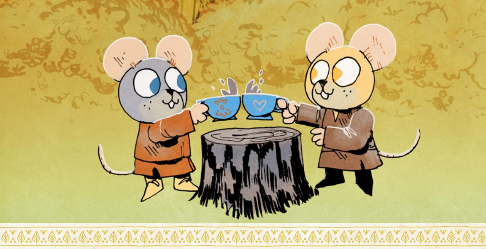

You can clear injury by receiving medical attention—someone tending to your wounds, splinting broken bones and applying poultices to bruised limbs. Most often it requires a real healer and not just a fellow vagabond.

- Clear I-injury: a vagabond tends to your wounds (mark depletion for supplies), a healer spends an hour tending to your wounds (I-Value of supplies), a week of bed rest
- Clear 2-injury: a healer spends a day or less tending to your wounds (and requires 2-Value of supplies), two weeks of bed rest
- Clear 3-injury: a healer spends a week or less tending to your wounds (and requires 3-Value of supplies), a month of bed rest
- Clear 4-injury: a healer spends two weeks or more tending to your wounds (and requires 4-Value of supplies)

You can clear wear by repairing the damaged item—restringing, tightening, rebinding and making repairs, instead of making the item anew. Vagabonds are adept at making low-level repairs, but serious repairs require greater skill.

- Clear I-wear: a vagabond spends a few hours repairing the item (marking depletion), a trained expert spends an hour repairing the item (and requires I-Value of supplies)
- Clear 2-wear: a vagabond spends a couple days repairing the item (marking 2-depletion), a trained expert spends a few hours repairing the item (and requires 2-Value of supplies)
- Clear 3-wear: a trained expert spends a couple days repairing the item (and requires 3-Value of supplies)
- Clear 4-wear: a trained expert spends a week or more repairing the item (and requires 4-Value of supplies)

{130}------------------------------------------------

# Session Moves

**Root:** The RPG has two "session moves"—moves that trigger at the end of each session of play. For this game, these moves are more or less reminders to make sure you check in on certain aspects of the vagabond PCs.

When the session ends, one at a time, each player reads their drives out loud. The players and GM discuss whether the player fulfilled their drive during the session in an instance that wasn't already called out during the session. If they did, and they did not already advance this session for the drive in question, then they advance.

This end of session move exists just to make sure that every player gets a chance to advance, even if they forgot to call out how they were fulfilling their drive in the heat of the moment. Each PC only has two drives, but it's far easier for each player to track their own drives than for the GM to try to track every player's drives—and even then, players who get caught up in the excitement and fun of the moment might not realize they fulfilled a drive. Use this move just to make sure that players get credit for the cool things they did during the session!

When the session ends, one at a time, each player may choose one element of their playbook to update or change. They do not have to choose anything, if they don't want to. They may choose one of the following options:

- Replace one drive with a new drive from any playbook
- Replace nature with a new nature from any playbook
- Replace a connection (both type and subject) with a new connection from any playbook

This end of session move lets players keep their characters updated throughout play—sometimes, a vagabond's nature, drive, or connections will stop making sense. A Ranger fully achieves their vengeance. An Arbiter breaks with their "master." A friendship cools and becomes professional, or strengthens and becomes a familial bond. Changing these elements of a vagabond is not a matter of advancement, but it is important that a vagabond's elements continue to reflect the state of the fiction. This move lets players do just that—a Ranger who has finally defeated the target of their Revenge can choose a new drive, or an Arbiter who has given up on their Principles can take a new drive to match their more pragmatic sensibilities.

{131}------------------------------------------------

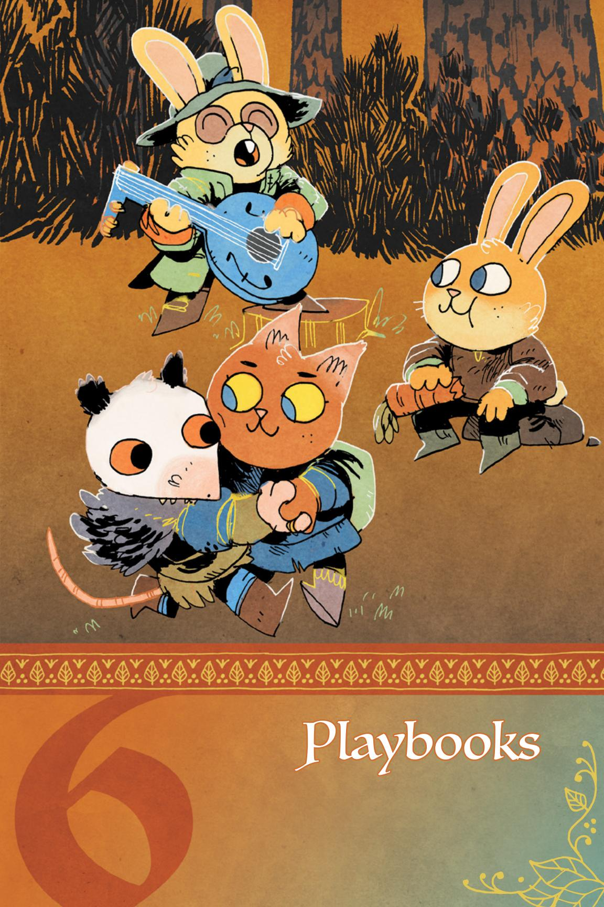

{132}------------------------------------------------

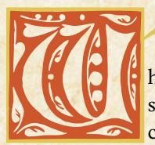

hen you make a player character for Root: The RPG, you start by choosing a playbook. Each playbook is a kind of character, a set of options for how you interact with and see the

Woodland. Some playbooks might be interested in getting into fights; others like to talk their way out of conflicts. Some might be criminals through and through; others might be up-and-coming heroes.

No playbook is a straitjacket. Each provides clear guidance to get you started with your character, but there is space to define your vagabond within the boundaries of the playbook. Furthermore, your character can change, grow, and move beyond the initial constraints of the playbook over the course of a campaign. You can even change playbooks entirely, down the line, emphasizing a whole new way for your character to approach the world.

Each PC uses a different playbook. That way, the band of vagabonds consists of different, interesting characters who don't overlap too much in their abilities. Using different playbooks helps to ensure each PC gets their own area to shine.

For more on the individual parts of the playbooks, make sure to check out Chapter 4: Making Vagabonds starting on page 41.

The list of playbooks included in this chapter is:

- Adventurer A charismatic, diplomatic vagabond, interested in forging connections and maybe even changing the Woodland.
- Arbiter A strong, battle-ready vagabond, acting often as defender and interceding in unfair conflicts.
- narrier A fast, freelancing vagabond, specializing in smuggling and speedy movement within and without clearings.
- Ranger A forest-savvy, antisocial vagabond, quite skilled but more a creature of the forests between clearings than of the clearings themselves.
- Ronin A highly trained outlander vagabond, cast forth from their homeland and now masterless in the Woodland.
- Scoundrel A destructive, risk-taking vagabond, with a heavy inclination towards arson and over-the-top action.
- **Ghief** A skilled, criminal vagabond, expert in burglary and theft but with a tendency to bite off more than they can chew.
- Ginker An innovative, technically-competent vagabond, interested in mechanisms, crafting, equipment, and dangerous new philosophies.
- Vagrant A deceitful huckster vagabond, master of cons and trickery.

いることは、これには、これのことには、これには、これには、これには、これには、これには、これには、これには、これ

{133}------------------------------------------------

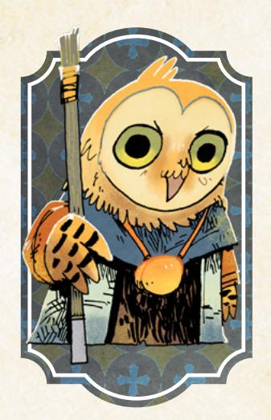
