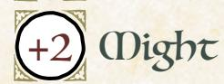
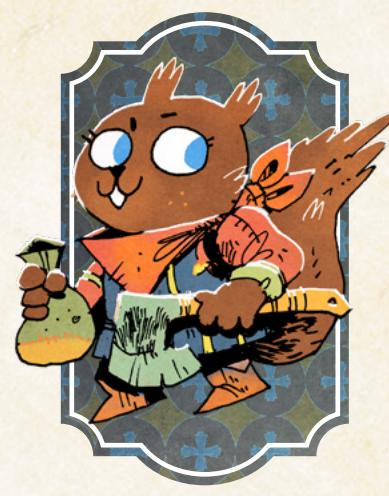
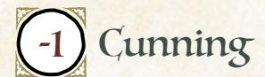
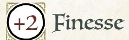
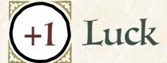

# The Adventurer

*You are a peaceful, diplomatic vagabond, making allies from those you aid, perhaps toppling greater powers by forging strong bonds with others.*

#### Species

• fox, mouse, rabbit, bird, owl, other

#### Demeanor

• charming, diplomatic, agreeable, stern

#### Details

- he, she, they, shifting
- formal, colorful, multicultural, simple
- medal of service, beaded jewelry, carved flute, pouches with pretty stones

#### Charm +2

Cunning +1

Add +1 to a stat of your choice, to a max of +2

# Weapon Skills

Choose one weapon skill to start

- Disarm
- Harry
- Improvise
- Parry

# Roguish Feats

You start with these: Counterfeit, Sleight of Hand

Equipment Starting Value 9

#### Your Nature choose one

- Extrovert: Clear your exhaustion track when you share a moment of real warmth, friendship, or enjoyment with someone.
- Peacemaker: Clear your exhaustion track when you resolve a dangerous conflict nonviolently.

# Your Drives choose two

- Ambition: Advance when you increase your reputation with any faction.
- Clean Paws: Advance when you accomplish an illicit, criminal goal while maintaining a believable veneer of innocence.
- Principles: Advance when you express or embody your moral principles at great cost to yourself or your allies.
- Justice: Advance when you achieve justice for someone wronged by a powerful, wealthy, or high-status individual.

# Your Connections

See [page 51](#page-51-0) for mechanical effects of connections.

- Partner: \_\_\_\_\_\_\_\_\_ and I fought alongside each other to defend a clearing from a faction's advances...but we failed. Why did we defend the clearing? Why did we fail? Who defeated us?
- Friend: I traveled with \_\_\_\_\_\_\_\_\_ for a time right after I became a vagabond. They helped keep me safe and showed me the Woodland. What keepsake did I gift them?

{134}------------------------------------------------

#### Adventurer Moves choose three Sterling Reputation Whenever you **mark any amount of prestige with a faction**, mark one additional prestige. When you **mark any amount of notoriety with a faction**, you can instead clear an equivalent amount of marked prestige. Subduing Strikes When you **aim to subdue an enemy quickly and nonlethally**, you can *engage in melee* with Cunning instead of Might. You cannot choose to inflict serious harm if you do. Talon on the Pulse When you **gather information about the goings-on in a clearing**, roll with Cunning. On a 10+, ask 3. On a 7-9, ask 2. • Who holds power in this clearing? • Who is the local dissident? • What are the denizens afraid of? • What do the denizens hope for? • What opportunities exist for enterprising vagabonds? On a miss, your questions tip off someone dangerous. Orator When you **give a speech to interested denizens of a clearing**, say what you are motivating them to do and roll with Charm. On a hit, they will move to do it as they see fit. On a 10+, choose 2. On a 7-9, choose 1. • They don't try to take your intent too far • They don't disband at the first sign of real resistance • They don't demand you stand at their head and lead On a miss, they twist your message in unpredictable ways. Well-Read

Take +1 Cunning (max +3).

#### Fast Friends

When you **try to befriend an NPC you've just met by matching their personality, body language, and desires**, mark exhaustion and roll with Cunning. On a hit, they'll look upon you favorably—ask them any one noncompromising question and they'll answer truthfully, or request a simple favor and they'll do it for you. On a 10+, they really like you—they'll share a valuable secret or grant you a serious favor instead. On a miss, you read them totally wrong, and their displeasure costs you.

{135}------------------------------------------------

# Background Questions

| Where do you call home?                                                                                                                | Whom have you left behind?                                                                            |
|----------------------------------------------------------------------------------------------------------------------------------------|-------------------------------------------------------------------------------------------------------|
| " clearing " the forest "                                                                                                  | " my mentor " my family "                                                                 |
| a place far from here Why are you a vagabond?                                                                                       | my loved one " my student " my greatest ally                                              |
| " I want to help the Woodland " I want to explore the Woodland " I believe the current factions should be overturned | Which faction have you served the most? (mark two prestige for appropriate group)               |
| " I must keep a promise to a loved one " I want freedom from society's constraints                                         | With which faction have you earned a special enmity? (mark one notoriety for appropriate group) |

Pleasant, persuasive, renowned, peaceful. The Adventurer is a speaker and negotiator, trying to resolve conflicts and better the Woodland through honest speech and genuine pleas.

As the Adventurer, you are a capable talker with a tendency towards nonviolence and resolution of conflicts through negotiation. You might be driven by a general tendency to help those in need, by the goal of rising in renown, or by a specific desire to fix the larger Woodland—but one way or another, you're interested in being viewed positively.

Your fellow vagabonds will likely want to resolve things a bit more directly than you, focusing on combat, thievery, or deception to get what they desire. But in the long run, you are much more likely to achieve positive results; combat, thievery, and deception tend to have consequences, even if you get away scotfree in the moment.

Your natures, "Extrovert" and "Peacemaker," both point at your penchant for conversational interaction with other characters, your talent for relationship building. Focus on your interactions with other characters, PCs and NPCs alike.

Look for chances to resolve situations by talking, without using violence, and don't shy away from risky situations. Your fellow vagabonds might have to come in to bail you out, but that's all for the best, making a more interesting game and giving everyone a chance to shine. Use your other skills and connections to support your fellow vagabonds if it does come to blows—if nothing else, *assessing the situation* is always pretty useful.

{136}------------------------------------------------

#### Notes on The Adventurer Moves

For *Sterling Reputation*, keep in mind that you only increase prestige gains by one each time you gain prestige. This incentivizes pursuing lots of small good deeds. Don't hesitate to lose prestige to stop yourself from gaining notoriety racking up notoriety can hurt your Reputation much more than losing a few prestige.

For *Subduing Strikes*, "aiming to subdue an enemy quickly and nonlethally" often requires using an appropriate weapon. Coming at a foe with a sword makes it difficult to try to subdue them nonlethally, even if you hit with the flat of the blade. If your weapon inflicts exhaustion, then you are guaranteed that it is nonlethal.

For *Talon on the Pulse*, you need a bit of time to actually collect the information. Think of the move as covering a short montage of you going around the clearing and asking NPCs lots of different questions. On a miss, you won't necessarily be attacked or accosted, but drawing the interest of a dangerous individual will complicate your life.

For *Orator*, you have to give your speech to "interested denizens of a clearing." The move won't trigger if you try to speak to denizens who have no reason to pay attention to what you say, and it won't trigger if you're speaking to nonclearing denizens, like a group of bandits or a squad of well-trained soldiers. "They will move to do it as they see fit" means that you don't control exactly how they follow your exhortations—the GM will describe what they do, based on who they are and what choices you make from the list.

For *Well-Read*, keep in mind that moves like this are the only way to get +3 in a stat.

For *Fast Friends*, a "non-compromising question" is one they don't feel endangers them or threatens them in any way; a "simple favor" is one that doesn't cost them too much to conduct. A "valuable secret," however, can actually put them at risk for sharing it, and a "serious favor" might cost them quite a bit in time, effort, or money—not so much that it's self-destructive, but enough that it actually puts them out.

{137}------------------------------------------------

# The Arbiter

*You are a powerful, obstinate vagabond, serving as somewhere between a mercenary and a protector, perhaps taking sides too easily in the greater conflict between the factions.*

#### Species

• fox, mouse, rabbit, bird, badger, other

# Demeanor

• intimidating, honest, brusque, open

#### Details

- he, she, they, shifting
- large, scarred, wellgroomed, old
- faded military insignia, eyepatch, repaired clothes, tarnished locket

#### Charm +1

Cunning 0

Add +1 to a stat of your choice, to a max of +2

# Weapon Skills

Choose one weapon skill to start

- Cleave
- Disarm
- Parry
- Storm a Group

# Roguish Feats

Choose one roguish feat to start [\(page 69](#page-69-0))

Equipment Starting Value 10

| Your Nature choose one |  |  |  |
|------------------------|--|--|--|
|------------------------|--|--|--|

- Defender: Clear your exhaustion track when you put yourself in harm's way to defend someone against injustice or dire threat.
- Punisher: Clear your exhaustion track when you tell a powerful or dangerous villain to their face that you will punish them.

# Your Drives choose two

- Justice: Advance when you achieve justice for someone wronged by a powerful, wealthy, or high-status individual.
- Principles: Advance when you express or embody your moral principles at great cost to yourself or your allies.
- Loyalty: You're loyal to someone; name them. Advance when you obey their order at a great cost to yourself.
- Protection: Name your ward. Advance when you protect them from significant danger, or when time passes and your ward is safe.

# Your Connections

See [page 51](#page-51-0) for mechanical effects of connections.

- Protector: I once protected \_\_\_\_\_\_\_\_\_ from a mortal blow during a fight, and I would do it again. Why?
- Partner: \_\_\_\_\_\_\_\_\_ and I together helped a faction take control of a clearing, and share responsibility for it.

{138}------------------------------------------------

#### Arbiter Moves choose three Brute Take +1 Might (max +3). Carry a Big Stick When you **use words to pause an argument or violent conflict between others**, roll with Charm. On a hit, they choose: mark 2 exhaustion and keep going, or stop for now. On a 10+, take +1 ongoing to dealing with them peacefully. On a miss, NPCs turn their anger to you, and PCs take +1 ongoing against you for the scene. Crash and Smash When you **smash your way through scenery to reach someone or something**, roll with Might. On a hit, you reach your target. On a 10+, choose 1. On a 7–9, choose 2. • You hurt yourself: mark 1 injury • You break an important part of your surroundings • You damage or leave behind a piece of gear (GM's choice) On a miss, you smash through, but you leave yourself totally vulnerable on the other side. Hardy Take 1 additional injury box. Whenever time passes or you journey to a new clearing, you can clear 2 injury boxes automatically. Strong Draw When you **target someone** with a bow, mark wear on the bow to roll with Might. On a hit, mark exhaustion to inflict 1 additional injury. Mark exhaustion again to make your shot ignore the enemy's armor—they cannot mark wear to absorb the injury. Guardian When you **defend someone or something from an immediate NPC or environmental threat**, roll with Might. On a hit, you keep them safe and choose one. On a 7–9, it costs: expose yourself to danger or escalate the situation. • Draw the attention of the threat; they focus on you now. • Put the threat in a vulnerable spot; take +1 forward to counterstrike. • Push the threat back; you and your protectee have a chance to maneuver or flee.

On a miss, you take the full brunt of the blow intended for your protectee, and

the threat has you where it wants you.

{139}------------------------------------------------

# Background Questions

| Where do you call home?                                                                                                                                                                                                                                                                                                 | Whom have you left behind?                                                                                                                                                                                                                                                    |
|-------------------------------------------------------------------------------------------------------------------------------------------------------------------------------------------------------------------------------------------------------------------------------------------------------------------------|-------------------------------------------------------------------------------------------------------------------------------------------------------------------------------------------------------------------------------------------------------------------------------|
| " clearing " the forest " a place far from here Why are you a vagabond? " I'm being hunted by a powerful official " I wish to make up for a past transgression " I want to fight injustice " I must clear my tarnished name " I have been exiled from most clearings | " my peer and friend " my family " my loved one " my ward " my commander Which faction have you served the most? (mark two prestige for appropriate group) With which faction have you earned a special enmity? (mark one notoriety |
|                                                                                                                                                                                                                                                                                                                         | for appropriate group)                                                                                                                                                                                                                                                        |

Just, mighty, committed, defensive. The Arbiter is a capable warrior and protector, intervening in conflicts on one side or another, defending the innocent and punishing the transgressors.

As the Arbiter, you are one of the most competent fighters among your vagabond brethren, with a tendency to act like a wandering knight—a force of martial prowess without a single specific cause, but with a sense of justice all your own.

Other powers and figures are likely to want you on their side. After all, you are one of the best warriors they could have fighting for them! A key question for the Arbiter is always "On whose side do you fight?" Maybe you defend the innocent from tyrants, but maybe you pick the side you think is most likely to bring about peace.

Your natures, "Defender" and "Punisher," speak to the two sides of the Arbiter—one as a protector keeping harm from your wards, and the other as an avenger pursuing justice against wrongdoers. Both of them are likely to aim you at dangerous and powerful foes, so be on the lookout for antagonists who are targeting other denizens (so you can protect them) or who are deserving of justice.

Try to find causes to fight for or against. You're skilled at fighting, but if you only wait for fights to come to you, you might find yourself waiting more than you'd like. And don't hesitate to use other skills like *Carry a Big Stick* to try to avoid fights—you're skilled at fighting, but martial conflict almost always creates new problems.

{140}------------------------------------------------

#### Notes on The Arbiter Moves

For *Carry a Big Stick*, every party in the fight has to make the choice to mark 2-exhaustion and keep going or to stop for now. If one side keeps going and the other stops, the side that keeps going has to mark 2-exhaustion but gets to make the first move in the continued fight—after that, the side that chose to stop can act as normal. "Stop for now" means that they have to stop fighting more or less for the scene, but they can pick back up later. The "+1 ongoing to dealing with them peacefully" also lasts only until the end of the scene (only lasting longer at the GM's discretion).

For *Crash and Smash*, you need a destination to trigger the move. "You break an important part of your surroundings" means you break something you don't want broken—the GM will describe what that is. "You damage or leave behind a piece of gear (GM's choice)" means the GM chooses whether you damage the gear or leave it behind—not both. The amount of damage (in wear marked) that the equipment suffers is at the GM's discretion based on where you are and what you're smashing through, although it defaults to 1-wear.

For *Hardy*, "journeying to a new clearing" includes both through paths and through forest.

For *Strong Draw*, you must mark 2-exhaustion to ignore the enemy's armor you cannot mark exhaustion just for the armor-piercing effect without the additional 1-injury.

For *Guardian*, "defending someone" means that you are actively trying to keep them from harm caused by an immediate danger—not hypothetical harm, not harm in the future, but harm right now. "Draw the attention of the threat" means that, as long as it's a conscious threat, it's now a danger more for you than for your protectee. "Push the threat back" means that you create an opportunity where you and your protectee are not in immediate danger and can try to maneuver to safety.

{141}------------------------------------------------

# The Harrier

*You are a quick, enterprising vagabond, racing easily from building to building and clearing to clearing without anything stopping you, perhaps finding yourself in places others would rather keep secret or hidden.*

#### Species

• fox, mouse, rabbit, bird, squirrel, other

#### Demeanor

• excited, energetic, passionate, flighty

#### Details

- he, she, they, shifting
- roguish, kitted out, vibrant, scarred
- half-started maps, sewn bandana, ball and cup, widebrimmed hat

# Charm

0

Add +1 to a stat of your choice, to a max of +2

# Weapon Skills

Choose one weapon skill to start

- Disarm
- Harry
- Quick Shot
- Trick Shot

# Roguish Feats

You start with these: Acrobatics, Sneak

Equipment Starting Value 9

#### Your Nature choose one

- Dutiful: Clear your exhaustion track when you take on a dangerous or difficult task on behalf of another.
- Competitive: Clear your exhaustion track when you take dramatically unnecessary risks to show off.

# Your Drives choose two

- Crime: Advance when you illicitly score a significant prize or pull off an illegal caper against impressive odds.
- Discovery: Advance when you encounter a new wonder or ruin in the forests.
- Infamy: Advance when you decrease your reputation with any faction.
- Wanderlust: Advance when you finish a journey to a clearing.

# Your Connections

See [page 51](#page-51-0) for mechanical effects of connections.

- Professional: \_\_\_\_\_\_\_\_\_\_\_ and I tried to blaze a new trail between two clearings; without the support of the major factions, it never fully came to fruition.
- Friend: \_\_\_\_\_\_\_\_\_\_\_ and I forged a bond while investigating a ruin deep in the woods. What strange minor trinkets do each of you carry from that expedition?

{142}------------------------------------------------
