#### Harrier Moves choose three Cross Country Take one extra box of exhaustion. When **your exhaustion track is full and you must mark exhaustion**, you may choose to mark an equivalent amount of injury instead of being removed from the situation or going unconscious. Fleet of Foot and Hand Take +1 Finesse (max +3). Don't Shoot the Messenger Take the *Counterfeit* roguish feat (it does not count against your limit.) When you pretend to be an innocuous messenger carrying a missive of import to *trick* someone, roll with Luck instead of Cunning. Parkour When you **dash your way through a chaotic scene or fight**, roll with Finesse. On a 10+, hold 3. On a 7-9, hold 2. Spend your hold 1-for-1 to dash to something within sight and reach without being stopped, or to dash away from something nearby without being stopped. You can dash away from an enemy even at the moment they attack. On a miss, your surroundings trip you up, and you're caught in place while danger closes in. Traveler Extraordinaire When you **travel along the paths to another clearing**, you can always give +1 to the roll or clear 2-exhaustion, your choice. When you **travel through the forest to another clearing**, you can always give +1 to the roll or clear 2-depletion, your choice. In both cases, before you arrive at the next clearing, you can ask the GM any two questions about the next clearing, based on what you remember from your last time through. Smuggler's Path You've got a good sense for finding secret paths and doors. When you **spend time looking for a secret way in or out of a place that might have one**, mark exhaustion and roll with Luck. On a hit, you find a hidden path—the GM will

detail it and to where it leads. On a 10+, there's something along or inside the path of value to you—the GM will tell you what. On a miss, you find a secret path...and someone else is using it right this second. They probably won't be happy you found their secret.

{143}------------------------------------------------

# Background Questions

| Where do you call home?                                                                                                                                                                                                                                                                             | Whom have you left behind?                                                                                                                                                                                                                                              |
|-----------------------------------------------------------------------------------------------------------------------------------------------------------------------------------------------------------------------------------------------------------------------------------------------------|-------------------------------------------------------------------------------------------------------------------------------------------------------------------------------------------------------------------------------------------------------------------------|
| " clearing " the forest " a place far from here Why are you a vagabond? " I want to fight for Woodland freedom " I am chasing a loved one " I am on the run for my crimes " I feel a deep wanderlust " I am on the run from a commitment at home | " my teacher " my family " my loved one " my idol " my best friend Which faction have you served the most? (mark two prestige for appropriate group) With which faction have you earned a special enmity? (mark one notoriety |
|                                                                                                                                                                                                                                                                                                     | for appropriate group)                                                                                                                                                                                                                                                  |

Mobile, crafty, unbound, criminal. The Harrier is a moving, traveling vagabond, often specializing as a freelancer for other powers. When they need something smuggled in or out of a clearing, they'll turn to the Harrier.

As the Harrier, you have a lot of useful skills, and you should seek opportunities to apply them. You're not as obvious a mercenary as a warrior like the Arbiter, but plenty of black marketeers would love to have a Harrier on their payroll.

The Harrier is very effective at getting jobs and other tasks from NPCs, but is just as effective at finding their own opportunities to take advantage of alongside their fellow vagabonds. As the Harrier, don't be afraid of trying to betray greater powers for some gain or profit—it will often fit your drives perfectly.

Your natures, "Dutiful" and "Competitive," both incentivize your taking action—doing over planning or thinking. Dutiful incentivizes taking on jobs on behalf of others, so don't hesitate to figure out what NPCs want and ask them for work. Competitive incentivizes taking on risks—it's easy enough to hit Competitive in the middle of any job. Both of them shine a light on the Harrier's emphasis on constantly moving.

For the Harrier, your drives are even more crucial—if you're ever looking for the next big thing to do, look at your drives and focus on that. But you can easily get by supporting other vagabonds in their goals, especially because it's often easy to hitch your drives and your nature to their objectives.

{144}------------------------------------------------

#### Notes on The Harrier Moves

For *Cross Country*, the injury you mark represents pushing your body past its limits. You cannot soak this injury with armor.

For *Fleet of Foot and Hand*, keep in mind that moves like this are the only way to get +3 in a stat.

For *Don't Shoot the Messenger*, remember that the "Counterfeit" roguish feat granted by this move doesn't count against your maximum total allowed through advancement (six feats). You don't have to have a counterfeit message in your possession to "pretend to be an innocuous messenger."

For *Parkour*, whatever hold you generate from the move, you may continue to spend as you choose throughout the duration of the scene. Once the chaos is over, any remaining hold is lost. You can spend your hold to move to places "within sight and reach." "Within sight" means you must either be able to see them or know they are there; "within reach" means you must feasibly be able to reach them within a few seconds of very fast, skilled movement. If you "dash away from an enemy at the moment they attack," you spend a hold and automatically shift ranges, and their attack misses (unless they can still reach you).

For *Traveler Extraordinaire*, make the choice of adding +1 or clearing 2-exhaustion or 2-depletion before the roll, but after any other expenditures you make—if the results of the move allow you to clear exhaustion or depletion, you can clear the exhaustion or depletion you just marked for the roll. When you ask two questions of the GM about the next clearing, the answers the GM gives you only refer to what you can recall; things very well may have changed since last you were there.

For *Smuggler's Path*, you can only make the move in a place that might have a secret path. The GM determines if the place might have a secret path; if it couldn't have a secret path, the GM tells you that and you don't need to mark exhaustion. On a miss, you still find the path and the GM will ultimately detail it as a hit, but you have to deal with the other denizen inside it first.

{145}------------------------------------------------

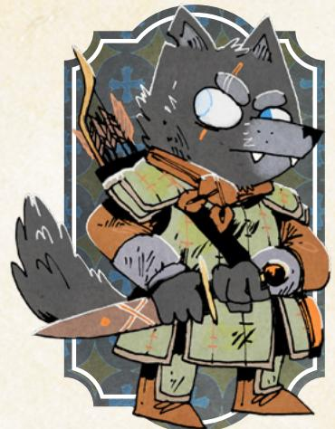

#### Charm -1

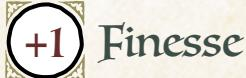

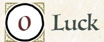

Add +1 to a stat of your choice, to a max of +2

# Weapon Skills

Choose one weapon skill to start

- Cleave
- Disarm
- Harry
- Vicious Strike

# Roguish Feats

You start with these: Hide, Sneak

Equipment Starting Value 9

# The Ranger

*You are a capable, stealthy vagabond, centered on the forests that fill the Woodland between the clearings, more interested in the wilds than in the company of other Woodland denizens or their society.*

#### Species

• fox, mouse, rabbit, bird, wolf, other

#### Demeanor

• terse, mistrusting, polite, kind

#### Details

- he, she, they, shifting
- unkempt, scarred, natural, practical
- forest charm, leafy cloak, smoking pipe, stolen ring

# Your Nature choose one

- Loner: Clear your exhaustion track when you enter a dangerous situation alone, without backup or assistance.
- Cynic: Clear your exhaustion track when you openly and directly ask dangerous questions about an accepted "truth".

# Your Drives choose two

- Discovery: Advance when you encounter a new wonder or ruin in the forests.
- Freedom: Advance when you free a group of denizens from oppression.
- Revenge: Name your foe. Advance when you cause significant harm to them or their interests.
- Protection: Name your ward. Advance when you protect them from significant danger, or when time passes and your ward is safe.

# Your Connections

See [page 51](#page-51-0) for mechanical effects of connections.

- Watcher: I was tricked, conned, or deceived by \_\_\_\_\_\_\_\_\_\_\_ once. Why do I choose to continue working with them?
- Protector: I did something that would have gotten me the enmity of a Woodland faction—if \_\_\_\_\_\_\_\_\_\_\_ hadn't covered for me. What did I do? Why and how did they protect me? Regardless, I feel indebted to them.

{146}------------------------------------------------

# Ranger Moves choose three Silent Paws You are adept at slipping into and out of dangerous situations without anyone noticing. When you *attempt a roguish feat* to sneak or hide, you can mark 2

 Slip Away

When you **take advantage of an opening to escape from a dangerous situation**, roll with Finesse. On a hit, you get away. On a 10+, choose 1. On a 7-9, choose 2:

- You suffer injury or exhaustion (GM's choice) during your escape
- You end up in another dangerous situation
- You leave something important behind

exhaustion to shift a miss to a 7-9.

On a miss, you escape, but it costs you—mark injury or exhaustion, GM's choice and you leave ample evidence behind for your foes to track and follow you.

# Poisons and Antidotes

You have expertise in the poisons and antidotes of the Woodland. When you **brew a poison**, mark depletion and say what effect you want it to have: sleep, weakness, inebriation, or death. Any poison you make requires ingestion or injection; you can use the poison on your weapon or put it in your target's food or drink. When you **study a poison or its effects to make an antidote**, the GM will tell you what special ingredient you'll need. Get the ingredient and mark 1 depletion to brew the antidote.

# Forager

When you **travel or pass into a forest**, before making any travel move, you can clear your choice of:

- Up to 3-depletion
- Up to 2-exhaustion
- Up to 2-injury

# Threatening Visage

When you **persuade an NPC** with open threats or naked steel, roll with Might instead of Charm.

# Dirty Fighter

Take two of the following weapon skills: *Trick Shot, Confuse Senses, Improvise Weapon, Disarm, Vicious Strike*. None of the skills you take with this move count against your limit.

{147}------------------------------------------------

# Background Questions

| Where do you call home?                                                                             | Why are you a vagabond?                                                                                            |
|-----------------------------------------------------------------------------------------------------|--------------------------------------------------------------------------------------------------------------------|
| " clearing " the forest                                                                    | " I dislike the hypocrisy of society " I am mistrusted by other denizens                                  |
| " a place far from here Whom have you left behind?                                            | " I want to wander the Woodland " I need to find and save a loved one " I seek escape from the wars |
| " my commander " my family " my best friend " my student                       | Which faction have you served the most? (mark two prestige for appropriate group)                            |
| " no one—I lost those who mattered to me (mark one notoriety with the faction responsible) | With which faction have you earned a special enmity? (mark one notoriety for appropriate group)              |

Solitary, dangerous, stealthy, wild. The Ranger is an experienced forestdwelling vagabond, capable of fighting and surviving in the Woodland's most dangerous spaces.

As the Ranger, you are a skilled and dangerous fighter, but your emphasis is on stealth—striking from shadows, escaping from dangerous conflicts, and more. You can handle yourself in a straight-up fight, but it's likely not your preferred form of conflict.

At heart, the Ranger is a bit more of a loner than the rest of the vagabonds, but they have found the advantages of the band drawing them in. Companionship, teamwork, shared burdens—these things will always draw the Ranger back to the band. You can play them as gruff and standoffish as you want, but remember that the Ranger belongs with the band as long as they are a PC.

Your natures, "Loner" and "Cynic," point to your antisocial behaviors. "Loner" is obviously pointed at your tendency to try to solve problems alone—keep in mind that it's going to cause you trouble, and that it's about individual situations, not leaving your band behind and journeying to another clearing altogether. "Cynic" draws attention to your desire to speak truth to power, to question assumptions of the factions and powers that be…but in ways very likely to draw the ire of those very same powers.

Lean into your connections and your fellow vagabonds. Your drives and your nature might draw you into conflicts that seem isolated, but they're always more fun when the other PCs can get involved eventually, even if they mostly end up rescuing you!

Chapter 6: Playbooks 147

{148}------------------------------------------------

#### Notes on The Ranger Moves

For *Silent Paws*, keep in mind that you will still incur a risk of the feat on a 7–9, unless you're willing to mark a third exhaustion to avoid it.

For *Slip Away*, you need an opportunity to escape, so you might need to take some action first to create that chance. If you end up in another dangerous situation, the GM establishes that situation and how it is different from what you just escaped. If you leave something important behind, the GM ultimately decides what it is.

For *Poisons and Antidotes*, any poison or antidote you make does require some time to make, along with a place to brew it. When you inflict your poison on someone, it does not take immediate effect; the more severe the effect you choose, the longer it will take to come to fruition, with death poisons taking up to a day or two to fully work. Antidotes, similarly, take some time to fully cure the poison, with more terrible poisons taking more time to cure.

For *Forager*, make your choice about what to clear before any expenditures for traveling through the forest.

For *Threatening Visage*, your threats must be believable—if you're bound to a chair, for example, you might not be able to make a believable threat.

For *Dirty Fighter*, keep in mind that whatever skills the move grants do not count against your maximum total for advancement (seven skills).

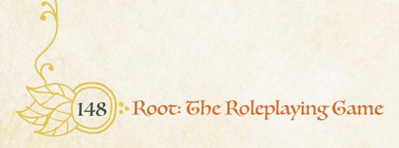

{149}------------------------------------------------

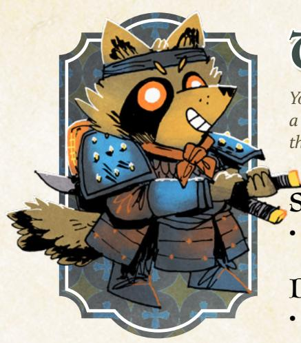

# The Ronin

*You are a skilled, willful vagabond, formerly a servant of a lord in a different land, now masterless. You came to the Woodland to live as a free vagabond.*

#### Species

• fox, mouse, rabbit, bird, racoon dog, other

#### Demeanor

• gruff, polite, direct, dangerous

#### Details

- he, she, they, shifting
- militaristic, outlandish, simple, colorful
- lord's token, mark of esteem, stringed instrument, board game

#### Charm 0

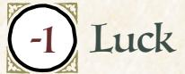

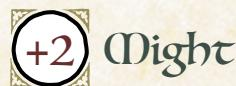

Add +1 to a stat of your choice, to a max of +2

# Weapon Skills

Choose one weapon skill to start

- Cleave
- Harry
- Storm a Group
- Vicious Strike

# Roguish Feats

You start with this one: Blindside

Equipment Starting Value 11

# Your Nature choose one

- Survivor: Clear your exhaustion track when you try to flee or cover allies' flight from a dangerous or overwhelming situation.
- Pilgrim: Clear your exhaustion track when you find an expert in a skill you don't possess.

# Your Drives choose two

- Principles: Advance when you express or embody your moral principles at great cost to yourself or your allies.
- Revenge: Name your foe. Advance when you cause significant harm to them or their interests.
- Thrills: Advance when you escape from certain death or incarceration.
- Wanderlust: Advance when you finish a journey to a clearing.

# Your Connections

See [page 51](#page-51-0) for mechanical effects of connections.

- Partner: \_\_\_\_\_\_\_\_\_\_ and I worked together on my first real task of significance in the Woodland, deposing a dangerous authority figure of a faction. Who did we depose? Why?
- Watcher: I see in \_\_\_\_\_\_\_\_\_\_\_\_ many reminders of my old master. I am drawn to them, even as I watch them carefully. What is it that reminds me of my old master? How do they feel about my watchful eyes?

{150}------------------------------------------------

#### Ronin Moves choose three Always Armed Take the weapon skill *Improvise a Weapon* (it does not count against your limit). When you deal harm with an improvised weapon, deal +1 harm. Knowing a Lord's Will When you *figure out* a denizen of status, authority, or power, roll with Might instead of Charm. When you trick a denizen of status, authority, or power by playing subordinate, roll with Might instead of Cunning. Well-Mannered When you **enter a social environment dependent on manners and etiquette**, roll with Cunning. On a 10+, hold 3. On a 7-9, hold 2. Lose all hold when you leave or when social rules fall apart. Spend hold 1-for-1 to: • Cover up a social faux pas on behalf of yourself or an ally; clear 1 exhaustion. • Call out someone else's social faux pas; inflict 1-morale harm on them. • Charm someone; take +1 ongoing to speak to them while you have hold. • Demonstrate your value; mark prestige with a powerful denizen's faction. On a miss, the rules of etiquette here are far different from what you expected; mark exhaustion as you commit a gravely impolite error. Fealty When you **commit yourself to the cause of someone you deem worthy**, swear an oath to them stating what task you will complete on their behalf. Mark exhaustion to reroll a move made in pursuit of that task. You cannot commit yourself to another cause until you accomplish the first, or break your oath. If you break your oath, fill your exhaustion track and mark 4 notoriety with the faction whose trust you betrayed. If you fulfill your oath, mark 4 prestige with the faction whose trust you kept. The Rules of War When you **call upon a reasonable foe to uphold a rule of war**, roll with Might. On a hit, they feel obliged; choose one below they must follow. On a 7-9, they choose one that you must follow; disobey, and the obligation ends. • Show mercy to surrendering foes and prisoners • Refrain from underhanded tactics in a fight • Face each other without aid, back-up, or assistance • Keep the violence away from the unarmed or innocent • Fight to surrender or subdual, without retreat

On a miss, they feel no obligation to your ideas of war; prepare for a brutal

 Always Watching

lesson in the rules they adhere to.

Take +1 Cunning (max +3).

{151}------------------------------------------------

# Background Questions

| Where do you call home?                                                                                                                                                                                                  | What happened to your last master?                                                                                                                                                               |
|--------------------------------------------------------------------------------------------------------------------------------------------------------------------------------------------------------------------------|--------------------------------------------------------------------------------------------------------------------------------------------------------------------------------------------------|
| " clearing " the forest                                                                                                                                                                                         | " assassination " unjust imprisonment                                                                                                                                                   |
| " a place far from here Why are you a vagabond?                                                                                                                                                                    | " disappearance " justified overthrow " betrayal                                                                                                                                  |
| " I want to build a masterless life " I seek a cause to redeem myself " I aim to bring a hunted foe to justice " I am hunted by old foes " I need freedom to fulfill my master's last wish | Which faction have you served the most? (mark two prestige for appropriate group) With which faction have you earned a special enmity? (mark one notoriety for appropriate group) |

Well-trained, willful, expatriate, free. The Ronin is a former servant and warrior of some master in a land far from here, now broken from their lord and come to this land as a free agent.

As the Ronin, you are quite a capable fighter, but you're also a social character—a "servant" well used to figuring out the vagaries of the court, the needs of a lord, and the ways of propriety. You're at home both on the battlefield and in the halls of power.

The Ronin, by definition, is originally from somewhere other than the Woodland. They left that life behind with the demise of their master—one of the background questions on the playbook is all about what happened to that master. As such, the Ronin has a different cultural background with different traditions and ideas than a Woodland denizen.

That said, the Ronin is still a denizen like the other characters. They have the same overarching drives and desires. And the Ronin certainly has been in the Woodland long enough to be able to easily function there, though NPCs recognizing the Ronin's background and treating them differently can make for dramatic trouble (if everyone at the table is on board with those issues coming to the fore).

In playing a Ronin, be sure to avoid some of the pitfalls of playing a character of a different culture—no accents, no silly misunderstandings about commonplace objects, no broken grammatical constructions. The Ronin is competent and capable, and they've learned how to navigate the Woodland.

{152}------------------------------------------------

Your natures point you at two different styles of wandering Ronin in the Woodland. The first, "Survivor," is all about getting into big dangerous situations with friends, and then helping them get out. Note—you don't have to escape for Survivor to trigger. You just have to help your allies escape. The second, "Pilgrim," is all about learning. Seek out interesting new denizens and try to learn from them—you'll forge new bonds and maybe pick up a thing or two!

Either way, play into your "search for a master." The Ronin's past was defined by their relationship to their master. Whether they struggle to be free of that past, or whether they will happily commit to a new lord, the conflict creates an interesting path for the Ronin to follow.

#### Notes on The Ronin Moves

For *Well-Mannered*, any more formal or proper setting would be appropriate to the move, but there might be some strange cases that also count—a thieves' guild with a lot of intricate rules on action and hierarchy might count, for example. For each of the options when you spend hold, make sure you actually describe what happened, what faux pas you called out, or which character you charmed (and how).

For *Fealty*, when you swear the oath and declare your task, make sure you declare a bounded task, something with a finite and clear condition under which it has been accomplished. "Defend Hoproot" is unbounded—it could go on forever—but "Defend Hoproot from the upcoming Redclaw Platoon attack" is specific and clear. "Breaking your oath" can happen whenever you feel appropriate, but it should be clear to everyone—you have broken your oath, and there is no trying to fulfill it later. And the notoriety and prestige you earn for breaking or fulfilling your oath are in addition to any other notoriety or prestige you might earn through those actions.

For *The Rules of War*, your foe must be "reasonable"—if they are raging, or if they are unlikely to follow any rules of conflict at all, then they don't qualify. If your opponent feels "obliged" to follow a rule, it means they must follow it and cannot take any action contrary to the rule.

{153}------------------------------------------------

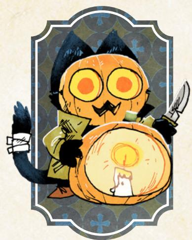

# The Scoundrel

*You are a lucky, dangerous vagabond, acting more as destroyer and troublemaker than anything else, perhaps creating chaos and destruction for its own sake.*

#### Species

• fox, mouse, rabbit, bird, cat, other

#### Demeanor

• shifty, slimy, straightforward, naive

#### Details

- he, she, they, shifting
- suspicious, impoverished, fleabitten, scarred
- full face mask, mousesteel spark lighter, overly large coat, sulphurous pouches

#### Charm +1

Cunning -1

Finesse

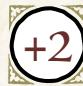

Luck

Might

Add +1 to a stat of your choice, to a max of +2

# Weapon Skills

Choose one weapon skill to start

- Confuse Senses
- Improvise
- Quick Shot Vicious Strike

# Roguish Feats

You start with these: Acrobatics, Sneak, Hide

Equipment Starting Value 8

#### Your Nature choose one

- Arsonist: Clear your exhaustion track when you use needlessly destructive or damaging methods to solve a problem.
- Combative: Clear your exhaustion track when you try to start a fight against overwhelming opposition.

# Your Drives choose two

- Chaos: Advance when you topple a tyrannical or dangerously overbearing figure or order.
- Thrills: Advance when you escape from certain death or incarceration.
- Crime: Advance when you illicitly score a significant prize or pull off an illegal caper against impressive odds.
- Infamy: Advance when you decrease your reputation with any faction.

# Your Connections

See [page 51](#page-51-0) for mechanical effects of connections.

- Friend: \_\_\_\_\_\_\_\_\_\_\_\_ and I once met and pulled off a mad, impossible stunt together. What did we do? Why?
- Partner: \_\_\_\_\_\_\_\_\_\_\_\_ and I destroyed a faction's resource, on behalf of an opposing faction. Why?

{154}------------------------------------------------

#### Scoundrel Moves choose three Explosive Personality When you *wreck something* with flagrantly dangerous means (explosives, uncontrolled flame, etc.), roll with Luck instead of Might. Create to Destroy When you **use available materials to rig up a dangerous device**, roll with Finesse. On a hit, you cobble together something that will do what you want, one time. On a 10+, choose one. On a 7-9, choose two. The device is: • more dangerous than intended • larger or more unwieldy than intended • more temperamental and fragile than intended On a miss, you need some vital component to finish it; the GM will tell you what. It's a Distraction! You gain the roguish feat *Blindside* (it does not count against your limit). When you *attempt a roguish feat* to blindside someone while they are distracted by environmental dangers (a raging fire, an oncoming flood, etc.), roll with Luck instead of Cunning. Daredevil You're at your luckiest when you go into danger without hesitation. When you **dive into a dangerous situation without forethought or planning**, treat yourself as having "Luck Armor," with 1 box of wear (remember, armor is only "destroyed" when you would mark another box of wear, and all its boxes are full). The "Luck Armor" automatically goes away once the danger has passed, and the next time you would have "Luck Armor," you gain it as if it was brand new with clear boxes.

#### Danger Mask

You have a mask or outfit you wear when you go about your most destructive work—more of a calling card, an identifier of "the real you," than a disguise. Treat it as a piece of equipment with two boxes of wear. While you have your mask on, any notoriety you gain is doubled, any prestige you gain is halved, and take +1 to *trust fate* and all Scoundrel playbook moves. If your mask is ever taken from you, mark exhaustion. If your mask is ever destroyed, mark 4-exhaustion. If your mask is destroyed, you can make a new mask when time passes.

#### Better Lucky than Good

When you **use a weapon move (basic or skilled)**, mark exhaustion to roll with Luck instead of the listed stat.

{155}------------------------------------------------

# Background Questions

| Where do you call home?                                                                                                                                                                                            | Whom have you left behind?                                                                                                                                                                                              |
|--------------------------------------------------------------------------------------------------------------------------------------------------------------------------------------------------------------------|-------------------------------------------------------------------------------------------------------------------------------------------------------------------------------------------------------------------------|
| " clearing " the forest " a place far from here Why are you a vagabond?                                                                                                                          | " my teacher " my family " my loved one " my only defender                                                                                                                                         |
| " I am on the run for a destructive crime " I seek vengeance for my suffering " I wish to defeat a faction " I am mistrusted by other denizens " I want to be free from society's bonds | " my best friend Which faction have you served the most? (mark two prestige for appropriate group) With which faction have you earned a special enmity? (mark one notoriety for appropriate group) |

Destructive, risky, wild, mischievous. The Scoundrel is a stealthy destroyer, an arsonist, rebel, and agent of chaos in a mask.

As the Scoundrel, you're a troublemaker, for good and for ill. You can cause a lot of trouble for tyrants and oppressors, but you'll create just as much trouble for your comrades. That's okay, though—your high Luck means you're just about as good as can be expected at getting out of those sticky situations you create.

The Scoundrel might have a bit of a tendency to be antisocial with the rest of the vagabonds—if they grow too frustrated with the way you blow up situations and use dangerous and extreme solutions, then the other vagabonds might want to part ways with the troublemaker. You should make liberal use of the *pleading* to get the other PCs to go along with your plans, and you should play hard into your connections—you've got a friend and a partner at least, and those positive relationships should help make up for your mischief!

That said, when playing a Scoundrel, be sure that you don't create meaningless chaos (at least, not often). Even if you have the Chaos drive, you're actually after a particular goal, not just chaos for its own sake. Play towards your goals, towards accomplishing ends—even if you tend to blow things up along the way, it's more fun if the explosions are purposeful.

Your natures both point at your troublemaking essence. If you're an "Arsonist," then you have incentive to cause more destruction than necessary in accomplishing your ends. If you're "Combative," then you have incentive to start fights you probably can't win. In both cases, you're going to cause a LOT of trouble to get back your exhaustion. The more you can get buy-in from your fellow vagabonds before things explode, the better.

Chapter 6: Playbooks 155

{156}------------------------------------------------

But when the time comes, don't hesitate to hit your moves and blow stuff up. The Scoundrel is a fun playbook because of the trouble it creates—it's not a playbook for playing it safe, no matter what your pals think!

# Notes on The Scoundrel Moves

For *Explosive Personality*, "flagrantly dangerous" means "obviously dangerous to more than just the thing you're wrecking." A giant badger might convince himself he can bend the bars of his cell without breaking the walls. But when the Scoundrel uses a "flagrantly dangerous" barrel of explosives, no one is under that misapprehension.

For *Create to Destroy*, you are limited by available resources. You can't build a bomb if you have nothing to build a bomb with! That said, marking depletion is a great way to get some supplies you otherwise don't have around you, and you can have fun coming up with inventive and weird combinations for a dangerous device. Don't worry about the science! Just know that you need something to make a bomb. But remember that all of the choices in the move mean that the dangerous device doesn't operate as intended, at some level.

For *Daredevil*, the box of "Luck Armor" is independent of all your other armor. When it "goes away" once the danger has passed, you don't have to transfer the marked wear to anything else—it's as if you had temporary extra wear.

For *Danger Mask*, the mask doesn't create a totally separate identity. You'd have to spend extra effort, likely tricking watchers, to pin the blame for your actions on a completely different person than yourself—denizens can tell that the tabby cat is still probably the tabby cat, even when they're wearing a piece of pumpkin on their face. The objective isn't to hide your deeds, but to adopt a troublemaking demeanor to give yourself a boost, and to let everyone else know that you're in danger mode!

{157}------------------------------------------------

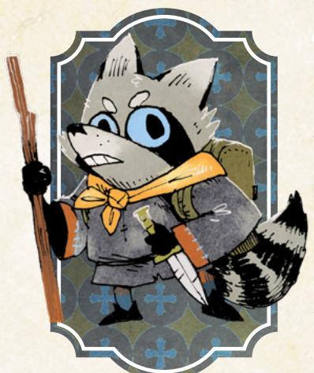

# The Thief

*You are a cunning, criminal vagabond, capable of stealing even the most well-guarded treasures, perhaps committed to crime and theft for its own sake.*

#### Species

• fox, mouse, rabbit, bird, racoon, other

#### Demeanor

• fast-talking, quiet, angry, friendly

#### Details

- he, she, they, shifting
- worn, fidgety, inconspicuous, flamboyant
- black cape, large bag, old broken weapon, stolen scarf

#### Charm 0

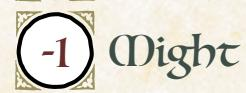

Add +1 to a stat of your choice, to a max of +2

# Weapon Skills

Choose one weapon skill to start

- Confuse Senses
- Improvise
- Parry
- Trick Shot

# Roguish Feats

Choose any four roguish feats to start [\(page 69\)](#page-69-0)

Equipment Starting Value 6

#### Your Nature choose one

- Kleptomaniac: Clear your exhaustion track when you try to selfishly steal something valuable or important.
- Rebellious: Clear your exhaustion track when you grievously insult, defy, or anger figures of authority.

# Your Drives choose two

- Freedom: Advance when you free a group of denizens from oppression.
- Greed: Advance when you secure a serious payday or treasure.
- Ambition: Advance when you increase your reputation with any faction.
- Thrills: Advance when you escape from certain death or incarceration.

# Your Connections

See [page 51](#page-51-0) for mechanical effects of connections.

- Professional: I stole something important, something needed or craved, for \_\_\_\_\_\_\_\_\_\_\_. I proved my worth to them.
- Friend: \_\_\_\_\_\_\_\_\_\_\_\_ sprang to get me out of holding, whether they bailed me out or rescued me. I owe them.

{158}------------------------------------------------

#### Thief Moves choose three Breaking and Entering When you *attempt roguish feats* to get into or out of a place you've previously been, you can mark exhaustion to make the move as if you had rolled a 10+, instead of rolling. Disappear Into the Dark When you **slip into shadows while unnoticed**, mark exhaustion and hold 1. As long as you remain quiet, move slowly, and hold 1 for this move, you will remain hidden. If you inadvertently reveal yourself, lose your hold. Spend your hold to reveal yourself from a darkened place, suddenly and without warning. If you attack someone immediately after spending the hold, take +3 on the roll. Rope-a-Dope When you **evade and dodge your enemy so as to tire them out**, roll with Finesse. On a hit, you can mark exhaustion to make them mark 2-exhaustion. On a 10+, you can mark exhaustion to make them mark 3-exhaustion. On a miss, they catch you in the middle of a dodge—you're at their mercy. Small Hands When you **grapple** with an enemy larger than you, roll with Finesse instead of Might. On a miss, they overpower you—you're at their mercy. Master Thief Take +1 Finesse (max +3). Nose for Gold When you *figure someone out*, you can always ask (even on a miss):

• what is the most valuable thing they are carrying?

When you *read a tense situation*, you can always ask (even on a miss):

• what is the most valuable thing here?

{159}------------------------------------------------

# Background Questions

| Where do you call home?                                                                                                                                 | Whom have you left behind?                                                                            |
|---------------------------------------------------------------------------------------------------------------------------------------------------------|-------------------------------------------------------------------------------------------------------|
| " clearing                                                                                                                                           | " my partner-in-crime                                                                              |
| " the forest                                                                                                                                         | " my family                                                                                        |
| " a place far from here                                                                                                                              | " my loved one                                                                                     |
| Why are you a vagabond?                                                                                                                                 | " my protector " my benefacor                                                                |
| " I have no better way to get food, water, shelter, and money " I am on the run from "associates" " I am mistrusted by other denizens | Which faction have you served the most? (mark two prestige for appropriate group)               |
| " I am pursuing a treasure " I am being hunted by a powerful official                                                                       | With which faction have you earned a special enmity? (mark one notoriety for appropriate group) |

Crafty, professional, nimble, quiet. The Thief is the ultimate criminal, taking whatever valuables they can grab from any treasure room, vault, or safe, no matter how secure.

As the Thief, you are likely the single best vagabond in your band with regard to roguish feats. Your high Finesse and your four chosen roguish feats make you more than capable of shoring up any gaps in your band's skill set or solving problems through illicit action. You should be looking for ways to bring your skills to bear and solve problems.

You're not in trouble when it comes to fights—you are a vagabond, after all but by default, you'd likely prefer to solve things through stealth and guile. That said, part of the push-pull in the playbook is that your fellow vagabonds aren't going to be able to follow you into every place you sneak. The more you can create opportunities for your fellows to follow by opening doors, leaving ropes out open windows, and so on, the more you can rely on them when a fight (inevitably) breaks out.

Your general skill set is about getting through trouble stealthily, without calling attentions, so your natures instead push you to cause some problems for yourself. That's great! Embrace the trouble you get into by selfishly stealing things and grievously insulting authority figures.

Your natures—"Kleptomaniac" and "Rebellious"—are both likely to get you into hot water. "Selfishly steal something" always means that you're stealing something you want, and something likely to cause you and yours trouble, instead of stealing something that you and your whole band have agreed is

{160}------------------------------------------------

necessary. Similarly, "grievously insult, defy, or anger" means that whatever you do, you're pretty much guaranteed the authority figure will react—if you haven't taken enough action that they react, then you haven't hit the trigger.

At its heart, the Thief is a pretty direct, simple playbook—steal stuff and get away with it!—but you provide real utility to the rest of your band. So pay attention to their goals and desires, too. Much of the time, they'd love to have your help picking locks, sneaking into places, and nabbing vital treasures. You get to show off and help a friend!

#### Notes on The Thief Moves

For *Breaking and Entering*, think about the move like casing the joint before you break in later. The more you can get someone to let you inside during the daylight, the more easily you'll be able to get back in that night!

For *Disappear into the Dark*, you could use the move either instead of hiding or sneaking, or to further capitalize on those roguish feats. It costs you exhaustion, but guarantees you remain hidden for as long as you act carefully and stay quiet. That might put a limit on how far you can move, or what you can do while hidden—you might inadvertently reveal yourself when you try to climb a wall, for example, as a risk of the roguish feat. But you can always spend your hold to suddenly appear from a shadow if there were any reasonable way you might have reached that shadow after disappearing.

For *Rope-a-Dope*, as long as you describe yourself ducking, dodging, and weaving, you've triggered the move.

For *Small Hands*, the size difference between you and your enemy must be noticeable—if they're an inch taller, then the move wouldn't apply. If they're half a foot taller, or they weigh half again as much as you, then the move triggers.

For *Nose for Gold*, the value of the object is with reference to you. It might always be just about the item's Value in terms of the game—something worth more coin. But the GM can also tell you about a valuable object that you would consider especially valuable for whatever reason.

{161}------------------------------------------------

# The Tinker

*You are an adept, clever vagabond, interested in mechanisms and craftsmanship, perhaps possessed of ideas that separate you from those around you.*

#### Species

• fox, mouse, rabbit, bird, beaver, other

#### Demeanor

• hopeful, cheerful, inquisitive, cynical

#### Details

- he, she, they, shifting
- scattered, organized, grubby, singed
- eccentric tool belt, beautiful whetstone, former patron's insignia, massive packs

#### Charm -1

Add +1 to a stat of your choice, to a max of +2

# Weapon Skills

Choose one weapon skill to start

- Cleave
- Harry
- Improvise
- Trick Shot

# Roguish Feats

You start with these: Counterfeit, Disable Device, Pick Lock

Equipment Starting Value 8

| Your Nature choose one |  |  |  |
|------------------------|--|--|--|
|------------------------|--|--|--|

- Perfectionist: Clear your exhaustion track when you replace someone else's existing tool or resource with something truly great.
- Radical: Clear your exhaustion track when you espouse dangerous ideas to the wrong audience.

# Your Drives choose two

- Greed: Advance when you secure a serious payday or treasure.
- Ambition: Advance when you increase your reputation with any faction.
- Revenge: Name your foe. Advance when you cause significant harm to them or their interests.
- Protection: Name your ward. Advance when you protect them from significant danger, or when time passes and your ward is safe.

# Your Connections

See [page 51](#page-51-0) for mechanical effects of connections.

- Professional: \_\_\_\_\_\_\_\_\_\_\_\_ and I have been working together well for a while. We read each other's moves easily.
- Family: \_\_\_\_\_\_\_\_\_\_\_\_\_ and I had each other's back when we were run out of a clearing because our natures got out of hand.

{162}------------------------------------------------

#### Tinker Moves

YOU GET TOOLBOX & REPAIR, THEN CHOOSE ONE MORE

#### **▼** Goolbox

You have a kit of tools and supplies with which you work on long-term projects. Choose two features:

assorted scrap wood, assorted gears and springs, esoteric hand tools, manuals, assorted medicines, portable alchemy kit, sewing kit, cookware, minor explosives Choose one drawback:

heavy (counts as 2 Load instead of 1), bulky & obvious, stolen, fragile

When you open up your toolkit and dedicate yourself to making a thing or to getting to the bottom of something, decide what and tell the GM. The GM will give you between I to 4 conditions you must fulfill to accomplish your goal, including time taken, materials needed, help needed, facilities/tools needed, or the limits on the project. When you accomplish the conditions, you accomplish the goal.

#### Repair Repair

When you repair destroyed personal equipment with your toolbox, the GM will set one condition as per the toolbox move. Fulfill it, and clear all wear for that equipment. When you repair damaged personal equipment with your toolkit, you do it as long as you spend depletion or value, I for I, for each box of wear you clear.

#### ☐ Big Pockets

Take two extra boxes of depletion.

#### ☐ Jury Rig

When you create a makeshift device on the fly, roll with Cunning. On a hit, you create a device that works once, then breaks. On a 10+, choose one:

- It works exceptionally well
- You get an additional use out of it

On a miss, the device works, but it has an unintended side effect that the GM will reveal when you use it.

#### □ Nimble Mind

When you *attempt roguish feats* involving mechanisms or locks, mark depletion to roll with Cunning instead of Finesse.

#### ☐ Dismantle

When you dismantle a broken or disabled piece of equipment or machinery, clear 2-depletion.

{163}------------------------------------------------

# Background Questions

| Where do you call home?                                                                                                                                                                                                            | Whom have you left behind?                                                                                                                                                                       |
|------------------------------------------------------------------------------------------------------------------------------------------------------------------------------------------------------------------------------------|--------------------------------------------------------------------------------------------------------------------------------------------------------------------------------------------------|
| " clearing " the forest " a place far from here Why are you a vagabond?                                                                                                                                          | " my mentor " my family " my best friend " my loved one " my leader                                                                                                   |
| " I refuse to keep my ideas to myself " I need to rebuild my workshop anew in a safe place " I crave adventure " I need to find and save my family " I need to keep my most dangerous design safe | Which faction have you served the most? (mark two prestige for appropriate group) With which faction have you earned a special enmity? (mark one notoriety for appropriate group) |

Genius, awkward, incautious, inventive. The Tinker is an incredibly capable maker and mechanic, solving problems through devices and clever…well…tinkering.

The Tinker is more than a crafter or a smith—they're a true wonder with mechanics, and they're able to string up all manner of equipment and devices with base supplies. Compared to most clearings' smiths and crafters, the Tinker is practically a wizard.

Between the Tinker's Toolbox and Repair moves, they are oriented more towards longer-term goals and objectives than nearly any other playbook. In practice, that means the Tinker's projects will often be the spur for the PCs to take action; the Tinker needs the other vagabonds' help to get the materials they need, or to secure a meeting with the Royal Engineer of the Marquisate, or whatever the case may be.

The Tinker's natures point at their potentially strange, "exile-worthy" beliefs in ways that prompt them to action. A "Perfectionist" Tinker can get in trouble when they help the wrong denizens. And a "Radical" Tinker might try to improve minds as well as materials and wind up saying the wrong thing to the wrong crowd, for example suggesting that monarchy might not be the greatest governmental system to a room full of Eyrie nobles.

The Tinker absolutely needs the other vagabonds in the band to support them. The Tinker is far from incompetent (like all vagabonds), but unlike some other vagabonds the Tinker is no match for a troop of armed soldiers on their own. Fortunately, every other vagabond will love having a Tinker around to repair their equipment and sometimes even arm them anew.

{164}------------------------------------------------

#### Dotes on The Tinker Moves

For *Toolbox*, your features are mostly about limiting the conditions the GM might set for you, while most of your drawbacks are about creating more problems for you in the fiction, outside of this move.

- "Dedicate yourself to making a thing or to getting to the bottom of something" means that either you are trying to create a new device, or you are trying to answer some question, performing experiments or examinations to learn difficult-to-obtain information. The conditions the GM gives you are always in direct relation to what you set out to do. A relatively simple device or question might have only a single condition, while an incredibly complicated, rare, or special device might take four conditions to create.
- "Time taken" means the GM tells you how long the work will take; you need a safe space to work for that time, and new events may occur while you're busy.
- "Materials needed," "help needed," and "facilities/tools needed" focus on additional resources or aid of a specialized nature that you need to accomplish your goal. Obtain those resources or aid and you fulfill the condition.
- "The limits on the project" means the GM can tell you how you can't quite manage the full extent of what you had asked for; if you want to build a fully functional sentient wooden robot, the GM might tell you that the limit is creating only a clockwork automaton, not really a robot. Accept the limit, and the condition is satisfied.

For *Big Pockets*, these two extra boxes of depletion do not count against the maximum (six total) you can get through normal advancement.

For *Jury Rig*, you still need materials to construct your makeshift device. The GM might ask you to mark depletion if the materials are not available in your environment. You're also limited by what makes sense based on those materials. If you use a makeshift device, then it usually just works, no additional move necessary; only in extremely uncertain circumstances should the GM ask you to make another move to see what happens. You cannot make out-and-out weapons (like swords or bows) with this move, though you could make mechanisms to blow down doors or walls.

For *Nimble Mind*, remember the stat swap is for any roguish feat attempted using a mechanism or lock, not just pick lock or disable device. For example, if you're trying to *attempt a roguish feat* and fling yourself into the air using a chandelier's winching mechanism and ropes, then you could roll with Cunning instead of Finesse. Though you do still need to have the feat marked—otherwise you're *trusting fate*!

For *Dismantle*, taking apart a piece of equipment takes a bit of time, but you can take apart everything from a broken cart to a smashed door if you aren't in a rush.

{165}------------------------------------------------

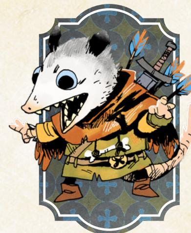

# +2

Charm

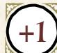

Cunning

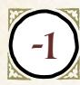

Finesse

Luck

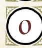

Might

Add +1 to a stat of your choice, to a max of +2

# Weapon Skills

Choose one weapon skill to start

- Harry
- Improvise
- Quick Shot
- Vicious Strike

#### Roguish Feats

You start with these: Pick Lock, Sleight of Hand

Equipment Starting Value 9

# The Vagrant

*You are a charming, survivor vagabond, using words to get out of dangerous situations, perhaps even setting possible predators upon each other to keep them away from yourself.*

#### Species

• fox, mouse, rabbit, bird, opossum, other

#### Demeanor

• excited, low key, thoughtful, angry

# Details

- he, she, they, shifting
- mangy, wild, patchwork, inconspicuous
- stolen military insignia, tattered cloak, luck charm, gambling paraphernalia

#### Your Nature choose one

- Glutton: Clear your exhaustion track when you overindulge on vices like drink, food, and gambling.
- Hustler: Clear your exhaustion track when you try to spring a con on a powerful or dangerous mark.

# Your Drives choose two

- Chaos: Advance when you topple a tyrannical or dangerously overbearing figure or order.
- Thrills: Advance when you escape from certain death or incarceration.
- Clean Paws: Advance when you accomplish an illicit, criminal goal while maintaining a believable veneer of innocence.
- Wanderlust: Advance when you finish a journey to a clearing.

# Your Connections

See [page 51](#page-51-0) for mechanical effects of connections.

- Family: After \_\_\_\_\_\_\_\_\_\_\_\_ and I pulled off an impressive heist and stole something very valuable from a powerful faction, my bad choices landed me in dire straits. But they bailed me out, and we've been close ever since.
- Watcher: \_\_\_\_\_\_\_\_\_\_\_\_ saw through one of my cons, and turned it back on me. How? Why did we forgive each other?

{166}------------------------------------------------

#### Vagrant Moves choose three Instigator When you *trick an NPC* into fighting another NPC, you can remove one option from the 7-9 list—they cannot choose that option instead of doing what you want. Pleasant Facade When you **suck up to or otherwise butter up an unsuspecting NPC**, roll with Charm. On a 10+, hold 3. On a 7-9, hold 2. Spend your hold 1 for 1 to deflect their suspicion or aggression away from you onto someone or something else. On a miss, your attempts at flattery are suspicious—they're going to keep their eye on you. Desperate Smile When you *trust fate* to see you through by begging, pleading, or abasing yourself, roll with Charm instead of Luck. Charm Offensive When you **play upon an enemy's insecurities, concerns, or fears to distract them with words during a fight**, roll with Cunning. On a hit, you create an opening for yourself—make any available weapon move against them at +1, or strike quickly and deal injury to them. On a 7-9, you also tick them off; they aren't listening to you anymore, no matter what you do, until the situation drastically changes. On a miss, you infuriate them—they come at you, hard, and you're not prepared. Let's Play When you **play a game of skill and wit to loosen another's tongue**, roll with Charm. On a hit, they let slip something useful or valuable. On a 7-9, you have to lose the game to get them there; mark one depletion. On a miss, they're better than you ever thought; either mark one depletion and cut your losses, or mark three depletion and they'll start talking. Pocket Sand

Take the weapon skill *Confuse Senses* (it does not count against your limit). When you **throw something to confuse an opponent's senses at close or**

**intimate range**, roll with Cunning instead of Finesse.

{167}------------------------------------------------

# Background Questions

| Where do you call home?                                                                                                   | Whom have you left behind?                                                                            |
|---------------------------------------------------------------------------------------------------------------------------|-------------------------------------------------------------------------------------------------------|
| " clearing " the forest " a place far from here                                                            | " my partner in crime " my family " my loved one                                       |
| Why are you a vagabond? "                                                                                              | " my boss " my best friend                                                                   |
| I am being hunted by a powerful vagabond " I can't settle down with the denizen I truly love                  | Which faction have you served the most? (mark two prestige for appropriate group)               |
| " I seek to depose corrupt and dangerous leaders " I feel deep wanderlust " I am on the run for my lies | With which faction have you earned a special enmity? (mark one notoriety for appropriate group) |

Deceitful, tricksy, charming, social. The Vagrant is a consummate con artist, a trickster and huckster who gets their way by sweet-talking and lying past trouble.

The Vagrant is a bit like the Adventurer meets the Thief—a charismatic talker who relies on deception for survival and for gain. They are likely to try to push to the front of the band whenever talking (and especially whenever lying) is involved. As the campaign progresses, however, they might find themself in a tight spot. Their lies generally won't lead to prestige gains with the deceived faction, so at some point, the Vagrant should probably pick one faction they're not going to con left and right…unless, of course, they're okay being on every faction's bad side.

As with all vagabonds, the Vagrant works best in the "has a heart of gold" mode. If the Vagrant has no shame about deceiving anyone and everyone, including innocents and victims of oppressors, then they're going to become unlikable fast. Testing the boundaries of how far the Vagrant will go to land their tricks is part of the character development of the playbook, and a Vagrant player should almost always have some limit to how far they will go.

The Vagrant's "Hustler" nature feeds into the core activity of the Vagrant conning people—but makes it messy by forcing the Vagrant to target denizens who are too dangerous to safely and easily trick. It's a good nature for the Vagrant whose reach exceeds their grasp. The "Glutton" nature, on the other hand, is a nature for the carousing, good-natured, vice-driven Vagrant. Overindulging any vice will always cause trouble, but at least a Vagrant who spreads the wealth might make a friend or two while having a good time.

Chapter 6: Playbooks 167

{168}------------------------------------------------

While the Vagrant is very much a trickster, they don't really get away with tricking their fellow vagabonds. They might try from time to time, but they don't have a move to deceive a PC, and there will always be at least one PC their Watcher connection—who can see past any attempted deception. When playing the Vagrant, keep in mind that your fellow vagabonds exist in a different state than the rubes you usually trick; they're not nearly so easily misled, and that's probably why they make worthy companions.

#### Notes on The Vagrant Moves

For *Instigator*, keep in mind that even on a 7–9, the GM might still choose that the NPC falls for your trick. You're best off removing the most likely option for the NPC to choose so that they're more likely just to fall for your trick than to choose a different, highly unbecoming option from the list.

For *Pleasant Facade*, think of the move as providing a kind of social armor. Once you have hold, you can spend it to ameliorate misses and 7–9 results as you try to *trick* or *persuade* them further.

For *Charm Offensive*, you have to know your enemy's insecurities, concerns, or fears to play upon them, so this move will often be preceded by *figuring them out*. On a 7–9, they're not listening to you anymore—you can't *persuade* them, can't *trick* them by talking to them, and definitely can't use *Charm Offensive* on them again.

For *Let's Play*, the depletion you're marking represents bets you're losing in the effort to loosen the tongues of your marks. This move isn't just for winning a game of chance; it's for using gambling to get your targets to talk.

{169}------------------------------------------------

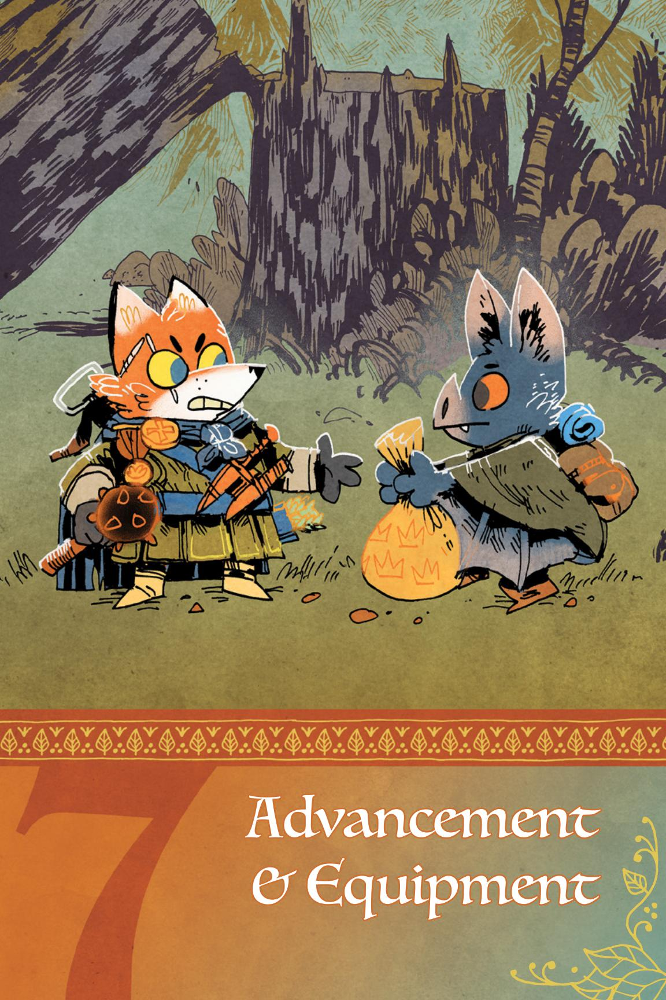

{170}------------------------------------------------

characters, a set of adventurers, mercenaries, criminals, and heroes (maybe) who are already adept at feats the average Woodland denizen could not possibly match. But as they pursue their drives, fulfill contracts, and otherwise take action across the Woodland, they will inevitably grow and change.

This chapter is about two significant modes of change—advancement and equipment. As vagabonds fulfill their drives, they earn advances that directly improve their capabilities. And as they earn more money or obtain valuable objects, they can spend those resources to get better equipment, further increasing their capabilities. In this chapter, you'll find all the rules about both of those kinds of change.

You'll also find additional rules for changes to your character to reflect alterations in their drives or nature, rules for making a new character altogether, and a set of pre-generated equipment you can easily use throughout your game.
