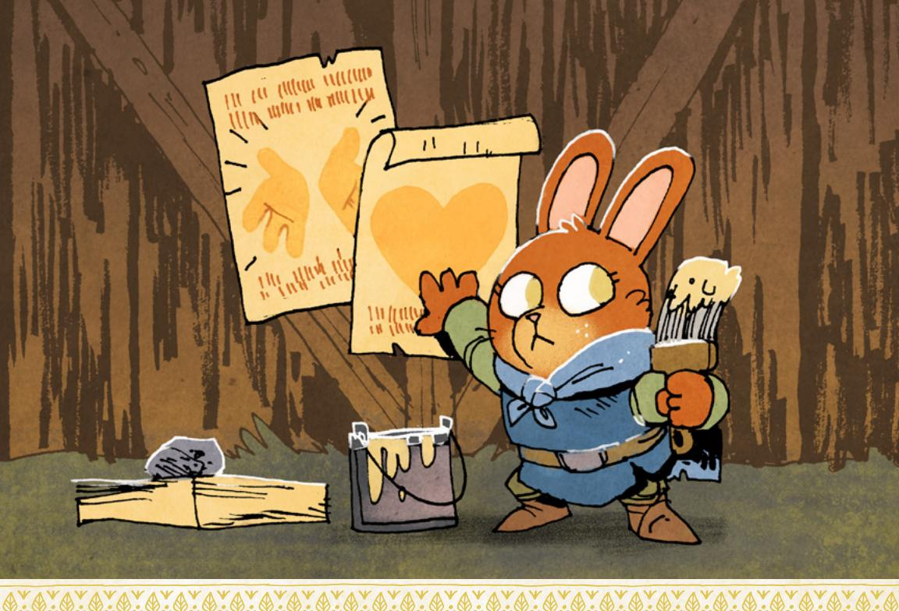
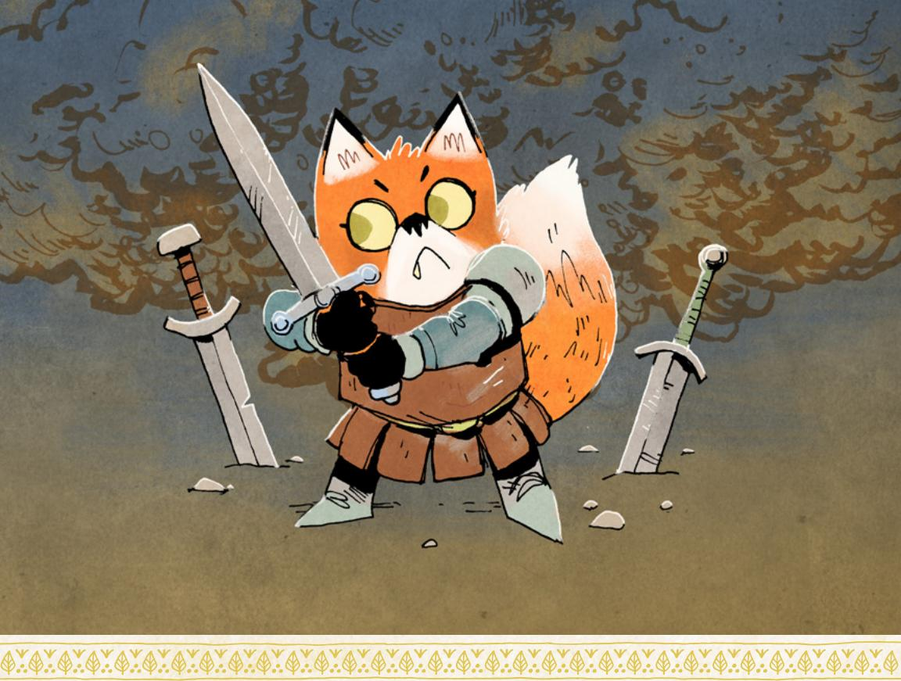
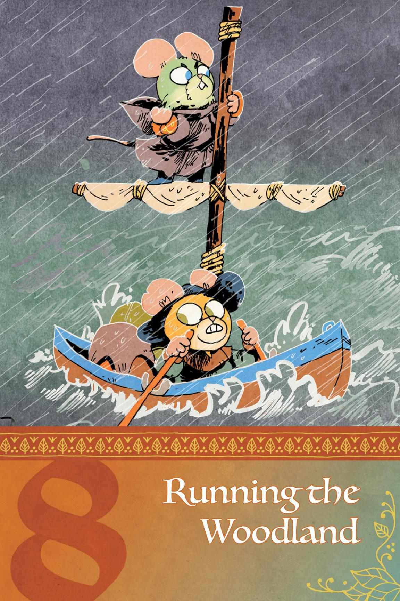
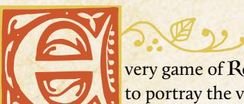
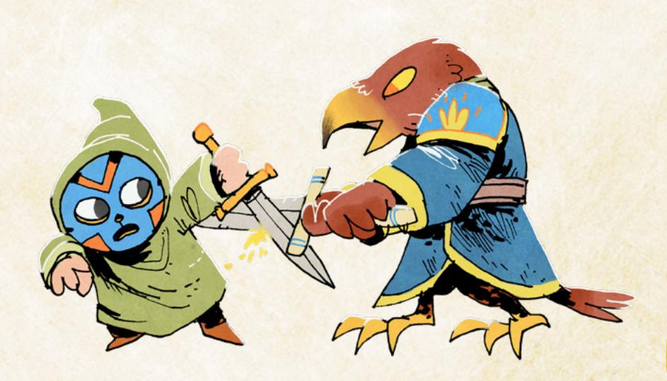
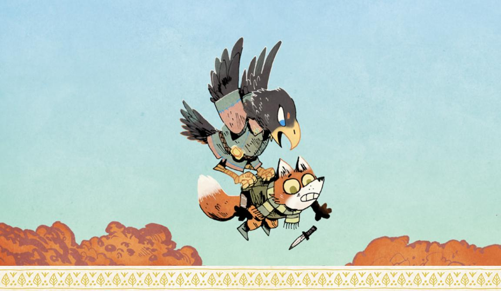
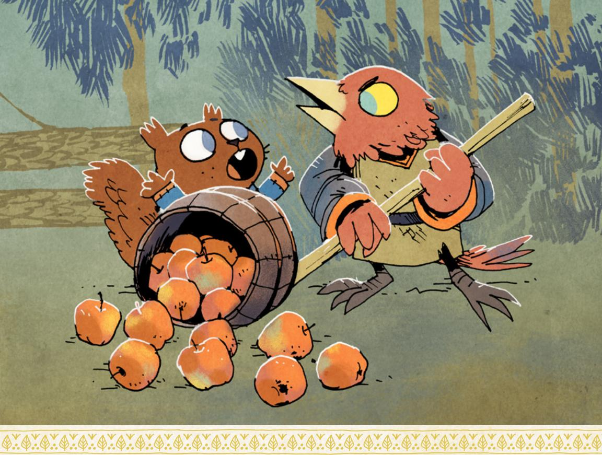
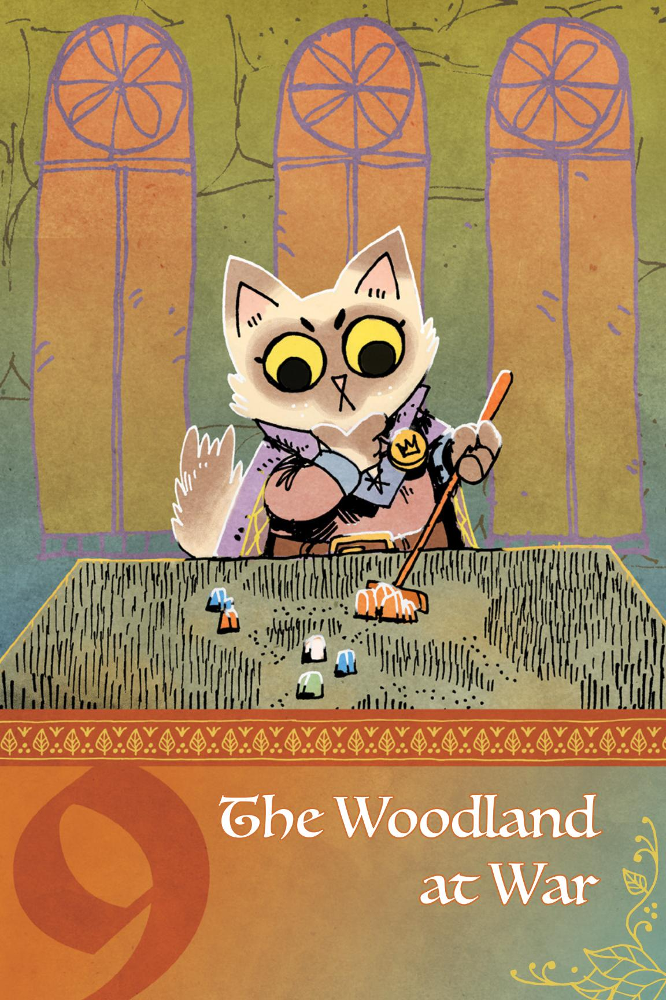

# Advancement

"Advancements" in Root: The RPG are explicitly the rewards for a vagabond who pursues their drives (see page 49 for more on drives.)

# Earning Advancements

A vagabond can earn one advancement each session for each drive they fulfill. That means in any given session of play, a vagabond might earn two advancements at most—one for each drive. Vagabonds cannot earn more than one advancement per drive per session.

The conditions for fulfilling a drive are described on each playbook in the Drives section. While any given playbook might have a different set of drives, every playbook pulls from the same overall pool.

A PC advances just as soon as they fulfill the condition of the drive. At the end of each session, GMs and players should go around and see if anybody fulfilled a drive but just missed it; if they did (and they haven't advanced for that drive already), they can advance then, at the end of the session.

べいのことにある。これではいい「命」という

{171}------------------------------------------------

Here are all the drives with a bit of additional detail and explanation:

#### Ambition

*Advance when you increase your Reputation with any faction.*

Your Reputation is the number, not simply prestige boxes. The actual value of your Reputation has to go up. You advance for any time your Reputation with any faction goes up (although again, only once per session). Whether your Reputation moves from –3 to –2 or +2 to +3, it still counts.

#### Chaos

*Advance when you topple a tyrannical or dangerously overbearing figure or order.*

"Topple" means that the figure or order has been deposed, removed from power, at least temporarily (it doesn't always have to be permanent). Who or what qualifies as a "dangerously overbearing figure or order" is a matter of discussion between players and GM, with the GM having the final call.

#### Clean Paws

*Advance when you accomplish an illicit, criminal goal while maintaining a believable veneer of innocence.*

An "illicit, criminal goal" should be a goal that any force of law and order in the area would frown upon. "A believable veneer of innocence" means that, by and large, most denizens aware of the crime have no reason to blame you. Maybe they are suspicious of you, but they definitely don't have evidence.

#### Crime

*Advance when you illicitly score a significant prize or pull off an illegal caper against impressive odds.*

"Illicitly score a significant prize" or "pull off an illegal caper against impressive odds" offer two ways to advance with this drive. "A significant prize" can be relative to the vagabonds' circumstances, but it should always be something either of extraordinary monetary value or of extraordinary intrinsic value—an incredibly valuable gemstone, or the gemstone that determines the next ruler of the Eyrie, respectively. "Pulling off" the caper in no way means that everything went well; all it means is that you more or less achieved your desired end. When determining whether "impressive odds" applies, think about whether or not it makes a good story; you wouldn't recount the tale of duping some guard, but you would absolutely recount the tale of robbing the local governor's mansion.

{172}------------------------------------------------

#### Discovery

*Advance when you encounter a new wonder or ruin in the forests.*

Both the "new wonder" and the "ruin" are understood to be "in the forests" this drive is for vagabonds interested in exploring the forests. A new ruin is one you haven't been to before, not necessarily one that no one has found before. A new wonder is anything impressive, surprising, exciting, or special that you find in the forests—think of it as something you could tell other denizens about and have them listen with rapt attention.

#### Freedom

*Advance when you free a group of denizens from oppression.*

"Free a group of denizens" doesn't mean "permanently free," but it does mean that for the moment, their bonds are removed. "Oppression" can take many different shapes, but it must be real; the oppressed denizens must themselves believe fully in their own oppression.

#### Greed

*Advance when you secure a serious payday or treasure.*

"A serious payday or treasure" can be from anywhere, but it has to be worth a LOT of money. The amount can be relative—a "serious payday" for a dirt-poor vagabond might be less than for a rich vagabond—but should be approximately 5-Value or more.

#### Infamy

*Advance when you decrease your Reputation with any faction.*

Your Reputation is the number, not simply notoriety boxes. The actual value of your Reputation has to go down. You advance for any time a Reputation with any faction goes down (although again, only once per session). Whether the Reputation moves from +3 to +2 or –2 to –3, it still counts.

#### Justice

*Advance when you achieve justice for someone wronged by a powerful, wealthy, or high-status individual.*

"Justice" is highly dependent upon the exact situation and should be discussed between the GM and the players. If need be, the GM has final say. "Wronged by a powerful, wealthy, or high-status individual" means that the victim was genuinely harmed, and the perpetrator is of greater power, whether de facto or de jure.

{173}------------------------------------------------

#### Loyalty

*You're loyal to someone; name them. Advance when you obey their order at a great cost to yourself.*

You can name any character, including an NPC you make up from scratch or another PC if you so choose. If you name an NPC, make sure you consider how you get orders from them—if they stay put and you travel, then you can still receive orders from them through missives. "At a great cost to yourself" means that you undertake great risk or suffer great consequence in carrying out their orders. If you carry out their orders while suffering nothing, risking nothing, and paying no cost, then you haven't satisfied the drive.

# Principles

*Advance when you express or embody your moral principles at great cost to yourself or your allies.*

"Your moral principles" have to be real—no "but my moral principles say it's fine to steal from anyone at any time!" By choosing this drive, you are saying your character has real moral principles, a code of conduct that matters to them. You don't have to outline every aspect of their principles, but at character creation you should have a notion of some overriding principle that matters to your

{174}------------------------------------------------

character—"Violence is never justified," "The poor deserve as much succor as we can give," "Democracy is the only fair mode of government." "Express or embody your moral principles at great cost to yourself or your allies" means that your principles dictated your action, and because of those actions you and your friends paid a meaningful price.

#### Protection

*Name your ward. Advance when you protect them from significant danger, or when time passes and your ward is safe.*

You can name any character, including an NPC you make up from scratch or another PC if you so choose. If you name an NPC, then you should either plan on their traveling with you, or you should understand that you are unlikely to advance with this drive unless time passes or you are specifically in their home clearing. "Protect them from significant danger" means that you either prevented them from coming to harm or rescued them from a worse fate. "When time passes and your ward is safe" means that whenever "time passes" and the Woodland's war progresses, if your ward is more or less safe, you advance.

#### Revenge

*Name your foe. Advance when you cause significant harm to them or their interests.*

You can name any NPC, including one you make up from scratch. Do not name a PC. Whomever you choose should be a powerful foe—a real enemy who can return again and again. If you choose someone easily disposed of, then this drive will quickly become irrelevant. "Significant harm" is left up to a conversation between the GM and the players, with the GM having final say.

#### Thrills

*Advance when you escape from certain death or incarceration.*

"Certain death or incarceration" here refers to the overdramatic sense of "dire straits"—obviously, if death were actually certain, then you wouldn't have escaped! Think of it instead as making a narrow escape from what looks like impossible-to-overcome danger.

#### Wanderlust

*Advance when you finish a journey to a clearing.*

This is one of the most direct, simplest drives in the game—every time you arrive at another clearing, you advance. Not when you begin the journey, of course; only when you arrive.

174 Root: The Roleplaying Game

{175}------------------------------------------------

# Choosing Advancement

When you earn an advancement from your drive, you can immediately pick one option from the list. The list is the same for all characters.

If the option you choose changes the fiction in some way—for example, taking the Toolbox move from the Tinker playbook providing you a new physical tool kit—then the GM works with the player to introduce the new element in a way that makes sense as soon as possible. If you took Toolbox in the middle of a fight, then it's unlikely you would suddenly sprout a tool kit—but if you take it after the fight is over, then maybe you find it as salvage, or a denizen you defended gratefully provides it.

#### Advancements

When you advance by following a drive, choose one from the list:

- Take +1 to a stat (max +2)
- Take a new move from your playbook (max 5 moves from your own playbook)
- Take a new move from another playbook (max 2 moves from other playbooks)
- Take up to two new weapon skills (max 7 total)
- Take up to two new roguish feats (max 6 total)
- Add one box to any one harm track (max 6 each)
- Take up to two new connections (max 6 total)

#### Take +1 to a stat (max +2)

Add +1 to one of your stats! The highest it can go through this advancement is a +2, but there are moves you can take from several playbooks that can boost it to a +3.

# TAKE A NEW MOVE FROM YOUR PLAYBOOK (MAX 5 MOVES FROM YOUR OWN PLAYBOOK)

Check another box and gain another one of your own playbook's moves! The majority of playbooks start with three moves already, so you can usually only take this advancement twice.

# TAKE A NEW MOVE FROM ANOTHER PLAYBOOK (MAX 2 MOVES FROM OTHER PLAYBOOKS)

You have access to the whole range of moves available in other playbooks. It's a lot to look through, so unless you have something specific in mind you might want to take suggestions from the other players and GM, or look through the other playbooks during downtime. You can only take this advancement twice, for two total moves from other playbooks.

{176}------------------------------------------------

#### **Take up to two new weapon skills (max 7 total)**

Check off the boxes and learn two more weapon skills! Spend a bit of time thinking about from where you learned these skills—was it a teacher, or just practice, practice, practice? The maximum seven total weapon skills counts the weapon skills you start the game with, but it does NOT count any of the weapon skills you might learn as the result of a playbook move.

#### **Take up to two new roguish feats (max 6 total)**

Check off the boxes and learn two new roguish feats! Remember that means that you'll use *attempt a roguish feat* and Finesse (by default) for those actions instead of *trusting fate* and Luck—but with the benefit that *attempting a roguish feat* is a lot less risky and messy than *trusting fate*. Like with the weapon skills, think a bit about how you learned these feats. The maximum six total roguish feats includes those you start with, but does NOT include any you might learn as the result of a playbook move.

#### **Add one box to any one harm track (max 6 each)**

Expand your harm track—give yourself greater reserves of energy (Exhaustion), bigger pockets (Depletion), or more toughness (Injury)! Each track can only increase to six boxes, though you can ultimately increase all three tracks to six boxes. This doesn't count any additional boxes you might earn as the result of a playbook move.

#### **Take up to two new connections (max 6 total)**

Take two new connections—just the mechanics, like Protector or Watcher. See [page 51](#page-51-0) for the full list of connection types. This advancement is mostly for larger vagabond bands, in which you might have a lot of companions and want a connection to each, or for when you feel very strongly that your relationship with a single vagabond has become multifaceted and thus deserving of two connections pointed at the same character.

{177}------------------------------------------------

# Changing Your Character

Over the course of a long-term game, your vagabond is going to change. They'll come to change their beliefs, act in different ways, alter relationships, and form brand new ones. That's both to be expected and to be desired—dynamic characters are interesting to watch.

To track the ways your character might change over the course of play, you have the session move, described on page 130. Here is the full text of that move again:

When the session ends, one at a time, each player may choose one element of their playbook to update or change. They do not have to choose anything, if they don't want to. They may choose one of the following options:

- Replace one drive with a new drive from any playbook
- Replace nature with a new nature from any playbook
- Replace a connection (both type and subject) with a new connection from any playbook

This move allows you to say at the end of any session, "I have changed, and here is how." It lets you pick a new drive for your character and thereby indicate that they will be pursuing a new course of action. It allows you to replace your nature with a new one, indicating a major change to the core of your character. It even lets you say your relationships to other characters change, swapping out the mechanical benefits of one connection for another.

Use this move to make sure your understanding of your character matches what's on your character's playbook, and that the other players and the GM are all on the same page with you about what matters most to your character on both emotional and mechanical levels.

If you find yourself wanting to change more elements at the same time, talk it over—it's not impossible some major upheaval could change both your drives and your nature all at once, but that should be far from commonplace, and everyone at the table should agree with the change and understand why it is happening.

If you want to undergo an even more massive change to your character, however...

{178}------------------------------------------------

# Changing Playbooks

You might come to a point at which you say, "This playbook no longer matches my vagabond at all." At that time, it might be right to change playbooks.

For the most part, the playbook frame in Root: The RPG is pretty flexible. You can take moves from other playbooks; you can take natures and drives from other playbooks; you can change your stats and your harm tracks; you can even learn new roguish feats and weapon skills. If you're the Arbiter, there's little from any other playbook that is out of your reach, if you want to expand in that direction. So changing your playbook is usually not a necessary part of the game.

If, however, you feel strongly that you are no longer the same vagabond, and something has fundamentally changed, talk it over with your table so everyone is on the same page. As long as the GM and the rest of the players agree, then you can use the following procedure at the end of a session of play or during a major in-fiction time jump to change playbooks:

- **DETAILS:** You may pick new descriptors from the options for your new playbook if they apply. Explain how and why your character's description changed.
- BACKGROUND: Your background stays the same; don't change or make any new choices here.
- ◆ STATS: You will keep your vagabond's stats mostly the same. Look at the new playbook's starting stats, and pay attention to the new playbook's highest and lowest stats. You may decrease the new playbook's lowest stat by one for your vagabond to raise the new playbook's highest stat by one for your vagabond. This cannot raise a stat above +2 or lower a stat below −2. Example: When switching to the Arbiter playbook, the Arbiter's highest stat is Might, and its lowest stat is Luck. You may decrease your Luck by −1 to increase your Might by +1.
- **NATURE AND DRIVES:** Change your nature to one from the new playbook, and both your drives to two from the new playbook.
- **CONNECTIONS:** Change two of your connections to the types from your new playbook—explain why you see those characters in that new light.
- **REPUTATION:** Your Reputation, prestige, and notoriety all stay exactly the same.
- Moves: You may swap moves from your old playbook for moves from your new playbook, one for one. You do not gain any new moves—the overall number of moves you have remains the same. Furthermore, the overall number of moves you have must follow normal advancement limits—so you are only allowed two moves from outside your new playbook, and five moves from inside of it. Explain why your skills are changing and what changed about you to match.
- **EQUIPMENT:** Your equipment stays exactly the same.
- HARM TRACKS: Your harm tracks stay exactly the same.

{179}------------------------------------------------

- **ROGUISH FEATS:** You may swap one roguish feat to match one you could have chosen from the new starting playbook. The rest stay the same.
- **WEAPON SKILLS:** You may swap one weapon skill to match one you could have chosen from the new starting playbook. The rest stay the same.

#### And you're set!

Anything complicated or confusing, work out with your GM and your table—exceptions are perfectly fine, so long as everyone is okay with them and they make sense within the fiction.

In general, though, just keep in mind that the degree to which you can advance and expand your character should make the option of changing your character's playbook only necessary for the most extreme cases—otherwise, you should be able to develop the way you want!

# **Daking a New Character**

Sometimes a vagabond character's story comes to an end. Maybe they're ready to settle down and stop wandering the Woodland. Maybe they've taken up a position of real power within a faction, and they're going to join in earnest, abandoning their vagabond independence. Maybe they met a heroic but untimely end under a hail of arrows. Maybe the character's player is just ready for a change and a new kind of character!

All of those instances lead to the player making a new character. Here are the guidelines, procedures, and tips for doing just that.

#### Out with the Old

First of all, if the old character is still alive, then they become an NPC. The GM and the player should agree upon the circumstances of that NPC and their general drives, goals, and attitudes upon their retirement.

A PC can retire in such a way that they are removed from the story entirely—they leave the Woodland to venture across the world, or they retire in their own quiet, utterly hidden corner of the forest. If a player wants their character to be gone from the story, never to be portrayed as an NPC or to have an effect upon events, they should make that clear to the GM when they retire.

Otherwise, however, a PC most likely becomes an NPC. A vagabond who settles down will still exist in that location and can represent an ally who can provide the band some food, shelter, and respite...but will also become subject to the same ebbs and flows of the Woodland's struggles. A vagabond who joins a faction might be as noble or power hungry as any other faction representative, and might take actions both for and against the vagabond band.

{180}------------------------------------------------

#### On Masteries

In **Travelers** & Outsiders, the supplement book for Root: The RPG, you will find more information about masteries. Masteries are special advancements that can push you above normal skill with many of the weapon skills and even basic moves, giving you special outcomes on a 12+ result that reward you even further. They're advancements designed to support the idea of specialization. If you're interested in knowing more, make sure to check out **Travelers** & Outsiders!

If a player accepts their PC becoming an NPC in the Woodland, then the GM has a duty to portray that character in a way honest to that character's nature and desires—just like with any other NPC. But the GM does not have any obligation to check in with the original player before making new choices for the former PC. The former PC can change and become a different character, as long as it makes sense in the fiction and matches up with the GM's agendas, principles, and moves (see page 194 for more on these GM tools).

Put another way, if a player absolutely doesn't want their PC to become something they wouldn't have chosen, then the PC should retire well outside of the Woodland's story. If the player accepts that their PC becomes an NPC still active within the Woodland in any way, then they are trusting the GM to portray that character as interesting, complicated, and dramatic, just like with any other good NPC.

For any vagabond who had connections pointing at the now retired/removed/dead character, they may point those connections to other characters in the band, including the new character.

#### In with the New

Then, the player makes a brand-new vagabond! Choose a new playbook as if you were making a character from scratch, again avoiding any duplication with the other PCs in the band. Fill them out as normal, but with the following adjustments:

- When you flesh out the new PC's background, think about where the PC has been during the events of the game so far. What do they think of the band's actions? And because the new PC is joining the band, make sure to think about why they want to join up with the band now.
- When you choose connections, you can fill them out as usual. A vagabond who had connections pointing at the old character can swap them to match up with the new character, even changing the connection type at the GM's

{181}------------------------------------------------

discretion. Make sure to think about how the new vagabond knows the members of the band, why the new vagabond wants to join now, and why they are accepted by the current members of the band.

- Choose moves, stats, and equipment as normal. At the GM's discretion, the new vagabond may have one or two free advances to start, and may have an additional 4-Value to spend on equipment—mostly this is in situations where the rest of the vagabonds have earned many advances already or have significantly improved equipment.
- Finally, resolve how the new vagabond joins the group. This is better handled as an event that occurred during a stint of time passing—not as an actual out and out scene. The core questions of such a scene—"Will this new vagabond join the band? Will the band accept this new vagabond as one of their own?"—are already answered. Yes, the new vagabond will join the band, and yes, the band will accept this new vagabond as one of their own (more or less). Instead, make sure everyone is on the same page about the circumstances of that joining and about how the characters know of or have heard of each other, and then get to playing!

# Equipment

Equipment is an important part of **Root: The RPG**. A vagabond is incredibly capable, but one with bad tools is going to have a hard time, no matter their skills. Throughout the game, vagabonds will put strain on their existing equipment and then spend resources to repair it or to buy new equipment altogether. They'll steal noteworthy or valuable items to upgrade their existing kit. They'll debate whether to wield twin daggers or to wield one enormous greatsword.

That said, it's important to note up front that equipment is far from the be all and end all of a vagabond's competency. While a vagabond can have better or worse equipment, there is plenty going on that no equipment will help resolve. A vagabond with the epic greatsword of Eyrie Dynasties legend Yorick Thunderwing will still have a hard time going up against a whole platoon of soldiers, and if the vagabond doesn't maintain a good reputation with the Eyrie, that's what they might find themself facing one day.

So while vagabonds are going to spend time paying attention to their equipment, it also shouldn't become the sole focus of the game. It's a part of their overall story in the Woodland, but not the focal point.

There is some information about equipment earlier in this book in the section on making characters (page 58). Here you'll find some of those rules restated to keep them in one place.

{182}------------------------------------------------

# What Is Equipment?

When Root: The RPG refers to equipment, it refers to important, larger, specific, and non-replaceable items. Your sword or your bow are pieces of equipment. Your armor is a piece of equipment, as is your shield. Arrows aren't equipment in the same way…unless they're very special arrows. A lockpick isn't equipment and is better represented by depletion…unless it's a masterwork, unbreakable lockpick.

In terms of the game's rules, a piece of equipment is something that has a **wear** track and has its own **tags**. **Wear** is a special harm track unique to an individual piece of equipment, representing the equipment's durability. When all the boxes of a wear track are full, then the associated piece of equipment is damaged pretty badly, to the point where it's barely functional. If you ever need to mark another box of wear on a piece of equipment with a full wear track, then the equipment is destroyed entirely, beyond repair.

**Tags** represent special traits, moves, abilities, and other mechanical effects that a piece of equipment might bear. They range from traits that make a weapon more effective in combat, to abilities that make a flute particularly useful for putting on shows. You can see a full list of tags starting on [page 186](#page-186-0).

**Weapon move tags** are a specific kind of tag that allows a wielding vagabond to use a particular weapon move—as long as they also have the appropriate weapon skill (see [page 90\)](#page-90-0).

A weapon will also have at least one range by default. That is the range at which the weapon can reach enemies, the range at which it is effective. There are only three ranges—intimate, close, and far. For more on ranges, see [page 91.](#page-91-0)

If an item isn't significant enough to have wear or tags, then it isn't a piece of equipment within the game's rules—it can be discarded, forgotten, lost, or ignored without much trouble. This is the difference between a single, unimportant torch, and a special bullseye lantern crafted with colored glass from the far away Domain of the cats.

{183}------------------------------------------------

#### Load

Every vagabond can carry only so much **Load** without being burdened—4 by default, modified by your Might. If you have a Might of +1, you can carry 5-Load; if you have a Might of –1, you can carry 3-Load. Many items don't use up any Load to carry. But most larger or significant items use up 1-Load.

Think of Load as indicating which items are large and obvious when someone sees your vagabond. Your armor, your sword, your bow, your shield—someone looking at your character would see them all, on your vagabond's body, hanging from a scabbard, slung over a shoulder—and each would use up 1-Load. The knife that your character has in their boot, however, wouldn't use up any Load.

A particularly large or bulky item might have a flaw tag that makes it take up 2-Load—a huge sword, for example. If an item is small or easy to carry, then even if it has wear, you can carry it without it counting against your Load.

If you're ever carrying more Load than your maximum, then you're burdened you're slow, you're not able to move quickly or easily, and the GM will make moves as appropriate. You absolutely cannot carry more Load than twice your maximum.

#### Value

There is no single consistent currency in the Woodland, no coin of the realm that you can rely upon. Barter and exchange are the order of the day. As such, in Root: The RPG, the financial worth of objects is measured in **Value**, an abstract generalization of price. A single box of depletion on a vagabond's harm track provides roughly the equivalent of 1-Value in coins or other objects.

The actual going price of items and objects varies based on the circumstances— 1-Value of food might normally be a couple loaves of bread, but in a clearing suffering from famine, the same loaves might go for coin worth 4-Value—but here's a rough approximation of the kinds of things you might find for a few different Value amounts.

| Value | Item                                                                                                                                     |
|-------|------------------------------------------------------------------------------------------------------------------------------------------|
| 1     | A day's worth of food, decent healing supplies for a non-life-threatening wound, a pouch of coin, a night's rest at an inn            |
| 2     | A very simple dagger, basic tools for farming or smithing, a traveling cloak                                                             |
| 3–4   | A basic sword or bow, simple leather armor, a shield, a decent wheelbarrow, a week's rest at an inn                                   |
| 5–6   | A decent sword or bow, good leather or chain armor, a wagon cart, two weeks' rest at an inn                                           |
| 7–10  | An excellent weapon, good plate armor, a chest laden with gold, an ancient jewel encrusted cup from a ruin, a simple riverworthy boat |

{184}------------------------------------------------

#### Buying and Selling Equipment

Every piece of equipment is worth a certain amount of Value, based on this simple formula:

#### **Boxes of Wear + Extra Ranges + Special Tags + Weapon Move Tags – Flaw Tags**

A sword with three boxes of wear, no additional ranges, one special tag, one weapon skill tag, and no flaw tags would have a Value of 5.

You can buy equipment from merchants, traders, or crafters who would actually have the appropriate equipment—a food merchant is unlikely to sell a sword, for example. Simple purchases of relatively basic objects are likely always available in a decent-size clearing, as long as the vagabonds can move around. For example, a vagabond who wants to buy a sword with two boxes of wear and a single weapon move tag—a fairly basic sword—might be able to do so in a clearing with a market without any special effort or work. At the GM's discretion, such basic purchases might just be transactional without any uncertainty, no moves triggered. Pay the Value, and get the item.

Similarly, a vagabond might be able to sell simple items without much issue, restoring depletion or even getting a satchel of coin instead. Selling the same basic sword worth 3-Value might be as simple as finding a weapon merchant, and again, at the GM's discretion, might occur with no uncertainty, no moves triggered. Just clear 3-depletion, or take a piece of equipment with 3-wear (the satchel of coin, whose wear can only be marked to spend it).

But always remember that, in practice, the going price for an object may vary based on circumstances. A merchant might buy an obviously stolen sword for less than it's worth, while a friendly blacksmith might charge a lot less to make a sword for her allies. And particularly noteworthy items, or large bundles of items, are a lot less likely to be sold or bought without question. The weaponsmith who'd buy a single sword, no issues, is a lot less likely to buy five swords at once from someone she doesn't trust.

In those cases, the nature of the NPC seller or buyer matters greatly, and the GM portrays them just like any NPC, with their own drive and desires. Within those desires, they might offer discounts or price hikes. Normal changes to price are around 1- or 2-Value up or down—anything past that, and the NPC is either very fond of the PC or is trying to take advantage of the PC in some way.

So when buying equipment, remember that all the moves are still handy. You can *persuade* merchants, *trick* merchants, *ask for a favor* from merchants, and so on. All those tools can help get you more Value when you sell or pay a lower price when you buy.

{185}------------------------------------------------

# Crafting Equipment

The majority of vagabonds in Root: the RPG cannot craft equipment. The Tinker can, thanks to their toolbox, but that move has its own rules about crafting and creation. Generally speaking, the minimum cost in Value for a Tinker to make an item is equivalent to the item's normal Value—a sword with 2-wear and a single weapon skill tag would still cost at least 3-Value of materials to make.

A vagabond can always pay a competent crafter to make their own equipment, of course. In all such cases, though, there is uncertainty, and the GM and player should expect to see the scene in action. Crafting a new item to a vagabond's specifications isn't a simple thing, and the crafter might charge more or ask for a favor in return. Just the same, a vagabond might persuade a crafter to take on the job for a lowered price, or ask for a favor and have the crafter make it for free (if they have a high enough Reputation).

{186}------------------------------------------------

Finally, when putting together any piece of equipment, make sure you think about how the tags all play together. A sword likely cannot have the *Friendly* tag by its very nature—what would a friendly sword even look like? A dagger cannot have *Heavy Draw Weight*, a tag all about the draw weight of a bow's string…but there might be a way to make that kind of tag make sense for a dagger. A bow cannot both have *Short Limbs* and *Large*—how could the bow both be specifically short, and also large? The tags always have a fictional element in understanding what the item actually is, what it looks like, how it's put together. Make sure that the tags all make sense together, and if they don't, then adjust them or change them.

# Tags

Equipment tags are special traits held by a piece of equipment that give it additional abilities. Each positive tag adds 1-Value to the overall worth of the item in question. Each negative tag refunds 1-Value from the overall worth of the item, lowering its price by 1-Value. In parentheses after each tag, you'll find an idea of the kind of item the tag could apply to; although, as always, use these tags as inspiration to create more specific or appropriate tags as you need them.

#### Positive Tags

- + Arrow-proof: Ignore the first hit dealing injury from arrows that you suffer in a scene. (Armor)
- + Blunted: This weapon inflicts exhaustion, not injury. (Hammer, staff)
- + Catfolk Steel: Mark wear when *engaging in melee* to shift your range one step, even on a miss. (Armor, weapons)
- + Ceremonial: Choose an attached faction. While this item is displayed, treat yourself as having +1 Reputation with that faction, and –1 Reputation with other factions. (Anything)
- + Comfortable: This item counts as 1 fewer Load. (Armor)
- + Durable: If this item would ever be destroyed, permanently remove 1-wear from it instead. If it ever has no wear remaining, it is destroyed. (Anything)
- + Eaglecraft: Mark wear when *engaging in melee* to both make and suffer another exchange of harm. (Weapons)
- + Fast: Mark wear when *engaging in melee* to suffer 1 fewer harm, even on a miss. (Smaller or thinner weapons)
- + Friendly: When you *meet someone important*, mark exhaustion to roll with your Reputation +1. (Armor, nonthreatening weapons like staves)

{187}------------------------------------------------

- + Flexible: When you *grapple* with someone, mark exhaustion to ignore the first choice they make. (Armor)
- + Foxfolk Steel: Ignore the first box of wear you mark on this item each session. (Weapons and some armor)
- + Hair Trigger: Mark wear to *target a vulnerable* foe at close range instead of far. (Crossbow)
- + Healer's Kit: Mark wear to clear exhaustion. Mark 2-wear to clear injury. (Healer's kit)
- + Heavy Bludgeon: Mark exhaustion to ignore your enemy's armor when you inflict harm. (Hammer, mace)
- + Heavy Draw Weight: When you *target a vulnerable* foe with this bow, mark exhaustion to inflict 1 additional injury. (Bow)
- + Iron bolts: This weapon inflicts 1 additional wear when its harm is absorbed by armor. (Bow, crossbow)
- + Large: Mark exhaustion when inflicting harm with this weapon to inflict 1 additional harm. (Weapons)
- + Luxury: After creation, this item is worth +3-Value. (Anything)
- + Mousefolk Steel: Mark wear to *engage in melee* using Cunning instead of Might. (Weapons)
- + Mighty: When you *wreck something* with this item, mark 2-wear to shift a miss to a 7–9 or a 7–9 to a 10+ result. (Explosives, heavy weapons)
- + Oiled String: Mark wear to use the weapon skill *quick shot* even if you don't have it. (Bow)
- + Quick: Mark exhaustion to *engage in melee* with Finesse instead of Might. (Small or fast weapons)
- + Rabbitfolk Steel: Mark wear to *engage in melee* with Finesse instead of Might. (Weapons)
- + Reach: When you *engage in melee*, mark wear on this weapon to inflict harm instead of trading harm; you cannot use this tag if your enemy's weapon also has **reach**. (Large, tall weapons)
- + Refreshing: When you take some time to relax and drink or eat from this item with a group, mark 3-wear, +1 additional wear for each participant past the third. Every participant clears all exhaustion. (Meal, flask)
- + Sharp: Mark wear when inflicting harm with this weapon to inflict 1 additional harm. (Edged weapons)

{188}------------------------------------------------

- + Short Limbs: Mark wear to fire a *quick shot* at far range. (Small bow)
- + Signature: Whenever you earn prestige or notoriety while showing this item, mark 1 additional prestige or notoriety. (Anything displayed)
- + Thick: When you mark wear on this shield to block a hit, you only ever mark 1-wear, even if you are blocking more harm from a single hit. (Shield)
- + Thief Kit: When you *attempt a roguish feat* appropriate for this item, you may mark wear on this item instead of marking exhaustion to avoid a risk coming to bear on a 7–9. (Tools, specially made armor or weapons)
- + Throwable: Mark exhaustion to *target a vulnerable foe* with this weapon at far range. (Daggers, grenades)
- + Tightly Woven: When you take a few seconds to repair this armor after a fight, clear 1-wear you marked during the fight. (Chain armor)
- + Tricky: When you use this item to *trick an NPC* by distracting them at a distance, on a 7–9 mark wear to eliminate one option from the *trick an NPC* move before the NPC picks. (Bolas, bows)
- + Unassuming: Until you harm an enemy, they will never deem you more of a threat than other vagabonds with arms and armor. (Robes, staves)
- + Versatile: When you move to or from a range this weapon can reach, mark wear to make a quick strike and inflict injury on any opponent in this weapon's range. (Fast weapons)

#### Negative Tags

- Bulky: This weapon cannot be hidden and is always visible while on your body. Mark exhaustion whenever you *attempt a roguish feat* or *trust fate* to sneak, hide, blindside, or perform an act of acrobatics. (Large weapons)
- Cumbersome: Mark 1-exhaustion when you don your armor—clear 1-exhaustion when you take it off. (Heavy armor)
- Fragile: When you make a weapon move with this weapon, mark wear on it. Mark exhaustion to ignore this effect. (Light weapons)
- Hated: Take –2 Reputation with the faction that loathes this item while it is displayed. If you reveal this item to foes from that faction, they clear morale as they are energized by anger at you. (Anything)
- Shoddy: Repairing this item costs twice as much Value per box of wear cleared. (Anything)
- Slow: When you *engage in melee* with this weapon, choose one fewer option. Mark wear to ignore this effect. (Heavy weapons)

{189}------------------------------------------------

- **□ UGLY:** Take –1 to *meet someone* important while they can see this item. Mark exhaustion to hide it. (Weapons or handheld items)
- UNWIELDY: Take a -1 to all weapon moves—both basic and special weapon moves—made with this weapon. Mark exhaustion to ignore this effect.
- **WEIGHTY**: This item counts as I additional Load. (Anything large)
- **➡ WICKED**: Anyone who sees this weapon will deem its wielder a threat, at least to be watched carefully. When you inflict any harm with this weapon, mark notoriety with an observing faction for each harm inflicted.

# Inventing Your Own Gags

Feel free to invent your own tags. When you do, use the tags above as a baseline for the level of effect that each one should have—if your tag has substantially better or worse effect, then its Value should be higher or lower, as appropriate.

#### In general:

- If you can, find an existing tag and mirror it into the new version of the tag you want.
- A tag's effects do not have to be limited to fighting and blocking or inflicting harm; they can interact with Reputation or even just the fiction itself without issue. See the tags *Unassuming* and *Friendly* for examples of tags that do more than just address harm and combat.
- Most tags with potent abilities that allow users to swap stats, inflict additional harm, ignore armor, or otherwise achieve extra effect will have a cost attached. In other words, if a PC would always want to have the effect whenever they use the item because the effect is so potent, then it should likely be limited by a cost. "Mark exhaustion," "mark depletion," and "mark wear" are all common costs.

For example, if you wanted a version of *Weighty* that made an item count as 2 additional Load, then it should refund a total of 2-Value. If you wanted a tag that made a sword completely ignore armor, then it could just be a renamed version of *Heavy Bludgeon* worth the same (I-Value) and still requiring a character to mark exhaustion to use it. If you wanted a new tag that indicated a weapon could light fires with every strike, perhaps because of a special oil channel running down its length, then such a specific and expert tag could be worth 2-Value to match its uniqueness, and likely would still require the character to mark wear on the weapon to use it (as lighting it on fire might cause some damage to the item).

{190}------------------------------------------------

#### Improving Existing Equipment

For the most part, changing and improving existing equipment isn't an option. Most equipment in the Woodland is paw-/wing-/talon-/claw-made, meaning that it isn't made with modularity or improvement in mind. It can be repaired, but it is the thing that it is, and it would take a true master craftsman to improve it meaningfully without unmaking it.

As an example, a vagabond might always generally sharpen their own sword, but adding the *Sharp* tag is also a function of the whole blade, its materials, its length; trying to add the *Sharp* tag without expertise might blunt or ruin the blade.

Should the vagabonds find a master craftsman, however, or even have one in their midst in the form of the Tinker, then improving existing equipment becomes possible. GMs should use the Tinker's **Toolbox** move, even for NPCs, to determine what it would take to improve an existing piece of equipment, providing appropriate conditions that match the extent of the improvements.

{191}------------------------------------------------

# Pre-Made Equipment

Here is a set of pre-made equipment, common enough throughout the Woodland. Use these when you need to stat up a piece of equipment quickly, or when you need a template you can change to make something special. Adding a tag, weapon move tag, additional range, or box of wear increases Value by 1 each, while removing a tag, range, or box of wear decreases Value by 1 each. The only exception are negative tags: adding a negative tag decreases Value by 1, and removing a negative tag increases Value by 1.

#### **Dagger**

**Value:** 5 | **Load:** 0 | **Range:** Intimate, close **Weapon skill tags:** Parry, vicious strike

+ **Quick**: Mark exhaustion to *engage in melee* with Finesse instead of Might.

#### **Mousefolk Short Sword**

**Value:** 6 | **Load:** 1 | **Range:** Close **Weapon skill tags:** Parry, disarm

+ **Mousefolk Steel**: Mark wear to *engage in melee* using Cunning instead of Might.

#### **Foxfolk Longsword**

**Value:** 5 | **Load:** 1 | **Range:** Close **Weapon skill tags:** Disarm, vicious strike

+ **Foxfolk Steel**: Ignore the first box of wear you mark on this item each session.

#### **Rabbitfolk Axe**

**Value:** 4 | **Load:** 1 | **Range:** Close **Weapon skill tags:** Disarm

+ **Rabbitfolk Steel**: Mark wear to *engage in melee* with Finesse instead of Might.

#### **Greatsword**

**Value:** 6 | **Load:** 2 | **Range:** Close **Weapon skill tags:** Cleave, storm a group, disarm

- + **Sharp**: Mark wear when inflicting harm with this weapon to inflict 1 additional harm.
- + **Large**: Mark exhaustion when inflicting harm with this weapon to inflict 1 additional harm.
- **Bulky**: This weapon cannot be hidden and is always visible while on your body. Mark exhaustion whenever you *attempt a roguish feat* or *trust fate* to sneak, hide, blindside, or perform an act of acrobatics.

#### **Smithy Hammer**

**Value:** 5 | **Load:** 1 | **Range:** Intimate, close **Weapon skill tags:** Cleave

+ **Heavy Bludgeon**: Mark exhaustion to ignore your enemy's armor when you inflict harm.

#### **Staff**

**Value:** 4 | **Load:** 1 | **Range:** Close **Weapon skill tags:** Parry

+ **Blunted**: This weapon inflicts exhaustion, not injury.

{192}------------------------------------------------

#### **Quarterstaff**

**Value:** 6 | **Load:** 1 | **Range:** Close **Weapon skill tags:** Parry

- + **Reach**: When you *engage in melee*, mark wear on this weapon to inflict harm instead of trading harm; you cannot use this tag if your enemy's weapon also has **reach**.
- + **Blunted**: This weapon inflicts exhaustion, not injury.

#### **Shortbow**

**Value:** 6 | **Load:** 1 | **Range:** Close **Weapon skill tags:** Quick shot

+ **Short Limbs**: Mark wear to fire a *quick shot* at far range.

#### **Longbow**

**Value:** 5 | **Load:** 1 | **Range:** Far **Weapon skill tags:** Harry a group

#### **Trick Bow**

**Value:** 5 | **Load:** 1 | **Range:** Close **Weapon skill tags:** Harry, trick shot

#### **Crossbow**

**Value:** 6 | **Load:** 1 | **Range:** Far **Weapon skill tags:** Trick shot

- + **Oiled String**: Mark wear to use the weapon skill *quick shot* even if you don't have it.
- + **Hair Trigger**: Mark wear to *target a vulnerable foe* at close range instead of far.
- + **Iron Bolts**: This weapon inflicts 1 additional wear when its harm is absorbed by armor.

#### **Sling and Rocks**

**Value:** 3 | **Load:** 0 | **Range:** Close **Weapon skill tags:** Harry a group

#### **Leather Armor**

**Value:** 3 | **Load:** 1

+ **Flexible**: When you *grapple* with someone, mark exhaustion to ignore the first choice they make.

#### **Chainmail**

**Value:** 3 | **Load:** 2

- + **Tightly Woven**: When you take a few seconds to repair this armor after a fight, clear 1-wear you marked during the fight.
- **Weighty**: This item counts as 1 additional Load.

#### **Plate Armor**

**Value:** 3 | **Load:** 2

- + **Arrow-proof**: Ignore the first hit dealing injury from arrows that you suffer in a scene.
- **Cumbersome**: Mark 1-exhaustion when you don your armor—clear 1-exhaustion when you take it off.
- **Weighty**: This item counts as 1 additional Load

#### **Robes**

**Value:** 2 | **Load:** 1

+ **Unassuming**: Until you harm an enemy, they will never deem you more of a threat than other vagabonds with arms and armor.

{193}------------------------------------------------

{194}------------------------------------------------

very game of **Root**: **The RPG** needs a few players (about 2–5) to portray the vagabond player characters. But every game also needs one player to take on the role of "gamemaster" or

"GM," the person "running" the game. This chapter is all about the responsibilities and best practices for GMing Root: The RPG. Players may find it interesting to read this chapter—there's nothing hidden or secret here—but if you want to be the GM for your game, then this chapter is here to guide you.

# The GOD

上命し、このいと一命し、このいと一命し、この

In most tabletop roleplaying games, there is some kind of Gamemaster or equivalent role with a different name. In **Root: The RPG**, the role is "Gamemaster" because of the familiarity and ease of reference of the term. But here's a breakdown of what the GM does in **Root: The RPG** and what (if anything) you're really the "master" of in this role. After this broad overview of a GM's job during a game, you'll find more about the GM's goals, principles, and moves.

# Portray the World Beyond the Vagabonds

If each individual player is responsible for their own vagabond—saying what that character does, speaking for them, describing their thoughts and feelings—the GM is responsible for the whole rest of the world. Every non-player character (NPC) in the game, physical descriptions of the environment, off-screen actions of important characters and Woodland powers…it's the GM's job to both manage and share all of these details with the players.

Many of the GM's responsibilities here involve thinking about what happens elsewhere in the Woodland with the larger factions, with clearings previously visited, with Woodland-level antagonists and allies, and so on. For more support in those areas, see page 239.

# Adjudicate the Rules

One of the GM's primary roles is to adjudicate the rules of the game. If any questions come up about how a move should be interpreted or exactly how two edge-case rules interact, the GM is the final arbiter.

{195}------------------------------------------------

The GM is also in charge of one of the most important functions in the entire game—adjudicating when a move is triggered (see [page 29](#page-29-1) for more on triggers). But sometimes there will be edge cases, instances when it's unclear if the trigger has been hit, times when a player might say, "No, I did not hit that trigger," or "Yes, I absolutely did hit that trigger," and other players or even the GM might disagree. Discussion is always the right solution in those cases, but the ultimate decision falls with the GM.

# Pace, Create, and Defuse Drama

Throughout this chapter, you'll find language like "off-screen" or "on-screen," language that references film- and TV-based storytelling. It can be useful to conceive of the GM as someone behind the camera, directing what the camera points at (what has been described to the players) and what information is shared (what shows up "on-screen" or "on-camera").

In that regard, the GM is a bit like the director and writing staff of a TV show. The GM sets scenes, saying where the scene is located, who is present, what's happening. The GM decides when to jump forward, when to shift focus somewhere else, or when to stick with what's on-screen.

This kind of decision is subtle and the least direct of the GM's jobs, but it is just as (if not more!) important as any of the others. Without the GM helping to keep things interesting, modulating "what happens next" to match tensions, create surprises, and fulfill expectations, the game would fall flat.

{196}------------------------------------------------

# Agendas

So you have some idea of a GM's overall responsibilities throughout the game. How does the GM go about best fulfilling those responsibilities?

In Root: The RPG and many similar Powered by the Apocalypse games, the GM has a set of **agendas**, high-level goals they are always pursuing over the course of play. These are endless objectives, not goals to be achieved and forgotten, and sometimes they even wind up at odds with each other! Balancing which of the goals you are pursuing and how hard you are pursuing them is part of the balancing act of being a GM. You'll find more about those tactics and moment-to-moment decisions later (see "GM Moves" on [page 202](#page-202-1)). For now, here are your agendas:

# Make the Woodland Seem Large, Alive, and Real

Every game of Root: The RPG is bounded by the Woodland itself. Your story is about the 12 clearings, their inhabitants, the struggles over them, the factions vying with each other for power, and the vagabonds who dance amid it all. There might be larger empires and powers and other nations out there, beyond the forests, but your campaign is centered here in the Woodland. But even in this bounded space, there are infinite stories to tell, characters to meet, and situations to encounter—one of your objectives is to help portray this "largeness."

Yet you must also bring this place to life! The Woodland doesn't stay still. As the vagabonds adventure across and throughout it, life goes on. Trade continues, factions march bands of soldiers along the paths, new structures are built, and old structures are razed. The Woodland is *alive*, and even if the vagabonds sat still, it would move and flow and *change* around them. As the GM, you are always trying to portray the Woodland's own internal life and the lives of its denizens beyond the vagabonds' own actions.

Lastly, your job is to make the Woodland a "real" place, with real "people" (denizens), real lives, real wants and drives and hopes and fears. It's down to you to make the powers that be feel real in their actions, their internal disputes, their external battles, their goals, and their flaws. It's down to you to make the clearings vibrant in their differences, their unique traditions, and their varying casts of characters. This isn't about hard reality, about "how does agriculture work" or "how do animal larynxes produce words"—see [page 36](#page-36-0) for more on how the entire game of Root: The RPG incorporates a certain degree of fable-like elements. This is all about making the denizens, their decisions, their beliefs, and their cultures feel believable.

{197}------------------------------------------------

# Make the Vagabonds' Lives Adventurous and Important

Your game of Root: The RPG is centered around the vagabonds: their lives, their struggles, their adventures. The Woodland itself isn't centered around them, but the story you are telling absolutely features them as the most prominent characters. That means the vagabonds' lives have to be interesting, exciting, and *worth* telling a story about, as well as important to the Woodland to some extent.

Making the vagabonds' lives adventurous is all about acknowledging their essence as vagabonds *and* providing them with opportunities to act. Vagabonds are roamers, unbound to home or to any particular faction, with exceedingly high skills compared to the average Woodland denizens. The challenges before a vagabond are rarely about mundane issues of a pleasant, calm life—they're instead the challenges of a heightened, adventuresome life, full of daring chases and dangerous escapades.

Making the vagabonds' lives important means that they must be able to influence others. Every time they visit a clearing, they must have the chance to send it down new paths, to change it entirely—or to leave it more or less as it was. As the GM, you are always trying to make their actions and decisions matter and have consequences to show how their lives are important, even if those consequences range from changing the life of a single rabbit to changing the fate of the entire Woodland.

# Play to Find Out What Happens

For a GM, there is always a temptation to codify the Woodland, write out the cast of characters in a hard, certain way, define a plot that the vagabonds are expected to follow. Resist those urges and play to find out what happens next!

Imagine how you would tell a story about something that happened to you in your real life. At the time that the story is happening, you have no idea what exactly will happen next! When it's all said and done, you can look back on the events, fit them together, and make a real coherent story out of them, but in the moment, who knows what will happen! It's a bit like that when you're playing Root: The RPG with the other players, rolling dice and describing what happens: you're "in the moment" and unsure of what will happen. After the fact, you can look back and fit things together as a coherent story, seemingly planned the whole while…but in the moment? Who knows what will happen!

The game will be infinitely stronger if you let yourself be surprised by it, by what the players and characters do, by how the dice roll, and by what happens next. As the GM, you are always trying to be excited about a story whose ultimate outcome and events you don't know.

{198}------------------------------------------------

# Always Say...

To help you resolve which agendas should take precedence at any given moment, here are your general priorities. Make sure you always say:

- What the principles demand
- What the rules demand
- What honesty demands
- What your prep demands

# What the Principles Demand

Your GM principles (page 199) are the paths you take to reach your agendas. Keep your principles loosely in mind, using them to guide and determine what you say next and which agenda you aim for. If you're about to say something that directly contradicts one of your principles, that's a good sign you should rethink it.

#### What the Rules Demand

The rules of **Root: The RPG** require interpretation—exactly how the wording is translated into your particular fiction. But whatever you say sits in accord with the rules, even if you interpreted those rules for this moment. If the rules say that a character suffers injury, they suffer injury. If the rules say that a character's treasured piece of equipment breaks, it breaks. And if a character reaches the end of the line at the sword of an enemy...that's the end of that character's story.

# What Honesty Demands

Your job as the GM is never to deceive the players or their characters outright. When you represent the world, represent it honestly. If there's something the characters would notice, tell them! If there's something they would know and they ask about it, tell them! Some of the moves help adjudicate what a PC might know, but within the results of those moves, don't worry about holding anything back for dramatic purposes. There are plenty of other ways to create drama!

# What Your Prep Demands

You will prepare some things in advance. You might write up a clearing, getting across its general issues and major denizens. You might write a custom move to handle a specific situation. You might predefine the harm tracks of a few important NPCs. Stick to that prep. If you gave an NPC two boxes of injury because it felt right in prep, don't inflate it suddenly because the PCs steamrolled them. Similarly, if you gave an NPC five boxes of injury, don't deflate it because they're having trouble—you designed that NPC to be terrifyingly powerful, and they should be!

{199}------------------------------------------------

# Principles

If agendas are your goals, the destinations you constantly seek during play, then principles are the paths by which you actually travel. They're not the moment-to-moment steps you take—those are your GM moves (page 202)—but they're the routes, the roads by which you can pursue and achieve your agendas. There are ten principles, and it might seem daunting to envision holding all of these in your head at all times, but the key is to think of them as a general map of roadways.

#### Here is the full list of principles:

- Describe the world like a living painting.
- Address yourself to the characters, not the players.
- Be a fan of the vagabonds.
- Make your move, but misdirect.
- Sometimes, disclaim decision-making.
- Make the factions and their reach a constant presence.
- Give denizens drives and fears.
- Follow the ripples of every major action.
- Call upon their station and reputation.
- Bring danger to seemingly safe settings.

# Describe the World Like a Living Painting

Everything the other players know about the world comes through you, the GM, so you're going to be describing situations and settings a lot. Don't just set the scene blandly, saying things like, "You're in the tavern and the Mayor sits down with you." Paint a picture, but a living picture, with motion, with multiple senses' worth of description, with tone and mood and hue. Think about what music is playing, what scents are in the air, how cold or warm it is. You don't have to go into deep detail at every single moment, but the more you can make your world come alive with your descriptions, the more the players will feel the Woodland is a real, living place.

# Address Yourself to the Characters, Not the Players

Whenever possible, address the characters, not the players. Don't say, "Mint suffers injury as the general throws him to the ground. What does he do, Mark?" Say instead, "You suffer injury, Mint, as the general throws you to the ground. What do you do?" The simple shift keeps everyone in the moment and aligned with their characters.

Chapter 8: Running the Woodland : 199

{200}------------------------------------------------

# Be a Fan of the Vagabonds

You're not here to oppose the PCs, let alone beat them. You're here to help create dramatic, interesting, enjoyable fiction. That means providing obstacles for the vagabonds to interact with, overcome, or even retreat from…but as long as it's interesting, you're not too concerned withthe vagabonds' reactions! You're a fan of their characters the way you would be the fan of the characters of your favorite TV show. You're excited to follow the events of their lives, but you want to see them challenged because that's the only way you get a good story out of it.

# Make Your Move, but Misdirect

Throughout Root: The RPG, you say what happens next. Those moments are called "GM moves" [\(page 202](#page-202-1)). But even though they're presented to you in a list, don't ever use them directly at the table. Don't say, "I'm going to *capture someone*. Tali, you're captured." Say instead, "Tali, the Marquisate swordscats have you surrounded. There's no good way out, not without getting hurt." Couch everything that you say in terms of the fiction of the game. Everything you say or do should seem to come from the fiction, the imagined world of the game, instead of from a rule or a mechanical element.

# Sometimes, Disclaim Decision-Making

You have a lot of decisions before you at all times as a GM. Instead of making every decision purely on your own, you can disclaim decision-making through many of Root: The RPG's myriad mechanics. If a PC wants to strike a bargain with an NPC, you can use moves like *persuade*, *figure someone out*, or even *trick* in order to help resolve how the NPC might think about the offer. If the PCs are in pitched battle with a Marquisate squad, you can use the squad's morale track to decide at what point they would surrender or flee. The moves, rules, and dice of the game are all there so that you don't have to be entirely responsible for every decision—and so you can be surprised, too!

# Make the Factions and Their Reach a Constant Presence

In Root: The RPG, the struggle of the vagabonds is set amid a struggle over the Woodland itself, between the powerful factions. Those factions have an effect on everything that goes on in the Woodland. No one's life is entirely untouched, and certainly no clearing remains unscathed. Even independent clearings maintaining the appearance of freedom and separation likely still live in fear of faction attack. Make the factions a constant presence in the fiction. Individual denizens should always have opinions on the factions, or even allegiances to them directly.

{201}------------------------------------------------

# Give Denizens Drives and Fears

Any time a denizen emerges as a major character, give them a drive and possibly a fear. Drive are statements of what they're working for, a thing they want. Phrase drives in simple "To \_\_\_\_\_" statements, like "To become rich" or "To escape this clearing." A drive gives an NPC a believable goal and, in turn, provides you an idea of things they might want from the PCs. Not all NPCs need fears, but fears also make NPCs feel real quickly. The Woodland is a hard place to live, and a denizen's fears can speak to problems for the vagabonds to solve, and further help to flesh out an NPC if they will pursue their drive, they will flee from (or try to destroy) their fears.

# Follow the Ripples of Every Major Action

If the vagabonds are important, then their actions have consequences. Follow those consequences, and show them in the fiction. Don't worry about every single action the vagabonds take; when the vagabonds spend money repairing their equipment, that's not really a major action. But if the vagabonds trade a stolen Marquisate gemstone to a local smith for the same repairs…that same action might have real consequences, as the smith might be the one to face the consequences of the stone's theft when Marquisate soldiers come looking for it. And think in terms of Reputation—following the ripples often leads to the vagabonds marking prestige and notoriety to honor their actions, good and bad.

# Call Upon Their Station & Reputation

The vagabonds belong to no faction and have no true homes. They are wanderers who can earn positive Reputations as figures of note and acclaim...or negative Reputations as figures of notoriety and mistrust. But they are *always* separate from the factions themselves. Use their Reputations and their vagabond status to determine how NPCs react, constantly reminding them of their place. Make it clear that earning prestige or notoriety is a choice, and how remaining a vagabond is a choice—one that a character might change, thereby retiring and ceasing to be a PC.

# Bring Danger to Seemingly Safe Settings

The Woodland is not a safe place. The vagabonds might be able to find a temporary respite, but danger always lurks nearby. If the vagabonds take solace in a friendly denizen's barn, agents of one faction or another might visit with their own goals and the force to pursue them. If the vagabonds go to a dinner party at the Mayor's home, then powerful members of the factions might also be there, judging and watching them. Players often think that once they have "solved" the problems of a clearing, it will stay solved forever—but even without danger arising from within the clearing, other factions will capitalize on or undermine the good work the vagabonds undertook. The Woodland is a shifting place, and danger can always find its way in through the cracks.

Chapter 8: Running the Woodland 201

{202}------------------------------------------------

# GM Moves

If agendas are your destinations and principles are the paths you take to get there, then your moves are your moment-to-moment steps along those roads, passing ever closer to your goals. You're not making a GM move every single time you open your mouth to speak. Sometimes you're just describing a scene. Sometimes you're speaking on behalf of your NPCs, but you're not making a move yet. Sometimes you're just finishing out the results of a PC's move, delivering on the promise of their move.

But when you say what happens next in the fiction, when you advance things and say something new happens (without that just being the result of a PC's move), you are making a GM move.

GM moves are a counterpoint to the players' moves in that they match the same sense of "making something happen," but GM moves lack the uncertainty what you say happens, happens. This also means you can vary your moves quite a bit to achieve different levels of severity and different degrees of "softness" and "hardness" (see [page 204\)](#page-204-0).

# When to Make GM Moves

There are three main circumstances under which you make a GM move—when **someone rolls a miss**, **when someone hands you a golden opportunity**, and **when things slow down**. That's when you say what happens next and move the fiction forward in a significant way, demanding a response from the PCs.

#### Someone Rolls a Miss

For every single player-facing move in the game—like all the basic moves, the weapon skill moves, the playbook moves, and more—something must happen if they roll a miss, a total of 6 or less. Some specific moves (especially playbook moves) say exactly what happens on a miss, leaving the GM some room to interpret. But for any move that doesn't say what happens on a miss (like the basic moves and the weapon skill moves), the GM makes a GM move whenever someone rolls a miss.

So when a PC tries to *persuade an NPC*, if they roll a miss, that means the GM makes a move. If a PC tries to *engage in melee*, dashing into sword-to-sword combat against an Eyrie knight, and rolls a miss, the GM makes a move. If a PC tries to *figure out* another PC, learn what the other vagabond is thinking, and rolls a miss, the GM makes a move.

Those moves might all be wildly different depending upon the exact situation, but every miss calls for *something* to happen to move the fiction forward, and GM moves are how you ensure that occurs.

{203}------------------------------------------------

# Someone Hands You a Golden Opportunity

Sometimes the PCs will either take actions or ignore threats in ways that demand the fiction move forward. For example, the vagabond knows that there are guards all around them, looking for them, and if they leave their hiding spot, they'll be seen immediately…and they choose to do it anyway. In that case, the GM makes a move, following what has been established and being true to the fiction, bringing appropriate consequences to bear.

A "golden opportunity" refers to these moments when no move was explicitly triggered, but when the action (or inaction) of the PC still demands a response, a reaction from the world or from NPCs. If a PC decides to angrily throw wine in the face of the Marquisate Justice, it might be satisfying, but that's a golden opportunity for a GM move—at bare minimum, the PC likely earns some notoriety with the Marquisate, and the Justice might even call in soldiers to arrest them immediately. It's possible no move was triggered, but the PC's action still demands a GM move.

Be on the lookout for these moments when no dice need to be rolled, but the choices the PCs make still demand a GM move to honor the "reality" of the fiction and move the world forward.

#### Things Slow Down

Finally, sometimes play can get stuck in a rut. The PCs don't agree on what to do. and they're arguing back and forth ceaselessly in a way that's no longer interesting for anybody—it's just frustrating. Or they don't know what to do, feeling stuck and unclear on what move to make next, and they're just kind

{204}------------------------------------------------

of waiting for something to happen. Maybe they've achieved several victories in a row and dramatic tension feels entirely removed, or they've actually been battered by a series of losses and now sit in prison, without equipment, hesitant to even act, unsure of what routes are even available to them.

In all these cases, a GM move can keep the story flowing and the pace of the game up. The PCs who are arguing with each other? They're interrupted by an attack from the vicious Baron De Chauncey! The PCs who feel stuck, unsure of what to do or what move to make? Some local rogue comes to them offering an opportunity for a huge windfall of cash—if they're willing to rob the local rich denizen's manor! GM moves are your way of modulating the pace of the game and ensuring everyone stays interested, so don't wait for a die roll or a golden opportunity to make one if things have slowed down far enough that no one's invested in the moment anymore.

# Softer and Harder Moves

When you make a GM move, even if you're looking at the full list later in this chapter, you still have a fair amount to do to interpret the move into something in the fiction. You have to come up with the particulars of how the move actually expresses itself based on your principles and agendas. "Reveal an unwelcome truth" still needs to be fitted to your fiction for anyone to understand it, care about it, or interact with it.

A lot of the work of that kind of modulation has to do with deciding whether a move is **softer** or **harder**. Every GM move can be softer or harder depending on its specifics when you describe it to your players. A softer move is used more for setup, for pushing deeper consequences down the line and establishing stakes for later. A harder move is used to deliver on stakes and consequences immediately.

A soft move might be soft because it is less immediate—giving the PCs a chance to react to it or stop the worst from happening; or because it is less dramatic—a less damaging, less horrible, less severe move from the PCs' perspective.

A hard move might be hard because it is more immediate—giving the PCs *no* chance to stop it from happening; or because it is more dramatic—a horrible thing coming to pass, or a huge shift in the fiction.

Keep in mind that all of these moves might be modulated even further to be even softer or harder, or to arrive at intermediate points on the axes.

Think of hardness and softness as being an X and Y plot:

Then you can place a move anywhere on this plot!

{205}------------------------------------------------

Here is a further example of modulating moves.

**A vagabond tries to persuade an innkeeper to give him a free room and misses…**

**Softest:** The innkeeper says, "I wish I could lower prices for you. Times are tough. You either pay the cost for a room—2-Value—or leave."

**Softer:** The innkeeper says, "I wish I could lower prices for you, but I can't even offer you good rooms—the best I can get you is a place in our shed out back. And it still costs 2-Value." If you accept the offer, unfortunately sleeping in the shed will only clear 1-exhaustion from each of you, instead of all exhaustion.

**Harder:** The innkeeper says, "I can't possibly. We're full up with Eyrie troops they've taken up all the rooms." And you suddenly realize throughout the room, those you mistook for simple travelers might be the same soldiers, out of armor and out of uniform, but watching you, eyeing you suspiciously…

**Hardest:** Before the innkeeper can even speak, an Eyrie sergeant slaps the counter. "All rooms are required on behalf of the Eyrie military. This entire inn is a temporary garrison. And here you are, suspicious travelers, with…are those weapons on your belts? I think you'll have to come with us."

Of course you aren't expected to spend ages thinking about exactly how to modulate every single move as you make it. You have to keep up with the pace of the conversation, after all. But having in mind that you *can* modulate moves, that you can make them more or less immediate and more or less dramatic, that you can make them softer or harder in many respects, gives you plenty of tools to make the right move for the moment. As you GM the game more and more, you'll only grow more used to deciding just how soft and hard to make your moves, and you'll be making perfect moves in no time!

{206}------------------------------------------------

#### Moves List

These are your GM moves:

- Inflict injury, exhaustion, wear, depletion, or morale (as established).
- Reveal an unwelcome truth.
- Show signs of an approaching threat.
- Capture someone.
- Put someone in a spot.
- Disrupt someone's plans and schemes.
- Make them an offer to get their way.
- Show them what a faction thinks of them.
- Turn their move back on them.
- Activate a downside of their background, reputation, or equipment.
- After every move, "what do you do?"

# Inflict Injury, Exhaustion, Wear, Depletion, or Morale (as Established)

This move is pretty basic in form—tell a PC to mark harm of some kind, and you've made this move. It's a great move in situations where harm has been well-established as being a potential risk and, depending on how much harm you are inflicting, in situations where you want to modulate your move away from dire consequences. A single box marked on any individual harm track is unlikely to lead to dire consequences right this second...unless the vagabond has already suffered a lot of harm, in which case you are delivering on the promise of every other bit of harm they've suffered.

"As established" means that you shouldn't inflict harm without having first set up a precedent for the kind of harm and the amount of harm—if a PC is in a conversation, suddenly making a GM move to inflict 3-injury from a surprise assassin is pretty extreme, *unless* it's been established in some way that the assassin is hunting the PC, might be around, and is exceedingly deadly. Always make sure that when you inflict any kind of harm, you are *making your move but misdirecting*, couching it in terms of the fiction—not just, "Suffer I-depletion," but "Those arrows tear your food pouch open and scatter its contents on the ground as you run. Suffer I-depletion."

**Softer:** "The enemy swordsman turns your blade away and swipes along your arm. Suffer 1-injury."

**Harder:** "The enemy swordsman turns your blade away and chops at your wrist, hard. Suffer 2-injury that you can't absorb as wear with your armor."

{207}------------------------------------------------

#### Reveal an Unwelcome Truth

This move is for any moment when you are "revealing" something new that complicates the PCs' lives. That darkened corner of the room—it hid an enemy the whole time! The criminal the guards have captured—it's actually your childhood best friend! The jewel you stole from the Earl—it's a fake! This move is also the simplest way for you to introduce new information—to "retcon," as it were. No one at the table might have known the jewel was fake, including you, the GM, until you make this move. As long as you are being true to the fiction and *making your move but misdirecting*, then it will appear as if this was always the truth in the fictional world. This move is generally on the softer side of the spectrum, in that it sets up further consequences and action down the line. But you can make it harder by making the revelation concrete and terrible, or by sliding directly into another GM move.

**Softer:** "I've been working with the Eyrie the whole time," Prewitt says. "A double agent inside the Alliance. When I leave here, I'll tell the Eyrie what I know."

**Harder:** "I've been working with the Eyrie the whole time," Prewitt says. "And I already let them know about the planned attack tonight. The Eyrie is ready to ambush the entire Woodland Alliance cell."

#### Show Signs of an Approaching Threat

This is the move for foreshadowing, for setting up new dangers, threats, and problems for the future. The approaching threat can be any problem or danger, from a marching army to a drought to initial signs that a ruler might be a cruel tyrant. By its nature, this move tends to be softer, helping to set up new dangers instead of bringing them to bear, but it can be harder based on the nature of the signs—if the PCs return to a clearing they've previously aided, only to find it razed to the ground with survivors telling stories of an unstoppable clockwork Marquisate army, then you've made this move in a harder fashion. So much of GMing a game of Root: The RPG is staying true to the fictional world, which means that establishing threats and dangers in advance is a crucial move for getting everyone on the same page about that fictional world. If the PCs can see a danger coming, can dread its approach, then they may groan all the harder when it arrives, but they will never begrudge it as something that doesn't make sense.

**Softer:** The normally bustling marketplace is much emptier. The denizens you see look tired and haggard. The full river running through town is low, almost entirely dry. It's only a matter of time before drought bleeds this whole clearing dry.

**Harder:** The normally bustling marketplace is defined by ruffians, haphazardly armored foxes, wolves, and mice standing guard over the dam and full barrels of water. What used to be a full river nearby is just a trickle. You can see the denizens looking at the occupying ruffians with a mixture of hatred and fear.

Chapter 8: Running the Woodland 207

{208}------------------------------------------------

#### Capture Someone

This move serves dual purposes—putting characters into real, isolated danger, and giving you a way to truly threaten characters without just ending their lives. If the local guard arrests a vagabond and puts them in a cell, then you've made the GM move to capture someone. If a vagabond passes out from over-exhaustion in a fight and the enemy abducts them for interrogation, you've also captured someone.

Capture someone can be used on NPCs, too. If a PC discovers a loved one has been taken hostage by the Woodland Alliance, you've both revealed an unwelcome truth and captured someone. If a dangerous foe grabs an innocent from the sidelines and demands the PCs put down their weapons or else, you've also captured someone. Use this move to inflict serious consequences—getting captured can be dangerous!—while leaving a chance to to escape and survive. Capturing someone nearly inevitably leads to more action as the victim's friends struggle to save them.

**Softer:** You all can see Merdock pick up Cloak's comatose form and run away. There are guards between you and him, but you might be able to do something.

**Harder:** In the fracas, you miss Merdock grabbing Cloak's comatose form. You don't realize Cloak's missing until the fight's over and everyone else is unconscious or has retreated. Cloak, you wake up in chains, in a cell.

# Put Someone in a Spot

This move is for difficult, tense situations that demand the PCs make tough choices, moments when the PCs are surrounded, backs against the wall. They're not captured yet—maybe they can fight their way out or escape—but doing so is going to be difficult, dangerous, and costly. But this move also covers other "spots," situations where they're caught between a rock and a hard place. If they've been infiltrating the Woodland Alliance on behalf of the Marquisate, then you put them in a spot when the Alliance cell is attacking the Marquisate barracks—do the PCs reveal themselves and try to defend their Marquisate allies, or do they participate in the attack and potentially paint themselves as Marquisate enemies? Putting someone in a spot can be a pretty hard move when a terrible situation arises!.

**Softer:** The guards chase you to the back room of the inn; you take cover behind some barrels. "Go and get the Baron's private guard," you hear the guard captain say. A glance confirms the five guards have trained bows on your location!

**Harder:** The guards chase you to the back room of the inn—no windows, no other doors. You slam the door shut on your way in and take cover behind some barrels…only to realize that the guards aren't trying to force their way in. You smell smoke, and suddenly it hits you—they're just going to burn down the whole inn, with you inside!

{209}------------------------------------------------

#### Disrupt Someone's Plans and Schemes

The PCs may make plans and schemes to achieve success, but the actual situation always goes differently than they expected. They might come up with a brilliant plan to smuggle their wanted comrade in a food barrel destined for the market… only to have the barrel confiscated by the local garrison and rerouted to the barracks! It's not only the PCs' plans that might be disrupted with this GM move, of course—you can disrupt the plans and schemes of NPCs, too. The Baron plans to reveal the evidence the PCs have given him at a town meeting, thereby showing how the Mayor is corrupt and cannot be trusted—only to arrive at the meeting, PCs in tow, and find the Mayor already there, accusing the Baron of the exact same corruption! The adventure-style fiction of Root: The RPG abounds with plans going awry, so use this move to make sure that everybody has to think on their feet.

**Softer:** Quinella, you sneak over the wall to exactly where the guards shouldn't be—only to find two guards there, snoring! Looks like they fell asleep and didn't continue their patrol. If you make too much noise, they might wake up...

**Harder:** Quinella, you sneak over the wall to exactly where the guards shouldn't be—only to find that other vagabond Arklay waiting for you! "I want in on this heist. We got a deal or should I call the guards?" she says.

{210}------------------------------------------------

#### Make Them an Offer to Get Their Way

This move is one of the best ways for you to give the PCs what they want, but at a cost. All NPCs in Root: the RPG have some kind of drive, something they want. There are zealots out there, but a lot of those NPCs will be more than willing to strike a bargain to trade for what they really want. When a vagabond is caught and cornered by the guard captain, the captain might just offer to let them go…if they offer a bribe or promise to steal that valuable gold statuette from the rich merchant's home. When a vagabond tries to persuade the local Woodland Alliance leader to use more peaceful tactics, the leader might agree, so long as the vagabond can get them blackmail evidence on the Marquisate governor. These offers always ask more of the vagabonds and get them into more trouble, so they always set up more fiction like softer moves—but the requests themselves can be intense enough to be very hard moves, indeed.

**Softer:** "Look, I need a scapegoat," says the Mayor. "If I'm going to do what you want, I need someone to take the blame for our recent troubles. I will help if you plant this evidence on the guard captain."

**Harder:** "Look, I need a scapegoat," says the Mayor. "If I'm going to do what you want, I need someone to take the blame for our recent troubles. The guard captain is too squeaky clean, too beloved…so I'm sorry to say, it has to be you. Steal from the local food storage area and make sure you're seen—that way, I can claim that you're the bandits we've been tracking."

#### Show Them What a Faction Thinks of Them

This move brings the PCs' Reputations into play, without the PCs making a Reputation move first. Every faction has its own widespread opinions about every PC, and Reputation is a useful baseline for how members of a faction feel about a PC. Make moves accordingly, whether causing trouble for the PCs through the distrust of NPCs, or putting more responsibility on the PCs through the trust and admiration of NPCs. This move reflects back at the PCs what they have done and how they are viewed in the Woodland at large, so it can easily be used in softer or harder ways, depending upon the PCs' Reputations and how intensely NPCs care.

**Softer:** You have a +1 Reputation with the Marquisate? The guard captain says, "Ah, yes, I should've recognized you. I could actually use someone of your skills to solve a problem. It would mean the world to the Marquisate governor."

**Harder:** You have a +1 Reputation with the Marquisate? The guard captain says, "Ah, yes, I should've recognized you. You're free to go, but be careful. Lots of Eyrie sympathizers around, and especially after our little meeting here, there's a chance they'll target you now. Unless, of course, you help me clear them out..."

{211}------------------------------------------------

#### Turn Their Move Back on Them

This move is most effective when a PC rolls a miss on a move—inflict the consequences on them instead! If they tried to *trick an NPC*, then reveal the PC has, in fact, been tricked! If they tried to *figure someone out*, then ask the same questions of the PC; their player must answer honestly! And so on. This move is especially useful when a PC makes a move against another PC, such as *figure someone out* give the target a free *figure someone out* result as if they had rolled a 10+!

**Softer:** When you swing your hammer at that door to *wreck* it, you smash it off its hinges—but the door was made of iron. You feel the hammer wobble in your hands, the head no longer securely attached to the handle. Mark 2-wear on it.

**Harder:** When you swing your hammer at that door to *wreck* it, you smash it off its hinges—but the door was extraordinarily well made, and your hammer suffers the brunt of the force, snapping apart as you swing it. It's destroyed!

#### Activate a Downside of Their Background, Reputation, or Equipment

This move brings the decisions the players have made about their characters to the fore—a flaw of their background, reputation, or equipment comes to bear on the situation. For example, if a vagabond returns to their home clearing, they're going to be recognized as a child of the clearing—intimidating folks who've known you since you were a child is going to be complicated! If a vagabond wears plate armor at all times, then beyond even the negative tags that might accompany their equipment, denizens will react to an armored vagabond with suspicion and fear.

**Softer:** Your sword has the large tag, right? When you try to sneak into the house, it catches on the window frame. If you want to get in quietly, you need to take extra time to carefully remove it and carry it in through the window…

**Harder:** Your sword has the large tag, right? When you try to sneak into the house, the hilt catches on the window frame. The sword comes out of the sheathe before you realize what's happened. It clatters to the ground below you, scraping against the side of the building. You're sure someone has heard it.

# After Every Move, "What Do You Do?"

GM moves move the fiction forward, making new and different things happen, changing the situation. But that only matters insofar as the PCs react to your moves. A GM move is what you say, and then you pause to give the other people in the conversation a chance to respond. Follow up every single move by asking the players, "What do you do?" They may not get a chance to avert the terrible events of the move—harder moves can always resolve before they can react. But after the move is finished, the players face a new situation, and the PCs need a chance to act.

{212}------------------------------------------------

# NPCs

Much of your time spent GMing the game involves the non-player characters, NPCs, of the Woodland. Many of your moves will actually take the form of actions the NPCs take on- or off-screen. When you are following your principles or pursuing your agendas, NPCs are often your best tools.

Over the course of any campaign of Root: The RPG, you will assemble a large cast of NPCs scattered across the Woodland, a collection of characters that make the world feel full and alive, featuring all manner of different dramatic stakes. This section is here to guide you on how to build and develop NPCs, from the moment they are little more than a name and a job description, to the point that they are a complicated character with their own wants and fears.

# Writing Up an NPC

In general, the vast majority of characters in a clearing don't need any special development or attention. The NPCs who do deserve attention either have some significant role to play, or the vagabonds care about them. Every single clearing in the Woodland is assumed to have plenty of NPCs all throughout it, and the simple fact is that most of them will wind up as background characters. That's fine!

When an NPC moves from being a background NPC to a named NPC who speaks to and interacts with the PCs, and who might have their own motivations, personality, and relationships with the PCs independent of their role, they deserve some attention. At that point, make sure they have a **name**, a **description** (including species), a **job**, and a **drive**. When an NPC gets into a fight with the PCs or would mark harm, or if you know in advance that the NPC is likely to get into a fight, then give them harm tracks and equipment.

#### Name, Description, Job, and Drive

The first step for an NPC who develops past the role of "background character" or "simply job description" is to make sure they have a full name, description, job, and drive.

Choose a name from the name list—you can use names to imply additional things about the character (if their name is of a distinct style or sound), but a special name isn't necessary to make the NPC real enough for interaction.

Describe the NPC, focusing on what the vagabonds see when they look at the NPC, and providing at least one distinctive characteristic—a red feather in a hat, paws constantly doing card tricks, eyes that shift back and forth. Make sure you identify the NPC's species in their description; knowing what kind of animal they are goes a long way to making them feel real.

{213}------------------------------------------------

The NPC's job is often the first element of them that you will have, but make sure you know who they work for and what their overarching, general responsibilities are. A baker might work for no one and just be responsible for providing food to the denizens in the clearing; a guard might work for the Marquisate and be responsible for handling disturbances.

An NPC's drive is always a "To \_\_\_\_\_\_" statement, and it is the most crucial element to having the NPC come alive. It tells you, the GM, what the NPC cares about and wants so you can portray them aiming towards that thing. An NPC whose drive is "To stay out of trouble" is going to be completely different from an NPC whose drive is "To free my clearing."

You can find plenty of names, species, drives, and jobs on the GM play materials.

#### NPC harm and Equipment

When you need to give an NPC harm tracks, make sure they have injury, exhaustion, wear, and morale. Give them at least one box of exhaustion, injury, and morale, and no more than five boxes in any individual track. Injury and exhaustion function similarly to the same tracks for PCs. Wear for NPCs covers all their equipment in one single track—no point in tracking individual equipment—and NPCs can have zero boxes of wear. To get an idea of how much an individual NPC might have for each harm track, check the NPC Harm Tracks table on page 214.

Morale is a unique track, representing their will to fight or oppose the vagabond band in pursuit of their own goals. If an NPC ever has to mark morale harm and cannot, they immediately flee or submit. An NPC with high morale won't back down—they likely must be defeated in some other way. An NPC with low morale will back down, surrender, and retreat very easily.

If an NPC has a weapon, choose a range (intimate, close, far) and an amount of harm it deals (at least 1-injury or exhaustion, often more). A lethal weapon deals more injury; a tricky or tiring weapon deals more exhaustion; a bashing or breaking weapon deals more wear. Adjust the amount as you choose, so an NPC might inflict 1-injury as a baseline; or they might inflict 2-injury; or they might inflict 1-injury and 1-exhaustion; or they might inflict 1-injury and 2-wear; and so on.

Here are a few possible weapons and attacks NPCs can use against the vagabonds:

- Standard blade: 1-injury
- Large blade or axe, wielded with strength: 2-injury
- Tricky weapon, like a whip: 1-injury, 1-exhaustion
- Heavy weapon, like a huge two-handed hammer: 1-injury, 1-wear
- Wielded by a skilled and cunning fighter: +1-exhaustion
- Wielded by a powerful and mighty fighter: +1-injury
- Aiming to harm only equipment: convert all harm to wear, +I-wear

{214}------------------------------------------------

#### ПРС harm Gracks

| Size    | Injury                       | Exhaustion                       | Wear                                 | Morale                          |
|---------|------------------------------|----------------------------------|--------------------------------------|---------------------------------|
| 1 box   | Average denizen              | Average denizen                  | Average denizen                      | Average denizen                 |
| 2 boxes | Trained fighter              | Farmhand, laborer                | Decently equipped soldier            | Canny merchant                  |
| 3 boxes | Brute                        | Acrobat, average NPC vagabond | Well-equipped soldier                | Leader, serg <mark>ea</mark> nt |
| 4 boxes | Dangerous veteran soldier | Local strongpaw                  | Armed and armored knight             | Committed believer           |
| 5 boxes | Terrifying foe, a bear    | Incredibly capable vagabond      | Wealthy and superbly equipped knight | Fanatical ideologue          |

# NPC Groups

Sometimes, the vagabonds go up against whole groups of enemies instead of just individuals. In many such cases you can treat the whole group of NPCs as if it was a single entity. An NPC group, called a "mob" regardless of who is within it, will have higher harm tracks and deal more harm with each blow.

To figure out the harm tracks and harm inflicted by a mob, first figure out the harm tracks and harm inflicted by a single average member of the mob, someone who represents the majority of NPCs inside the mob. Then, expand on it as follows:

- 5–10 denizen mob: +2 boxes above the average harm track, x2 the average harm inflicted
- II-20 denizen mob: +4 boxes above the average harm track, x3 the average harm inflicted
- 21+ denizen mob: +6 boxes above the average harm track, x4 the average harm inflicted

So a mob made up of completely average denizens with one box in each harm track, who just inflict injury, would look as follows at different numbers:

- 5-10 denizen mob: 3 boxes of each harm track, inflicts 2-injury
- II-20 denizen mob: 5 boxes of each harm track, inflicts 3-injury
- 21+ denizen mob: 7 boxes of each harm track, inflicts 4-injury

Whereas a mob made up of well-equipped soldiers who inflict 2-injury on average and have three boxes in each harm track would look as follows:

- 5-10 soldier mob: 5 boxes of each harm track, inflicts 4-injury
- II-20 soldier mob: 7 boxes of each harm track, inflicts 6-injury
- 21+ soldier mob: 9 boxes of each harm track, inflicts 8-injury

{215}------------------------------------------------

#### The Danger of Mobs

Mobs—especially at larger sizes—are enormously dangerous to vagabonds. A band of vagabonds might be able to take on 20 or so average denizens, but it wouldn't be easy. A band of vagabonds are basically doomed if they try to stand and fight against 21+ well-armed, equipped, and trained soldiers.

Use mobs when appropriate and true to the fiction, of course, but be aware that mobs are substantially more dangerous than individual foes. They ramp up the tension in the scene significantly as the vagabonds are outnumbered, and they make surrender or retreat truly more desirable options. When you're just starting out your campaign, remind the players just how dangerous larger mobs can be, and that their characters would know to retreat or surrender instead of fighting to the end.

# Baseline NPCs

Here are a few NPCs you can pull from when you need a generic set of harm tracks.

#### **1 injury, 1 exhaustion, 0 wear, 1 morale inflicts 1-exhaustion**

*An average denizen without any real equipment or protection. Fights with claw and paw.*

#### **1 injury, 1 exhaustion, 1 wear, 1 morale inflicts 1-injury**

*An average clearing guard with no notable training or equipment. Fights with chipped swords.*

#### **2 injury, 1 exhaustion, 2 wear, 2 morale inflicts 1-injury**

*Decently trained and equipped guard or soldier, not a conscript. Fights with maintained swords.*

#### **3 injury, 2 exhaustion, 3 wear, 2 morale inflicts 2-injury and 1-wear**

*A brute or a bruiser. A real threat to any individual vagabond, and even tough enough to threaten the band. Fights with a giant axe.*

#### **1 injury, 2 exhaustion, 1 wear, 3 morale inflicts 1-injury**

*A leader, not a fighter. Someone more likely to be in charge, and not to try to fight on their own. Fights with a ceremonial weapon.*

#### **2 injury, 2 exhaustion, 3 wear, 3 morale inflicts 1-injury and 1-exhaustion**

*A lieutenant, committed to serving another's cause. Capable and well-trained. Fights with a rapier and dagger combination.*

#### **5 injury, 5 exhaustion, 2 wear, 4 morale inflicts 3-injury**

*A bear. Run.*

{216}------------------------------------------------

# Fight Scenes

Fights are a key part of Root: The RPG. All the weapon moves and weapon skill moves are geared towards fights, as are many of the PCs' own playbook moves and even their equipment. Some vagabonds will try to do anything in their power to avoid a fight, but most are pretty at home wielding a blade in combat. So how do you run a fight scene as the GM in Root: The RPG?

More or less the same as the rest of the game! What is happening at the player level is still a conversation back and forth between GM and players. The players are still describing what they do, which in turn triggers moves, and the GM still responds according to dice results and the fiction itself. If you can remember that—that a fight scene is still fundamentally operating the same way as the rest of the game—then you'll be in good shape. Here are a few more tips:

# Managing the Spotlight

"Spotlight," in this case, means "Who is acting now?" It's the question of who attention is paid to at any given moment, who gets to act right now. Many tabletop roleplaying games with combat scenes use some kind of initiative system to parcel out spotlight, ensuring everybody gets a "turn" and that turn order is somehow hard-coded so no questions arrive.

Root: The RPG doesn't work like that. There is no turn order, no specific allocation where "everybody gets one action and then we go to the next person." Instead, the GM has to manage the spotlight as the scene goes on, just as if the vagabonds were in a market running a con or at dinner with a Marquisate official.

In fight scenes, the GM's job as the director/camera becomes all the more important. You focus on what is interesting, exciting, and tense, as if you were constructing a fight scene in a movie. You might turn the camera on a single PC for a string of moves, setting up a whole chain of exchanges back and forth. You might turn the camera on a PC for a single move—a moment that culminates in a victory for the PC—then turn to another PC for a different move right away. You decide who to go to next, not based on some predetermined order but based on who hasn't been on-camera for a bit, and who's doing interesting things.

Remember that you are a fan of all the characters, so ultimately in any fight scene, you want to see every PC on-screen being awesome. But the same way a movie wouldn't jump from a single character to the next character, in the same order, after only a single exchange each time, you shouldn't switch the spotlight so quickly and casually. Stick with a character until you come to a good point to leave them in the fight, and then switch somewhere else! Keep it exciting, and give everyone a chance to shine!

{217}------------------------------------------------

# Crafting Tension

How do you make a fight matter? How do you make it exciting, make everyone at the table sit up or lean in? How do you make it tense?

A lot of the weapon moves and weapon skill moves point at the harm tracks, especially injury, exhaustion, and wear. When a PC *engages in melee*, they're likely to exchange harm, checking off a box or two of wear on their armor or injury on their character. It can seem like focusing entirely on those tracks and mechanical exchanges of harm is the right way to go for any combat.

But keep in mind that combat is just like any other part of Root: The RPG! Hitting those harm tracks is useful—a good, simple way to mark a consequence that ultimately will come due when the PC needs to repair their equipment, recover their exhaustion, or heal their injuries. It can lead to interesting outcomes, like a PC getting taken out of the fight. But you wouldn't always rely on those mechanical exchanges throughout the rest of the game. You'd vary consequences and moves, creating new tensions and interesting outcomes!

So when a PC rolls a miss in the middle of a fight scene, it *might* lead to their NPC foe inflicting a whopping 3-injury hit on them…but it also might lead to their foe knocking down the PC and getting a chance to ring a warning bell, summoning guards from all over the clearing! Or it might lead to their foe revealing that they already have one of the PC's family members captured, warning the vagabond to surrender immediately or else put their loved one in danger! Vary your moves between directly inflicting harm and *everything else you can do to make things interesting!*

Chapter 8: Running the Woodland 217

{218}------------------------------------------------

# Portraying NPCs

When the vagabonds get into a fight, it's on you, the GM, to portray their foes. How do you do that well, especially if the PCs are the ones in the spotlight?

**First: NPCs have drives and morale. Play to those.** Every NPC wants something, and every NPC has a harm track that represents their will to fight. One of the simplest ways to make them seem like interesting characters and not just sword-wielding automatons is to have them choose to stop fighting! Surrender or retreat are legitimate options, and they keep combats in Root: The RPG from being pure slugfests.

If an NPC can better achieve their drive by surrendering or fleeing, they do! If an NPC's morale harm track has taken a few large hits, they might surrender before it's full—they don't *have* to, but it might make sense, the way that they might also surrender if they only have a single box of injury left. And if they take huge blows—for instance, if their armor is completely destroyed—you can inflict morale harm on your NPCs as a GM move to help keep yourself honest and track when they would really surrender!

**Second: NPCs act after they are struck.** NPCs are active participants in battle. They don't just react to the PCs' moves—they make their own, which you present as GM moves. These aren't just the moves you make after a PC rolls a miss, either. If a PC scores a 10+ on *engage in melee*, you resolve the full effects of that move…and then the NPC should react, taking some action!

The majority of the time, that will be a softer move (see "Softer and Harder Moves" on [page 204](#page-204-0)), meaning that it sets up some consequence later, instead of bringing a consequence to bear right now. More like, "They growl at you, put their head down, and bull-rush you head on—what do you do?" and less like "They growl at you, put their head down, and bull-rush you head on, knocking you down and inflicting 2-injury. What do you do?" Save the latter as a harder move after a miss or a golden opportunity. But always make sure NPCs get their time in the spotlight, too. They aren't as important as the PCs in the grand scheme of the story, but for NPCs to feel real, they have to get a chance to react after PC moves.

**Third: follow the fiction.** If something happens in the fiction, then make sure it has real consequences. An NPC who's been disarmed, lost their weapon over the side of the parapet, is going to act totally differently than one who's still armed. An NPC who is impressed or dismayed as the result of a move might take a moment to converse with the PCs instead of simply charging on. And an NPC who is knocked off a wall as a result of a PC move is going to suffer some harm from the fall, whether or not the move explicitly inflicted harm. Always pay attention to what actually happened, how it would change the NPC or the circumstances, and how the NPC would react.

218 Root: The Roleplaying Game

{219}------------------------------------------------

#### Adjudicating PC vs PC Conflict

For the most part, Root: The RPG isn't built to deal with PC versus PC conflict. If two vagabond PCs are about to start killing each other, something has gone terribly wrong—they're friends bound together as outsiders, so by the time they're coming to blows, the game's structure has shifted. Throughout the game, always ask leading questions of the PCs to remind them of their bonds and connections, pushing them back together and recalling the characters' choice to be together. That way, you can help head off a real PC versus PC fight before you even get there.

That said, if you need tools to deal with PCs arguing with or fighting other PCs:

Use the *help* or *interfere* mechanics on [page 86](#page-86-0) to allow PCs to interfere with moves targeting each other.

Make sure to trade the spotlight between them—neither is more important, but the moves are geared to primarily follow one PC at a time.

Remind PCs to use the *plead* move to get their way both before swords are drawn and while the fight continues.

# Example

*The vagabond band composed of Keera the Arbiter (played by Kate), Guy the Scoundrel (played by Miguel), Hester the Tinker (played by Sam), and Jinx the Vagrant (played by Derrick) have gotten themselves into quite the pickle. They're in a cave in the woods, surrounded by some Marquisate deserters-turned-bandits, a crew who's been causing trouble for the local clearing, and now—after a failed series of tricks on the part of Jinx and Guy—the bandits are ready to put the vagabonds to the sword.*

*"The four of you can see in the light of Hester's torch that you're surrounded on all sides. They've got swords and axes, but the weapons look worn and chipped," the GM says. They quickly mark down the group's stats—trained soldiers, but kind of a rabble, with worse equipment, and about 10 of them. The GM goes with 2 injury, 1 exhaustion, 1 wear, and 1 morale for the baseline soldier, so for the small group, 4 injury, 3 exhaustion, 3 wear, and 3 morale. They inflict 2-injury as a group. Their drive is "To be free from any authority that would control them."*

*"Keera, you already had your sword drawn," the GM says, honoring the fiction that came before this moment. "You're ready. What do you do?" The GM is pointing the spotlight at Keera because Keera was ready, and letting the Arbiter start the fight is going to give her a chance to be awesome.*

*"I hoist my greatsword and dive into them, swinging in a broad arc. I want to scatter them," Kate says.*

*"Sounds like you're engaging in melee. Roll with Might!" says the GM.*

*"Wait, I have the storm a group weapon skill. And my greatsword is tagged with it. Can I do that?" Kate asks.*

Chapter 8: Running the Woodland 219

{220}------------------------------------------------

*"Ah, definitely! That's absolutely what you're doing! Mark exhaustion and roll with Might!" Kate rolls and gets a 7–9 total. "So you trade harm with them—you're diving into their midst, and they start swiping at you as you swing at them, so you take 2-injury from them, and you deal 1-injury to them, right?"*

*"My greatsword is also large, so I'm going to mark another exhaustion to deal 2-injury total," Kate says.*

*"Excellent! And you get to choose one from the storm a group list."*

*"I sort of want to suffer little harm…but I'm all in. I think I'll use their strikes against them. I mark exhaustion again, and they deal their harm to themselves. I'll take the 2-injury on my armor," Kate says, and marks 2-wear on her armor in addition to the other exhaustion for the move. She now has 3-exhaustion marked—almost out!*

*"Oh, awesome! So they're suffering 4-injury total!" The GM marks that down, using up all 3 wear for the group and marking 1-injury. "You're ducking and dodging and bobbing among them—even though you're a giant badger, you're slipping by their blows and getting them to hit each other in their midst. It's pandemonium, but you're in the zone. They're getting blows in on you, but just as many of their hits are hitting themselves and each other."*

*But now, it's time for the NPCs to act after they are struck. "Realizing how dangerous you are, one of their number shouts, 'Ignore the badger, get the others!' She and a few of the other bandits peel off to go after the three other vagabonds nearby!" The GM is having the bandits act, and because they're a big group in a close space, the GM is still just going to treat them as a single large unit.*

*"Guy, what are you doing?" The GM turns the spotlight to the other PCs. The GM isn't sure exactly who should be the focus next, though, so the plan right now is to flip to each PC, get a picture of what they're doing, and then sort out moves.*

*"I'm going to pull out my dagger and start fighting!" Miguel says, speaking for Guy.*

*"Awesome," says the GM. Sounds like Guy is engaging in melee, but the GM will return to that. "Hester, what about you?"*

*"I want to pull out my bow and fire at them!" Sam says.*

*"Ah, but your bow's range is far, right? And you don't have quick shot, do you?" asks the GM.*

*'Oh, no. So I guess I have to get farther away first? I'll do that, I'll try to run to some cover so I can start shooting."*

*"Fantastic. And Jinx? What're you doing?"*

*"I have this playbook move, Charm Offensive, where I can play on their insecurities or fears to fight them. Can I do that?" Derrick asks.*

*"Sure! What do you say, Jinx?"*

*"Hm. They're worried about getting caught, right? I say, 'I don't know why you're attacking us. You should be running! The Marquisate lieutenant who hired us is bound to hear this fight. She'll be here in moments!'" Derrick says.*

{221}------------------------------------------------

*"Ah, fantastic. That feels kind of like a trick, but you're saying that as they come for you with their swords, right? In the middle of dodging and deflecting their strikes. It matches your playbook move perfectly. Okay, let's resolve that first—Jinx, roll with Cunning!"*

*Derrick rolls but gets a 6—just on the cusp of a hit, but not there!*

*"Can I help?" asks Sam.*

*"Sure," says the GM. "But that means you're helping Jinx, not running like you said." The GM is fine with Sam revising what Hester is doing—no moves have been made yet, no dice rolled, and the whole situation is a chaotic melee. Of course Hester would respond to her friend being in danger!*

*"Yeah, that's fine. I'll mark exhaustion to help and give Jinx a +1, and I'll mark exhaustion again to create an opportunity," Sam says.*

*"Hold on for a second—what are you actually doing to help?" To do it, you have to do it!*

*"I turn and shout towards the woods, 'Hey! Lieutenant Needle! We're over here!' That should help sell what Jinx is doing, right?" Sam says.*

*"Great! Perfect! Yeah, that definitely helps. Jinx, your roll is now a 7, so you can either make a weapon move at +1, or you can just strike quickly and deal injury. I'll actually say that the opportunity Hester creates lets you get in even more hits—if you do something that inflicts injury right now, you'll inflict 2-injury."*

*"Oh, I definitely do the quick strikes then. No need to roll another move, and these guys have GOT to be running out between this and Keera!" Derrick says.*

*The GM marks down another 2-injury on the group—they only have one left! "Yeah, Jinx, you take advantage of their momentary confusion and make two quick jabs, and a few of the deserters fall to the forest floor, groaning in pain and clutching their wounds."*

*Then the GM turns to Guy. They want to honor sharing the spotlight, so instead of having the bandits react just this second, they decide to let Guy make the move Miguel had described earlier.*

*"Awesome! And so Guy, you're still wading in, right? Engaging in melee?"*

*"Absolutely," says Miguel. He rolls with Might to engage in melee and rolls…a 2! Even if every vagabond helped, it would still be a miss! "Oh dear," says Miguel.*

*"Yeah, definitely not good. The bandits are scattered, thrown around, bloodied by Keera and by Jinx. They're in total disarray. But they're still trying to fight! And just as Guy is sword to sword with another bandit, the rabbit leader who pointed at the three of you before manages to get behind Guy and put her knife to his throat. 'All of you, weapons down or I gut him!' she shouts to the other vagabonds. The bandits all pull back as the action freezes for a moment at her shout. So…what do you do?"*

{222}------------------------------------------------

# When You're Not Busy

These next tips aren't crucial to GMing a game of Root: The RPG—the agendas, principles, GM moves, and other ideas earlier in this chapter lay the groundwork exactly as needed. But these ideas are here to give you some additional tools and ways to further build on that foundation.

**Use cinematic narration.** Root: The RPG features a lot of action sequences, drawing from swashbuckling adventures. Describe what happens the way you'd imagine it in a movie or in an exciting comic book—"You're engaged in an epic back and forth. Each time one of you advances, the other retreats, but never more than a step or two. Your eyes remain locked together, your gazes unblinking. It's almost like a ritual, a strange, deadly ceremony…until your foe falters, just for a second, and the tip of your sword cuts their shoulder!"

**Draw and add to maps.** At the start of play, you'll have a map of the Woodland itself (see more on [page 224\)](#page-224-1). But that shouldn't be a static document—add things to it! Mark important events, battles, and changes. Change the map constantly to represent the changing state of your Woodland. And in turn, make new maps! Even a very simple layout of a clearing can help bring it to life at your table.

**Ask leading questions**. Fleshing out the world by asking leading questions of the vagabonds Instead of "Do you know this Marquisate sergeant?", ask "Why do you remember this Marquisate sergeant from your home clearing?" Every leading question gives the players more to build upon, helping to flesh out the world.

**Use time jumps.** The in-fiction timescale of Root: The RPG is not mere days. It might be months or even years! Traveling between clearings takes days to weeks, and the war isn't going to wrap up quickly. Play with time to alleviate tension resetting the campaign away from a crisis—and to give the vagabonds time to undertake more casual pursuits. If a vagabond wants to check on a friend in a prior clearing, that might be a great opportunity to travel back there and see the clearing…but it might also be better to cover the whole incident in a montage.

**Share the spotlight.** Root: The RPG doesn't tell stories about a single vagabond adventurer. It tells stories about a whole band, and each of them is awesome in their own way, with their own dramatic stakes, plots, and supporting cast. Share the spotlight among them. Give them all a chance to shine, doing their own special thing and even being directly targeted by danger and threats.

**Take breaks.** When playing Root: The RPG, don't hesitate to take breaks when you need them! If you need to figure out what move to make and you're stumped, feel free to ask everybody to take a short 5- or 10-minute break while you think about it. When you are GMing, Root: The RPG can wind up feeling very intense if you don't take enough breaks to give your mind time to breathe.

{223}------------------------------------------------

{224}------------------------------------------------

campaign of Root: The RPG is all about the vagabonds as the central characters, but it's also always set within the ever shifting landscape of a Woodland at war. The Woodland

itself isn't perfectly stable even at the best of times, but the war for control being waged by the different factions creates the state of change and uncertainty full of chances for heroism, villainy, and everything in between.

This chapter is all about the war and how to use it to create a living world for your campaigns of Root: The RPG. Whether or not the vagabonds ever actively choose to affect the war, their actions will inevitably change its course. And as time passes, the war will change the world around them. This chapter tells you how to deliver on those promises.
