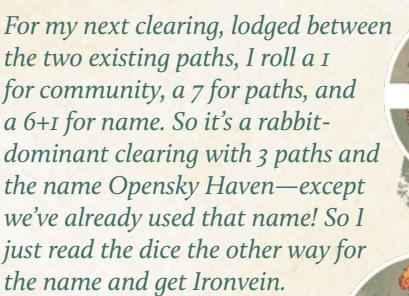
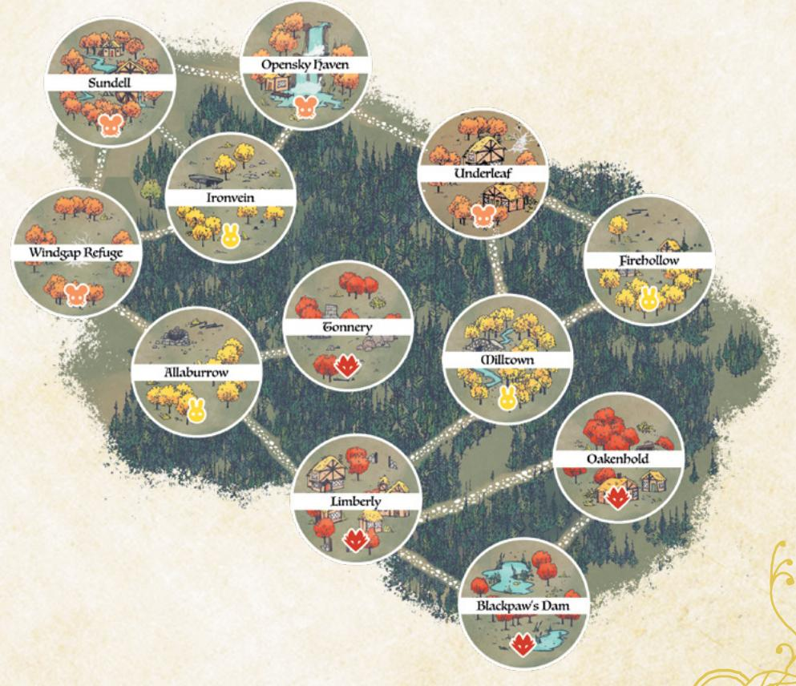
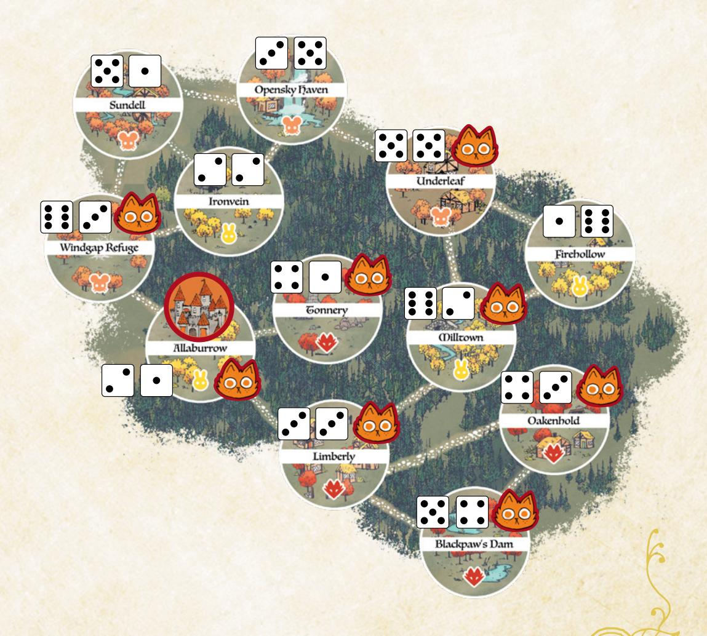
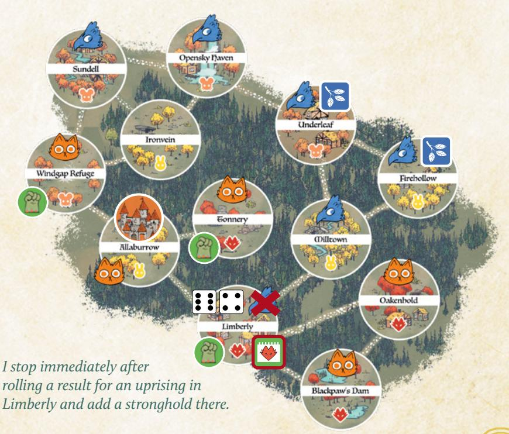

# Making the Woodland

When you start a campaign of Root: The RPG, one of the first things you need is your version of the Woodland itself. Every individual campaign's Woodland will be slightly different, from the layout of the clearings to their names to their specific NPCs. Even the factions you play with might be different from game to game.

As the GM, you can make your version of the Woodland while the players fill out their playbooks and make their characters, or you can make it in advance of the first session so every player can tie into the existing map.

The first step to making your version of the Woodland is to decide which factions you are playing with. You must always play with the "Denizens" faction, meaning that the general inhabitants of the Woodland are always present.

Then, you select two or three other factions to play with. In this book, you'll find support for the Marquisate, the Eyrie Dynasties, and the Woodland Alliance. In Travelers & Outsiders, you'll find additional support for four more factions—the Riverfolk Company, the Lizard Cult, the Corvid Conspiracy, and the Grand Duchy. You can use any of those factions in any combination, though whatever set you choose will have effects on your version of the Woodland and its implied history. You can find more about the effects of those expansion factions in Travelers & Outsiders.

では今し、いらいとは今し、いらいとは今し、いら

{225}------------------------------------------------

# Map of the Woodland

Next, you make the full map of your Woodland. You can use a preexisting map (like one of our additional clearing maps or the board game itself!) or you can create a new map. Your map will always have 12 total clearings.

If you use a preexisting map, then you're set. That map will detail major populations, paths, and some important features. Skip to "Control of Clearings" on [page 228](#page-228-0). If you are creating a new map, read on.

Take a blank sheet of paper (or some other drawing surface). Start by making one clearing—a single circle, close to a corner of the drawing surface. Roll for that clearing's dominant community, its number of paths, and its name.

| 1D6 | Dominant Community |  |
|-----|-----------------------|--|
| 1–2 | Rabbit                |  |
| 3–4 | Mouse                 |  |
| 5–6 | Fox                   |  |

The clearing's dominant community is the majority population of denizens—foxes, mice, or rabbits. All denizens live in every clearing, but every clearing has one dominant community, a species with more members than the others. Birds are never the dominant community because they are spread across all the clearings of the Woodland more equally!

| 2D6   | Number of Paths |
|-------|--------------------|
| 2     | 1                  |
| 3–4   | 2                  |
| 5–9   | 3                  |
| 10–11 | 4                  |
| 12    | 5                  |

The clearing's number of paths are the wellmaintained and available roads leading to neighboring clearings. Draw a number of lines coming out of that clearing equal to its number of paths. Draw an icon in the circle to indicate its dominant community—a little fox face, or an F, or whatever you want to use.

Then draw a new circle—a new clearing—at the end of one of those paths, and roll for its dominant

community, name, and number of paths. Draw new paths, new lines from the new clearing, but remember—the existing path counts towards its total paths, so only draw new lines coming out of it equal to the remainder.

#### Clearing Name Generator

| 2D6 | 1–2              | 3–4        | 5–6            |
|-----|------------------|------------|----------------|
| 1   | Patchwood        | Underleaf  | Ironvein       |
| 2   | Clutcher's Creek | Pinehorn   | Sundell        |
| 3   | Rooston          | Milltown   | Oakenhold      |
| 4   | Limberly         | Allaburrow | Blackpaw's Dam |
| 5   | Flathome         | Tonnery    | Firehollow     |
| 6   | Opensky Haven    | Icetrap    | Windgap Refuge |

Continue drawing new circles at the end of paths. Connect paths and clearings where possible to keep your Woodland connected. Draw new paths so they point towards existing paths, making it easier to place a clearing that connects to multiple paths.

Chapter 9: The Woodland at War 225

{226}------------------------------------------------

You can only have four clearings of each kind of dominant community. Once you have four rabbit communities, for example, reroll if you roll another rabbit community from that point forward.

You can only use each community name once. If you get the same name, either read the dice the other way to find a new name, or reroll.

Stop adding clearings when you reach 12 total clearings. Any unfinished paths then remain unconnected—you can erase them, or keep them as markers of failed, unfinished paths in the Woodland, or perhaps paths to clearings that no longer exist…

# An Example of Woodland Creation

*I draw my first circle and roll. I get a 3 for dominant community, a 7 for number of paths, and a 2+6 for name—a mousedominated clearing with 3 paths called Sundell.*

*Next, I draw my next clearing and roll. I got a 4 for dominant community, a 5 for number of paths, and a 6+2 for name another mouse-dominated clearing with 3 paths called Opensky Haven.*

{227}------------------------------------------------

*Then I roll for another, and I get 3, 9, and 6+6—a mouse clearing with 3 paths named Windgap Refuge.*

*For the next clearing, I get 1 (rabbit*

*clearing), 6 (3 paths), and 2+6—Sundell. That's already used, and so is the name the other way around (Opensky Haven), so I just reroll. I get 4+4, so it's Allaburrow. Finally, after running through all the rolls, I wind up with a 12-clearing Woodland.*

{228}------------------------------------------------

# Control of Clearings

When a campaign of Root: The RPG begins, the war in the Woodland isn't just starting. The factions have already been at it for a bit of time and have made their opening moves.

For each faction that you selected, use the following procedures to determine where they begin with presence and power. Even if you aren't playing with all three of the core factions (the Marquisate, the Eyrie Dynasties, and the Woodland Alliance), take them in the order presented here. For example, if you were playing only with the Marquisate and the Woodland Alliance, you would start with the Marquisate's control, and then move to the Woodland Alliance's control.

Throughout this process, take notes on the clearings! Treat these rolls and events functionally as establishing a kind of "history" of the Woodland. In particular, make note of any clearings that change hands between non-denizen factions; those clearings are "contested" and have seen the most war.

#### First: The Marquisate

Choose one "corner" of the Woodland—a place on the farthest edge of the entire map. If you want to determine the corner randomly, roll 1d6 on the Woodland Corner table and reroll 5–6.

| 1D6 | Woodland Corner  |  |
|-----|------------------|--|
| 1   | Northwest corner |  |
| 2   | Northeast corner |  |
| 3   | Southwest corner |  |
| 4   | Southeast corner |  |
| 5–6 | Reroll           |  |

That "corner" is the Marquise de Cat's stronghold, from which she manages her occupation of the Woodland. The Marquisate is in control of that clearing. Make a note of the stronghold's presence in that clearing and the Marquisate's control of that clearing.

Then, starting with each clearing directly connected to the Marquisate's stronghold, roll on the

Marquisate Control table to see if the Marquisate is in control of any given clearing in the Woodland. "Paths Away from the Stronghold" refers to how many paths must be crossed from the stronghold clearing to reach the clearing in question.

The Marquisate stronghold is the place where the Marquisate entered the clearing, and it is their most heavily fortified base of operations. Removing them from that clearing would be difficult for any faction or vagabond.

Marquisate control over a clearing means that they certainly have de facto control, if not de jure control—perhaps there is a nominal civilian government, but the Marquisate is definitively in charge.

{229}------------------------------------------------

#### Marquisate Control

| From the Stronghold | Roll of 2d6                                                |  |  |
|---------------------|------------------------------------------------------------|--|--|
| 1 path away         | 5+, Marquisate in control. 4–, Marquisate not in control.  |  |  |
| 2 paths away        | 7+, Marquisate in control. 6–, Marquisate not in control.  |  |  |
| 3 paths away        | 10+, Marquisate in control. 9–, Marquisate not in control  |  |  |
| 4 paths away        | 12, Marquisate in control. 11–, Marquisate not in control. |  |  |
| 5 paths away        | Marquisate not in control.                                 |  |  |

# Example

*First, I roll a 3 for the Marquisate's stronghold, getting "southwest corner." I interpret that as Allaburrow, the most southwest clearing on the map. Then I roll for every other clearing, resulting in a Woodland that looks like this:*

{230}------------------------------------------------

#### Second: The Eyrie Dynasties

Choose one "corner" of the Woodland—a place on the farthest edge of the entire map. If the Marquisate is in play, choose the corner opposite their stronghold. If you want to determine the corner randomly, roll 1d6 on the Woodland Corner table, and reroll 5–6. That "corner" is the bastion of power for the Eyrie Dynasties, where they have a Roost. Make a note of the Eyrie's presence in that clearing, and the Eyrie's control of that clearing.

Then, starting with the clearings connected to the Eyrie's initial Roost, for each clearing in the Woodland roll on the Eyrie Control table to see if the Eyrie is in control of those clearings. "Paths Away from Any Roost" refers to how many paths must be crossed from any Roost on the map to reach the clearing in question. If you place a new Roost while rolling, it doesn't change any prior results—adding a Roost won't suddenly change which part of the table applied to a clearing you had rolled for earlier.

The Eyrie can have, at most, four Roosts. Once four Roosts are on the map, ignore any result that would place a further Roost.

The Eyrie can be in control of at most six clearings. Once the Eyrie is in control of six clearings (including their initial Roost), stop rolling.

If the Marquisate is in play, roll for Marquisate-controlled clearings as normal, except for the Marquisate stronghold clearing. Do not roll for the Marquisate stronghold clearing. If you roll that the Eyrie is in control of a Marquisatecontrolled clearing, it means the Eyrie has taken that clearing from the Marquisate over the course of the war. Give the Eyrie control over that clearing.

#### Eyrie Control

| From Any Roost | Roll of 2d6                                                                                        |
|----------------|----------------------------------------------------------------------------------------------------|
| 1 path away    | 5–, Eyrie not in control. 6–8, Eyrie in control, no Roost. 9+, Eyrie in control with a Roost.   |
| 2 paths away   | 8–, Eyrie not in control. 9–10, Eyrie in control, no Roost. 11+, Eyrie in control with a Roost. |
| 3 paths away   | 10–, Eyrie not in control. 11, Eyrie in control, no Roost. 12, Eyrie in control with a Roost.   |
| 4+ paths away  | Eyrie not in control.                                                                              |

{231}------------------------------------------------

An Eyrie Roost is the equivalent of a fortified position coupled with an actual local government. If the Eyrie has a Roost, then they have de jure control over the clearing.

In general, Eyrie control is much more likely to be de jure than de facto. The Eyrie reinstitutes old governments and actively absorbs any existing local government into its own structures and bureaucracy.

# Example

*I choose the closest thing to an "opposite corner" from Allaburrow—namely, Firehollow—to be the opening Eyrie Roost. Then I roll for every clearing resulting in a Woodland that looks like this:*

{232}------------------------------------------------

#### Third: The Woodland Alliance

Roll for each clearing on the map using the Woodland Alliance Sympathy table. Then, for each clearing that has sympathy for the Woodland Alliance, roll on the Uprising table. Continue rolling until either you have rolled for every clearing, or you have rolled that an Uprising took place (i.e., you have rolled a 10+).

#### Woodland Alliance Sympathy

| State of the Clearing | Roll of 2d6                      |
|-----------------------|----------------------------------|
| Uncontrolled          | 8–, no sympathy. 9+, sympathy.   |
| Controlled            | 10–, no sympathy. 11+, sympathy. |
| Contested*            | 7–, no sympathy. 8+, sympathy.   |

\*Swapped control from one non-denizen faction to another.

#### Uprising

| 2d6   | Result                                                                                                                               |
|-------|--------------------------------------------------------------------------------------------------------------------------------------|
| 1–9   | No Uprising                                                                                                                          |
| 10–11 | Uprising; any existing control removed; Woodland Alliance base placed in clearing                                                 |
| 12    | Uprising; any existing control removed; Woodland Alliance base placed in clearing; sympathy placed in every connected clearing |

Sympathy for the Woodland Alliance means that the Alliance has active and functional underground cells in the clearing, and/or that there is a real undercurrent of potential support in the clearing. The Woodland Alliance is not operating openly in that clearing yet, but there's a real danger of a Woodland Alliance uprising and an overthrow of existing powers.

An uprising means that the Woodland Alliance in that clearing successfully contested full control of that clearing and took power there. If the uprising occurred in an uncontrolled clearing, then it is possible that the Woodland Alliance worked with the local denizen government or that the Woodland Alliance overthrew the local denizen government. If the uprising occurred in a faction-controlled clearing, then the Woodland Alliance overthrew that faction's control of the clearing.

A Woodland Alliance base means that the Alliance has an open, active, and functional base of operations in the clearing now. No longer are they defined by underground cells, at least within that clearing—they have actual real control and openly identified forces. The Woodland Alliance does not always rule with the consent of the local denizens; having a base present means the Woodland Alliance has enough temporal power in the clearing to control through force as much as anything else.

{233}------------------------------------------------

Example

{234}------------------------------------------------

#### Last: The Denizens

As the last step whenever you set up the Woodland, roll to see if control to any of the clearings has returned to the denizens. Do not roll for the Marquisate stronghold, any Eyrie Dynasties Roost clearings, or the Woodland Alliance base clearing. Do not roll for any uncontrolled clearings, either—they simply remain uncontrolled.

Becoming uncontrolled is most often the result of a faction's withdrawal or retreat, or of a faction's forces in that clearing becoming independent. Notably, this is not the result of a Woodland Alliance revolt or uprising.

#### Denizen Control

| 2d6   | Result                  |
|-------|-------------------------|
| 1–10  | Remains in control      |
| 11–12 | Becomes uncontrolled |

# Example

*I roll for each controlled, non-stronghold, non-base, non-roost clearing. All stay under control (roll of 10 or less), except for Milltown. I remove the Eyrie control. My final map of the Woodland looks like this:*

234 Root: The Roleplaying Game

{235}------------------------------------------------

# Fleshing Out Your Clearings

These tables and tools are provided so you can randomly determine interesting additional characteristics of your clearings. For each clearing, generate two of each—inhabitants, buildings, and problems—when you need to determine the fiction of the clearing.

#### Important Inhabitants

| 2D6 | 1                 | 2                  | 3             | 4            | 5             | 6             |
|-----|-------------------|--------------------|---------------|--------------|---------------|---------------|
| 1   | Mayor             | Smith              | Guard Captain | Rebel Leader | Enemy Captain | Village Elder |
| 2   | Farmer            | Thief              | Local Regent  | Scholar      | Tax Collector | Doctor        |
| 3   | Armorer           | Merchant           | Noble         | Astronomer   | Healer        | Banker        |
| 4   | Rabble-Rouser     | Bandit             | Mercenary     | Baker        | Tracker       | Historian     |
| 5   | Faction Recruiter | Tailor/ Cobbler | Jeweler       | Sheriff      | Barber        | Monk          |
| 6   | Soldier           | Mason              | Assassin      | Gambler      | Minstrel      | Judge         |

#### Important Buildings

| 2D6 | 1           | 2            | 3           | 4          | 5            | 6          |
|-----|-------------|--------------|-------------|------------|--------------|------------|
| 1   | Mill        | Forge        | Well        | Farm       | Kiln         | Town Hall  |
| 2   | Guard tower | Fence/wall   | Longhouse   | Archive    | Larder       | Grain silo |
| 3   | Armory      | Infirmary    | Brewery     | Bakehouse  | Woodshop     | Warehouse  |
| 4   | Orchard     | Custom house | Market      | Monastery  | Tavern       | Inn        |
| 5   | Almshouse   | Barracks     | Schoolhouse | Bridge     | Dam          | Bank       |
| 6   | Fountain    | Prison       | Graveyard   | Courthouse | Trading post | Aqueduct   |

#### Problems

| 2D6 | 1               | 2                        | 3                           | 4                        | 5                    | 6                           |
|-----|-----------------|--------------------------|-----------------------------|--------------------------|----------------------|-----------------------------|
| 1   | Bear            | Natural disaster         | Bandits                     | Enemy occupation      | Famine               | Sickness                    |
| 2   | Tyranny         | War                      | Money                       | Inequality               | Overpopulation       | Lack of development      |
| 3   | Corruption      | Dissent/ rebellion    | Lack of crucial resource | Lack of skilled labor | Overtaxation         | Sabotage                    |
| 4   | Internal strife | Inflexible traditions | Prejudice                   | Brutality                | Protection racket | Xenophobia                  |
| 5   | Road damage     | Obsolescence             | Cultural assimilation    | Coup                     | Poisoned supplies | Dilapidated architecture |
| 6   | Fearmongering   | Warmongering             | Smugglers                   | Thieves                  | Censorship           | Strange mystery          |

Chapter 9: The Woodland at War 235

{236}------------------------------------------------

# Request Generator

You can randomly generate requests for the vagabonds for a one-shot or a campaign by rolling on these tables. Determine where they are being sent, what they are sent to do, who hired them, what the targets are, and one or two complications. Spend time thinking about how the pieces fit with the PCs in particular. This generator is especially useful for creating an "in medias res" situation with which to start play.

#### Where Are They Being Sent? What Are They Supposed to Do?

| 1D6 | Location                      | 2D6 | 1–3                    | 4–6                   |
|-----|-------------------------------|-----|------------------------|-----------------------|
| 1–3 | A forest between clearings    | 1   | Deliver an item        | Destroy an item       |
| 4   | The most isolated clearing    | 2   | Steal an item          | Repair/modify an item |
| 5   | The most connected clearing   | 3   | Neutralize a threat    | Investigate a threat  |
| 6   | A faction-entrenched clearing | 4   | Eliminate a threat     | Spy on a threat       |
|     |                               | 5   | Negotiate with a group | Raid a group          |
|     |                               | 6   | Protect a group        | Disband a group       |

#### Who Is Making This Request?

| 1D6 | Requester                                                                                 |  |  |  |  |
|-----|-------------------------------------------------------------------------------------------|--|--|--|--|
| 1   | "Trusted Benefactor"                                                                      |  |  |  |  |
|     | A powerful leader of the faction with whom the PCs collectively have the best reputation  |  |  |  |  |
| 2   | "Chance for Redemption"                                                                   |  |  |  |  |
|     | A powerful leader of the faction with whom the PCs collectively have the worst reputation |  |  |  |  |
| 3   | "Local Help"                                                                              |  |  |  |  |
|     | A leader of a neighboring clearing                                                        |  |  |  |  |
| 4   | "Scratch My Back"                                                                         |  |  |  |  |
|     | A would-be usurper of the leadership of a neighboring clearing                            |  |  |  |  |
| 5   | "Aid the Underdogs"                                                                       |  |  |  |  |
|     | A military representative of the faction with the fewest clearings under control          |  |  |  |  |
| 6   | "Stay on the Winning Side"                                                                |  |  |  |  |
|     |                                                                                           |  |  |  |  |

A military representative of the faction with the most clearings under control

{237}------------------------------------------------

#### Targets: Items

| 2D6 | 1                   | 2                             | 3                     | 4                        | 5                                | 6                            |
|-----|---------------------|-------------------------------|-----------------------|--------------------------|----------------------------------|------------------------------|
| 1   | Goods-laden cart | Ink, pens, and parchment   | Treasure chest     | Exceptional armor     | Historical scroll             | Medical supplies          |
| 2   | Mill equipment   | Jewelry                       | Cookware              | Official missive      | Treaty                           | Valuable tome             |
| 3   | Forge equipment  | Official insignia or badge | Quality tools         | Ale, wine, or spirits | Reliquary                        | Clockwork mechanism       |
| 4   | Farm equipment   | Royal regalia                 | Exceptional weapon | Collected taxes       | Strange device or relic    | Explosives                   |
| 5   | Exceptional food | Important key                 | Arms for a troop   | Map                      | Banner                           | Valuable raw materials |
| 6   | Subsistence food | Luxury goods                  | Armor for a troop  | Road sign                | Rudimentary printing press | Valuable trophy           |

#### Targets: Threats

| 2D6 | 1                     | 2                        | 3                     | 4                            | 5                    | 6                                |
|-----|-----------------------|--------------------------|-----------------------|------------------------------|----------------------|----------------------------------|
| 1   | Bear                  | Heretical philosopher | Criminal outsiders | Xenophobic governor       | Rabble rouser     | Dangerous spy                 |
| 2   | Bandit captain        | Disloyal assassin     | Traveling thieves  | Unscrupulous doctor       | Satirical bard    | Insidious conspiracy          |
| 3   | Rogue commander    | Bounty hunters        | Isolationists         | Traveling charlatan       | Clever loan shark | Secretive murderer            |
| 4   | Militant commander | Callous mercenaries   | Local garrison     | Unscrupulous smuggler     | Strict lawkeeper  | Determined treasure seeker |
| 5   | Reckless rebel        | Cunning rebel         | Greedy governor    | Overzealous guard captain | Strange seer      | Deceptive leader              |
| 6   | Dangerous vagabond | Rage-filled arsonists | Hateful governor   | Belligerent brute         | Defecting soldier | Vengeful leader               |

{238}------------------------------------------------

#### Targets: Groups

| 2D6 | 1                         | 2                     | 3                         | 4                      | 5                      | 6                  |
|-----|---------------------------|-----------------------|---------------------------|------------------------|------------------------|--------------------|
| 1   | Minority denizen group | Military engineers | Mercenary company      | Messenger guild     | Prisoner caravan    | Smuggling ring  |
| 2   | Expeditionary force    | Tax collectors        | Traveling missionaries | Band of hunters     | Honor guard            | Wealthy family  |
| 3   | Guard troop               | Frontline troop    | Carnival troupe        | Trailblazers' union | Carpenters' union   | Crime family    |
| 4   | Scouting troop            | Rebel insurgents   | Refugees                  | Bakers' guild          | Metalworkers' guild | Deserter band   |
| 5   | Propaganda troop       | Local trade guild  | Banking collective     | Mining company      | Strange cult           | Vigilante group |
| 6   | Lawkeepers                | Ruling council        | Trade clan                | Merchant caravan    | Explorers band      | Vagabond band   |

#### Complications

| 2D6 | 1                             | 2                          | 3                              | 4                       | 5                               | 6                                 |
|-----|-------------------------------|----------------------------|--------------------------------|-------------------------|---------------------------------|-----------------------------------|
| 1   | False identity             | Surprising stakes       | Warfront                       | Friend on wrong side | Coercive threat              | Deep cultural divide        |
| 2   | Third party involved       | Local hostility            | Opposing agents             | Prejudice               | Enemy in power               | Frame job                         |
| 3   | Traitor                       | Target friendly            | Hidden/ secure targets      | Resource scarcity    | Plague or illness abounds | Existential threat             |
| 4   | Innocents in crossfire     | Secrets and lies abound | Clingy hanger-on            | Watchful eyes        | Hidden motives               | Taboos and restrictions        |
| 5   | Great military presence | Natural disaster           | Old enemy appears           | Enticing offer          | Usurpation in progress       | Toothless laws                 |
| 6   | Rampant corruption         | Time limit                 | Ongoing intra clearing feud | Strange phenomenon   | Vagabonds being hunted    | Clearing ruled unofficially |

{239}------------------------------------------------

#### War Status

If you don't yet have any particular faction phases to draw upon for the push and pull of the war, you can always determine the state of a clearing with regard to how much war and battle it has seen using the following rules.

To determine how a clearing has been impacted by the war when the vagabonds encounter it, roll 2d6 + the number of factions either controlling or neighboring the clearing. Thus, if there is only one faction in control of both the area and its neighbors, roll +1; if a different faction controls the neighbors, roll +2; if there are two or more different faction neighbors and a third faction in control, roll +3.

- 2–7: Untouched. This clearing is by and large unaffected by the war directly. Its buildings haven't been stricken by destruction, and it doesn't have a particularly noteworthy buildup of martial forces or defenses.
- 8–10: Battle-scarred. This clearing shows the signs of battle, the scars of fighting. The faction in control has it well in hand, but everyone in the clearing has felt the sting of the war.
- 11–12: Occupied, battle-scarred. This clearing has seen war, recently, and shows the scars. Furthermore, it is likely occupied, or has recently been occupied, by another faction.
- 13+: Fortified, battle-scarred, occupied. This clearing has seen war, recently, and shows both the scars and the defenses required to survive. Furthermore, it is likely occupied, or has very recently been occupied, by another faction.

#### The War Continues

As you play your campaign of **Root: The RPG**, the war will rage on across the Woodland. The vagabonds can affect its course or divert it, of course, but it will continue with or without them. To represent the war's ebb and flow over the course of play, use the faction roll on the next page for each faction when time passes.

Time passes whenever the spotlight of the story shifts forward a couple weeks; maybe the vagabonds take a particularly long journey or rest for a time, creating a period of downtime that isn't interesting to play through beat by beat. "Time passes" is a kind of mild reset, allowing vagabonds to clear their harm tracks by virtue of off-screen actions, and allowing the time needed for changes in the broader Woodland to come to the fore.

The mechanics presented are suited for fast, easy resolution that, in turn, leads to new results and developments in the Woodland. But if you want to see more in-depth faction mechanics suited to each faction's individual play style, check out the expanded faction mechanics in **Travelers & Outsiders**. The rules in that expansion create a deep, complicated, ever shifting Woodland—but take more time and require more work on the part of the GM, either between sessions or in breaks.

{240}------------------------------------------------

#### Faction Roll

When time passes, roll for each non-denizen faction. Start with the faction that controls the most clearings, then work down the list:

- +I if the faction operated unfettered by PC actions since the last roll
- -I if the faction has recently suffered a blow from the PC vagabonds
- -I if the faction controls the most clearings (and is thus a juicy target)

Add +1 if the faction in question controls the following:

- Marquisate: 5+ total clearings, workshops, sawmills, or recruiters
- Eyrie Dynasties: 2+ Roosts or 4+ clearings
- Woodland Alliance: 3+ sympathy or at least one base

On a hit, the faction scores a victory; choose one minor boon. On a 10+, choose another minor boon—in the same clearing or another—or a major boon instead. On a miss, the faction suffers a defeat—it loses control of a clearing (returning it to the control of its own denizens); a fortification or structure (Roost, base, or Marquisate building); or a valuable resource.

#### MINOR BOONS

Attack: Take control of a clearing adjacent to one already controlled. If that clearing has fortifications, destroy those instead. If that clearing has no fortifications but has a Roost, a Woodland Alliance base, or any Marquisate structures, destroy all of those instead.

**Fortify**: Fortify a controlled clearing with defensive structures and more troops. The next time an enemy faction would take control of a fortified clearing, they only remove the fortifications instead.

**Obtain:** Gain a valuable resource from the forests, ruins, or a clearing. On the next faction roll, the faction takes +2 if it retains control of the resource.

Establish cells: Add sympathy to any two clearings. [Woodland Alliance]

Stamp cells: Remove sympathy from all clearings the faction controls. [Marquisate/Eyrie]

**Build industry**: Construct one sawmill, workshop, or recruiting post in each of two different controlled clearings. [Marquisate]

#### **MAJOR BOONS**

**Revolt**: A revolt occurs in a clearing with sympathy; the Woodland Alliance gains a base there, taking control and removing all other faction structures. [Woodland Alliance]

**Build Roost**: Add a Roost to a clearing the Eyrie controls without a Roost. [Eyrie]

**Capture**: Seize an important figure in an enemy faction; that faction takes -1 on all faction rolls while that figure is held captive.

{241}------------------------------------------------

{242}------------------------------------------------

elilah's Grove is known for their cutting-edge bow design and flawless arrow production. Even small details, such as a proprietary dye for the sinew used to attach feathers to arrow

shafts, are zealously guarded from outsiders. This is a majority fox grove with a number of rabbits and birds mixed in, but it's really the foxes' show as they run the sawmill that employs many of the denizens. The foxes pride themselves on the beauty of their products as well as the function, and a good portion of them are expert marksmen as well as makers.

An enclave of goats mainly keeps to themselves, building their homes in and around the steep rocky bluffs to the west. A waterfall separates the goats from the rest of the clearing, although its use for the foxes' sawmill means that they spend a lot of time on the clover strewn banks, much to the goats' disgruntlement.

The attitude of the foxes has rubbed off on everyone who lives there, at least to an extent. Hard work and craftsmanship are valued over cleverness, and anyone with soft paws is treated with derision. Outsiders are regarded with suspicion, and it takes a long time for newcomers to be fully welcomed. But now bad fortune has struck Gelilah's Grove, and the insular denizens have to open their doors to accept the help of outsiders. That doesn't mean they have to like it, however...

# At First Sight

A stagnant, brackish smell fouls the air long before Gelilah's Grove is sighted. Deep pools of standing muddy water connect the roiling river to the clearing's floor. Gelilah's Grove was always a moderately industrial clearing, with structures sprouting up alongside the waterfall and environs to take advantage of the flow of running water for the sawmill, but now the river has blurred the line between water and land. Drowned clover and herb ground cover can still be felt underfoot around the structures still standing, and hanging moss blocks the sunlight from reaching far into the water.

Rocky hills rise to one side, with seemingly poorly-maintained shacks sprouting from sheer rock faces. Industrial structures, such as the mill and workshops, line the bank of the river, saved from catastrophe by a rise in elevation. Even the larger homes are water stained and covered with fungal growths, although delicate, intricate carvings can be seen underneath.

さるこれでは、一番できるこれでは、一番できる。

{243}------------------------------------------------
