{0}------------------------------------------------


{1}------------------------------------------------


# Core Book

Design: Brendan Conway & Mark Diaz Truman Development & Writing: Brendan Conway Additional Writing: Sarah Doom & Mark Diaz Truman Developmental Editing: Mark Diaz Truman Copy Editing: Kate Unrau

Layout: Miguel Ángel Espinoza

Art: Kyle Ferrin

Art Direction: Marissa Kelly

Proofreading: Katherine Fackrell

Root Board Game Design: Cole Wehrle

Root Board Game Graphic Design & Layout: Cole Wehrle, Kyle Ferrin, Nick Brachmann, and Jaime Willems

Root Board Game Concept: Patrick Leder


Root: The Roleplaying Game text and design @ 2019-2021 Magpie Games. All rights reserved. Root: A Game of Woodland Right and Might @ 2017 Leder Games. All rights reserved. Leder Games logo and Root art TM & @ 2017-2020. All rights reserved.

Printed by LongPack Games. First printing 2021.

{2}------------------------------------------------

# Table of Contents

| Introduction3                                    |     |
|--------------------------------------------------|-----|
| The Woodland8                                    |     |
| Playing to Find Out<br>9                         |     |
| What You'll Need10                               |     |
| The Woodland Explored11                          |     |
| What Is the Woodland?12                          |     |
| The History of the Woodland13<br>The Present War | 20  |
|                                                  |     |
| The Fundamentals                                 | 25  |
| The Conversation26                               |     |
| Moves and Uncertainty29                          |     |
| Starting the Game                                | 35  |
| Why Play?                                        | 40  |
| Making Vagabonds41                               |     |
| Choosing a Playbook42                            |     |
| Filling Out the Playbook43                       |     |
| Core Rules<br>                                   | 63  |
| Using Moves in Play                              | 64  |
| Basic Moves                                      | 68  |
| Weapon Moves                                     | 89  |
| Reputation110                                    |     |
| Travel Moves121                                  |     |
| Harm                                             | 125 |
| Session Moves130                                 |     |
| Playbooks<br>131                                 |     |
| The Adventurer133                                |     |
| The Arbiter137                                   |     |
| The Harrier                                      | 141 |
| The Ranger145                                    |     |
| The Ronin149                                     |     |
| The Scoundrel153                                 |     |
| The Thief                                        | 157 |
| The Tinker                                       | 161 |
| The Vagrant165                                   |     |

| Advancement &               |     |
|-----------------------------|-----|
| Equipment                   | 169 |
| Advancement170              |     |
| Changing Your Character177  |     |
| Equipment181                |     |
| Running the Woodland        | 193 |
| The GM194                   |     |
| Agendas196                  |     |
| Always Say198               |     |
| Principles199               |     |
| GM Moves                    | 202 |
| NPCs                        | 212 |
| Fight Scenes216             |     |
| When You're Not Busy<br>222 |     |
| The Woodland at War         | 223 |
| Making the Woodland<br>224  |     |
| Fleshing Out Your Clearings | 235 |
| Gelilah's Grove<br>241      |     |
| Conflicts and Issues243     |     |
| Important Residents247      |     |
| Important Locations         | 253 |
| Special Rules254            |     |
| Introducing the Clearing    | 255 |
| Index<br>256                |     |

{3}------------------------------------------------

<span id="page-3-0"></span>

{4}------------------------------------------------

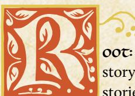

oot: The Roleplaying Game is a pen-and-paper tabletop storytelling game. Alongside a few friends, you spin out the stories of roguish vagabonds as they journey throughout the

Woodland, acting as something between knaves and heroes!

You meet up with your friends, whether it's around an actual table, in an online call, or whatever way fits your group. Most of you have your own character, an individual vagabond in your band, sometimes acting as a rogue, a scamp, a survivor, and maybe a hero. One of you is the Gamemaster (GM) and describes the rest of the world and all the other characters in it. Every now and then, when you describe something chancy or complicated or tense, you roll some dice to find out what happens. Over a bunch of individual meetings—sessions—you and your friends play out a larger story of these miscreants and legends of the Woodland.

#### What Is Root?

ROOT: A GAME OF WOODLAND MIGHT AND RIGHT is a board game created and published by Leder Games, designed by Cole Wehrle and with art by Kyle Ferrin. The game was originally published in 2018 and, since then, has racked up a slew of awards, including four Golden Geek Awards and the Origin Award for Best Board Game in 2019.

The board game is an asymmetric wargame featuring wildly different factions of anthropomorphic animals vying for power. The Marquise de Cat and her minions try to build workshops and lumber mills to take control of the Woodland, while the Eyrie Dynasties manage a complicated bureaucratic "program" of orders, and the Woodland Alliance starts with no pieces on the board, only to spring forth with sudden force as a surging insurrection against the greater powers. The base game includes one faction—the Vagabond—who acts as a single, isolated roguish figure, moving throughout the Woodland, switching allegiances between the other factions, and performing quests for the denizens of the Woodland.

At the time of writing, two additional expansions are available for the board game: one that adds the mercenary Riverfolk Company and the cryptic Lizard Cult; and another that adds the arrogant Great Underground Duchy and the anarchic Corvid Conspiracy. A third—The Marauder Expansion—will soon be available for fans as well!

**Root: The Roleplaying Game** is based on the same fictional world as Root: A Game of Woodland Might and Right, playing with many of the same themes and ideas, but from a different perspective—that of a tabletop roleplaying game focused on the vagabonds themselves.

さい金しいいといるしいいといるしいい

{5}------------------------------------------------

# What Is a Tabletop Roleplaying Game?

A tabletop roleplaying game (often abbreviated to TTRPG or RPG) is a kind of storytelling game that you play at your table with pen, paper, and dice. It plays out as if you and your friends were cooperatively and conversationally telling a story together. Over a few hours—or many sessions—your collective story evolves and changes, going to new and unexpected places based on your characters' actions.

Most players each take on the role of a character in the setting of the game. You describe what that character looks like and what they do. You say what they say, either describing their words ("I say something apologetic!") or speaking for them verbatim ("I say, 'You'll never catch me, Count Ragar!'"). You think about what they think and feel, and you guide all of their actions.

You do all of that alongside your friends playing their own characters. You work together in times of danger, and you argue with each other in times of drama. You flesh out friendships, rivalries, romances, and more, all from the perspectives of these fictional characters.

One of your friends plays a special role—the Gamemaster or GM. They portray the rest of the world, including all the other characters. They tell you what your character sees, hears, smells, and so on. They describe what the nonplayer characters—NPCs—do or say. They fill in any holes in the setting so that everyone at the table shares the same imaginary world in their heads.

Very importantly, the GM isn't at all playing *against* the other players. They're here to try to represent the world faithfully and interestingly—to say what happens and what exists in a way that makes the fictional world *make sense*. And they're here to keep things compelling, fun, and exciting—which includes honoring how awesome the other players' characters are!

# What Makes Root: The Roleplaying Game Unique?

Root: The Roleplaying Game is a tabletop roleplaying game in which the characters you play are anthropomorphic animal vagabonds—miscreants, rogues, outcasts, and renegade heroes—adventuring across the Woodland. The vagabonds are highly skilled and capable, but they're not really at home anywhere in the myriad clearings of the Woodland. So they move around, traveling the paths and crossing the dangerous forests, taking jobs for pay and equipment.

Whether they mean to be or not, the vagabonds are often drawn into the overarching conflict between the powerful factions of the Woodland. As those factions wage war against each other, the vagabonds may prove the key to tipping the balance in favor of one faction or the other…or they may act as heroes, protecting the average Woodland denizens from a war that might consume them. Whatever they do and whomever they support is your choice as you play!

{6}------------------------------------------------

# How Does Tabletop Roleplaying Work?

For the most part, a tabletop roleplaying game plays like a conversation—you take turns speaking, describing the action or sharing dialogue, reacting to each other, switching back and forth between in-character speech and out-of-character speech. But the conversation leads to places of uncertainty, times when no one is sure exactly what to say next, when no one knows what happens in the story. When one character tries to jump from a flaming tree to another, across a seven-foot gap, no one knows for sure what happens, whether they successfully reach the next tree or go plummeting to the ground!

In those moments, you turn to the game's rules. The rules of **Root: The RPG** help you to figure out what happens in moments of tense uncertainty, guiding the conversation forward into new, interesting, and surprising outcomes. The rules themselves will provide plenty of guidance on exactly when they come into play, what to do to resolve a situation, and what the outcomes are. But much of the time, the GM will have to provide some additional interpretation to help the mechanics fit the very specific situation in your game.

What's more, the GM also acts as a kind of impartial judge, helping the table determine when the rules actually come into play. If there's ever doubt about whether or not the rules apply, the GM acts as the final arbiter and decision maker.

For example, in the aforementioned case, when a character is jumping from a flaming tree to another tree about seven feet away, the GM might look at the rules and the situations in which they're supposed to come into play, and then decide that, yes, there *absolutely is uncertainty here*. Time to go to the rules!

If, on the other hand, a character is jumping from one tree to another when there's no fire and the two trees are touching, the GM might look at the rules, look at the situations in which they're supposed to come into play, and decide that *there's no real uncertainty here*. There's no tension. The character just does it.

#### Think of it like this:

- Each player is in control of their own character in this fictional, imaginary world.
- The GM describes the rest of the world, including other characters in it.
- When no one knows what happens next, the rules come in to provide interesting results. The GM helps to interpret the rules, calling out when they come in to play and which rules are relevant.
- The GM acts as a kind of interpreter, making the rules and outcomes fit the specifics of your fictional world at that particular moment.

{7}------------------------------------------------

# Trials & Adventure

As you progress further through this game and this book, keep a few important ideas in mind—core precepts of Root: The Roleplaying Game, its setting, its tone, and its themes. Specifically, Root: The RPG tells stories of adventure and action amid greater drama and political conflict. The Woodland, the overall setting of Root: The RPG, is a place where a vagabond can cut a rope and fly up as a chandelier falls…and it is a place embroiled in war, where deposing the local sheriff can have real, dangerous consequences.

Just to be clear up front—the Woodland is populated by anthropomorphic animals. There are no humans at all in the Woodland. In general, the anthropomorphic animals—the denizens—are around the same size, and they all have the same general capabilities as a human. For more on how Root: The RPG handles the anthropomorphic animals, see [page 43](#page-43-1).

The vagabonds are always capable characters with the skills necessary to undertake difficult, dangerous tasks and come through more or less unscathed. They're social outcasts at the start of play, separated from the backing or support that might allow them to focus on larger issues. So they take on the distasteful or complicated tasks that others throughout the Woodland pay them for, anything from getting rid of a dangerous bear, to exploring newly uncovered caverns, to stealing important military documents from a foe. All of these jobs become their own fun adventures, as things inevitably become more complicated than the vagabonds originally anticipate. They run into guards while carrying contraband—will they fight or talk their way out of trouble? They wind up accidentally knocking over a lantern in the middle of a scroll repository—will they try to put out the flames or just bolt?

But their actions inevitably have an effect on the Woodland at a higher scale. When they deliver those stolen military documents to their employer, they have just given one faction a significant advantage over another—and the Woodland changes to reflect that. When they set that fire in the scroll repository, the treaty protecting that clearing from invasion goes up in smoke—and another faction invades.

Even though, at any given moment, the story you're telling will likely be about one particular caper, one specific adventure or situation, the actions that your vagabonds undertake can have consequences that ripple across the Woodland. And when you play a full campaign, you'll not only encounter the effects of your own actions, but you'll also revisit the places you changed and see exactly what happened, for example, after you accidentally set that fire.

This combination produces stories with immediate, in-the-moment excitement and action, accompanied by long term storylines and meaning.

{8}------------------------------------------------

<span id="page-8-0"></span>

# The Woodland

For ages, different factions have fought for control of the Woodland's denizens and its resources, all amid conditions that amplify the threat of any battle. The place has always been dangerous, the thick woods concealing a multitude of threats from bears to bandits. It has resources to support life, but only after a great effort has been poured into creating a safe place. The clearings carved out of the forest are the best examples of this safety, little pockets where the greatest dangers have been pushed back—and a whole new set of dangers have taken their place.

The denizens of the Woodland have seen war fairly recently. The Grand Civil War between the Eyrie Dynasties rocked the Woodland a few decades ago, tearing down whatever remained of the Eyrie's established order. Some clearings were left to govern themselves after the conflict. Others found themselves endangered without the aid of Eyrie soldiers to guard the clearing or nearby paths. While different clearings were affected in different ways to different extents, no place was left untouched, no life unchanged.

In the absence of another great power controlling the Woodland, the Marquise de Cat, a powerful and dangerous noble of a far-off empire, swept in to seize opportunity. She led her forces to invade the Woodland, bringing it under her control in the Marquisate. The Marquisate might have total control if the Eyrie Dynasties hadn't recovered enough to try to retake the Woodland…and if the Woodland itself didn't threaten rebellion with the newfound Woodland Alliance.

Now, more upheaval seems imminent. The Marquisate looks upon the Woodland with hungry eyes, eager to squeeze resources out of it; the Eyrie's claws stretch out to reclaim their lost territory; the Woodland Alliance arises to push back all other powers; and more factions gaze upon the Woodland from afar, a gleam in their eyes.

War returns to the Woodland, and the vagabonds will be drawn in.

{9}------------------------------------------------

# <span id="page-9-0"></span>Playing to Find Out

Root: The RPG depends upon one core principle, woven throughout the game from its setting to its mechanics: *play to find out what happens*.

There may come a time when you think you know exactly what should happen next when dealing with some Eyrie lieutenant. You just *know* that the lieutenant should hate your character, and they should wind up in a duel to the death!

But let those feelings go. Play to find out what happens. Don't pre-plan!

The mechanics in Root: The RPG push you towards unexpected, surprising outcomes. They complicate any situation where you think you "know" what should happen. Let the game and the story go where it will and surprise you! Don't fight the mechanics when they suggest an outcome you never would've predicted—go with them! We promise, the story you tell will be better for it.

# Playing Safely

When you let the story go where it will, there are times when it can threaten to go someplace that makes someone uncomfortable. That's okay, just so long as you and your group have the tools you need to handle just such a situation.

In general, it's always a good idea to talk about the game. Talk about it before you start, talk about it during play, talk about it after. Check in with your players. Be mature and understanding with each other. Beyond that, there are many tools for keeping your table on the same page, to make sure the game is comfortable and fun for everyone. The X-Card is one of our favorites!

#### X-Card

The X-Card is a handy tool originally developed by John Stavropoulos. Take an index card or a piece of paper and draw an X on it, and then put it in the middle of your table. That's your X-Card. If someone is feeling uncomfortable in any way because of something happening in the game, they can point to the X-Card, tap on the X-Card, hold up the X-Card—whatever works for them.

In that moment, everybody in the group agrees to stop and edit out whatever was X-Carded. The player who uses the X-Card doesn't have to explain themselves, though the other players may have a few questions just to make sure they understand exactly what was X-Carded.

In practice, the X-Card is as important just to have as it is to actually use. A lot of players feel much more comfortable knowing that the X-Card is there, whether or not they actually have to use it. It's an especially great tool when you're playing with people you don't know all that well!

Chaper 1: Introduction 9

{10}------------------------------------------------

# <span id="page-10-0"></span>What You'll Need

To play **Root**: **The RPG**, you need a few friends willing to commit to playing at least one session lasting 2–4 hours. A single session of Root is fun, but the game will come alive if you can string together multiple linked sessions. You also need one player to be the GM and 2–5 players to portray the main characters of the game, the player characters or PCs.

#### Dice

You need at least two six-sided dice, like the kind you find in Monopoly or Risk. One pair is enough to play, but it's a lot better to have one pair of dice for each player. The GM doesn't need their own pair.

# Playbooks

You need a printed copy of each of the playbooks you're using in your game. This book comes with nine playbooks, and you can easily have all nine printed and ready to use. The **Travelers** & Outsiders expansion book comes with another ten playbooks. We recommend either defaulting to the nine in this book, or choosing a selection of the total available when you start a game.

# Woodland Map

The GM fleshes out a map of the Woodland, either before or during the first session. That map can be scribbled on a sheet of paper, drawn over one of the map images we've provided, or even built off the map from the ROOT: A GAME OF WOODLAND MIGHT AND RIGHT board game.

#### Additional Materials

Here are some other materials you'll need or want:

- The Equipment Deck—to give you plenty of easy-to-reference pieces of equipment to use throughout the game.
- The Denizen Deck—to give you inspiration for denizen NPCs, along with all of their in-game mechanics and statistics.
- Printed copies of the basic moves, weapon moves, reputation moves, and travel moves—one copy for each player including the GM.
- A printed copy of the GM materials.
- Pencils, paper, and other materials for marking up your sheets and maps.

You can find the materials for running a game of **Root**: **The RPG** as downloads, along with more information on the decks, at www.magpiegames.com/root.


{11}------------------------------------------------

<span id="page-11-1"></span><span id="page-11-0"></span>

{12}------------------------------------------------

<span id="page-12-0"></span>

game of Root: The RPG is always set against the backdrop of the Woodland—but it's not always the same backdrop. In this chapter, you'll find the essential qualities of the Woodland,

the things that must be true, along with plenty of information and guidance to set up your version of the Woodland for your game. But that's crucial—the version of the Woodland you use for your game is your version of the Woodland.

When you set up the board game ROOT: A GAME OF WOODLAND MIGHT AND RIGHT, you choose which faction each player will play. In exactly the same way, when you set up a game of Root: The RPG, you make decisions about your particular version of the Woodland—who the major players are, what the current state of the Woodland is, and more.

Maybe in your version, the Marquisate and the Eyrie have smashed each other to pieces, and the real story is about the Woodland Alliance competing with the Lizard Cult and the Riverfolk Company (two factions you can find more about in the Travelers & Outsiders supplement to this game). Maybe the Marquisate destroyed the Eyrie and quelled the Woodland Alliance, and the story is primarily about the Marquisate contending with an invasion from the Great Underground Duchy (again, see Travelers & Outsiders).

Everything in this chapter is here to guide you—to provide tools, concepts, and starting points to build from—but not to tell you exactly how things are, without any room for adjustment. Keep that in mind as you continue through the chapter: every Woodland is different...and yet every Woodland is the same.

# What Is the Woodland?

The Woodland is the name for the entire forested area of resources. clearings, and denizens. It's like the name of a country, although the Woodland is more an area than a united nation. The denizens—an allpurpose word to refer to mice, rabbits, foxes, birds, and others—are the Woodland's "peoples," none human, all of them anthropomorphic animals.

The Woodland comprises thick, deep forests with plenty of resources for an enterprising empire, divided only by clearings and by paths. A clearing is a big area that the denizens of the Woodland have previously cut from the forest's grip, now one of the important spaces playing home to denizen life in the Woodland. All clearings are fairly built up, their contents ranging from large villages to small cities.

{13}------------------------------------------------

<span id="page-13-0"></span>The paths were similarly cut down ages ago, clear tracks amid the forest that connect the clearings and enable trade and travel. They're maintained by a combination of constant use and active effort, most of the time on the part of the leading factions of the Woodland who control and need those paths. Plenty of paths have been lost to time and the forest's voracious regrowth.

Beyond the clearings and paths lies the forest, a dangerous, wild space. No good, self-respecting denizen will go into the forest unless they have to. Bandits, thieves, and miscreants will often take refuge there, striking out from the thick growth to attack merchants upon the paths. Plenty of dangerous creatures abide within the forest—from enormous and terrible bears to strange and hidden deer. And there is an abundance of purely natural threats in the forest—flash floods, lightning strikes, hidden caves, and more.

The forest contains another important feature of the Woodland, however the ruins of old. Sometimes these ruins are just decades old, leftover broken structures from prior iterations of the Eyrie Dynasties. Sometimes the ruins are ancient and overgrown, hiding strange secrets from civilizations long forgotten. The ruins are always dangerous enough to turn away all but the bravest or most foolish of denizens…but still lucrative enough to keep drawing them in with the promise of lost treasures, ancient relics, and more that the vagabonds can sell back in the clearings.

# The History of the Woodland

The history of the Woodland…is unknown. At least, its depths remain buried beyond memory and record. Recent events have left a far greater impression, but the far-off history of the Woodland is out of reach.

The Woodland itself is ancient, and denizens of myriad kinds have been carving out lives there for ages. Some denizens even tell stories today of ancient empires or cultures that once spread out where the trees now grow—all that is left of them are ruins grown over with roots and ivy.

As far as most living there today are aware, the Woodland hasn't been unified, or even connected, for all that long—not in the grand scheme of time. Those who did make lives there have crafted homes largely in isolation, periodically making contact with others perhaps to trade, but otherwise living alone or with only their families. For those in the Woodland, there were always tales of greater empires and cities in far-off lands, but those places weren't here, and the world amid the leaves was untouched by their reach.

Everything changed some time ago when the denizens began to work together, creating clearings within the Woodland where they could live together in safety. They cut back the forest and turned some trees into buildings. They tamed

{14}------------------------------------------------

the growth until there was a boundary past which the Woodland could not encroach. They even blazed trails across the Woodland, between the different clearings, and wore them so thoroughly that they became known paths—the veins of a new Woodland.

This "new" Woodland—not exactly unified, but connected to itself; not tame by any means, but livable—is the one that persists to this day. The denizens who live there are proud of the lives they make for themselves, lives characterized by the difficulty of surviving amid such wilds and the rewards of making lives for yourselves, instead of being handed something by the powers that be.

The forests between the clearings and the paths are still utterly untamed, great hiding places for bandits and criminals, home to dangerous or unknowable creatures like bears or deer. The paths themselves are far from safe—plenty of dangerous denizens like to stage ambushes along the path, and all it takes is one bad storm to inadvertently send a flood crashing across the path at the wrong moment—a denizen's entire life can be washed away. The Woodland is still a place of hardship and difficulty…but the denizens who call it home wouldn't leave it for the world.

# Control of the Woodland

Dangerous as it can be in places, the Woodland has always been filled with denizens to control and resources to take. Once the paths and clearings were formed, it was only a matter of time before greater powers in the world took an interest in the Woodland…or before denizens of the Woodland itself chose to seize control of whatever they could in the world around them.

The most successful and notable power to control the Woodland within the past couple centuries was the so-called Eyrie Dynasties. A collective of birds, ruled by birds, raising birds up above the other denizens. The birds already flew above the other denizens—why shouldn't they rule?

The Eyrie's success is attributable to a quirk of understanding, history, and branding. Over decades, countless individual rulers and ruling councils held control, each one taking over from the last, often in a coup or open revolt. Had they spoken of themselves differently, named themselves differently, they might be seen as individual failed regimes—but instead, each carried the same name time and again to create an illusion of continuity: the Eyrie of the Woodland.

With the different regimes and ruling families connected by that name, that story, the denizens came to call them the Eyrie Dynasties, viewing them as one connected—if rarely truly united—ruling entity. And the Eyrie Dynasties as a whole were all too happy to accept that understanding. It added an air of legitimacy to their rule, a sense of continuity.

{15}------------------------------------------------

#### Lions and Tigers and Bears, Oh My

All the denizens of the Woodland are anthropomorphic animals. But when you think about which animals can be found as denizens, stick to animals no bigger than a wolf in the real world. Bigger animals, like bears, moose, deer, and more, are either largely absent or hidden from the Woodland, or they occupy a different role—stranger, more mysterious, and more dangerous. Bears are similar to the trolls or ogres of other fantasy settings; deer are something like spirits; moose are akin to huge dragons; and so on.

There's no essential truth here—no mystical reason for why these animals aren't denizens, no ancient secret to uncover. It's just part of the fable setting of Root: The RPG. The same way that you shouldn't worry about how a cat came to stand upright and use its paws like hands, you shouldn't worry about why a bear is a dangerous monster of the forest.

In time, the Eyrie Dynasties came to be known as the ruling body of the Woodland. All clearings paid taxes to them; their soldiers patrolled the paths (though never enough to make them fully safe); their laborers and engineers built up the clearings, even helping carve new paths; their bureaucracy ordered the Woodland.

The Eyrie undeniably favored the birds of the Woodland over any other creatures, and they brooked no dissent, enforcing their will through strength of arms and control of the Woodland's resources. Their rulers were preoccupied in gaining and keeping power, and their turnover kept the Woodland's leadership in a chaotic churn, no ruler capable of getting much done even if they had wanted to. The denizens of the Woodland were caught in more than one squabble between power-hungry rulers, with all the costs that war entails.

So it was for the many decades of Eyrie rule over the Woodland—a kind of self-balancing instability, perpetuating itself. A government useful enough that it could avoid full-scale rebellion, and destructive enough that it would never fully avoid the specter of revolt.

Then everything changed in the Grand Civil War.

{16}------------------------------------------------

# The Grand Civil War

The Grand Civil War of the Eyrie Dynasties tore the Woodland's dominant power to pieces, and most can't even remember how it began. The details are unclear, confusing, and complicated, even to those who lived through it; most recall the effects far more readily than they recall the causes. They remember the lack of food, the burned homes, the broken swords.

Suffice it to say, the exact causes have been lost to the chaos of the time. Undoubtedly, one faction of the Dynasties saw a chance to seize power and struck at another, leading still more factions and families to seize their own opportunities for power by allying with the leaders or by striking against vulnerable foes. And on, and on, and on. Alliances fell apart and were rebuilt in new configurations, double crosses became triple crosses became anarchy. The entirety of the Woodland was consumed in battle and conflict and confusion as supply and communication lines were cut. Some troops, absent contact with their superiors, carried out old orders unaware of changed situations.

In the end, the Woodland was devastated. Many clearings were damaged or all but destroyed. Countless denizens had been lost in battle or to its consequences. And whatever force bound the Eyrie Dynasties together as a coherent faction had long since broken—the Eyrie retreated from their position of control, and the Woodland was left unmoored.

# The Interbellum

In the aftermath of the Grand Civil War, the Woodland was in ruins, without any clear widespread authority capable of organizing defenses or reconstruction. The denizens' lives were hard, but many also found a freedom they had not known in years. The crushing power of the Eyrie Dynasties was fragmented in some places and completely absent in the rest.

Each clearing was more or less on its own—not because denizens wouldn't help each other (although some clearings were most certainly stingy with the supplies and resources they did have), but because each clearing was dealing with its own problems. The paths themselves became more dangerous and overgrown as clearings traded only with their closest neighbors, and most turned their attentions inward to focus on local problems and politics.

Through it all, the Woodland survived. The clearings rebuilt themselves even as they formed their own new structures and ways of governing themselves. In one or two cases, new minor "kingdoms" arose, gathering power over neighboring clearings, but always fell apart with time. The lives of the denizens became better, easier than at the height of the war, even if still difficult in many ways.

{17}------------------------------------------------

Almost all denizens alive today remember something of the Interbellum and their opinions vary wildly. Some denizens thought that the Woodland had never been better. They were free! Masters of their own destinies! Others longed for the safety and order of life under the Eyrie Dynasties, and some of those denizens even sought to begin an Eyrie resurgence, collecting their heirs and servants. Most had mixed opinions, but were content enough.

But the Woodland, for all it had suffered, still had too much in the way of resources to avoid the notice of great powers…

# The Invasion

In the world at large, there are many other territories, many other powers and cultures, many other creatures, and many other beliefs. The Domination de Cat is one of the greatest of powers elsewhere in the world, but it had never turned its attentions to the Woodland before—there were always greater concerns in its own territories, or in the territories closer by.

Only when an enterprising, ambitious, clever aristocrat of the Domination saw the potential of the Woodland did the Domination—or at least, a part of it—begin look at the Woodland more closely. The Marquise de Cat held power within the Domination, but she wanted more. Struggling against her fellow nobles promised little success; those who had power and assets worth taking were too strong to assail. But the Woodland was a new piece of territory with resources and potential subjects. And if her scouts were correct, the reigning power of the Woodland had recently fallen apart, leaving it open to conquest…

The Marquise assembled her own forces and, with permission of the Impératrice of the Domination, she marched to the Woodland.

The disparate clearings were in no position to resist the Marquise and her welltrained, well-provisioned, well-equipped forces. In the first clearing she took, located on the edges of the Woodland, she immediately set about building a new power base from which to hold the rest. Meanwhile, her forces swept out over the paths—cutting back the growth as they went—and captured clearing after clearing. Some clearings resisted, but soon enough, word spread—fighting the Marquisate forces was a losing battle.

In truth, of course, the Marquise's forces were far from infinite, and as she took control of the Woodland, they were spread thinner and thinner. Of necessity, she recruited new warriors from the clearings themselves—a move that required winning the goodwill of the denizens, at least enough for them to join up.

Marquisate forces began to implement techniques and devices from the Domination within the Woodland clearings. They built lumber mills and workshops. They helped construct effective irrigation for food within the 

{18}------------------------------------------------

clearings. They cleared out the paths and even created new ones. And all the while, they spread the word about the Marquisate. They weren't here as conquerors—they were here to save the denizens of the Woodland from the chaos and anarchy that had befallen them.

Some denizens were more than a little suspicious. These new "benefactors" had come into the Woodland bearing arms. Clearings that resisted them were met with force. The Marquisate began to demand that taxes be paid, and that clearings obey the laws laid out by the Marquise and her cohort. Plenty of denizens felt like it was a return to the Eyrie Dynasties, but the Marquisate was a different beast—one that the denizens couldn't predict as reliably. And it meant they were waiting with bated breath for the moment that the Marquisate cruelties would begin in earnest.

But then again, the advantages the Marquisate bestowed upon the Woodland were significant. The elements of industry gave the Woodland a capacity for production and resource gathering that it had never had before, even as they changed the denizens' very ways of life. Some saw the Marquisate as a boon to the Woodland, the force for betterment that the Woodland had needed to truly grow into something new. And these denizens were primed to be recruited into Marquisate forces.

Soon enough, Marquisate control over the Woodland began to solidify. Their thin ranks began to grow with new recruits, and while some clearings continued to resist the Marquisate, others simply accepted the new state of things.

But the Marquisate wouldn't be without challenge for long.

# The War for the Woodland

While the Marquise de Cat was eyeing the Woodland, the Eyrie Dynasties, shredded and tattered though they were, had fled to the edges of the Woodland and beyond. In those spaces at the edges of the clearings, they reestablished themselves under new leadership. They appealed to loyalists in exile. They grew in power and strength, waiting for the moment to return to the Woodland, triumphant and powerful. They were preparing to attack…

Then the Marquisate invaded the Woodland, before the Eyrie had brought itself to action. The Woodland was no longer simply "awaiting their return"; now it was occupied by a powerful enemy.

In the face of the Marquisate conquest, the Eyrie actually grew stronger. Dissatisfied denizens and former Eyrie subjects came to believe the return of the Dynasties would be better than the rule of the Marquise, and the Eyrie's forces swelled as a result. When ready, the Eyrie Dynasties, new and old, began to retake the Woodland.


{19}------------------------------------------------

#### Who Is in Charge?

One of the more important questions you may have at this point is simply "Who is in charge of these disparate factions?"

The answer isn't writ in stone. You're expected to adjust the answer to your game, to the details the players provided when they created their characters, and to the particulars of your Woodland.

Perhaps in your game, the Marquise de Cat is a puppet for a powerful oligarchic council, the real strength of the Marquisate. Or maybe the Marquise herself isn't even accessible in the Woodland, and the highest figures a vagabond can meet are Marquisate generals.

The Eyrie Dynasties likely have a singular ruler, but that ruler might be a dangerous war-mongering general, or an unscrupulous hedonistic noble, or a cunning and power-hungry manipulator. Perhaps the viziers of the Eyrie are the only true powers in the Eyrie.

The bottom line here is that there is no perfectly concrete, objective truth about "Who is in charge?" Each faction is different, and the way each is represented in your Woodland will be different from other Woodlands. If you'd like to read more about each faction, check out their sections starting on [page 21](#page-21-0).

First they occupied their own edge of the Woodland, claiming the great restoration had begun. And then they began to march into other clearings, engaging the Marquisate forces directly.

The war between the Marquisate and the Eyrie had begun. All the clearings and their denizens had hard choices to make: Would they join one side or the other? Would they simply keep their heads down and hope the war passed them by? Would they fight to stay free of either side?

That last thought grew louder and louder in many denizens' minds, until the war changed again…

# The Rise of the Alliance

The Interbellum had given the denizens a taste of freedom again, and plenty did not want to go back to life under one domineering power or another. Angry denizens from across the Woodland began to send messages to each other, secretly when necessary, and in short order they were coordinating something new—an organized rebellion against the two warring factions who would claim the Woodland.

Calling themselves the Woodland Alliance, they vowed to stand against tyranny and for freedom—to ensure that the Woodland would never be under the claws 

{20}------------------------------------------------

<span id="page-20-0"></span>of tyrants again. They began to stockpile weapons, armor, resources. They created networks of informants and message-carrying travelers. They set out to recruit members in every clearing they could, hoping to bide their time until their membership reached critical mass and they could revolt successfully.

The goals of the foundling Alliance were as disparate as their members and the clearings they represented, but one thing was certain: the Woodland Alliance's goals were their own, and they were not at all guaranteed to be in line with the best interests of the denizens. What was best for the nascent rebellion was not always what was best for the denizens of the clearings.

Not everyone in the Alliance agreed with all such decisions, but many came to realize that to win the greater war against the Marquisate, the Eyrie, and any other would-be conquerors, great sacrifices might be required. Which is more valuable to the cause: A clearing freed from the Marquisate but leveled by the uprising, in ruins, unable to feed or protect itself? Or a clearing burned to the ground by Marquisate soldiers provoked to the edge, now usable as a symbol of what the Alliance is fighting against?

The leaders of the Alliance might never talk openly about these goals and ideas…but anyone who grows aware of the larger fights will come to see that though the Alliance may be fighting for the denizens' freedom, they may not be fighting the way the denizens would want.

The Woodland Alliance is still relatively young and relatively small in the present day—they haven't built up a real network of resources across the Woodland, certainly not enough to truly make up a force on par with those of the Eyrie Dynasties and the Marquisate. But they are a growing power, and it's only a matter of time before they muster enough sympathy and support to strike back against the other factions.

# The Present War

The Woodland of today is a Woodland at war. The Eyrie Dynasties and the Marquisate cling to the clearings they already control and struggle over the clearings they don't. The Woodland Alliance rises up in the background, a threat to both other factions, which may not even know the Alliance exists.

Not every clearing is embroiled in battle at every moment. Some are behind lines of control, embedded in either Eyrie talons or Marquisate paws, wellprotected and mostly pristine. But the war touches even those clearings. Whether a blockade of trade paths, or a build-up of soldiers, or a diversion of necessary resources, even the most untouched clearing can taste the effects of the war that consumes the Woodland.

{21}------------------------------------------------

# <span id="page-21-0"></span>The Factions


#### The Eyrie Dynasties

The old regents of the Woodland, led by one royal monarch or another alongside a court of viziers. Rigid, tradition-bound, arrogant, and ambitious.

The Eyrie Dynasties ruled the Woodland for years and years, but those times were far from peaceful. The Eyrie helped structure the Woodland into a larger entity, but they were just as likely to tear the Woodland apart as a new group of royals tried to seize power from the old group. They lost power because of just such a conflict, creating the opportunity for the Marquisate to invade. Now they're struggling to regain the territory they see as rightfully theirs.

The Eyrie won't be content until they have reestablished firm control over the Woodland, quelling any rebellions and pushing back any outsiders. They seek a return to the way things were.

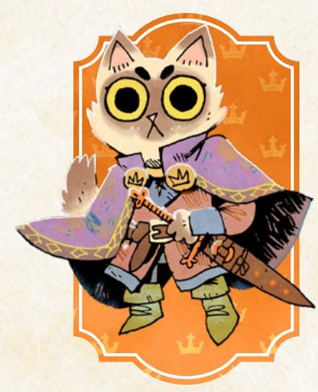

# The Marquisate

The invaders from another empire, led by the Marquise de Cat. Industrializing, forceful, opportunistic, and pragmatic.

The Marquisate is, at heart, a foreign power come from far-off Le Monde de Cat to conquer the Woodland. But it grows more tied to the Woodland each day. It builds new structures across controlled clearings; it recruits new soldiers and agents directly from ruled denizens; and it forces the culture of the Marquisate upon the Woodland, even as the Marquisate itself changes to adapt.

The core goal of the Marquisate remains what it has always been—to control the Woodland as another holding of Le Monde, a base from which the Marquise can further her ambitions. But as it adds new members to its ranks, its goals are drawn towards establishing order, industry, and prosperity in the Woodland.

{22}------------------------------------------------

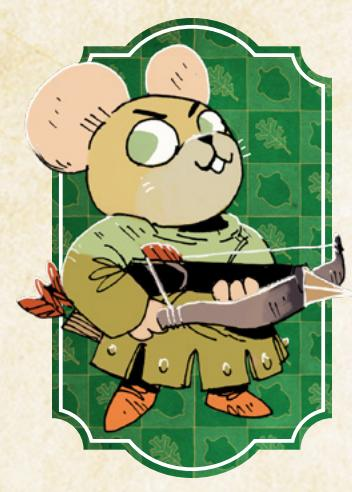

#### The Woodland Alliance

The vehement, vocal rebels of the Woodland. Passionate, disorganized, outmatched, and zealous.

The Woodland Alliance is a new, rising power in the Woodland. There have been rebellions before, of course, but rarely have the denizens of the Woodland been able to organize revolt across multiple clearings. The Alliance's ability to wage war across the Woodland gives them a real chance to change the nature of rulership in the Woodland.

The Woodland Alliance is determined to overcome the other factions that seek to dominate the Woodland. Ostensibly, their members also seek new government after the revolution…but their leaders only truly agree on overthrowing the old powers, not on what the new government looks like. The leaders of the Woodland Alliance also show differing levels of willingness to sacrifice the denizens themselves for the sake of the larger Woodland.

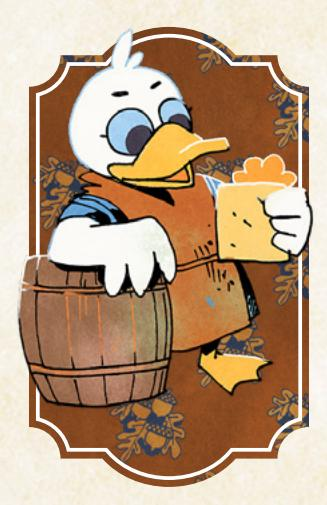

# The Denizens

The average inhabitants of the Woodland. Conservative, timid, downtrodden, and standoffish.

The denizens aren't a faction, as such—they don't have a dominant organizing principle, besides being "civilians." They're the individuals throughout the Woodland who aren't devoted to any particular faction. They're connected by trade and by travelers' stories.

The denizens, above all else, just want to live and be safe. There may be outliers looking to pick fights, but when denizens want to fight for causes, they veer towards membership in one of the factions. What defines the denizens is their dominant interest in continued survival amid the more powerful factions and their concern with the "ordinary" problems that arise in their day-to-day lives.

{23}------------------------------------------------


# The Vagabonds

Miscreants, outcasts, strangers. Rebels, mercenaries, and vigilantes. Vagabonds have always been a part of the Woodland. Those who weren't safe enough, accepted enough, or satisfied enough to settle down in a clearing. Those who didn't, couldn't, or wouldn't commit themselves to any particular faction. Those who were capable, skilled, and morally flexible.

"Vagabond" is an all-encompassing term for this kind of denizen, an individual who moves around from clearing to clearing, taking on odd, dangerous jobs, and likely causing trouble wherever they go. A vagabond is usually highly skilled compared to the average denizen—you don't survive for long in the lifestyle unless you're skilled or protected by another skilled vagabond. And they usually have a certain moral flexibility, a willingness to perform jobs for different, opposing factions, or to perform jobs that other denizens might find distasteful.

In particular, there is one act that sets all vagabonds apart from the rest of the Woodland: vagabonds are willing to travel through the forests. More impressive still, vagabonds are capable of accomplishing this feat with a fair chance of surviving. Most other denizens know better; they stick to the paths or clearings, the safe spaces, the places where authorities and guards are around to deal with bandits or bears or other threats. But the vagabonds, they'll cut through deep, thick forests, potentially traveling faster than any path-bound force. If the pay is right, they'll gladly troop into forests to root out bandits, or find their way to ancient ruins in search of relics and treasure.

The capabilities of vagabonds are the source of their value. The Marquisate, the Eyrie Dynasties, and the Woodland Alliance all have plenty of work for vagabonds to take on. A vagabond is most likely a match for any one soldier from any faction, and many vagabonds are capable of contending with entire squads. Vagabond tinkers can create devices and equipment that no normal

{24}------------------------------------------------

smith would even conceive of; vagabond vagrants can infiltrate dangerous spaces with lies and tricks no other denizen would be brave (or mad) enough to try; vagabond rangers can move a band through forests with a speed no other force can match. Vagabonds may be dire troublemakers, but they're so useful that most factions have a base level of tolerance for their nonsense.

Vagabonds don't tend to travel in groups. They're inherently loners, driven by their own quirks or desires to be apart from the rest of Woodland society. They'll often meet one another through their travels, however, coming to know each other's names and natures. They might even work together, when the job is tough and the reward is enough.

If a band of vagabonds were to arise, capable of sticking together, willing to help each other out and overcome challenges collectively…they could be a force to respect and fear. There are stories of such vagabond bands in the Woodland's myths, though it's hard to determine if any such tales are more than fable. But the alleged deeds of prior vagabond bands range from rescuing princes to defeating tyrants and freeing subjugated denizens.

A whole band of vagabonds, shoring up each other's weaknesses and supporting each other's strengths, has the potential to tip the scale on the larger conflict between the factions…

{25}------------------------------------------------

<span id="page-25-0"></span>

{26}------------------------------------------------

<span id="page-26-0"></span>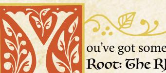

ou've got some notion of the Woodland and the setting of Root: The RPG—now it's time to get into the basics of the game itself! This chapter is all about the underlying skeleton

of the game, the core ideas you'll need in your head to create and grow stories about your own band of vagabonds.

# <span id="page-26-1"></span>The Conversation

What does a roleplaying game actually look like during play? If you were to watch a group sitting down to a game of Root: The RPG, what would you see and hear?

You'd see, at its most basic, a conversation playing out.

That's what a roleplaying game like Root: The RPG is at heart—an ongoing conversation between the players where they take turns talking about what happens next, who says what, how the world and other characters react, and so on.

When you hear "taking turns," don't think of something deeply rigid and regimented, like taking turns in a traditional board game—instead, think about an actual conversation you'd have with your friends. You "take turns" speaking, asking each other questions, joking, sometimes interjecting. It flows naturally and easily, and much of the time that's how Root: The RPG will feel during play!

Within the conversation, each player has a few roles to fill and jobs to do, things that direct their part of the conversation. Most of the players in the game have their own singular character—a player character, or PC—for whom they speak. The player describes what their character is doing or what their character looks like. They speak on behalf of their character, saying what the character says. They ask questions about what their character sees or knows, or where their character is.

But one person in the conversation has a different role: the Gamemaster, or GM role. The GM is still a participant in the conversations, but instead of speaking for one individual character, they speak on behalf of the entire rest of the fictional world. They describe the environment around the characters; they speak on behalf of all of the non-player characters, or NPCs, of the fictional world; they even say what happens when a character takes an action, though they often have help from the rules.

るが、このこれの一のでは、一のでは、一のでは、一のできるこれでは、

{27}------------------------------------------------

The conversation between you and your friends is always about the characters of your game, what they do, and the world around them. It's almost as if you're telling a story together, but not quite—the conversation in Root: The RPG unravels and reveals a story over time, especially when you look back on it, but while you're playing, you're thinking much more immediately, considering what to say next in the conversation. You respond to the questions and statements of the other people in the conversation, and follow them wherever they take you.

# Example

*I'm the Gamemaster, playing with some friends—Mark playing Mint the Ranger; Marissa playing Tali the Adventurer; Miguel playing Guy the Scoundrel; and Sam playing Hester the Tinker.* 

*"The cave mouth yawns wide, a big black hole amid the forest greenery around it," I say. "It matches the description of Bernird the smith perfectly—if he's right, the bear is in there."*

*"Oh, I don't want to go in there," Sam says, speaking for Hester. "Maybe we can lure it out?"*

*"We could do that," Mark says, speaking for Mint. "Maybe we use one of us as bait, and the others lie in wait on top of the cave! Who here is good at shooting arrows?"*

*Mark, Miguel, and Sam raise their hands. "I don't have a bow," says Marissa, speaking for Tali.* 

*"Looks like we have our bait!" says Miguel, speaking for Guy. "Don't worry, we'll get the bear before he can get his paws on you."*

*"I feel very reassured." Marissa laughs.*

# Framing Scenes

To make the conversation flow, you have to **frame scenes**. You have to set up situations in your game, in your story and your fiction, that then spur further conversation and give players enough information to make decisions.

A **scene** here is like a scene in a movie or a book, with a bunch of characters in a place, talking to each other or taking actions. The scene ends when it's time to move on and change something important—the location changes, or the characters in the scene change, or what they're doing changes, or time advances. For Root: The RPG, you can even think of a scene as a discrete chunk of the overall conversation of the game, as if it were one topic that you discuss to completion before moving on to a new topic.

So every time you start a session of Root: The RPG, the GM starts things off by framing a scene. When the time comes, they end the scene, too, and frame a new one. That's one of the key responsibilities of the GM—framing and ending scenes.

Chapter 3: The Fundamentals 27

{28}------------------------------------------------

The GM doesn't always frame scenes single-handedly—a player can suggest a scene, or ask for a scene, or build off something another player suggests. But the GM is the final arbiter of the scene framing.

When the GM frames a new scene, they describe the setting of the scene, which characters are there, and what's happening, if anything. The GM provides the important details so the conversation can begin. They don't have to cover every single exacting detail that might possibly matter—that's part of the conversation! Other players can ask questions of the GM, adding to the conversation by fleshing it out. But the GM has to frame the scene with enough detail that the players know what questions to ask.

#### Hard Scene Framing

Framing a scene doesn't mean starting at the "beginning" of a moment. You might frame a scene where the characters enter the room, introduce themselves, and start talking; but you also might frame a scene where the conversation is already going strong, someone has just insulted another character's beliefs, and daggers are close to being drawn.

That second example is called **hard scene framing**. There's no room for negotiation, no room to adjust and aim for a different kind of scene—the characters are in the scene, in that moment, dealing with that situation, and they have to react as best they can.

# Example

*Tali the Adventurer, Marissa's character, wants to go talk to the Earl of Flathome to try to talk him into freeing some unwitting, innocent denizens from his prisons. I could frame the scene with Tali talking her way past the guards and into the Earl's office…but instead, I decide to frame the scene hard.*

*"Tali, we pick up with you standing in the Earl's office. He's sitting behind his desk, his wings folded in front of him, his yellow eyes focused on you. Behind you, two of his elite hawk guardians stand with halberds—ready for anything to go wrong, or for the Earl to give the word. They've already disarmed you as a condition to get inside. The Earl opens his beak and says, 'So, vagabond. I hope this is worthy of my time.' What do you do?"*

# "What Do You Do?"

A key component to the conversation is the repeated refrain: "What do you do?" It's what the GM says to turn the conversation back to another player, a way of saying "It's your turn!" It prompts action, or it suggests that the players need more information to make a decision.

{29}------------------------------------------------

<span id="page-29-0"></span>Root: The RPG is all about action in the most direct way—it's about characters *doing things*. Leaping through windows, swinging swords, picking locks, running away. And characters can do things by talking, for sure—but it's about talking with a purpose, not just idly discussing things. They're talking to figure out what a foe is thinking, or to trick a silly guard into doing what they want, or to convince a Woodland Alliance conspirator to trust them with a secret.

"What do you do?" is a crucial question that ensures everyone is *able* to say what they actually do. When the GM asks the question, if a player can't answer because they don't understand the situation enough, then it's important to take a step back and make sure everyone's on the same page. But if a player doesn't want to answer because they don't want their character to have to make a hard choice…then the Woodland will move around them, whether they like it or not!

# <span id="page-29-1"></span>Moves and Uncertainty

Sometimes, though, you'll wind up in a moment where you don't know what happens next. It's not clear who should speak in the conversation or what they should say. A lot of the time, this happens when a PC takes an action whose outcome is uncertain. When a PC walks through a doorway, there's no uncertainty; the GM says what happens—and what happens is the PC walks through the doorway into a new room. When a PC dives out of a glass window three stories up, though, there's plenty of uncertainty! Are they cut by the glass? Do they catch a branch outside? Do they plummet to the ground below? Are they hurt?

In those moments, the table, and also the conversation, turns to the rules of Root: The RPG and the dice to resolve the uncertainty. Root: The RPG uses a rules structure with **moves**, which are discrete chunks of program-like rules covering lots of different areas within the game. There are lots of moves in the game, from basic moves that every PC will use, to playbook-specific moves that only those characters of a particular playbook can use. But almost all moves have a similar basic structure, with a **trigger** and a **result**.

The trigger tells you *when* the move comes into play. Triggers are always phrased as "When you do [x]…" or "When [x] happens…" They are both prescriptive and descriptive. If you want to roll the dice for the move, and get the results offered by the move, then you have to hit the trigger by taking action in the fiction. If you wind up taking the appropriate action in the fiction, then it doesn't matter whether or not you want to roll the dice—you've triggered the move, and its results come into play. The result tells you what outcomes of the move are possible.

{30}------------------------------------------------


A common way to phrase the way moves work is "To do it, do it." If you want the results of the move to *engage someone in melee*, then you have to do that in the world of the game—in the fiction (see "The Fiction" on [page 33](#page-33-0))—by describing yourself swinging your sword and dashing forward. And if you decide to start sword-fighting someone, then you're going to roll *engage someone in melee*. You took the action, so now you roll for results on the move…and to roll for results on the move, you must take the action.

The results of the move always come to bear after the move is triggered. Some moves will just say what happens: "When you do [x], [y] happens." But many moves require a die roll to see what happens: "When you do [x], roll with a stat (Charm, Cunning, Finesse, Luck, or Might), and depending on what you rolled, [y] or [z]] happens." You can see more on interpreting those results in "Hits and Misses" on [page 32](#page-32-0). Follow the full results of the move as written—don't fudge them or ignore them! You won't have to. Because a move can't possibly be perfectly suited to the exact situation in the fiction—it has to be open enough to apply to several similar situations—it will always require a GM to interpret the results to fit them to your specific fiction. That's perfect for making sure that the move and its results make sense.

{31}------------------------------------------------

Once you're done applying and interpreting the results of the move, then you go right back to the conversation, responding to those results, saying new things, and moving forward.

That's the flow of the game and the conversation in Root: The RPG. All the players and the GM talk, following the conversation as it flows, responding to each other's statements and questions, until you reach one of these moments when a move is triggered, when everyone is uncertain about what comes next. Then the rules kick in, you resolve the moment of uncertainty, and you get back to the overarching conversation. Sometimes you might reach a series of these moments in a row, but the pattern remains the same.

# Example

*Marissa, Tali's player, describes Tali sitting down nervously in the chair across from the Earl. "I try to put on a serious face. 'Thank you for meeting with me, Earl,'" she says*

*As the GM, I speak for NPCs like the Earl, and I choose to set a dismissive tone. "'Yes, yes, get on with it,' the Earl says, waving one wing at you dismissively."*

*"Right. 'I come to speak to you on behalf of Greta and Prewitt, the two rabbits you imprisoned for being Woodland Alliance spies. They're not spies at all—they're just foolish young bunnies who said things they shouldn't have. They don't deserve to be locked up for a youthful mistake, my lord Earl.' I look down when I say the last bit, I'm trying to look deferential."*

*I make the Earl's scoffing snort. "'You would have me release two individuals who might be dangerous spies, just because you think they're not? I need to make an example of these dissidents for the clearing.'"*

*"'But releasing them will make a different kind of example. It will show you're merciful, and it will deflate the Woodland Alliance's efforts in the clearing. The denizens will be grateful to you, and their will to fight will vanish.'"*

*I'm beginning to feel that uncertainty—I'm not sure how the Earl would react. He might hate being lectured by a vagabond, but he's also a shrewd operator, and Tali is making a good point. I look at the list of moves, and see the trigger for persuade someone: "When you persuade an NPC with promises or threats, roll with Charm."*

*"Hey, Tali, it sounds like you're persuading the Earl. You're promising him that if he does what you want, the Woodland Alliance presence in the clearing will start to die down. Is that about right?"*

*Marissa groans, but nods. "Yeah, I guess I am. I don't like that promise, but it makes sense."*

*"Great! Time to roll, then!"*

The only times you use the dice during the conversation are when the moves and rules call for it. Especially if you're familiar with other roleplaying games, you may feel a desire to use the dice to resolve moments in the conversation that you think are uncertain, even when there isn't actually a move to roll.

{32}------------------------------------------------

Don't do that. If there isn't a move to resolve the uncertainty in that moment, then it's actually not uncertain—the resolution is the GM's call, based on their agendas, principles, and moves (see page 194 for more on those GM tools).

#### <span id="page-32-0"></span>**Hits and Wisses**

When a move asks you to roll, you'll grab two six-sided dice (hereafter referred to as 2d6) and roll them. Most of the time you'll be rolling with something, meaning you'll add one of your stats to the result of the 2d6. So if you roll with Charm, and your Charm is a +1, you'll roll the 2d6 and add 1 to the result.

Moves with dice rolls split up the outcomes in the same categories:

- A 7 or higher is called a "hit" and means you'll get at least the main thing you wanted.
- A 10 or higher is called a "strong hit" and means you'll get almost all you wanted, or some additional benefit.
- A 7–9 is called a "weak hit" and means you'll get the main thing you wanted, but usually with some cost or complication attached.
- A 6 or less is called a "miss" and means that the GM gets to say what happens next, with an eye towards complicating the situation dramatically.

Crucially, try not to think in terms of concrete success or failure. It can be an easy shorthand to say "a 7 or higher is a success and a 6 or less is a failure," but that's not quite right, and it's depriving you of useful tools for making your game much more interesting! A 7 or higher is a hit, which means the player making the move will probably get the key thing they wanted...but it could be very messy, complicating the "success" in a way that makes it far from a pure victory. And a 6 or lower might, at the GM's discretion, translate into a "failure," where you don't get the thing you wanted...but it just as easily might turn into a situation where you get exactly what you wanted and it turned out to be *the wrong thing to want*, or a situation where you get what you wanted but in a way that far exceeds what you had intended.

Misses are opportunities for the GM to make their own moves—to say what happens—and they provide some of the most interesting complications in the entire game. Don't deflate them by thinking of them just as failures!

# Example

Marissa rolls for Tali's **persuade** move—2d6 plus Tali's Charm of +2. The dice, unfortunately, come up a 1 and a 2—a total of a 5. A miss. I think about what to do, and I see Tali's reputation with the Eyrie Dynasties—a -1, not tremendously low, but low enough to change the Earl's opinions. It gives me an idea!

"Yeah, the Earl looks at you, considering your words, and then a terrible grin comes over his face. 'An interesting proposal, indeed. The one flaw, of course, is that I

{33}------------------------------------------------

*cannot be seen as too merciful—that will diminish my position in the Eyrie. No, I cannot just release two prisoners and have nothing to show for it but the denizens' gratitude. I will need another prisoner to replace them. Perhaps a dangerous vagabond, a wanton would-be criminal who is a threat to our order. Someone whom the denizens of this clearing won't care about. Someone I can imprison with impunity and execute quickly.' He looks over to those two hawks with halberds. 'Take this one into custody. She's a criminal and a threat to the clearing.' Then he turns his yellow eyes on you again, that cruel smile still showing. 'Thank you for your help. It is most appreciated.' What do you do?"*

One more important note here: the GM never rolls dice for moves during play. The GM may roll dice for random tables to set things up—see "Making the Woodland" on [page 224](#page-224-1)—but they won't roll dice to resolve what happens. It's always the players rolling dice on behalf of their PCs. That keeps the focus on those PCs, their actions, and the results of those actions.

# <span id="page-33-0"></span>The Fiction

When you play Root: The RPG, your conversations are about **the fiction**—the full, encompassing, fictional world of your game. The fiction includes all the characters, the places, and the events of your ongoing game. It doesn't just cover the things that happen during your conversation—if one PC is the child of two important Eyrie nobles, and their backstory says that those Eyrie nobles were overthrown and have gone missing, then all of that is part of the fiction, too.

Think of the fiction almost as the "canon" of your game. What's true? What's questionable? What's been established? What makes sense? The fiction starts off primed by everything in this book (see Chapter 1), but it changes as you play. Everything you say and do during the game adds to and changes your fiction.

The fiction is all important to a game of Root: The RPG. Everything that goes on in the game has to take it into account. It creates the boundaries of the conversation that you're having.

Can a bird character fly? To answer, you go to the fiction: yes, they can fly. They have wings, and they live in the upper parts of the clearings. It makes sense. And now that you've said that, from that point forward, all players can reasonably assume a bird can fly.

Can a fox character fly? Go to the fiction: no, they can't fly on their own. They have no wings, they live on the ground. And now that you've said that, from that point forward, all players can reasonably assume foxes aren't going to be found in the sky.

Can a bird character fly if they're covered in plate mail and carrying a giant hammer and three sacks full of gold? Go to the fiction: no, it's too much. They can't take off; they're too heavy. Now, all players can make assumptions about

{34}------------------------------------------------

how birds have to deal with weight—birds are probably more predisposed to wear lighter armor and carry lighter weapons if they care about flying.

Can a fox character fly if they're wearing a leafy gliding apparatus made by an expert Tinker? Go to the fiction: well, the Tinker built it, and we know how skilled they are. But it still seems very dodgy. So, maybe? They can probably fly, but can they fly well? Or safely? Sounds like either the answer lies in a move the Tinker made when constructing the gliding apparatus…or that the fox is *trusting fate* now. Either way, we'll use a move to resolve the uncertainty.

That last example shows how crucial the fiction is. Understanding the fiction is how you can comprehend what is possible, and what actions and statements and truths make sense in the conversation. Most importantly, when you encounter a moment of uncertainty, the fiction helps you understand how and when moves are triggered.

# Shared Understanding

When you play Root: The RPG, the world of the game, the fiction, doesn't exist in any one player's mind, not even the Gamemaster's. It exists between everyone playing the game, a shared imagined world with its own truths, history, and rules. To play well and effectively, to use moves and resolve uncertainty, you must all be on the same page with the way you understand the fiction.

Let's say your character tells the guard, "I have served the Marquisate nobly, and you should allow me to enter the clearing." You must understand the fiction in that moment to recognize whether the character is telling the truth and trying to *persuade* the guard, or whether the character is lying and trying to *trick* the guard.

It's crucial not only to have an understanding of the fiction, but to have a **shared** understanding of the fiction. If you actually believe that you're telling the truth when you say you served the Marquisate nobly, but the GM believes that you're lying and tricking the guard, then there's a problem—you don't have a shared understanding of the fiction, enough for the correct move to be used and the conversation to flow forward.

When that happens, though, it's easy to resolve—just have a conversation to get on the same page!

{35}------------------------------------------------

# <span id="page-35-0"></span>Example

*"Okay, so you're lying? You're tricking the guard?"*

*"No, no! I mean it! We served the Marquisate that time, when we helped them recover their stolen jewels!"*

*"Yeah, but then you burned down their workshop, Opensky Haven."*

*"True, but these guys don't know about that! And to prove we're on the Marquisate's side, I can show them the medal the Marquise gave us after the jewel thing!"*

*"Hmm. Okay then—let's say that you're telling the truth and trying to persuade them right now."* 

Your game can be derailed if the players bring different assumptions about the fiction to the game, but just like everything else, it's all part of the conversation—so always clarify, ask questions, and make sure everybody's understanding of the fiction is more or less the same.

# Starting the Game

Before you get going with your game of Root: The RPG, there are a few things you need to prep, and a few things you need to hold in your mind.

# Preparing to Play

Make sure you know the space you're playing in. Whether it's a table with chairs or an online video call, think through what you're doing; how to adapt to the number of players; and the need for character sheets, reference sheets, and dice. To start, each player needs their character sheet (for their particular playbook), a basic moves reference sheet, and a character creation reference sheet. The GM needs their GM reference sheets and should probably also have a basic move reference sheet and a character creation reference sheet.

Each player needs a way to roll 2d6. You can get away with a single pair of dice in a pinch, but it's way easier if everyone has their own set. If you're playing online, pick out a shared dice roller and set it up. In tense moments, it's a lot of fun to watch together as the dice fall!

Each player needs some pencils and paper for extra notes. The GM, in particular, must be able to take notes on the Woodland, on individual clearings, and on NPCs. The Woodland Notepads are a great resource for these notes.

You'll need your map of the Woodland, be it a piece of paper, an online sketch, the board game map, whatever.

Finally, you'll need some time, probably between 3 and 4 hours. The first time you play, character creation is likely to take up to 2 hours to fill out all the

{36}------------------------------------------------

details, set up all the connections, and so on. From that point forward, a good session or "episode" of play can take about 3 or 4 hours to play out, so try to plan for at least that much.

# Woodland Expectations

Before you start play, everyone should be on generally the same page. That usually means that the GM will provide a base-level explanation—drawn from Chapter 2 starting on [page 11](#page-11-1)—of the Woodland, the factions at play, the nature of the denizens of the Woodland, etc. And the players can and should ask questions to make sure everybody's understanding of the Woodland is aligned.

But here are a few expectations that you should have about the Woodland to keep you in sync with the rest of the game.

#### <span id="page-36-0"></span>The Balance Tips Towards Fable

What do foxes—notable carnivores—eat in the Woodland?

Do birds have hands?

Is a wolf the same size as a mouse?

Root: The RPG tips a bit towards fable in its setting, in the answers to these questions and more. The focus isn't on straight realism—obviously not, when the game is about empires ruled by talking, upright, armor-wearing cats and birds!

So focusing too much on these setting details is not only unproductive, it's also contrary to the core setting of Root: The RPG. When you play, your focus is on the characters; the choices they make; and the difficulties of the Woodland and the factions around them—not on the specifics of exactly how a bird holds a sword.

If you find yourself saying about a bird, "Okay, he picks up the satchel in his hand," it's a slip, sure, because a bird doesn't really have hands! But by no means is it worth lots of effort to get right. So let these more specific, more questionable details slide—they're not as important for you to get right as the dramatic character situations and conflicts.

So what do foxes eat? What everybody else eats. Probably a decent amount of bread or hard tack.

Do birds have hands? More or less.

Is a wolf the same size as a mouse? Depends on the wolf and the mouse!

{37}------------------------------------------------


#### Close to Medieval…But with a Hint of the Fantastic

The Woodland in Root: The RPG is medieval in style. The kind of clothing characters wear, the kinds of weapons and equipment they carry, the kinds of problems they face…if you hold fictional medieval settings in mind when thinking about all these details, you'll be on the right track. The Woodland's history isn't a perfect mirror of the real world's history—for example, the kind of gender discrimination you might have expected in real medieval Europe is completely absent from the Woodland—but for the most part, you can easily function by holding medieval tropes in your mind.

There are, however, places and ways that the Woodland is significantly more fantastic than any real medieval setting. The Marquisate is rumored to have impressive, ample clockwork mechanisms—maybe they engage in a scheme to launch clockwork armies across the Woodland. Ancient astrologers of the 

{38}------------------------------------------------

Eyrie Dynasties may actually have gleaned important insights from the stars themselves. A Tinker vagabond may be able to rig up incredible devices out of branches, spider silk, cogs, and vines.

Don't shy away from these fantastic tidbits for the sake of adherence to the harsh medievalism of the larger setting. The strange, the unusual, the extraordinary, the otherworldly, even the nigh-supernatural—these are quite rare in the Woodland, but your vagabonds' story is a tale that might feature some surprising twists!

# Heroism with an Edge

The vagabonds of Root: The RPG aren't straightforwardly heroes. They're probably closer to anti-heroes by default, but even that isn't quite right. They'll often be self-centered and greedy, both because of the mechanics, and because the Woodland is a harsh, rough place. The vagabonds have had to be just as harsh and rough to survive as long as they have.

Some of them might have heroic aspirations, and over the course of play, they might change. But always, there's an edge. The vagabonds are pushed towards that same selfishness. The choices they face are never straightforward or simplistically heroic. The entire Woodland interferes with direct, obvious heroism.

Everyone should be on the same page that the Woodland is neither a place of great evil nor purest goodness. There may be antagonists who are capable of great evil and terrible acts…but they're isolated. Their followers won't be the same. And no one is inherently evil.

The Marquisate, the Eyrie Dynasties, and even the Woodland Alliance…they are all, for better and worse, a mix of grey, of good and bad. A Marquisate general's belief—that nigh-totalitarian control of the Woodland is a good thing—may be wrongheaded and evil, but they might still have the best of intentions, trying to rid the Woodland of the violence and pain that has plagued it throughout its existence.

If a PC chooses to believe that a situation is simpler, then that's on them. But the players and GM should all be on the same page that the Woodland is a complex place where nothing shakes out as easily as it might look.

# Focus on the Vagabond Band

Root: The RPG is geared towards telling stories about a band of vagabonds. That's crucial to keep in your mind as you play—the game isn't about soldiers in the organization of the Marquisate, or up-and-coming nobles of the Eyrie Dynasties. The mechanics and playbooks of the game won't support those stories nearly as effectively as the stories of a band of vagabonds.

{39}------------------------------------------------

That means two key things:

- If a character stops being a vagabond, they no longer fit the story of the game.
- If a character splits off from the band, the overarching group, for good, then they no longer fit the story of the game.

Vagabonds are defined by their independence and their traveling natures. They may grow in power in relationship to any of the factions but, ultimately, they're not a part of those factions—with all the costs and benefits associated with remaining apart. If they ever fully join a faction, then they're not really vagabonds anymore. Similarly, vagabonds travel across the Woodland, moving over path and forest. They may have a "home base," a particular place they like to come back to, where they can find safety and rest...but it's not the same as a real home, a place they call their own and don't want to leave. If vagabonds ever settle down, then they're not really vagabonds anymore.

A vagabond band is not all that common—most vagabonds travel independently and come together for temporary jobs before disbanding again—but that's why it's so special, and that's why **Root**: **The RPG** is about a band. The vagabonds in the band are connected by professional ties, by friendship, by real support and care, by mutual self-interest, or by something else altogether. Whatever it is, they're connected, and they've decided that they're better off sticking together than splitting up. If that ever changes and a vagabond wants to leave the band, then they're moving away from the game's spotlight.

In any of these cases, the most likely result is that the vagabond PC who stops being a vagabond or splits off from the band isn't a PC anymore. They might still be a character in the overall Woodland and in the fiction...but they're not one of the main characters of the story you're telling anymore. It's almost like when a character leaves a TV show; they might come back to guest star in an episode, but they're not part of the main cast anymore.

That's okay! Sometimes those moves make the most sense for a character and a story! None of this is to suggest that you *can't* have a vagabond settle down or split off from the band. The real takeaway here is that a character who does either of these things is moving away from the tone and focus of the game—so it's probably best to only do these things when everyone involved is okay with that character ceasing to be a PC. The player can easily make a new vagabond to jump into the band (see page 179), but the original character no longer fits the story and is, in one way or another, retired as a PC.

{40}------------------------------------------------

# <span id="page-40-0"></span>Why Play?

So, what will Root: The RPG do for you that is special to it, that you won't necessarily find elsewhere? Why play?

Because you get to play cat adventurers, bird warriors, mouse thieves, and fox con artists—all in a world filled with animal characters ranging from heroic to villainous and everything in between.

Because you get to tell the story of awesome, chaotic, skilled, surprising characters having adventures across an ever-changing landscape.

Because you get to actually change that landscape—the Woodland will respond to your characters' actions, good and bad, driving your choices home to you.

Because you can stand strong against dangerous powers, keeping innocents safe from their oppression, and come through victorious—if not unscathed.

Because telling dramatic stories about skilled and capable characters in tense situations is a path to moving, funny, involving, and exciting moments.

Because you want to go on capers, have heists, and rebel against tyranny, all in a world that might actually respond to your actions.

Because the Woodland is in danger, and you and your friends may be its greatest hope…if you can just avoid burying yourselves in trouble first.

{41}------------------------------------------------

<span id="page-41-1"></span><span id="page-41-0"></span>

{42}------------------------------------------------

<span id="page-42-0"></span>

hen you start any game of Root: The RPG, you have to make the player characters. Each player (except the GM) makes their own, and together these PCs constitute the band and the main

cast of your game. So this is not a duty to take lightly!

One important thing to know throughout the process—expect to flesh everything out as you go. Add details to descriptions and objects. Think about the questions someone might have about your character, and think about what the answers are. Never be afraid to add more detail above and beyond what's listed on your character sheet—that's how full, rich characters are made!

# Choosing a Playbook

To make a vagabond PC, you first need to pick a playbook. A playbook is a particular archetype, a set of ideas bound together as a guideline for your character—but not a straitjacket. Each playbook has plenty of room for you to build a unique vagabond!

There are nine playbooks in this book, each corresponding to one of the vagabonds in ROOT: A GAME OF WOODLAND MIGHT AND RIGHT, ROOT: THE RIVERFOLK COMPANY EXPANSION, and ROOT: THE Underground Expansion. These are the playbooks you'll find: The Adventurer, The Arbiter, The Harrier, The Ranger, The Ronin, The Scoundrel, The Thief, The Tinker, and The Vagrant. Each player will pick their own playbook, and no doubling up—each player must choose a different playbook than the others. That way you'll have a band of vagabonds with different traits, different problems, and different skill sets.

Each playbook is its own unique double-sided sheet. When you make your character, you'll print out your particular playbook and write all the pertinent information on those sheets, using it as the actual record of all your traits, abilities, equipment, and more, so this book often uses the terms "playbook" and "character sheet" interchangeably.

For more on the individual playbooks, see page 132.

# Example

*Derrick is making his new character. He looks at the playbooks to see what* matches his interests. He'd like a socially oriented character—not so much a fighter—so he's looking at the Adventurer and the Vagrant. Since Marissa is interested in playing the Adventurer, though, he decides to take the Vagrant.

上命し、こうべいのでしゅう、このでいるこうで

{43}------------------------------------------------

# <span id="page-43-0"></span>Filling Out the Playbook

While you're picking your playbook, you should be looking them over a bit. Once you know exactly which one you'll play, make sure you have that whole playbook in front of you. Skim it over, taking a look at your playbook's particular elements.

Next, work your way through the playbook, filling out many sections entirely, making some notes and marks in other sections. You'll make all of the crucial decisions to create your character's core framework through this process. Your character will continue to change and grow over time, and many parts of your playbook will change to match—but the decisions you make now will have a great effect on your character's identity and capabilities.

# <span id="page-43-1"></span>Name, Species, Details, and Demeanor

For these sections, you pick your name, your species, your details, and your demeanor. Choosing these elements can help sketch out the initial skeleton of your character. You can always revisit these later if you change your mind and want to pick something that better matches your developing character.

#### Name

For name, choose one option from the name list on the character creation worksheet or make up a similar option of your own. You might also have a nickname, like Scar or Patches, that other denizens call you!

#### Species

Your species is what kind of animal you are; either pick one option from the list, or add your own in the blank. There are four common animals in the Woodland—birds, foxes, mice, and rabbits. Other animals are less common, but the Woodland is a big place filled with lots of different creatures.

In fact, your species can more or less be anything, with a few limits:

- Don't pick an animal that is bigger than a wolf in the real world. All denizens in Root: The RPG are more or less person-sized, but it starts feeling a bit strange if you bring in larger animals...and in the background of the Woodland, a lot of the larger animals (deer, bears) are particularly strange or dangerous.
- Don't choose purely aquatic animals. Amphibious animals can work, but no fish. The denizens of the Woodland—and the other player characters—are going to be skewed heavily to land animals. Make sure you're picking an animal that can physically interact with the other denizens, and about whom you won't be asking every five seconds, "But how do your gills work above water? How can you breathe?"

{44}------------------------------------------------


Animals don't come with any special traits or abilities, beyond what makes sense in the fiction. Birds can fly. Moles can dig. Beavers can chew through wood. Foxes can scent other animals with ease. And on and on.

These abilities aren't special—they fit into the existing moves perfectly! When a bird tries to fly, if there's no tension and no uncertainty, then she just does. When she tries to fly to evade a flash flood, well, that sounds like *trusting fate*, or *attempting the roguish feat of acrobatics*. When a mole tries to dig a tunnel, if there's no tension and no uncertainty, then he just does. If he needs to dig a tunnel with perfect secrecy that comes up inside the Mayor's house…then maybe he's *attempting the roguish feat of sneaking*. And so on.

The biggest effect of choosing a particular species for your character is social. If you're a bird, then a lot of denizens will automatically associate you with the Eyrie Dynasties. If you're a cat, then they'll associate you with the Marquisate. If you're a rabbit, fox, or mouse, you'll be seen as a downtrodden, regular denizen of the Woodland. If you're a lizard, wolf, toad, anteater, or some other animal from afar, then you might be viewed with suspicion and mistrust. Everybody in the Woodland carries their own expectations and prejudices, and unfortunately, your species affects how others see you, even if you try your best to distance yourself from those factions.

#### Details

For details, you have three lines of options with a few details that are mostly unique to your playbook. Circle at least one option from each line, or fill in your own and circle it. You can circle more options if you choose for them to apply.

The first line is always the pronouns that your character uses; the second line is a small physical description of your character, to prime other players 

{45}------------------------------------------------

for picturing the character in their heads; and the third line is an interesting detail or item that you carry, not generally something of great use or particular advantage, but a trinket that means something to you.

#### Demeanor

For demeanor, choose one option and circle it, or fill in your own. Demeanor is just a short cue about your character's overall bearing and personality. As always, this is meant to be a prompt, a way to get you started with options that fit your playbook well—it's not meant to be a hard limit.

# Example

*Derrick looks at the name list and likes the sound of "Jinx." He considers for a minute making Jinx a mouse, but "opossum" keeps calling to him. Derrick likes the image of a vagabond who solves problems by playing dead and feels that an opossum is great for that! He circles it, picturing Jinx as a grey-furred rat-tailed opossum. But even though the character is an opossum, Jinx doesn't get any special advantage by playing dead—instead, Derrick will still roll to trick an NPC when Jinx tries, and that's when the Cunning stat will matter—but that's all something to think about later.* 

*For details, Derrick chooses from the pronouns line that Jinx uses "they" pronouns, and "patchwork" from the physical description line sounds good—Derrick sees Jinx as having patched-up clothes sewn from countless other garments. He likes three of the trinket options, so he circles all three—"tattered cloak," "luck charm," and "gambling paraphernalia." The good luck charm feels right, but he'll figure out what it is later. He sees the gambling paraphernalia as dice and a cup to roll them.*

# Background Questions

The background questions are prompts to get you thinking about and filling in your character's past. Every vagabond has a past, and those elements are great story fodder for interesting, dramatic scenes down the line.

Each playbook has five questions, and each question has a few answers you can select. The five questions are usually the same on every playbook, although some of the options differ from playbook to playbook. If you feel strongly, you can answer a question with a different answer from those provided, but you should see if the presented answers work at all—most of them have plenty of wiggle room to provide more specifics and further detail.

#### Where Do You Call Home?

This question is a combination of "where are you from?" and "what place matters deeply to you?" If you're a vagabond, you don't really have a place where you're settled, where you live day in and day out. But many vagabonds have a

{46}------------------------------------------------

place in their hearts held in special fondness, whether because they're from that place, or because they return to that place when they need to rest for a time. That's your home. Saying that it's one of the clearings means that clearing is an important place to you; saying it's the forest means that somewhere in the wilds of the Woodlands, you have a safe space to rest; and saying that it's a place far from here means that you're likely from elsewhere, not attached to any particular spaces in the Woodland.

#### Why Are You a Vagabond?

Every PC in a game of Root: The RPG is a vagabond. That means they don't settle down, they keep traveling around the Woodland, and they've had to acquire some degree of skill. But most importantly, they choose to continue being vagabonds. Answering why you are a vagabond speaks both to the events that brought you to be a vagabond in the first place, and to the reasons you continue to be a vagabond today. What's more, if you find the answer to this question is ever resolved, then it's fair to ask if that character would retire and settle down. If they wouldn't give up a life of adventuring yet…you need a new reason to keep being a vagabond.

#### Whom Have You Left Behind?

Becoming a vagabond always means leaving others behind, one way or another. Whether it's friends and family you left behind at your home or it's a teacher you left behind as you struck out on your own, there's someone who meant a great deal to you whom you left to move throughout the Woodland as a vagabond. When you choose your answer to this question, you choose a character of significance to you. Make sure you think about some details for them, like their name, species, why you left them, and where they might still be found.

#### Which Faction Have You Served the Most and With Which Have You Earned a Special Enmity?

Both of these questions have to do with your vagabond's relationship to the major factions present in your game. The factions are the powers like the Marquisate, the Eyrie Dynasties, the Woodland Alliance, and the denizens themselves. For each of these questions, you choose one faction, establishing that you've either aided them or harmed them in the past through your actions as a vagabond. Whatever you did, it was no little thing—the faction as a whole cares about and remembers what you did, to the point that your actions continue to influence their current feelings about you.

You mark two prestige with the faction you served, and one notoriety with the faction you harmed. Marking prestige means that you are coming closer to forming a good reputation with that faction. Marking notoriety means that you 

{47}------------------------------------------------

are coming closer to forming a bad reputation with that faction. You can choose the same faction for both questions if you like—it means you've both helped and injured the same faction. For more on prestige and notoriety, see [page 110.](#page-110-1)

And make sure over the course of character creation you think a bit about what you did to help or hurt those factions. There are plenty of other places throughout character creation where you might be able to flesh those details out, like when you establish your connections with other PCs ([page 50\)](#page-50-0) or when you establish the vagabond band's daring exploit [\(page 61\)](#page-61-0), so you don't necessarily have to decide right away. But at some point during character creation (most often when you introduce your character to the other players), you will explain what you did to help and hurt those two factions, so make sure it's percolating as you move forward.

# Example

*It's time for Derrick to fill in the background of Jinx. He decides that Jinx is from somewhere far from here—Jinx is an opossum and they see themself as coming from a family of opossums living deep in the woods. The reason Jinx is a vagabond, Derrick decides, is that they are on the run for their lies and tricks. Jinx has run one too many cons in one too many places; nearly anywhere they'd go, there are probably a few denizens who might recognize them and try to take retribution.* 

*Derrick also decides that Jinx recently left behind their best friend and former partner in crime, a combination of two of the answers on the Vagrant playbook. Derrick sees this friend, named Pell, as another scammer who ultimately settled down and left the life of endless tricks. He names the clearing Pell still lives in, based on the options on the map. Finally, Derrick decides that Jinx has served the Woodland Alliance the most—Jinx's tricks have been useful for the would-be rebels—and has earned a special enmity with the denizens themselves. The regular denizens of the Woodland are annoyed by the Vagrant's cons. Derrick marks two prestige with the Woodland Alliance, and one notoriety with the denizens.*

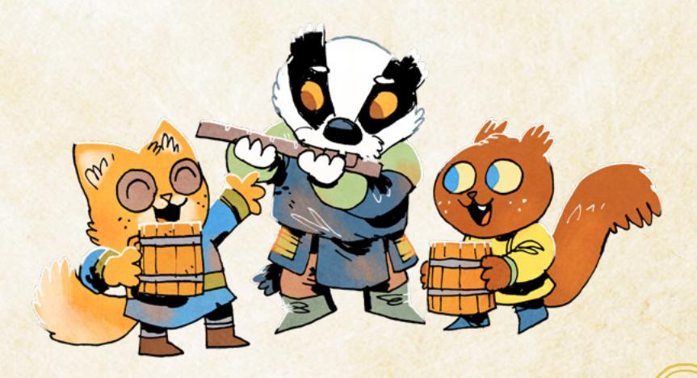

{48}------------------------------------------------

# The Stats

Every PC in Root: The RPG has five stats that measure, as a rough baseline, how good they are at particular things. Those five stats are: Charm, Cunning, Finesse, Luck, and Might.

Charm represents a character's facility with conversation, dialogue, and social interaction. The higher Charm a character has, the more likely they are to be able to persuade NPCs to act as they wish, or to figure out what's going on in other characters' heads.

Cunning represents a character's craftiness, perceptiveness, and cleverness. The higher Cunning a character has, the more likely they are to be able to trick NPCs to act as they wish, or to take in the situation around them and determine effective courses of action.

Finesse represents a character's manual dexterity and skill with their hands. The higher Finesse a character has, the more likely they are to be able to perform complicated roguish feats and do things like shoot a bow accurately.

Luck represents a character's sheer willpower, survivability, and, well…luck. The higher Luck a character has, the more likely they are to be able to scrape through dangerous or complicated situations more or less intact, but never without a price.

Might represents a character's pure physical strength. The higher Might a character has, the more likely they are to be able to smash apart doors or locks, or to be absolutely deadly in close-up melee combat.

Your playbook comes with a pre-chosen set of stats, showcasing the particular kind of character that playbook represents. You can adjust your character's prechosen set of stats slightly by adding +1 to any one stat of your choice, but you can't raise any stat beyond a +2 (right now).

In general, a +0 represents an average stat for a vagabond—which is still better than most Woodland denizens. Anything below a 0 means that when the vagabond tries to use that stat, they're taking a real risk. Anything above a 0 means that when the vagabond tries to use that stat, they're likely to remain in control and get what they want.

# Example

*As a Vagrant, Jinx's starting stats are Charm +2, Cunning +1, Finesse –1, Might 0, and Luck 0. Derrick gets to add +1 to any one stat of his choice, as long as he doesn't raise it above a +2. Charm's out, then. Derrick thinks about Luck—he can see Jinx as someone who's relied on sheer good luck and will to make it through tough situations—but he ultimately chooses Cunning so that Jinx can run their tricks with even greater facility.*


{49}------------------------------------------------

# Who Decides?

Who decides when you have achieved your drive or followed your nature? Does the player call it out, or is it the GM's call?

Ultimately, it's the GM's call, but the answer is often somewhere in the middle. If the GM notices that a vagabond has fulfilled their nature or drive, the GM should call it out—it's a chance to get on the same page about how and when it is fulfilled, and to give that character an appropriate reward for dramatic play. In practice, though, it's a lot harder for the GM to keep track of every vagabond's natures and drives along with everything else going on in the game. So the most likely course of events is that the vagabond's player fulfills their nature or drive and calls it out.

If a player thinks they have hit their condition for a nature or drive, they should say so aloud. Most of the time, the GM will be on the same page, and everyone will agree that you've fulfilled it. If the GM does disagree, then it's a good opportunity to get on the same page about what the drive or nature means. And if the character's drive or nature doesn't feel right anymore, it's always possible to change it—see [page 177](#page-177-1) for more!

# <span id="page-49-0"></span>Nature & Drives

Every vagabond PC has a nature and two drives. Your **nature** speaks to your inner character, a kind of baseline description of what you feel, how you act, and most importantly, how you relieve stress. Your nature describes a way that you can clear all of your exhaustion track, usually by getting into trouble or giving in to some difficult urge. Exhaustion is one of your harm tracks, measuring how tired your character is; clearing it gives you a burst of energy to be much more effective. For more on exhaustion, see [page 55](#page-55-0).

You are never required to follow your nature, but you will likely want to over the course of play, whether because it makes sense for your character or because you need to clear your exhaustion track. Pick a nature that you're interested in actually following; if you can't see yourself ever fulfilling your nature, then it's not a good choice.

Your **drives**, on the other hand, speak to deep wants within your character. If your nature is a kind of dangerous instinct of your vagabond, then your drives are desires that come up again and again. Your drives each give you a condition by which you can advance—fulfill the condition, and your vagabond grows just a bit stronger, just a bit more effective. For more on advancement, see [page 170.](#page-170-1)

You have two drives, and you can advance once for each drive per session. Similar to your nature, pick drives that you're interested in pursuing. During 

{50}------------------------------------------------

play you will look for opportunities to fulfill your drives and advance, so if you're not interested in doing that for a particular drive, it's not a good choice.

# Example

*Derrick knows that he wants Jinx to be a tricksy con artist. He looks at the Vagrant's two natures, Drunk and Hustler, and instantly chooses Hustler—it fits Jinx's mischievous, deceptive manner way better. Then, Derrick looks at the Vagrant's drives. Clean Paws kind of speaks to his desire for Jinx to trick other people into acting how Jinx wants and then appear to be innocent…but he's most interested in Chaos and Thrills. Derrick can see Jinx trying to fulfill those drives much more often during play, so he picks Chaos and Thrills as Jinx's two drives.*

# <span id="page-50-0"></span>Connections

Your connections set up your relationships with the other vagabonds in your band. Most vagabonds have heard of each other and know about each other's reputations—they're all in the same "profession," after all. But you and your fellow PCs are particularly connected to one another. You've worked together, pulled heists together, fled from the authorities together. You're friends, coworkers, allies, maybe even family. Your connections establish those relationships between you.

Each connection includes a few elements: a category, a sentence with a blank space, and a mechanical effect. The category is a general notion of how you feel about the other vagabond in the connection—you see them as family, a fellow professional, a friend, etc. The sentence is a description of the actual, specific relationship and history you have with each other. You'll fill in the blank with the name of the other vagabond in the connection. Finally, the mechanical effect is a change, tweak, or advantage that you get because of your relationship. Unless otherwise noted, the mechanical effect applies only to you.

Every player has two connections on their own playbook. Each connection links you and another PC. You'll wind up with at least the two connections on your own playbook linking you to other PCs, but you might wind up with more connections when other PCs choose your character to fill in the blanks on their own connections.

When you make your characters, you fill in your connections last. After everyone has made their characters in all other respects, go around the table one at a time. Choose a single connection, and fill in the blank with the name of another PC vagabond. Always choose a PC—never an NPC denizen or vagabond. If there are questions about the connection, answer them. The GM may ask a few additional questions to fill in details of the connection, to make sure it's fleshed out and everyone has a shared understanding of the PCs' histories with each other.

{51}------------------------------------------------

After you've gone around once, go around a second time, filling in names for the second connection. Don't pick the same vagabond for both of your connections. It's fine if you fill in another vagabond's name in a connection on your own playbook, and they fill in your name in a connection on their playbook. Think about how the connections build on each other to flesh out your relationship.

Every connection in this book has one of six mechanical effects, depending upon the type of connection. Most mechanical effects list a specific trigger for when they come into effect during play—for example, the Protector connection only comes into effect "when they are in reach." The Partner connection has an immediate effect that comes into play as soon as you establish the connection, as well as an ongoing effect during play. As mentioned above, the specific fictional relationship of the connection varies a bit based on the prompt for the connection. Here are the mechanical effects, listed for reference.

#### Protector

*When they are in reach, mark exhaustion to take a blow meant for them. If you do, take +1 ongoing to weapon moves for the rest of the scene.*

# <span id="page-51-0"></span>Partner

*When you fill in this connection, you each mark 2-prestige with the faction you helped, and mark 2-notoriety with the faction you harmed. During play, if you are spotted together, then any prestige or notoriety gains with those factions are doubled for the two of you.*

#### Watcher

*When you figure them out, you always hold 1, even on a miss. When you plead with them to go along with you, you can let them clear 2-exhaustion instead of 1.*

#### Friend

*When you help them, you can mark 2-exhaustion to give a +2, instead of 1-exhaustion for a +1.*

# Professional

*If you share information with them after reading a tense situation, you both benefit from the +1 for acting on the answers. If you help them while they attempt a roguish feat, you gain choices on the help move as if you had marked 2-exhaustion when you mark 1-exhaustion.*

#### Family

*When you help them fulfill their nature, you both clear your exhaustion track.*

{52}------------------------------------------------

#### Example

After hearing about all the other characters, Derrick introduces Jinx—mischievous con artist that they are. When it's Derrick's turn to select a connection, he thinks about which connection to use with which fellow PC. First, he chooses to fill in Jinx's Family connection—"After \_\_\_\_\_ and I pulled off an impressive heist and stole something very valuable from a powerful faction, my bad choices landed me in dire straits. But they bailed me out, and we've been close ever since."—with the Thief, Cloak. It makes sense to Derrick—Jinx and Cloak are two of the characters most interested in straight theft, and after talking about it a bit, they decide to say that they stole a whole cart of gold from the Marquisate. Then, after it comes around to Derrick's turn again, he chooses to fill in Jinx's second connection, the Watcher connection—"\_\_\_\_ saw through one of my cons and turned it back on me. How? Why did we forgive each other?"—with the Harrier, Quinella. He figures that she managed to scam Jinx for the coin they were trying to get out of her, and that the two got along fine after because Jinx was so impressed!

# <span id="page-52-0"></span>Faction Reputation

This is how you keep track of the ways other factions view you. Your reputation is the number you have circled for a given faction, ranging between -3 and +3. The higher the number, the better a faction's view of you. A +0 means members of the faction haven't heard much about you, or what they've heard is conflicted—they're not sure if you're a friend or foe. A +3 means that members of the faction view you as practically a hero, certainly as one of their own. A -3 means that members of the faction view you as a dire threat—and they'll probably try to take you down on sight.

# -3 | | | | -2 | | | | | -1 | | | | | | | | | | | | |

Write the name of each faction in your game into the blanks on your character sheet (make sure you remember to include "Denizens" in that set!). When play starts, not counting any boxes you marked for connections or your background connections, your reputation is a o with each of those factions—circle the number o to indicate that.

Every time you're told to mark I prestige with a faction, mark a box to the right of the o on that faction's line. Every time you're told to mark I notoriety with a faction, you mark a box to the left of the o on that faction's line.

-3 | | | | -2 | | | | -1 | | | | | | | | | | | | | |

{53}------------------------------------------------

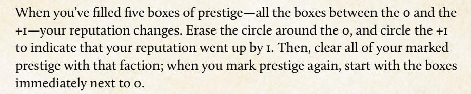

To go from a +1 reputation to a +2 reputation, you must fill all the prestige boxes between 0 and +2, ten boxes in total. Similarly, to go from +2 to +3 reputation, you must fill all the prestige boxes between 0 and +3, fifteen boxes in total.

Notoriety works much the same way. When you've filled all the boxes between o and -1, you would lower your reputation, erasing the circle around the o and circling the -1, and clearing all your marked notoriety with that faction. To go from -1 to -2 reputation requires you to fill all the notoriety boxes between o and -2—six boxes in total. To go from -2 to -3 reputation requires you to fill all the notoriety boxes between o and -3—nine boxes in total.

If your reputation is above 0, then filling all the notoriety boxes between 0 and -1 will drop it a level. For example, if your reputation is +2, and you fill the three notoriety boxes between 0 and -1, erase your +2 reputation, circle +1, and erase all the marked notoriety boxes for that faction.

If your reputation is below 0, then filling in all the prestige boxes between 0 and +1 will raise it a level. For example, if your reputation is -2, and you fill the five prestige boxes between 0 and +1, erase your -2 reputation and circle -1, and erase all the marked prestige boxes for that faction.

$$-3 \bigcirc \bigcirc \bigcirc -2 \bigcirc \bigcirc \bigcirc \bigcirc \bigcirc \bigcirc \bigcirc \bigcirc \bigcirc \bigcirc \bigcirc \bigcirc \bigcirc \bigcirc \bigcirc$$

{54}------------------------------------------------


During character creation, you'll only change your reputation through background questions and some connections—but it's not impossible to start with a +1 or a -1.

Prestige and notoriety tracks are independent from each other. When you mark enough prestige that your Reputation would go up, you only clear your prestige. When you mark enough notoriety that your Reputation would go down, you only clear your notoriety. Whenever Reputation would change, the relevant track—and only that track—is cleared.

If a Reputation loss or gain shifts the threshold for when prestige or notoriety would shift Reputation, the new threshold applies. This might lead you to instantly make two changes to your Reputation that ultimately cancel each other out, but clear out much of your prestige and notoriety.

When you clear prestige or notoriety because of a Reputation change, you should only clear as much as you need to reach the new number. Any extra prestige or notoriety is left over, starting from +0, to apply to the next Reputation shift.

 $-3 \bigcirc \bigcirc -2 \bigcirc \bigcirc -1 \boxtimes \boxtimes \boxtimes +0 \boxtimes \boxtimes \boxtimes \boxtimes \boxtimes (+1) \boxtimes \boxtimes \bigcirc \bigcirc +2 \bigcirc \bigcirc \bigcirc +3$ 

-3 O O -2 O O -1 O O O O O O O O O O O O O O O O

-3 ○ ○ 0 -2 ○ ○ 0 -1 ○ ○ ○ +0 ⊠ ⊠ ○ ○ ○ (+1) ○ ○ ○ ○ +2 ○ ○ ○ ○ +3

# Example

Because they served the Woodland Alliance most, Jinx has two boxes of prestige—the first two to the right of the o—marked. And because they managed to earn a special enmity with the denizens, they have the first box of notoriety—the first to the left of the o—marked. Then, because Keera the Arbiter chose Jinx for her Partner connection, Derrick has to mark two additional prestige boxes with the faction Jinx and Keera helped, and two additional notoriety with the faction Jinx and Keera harmed. Derrick winds up marking two prestige with the Marquisate, and two notoriety with the denizens—pushing Jinx to a —I reputation with the denizens! Derrick erases the o, circles the —I, and clears all the notoriety for the denizen track.

{55}------------------------------------------------

# Moves

Every playbook comes with its own set of moves—special abilities, expertises, advantages, and traits that a vagabond might have. Sometimes, playbook moves will just change your stats. Sometimes, they'll give you a whole new trigger and result. All of the moves on a playbook are geared to support that playbook's overall archetype.

When you create your character, you'll usually get to choose three out of six of your moves to start with. Choose moves that sound interesting and exciting to you!

For more on the playbooks and their moves, see Chapter 5.

# Example

*Derrick has to pick three playbook moves for Jinx from the Vagrant playbook. He takes a look at his options and likes the look of Let's Play, a move that lets Jinx gamble to get information out of people; Pocket Sand, a move that Derrick hopes will give Jinx some options in a fight; and Desperate Smile, which Derrick thinks fits Jinx's likelihood to rely on desperate begging to save their skin. Derrick likes the look of Instigator and Charm Offensive as more ways to handle fights, but he thinks the other playbook moves suit his character better to start. He notes Instigator and Charm Offensive for future advancements.*

# <span id="page-55-0"></span>Harm Tracks

Your harm tracks represent different kinds of "harm" or "costs" you might suffer. Usually, you'll want to keep them as empty and unmarked as possible.

Every PC vagabond has three harm tracks: depletion, exhaustion, and injury. They all start the game four boxes long. You won't have to make any changes to these tracks during character creation.

**Depletion** tracks how much assorted equipment and supplies you're carrying. You can mark depletion to have a small, useful item, pulling it from a pouch at the right moment. You can also mark depletion for extra money, or on some moves that ask you to pay it as a cost. When all the boxes on your depletion harm track are filled, then your pockets are empty—you can't mark any more depletion, for any reason.

**Exhaustion** tracks how much energy you have left, and how tired you are. You won't choose to mark exhaustion without a specific move, effect, or GM move asking you to, but several moves have you pay exhaustion to avoid some consequence (like *attempt a roguish feat*, see [page 68\)](#page-68-1). When all the boxes on your exhaustion harm track are filled, you're utterly drained, just about to drop into unconsciousness or powerlessness—in this state, you can't choose to mark exhaustion for any reason, and if something else inflicts exhaustion harm on you, you become unconscious or entirely removed from action.

{56}------------------------------------------------

**Injury** tracks how much physical harm you've suffered. Similar to exhaustion, you won't choose to mark injury without a specific move or effect asking you to. Injury is usually inflicted upon you when things go wrong—when you fall too far, when someone's sword connects with you, and so on. When all the boxes on your injury track are filled, you're on death's door. You're barely able to function physically—definitely no running, jumping, or fighting (if you try, you're asking the GM to make a hard move against you)—and you need medical attention immediately. If something inflicts injury harm on you while your injury track is filled, then your character perishes.

To see more on harm and harm tracks, see [page 125.](#page-125-1)

# Roguish Feats

Roguish feats represent particular larcenous skills that a vagabond has picked up. Vagabonds are very skilled—no one lasts long as a vagabond if they aren't possessed of enough willpower and skill, so the only vagabonds around for an extended time are all widely capable, with their own smaller array of specialized skills. Roguish feats are how Root: The RPG represents some of the criminal abilities vagabonds have acquired over their careers.

Roguish feats are used hand in hand with *attempting a roguish feat*. Over the course of play, you often attempt tasks that fall in line with a roguish feat. If you have that feat marked on your playbook—abbreviated to "having that roguish feat"—then you're *attempting a roguish feat*: you roll with Finesse, and the move will give you more controlled results. If you *don't* have that feat marked on your playbook—abbreviated as "not having that roguish feat"—then you're *trusting fate*: you roll with Luck, and no matter how well you roll, you're going to pay a cost or suffer a complication. For more on both these moves, see [page 83.](#page-83-0)

Put another way—having a roguish feat means that you're much more likely to keep control of a situation in which you're counting on your larcenous abilities. Not having the feat doesn't mean you can't attempt those acts, but it does mean that you are going to face some consequence or messy circumstance whenever you do.

Most playbooks have your roguish feats pre-selected, so you don't have a choice to make. Some playbooks give you a choice, and you pick one or more from the list.

# Example

*Derrick doesn't need to pick any roguish feats for Jinx—for the Vagrant, they're preselected as Pick Lock and Sleight of Hand. Derrick likes the look of Sneak for sure, and makes a note of it for future advancement. For now, though, when Jinx sneaks, Derrick will roll to trust fate.*

{57}------------------------------------------------


# Weapon Skills

**Weapon skills** represent special combat-related techniques that a vagabond has mastered. The same way that roguish feats represent particular larcenous skills a vagabond has picked up, weapon skills represent combat skills a vagabond has acquired. They are advanced moves giving vagabonds special, particularly effective maneuvers during fights. They give vagabonds the ability to contend with dangerous, potent enemies, and with larger groups of foes—though even then, they're far from invulnerable.

There are three basic weapon moves that all characters have access to—*engage in melee*, *target someone*, and *grapple with someone*. As long as a vagabond is in the right place to use those moves in the fiction—they have the right equipment, they're at the right range, etc.—they can use those moves. For example, any vagabond can *target a foe* at far range if they have a bow.

In order to use any of the other weapon moves, a vagabond needs to have the weapon skill marked on their playbook. Most of the weapon moves also require the vagabond to wield an appropriate weapon, tagged with that skill, though there are some exceptions like *improvise weapon*. The important takeaway for you is this: it's not enough to just have the weapon skill marked on your playbook, and it's not enough to just have a weapon with the right tag. For most weapon moves, you must have both.

{58}------------------------------------------------

When you're creating your character, you pick one weapon skill to start with from a set of four specific to your playbook. The set of four is bolded on your playbook; the bolding only matters for character creation. From that point forward, you can get more weapon skills through advancement or special moves, and all of them are open to you. For more on advancement and weapon skills, see [page 176](#page-176-0).

You may get more weapon skills during character creation through a playbook move, like *Dirty Fighter* on the Ranger playbook. Usually, these moves grant weapon skills that don't count against your maximum limit of six weapon skills gained through normal advancement. Mark weapon skills you gain through a move with a single slash instead of a full X, to indicate they don't count against your maximum.

For more on weapon moves and how to use them, see [page 89.](#page-89-1)

# Example

*Derrick gets to pick Jinx's starting weapon skill from Improvise, Parry, Quick Shot, and Vicious Strike. Improvise seems handy and like it fits Jinx's style, but Derrick settles on Vicious Strike—Jinx is the type to take advantage of dirty fighting across the board.*

# <span id="page-58-0"></span>Equipment

Vagabonds have plenty of bags, satchels, pouches, backpacks, pockets, and more. They carry plenty of knickknacks, coins, assorted herbs, and more. Most of that stuff is represented by the depletion harm track (see [page 125](#page-125-1) for more on depletion) as general gear your vagabond carries.

When Root: The RPG refers to equipment, it refers to important, larger, specific, and non-replaceable items. Your sword or your bow are pieces of equipment. Your armor is a piece of equipment, as is your shield. Arrows aren't equipment in the same way…unless they're very special arrows. A lockpick isn't equipment and is better represented by depletion…unless it's a masterwork, unbreakable lockpick.

In terms of the game's rules, a piece of equipment is something that has both a **wear** track and its own **tags**. **Wear** is a special harm track unique to an individual piece of equipment, representing the equipment's durability. When all the boxes of a wear track are full, then the associated piece of equipment is damaged pretty badly, to the point that it's barely functional. If you ever need to mark another box of wear on a piece of equipment with a full wear track, then the equipment is destroyed entirely, beyond repair.

{59}------------------------------------------------

**Tags** represent special traits, moves, abilities, and other mechanical effects that a piece of equipment might bear. They range from traits that make a weapon more effective in combat, to abilities that make a flute particularly useful for putting on shows.

**Weapon move tags** are a specific kind of tag that allows a wielding vagabond to use a particular weapon move—as long as they also have the appropriate weapon skill (see [page 90](#page-90-0)).

A weapon will also have at least 1 Range by default. That is the range at which the weapon can reach enemies, the range at which it is effective. There are only three ranges—intimate, close, and far. For more on ranges, see [page 91](#page-91-0).

If an item isn't significant enough to have wear or tags, then it isn't a piece of equipment within the game's rules—it can be discarded, forgotten, lost, and ignored without much trouble. This is the difference between a single, unimportant torch, and a special bull's-eye lantern crafted with colored glass from the far away Domain of the cats.

# Load

You can't carry an infinite amount of equipment without consequence. Every vagabond can carry only so much **Load** without being burdened—4 by default, modified by your Might. If you have a Might of +1, you can carry 5 Load; if you have a Might of –1, you can carry 3 Load. Carrying handheld, pocket-sized, or lighter wearable items doesn't use up any Load. But larger, significant, or heavier items use up 1 Load.

Think of Load as an indicator of large and obvious items when someone sees your vagabond. Your armor, your sword, your bow, your shield—someone looking at your character would see them all on the body, hanging from a scabbard, slung over a shoulder—and each would use up 1 Load. The knife that your character has in their boot, however, wouldn't use up any Load.

A particularly large or bulky item might have a flaw tag that makes it take up 2 Load—a huge sword, for example. If an item is small or easy to carry, then even if it has wear, you can carry it without it using up any of your Load.


{60}------------------------------------------------

If you're ever carrying more Load than your maximum, then you're burdened meaning that you're slow, you're not able to move quickly or easily, and the GM will make moves as appropriate. You absolutely cannot carry more Load than twice your maximum.

#### Buying Equipment at Character Creation

When you create your character, you also get to choose your equipment, keeping in mind your Load. You get some amount of **Value** to spend on customizing what equipment you carry.

Root: The RPG represents "money" in the form of Value—an abstracted measure of general worth. Every faction uses different coinage, and many clearings rely primarily on barter, so Value is how the game represents currency as a mechanic. Every piece of equipment is worth a certain amount of Value, based on this simple formula:

#### **Boxes of Wear + Extra Ranges + Special Tags + Weapon Move Tags – Flaw Tags**

A sword with three boxes of wear, one special tag, one weapon skill tag, and no flaw tags would have a Value of 5.

You can spend your starting Value however you choose, and you get to keep anything you don't spend in coinage or valuable goods that you're carrying and can use for money later. For more on equipment, including a list of equipment tags and pre-made items, see [page 181](#page-181-1).

# Example

*Derrick has 8 Value to spend for Jinx on equipment. He knows he wants Jinx to have a special dagger, so he picks out a baseline dagger from Chapter 7 [\(page 191\)](#page-191-0), and adjusts its traits a bit. Ultimately, he winds up with a blade that has two boxes of wear, two ranges (intimate and close), the Vicious Strike weapon move tag (to make sure he can use his starting weapon skill), and the Mousefolk Steel special tag, for a total cost of 5 Value. He names it the Jinxblade and records it on the equipment section of his sheet.*

*He also decides that he wants something armor-esque, but that Jinx wouldn't really be wearing armor. He picks out a robe with one box of wear and the special trait Friendly, for a total cost of 2 Value. That leaves Jinx with 1 Value leftover, which Derrick chooses to hold onto as a bag of coin. The Jinxblade started as a dagger, but Derrick and the GM agree that because of its two ranges, it's more of a short sword now, so it uses up 1 Load. Jinx's robes are specifically light and cloth, so they don't use up any Load, and the bag of money is small enough to just fit in their pouches, so it uses up no Load. Jinx is only using up 1 of their 4 total Load!*

{61}------------------------------------------------

# <span id="page-61-0"></span>The Vagabond Band's Daring Exploit

Finally, the last step in all character creation is one for the group to do collectively. When you start play, your group of vagabonds, called a **band**, didn't just come together yesterday. You all know each other and have some initial relationships, thanks to your connections, but the whole group has been together for a bit of time before play even begins.

To represent this, you and your band has accomplished some daring exploit together. They might have changed your map of the Woodland (see [page 224](#page-224-1)  for more on the Woodland map). To determine what you have accomplished together, roll 1d6 to find the corresponding exploit on the list:

- **1. Added a new path:** Draw a new line connecting two clearings. Try to use a different color or style of line (dotted or dashed) to indicate the new path as different from all of the old paths. Every vagabond in the group marks prestige and notoriety with any factions connected by the new path. Explain how you built the new path. When you travel along your band's path, take +1 to the roll.
- **2. Destroyed an existing path:** Add an X or other symbol indicating the place where you damaged or destroyed the path. Don't destroy the only path connecting a clearing to the rest of the Woodland. Every vagabond in the group marks prestige and notoriety with any factions connected by the destroyed path. Explain how you destroyed the path. When you travel through the forest where the path used to be, take +1 to the roll.
- **3. Changed ownership of a clearing:** Change which faction is in control of a clearing, or remove all faction control and return it to the denizens. Every vagabond in the group marks 3-prestige with the faction now in control, and marks 3-notoriety with the faction removed from control. Explain how and why you changed the ownership of the clearing.
- **4. Defended a clearing from faction attack:** Every vagabond in the group marks 3-prestige with the defending faction, and marks 3-notoriety with the attacking faction. Explain which clearing you defended, how you defended it, and why you defended the clearing from changing hands. Mark the clearing that launched the attack and the clearing you defended by drawing a dotted arrow from the attacker to the defender—that conflict is likely to flare up again.
- **5. Discovered and explored a valuable ruin of the forest:** Add the explored ruin to the map and describe some aspects of the ruin, including which denizens once lived there. If you shared information about the ruin with a faction, every vagabond in the group marks prestige with that faction. If you sold your finds from the ruin, every vagabond in the group gains 3 Value worth of coin or equipment. If you kept your finds from the ruin, the GM will tell you what artifact you found.

{62}------------------------------------------------

**6. Performed a remarkable heist:** This heist earns the vagabonds more Value to start, and greater reputations. Every vagabond in the group marks 2-prestige with the faction you helped in your exploit, and 2-notoriety with the faction you harmed in your exploit. Every vagabond gains 2 Value worth of coin or equipment. Explain what you stole, why it was remarkable, and how taking it harmed one faction and aided another. Mark the site of your heist and what you stole on the map.

#### Random Faction

| 1d6 | Faction                      |
|-----|------------------------------|
| 1   | Denizens                     |
| 2   | Your 1st faction             |
| 3   | Your 2nd faction             |
| 4   | Your 3rd faction             |
| 5   | Your 4th faction, or reroll. |
| 6   | Your 5th faction, or reroll  |

#### Random Clearing

| 2d6 | 1-3         | 4-6         |
|-----|-------------|-------------|
| 1   | Clearing 1  | Clearing 2  |
| 2   | Clearing 3  | Clearing 4  |
| 3   | Clearing 5  | Clearing 6  |
| 4   | Clearing 7  | Clearing 8  |
| 5   | Clearing 9  | Clearing 10 |
| 6   | Clearing 11 | Clearing 12 |

The group of vagabonds can collectively choose which clearing they affected, and which factions (from those that make sense in the fiction) were involved. If they cannot agree, or if the players want a random choice, then the GM can determine these aspects randomly.

To determine factions randomly, roll 1d6 using your existing factions on the **Random Faction** table. Most games of Root: The RPG only feature four factions; the GM can reroll a 5 or 6.

To determine a random clearing, either drop a d6 on your map and choose the clearing closest to where the die falls, or roll 2d6 and use the **Random Clearing** table to choose which clearing was affected.

After determining which exploit the band accomplished, where they accomplished it, and which factions were involved, spend some time fleshing out details. The GM can ask questions of different PCs throughout to have each player fill in more details!

# Ready for Adventure!

Once you've established your band's exploits, you're ready to play! The whole of the Woodland awaits you—daring adventure, political intrigue, mysterious ruins...and any kind of trouble someone is willing to pay your band to handle.

{63}------------------------------------------------

<span id="page-63-0"></span>

{64}------------------------------------------------

<span id="page-64-0"></span>

s discussed in Chapter 3 (page 26), Root: The RPG uses "moves" as its core rules framework during play—in other words, the moves of the game are the mechanisms used more

than anything else while you're playing. Each of the many different kinds of moves is a sort of nugget of rules, its own process for resolving a moment in the game's conversation wherein no one quite knows what happens next. This chapter introduces most of the different kinds of moves, breaking down how they work, and explaining all the associated mechanics and rules of the game.

First is a breakdown of the basic moves on page 68. These are the most common moves used in the entire game, available to all PCs at all times. Next is a breakdown of specialized moves, used in more specific circumstances, but very important when they come up. These include weapon moves (page 89), reputation moves (page 110), travel moves (page 121), and session moves (page 130).

After explaining the basic moves, this chapter covers an explanation of several related rules and mechanics, including the harm tracks—depletion, exhaustion, injury, and morale.

# Using Doves in Play

All of these moves are **player-facing**—that means they're usable by the players of Root: The RPG whenever their PCs act in the fiction. The GM should know the moves and how they work, especially to support the players in using them, but only the players (through the PCs' actions) can actually take the actions that trigger them.

That's the most important thing to understand about how to use all of these moves during play: To do it, you do it. Every move has a trigger and a result. To get the result, a PC has to perform the trigger. If a PC performs the trigger, they get the result. No exceptions—if a PC triggers a move, it happens.

If your Tinker's eyes dart around a room filled with hostile guards, looking for an escape, then you are reading a tense situation. If your Arbiter punches the door to try to knock it down, then you are wrecking something. If your Thief pickpockets a rich cat noble, then they're attempting a roquish feat (or trusting fate if they don't have the pickpocket feat marked on their character sheet!).

では今し、いらいとは今し、いらいとは今し、いら

{65}------------------------------------------------

If you want to *persuade* that bandit leader to let you go, then you'd better hit that move's trigger by making a promise or a threat. If you want to *trick* your way past a guard and into a building, then you need to describe what you do to trick her, whether it's throwing a rock or shouting "LOOK OUT! FIRE!" If you want to *figure someone out* and ask the question, "how could I get your character to \_\_\_\_\_\_\_?" then you need to seize the opportunity to do that in a situation where you can watch them and try to see what's in their mind.

The GM can help by calling attention to the moves and their triggers during play, and the GM acts as the ultimate arbiter of whether or not a move has been triggered. But all of the moves that follow in this chapter depend on a PC triggering them in some way.

# Using Moves to Resolve Uncertainty

The last crucial element to keep in mind—these moves are not limits on what you can do! You can describe your character doing anything they could reasonably do within the game's world, within the fiction. If you're playing a bird, then you could describe your character flying, as long as they're not overburdened, or chained up, or what have you. It doesn't matter that there is no particular move for "flying"—it's a thing that your character could reasonably do within the game's world, so you can do it!

Angling for a particular move is useful because it can help resolve uncertainty and often in your favor if you have a high stat for that move. But it isn't necessary! You can just describe what your character does, what they say, and how they act. If the things you describe, say, or do trigger a move, then you or the GM can call it out. If nothing you do triggers a move, that's fine—it just means you haven't reached any moments of uncertainty, and the GM can just tell you what happens in response to the things you're doing.

The way moves are invoked is most obvious when you have a conversation with an NPC. Your PC and the NPC might trade words, going sentence after sentence, without ever triggering a move. Not every sentence needs to be a move—the GM can just respond to your PC based on their understanding of the NPC, with no uncertainty. But the moment that the conversation drifts towards a real attempt to *persuade*, or an attempt to *trick*, or an attempt to *figure the NPC out*—that's when a move is triggered and the dice come out!

{66}------------------------------------------------

# Types of Moves

As mentioned at the start of the chapter, there are a few different types of moves, all used in different situations:

The **basic moves** are used throughout play, and PCs can trigger them in nearly any scene. Because all PCs can trigger the basic moves, they're the most important for everyone to know, including the GM. They cover a wide array of the major situations that you encounter during play, and knowing how and when basic moves are triggered, and what they do when they're triggered, helps everyone to play better and more smoothly!

The **weapon moves** only come up around physical combats. Everyone should be relatively familiar with the three basic weapon moves—*engage in melee*, *target someone*, and *grapple with someone*—for similar reasons as with the basic moves. But players only need to familiarize themselves with the special weapon moves that they can actually use. In turn, it's useful if the GM is familiar with all the weapon moves to help the players out. But ultimately these abilities are so specialized and potent the GM can rely on the players to know their own moves and abilities, and to call out when they're triggered.

**Reputation moves** are usually triggered in situations where PCs are encountering important representatives of the factions for the first time, or when they're trying to ask for favors from the factions. There aren't many reputation moves and, as with the others, if everyone knows them, then everyone can help call out when they come into play. But these moves are often missed by the players during play, so it's particularly helpful if the GM has these moves in mind to call out regularly when they come up.

**Travel moves** are all about the vagabond band moving from one clearing to another. They're only triggered when the vagabonds want to travel between clearings, so as long as the GM and players know they exist, you don't have to know them that well; you can get by looking them up when they actually are triggered.

**Session moves**, as the name implies, are triggered once per session at the end of play. When you're closing up your game for the night, that's when a session move triggers. Though they happen once every session, you can get by looking them up every time you need to—just like with the travel moves—because they are triggered at the same time every time.

{67}------------------------------------------------

# Mold, +1 Forward, and +1 Ongoing

Some moves use a few additional, specialized terms in their results. Here's a short rundown:

- Hold is a resource, a "point" that you *hold* onto until you spend it as per the move. For example, in the move *figure someone out*, on a hit you get some hold, which you can spend one for one to ask the other character's player a question. The purpose of hold is that you don't have to spend it immediately. You can, if that's what you want—but you absolutely do not have to. You can hold it for as long as is reasonable, usually until the situation or the scene meaningfully changes (GM's call), and spend it when you choose using the parameters of the move.
- +I Forward means that on your very next roll, you add +I to the result. Sometimes, the move granting you +I forward will give you a more specific situation in which you apply the +I—for example, a move saying "take +I forward against the NPC" means you only take +I on the next move you make that is "against" the NPC, involving them and directed towards them.
- +I Ongoing is similar to +I forward, but instead of applying only to the very next roll you make, it continues to be added to every roll that fits the move's conditions. For example, a move saying "take +I ongoing against the NPC" means you take +I on each and every move you make that is "against" the NPC. "Ongoing" bonuses usually end either when the move says they do, or when the situation or scene has dramatically changed (GM's call).

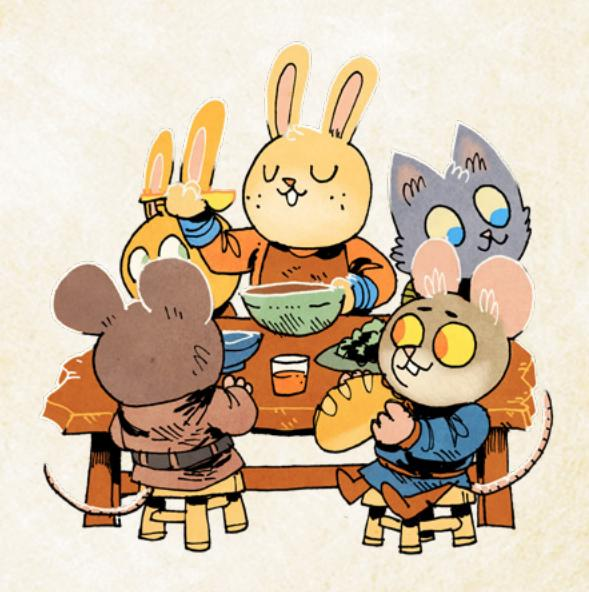

{68}------------------------------------------------

# <span id="page-68-2"></span><span id="page-68-0"></span>Basic Moves

As mentioned earlier, every PC in Root: The RPG can use every basic move. Basic moves are the most likely to come up during play. They both resolve common situations of uncertainty and drive the story forward in interesting ways.

The eight basic moves available to all vagabonds are *attempt a roguish feat*, *figure someone out*, *persuade an NPC*, *read a tense situation*, *trick an NPC*, *trust fate*, *wreck something*, and *help or interfere*.

# <span id="page-68-1"></span>Attempt a Roguish Feat

When you *attempt a roguish feat you are skilled in*, say your goal and roll with Finesse. On a hit, you achieve your goal. On a 7-9, mark exhaustion or one risk of your feat (GM's choice) comes to bear. When you attempt a roguish feat you are NOT skilled in, you are trusting fate.

You know where the stolen Marquisate gold is, and you're ready to climb up the wall, sneak in through the window, and crack the lock on the door. Whichever specific task you're doing, you're *attempting a roguish feat*!

*Attempting a roguish feat* is for applying the skills your vagabond has picked up in illicit, non-combat arenas. It's for lockpicking, pickpocketing, sneaking, and so on—but only when your vagabond is actually skilled in that arena.

Every vagabond has a list of roguish feats on their playbook, and they start play with some already selected. Look at the **Roguish Feats** table for a list of the feats, descriptions of each, and their accompanying risks.

If you have a roguish feat marked on your playbook, then awesome! You're skilled at that particular action, and when you try to use the related skills in some way, you're *attempting a roguish feat*.

Crucially—if you don't have the roguish feat marked on your character sheet when you're taking the appropriate action, then you're not *attempting a roguish feat*. Instead, you're *trusting fate*! All vagabonds are skilled enough in general that they can rely on luck to try to pull off these roguish feats, but they get much more consistent, reliable results when they actually are skilled in the appropriate roguish feat. See more on *trusting fate* on [page 82.](#page-82-0)

When you *attempt a roguish feat*, always start by stating your goal—the thing you're trying to accomplish with your roguish feat. That helps you and the GM pick the correct roguish feat for your aims. For example, if your goal is "Get inside the guard tower," then you're sneaking—getting into or out of a place

{69}------------------------------------------------

#### <span id="page-69-0"></span>Roguish Feats

| Feat               | Description                                     | Risks                                                           |
|--------------------|-------------------------------------------------|-----------------------------------------------------------------|
| Acrobatics         | Adeptly climbing, vaulting,<br>jumping          | Break something, detection, plunge into danger                  |
| Blindside          | Backstab, murder, sneak attack,<br>sucker punch | Draw unwanted attention, leave evidence,<br>plunge into danger  |
| Counterfeit        | Copying, forgery, fakery                        | Leave evidence, take too long, weak result                      |
| Disable<br>Device  | Disarming traps, turning off<br>mechanisms      | Break something, draw unwanted attention,<br>expend resources   |
| Hide               | Disappear from view, remain<br>hidden           | Expend resources, leave evidence, take too long                 |
| Pick Lock          | Open a locked door, chest, etc.                 | Break something, detection, plunge into danger                  |
| Pickpocket         | Subtly steal from a pocket                      | Leave evidence, take too long, weak result                      |
| Sleight of<br>Hand | Palming, switching, ditching,<br>flourishes     | Draw unwanted attention, leave evidence, weak<br>result         |
| Sneak              | Get into or out of places without<br>being seen | Break something, draw unwanted attention,<br>plunge into danger |

without being seen. On the other hand, if you just want to escape the notice of the guards coming down the hall, you're probably hiding—disappearing and staying in one place—instead of sneaking!

Knowing your goal also means you know what's at stake with the move—on a hit (7+), you accomplish your goal, and that cannot be taken away from you by any other conditions of the move. If your goal is to get into the guard tower, you get into the guard tower! If your goal is to avoid those guards coming down the hall, then you avoid the guards!

On a 7–9, though, a risk of your feat comes to bear, or you must mark exhaustion. The choice between "risk" and "exhaustion" is the player's, not the GM's—so the player who made the roll can choose to avoid risks if they have exhaustion to spare! But if they do choose to have a risk come to bear (or if they don't have enough exhaustion to mark), then the GM determines what risk complicates the situation.

The table of all the feats has common, suggested risks associated with particular feat, but the specific situation you're in may indicate that some of those common risks shouldn't apply, and other risks should apply. For example, if you're performing a feat of acrobatics to get to the roof of a building while fires surge up from within, maybe on a 7–9 you actually take too long and the fire is poking through the roof when you get there! Ultimately, it's the GM's call, and the player doesn't get to know exactly what will go wrong before they make the choice between marking exhaustion or suffering a risk.

{70}------------------------------------------------

#### Options for Attempt a Roguish Feat

The roguish feats are themselves self-explanatory, but here's a bit more on each:

**Acrobatics** - Clambering up trees, vaulting a chasm, swinging from a vine onto a riverboat—any kind of complicated, impressive act of moving can fall under the acrobatics roguish feat. If you're racing from guards or soldiers, then this feat might be the right one—just so long as the escape is acrobatic! If you're just running on the ground in straight lines, you're not doing anything acrobatic, but if you're leaping over barrels, scaling walls, and so on, this roguish feat is for you!

**Blindside** - Surging from the dark without warning to strike a blackjack across someone's head, leaping out of a wardrobe and stabbing at a foe—any attempt to strike without warning and take an enemy out (lethally or non-lethally) is a blindside. You need the fictional positioning to blindside an opponent: you need to be hiding or your foe needs to be distracted. That also means you likely can't blindside a fully armored foe with a stiletto—they're too well protected.

**Counterfeit** - Creating fake patents of Eyrie nobility, writing a false message from a superior to a Marquisate officer—any attempt to create a written document falls under the counterfeit roguish feat. Any vagabond who has this feat has the familiarity with myriad sigils and forms of writing to counterfeit all manner of documents. If they need especially rare or complicated materials to counterfeit something—say, gold leaf for the ornamentation on a patent of nobility—then the GM can ask them to mark depletion for those special materials. But for the most part, someone with this roguish feat is likely prepared to use it, and shouldn't have to mark depletion as a base cost (although it's a great risk coming to bear on a 7–9).

**Disable Device** - Disabling the ancient machinery of a ruined trap, sabotaging a siege weapon—any attempt to disable or sabotage a machine or device falls under this feat. This sits as the flipside of the *wreck something* basic move. If you're destroying something through knowledge and finesse, you're *attempting a roguish feat* (disable device); if you're smashing it to pieces, you're *wrecking* it.

**Hide** - Slipping into a closet and closing the door, finding a spot among some barrels—any attempt to remain stationary, still, and unobserved until danger or time has passed falls under the hide roguish feat. Hiding is often reactive, something a vagabond will do in response to an incoming danger to survive it.

**Pick Lock** - Opening up a locked chest or a locked door—any attempt to get past a lock through finesse and care falls under the pick lock roguish feat. Like disable device, this sits alongside the *wreck something* basic move. You can get through a locked door by smashing it open, or by picking the lock.

{71}------------------------------------------------

# Flashbacks

For the most part, all of these moves are used in the present, during the action. But sometimes, you can use a move in a flashback when you would have had time to prepare for the current situation. A roguish feat like counterfeit is great for this—the vagabond whipped up some documents in the past to use them right now, but you resolve the move in the present, to see how good the work on the documents was. It can be hard to use counterfeit in advance of when the counterfeited material is needed. So if a vagabond wants to use counterfeit in the moment they need an item to set up a flashback where they wrote it out before—that can be great!

To use a move in a flashback in this way, it has to make sense in the fiction—the vagabond needs to have had time to actually take the action in the past, and knowledge that would've reasonably led them to expect this outcome. And a vagabond needs to expend resources to set up the flashback, usually exhaustion (for their time and effort) or depletion (for actual physical resources). The GM sets the cost as appropriate, but usually no more than 1 or 2 total exhaustion or depletion anything more, and it's probably too much to use the move in flashback.

Finally, depletion itself is a great way to set up simple resources. See [page 126](#page-126-0) for more on how to spend depletion to have a simple useful item the moment you need it!

**Pickpocket** - Slipping a coin pouch off a merchant's belt, lifting orders from the pocket of an officer's uniform—any attempt to steal something subtly and covertly from a denizen falls under the pickpocket roguish feat. This isn't for legerdemain or stealing things from a table, for example—those fall under sleight of hand. But when you're stealing something from another character, you're picking pockets.

**Sleight of Hand** - Making a key disappear from sight to a secret pocket on your person, covertly lifting a piece of paper from among many on a table any attempt to perform a deft act of legerdemain that doesn't directly involve another denizen falls under the sleight of hand roguish feat. If it does involve another denizen, it's much more likely to be picking a pocket.

**Sneak** - Slipping down a hallway to the prince's quarters, racing quietly through the dark along a wall to reach the crack—any attempt to move quietly, silently, and secretly from place to place falls under the sneak roguish feat. Sneak isn't useful for avoiding attention within a location—it's only useful for moving from place to place. Hide is the feat for avoiding attention within a location.

{72}------------------------------------------------

#### Risks of Attempting a Roguish Feat

The risks of the roguish feats are largely in the GM's control. The GM picks the appropriate applicable risk and the exact way it manifests. But it's useful to have a bit of information on what each risk is:

- Break something Break something you're carrying or in the environment. Possibly mark wear.
- **Detection** Straight up get noticed by an onlooker. It has to matter.
- **Draw unwanted attention** Either create hostile onlookers where before no one cared, or call attention without actually being detected. Increase the danger in the area.
- Expend resources Use up supplies. Mark depletion or exhaustion as the GM chooses.
- Leave evidence Leave behind evidence that can later lead an investigation against you or expose your allies to retribution.
- Plunge into danger Seize the chance to perform the feat and wind up running straight into a more dangerous situation.
- Take too long Take too much time, leading the situation to change around you in some meaningful way.
- Weak result Get a hard choice about exactly what you want, or straight up don't quite get everything you want.

# Example

Cloak, played by Brendan, is on the run from a whole platoon of Marquisate soldiers! He races to the edge of the clearing and leaps up to fly over the 15-foot wall surrounding the clearing before the soldiers can open fire with their bows!

"This sounds like it's uncertain, going over the wall, fast, while they're firing arrows at you. Do you have acrobatics?" the GM asks.

"Yes! Attempting a roguish feat!" Brendan rolls with Finesse and gets a 7-9!

"Okay, you get over the wall," the GM says. But one risk comes to bear. The GM takes a look at the common risks: detection doesn't matter, as Cloak is already very much detected. And plunging into danger doesn't seem fun—that just seems like repeating the situation. "When you fly over the wall, leaving all those soldiers behind, you accidentally catch your belt and tear some pouches. Mark depletion!"


{73}------------------------------------------------

# Figure Someone Out

When you *try to figure someone out*, roll with Charm. On a 10+, hold 3. On a 7-9, hold I. While interacting with them, spend your hold I for I to ask their player a question:

- is your character telling the truth?
- what is your character really feeling?
- what does your character intend to do?
- what does your character wish I'd do?
- how could I get your character to \_\_\_\_\_\_?

You and the fox captain of the Eyrie guard are seated across the table from each other, staring each other down, each trying to get inside the other's head. In this moment, you're trying to *figure someone out*!

**Figuring someone out** is for getting into another character's head, trying to figure out what makes them tick in this scene, what they want and how you might be able to get them to act differently. It's a move for those intense moments when a character is staring down someone else, but it's just as often a move for when you and a "friend" are laughing together and your eyes dart towards them to determine what they are really laughing at.

Figuring someone out usually requires interacting with someone. You have to be talking to them, watching them, saying something to see how they react and then gauging that reaction. The GM might make exceptions for when you're watching someone without their knowledge—for example, when you're in the rafters watching someone from above—but those situations are only for when you have an especially perfect vantage point to watch people who are active.

When you get a hit on *figuring someone out*, you get hold to spend on questions. That means you don't have to ask all the questions up front—you can wait and talk to them more, shifting the conversation, before you spend your hold. But if you want to spend all your hold to ask all those questions up front, that's awesome too!

When you spend a hold to ask a question, you're not asking it in character, in the fiction of the game world. You're asking it at the player level, as yourself outside the Woodland and the fiction, and the other player must answer it at the same level, honestly. If you're figuring out an NPC, then the GM answers for them.

{74}------------------------------------------------

#### Options for Figure Someone Out

**"Is your character telling the truth?"** is with reference to something the other character just said, and it's about the character's belief. If they believe what they said is true, then the answer is "yes," regardless of whether or not it is actually true.

**"What is your character really feeling?"** provides information about emotions first and foremost, but the really is important. When you ask the question, you get what's below the surface, even if you don't get a deep explanation of why they are feeling that way.

**"What does your character intend to do?"** provides information about that character's immediate plans. This isn't "What is your grand scheme for taking over the Woodland?" but "When we finish talking, what are you going to do next?"

**"What does your character wish I'd do?"** acts as an inverted version of "What does your character intend to do?", essentially asking that question but with reference to what they want you to do. This question can focus a bit more on the long term—**"**I want you to fight alongside my faction in the war" might be an appropriate answer.

**"How could I get your character to** \_\_\_\_\_\_\_\_\_**?"** is an open-ended question; fill in the blank with whatever you want. That also means it's the one question you might spend multiple hold on, filling in the blank with different statements. If you do whatever it is they ask of you, then they are obligated to do whatever you'd asked of them. This bypasses the need for any other move—no need to *persuade* or *plead* with them—as long as you asked the question and performed the task they asked. The other player can also legitimately say "You cannot get me to do that" if it is actually true. In that case, the player—not the character—believes that there is absolutely no way that the character would ever take that action.

# Example

*Copper the Ronin, played by Grace, is trying to get a Woodland Alliance operative to lead her to the Woodland Alliance cell in the clearing. "Ah, this is going nowhere," she says. "Can I figure her out? I'm watching her carefully, gauging her every reaction." Grace rolls with Charm and gets a 10+. "I'll spend 1 hold. How could I get you to take me to your boss?"* 

*The GM considers. "Her eyes keep shifting to sack of food on your back—she may be a loyal Alliance agent, but her clearing hasn't seen much food in weeks. Give her a bribe, 1-Value of food, and she'll help you out."* 

*"Awesome! I'm going to hold onto my other hold then, for now," says Grace. "I give her the bribe—I'll mark off a depletion for 1-Value of food."*

*"She takes the food from you, her eyes wide; it's been a while since she's seen this much good food. She starts chowing down as she gets up and gestures for you to follow."*

{75}------------------------------------------------

# Persuade an NPC

When you *persuade an NPC* with promises or threats, roll with Charm. On a 10+, they see things your way, provided you have given them a strong motive or reasonable bribe. On a 7–9, they aren't sure; the GM will tell you what you need to do to sway them.

You're trying to get into the Mayor's special dinner, and you pull out a knife to threaten the guard into letting you past. You're *persuading an NPC*!

*Persuade an NPC* is for getting NPCs to act the way you want them to, but in an overt, fairly clear way—essentially using bribes or threats. It can only be used on NPCs, as well. If you want another vagabond to go along with you, then you should talk to them and, at best, *plead with them* (see [page 88](#page-88-0) for more on *pleading*). *Persuade an NPC* can only be used on individual NPCs. The promises and threats you make are always catered to individual NPCs, and the more denizens you're trying to make a promise or threat to at once, the more likely it is that things go awry and someone is displeased—without another special move helping out, trying to persuade a group is more *trusting fate* than anything else.

When you *persuade an NPC*, you're trying to get them to do something. At heart, this move isn't about changing beliefs or ideology—that kind of of move is more *swaying an NPC* with your Reputation (see [page 117\)](#page-117-0). Instead, this move is about getting an NPC to actually take some concrete action. And while you can try to *persuade an NPC* to act in a particular way in the future, if the situation changes enough, they can change their mind. Most often, you use this move to get an NPC to take action right now, so always try to have an idea for what action you want them to take.

You must always *persuade* using a promise or a threat. A promise means that you've promised they'll get something they want if they do what you ask, whether you take the action to give it to them, or someone else does—the proverbial "carrot." A threat means that you've threatened to do something bad to them or to something they care about if they don't do what you want—the proverbial "stick."

Finally, persuading an NPC is an honest move. You ultimately might not follow through on your end of the bargain, whether because you can't or because you choose not to, but you're not trying to deceive the NPC into doing what you want. At bare minimum, you believe you could fulfill your end of the bargain, delivering on your promise or your threat in a meaningful fashion. Especially on a 10+, you aren't bound to do so—the situation might change, and you can always reconsider...but at the time you make the move, you aren't trying to fool them. If you are tricking them, then you're using the *trick an NPC* move (see [page 79\)](#page-79-0).

{76}------------------------------------------------

#### Options for Persuade an NPC

**The 10+ result, "provided you have given them a strong motive or reasonable bribe,"** means that the NPC will do what you want, just so long as the promise or threat you've made to trigger the move is significant enough and matters enough to them that it could get them to take action. A strong motive or reasonable bribe for a low-level guard is going to be different than for the Mayor of the clearing, so it's always dependent upon the situation and the character. For the most part, this result means the NPC takes the action you want, but you might have to sell it a little more, with a little prick of a knife or a little coin greased across a paw.

**On a 7–9,** however, you have to take some concrete action here and now to get the NPC to act. You are never left in the dark here; the GM tells you exactly what you need to do to get them to act how you want. Do it, and the NPC will act that way. But this might require you to actually follow through on a bit of your threat, or to pay a significant bribe, or to share a secret, or to make good on at least a portion of your promise, etc. It means your words alone aren't enough, and the NPC needs some proof before they will act.

# Example

*Tali the Adventurer, played by Marissa, wants an Eyrie captain to leave the area with all his soldiers so she can set it up as a Woodland Alliance camp. "But you and your squad don't even want to be here! It's just an old ruin, and it's hot out here, and there's no point!" Marissa says.* 

*"It sounds like you're trying to persuade the captain, but you haven't made a promise or a threat yet," says the GM.*

*"Hm, you're right. Okay, how about, 'If you head back to town, I promise, I'll put in a good word for you with Duke Whitetalon. How's that sound?'"* 

*The GM arches an eyebrow. "Can you do that? Do you even know Duke Whitetalon? This sounds more like it's a trick than a persuade."* 

*"Fair," says Marissa. "How about, 'If you head back to town, I promise I'll make it worth your while,' and I pull out a big pouch of gold." Marissa knows that she's only promising the gold—on a 10+, she won't have to give it to him right away!* 

*"Nice!"* 

*Marissa rolls with Charm and gets a 7–9.* 

*"The captain is looking at the pouch of gold with greed in his eyes. 'How about you give me the gold up front, and then I'll go,' he says. You're going to have to give him the gold, but then he'll head out." Marissa groans, but agrees, and marks the gold off her character sheet.*


{77}------------------------------------------------

#### Read a Tense Situation

When you *read a tense situation*, roll with Cunning. On a 7–9, ask I. On a 10+, ask 3. Take +I when acting on the answers.

- what's my best way out / in / through?
- who or what is the biggest threat?
- who or what is most vulnerable to me?
- what should I be on the lookout for?
- who is in control here?

Woodland Alliance rebels have just sprung out of the bushes pointing bows at you! Your eyes dart around the path, trying to look for a way out of here—you're *reading a tense situation*!

**Reading a tense situation** is for evaluating your surroundings and circumstances to figure out how to make the best of a bad scenario. The situation has to be tense to read it, which means there has to be some sense of uncertainty, danger, or concern. If the situation isn't tense—there's no electric thrill of danger or threat in the air—then you can't read it.

When you get a hit while *reading a tense situation*, you can ask some questions from the list. You ask your questions immediately—you can ask them one at a time, but you can't save any for later in the same scene. They refer to the situation right then and there, so no holding onto the questions!

The GM answers all the questions (one of their roles being to describe the world) and answers truthfully. All of the answers they give are "true"—if they say that something is the best way through, then it is actually the best way. Sometimes, the GM can just answer the question, but other times the GM and the player will go back and forth a bit to make sure they both understand exactly what question is being asked so the GM can provide the appropriate answer.

When you act on the answer to the questions you receive, you take a +I to any moves you make—meaning that *reading a tense situation* gives you both a path to follow and a bonus to follow that path. That bonus is normally non-transferable—only the vagabond who read the situation gets the +I to follow the answers to their questions—but the Professional connection allows vagabonds to share the bonus (see more on connections on page 50).

{78}------------------------------------------------

#### Options for Reading a Tense Situation

**"What's my best way out/in/through?"** lets the player find out how to get out of or past a bad situation. The player gets to choose which option it is, whether out, in, or through. Whatever the GM says is the best way...but that doesn't have to mean the best way is actually good. The "best way" into a heavily guarded fortress might still be terrible!

**"Who or what is the biggest threat?"** tells the player what to either focus on, or run from! The biggest threat isn't always the single deadliest combatant, either—it might be the commander, tactically leading troops with brilliant acumen. But sometimes the answer will be perfectly obvious—of course the giant grizzly bear is the biggest threat! The question may still be worth asking because of the +1 bonus to act on the answers.

**"Who or what is most vulnerable to me?"** has a bit of leeway around what "vulnerable" means. It might mean "susceptible to my attacks," but it also might mean "likely to believe my lies," or "easily swayed by my reputation." As with all of these options, GM and player should ask questions and go back and forth to make sure everyone is on the same page about the question being asked and the reason the answer fits.

**"What should I be on the lookout for?"** flags a danger, threat, or problem in the area. It doesn't have to be a brand-new problem, either. Finding out that something you thought would be a problem will definitely be a problem is still useful, not least because of the +1 to act on the answer!

**"Who is in control here?"** is the question most directed towards subtlety and secrets. It's possible that the real power in the scene—the character really in control—is not at all whom you expected, and this question points that out. On the other hand, this question might point out that everything is exactly as it seems—power lies in the most obvious place! When you ask this question, make sure you and the GM both have a sense for what "control" means in this situation, as well. A bear might be the biggest threat, but the enemy vagabond who stands at the front of the bear's cave with a sword, preventing anyone from fleeing, may actually be in control!

# Example

*Jinx the Vagrant, played by Derrick, has managed to talk their way into a secret Woodland Alliance gathering in a cellar. While Jinx is mingling, trying to look inconspicuous, an old enemy—Drylla Vines—walks into the meeting. "She doesn't see you," says the GM, "but you're pretty sure it's a matter of time."* 

*"Ah, crud. Okay, I think this is a tense situation—I'm going to read it." Derrick rolls with Cunning and gets a 10+. "First, I want to ask, what's the best way out?" Derrick says.* 

*"Well, the meeting just started—bolting now would be conspicuous. But you* 

78 Root: The Roleplaying Game

{79}------------------------------------------------

definitely saw some lookouts outside when you came in. You've either got to wait out the whole meeting, or bluff your way out by pretending you're a lookout."

"Okay. But I want to get something for my pains. Who or what here is most vulnerable to me?"

"Hm. Drylla is definitely vulnerable to you—she doesn't know you're here, and you have a chance to move against her right now."

"Sweet. And finally, might as well—who is in control here?"

"Oh, yeah—you begin to realize that as Drylla walks around, all the other Woodland Alliance agents are sort of deferring to her. They came here to listen to her—she's in charge! What do you do now?"

# <span id="page-79-0"></span>Grick an NPC

When you *trick an NPC* to get what you want, roll with Cunning. On a hit, they take the bait and do what you want. On a 7–9, they can instead choose one:

- they hesitate; you shake their confidence or weaken their morale.
- they stumble; you gain a critical opportunity.
- they overreact; take +1 forward against them.

The Eyrie sergeant has come to the ruins to take you captive—so you hide and cry out that you have him and all his soldiers surrounded (by allies that don't exist). If they don't leave now, your allies will take them all! You're *tricking an NPC*!

*Trick an NPC* is a move for deception, trickery, cons, and lies. If you're telling the truth or honestly trying to change someone's mind, then you're *persuading an NPC*. But if you're deceiving an NPC, then you're *tricking them*.

As the name of the move suggests, just like *persuade an NPC*, you can only use this move on NPCs. You can't trick a PC with a move; you can lie to another PC, but they can always *figure someone out* and see if you are lying!

*Tricking an NPC* doesn't always have to mean a single NPC. You can conceivably trick a group—if the trick you're pulling is big enough, and the group is really a group. A good rule of thumb—if the GM would stat up the group as a group, instead of as individual members, then you can probably trick them. See page 212 for more on how the GM stats up NPCs!

When you *trick an NPC* you should know exactly what you want the NPC to do. This is immediate—you are trying to get them to do something right now. If you need them to do something at all long-term, you're better off *persuading them*, or *figuring them* out and asking "How could I get you to \_\_\_\_\_?"

{80}------------------------------------------------

There has to be at least some believability to your trick or deception for the move to trigger; if they couldn't possibly believe your deception, then it's not a trick at all. You can't convince a soldier of the Eyrie that you are secretly their liege lord whose face was changed by a strange creature of the trees...not without lots of other weird elements filling out a context where they might possibly believe that nonsense. At best, you'd be *trusting fate* to buy time while your friends move into position, desperately spouting unbelievable silliness to keep the enemy just offbalance enough to give a fellow vagabond a chance to blindside the soldier

#### Options for Trick an NPC

**"They take the bait and do what you want"** means that the NPC does exactly the thing you're trying to trick them to do. On a 10+, the NPC falls for your trick, and you get what you wanted!

On a 7–9, however, they might not do what you want. The NPC (meaning, the GM on the NPC's behalf) gets to choose to either hesitate, stumble, overreact, or fall for the trick and do what you wanted. The PC doesn't get to choose which means there's a decent chance that the NPC might not fall for the trick entirely. But GMs are, as always, encouraged to be fans of the PCs and follow the fiction. There may be times when an NPC could choose another option but doesn't, because it makes more sense that they buy the trick.

**"They hesitate"** means that the NPC is uncertain about what to do next. They may back down or retreat from the situation. Underlings will often seek out a superior to confirm what they should be doing. Most NPCs also have a morale harm track, and "they hesitate" is a good reason for the GM to mark morale harm on the NPC (see more on morale harm on [page 125](#page-125-1)). You might not get the bandit to put her sword away, but you can shake her confidence and inflict morale harm, buying yourself a bit of time and the chance to get her to retreat entirely.

**"They stumble"** means that the NPC makes a mistake, trips up, leaves an opening. The PC gets an opportunity, one they can seize on to take action and get something they might want. The NPC doesn't entirely fall for the trick they don't simply do what the PC wanted—but they might give the PC another opening to get a similar effect if the PC is willing to take a risk and seize the chance. You might not get the guard to let you onto a boat willingly, but maybe you can push him overboard when he takes his eyes off you for a moment!

**"They overreact"** means that the NPC gets upset, angry, overexcited, or something similar. They might fall for the trick too much. They don't do exactly what the PC wanted, again—but their overreaction gives the PC a mild advantage against them, in the form of +1 forward. You might not get the merchant to purchase your fake gold alone, but they might offer the same amount of money to buy every single thing in your bag!

{81}------------------------------------------------


# Example

*Guy the Scoundrel, played by Miguel, was trying to escape from danger with a friendly merchant in tow, when he ran right into the hideout of the notorious bandit—the Timber Wolf! "'Who are you?' the Timber Wolf asks, leveling his axe at you," says the GM.* 

*"'I'm a friend! I'm here to help you out!'" Miguel exclaims as Guy.* 

*"Hmm, it sounds like you're trying to trick him but it's not quite enough yet. Just saying 'I'm a friend' isn't particularly convincing," says the GM.* 

*"I turn to the merchant. 'Look, I brought you this hostage as proof! He's a successful merchant, you can probably ransom him back for lots of coin!'" Miguel says.* 

*The GM laughs and asks Miguel to roll to trick an NPC. Miguel rolls and gets a 7–9. The GM thinks about what to choose—the Timber Wolf hesitating doesn't seem like it will change the situation. Overreacting might be interesting, but stumbling and providing an opportunity seems the best choice. "Okay, the Timber Wolf is obviously thrown and confused. He puts his axe down and comes real close, grabbing the merchant and patting him down to see if he's carrying any valuables. He's in reach, unarmed, and not paying any attention to you. What do you do, Guy?"*

{82}------------------------------------------------

# <span id="page-82-0"></span>Trust Fate

When you *trust fate* to get through trouble, roll with Luck. On a hit, you scrape by or barrel through; the GM will tell you what it costs you. On a 10+, fortune favors the bold; your panache also earns you a fleeting opportunity.

Pyreus Coldsteel is walking towards you, a sword in each paw, while the fires lick the tapestries on one side of the room. Only one option—you dive out the window, tuck and roll, and hope the drop wasn't really all that high. You're *trusting fate* to get through trouble!

*Trust fate* is the move for taking tremendous risks, flinging yourself into trouble and hoping you come out the other side, and generally being a swashbuckling rogue! It acts a bit as the underlying basic move for the entire game. If you're taking action that feels risky and chancy, and you're unsure of what's going to happen, but no other move applies—you're probably *trusting fate*. If *any* other move fits better, then it's probably that move instead.

Because *trusting fate* to get through trouble is such a widely applicable trigger, you should always keep that criterion in mind—if any other move applies, then it's not *trusting fate*—along with the idea that you're only trusting fate if you're taking a real, uncertain, substantial risk. A bird character isn't trusting fate to fly up to the top of even a very high building if there's no risk or chance to it. If they're fleeing from Marquisate guards and trying to get out of the clearing at high speed, then they're only *trusting fate* if they don't have the acrobatics roguish feat; if they do have it, then they're *attempting a roguish feat*. But if the bird has a net thrown over them while they fly up through a burning canopy of leaves and massed Marquisate siege weaponry fires on them from below? Even if they have the acrobatics roguish feat, it's probably *trusting fate*—the situation is just too dire to be anything else!

Use this move when the situation is risky, over the top, and chancy enough that the main determinant of whether or not things go well is a vagabond's sheer grit and luck. Keep in mind that it's always possible for the GM to impose a baseline cost on such a risky action, regardless of what the results are. If you dive out of a tree from 30 feet in the air, you may suffer injury no matter what the question becomes "Just how much injury do you suffer?"

# Options for Trust Fate

**"On a hit, you scrape by or barrel through; the GM will tell you what it costs you"** means that on any hit—any result of 7+—you manage to accomplish your main goal, but always with some cost or complication. If you dive through glass, then you'll reach the ground below—but not without suffering some injury.

{83}------------------------------------------------

# <span id="page-83-0"></span>Trusting Fate vs Other Moves

Here's a bit more on when to use *trusting fate* instead of one of the other moves:

- If a PC acts and no other move quite fits the situation, but it's still risky and chancy, then it's *trusting fate*.
- If a PC acts and their chances for success are ridiculously low, even if another move might trigger, then it's *trusting fate*.

Both these situations are moments in which the GM can rely on the dice to say how things go; rather than saying, "No, that doesn't work," the GM can turn to *trust fate* to find out what happens!

If you're picking a lock without the roguish feat, then the lock is picked, but probably not without paying depletion. Even on a 10+, you don't avoid the cost or complication. Wear, depletion, exhaustion, and injury are all fine costs, as are more fictional costs that make your victory messy.

**"On a 10+, fortune favors the bold; your panache also earns you a fleeting opportunity"** means that instead of avoiding the cost on a 10+, you actually get a chance for some extra benefit! It's icing on the cake for taking such a huge risk, above and beyond the core success of the move. The GM says what the opportunity is, and tells you what you must do to seize it. Getting a 10+ doesn't mean you automatically get a benefit—it just means you get an opportunity, a chance. Maybe you see something valuable you can grab on the way out of the burning room—but it'll mean getting a bit more burned. Maybe when you fall from a tree, you spot a place you can land out of sight of any enemies, just without anything soft to cushion your fall, increasing the injury you suffer.

# Example

*Copper the Ronin, played by Grace, is talking to the Baroness Redly of the Eyrie Dynasties, trying to get her to give up information about where she will next lead her troops, when she gets a miss while trying to figure someone out!* 

*"The Baroness sees you looking at her so closely, Copper, and tilts her head. 'You know, I do believe you seem familiar. I've heard reports of a raccoon vagabond causing trouble out in the Woodland, fighting Eyrie soldiers with a blade...just like that one.' She gestures at your sword. It's pretty clear she's about a moment away from figuring out who you really are. What do you do?" says the GM.* 

*"I say…'Ah, yes, yes, I know well of whom you speak. That is the brigand Copper! But I, Baroness, I, am...her twin! My name is Bronze! And I am certainly nothing like that criminal!' Am I tricking her?" asks Grace.* 

{84}------------------------------------------------

*"Uh...no. You're Bronze's 'good twin'? Yeah, trust fate there." Grace rolls with Luck and gets a 10+! "The Baroness looks at you with surprise in her eyes. 'Oh indeed? Well, then. If you are this brigand's twin, then you likely know all about her tactics... and I would imagine that sword is just like hers. I would very much appreciate seeing that blade.' She holds out one paw. If you want her to buy this, you're going to have to hand over your sword for her to examine—leaving you unarmed." But it was a 10+, so Copper gets a fleeting opportunity, too! "If you do this, though, and fully commit, telling her all about your 'evil twin,' all about your exploits and your tactics and your strategies, you'll get to mark 2-prestige with the Eyrie—the Baroness will actually be impressed by what she hears about the real Copper! What do you do?"*

# Wreck Something

When you *wreck something*, roll with Might. On a hit, you seriously break it; it can't be used again until it's repaired. On a 7–9, you're imprecise and dangerous; you cause collateral damage, attract attention, or end up in a bad spot, GM's choice.

Your friend is locked behind bars inside a prison, so you reach out and begin to pull the bars apart! You're *wrecking something*!

*Wreck something* is for breaking, smashing, and ruining objects. You can't "wreck" a living being—it's just for nonliving things. Wrecking also isn't subtle. When you wreck something, you're using brute force to break it. If you're relying on smarts, there's a good chance you're *attempting a roguish feat*.

There are obvious cases of wrecking—smashing down a door, ripping apart jail cell bars, snapping a lock, cutting down a tree—but it can also extend to other methods that rely on pure strength. Rolling a boulder down a hill at a building, knocking down a tree into something else—these are all great ways to *wreck something*!

*Wrecking something* is fairly versatile, as well. If you want to wreck a cave and bring the ceiling down, as long as there's some way you can actually do that (knocking out support beams, shoving your sword into a crack and prying it apart, etc.), go for it! If you want to wreck a road to make it impassable, go for it! As long as it's an object and not a character you can probably wreck it!

Of course, remember that moves are based on uncertainty—in this case, the uncertainty of whether or not you can successfully wreck the thing in the first place, and the uncertainty of what the other consequences of wrecking it will be. If you're tearing a piece of paper apart, you're not really wrecking it—you know you can tear it apart, and you know that the immediate consequences of ripping the paper are likely to be entirely insignificant. Kicking in a door might be wrecking it if the door is locked with a dead bolt—it's uncertain whether you can kick it in in

{85}------------------------------------------------

the first place—but there might be no uncertainty if it's already unlocked, or if you don't actually need to use enough force to break the door or draw any attention. The move only triggers when you're trying to *wreck something* that requires lots of effort, and/or something strong enough or significant enough to cause further complications when you use enough force to break it.

#### Options for Wreck Something

**"On a hit, you seriously break it; it can't be used again until it's repaired"** means just that. The door, the lock, the wall—they'll require repairs to be useful in their intended fashion again. Of course, smashing a lock will open the lock, and smashing a door will open the door.

**"You're imprecise and dangerous; you cause collateral damage, attract attention, or end up in a bad spot, GM's choice"** means that on a 7–9, the wreckage you create gets a bit out of hand and causes problems for you. The GM will tell you how.

**"Collateral damage"** means someone or something else—not you—is harmed by your act of *wrecking something*. The cave-in catches a friend, or the door falls onto someone on the other side! Collateral damage can even apply to a tool you use to accomplish the wrecking, marking wear on the item or depletion on the vagabond.

**"Attract attention"** means that someone or something is going to come running to see what made that noise. *Wrecking something* is already a fairly loud action to take, but "attracting attention" means that no matter how safe you thought you were, danger is on its way.

**"End up in a bad spot"** means that the GM can complicate your situation and put you in a tough, difficult position right now. The cave ceiling sure does come down, but you're trapped inside! The tree sure does come down, but now it's rolling towards you!

# Example

*Keera the Arbiter, played by Kate, decides that enough is enough—she's going to knock down this guard tower from which the guards are pelting her with arrows. First, she reads a tense situation and gets a question. Kate asks, "Who or what is most vulnerable to me? I'm looking specifically for 'vulnerable' so I can wreck the tower."* 

*"Well, the tower's sturdy, but you can maybe knock down that big dead tree next to the tower directly into it. That's definitely vulnerable to you," says the GM.* 

*"Excellent! I go wreck that!" says Kate.* 

*"How do you do that?" asks the GM.* 

*"I break out my greatsword and hack at its base until it's broken enough that I can just shoulder-check it!" The GM nods and Kate rolls with Might, getting a 7–9.* 

Chapter 5: Core Rules 85

{86}------------------------------------------------

*"Awesome! So you totally knock the tree down, and it smashes into the guard tower, breaking the stones at the top and slowly starting to tip the whole thing over. Trouble is, the guard tower is now falling towards the blacksmith's forge behind it and the blacksmith is still inside!" The GM is inflicting collateral damage but still giving Keera a chance to respond. "What do you do?"*

# <span id="page-86-0"></span>Help or Interfere

When you *help or interfere* with another vagabond, mark exhaustion to add +1 or –2 to their roll (after rolling). Mark exhaustion again to select one of the following:

- · conceal your help or interference
- · create an opportunity or obstacle

Your friend is frantically waving back at the clearing and claiming the Woodland Alliance is attacking to trick the guards into leaving—so you jump in, screaming about how it's horrible and they're lighting fires everywhere! You're *helping* your friend to *trick an NPC*!

By default, PCs make moves individually. You trigger your move on your own, make the roll, and then make your own choices. But your fellow vagabonds can influence a move you make by either *helping or interfering*.

*Helping or interfering* is a major move in which there is no roll—you just mark exhaustion, and the move happens. There's no uncertainty to the outcome, only the question of how much you're willing to pay to accomplish your end.

Unlike most moves, you only use the *help or interfere* move after you've seen what the other vagabond has rolled. You might say something that describes you physically helping, but don't trigger the move and pay its costs until you actually see the dice result.

When you help, you can give them a +1, and when you interfere, you can give them a –2. There's no point in triggering the move for a friend who already got a 10+, and there's no point in triggering the move against a foe who already got a 6–. Similarly, if only one vagabond can help, then they're only able to affect the result if it's a 6 or a 9—on all other numbers, there's no point in helping. In those cases, even if you do something in the fiction to *help or interfere*, you don't make the move—you'd just be paying the move's costs with no effect.

To *help or interfere*, you also have to be able to actually do something that would impact the outcome of the other vagabond's move! If you're nowhere near each other, you probably can't *help or interfere*. If your friend is doing something

{87}------------------------------------------------

highly technical and precise and you lack equivalent skills, you might not be able to help. If your friend is lying to a guard while you're gagged in the corner of a cell, you probably can't help or interfere. So make sure you know exactly what you're doing that is either helping or interfering with their move.

Multiple vagabonds can *help or interfere* with the same move. As long as all the vagabonds are willing to pay the appropriate costs, the bonuses or penalties they provide will stack on top of each other.

#### Options for Help or Interfere

Each vagabond who helps or interferes must mark exhaustion individually to provide the +1 or –2 as appropriate.

You can only mark 2-exhaustion total—one for the +1 or –2, and a second for the concealment of your aid or interference, or for creating the opportunity or obstacle. You cannot spend 3-exhaustion to get all the options.

**"Conceal your aid or interference"** means that you aren't tied to the results of the move in the same way. Any watcher wouldn't know clearly that you had just intervened for good or ill. If you don't take this option, you give yourself away, and anyone watching the situation knows you tipped the scales. You'll be tied to the results of the move, whatever they are—for example, if a *wreck* move you helped winds up "drawing attention," then attention is drawn to you, as well.

**"Create an opportunity or obstacle"** is a way to get an additional benefit from your help. An opportunity is a chance the GM describes and fleshes out, based on your help, to get some extra benefit on top of the move; an obstacle is a new difficulty or problem that further inhibits your opposition's actions.

# Example

*Quinella the Harrier, played by Sarah, wants to interfere with Keera's attempt to persuade an Eyrie sergeant to lead his troops away from angry denizens (with Woodland Alliance infiltrators!). Kate, Keera's player, rolled a total of 10 for her persuade an NPC move. "I don't want this situation to get calmer—I want the denizens to rebel! I start a chant from the sidelines, something like 'Get out Eyrie!'" says Sarah.* 

*"You can only bring the roll down to an 8, though, by providing a –2 through interfering. Is that okay?"* 

*"Yep! I'm hoping that Keera won't be willing to do what she has to do to get the guy to leave on a 7–9." Sarah marks exhaustion for interfering.* 

*"Do you want to hide your interference, or create an obstacle?" asks the GM.* 

*"Oh, I think I'll hide my interference. I start the chant, and then I slip away quietly," says Sarah.* 

*"Excellent. Mark another exhaustion!"*

{88}------------------------------------------------

# <span id="page-88-0"></span>Plead with a PC

When you *plead with a PC* to go along with you, they clear 1-exhaustion if they agree to what you've proposed. You may use this move only once per session.

You really want to go chase down the Marquisate treasure wagon, but your friend wants to stay in town, so you look at them and say, in a whining tone, "Pleeeeaaaase?" You're *pleading with a PC* to go along with you!

*Pleading with a PC* to go along with you is the one real way you can mechanically bribe another PC into following your plans. You can always *figure out* another PC, of course, asking them "How could I get you to \_\_\_\_\_?" and then taking appropriate action. But if you don't want to do that, you can plead with them!

Pleading just means that you're making an impassioned plea in whatever manner suits your character's personality.

When you *plead with another PC*, they don't have to agree. They can turn down the offer to go their own way. If they do, that still counts as your one use of this move per session.

Use this move both in the fiction and on the level of the players themselves. If another PC turns down your offer, then they're signaling that they are adamant about not doing that thing—so move on and find something else to do!

# Example

*Tali the Adventurer, played by Marissa, wants the group to remain where they are, in Crestfallow Falls, to try to deal with the terrifying Woodland Alliance leader in the area, but her fellow vagabond, Hester the Tinker (played by Sam), is interested in leaving to earn prestige elsewhere. "'Come on, Hester! We need to help these people! Please, let's stay here and finish what we started,'" says Marissa as Tali. "I want to offer you a cleared exhaustion to stay!"* 

*"No, I really want to get on the road," says Sam.* 

*Marissa keys in on Sam turning down the offer, and says, "Okay, I get it, let's hit the road. But I'm going to push us to come back here eventually!"*


{89}------------------------------------------------

#### <span id="page-89-0"></span>Get Along to Play Along

In general, the PCs are a team—a band of vagabonds. They might not always agree, might not always get along, but this game isn't about the strife between those vagabonds. If they're arguing so much that the entire group is at risk of fracturing, then that's going to interfere mightily with Root: The RPG!

Think of it in terms of the game's general holding environment, a way to talk about the baseline premise of the game—if the game were a TV show, this would be the fundamental promise of that TV show. If a TV show is set in a space station, then when someone leaves the space station forever, they leave the TV show. Well, in Root: The RPG, the show is set in and around the exploits of this band of vagabonds. If someone leaves the group, then they leave the show! That can be fine if a player wants to start up a whole new character (see more on adding new characters to the game on [page 179\)](#page-179-0), but no one should be surprised to find out that internal conflicts between their characters lead to the exit of one character from the game!

So keep in mind that this is a game in which your group of vagabonds ultimately always chooses to stick together and work together, and if that ever changes, it means some characters are likely exiting the narrative.

# <span id="page-89-1"></span>Weapon Moves

Even though the rest of the moves give you plenty of ways to resolve problems or overcome obstacles, there are going to be times when you get into a real fight. Swords come out, bows are drawn and fired, and lives are on the line.

All of the basic moves still apply to those fights—you can absolutely *read a tense situation* to try to get an edge in a fight or *figure out* your opponent in an attempt to see what they really want while you're sword to sword. You can even make a threat and try to *persuade an NPC* to surrender—though if they're ready to fight, it's probably going to take some doing to convince them that surrender is a better option.

This section covers the **weapon moves**, special moves that are used only for fighting or fighting-adjacent activities. These aren't used nearly as much as the basic moves because they're so tied to fighting; the vagabonds *trick* and *persuade* the denizens of the Woodland every day, but fights aren't usually a daily occurrence. Any time you use one of these weapon moves, you're starting a fight (or getting really close to starting one) if one hasn't already broken out.

{90}------------------------------------------------

#### Enter Combat!

"Starting a fight" here doesn't mean engaging a whole new tactical subsystem that transmogrifies play. These weapon moves are much more likely to come into play during a fight, yes, but the overall structure of the game remains the same: a conversation, bouncing back and forth, saying what your character does, triggering moves when appropriate. A "fight" in Root: The RPG is just a fictional description, not a mechanical one.

There's more advice on how to run fights on [page 216](#page-216-1) of the GM's section, but the key takeaway for players is not to expect some switch to flip and now things are on, and that's why these moves are activated. Instead, think of it more in fictional terms—you wouldn't just throw a punch randomly as part of a regular conversation. If you do throw a punch…you're likely to get punched back. And that's how a fight breaks out.

# <span id="page-90-0"></span>Basic vs Special Skills

There are three weapon moves that all characters can use, just like the basic moves: *engage in melee*, *grapple an enemy*, and *target someone*. These moves are combat abilities all vagabonds have based on their experience as outsiders the average denizen of the Woodland wouldn't be able to engage in melee nearly as well as a vagabond, let alone fire a bow with accuracy!

Then there are special weapon moves, called **weapon skills**. A weapon skill is a highly specific technique and ability that a vagabond might have learned in their travels, but there's no guarantee that any two vagabonds have anything close to the same weapon skills. They are a bit like roguish feats (see [page 68\)](#page-68-1), but instead of being a part of a larger basic move like *attempt a roguish* feat, the weapon skills each have their own individual move.

Weapon skills also tie heavily into equipment. To use a weapon skill, you have to have a weapon suited to that particular maneuver. You can't pull off an expert-level *disarm* or *parry* with just any sword. You can't fire off a *trick shot* with just any bow. A master has to have the right tools! To see more about equipment and tags, see [page 181.](#page-181-1)

{91}------------------------------------------------

In practice, to use one of these weapon skills, you must meet all of the following:

- Have the weapon skill marked on your character's playbook, indicating that the vagabond has learned the skill in question.
- Wield a weapon tagged with the same weapon skill, indicating that the weapon is well-suited to that particular maneuver.
- Satisfy the specific conditions of the weapon skill move, performing the trigger of the move in the fiction.

It's never enough to just have the skill marked, or just have a weapon with the right tag. You need both the skill and the tag on a weapon to use one of the special weapon skills during a fight.

# <span id="page-91-0"></span>Ranges

Many of the weapon moves refer to a particular range, meaning a distance between you and your target. Range in **Root: The RPG** is not a carefully measured thing—you don't keep track of specific quantities of distance, and you're certainly never that worried about the difference between someone 25 feet away and someone 20 feet away. Instead, **Root: The RPG** uses three basic ranges entirely based on the fiction.

- Intimate: You're right up in each other's faces, easily in touching range, breaking each other's personal space bubbles. The kind of range you'd be in to start wrestling, to poke a finger into someone's chest, to hug someone.
- Close: You're close enough to talk comfortably, to fight with weapons—not close enough to touch without effort, but certainly close enough to lunge at the other denizen and reach them. The kind of range you'd be in to sword-fight (or to fistfight from a distance), to walk in each other's company without holding hands, to easily toss something.
- Far: You're far enough that you have to speak louder, even yelling, to hear each other—but you still can hear each other. The kind of range you'd be in to shoot a bow, to spot each other from a distance, to be able to easily break line of sight and hide.

Anything farther than far range is functionally too far to be accessible for combat—you'll have to close distance to be able to use any of these weapon moves.

If you don't have a weapon that can hit at the appropriate range, then you aren't able to inflict any harm at that range, and you aren't able to trigger moves that only work at that range.

{92}------------------------------------------------

# Basic Weapon Moves

#### Engage in Melee

When you engage an enemy in melee at close or intimate range, roll with Might. On a hit, trade harm. On a 10+, pick 3. On a 7-9, pick 1.

- inflict serious (+1) harm
- suffer little (-1) harm
- shift your range one step
- impress, dismay, or frighten your foe

You're swinging your sword at your foe while they, axe in hand, charge you down. You're engaging an enemy in melee!

This is the all-purpose "fight close-up with weapons" move, the "swords clashing" move, the "battle of staves" move, and so on. Every time your vagabond engages an opponent in an exchange of melee strikes, they're engaging in melee!

You have to exchange blows to trigger engaging in melee—you're taking swings, they're blocking your swings and returning attacks. This move covers a whole exchange of blows, not one strike. If your enemy isn't capable of returning attacks, then you're not engaging them in melee—you're just hitting them, and you just inflict your harm on them.

An "enemy" can also cover small groups of foes, instead of just individual combatants. Just keep in mind, a group of enemies is likely to inflict phenomenally more harm and be much harder to defeat—and a large group of enemies might be too big to actually engage in melee, leading you to trust **fate** to deal with a whole large group of soldiers. If you really want to be able to handle groups of enemies, look into storming a group on page 106. There's also more on the mechanics of fighting groups on page 214.

Engaging in melee can also include fist fights, instead of just fights using weapons. The difference is between boxing and wrestling. If you're up close, wrapping limbs around each other, then you're grappling (page 94). If you're keeping a bit of distance, holding up a guard, sending a series of punches at your enemy without getting tied up in their limbs, then you're engaging in melee although, that kind of melee is very likely to turn into a grapple at any moment!

"Trade harm" means that you inflict your harm on your target, and your target inflicts their harm on you. The two of you are engaged in a series of blows against each other, so you each inflict harm on the other.

{93}------------------------------------------------

#### Harm

One of the primary effects of weapon moves is the infliction of harm. There's more about harm later on in this chapter on [page 125](#page-125-1), but for now, here's what you need to know:

- "Harm" is a generic term encompassing depletion (resource expenditure), exhaustion (energy expenditure), injury (bodily harm), wear (damage to equipment), and morale (NPC-only will to fight).
- Harm is determined based on the weapon or fictional cause of the harm—a quarterstaff might inflict exhaustion, while a giant sword might inflict 2-injury.
- Characters in a fight can absorb injury on their armor or shield, marking wear on the equipment to reduce the injury harm they suffer on a one-for-one basis.

**By default, every weapon—bows, swords, and the like—inflicts 1-injury harm, and fists inflict 1-exhaustion harm.** Many pieces of equipment have ways to inflict additional harm at some cost. Some non-edged, blunted weapons subdue an enemy instead of injuring them, inflicting exhaustion harm instead of injury. That is all reliant upon the particular traits of the weapons in the fight.

# Options for Engage in Melee

**"Inflict serious (+1) harm"** means that you inflict 1 additional harm of whatever kind you already inflicted. You're striking a particularly vicious, dramatic blow, managing to find a weak point in armor or trip your opponent up so your blade cuts them deeply. If you're inflicting injury, then you inflict +1 injury harm, and if you inflict exhaustion harm, you inflict +1 exhaustion harm.

**"Suffer little (–1) harm"** means that you suffer 1 fewer harm from your opponent's attack. Simply reduce the amount of harm they inflict by 1 before marking any of your own harm boxes or wear boxes.

**"Shift your range one step"** means that after you exchange blows, you either slip in closer or pull back farther, advancing or retreating as you choose. You can go from intimate range to close range, from close range to far range, or from close range to intimate range. It's a great way to set yourself up to *grapple* immediately after, or to retreat past the range of melee weapons.

**"Impress, dismay, or frighten your foe"** means that you managed to make an impression on your opponent in your exchange of blows. The exact nature of the outcome is left to the GM, whether it means that your opponent is awed and pauses, giving you a chance to act in some other way, or that your opponent is terrified of you and flees. Often, the GM will have the NPC mark morale harm (see morale harm on [page 125\)](#page-125-2).

Chapter 5: Core Rules 93

{94}------------------------------------------------

#### Example

Mint the Ranger, played by Mark, draws his sword as he's charged down by a fox bandit with an axe. He rolls to engage in melee, getting a 10+. Mint has suffered a fair amount of wear on his armor and has most of his exhaustion marked, so he'd prefer not to stick it out up close. He thinks he can switch to his bow and safely fire some arrows from a distance, or even just get the bandit to flee. He chooses to shift his range to far and impress, dismay, or frighten his foe. Mark describes Mint deftly weaving his blade through the air, turning back axe blows left and right before jabbing quickly and leaping backward. Mint inflicts his weapon's harm—1-injury—on the fox bandit, and the fox bandit inflicts her weapon's harm—1-injury—on Mint. At the end of the exchange, Mint is back out of melee range, having shifted to far instead of close, and the fox bandit is frightened by the vagabond's skill—the GM describes the fox bandit turning tail and fleeing.

# <span id="page-94-0"></span>Grapple an Enemy

When you *grapple with an enemy at intimate range*, roll with Might. On a hit, you choose simultaneously. Continue making choices until someone disengages, falls unconscious, or dies. On a 10+, you make one choice first, before beginning to make simultaneous choices.

- you strike a fast blow; inflict injury
- you wear them down; they mark exhaustion
- you exploit weakness; mark exhaustion to inflict 2-injury
- you withdraw; disengage to close range

You're face-to-face with your opponent, your paws and their wings entangled, rolling around in the dust and punching each other. You're *grappling an enemy!* 

This is the move for up-close intimate wrestling, when you're all tied up with your foe. *Grappling* is inherently a "weaponless" move—you *grapple* with your limbs, not your sword. However, some weapons might have tags or abilities that make them useful while *grappling* (see more on tags on page 186). It's also only for wrestling with a single opponent—if you wind up *grappling* with multiple opponents, you're in trouble, and you're likely *trusting fate* to get out.

*Grapple an enemy* is a small and fast exchange of blows that lasts until someone either loses or concedes. You make choices from the list, inflicting harm (injury or exhaustion) on each other or disengaging from the grapple.

{95}------------------------------------------------

On a hit (7+) you both choose simultaneously, writing down your choices on scraps of paper and revealing them at the same time, or just saying them aloud at the same time, or something similar. Both of your choices take effect simultaneously. For example, if your opponent inflicts injury on you as you are disengaging, then you mark injury as you escape to close range and end the grapple.

On a 10+, you get to make the first choice, picking a single option that immediately comes into effect, before then beginning to make simultaneous choices, the same as if you had rolled a 7+.

# Options for Grapple an Enemy

**"You strike a fast blow"** means that you jab your opponent, hard and fast, inflicting 1-injury to them from the strike.

**"You wear them down"** means that you push against your opponent, your muscles struggling against theirs, wearing them down and forcing them to mark exhaustion.

**"You exploit weakness"** means that you see an opportunity in your struggle against your opponent, and you take it. You mark exhaustion, and you inflict 2-injury harm on them.

**"You withdraw"** means that you break out of the fight and return to close range with your opponent, ending the grapple and the exchange of choices. This is the only way, besides going unconscious or dying, that a character can end the grapple.

# Example

*Keera the Arbiter, played by Kate, has closed to intimate range with an Eyrie hawk guard, and now grabs him with both paws in order to grapple him. She rolls with Might and gets a 10+. As she and the hawk guard begin wrestling, she makes one early choice and decides to exploit a weakness, going for a low blow and marking exhaustion to inflict 2-injury on the hawk guard. The hawk takes the 2-injury on his armor, marking boxes of wear—but that uses them all up, and because the hawk is an NPC, that's all he has. Then, both Kate and the GM write down their next choices on slips of paper, revealing them simultaneously. Kate chooses for Keera to strike a fast blow and inflict injury, while the GM chooses for the hawk guard to wear Keera down and make her mark exhaustion. Keera is punching the hawk guard with fast, hard strikes while the hawk tries to overpower her. Keera has 2-exhaustion marked, but the hawk guard has 1-injury marked now—and because the hawk guard only has 3-injury boxes in total, if he marks 2 more, he will be unconscious or dying! Kate and the GM both write down another choice on their slips of paper and reveal them simultaneously. Kate chooses for Keera to strike another fast blow, while the GM chooses for the hawk guard to disengage. Keera inflicts 1 more injury on the hawk guard, marking the second out of his three boxes, but then the hawk disengages to close range—and likely to try to run for help! The grapple ends; Keera has to catch the hawk to grapple him again if she wants to continue to wrestle him into submission.*

{96}------------------------------------------------


# Target Someone

When you *target a vulnerable foe at far range*, roll with Finesse. On a hit, you inflict injury. On a 10+, you can strike again before they get to cover—inflict injury again—or keep your position hidden, your choice.

You draw back your arrow, sight down the shaft, and let loose at the Woodland Alliance rebel charging at you. You're *targeting someone*!

This move is the basic weapon move for ranged attacks, using bows and thrown weapons. The base range of the move is *far*—using bows and crossbows at close range is a bit trickier and often requires special skills or weapons. If you try to fire a bow at close range without any special skills or weapon tags, you're probably just handing the GM a golden opportunity to make a move against you and tell you how it all goes awry (see more on golden opportunities on [page 203\)](#page-203-0).

To use this move, you must take aim at a *vulnerable* foe—that is to say, a foe who might actually be injured or affected by your attack. If you're shooting a simple shortbow at an enemy clad from head to toe in plate armor, then your enemy might not be vulnerable to you—their armor is just too thick. Similarly, you might not be able to successfully target someone who is hiding amid the battlements and crenellations of a castle wall—they're not vulnerable to you while they're so well hidden behind cover.

{97}------------------------------------------------

#### Options for Target Someone

On a hit with *target someone*, you inflict 1-injury on them by default. That might be modified by whatever specific weapon you're using.

On a 10+, you can choose to fire another shot, inflicting injury a second time or remaining hidden. Keeping your position hidden means that your opponent isn't sure from where they were shot. It may not be possible to keep your position hidden if you're standing upright in the middle of an empty field—but if you're in the middle of a melee, or if you're firing from cover, you can ensure your foe doesn't know where you're shooting from.

# Example

*Cloak the Thief, played by Brendan, lifts his bow and takes aim on the lead guard of a caravan moving down a Woodland path. He's hidden up in the branches of a tree, at far range. He rolls to target someone, rolling with Finesse, and gets a 10+. His arrow arcs down and strikes the guard, inflicting injury (which the guard marks as wear). Then, Brendan chooses to have Cloak keep his position hidden so the guards won't know where the arrow came from. But the guards are alert now, and they start to break out their own bows…*

# Weapon Skill Moves

#### Cleave **special**

When you *cleave armored foes at close range*, mark exhaustion and roll with Might. On a hit, you smash through their defenses and equipment; inflict 3-wear. On a 7–9, you overextend your weapon or yourself: mark wear or end up in a bad spot, your choice.

You heft your warhammer and smash it into the armored guard in front of you, right on the breastplate, with all your might. You're *cleaving*!

The *cleave* weapon skill is all about breaking armor and tearing it to pieces. It's a specialized move for dealing with foes who are dangerously well protected.

Using *cleave* often looks a lot like engaging an enemy in melee—the difference lies in the character's intent, and in marking exhaustion. If you want to inflict injury, then you are *engaging in melee*; if you want to break armor, then you are *cleaving*. If you can't mark exhaustion, you can't *cleave*—hitting hard enough to break armor is tiring!

{98}------------------------------------------------

Weapons specialized for cleaving are usually large and heavy, capable of breaking or ripping even the strongest armor.

#### Options for Cleave

On any hit, you inflict 3-wear on your enemy, wholly on their armor. If you inflict more wear than they have boxes to mark, you can rest assured that you have utterly destroyed their armor.

**"You overextend your weapon or yourself"** means that you pushed yourself too hard with your full-strength strikes. You choose either to mark wear on your weapon or to be pushed into a bad spot—the GM will tell you exactly what the bad spot looks like if you choose that option.

# Confuse Senses **special**

When you *throw something to confuse an opponent's senses at close or intimate range*, roll with Finesse. On a hit, you've thrown them off balance, blinded them, deafened them, or confused them, and given yourself an opportunity. On a 10+, they have to take some time to get their bearings and restore their senses before they can act clearly again. On a 7–9, you have just a few moments.

You're scrabbling back to your feet after a massive hammer strike knocked you down; you fill your paw with dirt as you stand back up, throwing it into your opponent's face to stun them! You're *confusing their senses*!

The *confuse senses* weapon skill is all about throwing your opponent off balance using dirty tactics. You're throwing dirt in their eyes, you're throwing a smoke bomb on the ground, you're waving a torch in their face, etc. The move is used to create opportunities for something else, whether it's escaping or getting in close for a strike while they're off-balance.

*Confuse senses* can work on multiple opponents at once if you have the right way to distract a group and thwart their senses. Throwing dirt can probably only *confuse* one enemy at a time, but using a flash bomb or a smoke bomb might do the trick against a group.

Unlike most other weapon skills, *confuse senses* doesn't require a tagged weapon for you to use it—you just have to have something on hand that might work to impair your target, and you need to have the weapon skill marked on your playbook.

{99}------------------------------------------------

#### Options for Confuse Senses

**"You've thrown them off-balance, blinded them, deafened them, or confused them"** just means you did whichever one is most appropriate to your particular method of confusing their senses.

**"[You've] given yourself an opportunity"** means that you have a chance to take some action without your opponent interfering or reacting. The player says what they want to do next and the GM tells them if the opportunity allows for that—but much of the time, the opportunity will eliminate uncertainty and allow the PC to just act without needing to make another move. No need to roll dice to see if you can escape when your opponent is busy trying to brush the sand out of their eyes!

**"They have to take some time to get their bearings and restore their senses before they can act clearly again"** means your opponent is busy for a few minutes while they clear their head, clean their eyes, or whatever else they might have to do. The opportunity that their confused senses provides you is more significant—you have more time before they can react. You might be able to steal something from the room around them and escape, all before they get back to themselves.

**"You have just a few moments"** means your opportunity is fleeting—only enough for a single strike of your weapon or a dash out the window!

# Disarm **special**

When you *target an opponent's weapon with your strikes at close range*, roll with Finesse. On a hit, they have to mark 2-exhaustion or lose their weapon—it's well out of reach. On a 10+, they have to mark 3-exhaustion instead of 2.

You and your opponent are circling each other before you suddenly lash out with your sword, aiming for the hilt of their blade, trying to knock it from their grasp! You're *disarming*!

*Disarm* is a weapon skill for quickly leaving your enemy unarmed or forcing them to pay a terrible cost to hold onto their weapon. Because the move always leaves the option for your opponent to either drop their weapon or suffer exhaustion, it won't reliably inflict harm on your foe—but hopefully an enemy who drops their weapon is a great deal easier to handle!

Weapons tagged with the *disarm* weapon skill are likely longer (like a rapier) and may have some kind of notch or guard that allows the wielder to catch the enemy weapon, twist, and rip it from their foe's grasp.

{100}------------------------------------------------

#### Options for Disarm

When you get a hit with *disarm*, your opponent must choose to either mark some exhaustion or drop their weapon. On a 10+, they must mark 3-exhaustion. On a 7–9, they must mark 2-exhaustion. If they don't have enough boxes to mark, they can still choose to mark exhaustion instead of dropping their weapon, but that means they fall unconscious or are otherwise entirely removed from the fight—they manage to keep their paws on their weapon, but you take advantage of the moment to punch them and knock them out, for example.

If your opponent drops their weapon, that doesn't mean they drop it at their feet, where it is easily reacquired. It's well out of reach. You *disarm* them, and the weapon falls some distance away, likely within close or far range (except, for example, if it falls off a bridge—mind your surroundings!). It may not be out of the scene, but your opponent has to scramble to snap it back up, giving you ample opportunity to respond to any attempt they make to rearm themselves.

Remember that once an enemy is disarmed, there's a good chance they can't really *engage in melee* anymore, or at the very least, they might not be able to inflict harm on you when you trade harm with them. It's not exactly noble, but there are a lot of advantages to fighting an unarmed foe while you have a sword!

# <span id="page-100-0"></span>Harry a Group **special**

When you *harry a group of enemies at far range*, mark wear and roll with Cunning. On a 10+, both. On a 7–9, choose 1:

- · inflict 2-morale harm
- · they are pinned or blocked

A group of bandits is coming your way; you lift your bow and fire arrow after arrow, letting them rain down on the incoming foes. You're *harrying a group*!

*Harrying a group* is essentially "suppressing fire." You're firing a hail of arrows in the hopes of making your foes keep their heads down, not really worrying if any given arrow hits any given target. That's also why it's always against a group of foes—when you're firing at a single enemy, you might as well just *target* them. The skill represents your ability to fire arrows very rapidly, and to fire them with just enough accuracy that your foe is forced to duck and seek cover.

*Harrying a group* uses up your arrows and puts fatigue on your bow, so you have to mark wear to use it. It also only works at far range, when you can fire from enough distance that you can put many arrows into the air safely before anyone can react and reach you.


{101}------------------------------------------------

Weapons tagged with the *harry a group* weapon skill are likely to be strong, sturdy, shorter bows, designed to be quickly drawn and fired.

#### Options for Harry a Group

**"Inflict 2-morale harm"** means that the GM marks 2-morale harm on a targeted group of NPCs. They become frightened, confused, and thrown into disarray—much more likely to break, flee, or even surrender.

**"They are pinned or blocked"** means that your targets are unable to safely act or move from cover while you're firing. You've given the rest of your vagabond band a chance to move or act in some way while you pepper your foes with fire. Of course, if you switch to some different act, then you've stopped firing arrows, and your foes are no longer pinned or blocked from acting.

# Improvise a Weapon **special**

When you *make a weapon out of improvised materials around you*, roll with Cunning. On a hit, you make a weapon; the GM will tell you its range tag and at least one other beneficial tag based on the materials you used. On a 7–9, the weapon also has a weakness tag.

The Marquisate has found you in the bar! You quickly knock over your barstool and break off a leg, holding it up in front of you as a makeshift weapon. You're *improvising a weapon*!

*Improvising a weapon* is about arming yourself quickly and effectively using makeshift tools or items. The weapons you make by *improvising* will never really match up with those you get from a blacksmith, but they can get you through trouble in a pinch. Broken bottles, table legs, rocks tied hurriedly to branches—these are weapons of desperation, but they're better than nothing!

The skill for *improvising weapons* represents your knowledge of and practice at stringing together materials into a usable item. Anyone can try to smash a bottle to create a jagged edge, but most denizens will just wind up with a pawful of unusable broken glass.

*Improvising a weapon* never requires a specific weapon tagged with the skill, but it does require some supplies. If you're in a prison cell, you're probably going to have a hard time *improvising a weapon*…although, enterprising vagabonds with the right skill set can do a lot a with a fork and a plate…

{102}------------------------------------------------

#### Options for Improvise a Weapon

When you make a weapon, you describe what you're using and what you're hoping to make. On a hit, the GM will feed you the weapon's details, including its range and at least one other beneficial tag. See more on equipment tags on page 186. A few good examples of beneficial tags for improvised weapons include:

- Blunted: This weapon inflicts exhaustion harm, not injury harm.
- Fast: Mark wear when engaging in melee to suffer I fewer harm, even on a miss.
- Flexible: When you *grapple with someone*, mark exhaustion to ignore the first choice they make.
- Quick: Mark exhaustion to engage with Finesse instead of Might.
- **Sharp:** Mark wear when dealing harm with this weapon to inflict I additional harm.

On a 7–9, the GM will also tell you a weakness tag the item might have, something that makes it less effective. A few good examples of weakness tags include:

- Fragile: When you make a weapon move with this weapon, mark wear on it. Mark exhaustion to ignore this effect.
- **Slow:** When you *engage in melee* with this weapon, choose one fewer option. Mark wear to ignore this effect.
- Unwieldy: Take a –I to all weapon moves—both basic and special weapon moves—made with this weapon. Mark exhaustion to ignore this effect.

An improvised weapon has the equivalent of zero boxes of wear. If you have to mark wear on it, then the weapon is destroyed entirely.

#### Parry SPECIAL

When you *try to parry the attacks of an enemy at close range*, mark exhaustion and roll with Finesse. On a hit, you consume their attention. On a 10+, all 3. On a 7-9, pick I.

- you inflict morale or exhaustion harm (GM's choice)
- you disarm your opponent; their weapon is out of hand, but in reach
- you don't suffer any harm

Your enemy hefts their club and lashes out at your leg—but you bring your staff into the way, and proceed to twist it around the club, throwing your enemy's strike off entirely. You're *parrying*!

**Parry**, as a weapon skill, is all about keeping an enemy preoccupied and off-balance, without being able to inflict harm on you. When you **engage in melee** with an enemy, you're assumed to be doing some degree of parrying and


{103}------------------------------------------------

dodging automatically. So having the skill represents that you are particularly adept at deflecting incoming strikes, at keeping your enemy's attention on you while you manage to neutralize their offensive.

Triggering the *parry* weapon skill move comes down to intent—it might look like you're *engaging in melee,* but if your goal is to keep your enemy preoccupied while deflecting their strikes, you're *parrying*. You must mark exhaustion to use the *parry* weapon skill, as well.

Crucially, *parrying* does not inflict any harm on your opponent by default, but it does put you at risk of suffering harm—your opponent is still attacking you, after all. If you don't choose "you don't suffer any harm," then you are guaranteed to suffer harm from your opponent.

Weapons tagged with the *parry* weapon skill are maneuverable and a bit lighter, often with hand guards or other elements that let them catch blades, like a longsword or a rapier.

#### Options for Parry

**"On a hit, you consume their attention"** means that your opponent is entirely focused on you. They aren't paying attention to your allies or to theirs. They aren't paying attention to anything else going on in the world around them. It's a great way to give your allies an opportunity to take other action, or to keep a particularly dangerous opponent distracted in a single fight while the rest of your band wins the larger battle.

**"You inflict morale or exhaustion harm (GM's choice)"** means that you inflict 1-morale or 1-exhaustion harm on your opponent, but the GM chooses which kind of harm it is. Your foe's response dictates which kind of harm they suffer if they're becoming infuriated at your parrying, then it's likely morale harm, while if they're becoming exhausted by making countless ineffectual strikes, then it's exhaustion harm.

**"You disarm your opponent; their weapon is out of hand, but in reach"** means that your opponent loses their weapon, but they can get it back. This is not entirely dissimilar to disarming your opponent with the *disarm* skill, but with *parry*, your opponent can definitely reclaim their weapon. That might give you an opportunity to flee or strike back as they reach down to pick it up, but disarming your opponent with parry does not put them entirely at your mercy the way *disarm* does.

**"You don't suffer any harm"** means that your opponent's strikes do not land on you. If you do not choose this option, you suffer harm from your opponent's attacks, whatever their normal inflicted harm might be.

{104}------------------------------------------------

#### Quick Shot SPECIAL

When you *fire a snap shot at an enemy at close range*, roll with Luck. On a hit, inflict injury. On a 7–9, choose 1. On a 10+, choose 2.

- · you don't mark wear
- you don't mark exhaustion
- you move quickly and change your position (and, if you choose, range)
- you keep your target at bay—they don't move

A ruffian with a hammer is closing in on you where you're hiding behind a tree, so you quickly step out of cover and loose an arrow at her, with barely any time to aim. You're making a *quick shot*!

At its core, the *quick shot* weapon skill is designed for using a bow or other ranged weapon at close range. Most ranged weapons are tagged for far range, but with *quick shot*, you can fire them right up close at an enemy when you would otherwise be fighting sword to sword. The disadvantage of making a *quick shot*, of course, is that you can't really aim all that well when you have only a second to pull and loose your arrow.

The *quick shot* weapon skill is also useful because it might surprise a foe—you can make a *quick shot* without having your bow up and already aimed. But the risks of firing from the hip are fairly high. The move uses Luck, and it has a lot of potential costs, so you likely won't want to use it every time you're shooting!

Weapons tagged with *quick shot* are generally smaller or more compact, more easily readied and fired. *Quick shot* does require the bow to be ready to use at close range, as well, so the bow must have that additional range.

#### Options for Quick Shot

"On a hit, inflict injury" is the baseline effect of a *quick shot*—on any hit, you will inflict 1-injury (and possible more, based on your weapon).

"You don't mark wear" and "You don't mark exhaustion" are choices to eliminate the costs of the move. If you don't choose "you don't mark wear," you must mark wear on your weapon. If you don't choose "you don't mark exhaustion," you must mark exhaustion. On a 10+, you can choose both of these options to eliminate all the costs, but then you get no other advantages or effects besides inflicting injury.

"You move quickly and change your position (and, if you choose, range)" means that your *quick shot* gave you a chance to shift where you are. You can take cover, dive out a window, even close in or move away (changing your range from close to intimate, or from close to far).


{105}------------------------------------------------


**"You keep your target at bay—they don't move"** means that your enemy can't change their position or take cover. If you do choose this, your opponent is functionally pinned. If you don't choose this, however, they won't stay still when you fire an arrow at them; regardless of whether you choose to move quickly and change your position, they will move and change theirs, up to and including changing ranges.

If you move quickly and change your position but you do not choose to keep your target at bay, then you can both move—but you get to see first how they move before you decide how you move and change your position.

{106}------------------------------------------------

#### <span id="page-106-0"></span>Storm a Group SPECIAL

When you *storm a group of foes in melee*, mark exhaustion and roll with Might. On a hit, trade harm. On a 10+, choose 2.On a 7-9, choose 1.

- you show them up; you inflict 2-morale harm
- you keep them off-balance and confused; you inflict 2-exhaustion
- you avoid their blows to the best of your ability; you suffer little (-1) harm
- you use them against each other; mark exhaustion again and they inflict their harm against themselves

You heft your twin swords and leap off the wall, directly into the midst of the soldiers. Before they know what's happening, you're whirling and slashing like a devil. You're *storming a group*!

**Storming a group** is the best method available to most vagabonds for actually fighting a whole group of enemies. Most of the time, a group of enemies—even a mob of villagers!—is pretty dangerous for an individual vagabond to engage with directly. But if a vagabond can **storm a group**, then they have the skill set to keep multiple combatants preoccupied and off-balance, enough to survive and maybe even come out on top!

**Storming a group** is only for melee—if you want to deal with a group from afar, you're looking to *harry a group* (page 100) with a ranged weapon. Just like *engaging in melee*, *storming a group* works only at close or intimate range.

You have to mark exhaustion to **storm a group**. It costs you a lot of energy to successfully balance a fight against many foes at once.

Weapons tagged with the **storm a group** weapon skill are likely to be some combination of very fast, long, or wide-sweeping. A massive two-handed hammer might do it, as might a pair of fast scimitars.

#### Options for Storm a Group

Trading harm for **storming a group** works just like trading harm for engaging in melee. Just remember that a group's inflicted harm is likely far greater than any individual combatant (see more on group harm on page 214).

**"You show them up; you inflict 2-morale harm on them"** means that you've rattled the group you're fighting. They weren't expecting any single denizen to be able to put up such a good fight! The GM marks 2-morale harm on them.

"You keep them off-balance and confused; you inflict 2-exhaustion on them" means that you're whirling around, doing your best to ensure that the whole group can't find its feet. The GM marks 2-exhaustion harm on the group.


{107}------------------------------------------------

"You avoid their blows to the best of your ability; you suffer little (-1) harm" means that you're ducking, weaving, and bobbing, trying to stay just out of reach of the deadliest strikes against you. You suffer I fewer harm when you trade harm with them during this exchange.

"You use them against each other; you mark exhaustion again and they inflict their harm against themselves" means that you're not only ducking and diving, but you're trying to get members of the group to hit each other. It costs you in energy—you must mark exhaustion—but you can make the group inflict its own harm on itself, wielding its power against it in addition to the harm you inflicted.

#### Grick Shot SPECIAL

When you *fire a clever shot designed to take advantage of the environ- ment at any range*, mark wear and roll with Finesse. On a 7–9, choose 2.
On a 10+, choose 3.

- your shot lands in any target of your choice within range, even if it's behind cover or hidden (inflicting injury or wear if appropriate)
- your shot strikes a second available target of your choice
- your shot cuts something, breaks something, or knocks something over, your choice
- your shot distracts an opponent and provides an opportunity

The sheriff is hiding behind the bar, and you're on the other side of the tavern, hiding behind a table. You take a quick look at the environment and plan your shot—you'll fire an arrow at the lantern over there, where it will ricochet into the shelves of bottles above the bar, knocking them down on top of the sheriff. You're firing a *trick shot*!

The *trick shot* weapon skill represents your ability to land ridiculous, complicated, and impressive shots with a bow, a sling, or other ranged weapons. This is for ricocheting an arrow around corners, or putting a slung rock exactly where it will hit the crank and drop the drawbridge. If you don't have the skill, trying one of these incredible shots is *trusting fate* at best, and much more likely just outside of your abilities.

You can make a *trick shot* at any range as long as you have a ranged weapon. You can make *trick shots* only at ranges the weapon is tagged with—usually far range, but sometimes close as well (and very rarely intimate).

You must always mark wear on your weapon to make a *trick shot*. Firing such a complicated shot requires you to use your weapon in unintended ways, and it always puts undue stress on the weapon!

{108}------------------------------------------------

Weapons tagged with the *trick shot* weapon skill are always ranged and are usually of particularly high quality, designed to be contorted and twisted to make incredible shots without breaking. The weapon must be tagged with the range at which you use the *trick shot*.

#### Options for Trick Shot

**"Your shot lands in any target of your choice within range, even if it's behind cover or hidden (inflicting injury or wear if appropriate)"** means that you control exactly where your shot ends up. If you want your arrow to hit a specific foe or land in a specific place, you should choose this option. The advantage here is that a *trick shot* can easily hit a foe who might otherwise be out of reach, hidden behind cover. If you don't choose this option, the GM can decide where your shot ultimately lands (after all of the other options take effect).

**"Your shot strikes a second available target of your choice"** means that you ricocheted your shot, successfully hitting two individual targets (and inflicting injury or wear if appropriate on both). If you want to make sure your shot hits a single target, choose the first option and say where your shot lands; this option is only for when you chose the first option, and you would like to hit a second target. If you don't choose this option, all it means is that you don't strike two targets.

**"Your shot cuts something, breaks something, or knocks something over, your choice"** means that your shot changes your environment in some way. Choose this when you want to make sure you cut a rope, knock over shelves, or hit a button, etc. If you don't choose this, then the GM says how, if at all, the environment around you is affected by your *trick shot*.

**"Your shot distracts an opponent and provides an opportunity"** means that your shot successfully diverts attention as you choose. For example, when you fire an arrow and ricochet it, so that a guard is distracted by an arrow coming from an unexpected direction, you've diverted the guard's attention and created a chance for you (or an ally) to act. This option is about using your shot as a deception. If you don't choose this option, then your opponent might be impressed by your shot, but they won't be confused.

{109}------------------------------------------------

#### Vicious Strike **special**

When you *viciously strike an opponent where they are weak at intimate or close range*, mark exhaustion and roll with Might. On a hit, they suffer serious (+1) harm and cannot mark wear on their armor to block it. On a 10+, you get away with the strike. On a 7–9, they score a blow against you as well.

After another vagabond fires an arrow into the soldier's knee, you decide to take advantage of the wound—when you close in on the soldier, you thrust your dagger right at their knee! You're making a *vicious strike*!

*Vicious strike* as a weapon skill is all about knowing exactly where and how to strike an opponent to inflict the most damage. It's not particularly nice—more like a "sucker punch" or a "cheap shot"—but it's effective.

A *vicious strike* is not an exchange of blows, by default. You're making a significant enough attack that this move resolves the single strike and its immediate aftermath.

To use *vicious strike*, you have to know where your opponent is weak. Sometimes it's obvious, but sometimes you'll have to use another move to get a read on the situation first—or even create a weakness, like an unarmored area. You must also mark exhaustion when you trigger the move.

Weapons tagged with *vicious strike* are usually dangerous and fast, often small, and effective at targeting specific areas on your opponent—something like a dagger, for example.

#### Options for Vicious Strike

**"They suffer serious (+1) harm and cannot mark wear on their armor to block it"** means exactly what it says—the harm you inflict with *vicious strike* is always one more than your usual, and your foe cannot use armor (or shields) to absorb the harm as wear.

**"You get away with the strike"** means that you hit your opponent where they are weak and dance backward without consequence—they don't get to return a blow.

**"They score a blow against you as well"** means your opponent also makes an attack on you before you can get away, most likely inflicting harm on you (although, at the GM's discretion, their "shot" might be something like grabbing you).

{110}------------------------------------------------

# <span id="page-110-1"></span><span id="page-110-0"></span>Reputation

As your vagabonds take action across the Woodland, the powerful factions waging war for control will come to know your vagabonds' names, whether for good or for ill. Your Reputation with each faction represents how that faction thinks of you, be it as a hero, as a villain, or not at all. You have a different Reputation value with faction, meaning that it's possible (albeit very difficult) to have a positive Reputation with every faction! It's also possible to have a negative Reputation with every faction...

Your Reputation always serves as a baseline of how a member of that faction will react to you, and how well known you are. If your Reputation with a given faction is a 0, that indicates the faction as a whole largely doesn't know much about you or have an opinion on you—it's just as likely members of that faction haven't heard of you as it is that they are ambivalent. If your Reputation is a +3 or –3, members of that faction have certainly all heard of you and can likely recognize you on sight (as long as you aren't hiding your distinctive features). Check out the **Reputation** table for more on how creatures of the Woodland generally react to your character's reputation.

Beyond establishing initial reactions towards your character, Reputation allows you to use additional moves to wield your Reputation in your own favor. You might be able to ask for boons from a friendly faction or make threats against an enemy faction!

The first moves in this section are about marking prestige and marking notoriety, the two resources that change your Reputation with a faction. You can see more about how marking prestige and notoriety works on your Reputation track—with visual examples—on [page 52](#page-52-0).

# Mark Prestige

When you mark prestige, mark the next box on the positive (right) side of 0 on the appropriate faction's track. When you mark enough boxes to reach (not pass, reach) the next highest positive number on the track, your Reputation with that faction increases! Clear all prestige boxes on the track, and circle the next highest number up from your current Reputation. If you had –2 Reputation and marked enough prestige to increase your Reputation, you would circle –1; if you had +0 Reputation, you would circle +1. Note that this means you need to mark five boxes to advance from –2 to –1, or from –1 to +0, or from +0 to +1 Reputation, but you need to mark ten boxes to advance from +1 to +2, and 15 boxes to advance from +2 to +3.

{111}------------------------------------------------

#### Reputation

| Value | Description                                                                                                                                       |
|-------|---------------------------------------------------------------------------------------------------------------------------------------------------|
| +3    | Legendary - You are a hero of the faction, about whom positive stories (some true,<br>some false) are regularly told.                             |
| +2    | Esteemed - You are an honored figure of the faction, whose deeds are recognized.                                                                  |
| +1    | Respected - You are treated with politeness and valued by members of the faction.                                                                 |
| +0    | Unknown or Ambivalent - You are either unknown to the faction, or the faction<br>lacks a clear and consistent view of your actions and character. |
| –1    | Disdained - You are disliked by the faction, treated with mild contempt and derision.                                                             |
| –2    | Reviled - You are deeply scorned by the faction, viewed as a real problem two steps<br>away from being a real enemy.                              |
| –3    | Feared or Hated - You are a foe to the faction, seen with a combination of deep fear<br>and deep hatred.                                          |

# Mark Notoriety

When you mark notoriety, mark the next box on the negative (left) side of 0 on the appropriate faction's track. When you mark enough boxes to reach (not pass, reach) the next lowest negative number on the track, clear all notoriety boxes on the track and circle the next lowest number down from your current Reputation. If you had +2 Reputation and marked enough notoriety to damage your Reputation, you would circle +1; if you had +0 Reputation, you would circle –1. Note that this means you need to mark three boxes to drop from +3 to +2, from +2 to +1, from +1 to +0, or from +0 to –1, but you need to mark six boxes to drop from –1 to –2, and nine boxes to drop from –2 to –3.

# Reputation Moves

The rest of the moves in this section are the special moves you can use your Reputation for in a more active fashion. Some of them require you to have a certain Reputation level with a given faction to use, but otherwise all of these moves can be used by any vagabond towards any members of any faction.

Each PC tracks Reputation independently, and each PC tracks Reputation for each faction independently of the others. It's possible for one vagabond to have a great Reputation with a faction while their friends are all perceived as foes.

These moves require the vagabond to roll with their Reputation with a faction. If multiple vagabonds are meaningfully involved in the situation, just sum up their Reputations and roll with the total (min –3, max +4). Only a vagabond with the minimum Reputation requirements can actually make the more extreme moves, even if the combined Reputation of the group would reach the requirement.

{112}------------------------------------------------

# Ask for a Favor

When you *ask for a reasonable favor based on your reputation*, roll with Reputation with the appropriate faction. On a hit, they'll grant you what you want. On a 7–9, it costs your rep a bit; clear prestige or mark notoriety, your choice. On a miss, they refuse and view you with suspicion; mark notoriety.

You arrive at the Marquisate-controlled clearing tired, without food or supplies, your armor tattered, and your weapon broken. You beg the Marquisate viceroy to resupply you, referring to the time you supplied the Marquisate with those Eyrie secrets. You're *asking for a favor*!

*Asking for a favor* is the move to use when you are hoping to cash in on your good Reputation with a faction. If you need equipment, a place to stay for the night, even backup in one of your endeavors, there's a good chance that *asking for a favor* is what you want to do.

"A reasonable favor based on your reputation" is always based on the fiction even if you have an excellent Reputation with a faction, asking the leader of a famine-starved clearing to provide food may be unreasonable. But in general, here is some inspiration for reasonable favors at different levels of Reputation:

| Reputation | Favor                                                                          |
|------------|--------------------------------------------------------------------------------|
| +2, +3     | Minor military backup, 5- or 6-Value in monetary or physical resources         |
| +1         | Free equipment repair, full depletion resupply, a comfortable place to stay    |
| +0         | Information, one or two boxes of depletion resupply, a barebones place to stay |
| –1         | A few moments to hear you out                                                  |
| –2, –3     | A head start                                                                   |


{113}------------------------------------------------

#### Secret Faction Loyalties

A vagabond goes to ask a favor of a denizen...and that denizen is secretly a member of the Woodland Alliance! The vagabond doesn't know that yet, though. So do they roll with their Reputation with the denizens, or with the Woodland Alliance?

The answer: the Woodland Alliance.

Vagabonds are sharp enough to pick up on small cues and signs of an NPC's loyalties, especially when those NPCs aren't really trying to hide it, or aren't that deft at hiding their loyalties. The GM always tells PCs to roll with the correct Reputation, even if it "gives away" the true loyalty of an NPC.

In the rarest of cases, an NPC might be deep undercover, hiding who they are with great skill and verve—and in those cases, a GM should tell the PCs to roll only with the faction of that NPC's cover identity. But those situations are fringe cases, exceptions and not the rule.

# Meet Someone Important

When you *meet with someone important for the first time*, roll with Reputation for their faction. On a hit, you're aware of their wider reputation (if any), and they're aware of yours (if any). On a 7-9, pick one. On a 10+, both.

- you've heard stories; ask a question about them, and the GM will tell you one story you've heard about them or their interests as an answer.
- they've heard something in your favor; take +I forward when you first try to play up your connection with them and their faction.

On a miss, you only know the basics about them, and they've heard stories about you and the things you've done, true or false—prepare for major complications.

You arrive at Opensky Haven, and you're met at the gate by an eagle wearing a laurel, a massive bronze scepter in one wing, flanked by elite Eyrie guards on all sides. You look at the eagle as their piercing eyes take you in. You're *meeting someone important!* 

**Meeting someone important** is the move for encountering significant NPCs—the kind who are likely returning members of your game's cast, movers and shakers of either the setting or the drama. "Someone important" is pretty versatile in usage. It can refer to characters who are leaders of factions, generals

{114}------------------------------------------------

and mayors and guard captains, but it can also refer to the friendly local veteran blacksmith, or an entrepreneurial young raccoon, or a rebel fox who hasn't quite been accepted by the Woodland Alliance yet. "Important" is more of a fictional designation agreed upon by the players (including the GM) at the table than it is some kind of objective quality. Use the "important" designation to avoid needing to use this move for every individual guard, every individual shopkeep, every individual assorted denizen; any time you use this move, everyone at the table is agreeing that this character matters to your story.

This move covers more nuanced aspects of what you've heard about the important character, and what they've heard about you. Non-important NPCs—the kind you wouldn't use this move for—have likely heard information about the PCs based upon their reputations, and the PCs likely haven't heard anything about those non-important NPCs. For more on the basic ways in which NPCs will react to a PC's Reputation, see [page 110](#page-110-1).

**"You're aware of their wider reputation (if any) and they're aware of yours (if any)"** means that you've heard whatever information is shared and spread about each other. If there are widespread stories about the important NPC's cruelty or magnanimity, for example, you would have heard those. You might not have heard anything if the other character is a local figure who has kept themself below the radar of the Woodland. They might not have heard anything about you if you have a Reputation close to 0.

**"You've heard stories"** means that you've heard more than what you would've learned from general gossip and news. You can ask the GM a question to clarify what you've heard, but the GM only answers with another story—it might be true, it might be exaggerated, and the only way to find out is to look into it.

**"They've heard something in your favor"** means one of the stories that did catch their ear about you managed to make them a bit more favorable towards you. When you play up your own relationship to them and their faction, you can take +1 forward on an appropriate move. This is all about a positive relationship—you play up how you helped other denizens in another clearing, getting this denizen to trust you more, for example.

On a miss for this move, you don't know nearly as much about them as you would like, and they've heard plenty about you. They might not have a purely negative attitude towards you—but whatever attitude they have, whatever they think about you, it's going to cause you trouble.

{115}------------------------------------------------

#### Draw Attention

#### **REQUIRES –2 OR LOWER REPUTATION**

When you *try to publicly draw attention to yourself as an enemy of a faction*, roll with Reputation for that faction, treating it as positive (+2 or +3) for this roll. On a hit, you draw out the faction's resources to oppose you; brace yourself. On a 7-9, choose 1; on a 10+, choose 2.

- the faction employs significant military strength to chase you down
- the faction deploys an available, capable NPC agent (of your choice) to chase you down
- the faction is rattled by your threat; mark 2-notoriety with them

On a miss, your enemies are already moving against you quietly; the GM tells you how they catch you unprepared.

You know the Marquisate is about to launch an attack on the local Woodland Alliance cell, so you step out in front of the local Marquisate general's quarters. You call out a challenge, loud enough the general should be able to hear you from inside, calling him a coward and asking for a duel. You're *drawing attention* to yourself!

Draw attention is the move for large-scale misdirection. It might look like you're *tricking an NPC*, but the chief difference is that you're relying on your negative Reputation instead of cleverness—you're not so much deceiving as you are making yourself a big, obvious target and threat. With a low enough Reputation (–2 or lower), you might present such a good target that your foes can't help but come after you.

When you roll this move, treat your negative Reputation as positive for purposes of adding it to the dice result. You must have a-2 Reputation or a-3 Reputation with the appropriate faction to make the move, so you will either be rolling with a+2 or a+3 on the actual roll.

"You draw out the faction's resources to oppose you; brace yourself," means that you got what you wanted—the faction is coming after you, but they aren't going to take it easy on you.

"The faction employs significant military strength to chase you down" means that they have deployed actual real military resources against you—squads of soldiers, couriers to spread news of your whereabouts, even large siege-level weapons to try to destroy the entire area you're in. The good news? If those resources are coming after you, they aren't somewhere else! This is a great way for you to draw military forces away from another target.

{116}------------------------------------------------

**"The faction deploys an available, capable NPC agent (of your choice) to chase you down"** means that the faction is using somebody you should be afraid of to come after you. A capable assassin, a well-trained knight, a dangerous and powerful political figure—whoever they are, they are a real threat entirely on their own. "Of your choice" here means that you can direct which agent is coming for you if you have an idea in mind—for example, if you want your old nemesis Sergeant Whitefur to come after you, you can name her! If you don't have someone in mind, though, you can leave it up to the GM to decide, or you can suggest a brand-new character from your vagabond's backstory.

**"The faction is rattled by your threat; mark 2-notoriety with them"** means that you've only made yourself more of a threat to your enemies. You can't choose this option if you don't have two boxes to mark, although that should only happen if you're at –3 Reputation and also have all nine notoriety boxes marked.

Remember that on a 10+ here, you **must** choose two options!

**"On a miss, your enemies are moving against you quietly; the GM tells you how they catch you unprepared"** means that your whole ploy to draw attention to yourself inadvertently played right into your enemies' hands. They were already making moves against you behind the scenes, and now they've got you in their sights. You're in deep trouble! Note here that "enemies" can be left up to the GM's interpretation—it doesn't always have to be the faction you've called out if there's another enemy that might fictionally make sense. But even if it is the faction you wanted to call out, the difference here is that on a hit, you have a chance to control the situation, but on a miss, you are entirely at their mercy as they spring some trap on you.

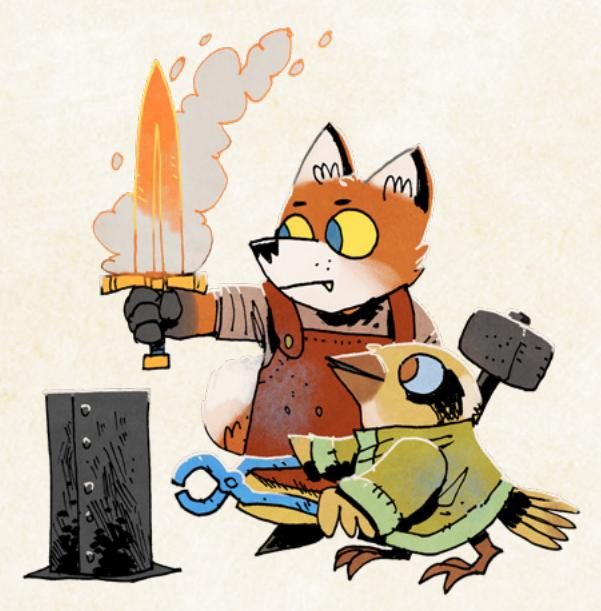

{117}------------------------------------------------

# <span id="page-117-0"></span>Sway an NPC

#### **REQUIRES +2 OR HIGHER REPUTATION**

When you *try to sway an open or vulnerable NPC by appealing to their belief in your reputation*, roll with Reputation for their faction. On a hit, you can change their mind about the world; say what you want them to believe, and the GM will rewrite their drive accordingly. On a 7–9, you use up some goodwill; clear 3-prestige. If you don't have enough prestige to clear, mark the remainder in notoriety. On a miss, the NPC takes the wrong message away from what you say; the GM will rewrite their drive accordingly.

You're pleading with the Mayor of Limmery Post, begging her to end her crackdown on any dissent in the clearing. You've only ever worked for the denizens' favor, you say to her, and you know her mindset won't help anyone. You're *swaying an NPC*!

Sway an NPC is the move for truly changing someone's mind instead of merely *persuading* them. Think of the difference as offering someone a good reason to do something specific (persuasion) and getting someone to see the world in a whole new way (swaying). The latter can lead to real, significant, ongoing change!

In order for you to sway an NPC, they have to be open and vulnerable to you, and you have to appeal to their belief in your reputation. If you've betrayed this specific NPC before it might not matter what your Reputation is—they probably aren't open to what you're saying. "Open and vulnerable" also means you probably can't sway the NPC again and again and again before they become "closed"...no matter how highly they think of you.

**"On a hit, you can change their mind about the world; say what you want them to believe, and the GM will rewrite their drive accordingly"** means exactly what it says. You and the GM have a conversation about how you're trying to change their mind, what new belief you hope they hold, and then the GM will rewrite the NPC's drive based on what you say. You might take an NPC whose drive is "To utterly destroy the Marquisate and its supporters" and change their drive to "To defend the denizens of the Woodland," for example.

**"On a 7–9, you use up some goodwill; clear 3-prestige"** means that changing someone's mind like this comes at a a cost. You're using up your clout to get it done.

**"On a miss, the NPC takes the wrong message away from what you say; the GM will rewrite their drive accordingly"** means that you've successfully changed the NPC's mind, but not the way you wanted. The GM gets to decide how exactly they misunderstand you, but expect an exaggerated or twisted version of what you had hoped to achieve by *swaying* them.

Chapter 5: Core Rules 117

{118}------------------------------------------------

# Make a Pointed Threat

**REQUIRES -3 REPUTATION**

When you *make a pointed threat to an NPC by wielding your reputation*, roll with Reputation for their faction, treating it as positive (+3) for this roll. On a 10+, they are rattled; they must surrender, retreat, or charge, GM's choice. On a 7–9, you must make a demonstration of your dangerous intent first, before they are rattled. On a miss, your reputation precedes you; they reveal how they prepared for someone like you.

The local Woodland Alliance cell has openly attacked the clearing…and you're trying to stop them. You face off against their leader and tell them if they hurt anyone, you're never ever going to stop hunting them—you're the famous Fang of the Marquisate! You're *making a pointed threat*!

*Making a pointed threat* is a way to use your extremely negative Reputation to get your enemy to back down or make a mistake. It's most useful in situations where you couldn't normally *persuade*—enemies with whom you have a –3 Reputation are unlikely to listen to you! You treat your –3 Reputation as +3 for purposes of the roll—add +3 to whatever you roll on 2d6.

On a 10+, the NPC is rattled—the GM chooses whether they surrender, retreat, or charge. "Surrender" means give in to you and your demands; "retreat" means they withdraw; and "charge" means they attack you, hard, fast, and poorly. If an NPC "charges" at you, they are still giving you the upper hand—they're not thinking straight, and you can take advantage of their carelessness.

**"On a 7–9, you must make a demonstration of your dangerous intent first, before they are rattled"** means that they will be rattled—you did get a hit, after all—but you have to prove your dangerous Reputation and your threat here and now. This demonstration has to be something significant, something the target would feel as real, upsetting, and serious. Drawing your sword can be intimidating, but likely isn't enough. Drawing the sword you took from the enemy faction's greatest hero and showing it off might do the trick. Drawing the sword and putting its edge against a hostage's throat definitely sends a message.

**"On a miss, your reputation precedes you; they reveal how they prepared for someone like you"** means that when you try to make your pointed threat, you find out that you've stumbled right into a terrible trap. Your Reputation is fearsome and dangerous, after all—your foes probably heard about your approach and cooked something up just for this situation. It might be guards hidden somewhere nearby; it might be poison slipped into the food you just left; but whatever it is, it'll be bad.


{119}------------------------------------------------

# Nested Moves and Uncertainty

When you make a pointed threat, you may have to make a demonstration of your dangerous intent, acting in some additional way for the move to resolve. Sometimes that further action won't have any uncertainty—like drawing your blade along the cheek of your hostage without needing to trigger any new move.

Rarely, the action might trigger another move—like *wrecking* one of the support struts of a building. That's okay! But the stakes of the first move are now going to be resolved by the second. The consequences of the second move cannot derail the results of the first—if you pull off the necessary condition from the first move (like making your demonstration), then you still get the results of the first move.

# Command Resources

**REQUIRES +3 REPUTATION**

When you *command an NPC to give you significant, valuable resources*, roll with Reputation for their faction. On a 10+, you get what you need as soon as they can get it to you. On a 7–9, they impose a condition on how you can use the resources, or what you must return to the faction in recompense. On a miss, they don't have what you need, but they tell you a way you can get it at a steep cost or some serious difficulty.

You storm into the local Marquisate legate's office, smash your dagger down into their map of the Woodland, and demand they assign troops to follow you to a local clearing help free it from the Eyrie Dynasties. You're *commanding resources*!

*Command resources* is the move for wielding your positive Reputation like a hammer to get what you want from allies. You've achieved such a high Reputation—you're basically a legend among that faction—that you can straight up give them commands, and they can't possibly just brush you off.

**"…Give you significant, valuable resources"** means that you aren't just giving any command—you're commanding them to give you resources you otherwise couldn't get under your control. *Commanding* them to give you a bed for the night isn't really a "significant, valuable resource" so this move wouldn't be triggered; but *commanding* them to assign a whole siege weapon to you would definitely trigger this move.

{120}------------------------------------------------

There is no restriction on whom this move can be used—if you've managed to earn and maintain a +3 Reputation with the Marquisate, you've earned the right to make these demands even on the Marquise de Cat herself.

**"You get what you need as soon as they can get it to you"** means exactly what it sounds like—they might not be able to get you those resources immediately, but as soon as they possibly can, they do.

**"They impose a condition on how you can use the resources, or what you must return to the faction in recompense"** means that you don't get what you wanted without strings. Exactly what they ask for is up to the GM, but it will either be a restriction on the resources' use or a favor you have to give them in return. A restriction just complicates your relationship with the faction—break the restriction and you'll likely earn notoriety—by complicating what you're allowed to do. "You can't use the siege weapon to destroy the clearing's main wall" is a good example of a restriction. A favor in return doesn't need to involve the resource but often will, and failing to return the favor will also earn you notoriety. "You have to hand over the eagle governor of the clearing after you win" is a good example of a favor.

**"On a miss, they don't have what you need, but they tell you a way you can get it at a steep cost or some serious difficulty"** means that they aren't refusing you—they just straight up cannot help you out, not without a lot of trouble. Perhaps the siege weapon you're asking for has been taken by the enemy—if you can free it, you can have it. Perhaps the siege weapon is crucial to a current battle the faction is fighting—you have to provide them with enough resources to hire mercenaries to shore up their forces before you can get the weapon. In all such cases, you still have a chance of getting it, but only through a path that's quite costly.

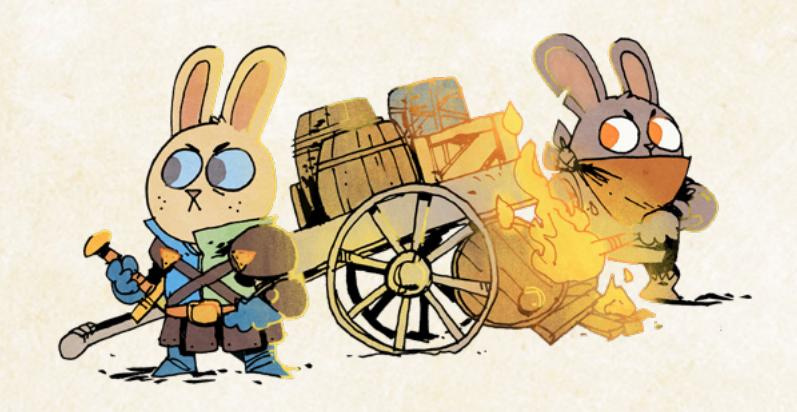

{121}------------------------------------------------

# <span id="page-121-1"></span><span id="page-121-0"></span>Travel Moves

The vagabonds don't have real homes. They journey across the Woodland, moving from clearing to clearing. Sometimes they cross the paths of the Woodland, and sometimes they cross the dangerous forests. But travel is always a crucial part of the vagabonds' tales, and these moves are here to support the game with interesting uncertainty when the vagabonds begin a new journey.

# Gravel Ghrough the Forest

When you *travel from clearing to clearing through the forest*, the band collectively decides how it travels and one member of the band rolls for the group:

- slowly, foraging heavily: everyone clears 2-depletion; the band collectively marks an exhaustion for each band member; -1 to the roll
- carefully, avoiding trouble: the band collectively marks one depletion or exhaustion for each band member; +1 to the roll
- as quickly as possible: everyone marks exhaustion and depletion;
   to the roll

On a hit, you pass through the forest to any clearing on the other side. Along the way, one of you spots an interesting site; you leave markers so you can return after you finish your trip. On a 10+, the transit is largely safe. On a 7–9, something from the forest is following you; you can let it track you, or every vagabond marks exhaustion to lose it. On a miss, you run afoul of one of the forest's dangers during the trip, and you can't escape it easily; deal with it before you can reach the clearing on the other side.

You and your band depart from Opensky Haven, diving into the forest to try to take a shortcut to nearby Mellowhill. You're *traveling through the forest!* 

**Traveling through the forest** is dangerous—only vagabonds are brave and skilled enough to do it often. But there's no better way to quickly cut across a wide swath of the Woodland and arrive at an important destination.

When you *travel through the forest*, the band collectively decides how it travels, including where it's going—any clearing on the other side of an intervening forest, no matter how far away it would be by path. That means all the players should have a discussion. If there is real disagreement, it's a great chance to *plead with another PC* to convince other PCs to go along with you (page 88), or to find out just how committed to their plans they are. If there is still major disagreement, go with the majority vote of the players.

{122}------------------------------------------------

Traveling **"slowly, foraging heavily,"** means the band is taking its time and replenishing its supplies from the forest as it goes. Each PC in the band gets to clear 2-depletion, but the group as a whole has to mark at least 1-exhaustion for each PC. So a band of four vagabonds would still allow each vagabond to clear 2-depletion, but would have to mark 4-exhaustion collectively. That means one PC might mark 3-exhaustion and another PC might mark a single exhaustion, or two PCs might mark 2-exhaustion each, or each PC might mark exhaustion…just as long as the total exhaustion marked equals the number of PCs. The band takes –1 to the roll, then, for its slowness.

Traveling **"carefully, avoiding trouble,"** means the band is moving safely through the forest, but not slowly enough to gather supplies. The band must collectively mark a total number of exhaustion and depletion equal to the PCs. A band of four vagabonds might have one PC mark 2-depletion and another PC mark 2-exhaustion, or might have two PCs each mark depletion and a third PC mark 2-exhaustion, or one PC mark depletion and 3-exhaustion…as long as the total of both kinds of harm marked is the same amount as the number of PCs in the band. The band takes +1 to the roll, then, for its relative speed.

Traveling **"as quickly as possible"** means the band is tearing its way across the forest. It's the best possible way to arrive at your destination fast, but it's very costly. Each PC in the band has to mark both depletion and exhaustion. The band takes +2 to the roll, then, for moving so quickly.

**"Along the way, one of you spots an interesting site; you leave markers so you can return after you finish your trip"** means you found something interesting in the forest, but it doesn't derail your travels. Going through the forest always reveals another interesting place to return to, but you are never obligated to visit it. You can find it again later without having to make this move again, and without paying further costs, if you and your band chooses to return to the forest. An interesting place might be a ruin, a bandit camp, a large animal cave, or even another vagabond's hiding place. The GM will tell you what the interesting site is.

**"The transit is largely safe"** means you arrive at your destination clearing without any significant difficulty. **"Something from the forest is following you"** means that you have a bit of trouble; it won't stop you from arriving at your destination, but it might cause you problems when you do arrive, or even later down the line. If every vagabond marks exhaustion, then the band can avoid the threat.

On a miss, a danger of the forest stands in your way; the band cannot arrive at its destination without dealing with that danger. The GM will tell the band what the danger is, and the conversation of play picks up with that situation, using all the basic moves to play out the conflict. Once the danger is resolved, the band can journey on to its destination without making this move again.

{123}------------------------------------------------

#### Gravel Along the Path

When you *travel from clearing to clearing along the path*, the band collectively decides how it travels and one member of the band rolls for the group:

- at a relaxing pace: everyone clears 3-exhaustion; the band collectively marks a total of 2-depletion; -I to the roll
- at an average pace: everyone clears 2-exhaustion; the band collectively marks 1-depletion; +0 to the roll
- safely, quickly, and under the radar: the band collectively marks 1-depletion for supplies; +1 to the roll
- urgently fast: everyone marks exhaustion; +2 to the roll

On a hit, you reach the next clearing in a timely fashion. On a 10+, the trip is uninterrupted and quick. On a 7-9, you encounter something noteworthy on the path—a caravan, a battleground, or something else odd passing through. On a miss, you are caught in the middle of a dangerous situation before you arrive at the next clearing.

You and your band depart from Opensky Haven, taking the path to the neighboring clearing of Pruitt's Brook. You're *traveling along the path!* 

Traveling along the path is, in general, safer than going through the forest—that's the point of the paths. But you're also more likely to encounter forces of a faction or other denizens on the path, as only vagabonds are brave enough (or foolish enough) to travel through the forest.

When you travel along the path, the group collectively decides how it travels. That means all the players should have a discussion. If there is real disagreement, it's a great chance to *plead with another PC* to convince other PCs to go along with you (page 88), or to find out just how committed to their plans they are. If there is still major disagreement, go with the majority vote of the players.

Traveling "at a relaxing pace" means taking your time, ensuring you won't be exhausted. The advantage is that you clear exhaustion—each vagabond gets to clear 3-exhaustion. The disadvantage is that it costs you more in food and supplies, and it makes you more likely to run into something along the road. The band must collectively mark 2-depletion—that means between the entire group of vagabonds, as long as two boxes of depletion are marked, the condition is satisfied. Both can be marked by a single vagabond, or they can be marked by two different vagabonds.

{124}------------------------------------------------

Traveling **"at an average pace"** is less costly in resources (the band only has to mark a single box of depletion among its members) and in the chance to run into something, but it's also less relaxing—vagabonds only clear 2-exhaustion each.

Traveling **"safely, quickly, and under the radar"** means you're being cautious as you move along the road, trying to avoid any conflicts or dangerous situations. You don't get to clear any exhaustion and someone in the band still has to mark a single box of depletion, but you also take +1 on the roll, meaning you are much less likely to run into something.

Traveling **"urgently fast"** gets you to your destination as fast as possible, but moving at such speeds is costly. Each member of the band has to mark exhaustion for the pace.

**"Reaching the next clearing in a timely fashion"** means that you arrive at your destination pretty much as fast as any denizen would've expected. "The trip is uninterrupted and quick" means that you arrive even faster than expected—it's the best way to ensure that you overtake some other group on your journey.

**"You encounter something noteworthy on the path"** means that your journey isn't uneventful. Something is on your path—the GM will tell you what—and you might allow yourselves to be diverted to investigate. But most of what you encounter can also be ignored to continue your journey. For example, if you come across the remains of a battle, then you can choose to move on instead of investigating further, but merely encountering the battle will tell you something about the events of the war. The GM can simply tell the band about what they encounter, and then allow them to arrive at the clearing. If the band wants to stop and spend time on the noteworthy encounter, they are more than welcome to, using the other moves of the game. When they are done, they can journey on to their original destination without making this move again.

**"You are caught in the middle of a dangerous situation before you arrive at the next clearing"** means that you do not arrive at your destination. The GM will tell you what dangerous situation halts your progress and demands your attention. You have to contend with the situation before you can return to the path. When you have dealt with the dangerous situation, you can choose to finish your journey to the original clearing without making this move again.

{125}------------------------------------------------

# <span id="page-125-1"></span><span id="page-125-0"></span>Harm

In Root: The RPG, every character has a few different ways to track their status—their harm tracks. For each track, when more boxes are marked, the character is worse off, depending upon the track in question. In these rules, "harm" is an all-purpose word to refer to all of these tracks.

Vagabond PCs have three harm tracks for three kinds of harm: depletion, exhaustion, and injury.

**Depletion** represents a character's all-purpose funds and assorted goods and supplies. Vagabonds are covered in pouches, belts, and pockets, and they carry all sorts of additional equipment. There's no point in tracking all of it because of how much of it there would be, so Root: The RPG uses depletion instead. An unmarked box of depletion represents some amount of equipment or supplies the vagabond is carrying; a marked box of depletion represents empty pockets and pouches.

**Exhaustion** represents a character's energy, strength, and capacity for pushing ahead. Vagabonds are particularly vivacious, so they have plenty of exhaustion boxes to mark when applying themselves substantially to some big effort. An unmarked box of exhaustion represents energy a character is ready to commit; a marked box of exhaustion represents tiredness and used-up energy.

**Injury** represents a character's health and overall physical well-being. Vagabonds are hardy, but even the hardiest vagabond can be laid low by sword strokes and hammer strikes. As vagabonds mark injury, they push ever closer to incapacitation and even death. An unmarked box of injury represents a portion of good health; a marked box of injury represents just that—injury, a wound, damage done to the body.

There are two other kinds of important harm: wear and morale.

**Wear** is a kind of harm track held only by items and NPCs. Wear represents equipment's durability, its strength, its own "health." On an item, it tracks how much structural damage the item has endured, and how much it can endure before being destroyed. On an NPC, it's a general tracker for all of that NPC's equipment— GMs don't track NPC equipment individually. An unmarked box of wear represents functional, if not pristine, condition; a marked box of wear represents damage to the weapon, nicks and breaks and cracks and loosened fastening.

<span id="page-125-2"></span>**Morale** is a kind of harm track held only by NPCs. It tracks an NPC's will to keep resisting (most likely, resisting the vagabonds), to keep fighting, or to keep arguing. An unmarked box of morale represents an NPC's commitment to their drives and causes; a marked box of morale represents that NPC's will draining away.

{126}------------------------------------------------

#### <span id="page-126-0"></span>Marking Depletion

Sometimes a vagabond marks depletion because their pouches get torn when they tumble out a window, but vagabonds often mark depletion because they need some all-purpose "stuff"; anything a vagabond might be carrying on their person in their pouches or backpack is fair game. It's never high quality, but it's always good enough.

Here a few items a vagabond could pull from their bag by marking one depletion:

- 1-Value of coin
- a torch, small lantern, or a few candles
- a 30ft length of rope
- a grappling hook
- climbing gloves
- food and water for a day
- fire-starting kit
- basic lockpicks
- supplies for repairs or healing (see clearing wear and injury, page 128)
- small pocket knife (for carving, not fighting)
- small smoke bomb
- mirror
- quill, parchment, ink
- basic map
- flask of oil or alcohol
- bedroll
- ball bearings

# Marking harm

Throughout Root: The RPG, you'll find a few ways of representing and marking harm. Here is a technical and specific breakdown of all of those ways:

- "Mark [harm]" means you mark a single box of that harm track.
- "Mark 2-[harm]" means you mark two boxes of that harm track. The same applies for "mark 3-[harm]" and "mark 4-[harm]" and so on.
- "Inflict [harm]" means you cause your target to mark a single box of that track.
- "Inflict 2-[harm]" means you cause your target to mark two boxes of that harm track. The same applies for "inflict 3-[harm]", "inflict 4-[harm]", etc.
- "Clear [harm]" means you clear a single marked box of that harm track.
- "Clear 2-[harm]" means you clear two boxes of that harm track, and so on.
- "Clear all [harm]" means that you clear all marked boxes of that harm track.
- "Harm," as described above, refers to the general idea of all the different kinds of harm. If something says "inflict harm," then the harm is suited to the fictional situation; for example, when you engage in melee, you might inflict harm, with that harm being dependent upon the weapon you're wielding.
- \* "Suffer harm," as in the construction "When you suffer harm," refers to when you mark harm on your own harm tracks.
- "Additional [harm]" means that the amount of harm is increased. If no amount is specified, increase it by one.
- "Fewer [harm]" means that the amount of harm is decreased. If no amount is specified, decrease it by one.


126 Root: The Roleplaying Game

{127}------------------------------------------------

# Harm Past the End of the Track

When you mark harm, it means you're using up resources and approaching some dangerous fate past the end of the harm track. If you've marked all the boxes on a given track, then you're in some dangerous state:

**If all your depletion is marked**, your pockets are empty. You're broke, unless you're carrying some extra treasure. This is likely the least dangerous track to have full, but it still leaves you without a significant resource.

**If all your exhaustion is marked**, you're wiped out, on the door of collapsing entirely. You can still move, still act, but you can't push yourself any further without the risk of utter collapse and even unconsciousness.

**If all your injury is marked**, you're on death's door. You've been wounded, injured, and hurt so much that while you're still alive now, all it would take is another wound to finish you. You likely need medical attention, now.

**If all of an item's wear is marked**, the item is about to break. It's only damaged now, but all it would take is a bit more stress to fracture it irreparably. For an NPC, it means their equipment is damaged and ready to break, similarly.

**If all of an NPC's morale is marked**, then they're just about ready to retreat or submit entirely. Just a bit more pressure on them, and they will cave.

The real risk and cost comes when you have all your harm boxes marked, and you need to mark one more. Most of the time this will be inflicted upon you as the result of someone else's actions and efforts, but sometimes you can choose to push past the end of your track, depending upon the situation. For example, you can always choose to push your equipment to the breaking point and mark wear when you have no boxes left to mark, and at the GM's discretion you might be able to mark exhaustion when you have no boxes left to mark and push yourself past your limits. You can't choose to mark depletion when you have no boxes left to mark—you don't have anything in your pockets!

**If you need to mark depletion when your depletion track is full**, you are utterly spent and can't mark it. There is no greater negative effect here marking depletion is usually voluntary, or the result of losing some of your equipment in a scrape or a tussle. When your track is full you have nothing left to lose. You cannot ever choose to mark depletion when your track is full, but any depletion inflicted upon you when your track is full is ignored.

**If you need to mark exhaustion when your exhaustion track is full**, you collapse into submission or even unconsciousness. The GM decides what your state is. You aren't dead—not right away—but you are helpless and at your enemy's mercy. Your friends might be able to save you, but you can't act on your own; maybe you're dazed and concussed...or just so tired your body won't respond.

Chapter 5: Core Rules 127

{128}------------------------------------------------

If you need to mark injury when your injury track is full, you die. Depending upon the situation, you might have a last moment to act, and almost always you'll get last words. But marking injury past the end of your track is the end of your character. This is by far the direst result of a full harm track, so be wary of it.

If you need to mark wear when your item's wear track is full, the item is damaged beyond repair. Up until this point, an item can always be fixed. At this point, the item has endured so much damage, "repairing it" is more or less making it anew. You can cross the item off your equipment list.

If an NPC needs to mark morale when their morale track is full, they submit or flee, immediately and entirely. They're done resisting, and they capitulate to any foe or aggressor without question—though the exact nature of that capitulation will vary depending upon the NPC's personality.

# <span id="page-128-0"></span>Clearing harm

Over the course of **Root**: **The RPG**, you will mark harm on all your tracks, and eventually you'll be in real danger of needing to mark harm past the end—so you need to find a way to clear them out from time to time!

You can clear depletion by gaining new supplies or money—filling your pockets with useful items and coin again. Gathering useful supplies from the forest and scrounging about in someone's home both clear depletion.

- Clear I-depletion: a small payment from a denizen, rummaging through a normal denizen's larder, a few hours spent foraging in the forest
- Clear 2-depletion: a decent wage from a denizen, rummaging through a normal denizen's whole house, a day or so spent foraging in the forest
- Clear 3-depletion: a decent wage from a wealthy denizen, rummaging through a workshop of a wealthy denizen, a couple days spent foraging in the forest
- Clear 4-depletion: a significant wage from a powerful denizen, rummaging through a wealthy denizen's whole house, a week spent foraging in the forest

You can clear exhaustion by fulfilling your nature (page 49), or by getting some good rest—sleeping, recovering, and taking a break. Getting a night's rest in a real bed is the best way to recover exhaustion.

- Clear I-exhaustion: a night's rest in a safe and well set-up camp site in the forest, a night's rest in someone's loft, a notably good meal
- Clear 2-exhaustion: a week's rest in a safe and well set-up camp site in the forest, a night's rest in a bed in a denizen's home, an exceptional meal
- Clear 3-exhaustion: a week's rest in a bed in a denizen's home, a night or two's rest in a nice plush bed in a very safe place, a safe and indulgent feast
- Clear 4-exhaustion: a week's rest in a nice plush bed in a very safe place, good eating and drinking for a week


{129}------------------------------------------------


You can clear injury by receiving medical attention—someone tending to your wounds, splinting broken bones and applying poultices to bruised limbs. Most often it requires a real healer and not just a fellow vagabond.

- Clear I-injury: a vagabond tends to your wounds (mark depletion for supplies), a healer spends an hour tending to your wounds (I-Value of supplies), a week of bed rest
- Clear 2-injury: a healer spends a day or less tending to your wounds (and requires 2-Value of supplies), two weeks of bed rest
- Clear 3-injury: a healer spends a week or less tending to your wounds (and requires 3-Value of supplies), a month of bed rest
- Clear 4-injury: a healer spends two weeks or more tending to your wounds (and requires 4-Value of supplies)

You can clear wear by repairing the damaged item—restringing, tightening, rebinding and making repairs, instead of making the item anew. Vagabonds are adept at making low-level repairs, but serious repairs require greater skill.

- Clear I-wear: a vagabond spends a few hours repairing the item (marking depletion), a trained expert spends an hour repairing the item (and requires I-Value of supplies)
- Clear 2-wear: a vagabond spends a couple days repairing the item (marking 2-depletion), a trained expert spends a few hours repairing the item (and requires 2-Value of supplies)
- Clear 3-wear: a trained expert spends a couple days repairing the item (and requires 3-Value of supplies)
- Clear 4-wear: a trained expert spends a week or more repairing the item (and requires 4-Value of supplies)

{130}------------------------------------------------

# <span id="page-130-1"></span><span id="page-130-0"></span>Session Moves

**Root:** The RPG has two "session moves"—moves that trigger at the end of each session of play. For this game, these moves are more or less reminders to make sure you check in on certain aspects of the vagabond PCs.

When the session ends, one at a time, each player reads their drives out loud. The players and GM discuss whether the player fulfilled their drive during the session in an instance that wasn't already called out during the session. If they did, and they did not already advance this session for the drive in question, then they advance.

This end of session move exists just to make sure that every player gets a chance to advance, even if they forgot to call out how they were fulfilling their drive in the heat of the moment. Each PC only has two drives, but it's far easier for each player to track their own drives than for the GM to try to track every player's drives—and even then, players who get caught up in the excitement and fun of the moment might not realize they fulfilled a drive. Use this move just to make sure that players get credit for the cool things they did during the session!

When the session ends, one at a time, each player may choose one element of their playbook to update or change. They do not have to choose anything, if they don't want to. They may choose one of the following options:

- Replace one drive with a new drive from any playbook
- Replace nature with a new nature from any playbook
- Replace a connection (both type and subject) with a new connection from any playbook

This end of session move lets players keep their characters updated throughout play—sometimes, a vagabond's nature, drive, or connections will stop making sense. A Ranger fully achieves their vengeance. An Arbiter breaks with their "master." A friendship cools and becomes professional, or strengthens and becomes a familial bond. Changing these elements of a vagabond is not a matter of advancement, but it is important that a vagabond's elements continue to reflect the state of the fiction. This move lets players do just that—a Ranger who has finally defeated the target of their Revenge can choose a new drive, or an Arbiter who has given up on their Principles can take a new drive to match their more pragmatic sensibilities.

{131}------------------------------------------------

<span id="page-131-0"></span>

{132}------------------------------------------------


hen you make a player character for Root: The RPG, you start by choosing a playbook. Each playbook is a kind of character, a set of options for how you interact with and see the

<span id="page-132-0"></span>Woodland. Some playbooks might be interested in getting into fights; others like to talk their way out of conflicts. Some might be criminals through and through; others might be up-and-coming heroes.

No playbook is a straitjacket. Each provides clear guidance to get you started with your character, but there is space to define your vagabond within the boundaries of the playbook. Furthermore, your character can change, grow, and move beyond the initial constraints of the playbook over the course of a campaign. You can even change playbooks entirely, down the line, emphasizing a whole new way for your character to approach the world.

Each PC uses a different playbook. That way, the band of vagabonds consists of different, interesting characters who don't overlap too much in their abilities. Using different playbooks helps to ensure each PC gets their own area to shine.

For more on the individual parts of the playbooks, make sure to check out Chapter 4: Making Vagabonds starting on page 41.

The list of playbooks included in this chapter is:

- Adventurer A charismatic, diplomatic vagabond, interested in forging connections and maybe even changing the Woodland.
- Arbiter A strong, battle-ready vagabond, acting often as defender and interceding in unfair conflicts.
- narrier A fast, freelancing vagabond, specializing in smuggling and speedy movement within and without clearings.
- Ranger A forest-savvy, antisocial vagabond, quite skilled but more a creature of the forests between clearings than of the clearings themselves.
- Ronin A highly trained outlander vagabond, cast forth from their homeland and now masterless in the Woodland.
- Scoundrel A destructive, risk-taking vagabond, with a heavy inclination towards arson and over-the-top action.
- **Ghief** A skilled, criminal vagabond, expert in burglary and theft but with a tendency to bite off more than they can chew.
- Ginker An innovative, technically-competent vagabond, interested in mechanisms, crafting, equipment, and dangerous new philosophies.
- Vagrant A deceitful huckster vagabond, master of cons and trickery.

いることは、これには、これのことには、これには、これには、これには、これには、これには、これには、これには、これ

{133}------------------------------------------------

<span id="page-133-0"></span>

# The Adventurer

*You are a peaceful, diplomatic vagabond, making allies from those you aid, perhaps toppling greater powers by forging strong bonds with others.*

#### Species

• fox, mouse, rabbit, bird, owl, other

#### Demeanor

• charming, diplomatic, agreeable, stern

#### Details

- he, she, they, shifting
- formal, colorful, multicultural, simple
- medal of service, beaded jewelry, carved flute, pouches with pretty stones

#### Charm +2

Cunning +1


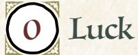


Add +1 to a stat of your choice, to a max of +2

# Weapon Skills

Choose one weapon skill to start

- Disarm
- Harry
- Improvise
- Parry

# Roguish Feats

You start with these: Counterfeit, Sleight of Hand

Equipment Starting Value 9

#### Your Nature choose one

- Extrovert: Clear your exhaustion track when you share a moment of real warmth, friendship, or enjoyment with someone.
- Peacemaker: Clear your exhaustion track when you resolve a dangerous conflict nonviolently.

# Your Drives choose two

- Ambition: Advance when you increase your reputation with any faction.
- Clean Paws: Advance when you accomplish an illicit, criminal goal while maintaining a believable veneer of innocence.
- Principles: Advance when you express or embody your moral principles at great cost to yourself or your allies.
- Justice: Advance when you achieve justice for someone wronged by a powerful, wealthy, or high-status individual.

# Your Connections

See [page 51](#page-51-0) for mechanical effects of connections.

- Partner: \_\_\_\_\_\_\_\_\_ and I fought alongside each other to defend a clearing from a faction's advances...but we failed. Why did we defend the clearing? Why did we fail? Who defeated us?
- Friend: I traveled with \_\_\_\_\_\_\_\_\_ for a time right after I became a vagabond. They helped keep me safe and showed me the Woodland. What keepsake did I gift them?

{134}------------------------------------------------

#### Adventurer Moves choose three Sterling Reputation Whenever you **mark any amount of prestige with a faction**, mark one additional prestige. When you **mark any amount of notoriety with a faction**, you can instead clear an equivalent amount of marked prestige. Subduing Strikes When you **aim to subdue an enemy quickly and nonlethally**, you can *engage in melee* with Cunning instead of Might. You cannot choose to inflict serious harm if you do. Talon on the Pulse When you **gather information about the goings-on in a clearing**, roll with Cunning. On a 10+, ask 3. On a 7-9, ask 2. • Who holds power in this clearing? • Who is the local dissident? • What are the denizens afraid of? • What do the denizens hope for? • What opportunities exist for enterprising vagabonds? On a miss, your questions tip off someone dangerous. Orator When you **give a speech to interested denizens of a clearing**, say what you are motivating them to do and roll with Charm. On a hit, they will move to do it as they see fit. On a 10+, choose 2. On a 7-9, choose 1. • They don't try to take your intent too far • They don't disband at the first sign of real resistance • They don't demand you stand at their head and lead On a miss, they twist your message in unpredictable ways. Well-Read

Take +1 Cunning (max +3).

#### Fast Friends

When you **try to befriend an NPC you've just met by matching their personality, body language, and desires**, mark exhaustion and roll with Cunning. On a hit, they'll look upon you favorably—ask them any one noncompromising question and they'll answer truthfully, or request a simple favor and they'll do it for you. On a 10+, they really like you—they'll share a valuable secret or grant you a serious favor instead. On a miss, you read them totally wrong, and their displeasure costs you.

{135}------------------------------------------------

# Background Questions

| Where do you call home?                                                                                                                | Whom have you left behind?                                                                            |
|----------------------------------------------------------------------------------------------------------------------------------------|-------------------------------------------------------------------------------------------------------|
| "<br>clearing<br>"<br>the forest<br>"                                                                                                  | "<br>my mentor<br>"<br>my family<br>"                                                                 |
| a place far from here<br>Why are you a vagabond?                                                                                       | my loved one<br>"<br>my student<br>"<br>my greatest ally                                              |
| "<br>I want to help the Woodland<br>"<br>I want to explore the Woodland<br>"<br>I believe the current factions should<br>be overturned | Which faction have you served<br>the most? (mark two prestige for<br>appropriate group)               |
| "<br>I must keep a promise to a loved one<br>"<br>I want freedom from society's<br>constraints                                         | With which faction have you earned<br>a special enmity? (mark one notoriety<br>for appropriate group) |

Pleasant, persuasive, renowned, peaceful. The Adventurer is a speaker and negotiator, trying to resolve conflicts and better the Woodland through honest speech and genuine pleas.

As the Adventurer, you are a capable talker with a tendency towards nonviolence and resolution of conflicts through negotiation. You might be driven by a general tendency to help those in need, by the goal of rising in renown, or by a specific desire to fix the larger Woodland—but one way or another, you're interested in being viewed positively.

Your fellow vagabonds will likely want to resolve things a bit more directly than you, focusing on combat, thievery, or deception to get what they desire. But in the long run, you are much more likely to achieve positive results; combat, thievery, and deception tend to have consequences, even if you get away scotfree in the moment.

Your natures, "Extrovert" and "Peacemaker," both point at your penchant for conversational interaction with other characters, your talent for relationship building. Focus on your interactions with other characters, PCs and NPCs alike.

Look for chances to resolve situations by talking, without using violence, and don't shy away from risky situations. Your fellow vagabonds might have to come in to bail you out, but that's all for the best, making a more interesting game and giving everyone a chance to shine. Use your other skills and connections to support your fellow vagabonds if it does come to blows—if nothing else, *assessing the situation* is always pretty useful.

{136}------------------------------------------------

#### Notes on The Adventurer Moves

For *Sterling Reputation*, keep in mind that you only increase prestige gains by one each time you gain prestige. This incentivizes pursuing lots of small good deeds. Don't hesitate to lose prestige to stop yourself from gaining notoriety racking up notoriety can hurt your Reputation much more than losing a few prestige.

For *Subduing Strikes*, "aiming to subdue an enemy quickly and nonlethally" often requires using an appropriate weapon. Coming at a foe with a sword makes it difficult to try to subdue them nonlethally, even if you hit with the flat of the blade. If your weapon inflicts exhaustion, then you are guaranteed that it is nonlethal.

For *Talon on the Pulse*, you need a bit of time to actually collect the information. Think of the move as covering a short montage of you going around the clearing and asking NPCs lots of different questions. On a miss, you won't necessarily be attacked or accosted, but drawing the interest of a dangerous individual will complicate your life.

For *Orator*, you have to give your speech to "interested denizens of a clearing." The move won't trigger if you try to speak to denizens who have no reason to pay attention to what you say, and it won't trigger if you're speaking to nonclearing denizens, like a group of bandits or a squad of well-trained soldiers. "They will move to do it as they see fit" means that you don't control exactly how they follow your exhortations—the GM will describe what they do, based on who they are and what choices you make from the list.

For *Well-Read*, keep in mind that moves like this are the only way to get +3 in a stat.

For *Fast Friends*, a "non-compromising question" is one they don't feel endangers them or threatens them in any way; a "simple favor" is one that doesn't cost them too much to conduct. A "valuable secret," however, can actually put them at risk for sharing it, and a "serious favor" might cost them quite a bit in time, effort, or money—not so much that it's self-destructive, but enough that it actually puts them out.

{137}------------------------------------------------

<span id="page-137-0"></span>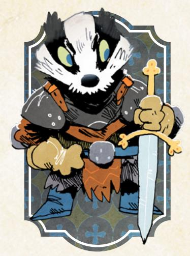

# The Arbiter

*You are a powerful, obstinate vagabond, serving as somewhere between a mercenary and a protector, perhaps taking sides too easily in the greater conflict between the factions.*

#### Species

• fox, mouse, rabbit, bird, badger, other

# Demeanor

• intimidating, honest, brusque, open

#### Details

- he, she, they, shifting
- large, scarred, wellgroomed, old
- faded military insignia, eyepatch, repaired clothes, tarnished locket

#### Charm +1

Cunning 0

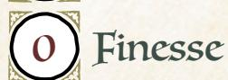

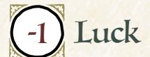


Add +1 to a stat of your choice, to a max of +2

# Weapon Skills

Choose one weapon skill to start

- Cleave
- Disarm
- Parry
- Storm a Group

# Roguish Feats

Choose one roguish feat to start [\(page 69](#page-69-0))

Equipment Starting Value 10

| Your Nature choose one |  |  |  |
|------------------------|--|--|--|
|------------------------|--|--|--|

- Defender: Clear your exhaustion track when you put yourself in harm's way to defend someone against injustice or dire threat.
- Punisher: Clear your exhaustion track when you tell a powerful or dangerous villain to their face that you will punish them.

# Your Drives choose two

- Justice: Advance when you achieve justice for someone wronged by a powerful, wealthy, or high-status individual.
- Principles: Advance when you express or embody your moral principles at great cost to yourself or your allies.
- Loyalty: You're loyal to someone; name them. Advance when you obey their order at a great cost to yourself.
- Protection: Name your ward. Advance when you protect them from significant danger, or when time passes and your ward is safe.

# Your Connections

See [page 51](#page-51-0) for mechanical effects of connections.

- Protector: I once protected \_\_\_\_\_\_\_\_\_ from a mortal blow during a fight, and I would do it again. Why?
- Partner: \_\_\_\_\_\_\_\_\_ and I together helped a faction take control of a clearing, and share responsibility for it.

{138}------------------------------------------------

#### Arbiter Moves choose three Brute Take +1 Might (max +3). Carry a Big Stick When you **use words to pause an argument or violent conflict between others**, roll with Charm. On a hit, they choose: mark 2 exhaustion and keep going, or stop for now. On a 10+, take +1 ongoing to dealing with them peacefully. On a miss, NPCs turn their anger to you, and PCs take +1 ongoing against you for the scene. Crash and Smash When you **smash your way through scenery to reach someone or something**, roll with Might. On a hit, you reach your target. On a 10+, choose 1. On a 7–9, choose 2. • You hurt yourself: mark 1 injury • You break an important part of your surroundings • You damage or leave behind a piece of gear (GM's choice) On a miss, you smash through, but you leave yourself totally vulnerable on the other side. Hardy Take 1 additional injury box. Whenever time passes or you journey to a new clearing, you can clear 2 injury boxes automatically. Strong Draw When you **target someone** with a bow, mark wear on the bow to roll with Might. On a hit, mark exhaustion to inflict 1 additional injury. Mark exhaustion again to make your shot ignore the enemy's armor—they cannot mark wear to absorb the injury. Guardian When you **defend someone or something from an immediate NPC or environmental threat**, roll with Might. On a hit, you keep them safe and choose one. On a 7–9, it costs: expose yourself to danger or escalate the situation. • Draw the attention of the threat; they focus on you now. • Put the threat in a vulnerable spot; take +1 forward to counterstrike. • Push the threat back; you and your protectee have a chance to maneuver or flee.

On a miss, you take the full brunt of the blow intended for your protectee, and

the threat has you where it wants you.

{139}------------------------------------------------

# Background Questions

| Where do you call home?                                                                                                                                                                                                                                                                                                 | Whom have you left behind?                                                                                                                                                                                                                                                    |
|-------------------------------------------------------------------------------------------------------------------------------------------------------------------------------------------------------------------------------------------------------------------------------------------------------------------------|-------------------------------------------------------------------------------------------------------------------------------------------------------------------------------------------------------------------------------------------------------------------------------|
| "<br>clearing<br>"<br>the forest<br>"<br>a place far from here<br>Why are you a vagabond?<br>"<br>I'm being hunted by a powerful official<br>"<br>I wish to make up for a past<br>transgression<br>"<br>I want to fight injustice<br>"<br>I must clear my tarnished name<br>"<br>I have been exiled from most clearings | "<br>my peer and friend<br>"<br>my family<br>"<br>my loved one<br>"<br>my ward<br>"<br>my commander<br>Which faction have you served<br>the most? (mark two prestige for<br>appropriate group)<br>With which faction have you earned<br>a special enmity? (mark one notoriety |
|                                                                                                                                                                                                                                                                                                                         | for appropriate group)                                                                                                                                                                                                                                                        |

Just, mighty, committed, defensive. The Arbiter is a capable warrior and protector, intervening in conflicts on one side or another, defending the innocent and punishing the transgressors.

As the Arbiter, you are one of the most competent fighters among your vagabond brethren, with a tendency to act like a wandering knight—a force of martial prowess without a single specific cause, but with a sense of justice all your own.

Other powers and figures are likely to want you on their side. After all, you are one of the best warriors they could have fighting for them! A key question for the Arbiter is always "On whose side do you fight?" Maybe you defend the innocent from tyrants, but maybe you pick the side you think is most likely to bring about peace.

Your natures, "Defender" and "Punisher," speak to the two sides of the Arbiter—one as a protector keeping harm from your wards, and the other as an avenger pursuing justice against wrongdoers. Both of them are likely to aim you at dangerous and powerful foes, so be on the lookout for antagonists who are targeting other denizens (so you can protect them) or who are deserving of justice.

Try to find causes to fight for or against. You're skilled at fighting, but if you only wait for fights to come to you, you might find yourself waiting more than you'd like. And don't hesitate to use other skills like *Carry a Big Stick* to try to avoid fights—you're skilled at fighting, but martial conflict almost always creates new problems.

{140}------------------------------------------------

#### Notes on The Arbiter Moves

For *Carry a Big Stick*, every party in the fight has to make the choice to mark 2-exhaustion and keep going or to stop for now. If one side keeps going and the other stops, the side that keeps going has to mark 2-exhaustion but gets to make the first move in the continued fight—after that, the side that chose to stop can act as normal. "Stop for now" means that they have to stop fighting more or less for the scene, but they can pick back up later. The "+1 ongoing to dealing with them peacefully" also lasts only until the end of the scene (only lasting longer at the GM's discretion).

For *Crash and Smash*, you need a destination to trigger the move. "You break an important part of your surroundings" means you break something you don't want broken—the GM will describe what that is. "You damage or leave behind a piece of gear (GM's choice)" means the GM chooses whether you damage the gear or leave it behind—not both. The amount of damage (in wear marked) that the equipment suffers is at the GM's discretion based on where you are and what you're smashing through, although it defaults to 1-wear.

For *Hardy*, "journeying to a new clearing" includes both through paths and through forest.

For *Strong Draw*, you must mark 2-exhaustion to ignore the enemy's armor you cannot mark exhaustion just for the armor-piercing effect without the additional 1-injury.

For *Guardian*, "defending someone" means that you are actively trying to keep them from harm caused by an immediate danger—not hypothetical harm, not harm in the future, but harm right now. "Draw the attention of the threat" means that, as long as it's a conscious threat, it's now a danger more for you than for your protectee. "Push the threat back" means that you create an opportunity where you and your protectee are not in immediate danger and can try to maneuver to safety.

{141}------------------------------------------------

<span id="page-141-0"></span>

# The Harrier

*You are a quick, enterprising vagabond, racing easily from building to building and clearing to clearing without anything stopping you, perhaps finding yourself in places others would rather keep secret or hidden.*

#### Species

• fox, mouse, rabbit, bird, squirrel, other

#### Demeanor

• excited, energetic, passionate, flighty

#### Details

- he, she, they, shifting
- roguish, kitted out, vibrant, scarred
- half-started maps, sewn bandana, ball and cup, widebrimmed hat

# Charm


0

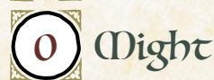

Add +1 to a stat of your choice, to a max of +2

# Weapon Skills

Choose one weapon skill to start

- Disarm
- Harry
- Quick Shot
- Trick Shot

# Roguish Feats

You start with these: Acrobatics, Sneak

Equipment Starting Value 9

#### Your Nature choose one

- Dutiful: Clear your exhaustion track when you take on a dangerous or difficult task on behalf of another.
- Competitive: Clear your exhaustion track when you take dramatically unnecessary risks to show off.

# Your Drives choose two

- Crime: Advance when you illicitly score a significant prize or pull off an illegal caper against impressive odds.
- Discovery: Advance when you encounter a new wonder or ruin in the forests.
- Infamy: Advance when you decrease your reputation with any faction.
- Wanderlust: Advance when you finish a journey to a clearing.

# Your Connections

See [page 51](#page-51-0) for mechanical effects of connections.

- Professional: \_\_\_\_\_\_\_\_\_\_\_ and I tried to blaze a new trail between two clearings; without the support of the major factions, it never fully came to fruition.
- Friend: \_\_\_\_\_\_\_\_\_\_\_ and I forged a bond while investigating a ruin deep in the woods. What strange minor trinkets do each of you carry from that expedition?

{142}------------------------------------------------

#### Harrier Moves choose three Cross Country Take one extra box of exhaustion. When **your exhaustion track is full and you must mark exhaustion**, you may choose to mark an equivalent amount of injury instead of being removed from the situation or going unconscious. Fleet of Foot and Hand Take +1 Finesse (max +3). Don't Shoot the Messenger Take the *Counterfeit* roguish feat (it does not count against your limit.) When you pretend to be an innocuous messenger carrying a missive of import to *trick* someone, roll with Luck instead of Cunning. Parkour When you **dash your way through a chaotic scene or fight**, roll with Finesse. On a 10+, hold 3. On a 7-9, hold 2. Spend your hold 1-for-1 to dash to something within sight and reach without being stopped, or to dash away from something nearby without being stopped. You can dash away from an enemy even at the moment they attack. On a miss, your surroundings trip you up, and you're caught in place while danger closes in. Traveler Extraordinaire When you **travel along the paths to another clearing**, you can always give +1 to the roll or clear 2-exhaustion, your choice. When you **travel through the forest to another clearing**, you can always give +1 to the roll or clear 2-depletion, your choice. In both cases, before you arrive at the next clearing, you can ask the GM any two questions about the next clearing, based on what you remember from your last time through. Smuggler's Path You've got a good sense for finding secret paths and doors. When you **spend time looking for a secret way in or out of a place that might have one**, mark exhaustion and roll with Luck. On a hit, you find a hidden path—the GM will

detail it and to where it leads. On a 10+, there's something along or inside the path of value to you—the GM will tell you what. On a miss, you find a secret path...and someone else is using it right this second. They probably won't be happy you found their secret.

{143}------------------------------------------------

# Background Questions

| Where do you call home?                                                                                                                                                                                                                                                                             | Whom have you left behind?                                                                                                                                                                                                                                              |
|-----------------------------------------------------------------------------------------------------------------------------------------------------------------------------------------------------------------------------------------------------------------------------------------------------|-------------------------------------------------------------------------------------------------------------------------------------------------------------------------------------------------------------------------------------------------------------------------|
| "<br>clearing<br>"<br>the forest<br>"<br>a place far from here<br>Why are you a vagabond?<br>"<br>I want to fight for Woodland freedom<br>"<br>I am chasing a loved one<br>"<br>I am on the run for my crimes<br>"<br>I feel a deep wanderlust<br>"<br>I am on the run from a commitment<br>at home | "<br>my teacher<br>"<br>my family<br>"<br>my loved one<br>"<br>my idol<br>"<br>my best friend<br>Which faction have you served<br>the most? (mark two prestige for<br>appropriate group)<br>With which faction have you earned<br>a special enmity? (mark one notoriety |
|                                                                                                                                                                                                                                                                                                     | for appropriate group)                                                                                                                                                                                                                                                  |

Mobile, crafty, unbound, criminal. The Harrier is a moving, traveling vagabond, often specializing as a freelancer for other powers. When they need something smuggled in or out of a clearing, they'll turn to the Harrier.

As the Harrier, you have a lot of useful skills, and you should seek opportunities to apply them. You're not as obvious a mercenary as a warrior like the Arbiter, but plenty of black marketeers would love to have a Harrier on their payroll.

The Harrier is very effective at getting jobs and other tasks from NPCs, but is just as effective at finding their own opportunities to take advantage of alongside their fellow vagabonds. As the Harrier, don't be afraid of trying to betray greater powers for some gain or profit—it will often fit your drives perfectly.

Your natures, "Dutiful" and "Competitive," both incentivize your taking action—doing over planning or thinking. Dutiful incentivizes taking on jobs on behalf of others, so don't hesitate to figure out what NPCs want and ask them for work. Competitive incentivizes taking on risks—it's easy enough to hit Competitive in the middle of any job. Both of them shine a light on the Harrier's emphasis on constantly moving.

For the Harrier, your drives are even more crucial—if you're ever looking for the next big thing to do, look at your drives and focus on that. But you can easily get by supporting other vagabonds in their goals, especially because it's often easy to hitch your drives and your nature to their objectives.

{144}------------------------------------------------

#### Notes on The Harrier Moves

For *Cross Country*, the injury you mark represents pushing your body past its limits. You cannot soak this injury with armor.

For *Fleet of Foot and Hand*, keep in mind that moves like this are the only way to get +3 in a stat.

For *Don't Shoot the Messenger*, remember that the "Counterfeit" roguish feat granted by this move doesn't count against your maximum total allowed through advancement (six feats). You don't have to have a counterfeit message in your possession to "pretend to be an innocuous messenger."

For *Parkour*, whatever hold you generate from the move, you may continue to spend as you choose throughout the duration of the scene. Once the chaos is over, any remaining hold is lost. You can spend your hold to move to places "within sight and reach." "Within sight" means you must either be able to see them or know they are there; "within reach" means you must feasibly be able to reach them within a few seconds of very fast, skilled movement. If you "dash away from an enemy at the moment they attack," you spend a hold and automatically shift ranges, and their attack misses (unless they can still reach you).

For *Traveler Extraordinaire*, make the choice of adding +1 or clearing 2-exhaustion or 2-depletion before the roll, but after any other expenditures you make—if the results of the move allow you to clear exhaustion or depletion, you can clear the exhaustion or depletion you just marked for the roll. When you ask two questions of the GM about the next clearing, the answers the GM gives you only refer to what you can recall; things very well may have changed since last you were there.

For *Smuggler's Path*, you can only make the move in a place that might have a secret path. The GM determines if the place might have a secret path; if it couldn't have a secret path, the GM tells you that and you don't need to mark exhaustion. On a miss, you still find the path and the GM will ultimately detail it as a hit, but you have to deal with the other denizen inside it first.

{145}------------------------------------------------

<span id="page-145-0"></span>

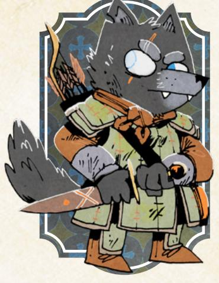

#### Charm -1

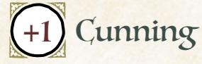


Add +1 to a stat of your choice, to a max of +2

# Weapon Skills

Choose one weapon skill to start

- Cleave
- Disarm
- Harry
- Vicious Strike

# Roguish Feats

You start with these: Hide, Sneak

Equipment Starting Value 9

# The Ranger

*You are a capable, stealthy vagabond, centered on the forests that fill the Woodland between the clearings, more interested in the wilds than in the company of other Woodland denizens or their society.*

#### Species

• fox, mouse, rabbit, bird, wolf, other

#### Demeanor

• terse, mistrusting, polite, kind

#### Details

- he, she, they, shifting
- unkempt, scarred, natural, practical
- forest charm, leafy cloak, smoking pipe, stolen ring

# Your Nature choose one

- Loner: Clear your exhaustion track when you enter a dangerous situation alone, without backup or assistance.
- Cynic: Clear your exhaustion track when you openly and directly ask dangerous questions about an accepted "truth".

# Your Drives choose two

- Discovery: Advance when you encounter a new wonder or ruin in the forests.
- Freedom: Advance when you free a group of denizens from oppression.
- Revenge: Name your foe. Advance when you cause significant harm to them or their interests.
- Protection: Name your ward. Advance when you protect them from significant danger, or when time passes and your ward is safe.

# Your Connections

See [page 51](#page-51-0) for mechanical effects of connections.

- Watcher: I was tricked, conned, or deceived by \_\_\_\_\_\_\_\_\_\_\_ once. Why do I choose to continue working with them?
- Protector: I did something that would have gotten me the enmity of a Woodland faction—if \_\_\_\_\_\_\_\_\_\_\_ hadn't covered for me. What did I do? Why and how did they protect me? Regardless, I feel indebted to them.

{146}------------------------------------------------

# Ranger Moves choose three Silent Paws You are adept at slipping into and out of dangerous situations without anyone noticing. When you *attempt a roguish feat* to sneak or hide, you can mark 2

 Slip Away

When you **take advantage of an opening to escape from a dangerous situation**, roll with Finesse. On a hit, you get away. On a 10+, choose 1. On a 7-9, choose 2:

- You suffer injury or exhaustion (GM's choice) during your escape
- You end up in another dangerous situation
- You leave something important behind

exhaustion to shift a miss to a 7-9.

On a miss, you escape, but it costs you—mark injury or exhaustion, GM's choice and you leave ample evidence behind for your foes to track and follow you.

# Poisons and Antidotes

You have expertise in the poisons and antidotes of the Woodland. When you **brew a poison**, mark depletion and say what effect you want it to have: sleep, weakness, inebriation, or death. Any poison you make requires ingestion or injection; you can use the poison on your weapon or put it in your target's food or drink. When you **study a poison or its effects to make an antidote**, the GM will tell you what special ingredient you'll need. Get the ingredient and mark 1 depletion to brew the antidote.

# Forager

When you **travel or pass into a forest**, before making any travel move, you can clear your choice of:

- Up to 3-depletion
- Up to 2-exhaustion
- Up to 2-injury

# Threatening Visage

When you **persuade an NPC** with open threats or naked steel, roll with Might instead of Charm.

# Dirty Fighter

Take two of the following weapon skills: *Trick Shot, Confuse Senses, Improvise Weapon, Disarm, Vicious Strike*. None of the skills you take with this move count against your limit.

{147}------------------------------------------------

# Background Questions

| Where do you call home?                                                                             | Why are you a vagabond?                                                                                            |
|-----------------------------------------------------------------------------------------------------|--------------------------------------------------------------------------------------------------------------------|
| "<br>clearing<br>"<br>the forest                                                                    | "<br>I dislike the hypocrisy of society<br>"<br>I am mistrusted by other denizens                                  |
| "<br>a place far from here<br>Whom have you left behind?                                            | "<br>I want to wander the Woodland<br>"<br>I need to find and save a loved one<br>"<br>I seek escape from the wars |
| "<br>my commander<br>"<br>my family<br>"<br>my best friend<br>"<br>my student                       | Which faction have you served<br>the most? (mark two prestige for<br>appropriate group)                            |
| "<br>no one—I lost those who mattered<br>to me (mark one notoriety with the<br>faction responsible) | With which faction have you earned<br>a special enmity? (mark one notoriety<br>for appropriate group)              |

Solitary, dangerous, stealthy, wild. The Ranger is an experienced forestdwelling vagabond, capable of fighting and surviving in the Woodland's most dangerous spaces.

As the Ranger, you are a skilled and dangerous fighter, but your emphasis is on stealth—striking from shadows, escaping from dangerous conflicts, and more. You can handle yourself in a straight-up fight, but it's likely not your preferred form of conflict.

At heart, the Ranger is a bit more of a loner than the rest of the vagabonds, but they have found the advantages of the band drawing them in. Companionship, teamwork, shared burdens—these things will always draw the Ranger back to the band. You can play them as gruff and standoffish as you want, but remember that the Ranger belongs with the band as long as they are a PC.

Your natures, "Loner" and "Cynic," point to your antisocial behaviors. "Loner" is obviously pointed at your tendency to try to solve problems alone—keep in mind that it's going to cause you trouble, and that it's about individual situations, not leaving your band behind and journeying to another clearing altogether. "Cynic" draws attention to your desire to speak truth to power, to question assumptions of the factions and powers that be…but in ways very likely to draw the ire of those very same powers.

Lean into your connections and your fellow vagabonds. Your drives and your nature might draw you into conflicts that seem isolated, but they're always more fun when the other PCs can get involved eventually, even if they mostly end up rescuing you!

Chapter 6: Playbooks 147

{148}------------------------------------------------

#### Notes on The Ranger Moves

For *Silent Paws*, keep in mind that you will still incur a risk of the feat on a 7–9, unless you're willing to mark a third exhaustion to avoid it.

For *Slip Away*, you need an opportunity to escape, so you might need to take some action first to create that chance. If you end up in another dangerous situation, the GM establishes that situation and how it is different from what you just escaped. If you leave something important behind, the GM ultimately decides what it is.

For *Poisons and Antidotes*, any poison or antidote you make does require some time to make, along with a place to brew it. When you inflict your poison on someone, it does not take immediate effect; the more severe the effect you choose, the longer it will take to come to fruition, with death poisons taking up to a day or two to fully work. Antidotes, similarly, take some time to fully cure the poison, with more terrible poisons taking more time to cure.

For *Forager*, make your choice about what to clear before any expenditures for traveling through the forest.

For *Threatening Visage*, your threats must be believable—if you're bound to a chair, for example, you might not be able to make a believable threat.

For *Dirty Fighter*, keep in mind that whatever skills the move grants do not count against your maximum total for advancement (seven skills).


{149}------------------------------------------------

<span id="page-149-0"></span>

# The Ronin

*You are a skilled, willful vagabond, formerly a servant of a lord in a different land, now masterless. You came to the Woodland to live as a free vagabond.*

#### Species

• fox, mouse, rabbit, bird, racoon dog, other

#### Demeanor

• gruff, polite, direct, dangerous

#### Details

- he, she, they, shifting
- militaristic, outlandish, simple, colorful
- lord's token, mark of esteem, stringed instrument, board game

#### Charm 0

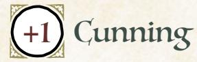

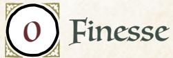


Add +1 to a stat of your choice, to a max of +2

# Weapon Skills

Choose one weapon skill to start

- Cleave
- Harry
- Storm a Group
- Vicious Strike

# Roguish Feats

You start with this one: Blindside

Equipment Starting Value 11

# Your Nature choose one

- Survivor: Clear your exhaustion track when you try to flee or cover allies' flight from a dangerous or overwhelming situation.
- Pilgrim: Clear your exhaustion track when you find an expert in a skill you don't possess.

# Your Drives choose two

- Principles: Advance when you express or embody your moral principles at great cost to yourself or your allies.
- Revenge: Name your foe. Advance when you cause significant harm to them or their interests.
- Thrills: Advance when you escape from certain death or incarceration.
- Wanderlust: Advance when you finish a journey to a clearing.

# Your Connections

See [page 51](#page-51-0) for mechanical effects of connections.

- Partner: \_\_\_\_\_\_\_\_\_\_ and I worked together on my first real task of significance in the Woodland, deposing a dangerous authority figure of a faction. Who did we depose? Why?
- Watcher: I see in \_\_\_\_\_\_\_\_\_\_\_\_ many reminders of my old master. I am drawn to them, even as I watch them carefully. What is it that reminds me of my old master? How do they feel about my watchful eyes?

{150}------------------------------------------------

#### Ronin Moves choose three Always Armed Take the weapon skill *Improvise a Weapon* (it does not count against your limit). When you deal harm with an improvised weapon, deal +1 harm. Knowing a Lord's Will When you *figure out* a denizen of status, authority, or power, roll with Might instead of Charm. When you trick a denizen of status, authority, or power by playing subordinate, roll with Might instead of Cunning. Well-Mannered When you **enter a social environment dependent on manners and etiquette**, roll with Cunning. On a 10+, hold 3. On a 7-9, hold 2. Lose all hold when you leave or when social rules fall apart. Spend hold 1-for-1 to: • Cover up a social faux pas on behalf of yourself or an ally; clear 1 exhaustion. • Call out someone else's social faux pas; inflict 1-morale harm on them. • Charm someone; take +1 ongoing to speak to them while you have hold. • Demonstrate your value; mark prestige with a powerful denizen's faction. On a miss, the rules of etiquette here are far different from what you expected; mark exhaustion as you commit a gravely impolite error. Fealty When you **commit yourself to the cause of someone you deem worthy**, swear an oath to them stating what task you will complete on their behalf. Mark exhaustion to reroll a move made in pursuit of that task. You cannot commit yourself to another cause until you accomplish the first, or break your oath. If you break your oath, fill your exhaustion track and mark 4 notoriety with the faction whose trust you betrayed. If you fulfill your oath, mark 4 prestige with the faction whose trust you kept. The Rules of War When you **call upon a reasonable foe to uphold a rule of war**, roll with Might. On a hit, they feel obliged; choose one below they must follow. On a 7-9, they choose one that you must follow; disobey, and the obligation ends. • Show mercy to surrendering foes and prisoners • Refrain from underhanded tactics in a fight • Face each other without aid, back-up, or assistance • Keep the violence away from the unarmed or innocent • Fight to surrender or subdual, without retreat

On a miss, they feel no obligation to your ideas of war; prepare for a brutal

 Always Watching

lesson in the rules they adhere to.

Take +1 Cunning (max +3).

{151}------------------------------------------------

# Background Questions

| Where do you call home?                                                                                                                                                                                                  | What happened to your last master?                                                                                                                                                               |
|--------------------------------------------------------------------------------------------------------------------------------------------------------------------------------------------------------------------------|--------------------------------------------------------------------------------------------------------------------------------------------------------------------------------------------------|
| "<br>clearing<br>"<br>the forest                                                                                                                                                                                         | "<br>assassination<br>"<br>unjust imprisonment                                                                                                                                                   |
| "<br>a place far from here<br>Why are you a vagabond?                                                                                                                                                                    | "<br>disappearance<br>"<br>justified overthrow<br>"<br>betrayal                                                                                                                                  |
| "<br>I want to build a masterless life<br>"<br>I seek a cause to redeem myself<br>"<br>I aim to bring a hunted foe to justice<br>"<br>I am hunted by old foes<br>"<br>I need freedom to fulfill my master's<br>last wish | Which faction have you served<br>the most? (mark two prestige for<br>appropriate group)<br>With which faction have you earned<br>a special enmity? (mark one notoriety<br>for appropriate group) |

Well-trained, willful, expatriate, free. The Ronin is a former servant and warrior of some master in a land far from here, now broken from their lord and come to this land as a free agent.

As the Ronin, you are quite a capable fighter, but you're also a social character—a "servant" well used to figuring out the vagaries of the court, the needs of a lord, and the ways of propriety. You're at home both on the battlefield and in the halls of power.

The Ronin, by definition, is originally from somewhere other than the Woodland. They left that life behind with the demise of their master—one of the background questions on the playbook is all about what happened to that master. As such, the Ronin has a different cultural background with different traditions and ideas than a Woodland denizen.

That said, the Ronin is still a denizen like the other characters. They have the same overarching drives and desires. And the Ronin certainly has been in the Woodland long enough to be able to easily function there, though NPCs recognizing the Ronin's background and treating them differently can make for dramatic trouble (if everyone at the table is on board with those issues coming to the fore).

In playing a Ronin, be sure to avoid some of the pitfalls of playing a character of a different culture—no accents, no silly misunderstandings about commonplace objects, no broken grammatical constructions. The Ronin is competent and capable, and they've learned how to navigate the Woodland.

{152}------------------------------------------------

Your natures point you at two different styles of wandering Ronin in the Woodland. The first, "Survivor," is all about getting into big dangerous situations with friends, and then helping them get out. Note—you don't have to escape for Survivor to trigger. You just have to help your allies escape. The second, "Pilgrim," is all about learning. Seek out interesting new denizens and try to learn from them—you'll forge new bonds and maybe pick up a thing or two!

Either way, play into your "search for a master." The Ronin's past was defined by their relationship to their master. Whether they struggle to be free of that past, or whether they will happily commit to a new lord, the conflict creates an interesting path for the Ronin to follow.

#### Notes on The Ronin Moves

For *Well-Mannered*, any more formal or proper setting would be appropriate to the move, but there might be some strange cases that also count—a thieves' guild with a lot of intricate rules on action and hierarchy might count, for example. For each of the options when you spend hold, make sure you actually describe what happened, what faux pas you called out, or which character you charmed (and how).

For *Fealty*, when you swear the oath and declare your task, make sure you declare a bounded task, something with a finite and clear condition under which it has been accomplished. "Defend Hoproot" is unbounded—it could go on forever—but "Defend Hoproot from the upcoming Redclaw Platoon attack" is specific and clear. "Breaking your oath" can happen whenever you feel appropriate, but it should be clear to everyone—you have broken your oath, and there is no trying to fulfill it later. And the notoriety and prestige you earn for breaking or fulfilling your oath are in addition to any other notoriety or prestige you might earn through those actions.

For *The Rules of War*, your foe must be "reasonable"—if they are raging, or if they are unlikely to follow any rules of conflict at all, then they don't qualify. If your opponent feels "obliged" to follow a rule, it means they must follow it and cannot take any action contrary to the rule.

{153}------------------------------------------------

<span id="page-153-0"></span>

# The Scoundrel

*You are a lucky, dangerous vagabond, acting more as destroyer and troublemaker than anything else, perhaps creating chaos and destruction for its own sake.*

#### Species

• fox, mouse, rabbit, bird, cat, other

#### Demeanor

• shifty, slimy, straightforward, naive

#### Details

- he, she, they, shifting
- suspicious, impoverished, fleabitten, scarred
- full face mask, mousesteel spark lighter, overly large coat, sulphurous pouches

#### Charm +1

Cunning -1


Finesse


Luck

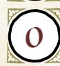

Might

Add +1 to a stat of your choice, to a max of +2

# Weapon Skills

Choose one weapon skill to start

- Confuse Senses
- Improvise
- Quick Shot Vicious Strike

# Roguish Feats

You start with these: Acrobatics, Sneak, Hide

Equipment Starting Value 8

#### Your Nature choose one

- Arsonist: Clear your exhaustion track when you use needlessly destructive or damaging methods to solve a problem.
- Combative: Clear your exhaustion track when you try to start a fight against overwhelming opposition.

# Your Drives choose two

- Chaos: Advance when you topple a tyrannical or dangerously overbearing figure or order.
- Thrills: Advance when you escape from certain death or incarceration.
- Crime: Advance when you illicitly score a significant prize or pull off an illegal caper against impressive odds.
- Infamy: Advance when you decrease your reputation with any faction.

# Your Connections

See [page 51](#page-51-0) for mechanical effects of connections.

- Friend: \_\_\_\_\_\_\_\_\_\_\_\_ and I once met and pulled off a mad, impossible stunt together. What did we do? Why?
- Partner: \_\_\_\_\_\_\_\_\_\_\_\_ and I destroyed a faction's resource, on behalf of an opposing faction. Why?

{154}------------------------------------------------

#### Scoundrel Moves choose three Explosive Personality When you *wreck something* with flagrantly dangerous means (explosives, uncontrolled flame, etc.), roll with Luck instead of Might. Create to Destroy When you **use available materials to rig up a dangerous device**, roll with Finesse. On a hit, you cobble together something that will do what you want, one time. On a 10+, choose one. On a 7-9, choose two. The device is: • more dangerous than intended • larger or more unwieldy than intended • more temperamental and fragile than intended On a miss, you need some vital component to finish it; the GM will tell you what. It's a Distraction! You gain the roguish feat *Blindside* (it does not count against your limit). When you *attempt a roguish feat* to blindside someone while they are distracted by environmental dangers (a raging fire, an oncoming flood, etc.), roll with Luck instead of Cunning. Daredevil You're at your luckiest when you go into danger without hesitation. When you **dive into a dangerous situation without forethought or planning**, treat yourself as having "Luck Armor," with 1 box of wear (remember, armor is only "destroyed" when you would mark another box of wear, and all its boxes are full). The "Luck Armor" automatically goes away once the danger has passed, and the next time you would have "Luck Armor," you gain it as if it was brand new with clear boxes.

#### Danger Mask

You have a mask or outfit you wear when you go about your most destructive work—more of a calling card, an identifier of "the real you," than a disguise. Treat it as a piece of equipment with two boxes of wear. While you have your mask on, any notoriety you gain is doubled, any prestige you gain is halved, and take +1 to *trust fate* and all Scoundrel playbook moves. If your mask is ever taken from you, mark exhaustion. If your mask is ever destroyed, mark 4-exhaustion. If your mask is destroyed, you can make a new mask when time passes.

#### Better Lucky than Good

When you **use a weapon move (basic or skilled)**, mark exhaustion to roll with Luck instead of the listed stat.

{155}------------------------------------------------

# Background Questions

| Where do you call home?                                                                                                                                                                                            | Whom have you left behind?                                                                                                                                                                                              |
|--------------------------------------------------------------------------------------------------------------------------------------------------------------------------------------------------------------------|-------------------------------------------------------------------------------------------------------------------------------------------------------------------------------------------------------------------------|
| "<br>clearing<br>"<br>the forest<br>"<br>a place far from here<br>Why are you a vagabond?                                                                                                                          | "<br>my teacher<br>"<br>my family<br>"<br>my loved one<br>"<br>my only defender                                                                                                                                         |
| "<br>I am on the run for a destructive crime<br>"<br>I seek vengeance for my suffering<br>"<br>I wish to defeat a faction<br>"<br>I am mistrusted by other denizens<br>"<br>I want to be free from society's bonds | "<br>my best friend<br>Which faction have you served<br>the most? (mark two prestige for<br>appropriate group)<br>With which faction have you earned<br>a special enmity? (mark one notoriety<br>for appropriate group) |

Destructive, risky, wild, mischievous. The Scoundrel is a stealthy destroyer, an arsonist, rebel, and agent of chaos in a mask.

As the Scoundrel, you're a troublemaker, for good and for ill. You can cause a lot of trouble for tyrants and oppressors, but you'll create just as much trouble for your comrades. That's okay, though—your high Luck means you're just about as good as can be expected at getting out of those sticky situations you create.

The Scoundrel might have a bit of a tendency to be antisocial with the rest of the vagabonds—if they grow too frustrated with the way you blow up situations and use dangerous and extreme solutions, then the other vagabonds might want to part ways with the troublemaker. You should make liberal use of the *pleading* to get the other PCs to go along with your plans, and you should play hard into your connections—you've got a friend and a partner at least, and those positive relationships should help make up for your mischief!

That said, when playing a Scoundrel, be sure that you don't create meaningless chaos (at least, not often). Even if you have the Chaos drive, you're actually after a particular goal, not just chaos for its own sake. Play towards your goals, towards accomplishing ends—even if you tend to blow things up along the way, it's more fun if the explosions are purposeful.

Your natures both point at your troublemaking essence. If you're an "Arsonist," then you have incentive to cause more destruction than necessary in accomplishing your ends. If you're "Combative," then you have incentive to start fights you probably can't win. In both cases, you're going to cause a LOT of trouble to get back your exhaustion. The more you can get buy-in from your fellow vagabonds before things explode, the better.

Chapter 6: Playbooks 155

{156}------------------------------------------------

But when the time comes, don't hesitate to hit your moves and blow stuff up. The Scoundrel is a fun playbook because of the trouble it creates—it's not a playbook for playing it safe, no matter what your pals think!

# Notes on The Scoundrel Moves

For *Explosive Personality*, "flagrantly dangerous" means "obviously dangerous to more than just the thing you're wrecking." A giant badger might convince himself he can bend the bars of his cell without breaking the walls. But when the Scoundrel uses a "flagrantly dangerous" barrel of explosives, no one is under that misapprehension.

For *Create to Destroy*, you are limited by available resources. You can't build a bomb if you have nothing to build a bomb with! That said, marking depletion is a great way to get some supplies you otherwise don't have around you, and you can have fun coming up with inventive and weird combinations for a dangerous device. Don't worry about the science! Just know that you need something to make a bomb. But remember that all of the choices in the move mean that the dangerous device doesn't operate as intended, at some level.

For *Daredevil*, the box of "Luck Armor" is independent of all your other armor. When it "goes away" once the danger has passed, you don't have to transfer the marked wear to anything else—it's as if you had temporary extra wear.

For *Danger Mask*, the mask doesn't create a totally separate identity. You'd have to spend extra effort, likely tricking watchers, to pin the blame for your actions on a completely different person than yourself—denizens can tell that the tabby cat is still probably the tabby cat, even when they're wearing a piece of pumpkin on their face. The objective isn't to hide your deeds, but to adopt a troublemaking demeanor to give yourself a boost, and to let everyone else know that you're in danger mode!

{157}------------------------------------------------

<span id="page-157-0"></span>

# The Thief

*You are a cunning, criminal vagabond, capable of stealing even the most well-guarded treasures, perhaps committed to crime and theft for its own sake.*

#### Species

• fox, mouse, rabbit, bird, racoon, other

#### Demeanor

• fast-talking, quiet, angry, friendly

#### Details

- he, she, they, shifting
- worn, fidgety, inconspicuous, flamboyant
- black cape, large bag, old broken weapon, stolen scarf

#### Charm 0


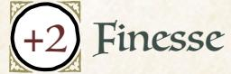

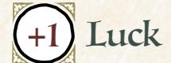


Add +1 to a stat of your choice, to a max of +2

# Weapon Skills

Choose one weapon skill to start

- Confuse Senses
- Improvise
- Parry
- Trick Shot

# Roguish Feats

Choose any four roguish feats to start [\(page 69\)](#page-69-0)

Equipment Starting Value 6

#### Your Nature choose one

- Kleptomaniac: Clear your exhaustion track when you try to selfishly steal something valuable or important.
- Rebellious: Clear your exhaustion track when you grievously insult, defy, or anger figures of authority.

# Your Drives choose two

- Freedom: Advance when you free a group of denizens from oppression.
- Greed: Advance when you secure a serious payday or treasure.
- Ambition: Advance when you increase your reputation with any faction.
- Thrills: Advance when you escape from certain death or incarceration.

# Your Connections

See [page 51](#page-51-0) for mechanical effects of connections.

- Professional: I stole something important, something needed or craved, for \_\_\_\_\_\_\_\_\_\_\_. I proved my worth to them.
- Friend: \_\_\_\_\_\_\_\_\_\_\_\_ sprang to get me out of holding, whether they bailed me out or rescued me. I owe them.

{158}------------------------------------------------

#### Thief Moves choose three Breaking and Entering When you *attempt roguish feats* to get into or out of a place you've previously been, you can mark exhaustion to make the move as if you had rolled a 10+, instead of rolling. Disappear Into the Dark When you **slip into shadows while unnoticed**, mark exhaustion and hold 1. As long as you remain quiet, move slowly, and hold 1 for this move, you will remain hidden. If you inadvertently reveal yourself, lose your hold. Spend your hold to reveal yourself from a darkened place, suddenly and without warning. If you attack someone immediately after spending the hold, take +3 on the roll. Rope-a-Dope When you **evade and dodge your enemy so as to tire them out**, roll with Finesse. On a hit, you can mark exhaustion to make them mark 2-exhaustion. On a 10+, you can mark exhaustion to make them mark 3-exhaustion. On a miss, they catch you in the middle of a dodge—you're at their mercy. Small Hands When you **grapple** with an enemy larger than you, roll with Finesse instead of Might. On a miss, they overpower you—you're at their mercy. Master Thief Take +1 Finesse (max +3). Nose for Gold When you *figure someone out*, you can always ask (even on a miss):

• what is the most valuable thing they are carrying?

When you *read a tense situation*, you can always ask (even on a miss):

• what is the most valuable thing here?

{159}------------------------------------------------

# Background Questions

| Where do you call home?                                                                                                                                 | Whom have you left behind?                                                                            |
|---------------------------------------------------------------------------------------------------------------------------------------------------------|-------------------------------------------------------------------------------------------------------|
| "<br>clearing                                                                                                                                           | "<br>my partner-in-crime                                                                              |
| "<br>the forest                                                                                                                                         | "<br>my family                                                                                        |
| "<br>a place far from here                                                                                                                              | "<br>my loved one                                                                                     |
| Why are you a vagabond?                                                                                                                                 | "<br>my protector<br>"<br>my benefacor                                                                |
| "<br>I have no better way to get food,<br>water, shelter, and money<br>"<br>I am on the run from "associates"<br>"<br>I am mistrusted by other denizens | Which faction have you served<br>the most? (mark two prestige for<br>appropriate group)               |
| "<br>I am pursuing a treasure<br>"<br>I am being hunted by a powerful<br>official                                                                       | With which faction have you earned<br>a special enmity? (mark one notoriety<br>for appropriate group) |

Crafty, professional, nimble, quiet. The Thief is the ultimate criminal, taking whatever valuables they can grab from any treasure room, vault, or safe, no matter how secure.

As the Thief, you are likely the single best vagabond in your band with regard to roguish feats. Your high Finesse and your four chosen roguish feats make you more than capable of shoring up any gaps in your band's skill set or solving problems through illicit action. You should be looking for ways to bring your skills to bear and solve problems.

You're not in trouble when it comes to fights—you are a vagabond, after all but by default, you'd likely prefer to solve things through stealth and guile. That said, part of the push-pull in the playbook is that your fellow vagabonds aren't going to be able to follow you into every place you sneak. The more you can create opportunities for your fellows to follow by opening doors, leaving ropes out open windows, and so on, the more you can rely on them when a fight (inevitably) breaks out.

Your general skill set is about getting through trouble stealthily, without calling attentions, so your natures instead push you to cause some problems for yourself. That's great! Embrace the trouble you get into by selfishly stealing things and grievously insulting authority figures.

Your natures—"Kleptomaniac" and "Rebellious"—are both likely to get you into hot water. "Selfishly steal something" always means that you're stealing something you want, and something likely to cause you and yours trouble, instead of stealing something that you and your whole band have agreed is

{160}------------------------------------------------

necessary. Similarly, "grievously insult, defy, or anger" means that whatever you do, you're pretty much guaranteed the authority figure will react—if you haven't taken enough action that they react, then you haven't hit the trigger.

At its heart, the Thief is a pretty direct, simple playbook—steal stuff and get away with it!—but you provide real utility to the rest of your band. So pay attention to their goals and desires, too. Much of the time, they'd love to have your help picking locks, sneaking into places, and nabbing vital treasures. You get to show off and help a friend!

#### Notes on The Thief Moves

For *Breaking and Entering*, think about the move like casing the joint before you break in later. The more you can get someone to let you inside during the daylight, the more easily you'll be able to get back in that night!

For *Disappear into the Dark*, you could use the move either instead of hiding or sneaking, or to further capitalize on those roguish feats. It costs you exhaustion, but guarantees you remain hidden for as long as you act carefully and stay quiet. That might put a limit on how far you can move, or what you can do while hidden—you might inadvertently reveal yourself when you try to climb a wall, for example, as a risk of the roguish feat. But you can always spend your hold to suddenly appear from a shadow if there were any reasonable way you might have reached that shadow after disappearing.

For *Rope-a-Dope*, as long as you describe yourself ducking, dodging, and weaving, you've triggered the move.

For *Small Hands*, the size difference between you and your enemy must be noticeable—if they're an inch taller, then the move wouldn't apply. If they're half a foot taller, or they weigh half again as much as you, then the move triggers.

For *Nose for Gold*, the value of the object is with reference to you. It might always be just about the item's Value in terms of the game—something worth more coin. But the GM can also tell you about a valuable object that you would consider especially valuable for whatever reason.

{161}------------------------------------------------

<span id="page-161-0"></span>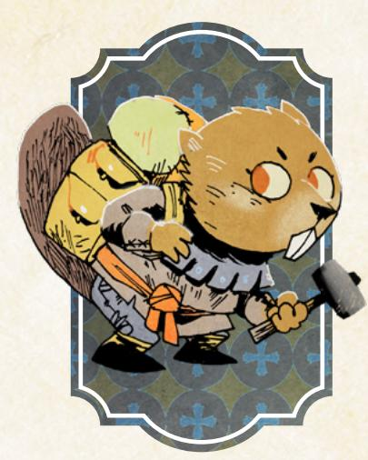

# The Tinker

*You are an adept, clever vagabond, interested in mechanisms and craftsmanship, perhaps possessed of ideas that separate you from those around you.*

#### Species

• fox, mouse, rabbit, bird, beaver, other

#### Demeanor

• hopeful, cheerful, inquisitive, cynical

#### Details

- he, she, they, shifting
- scattered, organized, grubby, singed
- eccentric tool belt, beautiful whetstone, former patron's insignia, massive packs

#### Charm -1

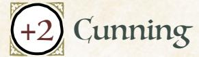

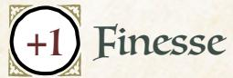

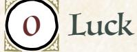


Add +1 to a stat of your choice, to a max of +2

# Weapon Skills

Choose one weapon skill to start

- Cleave
- Harry
- Improvise
- Trick Shot

# Roguish Feats

You start with these: Counterfeit, Disable Device, Pick Lock

Equipment Starting Value 8

| Your Nature choose one |  |  |  |
|------------------------|--|--|--|
|------------------------|--|--|--|

- Perfectionist: Clear your exhaustion track when you replace someone else's existing tool or resource with something truly great.
- Radical: Clear your exhaustion track when you espouse dangerous ideas to the wrong audience.

# Your Drives choose two

- Greed: Advance when you secure a serious payday or treasure.
- Ambition: Advance when you increase your reputation with any faction.
- Revenge: Name your foe. Advance when you cause significant harm to them or their interests.
- Protection: Name your ward. Advance when you protect them from significant danger, or when time passes and your ward is safe.

# Your Connections

See [page 51](#page-51-0) for mechanical effects of connections.

- Professional: \_\_\_\_\_\_\_\_\_\_\_\_ and I have been working together well for a while. We read each other's moves easily.
- Family: \_\_\_\_\_\_\_\_\_\_\_\_\_ and I had each other's back when we were run out of a clearing because our natures got out of hand.

{162}------------------------------------------------

#### Tinker Moves

YOU GET TOOLBOX & REPAIR, THEN CHOOSE ONE MORE

#### **▼** Goolbox

You have a kit of tools and supplies with which you work on long-term projects. Choose two features:

assorted scrap wood, assorted gears and springs, esoteric hand tools, manuals, assorted medicines, portable alchemy kit, sewing kit, cookware, minor explosives Choose one drawback:

heavy (counts as 2 Load instead of 1), bulky & obvious, stolen, fragile

When you open up your toolkit and dedicate yourself to making a thing or to getting to the bottom of something, decide what and tell the GM. The GM will give you between I to 4 conditions you must fulfill to accomplish your goal, including time taken, materials needed, help needed, facilities/tools needed, or the limits on the project. When you accomplish the conditions, you accomplish the goal.

#### Repair Repair

When you repair destroyed personal equipment with your toolbox, the GM will set one condition as per the toolbox move. Fulfill it, and clear all wear for that equipment. When you repair damaged personal equipment with your toolkit, you do it as long as you spend depletion or value, I for I, for each box of wear you clear.

#### ☐ Big Pockets

Take two extra boxes of depletion.

#### ☐ Jury Rig

When you create a makeshift device on the fly, roll with Cunning. On a hit, you create a device that works once, then breaks. On a 10+, choose one:

- It works exceptionally well
- You get an additional use out of it

On a miss, the device works, but it has an unintended side effect that the GM will reveal when you use it.

#### □ Nimble Mind

When you *attempt roguish feats* involving mechanisms or locks, mark depletion to roll with Cunning instead of Finesse.

#### ☐ Dismantle

When you dismantle a broken or disabled piece of equipment or machinery, clear 2-depletion.

{163}------------------------------------------------

# Background Questions

| Where do you call home?                                                                                                                                                                                                            | Whom have you left behind?                                                                                                                                                                       |
|------------------------------------------------------------------------------------------------------------------------------------------------------------------------------------------------------------------------------------|--------------------------------------------------------------------------------------------------------------------------------------------------------------------------------------------------|
| "<br>clearing<br>"<br>the forest<br>"<br>a place far from here<br>Why are you a vagabond?                                                                                                                                          | "<br>my mentor<br>"<br>my family<br>"<br>my best friend<br>"<br>my loved one<br>"<br>my leader                                                                                                   |
| "<br>I refuse to keep my ideas to myself<br>"<br>I need to rebuild my workshop anew<br>in a safe place<br>"<br>I crave adventure<br>"<br>I need to find and save my family<br>"<br>I need to keep my most dangerous<br>design safe | Which faction have you served<br>the most? (mark two prestige for<br>appropriate group)<br>With which faction have you earned<br>a special enmity? (mark one notoriety<br>for appropriate group) |

Genius, awkward, incautious, inventive. The Tinker is an incredibly capable maker and mechanic, solving problems through devices and clever…well…tinkering.

The Tinker is more than a crafter or a smith—they're a true wonder with mechanics, and they're able to string up all manner of equipment and devices with base supplies. Compared to most clearings' smiths and crafters, the Tinker is practically a wizard.

Between the Tinker's Toolbox and Repair moves, they are oriented more towards longer-term goals and objectives than nearly any other playbook. In practice, that means the Tinker's projects will often be the spur for the PCs to take action; the Tinker needs the other vagabonds' help to get the materials they need, or to secure a meeting with the Royal Engineer of the Marquisate, or whatever the case may be.

The Tinker's natures point at their potentially strange, "exile-worthy" beliefs in ways that prompt them to action. A "Perfectionist" Tinker can get in trouble when they help the wrong denizens. And a "Radical" Tinker might try to improve minds as well as materials and wind up saying the wrong thing to the wrong crowd, for example suggesting that monarchy might not be the greatest governmental system to a room full of Eyrie nobles.

The Tinker absolutely needs the other vagabonds in the band to support them. The Tinker is far from incompetent (like all vagabonds), but unlike some other vagabonds the Tinker is no match for a troop of armed soldiers on their own. Fortunately, every other vagabond will love having a Tinker around to repair their equipment and sometimes even arm them anew.

{164}------------------------------------------------

#### Dotes on The Tinker Moves

For *Toolbox*, your features are mostly about limiting the conditions the GM might set for you, while most of your drawbacks are about creating more problems for you in the fiction, outside of this move.

- "Dedicate yourself to making a thing or to getting to the bottom of something" means that either you are trying to create a new device, or you are trying to answer some question, performing experiments or examinations to learn difficult-to-obtain information. The conditions the GM gives you are always in direct relation to what you set out to do. A relatively simple device or question might have only a single condition, while an incredibly complicated, rare, or special device might take four conditions to create.
- "Time taken" means the GM tells you how long the work will take; you need a safe space to work for that time, and new events may occur while you're busy.
- "Materials needed," "help needed," and "facilities/tools needed" focus on additional resources or aid of a specialized nature that you need to accomplish your goal. Obtain those resources or aid and you fulfill the condition.
- "The limits on the project" means the GM can tell you how you can't quite manage the full extent of what you had asked for; if you want to build a fully functional sentient wooden robot, the GM might tell you that the limit is creating only a clockwork automaton, not really a robot. Accept the limit, and the condition is satisfied.

For *Big Pockets*, these two extra boxes of depletion do not count against the maximum (six total) you can get through normal advancement.

For *Jury Rig*, you still need materials to construct your makeshift device. The GM might ask you to mark depletion if the materials are not available in your environment. You're also limited by what makes sense based on those materials. If you use a makeshift device, then it usually just works, no additional move necessary; only in extremely uncertain circumstances should the GM ask you to make another move to see what happens. You cannot make out-and-out weapons (like swords or bows) with this move, though you could make mechanisms to blow down doors or walls.

For *Nimble Mind*, remember the stat swap is for any roguish feat attempted using a mechanism or lock, not just pick lock or disable device. For example, if you're trying to *attempt a roguish feat* and fling yourself into the air using a chandelier's winching mechanism and ropes, then you could roll with Cunning instead of Finesse. Though you do still need to have the feat marked—otherwise you're *trusting fate*!

For *Dismantle*, taking apart a piece of equipment takes a bit of time, but you can take apart everything from a broken cart to a smashed door if you aren't in a rush.

{165}------------------------------------------------

<span id="page-165-0"></span>

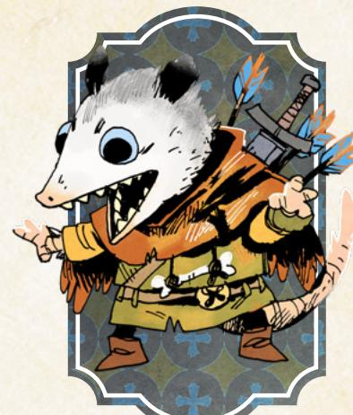

# +2

Charm


Cunning


Finesse


Luck


Might

Add +1 to a stat of your choice, to a max of +2

# Weapon Skills

Choose one weapon skill to start

- Harry
- Improvise
- Quick Shot
- Vicious Strike

#### Roguish Feats

You start with these: Pick Lock, Sleight of Hand

Equipment Starting Value 9

# The Vagrant

*You are a charming, survivor vagabond, using words to get out of dangerous situations, perhaps even setting possible predators upon each other to keep them away from yourself.*

#### Species

• fox, mouse, rabbit, bird, opossum, other

#### Demeanor

• excited, low key, thoughtful, angry

# Details

- he, she, they, shifting
- mangy, wild, patchwork, inconspicuous
- stolen military insignia, tattered cloak, luck charm, gambling paraphernalia

#### Your Nature choose one

- Glutton: Clear your exhaustion track when you overindulge on vices like drink, food, and gambling.
- Hustler: Clear your exhaustion track when you try to spring a con on a powerful or dangerous mark.

# Your Drives choose two

- Chaos: Advance when you topple a tyrannical or dangerously overbearing figure or order.
- Thrills: Advance when you escape from certain death or incarceration.
- Clean Paws: Advance when you accomplish an illicit, criminal goal while maintaining a believable veneer of innocence.
- Wanderlust: Advance when you finish a journey to a clearing.

# Your Connections

See [page 51](#page-51-0) for mechanical effects of connections.

- Family: After \_\_\_\_\_\_\_\_\_\_\_\_ and I pulled off an impressive heist and stole something very valuable from a powerful faction, my bad choices landed me in dire straits. But they bailed me out, and we've been close ever since.
- Watcher: \_\_\_\_\_\_\_\_\_\_\_\_ saw through one of my cons, and turned it back on me. How? Why did we forgive each other?

{166}------------------------------------------------

#### Vagrant Moves choose three Instigator When you *trick an NPC* into fighting another NPC, you can remove one option from the 7-9 list—they cannot choose that option instead of doing what you want. Pleasant Facade When you **suck up to or otherwise butter up an unsuspecting NPC**, roll with Charm. On a 10+, hold 3. On a 7-9, hold 2. Spend your hold 1 for 1 to deflect their suspicion or aggression away from you onto someone or something else. On a miss, your attempts at flattery are suspicious—they're going to keep their eye on you. Desperate Smile When you *trust fate* to see you through by begging, pleading, or abasing yourself, roll with Charm instead of Luck. Charm Offensive When you **play upon an enemy's insecurities, concerns, or fears to distract them with words during a fight**, roll with Cunning. On a hit, you create an opening for yourself—make any available weapon move against them at +1, or strike quickly and deal injury to them. On a 7-9, you also tick them off; they aren't listening to you anymore, no matter what you do, until the situation drastically changes. On a miss, you infuriate them—they come at you, hard, and you're not prepared. Let's Play When you **play a game of skill and wit to loosen another's tongue**, roll with Charm. On a hit, they let slip something useful or valuable. On a 7-9, you have to lose the game to get them there; mark one depletion. On a miss, they're better than you ever thought; either mark one depletion and cut your losses, or mark three depletion and they'll start talking. Pocket Sand

Take the weapon skill *Confuse Senses* (it does not count against your limit). When you **throw something to confuse an opponent's senses at close or** 

**intimate range**, roll with Cunning instead of Finesse.

{167}------------------------------------------------

# Background Questions

| Where do you call home?                                                                                                   | Whom have you left behind?                                                                            |
|---------------------------------------------------------------------------------------------------------------------------|-------------------------------------------------------------------------------------------------------|
| "<br>clearing<br>"<br>the forest<br>"<br>a place far from here                                                            | "<br>my partner in crime<br>"<br>my family<br>"<br>my loved one                                       |
| Why are you a vagabond?<br>"                                                                                              | "<br>my boss<br>"<br>my best friend                                                                   |
| I am being hunted by a powerful<br>vagabond<br>"<br>I can't settle down with the denizen<br>I truly love                  | Which faction have you served<br>the most? (mark two prestige for<br>appropriate group)               |
| "<br>I seek to depose corrupt and<br>dangerous leaders<br>"<br>I feel deep wanderlust<br>"<br>I am on the run for my lies | With which faction have you earned<br>a special enmity? (mark one notoriety<br>for appropriate group) |

Deceitful, tricksy, charming, social. The Vagrant is a consummate con artist, a trickster and huckster who gets their way by sweet-talking and lying past trouble.

The Vagrant is a bit like the Adventurer meets the Thief—a charismatic talker who relies on deception for survival and for gain. They are likely to try to push to the front of the band whenever talking (and especially whenever lying) is involved. As the campaign progresses, however, they might find themself in a tight spot. Their lies generally won't lead to prestige gains with the deceived faction, so at some point, the Vagrant should probably pick one faction they're not going to con left and right…unless, of course, they're okay being on every faction's bad side.

As with all vagabonds, the Vagrant works best in the "has a heart of gold" mode. If the Vagrant has no shame about deceiving anyone and everyone, including innocents and victims of oppressors, then they're going to become unlikable fast. Testing the boundaries of how far the Vagrant will go to land their tricks is part of the character development of the playbook, and a Vagrant player should almost always have some limit to how far they will go.

The Vagrant's "Hustler" nature feeds into the core activity of the Vagrant conning people—but makes it messy by forcing the Vagrant to target denizens who are too dangerous to safely and easily trick. It's a good nature for the Vagrant whose reach exceeds their grasp. The "Glutton" nature, on the other hand, is a nature for the carousing, good-natured, vice-driven Vagrant. Overindulging any vice will always cause trouble, but at least a Vagrant who spreads the wealth might make a friend or two while having a good time.

Chapter 6: Playbooks 167

{168}------------------------------------------------

While the Vagrant is very much a trickster, they don't really get away with tricking their fellow vagabonds. They might try from time to time, but they don't have a move to deceive a PC, and there will always be at least one PC their Watcher connection—who can see past any attempted deception. When playing the Vagrant, keep in mind that your fellow vagabonds exist in a different state than the rubes you usually trick; they're not nearly so easily misled, and that's probably why they make worthy companions.

#### Notes on The Vagrant Moves

For *Instigator*, keep in mind that even on a 7–9, the GM might still choose that the NPC falls for your trick. You're best off removing the most likely option for the NPC to choose so that they're more likely just to fall for your trick than to choose a different, highly unbecoming option from the list.

For *Pleasant Facade*, think of the move as providing a kind of social armor. Once you have hold, you can spend it to ameliorate misses and 7–9 results as you try to *trick* or *persuade* them further.

For *Charm Offensive*, you have to know your enemy's insecurities, concerns, or fears to play upon them, so this move will often be preceded by *figuring them out*. On a 7–9, they're not listening to you anymore—you can't *persuade* them, can't *trick* them by talking to them, and definitely can't use *Charm Offensive* on them again.

For *Let's Play*, the depletion you're marking represents bets you're losing in the effort to loosen the tongues of your marks. This move isn't just for winning a game of chance; it's for using gambling to get your targets to talk.

{169}------------------------------------------------

<span id="page-169-0"></span>

{170}------------------------------------------------

<span id="page-170-0"></span>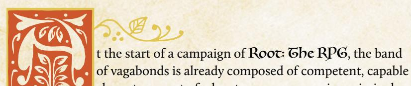

characters, a set of adventurers, mercenaries, criminals, and heroes (maybe) who are already adept at feats the average Woodland denizen could not possibly match. But as they pursue their drives, fulfill contracts, and otherwise take action across the Woodland, they will inevitably grow and change.

This chapter is about two significant modes of change—advancement and equipment. As vagabonds fulfill their drives, they earn advances that directly improve their capabilities. And as they earn more money or obtain valuable objects, they can spend those resources to get better equipment, further increasing their capabilities. In this chapter, you'll find all the rules about both of those kinds of change.

You'll also find additional rules for changes to your character to reflect alterations in their drives or nature, rules for making a new character altogether, and a set of pre-generated equipment you can easily use throughout your game.

# <span id="page-170-1"></span>Advancement

"Advancements" in Root: The RPG are explicitly the rewards for a vagabond who pursues their drives (see page 49 for more on drives.)

# Earning Advancements

A vagabond can earn one advancement each session for each drive they fulfill. That means in any given session of play, a vagabond might earn two advancements at most—one for each drive. Vagabonds cannot earn more than one advancement per drive per session.

The conditions for fulfilling a drive are described on each playbook in the Drives section. While any given playbook might have a different set of drives, every playbook pulls from the same overall pool.

A PC advances just as soon as they fulfill the condition of the drive. At the end of each session, GMs and players should go around and see if anybody fulfilled a drive but just missed it; if they did (and they haven't advanced for that drive already), they can advance then, at the end of the session.

べいのことにある。これではいい「命」という

{171}------------------------------------------------

Here are all the drives with a bit of additional detail and explanation:

#### Ambition

*Advance when you increase your Reputation with any faction.*

Your Reputation is the number, not simply prestige boxes. The actual value of your Reputation has to go up. You advance for any time your Reputation with any faction goes up (although again, only once per session). Whether your Reputation moves from –3 to –2 or +2 to +3, it still counts.

#### Chaos

*Advance when you topple a tyrannical or dangerously overbearing figure or order.*

"Topple" means that the figure or order has been deposed, removed from power, at least temporarily (it doesn't always have to be permanent). Who or what qualifies as a "dangerously overbearing figure or order" is a matter of discussion between players and GM, with the GM having the final call.

#### Clean Paws

*Advance when you accomplish an illicit, criminal goal while maintaining a believable veneer of innocence.*

An "illicit, criminal goal" should be a goal that any force of law and order in the area would frown upon. "A believable veneer of innocence" means that, by and large, most denizens aware of the crime have no reason to blame you. Maybe they are suspicious of you, but they definitely don't have evidence.

#### Crime

*Advance when you illicitly score a significant prize or pull off an illegal caper against impressive odds.*

"Illicitly score a significant prize" or "pull off an illegal caper against impressive odds" offer two ways to advance with this drive. "A significant prize" can be relative to the vagabonds' circumstances, but it should always be something either of extraordinary monetary value or of extraordinary intrinsic value—an incredibly valuable gemstone, or the gemstone that determines the next ruler of the Eyrie, respectively. "Pulling off" the caper in no way means that everything went well; all it means is that you more or less achieved your desired end. When determining whether "impressive odds" applies, think about whether or not it makes a good story; you wouldn't recount the tale of duping some guard, but you would absolutely recount the tale of robbing the local governor's mansion.

{172}------------------------------------------------

#### Discovery

*Advance when you encounter a new wonder or ruin in the forests.*

Both the "new wonder" and the "ruin" are understood to be "in the forests" this drive is for vagabonds interested in exploring the forests. A new ruin is one you haven't been to before, not necessarily one that no one has found before. A new wonder is anything impressive, surprising, exciting, or special that you find in the forests—think of it as something you could tell other denizens about and have them listen with rapt attention.

#### Freedom

*Advance when you free a group of denizens from oppression.*

"Free a group of denizens" doesn't mean "permanently free," but it does mean that for the moment, their bonds are removed. "Oppression" can take many different shapes, but it must be real; the oppressed denizens must themselves believe fully in their own oppression.

#### Greed

*Advance when you secure a serious payday or treasure.*

"A serious payday or treasure" can be from anywhere, but it has to be worth a LOT of money. The amount can be relative—a "serious payday" for a dirt-poor vagabond might be less than for a rich vagabond—but should be approximately 5-Value or more.

#### Infamy

*Advance when you decrease your Reputation with any faction.*

Your Reputation is the number, not simply notoriety boxes. The actual value of your Reputation has to go down. You advance for any time a Reputation with any faction goes down (although again, only once per session). Whether the Reputation moves from +3 to +2 or –2 to –3, it still counts.

#### Justice

*Advance when you achieve justice for someone wronged by a powerful, wealthy, or high-status individual.*

"Justice" is highly dependent upon the exact situation and should be discussed between the GM and the players. If need be, the GM has final say. "Wronged by a powerful, wealthy, or high-status individual" means that the victim was genuinely harmed, and the perpetrator is of greater power, whether de facto or de jure.


{173}------------------------------------------------


#### Loyalty

*You're loyal to someone; name them. Advance when you obey their order at a great cost to yourself.*

You can name any character, including an NPC you make up from scratch or another PC if you so choose. If you name an NPC, make sure you consider how you get orders from them—if they stay put and you travel, then you can still receive orders from them through missives. "At a great cost to yourself" means that you undertake great risk or suffer great consequence in carrying out their orders. If you carry out their orders while suffering nothing, risking nothing, and paying no cost, then you haven't satisfied the drive.

# Principles

*Advance when you express or embody your moral principles at great cost to yourself or your allies.*

"Your moral principles" have to be real—no "but my moral principles say it's fine to steal from anyone at any time!" By choosing this drive, you are saying your character has real moral principles, a code of conduct that matters to them. You don't have to outline every aspect of their principles, but at character creation you should have a notion of some overriding principle that matters to your

{174}------------------------------------------------

character—"Violence is never justified," "The poor deserve as much succor as we can give," "Democracy is the only fair mode of government." "Express or embody your moral principles at great cost to yourself or your allies" means that your principles dictated your action, and because of those actions you and your friends paid a meaningful price.

#### Protection

*Name your ward. Advance when you protect them from significant danger, or when time passes and your ward is safe.*

You can name any character, including an NPC you make up from scratch or another PC if you so choose. If you name an NPC, then you should either plan on their traveling with you, or you should understand that you are unlikely to advance with this drive unless time passes or you are specifically in their home clearing. "Protect them from significant danger" means that you either prevented them from coming to harm or rescued them from a worse fate. "When time passes and your ward is safe" means that whenever "time passes" and the Woodland's war progresses, if your ward is more or less safe, you advance.

#### Revenge

*Name your foe. Advance when you cause significant harm to them or their interests.*

You can name any NPC, including one you make up from scratch. Do not name a PC. Whomever you choose should be a powerful foe—a real enemy who can return again and again. If you choose someone easily disposed of, then this drive will quickly become irrelevant. "Significant harm" is left up to a conversation between the GM and the players, with the GM having final say.

#### Thrills

*Advance when you escape from certain death or incarceration.*

"Certain death or incarceration" here refers to the overdramatic sense of "dire straits"—obviously, if death were actually certain, then you wouldn't have escaped! Think of it instead as making a narrow escape from what looks like impossible-to-overcome danger.

#### Wanderlust

*Advance when you finish a journey to a clearing.*

This is one of the most direct, simplest drives in the game—every time you arrive at another clearing, you advance. Not when you begin the journey, of course; only when you arrive.

174 Root: The Roleplaying Game

{175}------------------------------------------------

# Choosing Advancement

When you earn an advancement from your drive, you can immediately pick one option from the list. The list is the same for all characters.

If the option you choose changes the fiction in some way—for example, taking the Toolbox move from the Tinker playbook providing you a new physical tool kit—then the GM works with the player to introduce the new element in a way that makes sense as soon as possible. If you took Toolbox in the middle of a fight, then it's unlikely you would suddenly sprout a tool kit—but if you take it after the fight is over, then maybe you find it as salvage, or a denizen you defended gratefully provides it.

#### Advancements

When you advance by following a drive, choose one from the list:

- Take +1 to a stat (max +2)
- Take a new move from your playbook (max 5 moves from your own playbook)
- Take a new move from another playbook (max 2 moves from other playbooks)
- Take up to two new weapon skills (max 7 total)
- Take up to two new roguish feats (max 6 total)
- Add one box to any one harm track (max 6 each)
- Take up to two new connections (max 6 total)

#### Take +1 to a stat (max +2)

Add +1 to one of your stats! The highest it can go through this advancement is a +2, but there are moves you can take from several playbooks that can boost it to a +3.

# TAKE A NEW MOVE FROM YOUR PLAYBOOK (MAX 5 MOVES FROM YOUR OWN PLAYBOOK)

Check another box and gain another one of your own playbook's moves! The majority of playbooks start with three moves already, so you can usually only take this advancement twice.

# TAKE A NEW MOVE FROM ANOTHER PLAYBOOK (MAX 2 MOVES FROM OTHER PLAYBOOKS)

You have access to the whole range of moves available in other playbooks. It's a lot to look through, so unless you have something specific in mind you might want to take suggestions from the other players and GM, or look through the other playbooks during downtime. You can only take this advancement twice, for two total moves from other playbooks.

{176}------------------------------------------------

#### <span id="page-176-0"></span>**Take up to two new weapon skills (max 7 total)**

Check off the boxes and learn two more weapon skills! Spend a bit of time thinking about from where you learned these skills—was it a teacher, or just practice, practice, practice? The maximum seven total weapon skills counts the weapon skills you start the game with, but it does NOT count any of the weapon skills you might learn as the result of a playbook move.

#### **Take up to two new roguish feats (max 6 total)**

Check off the boxes and learn two new roguish feats! Remember that means that you'll use *attempt a roguish feat* and Finesse (by default) for those actions instead of *trusting fate* and Luck—but with the benefit that *attempting a roguish feat* is a lot less risky and messy than *trusting fate*. Like with the weapon skills, think a bit about how you learned these feats. The maximum six total roguish feats includes those you start with, but does NOT include any you might learn as the result of a playbook move.

#### **Add one box to any one harm track (max 6 each)**

Expand your harm track—give yourself greater reserves of energy (Exhaustion), bigger pockets (Depletion), or more toughness (Injury)! Each track can only increase to six boxes, though you can ultimately increase all three tracks to six boxes. This doesn't count any additional boxes you might earn as the result of a playbook move.

#### **Take up to two new connections (max 6 total)**

Take two new connections—just the mechanics, like Protector or Watcher. See [page 51](#page-51-0) for the full list of connection types. This advancement is mostly for larger vagabond bands, in which you might have a lot of companions and want a connection to each, or for when you feel very strongly that your relationship with a single vagabond has become multifaceted and thus deserving of two connections pointed at the same character.

{177}------------------------------------------------

# <span id="page-177-1"></span><span id="page-177-0"></span>Changing Your Character

Over the course of a long-term game, your vagabond is going to change. They'll come to change their beliefs, act in different ways, alter relationships, and form brand new ones. That's both to be expected and to be desired—dynamic characters are interesting to watch.

To track the ways your character might change over the course of play, you have the session move, described on page 130. Here is the full text of that move again:

When the session ends, one at a time, each player may choose one element of their playbook to update or change. They do not have to choose anything, if they don't want to. They may choose one of the following options:

- Replace one drive with a new drive from any playbook
- Replace nature with a new nature from any playbook
- Replace a connection (both type and subject) with a new connection from any playbook

This move allows you to say at the end of any session, "I have changed, and here is how." It lets you pick a new drive for your character and thereby indicate that they will be pursuing a new course of action. It allows you to replace your nature with a new one, indicating a major change to the core of your character. It even lets you say your relationships to other characters change, swapping out the mechanical benefits of one connection for another.

Use this move to make sure your understanding of your character matches what's on your character's playbook, and that the other players and the GM are all on the same page with you about what matters most to your character on both emotional and mechanical levels.

If you find yourself wanting to change more elements at the same time, talk it over—it's not impossible some major upheaval could change both your drives and your nature all at once, but that should be far from commonplace, and everyone at the table should agree with the change and understand why it is happening.

If you want to undergo an even more massive change to your character, however...

{178}------------------------------------------------

# Changing Playbooks

You might come to a point at which you say, "This playbook no longer matches my vagabond at all." At that time, it might be right to change playbooks.

For the most part, the playbook frame in Root: The RPG is pretty flexible. You can take moves from other playbooks; you can take natures and drives from other playbooks; you can change your stats and your harm tracks; you can even learn new roguish feats and weapon skills. If you're the Arbiter, there's little from any other playbook that is out of your reach, if you want to expand in that direction. So changing your playbook is usually not a necessary part of the game.

If, however, you feel strongly that you are no longer the same vagabond, and something has fundamentally changed, talk it over with your table so everyone is on the same page. As long as the GM and the rest of the players agree, then you can use the following procedure at the end of a session of play or during a major in-fiction time jump to change playbooks:

- **DETAILS:** You may pick new descriptors from the options for your new playbook if they apply. Explain how and why your character's description changed.
- BACKGROUND: Your background stays the same; don't change or make any new choices here.
- ◆ STATS: You will keep your vagabond's stats mostly the same. Look at the new playbook's starting stats, and pay attention to the new playbook's highest and lowest stats. You may decrease the new playbook's lowest stat by one for your vagabond to raise the new playbook's highest stat by one for your vagabond. This cannot raise a stat above +2 or lower a stat below −2. Example: When switching to the Arbiter playbook, the Arbiter's highest stat is Might, and its lowest stat is Luck. You may decrease your Luck by −1 to increase your Might by +1.
- **NATURE AND DRIVES:** Change your nature to one from the new playbook, and both your drives to two from the new playbook.
- **CONNECTIONS:** Change two of your connections to the types from your new playbook—explain why you see those characters in that new light.
- **REPUTATION:** Your Reputation, prestige, and notoriety all stay exactly the same.
- Moves: You may swap moves from your old playbook for moves from your new playbook, one for one. You do not gain any new moves—the overall number of moves you have remains the same. Furthermore, the overall number of moves you have must follow normal advancement limits—so you are only allowed two moves from outside your new playbook, and five moves from inside of it. Explain why your skills are changing and what changed about you to match.
- **EQUIPMENT:** Your equipment stays exactly the same.
- HARM TRACKS: Your harm tracks stay exactly the same.

{179}------------------------------------------------

- **ROGUISH FEATS:** You may swap one roguish feat to match one you could have chosen from the new starting playbook. The rest stay the same.
- **WEAPON SKILLS:** You may swap one weapon skill to match one you could have chosen from the new starting playbook. The rest stay the same.

#### And you're set!

Anything complicated or confusing, work out with your GM and your table—exceptions are perfectly fine, so long as everyone is okay with them and they make sense within the fiction.

In general, though, just keep in mind that the degree to which you can advance and expand your character should make the option of changing your character's playbook only necessary for the most extreme cases—otherwise, you should be able to develop the way you want!

# <span id="page-179-0"></span>**Daking a New Character**

Sometimes a vagabond character's story comes to an end. Maybe they're ready to settle down and stop wandering the Woodland. Maybe they've taken up a position of real power within a faction, and they're going to join in earnest, abandoning their vagabond independence. Maybe they met a heroic but untimely end under a hail of arrows. Maybe the character's player is just ready for a change and a new kind of character!

All of those instances lead to the player making a new character. Here are the guidelines, procedures, and tips for doing just that.

#### Out with the Old

First of all, if the old character is still alive, then they become an NPC. The GM and the player should agree upon the circumstances of that NPC and their general drives, goals, and attitudes upon their retirement.

A PC can retire in such a way that they are removed from the story entirely—they leave the Woodland to venture across the world, or they retire in their own quiet, utterly hidden corner of the forest. If a player wants their character to be gone from the story, never to be portrayed as an NPC or to have an effect upon events, they should make that clear to the GM when they retire.

Otherwise, however, a PC most likely becomes an NPC. A vagabond who settles down will still exist in that location and can represent an ally who can provide the band some food, shelter, and respite...but will also become subject to the same ebbs and flows of the Woodland's struggles. A vagabond who joins a faction might be as noble or power hungry as any other faction representative, and might take actions both for and against the vagabond band.

{180}------------------------------------------------

#### On Masteries

In **Travelers** & Outsiders, the supplement book for Root: The RPG, you will find more information about masteries. Masteries are special advancements that can push you above normal skill with many of the weapon skills and even basic moves, giving you special outcomes on a 12+ result that reward you even further. They're advancements designed to support the idea of specialization. If you're interested in knowing more, make sure to check out **Travelers** & Outsiders!

If a player accepts their PC becoming an NPC in the Woodland, then the GM has a duty to portray that character in a way honest to that character's nature and desires—just like with any other NPC. But the GM does not have any obligation to check in with the original player before making new choices for the former PC. The former PC can change and become a different character, as long as it makes sense in the fiction and matches up with the GM's agendas, principles, and moves (see page 194 for more on these GM tools).

Put another way, if a player absolutely doesn't want their PC to become something they wouldn't have chosen, then the PC should retire well outside of the Woodland's story. If the player accepts that their PC becomes an NPC still active within the Woodland in any way, then they are trusting the GM to portray that character as interesting, complicated, and dramatic, just like with any other good NPC.

For any vagabond who had connections pointing at the now retired/removed/dead character, they may point those connections to other characters in the band, including the new character.

#### In with the New

Then, the player makes a brand-new vagabond! Choose a new playbook as if you were making a character from scratch, again avoiding any duplication with the other PCs in the band. Fill them out as normal, but with the following adjustments:

- When you flesh out the new PC's background, think about where the PC has been during the events of the game so far. What do they think of the band's actions? And because the new PC is joining the band, make sure to think about why they want to join up with the band now.
- When you choose connections, you can fill them out as usual. A vagabond who had connections pointing at the old character can swap them to match up with the new character, even changing the connection type at the GM's

{181}------------------------------------------------

<span id="page-181-0"></span>discretion. Make sure to think about how the new vagabond knows the members of the band, why the new vagabond wants to join now, and why they are accepted by the current members of the band.

- Choose moves, stats, and equipment as normal. At the GM's discretion, the new vagabond may have one or two free advances to start, and may have an additional 4-Value to spend on equipment—mostly this is in situations where the rest of the vagabonds have earned many advances already or have significantly improved equipment.
- Finally, resolve how the new vagabond joins the group. This is better handled as an event that occurred during a stint of time passing—not as an actual out and out scene. The core questions of such a scene—"Will this new vagabond join the band? Will the band accept this new vagabond as one of their own?"—are already answered. Yes, the new vagabond will join the band, and yes, the band will accept this new vagabond as one of their own (more or less). Instead, make sure everyone is on the same page about the circumstances of that joining and about how the characters know of or have heard of each other, and then get to playing!

# <span id="page-181-1"></span>Equipment

Equipment is an important part of **Root: The RPG**. A vagabond is incredibly capable, but one with bad tools is going to have a hard time, no matter their skills. Throughout the game, vagabonds will put strain on their existing equipment and then spend resources to repair it or to buy new equipment altogether. They'll steal noteworthy or valuable items to upgrade their existing kit. They'll debate whether to wield twin daggers or to wield one enormous greatsword.

That said, it's important to note up front that equipment is far from the be all and end all of a vagabond's competency. While a vagabond can have better or worse equipment, there is plenty going on that no equipment will help resolve. A vagabond with the epic greatsword of Eyrie Dynasties legend Yorick Thunderwing will still have a hard time going up against a whole platoon of soldiers, and if the vagabond doesn't maintain a good reputation with the Eyrie, that's what they might find themself facing one day.

So while vagabonds are going to spend time paying attention to their equipment, it also shouldn't become the sole focus of the game. It's a part of their overall story in the Woodland, but not the focal point.

There is some information about equipment earlier in this book in the section on making characters (page 58). Here you'll find some of those rules restated to keep them in one place.

{182}------------------------------------------------

# What Is Equipment?

When Root: The RPG refers to equipment, it refers to important, larger, specific, and non-replaceable items. Your sword or your bow are pieces of equipment. Your armor is a piece of equipment, as is your shield. Arrows aren't equipment in the same way…unless they're very special arrows. A lockpick isn't equipment and is better represented by depletion…unless it's a masterwork, unbreakable lockpick.

In terms of the game's rules, a piece of equipment is something that has a **wear** track and has its own **tags**. **Wear** is a special harm track unique to an individual piece of equipment, representing the equipment's durability. When all the boxes of a wear track are full, then the associated piece of equipment is damaged pretty badly, to the point where it's barely functional. If you ever need to mark another box of wear on a piece of equipment with a full wear track, then the equipment is destroyed entirely, beyond repair.

**Tags** represent special traits, moves, abilities, and other mechanical effects that a piece of equipment might bear. They range from traits that make a weapon more effective in combat, to abilities that make a flute particularly useful for putting on shows. You can see a full list of tags starting on [page 186](#page-186-0).

**Weapon move tags** are a specific kind of tag that allows a wielding vagabond to use a particular weapon move—as long as they also have the appropriate weapon skill (see [page 90\)](#page-90-0).

A weapon will also have at least one range by default. That is the range at which the weapon can reach enemies, the range at which it is effective. There are only three ranges—intimate, close, and far. For more on ranges, see [page 91.](#page-91-0)

If an item isn't significant enough to have wear or tags, then it isn't a piece of equipment within the game's rules—it can be discarded, forgotten, lost, or ignored without much trouble. This is the difference between a single, unimportant torch, and a special bullseye lantern crafted with colored glass from the far away Domain of the cats.

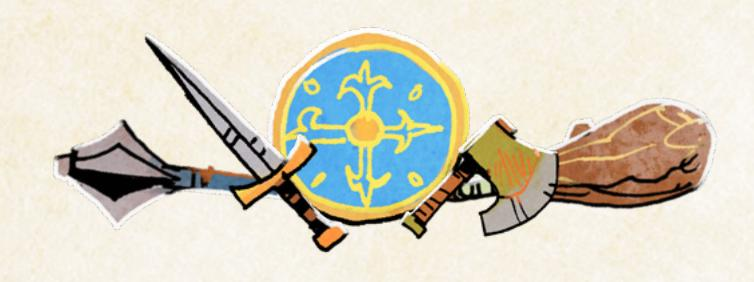

{183}------------------------------------------------

#### Load

Every vagabond can carry only so much **Load** without being burdened—4 by default, modified by your Might. If you have a Might of +1, you can carry 5-Load; if you have a Might of –1, you can carry 3-Load. Many items don't use up any Load to carry. But most larger or significant items use up 1-Load.

Think of Load as indicating which items are large and obvious when someone sees your vagabond. Your armor, your sword, your bow, your shield—someone looking at your character would see them all, on your vagabond's body, hanging from a scabbard, slung over a shoulder—and each would use up 1-Load. The knife that your character has in their boot, however, wouldn't use up any Load.

A particularly large or bulky item might have a flaw tag that makes it take up 2-Load—a huge sword, for example. If an item is small or easy to carry, then even if it has wear, you can carry it without it counting against your Load.

If you're ever carrying more Load than your maximum, then you're burdened you're slow, you're not able to move quickly or easily, and the GM will make moves as appropriate. You absolutely cannot carry more Load than twice your maximum.

#### Value

There is no single consistent currency in the Woodland, no coin of the realm that you can rely upon. Barter and exchange are the order of the day. As such, in Root: The RPG, the financial worth of objects is measured in **Value**, an abstract generalization of price. A single box of depletion on a vagabond's harm track provides roughly the equivalent of 1-Value in coins or other objects.

The actual going price of items and objects varies based on the circumstances— 1-Value of food might normally be a couple loaves of bread, but in a clearing suffering from famine, the same loaves might go for coin worth 4-Value—but here's a rough approximation of the kinds of things you might find for a few different Value amounts.

| Value | Item                                                                                                                                     |
|-------|------------------------------------------------------------------------------------------------------------------------------------------|
| 1     | A day's worth of food, decent healing supplies for a non-life-threatening wound, a<br>pouch of coin, a night's rest at an inn            |
| 2     | A very simple dagger, basic tools for farming or smithing, a traveling cloak                                                             |
| 3–4   | A basic sword or bow, simple leather armor, a shield, a decent wheelbarrow, a week's<br>rest at an inn                                   |
| 5–6   | A decent sword or bow, good leather or chain armor, a wagon cart, two weeks' rest at<br>an inn                                           |
| 7–10  | An excellent weapon, good plate armor, a chest laden with gold, an ancient jewel<br>encrusted cup from a ruin, a simple riverworthy boat |

{184}------------------------------------------------

#### Buying and Selling Equipment

Every piece of equipment is worth a certain amount of Value, based on this simple formula:

#### **Boxes of Wear + Extra Ranges + Special Tags + Weapon Move Tags – Flaw Tags**

A sword with three boxes of wear, no additional ranges, one special tag, one weapon skill tag, and no flaw tags would have a Value of 5.

You can buy equipment from merchants, traders, or crafters who would actually have the appropriate equipment—a food merchant is unlikely to sell a sword, for example. Simple purchases of relatively basic objects are likely always available in a decent-size clearing, as long as the vagabonds can move around. For example, a vagabond who wants to buy a sword with two boxes of wear and a single weapon move tag—a fairly basic sword—might be able to do so in a clearing with a market without any special effort or work. At the GM's discretion, such basic purchases might just be transactional without any uncertainty, no moves triggered. Pay the Value, and get the item.

Similarly, a vagabond might be able to sell simple items without much issue, restoring depletion or even getting a satchel of coin instead. Selling the same basic sword worth 3-Value might be as simple as finding a weapon merchant, and again, at the GM's discretion, might occur with no uncertainty, no moves triggered. Just clear 3-depletion, or take a piece of equipment with 3-wear (the satchel of coin, whose wear can only be marked to spend it).

But always remember that, in practice, the going price for an object may vary based on circumstances. A merchant might buy an obviously stolen sword for less than it's worth, while a friendly blacksmith might charge a lot less to make a sword for her allies. And particularly noteworthy items, or large bundles of items, are a lot less likely to be sold or bought without question. The weaponsmith who'd buy a single sword, no issues, is a lot less likely to buy five swords at once from someone she doesn't trust.

In those cases, the nature of the NPC seller or buyer matters greatly, and the GM portrays them just like any NPC, with their own drive and desires. Within those desires, they might offer discounts or price hikes. Normal changes to price are around 1- or 2-Value up or down—anything past that, and the NPC is either very fond of the PC or is trying to take advantage of the PC in some way.

So when buying equipment, remember that all the moves are still handy. You can *persuade* merchants, *trick* merchants, *ask for a favor* from merchants, and so on. All those tools can help get you more Value when you sell or pay a lower price when you buy.

{185}------------------------------------------------

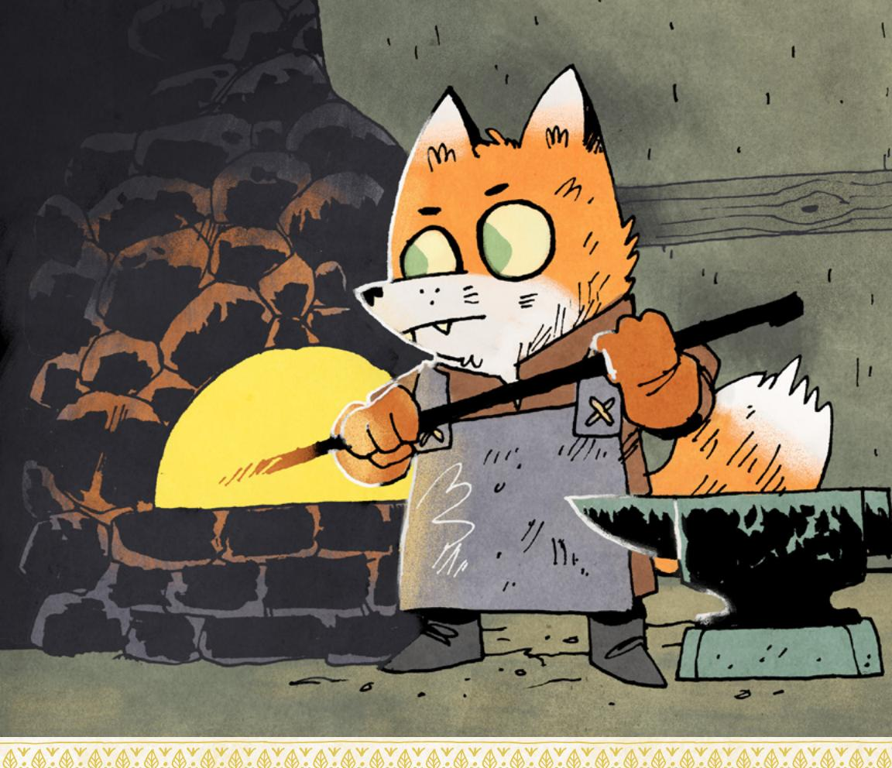

# Crafting Equipment

The majority of vagabonds in Root: the RPG cannot craft equipment. The Tinker can, thanks to their toolbox, but that move has its own rules about crafting and creation. Generally speaking, the minimum cost in Value for a Tinker to make an item is equivalent to the item's normal Value—a sword with 2-wear and a single weapon skill tag would still cost at least 3-Value of materials to make.

A vagabond can always pay a competent crafter to make their own equipment, of course. In all such cases, though, there is uncertainty, and the GM and player should expect to see the scene in action. Crafting a new item to a vagabond's specifications isn't a simple thing, and the crafter might charge more or ask for a favor in return. Just the same, a vagabond might persuade a crafter to take on the job for a lowered price, or ask for a favor and have the crafter make it for free (if they have a high enough Reputation).

{186}------------------------------------------------

Finally, when putting together any piece of equipment, make sure you think about how the tags all play together. A sword likely cannot have the *Friendly* tag by its very nature—what would a friendly sword even look like? A dagger cannot have *Heavy Draw Weight*, a tag all about the draw weight of a bow's string…but there might be a way to make that kind of tag make sense for a dagger. A bow cannot both have *Short Limbs* and *Large*—how could the bow both be specifically short, and also large? The tags always have a fictional element in understanding what the item actually is, what it looks like, how it's put together. Make sure that the tags all make sense together, and if they don't, then adjust them or change them.

# <span id="page-186-0"></span>Tags

Equipment tags are special traits held by a piece of equipment that give it additional abilities. Each positive tag adds 1-Value to the overall worth of the item in question. Each negative tag refunds 1-Value from the overall worth of the item, lowering its price by 1-Value. In parentheses after each tag, you'll find an idea of the kind of item the tag could apply to; although, as always, use these tags as inspiration to create more specific or appropriate tags as you need them.

#### Positive Tags

- + Arrow-proof: Ignore the first hit dealing injury from arrows that you suffer in a scene. (Armor)
- + Blunted: This weapon inflicts exhaustion, not injury. (Hammer, staff)
- + Catfolk Steel: Mark wear when *engaging in melee* to shift your range one step, even on a miss. (Armor, weapons)
- + Ceremonial: Choose an attached faction. While this item is displayed, treat yourself as having +1 Reputation with that faction, and –1 Reputation with other factions. (Anything)
- + Comfortable: This item counts as 1 fewer Load. (Armor)
- + Durable: If this item would ever be destroyed, permanently remove 1-wear from it instead. If it ever has no wear remaining, it is destroyed. (Anything)
- + Eaglecraft: Mark wear when *engaging in melee* to both make and suffer another exchange of harm. (Weapons)
- + Fast: Mark wear when *engaging in melee* to suffer 1 fewer harm, even on a miss. (Smaller or thinner weapons)
- + Friendly: When you *meet someone important*, mark exhaustion to roll with your Reputation +1. (Armor, nonthreatening weapons like staves)

{187}------------------------------------------------

- + Flexible: When you *grapple* with someone, mark exhaustion to ignore the first choice they make. (Armor)
- + Foxfolk Steel: Ignore the first box of wear you mark on this item each session. (Weapons and some armor)
- + Hair Trigger: Mark wear to *target a vulnerable* foe at close range instead of far. (Crossbow)
- + Healer's Kit: Mark wear to clear exhaustion. Mark 2-wear to clear injury. (Healer's kit)
- + Heavy Bludgeon: Mark exhaustion to ignore your enemy's armor when you inflict harm. (Hammer, mace)
- + Heavy Draw Weight: When you *target a vulnerable* foe with this bow, mark exhaustion to inflict 1 additional injury. (Bow)
- + Iron bolts: This weapon inflicts 1 additional wear when its harm is absorbed by armor. (Bow, crossbow)
- + Large: Mark exhaustion when inflicting harm with this weapon to inflict 1 additional harm. (Weapons)
- + Luxury: After creation, this item is worth +3-Value. (Anything)
- + Mousefolk Steel: Mark wear to *engage in melee* using Cunning instead of Might. (Weapons)
- + Mighty: When you *wreck something* with this item, mark 2-wear to shift a miss to a 7–9 or a 7–9 to a 10+ result. (Explosives, heavy weapons)
- + Oiled String: Mark wear to use the weapon skill *quick shot* even if you don't have it. (Bow)
- + Quick: Mark exhaustion to *engage in melee* with Finesse instead of Might. (Small or fast weapons)
- + Rabbitfolk Steel: Mark wear to *engage in melee* with Finesse instead of Might. (Weapons)
- + Reach: When you *engage in melee*, mark wear on this weapon to inflict harm instead of trading harm; you cannot use this tag if your enemy's weapon also has **reach**. (Large, tall weapons)
- + Refreshing: When you take some time to relax and drink or eat from this item with a group, mark 3-wear, +1 additional wear for each participant past the third. Every participant clears all exhaustion. (Meal, flask)
- + Sharp: Mark wear when inflicting harm with this weapon to inflict 1 additional harm. (Edged weapons)

{188}------------------------------------------------

- + Short Limbs: Mark wear to fire a *quick shot* at far range. (Small bow)
- + Signature: Whenever you earn prestige or notoriety while showing this item, mark 1 additional prestige or notoriety. (Anything displayed)
- + Thick: When you mark wear on this shield to block a hit, you only ever mark 1-wear, even if you are blocking more harm from a single hit. (Shield)
- + Thief Kit: When you *attempt a roguish feat* appropriate for this item, you may mark wear on this item instead of marking exhaustion to avoid a risk coming to bear on a 7–9. (Tools, specially made armor or weapons)
- + Throwable: Mark exhaustion to *target a vulnerable foe* with this weapon at far range. (Daggers, grenades)
- + Tightly Woven: When you take a few seconds to repair this armor after a fight, clear 1-wear you marked during the fight. (Chain armor)
- + Tricky: When you use this item to *trick an NPC* by distracting them at a distance, on a 7–9 mark wear to eliminate one option from the *trick an NPC* move before the NPC picks. (Bolas, bows)
- + Unassuming: Until you harm an enemy, they will never deem you more of a threat than other vagabonds with arms and armor. (Robes, staves)
- + Versatile: When you move to or from a range this weapon can reach, mark wear to make a quick strike and inflict injury on any opponent in this weapon's range. (Fast weapons)

#### Negative Tags

- Bulky: This weapon cannot be hidden and is always visible while on your body. Mark exhaustion whenever you *attempt a roguish feat* or *trust fate* to sneak, hide, blindside, or perform an act of acrobatics. (Large weapons)
- Cumbersome: Mark 1-exhaustion when you don your armor—clear 1-exhaustion when you take it off. (Heavy armor)
- Fragile: When you make a weapon move with this weapon, mark wear on it. Mark exhaustion to ignore this effect. (Light weapons)
- Hated: Take –2 Reputation with the faction that loathes this item while it is displayed. If you reveal this item to foes from that faction, they clear morale as they are energized by anger at you. (Anything)
- Shoddy: Repairing this item costs twice as much Value per box of wear cleared. (Anything)
- Slow: When you *engage in melee* with this weapon, choose one fewer option. Mark wear to ignore this effect. (Heavy weapons)

{189}------------------------------------------------

- **□ UGLY:** Take –1 to *meet someone* important while they can see this item. Mark exhaustion to hide it. (Weapons or handheld items)
- UNWIELDY: Take a -1 to all weapon moves—both basic and special weapon moves—made with this weapon. Mark exhaustion to ignore this effect.
- **WEIGHTY**: This item counts as I additional Load. (Anything large)
- **➡ WICKED**: Anyone who sees this weapon will deem its wielder a threat, at least to be watched carefully. When you inflict any harm with this weapon, mark notoriety with an observing faction for each harm inflicted.

# Inventing Your Own Gags

Feel free to invent your own tags. When you do, use the tags above as a baseline for the level of effect that each one should have—if your tag has substantially better or worse effect, then its Value should be higher or lower, as appropriate.

#### In general:

- If you can, find an existing tag and mirror it into the new version of the tag you want.
- A tag's effects do not have to be limited to fighting and blocking or inflicting harm; they can interact with Reputation or even just the fiction itself without issue. See the tags *Unassuming* and *Friendly* for examples of tags that do more than just address harm and combat.
- Most tags with potent abilities that allow users to swap stats, inflict additional harm, ignore armor, or otherwise achieve extra effect will have a cost attached. In other words, if a PC would always want to have the effect whenever they use the item because the effect is so potent, then it should likely be limited by a cost. "Mark exhaustion," "mark depletion," and "mark wear" are all common costs.

For example, if you wanted a version of *Weighty* that made an item count as 2 additional Load, then it should refund a total of 2-Value. If you wanted a tag that made a sword completely ignore armor, then it could just be a renamed version of *Heavy Bludgeon* worth the same (I-Value) and still requiring a character to mark exhaustion to use it. If you wanted a new tag that indicated a weapon could light fires with every strike, perhaps because of a special oil channel running down its length, then such a specific and expert tag could be worth 2-Value to match its uniqueness, and likely would still require the character to mark wear on the weapon to use it (as lighting it on fire might cause some damage to the item).

{190}------------------------------------------------


#### Improving Existing Equipment

For the most part, changing and improving existing equipment isn't an option. Most equipment in the Woodland is paw-/wing-/talon-/claw-made, meaning that it isn't made with modularity or improvement in mind. It can be repaired, but it is the thing that it is, and it would take a true master craftsman to improve it meaningfully without unmaking it.

As an example, a vagabond might always generally sharpen their own sword, but adding the *Sharp* tag is also a function of the whole blade, its materials, its length; trying to add the *Sharp* tag without expertise might blunt or ruin the blade.

Should the vagabonds find a master craftsman, however, or even have one in their midst in the form of the Tinker, then improving existing equipment becomes possible. GMs should use the Tinker's **Toolbox** move, even for NPCs, to determine what it would take to improve an existing piece of equipment, providing appropriate conditions that match the extent of the improvements.

{191}------------------------------------------------

# <span id="page-191-0"></span>Pre-Made Equipment

Here is a set of pre-made equipment, common enough throughout the Woodland. Use these when you need to stat up a piece of equipment quickly, or when you need a template you can change to make something special. Adding a tag, weapon move tag, additional range, or box of wear increases Value by 1 each, while removing a tag, range, or box of wear decreases Value by 1 each. The only exception are negative tags: adding a negative tag decreases Value by 1, and removing a negative tag increases Value by 1.

#### **Dagger**

**Value:** 5 | **Load:** 0 | **Range:** Intimate, close **Weapon skill tags:** Parry, vicious strike

+ **Quick**: Mark exhaustion to *engage in melee* with Finesse instead of Might.

#### **Mousefolk Short Sword**

**Value:** 6 | **Load:** 1 | **Range:** Close **Weapon skill tags:** Parry, disarm

+ **Mousefolk Steel**: Mark wear to *engage in melee* using Cunning instead of Might.

#### **Foxfolk Longsword**

**Value:** 5 | **Load:** 1 | **Range:** Close **Weapon skill tags:** Disarm, vicious strike

+ **Foxfolk Steel**: Ignore the first box of wear you mark on this item each session.

#### **Rabbitfolk Axe**

**Value:** 4 | **Load:** 1 | **Range:** Close **Weapon skill tags:** Disarm

+ **Rabbitfolk Steel**: Mark wear to *engage in melee* with Finesse instead of Might.

#### **Greatsword**

**Value:** 6 | **Load:** 2 | **Range:** Close **Weapon skill tags:** Cleave, storm a group, disarm

- + **Sharp**: Mark wear when inflicting harm with this weapon to inflict 1 additional harm.
- + **Large**: Mark exhaustion when inflicting harm with this weapon to inflict 1 additional harm.
- **Bulky**: This weapon cannot be hidden and is always visible while on your body. Mark exhaustion whenever you *attempt a roguish feat* or *trust fate* to sneak, hide, blindside, or perform an act of acrobatics.

#### **Smithy Hammer**

**Value:** 5 | **Load:** 1 | **Range:** Intimate, close **Weapon skill tags:** Cleave

+ **Heavy Bludgeon**: Mark exhaustion to ignore your enemy's armor when you inflict harm.

#### **Staff**

**Value:** 4 | **Load:** 1 | **Range:** Close **Weapon skill tags:** Parry

+ **Blunted**: This weapon inflicts exhaustion, not injury.

{192}------------------------------------------------

#### **Quarterstaff**

**Value:** 6 | **Load:** 1 | **Range:** Close **Weapon skill tags:** Parry

- + **Reach**: When you *engage in melee*, mark wear on this weapon to inflict harm instead of trading harm; you cannot use this tag if your enemy's weapon also has **reach**.
- + **Blunted**: This weapon inflicts exhaustion, not injury.

#### **Shortbow**

**Value:** 6 | **Load:** 1 | **Range:** Close **Weapon skill tags:** Quick shot

+ **Short Limbs**: Mark wear to fire a *quick shot* at far range.

#### **Longbow**

**Value:** 5 | **Load:** 1 | **Range:** Far **Weapon skill tags:** Harry a group

#### **Trick Bow**

**Value:** 5 | **Load:** 1 | **Range:** Close **Weapon skill tags:** Harry, trick shot

#### **Crossbow**

**Value:** 6 | **Load:** 1 | **Range:** Far **Weapon skill tags:** Trick shot

- + **Oiled String**: Mark wear to use the weapon skill *quick shot* even if you don't have it.
- + **Hair Trigger**: Mark wear to *target a vulnerable foe* at close range instead of far.
- + **Iron Bolts**: This weapon inflicts 1 additional wear when its harm is absorbed by armor.

#### **Sling and Rocks**

**Value:** 3 | **Load:** 0 | **Range:** Close **Weapon skill tags:** Harry a group

#### **Leather Armor**

**Value:** 3 | **Load:** 1

+ **Flexible**: When you *grapple* with someone, mark exhaustion to ignore the first choice they make.

#### **Chainmail**

**Value:** 3 | **Load:** 2

- + **Tightly Woven**: When you take a few seconds to repair this armor after a fight, clear 1-wear you marked during the fight.
- **Weighty**: This item counts as 1 additional Load.

#### **Plate Armor**

**Value:** 3 | **Load:** 2

- + **Arrow-proof**: Ignore the first hit dealing injury from arrows that you suffer in a scene.
- **Cumbersome**: Mark 1-exhaustion when you don your armor—clear 1-exhaustion when you take it off.
- **Weighty**: This item counts as 1 additional Load

#### **Robes**

**Value:** 2 | **Load:** 1

+ **Unassuming**: Until you harm an enemy, they will never deem you more of a threat than other vagabonds with arms and armor.

{193}------------------------------------------------

<span id="page-193-0"></span>

{194}------------------------------------------------

<span id="page-194-0"></span>

very game of **Root**: **The RPG** needs a few players (about 2–5) to portray the vagabond player characters. But every game also needs one player to take on the role of "gamemaster" or

"GM," the person "running" the game. This chapter is all about the responsibilities and best practices for GMing Root: The RPG. Players may find it interesting to read this chapter—there's nothing hidden or secret here—but if you want to be the GM for your game, then this chapter is here to guide you.

# <span id="page-194-1"></span>The GOD

上命し、このいと一命し、このいと一命し、この

In most tabletop roleplaying games, there is some kind of Gamemaster or equivalent role with a different name. In **Root: The RPG**, the role is "Gamemaster" because of the familiarity and ease of reference of the term. But here's a breakdown of what the GM does in **Root: The RPG** and what (if anything) you're really the "master" of in this role. After this broad overview of a GM's job during a game, you'll find more about the GM's goals, principles, and moves.

# Portray the World Beyond the Vagabonds

If each individual player is responsible for their own vagabond—saying what that character does, speaking for them, describing their thoughts and feelings—the GM is responsible for the whole rest of the world. Every non-player character (NPC) in the game, physical descriptions of the environment, off-screen actions of important characters and Woodland powers…it's the GM's job to both manage and share all of these details with the players.

Many of the GM's responsibilities here involve thinking about what happens elsewhere in the Woodland with the larger factions, with clearings previously visited, with Woodland-level antagonists and allies, and so on. For more support in those areas, see page 239.

# Adjudicate the Rules

One of the GM's primary roles is to adjudicate the rules of the game. If any questions come up about how a move should be interpreted or exactly how two edge-case rules interact, the GM is the final arbiter.

{195}------------------------------------------------

The GM is also in charge of one of the most important functions in the entire game—adjudicating when a move is triggered (see [page 29](#page-29-1) for more on triggers). But sometimes there will be edge cases, instances when it's unclear if the trigger has been hit, times when a player might say, "No, I did not hit that trigger," or "Yes, I absolutely did hit that trigger," and other players or even the GM might disagree. Discussion is always the right solution in those cases, but the ultimate decision falls with the GM.

# Pace, Create, and Defuse Drama

Throughout this chapter, you'll find language like "off-screen" or "on-screen," language that references film- and TV-based storytelling. It can be useful to conceive of the GM as someone behind the camera, directing what the camera points at (what has been described to the players) and what information is shared (what shows up "on-screen" or "on-camera").

In that regard, the GM is a bit like the director and writing staff of a TV show. The GM sets scenes, saying where the scene is located, who is present, what's happening. The GM decides when to jump forward, when to shift focus somewhere else, or when to stick with what's on-screen.

This kind of decision is subtle and the least direct of the GM's jobs, but it is just as (if not more!) important as any of the others. Without the GM helping to keep things interesting, modulating "what happens next" to match tensions, create surprises, and fulfill expectations, the game would fall flat.


{196}------------------------------------------------

# <span id="page-196-0"></span>Agendas

So you have some idea of a GM's overall responsibilities throughout the game. How does the GM go about best fulfilling those responsibilities?

In Root: The RPG and many similar Powered by the Apocalypse games, the GM has a set of **agendas**, high-level goals they are always pursuing over the course of play. These are endless objectives, not goals to be achieved and forgotten, and sometimes they even wind up at odds with each other! Balancing which of the goals you are pursuing and how hard you are pursuing them is part of the balancing act of being a GM. You'll find more about those tactics and moment-to-moment decisions later (see "GM Moves" on [page 202](#page-202-1)). For now, here are your agendas:

# Make the Woodland Seem Large, Alive, and Real

Every game of Root: The RPG is bounded by the Woodland itself. Your story is about the 12 clearings, their inhabitants, the struggles over them, the factions vying with each other for power, and the vagabonds who dance amid it all. There might be larger empires and powers and other nations out there, beyond the forests, but your campaign is centered here in the Woodland. But even in this bounded space, there are infinite stories to tell, characters to meet, and situations to encounter—one of your objectives is to help portray this "largeness."

Yet you must also bring this place to life! The Woodland doesn't stay still. As the vagabonds adventure across and throughout it, life goes on. Trade continues, factions march bands of soldiers along the paths, new structures are built, and old structures are razed. The Woodland is *alive*, and even if the vagabonds sat still, it would move and flow and *change* around them. As the GM, you are always trying to portray the Woodland's own internal life and the lives of its denizens beyond the vagabonds' own actions.

Lastly, your job is to make the Woodland a "real" place, with real "people" (denizens), real lives, real wants and drives and hopes and fears. It's down to you to make the powers that be feel real in their actions, their internal disputes, their external battles, their goals, and their flaws. It's down to you to make the clearings vibrant in their differences, their unique traditions, and their varying casts of characters. This isn't about hard reality, about "how does agriculture work" or "how do animal larynxes produce words"—see [page 36](#page-36-0) for more on how the entire game of Root: The RPG incorporates a certain degree of fable-like elements. This is all about making the denizens, their decisions, their beliefs, and their cultures feel believable.

{197}------------------------------------------------

# Make the Vagabonds' Lives Adventurous and Important

Your game of Root: The RPG is centered around the vagabonds: their lives, their struggles, their adventures. The Woodland itself isn't centered around them, but the story you are telling absolutely features them as the most prominent characters. That means the vagabonds' lives have to be interesting, exciting, and *worth* telling a story about, as well as important to the Woodland to some extent.

Making the vagabonds' lives adventurous is all about acknowledging their essence as vagabonds *and* providing them with opportunities to act. Vagabonds are roamers, unbound to home or to any particular faction, with exceedingly high skills compared to the average Woodland denizens. The challenges before a vagabond are rarely about mundane issues of a pleasant, calm life—they're instead the challenges of a heightened, adventuresome life, full of daring chases and dangerous escapades.

Making the vagabonds' lives important means that they must be able to influence others. Every time they visit a clearing, they must have the chance to send it down new paths, to change it entirely—or to leave it more or less as it was. As the GM, you are always trying to make their actions and decisions matter and have consequences to show how their lives are important, even if those consequences range from changing the life of a single rabbit to changing the fate of the entire Woodland.

# Play to Find Out What Happens

For a GM, there is always a temptation to codify the Woodland, write out the cast of characters in a hard, certain way, define a plot that the vagabonds are expected to follow. Resist those urges and play to find out what happens next!

Imagine how you would tell a story about something that happened to you in your real life. At the time that the story is happening, you have no idea what exactly will happen next! When it's all said and done, you can look back on the events, fit them together, and make a real coherent story out of them, but in the moment, who knows what will happen! It's a bit like that when you're playing Root: The RPG with the other players, rolling dice and describing what happens: you're "in the moment" and unsure of what will happen. After the fact, you can look back and fit things together as a coherent story, seemingly planned the whole while…but in the moment? Who knows what will happen!

The game will be infinitely stronger if you let yourself be surprised by it, by what the players and characters do, by how the dice roll, and by what happens next. As the GM, you are always trying to be excited about a story whose ultimate outcome and events you don't know.

{198}------------------------------------------------

# <span id="page-198-0"></span>Always Say...

To help you resolve which agendas should take precedence at any given moment, here are your general priorities. Make sure you always say:

- What the principles demand
- What the rules demand
- What honesty demands
- What your prep demands

# What the Principles Demand

Your GM principles (page 199) are the paths you take to reach your agendas. Keep your principles loosely in mind, using them to guide and determine what you say next and which agenda you aim for. If you're about to say something that directly contradicts one of your principles, that's a good sign you should rethink it.

#### What the Rules Demand

The rules of **Root: The RPG** require interpretation—exactly how the wording is translated into your particular fiction. But whatever you say sits in accord with the rules, even if you interpreted those rules for this moment. If the rules say that a character suffers injury, they suffer injury. If the rules say that a character's treasured piece of equipment breaks, it breaks. And if a character reaches the end of the line at the sword of an enemy...that's the end of that character's story.

# What Honesty Demands

Your job as the GM is never to deceive the players or their characters outright. When you represent the world, represent it honestly. If there's something the characters would notice, tell them! If there's something they would know and they ask about it, tell them! Some of the moves help adjudicate what a PC might know, but within the results of those moves, don't worry about holding anything back for dramatic purposes. There are plenty of other ways to create drama!

# What Your Prep Demands

You will prepare some things in advance. You might write up a clearing, getting across its general issues and major denizens. You might write a custom move to handle a specific situation. You might predefine the harm tracks of a few important NPCs. Stick to that prep. If you gave an NPC two boxes of injury because it felt right in prep, don't inflate it suddenly because the PCs steamrolled them. Similarly, if you gave an NPC five boxes of injury, don't deflate it because they're having trouble—you designed that NPC to be terrifyingly powerful, and they should be!

{199}------------------------------------------------

# <span id="page-199-1"></span><span id="page-199-0"></span>Principles

If agendas are your goals, the destinations you constantly seek during play, then principles are the paths by which you actually travel. They're not the moment-to-moment steps you take—those are your GM moves (page 202)—but they're the routes, the roads by which you can pursue and achieve your agendas. There are ten principles, and it might seem daunting to envision holding all of these in your head at all times, but the key is to think of them as a general map of roadways.

#### Here is the full list of principles:

- Describe the world like a living painting.
- Address yourself to the characters, not the players.
- Be a fan of the vagabonds.
- Make your move, but misdirect.
- Sometimes, disclaim decision-making.
- Make the factions and their reach a constant presence.
- Give denizens drives and fears.
- Follow the ripples of every major action.
- Call upon their station and reputation.
- Bring danger to seemingly safe settings.

# Describe the World Like a Living Painting

Everything the other players know about the world comes through you, the GM, so you're going to be describing situations and settings a lot. Don't just set the scene blandly, saying things like, "You're in the tavern and the Mayor sits down with you." Paint a picture, but a living picture, with motion, with multiple senses' worth of description, with tone and mood and hue. Think about what music is playing, what scents are in the air, how cold or warm it is. You don't have to go into deep detail at every single moment, but the more you can make your world come alive with your descriptions, the more the players will feel the Woodland is a real, living place.

# Address Yourself to the Characters, Not the Players

Whenever possible, address the characters, not the players. Don't say, "Mint suffers injury as the general throws him to the ground. What does he do, Mark?" Say instead, "You suffer injury, Mint, as the general throws you to the ground. What do you do?" The simple shift keeps everyone in the moment and aligned with their characters.

Chapter 8: Running the Woodland : 199

{200}------------------------------------------------

# Be a Fan of the Vagabonds

You're not here to oppose the PCs, let alone beat them. You're here to help create dramatic, interesting, enjoyable fiction. That means providing obstacles for the vagabonds to interact with, overcome, or even retreat from…but as long as it's interesting, you're not too concerned withthe vagabonds' reactions! You're a fan of their characters the way you would be the fan of the characters of your favorite TV show. You're excited to follow the events of their lives, but you want to see them challenged because that's the only way you get a good story out of it.

# Make Your Move, but Misdirect

Throughout Root: The RPG, you say what happens next. Those moments are called "GM moves" [\(page 202](#page-202-1)). But even though they're presented to you in a list, don't ever use them directly at the table. Don't say, "I'm going to *capture someone*. Tali, you're captured." Say instead, "Tali, the Marquisate swordscats have you surrounded. There's no good way out, not without getting hurt." Couch everything that you say in terms of the fiction of the game. Everything you say or do should seem to come from the fiction, the imagined world of the game, instead of from a rule or a mechanical element.

# Sometimes, Disclaim Decision-Making

You have a lot of decisions before you at all times as a GM. Instead of making every decision purely on your own, you can disclaim decision-making through many of Root: The RPG's myriad mechanics. If a PC wants to strike a bargain with an NPC, you can use moves like *persuade*, *figure someone out*, or even *trick* in order to help resolve how the NPC might think about the offer. If the PCs are in pitched battle with a Marquisate squad, you can use the squad's morale track to decide at what point they would surrender or flee. The moves, rules, and dice of the game are all there so that you don't have to be entirely responsible for every decision—and so you can be surprised, too!

# Make the Factions and Their Reach a Constant Presence

In Root: The RPG, the struggle of the vagabonds is set amid a struggle over the Woodland itself, between the powerful factions. Those factions have an effect on everything that goes on in the Woodland. No one's life is entirely untouched, and certainly no clearing remains unscathed. Even independent clearings maintaining the appearance of freedom and separation likely still live in fear of faction attack. Make the factions a constant presence in the fiction. Individual denizens should always have opinions on the factions, or even allegiances to them directly.

{201}------------------------------------------------

# Give Denizens Drives and Fears

Any time a denizen emerges as a major character, give them a drive and possibly a fear. Drive are statements of what they're working for, a thing they want. Phrase drives in simple "To \_\_\_\_\_" statements, like "To become rich" or "To escape this clearing." A drive gives an NPC a believable goal and, in turn, provides you an idea of things they might want from the PCs. Not all NPCs need fears, but fears also make NPCs feel real quickly. The Woodland is a hard place to live, and a denizen's fears can speak to problems for the vagabonds to solve, and further help to flesh out an NPC if they will pursue their drive, they will flee from (or try to destroy) their fears.

# Follow the Ripples of Every Major Action

If the vagabonds are important, then their actions have consequences. Follow those consequences, and show them in the fiction. Don't worry about every single action the vagabonds take; when the vagabonds spend money repairing their equipment, that's not really a major action. But if the vagabonds trade a stolen Marquisate gemstone to a local smith for the same repairs…that same action might have real consequences, as the smith might be the one to face the consequences of the stone's theft when Marquisate soldiers come looking for it. And think in terms of Reputation—following the ripples often leads to the vagabonds marking prestige and notoriety to honor their actions, good and bad.

# Call Upon Their Station & Reputation

The vagabonds belong to no faction and have no true homes. They are wanderers who can earn positive Reputations as figures of note and acclaim...or negative Reputations as figures of notoriety and mistrust. But they are *always* separate from the factions themselves. Use their Reputations and their vagabond status to determine how NPCs react, constantly reminding them of their place. Make it clear that earning prestige or notoriety is a choice, and how remaining a vagabond is a choice—one that a character might change, thereby retiring and ceasing to be a PC.

# Bring Danger to Seemingly Safe Settings

The Woodland is not a safe place. The vagabonds might be able to find a temporary respite, but danger always lurks nearby. If the vagabonds take solace in a friendly denizen's barn, agents of one faction or another might visit with their own goals and the force to pursue them. If the vagabonds go to a dinner party at the Mayor's home, then powerful members of the factions might also be there, judging and watching them. Players often think that once they have "solved" the problems of a clearing, it will stay solved forever—but even without danger arising from within the clearing, other factions will capitalize on or undermine the good work the vagabonds undertook. The Woodland is a shifting place, and danger can always find its way in through the cracks.

Chapter 8: Running the Woodland 201

{202}------------------------------------------------

# <span id="page-202-1"></span><span id="page-202-0"></span>GM Moves

If agendas are your destinations and principles are the paths you take to get there, then your moves are your moment-to-moment steps along those roads, passing ever closer to your goals. You're not making a GM move every single time you open your mouth to speak. Sometimes you're just describing a scene. Sometimes you're speaking on behalf of your NPCs, but you're not making a move yet. Sometimes you're just finishing out the results of a PC's move, delivering on the promise of their move.

But when you say what happens next in the fiction, when you advance things and say something new happens (without that just being the result of a PC's move), you are making a GM move.

GM moves are a counterpoint to the players' moves in that they match the same sense of "making something happen," but GM moves lack the uncertainty what you say happens, happens. This also means you can vary your moves quite a bit to achieve different levels of severity and different degrees of "softness" and "hardness" (see [page 204\)](#page-204-0).

# When to Make GM Moves

There are three main circumstances under which you make a GM move—when **someone rolls a miss**, **when someone hands you a golden opportunity**, and **when things slow down**. That's when you say what happens next and move the fiction forward in a significant way, demanding a response from the PCs.

#### Someone Rolls a Miss

For every single player-facing move in the game—like all the basic moves, the weapon skill moves, the playbook moves, and more—something must happen if they roll a miss, a total of 6 or less. Some specific moves (especially playbook moves) say exactly what happens on a miss, leaving the GM some room to interpret. But for any move that doesn't say what happens on a miss (like the basic moves and the weapon skill moves), the GM makes a GM move whenever someone rolls a miss.

So when a PC tries to *persuade an NPC*, if they roll a miss, that means the GM makes a move. If a PC tries to *engage in melee*, dashing into sword-to-sword combat against an Eyrie knight, and rolls a miss, the GM makes a move. If a PC tries to *figure out* another PC, learn what the other vagabond is thinking, and rolls a miss, the GM makes a move.

Those moves might all be wildly different depending upon the exact situation, but every miss calls for *something* to happen to move the fiction forward, and GM moves are how you ensure that occurs.


{203}------------------------------------------------


# <span id="page-203-0"></span>Someone Hands You a Golden Opportunity

Sometimes the PCs will either take actions or ignore threats in ways that demand the fiction move forward. For example, the vagabond knows that there are guards all around them, looking for them, and if they leave their hiding spot, they'll be seen immediately…and they choose to do it anyway. In that case, the GM makes a move, following what has been established and being true to the fiction, bringing appropriate consequences to bear.

A "golden opportunity" refers to these moments when no move was explicitly triggered, but when the action (or inaction) of the PC still demands a response, a reaction from the world or from NPCs. If a PC decides to angrily throw wine in the face of the Marquisate Justice, it might be satisfying, but that's a golden opportunity for a GM move—at bare minimum, the PC likely earns some notoriety with the Marquisate, and the Justice might even call in soldiers to arrest them immediately. It's possible no move was triggered, but the PC's action still demands a GM move.

Be on the lookout for these moments when no dice need to be rolled, but the choices the PCs make still demand a GM move to honor the "reality" of the fiction and move the world forward.

#### Things Slow Down

Finally, sometimes play can get stuck in a rut. The PCs don't agree on what to do. and they're arguing back and forth ceaselessly in a way that's no longer interesting for anybody—it's just frustrating. Or they don't know what to do, feeling stuck and unclear on what move to make next, and they're just kind

{204}------------------------------------------------

of waiting for something to happen. Maybe they've achieved several victories in a row and dramatic tension feels entirely removed, or they've actually been battered by a series of losses and now sit in prison, without equipment, hesitant to even act, unsure of what routes are even available to them.

In all these cases, a GM move can keep the story flowing and the pace of the game up. The PCs who are arguing with each other? They're interrupted by an attack from the vicious Baron De Chauncey! The PCs who feel stuck, unsure of what to do or what move to make? Some local rogue comes to them offering an opportunity for a huge windfall of cash—if they're willing to rob the local rich denizen's manor! GM moves are your way of modulating the pace of the game and ensuring everyone stays interested, so don't wait for a die roll or a golden opportunity to make one if things have slowed down far enough that no one's invested in the moment anymore.

# <span id="page-204-0"></span>Softer and Harder Moves

When you make a GM move, even if you're looking at the full list later in this chapter, you still have a fair amount to do to interpret the move into something in the fiction. You have to come up with the particulars of how the move actually expresses itself based on your principles and agendas. "Reveal an unwelcome truth" still needs to be fitted to your fiction for anyone to understand it, care about it, or interact with it.

A lot of the work of that kind of modulation has to do with deciding whether a move is **softer** or **harder**. Every GM move can be softer or harder depending on its specifics when you describe it to your players. A softer move is used more for setup, for pushing deeper consequences down the line and establishing stakes for later. A harder move is used to deliver on stakes and consequences immediately.

A soft move might be soft because it is less immediate—giving the PCs a chance to react to it or stop the worst from happening; or because it is less dramatic—a less damaging, less horrible, less severe move from the PCs' perspective.

A hard move might be hard because it is more immediate—giving the PCs *no* chance to stop it from happening; or because it is more dramatic—a horrible thing coming to pass, or a huge shift in the fiction.

Keep in mind that all of these moves might be modulated even further to be even softer or harder, or to arrive at intermediate points on the axes.

Think of hardness and softness as being an X and Y plot:

Then you can place a move anywhere on this plot!


{205}------------------------------------------------

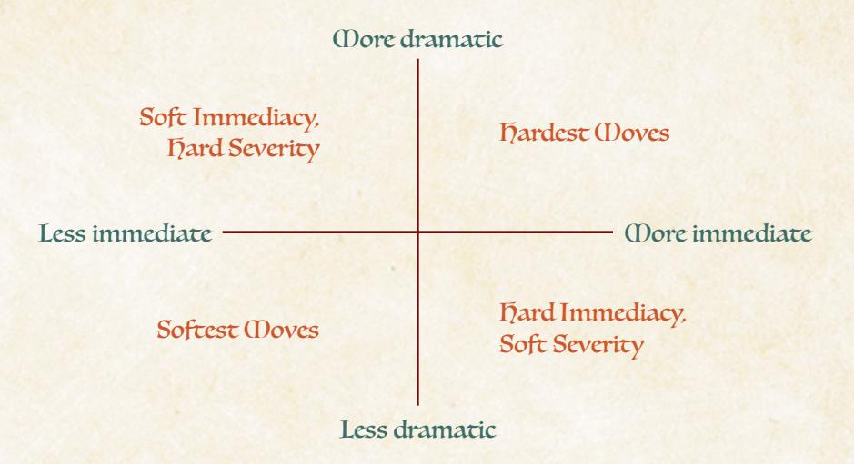

Here is a further example of modulating moves.

**A vagabond tries to persuade an innkeeper to give him a free room and misses…**

**Softest:** The innkeeper says, "I wish I could lower prices for you. Times are tough. You either pay the cost for a room—2-Value—or leave."

**Softer:** The innkeeper says, "I wish I could lower prices for you, but I can't even offer you good rooms—the best I can get you is a place in our shed out back. And it still costs 2-Value." If you accept the offer, unfortunately sleeping in the shed will only clear 1-exhaustion from each of you, instead of all exhaustion.

**Harder:** The innkeeper says, "I can't possibly. We're full up with Eyrie troops they've taken up all the rooms." And you suddenly realize throughout the room, those you mistook for simple travelers might be the same soldiers, out of armor and out of uniform, but watching you, eyeing you suspiciously…

**Hardest:** Before the innkeeper can even speak, an Eyrie sergeant slaps the counter. "All rooms are required on behalf of the Eyrie military. This entire inn is a temporary garrison. And here you are, suspicious travelers, with…are those weapons on your belts? I think you'll have to come with us."

Of course you aren't expected to spend ages thinking about exactly how to modulate every single move as you make it. You have to keep up with the pace of the conversation, after all. But having in mind that you *can* modulate moves, that you can make them more or less immediate and more or less dramatic, that you can make them softer or harder in many respects, gives you plenty of tools to make the right move for the moment. As you GM the game more and more, you'll only grow more used to deciding just how soft and hard to make your moves, and you'll be making perfect moves in no time!

{206}------------------------------------------------

#### Moves List

These are your GM moves:

- Inflict injury, exhaustion, wear, depletion, or morale (as established).
- Reveal an unwelcome truth.
- Show signs of an approaching threat.
- Capture someone.
- Put someone in a spot.
- Disrupt someone's plans and schemes.
- Make them an offer to get their way.
- Show them what a faction thinks of them.
- Turn their move back on them.
- Activate a downside of their background, reputation, or equipment.
- After every move, "what do you do?"

# Inflict Injury, Exhaustion, Wear, Depletion, or Morale (as Established)

This move is pretty basic in form—tell a PC to mark harm of some kind, and you've made this move. It's a great move in situations where harm has been well-established as being a potential risk and, depending on how much harm you are inflicting, in situations where you want to modulate your move away from dire consequences. A single box marked on any individual harm track is unlikely to lead to dire consequences right this second...unless the vagabond has already suffered a lot of harm, in which case you are delivering on the promise of every other bit of harm they've suffered.

"As established" means that you shouldn't inflict harm without having first set up a precedent for the kind of harm and the amount of harm—if a PC is in a conversation, suddenly making a GM move to inflict 3-injury from a surprise assassin is pretty extreme, *unless* it's been established in some way that the assassin is hunting the PC, might be around, and is exceedingly deadly. Always make sure that when you inflict any kind of harm, you are *making your move but misdirecting*, couching it in terms of the fiction—not just, "Suffer I-depletion," but "Those arrows tear your food pouch open and scatter its contents on the ground as you run. Suffer I-depletion."

**Softer:** "The enemy swordsman turns your blade away and swipes along your arm. Suffer 1-injury."

**Harder:** "The enemy swordsman turns your blade away and chops at your wrist, hard. Suffer 2-injury that you can't absorb as wear with your armor."


{207}------------------------------------------------

#### Reveal an Unwelcome Truth

This move is for any moment when you are "revealing" something new that complicates the PCs' lives. That darkened corner of the room—it hid an enemy the whole time! The criminal the guards have captured—it's actually your childhood best friend! The jewel you stole from the Earl—it's a fake! This move is also the simplest way for you to introduce new information—to "retcon," as it were. No one at the table might have known the jewel was fake, including you, the GM, until you make this move. As long as you are being true to the fiction and *making your move but misdirecting*, then it will appear as if this was always the truth in the fictional world. This move is generally on the softer side of the spectrum, in that it sets up further consequences and action down the line. But you can make it harder by making the revelation concrete and terrible, or by sliding directly into another GM move.

**Softer:** "I've been working with the Eyrie the whole time," Prewitt says. "A double agent inside the Alliance. When I leave here, I'll tell the Eyrie what I know."

**Harder:** "I've been working with the Eyrie the whole time," Prewitt says. "And I already let them know about the planned attack tonight. The Eyrie is ready to ambush the entire Woodland Alliance cell."

#### Show Signs of an Approaching Threat

This is the move for foreshadowing, for setting up new dangers, threats, and problems for the future. The approaching threat can be any problem or danger, from a marching army to a drought to initial signs that a ruler might be a cruel tyrant. By its nature, this move tends to be softer, helping to set up new dangers instead of bringing them to bear, but it can be harder based on the nature of the signs—if the PCs return to a clearing they've previously aided, only to find it razed to the ground with survivors telling stories of an unstoppable clockwork Marquisate army, then you've made this move in a harder fashion. So much of GMing a game of Root: The RPG is staying true to the fictional world, which means that establishing threats and dangers in advance is a crucial move for getting everyone on the same page about that fictional world. If the PCs can see a danger coming, can dread its approach, then they may groan all the harder when it arrives, but they will never begrudge it as something that doesn't make sense.

**Softer:** The normally bustling marketplace is much emptier. The denizens you see look tired and haggard. The full river running through town is low, almost entirely dry. It's only a matter of time before drought bleeds this whole clearing dry.

**Harder:** The normally bustling marketplace is defined by ruffians, haphazardly armored foxes, wolves, and mice standing guard over the dam and full barrels of water. What used to be a full river nearby is just a trickle. You can see the denizens looking at the occupying ruffians with a mixture of hatred and fear.

Chapter 8: Running the Woodland 207

{208}------------------------------------------------

#### Capture Someone

This move serves dual purposes—putting characters into real, isolated danger, and giving you a way to truly threaten characters without just ending their lives. If the local guard arrests a vagabond and puts them in a cell, then you've made the GM move to capture someone. If a vagabond passes out from over-exhaustion in a fight and the enemy abducts them for interrogation, you've also captured someone.

Capture someone can be used on NPCs, too. If a PC discovers a loved one has been taken hostage by the Woodland Alliance, you've both revealed an unwelcome truth and captured someone. If a dangerous foe grabs an innocent from the sidelines and demands the PCs put down their weapons or else, you've also captured someone. Use this move to inflict serious consequences—getting captured can be dangerous!—while leaving a chance to to escape and survive. Capturing someone nearly inevitably leads to more action as the victim's friends struggle to save them.

**Softer:** You all can see Merdock pick up Cloak's comatose form and run away. There are guards between you and him, but you might be able to do something.

**Harder:** In the fracas, you miss Merdock grabbing Cloak's comatose form. You don't realize Cloak's missing until the fight's over and everyone else is unconscious or has retreated. Cloak, you wake up in chains, in a cell.

# Put Someone in a Spot

This move is for difficult, tense situations that demand the PCs make tough choices, moments when the PCs are surrounded, backs against the wall. They're not captured yet—maybe they can fight their way out or escape—but doing so is going to be difficult, dangerous, and costly. But this move also covers other "spots," situations where they're caught between a rock and a hard place. If they've been infiltrating the Woodland Alliance on behalf of the Marquisate, then you put them in a spot when the Alliance cell is attacking the Marquisate barracks—do the PCs reveal themselves and try to defend their Marquisate allies, or do they participate in the attack and potentially paint themselves as Marquisate enemies? Putting someone in a spot can be a pretty hard move when a terrible situation arises!.

**Softer:** The guards chase you to the back room of the inn; you take cover behind some barrels. "Go and get the Baron's private guard," you hear the guard captain say. A glance confirms the five guards have trained bows on your location!

**Harder:** The guards chase you to the back room of the inn—no windows, no other doors. You slam the door shut on your way in and take cover behind some barrels…only to realize that the guards aren't trying to force their way in. You smell smoke, and suddenly it hits you—they're just going to burn down the whole inn, with you inside!

{209}------------------------------------------------


#### Disrupt Someone's Plans and Schemes

The PCs may make plans and schemes to achieve success, but the actual situation always goes differently than they expected. They might come up with a brilliant plan to smuggle their wanted comrade in a food barrel destined for the market… only to have the barrel confiscated by the local garrison and rerouted to the barracks! It's not only the PCs' plans that might be disrupted with this GM move, of course—you can disrupt the plans and schemes of NPCs, too. The Baron plans to reveal the evidence the PCs have given him at a town meeting, thereby showing how the Mayor is corrupt and cannot be trusted—only to arrive at the meeting, PCs in tow, and find the Mayor already there, accusing the Baron of the exact same corruption! The adventure-style fiction of Root: The RPG abounds with plans going awry, so use this move to make sure that everybody has to think on their feet.

**Softer:** Quinella, you sneak over the wall to exactly where the guards shouldn't be—only to find two guards there, snoring! Looks like they fell asleep and didn't continue their patrol. If you make too much noise, they might wake up...

**Harder:** Quinella, you sneak over the wall to exactly where the guards shouldn't be—only to find that other vagabond Arklay waiting for you! "I want in on this heist. We got a deal or should I call the guards?" she says.

{210}------------------------------------------------

#### Make Them an Offer to Get Their Way

This move is one of the best ways for you to give the PCs what they want, but at a cost. All NPCs in Root: the RPG have some kind of drive, something they want. There are zealots out there, but a lot of those NPCs will be more than willing to strike a bargain to trade for what they really want. When a vagabond is caught and cornered by the guard captain, the captain might just offer to let them go…if they offer a bribe or promise to steal that valuable gold statuette from the rich merchant's home. When a vagabond tries to persuade the local Woodland Alliance leader to use more peaceful tactics, the leader might agree, so long as the vagabond can get them blackmail evidence on the Marquisate governor. These offers always ask more of the vagabonds and get them into more trouble, so they always set up more fiction like softer moves—but the requests themselves can be intense enough to be very hard moves, indeed.

**Softer:** "Look, I need a scapegoat," says the Mayor. "If I'm going to do what you want, I need someone to take the blame for our recent troubles. I will help if you plant this evidence on the guard captain."

**Harder:** "Look, I need a scapegoat," says the Mayor. "If I'm going to do what you want, I need someone to take the blame for our recent troubles. The guard captain is too squeaky clean, too beloved…so I'm sorry to say, it has to be you. Steal from the local food storage area and make sure you're seen—that way, I can claim that you're the bandits we've been tracking."

#### Show Them What a Faction Thinks of Them

This move brings the PCs' Reputations into play, without the PCs making a Reputation move first. Every faction has its own widespread opinions about every PC, and Reputation is a useful baseline for how members of a faction feel about a PC. Make moves accordingly, whether causing trouble for the PCs through the distrust of NPCs, or putting more responsibility on the PCs through the trust and admiration of NPCs. This move reflects back at the PCs what they have done and how they are viewed in the Woodland at large, so it can easily be used in softer or harder ways, depending upon the PCs' Reputations and how intensely NPCs care.

**Softer:** You have a +1 Reputation with the Marquisate? The guard captain says, "Ah, yes, I should've recognized you. I could actually use someone of your skills to solve a problem. It would mean the world to the Marquisate governor."

**Harder:** You have a +1 Reputation with the Marquisate? The guard captain says, "Ah, yes, I should've recognized you. You're free to go, but be careful. Lots of Eyrie sympathizers around, and especially after our little meeting here, there's a chance they'll target you now. Unless, of course, you help me clear them out..."

{211}------------------------------------------------

#### Turn Their Move Back on Them

This move is most effective when a PC rolls a miss on a move—inflict the consequences on them instead! If they tried to *trick an NPC*, then reveal the PC has, in fact, been tricked! If they tried to *figure someone out*, then ask the same questions of the PC; their player must answer honestly! And so on. This move is especially useful when a PC makes a move against another PC, such as *figure someone out* give the target a free *figure someone out* result as if they had rolled a 10+!

**Softer:** When you swing your hammer at that door to *wreck* it, you smash it off its hinges—but the door was made of iron. You feel the hammer wobble in your hands, the head no longer securely attached to the handle. Mark 2-wear on it.

**Harder:** When you swing your hammer at that door to *wreck* it, you smash it off its hinges—but the door was extraordinarily well made, and your hammer suffers the brunt of the force, snapping apart as you swing it. It's destroyed!

#### Activate a Downside of Their Background, Reputation, or Equipment

This move brings the decisions the players have made about their characters to the fore—a flaw of their background, reputation, or equipment comes to bear on the situation. For example, if a vagabond returns to their home clearing, they're going to be recognized as a child of the clearing—intimidating folks who've known you since you were a child is going to be complicated! If a vagabond wears plate armor at all times, then beyond even the negative tags that might accompany their equipment, denizens will react to an armored vagabond with suspicion and fear.

**Softer:** Your sword has the large tag, right? When you try to sneak into the house, it catches on the window frame. If you want to get in quietly, you need to take extra time to carefully remove it and carry it in through the window…

**Harder:** Your sword has the large tag, right? When you try to sneak into the house, the hilt catches on the window frame. The sword comes out of the sheathe before you realize what's happened. It clatters to the ground below you, scraping against the side of the building. You're sure someone has heard it.

# After Every Move, "What Do You Do?"

GM moves move the fiction forward, making new and different things happen, changing the situation. But that only matters insofar as the PCs react to your moves. A GM move is what you say, and then you pause to give the other people in the conversation a chance to respond. Follow up every single move by asking the players, "What do you do?" They may not get a chance to avert the terrible events of the move—harder moves can always resolve before they can react. But after the move is finished, the players face a new situation, and the PCs need a chance to act.

{212}------------------------------------------------

# <span id="page-212-0"></span>NPCs

Much of your time spent GMing the game involves the non-player characters, NPCs, of the Woodland. Many of your moves will actually take the form of actions the NPCs take on- or off-screen. When you are following your principles or pursuing your agendas, NPCs are often your best tools.

Over the course of any campaign of Root: The RPG, you will assemble a large cast of NPCs scattered across the Woodland, a collection of characters that make the world feel full and alive, featuring all manner of different dramatic stakes. This section is here to guide you on how to build and develop NPCs, from the moment they are little more than a name and a job description, to the point that they are a complicated character with their own wants and fears.

# <span id="page-212-1"></span>Writing Up an NPC

In general, the vast majority of characters in a clearing don't need any special development or attention. The NPCs who do deserve attention either have some significant role to play, or the vagabonds care about them. Every single clearing in the Woodland is assumed to have plenty of NPCs all throughout it, and the simple fact is that most of them will wind up as background characters. That's fine!

When an NPC moves from being a background NPC to a named NPC who speaks to and interacts with the PCs, and who might have their own motivations, personality, and relationships with the PCs independent of their role, they deserve some attention. At that point, make sure they have a **name**, a **description** (including species), a **job**, and a **drive**. When an NPC gets into a fight with the PCs or would mark harm, or if you know in advance that the NPC is likely to get into a fight, then give them harm tracks and equipment.

#### Name, Description, Job, and Drive

The first step for an NPC who develops past the role of "background character" or "simply job description" is to make sure they have a full name, description, job, and drive.

Choose a name from the name list—you can use names to imply additional things about the character (if their name is of a distinct style or sound), but a special name isn't necessary to make the NPC real enough for interaction.

Describe the NPC, focusing on what the vagabonds see when they look at the NPC, and providing at least one distinctive characteristic—a red feather in a hat, paws constantly doing card tricks, eyes that shift back and forth. Make sure you identify the NPC's species in their description; knowing what kind of animal they are goes a long way to making them feel real.

{213}------------------------------------------------

The NPC's job is often the first element of them that you will have, but make sure you know who they work for and what their overarching, general responsibilities are. A baker might work for no one and just be responsible for providing food to the denizens in the clearing; a guard might work for the Marquisate and be responsible for handling disturbances.

An NPC's drive is always a "To \_\_\_\_\_\_" statement, and it is the most crucial element to having the NPC come alive. It tells you, the GM, what the NPC cares about and wants so you can portray them aiming towards that thing. An NPC whose drive is "To stay out of trouble" is going to be completely different from an NPC whose drive is "To free my clearing."

You can find plenty of names, species, drives, and jobs on the GM play materials.

#### NPC harm and Equipment

When you need to give an NPC harm tracks, make sure they have injury, exhaustion, wear, and morale. Give them at least one box of exhaustion, injury, and morale, and no more than five boxes in any individual track. Injury and exhaustion function similarly to the same tracks for PCs. Wear for NPCs covers all their equipment in one single track—no point in tracking individual equipment—and NPCs can have zero boxes of wear. To get an idea of how much an individual NPC might have for each harm track, check the NPC Harm Tracks table on page 214.

Morale is a unique track, representing their will to fight or oppose the vagabond band in pursuit of their own goals. If an NPC ever has to mark morale harm and cannot, they immediately flee or submit. An NPC with high morale won't back down—they likely must be defeated in some other way. An NPC with low morale will back down, surrender, and retreat very easily.

If an NPC has a weapon, choose a range (intimate, close, far) and an amount of harm it deals (at least 1-injury or exhaustion, often more). A lethal weapon deals more injury; a tricky or tiring weapon deals more exhaustion; a bashing or breaking weapon deals more wear. Adjust the amount as you choose, so an NPC might inflict 1-injury as a baseline; or they might inflict 2-injury; or they might inflict 1-injury and 1-exhaustion; or they might inflict 1-injury and 2-wear; and so on.

Here are a few possible weapons and attacks NPCs can use against the vagabonds:

- Standard blade: 1-injury
- Large blade or axe, wielded with strength: 2-injury
- Tricky weapon, like a whip: 1-injury, 1-exhaustion
- Heavy weapon, like a huge two-handed hammer: 1-injury, 1-wear
- Wielded by a skilled and cunning fighter: +1-exhaustion
- Wielded by a powerful and mighty fighter: +1-injury
- Aiming to harm only equipment: convert all harm to wear, +I-wear

{214}------------------------------------------------

#### <span id="page-214-1"></span>ПРС harm Gracks

| Size    | Injury                       | Exhaustion                       | Wear                                 | Morale                          |
|---------|------------------------------|----------------------------------|--------------------------------------|---------------------------------|
| 1 box   | Average denizen              | Average denizen                  | Average denizen                      | Average denizen                 |
| 2 boxes | Trained fighter              | Farmhand, laborer                | Decently equipped soldier            | Canny merchant                  |
| 3 boxes | Brute                        | Acrobat, average<br>NPC vagabond | Well-equipped soldier                | Leader, serg <mark>ea</mark> nt |
| 4 boxes | Dangerous<br>veteran soldier | Local strongpaw                  | Armed and armored knight             | Committed<br>believer           |
| 5 boxes | Terrifying foe, a<br>bear    | Incredibly capable vagabond      | Wealthy and superbly equipped knight | Fanatical<br>ideologue          |

# <span id="page-214-0"></span>NPC Groups

Sometimes, the vagabonds go up against whole groups of enemies instead of just individuals. In many such cases you can treat the whole group of NPCs as if it was a single entity. An NPC group, called a "mob" regardless of who is within it, will have higher harm tracks and deal more harm with each blow.

To figure out the harm tracks and harm inflicted by a mob, first figure out the harm tracks and harm inflicted by a single average member of the mob, someone who represents the majority of NPCs inside the mob. Then, expand on it as follows:

- 5–10 denizen mob: +2 boxes above the average harm track, x2 the average harm inflicted
- II-20 denizen mob: +4 boxes above the average harm track, x3 the average harm inflicted
- 21+ denizen mob: +6 boxes above the average harm track, x4 the average harm inflicted

So a mob made up of completely average denizens with one box in each harm track, who just inflict injury, would look as follows at different numbers:

- 5-10 denizen mob: 3 boxes of each harm track, inflicts 2-injury
- II-20 denizen mob: 5 boxes of each harm track, inflicts 3-injury
- 21+ denizen mob: 7 boxes of each harm track, inflicts 4-injury

Whereas a mob made up of well-equipped soldiers who inflict 2-injury on average and have three boxes in each harm track would look as follows:

- 5-10 soldier mob: 5 boxes of each harm track, inflicts 4-injury
- II-20 soldier mob: 7 boxes of each harm track, inflicts 6-injury
- 21+ soldier mob: 9 boxes of each harm track, inflicts 8-injury


{215}------------------------------------------------

#### The Danger of Mobs

Mobs—especially at larger sizes—are enormously dangerous to vagabonds. A band of vagabonds might be able to take on 20 or so average denizens, but it wouldn't be easy. A band of vagabonds are basically doomed if they try to stand and fight against 21+ well-armed, equipped, and trained soldiers.

Use mobs when appropriate and true to the fiction, of course, but be aware that mobs are substantially more dangerous than individual foes. They ramp up the tension in the scene significantly as the vagabonds are outnumbered, and they make surrender or retreat truly more desirable options. When you're just starting out your campaign, remind the players just how dangerous larger mobs can be, and that their characters would know to retreat or surrender instead of fighting to the end.

# Baseline NPCs

Here are a few NPCs you can pull from when you need a generic set of harm tracks.

#### **1 injury, 1 exhaustion, 0 wear, 1 morale inflicts 1-exhaustion**

*An average denizen without any real equipment or protection. Fights with claw and paw.*

#### **1 injury, 1 exhaustion, 1 wear, 1 morale inflicts 1-injury**

*An average clearing guard with no notable training or equipment. Fights with chipped swords.*

#### **2 injury, 1 exhaustion, 2 wear, 2 morale inflicts 1-injury**

*Decently trained and equipped guard or soldier, not a conscript. Fights with maintained swords.*

#### **3 injury, 2 exhaustion, 3 wear, 2 morale inflicts 2-injury and 1-wear**

*A brute or a bruiser. A real threat to any individual vagabond, and even tough enough to threaten the band. Fights with a giant axe.*

#### **1 injury, 2 exhaustion, 1 wear, 3 morale inflicts 1-injury**

*A leader, not a fighter. Someone more likely to be in charge, and not to try to fight on their own. Fights with a ceremonial weapon.*

#### **2 injury, 2 exhaustion, 3 wear, 3 morale inflicts 1-injury and 1-exhaustion**

*A lieutenant, committed to serving another's cause. Capable and well-trained. Fights with a rapier and dagger combination.*

#### **5 injury, 5 exhaustion, 2 wear, 4 morale inflicts 3-injury**

*A bear. Run.*

{216}------------------------------------------------

# <span id="page-216-1"></span><span id="page-216-0"></span>Fight Scenes

Fights are a key part of Root: The RPG. All the weapon moves and weapon skill moves are geared towards fights, as are many of the PCs' own playbook moves and even their equipment. Some vagabonds will try to do anything in their power to avoid a fight, but most are pretty at home wielding a blade in combat. So how do you run a fight scene as the GM in Root: The RPG?

More or less the same as the rest of the game! What is happening at the player level is still a conversation back and forth between GM and players. The players are still describing what they do, which in turn triggers moves, and the GM still responds according to dice results and the fiction itself. If you can remember that—that a fight scene is still fundamentally operating the same way as the rest of the game—then you'll be in good shape. Here are a few more tips:

# Managing the Spotlight

"Spotlight," in this case, means "Who is acting now?" It's the question of who attention is paid to at any given moment, who gets to act right now. Many tabletop roleplaying games with combat scenes use some kind of initiative system to parcel out spotlight, ensuring everybody gets a "turn" and that turn order is somehow hard-coded so no questions arrive.

Root: The RPG doesn't work like that. There is no turn order, no specific allocation where "everybody gets one action and then we go to the next person." Instead, the GM has to manage the spotlight as the scene goes on, just as if the vagabonds were in a market running a con or at dinner with a Marquisate official.

In fight scenes, the GM's job as the director/camera becomes all the more important. You focus on what is interesting, exciting, and tense, as if you were constructing a fight scene in a movie. You might turn the camera on a single PC for a string of moves, setting up a whole chain of exchanges back and forth. You might turn the camera on a PC for a single move—a moment that culminates in a victory for the PC—then turn to another PC for a different move right away. You decide who to go to next, not based on some predetermined order but based on who hasn't been on-camera for a bit, and who's doing interesting things.

Remember that you are a fan of all the characters, so ultimately in any fight scene, you want to see every PC on-screen being awesome. But the same way a movie wouldn't jump from a single character to the next character, in the same order, after only a single exchange each time, you shouldn't switch the spotlight so quickly and casually. Stick with a character until you come to a good point to leave them in the fight, and then switch somewhere else! Keep it exciting, and give everyone a chance to shine!

{217}------------------------------------------------

# Crafting Tension

How do you make a fight matter? How do you make it exciting, make everyone at the table sit up or lean in? How do you make it tense?

A lot of the weapon moves and weapon skill moves point at the harm tracks, especially injury, exhaustion, and wear. When a PC *engages in melee*, they're likely to exchange harm, checking off a box or two of wear on their armor or injury on their character. It can seem like focusing entirely on those tracks and mechanical exchanges of harm is the right way to go for any combat.

But keep in mind that combat is just like any other part of Root: The RPG! Hitting those harm tracks is useful—a good, simple way to mark a consequence that ultimately will come due when the PC needs to repair their equipment, recover their exhaustion, or heal their injuries. It can lead to interesting outcomes, like a PC getting taken out of the fight. But you wouldn't always rely on those mechanical exchanges throughout the rest of the game. You'd vary consequences and moves, creating new tensions and interesting outcomes!

So when a PC rolls a miss in the middle of a fight scene, it *might* lead to their NPC foe inflicting a whopping 3-injury hit on them…but it also might lead to their foe knocking down the PC and getting a chance to ring a warning bell, summoning guards from all over the clearing! Or it might lead to their foe revealing that they already have one of the PC's family members captured, warning the vagabond to surrender immediately or else put their loved one in danger! Vary your moves between directly inflicting harm and *everything else you can do to make things interesting!*

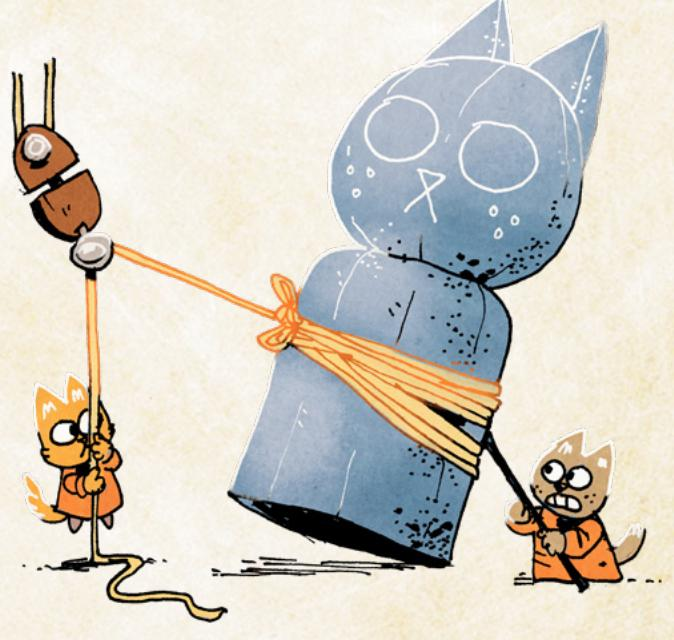

Chapter 8: Running the Woodland 217

{218}------------------------------------------------

# Portraying NPCs

When the vagabonds get into a fight, it's on you, the GM, to portray their foes. How do you do that well, especially if the PCs are the ones in the spotlight?

**First: NPCs have drives and morale. Play to those.** Every NPC wants something, and every NPC has a harm track that represents their will to fight. One of the simplest ways to make them seem like interesting characters and not just sword-wielding automatons is to have them choose to stop fighting! Surrender or retreat are legitimate options, and they keep combats in Root: The RPG from being pure slugfests.

If an NPC can better achieve their drive by surrendering or fleeing, they do! If an NPC's morale harm track has taken a few large hits, they might surrender before it's full—they don't *have* to, but it might make sense, the way that they might also surrender if they only have a single box of injury left. And if they take huge blows—for instance, if their armor is completely destroyed—you can inflict morale harm on your NPCs as a GM move to help keep yourself honest and track when they would really surrender!

**Second: NPCs act after they are struck.** NPCs are active participants in battle. They don't just react to the PCs' moves—they make their own, which you present as GM moves. These aren't just the moves you make after a PC rolls a miss, either. If a PC scores a 10+ on *engage in melee*, you resolve the full effects of that move…and then the NPC should react, taking some action!

The majority of the time, that will be a softer move (see "Softer and Harder Moves" on [page 204](#page-204-0)), meaning that it sets up some consequence later, instead of bringing a consequence to bear right now. More like, "They growl at you, put their head down, and bull-rush you head on—what do you do?" and less like "They growl at you, put their head down, and bull-rush you head on, knocking you down and inflicting 2-injury. What do you do?" Save the latter as a harder move after a miss or a golden opportunity. But always make sure NPCs get their time in the spotlight, too. They aren't as important as the PCs in the grand scheme of the story, but for NPCs to feel real, they have to get a chance to react after PC moves.

**Third: follow the fiction.** If something happens in the fiction, then make sure it has real consequences. An NPC who's been disarmed, lost their weapon over the side of the parapet, is going to act totally differently than one who's still armed. An NPC who is impressed or dismayed as the result of a move might take a moment to converse with the PCs instead of simply charging on. And an NPC who is knocked off a wall as a result of a PC move is going to suffer some harm from the fall, whether or not the move explicitly inflicted harm. Always pay attention to what actually happened, how it would change the NPC or the circumstances, and how the NPC would react.

218 Root: The Roleplaying Game

{219}------------------------------------------------

#### Adjudicating PC vs PC Conflict

For the most part, Root: The RPG isn't built to deal with PC versus PC conflict. If two vagabond PCs are about to start killing each other, something has gone terribly wrong—they're friends bound together as outsiders, so by the time they're coming to blows, the game's structure has shifted. Throughout the game, always ask leading questions of the PCs to remind them of their bonds and connections, pushing them back together and recalling the characters' choice to be together. That way, you can help head off a real PC versus PC fight before you even get there.

That said, if you need tools to deal with PCs arguing with or fighting other PCs:

Use the *help* or *interfere* mechanics on [page 86](#page-86-0) to allow PCs to interfere with moves targeting each other.

Make sure to trade the spotlight between them—neither is more important, but the moves are geared to primarily follow one PC at a time.

Remind PCs to use the *plead* move to get their way both before swords are drawn and while the fight continues.

# Example

*The vagabond band composed of Keera the Arbiter (played by Kate), Guy the Scoundrel (played by Miguel), Hester the Tinker (played by Sam), and Jinx the Vagrant (played by Derrick) have gotten themselves into quite the pickle. They're in a cave in the woods, surrounded by some Marquisate deserters-turned-bandits, a crew who's been causing trouble for the local clearing, and now—after a failed series of tricks on the part of Jinx and Guy—the bandits are ready to put the vagabonds to the sword.*

*"The four of you can see in the light of Hester's torch that you're surrounded on all sides. They've got swords and axes, but the weapons look worn and chipped," the GM says. They quickly mark down the group's stats—trained soldiers, but kind of a rabble, with worse equipment, and about 10 of them. The GM goes with 2 injury, 1 exhaustion, 1 wear, and 1 morale for the baseline soldier, so for the small group, 4 injury, 3 exhaustion, 3 wear, and 3 morale. They inflict 2-injury as a group. Their drive is "To be free from any authority that would control them."* 

*"Keera, you already had your sword drawn," the GM says, honoring the fiction that came before this moment. "You're ready. What do you do?" The GM is pointing the spotlight at Keera because Keera was ready, and letting the Arbiter start the fight is going to give her a chance to be awesome.*

*"I hoist my greatsword and dive into them, swinging in a broad arc. I want to scatter them," Kate says.* 

*"Sounds like you're engaging in melee. Roll with Might!" says the GM.* 

*"Wait, I have the storm a group weapon skill. And my greatsword is tagged with it. Can I do that?" Kate asks.*

Chapter 8: Running the Woodland 219

{220}------------------------------------------------

*"Ah, definitely! That's absolutely what you're doing! Mark exhaustion and roll with Might!" Kate rolls and gets a 7–9 total. "So you trade harm with them—you're diving into their midst, and they start swiping at you as you swing at them, so you take 2-injury from them, and you deal 1-injury to them, right?"*

*"My greatsword is also large, so I'm going to mark another exhaustion to deal 2-injury total," Kate says.*

*"Excellent! And you get to choose one from the storm a group list."* 

*"I sort of want to suffer little harm…but I'm all in. I think I'll use their strikes against them. I mark exhaustion again, and they deal their harm to themselves. I'll take the 2-injury on my armor," Kate says, and marks 2-wear on her armor in addition to the other exhaustion for the move. She now has 3-exhaustion marked—almost out!*

*"Oh, awesome! So they're suffering 4-injury total!" The GM marks that down, using up all 3 wear for the group and marking 1-injury. "You're ducking and dodging and bobbing among them—even though you're a giant badger, you're slipping by their blows and getting them to hit each other in their midst. It's pandemonium, but you're in the zone. They're getting blows in on you, but just as many of their hits are hitting themselves and each other."* 

*But now, it's time for the NPCs to act after they are struck. "Realizing how dangerous you are, one of their number shouts, 'Ignore the badger, get the others!' She and a few of the other bandits peel off to go after the three other vagabonds nearby!" The GM is having the bandits act, and because they're a big group in a close space, the GM is still just going to treat them as a single large unit.*

*"Guy, what are you doing?" The GM turns the spotlight to the other PCs. The GM isn't sure exactly who should be the focus next, though, so the plan right now is to flip to each PC, get a picture of what they're doing, and then sort out moves.*

*"I'm going to pull out my dagger and start fighting!" Miguel says, speaking for Guy.* 

*"Awesome," says the GM. Sounds like Guy is engaging in melee, but the GM will return to that. "Hester, what about you?"* 

*"I want to pull out my bow and fire at them!" Sam says.* 

*"Ah, but your bow's range is far, right? And you don't have quick shot, do you?" asks the GM.*

*'Oh, no. So I guess I have to get farther away first? I'll do that, I'll try to run to some cover so I can start shooting."*

*"Fantastic. And Jinx? What're you doing?"*

*"I have this playbook move, Charm Offensive, where I can play on their insecurities or fears to fight them. Can I do that?" Derrick asks.*

*"Sure! What do you say, Jinx?"*

*"Hm. They're worried about getting caught, right? I say, 'I don't know why you're attacking us. You should be running! The Marquisate lieutenant who hired us is bound to hear this fight. She'll be here in moments!'" Derrick says.*


{221}------------------------------------------------

*"Ah, fantastic. That feels kind of like a trick, but you're saying that as they come for you with their swords, right? In the middle of dodging and deflecting their strikes. It matches your playbook move perfectly. Okay, let's resolve that first—Jinx, roll with Cunning!"* 

*Derrick rolls but gets a 6—just on the cusp of a hit, but not there!* 

*"Can I help?" asks Sam.* 

*"Sure," says the GM. "But that means you're helping Jinx, not running like you said." The GM is fine with Sam revising what Hester is doing—no moves have been made yet, no dice rolled, and the whole situation is a chaotic melee. Of course Hester would respond to her friend being in danger!*

*"Yeah, that's fine. I'll mark exhaustion to help and give Jinx a +1, and I'll mark exhaustion again to create an opportunity," Sam says.*

*"Hold on for a second—what are you actually doing to help?" To do it, you have to do it!*

*"I turn and shout towards the woods, 'Hey! Lieutenant Needle! We're over here!' That should help sell what Jinx is doing, right?" Sam says.*

*"Great! Perfect! Yeah, that definitely helps. Jinx, your roll is now a 7, so you can either make a weapon move at +1, or you can just strike quickly and deal injury. I'll actually say that the opportunity Hester creates lets you get in even more hits—if you do something that inflicts injury right now, you'll inflict 2-injury."* 

*"Oh, I definitely do the quick strikes then. No need to roll another move, and these guys have GOT to be running out between this and Keera!" Derrick says.*

*The GM marks down another 2-injury on the group—they only have one left! "Yeah, Jinx, you take advantage of their momentary confusion and make two quick jabs, and a few of the deserters fall to the forest floor, groaning in pain and clutching their wounds."* 

*Then the GM turns to Guy. They want to honor sharing the spotlight, so instead of having the bandits react just this second, they decide to let Guy make the move Miguel had described earlier.*

*"Awesome! And so Guy, you're still wading in, right? Engaging in melee?"*

*"Absolutely," says Miguel. He rolls with Might to engage in melee and rolls…a 2! Even if every vagabond helped, it would still be a miss! "Oh dear," says Miguel.*

*"Yeah, definitely not good. The bandits are scattered, thrown around, bloodied by Keera and by Jinx. They're in total disarray. But they're still trying to fight! And just as Guy is sword to sword with another bandit, the rabbit leader who pointed at the three of you before manages to get behind Guy and put her knife to his throat. 'All of you, weapons down or I gut him!' she shouts to the other vagabonds. The bandits all pull back as the action freezes for a moment at her shout. So…what do you do?"*

{222}------------------------------------------------

# <span id="page-222-0"></span>When You're Not Busy

These next tips aren't crucial to GMing a game of Root: The RPG—the agendas, principles, GM moves, and other ideas earlier in this chapter lay the groundwork exactly as needed. But these ideas are here to give you some additional tools and ways to further build on that foundation.

**Use cinematic narration.** Root: The RPG features a lot of action sequences, drawing from swashbuckling adventures. Describe what happens the way you'd imagine it in a movie or in an exciting comic book—"You're engaged in an epic back and forth. Each time one of you advances, the other retreats, but never more than a step or two. Your eyes remain locked together, your gazes unblinking. It's almost like a ritual, a strange, deadly ceremony…until your foe falters, just for a second, and the tip of your sword cuts their shoulder!"

**Draw and add to maps.** At the start of play, you'll have a map of the Woodland itself (see more on [page 224\)](#page-224-1). But that shouldn't be a static document—add things to it! Mark important events, battles, and changes. Change the map constantly to represent the changing state of your Woodland. And in turn, make new maps! Even a very simple layout of a clearing can help bring it to life at your table.

**Ask leading questions**. Fleshing out the world by asking leading questions of the vagabonds Instead of "Do you know this Marquisate sergeant?", ask "Why do you remember this Marquisate sergeant from your home clearing?" Every leading question gives the players more to build upon, helping to flesh out the world.

**Use time jumps.** The in-fiction timescale of Root: The RPG is not mere days. It might be months or even years! Traveling between clearings takes days to weeks, and the war isn't going to wrap up quickly. Play with time to alleviate tension resetting the campaign away from a crisis—and to give the vagabonds time to undertake more casual pursuits. If a vagabond wants to check on a friend in a prior clearing, that might be a great opportunity to travel back there and see the clearing…but it might also be better to cover the whole incident in a montage.

**Share the spotlight.** Root: The RPG doesn't tell stories about a single vagabond adventurer. It tells stories about a whole band, and each of them is awesome in their own way, with their own dramatic stakes, plots, and supporting cast. Share the spotlight among them. Give them all a chance to shine, doing their own special thing and even being directly targeted by danger and threats.

**Take breaks.** When playing Root: The RPG, don't hesitate to take breaks when you need them! If you need to figure out what move to make and you're stumped, feel free to ask everybody to take a short 5- or 10-minute break while you think about it. When you are GMing, Root: The RPG can wind up feeling very intense if you don't take enough breaks to give your mind time to breathe.

{223}------------------------------------------------

<span id="page-223-0"></span>

{224}------------------------------------------------

<span id="page-224-0"></span>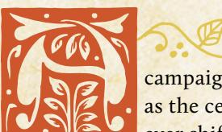

campaign of Root: The RPG is all about the vagabonds as the central characters, but it's also always set within the ever shifting landscape of a Woodland at war. The Woodland

itself isn't perfectly stable even at the best of times, but the war for control being waged by the different factions creates the state of change and uncertainty full of chances for heroism, villainy, and everything in between.

This chapter is all about the war and how to use it to create a living world for your campaigns of Root: The RPG. Whether or not the vagabonds ever actively choose to affect the war, their actions will inevitably change its course. And as time passes, the war will change the world around them. This chapter tells you how to deliver on those promises.

# <span id="page-224-1"></span>Making the Woodland

When you start a campaign of Root: The RPG, one of the first things you need is your version of the Woodland itself. Every individual campaign's Woodland will be slightly different, from the layout of the clearings to their names to their specific NPCs. Even the factions you play with might be different from game to game.

As the GM, you can make your version of the Woodland while the players fill out their playbooks and make their characters, or you can make it in advance of the first session so every player can tie into the existing map.

The first step to making your version of the Woodland is to decide which factions you are playing with. You must always play with the "Denizens" faction, meaning that the general inhabitants of the Woodland are always present.

Then, you select two or three other factions to play with. In this book, you'll find support for the Marquisate, the Eyrie Dynasties, and the Woodland Alliance. In Travelers & Outsiders, you'll find additional support for four more factions—the Riverfolk Company, the Lizard Cult, the Corvid Conspiracy, and the Grand Duchy. You can use any of those factions in any combination, though whatever set you choose will have effects on your version of the Woodland and its implied history. You can find more about the effects of those expansion factions in Travelers & Outsiders.

では今し、いらいとは今し、いらいとは今し、いら

{225}------------------------------------------------

# Map of the Woodland

Next, you make the full map of your Woodland. You can use a preexisting map (like one of our additional clearing maps or the board game itself!) or you can create a new map. Your map will always have 12 total clearings.

If you use a preexisting map, then you're set. That map will detail major populations, paths, and some important features. Skip to "Control of Clearings" on [page 228](#page-228-0). If you are creating a new map, read on.

Take a blank sheet of paper (or some other drawing surface). Start by making one clearing—a single circle, close to a corner of the drawing surface. Roll for that clearing's dominant community, its number of paths, and its name.

| 1D6 | Dominant<br>Community |  |
|-----|-----------------------|--|
| 1–2 | Rabbit                |  |
| 3–4 | Mouse                 |  |
| 5–6 | Fox                   |  |

The clearing's dominant community is the majority population of denizens—foxes, mice, or rabbits. All denizens live in every clearing, but every clearing has one dominant community, a species with more members than the others. Birds are never the dominant community because they are spread across all the clearings of the Woodland more equally!

| 2D6   | Number<br>of Paths |
|-------|--------------------|
| 2     | 1                  |
| 3–4   | 2                  |
| 5–9   | 3                  |
| 10–11 | 4                  |
| 12    | 5                  |

The clearing's number of paths are the wellmaintained and available roads leading to neighboring clearings. Draw a number of lines coming out of that clearing equal to its number of paths. Draw an icon in the circle to indicate its dominant community—a little fox face, or an F, or whatever you want to use.

Then draw a new circle—a new clearing—at the end of one of those paths, and roll for its dominant

community, name, and number of paths. Draw new paths, new lines from the new clearing, but remember—the existing path counts towards its total paths, so only draw new lines coming out of it equal to the remainder.

#### Clearing Name Generator

| 2D6 | 1–2              | 3–4        | 5–6            |
|-----|------------------|------------|----------------|
| 1   | Patchwood        | Underleaf  | Ironvein       |
| 2   | Clutcher's Creek | Pinehorn   | Sundell        |
| 3   | Rooston          | Milltown   | Oakenhold      |
| 4   | Limberly         | Allaburrow | Blackpaw's Dam |
| 5   | Flathome         | Tonnery    | Firehollow     |
| 6   | Opensky Haven    | Icetrap    | Windgap Refuge |

Continue drawing new circles at the end of paths. Connect paths and clearings where possible to keep your Woodland connected. Draw new paths so they point towards existing paths, making it easier to place a clearing that connects to multiple paths.

Chapter 9: The Woodland at War 225

{226}------------------------------------------------

You can only have four clearings of each kind of dominant community. Once you have four rabbit communities, for example, reroll if you roll another rabbit community from that point forward.

You can only use each community name once. If you get the same name, either read the dice the other way to find a new name, or reroll.

Stop adding clearings when you reach 12 total clearings. Any unfinished paths then remain unconnected—you can erase them, or keep them as markers of failed, unfinished paths in the Woodland, or perhaps paths to clearings that no longer exist…

# An Example of Woodland Creation

*I draw my first circle and roll. I get a 3 for dominant community, a 7 for number of paths, and a 2+6 for name—a mousedominated clearing with 3 paths called Sundell.*

*Next, I draw my next clearing and roll. I got a 4 for dominant community, a 5 for number of paths, and a 6+2 for name another mouse-dominated clearing with 3 paths called Opensky Haven.*

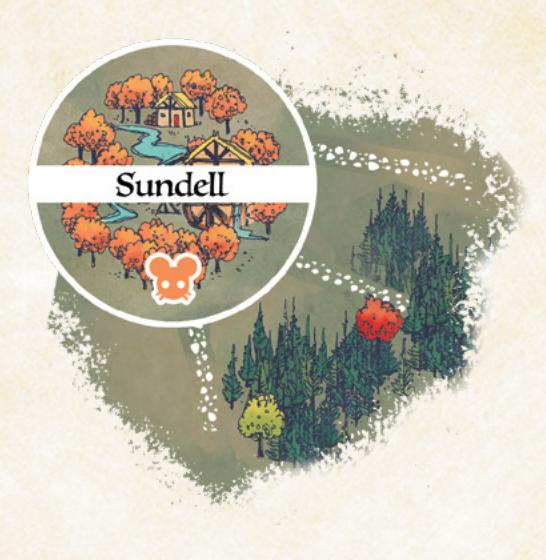

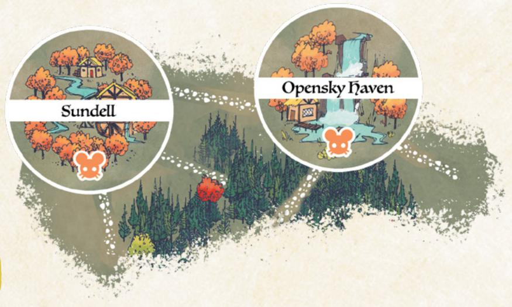

{227}------------------------------------------------


*Then I roll for another, and I get 3, 9, and 6+6—a mouse clearing with 3 paths named Windgap Refuge.*

*For the next clearing, I get 1 (rabbit* 

*clearing), 6 (3 paths), and 2+6—Sundell. That's already used, and so is the name the other way around (Opensky Haven), so I just reroll. I get 4+4, so it's Allaburrow. Finally, after running through all the rolls, I wind up with a 12-clearing Woodland.* 


{228}------------------------------------------------

# <span id="page-228-0"></span>Control of Clearings

When a campaign of Root: The RPG begins, the war in the Woodland isn't just starting. The factions have already been at it for a bit of time and have made their opening moves.

For each faction that you selected, use the following procedures to determine where they begin with presence and power. Even if you aren't playing with all three of the core factions (the Marquisate, the Eyrie Dynasties, and the Woodland Alliance), take them in the order presented here. For example, if you were playing only with the Marquisate and the Woodland Alliance, you would start with the Marquisate's control, and then move to the Woodland Alliance's control.

Throughout this process, take notes on the clearings! Treat these rolls and events functionally as establishing a kind of "history" of the Woodland. In particular, make note of any clearings that change hands between non-denizen factions; those clearings are "contested" and have seen the most war.

#### First: The Marquisate

Choose one "corner" of the Woodland—a place on the farthest edge of the entire map. If you want to determine the corner randomly, roll 1d6 on the Woodland Corner table and reroll 5–6.

| 1D6 | Woodland Corner  |  |
|-----|------------------|--|
| 1   | Northwest corner |  |
| 2   | Northeast corner |  |
| 3   | Southwest corner |  |
| 4   | Southeast corner |  |
| 5–6 | Reroll           |  |

That "corner" is the Marquise de Cat's stronghold, from which she manages her occupation of the Woodland. The Marquisate is in control of that clearing. Make a note of the stronghold's presence in that clearing and the Marquisate's control of that clearing.

Then, starting with each clearing directly connected to the Marquisate's stronghold, roll on the

Marquisate Control table to see if the Marquisate is in control of any given clearing in the Woodland. "Paths Away from the Stronghold" refers to how many paths must be crossed from the stronghold clearing to reach the clearing in question.

The Marquisate stronghold is the place where the Marquisate entered the clearing, and it is their most heavily fortified base of operations. Removing them from that clearing would be difficult for any faction or vagabond.

Marquisate control over a clearing means that they certainly have de facto control, if not de jure control—perhaps there is a nominal civilian government, but the Marquisate is definitively in charge.


{229}------------------------------------------------

#### Marquisate Control

| From the Stronghold | Roll of 2d6                                                |  |  |
|---------------------|------------------------------------------------------------|--|--|
| 1 path away         | 5+, Marquisate in control. 4–, Marquisate not in control.  |  |  |
| 2 paths away        | 7+, Marquisate in control. 6–, Marquisate not in control.  |  |  |
| 3 paths away        | 10+, Marquisate in control. 9–, Marquisate not in control  |  |  |
| 4 paths away        | 12, Marquisate in control. 11–, Marquisate not in control. |  |  |
| 5 paths away        | Marquisate not in control.                                 |  |  |

# Example

*First, I roll a 3 for the Marquisate's stronghold, getting "southwest corner." I interpret that as Allaburrow, the most southwest clearing on the map. Then I roll for every other clearing, resulting in a Woodland that looks like this:*


{230}------------------------------------------------

#### Second: The Eyrie Dynasties

Choose one "corner" of the Woodland—a place on the farthest edge of the entire map. If the Marquisate is in play, choose the corner opposite their stronghold. If you want to determine the corner randomly, roll 1d6 on the Woodland Corner table, and reroll 5–6. That "corner" is the bastion of power for the Eyrie Dynasties, where they have a Roost. Make a note of the Eyrie's presence in that clearing, and the Eyrie's control of that clearing.

Then, starting with the clearings connected to the Eyrie's initial Roost, for each clearing in the Woodland roll on the Eyrie Control table to see if the Eyrie is in control of those clearings. "Paths Away from Any Roost" refers to how many paths must be crossed from any Roost on the map to reach the clearing in question. If you place a new Roost while rolling, it doesn't change any prior results—adding a Roost won't suddenly change which part of the table applied to a clearing you had rolled for earlier.

The Eyrie can have, at most, four Roosts. Once four Roosts are on the map, ignore any result that would place a further Roost.

The Eyrie can be in control of at most six clearings. Once the Eyrie is in control of six clearings (including their initial Roost), stop rolling.

If the Marquisate is in play, roll for Marquisate-controlled clearings as normal, except for the Marquisate stronghold clearing. Do not roll for the Marquisate stronghold clearing. If you roll that the Eyrie is in control of a Marquisatecontrolled clearing, it means the Eyrie has taken that clearing from the Marquisate over the course of the war. Give the Eyrie control over that clearing.

#### Eyrie Control

| From Any Roost | Roll of 2d6                                                                                        |
|----------------|----------------------------------------------------------------------------------------------------|
| 1 path away    | 5–, Eyrie not in control. 6–8, Eyrie in control, no Roost.<br>9+, Eyrie in control with a Roost.   |
| 2 paths away   | 8–, Eyrie not in control. 9–10, Eyrie in control, no Roost.<br>11+, Eyrie in control with a Roost. |
| 3 paths away   | 10–, Eyrie not in control. 11, Eyrie in control, no Roost.<br>12, Eyrie in control with a Roost.   |
| 4+ paths away  | Eyrie not in control.                                                                              |

{231}------------------------------------------------

An Eyrie Roost is the equivalent of a fortified position coupled with an actual local government. If the Eyrie has a Roost, then they have de jure control over the clearing.

In general, Eyrie control is much more likely to be de jure than de facto. The Eyrie reinstitutes old governments and actively absorbs any existing local government into its own structures and bureaucracy.

# Example

*I choose the closest thing to an "opposite corner" from Allaburrow—namely, Firehollow—to be the opening Eyrie Roost. Then I roll for every clearing resulting in a Woodland that looks like this:* 

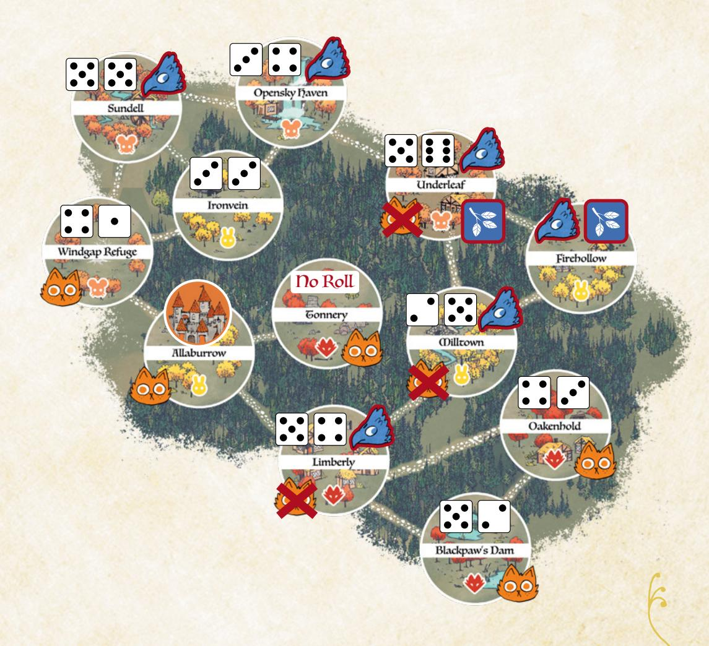

{232}------------------------------------------------

#### Third: The Woodland Alliance

Roll for each clearing on the map using the Woodland Alliance Sympathy table. Then, for each clearing that has sympathy for the Woodland Alliance, roll on the Uprising table. Continue rolling until either you have rolled for every clearing, or you have rolled that an Uprising took place (i.e., you have rolled a 10+).

#### Woodland Alliance Sympathy

| State of the Clearing | Roll of 2d6                      |
|-----------------------|----------------------------------|
| Uncontrolled          | 8–, no sympathy. 9+, sympathy.   |
| Controlled            | 10–, no sympathy. 11+, sympathy. |
| Contested*            | 7–, no sympathy. 8+, sympathy.   |

<sup>\*</sup>Swapped control from one non-denizen faction to another.

#### Uprising

| 2d6   | Result                                                                                                                               |
|-------|--------------------------------------------------------------------------------------------------------------------------------------|
| 1–9   | No Uprising                                                                                                                          |
| 10–11 | Uprising; any existing control removed; Woodland<br>Alliance base placed in clearing                                                 |
| 12    | Uprising; any existing control removed; Woodland<br>Alliance base placed in clearing; sympathy placed in<br>every connected clearing |

Sympathy for the Woodland Alliance means that the Alliance has active and functional underground cells in the clearing, and/or that there is a real undercurrent of potential support in the clearing. The Woodland Alliance is not operating openly in that clearing yet, but there's a real danger of a Woodland Alliance uprising and an overthrow of existing powers.

An uprising means that the Woodland Alliance in that clearing successfully contested full control of that clearing and took power there. If the uprising occurred in an uncontrolled clearing, then it is possible that the Woodland Alliance worked with the local denizen government or that the Woodland Alliance overthrew the local denizen government. If the uprising occurred in a faction-controlled clearing, then the Woodland Alliance overthrew that faction's control of the clearing.

A Woodland Alliance base means that the Alliance has an open, active, and functional base of operations in the clearing now. No longer are they defined by underground cells, at least within that clearing—they have actual real control and openly identified forces. The Woodland Alliance does not always rule with the consent of the local denizens; having a base present means the Woodland Alliance has enough temporal power in the clearing to control through force as much as anything else.

{233}------------------------------------------------

Example

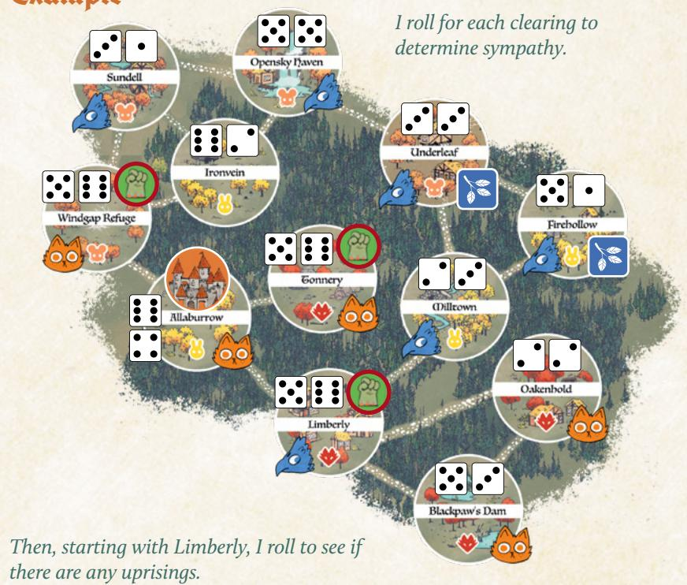


{234}------------------------------------------------

#### Last: The Denizens

As the last step whenever you set up the Woodland, roll to see if control to any of the clearings has returned to the denizens. Do not roll for the Marquisate stronghold, any Eyrie Dynasties Roost clearings, or the Woodland Alliance base clearing. Do not roll for any uncontrolled clearings, either—they simply remain uncontrolled.

Becoming uncontrolled is most often the result of a faction's withdrawal or retreat, or of a faction's forces in that clearing becoming independent. Notably, this is not the result of a Woodland Alliance revolt or uprising.

#### Denizen Control

| 2d6   | Result                  |
|-------|-------------------------|
| 1–10  | Remains in control      |
| 11–12 | Becomes<br>uncontrolled |

# Example

*I roll for each controlled, non-stronghold, non-base, non-roost clearing. All stay under control (roll of 10 or less), except for Milltown. I remove the Eyrie control. My final map of the Woodland looks like this:*

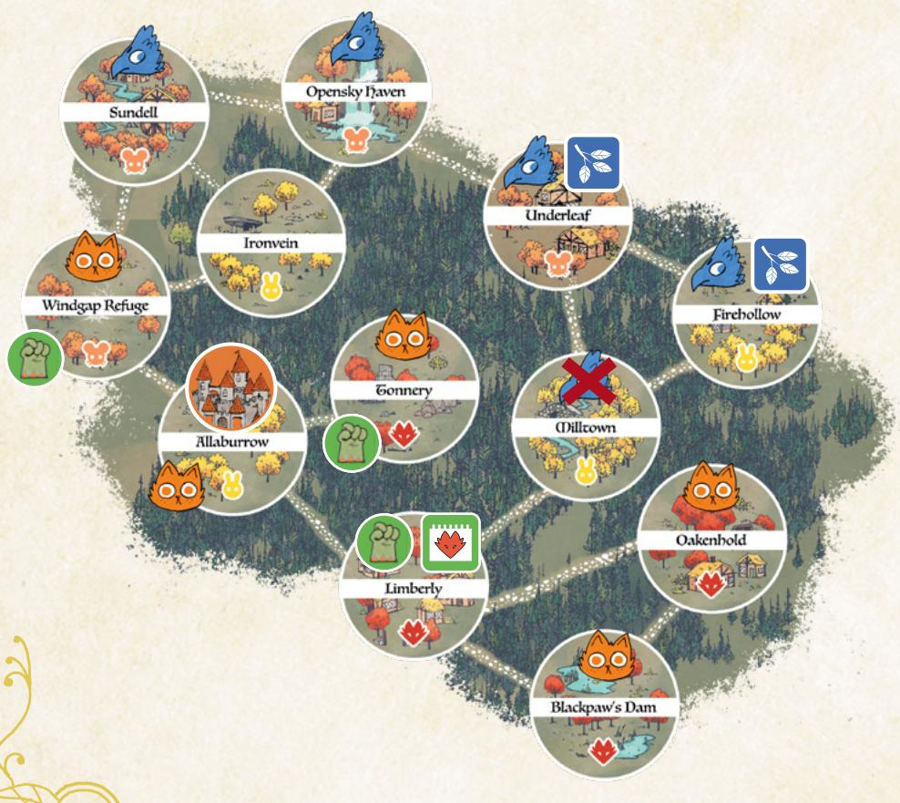

234 Root: The Roleplaying Game

{235}------------------------------------------------

# <span id="page-235-0"></span>Fleshing Out Your Clearings

These tables and tools are provided so you can randomly determine interesting additional characteristics of your clearings. For each clearing, generate two of each—inhabitants, buildings, and problems—when you need to determine the fiction of the clearing.

#### Important Inhabitants

| 2D6 | 1                 | 2                  | 3             | 4            | 5             | 6             |
|-----|-------------------|--------------------|---------------|--------------|---------------|---------------|
| 1   | Mayor             | Smith              | Guard Captain | Rebel Leader | Enemy Captain | Village Elder |
| 2   | Farmer            | Thief              | Local Regent  | Scholar      | Tax Collector | Doctor        |
| 3   | Armorer           | Merchant           | Noble         | Astronomer   | Healer        | Banker        |
| 4   | Rabble-Rouser     | Bandit             | Mercenary     | Baker        | Tracker       | Historian     |
| 5   | Faction Recruiter | Tailor/<br>Cobbler | Jeweler       | Sheriff      | Barber        | Monk          |
| 6   | Soldier           | Mason              | Assassin      | Gambler      | Minstrel      | Judge         |

#### Important Buildings

| 2D6 | 1           | 2            | 3           | 4          | 5            | 6          |
|-----|-------------|--------------|-------------|------------|--------------|------------|
| 1   | Mill        | Forge        | Well        | Farm       | Kiln         | Town Hall  |
| 2   | Guard tower | Fence/wall   | Longhouse   | Archive    | Larder       | Grain silo |
| 3   | Armory      | Infirmary    | Brewery     | Bakehouse  | Woodshop     | Warehouse  |
| 4   | Orchard     | Custom house | Market      | Monastery  | Tavern       | Inn        |
| 5   | Almshouse   | Barracks     | Schoolhouse | Bridge     | Dam          | Bank       |
| 6   | Fountain    | Prison       | Graveyard   | Courthouse | Trading post | Aqueduct   |

#### Problems

| 2D6 | 1               | 2                        | 3                           | 4                        | 5                    | 6                           |
|-----|-----------------|--------------------------|-----------------------------|--------------------------|----------------------|-----------------------------|
| 1   | Bear            | Natural disaster         | Bandits                     | Enemy<br>occupation      | Famine               | Sickness                    |
| 2   | Tyranny         | War                      | Money                       | Inequality               | Overpopulation       | Lack of<br>development      |
| 3   | Corruption      | Dissent/<br>rebellion    | Lack of crucial<br>resource | Lack of<br>skilled labor | Overtaxation         | Sabotage                    |
| 4   | Internal strife | Inflexible<br>traditions | Prejudice                   | Brutality                | Protection<br>racket | Xenophobia                  |
| 5   | Road damage     | Obsolescence             | Cultural<br>assimilation    | Coup                     | Poisoned<br>supplies | Dilapidated<br>architecture |
| 6   | Fearmongering   | Warmongering             | Smugglers                   | Thieves                  | Censorship           | Strange<br>mystery          |

Chapter 9: The Woodland at War 235

{236}------------------------------------------------

# Request Generator

You can randomly generate requests for the vagabonds for a one-shot or a campaign by rolling on these tables. Determine where they are being sent, what they are sent to do, who hired them, what the targets are, and one or two complications. Spend time thinking about how the pieces fit with the PCs in particular. This generator is especially useful for creating an "in medias res" situation with which to start play.

#### Where Are They Being Sent? What Are They Supposed to Do?

| 1D6 | Location                      | 2D6 | 1–3                    | 4–6                   |
|-----|-------------------------------|-----|------------------------|-----------------------|
| 1–3 | A forest between clearings    | 1   | Deliver an item        | Destroy an item       |
| 4   | The most isolated clearing    | 2   | Steal an item          | Repair/modify an item |
| 5   | The most connected clearing   | 3   | Neutralize a threat    | Investigate a threat  |
| 6   | A faction-entrenched clearing | 4   | Eliminate a threat     | Spy on a threat       |
|     |                               | 5   | Negotiate with a group | Raid a group          |
|     |                               | 6   | Protect a group        | Disband a group       |

#### Who Is Making This Request?

| 1D6 | Requester                                                                                 |  |  |  |  |
|-----|-------------------------------------------------------------------------------------------|--|--|--|--|
| 1   | "Trusted Benefactor"                                                                      |  |  |  |  |
|     | A powerful leader of the faction with whom the PCs collectively have the best reputation  |  |  |  |  |
| 2   | "Chance for Redemption"                                                                   |  |  |  |  |
|     | A powerful leader of the faction with whom the PCs collectively have the worst reputation |  |  |  |  |
| 3   | "Local Help"                                                                              |  |  |  |  |
|     | A leader of a neighboring clearing                                                        |  |  |  |  |
| 4   | "Scratch My Back"                                                                         |  |  |  |  |
|     | A would-be usurper of the leadership of a neighboring clearing                            |  |  |  |  |
| 5   | "Aid the Underdogs"                                                                       |  |  |  |  |
|     | A military representative of the faction with the fewest clearings under control          |  |  |  |  |
| 6   | "Stay on the Winning Side"                                                                |  |  |  |  |
|     |                                                                                           |  |  |  |  |

A military representative of the faction with the most clearings under control

{237}------------------------------------------------

#### Targets: Items

| 2D6 | 1                   | 2                             | 3                     | 4                        | 5                                | 6                            |
|-----|---------------------|-------------------------------|-----------------------|--------------------------|----------------------------------|------------------------------|
| 1   | Goods-laden<br>cart | Ink, pens, and<br>parchment   | Treasure<br>chest     | Exceptional<br>armor     | Historical<br>scroll             | Medical<br>supplies          |
| 2   | Mill<br>equipment   | Jewelry                       | Cookware              | Official<br>missive      | Treaty                           | Valuable<br>tome             |
| 3   | Forge<br>equipment  | Official insignia<br>or badge | Quality tools         | Ale, wine,<br>or spirits | Reliquary                        | Clockwork<br>mechanism       |
| 4   | Farm<br>equipment   | Royal regalia                 | Exceptional<br>weapon | Collected<br>taxes       | Strange<br>device or<br>relic    | Explosives                   |
| 5   | Exceptional<br>food | Important key                 | Arms for a<br>troop   | Map                      | Banner                           | Valuable<br>raw<br>materials |
| 6   | Subsistence<br>food | Luxury goods                  | Armor for a<br>troop  | Road sign                | Rudimentary<br>printing<br>press | Valuable<br>trophy           |

#### Targets: Threats

| 2D6 | 1                     | 2                        | 3                     | 4                            | 5                    | 6                                |
|-----|-----------------------|--------------------------|-----------------------|------------------------------|----------------------|----------------------------------|
| 1   | Bear                  | Heretical<br>philosopher | Criminal<br>outsiders | Xenophobic<br>governor       | Rabble<br>rouser     | Dangerous<br>spy                 |
| 2   | Bandit captain        | Disloyal<br>assassin     | Traveling<br>thieves  | Unscrupulous<br>doctor       | Satirical<br>bard    | Insidious<br>conspiracy          |
| 3   | Rogue<br>commander    | Bounty<br>hunters        | Isolationists         | Traveling<br>charlatan       | Clever loan<br>shark | Secretive<br>murderer            |
| 4   | Militant<br>commander | Callous<br>mercenaries   | Local<br>garrison     | Unscrupulous<br>smuggler     | Strict<br>lawkeeper  | Determined<br>treasure<br>seeker |
| 5   | Reckless rebel        | Cunning<br>rebel         | Greedy<br>governor    | Overzealous<br>guard captain | Strange<br>seer      | Deceptive<br>leader              |
| 6   | Dangerous<br>vagabond | Rage-filled<br>arsonists | Hateful<br>governor   | Belligerent<br>brute         | Defecting<br>soldier | Vengeful<br>leader               |

{238}------------------------------------------------

#### Targets: Groups

| 2D6 | 1                         | 2                     | 3                         | 4                      | 5                      | 6                  |
|-----|---------------------------|-----------------------|---------------------------|------------------------|------------------------|--------------------|
| 1   | Minority<br>denizen group | Military<br>engineers | Mercenary<br>company      | Messenger<br>guild     | Prisoner<br>caravan    | Smuggling<br>ring  |
| 2   | Expeditionary<br>force    | Tax collectors        | Traveling<br>missionaries | Band of<br>hunters     | Honor guard            | Wealthy<br>family  |
| 3   | Guard troop               | Frontline<br>troop    | Carnival<br>troupe        | Trailblazers'<br>union | Carpenters'<br>union   | Crime<br>family    |
| 4   | Scouting troop            | Rebel<br>insurgents   | Refugees                  | Bakers' guild          | Metalworkers'<br>guild | Deserter<br>band   |
| 5   | Propaganda<br>troop       | Local trade<br>guild  | Banking<br>collective     | Mining<br>company      | Strange cult           | Vigilante<br>group |
| 6   | Lawkeepers                | Ruling council        | Trade clan                | Merchant<br>caravan    | Explorers<br>band      | Vagabond<br>band   |

#### Complications

| 2D6 | 1                             | 2                          | 3                              | 4                       | 5                               | 6                                 |
|-----|-------------------------------|----------------------------|--------------------------------|-------------------------|---------------------------------|-----------------------------------|
| 1   | False<br>identity             | Surprising<br>stakes       | Warfront                       | Friend on<br>wrong side | Coercive<br>threat              | Deep<br>cultural<br>divide        |
| 2   | Third party<br>involved       | Local hostility            | Opposing<br>agents             | Prejudice               | Enemy in<br>power               | Frame job                         |
| 3   | Traitor                       | Target friendly            | Hidden/<br>secure targets      | Resource<br>scarcity    | Plague<br>or illness<br>abounds | Existential<br>threat             |
| 4   | Innocents<br>in crossfire     | Secrets and lies<br>abound | Clingy<br>hanger-on            | Watchful<br>eyes        | Hidden<br>motives               | Taboos and<br>restrictions        |
| 5   | Great<br>military<br>presence | Natural disaster           | Old enemy<br>appears           | Enticing offer          | Usurpation<br>in progress       | Toothless<br>laws                 |
| 6   | Rampant<br>corruption         | Time limit                 | Ongoing intra<br>clearing feud | Strange<br>phenomenon   | Vagabonds<br>being<br>hunted    | Clearing<br>ruled<br>unofficially |

{239}------------------------------------------------

#### <span id="page-239-0"></span>War Status

If you don't yet have any particular faction phases to draw upon for the push and pull of the war, you can always determine the state of a clearing with regard to how much war and battle it has seen using the following rules.

To determine how a clearing has been impacted by the war when the vagabonds encounter it, roll 2d6 + the number of factions either controlling or neighboring the clearing. Thus, if there is only one faction in control of both the area and its neighbors, roll +1; if a different faction controls the neighbors, roll +2; if there are two or more different faction neighbors and a third faction in control, roll +3.

- 2–7: Untouched. This clearing is by and large unaffected by the war directly. Its buildings haven't been stricken by destruction, and it doesn't have a particularly noteworthy buildup of martial forces or defenses.
- 8–10: Battle-scarred. This clearing shows the signs of battle, the scars of fighting. The faction in control has it well in hand, but everyone in the clearing has felt the sting of the war.
- 11–12: Occupied, battle-scarred. This clearing has seen war, recently, and shows the scars. Furthermore, it is likely occupied, or has recently been occupied, by another faction.
- 13+: Fortified, battle-scarred, occupied. This clearing has seen war, recently, and shows both the scars and the defenses required to survive. Furthermore, it is likely occupied, or has very recently been occupied, by another faction.

#### The War Continues

As you play your campaign of **Root: The RPG**, the war will rage on across the Woodland. The vagabonds can affect its course or divert it, of course, but it will continue with or without them. To represent the war's ebb and flow over the course of play, use the faction roll on the next page for each faction when time passes.

Time passes whenever the spotlight of the story shifts forward a couple weeks; maybe the vagabonds take a particularly long journey or rest for a time, creating a period of downtime that isn't interesting to play through beat by beat. "Time passes" is a kind of mild reset, allowing vagabonds to clear their harm tracks by virtue of off-screen actions, and allowing the time needed for changes in the broader Woodland to come to the fore.

The mechanics presented are suited for fast, easy resolution that, in turn, leads to new results and developments in the Woodland. But if you want to see more in-depth faction mechanics suited to each faction's individual play style, check out the expanded faction mechanics in **Travelers & Outsiders**. The rules in that expansion create a deep, complicated, ever shifting Woodland—but take more time and require more work on the part of the GM, either between sessions or in breaks.

{240}------------------------------------------------

#### Faction Roll

When time passes, roll for each non-denizen faction. Start with the faction that controls the most clearings, then work down the list:

- +I if the faction operated unfettered by PC actions since the last roll
- -I if the faction has recently suffered a blow from the PC vagabonds
- -I if the faction controls the most clearings (and is thus a juicy target)

Add +1 if the faction in question controls the following:

- Marquisate: 5+ total clearings, workshops, sawmills, or recruiters
- Eyrie Dynasties: 2+ Roosts or 4+ clearings
- Woodland Alliance: 3+ sympathy or at least one base

On a hit, the faction scores a victory; choose one minor boon. On a 10+, choose another minor boon—in the same clearing or another—or a major boon instead. On a miss, the faction suffers a defeat—it loses control of a clearing (returning it to the control of its own denizens); a fortification or structure (Roost, base, or Marquisate building); or a valuable resource.

#### MINOR BOONS

Attack: Take control of a clearing adjacent to one already controlled. If that clearing has fortifications, destroy those instead. If that clearing has no fortifications but has a Roost, a Woodland Alliance base, or any Marquisate structures, destroy all of those instead.

**Fortify**: Fortify a controlled clearing with defensive structures and more troops. The next time an enemy faction would take control of a fortified clearing, they only remove the fortifications instead.

**Obtain:** Gain a valuable resource from the forests, ruins, or a clearing. On the next faction roll, the faction takes +2 if it retains control of the resource.

Establish cells: Add sympathy to any two clearings. [Woodland Alliance]

Stamp cells: Remove sympathy from all clearings the faction controls. [Marquisate/Eyrie]

**Build industry**: Construct one sawmill, workshop, or recruiting post in each of two different controlled clearings. [Marquisate]

#### **MAJOR BOONS**

**Revolt**: A revolt occurs in a clearing with sympathy; the Woodland Alliance gains a base there, taking control and removing all other faction structures. [Woodland Alliance]

**Build Roost**: Add a Roost to a clearing the Eyrie controls without a Roost. [Eyrie]

**Capture**: Seize an important figure in an enemy faction; that faction takes -1 on all faction rolls while that figure is held captive.


{241}------------------------------------------------

<span id="page-241-0"></span>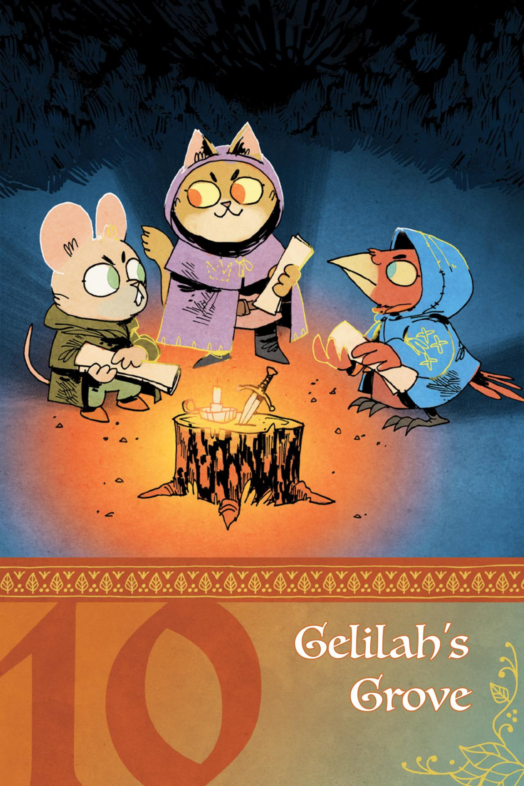

{242}------------------------------------------------

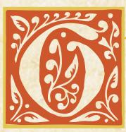

elilah's Grove is known for their cutting-edge bow design and flawless arrow production. Even small details, such as a proprietary dye for the sinew used to attach feathers to arrow

shafts, are zealously guarded from outsiders. This is a majority fox grove with a number of rabbits and birds mixed in, but it's really the foxes' show as they run the sawmill that employs many of the denizens. The foxes pride themselves on the beauty of their products as well as the function, and a good portion of them are expert marksmen as well as makers.

An enclave of goats mainly keeps to themselves, building their homes in and around the steep rocky bluffs to the west. A waterfall separates the goats from the rest of the clearing, although its use for the foxes' sawmill means that they spend a lot of time on the clover strewn banks, much to the goats' disgruntlement.

The attitude of the foxes has rubbed off on everyone who lives there, at least to an extent. Hard work and craftsmanship are valued over cleverness, and anyone with soft paws is treated with derision. Outsiders are regarded with suspicion, and it takes a long time for newcomers to be fully welcomed. But now bad fortune has struck Gelilah's Grove, and the insular denizens have to open their doors to accept the help of outsiders. That doesn't mean they have to like it, however...

# <span id="page-242-0"></span>At First Sight

A stagnant, brackish smell fouls the air long before Gelilah's Grove is sighted. Deep pools of standing muddy water connect the roiling river to the clearing's floor. Gelilah's Grove was always a moderately industrial clearing, with structures sprouting up alongside the waterfall and environs to take advantage of the flow of running water for the sawmill, but now the river has blurred the line between water and land. Drowned clover and herb ground cover can still be felt underfoot around the structures still standing, and hanging moss blocks the sunlight from reaching far into the water.

Rocky hills rise to one side, with seemingly poorly-maintained shacks sprouting from sheer rock faces. Industrial structures, such as the mill and workshops, line the bank of the river, saved from catastrophe by a rise in elevation. Even the larger homes are water stained and covered with fungal growths, although delicate, intricate carvings can be seen underneath.

さるこれでは、一番できるこれでは、一番できる。

{243}------------------------------------------------

# <span id="page-243-0"></span>Conflicts and Issues

The vagabonds are likely to encounter the following conflicts in Gelilah's Grove. One of them—*Beware Cats Bearing Gifts*—is the overarching issue for the clearing, while the others are conflicts likely to appear if the vagabonds dig around a bit.

# Core Conflict: Beware Cats Bearing Gifts

Gelilah's Grove was nominally held by the Eyrie governer Dru Gale, but their rule was weak and the Eyrie's attention elsewhere—the Grove was able to operate more or less independently as long as it paid taxes and gave Dru their cut. This spring, however, some foxes were repairing their structures along the waterfall and inadvertently caused a flash flood. The initial rush of water damaged homes and businesses, but the long term effects were worse. Standing water bred insects, and overwork and exhaustion from cleaning up the mess contributed to illness. Most of the clearing inhabitants are in a bad way, and the Eyrie had to withdraw entirely from the Grove, leaving it open to Marquisate invasion. Dru remains as the nominal governor, a local leader and the token Eyrie presence.

A leader of the Marquisate, Mirrim Sablefur, has arrived with medicine and other supplies, hoping to gain control of the Grove through "peaceful" means. Her help comes with a hitch—Mirrim wants to control the secret hornwine industry. She wants a bigger piece of the pie than Dru had taken, but she's willing to let the goats operate mainly on their own, aside from a few "improvements."

A Woodland Alliance representative, Kellsie Raine, has promised help as well, but it's contingent on the Grove stopping their illegal hornwine trade. Kellsie finds the hornwine to be distasteful as well as a distraction from the less lucrative archery business, which the Woodland Alliance would dearly like to be the sole beneficiary of. A very vocal group of denizens (the goats, really) absolutely refuse to let the hornwine industry fall out of their hooves, pointing to traditions created over generations.

# How it Develops

*If the vagabonds never came to the clearing, Gelilah's Grove would turn to ashes. Mirrim is confident in the sweet offer from the Marquisate she's dangling in front of the goats, but they view the Marquisate as an even more annoying and constricting version of the Eyrie, when they've done just fine on their own up until now. First the foxes ruined everything by causing the flood, and now those pesky varmints are cozying up to the Marquisate! Ultimately, the goats would rather burn down the clearing than let someone else have what they've built, so once they believe the foxes are entirely committed to submitting to the Marquisate and the only way out is destruction, they would destroy all their hornwine equipment with a massive fire, damaging already waterlogged homes and hurting ill denizens in the process.* 

Chapter 10: Gelilah's Grove 243

{244}------------------------------------------------

# Conflict: Raine-ing on Your Parade

Kellsie Raine is on a personal crusade to dry up Gelilah's Grove, from both the flood waters and the copious amounts of hornwine its inhabitants imbibe. He has taken to preaching the cause of the Woodland Alliance outside Alpine's Sublime Speakeasy, a goat-friendly tavern, and a number of young foxes have been converted. He's a bit theatrical, going so far as to pour out confiscated bottles of hornwine during his speeches, while his followers keep anyone from interfering through glares and openly worn weapons.

The goats are aware of Kellsie's antics, and some of their more hot-headed members have taken to loudly mocking him from inside Alpine's Sublime Speakeasy. This has led to small clashes that end with the participants cooling their heels in jail, only to take it up again as soon as they're out.

None of the authorities in the clearing seem to have a solution to the escalating conflict. The local sheriff, Danna Blazeoak, is at her wits' end, and would love a real end to the tensions. Alpine Lazuli is more concerned with damage to her business than fist fights in the street, but since she rents space to the goats in the speakeasy's basement for hornwine storage, she's also not keen on authorities poking around the place. Dru Gale isn't helping matters either, as they are very much against anything Raine does, and so has been adding to Danna's stress by pressuring her to take it easy on the goats, making much of their supposed authority to get them released early. It doesn't help matters that Alpine is Dru's ex-wife, and their split was both recent and heated.

# How it Develops

*If the vagabonds never arrived in the Grove, Kellsie and his fox acolytes would most likely end up in a major clash with the goats and their friends. Once blood was spilled, the fighting would spread to the rest of the clearing. Dru is not a fighter, but any threat to Alpine would cause them to run headfirst into danger, and they'd become an early casualty. Kellsie would likely get out without much harm, but several of his followers would end up on the wrong end of the goats' horns. Once the conflict cooled and bodies were counted, several foxes would be banished from the Grove by Danna, and the arrow-making business would never recover from the loss of some of its youngest artisans. The Grove's overall economic situation would deteriorate, and its inhabitants would be pressed to leave or take desperate measures.*

{245}------------------------------------------------

# Conflict: Hornwine Queen

The Morgan family has been running hornwine for generations, and they have no plans to change that. Elixen Urswick (of the Urswick family) thinks she'd do a much better job than current matriarch Ceridwen Morgan, however, and she's been talking up Ceriden's failings around town, suggesting that the older goat has gotten soft and is looking to bow down to the Marquisate. This has put Ceridwen in a bad spot, and she's not even-tempered on a good day. She can't compromise with the Marquisate without losing her power over the hornwine business, and Elixen is waiting in the wings for any mistake she can jump on.

Ceridwen has pinned all her hopes on Bethan, her granddaughter, being the next Matriarch to take over the family business, but that also means it's not happening anytime soon. She's been pretty hard on the younger goat in order to "prepare her for her responsibilities," but right now Ceridwen is more concerned with Elixen's encroachment. Elixen loudly sympathizes with Bethan, and how the young goat is being put into an untenable situation. Bethan has been silent publicly, but spends most of her free time with her friends, which includes more than just goats.

While everyone goes about their business, both Ceridwen and Elixen have poison to pour in any ear turned their way. So far it's been limited to words and the usual pranks, such as hiding distillery parts and switching ingredients, but Elixen isn't letting the issue go. They're not openly feuding yet, but everyone who knows them says it's only a matter of time before words become action.

# How it Develops

*If the vagabonds never arrived in the Grove, Elixen gets impatient and begins to attack Bethan's character, which is too much for proud granny Ceridwen. Ceridwen rounds up all the Morgans and advances on the Urswicks, who gather at Elixen's shack. Things escalate when Ceridwen can't find Bethan (who has left for Purewater, see Gone Baby Gone), and accuses the Urswicks of goat napping. Sheriff Danna Blazeoak gets wind of the trouble and shows up in time to be the first casualty. The remaining Grove Guard quickly disperses and flees. With no authority around, the goats' conflict would spill out into the rest of the clearing. Ultimately the goat families would injure and wound each other enough to undermine their power in the clearing, leaving the few survivors unable to ultimately carry on the hornwine business, and that much more likely to just burn down the whole clearing when pressed.*

Chapter 10: Gelilah's Grove 245

{246}------------------------------------------------

# Conflict: Gone Baby Gone

Bethan Morgan is aware of her grandmother's plans for her future, but she has her own ideas. Unlike the rest of her clan, she's been quietly welcoming visitors, voracious for new ideas and books. As Bethan's stack of books grows, so does her ambition. Determined to strike out on her own and leave the old ways behind, Bethan has gathered a group of like-minded young goats to head downstream to set up a clearing—as well as identities and traditions—of their own.

Bethan approached a few foxes as well, drawing them to her cause with a promise of adventure outside of the sawmill and workshops. The spot they chose for their new clearing is across the river and downstream from home, with better drainage and a wealth of berry bushes within easy walking distance. There is also a purewater pool, with waters that seem to convey health and happiness. They drew the name for their new home from the pool—Purewater. It seems like the perfect spot—since the young ones don't know about the bear lair beyond those bushes. The bear has been away on a long hunting trip, but that luck won't hold forever.

With all of the adults wrapped up in their own bickering and power brokering, no one has been paying a lot of attention to what the younger denizens are up to. It's only a matter of time before the younger denizens take up full-time residence in Purewater...and run afoul of the bear. Already, a few of the younger denizens like Phyre Strayly have been moving to Purewater in full, and the rest of the cohort has been professing ignorance of what happened to them while continuing to shift resources and their fellows to the new clearing.

Those in the Grove who've noticed the missing are completely unsure of what's happened—Phyre Strayly's father, Lenk Strayly, thinks the worst, and wants Dru to send a hunting party to search the nearby woods and take care of any bears or bandits they find. There's a rumor that Mirrim Sablefur, a Marquisate envoy, was seen talking to a group of young denizens, but Mirrim claims she was just offering food and medical help. There's a rough trail leading out of the clearing, but most in the Grove think it's an older overgrown path, not a new trail to the new clearing, and none in the Grove have the skills to successfully realize who's been traversing it.

# How it Develops

*If the vagabonds never arrived in the Grove, the search for the missing goatlings and foxes rises in intensity as more go missing, until one day the entire cohort of Bethan's peers and followers leaves in the night. Soon the Grove discovers where they went, but also discover that they can't persuade the young denizens to return. Eventually, Purewater's new residents wind up bringing the bear down upon their nascent home, and the bear's attack destroys what they've built and scatters them. Some of them are scared badly enough to return to Gelialh's Grove, but Bethan and her true believers won't be deterred. They wander farther afield, farther and farther away, never to be heard from again.*

246 Root: The Roleplaying Game

{247}------------------------------------------------

# <span id="page-247-0"></span>Important Residents

| EXHAUSTION |
|------------|
| INJURY     |
| WEAR       |
| MORALE     |

**DRIVE:** To lead the younger denizens to a new life in Purewater

#### Moves:

- Offer food & drink made from the purewater pool
- Rally her followers to remove a threat to Purewater
- Put on an innocuous face and appearance to allay suspicion

#### **EQUIPMENT:**

- Bow and blunted arrows
- Traditional knife with horn handle made from an ancestor, always kept in its sheath

#### SPECIAL:

 Deals exhaustion instead of injury

# Bethan Morgan

A young, charismatic goat, Bethan is Ceridwen Morgan's granddaughter and a match for her stubbornness. Bethan feels Gelilah's Grove doesn't offer her generation much opportunity, and she finds the idea of forging her own path exhilarating. She thinks that the Woodland Alliance, Marquisate, and Eyrie are just different names for the same thing—old, stuffy, and useless.

Bethany is well-liked throughout the clearing, both among her family and the other non-goat denizens. Most think of her as a precocious child, a young goat who is always carrying a book and excitedly talking about the future, but there are a few who have figured out that her friendly demeanor masks a will as strong as any of the other goats in the Grove.

| EXHAUSTION |
|------------|
| INJURY     |
| WEAR       |
| MORALE     |

**DRIVE:** To project strength and hide her love for Dru

#### Moves:

- Distract uncomfortable conversations with food and drink
- Verbally attack antihornwine sentiment
- Call for support from her patrons

#### **EQUIPMENT:**

- · Bow and arrows
- Flasks of ale

# Alpine Lazuli

Alpine is a middle-aged fox and owner of Alpine's Sublime Speakeasy, the preeminent tavern in the Grove. She's a long time resident, but some haven't forgotten that she wasn't born here. Alpine is also the recent ex-wife of Dru Gale, the Eyrie Governor. She's fine with things the way they are, but doesn't much care either way as long as people stay out of her business.

Alpine has dreams of moving away to another clearing, but the years she's put into making the Speakeasy a welcome part of the community make her hesitant to strike out on her own. She's been stockpiling coin and other valuables, though, in the hopes some opportunity arises for her to travel.

{248}------------------------------------------------

# ☐ EXHAUSTION ☐ INJURY ☐ WEAR ☐ MORALE

**DRIVE**: To enforce the laws of the clearing, whatever they may be

#### Moves:

- Ignore something that will cause trouble
- Reluctantly apply laws she doesn't agree with
- Deputize denizens as needed

#### **EQUIPMENT:**

- Sheriff's badge
- Old and worn (but sharp!) shortsword
- Scarred and pitted hardbark armor

# Danna Blazeoak

A former vagabond with the scars to prove it, Danna is an old, grizzled cat who wears her authority as sheriff with quiet menace. She is an independent soul who likes her hornwine plentiful and her clearing conflict-free. Danna doesn't like the Marquisate coming in, but she does like the food and medical supplies, so she's torn. She knows help can be hard to find; the Eyrie hasn't done much for the clearing lately.

Since giving up the life of a vagabond, Danna has gotten a little softer and a little older, but she can still hold her own in a fight. She's not the kind of sherrif to throw herself into a meaningless conflict, but she is willing to put her life on the line for the right cause in the right moment.

# □□□ EXHAUSTION □□□ INJURY □□□□ WEAR □□□ MORALE

**DRIVE**: To steer clear of real violence, danger, and trouble

#### Moves:

- Make threats of violence to quickly quash a dangerous situation
- Leave an actually dangerous situation to get help from Danna
- Drag their feet in plunging into trouble

#### EOUIPMENT:

Old and damaged Eyrie weaponry and armor

#### The Grove Guard

The Grove Guard is ill-equipped, haggard, and worn down. Danna does her best but she's better at acting on her own than as a leader or a teacher. She can call on the guard if she has to, but for the most part, they'd prefer to remain safe from conflicts that might really endanger them.

While the Grove is a fox-dominated clearing, the Grove Guard is made up of a wide variety of denizens. It's not uncommon to even see a badger or raccoon amongst them as well, since the bowmakers of the clearing almost never take on outsiders as apprentices.

The stats above are for the whole group of guards. The group inflicts 2-injury. If you need an individual member, they have 2 boxes of wear and 1 box of each other harm track, and inflict 1-injury.

{249}------------------------------------------------

# EXHAUSTION INJURY WEAR MORALE DRIVE: To preserve power at all cost MOVES: Declare official orders Declaim responsibility Compromise in a difficult situation EQUIPMENT:

# Dru Gale

An older fox who's been an Eyre-endorsed governor of the clearing for as long as most can remember, after their mother. They dress flamboyantly and are quick to schmooze with any they think can bring benefit, but truly care for the denizens of the Grove under all their gaudy flashiness. Dru is terrified at the idea of losing power, and has no other skills but governing—hence their decision to remain in the Grove, even as the whole rest of the Eyrie withdrew. They've gotten lazy, but were a force for good in their youth, if they could only find the right motivation.

| EXHAUSTION |
|------------|
| INJURY     |
| WEAR       |
| MORALE     |

Ornate official necklaceFlamboyant clothing

**DRIVE**: To seize power from the Morgans through means fair or foul

#### Moves:

- Elude official inquiries
- Call for direct support from her followers
- Give a speech rousing denizens to action

#### **EQUIPMENT:**

Everyday knife

# Elixen Urswick

Elixen is a young adult goat, known throughout the clearing for her beauty and sharp tongue. She's been pushing the Urswick clan of goats to challenge the Morgan family's claim of hornwine supremacy for years, and feels now is the time to act. Elixen is a bit too smart for her own good, and resentful of anyone trying to outshine her.

The rest of the Urswick goats aren't really fond of Elixen, but they think she's making good points about the way the Morgan family has run things in the Grove. In many ways, Elixen is her own worst enemy; if she was better at building bridges and listening to others in her clan, it's likely they could have already mounted more serious political opposition to the Morgan-dominated status quo.

{250}------------------------------------------------

| EXHAUSTION |
|------------|
| INJURY     |
| WEAR       |
| MORALE     |

**DRIVE**: To preach a hardline version of the Woodland Alliance ideology

#### Moves:

- Give an inspiring speech
- · Make a show of strength
- Turn to violence if words fail

#### EQUIPMENT:

• Short sword

#### SPECIAL:

 When you try to figure out Kellsie Raine, he can also ask you a question from the list, even on a miss.

#### Kellsie Raine

Kellsie is a young adult eagle, arrogant and loud about his beliefs. He used to be part of the Eyrie, but switched to the Woodland Alliance after his family lost their living when the Marquisate moved into their clearing. Now a faithful convert, Kellsie disdains anything that distracts from the cause of the Alliance as being unnecessary and possibly dangerous. He's more than a bit vain, and hates losing arguments in private or public.

As self-interested as he might appear, Kellsie does spend a good deal of time thinking about how to make life better for the denizens of Gelilah's Grove. Right now, he's sure the best way forward is allying with the Woodland Alliance!

# EXHAUSTION INJURY WEAR MORALE

**DRIVE**: To make the Grove a real bastion of freedom, including from hornwine

#### Moves:

- Take extreme action on Kellsie's behalf
- Proselytize the freedom the Woodland Alliance offers
- Heckle and shout down the old guard

#### **EQUIPMENT:**

Assorted makeshift weaponry

#### Kellsie's Followers

Kellsie's followers are an array of acolytes, young denizens—mostly foxes—who've taken up the message Kellsie shares about freedom and independence, including from the evils of hornwine. They're more of a mob than any kind of organized group, but they stick together and they do Kellsie's will, sometimes whether or not he asks them to follow his lead.

In general, they don't have access to any weapons or armor that would make them a fighting force against even the few Marquisate soldiers Mirrim brought to the clearing. But if they did have such materials, they would surely push Kellsie to strike hard at the foreign oppressors before they took over the clearing.

The stats above are for the whole group of Kellsie's followers. The group inflicts 2-injury. If you need an individual member, they have I box of each harm track, and inflict 1-injury.

{251}------------------------------------------------

| □□ EXHAUSTION                                                          |
|------------------------------------------------------------------------|
| ☐ INJURY                                                               |
| □□□ WEAR                                                               |
| □□ MORALE                                                              |
| <b>DRIVE</b> : To improve denizens' lives by acquiring and using power |

Moves:

- Give an inspiring speech
- · Make a show of strength
- Turn to violence if words fail

#### **EQUIPMENT:**

- A Gelilah's Grove bow
- Marquisate badge

#### Mirrim Sablefur

Secure in her position in the Marquisate, Mirrim is an older cat who truly enjoys helping others. She's been doing this a while, so she sees the benefit in letting clearings retain their individuality. But she also knows a shrewd business decision when she sees it, and she knows that the power to help others flows from her own acquisition of power and wealth. She thinks the best way to help the Grove is to take control of it and the hornwine trade on behalf of the Marquisate—it will give her the power to bring real help. Mirrim isn't afraid of work, and she's not a fan of anyone she deems lazy.

# DDD EXHAUSTION DDDD INJURY DDDD WEAR DDDD MORALE

**DRIVE**: To follow Mirrim's orders

#### Moves:

- Intervene to defend Mirrim
- Appear threatening in the background wherever Mirrim is
- Obey Mirrim's orders to the letter

#### **EOUIPMENT:**

 Well-maintained and well-made Marquisate weapons and chainmail

#### Mirrim's Guard

Mirrim has a small squad of soldiers from the Marquisate with her, to keep her safe and to help her distribute the medicine, supplies, and goods she brings to the clearing. They're a well-trained, well-equipped force. Ultimately, Mirrim might order them to act in the clearing, but she'd prefer to be asked for help before doing so. The Guard is fiercely loyal to the Marquisate, and unlikely to act without Mirrim's orders, except in her protection.

The stats above are for the whole group of soldiers. The group inflicts 2-injury. If you need an individual member, they have 2 boxes of each harm track, and they inflict 1-injury.

{252}------------------------------------------------

| ☐ EXHAUSTION                          |
|---------------------------------------|
| ☐ INJURY                              |
| □ WEAR                                |
| □□ MORALE                             |
| <b>Drive</b> : To have fun and create |

trouble (because it's fun)

#### Moves:

- Show up where she's least wanted
- Display her climbing skills
- Follow someone silently

#### EQUIPMENT:

· Flower crown

# Phyre Strayly

Phyre is a young fox, prone to mischief and wandering off when she gets bored. She's recently taken to following the younger goats to Purewater, delighting in challenging herself to keep up with the nimble goatlings.

It's pretty difficult to dissuade Phyre once she's decided something is a fun lark. She moved to Purewater mostly out of this sense of "fun" and mischief, but getting her to go home to Gelilah's Grove will still take quite a bit of convincing.

#### ■ EXHAUSTION INJURY WEAR MORALE

**DRIVE**: To keep his daughter safe, or avenge her

#### Moves:

- · Demand action from those in power
- Storm off to act on his own
- Swing his enormous axe at a threat

#### EQUIPMENT:

· Treecutter's axe

# Lenk Strayly

Lenk Strayly is a big fox, a treecutter who regularly carts whole sledges full of logs back to the sawmill for the arrow-makers. He's stolid and traditional and doesn't entirely approve of his daughter Phyre's antics. That said, Phyre is all he has—since her mother died a few years ago—and he would do anything to keep her safe. Since she vanished without warning a few days ago, he's committed to finding her and bringing her home...or to bring justice to whatever took her.

| ☐☐ EXHAUSTION |   |
|---------------|---|
| □□ INJURY     |   |
| WEAR          |   |
| □□ MORALE     |   |
|               | • |

**DRIVE**: To protect and improve her family's lot in life

#### Moves:

- Strike hard against a threat
- Remember small details
- Call a large group to help

#### EQUIPMENT:

- A Gelilah's Grove bow
- Flask of hornwine

# Ceridwen Morgan

Ceridwen is an elder goat, grizzled, with striking large, shiny horns. She talks a lot when riled up, but can be closemouthed most of the time. Her family comes first, and nothing will provoke Ceridwen's wrath like a threat to them—or what's theirs.

The goats of Gelilah's Grove have worked hard to build their hornwine empire, and they refuse to give up their traditions just because some foolish "alliance" has decided they know what's best for the Woodland

{253}------------------------------------------------

# <span id="page-253-0"></span>Important Locations

# Goat Hills

The hills the goats reside in rise high above the river, far enough away from the waterfall to avoid dampness and not so high as to be accessible from above. There are paths crossing the steep hills, narrow and without much room for error, but there are also a lot of switchbacks and deadends, plus nets full of rocks should anyone fly too close. Only the goats truly feel at home on them. The shacks are neat and clean on the inside, although there's quite a bit of detritus strewn around the outside.

# Alpine's Sublime Speakeasy

Rundown and rough around the edges, Alpine's Sublime Speakeasy isn't the classiest place in Gelilah's Grove, but it promises a good time—if you're game. Food and drink is on the menu, but less legal things—such as hornwine—can be had if you know who to ask, and have the coin. Alpine's is built against the bottom of the hills from lumber scavenged from the foxes' mill. It also has a hidden door in the kitchen leading to caverns under the hills. This is where Alpine allows the goats to store their moonshine, and a hidden opening under the waterfall lets the goats meet up with otters who ship their product downstream.

# Hidden Outlet Under the Waterfall

The caves behind Alpine's are damp and crowded, with bunches of mushrooms and lichens throughout. The goats have worked on some of the tunnels, widening and smoothing them, carving niches for lanterns, as well as creating traps and deadends in case someone stumbles into them. They open directly onto the water, a narrow ledge just wide enough for a goat and a case or two of hornwine. The otters have a sluice they take from the upper river, a winding chimney on the rock that dampens their squeals as they surf down alongside the raging waterfall. They then take the cases of hornwine and float them downstream for a cut from the goats.

Chapter 10: Gelilah's Grove 253

{254}------------------------------------------------

# <span id="page-254-0"></span>Special Rules

# Purewater Pool

This pool from which Purewater took its name is a sparkling basin with a white sand floor. No plants, algae, or insects mar its surface or bottom, although an unusual abundance of butterflies and dragonflies flutter above the surface.

#### Purewater

When you *consume purewater* (or food made with purewater) for the first time in a day, clear an additional 1-exhaustion or injury, your choice. Water taken from this pool loses this effect over time—it's only really valuable to those directly in Purewater.

# hornwine Liquor

The potent liquor is a transparent black with an herbal scent, and the goats suggest serving it in cups made from cast off horns. Ingesting a horn of the liquor has quite the effect.

#### hornwine

#### FOR PCs:

When you *indulge in hornwine*, roll with Might. On a 7-9, choose up to 2, and on a 10+, choose up to 3. For each one you choose, clear exhaustion.

- You reveal something you shouldn't to someone around you
- You insult someone you shouldn't
- You make yourself sick (mark injury)
- You damage a piece of equipment in reveling (mark wear on one item)

On a miss, mark injury—it's too potent for you.

#### FOR NPCs:

When an NPC drinks hornwine, inflict morale harm on them—it lowers their walls and stubbornness.

{255}------------------------------------------------

# <span id="page-255-0"></span>Introducing the Clearing

The vagabonds come to Gelilah's Grove (experiencing the "At First Sight" imagery on page 242) because they've heard there is work in the clearing. Start them with two boxes of depletion marked from their previous adventures. They arrive as Mirrim is distributing food and medicine in the center of the clearing, and quickly catch the eye of one or more leading figures of the grove, including:

- \* Dru Gale approaches the PCs and makes the case that the Marquisate is only delivering the food and medicine to lure the clearing away from the Eyrie. Dru is willing to turn over much of the coin remaining in the Eyrie's stores if the vagabonds can quietly rid the Grove of Mirrim and her forces.
- Lenk would like assistance in finding his missing daughter Phyre, and is willing to commit what little coin he has to hiring the vagabonds to find her. He thinks maybe she followed some goats out of the clearing to the east...
- A fight breaks out in front of Alpine's between Kellsie's followers and a few goats, but the Grove Guard don't step in—yet. Danna would love some help rounding up the brawlers, or either side would welcome an extra fist or two.

More than one of these things can happen—pull the PCs in multiple directions and let them decide what's most interesting to them. Complicate the situation so there are no simple solutions or enemies, and keep the PCs involved in the clearing's issues by engaging them with the NPCs connected to each conflict.

As things continue, make an escalation—a move designed to intensify the situation and draw the PCs in further. Escalations can provide new opportunities, create new dangers, or close down outlets for escape. If things get too quiet or slow, or the vagabonds aren't sure what to do, make an escalation. Here are some examples:

- Phyre comes back to the Grove—a bear was spotted around Purewater and she got scared. Her father is thrilled she's okay, but also demands to know where she was, and Phyre does a very poor job of hiding the new clearing.
- Mirrim brings in a new shipment of food, medicine, and equipment, but demands Drusign a new Marquisate charter to put the clearing under the Marquisate banner. Elixen and Ceridwen protest and join forces against Mirrim.
- Kellsie's followers take it upon themselves to break into Alpine's and set fire to the stores of hornwine in the basement, sending the whole place up in a blaze.
- Morgan goats and Urswick goats get into a brawl in the goat hills. Danna has
  to break it up before things get worse—she could use help, not least because
  she lacks a good place to imprison the offenders after the fight.

You can use multiple of these escalations, as well—your goal is to bring the Grove to a boiling point! Accusations over missing goatlings, hornwine money, and who's really in control of the Grove will start flying, and then it's just a matter of time before the fighting goes from hooves and fists to bows and swords.

Chapter 10: Gelilah's Grove : 255

{256}------------------------------------------------

# <span id="page-256-0"></span>Index

```
Advancement – 170—181
Conversation – 26, 27
Denizens – 8, 12—18, 22, 23, 43, 46, 201, 234, 235, 247—249, 252
Equipment – 58, 59, 60, 181—192, 213
Eyrie Dynasties – 8, 13—18, 20, 21, 23, 38, 46, 230, 231, 249
Fiction – 33, 34, 36, 37, 43, 44, 49, 61, 62
Framing Scenes – 27, 28
Game Master (GM) – 4, 5, 26, 35, 49, 64, 194—222
Grand Civil War – 8, 15, 16, 
Harm – 55, 93, 125—129, 213
   Depletion – 55, 58, 70, 71, 85, 93, 125—128
   Exhaustion – 49, 55, 69, 71, 72, 86—88, 93—95, 97, 99, 100, 
      102—104, 125, 127, 128
   Injury – 55, 56, 93—96, 109, 125, 127--129
   Wear – 58, 60, 85, 93, 97, 98, 104, 125, 127—129, 182, 184
   Morale – 79, 80, 93, 100, 101, 106, 125, 127, 128
Marquisate – 8, 17—21, 23, 37, 46, 228, 229, 251
Marquise de Cat – 8, 17, 19, 21, 38
Moves – 29, 30—32, 55, 64—109, 111—124, 130, 134, 136, 138, 140, 142, 
   144, 146, 148, 150, 152, 154, 156, 158, 160, 162, 164, 166, 168, 202—211
Reputation – 46, 52—54, 66, 110—120, 
Roguish Feats – 56, 68—72, 82, 83
Vagabonds – 23, 24, 38, 39, 40, 42—47, 61, 62, 132—168, 178
   Adventurer – 42, 132—136 
   Arbiter – 42,132, 137—140 
   Harrier – 42, 132, 141—144 
   Ranger – 42, 132, 145—148 
   Ronin – 42, 132, 149—152 
   Scoundrel – 42, 132, 153—156 
   Thief – 42, 132, 157—160 
   Tinker – 38, 42, 132, 161—164 
   Vagrant – 42, 132, 165—168
Weapon Skills – 57, 58, 59, 66, 90, 91, 97—104
Woodland – 8, 10, 12—24, 36, 37, 40, 43, 45, 46, 61, 62, 224—240, 
   242—255
Woodland Alliance – 19, 20, 22, 23, 38, 46, 232, 233, 250
X-Card – 9
```