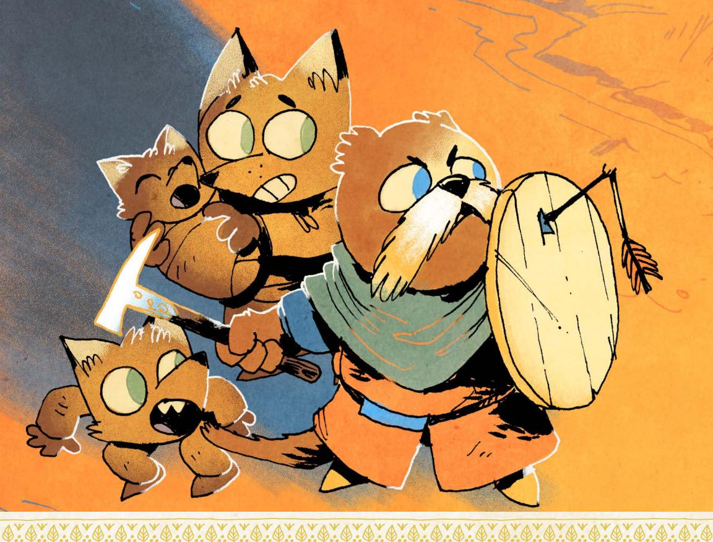

{0}------------------------------------------------

{1}------------------------------------------------

# Ruins & Expeditions

Design: Elizabeth Chaipraditkul, Brendan Conway, Coyote Crow, Mark Diaz Truman, Karington Hess, Monte Lin, and Alexi Sargeant

Writing: David Castro, Elizabeth Chaipraditkul, Brendan Conway, Coyote Crow, Mark Diaz Truman, Sasha Goldstein, and Monte Lin

Developmental Editing: Elizabeth Chaipraditkul, Brendan Conway, and Mark Diaz Truman

Copy Editing: Kate Unrau

Layout: Miguel Ángel Espinoza & Elizabeth Chaipraditkul

Additional Layout: Mark Diaz Truman

Art: Kyle Ferrin

Art Direction: Marissa Kelly

Proofreading: Katherine Fackrell

Root Board Game Design: Cole Wehrle

Root Board Game Graphic Design & Layout: Cole Wehrle, Kyle Ferrin, Nick Brachmann, and Jaime Willems

Root Board Game Concept: Patrick Leder

Root: The Roleplaying Game text and design @ 2019-2025 Magpie Games. All rights reserved. Root: A Game of Woodland Right and Might @ 2025 Leder Games. All rights reserved. Leder Games logo and Root art TM & @ 2017-2025. All rights reserved.

Special thanks to Meguey and Vincent Baker for creating Apocalypse World, the Leder Games team for allowing us to play in their brilliant world, and the more than 4,000 Kickstarter backers who made this book possible. We are humbled by your collective encouragement and support.

{2}------------------------------------------------

# Table of Contents

| Ruins & Expeditions1                    |
|-----------------------------------------|
| Greetings, brave explorer! 3         |
| New Factions5                           |
| The Hundreds6                           |
| The Keepers in Iron11                   |
| Revised Woodland Setup15                |
| Faction Phase:                          |
| The Hundreds 20                      |
| Faction Phase:                          |
| Keepers in Iron25                       |
| New Moves  29                     |
| & Skills  29                      |
| New Weapon Skills30                     |
| New Reputation Moves  33          |
| New Drives38                            |
| New Natures 40                       |
| New Connections 42                   |
| New Species Moves45                     |
| New Species Abilities 49             |
| New Equipment  51                 |
| New Tags 53                          |
| New Pre-Made Equipment58                |
| New Playbooks 65                     |
| The Dealer67                            |
| The Gourmand73                          |
| The Hunter77                            |
| The Nomad 81                         |
| The Orphan85                            |
| The Scourge  89                   |
| Beneath the Surface93                   |
| Ruins & Relics 97                    |
| The Ancients 98                      |
| Adding Existing Ruins to the Map 101 |
| Discovering New Ruins101                |
| Diving Deep Into the Ruins104           |
| Creating the Ruins109                   |
| Random Ruin Generation111               |
| Random Ruin                             |
| Layout Generation112                    |
| Portraying the Ruins113                 |
| Relics115                               |

| Monsters of                 |     |
|-----------------------------|-----|
| the Woodland121             |     |
| Creating Monsters144        |     |
|                             |     |
| Clearings of                |     |
| the Woodlands147            |     |
| Longbarrow Crag             | 149 |
| Description149              |     |
| Conflicts150                |     |
| Important Residents155      |     |
| Important Locations160      |     |
| Special Rules               | 161 |
| Introducing the Clearing162 |     |
| Pricklegrass Marsh          | 164 |
| Description164              |     |
| Conflicts165                |     |
| Important Residents170      |     |
| Important Locations         | 175 |
| Special Rules176            |     |
| Introducing the Clearing178 |     |
| Ricklebell Falls180         |     |
| Description180              |     |
| Conflicts181                |     |
| Important Residents186      |     |
| Important Locations190      |     |
| Special Rules               | 191 |
| Introducing the Clearing    | 191 |

{3}------------------------------------------------

# Greetings, brave explorer!

Ruins & Expeditions is the second supplement for Root: The RPG, a pen-andpaper tabletop roleplaying game based on Root: A Woodland Game of Might and Right, a board game designed by Cole Wehrle and featuring art from Kyle Ferrin. In Root: The RPG, you and your friends take on the role of vagabonds, rogues of the Woodland who act as something between knaves and heroes as they travel from clearing to clearing taking on jobs to make ends meet.

In this new supplement, you'll find a radical expansion to the world of Root new factions, new mechanics, new character types, and brand new rules for exploring the ruins all over the Woodland. In addition, you'll also find rules for introducing monsters to your game of Root: The RPG, enormous beasts that pose a threat to even the toughest vagabond.

You do need to know how to play Root: The RPG to make use of this book! In fact, you'll need a copy of both the Root: The RPG core book and the first supplement, Travelers & Outsiders, to make full use of this book in your game.

{4}------------------------------------------------

Here's what you can find in Ruins & Expeditions:

- New Factions (Chapter I) adds two new expansion factions—the Hundreds and the Keepers in Iron—from the Marauders expansion for ROOT: A WOODLAND GAME OF MIGHT AND RIGHT, including descriptions of the faction as both a background faction and an intervening conquering faction in the War. In addition, this chapter also gives you tools to integrate both of the new factions into the faction phase.
- New Moves & Skills (Chapter 2) expands your game by introducing new weapon skills, reputation moves, drives, natures, connections, and species moves. All of these mechanics are easy to introduce to your game, building on existing systems to give your players new options!
- New Equipment (Chapter 3) offers dozens of new tags alongside new pre-made weapons, armor, and other gear. All of these tags (and equipment) are easy to integrate into an existing campaign, allowing players to have lots of options for making their new equipment great.
- New Playbooks (Chapter 4) adds six new playbooks to Root: The RPG including the Dealer, the Hunter, the Orphan, and more. Each of the playbooks comes with a full set of mechanics alongside instructions for how best to play the playbook, notes on each playbook's moves, and GM advice for how to support the playbook during play.
- Ruins & Relics (Chapter 5) expands the rules for including ruins in Root: The RPG, including mechanics for adding ruins to the map, discovering new ruins, and exploring the ruins in greater detail than ever before! In addition, this chapter also includes the history of the Ancients, the mysterious culture—now vanished—that originally built many of the ruins found dotting the Woodland. Finally, this chapter also gives rules for relics, the unique items of the Ancients.
- Monsters of the Woodland (Chapter 6) adds giant beasts to Root: The RPG, titanic threats that offer even the toughest vagabonds a real fight. The chapter includes ten fully illustrated monsters that can be included in any campaign, as well as specific rules for creating your own monsters, including special monster traits and instincts to bring them to life in your game!
- Clearings of the Woodland (Chapter 7) features three new clearings focused on the new expansion factions, the ruins, and monsters—
   Longbarrow Crag, Pricklegrass Marsh, and Ricklebell Falls. These clearings offer unique opportunities to pit vagabonds against incredible ruins, dangerous monsters, and both the Hundreds and Keepers in Iron!

Finally, you can find the playbooks and other Root: The RPG materials for print at www.magpiegames.com/root. Enjoy your time in the Woodland!

{5}------------------------------------------------

{6}------------------------------------------------

5.22

he many factions of the Woodland War covered in Root: The RPG and Travelers & Outsiders are not the only factions one might find in the Woodland. While the traditional struggle

between the Marquisate, Eyrie Dynasties, and Woodland Alliance might dominate most tales of the Woodland War, your version of the conflict can include any combination of factions—even a combination that contains none of the factions found in the core book. This chapter offers two new factions and gives guidelines for including them in existing games and new games alike!

The **Hundreds** are a mob of angry discontents, led by a terrible demagogue—the Lord of the Hundreds—against the established (or remaining) powers of the Woodland. The Keepers in Iron are a noble order of knights, committed to discovering and securing relics they find scattered across the Woodland in the dark forests and deep ruins.

This chapter offers instructions for adding both factions to the Woodland map, then expands the faction roll (Root: The RPG, page 240) to include them and their various actions. For Gamemasters using the more complex faction phase system found in Travelers and Outsiders (page 184), this chapter also contains information on how both the Hundreds and the Keepers in Iron take actions during the faction phase.

Both the Hundreds and the Keepers in Iron are wonderful factions to add during play, reflections of how the Woodland might change as the conflict develops. In the event that you decide to add them after you've already begun play, you can still use the setup instructions to add their buildings and forces to your map of the Woodland.
