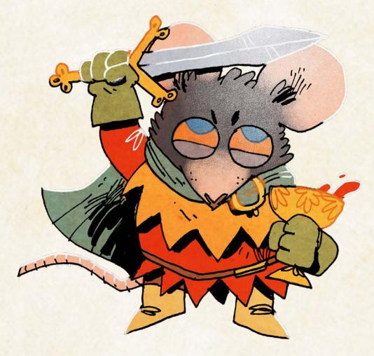

# The Nundreds

A terrifying mob of true believers, con artists, and opportunists, the Hundreds are a faction dedicated to the vision of a single demagogue—the Lord of the Hundreds. Calling upon all of the downtrodden and dispossessed of the Woodland, the Lord of the Hundreds has inspired a horde of denizens in the pursuit of "justice" against the other factions of the Woodland War. Some of the Hundreds might truly believe in that cause, but many understand "justice" to be a thin veneer that gives them cover to claim that the movement has some other goal than simply the accumulation of power. The Hundreds are thus a strange faction: they have almost no internal structure, no goals beyond pillaging and burning, and no clear ideology beyond power for power's sake.

{7}------------------------------------------------

#### The Hundreds in the Background

The first signs of the Hundreds in the Woodland were little more than whispers, rumors of a charismatic rat who was recruiting denizens with promises of "freedom" and "liberation" from the suffering of the War. Those who listened closely to the murmurings of discontent deserters and the tall tales of lonely bandits would inevitably come across such stories, all claiming that the rat was a uniquely gifted orator and leader, a balm for what ailed the Woodland and its endless War.

Was this rat a skilled con artist? A delusional dreamer? No one seemed to know. But those who claimed to have met the self-proclaimed "Lord of the Hundreds" said that the rat was alternately grandiose and bitter, winning over the crowd in one moment with fantastical promises…then stirring their worst hatreds in the next with obvious lies.

But no one knew where to find this rat. Or their name. This "Lord" remained a mystery, a shadow no one could quite pin down who led a movement that didn't exist.

And yet…roving bands of brigands began to wear a red rat insignia—the supposed sign of the Hundreds—and claimed to "serve a savior who will rise to free the Woodland" from the terrible injustice of the War. Worse yet, denizens driven out of clearings by the War began to paint the red rat in their refugee camps and shantytowns, telling all who would listen about "the true voice of the Woodland" who will one day punish the wicked. The movement had arrived… even if the rat himself continued to remain a mystery.

For most denizens, the Hundreds they meet appear as wild evangelists, followers of a dangerous demagogue who has enlisted ordinary denizens into a foolish cult that compels them to shout loudly about injustices. That said, the Lord's message is surprisingly influential; a fair number of denizens have packed their bags and set off to the Lord's new clearing to serve the Hundreds, moved to give up everything by the simplicity of the Lord's promise—the powers-that-be will suffer for what they have done to the Woodland.

In a strange twist, vagabonds who make a living seeking out artifacts and relics from unexplored ruins sometimes report running into poorly equipped members of the Hundreds who end up stranded or lost while looking for treasures they think will endear them to their new Lord. These mad expeditions can sometimes reach far away from the Hundreds' limited center of power, as denizens caught up in the fervor of an idea they barely understand latch onto a dangerous dream. Yet, even they don't know exactly where to find the Lord even if they did manage to get their hands on a relic worthy of his attention.

Chapter 1: New Factions 7

{8}------------------------------------------------

#### The Hundreds in the Woodland War

As mysterious as the Hundreds were when they first appeared in the Woodland, there is nothing subtle about their presence once the Lord of the Hundreds openly declares war against the other factions. The brigand bands that once wore insignias with unclear meaning, the dispossessed refugees drawn to the Lord's promises, the deserters and traitors who have nowhere else to go—all of them take up arms and throw themselves into marauding across the Woodland, overtaking nearby clearings and clashing with the other factions.

The Lord of the Hundreds rose up in just one clearing, easily driving out the controlling faction at the head of a mob that seemed to emerge from nowhere and declaring it to be a new day for the Woodland, an opportunity to reject the mistakes that had led to so much tragedy and suffering. According to the Lord, all those who wished to seek peace ought to join the Hundreds and together they would shatter their bondage and win a true freedom from the tyranny of selfish factions.

To show the Lord's power, all of the valuables in the clearing were gathered up and placed together, a Hoard that marked the Hundreds' collective influence and wealth. The Lord graciously accepted responsibility for the Hoard, ordering the Hundreds to seek out more valuables which could be added to it to inspire the denizens of the Woodland. "The time had come," the Lord said, "for those with power to fear those who have none." And so the horde set out to conquer all there was to conquer in the name of justice, freedom, and their Lord.

The Hundreds aren't a particularly organized or trained force—a few of them might have some military training or experience, but even they are unlikely to hold authority enough to manage the risen mass of denizens. What the Hundreds lack in skill they make up for in numbers and recklessness, throwing themselves against the barricades and garrisons of their targeted clearings until those defenses crumble under the sheer weight of the attack. Their fervor for their cause and dedication to their Lord make them a dangerous foe, willing to withstand losses that would force many dedicated military units of the Woodland War to retreat! Any who fall become new cause for retribution, spurring their fellows on even further…

Once a clearing has submitted (and the retreating faction has been purged), the Hundreds waste little time in pillaging anything they can find of value, taking gold, equipment, and other materials back to the Hoard, hoping to raise their status in the Hundreds by impressing their dear leader with the most precious trinkets and the most impressive artifacts. In just a few short days, anything worth adding to the Hoard is stripped and removed…and the Hundreds begin to look for the next clearing that could be conquered in the name of "freeing" the Woodland.

{9}------------------------------------------------

For the ordinary denizens who live in a "liberated" clearing, the initial raids are merely the beginning of their suffering. Once the Hundreds have their hands on a clearing, they actively oppress the denizens who live there, demanding more tribute and service to the Hundreds' cause. Most denizens already sympathetic to the cause of the Hundreds leave to join the mob long before the attack; those who are left bear no strong ties to the Hundreds' retributive drive, but fear and oppression are strong motivators. The conquered denizens willing to throw their lot in with the Hundreds—joining the mob in oppressing their neighbors and friends—are rewarded, and those who resist are either driven out, broken, or executed. Before long, the only unaligned denizens who remain in a clearing controlled by the Hundreds are those who are too impoverished, desperate, or foolish to get out.

Control of conquered clearings is largely overseen by those who have earned some degree of status with the Lord of the Hundreds—sycophants, true believers, and grifters who have convinced the Lord that they can be trusted to bring back the finest treasures to the Hoard. The Lord often grants these cronies with grandiose titles: "Liberator," "High Secretary," "Grand General," and so on. These "friends" of the Lord fight amongst themselves as often as they fight against the Hundreds' foes, constantly trying to position themselves as the most loyal… but often finding themselves expelled or executed when the Lord decides they might be a threat to his power.

# Strongholds

Over time, the clearings held by the Hundreds undergo a radical transformation; they cease to be ordinary towns and villages filled with the politics common to the Woodland and instead become a reflection of the Hundreds' intolerance and rigidity. Dissent is extinguished. Disloyalty is punished. Those who are able to leave try to escape to other clearings, and those who can't get out are forced to become complicit…or give up hope. Either way, the "freedom" promised by the Lord of the Hundreds never arrives.

The moronic lackeys and cruel scammers who are often put in charge of such clearings are usually pleased by the conformity and social collapse. After all, it's far easier to control a clearing that has no capacity for disagreement than one filled with raucous politics. Unopposed by any rival power structure, the leaders quickly impose huge "taxes" on anything brought into the clearing, round up and expel anyone they deem suspicious, and shut down every municipal service that doesn't help them keep control. Anyone who isn't serving the Hundreds has to struggle to stay on their feet.

{10}------------------------------------------------

The Hundreds call these oppressed clearings strongholds, an irony completely lost on them even as these clearings suffer in the face of chaotic food shortages and shrinking populations. While other factions might want to defend a clearing with strong walls and active garrisons, the Hundreds prefer their strongholds to be defended with rigorous social control, even if it means the clearing itself is greatly weakened. Often, other factions won't even try to take a stronghold; why bother conquering a starved clearing filled with nothing but true believers?

That said, the rabid devotion and despairing submission found in every stronghold is a hotbed for recruitment. Those denizens who stay tend to be actively supporting the Hundreds' cause, cowed into compliance, or benefiting through some other illicit method.

Whatever the case may be, these desperate souls are easily swayed into joining the Hundreds' larger forces. The leaders of strongholds are always looking for new loyalists, and often use the scarcities the strongholds face as opportunities to unite new forces to serve the cause, such as sending bands of Hundreds to steal the resources needed from other clearings. After all, nothing unites a mob like a target that can be blamed for their problems.

Despite all these challenges, the strongholds of the Hundreds are the center of the faction's political and social life. Most denizens who join the Hundreds live in and around strongholds, eager to be close to their brethren.

The Lord of the Hundreds, despite claiming to be a mighty warrior, is rarely found outside these strongholds. If a new Lord need be anointed, they would rise from one of the most established strongholds in the Woodland. In fact, it might have already happened; the individual bearing the title of Lord of the Hundreds is now practically yoked to the same forces he wielded, and he can be replaced with a new figurehead relatively easily if need be. His death would simply be more fodder for outrage.

{11}------------------------------------------------

# The Keepers in Iron

The Keepers in Iron are a stunning sight throughout the Woodland, wandering templars in ornate and magnificent armor seeking rare relics from an ancient age. Devoted to uncovering precious artifacts—primarily fragile figurines, mysterious tablets, and fantastic jewelry—the Keepers must delve deep in the darkest and most dangerous areas of the forest, discovering the ruins yet untouched by the denizens and their clearings (or diving deep into the ruins already known) in order to locate these lost relics. That said, lone knights who venture into the forest often don't return. It's not unusual for a Keeper knight to depart a clearing with a lead on a relic—and supplies for the trip—and never be seen again. The dangers of the deep forest and undiscovered ruins are great, and sometimes no amount of devotion to their cause can protect the Keepers from those lethal hazards. That said, there are few foes more formidable than an old Keeper in Iron, a survivor of multiple delves and expeditions.

# The Keepers in Iron in the Background

Denizens and vagabonds who grow close to the Keepers hear tales of "the Expulsion," a decree once laid down, ages upon ages ago, by the Woodland's then-powers-that-be that banished the Keepers in Iron from the Woodland, forcing them to wander for many years before finally returning. The disagreement that sparked the Expulsion is unclear—the Keepers' own records are vague at best—but nearly everyone agrees the Keepers were once a noble order serving the Woodland's political elites…only to find themselves betrayed by those very leaders when the Keepers' power and authority grew too great. To this day, it is rare for any Keeper to trust political elites—the memory of the Expulsion may have faded, but the betrayal itself feels like a fresh wound.

Since the start of the War, the Keepers, always reluctant to return to the Woodlands en masse, have begun to send a few of their order to see what can be learned about the relics they once protected. These lone knights must do their best to recover the artifacts they seek with limited resources—they lack the large retinue and reliable support that would be available if the Keepers moved into the Woodland as an order. Sometimes knights end up recruiting a group of vagabonds to accompany them as they delve into the forest, seeking new ruins to explore alongside the only other Woodland residents—the vagabonds—who can tackle the challenges of the forest itself; other times that means working on behalf of other factions—setting aside their distrust of elites and almost becoming vagabonds themselves—in order to supply and fund their arboreal ventures.

{12}------------------------------------------------

While some denizens view the Keepers as little more than mercenaries—soldiers of fortune working for the Woodland's warring factions in exchange for supplies and resources without much regard for the shifting political landscape of the larger war—those who get to know them are often struck by the intensity of the Keepers' reverence for the faction's larger goal…and for the relics themselves. The Keepers' mission isn't overtly fueled by a specific religious cause, but the passion with which they devote themselves to retrieving and safeguarding what is left of the ancient Woodland is one of their greatest strengths.

Many of the Keepers are badgers clad in the bulky armor for which the Keepers are famous, but their cause is open to any who would swear an oath to their order and undertake their charge. Of course, any denizen who takes up the Keepers' banner should expect to find arms and armor suitable to the difficult job of delving into the Woodland's forests to find the precious relics the Keepers seek.

# The Keepers in the Woodland War

Lone knights usually have little influence on the Woodland War…but the Keepers, as an order, can have a much greater impact. The full presence of the Keepers in Iron in the Woodland means they can hold clearings, win battles, and attract a large retinue of denizens loyal to their cause. Suddenly, the Keepers are more than knights-errant seeking individual relics; they are an inspiring force to which many denizens can devote their lives, even those who can only offer support as craftspeople, cooks, weavers, or cobblers. They become a faction to be reckoned with, one that could seize control of the whole of the Woodland and win the War.

In order to facilitate the work of so many denizens, the Keepers establish waystations in key clearings, temporary encampments that aid in the work of discovering, cataloging, and preparing the relics the knights seek through their delves. Unlike the workshops of the Marquisate or the bases of the Woodland Alliance, these waystations are kept mobile; the Keepers can break them down and move them to a new location, directing their retinue of loyal denizens wherever they need to go to best support the most important delves.

Structurally, the Keepers divide their forces into three groups: martial knights, commander knights, and sergeant knights. Martial knights are those who lead the Keepers' loyal forces, both into battle against the other factions and into the forest on delves. Commander knights are the administrators and leaders who are most often found directing the Keepers' work at the waystations. Sergeant knights are those who have fully joined the order, but more as support staff or ordinary soldiers; some rise to the level of banner knights, but such a promotion is rare. Alongside these knights serve a host of pages and squires, applicants to the order who have not yet been accepted as full knights themselves.

{13}------------------------------------------------

The shift from a loose collection of individual knights to an order waging war against the other factions of the Woodland War has a larger implication for the Keepers' work—at some point, the relics begin to matter less than the control the Keepers want to wield over the Woodland's clearings. Winning the Woodland War becomes a goal unto itself, and merely obtaining relics and sending them home isn't enough. The relics themselves are still deeply important—they motivate and focus the Keepers' work in the Woodland—but fighting a war means devoting the order to winning that War.

The Keepers own leadership caste doesn't agree on which reasons are dominant. Some claim that winning the war for the Woodland would give them an infinite amount of time to seek out relics. Others seem to view the Woodland itself as a kind of holy land, a place honored by the Ancients and their ruins. Still others believe that the purpose and mission of the Keepers should expand beyond simply obtaining relics to serving the actual denizens of the Woodland.

For at least some of the Keepers, however, the answer to the questions raised by their dedication to the War is simple: no one else can be trusted to lead the Woodland. The Explusion's scars—the years wandering outside the Woodland—linger and fester, pushing the Keepers to see themselves as the only true protectors of the Woodland's future. If they are not willing to step up and guide the Woodland to some sort of peace, who will?

{14}------------------------------------------------

# Relics

The relics the Keepers in Iron seek are not artifacts belonging to their own history. The intricate figurines, precious tablets, and stunning jewelry—alongside weapons sharper than any seen in the Woodland and armor crafted with uniquely light, yet hard, alloys—largely belong to a group they call the Ancients, a culture that predates virtually all of the existing factions and their cultural influence. The Ancients devoted themselves to crafting objects of true beauty, items whose worth is unmistakable and unique, capable of withstanding the stresses of time.

But the value of the relics doesn't reside in their historical value; the artistry and make is unparalleled, far beyond what any denizens could currently construct. Even with time and expensive tools, the crafters of the Woodland are unable to replicate relics—some secrets have been lost to time along with the Ancients themselves. On occasion, a particularly skilled denizen may create something similar, but there is no substitute for the methods needed to construct a relic of the Ancients.

If the Keepers have any religious ardor or fanaticism to their cause, it lies here, in their devotion to the Ancients—most see the Ancients as representative of a better, lost past. Their duty to find and protect the relics lives in this commitment to venerating a lost but noble history. The most forward-looking Keepers believe that perhaps by reclaiming these pieces, they might find their way to restore the greatness of the Ancients to the Woodland and beyond. The most traditionalist Keepers believe that they are simply stewards of a past that cannot be reclaimed, and all they can do is keep these relics out of the hands of lesser denizens.

The Keepers secret some relics away as soon as they are discovered—sometimes even quietly escorting them out of the Woodland—but they keep other relics as inspirational tokens or useful tools. It is hard for the denizens of a clearing to deny the power of the Keepers' cause when the knights display a breathtaking figurine they have recovered from a lost ruin; it is difficult to resist a Keeper siege when the knights have secured a relic drill strong enough to burrow through stone walls.

Of course, the Keepers aren't the only faction seeking relics. The other factions will happily bid immense sums to obtain a discovered relic…but they certainly won't commit their own soldiers to suicide missions into the ruins. Some might send vagabonds to find relics...but even vagabonds are cautious about the danger that lurks in the forests and deep ruins. Every vagabond knows of a vagabond who undertook such a journey and did not return…

On the whole, these relics are still dramatically rare. If they do arise in the hands of someone besides the Keepers, their bearers often refuse to sell; a true relic is often priceless, depending on its size, quality, and capabilities. When that happens, the Keepers often feel forced to take more drastic action to secure the relic for safekeeping…

{15}------------------------------------------------
