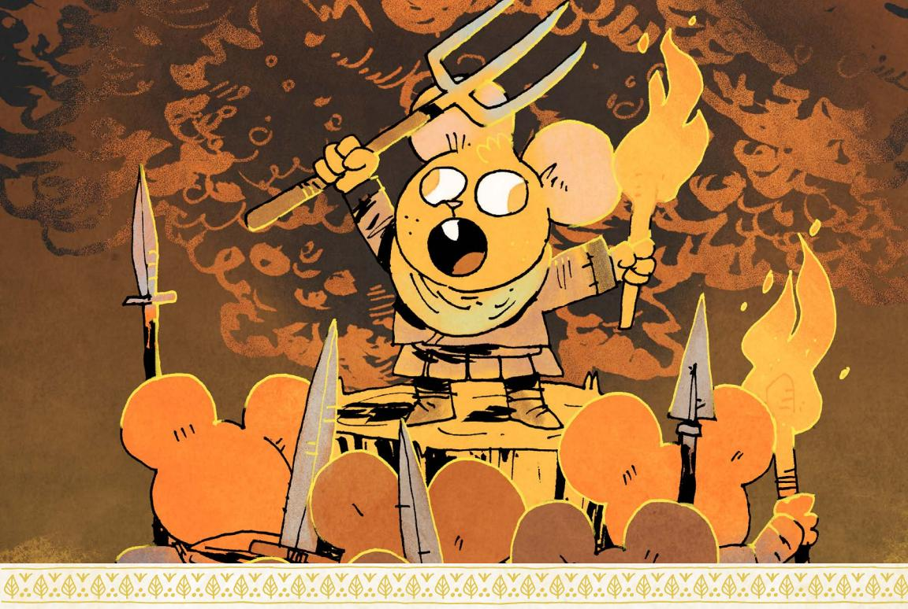
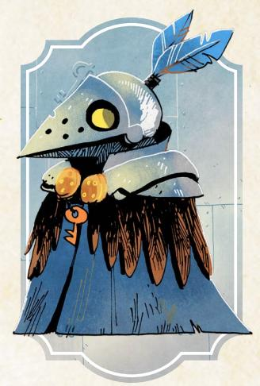
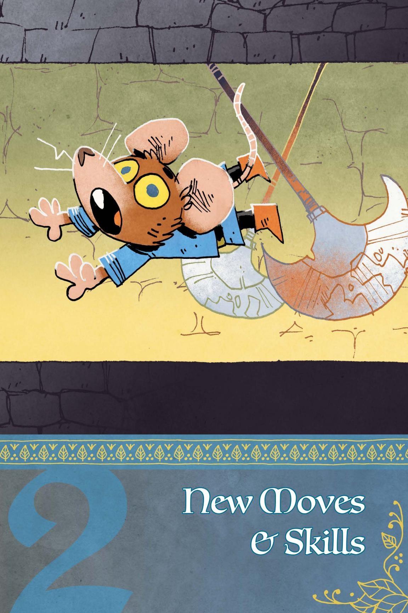

# Revised Woodland Setup

Here is the full order of all the factions during Woodland setup, including the two new factions—the Keepers in Iron and the Hundreds. Skip over any factions that aren't in play in your version of the Woodland.

You can find the rules for setting up all the base factions—Marquisate, Eyrie Dynasties, Woodland Alliance, and Denizens—on page 228 of the Root: Gbe RPG core book and the four expansion factions—Lizard Cult, Riverfolk Company, Grand Duchy, and Corvid Conspiracy—on page 179 of Travelers & Outsiders. Read on here for the rules for the new factions!

#### Revised Order

10

| # | Factions          |  |
|---|-------------------|--|
| 1 | Marquisate        |  |
| 2 | Eyrie Dynasties   |  |
| 3 | Woodland Alliance |  |
| 4 | Lizard Cult       |  |
| 5 | Riverfolk Company |  |
| 6 | Grand Duchy       |  |
| 7 | Corvid Conspiracy |  |
| 8 | Hundreds          |  |
| 9 | Keepers in Iron   |  |
|   |                   |  |

Denizens

#### Eighth: The Hundreds

The Hundreds begin play in a corner of the Woodland. If any of the other "corner-focused" factions in the game—the Marquisate, the Eyrie Dynasties, the Lizard Cult, or the Grand Duchy—are in play, they will likely have occupied some corners already. Choose a corner for the Hundreds using this rubric:

- If all corners are controlled by factions, choose a random alternative clearing that doesn't have a major base of any other faction, using the random clearing table (Root: The RPG, page 62).
- If 3 out of 4 corners are controlled by factions, the Hundreds begin with their stronghold in the fourth.
- If 2 out of 4 corners are controlled by factions, the Hundreds begin in one of the two unoccupied corners, chosen randomly.
- If I out of 4 corners are controlled by factions, the Hundreds begin in the opposite corner across the Woodland.
- If none of the corners are controlled by factions, then roll for a random corner using the Woodland Corner table (Root: The RPG, page 228).

The Hundreds add their presence, a mob, a stronghold, and warriors to their corner clearing. The Lord of the Hundreds is likely there, and the Hundreds as a whole have full control over the clearing.

For each remaining clearing, roll to see if the Hundreds have managed to score a foothold in that clearing with a mob of angry dissenters. Use the Mob Table for the roll.

#### Oob Table

| Choo Gable |                                                     |  |
|------------|-----------------------------------------------------|--|
| 2d6*       | Result                                              |  |
| 0–6        | No mob                                              |  |
| 7–9        | If controlled by another faction, place a mob there |  |
| 10–12      | Place a mob there                                   |  |

\*Roll (2d6 - the number of clearings between mob and the stronghold)

{16}------------------------------------------------

Each mob of the Hundreds means the following:

- The mob is centered around at least one leader, often a lieutenant of the Hundreds
- The mob is ready to begin to act and cause damage to the factions or ruling powers of that clearing

Other clearings might have the inklings of support for the Hundreds, but only the clearings with a mob are about to ignite to violence.

Finally, roll to see if the Hundreds have assembled any hoards in their clearings. There is always a hoard with a total Value of 30 located in the same clearing as the stronghold. For every other clearing with a mob, roll on the Hoard table. The presence of a Hoard indicates that the followers have gathered a substantial number of valuable items for the Lord.

#### Doard Table

| 2d6                                                                                                                                     | Result                                                                                                                                                                                                   |
|-----------------------------------------------------------------------------------------------------------------------------------------|----------------------------------------------------------------------------------------------------------------------------------------------------------------------------------------------------------|
| 0–6                                                                                                                                     | No hoard                                                                                                                                                                                                 |
| 7–9                                                                                                                                     | If there are any structures built by another faction in that clearing, destroy two (your choice) and create a hoard with value equal to 5 per structure destroyed. If there are no structures, no hoard. |
| 10–12 Destroy all structures built by another faction in that clearing. Create a hoard with equal to 10 plus 5 per structure destroyed. |                                                                                                                                                                                                          |

During the Denizens turn during setup, do not remove the Hundreds' stronghold or Hundreds' control of the stronghold's clearing.

#### Ninth: The Keepers in Iron

The Keepers in Iron always begin play with at least one waystation in a clearing with a ruin nearby. If you haven't added ruins to your starting Woodland map, do so now (see page 101 for how to add ruins to the Woodland map)!

Roll a random clearing using the Random Clearing Table (Root: The RPG, page 62). Starting there, trace the fewest paths to a clearing directly adjacent to a ruin. If there is a tie, split the tie by your choice or roll a d6 for each possible path and use the highest result (rerolling any further ties). Place the Keepers' waystation in that clearing; that is the center of their power in the Woodland so far. The Keepers may not control that clearing. Roll on the Keepers' Control table to determine if they have control of the clearing with the waystation.

Lastly, find the next closest ruin to the Keepers' waystation. Roll to determine if the Keepers have set up a second waystation in a clearing adjacent to that ruin, using the Second Waystation table. If so, place the waystation in the clearing closest to that ruin (rolling off for ties as you did with paths above). Then, use the Keepers' Control table to see if the Keepers have taken control of that clearing.

{17}------------------------------------------------

During the Denizens' turn in setup, you can remove Keepers' control of a clearing, but do not remove the waystation.

#### Keepers' Control

| 2d6   | Keepers in Control                                                                                 |
|-------|----------------------------------------------------------------------------------------------------|
| 2–6   | No                                                                                                 |
| 7–9   | Yes, if clearing uncontrolled by any other faction; no, if clearing already controlled |
| 10-12 | Yes                                                                                                |

#### Second Waystation

|       | 1                                                                                                                              |
|-------|--------------------------------------------------------------------------------------------------------------------------------|
| 2d6   | Second Waystation                                                                                                              |
| 2–6   | No                                                                                                                             |
| 7–9   | Yes, if they control the clearing with the first waystation; no, if they do not control the clearing with the first waystation |
| 10-12 | Yes                                                                                                                            |

# New Faction Roll Mechanics

Here is the simpler system from the core book, reprinted with all boons and moves including the new factions in this book and those from **Travelers** & Outsiders.

#### Faction Roll

When time passes, roll for each non-denizen faction. Start with the faction that controls the most clearings, then work down the list:

- +I if the faction operated unfettered by PC actions since the last roll
- -I if the faction has recently suffered a blow from the PC vagabonds
- ◆ -I if the faction controls the most clearings (and is thus a juicy target)

Add +1 if the faction in question controls the following:

- Marquisate: 5+ total clearings, workshops, sawmills, or recruiters
- Eyrie Dynasties: 2+ Roosts or 4+ clearings
- Woodland Alliance: 3+ sympathy or at least one base
- Lizard Cult: 2+ gardens
- Riverfolk Company: 3+ trading posts
- Grand Duchy: 2+ clearings and at least one market and one citadel
- Corvid Conspiracy: plots in 3+ clearings
- The Hundreds: Mobs in 4+ clearings
- Keepers in Iron: 2+ waystations

On a hit, the faction scores a victory; choose one minor boon. On a 10+, choose another minor boon—in the same clearing or another—or a major boon instead. On a miss, the faction suffers a defeat—it loses control of a clearing (returning it to the control of its own denizens); a fortification or structure (Roost, base, Marquisate building, garden, citadel, market, trading post, or other at GM's discretion); or a valuable resource.

{18}------------------------------------------------

#### **MINOR BOONS**

**Attack**: Take control of a clearing adjacent to one already controlled. If that clearing has fortifications, destroy those instead. If that clearing has no fortifications but has a Roost, a Woodland Alliance base, any Marquisate structures, or a Grand Duchy citadel or market, destroy all of those instead.

**Fortify**: Fortify a controlled clearing with defensive structures and more troops. The next time an enemy faction would take control of a fortified clearing, they only remove the fortifications instead.

**Obtain**: Gain a valuable resource from the forests, ruins, or a clearing. On the next faction roll, the faction takes +2 if it retains control of the resource.

**Establish cells**: Add sympathy to any two clearings. [Woodland Alliance]

**Stamp cells**: Remove sympathy from all clearings the faction controls. [All factions except Woodland Alliance]

**Build industry**: Construct one sawmill, workshop, or recruiting post in each of two different controlled clearings. [Marquisate]

**Begin/finish building garden**: Begin construction of a single garden in a clearing with Lizard Cult presence, or finish a garden begun on a prior faction roll. [Lizard Cult]

**Proselytize**: Add Lizard Cult presence to any clearing. [Lizard Cult]

**Conduct commerce**: Add Riverfolk Company presence to any clearing. [Riverfolk Company]

**Build trading post**: Construct one trading post in a clearing with Riverfolk Company presence. [Riverfolk Company]

**Connect tunnel**: Build a tunnel from the Burrow to any clearing, making it "adjacent" to the Burrow for the Duchy. [Underground Duchy]

**Build market or citadel**: Build a market or a citadel in a controlled clearing. [Underground Duchy]

**Expand network**: Add Corvid Conspiracy presence to up to two clearings adjacent to its presence. [Corvid Conspiracy]

**Enact plot**: Launch a plot in a clearing with Corvid Conspiracy presence. [Corvid Conspiracy]

**Stamp plot**: Remove all plots from all clearings the faction controls. [All factions except Corvid Conspiracy]

**Incite mob:** Add Hundreds Mob to any clearing adjacent to a clearing with a mob or Hundreds stronghold. [The Hundreds]

**Build hoard:** Roll 1d6 and divide by two, round up. Destroy that many structures from other factions, starting with non-fortifications and ending with fortifications if any are there, and create (or add to an existing hoard) a hoard of total value equal to that number times 5. If there are no structures from other factions, create (or add to an existing hoard) a hoard of value 5, representing spoils taken from the denizens of the clearing. Mark that clearing; the Hundreds cannot build a hoard there again until it has had time to recover. [The Hundreds]

**Quell mob:** Remove Hundreds Mob from one clearing the faction controls. [All factions except the Hundreds]

**Send cadre:** Add Keepers in Iron presence to any clearing. [Keepers in Iron]

**Move waystation:** Move a Keepers in Iron waystation to another clearing with Keepers in Iron presence. [Keepers in Iron]

{19}------------------------------------------------

#### **MAJOR BOONS**

**Revolt**: A revolt occurs in a clearing with sympathy; the Woodland Alliance gains a base there, taking control and removing all other faction structures. [Woodland Alliance]

**Build roost**: Add a Roost to a clearing the Eyrie controls without a Roost. [Eyrie]

**Capture**: Seize an important figure in an enemy faction; that faction takes -1 on all faction rolls while that figure is held captive.

**Rapidly build garden**: Begin and finish construction of a single garden in a clearing with Lizard Cult presence. Take control of that clearing. [Lizard Cult]

**Trade war**: Take control of a clearing with a trade post and add a trade post to an adjacent clearing. [Riverfolk Company]

**Culminate plot**: Bring a plot to fruition, giving the Conspiracy control over the clearing and either destroying or subverting all buildings and warriors in the clearing (as fits the fiction). The plot is not removed—it remains active (ongoing protection racket, ongoing extortion, etc.). If the Conspiracy loses control, the plot must be stamped out, lest it culminate in a new form. [Corvid Conspiracy]

**Wild uprising:** A full uprising occurs in a clearing with a mob and a hoard. The Hundreds gain control of that clearing, add warriors there, and remove all other faction structures and fortifications. The hoard is sent back to the stronghold of the Hundreds, reaching the destination clearing after time passes next. [The Hundreds]

**Establish waystation**: Add a Keepers in Iron waystation to a clearing with Keepers in Iron presence that doesn't already have a waystation. [Keepers in Iron]

**Discover ruins:** In a clearing with a Keepers in Iron waystation and presence with the fewest number of proximate ruins in the Woodland, the Keepers in Iron discover a new ruin likely to hold relics. Add a ruin to the map near that clearing. [Keepers in Iron]

Chapter 1: New Factions 19

{20}------------------------------------------------

# Faction Phase: The Hundreds

The Hundreds are a faction by virtue of their effect upon the Woodland, and their adherence to the credo of the Lord of Hundreds…but they're only a couple steps above a terrifying mob, in truth. They represent two things above all: extreme discontent with the factions and the state of the Woodland as a whole, and devotion to a figure acting as the avatar of that discontent. The exact structure of their faction, its specific beliefs, its leaders…all of it is subordinate to those two ideas. The intense feelings

at the heart of the Hundreds give them the momentum and strength of will to run across the Woodland and change everything…but those very same feelings also make them more akin to a dangerous wildfire than an organization.

# Portraying the Hundreds

The Hundreds' two drives are:

- ·*To topple the old, weak, and failing structures of the Woodland*
- ·*To commit quickly, fully, and dangerously to new and fast "solutions"*

The Hundreds' first drive corresponds with the first stage of their presence in any given clearing across the Woodland. This is the representation of their extreme discontent. The way things are doesn't work, the Hundreds say, and must be torn down. This drive only demands a target be some portion of "old," "weak," or "failing" to be worth toppling, which means nearly any existing power structure can easily become the target of the Hundreds' ire.

The Hundreds' second drive corresponds with the second stage of their presence in the Woodland, and represents their devotion to the Lord of Hundreds, this avatar of their discontent. After the existing order is torn down, the Hundreds do set themselves to building a new order…but any more involved discussion among them would prove that the Hundreds likely have no agreement on what the new order should be. Instead, they all simply agree to follow the vision of their Lord, which of course means following the vision of the Lord's lieutenants, whatever that vision might be. Rarely is that vision a thoughtful and long-considered structure.

{21}------------------------------------------------

The grievances of any individual member of the Hundreds are likely real. There are many, many reasons to be discontent in the Woodland, and many of those reasons tie directly to the structures and injustices of the existing Woodland powers. Make sure to give the members of the Hundreds their due credit; some of them might be power hungry or opportunistic, but some are justly upset with something in their lives…they just have no idea how to truly address the problem. So they commit to the destructive violence of the Hundreds, because at least something will change if they cast down all the powers of the Woodland.

There lives the biggest difference between the Woodland Alliance and the Hundreds. The Alliance is united by denizens rebelling against the factions in at least somewhat organized fashion, united by a vision of a free, better Woodland, even if they all disagree about how to achieve that vision. The Hundreds are united by discontent and chaos, by emotion barely directed through a tyrannical leader toward the cause of destruction and acquisition. The Hundreds have no real sense of a better Woodland, beyond one where the guilty are cast down, and the Lord of the Hundreds reigns.

Even given all that about the members of the Hundreds, the leadership is a different story. Those who rise up to the top of the Hundreds are rarely those with the best of intentions and the greatest of plans. They tend to be entirely willing to ride the emotions of the rest of the Hundreds, riling the masses up and directing their rage against targets of the leaders' choice. The Hundreds' leaders are usually fairly content lining their pockets with the spoils of destruction.

Such leaders also tend to be either the cronies of the current Lord, willing to kowtow and praise the Lord as needed; manipulative schemers who become indispensable to the Hundreds and the Lord, despite their distastefulness; or heroes of the Hundreds, lifted up on a tide of mass support…and unlikely to remain in leadership for long.

Attempting to stay in power within the Hundreds is a fool's errand—no one can ever predict where the angry mob will take them. Thus, the leaders of the Hundreds shift fairly often…including the Lord. If the PCs meet a Lord of the Hundreds, and then later in the same campaign try to meet with them again… they might find that the Lord of the Hundreds has been completely replaced, with no one in the Hundreds as a whole any the wiser! The position is as much a figurehead as it is a real, powerful leader, considering the Hundreds' anarchic structure.

{22}------------------------------------------------

# Elements of the Hundreds

The Hundreds are represented in the Woodland by four basic elements: the stronghold, mobs, hoards, and warriors.

The stronghold is the center of the Hundreds' power, the place where the Lord is most likely to rule from and perhaps the only real thing the Hundreds have built. Usually, they turn existing structures into their stronghold, but it is the one place in all the Woodland that will be hardest to dislodge them from.

A mob represents a group of angry, discontented denizens ready to spring to violence. The Hundreds do attract plenty of warriors: soldiers who desert their faction, bandits who are looking for an excuse to perform their banditry, etc. But mobs are defined by numbers, more than by skilled fighters—a dangerous group that can overwhelm any military force through sheer numbers. What's more, a mob usually represents the denizens inside the clearing, difficult to find and oust and capable of forming into a mass without warning. Mobs can destroy the very structures the other factions build up with ease, and can ultimately throw open the gates to the Hundreds.

A hoard reflects the Hundreds' practice of grabbing all the wealth and items of value they can, and then piling them all up. Creating a hoard is an assertion of the Hundreds' power—they are implicitly claiming that they can just take these things, and that the other powers can't take them back. Of course, it also means the Hundreds can pull from the hoard to supply their own efforts, though usually that is something that only the Lord of the Hundreds and their lieutenants will do. In the long run, the Hundreds expect to send every hoard back to the stronghold to be added to one giant stash there, though it can take some time to actually send the hoards along the Woodland paths. Hoards do have a Value associated with them which represents the general overarching worth of all the items collected there; use that Value if vagabonds manage to secure a hoard and plunder it. That Value is also referenced sometimes as the Hundreds spend Value. If the Hundreds should spend Value from a hoard and it doesn't have enough, they don't spend the Value and they do not perform the associated act.

The warriors of the Hundreds are like the soldiers of other factions, representing capable fighters who serve in the closest thing the Hundreds have to a structured organization. The warriors consist of anyone who wants to follow the Lord—bandits, deserters, converts and more—and who have the skills to fight at a level higher than the average denizen. Such forces might be able to face off against soldiers of other factions, but usually they're more important for securing final control of a clearing, after a mob has successfully damaged local power structures and created an opportunity.

{23}------------------------------------------------

#### The Hundreds Cycle

In general, the cycle of the Hundreds in any given clearing follows this pattern:

- 1. A mob arises in a clearing, damaging and eventually overthrowing the dominant powers of its clearing
- 2. The mob collects valuables they gather into a hoard.
- 3. Eventually, when the Hundreds have taken control of the clearing as a whole with their own warriors, they send the hoard back to the stronghold.

In all cases, however, it takes time for each event to happen; to ensure that a mob doesn't form, destroy its clearing, and send back a hoard all in the same period of time, the actual order in which you resolve the Hundreds' process is reversed.

When time passes, first, for each hoard in the Woodland, roll to see if the Lord of the Hundreds dispatches warriors to seize that clearing and secure that hoard. One at a time, roll 2d6 for each hoard in the Woodland except at the stronghold. Add +1 to the roll for any given hoard for every 5-value in that hoard. On a miss, the Lord of the Hundreds does not send any warriors to secure the clearing and the hoard yet. On a 7-9, the Lord of the Hundreds sends warriors only if the Lord's mood is Bitter or Lavish; otherwise, they send no warriors. On a 10+, the Lord of the Hundreds sends warriors.

If the Lord of the Hundreds sends warriors, deplete the size of the stronghold's hoard by 5-value for each clearing the Lord attacks. When the Lord of the Hundreds sends warriors to a clearing, they take control of that clearing, and send its hoard back to the stronghold…but that hoard will only arrive when next time passes, and is otherwise potentially vulnerable on the paths.

For each mob in the Woodland, roll to see if it causes damage and collects a hoard. Roll 2d6. On a miss, nothing happens. On a 7-9, the mob causes damage; roll 1d6 and divide by two (round up). The mob destroys that many other structures in the clearing, starting with non-fortifications. For each destroyed structure, the mob adds 5-Value to the local hoard. On a 10+, the mob destroys all structures in the clearing, including fortifications, and adds 5-Value for each to the local hoard.

{24}------------------------------------------------

If, in either case, there are no faction structures remaining in the clearing, the mob lays waste to the clearing, destroying its own infrastructure and adding 5-value to the local hoard. No fortifications or structures can be constructed in the clearing until it has had time to recover. A mob in a clearing that has not yet recovered from being laid to waste will no longer roll to add to the hoard or cause damage in its clearing.

Lastly, the GM determined if new mobs form anywhere else in the Woodland:

Pick the two clearings without a mob, and with the highest level of turmoil (GM's choice). Roll 2d6 for each. On a miss, nothing happens. On a 7-9, a mob forms there if the clearing is controlled by a faction. On a 10+, a mob forms there.

# The Lord's Mood

The Lord of the Hundreds is moody and capricious, and their mood can have an effect on what the Hundreds do as a whole. The Lord's mood will change if the Lord is replaced, or whenever time passes. After resolving mobs, hoards, and warriors, roll 1d6 (+1 per 10-value at the Lord's stronghold) to see what the Lord's new mood is, and the effect of that mood.

#### Lord's Mood

| Results | Mood                                                                                                                                                                                                                                                              |
|---------|-------------------------------------------------------------------------------------------------------------------------------------------------------------------------------------------------------------------------------------------------------------------|
| 1       | Bitter–Before resolving mobs, hoards, and warriors, roll 1d6 for each mob. On a 5-6, they become warriors and seize control of their clearing. Also, sends warriors on a 7-9 instead of a 10+.                                                              |
| 2–3     | Relentless or Wrathful–Before resolving warriors, the Lord of the Hundreds automatically dispatches warriors to seize the largest hoard in the Woodland without depleting the stronghold's hoard.                                                           |
| 4–5     | Grandiose or Jubilant– Before rolling to place new mobs, add a mob to two random clearings in the Woodland.                                                                                                                                                    |
| 6+      | Lavish–Before rolling to send warriors, spend 15-value from the stronghold hoard to automatically send warriors and seize the closest uncontrolled clearing to the stronghold (ties broken by GM's choice). Also, sends warriors on a 7-9 instead of a 10+. |

{25}------------------------------------------------

# Faction Phase: Keepers in Iron

The Keepers in Iron are a fairly insular organization, with their own specific goals, codes, and means of action. As an organization, they aren't usually all that interested in the clearings and the denizens, let alone the War. They're actually closest to the Riverfolk Company in how they play into the overall Woodland; a powerful force that can be an "addition" to a clearing, coexisting alongside other structures as they pursue their own goals. They usually don't actually seek control or dominance

over the clearing, except insofar as it is a means to getting what they actually want: relics. But the tension in their faction orbits their potential to act; if they did choose to become involved, they could change the course of the Woodland.

#### Portraying the Keepers in Iron

The Keepers' two drives are:

- ·*To obtain as many of the Ancients' relics as possible*
- ·*To keep to their own codes of law, duty, and honor*

The Keepers' first drive is the most obvious—they pursue relics and seek power in areas where relics are likely to be found. They send out their own cadres of armored Keepers to scout out new relics across the Woodland, or to secure relics deep inside dangerous ruins. They pay high prices to obtain relics from those who've already secured them from ruins, and when a deal isn't possible, they wield force to grab those relics. For any given Keeper, a relic is the highest value item they could obtain, and usually they're willing to sacrifice other ends to gain a relic.

The Keepers' second drive is the binding force that keeps them from razing the Woodland...and a set of ideals likely to embroil them in the Woodlands' affairs. The Keepers are not so devoted to their purpose that they will do anything to obtain their relics; they have knightly codes of conduct and structure that guide their actions. While Keepers use force to take relics from unworthy holders who won't sell, they try to come to a peaceable solution first. They are barred from wielding their strength in arms against the meek. They are bound to honorable treatment of others, including avoiding deception and guile wherever possible. All of this adds up to a strict hierarchy of behaviors that constrains what the Keepers are willing to do to accomplish their goals.

{26}------------------------------------------------

As an institution, the Keepers are a tightly knit order of oaths and fealty, now caught between these two impulses. Older, more established Keepers generally seek relics and wish to remain apart from Woodland affairs as much as possible; they would deem themselves victorious if they took all the relics from the Woodland and then departed. Many younger Keepers—especially those who did join the organization from the Woodland—do not see the situation quite as cleanly. They believe that the Woodland is the old home of the Ancients, and the relics buried under its earth will never be fully excavated. The only way to truly obtain all the Ancients' relics is to occupy the Woodland as a whole, resolve its war and take control.

What's more, these reformers and upstarts within the Keepers see their faction as having a duty in honor to stop such unnecessary, needless conflict across the Woodland. The Keepers, they claim, do not simply want to obtain relics just to have them. They seek relics to preserve and perhaps even restore the greatness of the Ancients' world—and that implies a duty to the world they currently live in. The Keepers can't simply remain purely aloof and separate; they are obligated by honor to become engaged.

In short term play, the Keepers are fairly easy to use; if a relic is in play, or a ruin is nearby, the Keepers are likely close in some form. They might hire the vagabonds, pay for a relic, compete with the vagabonds to investigate a relic, or more. You can always bring the Keepers into a conflict by just introducing a relic.

In long term play, however, the conflict within the Keepers in Iron as a whole is the key to presenting them as an interesting faction with complex motivations. The Keepers who pursue only relics might eventually perform terrible acts in pursuit of relics—exhibiting a willingness to overturn the Keepers' other codes and laws if the possible reward is more relics. Other Keepers will focus on the Woodland. At their best, this can manifest as concern for the denizens, an attempt to defend them and protect them from the ravages of the War. At their worst, this becomes a tyrannical drive to take control of clearings that cannot protect or govern themselves, forcing them to serve only the will of the Keepers.

In practical terms, don't worry about tracking every single relic the Keepers have. Assume that at any given time, they as a faction have many relics held in their waystations and with their cadres. Relics make great pieces for stories, but they aren't a resource for the Keepers; the Keepers generally will avoid using the relics in favor of keeping them safe. There is no point at which the Keepers will "have all the relics" of the Woodland; there are always more to find amid ruins and vaults. You can see examples of relics that you can add to your Woodland—or use as an example for constructing your own relicts—on [page 115.](#page-115-1)

{27}------------------------------------------------

#### Delving for Relics

When time passes, every waystation sends a cadre of Keepers into the nearest adjacent ruins to seek relics.

For each ruin the Keepers send at least one cadre toward, roll 2d6 and add +1 for each cadre sent there past the first. On a miss, the Keepers are lost to a danger of the ruin or a threat encountered along the way. On a hit, the Keepers delve into the ruin and return with a relic. On a 7-9, the Keepers encounter serious danger; if there were multiple cadres, then all but one are lost, and the waystations corresponding to the lost cadres are also lost. If there was only one cadre, then it brings a threat back from the ruin to the clearing in which its waystation was located; that waystation cannot move or seize until the threat is dealt with. On a 10+, the Keepers delve into the ruin and return to their waystation(s) without issue.

# Seizing Clearings

After delving, any waystations that did not lose at least one cadre and that are not pinned down by a threat might try to seize control of their clearings if they don't already have it.

For each such waystation, roll 2d6 with the following modifiers:

- +I if a faction other than the denizens is in command of the clearing
- +I if the faction in command of the clearing is weakened in any way
- -I if the faction in command of the clearing has a strong position
- -I if the faction in command of the clearing isn't opposed to the Keepers presence in the clearing
- -I if there is no ruin adjacent to the clearing
- -I if the waystation moved to the clearing when last time passed

On a 10+, the Keepers seize control of the clearing through brute force. On a 7-9, the Keepers embroil the clearing in a struggle for control; if the opposing faction does not respond or the vagabonds do not interfere, the Keepers will seize control when time passes. On a miss, the Keepers do not attempt to seize control and try to remain neutral toward the other factions and powers of the clearing.

{28}------------------------------------------------

#### Waystations

After the Keeepers in Iron delve, waystations might move. A waystation cannot move, however, if it has been pinned down by a threat it pulled from a local ruin!

For each waystation, roll 2d6 with the following modifiers:

- +I if the waystation recently secured a relic
- +I if another non-denizen faction is in control of the clearing
- -I if the Keepers are in control of the waystation's clearing
- -I if active conflicts exist between the Keepers in Iron and other factions

On a miss, the waystation does not move. On a 7-9, the waystation moves if there is any other waystation adjacent to the same ruin as it; otherwise, the waystation remains where it is. If it moves, it moves to the closest clearing adjacent to a different ruin. On a 10+, the waystation moves to the closest clearing adjacent to a ruin, even if it is the same ruin. If at all possible, it moves to a clearing that it has not yet moved to.

Waystations take all Keepers presence in their clearing with them when they move, adding presence and the waystation to the new clearing. New waystations are rare, but they can be added to the map as more ruins and relics are found.

Every time a new relic is delivered to a faction or a new ruin is discovered, roll 2d6. On a 10+, add a new waystation. On a 7-9, add a new waystation only if there are 1 or fewer waystations. On a miss, don't add a new waystation.

{29}------------------------------------------------

{30}------------------------------------------------

oth Root: The RPG and Travelers & Outsiders offer more than a dozen different roguish feats and Reputation moves, new weapon skills and species abilities, and much, much more.

Altogether, they offer plenty of options to play a full campaign and to develop PCs in many different ways. But having still more options for development, for specific options and abilities, allows you to tailor your campaign to exactly your needs!

In this chapter, there are:

- · New weapon skills, all of which exist to supplement those in the core book and which follow the same overarching rules.
- · New Reputation moves, some of which give you more options in general, and some of which give you faction-specific moves.
- · New drives, any of which can be swapped in with the drives on a PC's playbook using the end of session move (page 130 of the core book).
- · New natures, any of which can be swapped in with the natures on a PC's playbook using the end of session move (page 130 of the core book).
- · New connections, any of which can be swapped in with the connections on a PC's playbook using the end of session move (page 130 of the core book).
