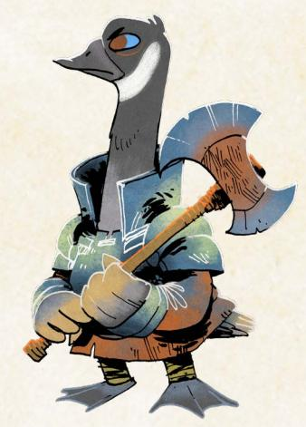
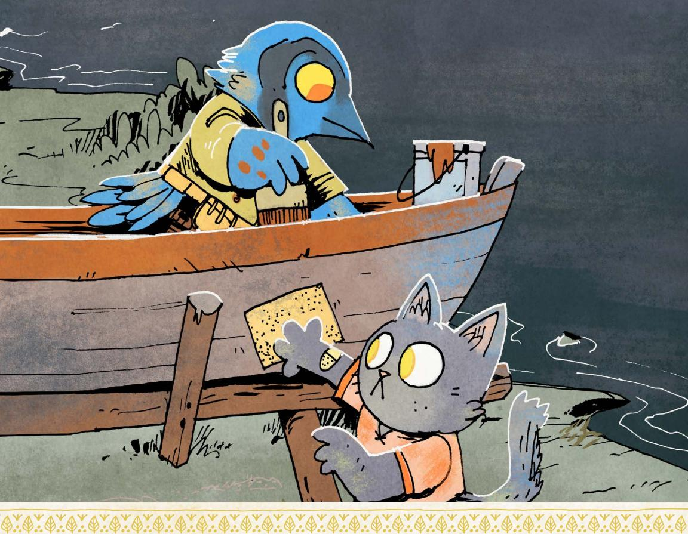
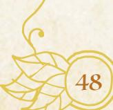
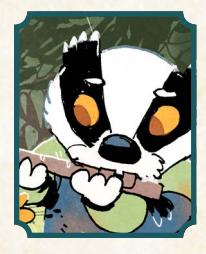
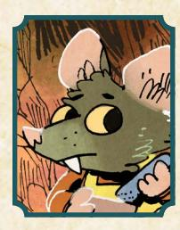
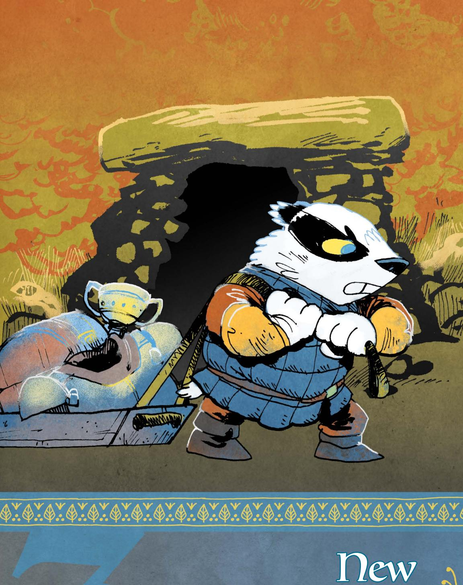
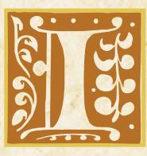
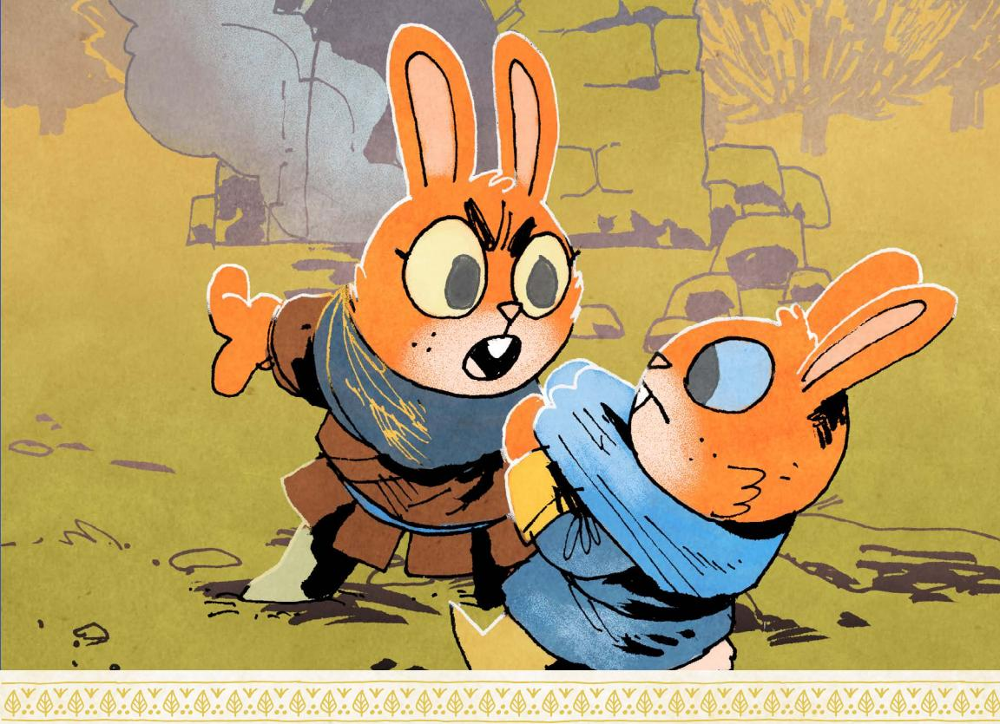
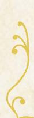
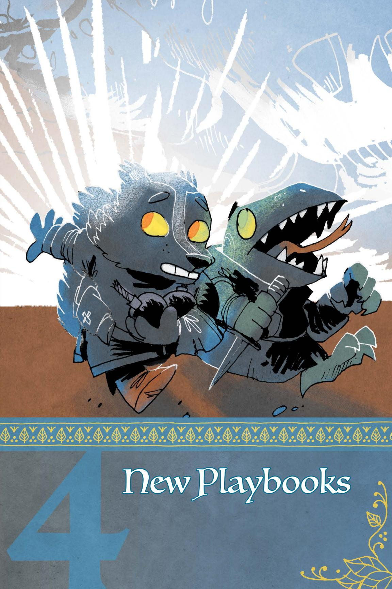

# **New Weapon Skills**

These weapon skills in general follow the same rules as weapon skills in the Root: The RPG core book (page 89). In order to use one of these skills, you must have learned the skill (recording it on your character sheet), usually by advancing; you must have a weapon tagged with the skill; and you must be able to trigger the move as appropriate within the fiction.

If a move includes the "no tag required" label, you do not need a weapon with the tag in order to use the weapon skill. Moves like surprise jab or frightful flourish don't require a weapon tag because they either don't rely on the weapon or can be used with any weapon.

さい命し、このでは命し、このでは一命し、この

{31}------------------------------------------------

#### Sweep **special**

When you *sweep your bow at an enemy or group of enemies at close range* (even with a bow not tagged with close range), mark exhaustion and roll with Finesse. On a 7-9, you succeed; they scatter and fall back a range, creating an opportunity for you or your allies. On a 10+, pick one as well:

- · they stumble and slip, buying you more time
- · they crash into each other; inflict 1-injury
- · they are frightened or dismayed; inflict 1-morale harm

You turn suddenly toward the soldiers pursuing you, swinging your longbow wildly to push them away from you. You're *sweeping* your bow!

*Sweeping* scatters your foes when they get too close, forcing them back to a range that's more advantageous for your weapon. The bow itself has to be hefty enough to scare them—it must still be tagged with the *sweep* weapon skill—but *sweeping* sets you up to shoot them with the bow once you've got them at a better range.

Of course, whipping a bow around to drive back your enemies is tiring! You can only keep your foes at bay for so long before you run out of exhaustion.

#### Pommel Strike **special**

When you *deftly use the enlarged pommel of your weapon to strike an enemy at intimate range* (even with a weapon not tagged for intimate range), roll with Luck. On a hit, they mark 2-exhaustion. On a 10+, they must also pick 1:

- · you seize an advantageous position in the fight
- · you shake their confidence; inflict 1-morale harm
- · you knock them off-kilter; their next blow does -1 harm

Your enemy pushes in close, their knife gleaming...and that's when you bring the pommel of your hammer down on their face. You're using *pommel strike*!

*Pommel strike* gives a weapon that normally wouldn't work at intimate range a way to strike opponents who get close. The weapon has to have a pommel sturdy enough to do real damage, but it's likely your foe won't see it coming!

If you roll a 10+ while using *pommel strike*, you have to seize the moment to take advantage of your advantageous position or your foe's weakness; if you walk away or ignore them, they'll have enough time to recover.

{32}------------------------------------------------

#### Frightful Flourish **special no tag required**

When you *flourish your weapon in a fanciful and terrifying way when you engage a new enemy*, roll with Charm. On a hit, your new opponent suffers 2-morale harm as you demonstrate your battle prowess, but you must mark an exhaustion as you over-exert yourself in the frightening performance. On a 10+, your martial display only bolsters your resolve; you do not mark exhaustion.

You step over the body of a felled foe toward a new oppoenent, swinging your bloody mace above your head as you glower. You're using *frightful flourish*!

*Frightful flourish* can be used with any weapon; it's much more about your skill and panache in the moment than whatever armament you're wielding. You can only use it, however, as you engage a new foe, showing off what you can do with your weapon before you cross swords. Often, a *frightful flourish* is all you need to send weak foes running...

#### Surprise Jab **special**

When you *strike with a surprise weapon at intimate range*, mark exhaustion and roll with Finesse. On a hit, inflict your weapon's harm. On a 10+, pick 3. On a 7-9, pick 1.

- · you inflict serious (+1) harm (you may pick this option multiple times)
- · your enemy must mark 2-exhaustion or drop what they are holding
- · you seize something vulnerable from them (item, position, etc.)

You pull a small dagger from your boot, fiercely slashing at a mighty enemy who doesn't expect your attack. You're using *surprise jab*!

While many vagabonds are capable of blindsiding opponents with a roguish feat, it's hard to catch someone by surprise when you're in the middle of a fight. *Surprise jab* covers those moments where the weapon itself is a surprise—a hidden dagger, a concealed crossbow, etc.

Note that once you've used *surprise jab* once during a fight, you'd have to hide the weapon to use it a second time with the same piece of equipment. Once your foe knows you have a small wrist crossbow up your sleeve, they tend to be ready for you to use it!

{33}------------------------------------------------

# New Reputation Moves

These moves supplement the Reputation moves included in the Root: The RPG core book on page 111. They still all have a Reputation requirement, meaning that you cannot use these moves at all unless your Reputation with the appropriate faction is at the correct level.

#### Forge Resistance **REQUIRES REPUTATION +2**

When you *promise to lead a group of downtrodden NPCs when they are faced with a frightful situation, desperate odds, or organized oppression*, roll with your Reputation for their faction. On a hit, they rally, finding new strength in your words; they coalesce into an appropriately-sized group that will follow you. On a 10+, a capable leader also emerges from the group to lead alongside you; they will tell you what you need to do to inspire them to lead on their own. On a miss, your attempt to hearten the downtrodden draws unwanted attention from their enemies, trampling the hope you wished to foster; mark 2-notoriety with those you tried to lead and brace yourself for their enemies.

As the armed soldiers invading Riverwest Reach march forward, you climb up on the roof of a building and promise to keep them safe in the fight to come. You're *forging resistance*!

*Forging resistance* is a move that allows you to turn your positive reputation with a group into a temporary position of leadership, a rallying cry that binds together a mob into a group that can follow your orders. In the event that you use them as a weapon, the GM can use the group rules to determine how much damage they do and how much harm they can take.

If you do whatever is necessary to inspire the capable leader who emerged from you *forging resistance* to act on their own in the future—like publicly support their role or kill off their greatest rival—you no longer need to lead the group yourself to keep it together. From that point forward, the new leader can keep the group together...but that doesn't mean they are always an ally. You'll have to maintain that relationship to ensure a group led by another stays on your side.

{34}------------------------------------------------

#### Call Upon The Enemies of Your Enemies **REQUIRES REPUTATION -3**

When you *spread word that you're looking for allies against a powerful foe in the area*, roll with your Reputation with that foe's faction, treating your Reputation as positive (+3) for this roll. On a hit, you discover powerful allies who are willing to help, but they're beset by their own internal squabbles. On a 7-9, you realize that your foe has eyes and ears amongst them; you risk exposing your new friends to serious consequences if you move them to action while the traitor is still active. On a miss, your foolish call for help leads you right into a trap set by your enemies.

You drop a few coins into a beggar's cup, asking if anyone around might be willing to help you deal with the Marquisate governor. As her eyes widen everyone knows the Marquis hates and fear you—you smile. You're *calling upon the enemies of your enemies*!

*Calling upon the enemies of your enemies* requires you to take a risk with an intensely negative Reputation; in order to find some support for taking on a powerful foe, you need to go around announcing that you're looking for help. You can be subtle about it—whispering in back rooms and obliquely asking about the power structure fo the clearing—but you have to be obvious enough that you stand a reasonable chance of finding the people you want to find.

But if you do find such allies, they are exactly the kind of help you need: powerful friends who can make a real difference. Of course, they might need some help themselves getting past their internal drama and figuring out a plan for taking on your mutual enemies.

If you *call upon the enemies of your enemies* and discover that there is a traitor in the midst of your new allies, it doesn't mean you know exactly who it is that's betrayed the group. You might have to do some work finding them—or convincing the rest of the group they aren't to be trusted when you do find them—but if you don't address the traitor before you move against your real foe, the consequences will be dire for your new friends.

{35}------------------------------------------------

#### Impress An Audience

**REQUIRES DENIZENS REPUTATION +2**

When you try to *impress a group of denizens with a tale of your folk heroism*, roll with Reputation with the Denizens. On a hit, they are suitably awed by your noble deeds; hold 1. You can spend that hold to have a plucky denizen step forward to help you in a useful way when you're in need of assistance. On a 10+, the denizen you call forward with your hold is important or particularly skilled. On a miss, hold 1, but the local denizens are so convinced of your heroism that they need you to help them with an urgent problem; agree to what they're asking of you or mark 2-notoriety and lose the hold.

As the local denizens of Pricklegrass Marsh gather around, you tell the tale of your fight against the mighty bear that once terrorized Blackpaw's Dam, hoping to dazzle them with your heroic deeds. You're *impressing an audience*!

*Impressing an audience* allows you to excite the imaginations of the denizens of a clearing, convincing them that you are more than just a simple traveler or cold mercenary—when you successfully *impress an audience*, you become a folk hero, a larger-than-life figure who inspires hope in the ordinary denizens of the Woodland.

Your tale of folk heroism needs to be inspiring! Stealing from the rich and giving to the poor, slaying terrible monsters, protecting the innocent—all the kind of things that would make the denizens stand up for you when you're in trouble. None of this has to be true, of course, but it needs to be compelling!

Note that i*mpressing an audience* only works for the denizens themselves, the ordinary people of the Woodland who aren't affiliated with one of the other factions in the Woodland War. You can't impress the Marquisate or Lizard Cult with your folk hero feats; those political factions aren't going to be swayed by your charming adventures.

The hold you generate by *impressing an audience* lasts as long as you're in the clearing; if you leave the clearing and return, you likely still have the hold, so long as the denizens might reasonably remember you. If you've been away long enough for the denizens to forget you, you'll have to *impress* them all over again.

If the denizens ask you to solve an urgent problem in the clearing, you have to work on it right away. If you say you'll do it, but you don't make any real progress, then you'll mark 2-notoriety and lose the hold when they figure out you were leading them on.

{36}------------------------------------------------

#### Incite a Mob **hundreds**

**REQUIRES HUNDREDS REPUTATION +2**

When you c*all upon a mob of the Hundreds to join you in razing a building or looting something valuable*, roll with Reputation with the Hundreds. On a hit, a small group joins you in your merry destruction, doing their fair share of the work until there's no more razing or looting to do. On a 10+, the group is larger (medium group) or especially devoted (two additional morale boxes). On a miss, your small group is poorly trained and of foul humor; they outstay their welcome with you and are impossible to control in any meaningful way.

You call for a mob of Hundreds to take the Governor's mansion—he can't oppress them if the building is burned to the ground! You're *inciting a mob*!

It takes only a little push for members of the Hundreds to turn to violence, and any vagabond with a high Reputation with the Hundreds knows how to push. *Inciting a mob* means that you're rallying any and all of the brigands around you to take immediate action, likely by reminding them of the opportunity they have to make a mess of things!

You have to at least give the appearance of rioting along with them to *incite the mob*—you can't send them off to burn things down without you. You can, however, slink away once the rioting is underway to crack open a safe or kill a particular noble, but the mob has to believe you're on their side for you to *incite* them!

If things go poorly, it's likely that the mob still loots and razes the target you designated...but they also don't follow your instructions or even see you as one of them. A mob unleashed in such a faction is likely a danger to you too...

{37}------------------------------------------------

#### Shepherd Relic **keepers in iron**

#### **REQUIRES KEEPERS IN IRON REPUTATION +2**

When you *request the Keepers in Iron grant you a relic to aid your cause*, roll with Reputation with the Keepers. On a hit, they offer you a relic you can use to pursue your goals in the Woodland; the GM will tell you what the relic does and under what condition they will expect it to be returned. On a 7-9, pick 1. On a 10+. pick 3:

- · the relic can exploit a weakness of your enemy (or of an obstacle)
- · the relic strengthens your position with a powerful NPC, your choice
- · the relic can bolster your allies when working with you for the cause
- · the relic has properties that work in an unusually beneficial way

On a miss, the Keepers still offer you a relic—pick 1, as with a 7-9—but you must also agree to shepherd another item or person for them to a clearing of their choice.

You stand before a commander knight of the Keepers in Iron and ask for help holding off the Marquisate's forces in Elstone's Ridge. Surely they have a relic that can help you and your band? You're trying to *shepherd a relic*!

Those vagabonds who earn the trust of the Keepers in Iron sometimes get the opportunity to make use of their precious relics—majestic weapons, armor, and other tools of the Ancients that the knights have collected from across the Woodland. No two relics are alike, and each is a powerful force; they can turn the tide of a battle, inspire frightened soldiers, cleave through steel...and more.

The Keepers in Iron care more about the vagabond who is *shepherding the relic* than the specific cause. So long as you offer the Keepers a reasonable motive for supporting you in your fight—and you have Reputation +2—they are likely to offer something fitting. They won't throw their support behind a clearly unjust cause or something that hurts their own interests, but they believe deeply in those who have earned their trust.

Of course, the Keepers in Iron have to have a relic nearby for them to offer it to you; you can implore a wandering knight to grant you such a gift, but unless they have a relic on them (or nearby), they can't give you one. It's far easier to request a relic from a waystation filled with knights!

Check out [page 115](#page-115-1) for more on the relics and their capabilities, including more on the Ancients and the kinds of relics they created..

{38}------------------------------------------------

# New Drives

Each of these four new drives functions exactly like the drives on the original playbooks (see the Root: The RPG core book, page 171, for more on drives). They represent ways for a vagabond to advance during the course of play. Any vagabond can swap to these drives using the session move (see the Root: The RPG core book, page 130). At the GM's discretion, a brand new vagabond character can be made using these drives instead of the ones on their playbook.

#### Diplomacy

*Advance when you aid in forging a treaty, diplomatic venture, or formal agreement between two (or more) conflicting groups.*

The War has torn communities apart, and vagabonds are often in a unique position—as outsiders—to help stitch them back together. Vagabonds engaged in diplomacy, however, need to do more than just talk; be prepared to put in extra muscle and legwork solving problems before you can build coalitions. You don't have to be a leader in this endeavor, just assist in some way. In your quest for peace, however, remember that the groups must be in some warm-to-hot conflict. Mild annoyance or petty hatreds aren't enough, so the groups have to be on the brink of blows, at least socially or economically. Lastly, the treaty, venture, or agreement has to be agreed upon in some kind of official way. It could be verbal with both sides present in a town hall, representatives sent to sign a document, or votes on both sides relayed to the diplomatic third party. The warring groups can be the Factions, warring families, a labor union versus an owner, or any large, influential body of denizens against another.

#### Dowser

*Advance when you help a clearing discover and claim a valuable natural resource.*

Clearings, while mostly self-sufficient, always need a means to expand or to save for lean times. The more replenishable resources a clearing possesses, the greater the clearing's chances of surviving a harsh winter, natural disaster, or invasion of hostile soldiers. Yet denizens tend to be too busy dealing with their own immediate needs to search the forest for resources. This is where vagabonds can be helpful! The natural resource has to be something found in the forest that isn't otherwise available to any other clearing (trees don't count, for example). It can't be claimed by another clearing either. It can be a hot spring, an underground river, a vein of ore, or even a rare fruit or berry patch. In other words, the resource must have the potential to change the fortunes of the clearing—a single chunk of iron isn't enough. Finally, note that you must delve into the forest to find these resources; you won't find what you're looking for on a well-worn path between the clearings.

{39}------------------------------------------------

#### Folklorist

*Advance when you prove a local folktale or legend true or false.*

Every clearing has its own stories of local flora, fauna, and phenomena that bring a chill or smile (or both) to adult and child alike. Who else but a vagabond can discover the truth behind these stories? While this drive overlaps a bit with Mysteries, you are more interested in things rooted in a clearing's history and thus in a clearing's identity. Denizens may be invested, too invested, in proving the folktale true or false, and some people may already know the truth and want it suppressed. Regardless, accomplishing the drive requires you to talk to the denizens, get their takes on the tale, and discover the importance it has to the clearing. That said, the folklore that interests you tends to be spooky, strange, and/or dangerous, otherwise where is the challenge? Lastly, the evidence you find must definitively prove things one way or the other; lack of evidence doesn't prove something didn't happen.

#### Guardian

*Advance when you protect a clearing from a large beast by defeating it or chasing it away.*

Whether you want a challenge, are tired of merely fighting bandits, or consider the larger beasts of the forest the greatest threat to denizens, you have chosen to confront these dangerous animals. The large beast has to be threatening the clearing, directly or indirectly. The beast could trample a needed crop or block an important trade route to another clearing, if not attacking the clearing itself. Note that "chasing it away" counts, as long as the beast won't return. This can include frightening it, luring it away to a more tempting target (hopefully not another clearing!), or harming it enough that it moves on to a different territory. Also, you can get help from your fellow vagabonds or the denizens as long as you lead the charge. Needless to say, it has to be an animal of some sort. A giant tree ready to topple over or a large band of bandits pretending to be a large beast doesn't count.

{40}------------------------------------------------

# New Natures

Each of these four new natures functions exactly like the natures on the original playbooks (see the Root: The RPG core book, page 49, for more on natures). They represent ways for a vagabond to clear exhaustion during the course of play. Any vagabond can swap to these natures using the end of session move (see the Root: The RPG core book, page 130). At the GM's discretion, a brand new vagabond character can be made using one of these natures instead of either of the ones on their playbook, but we recommend starting with the playbook-specific ones and changing as the character does.

#### Advisor

*Clear your exhaustion track when you help uplift an NPC to an influential or leadership position.*

A vagabond with this nature enjoys working in the background, letting others lead (and take the heat) while they support the leaders (and pull the strings) behind the scenes. To invoke this nature, you need a good eye for identifying a worthy candidate (or convenient patsy). However, to actually uplift an NPC, you have to actively push, campaign, convince, negotiate, manipulate, or threaten the right people to gain support and win them that leadership position. This doesn't require a formal voting process; as long as public opinion shifts just enough for the NPC to lay claim to the position, you have done your due diligence. Also, this NPC has to be someone who needs your help, whether they don't have the skills, the ruthlessness, or the desire to campaign. Jumping on the bandwagon for a fledgling leader who already has broad support doesn't count.

#### Charitable

*Clear your exhaustion track when you gift a valuable treasure to the leaders of the clearing.*

A vagabond with this nature has similarities to one with the Generous nature, but has less focus on basic charity and more on finding and gifting cultural, symbolic, and historical treasures. It's not only about the monetary value, specifically, and more about what the gift means to the leaders of the clearing; you need to understand their needs and wants and discover what they find valuable or significant. It could be a relic about the founding of the clearing, lost to the ruins or a stolen religious artifact or the rusted weapon of a fallen hero. It could even be an ancient written contract detailing the line of succession or voting laws. The phrase "leaders of the clearing" has some flexibility; it doesn't necessarily mean elected leaders and could include local community leaders, someone respected by the clearing, or even a rebel leader beloved by their followers.

{41}------------------------------------------------

#### Dove

*Clear your exhaustion track when you convince a hostile group to give up their fight and disband.*

A vagabond with this nature has witnessed the endless conflict and aftermath of the War and seeks to tamp it down, one skirmish at a time. You tend to intervene at any sign of hostility, seeking to de-escalate first and find permanent solutions later. A "hostile group" must be one ready to go to violence; if the vagabond doesn't step in, someone or something gets hurt or destroyed. In addition, a single angry individual doesn't count in this case; the dangerous mob mentally is key here, threatening to spill over into a larger conflict. "To give up their fight and disband" means you can't just cause this group to merely pause or even change targets. You have to get them to give up violence as the solution and then break up as a mobilized group, no longer motivated as a faceless mob. The anger can still be there, but the urge to destroy must end, at least for now.

#### Handy

*Clear your exhaustion track when you agree to help a clearing by repairing a much-needed tool or resource.*

A vagabond with this nature is helpful and crafty (or thinks they are). You might not be able to solve the factional violence or repair broken hearts and spirits, but you can at least repair a broken *thing* to make life easier. You need to mingle with the community first to figure out what they need and what was lost. While helping an individual is laudable, you need to agree to fix something the whole clearing needs. This also focuses on tools and resources the clearing once had, once depended on, which are now broken or inaccessible. This context doesn't include a resource forgotten or misplaced (since that fits more with the Dowser drive); otherwise, the community won't be able to tell the Vagabond what needs fixing. Examples include a fallow field that refuses to be replenished, a grain mill lacking maintenance, mining equipment broken down, or an abandoned well with tainted water.

{42}------------------------------------------------

# New Connections

These four new connections supplement the base connections used on every playbook (see the Root: The RPG core book, page 50). These new connections all function just as the base connections do, representing a relationship between two vagabonds. A connection is written on one vagabond's character sheet, and that vagabond is the one who makes the choices, triggers the moves, and otherwise most directly "uses" the connection. Vagabonds can swap in these connections during the course of play using the end of session move (on page 130 of the Root: The RPG core book). At the GM's discretion, a new vagabond's pre-written connections can be modified to use one of these.

#### Ex-Convict

*When you fill in this connection, you each mark 2-notoriety with one faction. When you read a tense situation, you can always ask "What is most valuable here?" for free, even on a miss. Both you and your connection get a +1 when acting on any of your answers.*

You and the vagabond with whom you share your connection have a sordid history with a specific faction. The crime you supposedly committed might be the source of your bond, or your punishment (or perhaps your evasion thereof) might be the reason for your connection. One or both of you might be falsely accused, or the crime might not be seen as a crime to denizens or the other factions. Yet one faction still sees you as a criminal. That said, the crime can't be something too heinous since the notoriety affects only one faction! It could have been fraud, theft, a violent interaction with a faction member, or a betrayal of faction secrets. Meanwhile, your imprisonment or evasion from the authorities has also given you a keen sense of survival and an eye for exploiting advantages. So when you *read a tense situation*, you automatically default to selfish opportunism. After all, society has failed you, so you have only yourself, and perhaps your connection, to depend on.

{43}------------------------------------------------

#### Loyalist

*When you fill in this connection, you each mark 2-prestige with the faction you once served together. When you ask for a favor from that faction, you may mark 2-exhaustion to take 10+ instead of rolling.*

You and the vagabond with whom you share your connection once served a particular faction well, and you still maintain strong relations with them. Your connection may no longer be in contact with the faction, or might not even like the faction anymore, but they are still in good favor with them. You, however, kept in touch with the faction, even while you resisted recruitment (or if you *once* belonged, resisted rejoining.) You might agree with the faction's goals or simply see them as useful contacts and clients. And even though you aren't a part of that faction anymore, you and the other faction members still have a friendly, mutual bond. In addition, whatever you did for the faction was big enough to earn you a reciprocal kind of loyalty. As such you can navigate the bureaucracy or social niceties to get their help by leveraging that social debt, even if it takes some effort.

#### Refugee

*You and your connection are from a clearing that no longer exists. You both share a common cultural practice; when you mark depletion to practice it publicly, a local denizen—either another survivor like yourselves or someone sympathetic to your loss—comes forward to offer you comfort and aid.*

You and another vagabond came from the same clearing, one that has since faded into memory. The clearing doesn't have to have died from a direct attack from the War; it could have suffered from plague, famine, migration, or another denizen-made or natural disaster. It could have even fallen apart some time ago, its denizens scattered far and wide, although most refugees are from communities whose memory is still fresh! Because of your history, you and your connection have a shared cultural understanding and actively keep the memory of the clearing alive through cultural practice. Such rituals should be done deliberately and out in the open, be it visual (like a prayer or portable symbol), audible (like an old folk song or hymn), or even olfactory (such as a special dish or specific herbs and spices). You do this in order to signal to other survivors or denizens in the know that you have not forgotten your clearing and neither should they.

{44}------------------------------------------------

#### Veteran

*When you fight side-by-side or back-to-back with them, both of you have access to the parry weapon move regardless of weapon type, as long as you remain within intimate range of each other. If you choose to inflict morale or exhaustion upon a successful parry, you inflict an additional morale or exhaustion.*

You and another vagabond have fought on the front lines of the War and defended each other through the thick of it. This doesn't necessarily mean either of you was a leader or an officer, but it does mean you are both experienced in the War. You could have been a volunteer, conscript, mercenary, irregular, or clearing militia member. This War bond is something non-veterans will never understand. Note that you now are no longer part of an army or militia, whether tired of the rigid structure or more interested in striking out on your own. You understand each other's fighting styles and, when together, shore up each other's weaknesses with a strong defensive style. As a veteran, you also know how to force your foes to overextend themselves while conserving your own energy—you don't get to claim medals you earn by dying.

{45}------------------------------------------------

# New Species Moves

These new species moves expand on the options found in Travelers & Outsiders (page 58); they are additional playbook moves that can be taken at character creation or during advancement to represent a vagabond's innate abilities or learned traits common to the vagabond's species. Remember that these moves count toward a vagabond's total limit of moves from their own playbook!

#### Camouflage

**Applicable species: Lizard, Toad**

When you target someone, you can mark exhaustion to keep hidden, even on a 7-9 or when you choose to strike again.

#### Clicktongue

**Applicable species: Cat, Mouse, Small Bird**

When you use clicks, hand gestures, and body language to coordinate with another vagabond who is helping you, they can conceal their assistance or create an opportunity for you without marking exhaustion.

#### Curl Up

**Applicable species: Hedgehog, Tortoise**

When you curl up to bolster yourself from incoming harm, roll with Might instead of Luck when trusting fate; on a 7-9, you can always mark exhaustion to avoid the cost imposed by the GM.

#### Mesmerizing Gaze

**Applicable species: Bird of Prey, Cat, Lizard**

When you get an NPC alone and have time without distractions to hypnotize them, you can trick an NPC rolling with Charm instead of Cunning.

{46}------------------------------------------------

#### Drawing Up Plans

**Applicable species: Beaver, Corvid**

When you work with the leaders of a clearing to organize a large-scale project, roll with Charm. On a hit, the people of the clearing rally behind your efforts and finish the project. On a 7-9, choose 1. On a 10+ choose 3:

- · the project doesn't take a lot of time
- · the project doesn't use up a clearing resource
- · the project is high-quality and lasting
- · no one resents your orders

On a miss, your involvement in the project draws negative attention before it can be completed; mark 2-notoriety with a relevant faction that gets involved to stop you.

#### Eyes on the Back of Your Head

**Applicable species: Bird of Prey, Cat**

When someone ambushes you, springs a trap on you, or tries to sneak up on you, roll with Cunning. On a hit, you react before they can strike; your ambusher must choose one:

- · they cause a commotion; they draw unwanted attention to their attack
- · they stumble and hesitate; you take +1 ongoing against them for the scene
- · they lose their nerve; they mark 2-morale harm before the fight starts

On a 10+, you clear exhaustion or you pick for them, your choice. On a miss, you find out too late that you're outnumbered or pinned down, but you still react before they can strike; mark exhaustion to force them to pick from the list anyway.

#### Spines

**Applicable species: Hedgehog**

Mark exhaustion to inflict 1-injury to anyone in intimate range.

46 Root: The Roleplaying Game

{47}------------------------------------------------

#### Long Reach

**Applicable species: Toad, Lizard**

Take the Pickpocket roguish feat (it does not count toward your limit). When you grab something just outside of close range (or closer) with your sticky tongue, you can roll with Might instead of Finesse.

#### One Hawk's Trash

**Applicable species: Racoon, Squirrel, Rat**

When you dig around in a giant trash heap looking for information about the local denizens, mark exhaustion and roll with Luck. On a hit, pick 1 from the list below. On a 10+, you also find an item worth 1-Value or clear 2-depletion, your choice:

- · you find something a high-status NPC threw away; the GM will tell you about their hidden allies and who threatens their position
- · you find something a vulnerable NPC threw away; the GM will tell you how you can help them or exploit their vulnerability
- · you find something a dangerous NPC threw away; the GM will tell you their hidden weakness or vulnerabilities

On a miss, you are confronted by another group of scavengers who don't like the competition.

#### Nocturnal Senses

**Applicable species: Bat, Cat, Bird of Prey**

When you read a tense situation in total darkness, you can always ask How can I use the darkness to my advantage? even on a miss.

#### Sense of Danger

**Applicable species: Mouse, Rabbit, Squirrel**

Take +1 Cunning (max +3).

{48}------------------------------------------------

#### Posturing

**Applicable species: Bird of Prey, Lizard**

When you persuade an NPC with threats, roll with Might instead of Charm. In addition, on a hit, you may also mark exhaustion to ensure they don't tell anyone about what they've agreed to do for you.

#### Scent Spray

**Applicable species: Hedgehog, Skunk**

When you use your scent when confusing senses, roll with Might instead of Finesse. You can mark exhaustion to turn a miss into a 7-9 result.

#### Shell

**Applicable species: Tortoise**

You can always parry—even when you don't have a weapon—and don't have to mark exhaustion the first time you parry in a scene.

#### Steady as a Rock

**Applicable species: Hedgehog, Tortoise**

When you dedicate yourself to protecting another vagabond in a fight, mark exhaustion and hold 3. During the fight, mark exhaustion or spend 1 hold while in intimate range of that vagabond to do one of the following:

- · act as a shield; prevent injury to them from a single attack
- · act as an improvised weapon (close, large, unwieldy) for them
- · act as a brace; give +1 to their weapon move attacking a target in close or far range

48 Root: The Roleplaying Game

{49}------------------------------------------------

# New Species Abilities

#### Badger

Mark exhaustion to activate an ability:

- Gain access to or escape a location by burrowing through an earthen wall
- Gain a piece of useful info via your keen vision, scent, or hearing
- Clamber up a vertical surface or treacherous and narrow path

**Instinct move:** Once per session, clear exhaustion when you break or damage a significant structure or feature.

#### Beaver

Mark exhaustion to activate an ability:

- Chew through material softer than stone, if given time
- Hide underwater for a lengthy period of time
- Gain access to or escape a location by swimming underwater

**Instinct move:** Once per session, clear exhaustion when you build a shelter for you and your allies to hunker down in.

#### Hedgehog

Mark exhaustion to activate an ability:

- Lash out with spines; inflict 1-injury at intimate range
- Camouflage yourself with a local scent
- Absorb a blow with spines; suffer 2-injury less from an attack

**Instinct move:** Once per session, clear exhaustion when you accomplish something important on your own, without help.

#### Raccoon

Mark exhaustion to activate an ability:

- Sprint at speeds beyond nearly all other denizens
- Hide something small on your person; it cannot be found by anyone else
- Clamber up a vertical surface or treacherous and narrow path

**Instinct move:** Once per session, clear exhaustion when you find something valuable in ruins or trash.

{50}------------------------------------------------

#### Rat

Mark exhaustion to activate an ability:

- Clamber up a vertical surface or treacherous and narrow path
- Chew right through a rope, cord, or other fiber in record time
- Gain access to or escape a location by squeezing through a tight space

**Instinct move:** Once per session, clear exhaustion when you intimidate or threaten someone (or some monster) larger or stronger than you.

#### Squirrel

Mark exhaustion to activate an ability:

- Sniff out a hidden stash of food or resources
- Carry an extra 1-Load in your mouth
- Clamber up a vertical surface or a treacherous and narrow path

**Instinct move:** Once per session, clear exhaustion when you successfully warn an NPC of an impending threat.

#### Tortoise

Mark exhaustion to activate an ability:

- Negate all harm from a single blow when attacked from behind
- Dig into loose soil and dirt, emerging sometime later from a different, reachable point
- Choose an additional option (max. 3) when parrying, even on a miss.

**Instinct move:** Once per session, clear exhaustion when you accomplish something at a slow and steady pace instead of rushing.

{51}------------------------------------------------

New Equipment

{52}------------------------------------------------

n addition to the new natures, drives, and connections found in Chapter 2 (page 29), this chapter details new rules for additional equipment for Root: The RPG, including new

positive and negative tags for weapons, armor, and other gear, alongside a new list of common Woodland equipment that showcases the new tags.

As a quick reminder, here is a summary of the basic rules for equipment in Root: The RPG, explained in full starting on page 182 of the Root: The RPG core book:

- · Equipment refers to important, larger, specific, and nonreplaceable items. Items like lockpicks, torches, or other expendable gear are better represented by depletion, unless there's something about the gear that makes it special or unique.
- · All equipment has wear, a special harm track unique to an individual piece of equipment, representing the equipment's durability. When all the boxes of a wear track are full, then the associated piece of equipment is damaged pretty badly. If you ever need to mark wear on equipment with a full wear track, it is destroyed entirely, beyond repair.
- · Tags represent special traits, moves, abilities, and other mechanical effects that a piece of equipment might bear. You can see a full list of tags starting on page 186 of the Root: The RPG core book.
- · Weapon skill move tags (weapon move tags or weapon skill tags for short) are a specific kind of tag that allows a wielding vagabond to use a particular weapon skill move—as long as they also have the appropriate weapon skill. You can read more about weapon skills starting on page 90 of the Root: The RPG core book.
- · A weapon has at least one **range** by default. That is the range at which the weapon can reach enemies, the range at which it is effective. There are only three ranges—intimate, close, and far. For more on ranges, see page 91 of the Root: The RPG core book.
- · Equipment also has a **Load**, a measure of its weight and bulk. Most pieces of equipment have between o and 2 Load, from small items like daggers (Load o) to larger items like a sword (Load 1) or even a warhammer or greatsword featuring the Weighty tag to represent its bulk (Load 2). Every vagabond can carry only so much Load without being burdened—4 by default, modified by the vagabond's Might. Carrying more than the maximum means the vagabond is burdened, slowed by the gear they are carrying. Vagabonds can't carry more than twice their maximum Load.

上命し、いらいと一命し、いらいと一命し、いらい

{53}------------------------------------------------

Instructions for buying, selling, and crafting gear can be found starting on page 184 of the Root: The RPG core book. In short, each box of wear, additional range past the first, special tag, and weapon skill tag adds 1-Value to the total price of a piece of gear; negative tags (flaws) reduce the total price of a piece of equipment by 1-Value each. Buying or selling a piece of gear is based on the Value of the gear, but might be modified by the social situation. Crafting the gear requires you to pay a skilled enough craftsdenizen (akin to buying it) or requires a Tinker—or otherwise capable vagabond—and materials as determined by the GM, usually through the **Toolbox** move (see page 162 of the Root: The RPG core book) and often equal in Value to the equipment's price, although the Luxury special tag can mess with this calculation.

# New Tags

The list of tags found on page 186 of the Root: The RPG core book is not by any means exhaustive. Enterprising vagabonds, inventors, and blacksmiths all endeavor to develop new weapons, armor, and other gear in the Woodland, and you are always free to create new tags to reflect their innovative ideas or give mechanical weight to everyday equipment.

As a reminder, equipment tags are special traits held by a piece of equipment that give it additional abilities. Each positive tag adds 1-Value to the overall worth of the item in question. Each negative tag refunds 1-Value from the overall worth of the item, lowering its price by 1-Value.

In parentheses after each tag, you'll once again find an idea of the kind of item the tag could apply to; although, as always, use these tags as inspiration to create more specific or appropriate tags as you need them.

# Positive Tags

These positive tags, like the others listed on page 186 of the Root: The RPG core book, can be added to any appropriate weapon, armor, or other piece of gear:

- + **Badgerfolk Hilt:** When wielding this weapon, you can mark wear to avoid being disarmed. (Hilted weapons)
- + **Beguiling:** When you *attempt to trick or persuade an NPC* while you wield or display this item, mark exhaustion when you roll a 12+ to include Mastery (Travelers & Outsiders, page 69) options. (Armor, clothes, trinkets)
- + **Binding:** When you *engage in melee at close range*, add this choice to the list: mark wear to wrap up your opponent's weapon; then, mark up to 2-exhaustion. Your opponent must mark the same amount of exhaustion, or you wrench the weapon from their hands. (Chains, whips)

{54}------------------------------------------------

- + **Concave:** When you *engage in melee* while holding this shield, mark exhaustion on a hit to knock your opponent off balance; you create an opportunity for yourself or your allies. (Shields)
- + **Corvidfolk Cloth**: When you use this item to approach an unsuspecting target, mark wear to roll Blindside or Pickpocket as if you had those feats. If you do have those feats, mark wear in the same situation to instead take +1 ongoing for the scene. (Cloaks, hoods)
- + **Cranecarved:** When you *use the Longshot weapon skill with this bow*, do not mark exhaustion. (Bows)
- + Deflecting: You may mark wear on this weapon as if it was a shield or armor; it does not count as a shield or armor for any other effects. (Hand protection, specialized swords)
- + **Ensigiled**: This item is marked with a faction's seal. When wielding or displaying this item, you can make the faction-specific Reputation move associated with that faction as if your Reputation was one level higher [max+4].
- + **Fascinating**: After you *meet someone important*, mark exhaustion and pick 1; you tell them how you used the item to…
  - Defend a faction, person, or clearing; they will tell you some current news relevant to that thing
  - Fight a faction, person, or idea; they will reveal their true allegiance in the conflict you've described
  - Serve a faction, person, or cause; they will point you toward others who share your loyalty to that thing You can mark exhaustion to ask a followup question; they must answer it honestly, but can be cagey with the details. (Anything)
- + **Lizardhewn Grip**: The first time you *parry the attacks of an enemy* with this weapon in a fight, do not mark exhaustion. (Light weapons)
- + **Menacing:** While wielding or displaying this item, you can *intimidate enemy troops with* -1 Reputation—instead of -2 Reputation or lower—and you always inflict an additional morale harm on the group, even on a miss. (Armor, weapons)
- + **Otterfolk Webbing**: Increase your carrying capacity by 2-Load. (Armor, clothes, packs)

{55}------------------------------------------------

- + **Rallying:** While you wield or display this item, you can *lead troops of a faction in battle* with +2 Reputation—instead of +3 Reputation—with their faction; you always gain 1 additional hold, even on a miss. (Anything)
- + **Ratfolk Iron**: When you *engage in melee*, mark exhaustion to choose an additional option. (Weapons)
- + **Ripper:** When you inflict injury on an opponent with this weapon, you may mark wear; if you do, they must mark 2-exhaustion, or they permanently lose 1 injury box. This tag costs 2-Value instead of 1-Value. (Edged weapons)
- + Seasoned: When adding ingredients to this item for cooking, treat the meal as an item with the Refreshing tag and Wear equal to the amount of Depletion or Value spent on those ingredients. (Cookware)
- + **Specialized:** When you craft this item, choose a move from your playbook that you haven't unlocked. While you wield or wear this item, you can mark wear and exhaustion to make use of that move for the scene. This tag costs 2-Value instead of 1-Value. (Anything)
- + Silenced: Mark wear to attempt the Blindside roguish feat if you don't have it; if you do have Blindside, mark wear to ensure that you do not draw unwanted attention, even on a miss. (Crossbows, bows)
- + **Symbolic:** Choose a faction; when you *endorse or vilify a new leader* of that faction, remove an option from the list before the GM picks. (Anything)
- + **Tapered:** When you *attempt the Blindside roguish feat*, mark wear to inflict an additional 2-harm. (Daggers)
- + **Thornback:** When an opponent grabs you while you are wearing this item**,** mark exhaustion to inflict 1-injury. Until they let you go, they suffer 1-injury each time they act against you. (Armor)
- + Well-Kept: This piece of armor has been well-maintained and repaired over the years, so much so that it is very difficult to destroy. This armor is never destroyed for all of its wear being filled; it can only be destroyed by filling every box of wear, and then taking direct, intentional action to destroy it with specialized tools or a particularly destructive environment. (Old but sturdy armor)

{56}------------------------------------------------

# Negative Tags

These tags, like the others listed on page 188 of the Root: The RPG core book, can be added to any appropriate weapon, armor, or other piece of gear:

- **Borrowed:** This item is on loan from a high-status benefactor and must eventually be returned. When you create an item with this tag, name the faction, and the GM names the benefactor. Your benefactor is always able to find you, and has many envoys at their disposal. When time passes, one comes to collect; roll with Luck. On a hit, the envoy asks for a favor; do it, and you can keep the item. On a 10+, the envoy also gives you a chance to purchase the item instead; the GM will tell you the cost. On a miss, you must return the item or face grave consequences. This tag refunds 6-Value instead of 1-Value. (Anything)
- **Brittle:** The first time you mark wear on this item during a session, mark an additional box. Any time a foe inflicts wear on this item, they inflict 1 additional wear. (Armor, tools, weapons)
- **Burdensome:** When you *travel from clearing to clearing along the path*, you may only do so at a relaxed or average pace. (Armor)
- **Clumsy:** When you engage in melee with this item, you cannot choose to suffer little (–1) harm. When you *wreck something* with this item, you always cause collateral damage, even on a 10+. (Explosives, weapons)
- **Contraband**: When this item is created, choose a faction that recognizes it as illegal. When someone in a position of authority with that faction discovers you are carrying this item, mark 2-notoriety; they will immediately attempt to confiscate it. You may apply this tag again to select an additional faction. (Armor, clothes, weapons)
- **Coveted:** When you first arrive in a clearing, roll with Luck. On a hit, this item attracts unwanted attention from the local denizens; the GM will tell you who has their eye on it. On a 7-9, their interest is intense; they offer to purchase it, try to steal it, or simply attempt to take it, GM's choice. On a 10+, the interest is good-natured—admiration of the craft, interest in the object's history—and modest. On a miss, someone powerful in the clearing decides to pursue this item, even at great cost. (Anything)
- **Custom Fitted:** This item can only be wielded or worn by a particular species of animal common in the Woodland. When this item is created, choose the single type of animal that can use it—all others find it nearly impossible to use and must mark an exhaustion to take any meaningful action while doing so. This tag cannot be chosen by a player when creating an item; only the GM can assign this tag to an item. (Anything)

{57}------------------------------------------------

- **Eerie:** When you *persuade* someone while displaying this item and roll 7-9 or a miss, mark notoriety in addition to any other consequences of your roll. (Anything strange and unusual)
- **Flamboyant:** When you *attempt a roguish feat to sneak or hide*, you incur an additional risk, even when using Mastery options. (Anything)
- **Loose Weave:** For each injury you absorb with this armor, mark 2-wear instead of 1-wear. This tag refunds 2-Value instead of 1-Value. (Chain armor)
- **Shabby:** In addition to any other consequences, mark wear on this item when you roll a miss while wielding it. (Weapons, tools, etc.)
- **Softwood:** When you mark wear on this shield instead of marking injury, mark additional wear. Mark exhaustion to ignore this effect. (Shields)
- **Suspicious:** When you wear, wield, or otherwise display this item, you must mark an additional exhaustion to attempt to evade detection or hide from someone actively looking for you. (Anything)
- **Unbalanced:** When you *engage in melee*, you pick one fewer option on a hit. (Heavy weapons)
- **Unimpressive**: While you wield or wear this item, you always inflict one fewer morale harm and take -1 to *meet someone important*. (Armor, Weapons)

{58}------------------------------------------------

# New Pre-Made Equipment

Here is a new set of pre-made equipment, weapons, armor, and other gear all commonly found in the Woodland. Use these when you need to stat up a piece of equipment quickly, or when you need a template you can change to make something special.

As a reminder, adding a tag, weapon move tag, additional range, or box of wear increases Value by 1 each, while removing a tag, range, or box of wear decreases Value by 1 each. The only exception are negative tags: adding a negative tag decreases Value by 1, and removing a negative tag increases Value by 1.

#### Weapons

#### **Acute Razor**

**Value:** 5 | **Load:** 1 | **Range:** Intimate; close **Weapon skill tags:** Vicious strike

- + **Ripper:** When you inflict injury on an opponent with this weapon, you may mark wear; if you do, they must mark 2-exhaustion, or they permanently lose 1 injury box. This tag costs 2-Value instead of 1-Value. (Edged weapons)
- + **Silenced**: Mark wear to attempt the Blindside roguish feat if you don't have it; if you do have Blindside, mark wear to ensure that you do not draw unwanted attention, even on a miss. (Crossbows, bows)
- **Unbalanced**: When you *engage in melee*, you pick one fewer option on a hit. (Heavy weapons)

#### **Badgerfolk Broadsword**

**Value:** 9| **Load:** 1 | **Range:** Close **Weapon skill tags:** Cleave, disarm, storm a group

- + **Badgerfolk Hilt**: When wielding this weapon, you can mark wear to avoid being disarmed. (Hilted weapons)
- + **Ceremonial (Keepers in Iron)**: Choose an attached faction. While this item is displayed, treat yourself as having +1 Reputation with that faction, and –1 Reputation with other factions. (Anything)
- + **Reach**: When you *engage in melee*, mark wear on this weapon to inflict harm instead of trading harm; you cannot use this tag if your enemy's weapon also has **reach**. (Large, tall weapons)
- **Clumsy**: When you engage in melee with this item, you cannot choose to suffer little (–1) harm. When you *wreck something* with this item, you always cause collateral damage, even on a 10+. (Explosives, weapons)

{59}------------------------------------------------

#### **Blade of Last Breaths**

**Value:** 5| **Load:** 0| **Range:** Intimate, close **Weapon skill tags:** Vicious strike

- + **Precise**: Mark wear to ignore your enemy's armor when you inflict harm. (Thin weapons)
- + **Tapered**: When you *attempt the Blindside roguish feat*, mark wear to inflict an additional 2-harm. (Daggers)
- **Cursed**: Allied NPCs suffer morale harm when they see you bearing this item. (Anything with a hateful myth around it)

#### **Birdsbane Chain**

**Value:** 5| **Load:** 1 | **Range:** Close **Weapon skill tags:** Switch hands

- + **Barbed**: When you catch someone with this weapon's end, mark exhaustion to move to intimate range and *grapple with them* as if you had rolled a 10+. (Spears, axes, chains)
- + **Binding**: When you *engage in melee at close range*, add this choice to the list: mark wear to wrap up your opponent's weapon; then, mark up to 2-exhaustion. Your opponent must mark the same amount of exhaustion, or you wrench the weapon from their hands. (Chains, whips)
- **Suspicious**: When you wear, wield, or otherwise display this item, you must mark an additional exhaustion to attempt to evade detection or hide from someone actively looking for you. (Anything)

#### **Bull Thistle Blowgun**

**Value:** 4 | **Load:** 0 | **Range:** Far **Weapon skill tags:** N/A

- + **Accurate**: When you inflict injury with this weapon, mark exhaustion to target a specific part of your target's body and impair it until they have time to heal. (Bow, knives)
- + **Common**: When repairing this item, you can repair twice as much wear for the same Value. (Anything)
- + **Poison**: When you *target a vulnerable foe*, inflict exhaustion instead of injury; your target is poisoned until cured. While poisoned, each time they take a significant or strenuous action, inflict exhaustion. If they fall unconscious, inflict injury every 6 hours until they receive the cure or perish. (Anything envenomed or poisoned)
- **Fragile**: When you make a weapon move with this weapon, mark wear on it. Mark exhaustion to ignore this effect. (Light weapons)

#### **Elegant Bow**

**Value:** 8 | **Load:** 1 | **Range:** Far **Weapon skill tags:** Long shot

- + **Cranecarved**: When you *use the Longshot weapon skill with this bow*, do not mark exhaustion. (Bows)
- + **Heavy Draw Weight**: When you *target a vulnerable* foe with this bow, mark exhaustion to inflict 1 additional injury. (Bow)
- + **Light**: This item doesn't count towards your Load. (Anything made from lighter materials than normal)
- **Brittle**: The first time you mark wear on this item during a session, mark an additional box. Any time a foe inflicts wear on this item, they inflict 1 additional wear. (Armor, tools, weapons)

{60}------------------------------------------------

#### **Knucklebones**

**Value:** 4 | **Load:** 1 | **Range:** Intimate **Weapon skill tags:** N/A

+ **Nasty**: When you *grapple with an enemy*, both yours and your enemy's first choice is doubled in effect. (Heavy gauntlet or other heavy weapon)

#### **Ratfolk Saber**

**Value:** 8 | **Load:** 1 | **Range:** Close **Weapon skill tags:** Paired fighting

- + **Ratfolk Iron**: When you *engage in melee*, mark exhaustion to choose an additional option. (Weapons)
- + **Ripper**: When you inflict injury on an opponent with this weapon, you may mark wear; if you do, they must mark 2-exhaustion, or they permanently lose 1 injury box. This tag costs 2-Value instead of 1-Value. (Edged weapons)
- **Custom Fitted (rats)**: This item can only be wielded or worn by a particular species of animal common in the Woodland. When this item is created, choose the single type of animal that can use it—all others find it nearly impossible to use and must mark an exhaustion to take any meaningful action while doing so. This tag cannot be chosen by a player when creating an item; only the GM can assign this tag to an item.

#### **Reptilian Half-pike**

**Value:** 6 | **Load:** 1 | **Range:** Close **Weapon skill tags:** Parry, lunge

- + **Lizardhewn Grip**: The first time you *parry the attacks of an enemy* with this weapon in a fight, do not mark exhaustion. (Light weapons)
- + **Throwable**: Mark exhaustion to *target a vulnerable foe* with this weapon at far range. (Daggers, grenades)
- **Conspicuous**: When *you target a vulnerable foe* at far range, you cannot keep your position hidden, even on a 10+. Mark wear to ignore this effect. (Any far-range weapon that is particularly noisy or visible)

#### **Vineleather Wraps**

**Value:** 5 | **Load:** 0

**Weapon skill tags:** Hammerpaws\*

+ **Deflecting**: You may mark wear on this weapon as if it was a shield or armor. (It does not count as a shield or armor for any other effects.) (Hand protection, specialized swords)

*\*Note: Hammerpaws doesn't require any tagged weapons to use, but this tag means this weapon can be wielded along with Hammerpaws without making the vagabond "armed" and removing access to Hammerpaws.*

{61}------------------------------------------------

#### **Gigantic Claymore**

**Value:** 5 | **Load:** 2 | **Range:** Close **Weapon skill tags:** Battle Fury, cleave

- + **Large**: Mark exhaustion when inflicting harm with this weapon to inflict 1 additional harm. (Weapons)
- + **Menacing**: While wielding or displaying this item, you can *intimidate enemy troops* with -1 Reputation—instead of -2 Reputation or lower—and you always inflict an additional morale harm on the group, even on a miss. (Armor, weapons)
- + **Badgerfolk Hilt**: When wielding this weapon, you can mark wear to avoid being disarmed. (Hilted weapons)
- **Bulky**: This weapon cannot be hidden and is always visible while on your body. Mark exhaustion whenever you *attempt a roguish feat* or *trust fate* to sneak, hide, blindside, or perform an act of acrobatics. (Large weapons)
- **Clumsy**: When you engage in melee with this item, you cannot choose to suffer little (–1) harm. When you *wreck something* with this item, you always cause collateral damage, even on a 10+. (Explosives, weapons)
- **Weighty**: This item counts as 1 additional Load. (Anything large)

#### ARMOR

#### **Concave Shield**

**Value:** 3 | **Load:** 1

- + **Concave**: When you *engage in melee* while holding this shield, mark exhaustion—on a hit—to knock your opponent off balance; you create an opportunity for yourself or your allies. (Shields)
- **Softwood**: When you mark wear on this shield instead of marking injury, mark additional wear. Mark exhaustion to ignore this effect. (Shields)

#### **Sacrificial Leathers**

**Value:** 3 | **Load:** 1

- + **Ensigiled (Lizard Cult)**: This item is marked with a faction's seal. When wielding or displaying this item, you can make the faction-specific Reputation move associated with that faction as if your Reputation was one level higher [max+4].
- + **Flexible**: When you *grapple* with someone, mark exhaustion to ignore the first choice they make. (Armor)
- **Immoral**: While this item is displayed, you cannot *persuade* or *ask for a favor* from denizens most directly insulted by its immoral nature. Take -1 to *ask for a favor* from all other denizens while this item is visible. (Cat claw knuckles, bird beak necklace, etc.)

{62}------------------------------------------------

#### **Keepers' Cuirass**

**Value:** 7 | **Load:** 2

- + **Reinforced**: While wearing this armor, you may absorb injury as exhaustion 1-for-1 instead of absorbing it as wear. (Armor)
- + **Thornback**: When an opponent grabs you while you are wearing this item, mark exhaustion to inflict 1-injury. Until they let you go, they suffer 1-injury each time they act against you. (Armor)
- + **Well-Kept**: This piece of armor has been well-maintained and repaired over the years, so much so that it is very difficult to destroy. This armor is never destroyed for all of its wear being filled; it can only be destroyed by filling every box of wear, and then taking direct, intentional action to destroy it with specialized tools or a particularly destructive environment. (Old but sturdy armor)
- **Weighty**: This item counts as 1 additional Load. (Anything large)

#### **Shining Aegis**

**Value:** 4 | **Load:** 2

- + **Distracting**: When you *grapple with an enemy* while you wield or display this item, mark exhaustion to change a miss to a 7-9 or a 7-9 to a 10+. (Anything visibly or audibly distracting for your enemy)
- + **Inspiring**: When you use this item to *help another vagabond*, you can mark wear instead of exhaustion. (Anything)
- + **Symbolic**: Choose a faction; when you *endorse or vilify a new leader* of that faction, remove an option from the list before the GM picks. (Anything)
- **Cumbersome**: Mark 1-exhaustion when you don your armor—clear 1-exhaustion when you take it off. (Heavy armor)
- **Flamboyant**: When you *attempt a roguish feat to sneak or hide*, you incur an additional risk, even when using Mastery options. (Anything)
- **Weighty**: This item counts as 1 additional Load. (Anything large)

# GEAR

#### **Cloak of the Corvid King**

**Value:** 4 | **Load:** 0

- + **Corvidfolk Cloth**: When you use this item to approach an unsuspecting target, mark wear to roll Blindside or Pickpocket as if you had those feats. If you do have those feats, mark wear in the same situation to instead take +1 ongoing for the scene. (Cloaks, hoods)
- + **Ensigiled (Corvid Conspiracy)**: This item is marked with a faction's seal. When wielding or displaying this item, you can make the faction-specific Reputation move associated with that faction as if your Reputation was one level higher [max+4].
- **Contraband (Eyrie Dynasties & Grand Duchy)**: When this item is created, choose a faction that recognizes it as illegal. When someone in a position of authority with that faction discovers you are carrying this item, mark 2-notoriety; they will immediately attempt to confiscate it. You may apply this tag again to select an additional faction. (Armor, clothes, weapons)

{63}------------------------------------------------

#### **Ancient Diadem**

**Value:** 9 | **Load:** 0

- + **Fascinating**: After you meet someone important, mark exhaustion and pick 1; you tell them how you used the item to…
  - Defend a faction, person, or clearing; they will tell you some current news relevant to that thing
  - Fight a faction, person, or idea; they will reveal their true allegiance in the conflict you've described
  - Serve a faction, person, or cause; they will point you toward others who share your loyalty to that thing

You can mark exhaustion to ask a followup question; they must answer it honestly, but can be cagey with the details. (Anything)

- + **Legendary**: This item has its own reputation track, referred to as Legend, equivalent to 15 boxes of Prestige. It starts with Legend +1, and has no Legend boxes marked. To reach Legend +2, it would have to have 10 boxes of Legend marked, and then would clear its track. To reach Legend +3, it would have to have 15 boxes of Legend marked. This item also has a favored faction and a hated faction. Any time you wield this item openly, you do not mark prestige or notoriety at all. Instead, you mark Legend on this item when you aid the favored faction and injure the hated faction. For Reputation moves, roll with the item's Legend instead of your own Reputation. Whenever any session goes by in which you did not mark any Legend on this item, clear 1 box of Legend from this item. If you have no boxes to clear, reduce its Legend by 1. (Anything)
- + **Luxury**: After creation, this item is worth +3-Value. (Anything)
- **Coveted**: When you first arrive in a clearing, roll with Luck. On a hit, this item attracts unwanted attention from the local denizens; the GM will tell you who has their eye on it. On a 7-9, their interest is intense; they offer to purchase it, try to steal it, or simply attempt to take it, GM's choice. On a 10+, the interest is good-natured admiration of the craft, interest in the object's history—and modest. On a miss, someone powerful in the clearing decides to pursue this item, even at great cost. (Anything)
- **Eerie**: When you persuade someone while displaying this item and roll 7-9 or a miss, mark notoriety in addition to any other consequences of your roll. (Anything strange and unusual)

{64}------------------------------------------------

#### **Cast-iron Cookpot**

**Value:** 2 | **Load:** 2

- + **Seasoned**: When adding ingredients to this item for cooking, treat the meal as an item with the Refreshing tag and Wear equal to the amount of Depletion or Value spent on those ingredients.
- **Weighty**: This item counts as 1 additional Load. (Anything large)

#### **Lichenlily Brooch**

**Value:** 7 | **Load:** 0

- + **Beguiling**: When you *attempt to trick or persuade an NPC* while you wield or display this item, mark exhaustion when you roll a 12+ to include Mastery (Travelers & Outsiders, page 69) options. (Armor, clothes, trinkets)
- + **Luxury**: After creation, this item is worth +3-Value. (Anything)
- **Flamboyant**: When you *attempt a roguish feat to sneak or hide*, you incur an additional risk, even when using Mastery options. (Anything)

#### **Oilskin Pouch**

**Value:** 3 | **Load:** 0

- + **Otterfolk Webbing**: Increase your carrying capacity by 2-Load. (Armor, clothes, packs)
- + **Sturdy**: When you would mark wear on this item, you may mark exhaustion instead. You cannot mark exhaustion to absorb injury with this tag. (Anything)
- **Ugly**: Take –1 to *meet someone* important while they can see this item. Mark exhaustion to hide it. (Weapons or handheld items)

{65}------------------------------------------------

{66}------------------------------------------------

う、思ソ

he playbooks available in **Root:** The RPG core book are not the only vagabonds who wander the Woodland in search of treasure, adventure, and justice. There are other outlaws and

oddballs traveling from clearing to clearing, seeking work and building reputations for their deeds and misdeeds alike.

The six additional playbooks featured here expand the original list to encompass those additional types. Each of these new vagabonds can easily integrate into an existing band...or compose a new band in total, without any from the original set. For more on the individual parts of the playbooks, make sure to check out Chapter 4: Making Vagabonds in the Root: The RPG core book starting on page 41.

The list of playbooks included in this chapter is:

- Dealer A savvy, wheeling-and-dealing vagabond, trying to deliver valuable items like relics and artifacts while investing the funds into clearings to deliver greater and greater returns.
- Gourmand A perfectionist, artistic vagabond, treating their cooking as an art form and seeking to make the greatest meals the Woodland has ever seen.
- Nunter A particularly cast-out, dangerous vagabond with the skills needed to slay the greatest beasts of the forests.
- Nomad A traveling, inquisitive vagabond from lands far away, visiting the Woodland to learn more but driven always onward by an insatiable wanderlust.
- Orphan A juvenile, naive young would-be vagabond, trying to learn the ropes and how to become truly capable...but learning potentially dangerous lessons from the vagabonds around them.
- Scourge A vengeful, lethal vagabond, hunting those who wronged them in the past and always ready to add new names to the list of those who deserve punishment.

While any of these new playbooks can be included in a game of **Root: Gbe RPG**, they are probably best suited to experienced players. Many of them invoke additional mechanics and systems, and all of them push the game in a new direction. It might be best for a new player to start with one of the original nine playbooks first!

{67}------------------------------------------------

