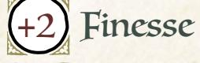
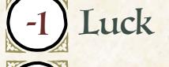
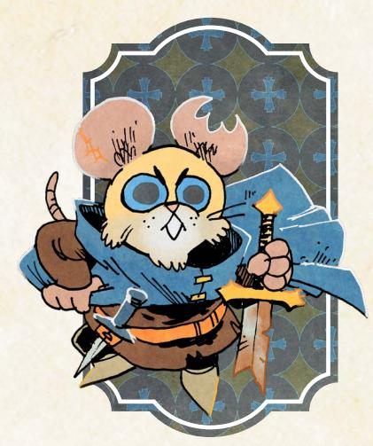
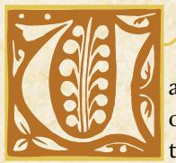
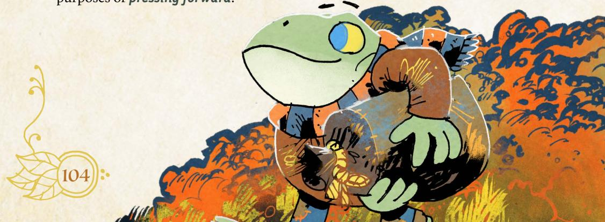

# The Dealer

*You traffic in important items—relics, artifacts, and more. But you aren't just putting money away for a rainy day; you've got an empire to build!*

#### Species

• fox, mouse, rabbit, bird, crow, other

#### Demeanor

• boisterous, gossipy, ingratiating, quiet

#### Details

- he, she, they, shifting
- cold, colorful, scruffy, slick
- coat full of pockets, lots of rings, squashed top hat, fancy cane

#### Charm +1

Add +1 to a stat of your choice, to a max of +2

#### Weapon Skills

Choose one weapon skill to start

- Harry
- Improvise
- Quick Shot
- Storm a Group

# Roguish Feats

You start with this one: Counterfeit

Equipment Starting Value 11

| Your Nature choose one |  |  |  |
|------------------------|--|--|--|
|------------------------|--|--|--|

- Kingpin: Clear your exhaustion track when you make a public example of someone threatening your business interests.
- Broker: Clear your exhaustion track when you convince someone influential to enter a mutually beneficial partnership.

#### Your Drives choose two

- Crime: Advance when you illicitly score a significant prize or pull off an illegal caper against impressive odds.
- Greed: Advance when you secure a serious payday or treasure.
- Loyalty: You're loyal to someone; name them. Advance when you obey their order at a great cost to yourself.
- Clean Paws: Advance when you accomplish an illicit, criminal goal while maintaining a believable veneer of innocence.

#### Your Connections

See Root: The RPG page 51 for mechanical effects.

- Friend: \_\_\_\_\_\_\_\_\_\_\_\_ was there to bail me out when an illicit deal went terribly wrong. How did they help me? What over-the-top gift did I use to express my gratitude?
- Partner:\_\_\_\_\_\_\_\_\_\_\_\_ and I worked together to bring a treasure to a faction, succeeding despite another faction trying to sabotage us. What did we recover for the faction we helped?

{68}------------------------------------------------

#### Dealer Moves

you get **whisper network**, **investments!**, and one more**!**

#### Whisper Network

At the start of play—or when time passes—name an active faction, and roll with Cunning. On a hit, your network gives you a lead on a treasure desired by a high-status member of that faction, someone who is willing to pay fairly (roughly 6-Value per member of your band) and guarantee your safety upon delivering the treasure; the GM picks up to two:

- the treasure is in a hard-to-reach area (ex: a forest ruin, far-off clearing, etc.)
- the treasure is held securely by another faction or vagabond
- the treasure is in a particularly dangerous location

On a 10+, the treasure is extremely valuable to the faction...so much that another faction (GM's choice) would pay to keep it out of their hands. On a miss, someone approaches you—on behalf of a powerful patron from the faction—to demand you secure for them an item you had previously sold to a different faction; take the job or mark 3-notoriety and make an enemy of the patron.

#### Investments!

You start play with 10-value of gold earmarked for Investments. When you **invest at least 5-Value worth of coin into expanding your business interests** in a clearing, choose one Investment [\(page 70](#page-70-0)) for purchase. You can select any available Investment, but some Investments require you to buy a cheaper version before upgrading to the more expensive version. You can only purchase one new Investment from each level (5-Value, 10-Value, 15-Value) at a time; you have to wait for time to pass before investing again.

#### Market Research

When you **figure someone out**, you can always ask (even on a miss), "What does your character desperately need?" Take +1 when acting on the answer.

#### Dishonest Scales

Gain the roguish feats *Pick pocket* and *Sleight of hand* (they don't count against your limit). When you **attempt a roguish feat** as part of a conspiracy to defraud someone of an asset or holding, roll with Cunning instead of Finesse.

#### Better Part of Valor

When you **dramatically feign death during a fight** in a way that puts you out of reach—falling off a cliff, casting yourself into the river, etc.—roll with Cunning. On a hit, your opposition falls for your ruse, and you live to fight another day. On a 7-9, you also lose something precious—coin, a weapon, etc. On a miss, the ruse fails: you suffer 2-injury...and your enemies are still right on your tail!

#### Always Be Crowing

Take +1 Cunning (max +3).

{69}------------------------------------------------

#### Background Questions

| Where do you call home?                                                                                                     | Whom have you left behind?                                                                                           |
|-----------------------------------------------------------------------------------------------------------------------------|----------------------------------------------------------------------------------------------------------------------|
| " clearing " the forest " a place far from here Who taught you the trade?                                 | " my family " my loved one " my former business partner " my protégé " my one true friend |
| " a retired vagabond " an infamous crimelord " a duplicitous faction leader " my misunderstood parents | Which faction have you given the most lucrative deals? (mark four prestige for appropriate group)              |
| " my ne'er-do-well grandparent                                                                                           | From which faction have you stolen a treasure already? (mark two notoriety for appropriate group)           |

Savvy, calculating, ambitious, risky. The Dealer is a businessperson at heart; they're skilled at making coin by selling rare objects, and then spending that coin to make more coin. The playbook will be appealing to anyone who likes to play with a pretty clear sense of "progression." Find treasures and complete deals to earn coin, then spend that coin on Investments!

That said, when you're playing the Dealer, you have to start to care about something. It's easy, especially early on, to just play into the Value cycle. But your Investments represent a commitment to a particular clearing—after all, if that clearing is torched by a rampaging horde of the Hundreds, your investments will likely be lost! If it's taken over by a conquering army of the Eyrie Dynasties—who just so happen to hate your guts—then you're going to have a hard time collecting a return! Seek the moment when your investments change to actually caring about clearings and their well-being.

Your natures reflect two kinds of doing business. "Kingpin" turns you into a an intimidating, illicit entrepreneur, willing to make threats and take action to protect your interests. "Broker" puts your focus on finding deals with mutual benefit. Think about what kind of tenor you're interested in your Dealer having with their deals before you pick your nature.

Your drives further help set up the different kinds of Dealer you might be. "Greed" is pretty easy and obvious, but "Crime" and "Clean Paws" let you aim for particular ends of that spectrum—whether you'd rather be a black market dealer or a respectable businesscrow. "Loyalty" is a great drive for expanding your Dealer to have more commitments and connections than just seeking coin, especially if they can be loyal to a particular clearing they're invested in!

Chapter 4: New Playbooks 69

{70}------------------------------------------------

#### Investment List

The Dealer pays Value to make investments in clearings. These investments are each available once for any given clearing; you could, for example, invest in Local Toughs in many different clearings. Pay attention to which investments are upgrades, requiring you to get those earlier investments in their clearing first. Some investments offer a one-time benefit, and others offer a continuing benefit. Every investment exists in its clearing; if something untoward happens to that clearing, it is always possible for some of your investments to be lost!

70 Root: The Roleplaying Game

{71}------------------------------------------------

| " Know the Territory                                                                                                                                                                                                                                                                                                                                                                                                                                                                            |
|----------------------------------------------------------------------------------------------------------------------------------------------------------------------------------------------------------------------------------------------------------------------------------------------------------------------------------------------------------------------------------------------------------------------------------------------------------------------------------------------------|
| You establish yourself as a patron of a local historian. When you consult the custodian of lore about a fabled treasure in the area, roll with Cunning. On a 7–9, ask 1. On a 10+, ask 3. Take +1 ongoing when acting on the answers. • What dangers or risks are associated with the treasure? • What other powerful people would be interested in the treasure? • What stories are told of those who have sought the treasure? • How is the treasure connected to? |
| " Brick and Mortar                                                                                                                                                                                                                                                                                                                                                                                                                                                                              |
| You establish a physical storefront in the clearing with legal goods on display—and a secure backroom for other dealings. While you are within your establishment, roll with +1 when you attempt a roguish feat, figure someone out, persuade an NPC, read a tense situation, or trick an NPC.                                                                                                                                                                                            |
| " Lending House                                                                                                                                                                                                                                                                                                                                                                                                                                                                                 |
| [Upgrades Risky Loan] You are known within the clearing as a moneylender; each time you visit this clearing, you can call in a Risky Loan your agents gave to a local business in your absence.                                                                                                                                                                                                                                                                                              |
| 15-Value Investments                                                                                                                                                                                                                                                                                                                                                                                                                                                                               |
| " Eager Apprentice                                                                                                                                                                                                                                                                                                                                                                                                                                                                              |
| You have secured a vagabond apprentice, someone who you one day hope to inherit your empire. Make a second PC; work with the GM to include the new character into the band. You can't help or interfere with your own characters.                                                                                                                                                                                                                                                            |
| " One Of Us                                                                                                                                                                                                                                                                                                                                                                                                                                                                                     |
| [Upgrades Friends in High Places] Your increasing influence earns you acclaim and respect from all who live here. Specify one significant change you make to the clearing using your newfound power; whenever you roll your Reputation                                                                                                                                                                                                                                                       |
| with someone who calls this clearing home, treat your Reputation as a +3.                                                                                                                                                                                                                                                                                                                                                                                                                          |
| " A Feast for Crows You and your fellow vagabonds arrange for a day of feasts and celebration, earning you the favor of the clearing's controlling faction. Each vagabond clears all notoriety with that faction and either sets their Reputation to +0 or marks 10-prestige. No member of your band can have a -3 Reputation with the faction you're impressing to purchase this Investment.                                                                                    |
| " Showroom                                                                                                                                                                                                                                                                                                                                                                                                                                                                                      |

[Upgrades Brick and Mortar]: Rather than sell the treasures you acquire, you can install them into your showroom. Each treasure installed this way earns you 5-prestige with each active faction in the Woodland and clears your

exhaustion track.

{72}------------------------------------------------

#### Notes on The Dealer Moves

For *Whisper Network*, the move itself represents the network of contacts you've built up across the Woodland to keep you clued in to who needs what. The faction you name doesn't have to be friendly; even a bitter enemy could desperately want something, and if you're hoping to make amends, bringing a valuable object is a great way to do it! The GM always picks exactly what you're being asked to recover, by which specific person, and the conditions that complicate your retrieval (up to two from the list). On a 10+, whatever you're seeking is extraordinarily valuable to the faction in question...which means other factions would pay to keep it out of their paws. The advantage of a 10+ is that you get a bit of a choice of which faction to deliver the object to, and you can even try to set up a bidding war! The second faction is always willing to meet or beat the original price, and the first faction might be willing to raise the price as well...but those negotiations will have to be handled in person. On a miss, the item you had previously sold to another faction can be something you sold during the course of the campaign, or it can be something you sold before the game even began. Work with the GM to make those details make sense.

For *Investments!*, keep in mind the key restrictions: you can only make any given investment for each individual clearing a single time; you often will have to buy a lower-level investment before upgrading to a higher-level one; you can only invest in increments of 5, 10, or 15 Value; and at any given time, you can only purchase one investment at each increment. If you want to make more investments, you'll have to return after time passes. This move gives you 10-Value for investments to start; you can spend it when you make your character, or wait until the right time. You can't use it for any other purpose. You can supplement that 10-Value with additional coin you earn elsewhere.

For *Market Research*, keep in mind you can always ask the question whenever you *figure someone out*. It does not count against the total number of questions you can ask when you *figure someone out*.

For *Dishonest Scales*, *attempting a roguish feat* as "part of a conspiracy to defraud someone of an asset or holding" means that you're trying to steal something by talking or tricking someone, and it isn't a spur of the moment decision. If you have a plan to steal something from someone—and it involves trickery as opposed to simply breaking and entering—you can consider it part of a conspiracy to defraud someone of an asset or holding.

For *Better Part of Valor*, you must put yourself out of reach. If you feign death but leave yourself where your foes can actually check you, then this move doesn't trigger. You've got to dramatically throw yourself off a balcony or into a raging river! The GM tells you what you lost on a 7-9, imposing any cost that makes sense. On any hit, your foes won't search for you, at least for long enough for you to collect your wits and get away.

{73}------------------------------------------------

# The Gourmand

*You are a master of turning ingredients into artful meals. But the best ingredients are in the wider Woodland—for your art, you're willing to go anywhere and do anything!*

#### Species

• fox, mouse, rabbit, bird, skunk, other

#### Demeanor

• clumsy, endearing, sly, thoughtful

#### Details

- he, she, they, shifting
- fastidious, rumpled, proper, colorful
- camping pot, collection of spices, oversized coat, fancy chef knife

#### Your Nature choose one

- Perfectionsit: Clear your exhaustion track when you disdainfully refuse something (a deal, an item, payment, etc.) because you (unreasonably) demand better.
- Provider: Clear your exhaustion track when you provide comfort, solace, or sustenance to someone otherwise bereft at a cost to yourself or your comrades.

#### Your Drives choose two

- Ambition: Advance when you increase your reputation with any faction.
- Clean paws: Advance when you accomplish an illicit, criminal goal while maintaining a believable veneer of innocence.
- Discovery: Advance when you encounter a new wonder or ruin in the forests.
- Loyalty: You're loyal to someone; name them. Advance when you obey their order at a great cost to yourself.

# Your Connections

See Root: The RPG page 51 for mechanical effects.

- Family: Once, I took care of \_\_\_\_\_\_\_\_\_\_\_\_, helping them find their feet and keeping them sustained, but now they resist me trying to care for them. What happened between us?
- Friend: \_\_\_\_\_\_\_\_\_\_\_\_ always helped provide me with the ingredients I needed in exchange for a square meal...though they never hesitated to tell me when my recipes needed work. What is the strangest thing they brought me?

Charm +1

Finesse +1

Luck 0

Add +1 to a stat of your choice, to a max of +2

#### Weapon Skills

Choose one weapon skill to start

- Confuse Senses
- Improvise
- Quick Shot
- Trick Shot

#### Roguish Feats Pick any two to start.

Equipment Starting Value 8

Chapter 4: New Playbooks 73

{74}------------------------------------------------

# Gourmand Moves

you get **herbs & spices**, **recipe for success**, and **excellent service**

#### Herbs & Spices

When you **assess appropriate surroundings for ingredients**, roll with Cunning. On a hit, you spy something useful; the GM will tell you what ingredient you spot (1-Value+), and how you might harvest it safely. On a 10+, it's extremely valuable, worth at least 3-Value. On a miss, you can't find anything you can convince yourself is acceptable; mark 2-exhaustion.

#### Recipe for Success

When you **try to cook an impressive meal**, roll with Finesse. On a hit, the meal is finished; choose benefits for the eater(s) equal to the ingredients' Value and 1 cost. On a 10+, the meal is exceptionally impressive; choose an additional 2 benefits. On a miss, things go embarrassingly awry; mark 3-exhaustion and finish the meal (choosing benefits as normal) or you cannot clear exhaustion until the next time you successfully cook an impressive meal, your choice. Benefits: *Clear 2-exhaustion (can be chosen twice); clear 1-injury (can be chosen twice); achieve clarity—the GM provides insight on your problems; your heart is lifted—clear all morale (NPCs) or gain +1 ongoing to achieve a goal this session (PCs)* Costs: *It takes a lot of time; mark 2-depletion; mark 2-exhaustion; mark 1-injury*

#### Excellent Service

When you **serve an impressive meal to an important NPC**, roll with Charm. On a hit, your entire service impresses them alongside the meal; they express their gratitude. Choose 1 from below. On a 10+, they feel incredibly grateful to you; choose 2 from below. If the meal you served was exceptionally impressive, choose an additional 1 from below. Each option below can be chosen twice.

- they will answer a question truthfully
- they will spread word of your greatness; take 3-prestige with their faction
- they will counter word of your misdeeds; erase 2-notoriety with their faction
- they will provide you with a gift worth 2-Value
- they will provide you help as if you had rolled a 10+ to *ask them for a favor*

#### The Perfect Filet

Take the weapon skill *Vicious Strike* (it does not count against your advancement limit). When you **use** *Vicious Strike* **with a kitchen implement**, roll with Finesse instead of Might.

#### Campfire Cook

When you **cook for vagabonds resting rough**, mark 1-exhaustion or 1-depletion to allow each of them to clear an additional 2-exhaustion.

#### Renowned Culinary Master

When you **persuade an NPC with a promise of an impressive meal**, you may add your Reputation with their faction in addition to your Charm (max +4).

{75}------------------------------------------------

#### Background Questions

| Where do you call home?                                                                                                                                      | Who inspired your love of cuisine?                                                                                 |
|--------------------------------------------------------------------------------------------------------------------------------------------------------------|--------------------------------------------------------------------------------------------------------------------|
| " clearing                                                                                                                                                | " My parents                                                                                                    |
| " the forest                                                                                                                                              | " An older sibling                                                                                              |
| " a place far from here                                                                                                                                   | " A renowned teacher                                                                                            |
| Why are you a vagabond?                                                                                                                                      | " A child or ward " A beloved cook of my home                                                             |
| " I want to perfect my craft " I swore to give someone a perfect meal with hard-to-find ingredients " I was driven to flee by a rival chef | Which faction most recognizes your skill as a culinary genius? (set your reputation with that faction at +1) |
| " I crave the most exceptional tastes in the Woodland " I seek fame as the greatest chef in the Woodland                                      | Which faction wishes to claim your service? (mark two prestige for appropriate group)                        |

Artistic, exacting, generous, unthreatening. The Gourmand can turn simple ingredients into delicious feasts and exceptional ingredients into a divine repast.

As the Gourmand, you have ambitions that reach well beyond merely cooking each day. You are seeking some extraordinary aspect of your craft—even if you once held a cushy or easy job as an ordinary cook—and the only way you will find it is out in the Woodland. You have the skills to be a chef to royalty, but not the temperament...at least, not right now. Make sure you know what you seek, and why it is so hard to find.

Your natures help direct you to whatever it is you seek. If you are a "Perfectionist," then you are seeking the best of the best of the best; you will settle for nothing less. If you are a "Provider," then you are constantly seeking the pleasure that comes form helping those less fortunate, but that will always keep you away from those very halls of power where you could find a fortune.

Your drives help focus your obsession into particular directions, such as raising your reputation with a faction or discovering new ingredients. Think about how your drives direct you to pay attention to the factions—you are at some risk of losing yourself in your own little culinary world, so the ties that get you to look up and pay attention to the wider war are valuable to your story!

Your three main moves create a flow for your cooking. *Herbs & Spices* gets you your ingredients; *Recipe for Success* allows you to cook extraordinary meals; and *Excellent Service* helps you to actually present and serve those meals in a way that can get you further advantages. If you're at a loss at any time, refer to that cycle and wherever you are in it to figure out what you need to do next.

{76}------------------------------------------------

#### Notes on The Gourmand Moves

For *Herbs & Spices*, you can only evaluate any given area once until time passes again; you can't simply assess an area over and over. The Value of the ingredients is real; you could try to sell them! But for a Gourmand, it's most useful for *Recipe for Success*, guaranteeing you a baseline Value without having to spend any additional Value. The ingredients you find with this move can feed approximately 4-5 eaters.

For *Recipe for Success*, you can try to cook an impressive meal with any ingredients, but the more valuable the ingredients, the more likely you are to be able to provide many benefits. Work the GM if you're unclear on the Value of your ingredients for any given meal; the Value should reflect the quality of the ingredients for about four or so eaters. If you are serving a vast banquet, for example, the Value spent on the overall feast would obviously be higher just because you must work with more food—but for this move, pay attention only to the average Value for four or so eaters. That said, even if you are serving a great feast (and have enough ingredients to do so), this move provides its benefits to everyone who eats. The effects go straight to the eater; they are the ones who clear exhaustion or gain insight, for example. On a miss, you can always choose to finish the meal as normal so long as you have the exhaustion to mark; if you don't mark the exhaustion, then the meal is a mess that provides no benefits, and you cannot clear exhaustion for any reason or by any means until you use this move successfully again.

For *Excellent Service*, you do not have to be serving a meal you cooked to trigger the move...but the meal must be impressive, and the NPC must be important. This move only covers the quality of your actual service, acting as a waiter for them. Keep in mind that if you get a 10+, each option may be chosen twice. Note that the move has no specific miss condition; the GM gets to say what happens on a miss based on what fits the situation, including being interrupted or making a terrible faux pas during your service of the meal.

For *The Perfect Filet*, a kitchen implement is any tool you would use, first and foremost, to cook! You can have a knife that is especially sharp, but if it's intended as a combat knife, then it's not a kitchen implement anymore.

For *Campfire Cook*, vagabonds are "resting rough" any time that they are sleeping out in the forest, along a path, or otherwise without safe, built lodgings. You can use this to supplement one of the travel moves appropriately, or any time that the vagabonds take in a meal in appropriate circumstances. The "additional 2-exhaustion" they can clear is in addition to whatever the move or the normal meal would allow them to clear.

For *Renowned Culinary Master*, remember that the max bonus of +4 applies to the total of your Charm and your Reputation. To persuade an NPC with the promise of an impressive meal, they do have to have some awareness of who you are and believe that you can actually provide that meal.

{77}------------------------------------------------

# The Hunter

*You are a quick, intelligent foe of the great monsters of the Woodland. But the very skills that make you suited for addressing those threats make you a poor fit for anything else.*

#### Species

• fox, mouse, rabbit, bird, goldfinch, other

#### Demeanor

• awkward, piercing, gentle, direct

#### Details

- he, she, they, shifting
- worn, monocolor, startling, hard
- tethered trophies, iconic necklace, coils of thick rope, prosthetic limb

#### Charm -1

Add +1 to a stat of your choice, to a max of +2

#### Weapon Skills

Choose one weapon skill to start

- Cleave
- Confuse Senses
- Storm a Group
- Vicious Strike

#### Roguish Feats

You start with these three: Blindside, Disable Device, Hide

Equipment Starting Value 8

#### Your Nature choose one

- Skeptic: Clear your exhaustion track when you openly and dangerously question the motives of a powerful character.
- Romantic: Clear your exhaustion track when you make yourself vulnerable to someone you hope you can trust.

#### Your Drives choose two

- Justice: Advance when you achieve justice for someone wronged by a powerful, wealthy, or high-status individual.
- Protection: Name your ward. Advance when you protect them from significant danger, or when time passes and your ward is safe.
- Freedom: Advance when you free a group of denizens from oppression.
- Greed: Advance when you secure a serious payday or treasure.

#### Your Connections

See Root: The RPG page 51 for mechanical effects.

- Watcher: I have doubts about \_\_\_\_\_\_\_\_\_\_\_\_ and their motivations ever since they harmed some denizens with their actions. What did they do, exactly? Why don't they seem to feel they did something wrong?
- Peer: \_\_\_\_\_\_\_\_\_\_\_\_ assisted me in dealing with a dangerous monster that had come to threaten a whole clearing. What did we defeat? How did we defeat it? Why doesn't the clearing feel more indebted to us?

{78}------------------------------------------------

#### Hunter Moves

you get **traps and snares**, then choose two more

#### Traps and Snares

When you **spend time setting up traps in an area**, roll with Finesse. On a hit, mark any amount of depletion (min. 1) to create a Traps item with wear equal to twice the depletion marked. On a 10+, the Traps have +4 wear. Mark wear on the Traps to establish a trap at any range to a foe in the area—you can **engage in melee** or **target** with the trap, or mark wear again to use a weapon skill, rolling +0 in all cases. If the move tells you to suffer harm instead mark wear on the Traps. If a trap inflicts harm, mark wear on the Traps to inflict +1 harm. On a miss, you discover a serious problem; you can't set up traps until you deal with it.

#### Follow the Trail

When you **track someone or something,** roll with Cunning. On a 10+, you have a clear sense of where they are going; the GM will tell you where. On a 7-9, the trail is fleeting or the target is on the move; if you don't follow immediately, you won't find their final destination. On a miss, the GM will tell you what new danger comes upon you while you investigate the trail.

#### Slayer of Beasts

Mark exhaustion and 2-notoriety with a target's faction to **make a pointed threat** as per the Reputation Move, rolling with Might instead of Reputation.

#### Waste Not

When you **scavenge through the remains of a recent battle to find hidden items**, mark 2-notoriety with the faction of anyone present and connected to the remains, then roll with Finesse. On a 7-9, choose 1; on a 10+, both.

- y0u find some valuable items (3-6-Value); the GM tells you how much
- you find an item useful to you right now; the GM tells you how it helps On a miss, you find a few smaller hidden things (1 or 2-Value) but you are haunted by what you've done and seen; mark 2-exhaustion.

#### Poultices, Ointments, and Brews

When you have time, you can make useful potions. You may spend depletion, 1-for-1, to prep concoctions, each with a single effect upon consumption. Choose:

- **Healing**: Mark exhaustion to clear 1-injury.
- **Awareness**: Mark exhaustion to ask a question from **read a tense situation**.
- **Energy**: Clear all exhaustion; at the end of the scene, mark 2-injury.
- **Quickness**: Mark exhaustion to speedily change your range from a foe.
- **Fury**: Mark exhaustion to fill yourself with a chemical rage and inflict an additional 1-injury the next time you inflict harm this scene.

#### A Hunter's Look

You built a reputation as an effective professional. When you **meet someone important for the first time**, if you approach as a hunter, you may mark notoriety with their faction to roll at +1 instead of your Reputation.

{79}------------------------------------------------

#### Background Questions

| Where do you call home?                                                                                                                                                                                                                                                                                       | Whom have you left behind?                                                                                                                                  |
|---------------------------------------------------------------------------------------------------------------------------------------------------------------------------------------------------------------------------------------------------------------------------------------------------------------|-------------------------------------------------------------------------------------------------------------------------------------------------------------|
| " clearing " the forest " a place far from here Why are you a vagabond? " I am judged strange by others " I could not ply my craft otherwise " I can't stand society's lies and games " I have never known any other life " I am pursuing an errant loved one | " my mentor " my family " my partner " my love " my child Set your Denizen reputation to -2. Which faction have you served |
|                                                                                                                                                                                                                                                                                                               | the most? (mark two prestige for appropriate group) With which faction have you earned                                                                |
|                                                                                                                                                                                                                                                                                                               | a special enmity? (mark one notoriety                                                                                                                       |

Deadly, thoughtful, strange, elusive. The Hunter is a slayer of dangerous monsters, capable of facing beasts that even other vagabonds find too daunting.

for appropriate group)

As the Hunter, you are prepared to pursue many different kinds of foe, but you are implicitly aimed at these great beasts. When playing the Hunter, you should seek opportunities to flex your skills, including asking local denizens about these kinds of threats. GMs should be sure to bring monsters into the Woodland if you're playing the Hunter. Similarly, if everyone has agreed that they are not interested in monsters as described on [page 121](#page-121-1) of this book, then the Hunter may not be a good playbook for your game.

On the flip side, the Hunter is so good at fighting monsters that they might want to veer away from everything else! Your natures are particularly important as elements that push the Hunter to interact with other characters. A "Skeptic" Hunter continually creates problems by openly questioning powerful people, and a "Romantic" hunter keeps falling for the wrong people! Keep in mind that for the "Romantic" nature, the fact that you hope you can trust them means you can't know, for sure, that you can trust them; there still has to be significant doubt for there to be hope.

Your drives are also just as important for incentivizing you to get involved with the Woodland itself. "Greed" gives you plenty of reason to seek new jobs killing monsters, but "Justice," "Protection," and "Freedom" all aim you at other causes you might have beyond just monster-hunting. Pick drives that represent the ways in which you are interested in getting involved with the Woodland!

{80}------------------------------------------------

#### Notes on The Hunter Moves

For *Traps & Snares*, you are spending time and resources (through depletion) to set up a series of traps, and then revealing them as you need them. The single Traps item you create is just a representation of all the traps you have left throughout the area. When you establish a trap, you can say that the trap is at any range to your target to ensure you can use whatever move you want. You can either *engage in melee* or *target a foe* just by establishing the trap at the cost of 1-depletion, but any other weapon move you use costs an additional 1-depletion. You must be trained in any weapon skill move you try to use with your Traps. Using your Traps can never cause you to suffer additional harm; be sure to only mark such harm as wear on the Traps item. Bey default, any given trap deals 1-injury in harm, but you can mark an additional wear on the Traps item to have it deal +1-injury, and if the GM agrees, any given trap might deal exhaustion or depletion harm based on its form. Each trap is usually a single-use trap; if you want to attack with a trap again, you'll have to establish a new one by marking another wear on your Traps item.

For *Follow the Trail,* a 10+ guarantees you full knowledge about exactly where they are going. You are then free to act on that knowledge at your discretion. A 7-9, however, requires you to act and follow them immediately to find out where they are going; if you do not, they escape, and you won't be able to find them.

For *Slayer of Beasts*, the only requirements to *make a pointed threat* are marking the exhaustion and the notoriety; you do not need -3 Reputation with their faction. When you roll with Might, simply roll as normal instead of inverting it the way you would have inverted your Reputation. Read more about this move on page 118 of the Root: The RPG core book.

For *Waste Not*, you can only use this move if the battle was "recent." That is a relative assessment, and the GM is the final arbiter of whether or not the site of the battle is fresh enough to offer you opportunities. In general, no battle older than a week could be considered "recent." A battle usually means a fight of the Woodland War between at least two factions, but it might also include a battle against a beast, or some kind of disastrous internal conflict. You only mark 2-notoriety if someone of the factions involved in the fight is looking on; they are disgusted by you rooting through the remains of their compatriots. If no one connected to a faction involved in the conflict is around, you can loot freely.

For *Poultices, Ointments, and Brews*, you must have time to prepare concoctions. You do not have any concoctions unless you explicitly spend the time and resources to brew them. They provide their effect to any character who imbibes them, and they are consumed when used.

For *A Hunter's Look*, you use the value of +1 instead of your Reputation when you identify yourself as a hunter before *meeting someone important for the first time*. It entirely replaces your Reputation value, whatever it might be.

{81}------------------------------------------------

# The Nomad

*You aren't from the Woodland; you've traveled far and wide, and your journey brought you here. You seek to see all there is to see in this land at war with itself.*

#### Species

• fox, mouse, rabbit, bird, lemur, other

#### Demeanor

• loquacious, naive, stubborn, wise

#### Details

- he, she, they, shifting
- colorful, eclectic, intricate, curious
- linen trousers, folk embroidery, whittling supplies, beaded jewelry

#### Your Nature choose one

- Fool: Clear your exhaustion track when you embarrass an authority by publicly stating a truth no one else wants to tell them.
- Sage: Clear your exhaustion track when you convince an ordinary denizen to give up on a custom, tradition, or role that no longer serves them.

#### Your Drives choose two

- Principles: Advance when you express or embody your moral principles at great cost to yourself or your allies.
- Freedom: Advance when you free a group of denizens from oppression.
- Thrills: Advance when you escape from certain death or incarceration.
- Wanderlust: Advance when you finish a journey to a clearing.

#### Your Connections

See Root: The RPG page 51 for mechanical effects.

- Watcher: I was passing through a clearing when I saw \_\_\_\_\_\_\_\_\_\_\_\_ doing something truly brave and deeply foolish. Which one was it? What did I learn from it?
- Protector: I think \_\_\_\_\_\_\_\_\_\_\_\_ is still wet behind the ears. If they're going to survive, they're going to need me looking out for them. What am I intent on teaching them?

Charm 0

Cunning 0

Finesse 0

Luck +1

Add +1 to a stat of your choice, to a max of +2

#### Weapon Skills

Choose one weapon skill to start

 Cleave

 Parry

 Storm a Group

 Trick Shot

Roguish Feats Pick any three to start.

Equipment Starting Value 7

{82}------------------------------------------------

#### Nomad Moves

you get Itchy Feet, **Stranger in a Strange Land**, and one more

| " | Itchy Feet |
|---|------------|
|---|------------|

When you **put your past experiences on the road to use solving a problem**, mark a condition below to take a 10+ instead of rolling on any move:

- **Bored**: cross out a box of exhaustion; you can't clear it. Learn a new skill or tradition from a local to clear *Bored*.
- **Irritable**: take -2 to **persuading NPCs**. Experience a new relaxing or luxurious local custom to clear *Irritable*.
- **Lethargic**: take -2 to **tricking an NPC**. Enjoy a new stimulating or exciting local amusement to clear *Lethargic*.
- **Distracted**: take -2 to **attempting roguish feats**. Help a local denizen complete a laborious, mundane project to clear *Distracted*.

When you leave a clearing and hit the open road, clear one of your marked conditions and give the group +1 forward to their chosen travel move.

#### Stranger in a Strange Land

When you **wander about a clearing by yourself to observe the locals and their customs**, roll with Luck. On a 7–9, ask one. On a 10+, ask two.

- *Who has the most potential to change things here?*
- *What is this clearing's greatest vulnerability?*
- *Who here can be trusted by my band of vagabonds?*
- *What is the greatest threat to the controlling faction's hold?*

On a miss, your curious meandering leads you right into the middle of an awkward, dangerous, or incriminating situation you should have seen coming.

#### Truth to Power

When you **share your perspective as an outsider** to **sway an NPC** authority figure, mark exhaustion to roll with Luck instead of Reputation.

#### Born Under a Wandering Star

Take one extra box of exhaustion. When you travel from clearing to clearing by path at a relaxing or average pace, clear your exhaustion track after the roll.

#### I've Seen This Before

When you **offer comfort—a story, a meal, a song—to an NPC paralyzed by emotion**, roll with Luck. On a hit, you bring them back to themselves, and they immediately strive to make things right. On a 10+, they are truly thankful for your wisdom; mark 2-prestige with their faction as well. On a miss, you realize too late how badly you misjudged things; they reveal the terrible truth.

#### I'll Take That

Take the weapon skill *Disarm* (it does not count against your limit). When you **disarm** someone who is threatening someone weaker, roll with Might instead of Finesse; if they lose the weapon, mark exhaustion again to end up with it.

{83}------------------------------------------------

#### Background Questions

#### Why do you wander?

| I seek to find a loved one who left me behind           |
|---------------------------------------------------------|
|                                                         |
|                                                         |
|                                                         |
|                                                         |
|                                                         |
| I was born into a nomadic community of fellow wanderers |
| My desire for knowledge transcends all borders          |

| " | I have sworn to serve this band, for   |
|---|----------------------------------------|
|   | their good and for mine                |
| " | I am consistently entertained by their |

- antics and adventures
- They know the Woodland well, and I see them as guides
- They are destined for greatness, and I want to see their rise

Which faction have you served the most? (mark two prestige for appropriate group)

With which faction have you earned a special enmity? (mark one notoriety for appropriate group)

Eccentric, unsettled, agog, disconnected. The Nomad is a traveling vagabond, not from the Woodland but interested in seeing everything it has to offer.

As the Nomad, you aren't from the Woodland...but you are fascinated by it. Your interest is experiencing the place, and that means moving from clearing to clearing, taking in everything you can as you go. You're a constant outsider, which means you have both plenty to learn and plenty to teach. You can be the voice that calls out the flaws of the Woodland, just as much as you might be the target of a great deal of ire for those frustrated with other aspects of their lives.

Your natures encourage you to use your outsider's perspective to get involved in the challenges of each clearing. "Fool" pushes you to embarass figures of power with unwelcome truths no one else will state—so don't hesitate to get in the faces of powerful figures and call them out. "Sage" encourages you to do much the same for ordinary denizens by showing them other ways without the useless customs they maintain out of simple tradition. In both cases, the Nomad is more than just a passive observer; you should interact and participate, sharing your own thoughts as much as you learn about this place.

The most important balance to strike as the Nomad is between moving on and getting involved for an extended period. Depending upon the other vagabonds in your band, you might be under a lot of pressure to stick around. You can do that, but it wll slowly drain your resources. Make sure you aren't making it unnecessarily difficult to stay when your band of vagabonds has business in a clearing, while also pushing them to move on when the time is right.

{84}------------------------------------------------

#### Notes on The Nomad Moves

For *Itchy Feet*, in order to trigger the move you do have to explain a past experience and how it relates to this moment, but you can be creative as you describe experiences from before your campaign even began, from places far from the Woodland. Use this move before you roll; instead of rolling, you take the 10+. The real cost of using this move is marking one of the conditions. As long as that condition is marked, you continue to experience its effects. The only way to clear a condition is to either fulfill its special requirement, or to leave a clearing and hit the road. Heading into the forest will do it, but leaving a forest won't clear a condition you have to reach a new clearing and leave it again to clear another condition!

For *Stranger in a Strange Land*, you ask the questions of the GM, who answers honestly. The questions represent things you learned as you wandered about, including truths that no one in the clearing may openly acknowledge. Work with the GM to establish exactly how you learned any of these truths, including where you went and whom you spoke to as you poked around.

For *Truth to Power*, when you share your perspective as an outsider, it allows you to use the **sway** Reputation move (core book, page 117) without having the necessary reputation. As long as you mark the exhaustion, you can use that move with your Luck instead of your Reputation, ignoring the prerequisite.

For *Born Under a Wandering Star*, remember that you clear your exhaustion track after the roll, after any additional costs have been paid to travel between clearings.

For*I've Seen This Before*, "an NPC paralyzed by emotion" is an NPC who is unable to act, stuck in a moment by their feelings and their situation. For example, an NPC who has lost so much that they don't have the will to fight back against an oppressor would be paralyzed by emotion; so too would an NPC who feels obligated to their Marquisate parents and won't defy them, even though they wish they could. This move allows you to help break them out of their paralysis; when you bring them back to themselves, they can begin to move again, taking action. You don't get to control what they do, but they will "strive to make things right" that means they will do their best to make amends and rectify a bad situation however they can. On a miss, "they reveal the terrible truth" refers to them showing that they were never paralyzed the way you had imagined, and their beliefs about right and wrong in their situation are wildly different than what you would have hoped for or expected.

For *I'll Take That*, "someone who is threatening someone weaker" is an assessment made from your perspective. It might turn out that the situation wasn't what you had imagined, but so long as you honestly believe someone weaker is being threatened, you can trigger this move. When you mark exhaustion after they lose their weapon, you immediately grab it and take control of it, instead of it simply being cast to the side.

{85}------------------------------------------------

# The Orphan

*You grew up alone, your parents lost in the war or simply unable to care for you. Now you've set out to find your own way, learning the ways of the forest and roads from the vagabonds who know them best.*

#### Species

• fox, mouse, rabbit, bird, other

#### Demeanor

• resolute, energetic, gullible, tough

#### Details

- he, she, they, shifting
- bright-eyed, messy, haunted, small
- family memento, hooded cloak, patchwork vest, threadbare trousers

#### Charm 0

Cunning 0

Add +1 to a stat of your choice, to a max of +2

#### Weapon Skills

Choose one weapon skill to start

- Disarm
- Harry
- Quick Shot
- Trick Shot

#### Roguish Feats

You start with these three: Acrobatics, Pick pocket, Sleight of hand

Equipment Starting Value 8

#### Your Nature choose one

- Defiant: Clear your exhaustion track when you set out alone to deal with a serious problem without consulting your band.
- Scrappy: Clear your exhaustion track when you take out a dangerous foe without marking depletion or wear.

#### Your Drives choose two

- Ambition: Advance when you increase your reputation with any faction.
- Discovery: Advance when you encounter a new wonder or ruin in the forests.
- Thrills: Advance when you escape from certain death or incarceration.
- Chaos: Advance when you topple a tyrannical or dangerously overbearing figure or order.

# Your Connections

See Root: The RPG page 51 for mechanical effects.

- Protector: \_\_\_\_\_\_\_\_\_\_\_\_ reminds me of a lost family member or loved one. What is it about them that makes me feel like they need my protection?
- Family: \_\_\_\_\_\_\_\_\_\_\_\_ has treated me like family from the day we met. How do I prove myself worthy of their belief in me?

{86}------------------------------------------------

#### Orphan Moves

you get **still learnin'**, then choose two more

| " Still Learnin' What you lack in experience, you make up for in enthusiasm; you have a confidence track to reflect your surefire gumption. Choose one of the other vagabonds as your idol: When you are acting as you think your idol would act, you can mark your time; when you do so, reset the track completely to the full six boxes. You can never return to idolizing the same character a second time.                                                                                                          | Confidence: confidence track to take 10+ for any move. When you fulfill your idol's nature, clear the track and cross out one of the boxes. You can change your idol at any |
|-----------------------------------------------------------------------------------------------------------------------------------------------------------------------------------------------------------------------------------------------------------------------------------------------------------------------------------------------------------------------------------------------------------------------------------------------------------------------------------------------------------------------------------------------|-----------------------------------------------------------------------------------------------------------------------------------------------------------------------------------|
| " Easily Overlooked When you attempt these feats while something (or someone else) is offering a distraction, roll with Luck instead Finesse.                                                                                                                                                                                                                                                                                                                                                                                        | You gain the roguish feats Hide and Sneak (they do not count against your total).                                                                                                 |
| " Found Family Take two more connections. Mark exhaustion to suddenly appear in a scene with one of your connections, tumbling out of a hiding spot or nearby area, provided nothing would have kept you from reaching your fellow vagabond.                                                                                                                                                                                                                                                                                      |                                                                                                                                                                                   |
| " Street Smarts When you spend time talking to urchins and outcasts in a clearing, roll with 10+, ask two follow-up questions; the GM will answer honestly. • you find an out-of-the-way place where the band can lay low • you learn about a vulnerable target the band can exploit • you discover a hidden or secret way into an important location On a miss, your snooping has been noticed; the GM will tell you who takes an interest in you and what you'll have to do to get them to leave you alone | Luck. On a hit, you get an inkling of the clearing's best-kept secrets; pick 1. On a                                                                                              |
| " Underestimated Until you prove yourself to be a threat, no one will treat you as one. The first As soon as your Reputation with any faction reaches +2 or -2, lose this move and choose another.                                                                                                                                                                                                                                                                                                                                | time you would mark notoriety with a faction in a session, mark one fewer box.                                                                                                    |
| " Cutting Words When you trick an NPC by openly provoking them with insults, roll with Luck instead of Cunning. When you provoke another vagabond by openly mocking them, say what you want them to do and mark up to 3-exhaustion; they have to take the bait and do as you want or mark the same amount of exhaustion.                                                                                                                                                                                                       |                                                                                                                                                                                   |

{87}------------------------------------------------

#### Background Questions

#### Who took care of you?

 A large foster family, known to care for orphans A gang of urchins, who no longer see me as a child An older sibling, who gave up their dreams to care for me A traveling charlatan, who taught me the art of the con

#### Why are you a vagabond?

- I am distantly related to a member of the band
- I am apprenticing under a member of the band
- I promised the band a reward for helping me find my parents
- I simply won't leave them alone

Which faction have you served the most? (mark two prestige for appropriate group)

With which faction have you earned a special enmity? (mark one notoriety for appropriate group)

Young, naïve, determined, aspiring. The Orphan is brimming with potential, but they're still early on their journey to becoming a true vagabond.

As the Orphan, you are playing a character who *wants* to be a vagabond, but isn't really there yet. Your starting stats aren't great (except for Luck), and the GM is likely to identify tasks you have a harder time with that another vagabond can do handily. But the playbook is exciting for exactly those reasons. Play because you want to struggle, grow, and (sometimes) outshine everyone!

Both of your natures give you incentive to push yourself to the boundaries of your capabilities. "Defiant" encourages you to try to solve things without checking in with the other vagabonds, and thanks to moves like *Still Learnin'*, you have a decent chance of succeeding! But the problem you face has to be something actually dangerous and complex. "Scrappy" encourages you to to try to defeat dangerous foes while marking only exhaustion or injury during the fight. If you fight alongside other vagabonds, you might still be able to trigger "Scrappy," but you have to be the one to take the foe out. If no one would honestly give you the credit of defeating the foe, then "Scrappy" won't trigger.

As the Orphan, you must carefully veer back and forth between working with lots of other vagabonds and taking action on your own. You want to spend time with vagabonds so you can adopt them as your idols, throw questions at them, and explore both them and yourself. Then, you want to go out on your own and apply your learnings to dangerous situations! Make sure you don't go too far in either direction; too much time alone means you won't have any real relationships, and too much time with the band won't give you any spotlight. You're a student, and that means moving in and out of the others' shadows.

{88}------------------------------------------------

#### Notes on The Orphan Moves

For *Still Learnin'*, you are the final arbiter of whether you are acting as you think your idol would act, but you have to be honest about the assessment. If you use this move, you are saying something real about how you see your idol and what they would do. What's more, as they watch your actions, they become aware of how you see them. They might not want to intervene or get involved with your perspective... but if they think you see them in a way wildly out of sync with their own identity, they might want to say something about who they really are and how they would act! After that, you can't really deviate from what they have told you when using this move, unless there is some strong justification for doing so. The GM acts as the final arbiter for that kind of judgment. Fulfilling your idol's nature works exactly the same as if you had the nature on your own character sheet, but you clear your Confidence track instead of your exhaustion track. Changing your idol will also clear your Confidence track...but once you have moved on from someone as your idol, you can never name them as your idol again! You can only name the other PC vagabonds as idols, so at some point, you'll either be stuck with the last available PC as your idol, or you won't be able to have any of them as an idol—that's a good sign that it's time to move on and either retire or change playbooks.

For *Easily Overlooked*, you need someone or something else to provide an active distraction to use Luck or Finesse. So long as a distraction is present, you're set!

For *Found Family*, take any two connections from the full available set, including their mechanical effects and benefits. You can mark exhaustion to appear with any of your connections, including these two new ones and your original connections. You cannot use this move to appear with another character if there is no way to make sense of your sudden appearance.

For *Street Smarts*, nearly every clearing will have some urchins and outcasts—it's usually just a matter of finding them and endearing yourself to them to get them to talk to you. The follow-up questions you get on a 10+ should directly relate to the core piece of information you gain on a hit.

For *Underestimated*, "a threat" is always an assessment in the eye of the beholder, both for how they treat you and for when they might see you as a threat, but in general, someone who doesn't see you as a threat won't seek any harsh punishments for your misdeeds, nor will they target you in a conflict. They'll start to see you as a threat when you prove yourself a capable or dangerous figure. Remember that if you become too famous (or infamous), you lose this move and cannot take it again, but you gain another move from this playbook to replace it (or from a different playboook if you already have the other Orphan moves).

For *Cutting Words*, when you try to provoke another PC vagabond to action, remember that the cost for them to ignore your words is exactly the same as however much exhaustion you mark.

{89}------------------------------------------------

# The Scourge

*You have been wronged by someone powerful, left for dead by your nemesis after they took everything from you. Now you pursue justice for yourself and others, no matter the cost.*

#### Species

• fox, mouse, rabbit, bird, other

#### Demeanor

• taciturn, intense, weary, argumentative

#### Details

- he, she, they, shifting
- impoverished, odd, worn, youthful
- patched castoffs, feathered hat, tattered sketchbook, glass eye

#### Charm 0

Cunning 0

Add +1 to a stat of your choice, to a max of +2

#### Weapon Skills

Choose one weapon skill to start

- Cleave
- Quick Shot
- Storm a Group
- Vicious Strike

#### Roguish Feats

You start with this one: Acrobatics

Equipment Starting Value 11

| Your Nature choose one |  |  |  |
|------------------------|--|--|--|
|------------------------|--|--|--|

- Rescuer: Clear your exhaustion track when you sacrifice an advantage to prioritize saving the lives of the vulnerable.
- Dissident: Clear your exhaustion track when you publicly align yourself with someone wronged by the powers-that-be.

#### Your Drives choose two

- Infamy: Advance when you decrease your reputation with any faction.
- Justice: Advance when you achieve justice for someone wronged by a powerful, wealthy, or highstatus individual.
- Protection: Name your ward. Advance when you protect them from significant danger, or when time passes and your ward is safe.
- Revenge: Name your foe. Advance when you cause significant harm to them or their interests.

#### Your Connections

See Root: The RPG page 51 for mechanical effects.

- Protector: \_\_\_\_\_\_\_\_\_\_\_\_ is too trusting and needs someone watching their back. They remind me of someone I've lost. Whom do they remind me of, and how?
- Partner: \_\_\_\_\_\_\_\_\_\_\_\_ and I went up against the forces of a faction in order to bring down an evildoer connected to my nemesis. Who was the evildoer, and why did my partner also want revenge on them?

{90}------------------------------------------------

# Scourge Moves

you get **the list**, then choose two more

90 Root: The Roleplaying Game

| " The List names:                                                                                                                                                                                                                                                                                                                                                                                                                                                                                                                                                                                                                                                                                                                                                                                                                                   |  |  |  |  |  |
|--------------------------------------------------------------------------------------------------------------------------------------------------------------------------------------------------------------------------------------------------------------------------------------------------------------------------------------------------------------------------------------------------------------------------------------------------------------------------------------------------------------------------------------------------------------------------------------------------------------------------------------------------------------------------------------------------------------------------------------------------------------------------------------------------------------------------------------------------------------|--|--|--|--|--|
| At the start of the game, put two names on your list: your nemesis, and their key accomplice. Take +1 ongoing to pursue vengeance against anyone on your list. When you wreak vengeance upon someone on your list, remove them and take a Mark from the list below. Once per session, you may add an NPC to your list by taking a Mark:                                                                                                                                                                                                                                                                                                                                                                                                                                                                                                          |  |  |  |  |  |
| Marks:                                                                                                                                                                                                                                                                                                                                                                                                                                                                                                                                                                                                                                                                                                                                                                                                                                                       |  |  |  |  |  |
| " Next time you talk of your joyful life before your loss, clear 2-exhaustion. " Next time you talk about your nemesis's treachery, clear 2-exhaustion. " Your anger ever boils; take +1 to wreck something, and -1 to ask for a favor. " You weary of paltry concerns; mark exhaustion when you persuade an NPC. Take +1 to all weapon moves while you have 3+ exhaustion marked. " Only retribution satisfies; you cannot clear more than 1 exhaustion from resting. Clear 2 exhaustion when you add a wrongdoer to your list. " Vengeance begets vengeance; an NPC avenger begins pursuing you for retribution, targeting you at your weakest moments. " You lose yourself entirely to your vengeance; your character is no longer a PC. The GM may have them appear in again in the future as an NPC. |  |  |  |  |  |
| " Never Stop Making Them Pay Take an additional box of exhaustion. Once per battle, you may mark exhaustion after inflicting injury to inflict an additional 2-injury.                                                                                                                                                                                                                                                                                                                                                                                                                                                                                                                                                                                                                                                                              |  |  |  |  |  |
| " Take It From Me, Kid When you persuade an NPC by offering your bitter, hard-won wisdom, roll with exhaustion currently marked (max+4) instead of Charm. On a miss, they reject your worldview violently or embrace it all too fervently.                                                                                                                                                                                                                                                                                                                                                                                                                                                                                                                                                                                                       |  |  |  |  |  |
| " I Am the Night Take the roguish feats Hide and Sneak (they don't count against your maximum for advancement). When you attempt a roguish feat to hide or sneak while investigating wrongdoing or pursuing vengeance, roll with Luck instead of Finesse.                                                                                                                                                                                                                                                                                                                                                                                                                                                                                                                                                                                     |  |  |  |  |  |
| " At Your Mercy When you spare an NPC whom you could have destroyed or humiliated, roll with Luck. On a hit, your gesture of mercy soothes your troubled soul (clear all exhaustion) or elicits material gratitude (clear 2 or more depletion, GM's choice). On a 10+, both. On a miss, someone—perhaps even the one you spared—is quick to take malicious advantage of your foolhardy gesture.                                                                                                                                                                                                                                                                                                                                                                                                                                            |  |  |  |  |  |
| " Today is a Good Day to Die Take +1 Luck (max +3).                                                                                                                                                                                                                                                                                                                                                                                                                                                                                                                                                                                                                                                                                                                                                                                                    |  |  |  |  |  |

{91}------------------------------------------------

#### Background Questions

| Where do you call home?                                                                                               | What did they take from you?                                                                          |
|-----------------------------------------------------------------------------------------------------------------------|-------------------------------------------------------------------------------------------------------|
| " clearing "                                                                                                    | " My parents "                                                                                  |
| the forest " a place far from here                                                                              | My betrothed " My band of comrades                                                              |
| Who wronged you?                                                                                                      | " My honorable reputation " My identity                                                      |
| " A prominent aristocrat " A vindictive crime boss " A treacherous sibling " A powerful vagabond | Which faction have you served the most? (mark two prestige for appropriate group)               |
| " An enigmatic mystery                                                                                             | With which faction have you earned a special enmity? (mark one notoriety for appropriate group) |

Obsessed, righteous, baleful, indomitable. The Scourge is determined to obtain justice—or vengeance—against those who wronged them and others.

As the Scourge, you are devoted to your List—the set of individuals you seek vengeance against. You likely never want your List to be empty; it's the measure of your revenge and the source of your bonuses! If you find yourself with an empty List and no desire to add more names, then it's time to change playbooks.

Your natures help to expand your focus beyond your own vengeance. "Rescuer" directly challenges you to save lives instead of fostering your own advantages for your own goals. "Dissident" pushes you to stick your neck out for others who have been wronged by the powers of the Woodland, taking on their struggles as your own. In both cases, use your natures to help ensure you don't become too bogged down in your own search for revenge; they add nuance and new characters for you to care about as you go from clearing to clearing.

When picking your drives, aim your character in the directions you are most interested in actively exploring. Your "Revenge" drive is going to direct you at one particular target (whose name should absolutely be on your List!), and your "Justice" drive is going to play into your overall bent toward punishing the wrongdoers of the Woodland...but both of them will encourage you to play even harder into your List, hastening your Marks and potentially losing your character to their quest for vengeance! "Infamy" will likely reward you for just doing what you need to do on your quest for vengeance, but it will also encourage you to be a firebrand and a disruptor in general, instead of just a cold, calculating punisher. "Protection" adds a strong additional link to anohter character to give your Scourge more depth; choose your ward wisely!

{92}------------------------------------------------

#### Notes on The Scourge Moves

For *The List*, the +1 ongoing to pursue vengeance against anyone on your list helps you out so long as you are making a move that can be easily connected to your quest for vengeance. You can't gain this bonus in disconnected self-defense—if you're fighting some random guard, you can't take +1 just because they might end your life! But you could gain this bonus if you're pulling yourself up a cliff while your nemesis taunts you from above; their presence makes the vengeance much more directly connected. The GM is the final arbiter of whether or not your action deserves the bonus. Wreaking vengeance upon a name on the List should also be fairly easy to see; it represents the point at which, thanks to your actions, they have suffered and been laid low. The GM is the final arbiter of whether you wreak vengeance and have to take a Mark. Most of your Marks place some new effect upon your character, and that effect is permanent; you cannot remove Marks. You may choose to take your last Mark early if you want, turning your PC into an NPC devoted to vengeance, but usually you will only take that last Mark if you have no others to take. When you choose to add names to your List, be sure to try to add significant characters against whom you cannot pursue simple, easy vengeance. Your List is far better used for foes who have a lasting, resilient presence in the Woodland than for local bullies.

For *Never Stop Making Them Pay*, remember that you can only use this effect once during any given fight, and you can only use it if you are already dealing injury.

For *Take It From Me, Kid*, treat this move as any other move that allows you to roll with a different stat, simply using your current exhaustion marked instead of another stat.

For *I Am the Night*, the swap of Luck for Finesse works in both cases, whether you are pursuing vengeance or investigating wrongdoing.

For *At Your Mercy*, sparing the NPC means letting them go, leaving them unharmed, or something equivalent; you must stop before crossing a meaningful line in order to be considered to have spared them. They, and most who see the action, must understand that you spared them, that you could have destroyed them but chose to do otherwise. If the gesture elicits material gratitude, that gratitude can, but does not have to, come directly from the person you spared. It could also come from a watcher, someone who cares about the person you spared. If you roll a miss, the GM will tell you exactly how your kindness and mercy is turned against you, immediately. It's not enough that the person you spared swears vengeance for some later day; they do something right here and now.

{93}------------------------------------------------

# Beneath the Surface

Every playbook in Root: The RPG has its own focus and brings its own issues to the fore. To better play into the styles of the individual playbooks over the course of a campaign, here are some GM-side guidelines and a few playbook-specific GM moves you can use during play. These tips cover all the new playbooks in this book, with some additional information on the Dealer in particular.

#### The Dealer

The Dealer is focused on Value more than nearly any other vagabond in the game, because they have an entire system all their own for investing their coin and trying to make more. Playing the Dealer can be very satisfying for a player who wants to focus on gaining and spending their value in a clear cycle, but as the GM, you will be responsible for ensuring that the Dealer can't just sit behind a desk and make notes in their budget books.

The Dealer, by default, trades in important, valuable items like relics. Make sure to bring their trade back to these items, especially with their *Whisper Network*. When you are choosing options for that move, your goal is always to make a treasure so valuable they can't ignore it, with just enough difficulty to obtain it that they won't blow it off and decide to make their money in an easier way!

The Dealer's *Investments* are a crucial component of their entire play cycle, too, but those *Investments* can seem much more player-driven. After all, the Dealer has to choose to pour their hard-won coin into a clearing to make any of them; you can't goad them into it! But your role as the GM is to create spaces that they might be interested in. At the start of a game, the Dealer can hold their initial Value for investments in reserve, looking for a clearing that interests them—so try to make clearings that are interesting! Doing so usually involves following the overall principles of play as normal, but pay close attention to how stable a clearing feels, and how attached to the NPCs the Dealer (or other vagabonds) become. The Dealer is unlikely to want to invest in a clearing that might burst into rebellion or terrible conflict at any minute, nor are they likely to invest in a clearing that they believe is populated by unlikable characters.

- Nave an NPC ask them for an interesting investment
- Entice them with an irresistible deal or opportunity to make coin
- Show them the consequences of their investments, good and bad

{94}------------------------------------------------

Food and supplies matter for every vagabond band, but usually only insofar as they help clear exhaustion. But the Gourmand transforms what might be a maintenance-level activity into new opportunities and potential advantages. As the GM, make sure to emphasize both the treasures that a Gourmand would care about—cooking implements and rare herbs—and the potential effects of their art form. The

Gourmand always starts with a trio of moves that cover the full range of mealmaking, from collecting components to cooking them up to serving the dishes, so be sure to draw attention to meals and feasts in a way you might otherwise gloss over. The Gourmand needs characters to cook for and chances to cook! Over time, the other vagabonds will see the potential benefits, but until they seek such chances, periodically offer them up yourself.

- Create opportunities to prepare and serve meals to hungry NPCs
- Nighlight valuable and interesting potential ingredients
- Present rivals and critics, potential threats to their reputation

#### The Dunter

On their face, the Hunter is about one and only one thing: hunting monsters. They're great at it, better than any other vagabond or warrior in the entire Woodland, and that is part of the joy of the playbook. If you have a Hunter in your game, then monsters must be a part of your Woodland and your story; otherwise, their entire special aspect won't be able to come alive! Be prepared to introduce monsters

regularly with a Hunter in play...but also keep in mind that what makes the Hunter interesting is everything else around hunting monsters. They have to interact with other denizens and the factions of the Woodland to get their jobs, to spend their coin, to resupply, to recover...and when the Hunter deals with other characters, they tend to run into trouble! As the GM, make sure that the Hunter never gets to simply skip over those dealings; they are a crucial element in making the Hunter a fleshed-out, interesting character.

- Share rumors of a terrifying monster with a reward for its defeat
- Confront them with the reverberations of their reputation and deeds
- · Push NPCs to become personally embroiled with them

{95}------------------------------------------------

All vagabonds are travelers. But the Nomad takes this aspect of the band one step higher. With a Nomad in your game, the entire band will be under greater pressure to move on to new clearings. As the GM, your role is to both provide additional incentives and reasons to move along—rumors of new conflicts, interesting opportunities, strange and fascinating customs or celebrations, and so on—and

to help guide the band through any of their own disputes about whether or not it is time to move on. The Nomad will be looking for chances to move to a new clearing, so don't double-down on an endless string of new conflicts within one place! When inside of one clearing, however, reflect the Nomad's outsider status back at them: they can be met with mistrust, but they also see opportunities to solve problems with a new perspective.

- · Pass on rumors of great opportunities in other clearings
- Display characters who need a new perspective on their problems
- · Confront them with a mistrust of outsiders and travelers

# The Orphan

The Orphan is a nascent character; they aren't really even a vagabond yet! The fundamental ideas you might apply to a vagabond—that a vagabond is by default more competent than the average denizen, that by being a vagabond they immediately get a level of respect, fear, and infamy, and so on—don't necessarily apply to the Orphan. Keep an eye on the fiction around the Orphan; for example, a vagabond

without any real pressure on them might be able to comfortably climb the side of a building without even making a move, but an Orphan probably wouldn't! At the same time, the Orphan's most important relationship—the one with their idol—is oriented toward the other PCs. As the GM, then, your role is to help remind the players that the relationship exists. Prompt the Orphan to consider if they are acting as they think their idol would, if they are fulfilling their idol's nature, or if it's time to change their idols.

- \* Openly draw attention to how they are not yet a full vagabond
- Nave NPCs underestimate and mock them
- Isolate them with opportunities to act on their own

{96}------------------------------------------------

# The Scourge

Vengeance! The Scourge has their goal: inflict revenge upon their nemesis, the nemesis's accomplice, and anyone else whose name winds up on the Scourge's list. As the GM, that puts a lot of pressure on you. You need to provide NPCs who make good choices for adding to the list—villains, questionable figures, tyrants, and so on—and you need to portray their nemesis and accomplices in a

compelling, interesting way. The Scourge's player will help guide you to their understanding of the nemesis during character creation, and you shouldn't aim to undermine that comprehension much; if they want their nemesis to be the single most corrupt and dangerous figure in all the Woodland, go with it!

The point of the nemesis is to give the Scourge a worthy direction to pursue—the nemesis needs to be present in the story. Their effect upon the Woodland should be on display every now and then, even if the nemesis has their own stronghold on the entire other end of the Woodland, and they should regularly have large effects when they take center stage, using their own agents and allies to accomplish their goals (and remind the Scourge of their mission). And the nemesis themself can show up as a recurring foe! The tension between the Scourge being obsessed over a foe the rest of the band doesn't care as much about, and the nemesis of the Scourge becoming the enemy of the entire band, is productive and fun!

If the Scourge seems to be on track to defeat their nemesis "early," however, that can still be okay—follow the fiction and keep it dramatic, but don't try to keep the nemesis from defeat in an unnatural way. Such a story would become about something else, instead: what does the Scourge do now? They can always easily add new names to their List, after all. Do they just keep seeking new foes to defeat? Do they let their drive for endless vengeance drive them into destruction? Play to that question with any version of the Scourge; remind them that they get a big bonus against names on their list, and the only cost to add someone new is a single measly mark...

- Show the influence of their nemesis upon the current situation
- Present a new foe with no connection to their nemesis at all
- Gempt them with chances to find a life beyond vengeance

{97}------------------------------------------------

{98}------------------------------------------------

う。思シ

agabonds have always had a special relationship with the ruins of the Woodland. For many denizens, even the ruins nearest to their clearings are sources of danger, filled with monsters and

bandits that emerge only to cause trouble. Vagabonds, however, see the potential the ruins have to offer—shelter, food, gold, maybe even precious relics of a time long ago.

This chapter dramatically expands the tools available for playing Root: The RPG in and around the ruins. Here you will find the origin story for the ruins—and the Ancients who made them—as well as rules for adding ruins to your map, finding new ruins during play, and delving deep into those ruins themselves. Finally, there is a section dedicated to the powerful relics, items of incalculable value due to their unique and forgotten construction, that vagabonds may pull from the ruins when they are willing to risk tail and limb to get them.

# The Ancients

Most vagabonds are all too familiar with the powers-that-be of the Woodland, those who have joined the War in an attempt to finally control the clearings and resources that the Woodland has to offer. But most vagabonds know little more than myth and legend about a different force that ruled the Woodland, a people so lost to the sands of time that even the most educated can only guess at their true identity—the Ancients.

# A People Long Lost

The people who chroniclers refer to as "the Ancients" were the first group of denizens that occupied the Woodlands, long before even the Eyrie Dynasties ruled their roosts. Although they were the first (or so the stories claim!), the Ancients were far from primitive or simple—their science, technology, crafts, and arts were advanced far beyond anything known in the modern Woodland. As a people, the Ancients were capable of feats that most denizens would regard as virtually impossible.

Instead of using their power and wealth to carve out clearings on the surface, however, the Ancients instead built their civilization underground, pushing down into the earth with structures whose construction seems impossible even to the industrious moles of the Grand Duchy. Far from the dangers of the forests, the Ancients thrived and expanded, digging ever deeper as their culture enjoyed unprecedented prosperity.

では今し、いらいとは今し、いらいとは今し、いら

{99}------------------------------------------------

Though many Woodland denizens have devoted themselves to studying the Ancients' technologies and relics, little is actually known of the Ancients' culture itself. That said, it is clear that they had a cultural prohibition against selfrepresentation—their murals and statues and other forms of visual art never represent the Ancients themselves. Instead, they appear to have been fascinated with the world outside themselves, developing art, technology, and histories that focused on their understanding of the natural world. Brave explorers who come face to face with the Ancients' legacy will find beautiful abstract art or scientifically accurate instructions instead of self-portraits or statues.

Yet, just as surely as the Ancients once ruled all they touched...they disappeared. Today, the uppermost shoots of their underground kingdom have become the ruins of the Woodland, filled with their treasures—both literal and cultural—and relics, the remaining artifacts and objets d'art that represent the vast and amazing technology the Ancients regarded as commonplace. Nothing else remains.

# History Became Legend

What caused the Ancients to vanish? No one knows. The chroniclers and scholars of the most distant histories of the Woodland say that the records point only to some threat, a darkness that had spread so far that the Ancients could not overcome it. Just as they had a prohibition on representing their own image, so too did they resist the urge to represent their enemies; the records are meager and incomplete, and no one knows what made this particular threat so dire to a people that had so much influence over their world.

It is not clear if the Ancients fled the Woodland, were wiped out by the darkness, or merely dissolved as a culture...but they are no longer present in the Woodland. Their mark, however, is eternal, both in the ruins they left behind and in the myths and legends told about them today. After all, some in the Eyrie Dynasty lay claim to a lineage extending all the way back to the Ancients, insisting that their ancestors didn't disappear but simply moved above into the naturally superior treetops and roosts, and many of the relics they constructed have stood the test of time...and may yet turn the tide of the Woodland War.

The lack of concrete answers has spurred brave explorers to search for truths that can only be found deep underground, in the spaces the Ancients once thought of as home. Beneath the earth—in the ruins, amidst fierce monsters and dangerous terrain—some believe there are still documents and records that would reveal more about the Ancients. Some of these explorers set out alone, hoping to weather the trials of the ruins on their own, but many hire vagabonds to go with them, knowing that only a vagabond has the skill necessary to delve deeply into the ruins and return home in one piece.

{100}------------------------------------------------

# Layers Upon Layers

In truth, not all ruins belong solely to the Ancients. Often, those who came later built their own structures and sites of worship on top of what the Ancients had already constructed, creating something of a hybrid that made use of what was already there, or even built their own sites to mimic what they found of the Ancients' designs. Adventurous vagabonds tell tales of lizard temples with murals dedicated to the Great Wyrm, cavernous structures built for bats to hold large meetings, and Eyrie Dynasty halls fit for kings and nobles, all found in ruins that either bear the marks of the Ancients or pay homage to their craft.

Yet as anyone digs more deeply into the ruins, they are more and more likely to reach something only the Ancients could have built. Many levels below the surface—where the Woodland's true secrets and treasures still reside—is the domain of those who came long, long before the Woodland War

Now, the powerful and the desperate alike are all too eager to have vagabonds delve deep into these ruins for a taste of the Ancient's power. From rumors of vast stores of gold and jewels to the obvious and persuasive power of the relics that are still to be found, vagabonds have no shortage of reasons—or employers—that might compel them to go deeper into the ruins than anyone has gone in quite some time...

{101}------------------------------------------------

# Adding Existing Ruins to the Map

When first making your Woodland, you can add a few ruins dotted across the map! There can always be more ruins, buried and hidden or recently discovered, added to the game later. But these ruins would be known places of value and danger.

Every Woodland has at least two known ruins, along with additional known ruins determined randomly. After you have determined all the clearings and their connections—but before you start assigning initial control to the factions roll 1d6 and divide by two (round up) to determine how many additional known ruins dot the Woodland.

| 1d6 | Ruin Location                                                                                 |
|-----|-----------------------------------------------------------------------------------------------|
| 1   | Below (or above) the clearing itself                                                       |
| 2   | In the closest forest to the North (west)                                                  |
| 3   | In the closest forest to the South (east)                                                  |
| 4   | In the closest forest to the West (south)                                                  |
| 5   | In the closest forest to the East (north)                                                  |
| 6   | Directly along the path leading from the clearing, toward the center of the Woodland |

Then, determine the ruins' location. Use the random clearing table (page 62, Root: The RPG) to determine a clearing local to each ruin. Then, roll 1d6 on the ruin location table to see where the ruin is located, relative to its clearing. Forests are the large spaces between clearings; when determining which forest, the parenthetical direction acts as a tiebreaker.

# Discovering New Ruins

Beyond the ruins initially added to the Woodland map, vagabonds are known for finding new ruins tucked away in the darkness of the forest, off the safe paths. Newer ruins are, of course, some of the most valuable; the Keepers in Iron, for example, are always eager to hear of new ruins that might still contain relics of the Ancients, untouched by the bandits who pillage better known sites.

Wealth and power aren't the only reasons vagabonds might seek out new ruins. Often, ruins are home to monsters, and vagabonds searching for missing denizens—or hunting monsters directly—may find that they must seek out an undiscovered ruin near a clearing to track down the beast they seek.

The moves presented in this section give vagabonds new tools for finding ruins in the forest, as well as rules for returning from the depths of the forest to a nearby clearing from the newly discovered ruins. After all, what good is it to rescue someone, gather up treasure, and loot relics if you can't make it back to a safe clearing to celebrate your victories?

{102}------------------------------------------------

#### Search for Ruins

When you travel into the forest to search for ruins, one member of the band rolls for the group:

- · if the band has a detailed map of the area, take +1
- · if any vagabond has +2 Luck or greater, take +1
- · if any vagabond has more than 1-injury marked, take -1
- · if the band doesn't have a local guide, take -1

On a hit, you find the site you seek, safely arriving at the gates of the ruins! On a 10+, you discover a safe and inviting area nearby; everyone can clear an exhaustion if you make camp before delving deeper. On a 7-9, you instead spot a threat of the ruins blocking your path forward; you'll have to find a way past or through it to enter the ruins themselves. On a miss, the ruins find you; a threat of the ruins drags you deeper in before you have time to prepare for your delve.

You and your band leave Ricklebell Falls, following a map you hope will lead you to an unexplored ruin in the forest. You're *searching for ruins*!

Going into the forest is always dangerous, but intentionally looking for a ruin means you're driven to go deeper. The search might take hours or days, but the entire thing is covered by this single move, and—just as with other travel moves—only one person rolls for the whole band.

The roll is modified by the fiction surrounding your band's departure. If at least one vagabond in the group has +2 Luck or greater, you get a +1; if at least one vagabond has 2-injury harm (or more) marked as you set out, you get a -1. Similarly, a decent map gets you an additional +1 and the absence of a local guide gets you an additional -1. These modifiers stack, so it's possible to roll with anything between a -2 and +2.

Having **"a detailed map of the area"** or **"a local guide"** means you're bringing those resources along with you. They don't have to be perfect, but both the map and the guide need to be reasonably accurate to count.

On a hit, you find the ruin you're seeking without problems along the journey; you manage to slip past the monsters and other hazards of the forest unharmed. On a 10+, you even find **"a safe and inviting area"** to rest and recuperate before you go inside. But on a 7-9 or a miss, you find yourself in real danger close to the ruins—either you find your way to the ruins blocked or something grabs you and drags you in before you can prepare yourself for what is ahead.

You can read more about threats of the ruins on [page 114](#page-114-0)!

{103}------------------------------------------------

#### Return from a Forest Ruin

When you return from a forest ruin, the band collectively decides how it travels and one member of the band rolls for the group:

- · calmly and quietly, taking time to retrace your steps. The band collectively marks 1-depletion for each member; +0 to the roll.
- · quickly and efficiently, conserving resources. Everyone marks 1-exhaustion; +1 to the roll.
- · fleeing toward safety. Everyone marks 2-exhaustion or 2-injury—their choice—and 2-wear; +2 to the roll.

On a hit, you make it to a nearby clearing—carrying whatever you obtained on your delve—and largely avoid the dangers and obstacles of the forest. On a 7-9, your return to civilization, however, is marred by a reminder of the War and its consequences. On a miss, something catches up with you before you can make it out of the forest…or you discover too late that someone you don't trust awaits your return!

You and your band have left the ruins, journeying through the forest to return back to Longbarrow Crag. You're *returning from a forest ruin*!

Escaping a forest ruin doesn't mean you're safe—you've got to make it all the way back to a clearing before you can breathe easy. As with other travel moves, the band has to decide how it travels; you have to be able to pay the costs—marking exhaustion, depletion, etc.—so some of the options may not be available to you after some time in the ruins.

Traveling **"calmly and quietly"** means you're taking the time to go back the way you came, camping along the way and using up supplies. You only get to roll with a +0, but no one has to mark exhaustion or injury.

Traveling **"quickly and efficiently"** means you stick to an intense pace—and don't have to camp—but every member of the band has to mark exhaustion. You get a +1 to the roll to reflect your speed, but the cost is great.

**"Fleeing toward safety"** means you move as quickly as possible through the woods. Everyone gets beat up on the way back, but it's an option you can choose even if you have no depletion or exhaustion left to mark,.

Encountering **"a reminder of the War"** might be an active threat (like a band of soldiers) or a fleeting opportunity (like the remains of a battle), but you're almost back to safety! "**Something catching up with you"** or **"someone is awaiting your return"** means that trouble finds you; you'll have to deal with whatever is chasing you or waiting for you in order to make it to the clearing.

{104}------------------------------------------------

# Diving Deep Into the Ruins

When a band of vagabonds wants to dive into the ruins, they must go beyond the areas normal denizens regularly visit. For a forest ruin, that might be the very first level of the ruin—pristine and untouched by denizen paws—but for ruins closer to the clearings, the first few levels may already have been pillaged. These moves support the exploration by offering vagabonds ways to push down into the deeper levels to find more meaningful treasure and relics

Since ruins are often filled with areas that are falling in on themselves—sloping floors leading to half-broken halls, submerged areas where water has overtaken the structure, etc.—think of each "level" as a large, unexplored space in the ruin at roughly the same depth. When the vagabonds go deeper, they enter a new level.

#### Press Forward

When you press forward into a new area of the deep ruins, a member of the band must mark 1-depletion; if you can't or won't mark depletion, a threat of the ruin comes to bear on your band.

You light a torch as the gloom of the deep ruins grows deeper, ducking under a rock shelf as you enter a large cavern. You're *pressing forward*!

Journeying deeper into the ruins is always costly—you have to consume food, water, and torches to keep going. Every time you *press forward*, someone in your band has to mark depletion to represent those resources getting used up... or some threat of the ruins [\(page 114\)](#page-114-0) catches up with the group.

"A new area of the deep ruins" means you've entered a new section of the same level; if you are descending deeper into the ruins, you're *delving deeper* ([page 105\)](#page-105-0) instead. The GM is the ultimate arbiter of what counts as *pressing forward*, but it always marks a transition within a given level. Usually, going from one room to another is sufficient, but the GM might decide that several close rooms right next to each other might make up a single area for the purposes of *pressing forward*.

{105}------------------------------------------------

#### Delve Deeper

When you delve deeper into a ruin toward a new level through an open pathway, one member of the band rolls for the group:

- · if every member of the band is free of injury, take +1.
- · if the band collectively marks 2-depletion and 2-wear, take +1.
- · if the band is dealing with an active threat or crisis, take -2.

On a hit, your band moves to the next level of the deep ruins. On a 10+, your descent is auspicious; you find some natural resources or a secure place to camp, your choice. On a miss, you descend…but a serious threat of the ruins comes to bear, trapping you on the lower level until you deal with it or find another route.

As you are exploring a ruin, you find a hole descending into deeper caves you throw down a rope and begin to climb! You're *delving deeper*!

If your band wishes to find the true secrets of the Woodlands—relics of the Ancients, lost heraldry of the Eyrie Dynasties, etc.—you will need to go deeper into the ruins, exploring areas no one has touched in eons.

**"Every member of the band is free of injury"** means that no one who is descending to the next level has any injury harm marked. Some members of your band might stay behind to help you earn that +1 to the roll, but they will have to face the other threats of the ruins alone; it will take time to return to them.

When your band **"marks 2-depletion and 2-wear,"** anyone in the band can mark the depletion and wear, even splitting it up among the members of the band.

**"The band is dealing with an active threat or crisis"** means that something is putting the band in genuine danger as you descend. That might be a monster, but it could also be a spreading fire, collapsing ceiling, or other natural disaster.

On a hit, you move down into a new level of the ruins, even discovering some immediate resource like running water or edible plans on a strong hit. The danger mounts as you descend; the threats of the ruins you confront in the first and second levels of a ruin are much easier to contain than those faced in the fourth and fifth levels. But the rewards are far greater at those depths, both in the secrets you might discover and in the gold and relics you might retrieve.

On a miss, a threat of the ruins [\(page 114](#page-114-0)) finds your band, trapping you on the new level of the ruins. Your band will have to not only deal with the new threat, but you must also find some new way to the surface if you can't find some way to resolve whatever is blocking your retreat.

{106}------------------------------------------------

#### Scavenge for Resources

When your band scavenges for resources in the deep ruins, one member of the band rolls a number of dice equal to the level you are on currently, plus however many safe chambers are adjacent to the band's location. Individual vagabonds in the band can spend these dice by their value to:

- · 1-2: recover 1-depletion
- · 3-4: recover 1-depletion and 1-wear
- · 5-6: clear 2-depletion or discover an item worth 3-value

The band can only make this move once per level of the ruins; you must descend to a new level in order to scavenge again.

Your band is running out of supplies in the deep ruins. You look around for anything useful in the piles of debris. You're *scavenging for resources*!

Most moves that ask you to roll dice in Root: The RPG require you to roll 2d6, but *scavenging for resources* means you roll a whole bunch of dice! Count up the number of adjacent safe chambers—rooms you feel you can enter and exit safely—and add it to the level of the ruins to figure out how many dice you get to roll. Each die's result is worked out independently; you don't need to add them up to get a total because you use each die to figure out what you find.

Spending a die that shows a 1 or a 2 means you've found something that will recover one box of depletion. That might be a small patch of edible vegetables, a trickle of fresh water, or even adventuring gear left behind by someone who tried to explore the ruins before you. Sometimes this might mean you add something new to the map!

Spending a die that shows a 3 or 4 means you've found something better—enough to both clear a box of depletion and a box of wear. Usually, spending this kind of die implies that you've found something more useful than just basic resources, likely something someone else—maybe even the Ancients—left behind.

Spending a die that shows a 5 or 6 means you've found enough resources to clear 2-depletion...or something worth 3-value. You get to pick which one, but the GM will tell you what you find either way.

You can only make this move once on a given level of the ruins, so be cautious about when you decide to *scavenge*. Once you've *scavenged* on a specific level, there's not much left to find until you delve deeper and get to a new level of the ruins you can explore for the first time. For that reason, it's usually better to explore each level of the ruins for a while—uncovering safe areas and even *making camp* [\(page 107\)](#page-107-0)—before you throw your efforts into *scavenging*.

{107}------------------------------------------------

#### Make Camp in the Ruins

When your band makes camp in the deep ruins, each member of the band marks any amount of depletion, and one member of the band rolls with the total (max +4, including the bonuses below).

- · if there's a useful resource nearby (water, food, etc), take +1.
- · if there's shelter or security (caves, stone doors, etc.), take +1.
- · if a member of the band forgoes any benefits to stand watch, take +1.

On a hit, the band gets some rest; each member clears an exhaustion. On a 7-9, each member also picks 1. On a 10+, they instead pick 2:

- · you get some sleep; clear an additional exhaustion.
- · you have time for makeshift repairs; clear 1-wear.
- · you map the area; take an extra die when *scavenging* this level.

On a miss, the supplies you spent are wasted as a threat of the ruin suddenly comes to bear; tell the GM the watch order, and they will tell you who first spots the danger now upon you.

Tired and hungry, your band of vagabonds decides you've gone far enough into the ruins for today; it's time to rest. You're *making camp in the ruins*!

*Making camp* is a collective activity; each vagabond marks as much depletion as they want to spend—using up rations, creating a fire, etc.—and one vagabond rolls with a +1 for every depletion marked. In addition, your band adds +1 for every fictional condition you meet, but the total bonus can't be more than +4.

A **"useful resource"** has to be enough for the whole group. A single mushroom isn't enough for a band of five vagabonds, but a mushroom patch is plenty.

**"Shelter and security"** have to be truly secure from local monsters and other treasure hunters...and big enough for the whole band. A safe cave with one entrance is usually sufficient—it doesn't have to be behind a locked door provided that it gives your band a way to see major threats coming.

**"A member of the band standing watch"** means one vagabond doesn't get to do anything but look out for threats; they don't get any benefits from the move.

For anyone not standing watch, they clear an exhaustion and get to pick some additional benefits—one from the list on a soft hit, two from the list on a strong hit. If someone chooses to take an extra die while scavenging, then they add that die to the pool when the band next *scavenges for resources* ([page 106\)](#page-106-0).

On a miss, a threat of the ruin interrupts your respite before anyone can get any benefits, plunging the group into danger and wasting the resources you've spent.

Chapter 5: New Playbooks 107

{108}------------------------------------------------

# Retreat Back to the Surface

When you retreat from the ruins back to the surface, one member of the band rolls for the group:

- · if you can chart a course out through safe rooms, take +1.
- · if each member of the band marks 1-exhaustion, take +1.
- · if the band is retreating in the face of an active threat, take -1.
- · if any member of the band is burdened, take -2

On a 10+, you scramble back to the surface, emerging to relative safety wherever you first entered the ruins. On a 7-9, one threat of the ruins blocks your escape; you must deal with it before you can claw your way out. On a miss, you find yourself trapped between an obstacle that blocks your path forward and a threat that won't stop advancing.

Gold and relics secured, your band starts the long journey back to Pricklegrass Marsh from the depths of the ruins. You're *retreating back to the surface*!

Eventually, your band will need to return to the surface, bringing back whatever you found or learned in the ruins. But the journey back up can still be perilous the ruins have a tendency to surprise even the most prepared of vagabonds.

**"Charting a course through safe rooms"** means you can draw a clear path, across all levels of the ruins you need to cross, that only features rooms you can enter and exit freely without danger. If there's a giant spider still roaming the level above you and likely to be in your way, you probably can't earn this bonus.

**"Retreating in the face of an active threat"** means the band flees from a monster or natural disaster (or something else), deciding it's better to run than fight.

**"A member of the band is burdened"** when they are carrying more Load than their maximum (4+Might); if any member of the band is burdened, then they are slowing down the rest of the group as they climb back to the surface.

On a strong hit, your band emerges from the ruins without paying any further costs; on a weak hit, you'll have to first deal with one threat of the ruins before you can escape completely. The GM will tell you what danger you face, but it probably looks like a monster or other shift in the ruin that blocks your way!

On a miss, you get caught between two threats—an obstacle in front of you and something coming up behind you. These problems might both be monsters, but they could also be a fire or cave-in pushing you to keep moving or keeping you from escaping quickly. Once you've overcome the obstacle, you're free to leave...but you might also need to *return from a forest ruin* before you make it back to a clearing.

{109}------------------------------------------------

# Creating the Ruins

Marking the ruins on the map only tells you where they are relative to the clearings. When the vagabonds enter the ruins themselves, you (as the GM) have to represent the ruins in all their glory—their layout, the monsters that inhabit them, and the treasures the vagabonds might find. Here are some tips:

# Before The Vagabonds Enter

In order portray a ruin, you have to know some broad truths about it. Consider the questions below—answering them will give you a lot of material to work with during a delve into the ruins. Alternatively, you can use the random generation tables found on [page 111](#page-111-1) to generate a ruin using a few die rolls.

#### Who left their mark on these ruins? Why?

The Ancients built many incredible structures during their time as masters of the Woodland, but many other groups either built their own structures in the distant past or made use of The Ancients' structures themselves. Think about which group (or multiple groups) constructed the ruin and how they left their mark.

Each ruin once had an alternate purpose—a sacred site, a throne for a king, a scientific laboratory. Choose a purpose for the ruin so that you have a set of central themes to return to during the delve. A ruin that was a barracks for a massive army will have living quarters and training areas; a ruin that was a prison for a powerful foe will have many different security systems...

#### Why is this place a ruin?

Most ruins have been abandoned for some time, but mere emptiness doesn't make it a ruin. Decide on the events which literally *ruined* this place—an earthquake, a flood, rampant vegetation, etc. Portray that force as often as you can when describing what the vagabonds see and feel in the ruin.

#### Who lives here now?

Ruins are valuable, secure sites in the middle of the dangerous forest. Consider who has made use of that safety, and pick a few different monsters (or denizens) that have made the ruin their home. See [page 121](#page-121-1) for more on monsters!

#### What might happen during a delve?

While you don't want to plan any specific chain of events to occur while the vagabond delve into a ruin, you do want to have a few escalations on hand in case you need them. Think about a few things that might be interesting during the delve and write them down; you'll want to have them on hand during play.

Chapter 5: New Playbooks 109

{110}------------------------------------------------

## During the Vagabonds' Delve

As the vagabonds descend into the ruins, your prep work gives you a solid grounding for presenting the ruin to the vagabonds. Don't try and work out the whole ruin in advance—it's a lot of work, and they might not see all of it! Instead, focus on the spaces the vagabonds are moving through and answer the following questions throughout the delve. If you want to let the ruin grow organically, you can use the random ruin layout generator on [page 112](#page-112-1) instead!

#### Are there more rooms on this level?

As the vagabonds explore, provide opportunities for more exploration—rooms with multiple exits, all branching off into new rooms. Since vagabonds have to pay a price to *press forward*, you want to give them reasons to keep looking! But no ruin has infinite rooms—eventually the vagabonds will have explored everything they can reasonably reach without excavating the ruin further.

#### Are there more levels in this ruin?

As with the ruins' rooms, additional levels encourage the vagabonds to push their luck, digging deeper to search for whatever they came here to find. But no ruin has infinite levels either—every ruin worth the name is at least a few levels deep, but very rare is the ruin that extends deeper than five or six levels below the surface of the Woodland.

#### What might the vagabonds find?

Often, the vagabonds are looking for a specific thing—a relic, a monster to hunt, a missing person, etc.—when they enter the ruins, but take some time to think about what else might be found on each level, especially as they *delve deeper*. Are there more relics? Other monsters? Note down what the band might find so you can bring it into play as they explore.

# Using Other Materials

If you want to bring in materials from other roleplaying games—especially dungeons meant to be explored by hardy adventurers—this system for ruins will support you! Just adjust the theme of the dungeon to match Root: The RPG by altering the antagonists the band might encounter. The features of the dungeon traps, obstacles, the map—all still fit; just remember that the band has to mark depletion every time they enter a new area of the same level by *pressing forward*!

As for the antagonists, you can easily transform them into monsters ([page 121\)](#page-121-1) or traditional Root: The RPG foes. Skeletons might become giant fire ants [\(page](#page-126-0)  [126\)](#page-126-0) or Eyrie soldiers turned bandits; a mighty lich might become a giant spider [\(page 128\)](#page-128-0) or a vagabond who discovered a relic that warped their nature.

{111}------------------------------------------------

# Random Ruin Generation

If you'd like to generate your ruins through random rolls, you can use the tables below to create a ruin procedurally:

#### Has any other faction reshaped the ruins?

| 2d6 |                                                                         |
|-----|-------------------------------------------------------------------------|
| 2-7 | No, no faction has reshaped these ruins since they were built.          |
| 8-9 | Yes, one faction has reshaped these ruins since they were built.        |
| 10+ | Yes, more than one faction has reshaped the ruins since they were built |

# What were the ruins originally for?

| 2d6 | 1-2          | 3-4                  | 5-6              |
|-----|--------------|----------------------|------------------|
| 1-2 | Sacred site  | Manufacturing center | Military outpost |
| 3-4 | Royal palace | Mausoleum            | Monastery        |
| 5-6 | Trade center | Laboratory           | Settlement       |

#### Why is this place a ruin?

| 2d6 | 1-2                                | 3-4                        | 5-6                |
|-----|------------------------------------|----------------------------|--------------------|
| 1-2 | Earthquake or volcanic activity | Poison or flammable gas | Vegetal overgrowth |
| 3-4 | Flood                              | Structural collapse        | Destructive traps  |
| 5-6 | Fire                               | Monster invasion           | Sinkholes          |

#### Who lives here now?

| 2d6 | 1-2                                 | 3-4                                    | 5-6                                      |
|-----|-------------------------------------|----------------------------------------|------------------------------------------|
| 1-2 | Bandits and thieves                 | Historians or scientists               | Colony of monsters                       |
| 3-4 | Mercenaries or treasurer hunters | Ecosystem of 3+ species of monsters | Unique or bizarre species of monsters |
| 5-6 | Fugitives or refugees               | Single terrifying monster           | Band of vagabonds                        |

{112}------------------------------------------------

# Random Ruin Layout Generation

Instead of deciding room by room how the ruin will emerge during play, you can also generate the layout of a ruin procedurally using these tables:

When the band enters a room, roll on this table:

| 2d6+rooms explored on this level | Are there more rooms?                      |
|-------------------------------------|--------------------------------------------|
| 3-4                                 | Yes, three exits lead to three new rooms   |
| 5-6                                 | Yes, two exits lead to two new rooms       |
| 7-9                                 | Yes, only one exit to one new roomr        |
| 10-12                               | Yes, one exit to a room that is a dead end |
| 13+                                 | No, this room is a dead end                |

When the band enters a new level of the ruin after the first, roll on these two tables:

| 1d6+new level | Are there more levels?                     |
|---------------|--------------------------------------------|
| 7 or less     | Yes, there are more levels below this one  |
| 8+            | No, this level is the last one in the ruin |
| 1d6+new level | What's on this level?                      |

| 1d6+new level | What's on this level?                                                              |
|---------------|------------------------------------------------------------------------------------|
| 3-6           | 5 Value worth of coin and standard equipment, split among 1-2 items             |
| 7-9           | 10 Value worth of coin and standard equipment, split among 2-3 items            |
| 10-13         | 10 Value of coin/equipment—split among 2-3 items—and one relic of the Ancients  |
| 14            | 15 Value of coin/equipment—split among 2-3 items—and two relics of the Ancients |

{113}------------------------------------------------

# Portraying the Ruins

From monster hunting playbooks to new ruin-focused equipment, the whole of this book is designed to give vagabonds lots to do in the ruins—all you have to do is portray the ruins as a dangerous, rewarding place to explore! Here are some tips to make that portrayal ring true for the vagabonds as they delve.

# Draw the Map as You Go

It's tempting to map out the whole ruin in advance, but remember your agendas and principles (Root: The RPG, page 198)—you still want to *play to find out what happens*! Instead, draw the map as you go, adding new rooms as the vagabonds explore so that the ruin stays fresh to both you and them. Lean heavily on your prep—if you've chosen why the ruin exists and create the rooms on the fly, a lot of what the vagabonds find will come naturally!
