# Monsters and Relics

Monsters [\(page 121](#page-121-1)) are one of the most important tools for bringing the ruins to life. As the vagabonds descend, they are less likely to encounter another group of denizens—bandits, for example, tend to stick to the upper levels of the ruins. Monsters fill an important gap, allowing you to introduce sentient opposition anywhere in the ruins; spiders, scorpions, and snakes all love the deep ruins!

At the same time, relics—detailed later in this chapter on [page 115](#page-115-1)—give vagabonds real reasons to dive deeply. Relics aren't just slightly better than the average piece of equipment; they are truly unique items crafted using Ancient methods that have since been lost to the sands of time.

In both cases, foreshadow the presence of monsters and relics over and over again to the vagabonds. Give them patrons organizing an expedition to recover a relic... or less qualified treasurer hunters who do not return after delving deep—all reasons for the vagabonds to roll up their sleeves, grab their gear, and dive deep themselves.

# Keys and Locks

The existence of relics also allows you to push the boundaries of believable obstacles in the ruins. The vagabonds may encounter fantastic puzzles, locked doors, or even strange materials—all evidence of the Ancients' amazing technology. For example, a door that leads deeper into the ruins may only be opened with a crystal orb found in a different section, far from the door itself.

Don't forget your principles as you introduce these elements. Root: The RPG is a game about exciting adventure, so be a fan of the vagabonds and give them obvious tools to engage the fiction and avoid difficult or exhausting puzzles.

{114}------------------------------------------------

# Threats of the Ruins

Finally, several of the ruin moves describe a **threat of the ruins** coming to bear on the vagabonds. Often, that's an obvious threat—the monster they are hunting, a cave-in right under their feet, etc.—but if you ever get stuck, here's a list of threats you can bring to bear, sorted by level of the ruin.

#### Level 1 Threats

The threats vagabonds encounter in the first level of the ruins can be dangerous, but they are less immediate and rarely focused on the vagabonds themselves.

- · A protective or docile monster appears nearby
- · A group of bandits or soldiers spots the vagabonds
- · A minor natural obstacle—a small fire or cave-in—endangers one vagabond
- · A shift in the ruins reshapes the layout, cutting off paths for the vagabonds
- · Signs appear of a bullheaded or predatory monster living on a lower level

#### Level 2 or 3 Threats

Threats in the second and third levels of the ruins ramp up the danger considerably, making the vagabonds think carefully about resources and plans.

- · A bullheaded or predatory monster appears nearby
- · Another vagabond exploring the ruins attacks (or steals from) the band
- · A major natural event—a flood, a large cave-in—threatens multiple vagabonds
- · A broken relic of the Ancients endangers one of the vagabonds
- · A trap or puzzle appears in the vagabonds' path with no obvious way around

#### Level 4+ Threads

As the band descends deeper into the ruins, the threats become more dire and urgent. By the time they reach the true depths—beneath Level 3—the vagabonds need to feel any wrong move could lead to death...or worse.

- · A predatory monster attacks the band without warning
- · A bullheaded or protective monster attacks the band for intruding
- · A catastrophic collapse or flood threatens the entire band
- · A working relic of the Ancients puts multiple vagabonds in danger
- · A portion of the ruin shifts or transforms, splitting the band apart

The goal of these threats is to give you, the GM, a way to push the story forward—a new obstacle, a new antagonist, etc. If you feel like the threat that should come to bear on the vagabonds is obvious, use it! If the band has seen signs of a giant spider, then a move that asks for you to introduce a threat of the ruins can absolutely rely on the work you've already done to set up that threat!

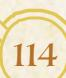

{115}------------------------------------------------

# Relics

Hidden away in the deepest ruins, artifacts of the Ancients lie untouched by denizen paws, treasures beyond reason that many would kill to possess. These relics are pursued—especially the Keepers in Iron—but they are so rare that many think they are merely a myth.

The truth is that there are fantastical objects left behind by the Ancients, tools and objets d'art (along with weapons and armor) whose construction defies all expectations. Sometimes they are made of materials no one recognizes or bear strange symbols and markings, but the one unifying factor among them is their incredible gifts, abilities, or powers that eclipse anything that could be constructed by an ordinary crafter of the Woodland.

The average relic has two to three of these abilities, some of which require the user to activate them in a particular way or charge them before they can function. That said, relics are items with wear and load, even if they are priceless!

Each relic is unique, so there's no standardized guide to creating new relics; any GM who wants to add a relic to their campaign can use the examples below or write a custom relic with unique powers (or modify one from another source).

## The Resonance Chime

#### Wear: 5 | Load: 0

Wooden chimes are used across the Woodland by skilled woodcrafters to create a pleasant natural music. Metal chimes are an extravagance known only to the truly wealthy. But the Resonance Chime is something else entirely. A blueish metal shot through with purple veins, the Resonance Chime somehow channels sound along its length. One end of the Chime is tapered inward, and the other expands outward slightly, giving the vaguest sense of a musical horn. When sound enters into the tapered end—the Listening end—it expands and grows louder when it leaves the other, expanded, Speaking end. The Resonance Chime seems capable of doing anything from expanding the voice of a speaker to reach a full crowd, to funneling a distant sound into a user's waiting ear. Usually, anyone carrying the Resonance Chime has to keep both ends plugged when not in use, to make sure it doesn't capture undesired sounds and spit them out more loudly at inopportune moments…but when the Speaking end alone is unplugged, and sound is poured into the Listening end, it can produce some dangerous effects.

The Resonance Chime is not an object of fable—most theories suggest that it was a fairly common tool used in ages past, to communicate across long distances. Perhaps in a vast array of such chimes, it could send messages even farther…

Chapter 5: New Playbooks 115

{116}------------------------------------------------

#### Ability: Listen

*When the Listening end of the Resonance Chime is aimed at any sound no closer than about 10 feet away and no farther than about 100 feet away, the Chime amplifies the sound out of its Speaking end. Someone who puts their ear to the Speaking end can hear conversations and suspicious noises easily this way. (If the Listening end is aimed at a conversation closer than 10 feet, it tends to produce too much noise for it to be effective as a listening device.)*

#### Ability: Speak

*When a user speaks into the Listening end of the Resonance Chime, their voice is amplified to reach up to 100 feet away as it exits the Speaking end of the Chime. They can easily speak to crowds or to distant individuals in this way. If speaking to a whole crowd at once, the Resonance Chime adds +1 ongoing to any moves to sway or affect the crowd when used in this way.*

#### Ability: Boom Charges:

*When the Speaking end of the Resonance Chime is plugged and sound is poured into the Listening end from close up, the sound becomes trapped inside the Chime, building up until it is released all at once. One shout into the Listening end is enough to start the resonance, marking one charge. Prolonged, extended, or particularly loud sounds can mark more charges all at once, at the GM's discretion.*

*As long as the Chime has charges marked, the sound continues to build; after a few minutes have passed, the GM marks another charge, and rolls 1d6; if the GM rolls under the number of charges marked on the Chime, then they mark as many boxes of wear as their roll. (For example, if the Chime has 3 charges, and the GM rolls a 2, they mark 2 wear.) If the Chime ever builds charge but has no more boxes to mark, the GM instead marks 2 boxes of wear on the Chime. The Chime can break in this way, exploding and releasing the sound all at once.*

*If the Chime explodes, then the thunderous force sweeps out from it. An explosion affects everything up to and including Close range if it has 1-3 charges, and everything up to and including Far range if it has 4 or more charges.*

*If the Chime's Speaking end is unplugged before the Chime explodes, it instead releases all of its charges in the direction of the Speaking end, reaching up to Close range (1-3 charges) or even up to Far range (4-6 charges). In both cases, the Chime inflicts exhaustion equal to its charges marked. If the target doesn't have enough exhaustion boxes to absorb all that harm, they take the excess as injury, possibly killing them. After discharging by unplugging the Speaking end, the Chime loses all charges.*

{117}------------------------------------------------

#### The Sunsap Prism

#### Wear: 4 (special; see Sunlight Uncontained) | Load: 0

It looks like a treasure on its face, a flawless prismatic crystal filled with golden sap. It gleams and glitters, but its true value only shows when it is left in the sun for a day. The sap somehow seems to absorb the warmth and light of the sun; after a day spent lying out under direct sunlight, the golden sap moves more fluidly and less viscously inside the prism, and it almost sparkles. When the prism is shaken forcefully, the sap begins to glow, exuding sunlight and warmth until it either runs out of its charge, or until someone gently rings the sides of the crystal in the correct sequence.

The Sunsap Prism is an oddity of the past, something that stories suggest was replicated countless times, with entire great halls filled with such gleaming sunlight prisms. But no one has ever found any evidence of others existing… save for this one relic.

#### Sunlight Contained Charges:

*The Sunsap Prism is usually depleted when found; no charges are marked. When the Sunsap Prism is left in sunlight for a day, it fully charges. Mark every charge box. Shake the Sunsap Prism forcefully to activate it, clearing a charge box and causing the Prism to exude a pleasant, bright light and warmth the equivalent of direct sunlight on a pleasant day. After being activated, the Prism will continue to emit light until it is entirely depleted or turned off. Clear another charge every time a few hours of activation pass. To turn it off, a user must know the special sequence of taps upon the prism's panels.*

#### Sunlight Uncontained

*The Sunsap Prism is durable, but not impossible to break with enough force—the equivalent of 4-wear marked on it in a single blow. If shattered, it releases all of its sunlight all at once; every unmarked charge box on the Prism inflicts 2-Injury on any creature within about 15 feet, and every creature who can see the exploding Prism is temporarily blinded.*

{118}------------------------------------------------

## The Calling Spear

#### Wear: 6 | Load: 1

Experienced metallurgeons might be familiar with the most basic principles of magnetism, especially through the use of lodestones. But the way that the Calling Spear works would baffle even them—some kind of directed, focused magnetism that only ever connects the spear and its gauntlet.

The gauntlet—a mix of copper and chrome and oddly oversized for any creature's paw—comes with the spear; when discovered, the gauntlet is most likely gripping the spear, and its digits are nigh-impossible to pry free of the spear's shaft. The spear itself is thin, the same mix of copper and a silvery metal, with a widened leaf-like razor sharp tip and channels spiraling down from the point.

Inside the gauntlet, there are small levers at the tip of each digit; when toggled down, they activate the calling mechanism and draw the spear back to the gauntlet, through the air, through water, even from the other side of a wall. The draw has about as much force as a strong wielder's throw. When the switches are toggled up, the mechanism turns off and the gauntlet and the spear are disconnected; the spear can be thrown without difficulty. In fact, the spear is rather perfectly designed to be thrown, those channels carved down its length helping it spin aerodynamically toward its target.

#### Throw

*The spear can be thrown easily, precisely, and at high speeds. It has an effective range of Far when thrown. When used to target someone, it inflicts 2-injury. On a 10+, instead of a second shot, it may simply deal another +2 injury. It can be used for any appropriate weapon skill moves at far range; treat it as if it has all appropriate weapon skill tags (GM's discretion).*

#### Call

*The spear can be called back by toggling the switches in the gauntlet on. The spear will fling itself back toward the gauntlet as best it can; as long as the user is unrestrained, they can catch the spear without much difficulty. The spear can be caught or otherwise captured as it flies through the air, but it will continue to pull toward the gauntlet, with about the same force as a hearty denizen pulling on it.*

#### Spear

*When used to engage in melee, the spear has close range and deals a total of 2-injury. If the gauntlet is toggled on, then the user cannot drop the spear for any reason in melee. The spear is not designed specifically for melee use, and is not treated as if it has any melee-oriented weapon skill tags.*

118 Root: The Roleplaying Game

{119}------------------------------------------------

#### The Stonewood Armor

#### Wear: Special; see tags below | Load: 2

Stories of Ancient Woodland monarchs often include the Stonewood Armor as a sign of their invincible prowess, their indomitable might. Made out of layered plates of petrified wood, the Stonewood Armor is immediately identifiable—even those who have simply heard stories about it would recognize the patterns of wooden veins forming diamond shapes up and down its arms and legs, just as described in the tales. The only color on the armor besides the gray-brown of petrified wood is the plume of green leaves atop the helmet…at least, when the Armor is well-fed. When the Armor is hungry, those leaves turn brownish and hang limply.

The Stonewood Armor almost seems to be a living plant unto itself; denizens familiar with the trees and plants of the Woodland can recognize signs of it being somehow alive, the plates held together by strands of hardened root. But that belies its darkest truth. The stories all say the Stonewood Armor draws strength from the Woodland, and that it does, quite directly. It bonds with the foliage and vegetation of the Woodland, drawing life itself from them to keep itself strong. Each time it feasts, it leaves a dead spot in the Woodland, killing all the plants in its reach to feed itself.

#### Invulnerable

*The Stonewood Armor cannot be destroyed or meaningfully damaged while assembled. When disassembled, it is possible that devoted antagonists might find a way to break individual pieces, but it would require extraordinary mechanisms and effort.*

#### Strength of the Wood Charges:

*When you leave the Stonewood Armor amid vegetation for at least a day, it will branch out and parasitically draw strength from that vegetation. Each day that it is left amid lush vegetation, it destroys that vegetation in a 40 foot radius—leaving it decayed and ruined—and marks every charge. If it is left for only half a day, it gains half as many charges; if it is left for less than half a day, it gains no charges. If it is left amid sparser vegetation, then it doesn't have enough material to draw from and marks no charges.*

*When you take a blow while wearing the Stonewood Armor, expend a marked charge to simply cancel out the blow.*

#### Bulky, Cumbersome, Weighty

*The Stonewood Armor is treated as if it has all three of these negative tags. (The additional load of Weighty is factored in above.)*

{120}------------------------------------------------

## The Cornucopian Cauldron

#### Wear: Special (see Indestructible Alloy) | Load: 0

Stories of the Cornucopian Cauldron say that any food placed in it is increased tenfold, that a simple meal could feed a whole army and give them enough strength to fight back rivers and climb mountains. In truth, it appears to be just a cauldron, albeit a well-made one. Well-seasoned, well-maintained, wellused, but certainly not capable of creating food from nothing. Pretty in its way, patterned with sprawling vines and berries, with shoots of wheat and corn. But just a very good cauldron, of more value to a cook than to a king.

Its true value sits in its composition. It's another alloy of the Ancients, black metal shot speckled with green and strands of blue. It is durable but also light and easy to carry. Metallurgeons of the Eyrie or the Marquisate would become rich beyond their wildest dreams, were they capable of recreating the Cornucopian Cauldron's materials.

Regardless, the Cornucopian Cauldron is hearty enough to be used as a makeshift shield or piece of armor…if the wielder is willing to deal with an object clearly not designed for such a purpose, and look more than a bit silly while doing it.

#### Indestructible Alloy

*The Cornucopian Cauldron is more or less impossible to destroy. Even if used to block the strikes of a strong, angry foe, it won't bend or break.*

#### Armor?

*One could wear the Cauldron as a makeshift helmet, or try to wield it as a shield, or even as a weapon…but that was never its intended purpose. When used as armor or a shield, it gives -1 ongoing to all physical moves made, but all incoming injury or exhaustion is reduced by 1. Notably, anyone wielding the Cauldron in this way also looks quite foolish and will likely be taunted or disregarded as a serious threat.*

#### Cooking

*The Cornucopian Cauldron is an excellent cooking tool. If used to cook meals and assist with exhaustion recovery, every 1-depletion spent on cooking creates a meal for about 5 denizens that clears 2-exhaustion; every additional depletion spent on the meal would improve the exhaustion cleared by another 2-exhaustion. Any vagabond who uses the Cornucopain Cauldron in any cooking moves automatically takes +1 ongoing on those moves.*

{121}------------------------------------------------

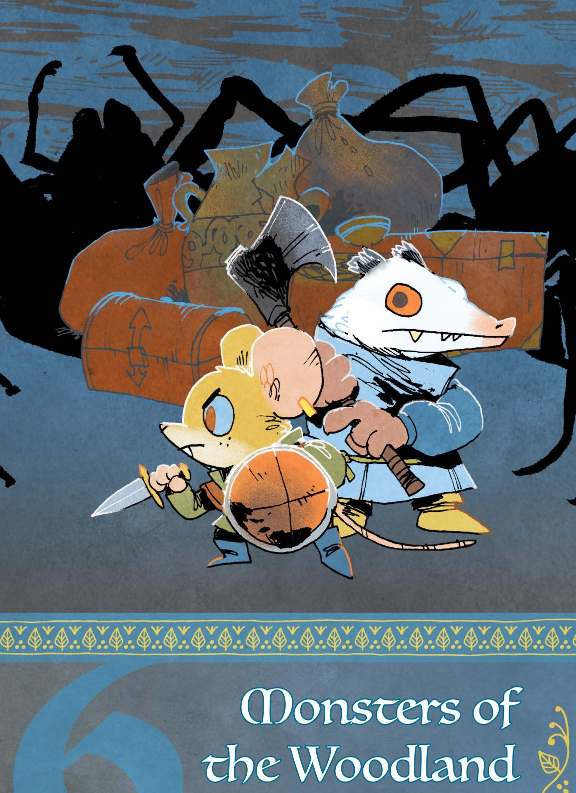

the Woodland

{122}------------------------------------------------

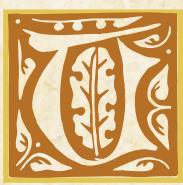

he monsters of the Woodland are usually found deep in the forests, off the paths that most denizens regard as safe. Some are even more reclusive and rare, haunting the lower ruins

or the dark waters of the largest lakes and rivers that lie between the clearings. From giant fish and fearsome beetles to swarms of enormous dragonflies and ants, these terrifying beasts are one of the primary reasons the darkest forests and deepest ruins are so lethal to those who seek the Woodland's wild and unexplored spaces.

Yet the great monsters of the Woodland are more than mere legends or myths, hidden in shadow and whispered about around a campfire. The denizens of the forest *know* they are real...and they deal with them more often than they would like. Fishers who spend their lives pulling food from the Woodland's lakes know that it's only a matter of time before they encounter a fish that thinks of them as a meal; the brave denizens who patrol the edges of a clearing keep an eye out for the signs of these great beasts—great bears, giant spiders, massive snakes, and more—as much as they look for evidence of deadly bandits and enemy soldiers.

#### Formidable Foes

While the monsters of the Woodland vary in size and lethality, they are distinguished from ordinary bugs, anthropods, and crustaceans by the danger they pose. These creatures are usually large, often many times the size of a single vagabond, and they wield ragged claws, sharp teeth, and deadly poisons to hunt down or drive off anything that attracts their attention. Some of them are predatory and will gladly stalk and kill denizens, but even those who are merely territorial are a serious threat.

Only a fool would hunt one of these monsters without careful planning; even the most disciplined soldiers of the Marquisate and the martial knights of the Keepers in Iron fear these lethal monsters. But just as every denizen knows that the monsters of the Woodland are real, so too do they know the only group that regularly deals with them successfully—vagabonds!

If a family of giant crabs moves close to a clearing—disrupting the clearing's fishing grounds and trade routes—the local denizens are far more likely to look for a few brave (or foolish!) vagabonds than they are to throw themselves into driving off the monsters. After all, it's much easier for a Marquisate commander to find another vagabond than it is to replace a whole patrol of soldiers.

{123}------------------------------------------------

#### A Woodland Bestiary

In the pages that follow, you can find examples of the monsters the vagabonds may encounter in their travels. Each one describes the beast—including where the vagabonds might find such a creature—then offers some thoughts on how to use them in play. Finally, each listing contains harm tracks for each monster, as well as monster traits that bring their most interesting features into play.

- Giant Trout In the deepest lakes, a shimmering menace lurks in the darkness, ready to rise to the surface and consume those foolish enough to enter its waters.
- Giant Fire Ants Individually weak, the threat of the Woodland's fire ants lies in their numbers; vast swarms of chitinous warriors can overwhelm a band of vagabonds in mere minutes.
- Giant Spider There is little in the Woodland as cunning, deadly, and dangerous as a giant spider; they haunt the trees and tunnels of the Woodland, waiting for prey that will never see the spider coming.
- **Giant Snake** One of the most common monsters in the Woodland, the giant snake is as common as it is deadly; nearly every vagabond has encountered a giant snake at some point in their travels.
- **Giant Scorpion** Found mostly in the cool darkness of the ruins, giant scorpions are known both for their bulk and their venom, either of which are likely to kill any denizen foolish enough to get close.
- Giant Hornet Few monsters are as angry as the giant hornet, especially when something disturbs their nest or queen; they are relentless and cruel in their pursuit of any who would harm their nest.
- Giant Honey Bee Not every monster desires to hunt and devour the denizens of the Woodlands; giant honey bees are mostly peaceful, but the lure of their honey is so great...
- Giant Hercules Beetle Brandishing large horns and a might carapace, the giant beetle is a frightening sight, but they are largely docile. Experienced vagabonds know that their buik still makes them dangerous, especially in mating season!
- Giant Alligator Some Lizard Cultists may claim giant alligators are cousins
  to the Great Wyrm, but any denizen who has dealt with a giant alligator
  personally knows they are hunger personified—a raging, empty maw.
- Giant Carnivorous Plant The Woodland has many dangerous fauna... and some dangerous flora as well. Immobile and enticing, the giant carnivorous plant has lured more than one vagabond to their doom.

{124}------------------------------------------------

**Description:** In the lakes and deep waters of the Woodland, rumors abound of fish large enough to swallow unsuspecting fishers alive, boat and all. Fortunately, most of these rumors are just that—stories meant to keep young denizens from swimming out too far into dangerous waters; tales spun by old fisherfolk who long to relive the glory days of their youth around the fire.

Sometimes, the stories have more…teeth. Fishers returning to port with torn nets, broken rods, and boats scored with teeth marks; veteran anglers sailing home with eyes hollow, hearts shaken, and the word "monster" upon their trembling lips. In some clearings, kingly bounties have been posted for the capture of these legendary beasts. These generous rewards have attracted the attention of many vagabonds, many of whom set out on the water ready for a hunt…never to be seen nor heard from again.

GM Advice: The giant trout is a truly dangerous foe. It is tough, deals a lot of damage, and can swallow a vagabond whole. This monster works best as a looming threat, one the vagabonds have to prepare and plan for lest they enter a fight they cannot win. Bands without martial characters may need to find completely alternative ways of dealing with such a beast!

Because a giant trout is so dangerous, introducing this monster requires some forethought about why the vagabonds would engage it. Perhaps a fisherman lost someone to the creature and is willing to pay someone to kill it…or maybe a clearing without anything to offer has to beg the vagabonds for help. That said, a band could always happen upon a giant trout by chance while traveling from one clearing to another across a large body of water…

Long before the PCs engage the trout, foreshadow the danger it represents: dark shapes in the water, the flick of a fin as it slips beneath the dark waters, an ominous splash in the distance.

When the vagabonds finally face the giant trout, be sure to play up the epic nature of this life and death struggle. Have the vagabonds come eye to eye with the massive creature, describe how it thrashes through the water, threatening to capsize their boat or how it spreads its mighty jaws before the vagabonds to reveal a gaping maw.

{125}------------------------------------------------

# Giant Grout Statblock |

• **Bullheaded**: Once angered or injured, this monster attacks directly and fiercely, repeatedly pursuing its prey until successful or driven off.

#### TRAITS:

- Aquatic: Characters can't target this monster with weapon moves while it's underwater without special equipment (spears, underwater mines, etc.).
- Terrifying: Engaging in melee with this monster requires vagabonds to mark exhaustion. NPCs will never voluntarily engage it, except in large mobs.
- **Aggressive**: This monster marks exhaustion when inflicting harm to inflict an additional harm.
- Entangling (Vomerine Teeth): After inflicting harm on a vulnerable target, this monster marks exhaustion to entangle their target; the target cannot shift ranges or use any ranged weaponry until they successfully break free.

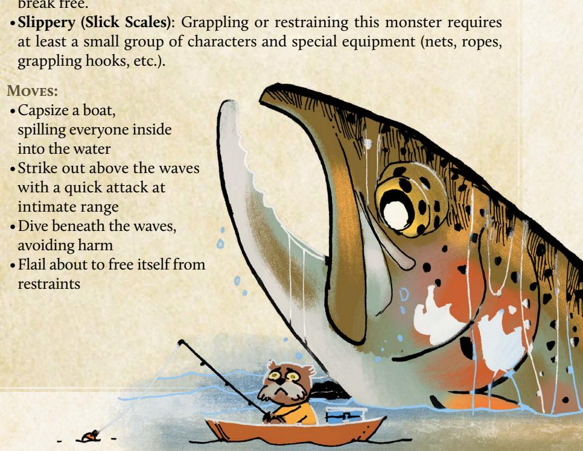

{126}------------------------------------------------

**Description:** The factions of the Woodland aren't the only ones expanding their influence from clearing to clearing. From time to time, a legion of giant fire ants goes on the march both above and below ground, digging new tunnels in eternally loyal service to their queen. The forces of the Grand Duchy, in particular, are all too familiar with the sting of the fire ants; more than one burrow has stories about a neighboring burrow swallowed up by a tide of red chitin.

Some of these ant colonies have taken up residence in ancient ruins. Displacing them is a complex challenge for factions looking to delve into the ancient ruins—especially the Keepers in Iron. Several expeditions have found their ventures stymied by the venomous pests, driven back from underground treasures by bugs who only care about expanding their hive.

If their numbers grow and food becomes scarce, the fire ants sometimes move above ground in droves to search for sustenance for burgeoning hives. The emergence of these ants often leads controlling factions to hire vagabonds to exterminate the ants before an entire clearing is lost.

GM Advice: A single giant fire ant is easy to kill, but a swarm can overwhelm even a well-armed band of vagabonds. Within their nest, the ants attack with little provocation—often fighting to the death. Only the call of their queen can calm them! Outside their territory, they are usually skittish, retreating as soon as they encounter serious resistance.

Vagabonds are most likely to confront giant ants in and around ruins or the ants' nest. Factions who send vagabonds out to investigate rumors of stolen supplies or missing soldiers usually don't know that giant ants are lurking in the woods, but it won't take long for the vagabonds to realize who is responsible when they find a few giant ant corpses and clear signs of things being dragged toward the nest.

When the vagabonds confront a swarm of giant ants, be sure to narrate when the party is close to being overrun or when they are close to driving the ants away. If they are overrun, you don't have to kill any of the vagabonds; you can instead run them off—with serious injuries—or even have one or two heavily injured

vagabonds be dragged down into the hive when the ants believe them to be dead.

126 Root: The Roleplaying Game

{127}------------------------------------------------

#### Giant Fire Ant Statblocks Harm Inflicted*: 1-injury (Individual)* **Instinct:** •**Protective:** This monster aggressively defends its home, fighting to the death against intruders; if found outside its home, the monster will retreat if confronted or provoked. **Traits:** •**Swarm (support 6) :** When more than a small mob of these monsters gather (10), they gain a swarm track with ten boxes, half of which begin marked, and a number of d6s equal to their support. Any injury done to them clears a swarm box instead of inflicting harm; if the track is cleared, the swarm disperses. When something would attract more monsters to the swarm, the GM rolls 1d6 from the support pool and and marks half (round up) the total on the track to add more monsters, then discards the die; if the track is filled, characters engaged with the swarm are overrun—killed, captured, or run off, GM's choice. If the support pool is exhausted, no more of the monsters appear. •**Hardened (Chitinous Shell):** This monster ignores the first injury harm inflicted by every successful attack; this tag does not reduce injury done to a swarm track. •**Venomous (Sting):** The first time this monster injures a target, it marks exhaustion when inflicting injury to inflict 2-exhaustion. •**Sharp (Mandibles):** When harm inflicted by this monster is marked as wear, the target of the attack must mark 1 additional wear. •**Hivemind:** This monster does not suffer morale harm; if the queen ant is ever killed, the colony disperses and fades over a few weeks as the drones seek out a new colony to join. **Moves:** •Bury someone beneath a tide of bodies •Clamp down on a limb or weapon Individual **exhaustion injury wear morale** Small Mob **exhaustion injury wear morale** Swarm **Swarm Track** Queen **exhaustion injury wear morale**

•Scurry across rough or even vertical terrain

•Summon giant fire ants to the area

{128}------------------------------------------------

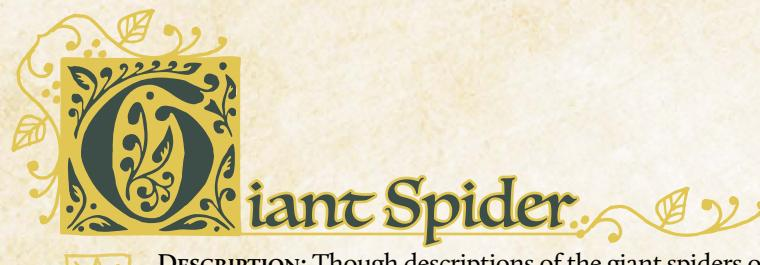

**Description:** Though descriptions of the giant spiders of the woodland vary, all are linked by three touchstones: the number of appendages (eight); the number of eyes (eight, again); and a pulsing, strange abdomen swollen with all the denizens who couldn't run fast enough.

Ground species are highly territorial, and far more aggressive than their arboreal cousins. The latter aren't docile, but prefer their sticky webs to do the work of capturing prey. Failing that, both species are imbued with enough venom to paralyze their targets. What the spider cannot eat now, it will eat later; the giant spiders use their digestive enzymes to slowly liquefy their prey before drinking up their insides.

That isn't to say giant spiders don't have their uses. The Corvid Conspiracy is always interested in acquiring spider venom for their poisonous plots, while well-educated herbalists covet samples of both their silk and venom for medicinal study. Outside the Woodland, clothing made from giant spider byproducts is regarded as the height of luxury and fashion, and the River Company is always happy to purchase the raw materials necessary to weave it.

GM Advice: The threat a giant spider poses can be easily tailored to a band's abilities, as well as nearby locations. Terrestrial species tend to hole up in caves, ruins, and other dank places, such as catacombs, while arboreal varieties might infest forest canopies, abandoned bell towers, and roosts. Even when they aren't directly involved in attacking a clearing, giant spiders can sow chaos by virtue of their mere existence, attracting vagabonds and other flavors of adventurers keen to hunt the beasts.

In battle, giant spiders depend largely on their ability to get the drop on their opponents. They are quick heavy-hitters, but if they're unable to subdue their intended prey quickly, they often flee, more interested in living to fight another day than they are in dying for any particular cause. Their lengthy exhaustion track enables them to defend themselves rigorously, but they look for a way out as soon as the tide turns.

As you're considering how to best incorporate giant spiders into your campaign, remember that tension is fundamental to suspense. Before the vagabonds encounter the creature, you can leave a trail of eerie breadcrumbs for them to follow: thick, sticky webs blocking a forest path; the desiccated remains of another monster; an outpost devoid of residents who have either fled the threat, or succumbed to it. Perhaps there's a survivor whose grisly tales set the vagabonds on their path, or whose rescue opens up other opportunities down the line.

{129}------------------------------------------------

# Giant Spider Statblock |

#### INSTINCT

• **Predatory**: This monster is constantly searching for food, attacking anything it thinks it can consume; if seriously threatened, flees to safety.

#### TRAITS:

- Aggressive (Terrestrial Species): When attacking a target that appears threatening or dangerous, this monster marks exhaustion when inflicting harm to inflict an additional harm.
- **Stealthy (Arboreal Species)**: Once per session, this monster can appear without warning, grab a character, and vanish, bringing their captive back to a safe place or lair.
- Entangling (Webs): After inflicting harm on a vulnerable target, this monster marks exhaustion to entangle their target; the target cannot shift ranges or use any ranged weaponry until they successfully break free.
- Terrifying: Engaging in melee with this monster requires vagabonds to mark exhaustion. NPCs will never voluntarily engage it, except in large mobs.

• **Venomous (Bite)**: The first time this monster injures a target with its venomous part each fight—teeth, stinger, etc.—it marks one exhaustion when inflicting injury to inflict 2-exhaustion.

{130}------------------------------------------------

**Description:** For the Woodland's burrowing species, snakes are often a chief concern, a constant threat that can sneak up on the most attentive digger of holes. But for those who dive even deeper than where most molefolk fear to tread, the threat looms larger. There, in the world's most forgotten places, coils the stuff of nightmares: leviathans, capable of swallowing bands of vagabonds and their illgotten gains whole. From the barnacle-crusted sea snakes of Bertram's Cove to the timber rattlers brumating in Sixtoe Stand's limestone crevasses, the Woodland teems with serpentine life. Yet not all Giant Snakes are created equally, making cataloguing these highly adaptable predators an important field of study for ambitious vagabonds who wish to see all the various monsters of the Woodland.

So-called "snake oil" is a favorite con of the woodland's charlatans, who often charge exorbitant amounts of coin for shed skin suspended in a jar of vegetable oil. That said, giant snakes' scales can be molded into armor and shields, or as construction material. Certain branches of the Lizard Cult use a diluted version of giant snake venom in their rituals, believing the right supplicant can achieve communion with the Great Wyrm through imbibing.

GM Advice: Giant snakes are one of the most common threats and can range from an easily banished nuisance to a legendary foe. A smaller version might have 2–3 fewer boxes of each harm track and lack the Venomous trait, while the largest might double every harm track and add Terrifying. Some snakes might also have traits like Hardened or Sharp to reflect the toughness of their scales or teeth!

A giant snake's primary drive is to consume, with survival coming in at a close second. Almost all species have speed on their side, and can easily overwhelm vagabonds with their proclivity for changing range before most can blink. In addition to using the Stealthy trait to snatch up a single character and abscond with them back to the snake's lair, most snakes also vary their tactics based on the terrain—broad open spaces mean the snake will strike from multiple angles before retreating, while tight tunnels allow the snake to limit the number of characters who can attack it at once to only one or two combatants.

{131}------------------------------------------------

| Siant Snake Statblock                                                                                                                                                                          |                                                                                                                                                                                                                                                                                                                                                                                                                                                                                                                                                                                                                                                                                                                                                                                                                                                                                                                                                                                                                                                                                                                                                                                                                                                                                                                                                                                                                                                                                                                                                                                                                                                                                                                                                                                                                                                                                                                                                                                                                                                                                                                                |
|------------------------------------------------------------------------------------------------------------------------------------------------------------------------------------------------|--------------------------------------------------------------------------------------------------------------------------------------------------------------------------------------------------------------------------------------------------------------------------------------------------------------------------------------------------------------------------------------------------------------------------------------------------------------------------------------------------------------------------------------------------------------------------------------------------------------------------------------------------------------------------------------------------------------------------------------------------------------------------------------------------------------------------------------------------------------------------------------------------------------------------------------------------------------------------------------------------------------------------------------------------------------------------------------------------------------------------------------------------------------------------------------------------------------------------------------------------------------------------------------------------------------------------------------------------------------------------------------------------------------------------------------------------------------------------------------------------------------------------------------------------------------------------------------------------------------------------------------------------------------------------------------------------------------------------------------------------------------------------------------------------------------------------------------------------------------------------------------------------------------------------------------------------------------------------------------------------------------------------------------------------------------------------------------------------------------------------------|
|                                                                                                                                                                                                | EXHAUSTION                                                                                                                                                                                                                                                                                                                                                                                                                                                                                                                                                                                                                                                                                                                                                                                                                                                                                                                                                                                                                                                                                                                                                                                                                                                                                                                                                                                                                                                                                                                                                                                                                                                                                                                                                                                                                                                                                                                                                                                                                                                                                                                     |
|                                                                                                                                                                                                | INJURY                                                                                                                                                                                                                                                                                                                                                                                                                                                                                                                                                                                                                                                                                                                                                                                                                                                                                                                                                                                                                                                                                                                                                                                                                                                                                                                                                                                                                                                                                                                                                                                                                                                                                                                                                                                                                                                                                                                                                                                                                                                                                                                         |
|                                                                                                                                                                                                | WEAR                                                                                                                                                                                                                                                                                                                                                                                                                                                                                                                                                                                                                                                                                                                                                                                                                                                                                                                                                                                                                                                                                                                                                                                                                                                                                                                                                                                                                                                                                                                                                                                                                                                                                                                                                                                                                                                                                                                                                                                                                                                                                                                           |
|                                                                                                                                                                                                | MORALE                                                                                                                                                                                                                                                                                                                                                                                                                                                                                                                                                                                                                                                                                                                                                                                                                                                                                                                                                                                                                                                                                                                                                                                                                                                                                                                                                                                                                                                                                                                                                                                                                                                                                                                                                                                                                                                                                                                                                                                                                                                                                                                         |
| larm Inflicted: 2-injury                                                                                                                                                                       |                                                                                                                                                                                                                                                                                                                                                                                                                                                                                                                                                                                                                                                                                                                                                                                                                                                                                                                                                                                                                                                                                                                                                                                                                                                                                                                                                                                                                                                                                                                                                                                                                                                                                                                                                                                                                                                                                                                                                                                                                                                                                                                                |
|                                                                                                                                                                                                |                                                                                                                                                                                                                                                                                                                                                                                                                                                                                                                                                                                                                                                                                                                                                                                                                                                                                                                                                                                                                                                                                                                                                                                                                                                                                                                                                                                                                                                                                                                                                                                                                                                                                                                                                                                                                                                                                                                                                                                                                                                                                                                                |
|                                                                                                                                                                                                | stantly searching for food, attacking f seriously threatened, flees to safety.                                                                                                                                                                                                                                                                                                                                                                                                                                                                                                                                                                                                                                                                                                                                                                                                                                                                                                                                                                                                                                                                                                                                                                                                                                                                                                                                                                                                                                                                                                                                                                                                                                                                                                                                                                                                                                                                                                                                                                                                                                                 |
|                                                                                                                                                                                                | and the state of the state of the state of the state of the state of the state of the state of the state of the state of the state of the state of the state of the state of the state of the state of the state of the state of the state of the state of the state of the state of the state of the state of the state of the state of the state of the state of the state of the state of the state of the state of the state of the state of the state of the state of the state of the state of the state of the state of the state of the state of the state of the state of the state of the state of the state of the state of the state of the state of the state of the state of the state of the state of the state of the state of the state of the state of the state of the state of the state of the state of the state of the state of the state of the state of the state of the state of the state of the state of the state of the state of the state of the state of the state of the state of the state of the state of the state of the state of the state of the state of the state of the state of the state of the state of the state of the state of the state of the state of the state of the state of the state of the state of the state of the state of the state of the state of the state of the state of the state of the state of the state of the state of the state of the state of the state of the state of the state of the state of the state of the state of the state of the state of the state of the state of the state of the state of the state of the state of the state of the state of the state of the state of the state of the state of the state of the state of the state of the state of the state of the state of the state of the state of the state of the state of the state of the state of the state of the state of the state of the state of the state of the state of the state of the state of the state of the state of the state of the state of the state of the state of the state of the state of the state of the state of the state of the state of t |
| Entangling (Coils): After inflicting homoster marks exhaustion to entangranges or use any ranged weaponry to Slippery: Grappling or restraining the group of characters and special equipages. | gle their target; the target cannot shift until they successfully break free. his monster requires at least a small                                                                                                                                                                                                                                                                                                                                                                                                                                                                                                                                                                                                                                                                                                                                                                                                                                                                                                                                                                                                                                                                                                                                                                                                                                                                                                                                                                                                                                                                                                                                                                                                                                                                                                                                                                                                                                                                                                                                                                                                      |
| grappling hooks, etc.). <b>Stealthy</b> : Once per session, this monster can appear without                                                                                                    | 1,05                                                                                                                                                                                                                                                                                                                                                                                                                                                                                                                                                                                                                                                                                                                                                                                                                                                                                                                                                                                                                                                                                                                                                                                                                                                                                                                                                                                                                                                                                                                                                                                                                                                                                                                                                                                                                                                                                                                                                                                                                                                                                                                           |
| warning, grab a character, and vanish, bringing their captive                                                                                                                                  |                                                                                                                                                                                                                                                                                                                                                                                                                                                                                                                                                                                                                                                                                                                                                                                                                                                                                                                                                                                                                                                                                                                                                                                                                                                                                                                                                                                                                                                                                                                                                                                                                                                                                                                                                                                                                                                                                                                                                                                                                                                                                                                                |
| back to a safe place or lair.                                                                                                                                                                  | 1                                                                                                                                                                                                                                                                                                                                                                                                                                                                                                                                                                                                                                                                                                                                                                                                                                                                                                                                                                                                                                                                                                                                                                                                                                                                                                                                                                                                                                                                                                                                                                                                                                                                                                                                                                                                                                                                                                                                                                                                                                                                                                                              |
| <b>Venomous (Bite)</b> : The first time this monster injures                                                                                                                                   | (OR                                                                                                                                                                                                                                                                                                                                                                                                                                                                                                                                                                                                                                                                                                                                                                                                                                                                                                                                                                                                                                                                                                                                                                                                                                                                                                                                                                                                                                                                                                                                                                                                                                                                                                                                                                                                                                                                                                                                                                                                                                                                                                                            |
| a target with its venomous                                                                                                                                                                     | 166                                                                                                                                                                                                                                                                                                                                                                                                                                                                                                                                                                                                                                                                                                                                                                                                                                                                                                                                                                                                                                                                                                                                                                                                                                                                                                                                                                                                                                                                                                                                                                                                                                                                                                                                                                                                                                                                                                                                                                                                                                                                                                                            |
| part each fight—teeth,                                                                                                                                                                         | The state of the state of the state of the state of the state of the state of the state of the state of the state of the state of the state of the state of the state of the state of the state of the state of the state of the state of the state of the state of the state of the state of the state of the state of the state of the state of the state of the state of the state of the state of the state of the state of the state of the state of the state of the state of the state of the state of the state of the state of the state of the state of the state of the state of the state of the state of the state of the state of the state of the state of the state of the state of the state of the state of the state of the state of the state of the state of the state of the state of the state of the state of the state of the state of the state of the state of the state of the state of the state of the state of the state of the state of the state of the state of the state of the state of the state of the state of the state of the state of the state of the state of the state of the state of the state of the state of the state of the state of the state of the state of the state of the state of the state of the state of the state of the state of the state of the state of the state of the state of the state of the state of the state of the state of the state of the state of the state of the state of the state of the state of the state of the state of the state of the state of the state of the state of the state of the state of the state of the state of the state of the state of the state of the state of the state of the state of the state of the state of the state of the state of the state of the state of the state of the state of the state of the state of the state of the state of the state of the state of the state of the state of the state of the state of the state of the state of the state of the state of the state of the state of the state of the state of the state of the state of the state of the state of the state of the s |
| stinger, etc.—it marks                                                                                                                                                                         | GHT.                                                                                                                                                                                                                                                                                                                                                                                                                                                                                                                                                                                                                                                                                                                                                                                                                                                                                                                                                                                                                                                                                                                                                                                                                                                                                                                                                                                                                                                                                                                                                                                                                                                                                                                                                                                                                                                                                                                                                                                                                                                                                                                           |
| one exhaustion when                                                                                                                                                                            |                                                                                                                                                                                                                                                                                                                                                                                                                                                                                                                                                                                                                                                                                                                                                                                                                                                                                                                                                                                                                                                                                                                                                                                                                                                                                                                                                                                                                                                                                                                                                                                                                                                                                                                                                                                                                                                                                                                                                                                                                                                                                                                                |
| inflicting injury to inflict 2-exhaustion.                                                                                                                                                     |                                                                                                                                                                                                                                                                                                                                                                                                                                                                                                                                                                                                                                                                                                                                                                                                                                                                                                                                                                                                                                                                                                                                                                                                                                                                                                                                                                                                                                                                                                                                                                                                                                                                                                                                                                                                                                                                                                                                                                                                                                                                                                                                |
| minet z-exmaustion.                                                                                                                                                                            |                                                                                                                                                                                                                                                                                                                                                                                                                                                                                                                                                                                                                                                                                                                                                                                                                                                                                                                                                                                                                                                                                                                                                                                                                                                                                                                                                                                                                                                                                                                                                                                                                                                                                                                                                                                                                                                                                                                                                                                                                                                                                                                                |
| loves:                                                                                                                                                                                         |                                                                                                                                                                                                                                                                                                                                                                                                                                                                                                                                                                                                                                                                                                                                                                                                                                                                                                                                                                                                                                                                                                                                                                                                                                                                                                                                                                                                                                                                                                                                                                                                                                                                                                                                                                                                                                                                                                                                                                                                                                                                                                                                |
| Coil around a target, restraining them                                                                                                                                                         |                                                                                                                                                                                                                                                                                                                                                                                                                                                                                                                                                                                                                                                                                                                                                                                                                                                                                                                                                                                                                                                                                                                                                                                                                                                                                                                                                                                                                                                                                                                                                                                                                                                                                                                                                                                                                                                                                                                                                                                                                                                                                                                                |
| Sacrifice a position                                                                                                                                                                           |                                                                                                                                                                                                                                                                                                                                                                                                                                                                                                                                                                                                                                                                                                                                                                                                                                                                                                                                                                                                                                                                                                                                                                                                                                                                                                                                                                                                                                                                                                                                                                                                                                                                                                                                                                                                                                                                                                                                                                                                                                                                                                                                |
| in favor of a swift and                                                                                                                                                                        |                                                                                                                                                                                                                                                                                                                                                                                                                                                                                                                                                                                                                                                                                                                                                                                                                                                                                                                                                                                                                                                                                                                                                                                                                                                                                                                                                                                                                                                                                                                                                                                                                                                                                                                                                                                                                                                                                                                                                                                                                                                                                                                                |
| powerful strike                                                                                                                                                                                |                                                                                                                                                                                                                                                                                                                                                                                                                                                                                                                                                                                                                                                                                                                                                                                                                                                                                                                                                                                                                                                                                                                                                                                                                                                                                                                                                                                                                                                                                                                                                                                                                                                                                                                                                                                                                                                                                                                                                                                                                                                                                                                                |
| Slip into a hard-to-                                                                                                                                                                           |                                                                                                                                                                                                                                                                                                                                                                                                                                                                                                                                                                                                                                                                                                                                                                                                                                                                                                                                                                                                                                                                                                                                                                                                                                                                                                                                                                                                                                                                                                                                                                                                                                                                                                                                                                                                                                                                                                                                                                                                                                                                                                                                |
| reach place to avoid damage                                                                                                                                                                    |                                                                                                                                                                                                                                                                                                                                                                                                                                                                                                                                                                                                                                                                                                                                                                                                                                                                                                                                                                                                                                                                                                                                                                                                                                                                                                                                                                                                                                                                                                                                                                                                                                                                                                                                                                                                                                                                                                                                                                                                                                                                                                                                |
| Immediately strike and then chang                                                                                                                                                              | ge range                                                                                                                                                                                                                                                                                                                                                                                                                                                                                                                                                                                                                                                                                                                                                                                                                                                                                                                                                                                                                                                                                                                                                                                                                                                                                                                                                                                                                                                                                                                                                                                                                                                                                                                                                                                                                                                                                                                                                                                                                                                                                                                       |
| before anyone can react                                                                                                                                                                        |                                                                                                                                                                                                                                                                                                                                                                                                                                                                                                                                                                                                                                                                                                                                                                                                                                                                                                                                                                                                                                                                                                                                                                                                                                                                                                                                                                                                                                                                                                                                                                                                                                                                                                                                                                                                                                                                                                                                                                                                                                                                                                                                |

{132}------------------------------------------------

**Description:** Few arthropods are as well-armed and well-armored as the Giant Scorpion. Sporting two massive, crab-like pincers and a long, sickleshaped tail, these aggressive predators pose a triple-threat to anything they deem to be aggressive toward them. And of course, one mustn't forget the venom sac attached to their stinger.

While giant scorpions tend to prefer arid climates, sightings have been reported in virtually all corners of the Woodland. Wherever there is significant vegetation or debris for them to hide under, they flourish, and are especially fond of ruins, where expedition crews are likely to find them breeding or hibernating in dark, seething clusters.

Weapons and armor crafted from the scorpion's chitin are exceedingly rare, given the effort it takes to acquire it (and expensive, unless those commissioning it can provide the materials). The River Company is always looking for more carapaces to stockpile, and are the most common source of Giant Scorpion bounties.

GM Advice: Giant scorpions are formidable, but not impossible to defeat—a soft, gooey center lurks beneath their hardened exoskeletons, one they hope to distract enemies from by employing diversionary and brutish tactics. The closer a vagabond gets to a giant scorpion, the more likely they are to inflict an injury between the scorpion's natural plating; thus, these beasts prefer to keep their prey (or potential predators) at a distance, using multi-target attacks such as its tail swipe or blinding sand to give itself time to widen the gap—while ensuring its targets remain within range of its stinger.

Should the giant scorpion incapacitate something it deems edible, it will try to escape with them in its claws, provided it believes it can get away. If any remaining threats seem too great, the scorpion will continue to attempt to drive it off or flee—whichever increases its odds of survival. A giant scorpion is unlikely to devour a victim in the midst of a battle; they prefer to eat their meals in a place of safety, as the slow process of extracting their prey's innards can leave the scorpion vulnerable to attack. That delay gives vagabonds time to rescue any friends or beloved NPCs the giant scorpion might have dragged off as a snack!

{133}------------------------------------------------

| Giant Scorpion Statblock                                                                                                                                                                                                                                                                                                                                                                                                                                                                                                                                                                                                                                                                                                                                                                                                                                                                                                                                                                                                                                                                                                                                                                                                                                                                                                                                                                                                                                                                                                                                                                                                                                                                                                                                                                                                                                                                                                                                                                                                                                                                                                      |   |
|-------------------------------------------------------------------------------------------------------------------------------------------------------------------------------------------------------------------------------------------------------------------------------------------------------------------------------------------------------------------------------------------------------------------------------------------------------------------------------------------------------------------------------------------------------------------------------------------------------------------------------------------------------------------------------------------------------------------------------------------------------------------------------------------------------------------------------------------------------------------------------------------------------------------------------------------------------------------------------------------------------------------------------------------------------------------------------------------------------------------------------------------------------------------------------------------------------------------------------------------------------------------------------------------------------------------------------------------------------------------------------------------------------------------------------------------------------------------------------------------------------------------------------------------------------------------------------------------------------------------------------------------------------------------------------------------------------------------------------------------------------------------------------------------------------------------------------------------------------------------------------------------------------------------------------------------------------------------------------------------------------------------------------------------------------------------------------------------------------------------------------|---|
| EXHAUSTION                                                                                                                                                                                                                                                                                                                                                                                                                                                                                                                                                                                                                                                                                                                                                                                                                                                                                                                                                                                                                                                                                                                                                                                                                                                                                                                                                                                                                                                                                                                                                                                                                                                                                                                                                                                                                                                                                                                                                                                                                                                                                                                    |   |
|                                                                                                                                                                                                                                                                                                                                                                                                                                                                                                                                                                                                                                                                                                                                                                                                                                                                                                                                                                                                                                                                                                                                                                                                                                                                                                                                                                                                                                                                                                                                                                                                                                                                                                                                                                                                                                                                                                                                                                                                                                                                                                                               |   |
| □ ♦ □ □ □ □ WEAR                                                                                                                                                                                                                                                                                                                                                                                                                                                                                                                                                                                                                                                                                                                                                                                                                                                                                                                                                                                                                                                                                                                                                                                                                                                                                                                                                                                                                                                                                                                                                                                                                                                                                                                                                                                                                                                                                                                                                                                                                                                                                                              |   |
| □ ♦ □ □ □ □ MORALE                                                                                                                                                                                                                                                                                                                                                                                                                                                                                                                                                                                                                                                                                                                                                                                                                                                                                                                                                                                                                                                                                                                                                                                                                                                                                                                                                                                                                                                                                                                                                                                                                                                                                                                                                                                                                                                                                                                                                                                                                                                                                                            |   |
| Harm Inflicted: 2-injury                                                                                                                                                                                                                                                                                                                                                                                                                                                                                                                                                                                                                                                                                                                                                                                                                                                                                                                                                                                                                                                                                                                                                                                                                                                                                                                                                                                                                                                                                                                                                                                                                                                                                                                                                                                                                                                                                                                                                                                                                                                                                                      |   |
| Instinct:                                                                                                                                                                                                                                                                                                                                                                                                                                                                                                                                                                                                                                                                                                                                                                                                                                                                                                                                                                                                                                                                                                                                                                                                                                                                                                                                                                                                                                                                                                                                                                                                                                                                                                                                                                                                                                                                                                                                                                                                                                                                                                                     |   |
| • <b>Protective</b> : This monster aggressively defends its home, fighting to the death against intruders; if found outside its home, the monster will retreat if confronted or provoked.                                                                                                                                                                                                                                                                                                                                                                                                                                                                                                                                                                                                                                                                                                                                                                                                                                                                                                                                                                                                                                                                                                                                                                                                                                                                                                                                                                                                                                                                                                                                                                                                                                                                                                                                                                                                                                                                                                                                     |   |
| TRAITS:                                                                                                                                                                                                                                                                                                                                                                                                                                                                                                                                                                                                                                                                                                                                                                                                                                                                                                                                                                                                                                                                                                                                                                                                                                                                                                                                                                                                                                                                                                                                                                                                                                                                                                                                                                                                                                                                                                                                                                                                                                                                                                                       |   |
| • Hardened (Chitinous Shell): This monster ignores the first injury inflicted by every successful attack; this tag does not reduce injury done to a swarm track.                                                                                                                                                                                                                                                                                                                                                                                                                                                                                                                                                                                                                                                                                                                                                                                                                                                                                                                                                                                                                                                                                                                                                                                                                                                                                                                                                                                                                                                                                                                                                                                                                                                                                                                                                                                                                                                                                                                                                              |   |
| • Sharp (Pincers): When harm inflicted by this monster is marked as wear,                                                                                                                                                                                                                                                                                                                                                                                                                                                                                                                                                                                                                                                                                                                                                                                                                                                                                                                                                                                                                                                                                                                                                                                                                                                                                                                                                                                                                                                                                                                                                                                                                                                                                                                                                                                                                                                                                                                                                                                                                                                     |   |
| • Titanic: This creature cannot be restrained without equipment                                                                                                                                                                                                                                                                                                                                                                                                                                                                                                                                                                                                                                                                                                                                                                                                                                                                                                                                                                                                                                                                                                                                                                                                                                                                                                                                                                                                                                                                                                                                                                                                                                                                                                                                                                                                                                                                                                                                                                                                                                                               |   |
| • <b>Itanic</b> : I his creature cannot be restrained without equipment specifically designed for its containment.                                                                                                                                                                                                                                                                                                                                                                                                                                                                                                                                                                                                                                                                                                                                                                                                                                                                                                                                                                                                                                                                                                                                                                                                                                                                                                                                                                                                                                                                                                                                                                                                                                                                                                                                                                                                                                                                                                                                                                                                            |   |
| • Venomous (Stinger): The first time this monster                                                                                                                                                                                                                                                                                                                                                                                                                                                                                                                                                                                                                                                                                                                                                                                                                                                                                                                                                                                                                                                                                                                                                                                                                                                                                                                                                                                                                                                                                                                                                                                                                                                                                                                                                                                                                                                                                                                                                                                                                                                                             |   |
| injures a target with its venomous part                                                                                                                                                                                                                                                                                                                                                                                                                                                                                                                                                                                                                                                                                                                                                                                                                                                                                                                                                                                                                                                                                                                                                                                                                                                                                                                                                                                                                                                                                                                                                                                                                                                                                                                                                                                                                                                                                                                                                                                                                                                                                       |   |
| each fight—teeth, stinger, etc.—\nit marks one exhaustion when inflicting                                                                                                                                                                                                                                                                                                                                                                                                                                                                                                                                                                                                                                                                                                                                                                                                                                                                                                                                                                                                                                                                                                                                                                                                                                                                                                                                                                                                                                                                                                                                                                                                                                                                                                                                                                                                                                                                                                                                                                                                                                                     |   |
| injury to inflict 2-exhaustion.                                                                                                                                                                                                                                                                                                                                                                                                                                                                                                                                                                                                                                                                                                                                                                                                                                                                                                                                                                                                                                                                                                                                                                                                                                                                                                                                                                                                                                                                                                                                                                                                                                                                                                                                                                                                                                                                                                                                                                                                                                                                                               |   |
| Moves:                                                                                                                                                                                                                                                                                                                                                                                                                                                                                                                                                                                                                                                                                                                                                                                                                                                                                                                                                                                                                                                                                                                                                                                                                                                                                                                                                                                                                                                                                                                                                                                                                                                                                                                                                                                                                                                                                                                                                                                                                                                                                                                        |   |
| Sweep multiple targets with its tail                                                                                                                                                                                                                                                                                                                                                                                                                                                                                                                                                                                                                                                                                                                                                                                                                                                                                                                                                                                                                                                                                                                                                                                                                                                                                                                                                                                                                                                                                                                                                                                                                                                                                                                                                                                                                                                                                                                                                                                                                                                                                          | , |
| Scale a vertical surface to gain an advantage                                                                                                                                                                                                                                                                                                                                                                                                                                                                                                                                                                                                                                                                                                                                                                                                                                                                                                                                                                                                                                                                                                                                                                                                                                                                                                                                                                                                                                                                                                                                                                                                                                                                                                                                                                                                                                                                                                                                                                                                                                                                                 | B |
| • Throw up sand or dirt to blind enemies                                                                                                                                                                                                                                                                                                                                                                                                                                                                                                                                                                                                                                                                                                                                                                                                                                                                                                                                                                                                                                                                                                                                                                                                                                                                                                                                                                                                                                                                                                                                                                                                                                                                                                                                                                                                                                                                                                                                                                                                                                                                                      | 1 |
| • Rush forward into a target, knocking them prone                                                                                                                                                                                                                                                                                                                                                                                                                                                                                                                                                                                                                                                                                                                                                                                                                                                                                                                                                                                                                                                                                                                                                                                                                                                                                                                                                                                                                                                                                                                                                                                                                                                                                                                                                                                                                                                                                                                                                                                                                                                                             |   |
|                                                                                                                                                                                                                                                                                                                                                                                                                                                                                                                                                                                                                                                                                                                                                                                                                                                                                                                                                                                                                                                                                                                                                                                                                                                                                                                                                                                                                                                                                                                                                                                                                                                                                                                                                                                                                                                                                                                                                                                                                                                                                                                               |   |
|                                                                                                                                                                                                                                                                                                                                                                                                                                                                                                                                                                                                                                                                                                                                                                                                                                                                                                                                                                                                                                                                                                                                                                                                                                                                                                                                                                                                                                                                                                                                                                                                                                                                                                                                                                                                                                                                                                                                                                                                                                                                                                                               | F |
|                                                                                                                                                                                                                                                                                                                                                                                                                                                                                                                                                                                                                                                                                                                                                                                                                                                                                                                                                                                                                                                                                                                                                                                                                                                                                                                                                                                                                                                                                                                                                                                                                                                                                                                                                                                                                                                                                                                                                                                                                                                                                                                               |   |
|                                                                                                                                                                                                                                                                                                                                                                                                                                                                                                                                                                                                                                                                                                                                                                                                                                                                                                                                                                                                                                                                                                                                                                                                                                                                                                                                                                                                                                                                                                                                                                                                                                                                                                                                                                                                                                                                                                                                                                                                                                                                                                                               |   |
|                                                                                                                                                                                                                                                                                                                                                                                                                                                                                                                                                                                                                                                                                                                                                                                                                                                                                                                                                                                                                                                                                                                                                                                                                                                                                                                                                                                                                                                                                                                                                                                                                                                                                                                                                                                                                                                                                                                                                                                                                                                                                                                               |   |
|                                                                                                                                                                                                                                                                                                                                                                                                                                                                                                                                                                                                                                                                                                                                                                                                                                                                                                                                                                                                                                                                                                                                                                                                                                                                                                                                                                                                                                                                                                                                                                                                                                                                                                                                                                                                                                                                                                                                                                                                                                                                                                                               |   |
|                                                                                                                                                                                                                                                                                                                                                                                                                                                                                                                                                                                                                                                                                                                                                                                                                                                                                                                                                                                                                                                                                                                                                                                                                                                                                                                                                                                                                                                                                                                                                                                                                                                                                                                                                                                                                                                                                                                                                                                                                                                                                                                               |   |
|                                                                                                                                                                                                                                                                                                                                                                                                                                                                                                                                                                                                                                                                                                                                                                                                                                                                                                                                                                                                                                                                                                                                                                                                                                                                                                                                                                                                                                                                                                                                                                                                                                                                                                                                                                                                                                                                                                                                                                                                                                                                                                                               |   |
|                                                                                                                                                                                                                                                                                                                                                                                                                                                                                                                                                                                                                                                                                                                                                                                                                                                                                                                                                                                                                                                                                                                                                                                                                                                                                                                                                                                                                                                                                                                                                                                                                                                                                                                                                                                                                                                                                                                                                                                                                                                                                                                               |   |
| ALE CONTRACTOR OF THE PARTY OF THE PARTY OF THE PARTY OF THE PARTY OF THE PARTY OF THE PARTY OF THE PARTY OF THE PARTY OF THE PARTY OF THE PARTY OF THE PARTY OF THE PARTY OF THE PARTY OF THE PARTY OF THE PARTY OF THE PARTY OF THE PARTY OF THE PARTY OF THE PARTY OF THE PARTY OF THE PARTY OF THE PARTY OF THE PARTY OF THE PARTY OF THE PARTY OF THE PARTY OF THE PARTY OF THE PARTY OF THE PARTY OF THE PARTY OF THE PARTY OF THE PARTY OF THE PARTY OF THE PARTY OF THE PARTY OF THE PARTY OF THE PARTY OF THE PARTY OF THE PARTY OF THE PARTY OF THE PARTY OF THE PARTY OF THE PARTY OF THE PARTY OF THE PARTY OF THE PARTY OF THE PARTY OF THE PARTY OF THE PARTY OF THE PARTY OF THE PARTY OF THE PARTY OF THE PARTY OF THE PARTY OF THE PARTY OF THE PARTY OF THE PARTY OF THE PARTY OF THE PARTY OF THE PARTY OF THE PARTY OF THE PARTY OF THE PARTY OF THE PARTY OF THE PARTY OF THE PARTY OF THE PARTY OF THE PARTY OF THE PARTY OF THE PARTY OF THE PARTY OF THE PARTY OF THE PARTY OF THE PARTY OF THE PARTY OF THE PARTY OF THE PARTY OF THE PARTY OF THE PARTY OF THE PARTY OF THE PARTY OF THE PARTY OF THE PARTY OF THE PARTY OF THE PARTY OF THE PARTY OF THE PARTY OF THE PARTY OF THE PARTY OF THE PARTY OF THE PARTY OF THE PARTY OF THE PARTY OF THE PARTY OF THE PARTY OF THE PARTY OF THE PARTY OF THE PARTY OF THE PARTY OF THE PARTY OF THE PARTY OF THE PARTY OF THE PARTY OF THE PARTY OF THE PARTY OF THE PARTY OF THE PARTY OF THE PARTY OF THE PARTY OF THE PARTY OF THE PARTY OF THE PARTY OF THE PARTY OF THE PARTY OF THE PARTY OF THE PARTY OF THE PARTY OF THE PARTY OF THE PARTY OF THE PARTY OF THE PARTY OF THE PARTY OF THE PARTY OF THE PARTY OF THE PARTY OF THE PARTY OF THE PARTY OF THE PARTY OF THE PARTY OF THE PARTY OF THE PARTY OF THE PARTY OF THE PARTY OF THE PARTY OF THE PARTY OF THE PARTY OF THE PARTY OF THE PARTY OF THE PARTY OF THE PARTY OF THE PARTY OF THE PARTY OF THE PARTY OF THE PARTY OF THE PARTY OF THE PARTY OF THE PARTY OF THE PARTY OF THE PARTY OF THE PARTY OF THE PARTY OF THE PARTY OF THE PARTY OF THE PARTY OF THE PARTY OF THE PARTY OF |   |
|                                                                                                                                                                                                                                                                                                                                                                                                                                                                                                                                                                                                                                                                                                                                                                                                                                                                                                                                                                                                                                                                                                                                                                                                                                                                                                                                                                                                                                                                                                                                                                                                                                                                                                                                                                                                                                                                                                                                                                                                                                                                                                                               |   |
|                                                                                                                                                                                                                                                                                                                                                                                                                                                                                                                                                                                                                                                                                                                                                                                                                                                                                                                                                                                                                                                                                                                                                                                                                                                                                                                                                                                                                                                                                                                                                                                                                                                                                                                                                                                                                                                                                                                                                                                                                                                                                                                               |   |

{134}------------------------------------------------

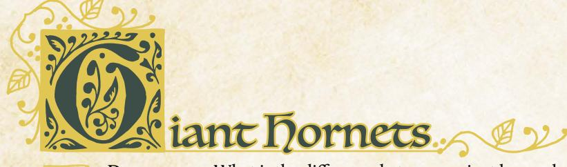

**Description:** What is the difference between a giant bee and a giant hornet? For most denizens of the Woodland, the answer is rather simple: a giant bee can sting you… but a giant hornet will sting you. Indeed, these aggressive carnivorous hunters often make meals out of their more docile insect cousins. Giant hornets are fiercely territorial, defending their hives, their hunting ground, and themselves with deadly force. They tend to prefer to attack in large numbers, often summoning more hornets by releasing powerful attack pheromones to draw others into the fray.

Giant conacle hives are the surest sign of the hornet's presence, spewing forth dozens of hungry hornets when the hive is disrupted or threatened. Denizens report livestock, and even friends, being carried off on deadly wings. The hornets have even disrupted trade in some areas by making it impossible for merchants to travel safely from one clearing to another. Some merchant caravans have taken to hiring vagabonds to ride ahead and clear the road of such pests; this has been met with varying degrees of success.

GM Advice: These winged hunters are highly territorial and highly aggressive when threatened. They ignore most nonthreatening creatures, but—when they do engage—they sting their prey with deadly venom before tearing them apart with razor sharp mandibles. They can also release an attack pheromone capable of summoning nearby giant hornets to come to their defense. It is possible that an interaction with a single hornet can quickly spiral out of control for the vagabonds as many more hornets enter the fight.

The vagabonds might encounter these monsters in the forest as they traverse the Woodlands—hornet hives pop up anywhere the insects can find enough stability to make a home. Be sure to describe how they drone aggressively as they take to the sky, their sharp mandibles and deadly stinger poised to attack. Narrate how they show little fear, throwing themselves at attackers in an attempt to bite and sting them.

It is also possible that the band is tasked by a faction like the Riverfolk Company with tracking and locating a hornets' nest that is interfering with local trade or by the denizens themselves to protect a swarm of local giant bees whose honey fuels the local economy. But just as often it is the Marquisate or Eyrie Dynasties who would hire the vagabonds to rescue one of their members who has been carried away by the hornets before the denizen meets a grisly fate.

{135}------------------------------------------------

# Giant Hornets Statblocks

Harm Inflicted*: 2-injury*

#### **Instinct:**

•**Bullheaded**: This monster ignores nonthreatening creatures, but attacks fiercely when angered or injured, repeatedly pursuing its prey until successful or driven off.

#### **Traits:**

- •**Swarm (support 8) :** When more than a small mob of these monsters gather (10), they gain a swarm track with ten boxes, half of which begin marked, and a number of d6s equal to their support. Any injury done to them clears a swarm box instead of inflicting harm; if the track is cleared, the swarm disperses. When something would attract more monsters to the swarm, the GM rolls 1d6 from the support pool and and marks half (round up) the total on the track to add more monsters, then discards the die; if the track is filled, characters engaged with the swarm are overrun—killed, captured, or run off, GM's choice. If the support pool is exhausted, no more of the monsters appear.
- •**Hardened (Chitinous Shell):** This monster ignores the first injury harm inflicted by every successful attack; this tag does not reduce injury done to a swarm track.
- •**Venomous (Sting):** The first time this monster injures a target, it marks exhaustion when inflicting injury to inflict 2-exhaustion.
- •**Flying**: This monster can fly and hover, allowing it to move quickly over any terrain and change ranges quickly

#### **Moves:**

- •Zip into the air to avoid entanglements
- •Bite through a branch, restraint, or piece of gear
- •Work in concert to overwhelm an attacker in a swarm of chitin and stingers
- •Summon nearby giant hornets to the area

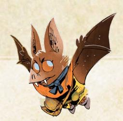

#### Individual

**exhaustion**

**injury**

**wear**

**morale**

#### Small Mob

**exhaustion**

**injury**

**wear**

**morale**

#### Swarm

**Swarm Track**

#### Queen

**exhaustion**

**injury**

**wear**

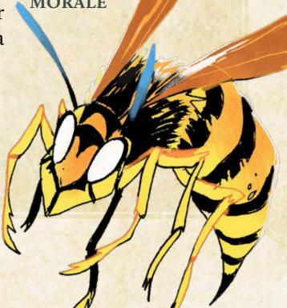

{136}------------------------------------------------

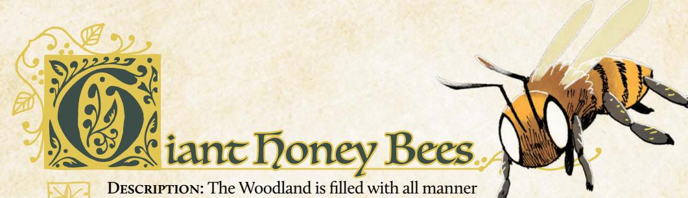

of flora and fauna, grand and mysterious. The humble giant honey bee plays a vital role in the success of the large plants across the Woodland. From early spring on, they buzz from flower to flower collecting nectar and spreading pollen; by summer, their beehives are buzzing with dozens—or even hundreds—of giant bees collecting nectar in service to their queen. The bees craft delicious honey from these combs, a rare delicacy sought after by many cooks for its delectable sweetness.

Yet these insects are understandably reluctant to share their golden bounty. They are normally docile, but they will swarm and attack when provoked or when their hive is threatened. The giant honey bees' defenses are two fold, sheer numbers and venomous stingers, the latter of which is as deadly to the bee as it is to a potential attacker. These defenses are able to dissuade all but the most determined of looters.

Of course, the Woodland is rife with rumors and tales of hidden hives filled to the brim with delicious honey worth more than its weight in gold. A number of merchants and chefs of great renown have offered to empty their coin purses to any vagabonds who can locate the golden liquidy treasure troves.

GM Advice: When encountered away from their hive, these insects are usually docile unless cornered or attacked, often emitting an agitated buzzing noise to indicate their irritation. When provoked, these creatures rely on sheer numbers to drive attackers away by secreting a pheromone to attract other giant honey bees to their defense. These monsters rely on their sting only as a last resort as it is as fatal to them as it is their attacker. A group of vagabonds could find themselves quickly overrun should they agitate a group of these docile pollinators.

It is possible for the vagabonds to happen upon a group of these pollinators as they are traveling, perhaps accidentally upsetting a small swarm of bees or stumbling into a hive without realizing their error, but it's more likely they will be the defenses of a hive the vagabonds want to burgle. When introducing these antagonists, focus on the droning sound of the bee, the thin coating of dusty pollen, as well as the barb of its deadly stinger—the bees ward away any attackers, but they are ultimately reluctant to actually use their stinger!

{137}------------------------------------------------

#### Giant Honey Bees Statblocks Harm Inflicted*: 1-injury* **Instinct:** •**Docile:** This monster ignores anything its own size (or smaller) and flees when seriously threatened; only fights if absolutely necessary. **Traits:** •**Swarm (support 8) :** When more than a small mob of these monsters gather (10), they gain a swarm track with ten boxes, half of which begin marked, and a number of d6s equal to their support. Any injury done to them clears a swarm box instead of inflicting harm; if the track is cleared, the swarm disperses. When something would attract more monsters to the swarm, the GM rolls 1d6 from the support pool and and marks half (round up) the total on the track to add more monsters, then discards the die; if the track is filled, characters engaged with the swarm are overrun—killed, captured, or run off, GM's choice. If the support pool is exhausted, no more of the monsters appear. •**Venomous (Sting):** The first time this monster injures a target, it marks exhaustion when inflicting injury to inflict 2-exhaustion. •**Flying**: This monster can fly and hover, allowing it to move quickly over any terrain and change ranges quickly •**Hivemind**: This monster does not suffer morale harm; if the queen is ever killed, the colony disperses and fades over a few weeks as the drones seek out a new colony to join. **Moves:** •Buzz lazily into the air, avoiding attackers •Shake violently, releasing a cloud of pollen •Work in concert to bury an attacker in a swarm of bodies •Summon nearby giant bees to the area Individual **exhaustion injury wear morale** Small Mob **exhaustion injury wear morale** Swarm **Swarm Track** Queen **exhaustion injury wear morale**

{138}------------------------------------------------

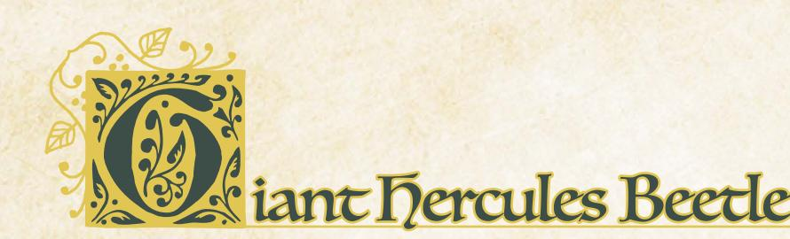

**Description:** When one thinks of strength, a beetle is not normally what is called to mind. Yet the giant hercules beetle is one of the most powerful insects in all the woodlands. Capable of carrying a hundred times its body weight, this mighty insect can clamp down upon and toss rivals and would-be attackers a great distance using its powerful horns. Fortunately for the denizens of the Woodland, these creatures are quite docile. Indeed, these gentle giants are content to subside on rotting wood and tree sap, both plentiful in the humid undergrowth of the many trees of the forest.

However, travelers can quickly find themselves in a world of danger if they do not show these mighty beasts the proper respect. The price for angering a giant hercules beetle could be broken bones or worse. During mating season, these titans struggle for dominance in clashes of epic proportions. Wise denizens know to avoid any pair of these creatures locked in such a titanic struggle, lest they be crushed by a beetle who doesn't even realize there are onlookers!

GM Advice: Giant hercules beetles are quite content to be left alone, flying from feeding ground to feeding ground ignoring most of the other creatures of the forest. When challenged, they will fight back with brute strength and a thick carapace, smashing into attackers—but they will retreat to the skies as soon as they feel they can get away safely.

Unlike many of the other monsters of the Woodland, the hercules beetle is not sought after for its parts or killed for glory. Instead, they are more likely to be desired as beasts of burden by agents of the Marquisate or Eyrie Dynasties, the kind of monster that can help plow a field, carry trade supplies great distances, or even transport military equipment from clearing to clearing. And who better to send into the forest to get one of these beasts than a vagabond?

When portraying the giant hercules beetle, represent their strength as a force in any encounter. The hercules beetle may not be aggressive, but it can be terrifying! When two males contest for dominance, for example, they throw each other around into the air and knock down trees that would take denizens weeks to cut to the ground.

{139}------------------------------------------------

# Giant hercules Beetle Statblock |

• **Docile:** This monster ignores anything its own size (or smaller) and flees when seriously threatened; only fights if absolutely necessary.

#### TRAITS:

- Hardened (Chitinous Shell): This monster ignores the first injury harm inflicted by every successful attack; this tag does not reduce injury done to a swarm track.
- Flying: This monster can fly and hover, allowing it to move quickly over any terrain and change ranges quickly.
- Catapult (Powerful Horns): This monster is capable of picking up and flinging attackers. Characters who suffer harm from this monster must mark exhaustion or be flung away to a far range.

#### MOVES:

• Take flight, buzzing around on unsteady wings

{140}------------------------------------------------

**Description:** Somewhere in the swamps and bayous of the Woodland lurks a true monster. The only evidence of its passing are the massive tracks found sunken into the mud and the stories told by survivors. A few denizens have fashioned crude weapons from the creature's teeth, which are as long and as sharp as a sword, and crude armor and shields from the massive scales found on the banks of the wetlands.

There are claims that the beast has attacked clearings and larger boats. Survivors claim that the waters were calm and still until…SNAP! Then half their boat was missing and they had to scramble back to shore. Some have dismissed these as fairy tales, but rumors of lost clearings have begun to grow. Unsettling stories of a massive beast of scales and teeth stalking the bayous have caused some denizens to pack up and seek safer harbors. And indeed some swamp dwellers claim to feel watched by a massive set of eyes that glow in the dark. Watching. Waiting. Hungry.

Some Lizard Cultists journey to the swamps in order to see these signs, worshipping them as evidence of the power of the Great Wyrm. A few foolish Cultists even seek to give themselves to this terrifying predator, believing that their sacrifice will bring them closer to the Wyrm itself.

GM Advice: The giant alligator is the ultimate ambush predator, capable of lying perfectly still for hours and waiting for the perfect moment to strike. When it does, it is able to strike out with crushing jaws and a thrashing tail to grab its prey…even on land. No one is safe from its hungry jaws.

Be sure to describe the sheer scale and force of this beast whenever it appears! The alligator's powerful jaws house teeth as long and as sharp as swords, and its hide is tough enough to withstand the most powerful blows from the most dangerous vagabonds. This creature should not be taken lightly. Vagabonds who seek out the giant alligator may very well meet their end in its deadly jaws.

It's easy to introduce the alligator as a threat—the vagabonds might come across a community still reeling from a giant alligator attack or be hired by a wealthy merchant looking for someone capable of slaying such a beast and returning with its valuable hide and teeth. Even if the vagabonds happen upon a giant alligator by chance, they are likely to be thrown into a desperate fight for survival. But no matter how the alligator first appears, remember that it's a truly terrifying antagonist; even the most capable vagabonds are at risk of great injury or death when facing such a fearsome foe.

{141}------------------------------------------------

#### Giant Alligator Statblock EXHAUSTION MORALE HARM INFLICTED: 3-injury • Predatory: This monster is constantly searching for food, attacking anything it thinks it can consume; if seriously threatened, flees to safety. TRAITS: • Aquatic: Characters can't target this monster with weapon moves while it's underwater without special equipment (spears, underwater mines, etc.). • Entangling (Jaws): After inflicting harm on a vulnerable target, this monster marks exhaustion to entangle their target; the target cannot shift ranges or use any ranged weaponry until they successfully break free. • Sharp (Teeth): When harm inflicted by this monster is marked as wear, the target of the attack must mark I additional wear. • Terrifying: Engaging in melee with this monster requires vagabonds to mark exhaustion. NPCs will never voluntarily engage it, except in large mobs. • Aggressive: When attacking a target that appears threatening or dangerous, this monster marks exhaustion when inflicting harm to inflict an additional harm. MOVES: Lash out with hungry jaws, smashing through obstacles • Dive beneath the water, avoiding all attacks • Trample over attackers on land Thrash about tearing apart attackers and breaking restraints

{142}------------------------------------------------

# Giant Carnivorous Plant

**Description:** Many denizens know how important it is to eat your vegetables. What many do not know is that there are vegetables that would eat them if given the chance! Most chalk up rumors of carnivorous plants as tall tales used to scare children, but folk who have travelled deep into the untamed and untouched Woodland claim to have entered groves where most dare not tread. Within these silent glades are found dangerous and deadly plants that find sustenance in the things they can consume.

Stories from survivors are varied. Some claim the roots themselves rose up to attack. Others claim vines entangled them and dragged them towards a terrible maw filled with acid and torment. Still others claim they simply stumbled into the grove by accident and quickly found themselves surrounded by angry plants. The one thing they can all agree on is that there is something alive deep within the forest…and it is hungry.

GM Advice: The Woodland is filled with all manner of deadly fauna… and sometimes even deadly flora!

Individual carnivorous plants are dangerous, but a grove of them can work in tandem to drag prey kicking and screaming to their pitcherlike mouths to feed. While the plants can't move, they will disrupt any attempt to flee, using their vines and roots to drag members of their band back into danger. Portray the silence of the plant's "hunting ground," before you show vines writhing in the shadows and roots slipping over the vagabond's boots, but let loose with the full force of the carnivorous flora when they attack!

The vagabonds might run into carnivorous plants as they explore the forests, but they might also be sent deep into the Woodland in search of the plant specifically, seeking to obtain a rare flower to help save a village from plague, cure a rare disease, or even add to the collection of a high-ranking Marquisate collector. The carnivorous plant is rare enough that the every part of it—or the whole thing itself—would be worth bringing back to a clearing for the right buyer.

{143}------------------------------------------------

#### Giant Carnivorous Plant Statblock

| EXHAUSTION |
|------------|
| INJURY     |
| WEAR       |
| MORALE     |

#### HARM INFLICTED: 1-injury

#### INSTINCT:

• **Predatory:** This monster is constantly searching for food, attacking anything it thinks it can consume; if seriously threatened, flees to safety.

#### TRAITS:

- Rooted: This monster cannot move.
- **Acidic**: This monster deals 1-wear each time it deals 1-injury; if the target cannot (or chooses not to) mark wear, they suffer an additional 1-injury.
- Entangling (Roots): After inflicting harm on a vulnerable target, this monster marks exhaustion to entangle their target; the target cannot shift ranges or use any ranged weaponry until they successfully break free.

#### Moves:

• Cut through gear or equipment with razor sharp leaves

• Ensnare a creature with vines and drag it closer.

{144}------------------------------------------------

# Creating Monsters

The monsters found in Ruins & Expeditions aren't the only ones found in the Woodland—there are many more terrifying foes and charming beasts than any one vagabond could catalog. Here are some tips for creating your own monsters:

#### Pick a Creature

First, select a creature! Monsters in **Root**: **The RPG** are typically arthropods—spiders, insects, and crustaceans—along with snakes, fish, and other species that don't show up as ordinary denizens. Lizards, for example, aren't usually monsters because they are regular denizens of the Woodland.

# Assign harm Gracks

Give your new monster harm tracks according to how it appears in the fiction—boxes for injury, exhaustion, wear, and morale. A vagabond has roughly four harm boxes per category, so a monster with eight injury boxes is twice as tough as a single vagabond! And while monsters usually don't have gear, they do get wear boxes to represent their scales or hides.

Most swarm monsters—like bees or ants—don't have any morale. Instead they have the trait Hivemind (page 145), which means they instead follow their queen's orders at all times, even unto death.

Finally, decide how much harm they will inflict with an ordinary attack. Most monsters deal 1- or 2-injury, but very dangerous monsters deal more and some monsters actually deal exhaustion damage with blunt or tiring attacks.

#### Choose an Instinct

The monsters of the Woodland generally fall into a few different behavioral categories; choose one for your new monster:

- Bullheaded: This monster ignores nonthreatening creatures, but attacks fiercely when angered or injured, repeatedly pursuing its prey until successful or driven off.
- Docile: This monster ignores anything its own size (or smaller) and flees when seriously threatened; only fights if absolutely necessary.
- **Predatory**: This monster is constantly searching for food, attacking anything it thinks it can consume; if seriously threatened, flees to safety.
- PROTECTIVE: This monster aggressively defends its home, fighting to the death against intruders; if found outside its home, the monster will retreat if confronted or provoked.

144): Root: The Roleplaying Game

{145}------------------------------------------------

#### Select Monster Graits

Monsters in **Root: The RPG** get traits in much the same way that vagabond gear has traits—specific mechanics that kick in to represent the monster's strengths (or weaknesses). Most monsters have three to five of these traits; it's hard to work more than that into an actual scene during play, so don't go overboard.

Most traits don't ask you (as the GM) to make any choices. Hardened monsters, for example, ignore the first injury harm automatically; you don't have to do anything for the trait to have an effect in a fight.

- ACIDIC: This monster deals I-wear each time it deals I-injury; if the target cannot (or chooses not to) mark wear, they suffer an additional I-injury.
- AFRAID: When a source of fear approaches this monster, it automatically marks morale.
- AGGRESSIVE: When attacking a target that appears threatening or dangerous, this monster marks exhaustion when inflicting harm to inflict an additional harm.
- AQUATIC: Characters can't target this monster with weapon moves while it's underwater without special equipment (spears, underwater mines, etc.).
- CATAPULT: This monster is capable of picking up and flinging attackers. Characters who suffer harm from this monster must mark exhaustion or be flung away to a far range.
- Entangling: After inflicting harm on a vulnerable target, this monster marks exhaustion to entangle their target; the target cannot shift ranges or use any ranged weaponry until they successfully break free.
- FASCINATED: The monster is drawn to the object of its fascination and must approach it if possible.
- FLYING: This monster can fly and hover, allowing it to move quickly over any terrain and change ranges quickly
- HARDENED: This monster ignores the first injury harm inflicted by every successful attack; this tag does not reduce injury done to a swarm track.
- • HIVEMIND: This monster does not suffer morale harm; if the queen is ever killed, the colony disperses and fades over a few weeks as the drones seek out a new colony to join.
- ROOTED: This monster cannot move.
- Sharp: When harm inflicted by this monster is marked as wear, the target of the attack must mark I additional wear.
- SLIPPERY: Grappling or restraining this monster requires at least a small group of characters and special equipment (nets, ropes, grappling hooks, etc.).
- STEALTHY: Once per session, this monster can appear without warning, grab a character, and vanish, bringing their captive back to a safe place or lair.

{146}------------------------------------------------

- SWARM (SUPPORT X): When more than a small mob of these monsters gather (10), they gain a swarm track with ten boxes, half of which begin marked, and a number of d6s equal to their support. Any injury done to them clears a swarm box instead of inflicting harm; if the track is cleared, the swarm disperses. When something would attract more monsters to the swarm, the GM rolls 1d6 from the support pool and and marks half (round up) the total on the track to add more monsters, then discards the die; if the track is filled, characters engaged with the swarm are overrun—killed, captured, or run off, GM's choice. If the support pool is exhausted, no more of the monsters appear.
- Swipe: When this monster attacks and inflicts harm on a target near to another foe, this monster marks exhaustion to inflict 2-harm on the additional nearby foe.
- Terrifying: Engaging in melee with this monster requires vagabonds to mark exhaustion. NPCs will never voluntarily engage it, except in large mobs.
- TITANIC: This creature cannot be restrained without equipment specifically designed for its containment.
- VENOMOUS: The first time this monster injures a target with its venomous part each fight—teeth, stinger, etc.—it marks exhaustion when inflicting injury to inflict 2-exhaustion.

The list here isn't all-encompassing. If you'd like to design new monster traits, go for it! You can design something totally from scratch or base it on an existing trait.

#### Choose Moves

Finally, outline a few things that the monster will do when it's time for you to make a move. For example, the giant alligator (page 140) will "Lash out with hungry jaws, smashing through obstacles" while the giant honeybee will "Buzz lazily into the air, avoiding attackers." Creating moves gives you a go to list of things to do when you need an idea, and it challenges you to deliver on the threat the monster poses when the PCs roll a miss.

#### Example Monster:

Mark decides to introduce a new monster to the seaside clearing the vagabonds are going to visit next. He thinks about a giant seagull...but he quickly realizes gulls are just birds! Instead he decides to include a giant crab—a large crustacean that can go toe-to-toe with a vagabond by themselves. He assigns harm tracks 5-injury, 6-exhaustion, 3-wear, and 4-morale; the crabs are formidable but not terrifying.

He picks **Protective** as the crab's instinct—they just want to hold on to their part of the beach—and chooses a few monster traits he thinks fit: **Swarm** (support 4), **Hardened** (Shell), and **Sharp** (Pincer). Finally, Mark thinks of a few moves he can make using the crabs, including "clamp down on an exposed limb or weapon."

146): Root: The Roleplaying Game

{147}------------------------------------------------

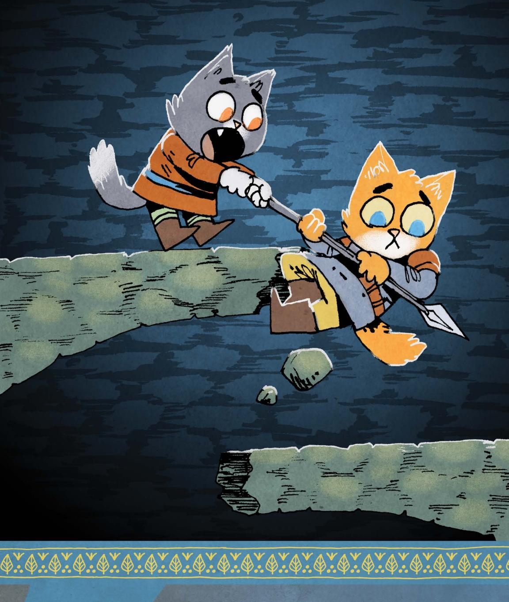
