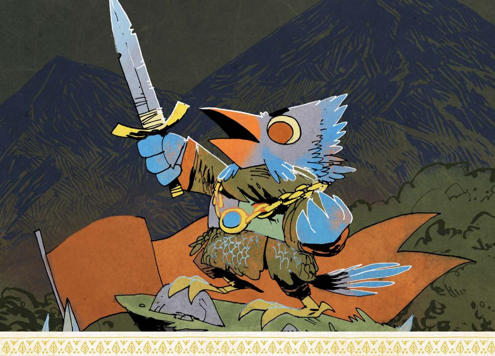
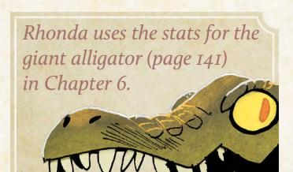
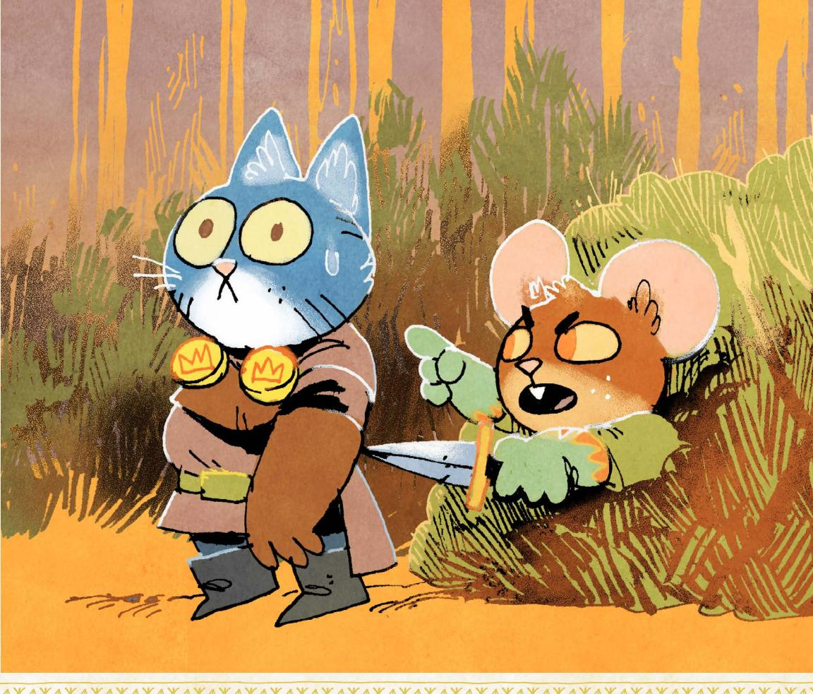
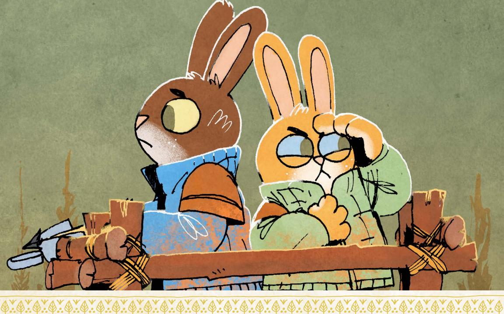

# Clearings of the Woodlands

{148}------------------------------------------------

hile the mechanics of Root: The RPG consistently create opportunities for you and your players to engage new conflicts and discover surprising twists in the story, the game often

works best when you take the time to prepare a clearing for the vagabonds before they arrive. Root: The RPG is a game of contested loyalties and difficult choices—themes that are much easier to center for your players when you have taken some time to prepare conflicts, NPCs, locations, and special rules in advance of the session.

This book contains three clearings that feature both the new factions in this book—the Keepers in Iron and the Hundreds—as well as opportunities to include both monsters and ruins in your Woodland:

- · Longbarrow Crag was recently liberated from House Condor of the Eyrie Dynasty, but a conflict between the Lizard Cult and the liberating Keepers in Iron knights over the ruins that lie beneath the clearing itself threatens to destroy the newly-won peace. As tensions mount between the two factions over who has the right to occupy the ruins, a clever trio of Corvid Conspiracy thieves schemes and plots to steal the fortune House Condor left behind.
- · Pricklegrass Marsh was once ruled by the Marquisate, but the clearing is now run by Madbeak, a Hundreds lieutenant whose cruelty is all too familiar to the local denizens. Unable to assault the clearing directly, Marquisate forces have been ordered to poison the water to weaken the Hundreds' forces...but Captain Pursilla Pawpierre isn't so sure she can stomach the deaths that would result.
- · **Ricklebell Falls** is beset with troubles the ruling Riverfolk Company can't seem to get their paws around—a giant trout, local Woodland Alliance organizers, and a growing sense of discontent with the Company's civic policies. Despite the relative abundance that the rivers leading into the clearing bring each year, the Company's tariffs and fees have left the denizens with few options and many debts, a situation that is quickly spiraling toward revolution!

Each of these clearings have everything you need to run a session of Root: The RPG, including descriptions of all the conflicts, a list of important residents (with stats), important locations, and special rules. They also contain information about what would have happened if the vagabonds never arrived in the clearing, a baseline you can use to judge what will happen if the vagabonds decide (or fail) to intervene.

As always, these clearings contain plenty of room for you to add your own characters, conflicts, and locations. Good luck!

{149}------------------------------------------------

# Longbarrow Crag

# Description

Built above extensive (and poorly explored) ruins, on a series of cliff faces connected by stone and rope bridges, Longbarrow Crag had for generations been the holding of House Condor of the Eyrie Dynasties. Yet when the Keepers in Iron heard rumors of precious relics in the ruins below the Barrow, a large force of Keepers—led by their commander, Sir Maximilian—devoted themselves to a siege of many months to drive out House Condor and seize the clearing for themselves.

At the top of the Crag lies the former homes of the Dynastic aristocrats, now the wayhouses and barracks of the Keepers. Not unlike the layers of exposed stone that make up the majority of the Crag itself, the clearing's society is stratified based on proximity to the open air and sun. While the wealthiest live at the top, the poorest and outcasts live in Downtrodden, the base of the Crag almost forever in the shadow of structures and stone. The only section lower than the Downtrodden is the ruins themselves, the area in which the local Lizard Cult established their Garden after being pushed out of every other level of society by House Condor. While the denizens of Downtrodden do not trust the Cult or its leader, the Voice of the Dragon, Lyssa Twicebitten, those living in the ruins do provide food and medicines to those above them without asking for anything in return but acceptance.

But the Keepers have changed everything now that House Condor is gone. The various manses that once were the homes of House Condor and the other rich denizens of Topside, the highest level of the Crag, are now warehouses for dusty crates of weapons and supplies. Gilded Talon Hall, the most famous of Topside's beer halls, now has the muddy boots of knights, pages, and administrations trampling their expensive rugs, coming and going as if it were a common mess hall. The libraries of the Condors have been combed over by archivists, looking for hints and signs of other relics hidden both in the ruins below and in clearings elsewhere.

{150}------------------------------------------------

## At First Sight

All paths entering Longbarrow Crag lead only to the ritzy surface neighborhood of manses and fancy market shops. The area no longer holds the same glitz and glamor that it once did—commandeered and repurposed to the needs of the much more spartan Keepers—but there is no shortage of expensive architecture and the shops are well stocked with inventory.

Pedestrians in this area see quickly that the road leads to a wide stone bridge spanning the deep chasm, crisscrossed with other bridges. As the gorge descends, the bridges are less well maintained, stone giving way to wood, wood itself giving way to tendrils of rope. The further down one travels, the less sunlight they see reaching the buildings that line the stone face of the Crag. One would imagine that very little sunlight makes it to the lowest levels at all.

Up ahead is the downward staircase leading to a path barely wide enough for people to walk two abreast. From there, it spirals all around the edge of Crag on one side, the gray stone of the earth; on the other, the empty expanse of sky leading to the next highest bridge or the ruins hundreds of feet below.

# Conflicts

Longbarrow Crag is the site of more drama than a band of vagabonds can handle on their own, but the following four issues rise above the others. *A Time for Relics* is the largest conflict, while the other three loom in the background.

# Core Conflict: A Time for Relics

While historically the residents of the Crag shunned the local enclave of the Lizard Cult, forcing them to find refuge within the otherwise abandoned ruins below, the Keepers have adopted a softer policy. Sir Maximilian himself swore on his honor—upon seizing the clearing—that the Cult would be allowed to practice their faith without the interference of the Keepers. This protection and the ousting of House Condor allowed the Voice of the Dragon, Lyssa Twicebitten, to complete the Garden now situated above the ruins.

Now that the Keepers in Iron hold the clearing, Maximilian has turned his gaze to the ruins to search for relics, the same ruins upon which the Garden now sits. One relic, in particular, fascinates the old badger: ancient scrolls tell of a gleaming armor, the Silver Scales, said to be indestructible and almost weightless. Few remember the stories of the nearly mythical warrior Adonis Deadfeather, but when he carved this clearing out from the Woodlands, he was wearing the Silver Scales. It is said he found the armor in the ruins that were there before the clearing was cut from the Woodland, on a skeleton sitting upon a throne of skulls.

{151}------------------------------------------------

As Maximilian oversees the construction of the Keepers' new waystation, he sends a page directly to the Cult—for the search for the Silver Scales to begin, the Cultists living in the ruins must abandon their homes and holy places and move elsewhere. The Keepers still don't care if the Cultists practice their faith within the Crag or not, but they must cede their land to the knights.

Tired of being pushed around by one government or another, Voice Twicebitten has had enough. Proudly and vocally, she has decided to stand her ground, claiming the ruins and everything on, in, and under them to be the Hoard of the Dragon and thus theirs. For the most part, Twicebitten knows that they stand no chance against the Keepers should they face a stand-up fight. The Cult has very few Claws at this Garden, and while they are ever faithful that they have the Dragon's fire in their hearts, many of them will die. Thus far, they have closed their gates to all, no longer offering their help to anyone outside of the cult.

She believes that there could be some way for cooler heads to prevail. Lyssa doesn't actually care about the armor; she cares about no longer being pushed around by whatever the powers that be of the day is. She doesn't think that the Knight Commander will push the issue, underestimating his resolve.

#### How It Develops

*If the vagabonds never came to the Crag, the Keepers of Iron would respond with military force to the Cult's refusal to vacate the ruins. Without intervention, the same weapons and tactics that won them the clearing above the ruins would in short order win them the ruins as well, at the cost of the lives of the Cultists who refused to back down. The Garden would be torn down, and the remaining Cultists would become refugees. Once they break through the Garden and into the Ruins beneath, they find the tomb of Adonis Deadfeather, and around his moldering bones, the stillgleaming Silver Scales, as if the generations of time hadn't tarnished the metal at all.*

# Conflict: Dragonhearts

The Longbarrow Garden is not free of political conflict; other voices think that the Great Dragon would be better served if they struck out at the Keepers before the Keepers can marshal their forces to take the ruins. Namely, Norrin Fullmoon, a bat convert who leads the few Claws that call the Garden home, believes that the Cult should be carrying out attacks on the Keepers immediately to defend their home and protect the Garden.

Fullmoon has offered more than just a military tactic to persuade the Cult: they also claim that the Great Dragon came to them in a dream, telling them of a new doctrine, that any Seeker who either dies in the battle (or kills an enemy of the Dragon) will be anointed—posthumously if necessary—as an Acolyte in the blood of nonbelievers, joining the Dragon forever for their courage and faith.

{152}------------------------------------------------

If Lyssa believed this had any chance of working, she might be fine accepting this dream as new doctrine…but it won't, and this plan threatens her power when she is most politically vulnerable. Why is the Great Dragon speaking to Norrin when the Speaker is Lyssa? Does this mean that she's lost the favor of their god? There haven't been many non-lizard Speakers of the Dragons in Longbarrow, and of those none who were converts rather than denizens born into the Cult. But this is a special moment, say Fullmoon's followers, and maybe a special voice is needed.

Lyssa can't afford division in her ranks right now, not with the Keepers at the gates looking to push them out of the only home they've known. She doesn't believe that any follower of the Great Dragon should turn on another, but she may be running out of options to try to keep control of her Garden and protect them from enemies without and within.

#### How It Develops

*If the vagabonds never came to the Crag, Lyssa would have to do something to prevent the oncoming schism within her Garden. Fueled by fear and desperation and unwilling to throw her followers to the blades of the Keepers—she would reject Norrin Fullmoon's new doctrine, dubbing him a heretic. Norrin and the Cultists who believe in his dream would be kicked out of the Garden, disavowed by the Voice of the Dragon. Of course, apostasy rarely stops a true fanatic; Norrin would lead his followers in an ultimately foolhardy attack on the waystation that would lead to their deaths.*

# Conflict: A Murder Most Foul

While the battle for control of the Crag was underway, House Condor paid off the Riverfolk Company to withhold much-needed goods from the Keepers. The Condors had stores of goods that would last them many months, but the Keepers were relying on regularly delivered supplies to keep the siege going. The Keepers, in response, turned to the Sootclaw Sisters: Fiona, Gris, and Wisteria, who moved into the Crag to replace their failed Riverfolk supply lines. Sir Maximilian knew that the ravens were likely members of the Corvid Conspiracy, but the enemy of one's own enemy can be considered at least an ally, if not a friend, especially when you have a battle to win. The Sisters delivered enough goods and equipment to the Keepers, sometimes even stealing from the supplies the Riverfolk Company was withholding!

But that siege is over, and the money and access that the Keepers gave the Sisters has solidified their foothold in the society of the clearing. On the surface, the Sisters run a respectable import and export business, but they're in fact agents in a deeper scheme. The Corvid Conspiracy ordered that the clearing return to the instability of war and, thus, has begun plans to commit

{153}------------------------------------------------

acts of violence against both sides of the conflict, playing each side against the other until such a time where the Conspiracy can enact their ultimate plan: stealing the accumulated wealth left behind by the ousted House Condor.

When the Keepers took the clearing, they cared little for the precious metals, gems, and art left all around them. They seized the hard cash, but anything that would require sale was left to be warehoused and dealt with once the Scales have been recovered and moved on. Ultimately, this means the valuables are still there—just waiting to be stolen by an enterprising trio of sisters! While the Keepers and Cult occupy each other, the Sisters will break into the Condor Manse and take the wealth.

Fiona spends her time with the Cultists, trying to convince them no one in the Crag will help them but themselves, that the Cult must fight for their right to exist. Gris goes back to Sir Maximilian, telling them that while they have been asked by Lyssa for armaments and supplies to make war, they have refused. Lastly, Wisteria does reconnaissance, planting bombs where she believes they will cause the most chaos and finding out where the Keepers hid the goods.

#### How It Develops

*If the vagabonds never came to the Crag, Wisteria would set off the bombs she's planted all over the clearing just as the tension between the two sides reaches a boiling point. The explosion would destroy Zenith Bridge, the highest stone bridge in the clearing. Beyond killing the dozens who were on the bridge and those nearby when the explosion goes off, the stone of the destroyed bridge would destroy other bridges as it falls to the ground, killing dozens more.*

*As the Crag is rocked by fear and chaos, the Corvids would undertake their plot, making off with more money than most residents of the clearing would see in a lifetime. The Keepers wouldn't notice that the wealth is gone for a long while, and by then, the Sootclaws would have moved on and changed their names.*

# Conflict: In Extremis

House Condor didn't care about the people who lived in Downtrodden, nor particularly did the Keepers once they got control of the clearing. The denizens of Downtrodden have lived in the shadow of the rest of Longbarrow Crag for time immemorial—for most parts of the day, literally so. While none of them truly trust the Cult, the lizards and their converts have done a great service for the neighboring community, providing free food grown in the garden as well as child care and medicine to whomever came to them in need. Of course, the Cult would happily accept any recipients who embraced the word of the Great Dragon, but conversion was never a prerequisite for aid.

{154}------------------------------------------------

For the first time since the gates of the Garden were erected on the ruins, they are closed. Citizens of Downtrodden were given no warning; one day as they made their way down through the valley to the Garden, the path was no longer open to them. No one came to tell them why this was happening. Families that spent years relying on the kindness of the Lizard Cult now had nowhere to go.

With few options, all eyes turned to one: Felix Deadfeather. Many years before the siege, Felix was an Eyrie playboy, but he ran afoul of his House's patriarch and was cast down, disinherited, and left with only what petty personal wealth he owned, which he quickly squandered. Within a few years, he found himself in Downtrodden like so many others, but his fall had granted him some humility, and it was not long before he became a community leader, the de facto mayor of the poorest section of the clearing.

Fear and desperation are horrible bedfellows, the people of Downtrodden have war looming around them once again, and the only good thing many could look forward to—a modest but warm meal from the Lizard Cult—is gone as well. Some say this is evidence that the Cult should never have been trusted, that they lulled Downtrodden into a false sense of aid only to push them down again. Others blame the greed of the Keepers, their need to dig up every piece of shiny metal instead of tending to the needs of those denizens in their clearings. Violence is on the horizon if nothing changes, but Deadfeather will do anything to prevent blood from spilling in Downtrodden. Felix, himself, believes that the Keepers could quell this by stepping into the Garden's place to provide for the clearing's most vulnerable denizens, and he plans to petition Sir Maximilian for a peaceful solution before things get further out of control.

#### How It Develops

*If the vagabonds never came to the Crag, riots would spill out of Downtrodden when the residents realized that nothing was going to change. Denizens need food, not pleas for peace. Rioters would take up whatever arms they can put their paws, claws, and wings upon and storm both the Garden's gate and the mess halls of the Keepers, killing any who stand against them and taking all the food they can carry. Caught off guard, both Sir Maximilian and Voice Lyssa Twicebitten would be killed in the chaos. Furthermore, Sootclaw Commons, with Gris Sootclaw inside, would be burned down as it is looted. Of course, once the knights of the Keepers ready themselves in a counterattack, most of the attackers would fall to their blades.*

{155}------------------------------------------------

# Important Residents

| □□□ EXHAUSTION                             |  |  |
|--------------------------------------------|--|--|
|                                            |  |  |
| □□□□ WEAR                                  |  |  |
| □□□□ MORALE                                |  |  |
| <b>DRIVE:</b> To recover the Silver Scales |  |  |
| Moves:                                     |  |  |
| Command his knights into                   |  |  |
| battle against any foes                    |  |  |
| Give a rousing speech                      |  |  |
| that inspires a group                      |  |  |
| to do hard things                          |  |  |
| • Engage in single combat                  |  |  |
| with overwhelming force                    |  |  |
| EQUIPMENT:                                 |  |  |

#### Sir Maximilian

The Commander Knight of the Keepers in Iron, Maximilian has spent the last few months embroiled in war with House Condor to claim the Crag for his cause. It hasn't been a month since his victory...and he finds himself on the war's doorstep again. He doesn't want a fight, and he would love for the Cult to peacefully move elsewhere in the Crag, but he has no misconceptions about the stubbornness of the Cult once they've constructed a Garden. He cannot, however, back down. The resources and lives he paid to take the clearing demands the successful acquisition of the Silver Scales.

| EXHAUSTION |
|------------|
| INJURY     |
| WEAR       |
| MORALE     |

· Commander Knight's helm

**DRIVE:** To protect her Garden and Cultists

#### Moves:

Plate armorGreatsword

- Proselytize the tenets of the faith to unbelievers
- Rally believers to endure ongoing hardships with grace
- Empathize with the hardships of others earnestly

#### **EQUIPMENT:**

- Lizard Cult vestments
- Blessed blade

# Lyssa Gwicebitten

The Voice of the Dragon, Twicebitten has spent the majority of her life protecting her clutch from the discrimination and violence handed down freely by House Condor. She was promised that life would be different under the rule of the Keepers and their Sir Maximilian, that they could worship and live as they pleased, only to have orders come by page that they'd have to move from the home they worked hard to build. No more. Lyssa has given and given and will give no more. The Garden in the ruins is her home, and she will not see it be destroyed so that the Keepers can dig up some meaningless trinket.

Special: *Voice of the Dragon:* Mark I-exhaustion to clear one box of injury, exhaustion, or morale from another member of the Lizard Cult.

{156}------------------------------------------------

| EXHAUSTION |
|------------|
| INJURY     |
| WEAR       |
| MORALE     |

**Drive:** To push the Lizard Cult to war

#### Moves:

- Purposefully misuse doctrine to further her goals
- Convince the rabble that they are isolated from the world
- · Lash out with a lethal blow

#### **EQUIPMENT:**

- Seeker Lizard Cult robes
- Sacrificial dagger

#### Fiona Sootclaw

Living with the Lizard Cult, this Sootclaw Sister has the ear of the Voice of the Dragon. She pretends that she cares about the Cult's plight when, in fact, all she cares about is trying to push them into acting against the Keepers, driving the clearing ever closer to war. As it is rare that anyone shows the Cult any sort of sympathy, Lyssa struggles to avoid playing directly into Fiona's talons. To assuage Lyssa's remaining hesitation, Fiona claims to have accepted the word of the Great Dragon, becoming a Seeker herself. She has no intention of actually converting, but what's one sacrificed Lizard Cultist to achieve her sister's goals?

# □□ EXHAUSTION □ INJURY □□ WEAR □□ MORALE

**Drive:** To push the Keepers in Iron to war

#### Moves:

- Allow themself to be disrespected to further their goals
- Lead Keeper Knights to false evidence
- Lie in wait for the right time to act

#### **EQUIPMENT:**

- Bespoke leather armor,
- Brace of throwing daggers
- Forged letter from the Lizard Cult

#### Gris Sootclaw

Gris can be found in the hallowed halls of the Keepers nearly daily of late, trying to convince anyone who will listen that the Lizard Cult is looking to weaponize their movement. Banking on the relationship between the ravens and the Keepers, they hope that they will be able to convince the Knight Commander.

Sir Maximilian doesn't believe them, but he still has to investigate the threat either way. He deploys a squad of Keeper Knights to look into it, to which Gris follows along. Gris more easily convinces them that while they won't supply the Cultist themselves, someone else may. Of course, this was part of the plot the Sisters hatched. Hopefully, implanting the seed that they also can't prevent the desperate Cultists from going anywhere else to buy what they need to defend their home will drive the Keepers out of their garrison and to action. This way, the Sisters can go after their actual target, the wealth of the Condor Manse in Topside.

{157}------------------------------------------------

| □□□ EXHAUSTION |
|----------------|
| □□ INJURY      |
| □□ WEAR        |
| □□□ MORALE     |

**DRIVE:** To spark war in the Crag

#### Moves:

- Move quietly and quickly to a new location
- Attack someone vulnerable from the shadows
- Convince someone that she is on their side

#### EQUIPMENT:

- Weapons and armor for a group of warriors
- Explosives
- Traps

#### Wisteria Sootclaw

While her sisters play the Cultists against the Keepers more directly, Wisteria has the most complex and dangerous part of their plot, actually moving throughout the clearing to find places to place the Sootclaw explosives so they can feign that the Cult has started active hostilities against the Keepers. If she hears about a schism within the Cult from her sister Fiona (see Dragonheart), Wisteria will of course seek them out as well, giving them the weapons and explosives instead, so that they can do the dirty work for her, claiming that the goods came from her "Seeker" sibling as a donation to the Dragon's crusade.

| EXHAUSTIC |
|-----------|
| INJURY    |
| WEAR      |
| MORALE    |

**DRIVE:** To follow the role the Dragon has bestowed

#### Moves:

- Inspire fanatical courage among the Claws of the Dragon
- Launch an ambush against an unsuspecting enemy
- Give an impassioned speech about what the Dragon demands

#### **EQUIPMENT:**

- Blessed Claw of the Dragon scale mail
- Longsword
- Combat vestments

#### Norrin Fullmoon

The Dragon came to him in a dream. This is the truth as he experienced it. He doesn't want to be the Voice of the Dragon, and he doesn't want to take over the Garden. All he wants is to defend his brothers and sisters as he has always done. It isn't his fault that the Dragon chose to bless him, a lowly bat from the Crag, to carry this mission, but it is his duty to carry it out. If Lyssa doesn't want to listen to their god, that is her choice, and when she comes before the fangs and flame, she will have to answer for it.

{158}------------------------------------------------

# ☐ EXHAUSTION ☐ INJURY ☐ WEAR ☐ ☐ MORALE

**Drive:** Protect the people of Downtrodden

#### Moves:

- Find common ground between two parties in conflict
- Enlist his former contacts in the higher classes to act for him
- Shame others into living up to their better natures

#### EQUIPMENT:

- Worn clothing
- House Condor signet ring

#### Felix Deadfeather

Once a wine-soaked playboy of a cadet branch of House Condor, Felix finds himself the erstwhile leader of Downtrodden after being disinherited and cast out from his former splendor. It is here, at what many would call the bottom of the barrel, where he found his quality. Embroiled in the chaos wrought when the gates to the Garden closed, Deadfeather does everything he can to provide for his denizens, spending what little political capital he has left to get denizens jobs in the above clearing. It isn't enough, and fear wracks his heart, for all the denizens that live in Downtrodden under his wings are between a rock and a hard place. Whenever anything bad befalls the Crag, it's the denizens of Downtrodden that get hit the worst.

# EXHAUSTION INJURY WEAR MORALE

**DRIVE:** To Protect the Lizard Cult

#### Moves:

- Engage in guerilla style combat
- Ignore attempts to intimidate them
- Rally their forces with prayers to the Great Dragon

#### **EQUIPMENT:**

- Blessed leather armor
- Anointed scimitar
- Cultist vestments

# Claws of the Dragon

While the Lizard Cult is welcoming to all, even an open hand still sports Claws. What these warriors lack in military experience and equipment, they have in faith and fervor. Many of these fighters follow Norrin Fullmoon—even if Lyssa Twicebitten excommunicates him—but the Garden is never without defenders.

If needed, you can create specific individual Claws by using the GM's NPC creation rules, being sure to always give them at least 1 box of Wear for their armor, 3 boxes of Morale for their faith, and 1-injury and 1-exhaustion harm for their weapons.

Note: These stats represent a squad of the Claws of the Dragon, the most common size of group the PCs are likely to encounter in any given situation. Claws of the Dragons can choose to inflict morale instead of injury harm when attacking enemies of the Lizard Cult.

158

158 Root: The Roleplaying Game

{159}------------------------------------------------

# CONTRACTOR EXHAUSTION CONTRACTOR INJURY CONTRACTOR INJURY CONTRACTOR INJURY CONTRACTOR INJURY CONTRACTOR INJURY CONTRACTOR INJURY CONTRACTOR INJURY CONTRACTOR INJURY CONTRACTOR INJURY CONTRACTOR INJURY CONTRACTOR INJURY CONTRACTOR INJURY CONTRACTOR INJURY CONTRACTOR INJURY CONTRACTOR INJURY CONTRACTOR INJURY CONTRACTOR INJURY CONTRACTOR INJURY CONTRACTOR INJURY CONTRACTOR INJURY CONTRACTOR INJURY CONTRACTOR INJURY CONTRACTOR INJURY CONTRACTOR INJURY CONTRACTOR INJURY CONTRACTOR INJURY CONTRACTOR INJURY CONTRACTOR INJURY CONTRACTOR INJURY CONTRACTOR INJURY CONTRACTOR INJURY CONTRACTOR INJURY CONTRACTOR INJURY CONTRACTOR INJURY CONTRACTOR INJURY CONTRACTOR INJURY CONTRACTOR INJURY CONTRACTOR INJURY CONTRACTOR INJURY CONTRACTOR INJURY CONTRACTOR INJURY CONTRACTOR INJURY CONTRACTOR INJURY CONTRACTOR INJURY CONTRACTOR INJURY CONTRACTOR INJURY CONTRACTOR INJURY CONTRACTOR INJURY CONTRACTOR INJURY CONTRACTOR INJURY CONTRACTOR INJURY CONTRACTOR INJURY CONTRACTOR INJURY CONTRACTOR INJURY CONTRACTOR INJURY CONTRACTOR INJURY CONTRACTOR INJURY CONTRACTOR INJURY CONTRACTOR INJURY CONTRACTOR INJURY CONTRACTOR INJURY CONTRACTOR INJURY CONTRACTOR INJURY CONTRACTOR INJURY CONTRACTOR INJURY CONTRACTOR INJURY CONTRACTOR INJURY CONTRACTOR INJURY CONTRACTOR INJURY CONTRACTOR INJURY CONTRACTOR INJURY CONTRACTOR INJURY CONTRACTOR INJURY CONTRACTOR INJURY CONTRACTOR INJURY CONTRACTOR INJURY CONTRACTOR INJURY CONTRACTOR INJURY CONTRACTOR INJURY CONTRACTOR INJURY CONTRACTOR INJURY CONTRACTOR INJURY CONTRACTOR INJURY CONTRACTOR INJURY CONTRACTOR INJURY CONTRACTOR INJURY CONTRACTOR INJURY CONTRACTOR INJURY CONTRACTOR INJURY CONTRACTOR INJURY CONTRACTOR INJURY CONTRACTOR INJURY CONTRACTOR INJURY CONTRACTOR INJURY CONTRACTOR INJURY CONTRACTOR INJURY CONTRACTOR INJURY CONTRACTOR INJURY CONTRACTOR INJURY CONTRACTOR INJURY CONTRACTOR INJURY CONTRACTOR INJURY CONTRACTOR INJURY CONTRACTOR INJURY CONTRACTOR INJURY CONTRACTOR INJURY CONTRACTOR INJURY CONTRACTOR INJURY CONTRACTOR INJURY CONTRACTOR INJURY CONTRACTOR INJURY CONTRACTOR INJURY CONTRACT

**Drive:** To secure the Longbarrow Ruins

#### Moves:

- Hunt down interlopers
- Arrest and imprison a wrongdoer
- Intimidate through a show of force

#### **EQUIPMENT:**

- Scale mail
- Well cared-for longsword
- Shield

# Keepers in Iron Knights

Battle hardened and readily trained, these knights had beaten back the Eyrie Dynasty, a real army with properly equipped and armed soldiers. For the most part, the rank-and-file badgers of the Keepers want to march down to Longbarrow Ruins and take the area by force. More than enough of their siblings in arms died to take the clearing for them to make them care about these Cultists.

If needed, you can create specific individual Knights by using the GM's NPC creation rules, being sure to always give them at least 2 boxes of wear for their armor and 2-injury harm for their weapons.

Note: These stats represent a squad of the Keepers in Iron Knights, the most common size of group the PCs are likely to encounter in any given situation.

{160}------------------------------------------------

| exhaustion   |
|----------------------|
|  injury         |
|            |
| wear         |
|  morale  |
|                 |
|                      |

Drive: *To take food and goods for the denizens of Downtrodden*

#### **Moves:**

- Ambush opposing combatants or targets of interest
- Cajole others into compliance through threats and pleas
- Take over a space through vastly superior numbers

#### **Equipment:**

- Common clothes
- Rusty and improvised weapons
- Bricks

# Rioting Downtrodden Denizens

With hostile forces on either side of them and the general life of a denizen of Downtrodden constantly teetering on the brink of disaster, the center cannot hold. Something's got to give, and if nothing else, the peace of the Longbarrow Crags slums will. Unarmored and, when not fighting hand to hand, wielding whatever tools or bricks they can get their paws on, these denizens have no chance against anyone with any modicum of armament or training. But none of that matters when you have children to feed. On their own, they will not stand up to anyone, but together, as a community, they use their anger and fear to give them strength.

**Note:** These stats represent a large crowd of Rioters, the most common size group the PCs are likely to encounter in any given situation.

# Important Locations

# Downtrodden

Downtrodden is found in the lowest regions of the Crags, where the poorest members of the clearing reside in the figurative and, oftentimes, literal shadow of their betters higher up in the Crag. As the sun passes overhead, the walkways, bridges, and structures that connect the various sides of the clearing cast their shadows on everything beneath them. As far down as Downtrodden is, a clear view of the sun is a rare sight indeed. Anyone is welcome here, as none who find themselves there have much other choice about where to be while remaining in the Crag. Everyone knows each other here, and while outsiders are shunned, those with airs of fanciness are given a side eye.

{161}------------------------------------------------

#### Longbarrow Gardens

Situated over the ruins at the bottom of the Crag, this walled community was established here because it was the only location left to them by the tyrannical House Condor. Not even the residents of Downtrodden made their homes in the area, believing the ruins to be haunted, cursed, or otherwise unlucky. None of this bothered Lyssa Twicebitten, who led her followers to build a home and farm that provides not only for themselves, but for the community of Downtrodden above them.

# Longbarrow Waystation

Utilizing the manor that was at the center of Topside, the former seat of House Condor's power, the Keepers in Iron now use the estate as their headquarters and base of operations. Make no mistake, the knights do not see themselves as replacing the House as nobles. The throne room sits filled with crates of grain and sundries, as even the Knight Commander sleeps in the barracks with his men. Each day, the Waystation is a busy place, runners traveling back and forth within the clearing and preparing for trips throughout the broader Woodland. Each day at dawn, Sir Maximilian can be found standing at the Perch, the highest point in the Crag from which the whole clearing can be seen.

# Sootclaw Commons

A sprawling marketplace on the level just under the Waystation, Sootclaw Commons is the center of commerce for the upper crust of the Crag since the Keepers won the war against House Condor. Part shopping center and part social gathering place, the Commons serves as the place to be seen if you're someone to be seen in Longbarrow Crag. The Keepers make their presence known, and regular patrols move through the space, but nevertheless the raven Sisters who own it can run their more illicit activities under their snouts.

# Special Rules

When you try to push an opponent off a walkway or narrow path above the Crag, roll with Might. On a hit, you hit them hard, sending your target careening over the edge. On a 10+, they scream as they fall; inflict morale harm on their allies present. On a miss, they scramble out of your way at the last moment; you catch yourself from going over, but you're left hanging over the edge, about to fall!

Chapter 7: Clearings of the Woodlands 161

{162}------------------------------------------------

# Introducing the Clearing

The vagabonds find the Crag a tense place when they initially enter. The everyday denizen never liked that their clearing hosted a Lizard Cult Garden, and many wouldn't exactly mind if their new masters gave them the final push out of the clearing that House Condor was never committed enough to accomplish themselves. For the most part, however, they want an end of hostilities and a return to normalcy. In Downtrodden, the Cult is more favorably thought of as they provided goods and services free of charge to anyone who needed it until the current conflict, which soured the opinion of the Keepers for those denizens.

Depending on what works best for your group, they are likely to encounter one of the following NPCs as they get their bearings:

- · A few Keeper in Iron knights bring the vagabonds to **Sir Maximilian**; he's delighted that someone might be able to go talk some sense in the Cult and get them to move. He offers fair pay for the vagabonds to mediate the situation...and implies that if they can't get it done, he would be willing to pay for them to pursue other methods that might get the Cult to move.
- · **Lyssa Twicebitten** stops the vagabonds as they approach the Garden, wary that they might be working for the Keepers in Iron. Once she determines they are vagabonds, she attempts to convince them to stand with the Cult in defense of the Garden, promising them an opportunity to search the ruins for themselves.
- · One (or more) of the **Sootclaw Sisters** pulls the vagabonds aside as they enter the clearing, scoping them out as potential partners in their heist. Assuming the vagabonds are open to making some coin, the Sootclaw Sisters tell the vagabonds enough of the plan to keep them interested...but are wary of sharing too much in case the vagabonds try to cut them out!

The action could go a few ways from here. As things continue, make an escalation—a move designed to intensify the situation and draw the PCs in further. Escalations can provide new opportunities, create new dangers, or close down outlets for escape. If things get too quiet or slow, or if the vagabonds aren't sure what to do, make an escalation. Here are some examples:

· Sir Maximilian's patience wears thin, and under pressure from his superiors in the faction, he must show the Lizard Cult that he means business. In a show of force, the barracks of the Waystation empty, badgers armored in gleaming steel plate marching across all of the bridges and pathways from the very top of the Crag down to the Ruins, led by the Knight Commander himself. The knights encircle the Garden, beginning a siege of the Cult's home; no one is allowed in…and no one is allowed out.

{163}------------------------------------------------

- · Tensions within and without the Garden hit a fever pitch. The new doctrine dreamt of by Norrin Fullmoon is picking up steam, and if Twicebitten does nothing, the Cult will be pushed to ruinous violence and a fight that the Voice of the Dragon knows they cannot win. In an act that surprises all within the Cult, Lyssa Twicebitten rescinds her blessings from Fullmoon, dubbing him a heretic and casting him out of the Garden. His followers, mostly other Claws, leave with him, greatly weakening the Cult's martial forces.
- · Seeing that the Claws are doing nothing but riling his already on-edge denizens, Felix Deadfeather goes to the Knight Commander himself, spending the last of his political capital in Topside to do so. Seeing how winning the hearts and minds of the denizens of Downtrodden would help his cause, Sir Maximilian offers his aid. Shipments of food and medicine from the Keepers flood the slum, along with the knights to give it out and help the needy. Coming to their aid sours the already mistrustful denizens against the Cult even further, and when the Claws return to rally people against the Keepers, they're met with rage and violence.
- · Pushed by desperation and rage, youths from Downtrodden make their way to the starlit surface of the clearing. Because of the former glitz and glam of the neighborhood, it is common for the Riverfolk Company to make their deliveries of goods at night, when the majority of the area is empty. These youths use improvised weaponry and stealth to kill the guards and merchants of the Company, stealing the food and goods, smuggling them back to Downtrodden and leaving the bodies there for the Keepers and the rich of the Crag to find.
- · On a routine patrol, the Keepers discover a planted device underneath a bridge. This leads to an extensive search of the other bridges, finding more under many of them. They are all identical to the explosives that were sold to the Keepers by the Sootclaw Sisters, despite their insistence that they had not offered their services to the Cult. With the Keepers on their tail feathers, the Sisters must hatch their plot early, using their explosives to surprise the guards of the warehouses where the vast wealth of the Crag resides.

Kindhearted vagabonds may want to try to aid the desperate situation in Downtrodden, or else empathize with the plight of the Lizard Cult, siding with them against their most recent oppressors. More traditional vagabonds, however, may share the common distrust of the Cult and their unorthodox religion, siding with the Keepers on that basis alone. Vagabonds with a more mercenary inclination may instead find the Sootclaw Sisters and become embroiled in the conflict as their agents, especially if they already have connections to the Corvid Conspiracy. Of course, if the vagabonds want to get in good with the Keepers in Iron to take up a career in relic hunting, aiding them in recovering the Silver Scales—by bypassing the Garden and plumbing the ruins themselves—would make great strides toward that goal.

{164}------------------------------------------------

# Pricklegrass Marsh

# Description

Pricklegrass Marsh is known for two things: the nigh-indestructible swaths of sharp, tall grass surrounding the clearing...and the humiliating defeat the Hundreds recently dealt to the Marquisate when they seized it. Even as the Marquisate returns to lay siege to the clearing, no one can deny that the Hundreds' reckless tactics won them a victory no one expected—perhaps not even the Hundreds themselves.

Long before the Hundreds overwhelmed Pricklegrass Marsh's defenses, however, the denizens of the marsh chafed against Marquisate rule. The clearing is prized for the merchant byways cutting safe passage through the marsh, but the artists who lived there had little say in how things were run. Most denizens didn't mind the change of leadership when the Hundreds triumphed over the Marquisate soldiers the denizens foolishly thought the Hundreds' brand of anarchy meant freedom. But the wild and rapacious mob—led by the notorious Killian "Madbeak"—have done nothing but ransack and exploit the clearing's resources since taking control.

The denizens are struggling under Madbeak, but the Hundreds' hold is difficult to dislodge. Most homes in the clearing are built into the trees that rise above the marsh itself, and the Hundreds control every way up into the trees and down into the marsh. Hunger now grips the colony, the first sign that the siege is working, but there is little sign that the Hundreds are prepared to give up what they've seized.

Unwilling to wait for the inevitable, the Marquisate has ordered Pursilla Pawpierre to poison the waters around the clearing! Pursilla has released five of the ten barrels of toxin she has with her—enough to make people very sick, but not to kill anyone—hoping that she doesn't have to release more. While the pricklegrass seems unaffected by the toxins, the people of the marsh are rapidly falling ill, trapped between the tenacity of Pawpierre and the ruthless tyranny of Madbeak. A deadly reckoning looms if Pursilla is forced to release the final five barrels and the marsh teeters on the brink of collapse.

The denizens of Pricklegrass Marsh are finally coming to terms with the fact that they are ruled by "anarchist" tyrants. But is that enough to convince them to support the Marquisate itself? And who will rule the ashes if Pricklegrass Marsh is destroyed by the very factions trying to claim it?

{165}------------------------------------------------

## At First Sight

Pricklegrass Marsh is a land of harsh beauty and slow decay, where the tall, sharp eponymous grass grows in endless swaths, daring anyone to brave its perilous blades. The pricklegrass is everywhere and makes the marsh nighimpossible to cross except by the merchant boat byways. Bordering the deep, tranquil waters of the Warmtide Sea, the treetop clearing is the only place of respite in the giant marsh, a waystation for anyone traveling through such dangerous territory.

While the homes of Pricklegrass Marsh once formed a colorful, self-reliant colony, they are now drab and disfigured. Colorful glass light-catchers lay shattered and trampled on the ground, murals are scrawled over with crude words, and all but three sculptures around town have been (most inartistically) beheaded. Worse yet, the Marquisate's secret campaign to poison the anarchist Hundreds has turned the clearing into a festering swamp of illness. Lethargic denizens no longer scurry happily from place to place, but stagger through their days muttering to themselves about what in the world could be making them so sick.

# Conflicts

The siege at Pricklegrass Marsh is the site of multiple conflicts, but the following four issues rise above the others. *Poisoning Pricklegrass* is the most intense conflict, but the other three are ripe for vagabonds looking for trouble.

# Core Conflict: Poisoning Pricklegrass

In order to reclaim the marsh from the disorderly Hundreds, the Marquisate has sent a battalion of troops led by one of their finest commanders—Pursilla Pawpierre. Alongside her second-in-command, Tom Clawroy, Pawpierre has been instructed to lay siege to the settlement, starving the Hundreds until they are willing to come to terms with their betters.

However, Pursilla and Tom have a secret: they were given ten barrels of a newlydesigned toxin to poison the waters of the clearing and kill the Hundreds (and anyone left in the clearing), leaving it open for the Marquisate to claim without a fight. The two have already released five of the ten barrels into the water, but Pursilla doesn't want to release more—she still has a soft spot for the denizens of the clearing! However, her Marquisate superiors expect her to follow orders; it's only a matter of time before they send someone to check on her progress.

Chapter 7: Clearings of the Woodlands 165

{166}------------------------------------------------

Pursilla hopes the bout of sickness in the clearing now—the result of the first five barrels released—is enough to cause the Hundreds to lose interest in the clearing and move on before her reticence is discovered. If it's not, she needs someone who can help her bring this siege to an end some other way (see *Pursilla's Gambit* on [page 167\)](#page-167-0).

True to his name, Madbeak has become deeply paranoid since the siege began. Denizens of the marsh are falling ill left and right, and Madbeak has holed himself up in the highest tree of the clearing issuing increasingly unreasonable demands. He's seized what food is left in the marsh and begun badly rationing it to the clearing—feeding his people first and giving what scraps that are left to the remaining denizens. He's also pulling random denizens into his hideout to "interrogate" them about the people who fall ill. The only people he truly trusts are the group of brigands he arrived at the clearing with and a soft-hearted bunny named Rupert, a local denizen whom he calls "Me Softears."

To that end—Madbeak is looking for an outside adviser, someone free from Marquisate corruption, to help him. Madbeak believes that someone in the clearing is working against him on behalf of the Marquisate, poisoning the clearing to weaken the resolve of his forces. He doesn't know what to do about this siege, and if he feels truly without any choices, he's likely to make a very dangerous decision for everyone. He has sent out patrols to comb the marsh in search of someone competent enough to get to the bottom of things. If that fails, he'll start pushing denizens out of the trees one by one till the siege ends.

#### How It Develops

*If the vagabonds never come to the marsh, Madbeak never finds someone to help investigate the poisoning. He would be true to his word—and start pushing innocent denizens out of the trees to their deaths. Horrified by a wave of bodies falling from the clearing, Pursilla and Tom will call out to the denizens, offering them safe haven with the Marquisate if they leave the Hundreds. When few denizens are willing (or able) to take up her offer, Pursilla will release the remaining poison into the water supply, considering it a kindness for the denizens who live in constant terror of Madbeak's tyranny. With the Hundreds' forces weakened, the Marquisate would quickly take back the clearing, albeit with far fewer denizens than when they arrived. Devastated, Pursilla resigns her commission, allowing Tom to take Madbeak back to the Marquisate to stand trial; Tom uses the opportunity to secure a long overdue promotion.*

{167}------------------------------------------------

# Conflict: Pursilla's Gambit

Pursilla Pawpierre knows her orders: reclaim Pricklegrass Marsh for the Marquisate, even if she has to poison the clearing to do it. Luckily, only her second-in-command Tom Clawroy knows the true purpose of the toxic barrels; Pursilla has been able to drag her feet on deploying the full set in the hopes that there's some other way to resolve the conflict. When Pursilla was a young cat, her first station was at Pricklegrass Marsh, and she gained a soft spot for its inhabitants. The colony of weird artists chafed against Marquisate rule, but they were always kind to her, personally helping her deal with the terrible rashes and bald spots she got from dealing with the local pricklegrass. She doesn't want to murder them.

Instead, Pursilla believes if the denizens were to distract the Hundreds with an uprising of sorts, select Marquisate forces could sneak into the clearing, kill Madbeak, and reclaim the clearing. Her plan wouldn't be bloodless, but it would be a more honorable victory than killing everyone. The problem is that Pursilla has no way of coordinating her plan with the denizens in the trees. Not only does she need to convince them it's a good idea, but she needs someone to coordinate the attack, and it can't be her or any of her forces, because they are too recognizable, even out of uniform. For the last few weeks, she's kept her eyes on the road, hoping for some vagabonds (or someone!) to arrive and help her out.

Tom, on the other hand, has no such positive associations with the marsh, doesn't see his captain's plan as practical without skilled allies, and wants to be done with the siege as quickly as possible. He respects Pawpierre, but that only goes so far; if she isn't able to find a workable solution and deal with the Hundreds quickly, he'll push her to use the toxin by threatening to report her to their superiors for dereliction of duty.

#### How It Develops

*If the vagabonds never come to the clearing, Pursilla isn't able to rally the denizens. In a desperate attempt to save the locals from poisoning, she challenges Madbeak to a duel for control of the clearing. During the fight, Pursilla gains the upper hand, but Madbeak—who never intended to fight fair—orders his brigands to attack. They murder Pursilla as the horrified denizens look on. Tom, witness to the duel, tries to save his leader and is also murdered in the process. Seizing on this great opportunity, Madbeak leads an attack against the Marquisate, whose morale is shattered by the loss of their leaders. The Hundreds break the siege, allowing them to resupply their forces as the Marquisate troops retreat in fear.*

{168}------------------------------------------------

# Conflict: Rhonda's Hunger

Everybody in Pricklegrass Marsh knows Rhonda—as the tall tale goes, she's a giant crocodile whose sheer loathing of all things good has caused her to grow far larger and live far longer than any crocodile ever should. Rhonda is the reason no one lives in stilt houses closer to the ground; in minutes, the large reptile could easily dismantle one to get at the tasty denizens inside. In her old age, though, Rhonda has become relatively lazy—she tends to be an opportunistic hunter who prefers to go after lone boats or static targets rather than larger groups who could ruin a good meal by putting up a fight.

And yet…Madbeak sees Rhonda as a potential *solution* to his Marquisate problem. In fact, Madbeak has become quite obsessed with Rhonda—he loves her strength and deadly nature—and he is convinced that if he can lure Rhonda to the water surrounding the clearing, she'll make short work of the Marquisate troops. To that end, he's been sending out groups of his brigands (most often birds) to find Rhonda, harass her, and draw her to the clearing. So far he hasn't been successful because each time Rhonda has managed to catch herself a tasty snack, and the chase makes her sleepy…but it's only a matter of time before the Hundreds manage to draw her toward the Marquisate troops.

Mooney Proudfoot is the owner of an outpost on the edge of the marsh that Madbeak's brigands often camp at before rousing Rhonda, and he is probably the only denizen aware of Madbeak's plan. He's heard the Hundreds brigands talking about the campaign, and he knows it's only a matter of time before Rhonda goes charging into the nearby clearing chasing one of Madbeak's agents. He's got his eye out for someone who could put a stop to this scheme, but he's not foolish enough to take on Rhonda—or the Hundreds—alone.

#### How It Develops

*If nothing is done about Madbeak's dogged campaign, Madbeak eventually gets his wish. Rhonda torpedoes into the waters around in clearing as a force of pure destruction. She immediately attacks the unprepared Marquisate troops, killing Tom and dozens of other soldiers. The Marquisate troops break ranks, just as many of their boats are destroyed. In the chaos, the toxin barrels are smashed and end up washing downstream ineffectively. Pursilla would just manage an escape and be forced to report her failure back to the Marquisate; she will be court-martialed and demoted, and the Marquisate abandons Pricklegrass Marsh in favor of other fronts.*

{169}------------------------------------------------

## Conflict: Turning a Twin

Lorelai and Rupert Bushtail are twin rabbits who grew up in Pricklegrass Marsh. As the only children to their parents, who had expected many more, these two bunnies were the sole focus of their parents' love and adoration. While Lorelai thrived under her parents' watchful eyes—becoming a painter like her father—Rupert chafed under their constant oppressive attention. He longed for freedom! So when the Hundreds seized the clearing he joined up immediately, not fully understanding the consequences of his brash actions. Immediately, Lorelai and Rupert had a falling out; Lorelai could not support her brother backing a tyrant like Madbeak.

Now Rupert has become Madbeak's trusted companion—akin to a servant, but called "a friend"—forced to run errands, deliver messages, and even taste food for the paranoid Madbeak. "Me Softears," as Madbeak likes to call him, would never betray the seagull because he is far too loyal and cowardly—or so Madbeak assumes. In reality, Rupert's loathing for his master has grown by leaps and bounds, but he knows that doing anything against the Hundreds would mean death.

Lorelai heard about Rupert's new position from a group of Madbeak's scouts who stopped at Mooney's Outpost (where she now lives and works). She couldn't believe it! She has known her brother her entire life and knows that, though he sometimes makes rash choices, he has a good and brave heart. She knows that Rupert can't be Madbeak's willing lackey, not after everything the Hundreds have done to their home.

Lorelai hasn't seen her brother since he became part of Madbeak's inner circle, but she believes that if she can reach him and talk some sense into him, he'll turn on Madbeak, maybe even be willing to poison the cruel seagull. The problem is that Lorelai needs help sneaking into the clearing and getting to her brother. She's afraid of getting caught, and though she's willing to do it alone, she's looking for help so she doesn't get captured…or worse.

#### How It Develops

*If nothing is done, Lorelai enters the clearing herself to speak with Rupert. While the two bunnies are talking, Lorelai is caught by Madbeak's forces and brought to the seagull. Killian murders Lorelai in front of her brother; Rupert tries to stop him and is also killed in the process. The siblings die in each other's arms before being unceremoniously kicked off the clearing with a note from Madbeak—"well, ain't that a shame, Me Softears turned traitor." The cruel treatment of two young bunnies stirs an anger in the denizens who riot and attack the Hundreds, but without any help from the Marquisate, most of them are murdered.*

{170}------------------------------------------------

# Important Residents

| □□□ EXHAUSTION | 1 |
|----------------|---|
| □□□ INJURY     |   |
| ☐ WEAR         |   |
| □□□ MORALE     |   |

**DRIVE:** To maintain control of the clearing

#### Moves:

- Lash out with an unexpected attack
- Threaten someone with an unhinged story
- Manipulate a weakness in another

#### **EQUIPMENT:**

- A jagged scimitar
- An eye patch that changes location between two good eyes
- A gruesome rabbitfoot charm

#### Killian "Madbeak"

Killian Madbeak is a stone-cold seagull murderer with a cracked beak and pirate-like way about him, which would be comical if he didn't love killing so much. He joined the Hundreds because they stand for everything he loves—wanton chaos. A true epitome of Hundreds' philosophy, he quickly rose in the ranks and became an important regional leader...and maybe one day a candidate for Lord! He took Pricklegrass Marsh because he could and because he loves a little drama. Having a stranglehold on the only trade route in the area means he can harass and loot to his heart's content. The only thing that currently stands in his way is the Marquisate, the banal colonizers whose very presence makes Madbeak rant and rave

|       | EXHAUSTION |
|-------|------------|
|       | INJURY     |
|       | WEAR       |
|       | MORALE     |
| ••••• |            |

**DRIVE:** To take back the clearing without hurting too many innocents

#### Moves:

- Inspire courage in the down-trodden
- Strike out with startling precision
- Demand a compromise to unfair terms

#### **EQUIPMENT:**

- An intricate silver rapier
- Multiple emblems of Marquisate honors
- A beautiful locket containing a prized hank of fur

# Captain Pursilla Pawpierre

Pursilla is a brown cat with a mane of pristine fur, sparkling blue eyes, and a velvet vest bearing a number of ranks and awards for bravery. Within the marsh, however, her fur hangs heavily around her face and the luster of her medals is faded by condensation from the humidity. Though she's sometimes seen as a softpaw back home, outsiders often see the captain as the best the Marquisate has to offer because she uses her cunning to find creative solutions to difficult problems. In her youth, Pursilla spent a lot of time in the marsh, and she has a soft spot for its inhabitants; she is unwilling to follow her orders, knowing what these actions will cost the denizens who live here.

{171}------------------------------------------------

| □□ EXHAUSTION       |
|---------------------|
| □□ INJURY           |
| □□□ WEAR            |
| □□ MORALE           |
| Drive To get out of |

**Drive:** To get out of Pricklegrass Marsh quickly

#### Moves:

- Scrutinize a situation correctly
- Diffuse a tense situation with a smile
- Cite Marquisate law

#### **EQUIPMENT:**

- A braided leather whip
- · A vial of antitoxin
- A bottle of fine wine

#### Gom Clawroy

Tom is a strong-bodied tabby cat with a wicked smile that melts even the sternest hearts. Unfortunately, his manner doesn't match his looks; the moment Tom opens his mouth, a litany of Marquisate procedures and rules spill forth. This urge to do things by the book is also why he is so deeply valued by Captain Pawpierre, but also why the two often butt heads. Where Pursilla sees opportunity, Tom sees roadblocks, but when the two work together, they're a highly effective team.

|               | EXHAUSTION |
|---------------|------------|
| $\neg \vdash$ | INILIDY    |

☐☐ WEAR
☐☐ MORALE

**DRIVE:** To lure Rhonda into the clearing

#### Moves:

- Taunt an enemy to get their attention
- Flee a tense situation
- Make a believable bold claim with no intention to deliver

#### **EQUIPMENT:**

- Bag of crocodile treats
- A steel knife
- · A small wooden buckler

#### Jacksworth

Jacksworth is a scraggly corvid of mixed parentage. A few white feathers peek from his wings, but he is the size and has the beak of a crow. Jacksworth is one of Madbeak's trusted brigands and leads the groups of "Rhonda Rousers" that are attempting to drag the crocodile into the conflict. However, Jacksworth has fallen out of favor lately as his attempts to bait Rhonda to the clearing have been less effective...and Killian has been showering a bunny named Rupert with all his affections. Jacksworth idolizes Madbeak and will do nearly anything to get back into his good graces.

{172}------------------------------------------------

| EXHAUSTION |
|------------|
| INJURY     |
| WEAR       |
| MORALE     |

**DRIVE:** To look out for those who don't have enough

#### Moves:

- Spin an uplifting yarn
- Warn against foolish action with a funny anecdote
- Lighten the situation with a joke

#### EQUIPMENT:

- · A heavy steel cooking ladle
- A yummy sweet roll
- A pipe and smoking herbs

#### Mooney

Mooney is a scraggly raccoon cook who owns an outpost at the edge of the clearing. His matted fur hangs off his body clinging to saggy skin, which he claims once held a robust and glorious form. Mooney seems to have a yarn or anecdote about his youthful adventures that he can apply to any given situation, but the veracity of these ever-changing tales is always questionable. What is clear, though, is that this clever raccoon has lived a long, interesting life, and he is still as sharp as ever.

| ☐ EXHAUSTION               |  |
|----------------------------|--|
| ☐ INJURY                   |  |
| □ WEAR                     |  |
| □□ MORALE                  |  |
| Drive: To save her brother |  |

#### Moves:

- Forge a connection with an unlikely ally
- Sneak by in the shadows
- · Plead for her life

#### **EQUIPMENT:**

- A locket with a photo of Rupert
- A threadbare cloak
- · A bag with a few coins

#### Lorelai Bushtail

Lorelai Bushtail is a young rabbit who used to spend her days painting and helping traveling merchants navigate the marshes. However, when the Hundreds rolled into town and her brother, Rupert, joined them, she fled the clearing to Mooney's Outpost, where she works as a waitress. Normally, Lorelai is a chipper bunny, but she misses her brother and is deeply worried about her home. She wants things to go back to the way they were; at least the Marquisate always made sure there was enough food in the clearing and let her live her life relatively freely.

{173}------------------------------------------------

# EXHAUSTION INJURY WEAR MORALE DRIVE: To be free of Madbeak

#### Moves:

- Slip out of someone's grasp
- Placate an angry person with impossible promises
- Spot something out of place

#### **EQUIPMENT:**

- A locket with a photo of Lorelai
- A pocketknife
- A list of unreasonable demands from Madbeak

#### Rupert Bushtail

Unlike his sister, Lorelai, Rupert was never very social and led a pretty self-sheltered life. When the Hundreds rolled in and ousted the Marquisate, he joined immediately, mostly because they seemed like fun. However, he quickly learned about their capricious cruelty. Everything was worse when Killian Madbeak took him under his wing (sometimes quite literally) after Rupert accidentally knocked over Madbeak's drink at the local bar—the leader of the Hundreds loved how Rupert begged for his life...and decided to keep him around instead of murdering him. Now Rupert can't tell if Madbeak is keeping him as a pet and messenger boy because he likes the rabbit or because he takes a sick pleasure in seeing Rupert squirm.

# □□□□ EXHAUSTION □□□ INJURY □□ WEAR □□□ MORALE

**DRIVE:** To lure Rhonda to the clearing

#### Moves:

- Encircle a lonely target
- Goad someone into attacking
- Fly away to escape harm

#### **EQUIPMENT:**

- Nets, ropes, and spears
- Horn to call for help

#### Rhonda Rousers

This group represents a group of flying seagulls and crows that Madbeak has sent out to harass Rhonda. When they're not in the clearing, they enjoy drinks at Mooney's Outpost, where they're relatively well behaved (for a group of the Hundreds), as it is one of the only good places to relax outside the purview of Madbeak for miles.

Note: These stats represent a group of roughly ten brigands. Create individual Rousers as needed using the NPC creation rules on page 212 of the Root: The RPG core book.

#### Rhonda

Rhonda is a terrifying giant alligator. SNAP! SNAP! This clearing also has a special move for Rhonda on page 177.

{174}------------------------------------------------

#### **exhaustion injury wear morale**

Drive*: To follow Madbeak's orders*

#### **Moves:**

- •Intimidate a weaker target
- Take something that isn't tied down
- Carouse and destroy in equal measure

#### **Equipment:**

- Clubs and knives
- Bottle of moonshine

#### **exhaustion injury wear morale**

Drive*: To follow Marquisate orders*

#### **Moves:**

- Rally to fight a dangerous foe
- Flawlessly follow orders
- Display cat-like grace

#### **Equipment:**

- Fine marquisate swords
- Marquisate muster whistles
- Once-pristine uniforms cut by Pricklegrass

#### Hundreds Brigands

This group represents a basic group of Hundreds brigands; they are usually spread around the clearing, and the vagabonds are likely to run head first directly into only a few of them at once. That said, fights with the brigands are rarely quiet, and the others of their cohort are spoiling for a fight vagabonds will only have a few key moments to subdue a small group of brigands before more of their ilk run in! When fighting together, these brigands are disorganized, but brutal and destructive.

**Note:** The attached stats represent a whole group of approximately twenty brigands. Create individual Hundreds brigands as needed using the NPC creation rules on page 212 of the Root: The RPG core book.

# Marquisate Soldiers

This group represents a group of cat soldiers laying siege to the clearing. The soldiers are located at the base of the treetop clearings and take shifts between sleeping, watching the water byways, and watching the trees. Normally, the soldiers are in groups of five or six, but they will muster to their fellow soldiers if called. It takes longer for the Marquisate to muster than it does for the Hundreds brigands to throw themselves into a fight, but when fighting as a combined force, the soldiers are disciplined, careful, and skilled in warfare tactics.

**Note:** The attached stats represent a whole group of approximately twenty soldiers. Create individual Marquisate soldiers as needed using the NPC creation rules on page 212 of the Root: The RPG core book.

{175}------------------------------------------------

# Important Locations

# Mooney's Outpost

Mooney's Outpost is just on the edge of Pricklegrass Marsh near the sea, the last point of rest before the long boat journey to the clearing proper. Run by its namesake, a scruffy, elderly raccoon with a hearty laugh and a love for storytelling, the outpost welcomes all who set aside their differences to rest from the hardships of the marsh. Despite its dilapidated state, the outpost is a haven for all. Its proximity to open water (and Rhonda's laziness) keeps it relatively safe from the crocodile's hunger, making it a rare sanctuary on the marsh's edge.

# Madbeak's "Fortress"

Before the Marquisate's expulsion, its troops operated from a small treetop barracks in the clearing. When the Hundreds seized control, Madbeak took over the building, hoarding all the clearing's food inside. He boarded up all but one entrance, while his brigands covered the exterior with anti-Marquisate graffiti and random tags of profanity. Despite Madbeak's modifications, Pursilla and Tom could navigate the building with ease, having spent considerable time there during the Marquisate's occupation.

#### The Nest

The town's Nest was once a brightly painted tree hollow that served as a town square. When it rained, the Nest played host to story-filled evenings by the fire; on temperate nights, lively drum circles filled the hollow. Now its colorful walls are marred by graffiti left by the Hundreds, turning the once cheerful space into a chaotic eyesore. While it remains a gathering spot, it's often overrun by brigands using it as their hangout, making it a rowdy and unwelcoming place for the clearing's denizens.

# The Marquisate's Flotilla

Several Marquisate boats, moored together by rope, rest beneath the treetop clearing, serving as housing for the troops. Most boats remain in excellent condition, underscoring the Marquisate's readiness to maintain their grip on the area. The Marquisate troops have also seized the dock, setting up a tent to coordinate siege efforts. A rope-operated elevator, once used by non-flying or non-climbing denizens to access the town, now hangs locked above, drawn up by Madbeak to prevent his enemies from using it.

Chapter 7: Clearings of the Woodlands 175

{176}------------------------------------------------

# Special Rules

#### Marquisate Toxin

When you come into contact with the Marquisate toxin via food or water, roll with Might. On a 7–9, you fight off the worst of the toxin; mark 1-injury. On a 10+, your tummy roils, but you're strong enough to resist the toxin's effect. On a miss, mark 2-injury as the toxin ravages your body; if you come into contact with the toxin again, mark 1-injury instead of rolling this move.

#### Pricklegrass

When you travel from clearing to clearing through the pricklegrass, the band decides how it travels from the list below and one member of the band rolls for the group:

- · Hastily, trying to get through as quickly as possible; everyone marks 2-exhaustion; -1 to the roll
- · Slowly, picking their way through carefully; everyone marks exhaustion; +0 to the roll
- · Aggressively, pushing their way through the sharp grass; everyone marks exhaustion, depletion, and 2-injury; +1 to the roll

On a hit, you pick your way through the grass to any clearing on the other side. Along the way, one of you spots an interesting site free of the grass; you leave markers so you can return later. On a 10+, the transit is largely safe. On a 7–9, the grass tears at your body and mind alike; mark an additional exhaustion and 2-wear. On a miss, you get turned around in the pricklegrass and end up running directly into a very hungry Rhonda…

**Special**: Birds can fly over pricklegrass, but they have nowhere to land for miles (except the clearing or Mooney's Outpost, depending on where they start). If they decide to fly rather than taking an established route or cutting their own path, they must mark 1-exhaustion each time.

{177}------------------------------------------------

#### Luring Rhonda

When you try to lure Rhonda into a conflict, roll with Cunning. On a hit, you can fool her into attacking someone or something of your choice. On a 10+, you also pick 1:

- · She won't cause lasting structural damage.
- · She won't target an ally when she's done.
- · She won't hurt anyone seriously, even your target.
- · She won't be angry that you fooled her.

On a miss, you've done nothing but attract her attention and rile her up. Good luck!

{178}------------------------------------------------

# Introducing the Clearing

Assuming the vagabonds are coming by land, it's a good idea to start them just as they see the clearing. Mention the trials of traveling through pricklegrass, how even looking at it made them feel incredibly itchy, and maybe even give the most curious of your vagabonds a superficial rash from where they couldn't resist touching the grass to see if it was really as bad as everyone says.

A perceptive vagabond approaching the clearing will notice the waters and small trees of the clearing aren't doing well, the lowest branches are bare of leaves, and a few dead fish float at the surface of the water. They might not immediately realize that the waters are poisoned, but they can clearly see the vegetation has been exposed to something toxic or harmful.

Depending on what works best for your group, as they just see the treetops of the clearing poking above the pricklegrass, they encounter one of the following NPCS:

- **Tom Clawroy** and a group of Marquisate troops stop the vagabonds just ahead of the clearing. He explains the clearing is incredibly dangerous and they should turn around immediately. If the vagabonds have a good Reputation with the Marquisate, it isn't hard for them to convince Tom to speak to his superior, Pursilla. If they have a neutral or negative Reputation with the Marquisate, they'll need to convince Tom of their willingness to help if they want to avoid his ire. If the vagabonds have a -3 Reputation with the Marquisate, Tom is likely to take them to Pursilla in chains (if he can).
- **Jacksworth** notices the vagabonds on one of his flying patrols looking for Rhonda. A curious corvid, he likely invites the vagabonds to the clearing. Convincing Jacksworth doesn't take much—he likes a bit of drama—and if the vagabonds act up…maybe gutting a few of them would make Madbeak happier with Jacksworth.
- **Lorelai** could be making her way to the Marquisate to ask for entrance to the colony again so she can get her brother. A lone bunny in a single sloop is notable in the waters of the marsh, and Lorelai is a friendly sort, and happy to give them information about the clearing. This request is likely to be denied by the Marquisate (for Lorelai's own good) if the vagabonds don't intervene.
- Vagabonds traveling by boat may actually encounter Rhonda before they see any denizens of the clearing! She would likely ambush them from the murky water—attempting to snap a vagabond up and gobble them down—then pursue them with vigor. When they eventually put some distance between themselves and the giant alligator, the vagabonds could run into **Mooney**, a wonderful source of information about the conflicts in the clearing who can point them toward the other NPCs.

{179}------------------------------------------------

The action could go a few ways from here. As things continue, make an escalation—a move designed to intensify the situation and draw the PCs in further. Escalations can provide new opportunities, create new dangers, or close down outlets for escape. If things get too quiet or slow, or if the vagabonds aren't sure what to do, make an escalation. Here are some examples:

- Rhonda sniffs out a snack and decides to attack. She stalks the vagabonds on their boat and attacks. If the vagabonds don't flee in time, their boat is destroyed and some will get seriously injured.
- A boat of Marquisate resupply, which stopped at Mooney's outpost, is attacked by starving Hundreds brigands. If nothing is done, the brutal fight ends up hurting some of the denizens who were stationed at Mooney's Outpost, and while the Marquisate win the fight, some brigands manage to escape with food, strengthening the Hundreds' position in the colony.
- Madbeak captures Lorelai, who managed to sneak into the clearing. She's imprisoned, and if nothing is done, she starves there.

Don't be afraid to escalate things as Pursilla is forced to use the toxin. The vagabonds can interact with the clearing in a number of ways, but the worst would be indifference. Most vagabonds are likely to want to help the situation before the toxin is released, but if "wait and see" is their tactic, the Marquisate's plan works.

Once the other five barrels of toxin are released, Denizens and members of the Hundreds quickly fall ill and die—in which case, chaos breaks out as the Hundreds attempt to flee the clearing just to be cut down by Marquisate troops. At this point, it turns from the vagabonds helping the situation in one way or another—to them having the opportunity to save as many denizens as possible in the chaos.

Chapter 7: Clearings of the Woodlands 179

{180}------------------------------------------------

# Ricklebell Falls

# Description

Nestled in the very center of the Woodland, Ricklebell Falls is a lush clearing where cascading waterfalls meet winding rivers. Known for its lively trade and serene beauty, Ricklebell Falls has long been a waypoint for merchants and wanderers, its rivers and falls forming natural trade routes that can transport goods and denizens virtually anywhere in the Woodland in a fraction of the time it takes to walk a single path.

When the Riverfolk Company first arrived in the Woodland, Ricklebell Falls quickly caught their attention. A pair of savvy and ambitious Company leaders, Captain Horntooter and Captain Splashpaw felt it was the perfect site for a permanent trading post, and they promised wealth and stability to those willing to help the Company take control.

Yet the Company's rule—informal as it is—has been less than ideal. After an initial honeymoon period of investment and mutual rule, the Company's greed has now infected every part of their management of the clearing. Tariffs on imported and exported goods have never been higher, and Company contracts are getting more exploitative by the day. Worse still, the Company has been completely unable to protect the clearing from threats like the giant trout that's been attacking boats on their way to and from the clearing!

But deeper trouble is brewing for the Company—Juniper Quickfoot, a resolute and charismatic organizer, has convinced the Woodland Alliance that Ricklebell Falls could be a vital stronghold. The clearing's position at the Woodland's center makes it a crucial link in the Alliance's growing network, and the discontent of its residents offers fertile ground for rebellion. Juniper has already rallied many of the clearing's overlooked laborers and disillusioned denizens, painting a vision of self-rule and equality, and it's just a matter of time before they are ready to revolt.

{181}------------------------------------------------

## At First Sight

A constant mist drifts through Ricklebell Falls, rising from the roaring cascade at the clearing's edge. The web of rivers and streams wind through the clearing and feed into the falls, a jagged cliff from which water tumbles into a basin and then flows out to the rest of Woodland. The air is thick with moisture, carrying scents of fresh water, mossy stone, and faint woodsmoke, and the temperatures are cool even in the middle of summer. Despite the danger of the giant trout, the area around the clearing teems with boats, many flying the flags of the Riverfolk Company.

The clearing itself is a patchwork of wooden platforms and rope bridges suspended above the riverbanks, with more stable housing built up onto the land. Closer to the falls, sturdy wooden buildings and creaking waterwheels use the falls for the local mill, while the docks bustle with trade boats and ferries. At the waterfall's base lies a stone plaza connecting to floating gardens where crops grow in beds of water, and families of denizens tend to them with love and care as the hustle and bustle of capitalism goes on all around them.

# Conflicts

Ricklebell Falls has many issues for the vagabonds to try to solve, but the following four issues rise above the others. *Real Big Fish* is the largest conflict, while the other three loom in the background.

# Core Conflict: Real Big Fish

Ricklebell Falls was founded on the banks of three rivers, an auspicious place to build a port to transport goods throughout the Woodland. The Riverfolk Company now depends on these waters for trade and travel, but so do the denizens of the clearing—the majority of the clearing's denizens still use the rivers for fishing and farming, and it's not uncommon to see foreign unaffiliated merchants plying their wares from distant clearings.

However, a colossal fish—dubbed "the Terror" by locals—has recently been wreaking havoc on boats sailing near the clearing. The creature attacks with ferocity, smashing cargo-laden barges and leaving sailors stranded or injured. It shows no sign of letting up its watery crusade. Tensions are rising as this menace threatens not just Company operations but also the livelihoods of everyone in the clearing.

Chapter 7: Clearings of the Woodlands 181

{182}------------------------------------------------

What few know is that the Woodland Alliance is responsible for the Terror they lured the beast to Ricklebell Falls intentionally, hoping to use the monster to disrupt the Company's control over the region. Firebrand organizer Juniper Quickfoot jumped at the chance to throw a wrench into the Company's plans… but the fish is far more than she can handle. She's still hoping the Terror disrupts Company operations, but no one can deny things have gotten out of paw. She worries that she may need help getting the fish to leave, even if the Company withdraws from the clearing.

The Riverfolk Company, however, is determined to restore order in the face of the fishy menace. Led by Captain Milo Splashpaw, a seasoned otter with a reputation for charming just about anyone, it has begun organizing hunts to eliminate the Terror. Yet some denizens suspect Splashpaw is using the crisis to tighten his grip on the clearing; he's commandeering ships, giving orders, and offering "protection contracts" to frightened locals at exorbitant prices.

#### How It Develops

*If the vagabonds never came to the Falls, Captain Splashpaw's efforts to end the Terror's threat would lead him straight into the jaws of the beast—he would manage to corner the Terror but find out too late that facing the monster and killing it are two different things. The Woodland Alliance would seize the moment to strike, liberating the clearing from the Company while everyone was still reeling from Splashpaw's death. Firmly in control of the clearing, Juniper would begin to make reforms…while putting out word to the rest of the Woodland that she needed help dealing with a fish!*

{183}------------------------------------------------

#### Conflict: Catch-22

No one in the clearing has any doubt: the Woodland Alliance's fiery organizer, Juniper Quickfoot, is the heart of resistance in the Falls. Her speeches against the Company's exploitative policies—high tariffs, forced trade in Riverfolk Script, and monopolized control of the waterways—have electrified the denizens. More importantly, Woodland Alliance rallies and demonstrations are growing in size, with workers and fishers taking to the streets demanding reform.

The Riverfolk Company is desperate to stop Juniper but knows arresting her outright would ignite chaos in the clearing. Juniper is careful to criticize the Company without outright demanding revolution, and she's quite beloved by many of the most important denizens. After all, her family used to own the general store!

Unwilling to let such sedition flourish, Captain Horntooter has decided to offer up a bounty for any vagabonds willing to remove her as a problem permanently or otherwise. Of course, such a bounty has to be kept secret, so it's fallen upon Riverfolk Company agents and clerks to spread the word throughout the Woodland without upsetting the denizens.

Meanwhile, Juniper herself thinks the time has come for a decisive strike—her brother Hythem has told her that Horntooter is keeping two sets of books: one for the local unions to look at as they negotiate rates and another for the Company itself. Hythem is pretty sure that the first set is fraudulent—he saw it up close when he was doing construction work for the Company—and Juniper has been looking around for someone who could help her expose this duplicity to the denizens of the clearing by stealing both set of books.

Without those doctored books, however, Juniper is stuck with the usual Woodland Alliance playbook—keep riling up the denizens until the Company can't take it anymore. While she's getting frustrated with how long the revolution is taking, she knows she's got to keep escalating to get the Company out of the Falls.

#### How It Develops

*If the vagabonds never came to the clearing, frustrations with the Riverfolk Company's policies would lead to a large protest turning violent—local denizens led by a few Woodland Alliance members would set several Riverfolk Company boats on fire! Angered by the "needless" destruction of property, Captain Horntoooter would send Company soldiers to arrest Juniper for the crime. Surprisingly, the denizens of the clearing would do little to protect her! The vast majority of the clearing would be conflicted about the burning of the boats and decide to let the Company sort out what happened. Seeing how little resistance Juniper's arrest sparked, the Company would become even more draconian, imposing a curfew and travel restrictions as Juniper languished in prison awaiting a "fair trial."*

{184}------------------------------------------------

# Conflict: Operation Ivy

While the falls are the most obvious attraction of the clearing, Ricklebell Falls is also well-known for the extensive set of ruins that lie a few miles west in the nearby forest. Rumor has it that the ruins hold an ancient relic, but the journey into the forest is extremely dangerous, and only the most courageous or foolhardy attempts to seek out the ruins intentionally.

Yet despite those dangers, Helmfried—a sworn knight of the Keepers in Iron has arrived in the clearing in search of companions for an expedition into those very ruins. Helmfried insists the mission is a noble one; he believes recovering the relic could protect the Woodland and help restore balance amid the Woodland War.

But not everyone shares his eager excitement for danger. Most denizens are skeptical that they would return from such a journey, and many are suspicious that it's a fool's errand, since no one truly knows if the relic is even there. Either way, Helmfried has had little luck getting anyone to sign up—the only one who has agreed to join him is Isabel Quickfoot, the youngest member of the Quickfoot clan.

While Isabel is an adult, her agreement to join Helmfried on this quest has angered both Juniper and Hythem, her two oldest siblings. They cannot believe that Isabel would put her life on the line for something so esoteric, but both of them have already talked themselves blue in the ears trying to get her to rethink her position. They'd love to find someone to talk sense into her…or physically restrain her from leaving if it gets that far.

Despite the growing tension in the clearing, Helmfried remains resolute, gathering those who are willing to brave the dangers of the forest. But as he prepares to venture deeper into the woods, it's clear he's not truly prepared for what lies ahead.

#### How It Develops

*If the vagabonds never came to the clearing, Helmfried's quest for the relic would spiral into disaster. He would eventually convince a few denizens to join him on his quest, but without sufficient support or experience, the group would become lost in the perilous forest. The first time they encountered a deadly trap or dangerous creatures, Helmfried's companions would meet an untimely end. When Helmfried returned to Ricklebell Falls alone, the clearing would see only his failure and blame him for the deaths of the local denizens. The Quickfoot clan would be especially upset; Juniper and Hythem would attack Helmfried and kill him for losing their younger sibling.*

{185}------------------------------------------------

# Conflict: Pressure Cooker

Long before the Company dominated Ricklebell Falls, the Quickfoot family ran a bustling general store by the river, a gathering place for all and a store that had everything. But a few years ago, after a drought upriver disrupted the local economy, the Quickfoots were forced to sell the store to Captain Horntooter and the newly arrived Riverfolk Company. Horntooter promised to keep the store running for the community, but after just a few months, he shuttered it completely.

Years later, many in Ricklebell Falls still mourn the loss of the Quickfoot general store. Juniper herself remembers working the counter when her father stepped out to make a delivery, her ears barely tall enough for someone to notice she was available to take orders. Now, of course, the Company supplies all the goods to the clearing, and the prices have never been worse.

Eager to see the family store returned, Hythem Quickfoot, Juniper's brother, has struck a precarious deal to reopen the store; the Company named its price, and Hythem agreed to take out a loan from the Company to pay it. There's just one condition for the loan: the store must operate only in Riverfolk Script. This arrangement returns the store to the family, but it also binds Hythem tightly to the Company's expanding Script economy.

When Hythem told Juniper about his plan, she was so horrified that the two of them had an awful row. Now Hythem is contemplating a different strategy what if he had the money outright to buy back the store? He's spent the last few years working for the Company, including doing carpentry work on the main vault in the trading post. If he could find someone who would help him execute a clever heist to rob that very vault—one that would leave him clear of all suspicion—maybe he could buy the family store back on his own terms! But what kind of foolish thief would agree to rob the Riverfolk Company?

#### How It Develops

*If the vagabonds never came to the clearing, Hythem would eventually try to do the heist alone. Unfortunately, he would be caught red-pawed in the act, and the Company would quickly realize the opportunity his relationship to Juniper provided them. Captain Horntooter would propose a brutal deal to the Quickfoot family: Juniper must turn herself in and confess to sedition…or they will hang Hythem for his crimes. Terrified that the Company will kill her brother, Juniper would agree… and Hythem's punishment would be transmuted to jail time instead of execution. Without their leader, the denizens excited about the Woodland Alliance would lose faith in the movement and depart for other clearings, paving the way for the Riverfolk Company to further entrench their position in Ricklebell Falls with both Quickfoot siblings in chains.*

{186}------------------------------------------------

# Important Residents

|     | EXHAUSTION |
|-----|------------|
|     | INJURY     |
|     | WEAR       |
|     | MORALE     |
| D T | 1 1        |

**DRIVE:** To make as much money as possible

#### Moves:

- Intimidate a target with financial ruin
- Bribe a denizen to get his way in that moment
- Run away from a direct conflict

#### **EQUIPMENT:**

- · A big, fancy hat
- · Ledger with fake profits
- Safe key

# Captain Horntooter

Captain Horntooter is a loyal Riverfolk
Company mole through and through. At
least that is what he aggressively professes
to anyone willing to listen. In truth, he's
loyal to the Company as far as it allows him
to make copious amounts of money with
relatively little work. The personal feat
Horntooter is most proud of is two sets
of ledgers for the clearing. One, which he
shows the denizens of the clearing when
he's negotiating with them, says the clearing\nisn't making as much profit as it could. The
second, which he keeps for the Company,
shows the incredible profits he's pulling out
of Ricklebell Falls month after month.

| EXHAUSTION |
|------------|
| INJURY     |
| WEAR       |
| MORALE     |
|         |

**DRIVE:** To kill the giant trout

#### Moves:

- Rally an ally with a courageous speech
- Dodge out of harm's way
- · Parry a deadly blow

#### **EQUIPMENT:**

- A well-made scimitar
- Bottle of fine rum
- Embroidered kerchief from a paramour

# Captain Splashpaw

The dashing Captain Splashpaw joined the Riverfolk Company young—just as his parents did!—and never gave it a second thought...until he was stuck in a mercantile company with little to no excitement. Over the years, he built up his position within the Company to something he could live with year to year, taking the most daring assignments and using his innate charisma to win the day. Now he sees hunting down and killing the giant trout as the crowning achievement to his career, an adventure truly worthy of his bravery and talent.

{187}------------------------------------------------

| □□□ EXHAUSTION |
|----------------|
| □□ INJURY      |
| □□ WEAR        |
| □□□□ MORALE    |
|                |

**DRIVE:** To get the Riverfolk Company out of Ricklebell Falls

#### Moves:

- Hearten the downtrodden with kind words
- Rally allies to keep fighting
- Force a bully to stand down

#### EQUIPMENT:

- Well-made leather jerkin
- Old general store notebook
- Lockpicks

#### Juniper Quickfoot

Juniper Quickfoot grew up in Ricklebell Falls and loves the clearing. When she saw how the Riverfolk Company was exploiting its denizens, she knew she had to do something. Not only has she been organizing the denizens against the Company, but she also lured the giant trout to the falls in hopes of disrupting the Company's trade. Unfortunately, the trout is now a menace to the clearing, and Juniper now regrets what she has done. Her anxiety over the trout truly harming a denizen is eating her up inside, and she needs help to get rid of the fish.

| ☐ EXHAUSTION                                       |  |
|----------------------------------------------------|--|
| ☐ INJURY                                           |  |
| □ WEAR                                             |  |
| □□ MORALE                                          |  |
| <b>DRIVE:</b> To reopen his family's general store |  |
| Moves:                                             |  |

- Calm tempers with a logical solution
- Build something useful
- Appraise the true value of an item

#### **EOUIPMENT:**

- Set of carpentry tools
- Leather belt
- Worn general store shirt

# Tythem Quickfoot

Hythem Quickfoot grew up in Ricklebell Falls alongside his sisters, Juniper and Isabel. Ever since his family's general store closed down, his dream has been to reopen it and recapture some of the happiness of the best years of his life. However, in order to do so, he has to either take a loan from the Riverfolk Company and betray everything his sister has been working for or try to steal from the Company to fund his dreams. Hythem is overwhelmed by all the choices he faces, and he fears the wrong decision could spell disaster for his future.

{188}------------------------------------------------

| EXHAUSTION |
|------------|
| INJURY     |
| WEAR       |
| MORALE     |

**DRIVE:** To leave Ricklebell Falls

#### Moves:

- Lift spirits with a friendly anecdote
- Dive headfirst into danger
- Defuse a situation with humor

#### **EQUIPMENT:**

- A poorly made sword and shield
- Quickfoot clan sigil necklace
- Key to the shuttered general store

#### Isabel Quickfoot

Isabel's dreams have always been much (much) bigger than she is—and bigger than the clearing for that matter. As the youngest member of the Quickfoot clan, she barely remembers her family's general store; she instead dreams of leaving the clearing and exploring the excitement the Woodland has to offer. She's currently swept up in the stories of relics she has heard from Helmfried, a Keepers of Iron knight, and she has agreed to accompany him into the nearby ruins. Isabel sees this as a test run for finally escaping the clearing...if things with Helmfried go well, maybe she can even train to become a knight herself!

| 0000 | EXHAUSTION |
|------|------------|
|      | INJURY     |
|      | WEAR       |
|      | MORALE     |

**Drive:** *To retrieve the relic in the ruins*

#### Moves:

- Strike out with impressive force
- Calm tempers with historical knowledge
- Smooth conflict with a tale of peace

#### EQUIPMENT:

- Keeper's plate armor
- · Well-made sword and shield

#### Sir Helmfried

Sir Helmfried is a noble knight and a staunch, longtime member of the Keepers in Iron. Where many different factions vie for control of the Woodland, his goal is to bring peace to the Woodland once and for all. To that end. he's spent years of his knighthood searching for relics to unite the disparate factions. Now, in Ricklebell Falls, he believes he's found a path to this very item in nearby ruins! No one believes him, except for one lone rabbit of the Quickfoot clan, Isabel, who is willing to accompany him into the ruins. However, Sir Helmfried is sure that is all he needs: lesser stories have been written on more, and perhaps this new venture will be the greatest story of all!

{189}------------------------------------------------

#### **exhaustion injury wear morale**

Drive*: To protect the interests of the Company*

Harm Dealt*: 2-injury*

#### **Moves:**

- Ambush opposing soldiers or targets of interest
- Pull back from a fight they aren't clearly winning
- Threaten potential enemies into submission

#### **Equipment:**

- Hammers and axes
- Hardened plant armor and chainmail

## Riverfolk Mercenaries

These mercenaries can be called on if either Captain needs support. Most of the time, they are all together, so vagabonds have to deal with the whole group. If needed, you can create specific individual mercenaries: use the GM's NPC creation rules, being sure to always give them at least 2 boxes of wear for their armor, and 1-injury harm for their weapons.

Note: These stats represent a squad of the mercenaries, the most common size of group the PCs are likely to encounter in any given situation.

# The Terror of Ricklebell Falls

Lured to the clearing by Juniper Quickfoot, the giant trout that has come to occupy the waters near Ricklebell Falls is the meanest fish in the Woodland, often rising from the deep waters to smash boats and consume cargo with gusto. While Juniper originally lured the fish here with bait, the trout is fully fed and happy to stay put where it is—now that it has settled into its new home, Juniper will need to find some other way to get rid of it.

{190}------------------------------------------------

# Important Locations

#### Riverfolk Headquarters

Rising awkwardly above the riverfront, the Riverfolk Company's headquarters is a gaudy structure of polished driftwood and colorful banners. It clashes, as if almost on purpose, with the quaint, tidy homes of the Falls. Locals call it "the Eyesore." Behind a large and imposing door in Captain Horntooter's office is a heavy iron safe. Inside the safe is the true financial ledger—proof of double dealings, crooked contracts, and the Company's tightening grip on Ricklebell Falls—as well as a vast supply of coins and other valuables.

# The Old General Store

The old general store now lies shuttered in the center of the clearing, a stark reminder of the Riverfolk Company's iron grip. The clearing's youth see it differently. Under cover of night, young denizens sneak inside to tell stories, sing songs, and make merry. Led by Isabel Quickfoot, who stole the last key, they've even welcomed Sir Helmfried (sworn to secrecy) to regale them with tales of daring and distant lands.

# Falls Hideout

Tucked behind the falls is a hidden Woodland Alliance hideout. Accessible only via a slick and mossy ledge, the cavern hums with whispered plans and flickering lanternlight. Crates of handwritten pamphlets and a makeshift table fill the space where Juniper Quickfoot and her allies organize their efforts to push the Riverfolk Company out of the clearing. Safe from Riverfolk eyes and guarded by the deafening roar of the falls, this hideout serves as a command center for the resistance.

# Spawning Pool

Near the outskirts of Ricklebell Falls, the giant trout has begun pushing a large amount of sediment and boulders to one bank, creating the perfect location to lay eggs. Aside from natural materials, it's also brought the hulls of fishing boats and just about anything else pilfered from its destructive exploits. If the trout is able to spawn in the nest it has built, it will likely call a mate to fertilize those eggs, bringing yet another terrifying monster to the waters of Ricklebell Falls.

{191}------------------------------------------------

# Special Rules

#### Penny for a Song

When you try to "sing for your supper," by providing an entertaining performance to a local denizen in Ricklebell Falls, roll with Charm. On a hit, they offer you and your companions a place to sleep and modest food as thanks, enough to get through a single night; clear 2-exhaustion each. On a 10+, your performance inspires them; they share a story of their own that points toward some hidden adventure or opportunity in the clearing. On a miss, your attempts to move them only remind them that you're not from the Falls; you mark 2-notoriety with the denizens, and everyone present in your band marks 1-notoriety with them as well.

# Introducing the Clearing

Assuming the vagabonds are coming by water, they encounter numerous warning boards on the edges of the rivers feeding into the clearing ushering them to get off their boats, IMMEDIATELY. After the vagabonds disembark and enter the clearing proper by foot, mention the quaint homes built into the sides of giant trees and the picturesque cobblestone pathways that lead deeper into the clearing. Emphasize the good infrastructure for all manner of trade and the history woven into the age of some of the structures.

Depending on what your group might find most fun, they encounter one of the following NPCs:

- · **Captain Horntooter** spots the vagabonds as they enter and immediately halts their journey through the clearing. He greets them formally, but his tone lightens if any in the group are allies of the Riverfolk Company. First, he ensures there are no Woodland Alliance members among them, and if not, he asks them to "remove" Juniper Quickfoot from the clearing—he will pay handsomely to see her sedition come to an end. If he figures out the group includes Woodland Alliance allies, he makes a quick note in his notebook and sends the vagabonds to ask Captain Splashpaw about a fish.
- · **Juniper Quickfoot** approaches the vagabonds deeper in the clearing, hoping they were sent as backup from the Woodland Alliance. When she finds out they aren't, she explains what the Riverfolk Company has done to the clearing and tries to get them on the side of the "little guy." She has it on good record that Horntooter has two sets of ledgers, and they're the proof

{192}------------------------------------------------

- she needs of his corruption. She asks the vagabonds to look into getting the ledgers…and maybe even help her with a fish before it hurts someone.
- · **Sir Helmfried** bumps into the vagabonds on the edge of the clearing and offers them a spot at his camp. He regales them by firelight with tales of his past exploits and visions of a better Woodland. Once the vagabonds have enjoyed the knight's company long enough and make signs of leaving, he offers them a chance to join his exploration of the ruins and become part of one of his tales.

The action could go a few ways from here. As things continue, make an escalation—a move designed to intensify the situation and draw the PCs in further. Escalations can provide new opportunities, create new dangers, or close down outlets for escape. If things get too quiet or slow, or if the vagabonds aren't sure what to do, make an escalation. Here are some examples:

- · The giant trout attacks a merchant vessel laden with goods. If the vagabonds don't help, the goods sink to the bottom of the falls, and the merchants are eaten by the giant trout.
- · A midnight party in the old general store gets out of hand, and Captain Horntooter uses it as an excuse to arrest Juniper Quickfoot and throw her in jail; he doesn't have a plan yet, but holding her puts the rest of the Woodland Alliance on high alert!
- · Juniper Quickfoot organizes a protest against the Riverfolk Company, and Captain Horntooter sends his mercenaries down to "keep the peace." A protester ends up provoking one of the mercenaries; the protest turns into an all-out brawl, and many protesters end up injured.
- · The Woodland Alliance sends several hardened soldiers to the clearing to launch a genuine revolt. They use bombs and other weapons of war against the Riverfolk Company, openly sparking a conflict for which the denizens are not prepared.

Don't be afraid to make the giant trout a real and present danger and then relate it back to the Woodland conflicts in the clearing. For example, a trading boat arrives at the docks, its hull torn. The crew says the Terror attacked them upriver, much closer than it's ever been. The Riverfolk Company tightens its hold in response: they commandeer two local ferries "for public safety" and offer new protection contracts—at double the rate.

{193}------------------------------------------------

#### The darkest depths of the ruins await!

The ruins of the Woodland are places of danger, darkness, and treasure—the perfect place for a band of vagabonds to make a fortune undertaking quests no other denizen dare undertake. As the Hundreds terrorize the Woodlands and the Keepers in Iron search for relics, what might the vagabonds uncover in the places once forgotten? And who—if anyone—will pay them a fair price for what they find?

Ruins & Expeditions is a supplement for Root: The Roleplaying Game—the officially-licensed tabletop RPG based on the award-winning Root: A Game of Woodland Might and Right board game by Leder Games—that expands the game to include the first four expansion factions!

Here's what you'll find inside this book:

- · New rules for exploring the ruins of the Woodland, alongside expanded rules for the monsters, relics, and dangers found inside such lost places.
- · Six new playbooks, expanding the types of vagabonds you can play to include monster hunters, traveling nomads, entrepreneurs, and more.
- Two new expansion factions—The Hundreds and The Keepers in Iron—each with mechanics for including them in the expanded faction turn.
- · Dozens of additional moves and tags, including weapons skills, roguish feats, natures, drives, connections, equipment tags, and pre-made gear.
- · Three new clearings—*Longbarrow Crag*, *Pricklegrass Marsh*, and *Ricklebell Falls*—that focus on adventures involving ruins, relics, and monsters.

**Root: The RPG** is a fantasy adventure tabletop roleplaying game for three to six players of woodland creatures fighting for money, justice, and freedom from powers far greater than them. The Woodland calls!

Players Time 3-6 2-4 hrs

Rating Everyone

Root\* and Leder Games\* logo and key art TM & © 2017 Leder Games. All Rights Reserved. © 2025 Magpie Games. 1135 Broadway Blvd #26463, Albuquerque, NM 87101 UK REP: Complizon Ltd, 128 City Road, London ECIV 2NX. +443300010562, uk@complizon.com. EU REP: Complizon OÜ Sepapaja tn 6, Tallinn, 15551, Estonia. +3727123712, eu@complizon.com