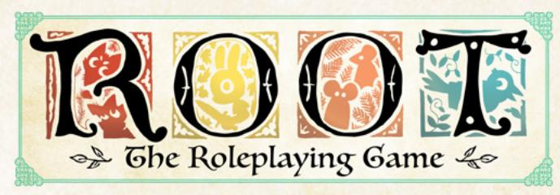
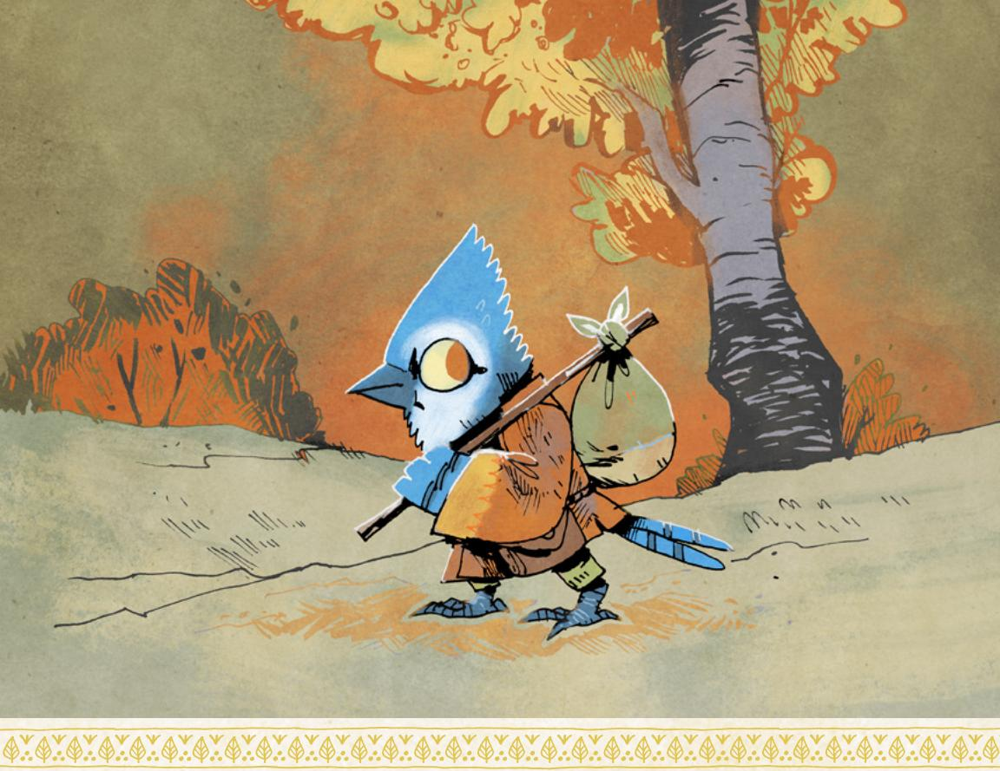
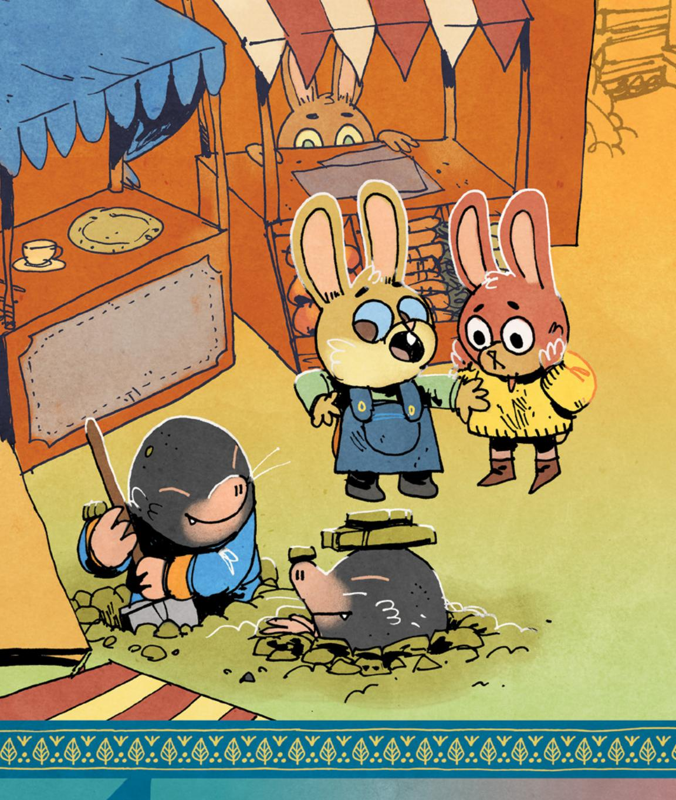

{0}------------------------------------------------

{1}------------------------------------------------

# Travelers & Outsiders

Design: Brendan Conway, Sarah Doom, Marissa Kelly, Simon Moody, Sarah "Sam" Saltiel, Mark Diaz Truman

Writing: Brendan Conway, Danielle Lauzon, Simon Moody, Mark Diaz Truman, Camdon Wright

Developmental Editing: Brendan Conway & Mark Diaz Truman

Copy Editing: Monte Lin & Kate Unrau

Layout: Miguel Ángel Espinoza

Art: Kyle Ferrin

Art Direction: Marissa Kelly

Proofreading: Katherine Fackrell

Root Board Game Design: Cole Wehrle

Root Board Game Graphic Design & Layout: Cole Wehrle, Kyle Ferrin, Nick Brachmann, and Jaime Willems

Root Board Game Concept: Patrick Leder

Root: The Roleplaying Game text and design @ 2019-2021 Magpie Games. All rights reserved. Root: A Game of Woodland Right and Might @ 2017 Leder Games. All rights reserved. Leder Games logo and Root art TM & @ 2017-2020. All rights reserved.

Special thanks to Meguey and Vincent Baker for creating Apocalypse World, the Leder Games team for allowing us to play in their brilliant world, and the more than 6,000 Kickstarter backers who made Root: The RPG possible. We are humbled by your collective encouragement and support.

Printed by LongPack Games. First printing 2021.

{2}------------------------------------------------

### Table of Contents

| The Woodland Expanded5                       | The War Advances 177         |
|----------------------------------------------|---------------------------------|
| The Riverfolk Company9                       | Woodland Setup178               |
| The Lizard Cult12                            | Faction Roll 182             |
| The Grand Duchy 16                        | The Faction Phase184            |
| The Corvid Conspiracy19                      | The Marquisate 186           |
| New Moves & Skills 23                     | The Eyrie Dynasties190          |
| New Weapon Skills24                          | The Woodland Alliance 193    |
| New Reputation Moves 31                   | The Lizard Cult197              |
| New Roguish Feats42                          | The Riverfolk Company201        |
| New Drives45                                 | The Grand Duchy  206      |
|                                              | The Corvid Conspiracy210        |
| New Natures50                                | The Denizens213                 |
| New Connections 54                        | Using the Board Game  215 |
| Masteries & More57                           | Clearings of                    |
| Species Moves58                              |                                 |
| Species Moves as Playbook Moves. 60       | the Woodland217                 |
| Species Abilities System  64           | Making Your Own Clearing219     |
| Masteries 69                              | Heartwood  221            |
| Custom Moves77                               | Description 221              |
| New Equipment 79                          | Conflicts222                    |
| New Tags81                                   | Important Residents228          |
| New Pre-Made Equipment85                     | Important Locations234          |
|                                              | Special Rules 235            |
| New Playbooks 91                          | Introducing the Clearing236     |
| The Champion93                               |                                 |
| The Chronicler97                             | Sundew Bend238                  |
| The Exile 101                             | Description238                  |
| The Envoy105                                 | Conflict239                     |
| The Heretic 109                           | Important Residents245          |
| The Pirate 113                            | Important Locations252          |
| The Prince 117                            | Special Rules254                |
| The Raconteur121                             | Introducing the Clearing 255 |
| The Raider 125                            |                                 |
| The Seeker129                                |                                 |
| Tailoring                                    |                                 |
|                                              |                                 |
| Campaign Play133 The First Session 134 |                                 |
| During the Campaign  141               |                                 |
|                                              |                                 |
| Ending the Campaign 145                   |                                 |
| Beneath the Surface (Playbooks)150           |                                 |

Wilds at the Edge [.............................160](#page-160-0)

{3}------------------------------------------------

### Welcome, fair traveler!

Travelers & Outsiders is the first supplement for Root: The RPG, a pen-andpaper tabletop roleplaying game based on Root: A Woodland Game of Might and Right, a board game designed by Cole Wehrle and featuring art from Kyle Ferrin. In Root: The RPG, you and your friends take on the role of vagabonds, rogues of the Woodland who act as something between knaves and heroes as they travel from clearing to clearing taking on jobs to make ends meet.

In these pages, you'll discover a whole new world of adventure—new mechanics, new character types, new systems for the Gamemaster (GM), and more! Each chapter of Travelers & Outsiders builds upon the existing rules of Root: The RPG, adding in expansion factions like the Lizard Cult and the Corvid Conspiracy, and offering new options for players and GMs alike.

Of course, you do need to know how to play Root: The RPG to make use of this book! All of the material here is supplementary—you need a copy of the Root: The RPG core book to get all the rules for playing the core game.

{4}------------------------------------------------

#### Here's what you can find in Travelers & Outsiders:

- The Woodland Expanded (Chapter 1) adds the four expansion factions—the Riverfolk Company, the Lizard Cult, the Grand Duchy, and the Corvid Conspiracy—to Root: The RPG, including descriptions of each faction as both a background faction and an intervening, conquering faction in the War.
- New Moves & Skills (Chapter 2) expands your game by introducing new weapon skills, reputation moves, roguish feats, drives, natures, and connections. All of these mechanics are easy to introduce to your game, building on existing systems to give your players new options!
- Masteries & More (Chapter 3) goes beyond creating new instances of existing systems to offer brand new rules for introducing species mechanics—including two different systems for making species matter—as well as advice for writing custom moves and masteries, specializations that allow PCs to get triumphant results on a 12+.
- New Equipment (Chapter 4) offers dozens of new tags alongside new pre-made weapons, armor, and other gear. All of these tags (and equipment) are easy to integrate into an existing campaign, allowing players to have lots of options for making their new equipment great!
- New Playbooks (Chapter 5) adds ten new playbooks to Root: Gbe RPG, including the Champion, the Pirate, the Raconteur, and more! Each of the playbooks comes with a full set of mechanics alongside instructions for how best to play the playbook and notes on each playbook's moves.
- Tailoring Campaign Play (Chapter 6) expands on the GM advice in the Root: The RPG core book to talk about running a long-term campaign, including advice for the first session of a campaign, tips for managing the PCs' ongoing adventures, and ideas for how to bring a campaign to a close. In addition, this chapter also includes GM advice for all nineteen playbooks, a system for introducing large-scale random events like new factions entering the War, generational play, and rules for leaving the Woodland entirely!
- The War Advances (Chapter 7) replaces the simple faction roll in the Root: Gbe RPG core book with a robust system—the faction turn—for managing conflict between the factions directly when time passes. This chapter contains new rules for all eight factions, including the newly introduced expansion factions, as well as instructions for using the board game, Root: A WOODLAND GAME OF MIGHT AND RIGHT, as part of your campaign.
- Clearings of the Woodland (Chapter 8) features two new clearings focused on the new expansion factions—*Heartwood* and *Sundew Bend*—alongside a guide to creating your own clearings for your campaign.

Finally, you can find these playbooks and other **Root**: The RPG materials for print at <a href="https://www.magpiegames.com/root">www.magpiegames.com/root</a>. Enjoy your time in the Woodland!

{5}------------------------------------------------

The Woodland Expanded

{6}------------------------------------------------

he Woodland is populated by various factions, from the Marquisate to the Woodland Alliance, but these are not the only factions that exist in the world. Other factions exist in and around

the Woodland, but due to internal Woodland politics and external factors, never rose to prominence. This chapter presents four new factions you can use in your games of **Root**: **The** RPG and gives guidelines for including them in an existing game, or creating a new game with them.

The Riverfolk Company are entrepreneurs seeking a profit. They buy, trade, and sell literally anything and everything the Woodland could need. The Lizard Cult is a religious sect, proselytizing to the denizens of the Woodland and offering succor to the most downtrodden and poor in the area. The Grand Duchy seeks to overtake the Woodland, incorporating the denizens into its highly political Duchy. The Corvid Conspiracy weaves itself secretly into every clearing of the Woodland, attempting to subtly gain power over all of them.

Each of these mighty factions normally exists in or around the Woodland, but as unimportant actors or background elements easy to dismiss in the light of a burgeoning war. For any of these factions to become a major player, several aspects of history and the current state of the Woodland would need to change to accommodate them. This doesn't entail just removing one faction and inserting another, though it might be that simple in some cases. Any of these groups could move into a power vacuum left by another major player, maybe even two.

When deciding how to use these four new factions in your Root: Gbe RPG campaign, you should consider which ones you want to add, and which ones you are removing. Making these adjustments requires some finagling of the Woodland's story to allow the factions to change. You can either rewrite the history of the Woodland to explain how one faction never rose while another did, or you can advance the current story of the Woodland, having a faction or two fall while another rises.

Also consider which roles each of the factions fulfill and how they interact. A game filled with nothing but highly political factions in the Marquisate, the Eyrie Dynasties, the Woodland Alliance, and the Grand Duchy all vying for dominance transforms your Woodland into a high-conflict, byzantine web of political maneuvering. Similarly, having no political powers involved—by removing those actors and only having the Lizard Cult, Riverfolk Company, and Corvid Conspiracy acting in the setting—could lead to oblique, nonphysical conflicts between factions competing over cultures, economics, beliefs, or ideologies.

{7}------------------------------------------------

#### Changing the History

Which factions you remove or add are entirely up to you, but it is worth considering how the Woodland got to where it is. If either of the Eyrie Dynasties or the Marquisate had never come to power in the Woodland, this would have the largest impact on the state of the Woodland. Would the Woodland Alliance still have as much motivation to form if two seemingly tyrannical powers had not been vying for control of the Woodland? Would the Grand Duchy see the Woodland as an easy prize and attempt to take it over instead of the Marquisate?

Imagine if the Eyrie Dynasties had never gathered enough steam to regroup and attempt to retake the Woodland. Instead of the denizens choosing to side with a known element against the Marquisate, they might have instead chosen to join the Lizard Cult as a way to bolster themselves against the perceived ravages of the Marquisate. If the Corvid Conspiracy was involved, it might have hamstrung the Eyrie Dynasties from the inside and might now be using them as a proxy for their insidious actions. The Woodland Alliance might find themselves attempting to fight back against two different invading forces of the Grand Duchy and the Marquisate, who are both embroiling the denizens in their proxy wars.

Imagine if the Marquisate had never invaded the Woodland. Maybe they were driven back by a Woodland bolstered by the Corvid Conspiracy. When the Eyrie finally returned to try to retake power, they might have found the clearings infested with the Lizard Cult, who violently opposed them, rather than the Marquisate. The Grand Duchy might take the place of the Marquisate completely, seeing the weakened Woodland as easy pickings after the Great Civil War. When the Woodland Alliance rose up to resist the Eyrie retaking the Woodland, they might have discovered their new Riverfolk Company allies were selling to the enemy.

Imagine if the Woodland Alliance had never formed to resist the Marquisate and the Eyrie Dynasties. Maybe the denizens turned to the Grand Duchy, taken in by their seemingly orderly system and polite manners. The Lizard Cult offers the denizens an alternative to the factions at war and presents a source of freedom through religion. The Corvid Conspiracy could be using disenfranchised denizens to fight a shadow war against the Marquisate and Eyrie Dynasties. The Riverfolk Company may stick to the streams and rivers, but their influence may bring hope and jobs to a population seeking release from the oppression of the Marquisate or the Eyrie.

{8}------------------------------------------------

### Moving Forward

If your game is already underway, or if you aren't comfortable with changing the Woodland's history, you can also advance the Woodland's story to make room for new factions. Imagine what would happen if the Eyrie Dynasties finally buckled under the weight of their own stubborn traditions. Or if the combined efforts of the Eyrie Dynasties and the Woodland Alliance drove the Marquisate back. These factions would not be gone completely, but their influence would diminish to allow someone else to fill a void.

If the Woodland Alliance is subdued or destroyed, the denizens leading them might go into hiding. The dredges of the Alliance might still be around, but they hold no sway or influence. Their members might join forces with another faction in search of a new fight. They might also be open to outside influence, their hardship and trauma giving someone the ability to take advantage of them.

The Marquisate might finally win their war against the Eyrie Dynasties, or the Dynasties themselves might break under the weight of their ridiculous edicts and rules. Individual fiefdoms might still exist in the clearings, but the Dynasties would be no more. Such a collapse might leave room for someone else to step in to push against the Marquisate. It might also just leave the denizens of the Woodland full of anxiety about an unchecked invading force.

The Marquisate is overextended, and many factors could cause them to leave the Woodland. Major losses to the Woodland Alliance or Eyrie Dynasties might force them to retreat or regroup, or they may face challenges at home that require them to withdraw their troops. While the Marquise may still watch the Woodland from a distance, she cannot afford to leave more than a few isolated troops in the area. Such a power vacuum would beg to be filled, allowing for any number of factions to step into the Marquisate's place.

In these scenarios, one of the factions falls, and another faction may rise in its place. The various new factions can step into voids that make sense for them. The Riverfolk Company might move in to capitalize on instability, to make war on the other Woodland factions, or even to make money while helping clearings rebuild after the end of strife. The Lizard Cult is looking for more followers, picking from the downtrodden specifically. It will move into places where denizens are being oppressed and offer them protection. The Grand Duchy will move to fill a political void or will enjoy political intrigue with other political factions. The Corvid Conspiracy thrives in chaos and will flock to places where uprisings have been unsuccessful, where a power vacuum needs filling, or where folks are getting too complacent.

{9}------------------------------------------------
