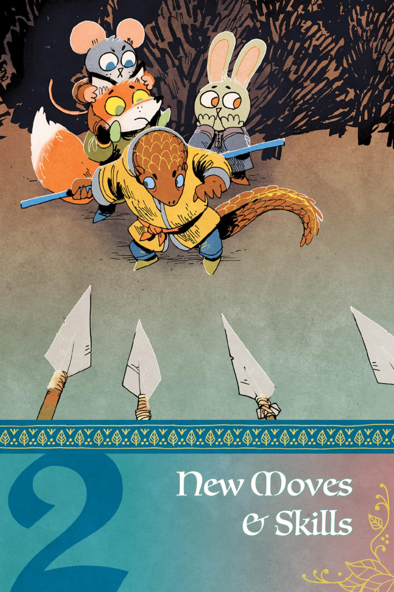
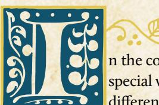

### The Riverfolk Company

Across the Woodland, denizens can watch riverboats laden with goods float along the waterways. These boats, captained by denizens of all species and crewed by merchants and mercenaries, make up the Riverfolk Company. Their merchants set up shops in clearings along rivers and streams, selling literally anything a denizen could want as long as they can afford the price. The Riverfolk accept barter and trade for goods and services, but some Company representatives are pushing for the use of River Scrip, a note indicating they owe a good or service to the holder, as a general currency within the Woodland.

### The Riverfolk Company in the Background

The Riverfolk Company has been around for as long as anyone can remember. As the name suggests, the Riverfolk are primarily based around rivers, but they also use the roads to get their goods and services to Woodland clearings. They recruit new members, merchants and mercenaries, in the areas they service to extend their reach and profit margins. The Riverfolk Company is not generally powerful enough to control a clearing or even dominate its economy (though exceptions do exist), but over time a clearing might become dependent on the Company's goods and services, especially if that clearing is under the sway of a trading post.

For most of their history, the Riverfolk haven't paid any more attention to the Woodland than their other areas of operation. They might have a representative in a single clearing along a river, or one who travels up and down the river, hitting a new clearing every few months before starting their return trip to wherever they came from. The Riverfolk Company merchants seem to be always on the move, seeking out a new angle for a deal, or proselytizing about River Scrip to those who do business with them. When the Eyrie Dynasties ruled the Woodland, a river trader might come through a clearing once a year to sell their wares before moving downriver to the next clearing. Without the Eyrie's byzantine traditions to navigate, the Riverfolk Company traders seem to arrive more frequently and stay just a little longer.

A Company merchant's wares change between clearings as they take goods used for trade in one clearing to sell in another for profit. No matter what they actually carry, Company merchants pride themselves in having what the denizens want, and they will happily take special orders or offer to find just the right thing to satisfy a customer. The Company merchants are often trained in a variety of skills, including combat, allowing them to offer their services for trade if their goods don't strike a customer's fancy.

If a denizen can't afford the price of a necessary good, they can work for the Company to pay off a debt. If a denizen is willing to accept River Scrip in

{10}------------------------------------------------

return for a good, the Company will give them a better price than through normal trade. River Scrip is simply a note of promise, backed by the Riverfolk Company's considerable force and reputation, that states that any Company merchant will accept it in return for goods and services. All Company merchants honor River Scrip and push for its use as a way to cut down on loss of stock to sell when making trades. Few clearings are widely using River Scrip at the moment, but the idea is catching on, especially when the Company accepts it at a premium over other trade goods.

The Riverfolk Company has a policy to buy low and sell high, and haggling with a Company merchant is not for the faint of heart. They are not easily won over, and they know the value of a good, even if they are underpricing it for their own ends. There's absolutely no overselling to a Company merchant. The Riverfolk Company has a reputation for always delivering what it promises... which means denizens continue to deal with them despite their almost predatory practices.

### The Riverfolk Company in the Woodland War

The Riverfolk Company are more than happy to take advantage of the Woodland War. As clearings gear up for conflict, the Riverfolk are there to provide weapons and supplies. As other clearings recover from devastating attacks, the Riverfolk are there to provide building supplies and food. As factions lose soldiers and look to replenish their ranks, the Riverfolk Company mercenaries are happy to accept goods for their swords. These aren't charitable dealings, of course; a clearing must pay for the Riverfolk Company's services as always. But some skippers in the Riverfolk Company are not completely without empathy and often offer small discounts to clearings in need.

{11}------------------------------------------------

The Riverfolk are in the Woodland to make a profit, but more than that, they wish to drive the Woodland economy of supply and demand. Where they see an opportunity, they take it, and they seek to control all the major supply chains of goods throughout the area. Even as Company agents and skippers are seemingly always willing to make a deal, they take great care in determining what they sell and particularly what they buy. If it seems supply is too high within the Woodland, they will buy up the surplus and ship it outside the Woodland to sell at three times the price. Then when the denizens need that good, it is artificially scarce, and the Riverfolk Company are there to sell it back at a higher price.

The Riverfolk have built trading posts in several key clearings throughout the Woodland. These trading posts serve as bases of operations for all Company agents and outposts for mercenaries to stage through. The Company use their trading posts to keep a constant eye on the Woodland economy, and they influence it quickly. Merchants keep in contact with each other and strike deals to set prices, sell passage on river boats, contract out services, or presell wares before a boat comes through the clearing. With mercenaries always on tap at the trading posts, the Riverfolk create a central location for anyone looking for goods and services to go. If anyone attempts to make an aggressive move against the Company, they simply mobilize their mercenaries as a functional militia to drive off the aggressors. They may not have enough mercenaries to compete in consistent direct conflict with other major factions, but they certainly have enough to pose a threat when attacked.

Clearings with trading posts find trading with the Riverfolk Company fast, convenient, and often cheaper than other local merchants. The Riverfolk Company end up dominating the market in a clearing with a trading post, driving their competition out of business. Clearings with Company trading posts boom economically but become completely dependent on them.

### The Company

In the Riverfolk Company, a merchant co-op, every individual merchant is a free agent who owns a share of the Company. Most merchants are referred to as "skippers" or "captains"—traditionally they have boats or rafts of some kind—but the term applies even to overland Company merchants. Each captain tithes a percentage of their profits to the organization, money the Riverfolk use to build permanent structures and fund River Scrip production, and that they keep in case the Company needs to take action as a whole rather than individual units. "Buy low, sell high" is the only real rule for a Company merchant. Each skipper sets their own prices, but those working in close proximity to one another discuss and set prices so that they can each ensure they all maximize their profits.

{12}------------------------------------------------

### The Lizard Cult

Nestled in their gardens, denizens who are part of the Lizard Cult give worship to the Great Dragon. Viewed as strange fanatics, they cultivate beautiful groves within clearings as part of their worship, and they are insistent on spreading the word of their religion to any who will listen. Within the Woodland, what the Cult believes is less important than what it does. It takes in the outcasts, downtrodden, and disenfranchised, and it gives them succor and a purpose. The Cult ministers to the sick and indigent, and it provides places of healing and sanctuary within their gardens. It converts denizens to the Cult's way of life, attempting a gentle approach at first. But if a clearing is resistant, the Lizard Cult doesn't mind using a little force to show them the way.

### The Lizard Cult in the Background

The teachings of the Lizard Cult only started making their way into the Woodland within the past decade or so. A small contingent of Cultists arrived in the Woodland from their desert home, proselytizing their beliefs. They traveled from clearing to clearing, speaking to any who would listen and finding converts among the outcasts of Woodland society. Prior to the Woodland War, the Lizard Cult found little success establishing a firm foothold in the Woodland due to its outsider status. Some denizens viewed the Cult with a wary stance, especially with the Marquisate's invasion forces serving as a stark reminder of the troubles foreigners may bring. That didn't stop the acolytes from trying, and they successfully established small groups in outlying clearings and in those with little Eyrie Dynasties presence—a foothold for their conversion, but a tenuous one.

Spread by traveling acolytes, the Cult's teachings bring hope to the downtrodden and provide a purpose to outcasts. The Cult speaks of the light of the Great Dragon (or the Wyrm, or any of several other names), whom Cult members devote all their worship to. The Great Dragon teaches that the Cult should provide for those who cannot provide for themselves, as the Great Dragon will provide for those who are loyal. The Cult thus offers real aid to those in need, and its ministrations bring a peace of mind to many denizens. As such, the Cult's reputation as a group is relatively positive among those who truly encounter its members—among those who remain aloof and know the Lizard Cult only through stories, it is often seen as a creeping threat, an insidious heresy that inculcates a belief in monstrous things.

When a denizen sees a Lizard Cult member in a clearing, it is often a missionary traveling to spread the word. It's rare to find a clearing with a garden. The vast Lizard Cult orthodox religion hasn't sent many new missionaries into the Woodland, beyond the initial wave of pilgrims, and its teachings haven't

{13}------------------------------------------------

caught on with the Woodland as a whole. Those it has converted take up the pilgrimage, attempting to spread the word to other clearings.

The Lizard Cult's presence in a clearing is anything but subtle. Traveling acolytes proselytize and actively try to convert denizens while providing succor even if they make few inroads. If the acolyte happens to convert a denizen, then the two stay longer trying to convert even more. They try to establish themselves as a spiritual authority, and quickly the denizens' own traditions get swept into Lizard Cult religious practices.

### The Lizard Cult in the Woodland War

With the advent of the full Woodland War, the Lizard Cult is sending more missionaries to the Woodland than ever, and it makes no bones as to its purpose there. The Cult seeks to convert as many denizens to its beliefs as it can. Acolytes refer to it as "bringing them into the garden," and they hope to make all the Woodland a grand garden for the Great Dragon. The Cult's methodology amid the War is straightforward. Acolytes establish a foothold in a clearing with a small group and convert the outcasts of society. As the Cult grows in power, it builds permanent settlements it calls gardens. Gardens are grand shrines to the Great Dragon—they serve as places of worship, homes for members, and shelters for those seeking aid.

On the surface, Lizard Cult worship is a blend of practical rules and rituals that look a lot like traditions. Acolytes preach about the Great Dragon, but most denizens have no real connection to it. Basic members, called seekers, rarely see much more than standard feast days, festivals, prayer services, and charity work.

{14}------------------------------------------------

To become an acolyte, to reach the true inner circle of worship, the Lizard Cult member must perform a sacrifice. Those who are sacrificed are always willing, and to be chosen as a sacrifice to the Great Dragon is a grand honor that comes with several days of ceremony, feasts, and celebration. Yet, at the end of the day, someone dies to elevate another acolyte to the robes.

The Lizard Cult is fanatical about its beliefs, but not immutable. Many of the acolytes are Woodland converts themselves, and they blend their older traditions with Lizard Cult beliefs as a way to make it more palatable to their friends and families. Once the Lizard Cult has more than a few converts in a clearing, they establish a garden. With these gardens comes a more aggressive mindset. Rather than the soft indoctrination of the lowest and poorest clearing members, the Cult exerts pressure on all denizens to convert. Seekers are welcomed into the garden proper, and sometimes those who forcefully rebuke the teachings of the Cult find its members ready and willing to respond with violence.

The Lizard Cult doesn't have an army, but neither does it have directives against violence. Its members, seekers and acolytes alike, pressure others to join, and this sometimes leads to violent clashes. The firmer the grip the Cult has on a clearing, the more dangerous its membership can be to nonbelievers. This is especially true against birds—in Lizard Cult orthodoxy, the Great Dragon has deemed birds as unworthy of fiery salvation and therefore denizens to be reviled.

{15}------------------------------------------------

### Doctrines

The Lizard Cult has a firm hierarchy. At the top of each clearing's sect is a single acolyte—the Voice of the Dragon—who presides over a garden. Officially, all Woodland acolytes are subordinate to an acolyte council back in the Cult's desert home—the Heart of the Dragon, the council is called—but in practice, this goes unenforced, and the local Voices make all their own decisions and doctrines.

At the very bottom of the hierarchy are seekers (formally known as Seekers of the Dragon), the general membership who have not yet gone through their sacrifice ritual to become acolytes. Above them are acolytes, and above them is the supreme acolyte for the garden, the Voice of the Dragon. Acolytes have specific duties to the Cult, and their duties set them apart from one another in castes. The Tongues of the Dragon are missionaries and pilgrims, ordained to spread the Great Dragon's word. The Claws of the Dragon are the Cult's soldiers, specifically charged with protecting the Cult and, sometimes, with rooting out heretics. The Eyes of the Dragon seek out information about the Dragon and spy for the Cult.

Acolytes are chosen for these roles based on skill, but sometimes on seniority and favoritism. Uncasted acolytes (sometimes called "Drakes") often work hard to prove themselves to a caste they hope to join. Seekers normally have only one route to progress through the hierarchy: perform a sacrifice, sending the sacrificed individual to an eternity joined with the Dragon's beneficence. Some Voices are rumored to make local exceptions from time to time, allowing sacrifices of food or valuables for ascension to the rank of acolyte, even though those sacrifices are technically disallowed by orthodoxy.

Individual gardens within the Woodland tend to express different variations on the word of the Great Dragon due to cultural differences. This leads to some clashes over doctrine, ideology, and heterodoxy. This isn't to say that the Lizard Cult is prone to infighting or instability. But it does mean that the message gets muddied between one clearing and another. Giving mixed messages to denizens seems to suit their purpose well though, as no one on the outside can point to one particular belief or practice as particularly bad when there are so many options to choose from.

{16}------------------------------------------------

### The Grand Duchy

Traveling via expansive tunnel networks, the moles of the Grand Duchy—also known to the denizens as the Great Underground Duchy—spend most of their time beneath the earth. They work tirelessly to construct tunnels from their neighboring realm into the Woodland in hopes of one day overtaking the resource-rich forest. The Duchy's ultimate goal is to subjugate the denizens after invading and conquering all the clearings. If it weren't so mired in political intrigue, it might even be unstoppable. Instead, the Grand Duchy moves slowly, needing approvals from the appropriate ministers before it can take even the smallest actions. In the meantime, the Duchy builds up propaganda to convince the Woodland denizens how wonderful being a Duchy citizen is, anticipating that the denizens won't realize how few of its promises it can truly deliver on.

### The Grand Duchy in the Background

The Grand Duchy arose from a group of disparate mole domains, all tired of what they perceived as oppression by surface-dwelling denizens. As the Duchy formed, it created a series of ministerial roles to oversee different aspects of its newly formed government. The Duchy hoped it would promote unity as well as ensuring no one mole was in charge of all the others.

As the Duchy grew into its own, the ministers felt they knew best and refused to act unless action served their interests. What was supposed to be a system of checks and balances turned into a race to garner favors and support in order to get anything done. This codified into the Grand Duchy a highly political atmosphere, where actions take a great deal of haggling and planning to coalesce. The Duchy's motivations never wavered, though. It will never again bend to surface-creature whims, and its preference would be for the Duchy to just rule everyone.

The Duchy has set its sights on the Woodland and has been building tunnels in the outlying area for years in preparation for a future invasion. Political intrigue being what it is, the Duchy is poised, but has never yet been ready to strike. Several key tunnels remain unbuilt—awaiting ministerial approval—and supply requisitions languish in wait. What tunnels have been built are currently used for information gathering and Duchy propaganda sharing, but not much else.

Most denizens rarely see a Duchy citizen, but they are around. Those denizens who travel the less trodden paths, or who have illicit dealings, find them at the head of small smuggling operations, using their tunnels to smuggle goods and people between clearings. These underground citizens share Grand Duchy propaganda, barter for information on Eyrie Dynasties- or Marquisatecontrolled clearings, and generally try to pave the way for the Duchy when the time is finally right to strike.

{17}------------------------------------------------

### The Grand Duchy in the Woodland War

Grand Duchy invasions are insidious things. At first, denizens won't find them marching down trails or smashing doors, launching sieges or large battles. Instead the Duchy either uses propaganda to win over the hearts and minds of a clearing or simply declares a clearing its sovereign domain and strikes with sudden, overwhelming force. It has an army which moves through the Duchy's tunnels, shows up in a clearing overnight, and quickly subdues and subverts local defenses.

Clearings nearest to the Grand Duchy's homeland have already seen this happen. The Duchy's forces undermine the current government, promising its leaders prominent roles within the Duchy in return for their loyalty. Sometimes the takeovers aren't so peaceful, but the Duchy always promises the best for those who pledge their loyalty quickly.

Grand Duchy messaging is insidious. It promises a stable government, a place for all denizens, and a chance for anyone to become a leader. In truth, the Duchy seeks absolute domination over the Woodland and subjugation of its denizens. Sure, a denizen might get promoted to city leader in a provisional government for a few months, but then a lord from the Duchy will come in and take over their duties. The denizen now has a new title, and role, but these are mostly meaningless pleasantries used to dupe the populace.

The Duchy moves in stops and spurts. An initiative awaiting approval may languish for weeks, but when it is finally approved, the citizens get busy enacting the plan. Its invasion force is particularly efficient at moving into a clearing, setting up a provisional government, and spreading Duchy propaganda. It comes in with dozens of wondrous promises to win over new citizens, though delivery of those promises usually falls flat as politicking between ministers can grind the Duchy's plans to a halt.

{18}------------------------------------------------

### Parliament

The Grand Duchy is led by a parliament filled with individual leaders who head different departments. The parliament has nine major roles, six of which are replicated in miniature within clearing governance. The other three are oversight positions in the parliament: the Duchess of Mud, Baron of Dirt, and Earl of Stone. Not every single Grand Duchy clearing has every one of the six replicated positions, of course—bureaucracies take time to solidify.

The Foremole is in charge of building new buildings, such as citadels and markets, for the Duchy. Foremoles tend to be matter-of-fact individuals who seek building supplies, laborers, and resources over political clout or future actions.

Captains are the Duchy's elite fighters; Marshals lead the soldiers and troops for the Duchy. Both often ask for payment, political favors, better appointments, and sometimes hard-to-find goods. Brigadiers control the Marshals and Captains, and getting Captains and Marshals to act may be as simple as convincing the Brigadier to mobilize them. This does cost the Brigadier, though, as any minister has the right to ask for negotiation before acting—meaning those attempting to get a Brigadier to act may need to both pay the Brigadier and compensate them for the payments they will have to make to Captains and Marshals.

Bankers make money for the Duchy. They deal in trade, smuggling, production, and any other money-making endeavor, so long as they profit from the outcome.

Mayors oversee a clearing and all the ministers who act within their geographical area. They can act to make a particularly stubborn minister take action—in particular by engaging the process to remove a local minister from their position but may seek more esoteric rewards for pulling such strong political clout.

The Duchess of Mud oversees all of the Duchy's territory and tunnels, and the Duchess chooses when and where to expand. Those seeking to invade a new clearing need the Duchess of Mud on board to build the tunnels and oversee the work. Such an action takes a lot of resources, and the Duchess will want compensation, along with the prestige of their name attached to the endeavor.

The Baron of Dirt oversees all the markets and the economy for the Duchy. When someone wants to build a new market, or branch into a new way to make money, they need the Baron of Dirt's permission. The Baron of Dirt wants wealth for the Duchy and will often approve a project only when they are thoroughly convinced that it will turn a profit by the next year.

The Earl of Stone is in charge of strongholds, the military, and conflict. To go to war, the Duchy must have the permission of the Earl of Stone. The Earl is cautious about where and when to send Duchy troops and requires not only the normal bribes and political sway but also detailed plans of troop movement and resources before agreeing to an action.

18 Root: The Roleplaying Game

{19}------------------------------------------------

### The Corvid Conspiracy

Whispers and hushed voices speak of a group of frightening taloned figures meeting in shadowed places to pursue dark ends. The Corvid Conspiracy is a criminal organization bent on changing the Woodland from the shadows. The Corvids remember what rule was like under the Eyrie Dynasties and have no intention of letting it happen again. They work in secret, plotting and scheming to infiltrate clearings and gain control. Those in power are aware the Conspiracy exists but paint it as nothing more than a group of delinquents. While it is true that the Corvids resort to criminal means to raise funds and enact plots, what they truly seek is to control the Woodland, by hook or by crook, and ensure their families are never treated poorly again.

### The Corvid Conspiracy in the Background

The Corvid Conspiracy started when the Eyrie Dynasties ruled the Woodland. A group of crows and ravens migrated to the Woodland, tired of domains like Le Monde de Cat and eager to live under righteous bird rule. Instead of being welcomed, the Eyrie exploited these immigrant birds, and their rigid edicts and traditions neglected to protect the Corvids from those in the Woodland who saw them as easy and vulnerable targets.

These immigrants eventually banded together to protect their own and others exploited by the Eyrie, offering shelter, protection, and whatever aid they could. They built networks of mutual support, bringing food and goods to those in need, and looking for ways to work together to make life better.

To fund such endeavors, they turned to crime. They stole from the Eyrie, smuggled needed goods into clearings to bypass outrageous taxes, peddled illegal items, and beat up any Eyrie guards who got too close to their chosen communities. Why obey laws laid down by illegitimate rulers?

As time went on, the Conspiracy grew from those roots. If the Conspiracy could just control the Woodland, then they wouldn't need to keep being criminals. If they could get rid of the Eyrie Dynasties, they could ensure no one slipped through the cracks. If only they could act without anyone catching wind and stopping them before it was too late. Until that end, they would bide their time as criminals, amassing the means to finally enact their plans.

When the Great Civil War fractured the Eyrie Dynasties, the more ideological denizens among the Corvids believed their mission was a moot point. After all, the reason they came together in the first place was to protect their own from the excesses and cruelties of the Eyrie.

{20}------------------------------------------------

Yet those of the Conspiracy who had grown more accustomed to the power and resources of their criminal network were more reluctant to relinquish what they had built. They began to work independently from each other, with their own small underground fiefdoms, turning clearings toward their own ends and seeking criminal arrangements that continued to consolidate power.

What was once a widespread Conspiracy soon dwindled to a handful of agents and smaller criminal groups, loosely connected, spread among a few clearings. Many individual agents may still think of themselves as serving the cause, but the overall force is no longer what it once was.

Strife in the Woodland has kept the Corvids active, though they are far from capable of exerting influence without greatly increasing their membership. The Corvid Conspiracy is a secretive group, but not so secretive that no one knows it exists. Recruitment requires exposure, and local leaders are wary of letting the Conspiracy get too organized within their purview due to their criminal activities.

Instead, the Corvids often stick to the criminal underbellies of clearings, dealing in all forms of illegal activity, like smuggling, manufacturing drugs, thievery, extortion, and arson. Due to their low numbers, they hire out for many activities, paying well and protecting anyone who works for them. Outside those few clearings where they have a presence, most denizens never see a conspirator or their effects.

The Eyrie Dynasties, of course, still whisper and worry about the Corvid Conspiracy, a dangerous foe that formed right under their watchful eyes and beaks. Many crows within the Eyrie are viewed suspiciously—even if they have no history of conspiracy or sedition—and many Eyrie leaders make special efforts to shield their plans and schemes from the watchful eyes of other birds.

{21}------------------------------------------------

### The Corvid Conspiracy in the Woodland War

While the Corvid Conspiracy is a criminal organization, it has never forgotten its history and initial directive. The threat of new tyrannies in the Woodland War pushes the Conspiracy back together, to act and spread influence, and to strive for control of the Woodland again. Criminal activities remain a particular strength of the Conspiracy, but now acts of vandalism, political upset, and violent change dominate its endeavors. While their ultimate goals and plans are a secret, the Corvids move to act in the open, creating chaos as they go.

Ultimately, the Corvid Conspiracy wants complete control over the Woodland. It does not have an army poised to strike or an elite force ready to move into position. Instead, it has a whisper network throughout the many clearings of the Woodland. The Conspiracy has been recruiting and seeding operatives and agents throughout the area for years, and even after a lull with the fall of the Eyrie Dynasties in the Civil War, the Corvids can activate those agents in fast and furious fashion.

What's more, the Corvid Conspiracy has a plot for every clearing, a plan for every political situation in which the Corvids find themselves. In one clearing, they may need to violently overthrow the ruling Eyrie leader and replace her with one more in line with their desires. In another, they have already positioned one of their members as a high-level official. In yet another, they are slowly strangling the economy to push out the local Marquisate guards. They always have a plan in motion, even if it's not always obvious where it's going.

But the Corvid Conspiracy's members are still true to their roots. They want to bring stability and peace to the Woodland and create a place that is safe for all its denizens, not just the ones in high places. And yet...their chosen method for enacting such change comes with violence.

The Corvids' criminal activity is sometimes the sole desire of more selfish members, but more often it is a cover for deeper plots. Conspiracy members extort money from their political opponents using blackmail, threats, and deception. They sabotage their enemies' transportation and travel routes, setting snares across trails and stealing goods for their own use.

And when those things don't work, they will plant bombs in residences and places of governance in an attempt to kill their political rivals. If they think someone has caught on to them, they drop a trail of false leads that catches some poor patsy in the crossfire. All the while, they move their operatives under everyone's noses towards other ends.

{22}------------------------------------------------

#### Murmurings

The Corvid Conspiracy is not a huge organization, but they have a large impact. A clearing may only have a handful of agents running an entire Conspiracy operation, conspirators using go-betweens and lower-level agents to organize many of their plots. Just a few leaders can hire out muscle, control the local bandits, and build a network of denizens who often have no clue they are even working for the Corvid Conspiracy! When many operatives are working in the same clearing at any one time, a few might run the standard criminal activity and engineer the plots, while others infiltrate the ruling body, seizing upon their numbers to expand their reach.

Each clearing has a head conspirator, and together the conspirators of all the clearings make up the Council of Crows. Each member of the Council of Crows has worked their way up from the streets to a leadership position. Current Council members can sponsor new ones to lead the Conspiracy's operations in a clearing, but generally speaking, a denizen becomes a Council member through their own successes. Despite its reliance on blackmail, favors, and scheming, the Conspiracy is a bit of a meritocracy, and those who prove to be effective rise to positions of authority over their clearings.

The Council of Crows meets regularly to determine the direction of the Conspiracy's plots in each clearing. Ultimately, each Council member has final say in what happens in their clearing, but they like to discuss. This leads sometimes to bickering about the right way to proceed, as a small but vocal faction of the group wishes to take a more active role in the political atmosphere of the Woodland, rather than acting from the shadows. Instead of bribing or threatening officials to get what they want, why not just become the official? The other members mostly feel this is too risky a maneuver. If they are fully out in the open, then their enemies know exactly where to strike.

In general, of course, the other factions of the Woodland are aware that the Corvid Conspiracy exists and work to stamp them out. Individual denizens may think they're a myth, but those with power, and those with something to lose from Conspiracy operations, know that they are real and pursue the Corvids' demise.

Agents keep a level of anonymity in their actions by conscripting hapless denizens to do their grunt work for them. Need someone to set a bomb in a Marquisate lumber yard? Promise to bring medicine to a young beaver's ailing aunt and he will happily drop the package off with no questions asked. Need someone to mislead an Eyrie guard? Offer room and board to an orphaned mouse and she will gladly play her part. The agents do the more intricate work—procuring materials, making bombs and traps, or infiltrating and spying on enemies—but they have no compunction about gaining outside aid.

{23}------------------------------------------------

{24}------------------------------------------------

n the core book of Root: **The** RPG, there are ten different special weapon skills, six different Reputation moves, nine different roguish feats, and more. Altogether, it's plenty of

options to play a full campaign and to develop PCs in many different ways. But having still more specific options for development allows you to tailor your campaign to exactly your needs!

In this chapter, there are:

- New weapon skills, all of which exist to supplement those in the core book and which follow the same overarching rules.
- New Reputation moves, some of which give you more options in general, and some of which give you faction-specific moves.
- New roguish feats, all of which supplement the feats in the core book and which follow the same overarching rules.
- New drives, any of which can be swapped in with the drives on a PC's playbook using the session move (page 130 of the core book).
- New natures, any of which can be swapped in with the natures on a PC's playbook using the end of session move (page 130 of the core book).
- New connections, any of which can be swapped in with the connections on a PC's playbook using the end of session move (page 130 of the core book).
