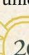
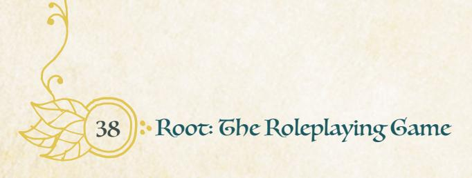

### **New Weapon Skills**

These weapon skills in general follow the same rules as weapon skills in the **Root**: **The RPG** core book (page 89). In order to use one of these skills, you must have learned the skill, usually by advancing; you must have a weapon tagged with the skill; and you must be able to trigger the move as appropriate within the fiction.

If a move includes the "no tag required" label, you do not need a weapon with the tag in order to use the weapon skill. Moves like *hurl* or *hammerpaws* don't require a weapon tag because they either don't rely on the weapon or can be used with any weapon.

いると、このことには一会一つ、このことに一会して、この

{25}------------------------------------------------

#### Battle Fury **special**

When you *fling yourself into a fury of weapon, tooth, and claw in an allout attack at intimate range*, mark wear on your weapon and roll with Luck. On a hit, fill your exhaustion track. For each box you mark, inflict 2-injury on your target. On a 7-9, your target also inflicts their harm upon you. **This move does not require the weapon to be tagged with intimate range; weapons with close range may also be used**.

You roar and fling yourself at a foe, not grappling them so much as lashing out wildly as you bear them to the ground. You're engaging in *battle fury*!

*Battle fury* is for mad, nigh-wild strikes made at intimate range. It requires training, less to cover expert movements and skilled action, more to teach the sheer ferocity necessary to be effective, to keep your opponent off-balance and to ignore their return strikes.

The cost of *battle fury* is that it will always fill your exhaustion track—but the advantage is that you might be able to take out a single dangerous foe all at once! Keep in mind they inflict harm on you on a 7-9, so you might be in grave danger...and if they have friends, you're not going to be in a good position to keep fighting them.

#### Charge **special**

When you *charge at an opponent at far range*, mark exhaustion and roll with Might. On a hit, they must choose to either mark 2-exhaustion or allow you to push them—you say where they are driven, and you say what range you now stand at. On a 10+, inflict morale harm on them as well.

You see the archer nocking another arrow, so you put your head down and barrel towards them, weapon first, with all your might and all your speed. You're *charging*!

*Charging* is for closing distance quickly, and for driving your foe into a position you might find more advantageous. Your opponent can resist your charge by marking 2-exhaustion—that means they're keeping their distance, trying to flee and maintain the same range. But If they don't mark 2-exhaustion, then you get to say exactly what range you are at from them, and you get to say exactly to what location they have been driven.

{26}------------------------------------------------

#### Durl special no tag required

When you *hurl a weapon or dangerous object not intended for throwing at an enemy at far range*, mark exhaustion and roll with Might. On a hit, your hurled weapon strikes your target; mark wear on the weapon and inflict 1-injury and 1-exhaustion on your target. On a 7-9, choose 1. On a 10+, choose 2.

- mark an additional wear on the hurled item to inflict an additional
   1-injury
- the hurled item rebounds to somewhere reachable, instead of out of sight or out of reach
- your target is knocked off their feet by the throw

You heft your warhammer over your head and with a mighty shout, send it spinning end over end, straight at an opponent. You're *hurling* your weapon!

*Hurling* a weapon allows you to attack at far range with weapons that are not designed for that purpose. If you are throwing a weapon meant to be thrown, you're *targeting someone* instead. This is for throwing a boulder...or your battleaxe.

If you don't choose "the hurled item rebounds to somewhere reachable," then it lands somewhere else (the GM will tell you where).

#### Lunge SPECIAL

When you *make an outright lunge at a foe within close range*, choose an amount of injury between 1-injury and 3-injury and roll with Finesse. On a hit, you inflict that amount of injury—ignoring armor—but if your target survives (or if other foes are present) they can take advantage of your over-extension to inflict the same amount on you. On a 7-9, they can inflict 1-injury more upon you than you had originally chosen to inflict upon them.

You and your foe are circling each other when, suddenly, you leap forward, rapier extended, point aimed straight at their midsection! You're *lunging*!

A *lunge* is a bit like a single all-out attack. It has more finesse and grace than a *battle fury*, but it is putting you significantly at risk in an attempt to score a winning blow all at once, one that your opposition can't mark wear to absorb.

Make sure to pick the amount of injury you wish to deal before rolling. You're committed to that amount—so if you roll a 7-9, they get to deal I-injury more unless you successfully take them out first!

{27}------------------------------------------------

#### Paired Fighting SPECIAL

When you and another vagabond *pair fight back to back against foes at close range*, you each mark exhaustion and one of you rolls with the following modifiers (max +3):

- +I if you have a connection with each other
- +1 if you are outnumbered
- +1 for every 2 additional exhaustion you mark between the two of you

On a hit, you together inflict 1-injury on every foe within close range (or 3-injury total against a group), and you each suffer 1-injury. On a 7-9, choose 1. On a 10+, choose 2.

- you each suffer little (-1) harm
- you inflict an additional 2-injury to any single target (including a single group) of your choice
- you inflict 2-morale harm
- you create a path for the two of you to retreat or advance

You and your friend heft your swords and stand back to back as the Eyrie soldiers surround you. They charge, but the two of you know exactly how to fight in coordinated fashion, sweeping around each other, rolling over each other's backs, and pulling off all manner of joint maneuvers. You're performing *paired fighting!*

**Paired fighting** does require both vagabonds to have this skill, and both vagabonds to have a weapon with the **paired fighting** weapon skill tag. Otherwise, you can't use the move.

The benefit, however, is a powerful move that allows the two of you to together take on whole troops of foes with relatively little harm, acting as effectively or more so than either one of you could independently.

{28}------------------------------------------------

#### Dammerpaws SPECIAL NO TAG REQUIRED

When you *come to blows with an armed opponent at close or intimate range while you are unarmed*, roll with Finesse. On a hit, they inflict their harm on you. On a 7-9, choose 2. On a 10+, choose 3.

- you inflict 2-exhaustion on your opponent
- you shift your range one step
- you deflect some of their incoming blows; suffer little (-1) harm
- you inflict wear on their equipment with precise strikes
- you take an object from them; they must mark exhaustion to stop you

You put up your paws as the hammer-wielding vagabond swings at you. With all the force you can muster, you send punches hurtling at their weapon arms. You're using *hammerpaws*!

**Hammerpaws** is for unarmed combat, where you're landing heavy, powerful strikes at exactly the right place. Usually if you're unarmed, you're likely to be at a massive disadvantage compared to an armed foe—not least because their weapon likely has greater reach than yours. **Hammerpaws** lets you have a chance at fighting armed foes even when your paws are empty!

*Hammerpaws* is less effective at straight-forwardly inflicting injury on a foe than, say, *engaging in melee*. But it can help you inflict exhaustion, wear, or even steal something from your foe!

Rarely, you might choose to "inflict wear on their equipment with precise strikes" and have it matter exactly which piece of equipment you inflict wear on. If you're fighting most NPCs, all their equipment is abstracted to a single wear track, so it wouldn't matter. You might want to narrate striking at a particular piece of gear, but all of the wear goes on the same track!

But if you're fighting, say, another PC, or if you're tracking wear on a single vitally important piece of equipment, then you get to choose exactly which piece of equipment suffers the wear. Remember that any piece of gear that has no wear remaining is destroyed if you target it by choosing this option.

{29}------------------------------------------------

#### Pinpoint Shot SPECIAL

When you *take the time to fire a shot at far range with pinpoint accura*cy, roll with Cunning. On a hit, you put the shot exactly where you choose:

- if you target an NPC's weak point, inflict 3-injury (unblockable by armor)
- if you target a piece of equipment's weak point, inflict 2-wear
- if you target something in the environment, you strike it, cut it, or break it as appropriate

On a 7-9, your current vantage point isn't quite right; you need to move to a better one before you can make the perfect shot. Mark exhaustion to scramble there, and then choose as normal.

You hold the bowstring tight, breathing shallowly until it's the perfect moment to send the arrow exactly where you need it to go. You're firing a *pinpoint shot*!

**Pinpoint shot** is for "sniper" shots—a hard shot to take in the middle of a big fight—the kind that can pierce weak points in armor. It can still be used to target specific environmental elements, but it differs from **trick shot** in that it's more effective at actually dealing harm to opponents, and less effective at accomplishing a full range of different effects and striking multiple targets.

On a 7-9, you don't have to take any special action to take up your second vantage point—you just mark exhaustion, then you make your choice as normal.

#### Long Shot Special

When you *pull hard on your bow's draw to extend its range beyond far*, mark wear and exhaustion to roll any far range weapon move (*target someone*, *pinpoint shot*, etc.) with Might instead of the move's normal stat, paying the additional cost(s) of the weapon move as well. This weapon skill requires your weapon to be tagged with far range, this skill, and the tag for whatever weapon move you are using (if needed).

You pull back an arrow, stretching your bow to its limit, and aim it into the sky so the shot will arc and travel at massive distances. You're firing a *long shot*!

The advantage of this move is that it allows you to fire shots at distances that normally would be impossible. If your foes are beyond far range, you would normally be unable to act against them. But with *long shot*, you can make normal moves at excessive ranges—albeit at a cost. There isn't a tag for "farther than far," so you only need the far range tag to use this move!

29

{30}------------------------------------------------

#### Point-Blank Shot SPECIAL

When you fire a shot at point-blank range (intimate range), mark any combination of up to 2-wear and up to 2-exhaustion, and roll with Luck. On a hit, you put your shot into your target; inflict injury equivalent to the wear and exhaustion you marked, combined. On a 10+, you can also skip back after your shot, moving to close range before your opponent can grab you or otherwise retaliate. Your weapon does not need to be tagged with intimate range to use this weapon skill.

You duck under the sword-swing, drawing an arrow as you do, and release it straight into the armored plate of your enemy. You're firing a point-blank shot!

Firing a point-blank shot can cost you significant exhaustion or wear, but at the benefit of inflicting a lot of injury, fast, as all of that force goes straight into your target. Dancing back to close range after you fire on a 10+ will keep you safe from immediate reprisals; otherwise, your opponent (if they're still standing) can grab you at intimate range.

#### Switch hands Special

When you shift your grip to change your dominant hand in the middle of an extended bout with a foe, roll with Finesse. On a 7-9, choose 1. On a 10+, choose 2:

- your new dominant hand is fresher; clear 2-exhaustion
- your opponent is startled by the shift; they mark morale harm
- your shift gives you an immediate opportunity; mark exhaustion to seize it and inflict 2-injury

You smirk at the enemy duelist as you switch your rapier from your left paw to your right paw. You're switching hands!

Switching hands requires well-balanced and designed weapons and grips hence requiring the weapon to be tagged appropriately. You can't confidently switch with just any old weapon, and you may only use this move once during any given extended bout with a foe. Once you've changed hands once, it doesn't help to switch hands again!

**Switching** lets you get a quick refresh or put your enemy at a disadvantage—it won't win you the fight on its own, but it can give you a chance to recover!

{31}------------------------------------------------

### **New Reputation Moves**

These moves supplement the Reputation moves included in the **Root: The** RPG core book on page III. They still all have a Reputation requirement, meaning that you cannot use these moves at all unless your Reputation with the appropriate faction is at the correct level.

Some of these new moves are universal—you can use them with any faction, as long as your Reputation is at the right level—and some are specific to a given faction.

#### Endorse a New Leader

**REQUIRES REPUTATION +1**

When you *openly endorse an individual as the new leader of a faction's forces and/or presence in a clearing*, roll with Reputation with that faction. On a hit, you throw your support behind that individual and the faction's representatives in that clearing react. On a 7-9, the GM chooses 2. On a 10+, the GM chooses 1.

- the faction's current leadership in the clearing is directly opposed; you need to handle them before your endorsed candidate can take over
- the denizens of the clearing aren't on board; you need to speak to denizen leadership and convince them, or expect direct opposition
- the faction's enemies in the clearing want to take advantage of the shift in power; keep an eye out for conspiracies and plots

On a miss, after you publicly announce your support something new and dangerous is revealed about the leadership or the individual you endorsed that reframes the situation.

You speak to the crowd of assembled denizens, telling them that it's time for new leadership of Scarlett's Hollow, and you think that Cesspyr Thistle is exactly the right rabbit for the job. You're *endorsing a new leader*!

**Endorse a new leader** is a move for helping to swap local leadership without requiring you to resort to violence or covert action to achieve your end. The results of the move all require you to take further action to ensure the leader of your choice comes to power. That action isn't guaranteed to be easy or simple, but it gives you a chance and a path to ensure that your chosen leader rises.

Endorse a new leader does require you to have someone in mind—if you simply want to remove the old leader, you're looking to vilify a leader instead.

{32}------------------------------------------------

### Vilify a Leader

**REQUIRES REPUTATION +1**

When you *openly vilify an existing leader of a faction's forces and/or presence in a clearing*, roll with Reputation with that faction. On a hit, you've stirred up dissent—the leader's departure from power is set in motion. They will be removed from power when next time passes... unless they take other action (alliances, use of force, etc.) to quash the dissent. In the meantime, on a 7-9, the GM chooses 2. On a 10+, the GM chooses 1.

- your words are taken up and elaborated upon; resistance to the leader you targeted threatens to get out of control, involving violence or arson
- the leader (or their defenders and supporters) grows more radical in their defensiveness; they will respond to any threats to their position with force
- you are singled out for your blunt outspokenness; expect reprisals

On a miss, your words wind up stoking opposition—more denizens, agents, and faction members come out in support of the leader you tried to vilify.

You give a speech to the collected denizens exclaiming how Mayor Hopplefur is driven only by greed, with no interest in the welfare of the denizens of their clearing. You're *vilifying a leader*!

*Vilify a leader* is the flip side of *endorse a new leader*. It preys more upon feelings of dissent and dissatisfaction, meaning that the results of this move are more volatile. But you can use it to set the wheels of change in motion... although those wheels rarely take the cart where you expect.

If nothing dramatic or untoward happens, then on a hit on this move, the old leader would be deposed the next time that time passes. The response of the denizens and the current leadership, however, can derail that plan, as each one takes actions that change the issues at stake and redirect attention and energy.

{33}------------------------------------------------

#### Lead Groops in Battle

#### **REQUIRES REPUTATION +3**

When you *lead troops of a faction in battle*, roll with Reputation with that faction. On a hit, they accept you as their commander for the fight. On a 7-9, hold 2. On a 10+, hold 3. Spend your hold 1-for-1 during the fight to commit them to:

- take and hold a location
- rout a substantial enemy presence
- take an enemy leader captive
- destroy a fortification or resource
- defend a group or location

On a miss, your troops engage in battle but with a confused command structure—they wind up embroiled in chaotic battle across the entire area, and in their confusion, they're losing.

You stand at the head of the Woodland Alliance troops, arrayed in their green cloaks behind you. You lift up your sword, pointing its tip right at the Marquisate's general, and shout—"CHARGE!" You're *leading troops in battle!*

**Leading troops in battle** is for directly leading them in the midst of the conflict—not for planning in advance. You might trigger the move in advance of the battle as you rally the troops, and then spend your hold during the battle, but you must actively *lead the troops during battle* to spend the hold—no leading from the rear!

When you spend a hold, the troops around you take on that goal and accomplish it to the best of their ability. Only if the situation changes substantially can they be derailed from their task.

To *lead the troops*, there of course have to be troops. This move won't generate soldiers out of nothing; use other Reputation moves to requisition some faction soldiers if you can!

{34}------------------------------------------------

#### Running Large Battles

Moves like *lead troops in battle* and *intimidate enemy troops* can help you add nuance and description to larger-scale battles, but remember you only need to "run" large battles where the vagabonds are present. If they're not around, then you can resolve the battle entirely off-screen, according to your agendas and principles.

When the vagabonds are around, they're still the center of the action. Focus on them and their specific fights against particular troops and enemy soldiers. In particular, the more enemy commanders or named enemy characters who can get into the fight with the vagabonds, the better—your game becomes a lot less dramatic, fast, if the vagabonds are just fighting squad after squad of faceless enemy soldiers.

It can help, before diving into a large-scale battle with the vagabonds around, to jot down who you think the ultimate likely winner is (all things being equal). Play to that end—the only way that side is going to lose is if some massive, surprising things happen. And massive, surprising things are a vagabond specialty!

#### Intimidate Enemy Groops

**REQUIRES REPUTATION -2**

When you *draw attention to yourself and threaten enemy troops by wielding your Reputation through an intimidating display*, roll with Reputation with the enemy's faction, treating it as positive (+2 or +3) for this roll. On a hit, you put fear into the enemy. On a 7-9, pick I. On a 10+, pick 2.

- the enemy troops won't act until their leader makes a rallying speech or cry to them—the leader is exposed and vulnerable to attack
- the enemy troops will target you, above all else, when they attack
- the enemy troops are rattled; inflict 2-morale harm on the group

On a miss, the enemy is invigorated by their anger at you, and they act right now, in full force.

You stand before the massed enemy Eyrie troops, and you lift up your axe, the terrible weapon known as Featherclipper. You shout how each and every one of them will face your wrath and feel the edge of your infamous weapon. You're *intimidating enemy troops*!

*Intimidating enemy troops* does require you to have a low Reputation, but it also requires you to put on an appropriately intimidating display to wield your own Reputation. If you're known as a dangerous, terrifying destroyer, then shouting, waving your sword around, and being generally physically threatening can work

34 Root: The Roleplaying Game

{35}------------------------------------------------

just fine. If you're known to be a cheater, trickster, and liar, then the display probably has to play into tricks you might have lured them into, traps you might have planned, and your own cocksure smile.

If the enemy troops won't act until rallied, it means you have a chance to single out their leader, targeting them independently of their troops. It can also be used to buy you time when you need it! If the enemy troops target you, above all else, it means you'll face the terrible brunt of their force...but others won't.

#### Plan New Project MARQUISATE

**REQUIRES MARQUISATE REPUTATION +2**

When you *convince Marquisate officers to begin a new significant project*, roll with Reputation with the Marquisate. On a hit, they begin the project. On a 7-9, the GM chooses 3. On a 10+, the GM chooses 2.

- it will take time; check back in after time passes
- it requires special resources; the Marquisate agents will tell you what they need
- it requires elimination of a threat first; the Marquisate agents will point you at the threat
- it can't be quite what you asked for—just something close enough; the Marquisate agents will tell you what form it takes

On a miss, the Marquisate cannot undertake your project right now because the Marquisate's resources—and you—are required elsewhere; the GM will tell you why, and where.

You meet with the local Marquisate governor and tell her to get working on a new bridge to cross the river and connect this clearing to Blackpaw's Dam. You're *planning a new project*!

This faction-specific Reputation move is geared to take advantage of the Marquisate's particular skillset in developing infrastructure and industry. It doesn't have to—you can convince the Marquisate to begin a project like "take over Blackpaw's Dam"—but it can just as easily be such things as "research a cure to the purple plague."

Whatever conditions the GM gives you on the project, once they are all fulfilled, the project moves forward. If you deliver the special resources, eliminate the threat, accept the limited form, or allow enough time to pass as needed, your project will move forward.

If the GM is using the full faction specific rules on page 184 of this book, they can track the new project as they would other Marquisate projects.

35

{36}------------------------------------------------

### Wield Bureaucracy EYRIE

**REQUIRES EYRIE REPUTATION +2**

When you wield the bureaucracy of the Eyrie Dynasties to achieve your ends while time passes, roll with Reputation with the Eyrie. On 7-9, choose 1. On a 10+, choose 2.

- vou gather information from your contacts; ask the GM any three questions about the Woodland, and they will answer truthfully from the Eyrie's perspective
- you push the Eyrie to allocate resources just a bit differently; they will deliver some available resource to a clearing of your choice, as long as it makes any sense to do so
- you add a stipulation to an upcoming Eyrie attack or action; the soldiers will follow it.
- you arrange a meeting or audience with any Eyrie individual at a place of your choosing; the GM will tell you when the meeting takes place
- you get Eyrie courts to add or repeal a legal requirement within any one Eyrie-controlled clearing; the Eyrie theoretically must follow it

On a miss, the Eyrie's bureaucracy plays back, and you find yourself charged with a duty you hadn't planned on from Eyrie authorities; fulfill it before time passes next, or mark 3-notoriety.

You sit at a desk, sifting through ledgers and documents, sending out letters... and by the end of your toil, the local clearing's draconian laws are repealed! You're wielding bureaucracy!

Wielding bureaucracy takes time, which means it's only triggered while time passes. You can always say that you're spending time interacting with Eyrie contacts and issuing requests or letters over that period of time. Of course, if you're on the road the whole time, or in hiding, then it's going to be hard to wield bureaucracy.

What's important to note about this move is that it isn't direct control. Instead, you are manipulating the byzantine structure of the Eyrie Dynasties to produce your desired outcomes.

"Adding a stipulation to an attack or action" means that you can add a condition or a rule those troops must follow, like "No structures will be harmed or destroyed during the attack" or "Security at the event will be minimal."

"Adding a legal requirement" means the Eyrie functionally adopts a new rule in the clearing of your choice; although, as always, just because there is a law, that doesn't mean the local denizens follow it to the letter...

{37}------------------------------------------------

#### Incite Revolt WOODLAND ALLIANCE

#### **REQUIRES WOODLAND ALLIANCE REPUTATION +2**

When you *incite local Woodland Alliance sympathizers and agents to revolt*, roll with Reputation with the Woodland Alliance. On a hit, the revolt is imminent—you have to prepare! It will take place when next time passes. On 7-9, the GM chooses 2. On a 10+, the GM chooses 1.

- you need to convince at least one local sympathizer to get important resources or support for the revolt; otherwise, it will fail
- you need to weaken, destroy, or incapacitate a specific opposing force; otherwise, the revolt will fail
- you need to steal weapons or equipment for local sympathizers; otherwise, the revolt will fail
- you need to rally a local group by doing them a favor; otherwise, the revolt will fail

On a miss, the revolt fires off *right now*—well before you are ready, and while the opposing forces might be prepared for you. Good luck.

At the meeting of the secret Woodland Alliance cell, you bang your talons on the table and say, "The time to strike is now!" You're *inciting revolt*!

*Incite revolt* lets you set off a fully-fledged Woodland Alliance revolt! The Woodland Alliance as an organization builds towards these revolts across the board, but with this move you can spur them into action a bit earlier than normal. You must take on much of the burden of making sure the revolt can successfully take place, however; if you don't fulfill the conditions the GM sets, the revolt will be in trouble, and it will fail when next time passes and it fires off.

The Woodland Alliance must have a presence in the clearing—probably at least one full cell of revolutionaries—in order for you to trigger this move. You can't incite Woodland sympathizers and agents if there aren't any around!

On a miss, you were too persuasive, friend—the revolution is *now*! And there's a good chance no one is ready, and your opposition is too well-prepared, and... this isn't going to go as planned. Good luck!

{38}------------------------------------------------

#### Preach to the Choir LIZARD CULT

**REQUIRES LIZARD CULT REPUTATION +2**

When you *preach a sermon with a message to a crowd of Lizard Cultists*, roll with Reputation with the Lizard Cult. On a 10+, hold 3. On a 7-9, hold 1. Spend your hold 1-for-1 to make the crowd:

- bring someone forward and deliver them
- bring forward goods and offerings (providing you with at least 6-Value)
- unite and fight for you, destroying or attacking a target of your choice
- repair or defend something of your choice
- go quietly back to their lives

On a miss, the mob hears your message incorrectly, and acts on that belief.

You preach to a group of Lizard Cultists, telling a parable about a noble lizard who brought other animals under the shade, even as they recoiled from her scaly touch, to save them from the hot desert sun. You're *preaching to the choir!*

This move lets you rapidly convert a group of Lizard Cultists in a clearing into an active, functional mass. They can bring you things (including valuables); they can attack things; they can repair or defend things; and all of it quickly and almost out of nothing.

That said, they are an invigorated group of the faithful—they aren't necessarily acting with reason or restraint. That's why you might want to save one hold to send them back quietly to their lives—otherwise, the group you incense will keep acting as they choose, no longer following your guidelines.

On a miss, they *definitely* don't act the way you planned for them to act! You'll have to find some new way to stop them—another sermon isn't going to halt their understanding of your message.

{39}------------------------------------------------

### Conduct Sanctioned Trade **riverfolk company**

**REQUIRES RIVERFOLK COMPANY REPUTATION +2**

When you *write up an exchange of goods or services between any parties and sign it in the name of the Riverfolk Company*, roll with Reputation with the Riverfolk Company. On a hit, you form a proper agreement the Company will uphold, by force if it must—name the parties (including you), their responsibilities and promises, and any extra penalties for breach of contract. On a 7-9, Company support—mercenaries, trade embargos, etc.—still comes, but at a cost; when you want a Company agent to help uphold the contract, you'll have to offer a 1-Value bribe before they will act. On a 10+, the contract is airtight; provided you have a copy in hand, Company agents will enforce the contract in full. On a miss, your contract has a loophole or error in it; the Riverfolk Company won't enforce it, and it's only a matter of time before a participating party takes advantage.

In exchange for food supplies, the local rebels agree to start selling local iron ore back to the Eyrie—and you've ratified the exchange with Riverfolk Company authority and sanction. You're *conducting sanctioned trade*!

Using this move means you've learned enough Riverfolk Company practice, and gained enough status in the Company, that you can write up a contract and have the Company ratify it under its own bylaws. You can ratify contracts that don't inherently have anything to do with the Company itself, either—the Company will always come back for a percentage of those contracts, of course, but its authority exists in legal trade, not in any specific location. Stamping a contract with Company insignias means the contract is enforced by Company might, and the Company takes that seriously.

Creating a contract should get the Riverfolk Company and all its individual agents on your side, and on a 10+, it does just that! No agent of the Company can ignore the contract—at least, not without utterly sundering their professional ties and organizational bylaws. On a 7-9, the contract isn't quite enough. You have to play the Company's own internal game of politics to get your way, even after showing them the contract; a 1-Value bribe gets things moving, but at the GM's discretion, agents might accept other bribes.

As implied above, in incredibly rare circumstances, some Riverfolk Company agents might ignore even a contract created with a 10+—but that's because that agent is prepared to, say, defect to a whole new faction, or start a rebellion to destroy the entire structure of the Company. So if that happens...watch out!

{40}------------------------------------------------

#### Gap Criminal Networks CORVID CONSPIRACY

**REQUIRES REPUTATION +2 WITH THE CORVID CONSPIRACY**

When you *tap the local Corvid Conspiracy networks for a favor*, pick your favor from the list below and roll with Reputation with the Corvid Conspiracy.

- illicit goods, left in a hidden drop location for you
- assassination, accomplished quietly and without fuss
- sabotage, conducted on valuable equipment
- blackmail, collected and delivered to you for use
- secret intelligence, captured and safely sent to you

On a 7-9, the Conspiracy fulfills the favor, but leaves a request for you too—a favor for a favor. On a 10+, the Conspiracy just leaves a reminder that it might call upon you at some later date. On a miss, your illicit communications with the Conspiracy go awry—someone else gets your request, and they aren't happy.

You let a Corvid Conspiracy runner know that you're looking for some black powder explosives, and lo and behold, a couple days later you receive an anonymous note telling you to nab the third apple barrel to reach the market that day. You *tapped criminal networks*!

**Tapping criminal networks** is a move for using the Corvid Conspiracy's favor-based underground economy to get what you want. They have agents capable of all manner of terrible action, and you can trade favors with them to get things done.

Whatever favor you ask for comes to bear—you've earned enough Reputation with the Conspiracy that they'll fulfill favors you ask for, but they might ask for things in exchange. On a 7-9, you don't have to complete their request before they fulfill yours, but if you don't do as they ask soon, you can expect some notoriety with the Conspiracy coming your way.

{41}------------------------------------------------

#### Requisition Permits GRAND DUCHY

#### **REQUIRES REPUTATION +2 WITH THE GRAND DUCHY**

When you *requisition permits from the Grand Duchy*, roll with Reputation with the Duchy. On a hit, you can requisition a permit with certain access rights granted. These rights remain legal until when next time passes. On a 7-9, choose 2 access rights. On a 10+ choose 3.

- you are permitted to travel through Grand Duchy tunnels with the aid of a Duchy guide, allowing you to move between any two clearings connected by tunnels without making a roll
- you are permitted to obtain supplies from Grand Duchy caches and citadels with impunity; any time you reach such a cache, you may take up to 4-Value in supplies, no questions asked
- you are permitted access to members of Duchy Parliament; you can ask any Duchy outpost for news on their locations, and you can always gain access to them, no questions asked
- you are permitted to pass freely and without molestation in Duchy controlled areas, no matter whether you are carrying weapons or obvious contraband or not
- you are permitted to act directly against or harm any individuals not openly protected by the Duchy, and any individuals openly protected against the Duchy if you can prove their culpability in a crime

On a miss, a Duchy official comes to interrogate you about your requests for permit; expect undesirable scrutiny.

You head down to the local Duchy citadel and requisition an underground tunnel travel permit. You're *requisitioning permits!*

Requisitioning permits doesn't sound that exciting, but it's the best way to get access to the Duchy's unique assets and powers, or to slip past the Duchy's more restrictive confines. Imagine each of these permits as a kind of legal patent with your rights established; all Duchy soldiers and citizens are by law required to acknowledge your rights. In some situations, they might not, most likely because an individual Duchy official is particularly incensed at you—but those are few and far between.

None of these permits last forever, so use them or lose them! Of course, trying to adjust a permit to extend its expiration date or pass it off as still valid sounds like a use of the Counterfeit roguish feat or *tricking an NPC*...

{42}------------------------------------------------

### New Roguish Feats

These roguish feats supplement the nine roguish feats in the Root: The RPG core book (page 68). These new feats expand the options and situations covered by roguish feats, giving vagabonds new ways to advance and learn, and new ways to control a situation (instead of relying on *trusting fate*).

A vagabond can take these roguish feats just like others—they can earn them through advancement, or through some moves. At the GM's discretion, a vagabond can swap one of their starting roguish feats with one of these. Those situations should be rare, limited to times when a vagabond's entire concept is better supported by one of these new feats.

Generally speaking, these roguish feats are very specific. They're useful and cover brand new situations, but they won't come into play quite as often as some of the others. That said, as always GMs are encouraged to think of ways these feats might come into play, in order to **be a fan of the PCs**.

### Options for New Roguish Feats

**Cover Up** - Rolling unconscious guards into bushes where they won't be found, re-arranging a murder scene to look like an accident (or vice versa), obfuscating signs that the band was ever here—any attempt to remove evidence of roguish activity, or otherwise make a scene appear to be something it isn't, falls under this feat. Any attempt to Cover Up allows a vagabond to control the narrative about the truth of a scene, making an observer believe whatever the vagabond wants, so long as the vagabond has enough time to set up the scene. What separates a Cover Up feat from *tricking an NPC* comes down to the time and precision involved. Tricks are immediate and often improvised, whereas a Cover Up feat requires more moving pieces to craft a believable facade. That doesn't mean a Cover Up feat can't be quick or reactive—if another vagabond leaves some evidence of their actions, a vagabond with this feat can try to make it go away but runs the risk of getting caught in the act.

**Mastermind -** Organizing the band into position to launch a heist, directing denizens to form a fire brigade, leading an allied squad in a perfectly-timed pincer attack—any attempt to give commands or make tactical decisions falls under the Mastermind feat. Once a vagabond gathers information or *reads a tense situation*, they can use this feat to create tactical plans and direct others through nigh-military command. The main advantage you get through the use of this move is positioning your allies exactly where they need to be to be of greatest use. A hit with the Mastermind feat can act as a kind of prep that means anyone in the plan is exactly where they need to be—at least until the plan is derailed.

{43}------------------------------------------------

#### New Roguish Feats

| Name       | Description                                                                           | Risks                                                         |  |
|------------|---------------------------------------------------------------------------------------|---------------------------------------------------------------|--|
| Cover Up   | Remove incriminating evidence, obfuscate a scene's true nature                     | Detection, expend resources, take too long                 |  |
| Mastermind | Giving orders to NPCs, directing roguish operations, positioning tactical elements | Draw unwanted attention, plunge into danger, take too long |  |
| Set Trap   | Lay an ambush, rig simple booby traps                                                 | Detection, expend resources, leave evidence                |  |
| Tracking   | Hunt someone down, identify tracks, follow a trail of clues                        | Detection, plunge into danger, take too long               |  |
| Use Device | Operate machinery, wield ancient devices or artifacts, attempt vehicular stunts    | Break something, plunge into danger, weak result           |  |

This isn't a substitute for trying to *persuade an NPC*; Mastermind won't work with individuals or groups who aren't already likely to listen to you. Mastermind roguish feats can only be attempted if you already have the attention of—and influence over—the people you're ordering around. Remember, if they wouldn't already listen to you, you can't attempt this feat! Mastermind feats can also cover getting people and things into the right place at the right time, especially if using the flashback rules on page 71 of the Root: The RPG core book.

**Set Trap** - Brushing branches and leaves over a hastily-dug pit trap, wedging timed Corvid explosives under a bridge, keeping your bow ready while providing overwatch from a hidden position—any attempt to create a trap or an opportunity for a surprise attack falls under the Set Trap roguish feat. Whenever a vagabond might *trust fate* to lay a trap for someone, a skilled vagabond can use this feat to do so with far more precision. Set Trap can sometimes bypass an attempt at the Blindside roguish feat, but only if it affects a single target, and if the fiction supports the situation. For example, if you set a snare and *trick* a single foe into crossing over it, then they might be taken out all at once. Anything beyond the scope of a single-individual-oriented trap can be staged with this feat but you have to Blindside to actually capitalize on your preparation. Think of it a bit like Hiding before Blindsiding. For example, a vagabond can prepare a roadside ambush for a group with a Set Trap feat, lining up mostly-sawed trees to fall in the road and block their retreat, and then attempt a Blindside feat to rain arrows down on their quarries. This feat only covers ambushes and traps setting something to fail or misfire is more likely a Disable Device feat if it's done carefully, or *wrecking something* if it's fast and furious.

{44}------------------------------------------------

**Tracking** - Pursuing a mark through rain-soaked alleys, tracking a bear back to their lair, determining soldiers' movements by boot prints—any attempt to pursue or track down someone falls under the Tracking roguish feat. Tracking is about the actual act of finding and following others, not about staying hidden or staying out of sight—like the Hide or Sneak roguish feats—although a complication or miss will likely lead to those feats in order to keep one's cover.

**Use Device** - Driving a clockwork logging contraption, activating a ruin's flamespitting statues to repel rivals, banking a hang glider into thick foliage to evade Eyrie commandos on your tail—any attempt to control or activate machines or devices falls under this feat. Whereas Disable Device is about breaking a device or stopping its effects, Use Device is about making a contraption work for you. A vagabond with this feat has a knack for mechanics even if they're not a Tinker; they can figure things out on the fly, even if they've never seen how something works before. This feat also covers attempts to maneuver vehicles. Instead of *trusting fate* to steer a raft through rapids or jump a minecart over a gaping chasm, a vagabond can attempt to Use Device.

{45}------------------------------------------------

### New Drives

Each of these twelve new drives functions exactly like the drives on the original playbooks (see the Root: The RPG core book, page 171, for more on drives). They represent ways for a vagabond to advance during the course of play. Any vagabond can swap to these drives using the session move (see the Root: The RPG core book, page 130). At the GM's discretion, a brand new vagabond character can be made using these drives instead of the ones on their playbook.

#### Antimilitarist

*Advance when you sabotage a non-denizen faction's armies or their ability to wage war.*

"Sabotage" can entail burning an army's supplies, wrecking siege weapons, or even falsifying or destroying orders, as long as a faction's military is significantly hampered. A vagabond with this drive is pursuing an end to the War in the Woodland and is enacting that change by ruining every faction's ability to fight, regardless of their politics or beliefs.

#### Atonement

*Advance when you earn forgiveness from someone you or your allies previously harmed.*

This drive requires you to prove you understand how you've hurt someone and truly make things right. Simply apologizing for your actions or behavior isn't sufficient proof—you have to mean it and sincerely attempt to remedy the situation. "Earning forgiveness" will be different for each person but you can *figure someone out* to try and understand both how they're feeling and what they might want from you. "Previous harm" can't be something you just did five seconds ago, and it can't be a mild slight or insult. You might make amends for things that happen during a session, things established in character creation, or consequences of your actions discovered upon returning to a clearing you've previously been to.

{46}------------------------------------------------

#### Development

*Advance when you contribute to a lasting development or improvement to an entire clearing.*

Contributing to "a lasting development or improvement" can involve actively helping to create a permanent structure, like working with the denizens to build a new mill for a farm, or helping troops reinforce a clearing's decrepit walls. It can also involve creating a permanent opportunity like clearing out a ruin in order for a new structure to be built over it. These upgrades must be for the benefit of the entire clearing, even if everyone in the clearing doesn't agree with it—not every development will be altruistic or universally loved. You don't need to singlehandedly create such an improvement—providing labor, expertise, or supplies all count towards triggering this drive. Whatever the development is, remember that it needs to be "lasting," meaning it should fundamentally change the clearing and become an important location of some kind.

#### Devotion

*You follow an organized or folk religion; name it and describe its beliefs. Advance when you get a non-believer to share in one of your beliefs or practices.*

You may choose to follow one of the existing faiths of the Woodland (like the beliefs of the Lizard Cult) or create your own. You don't need to come up with every detail of your religion when you choose this drive—just make note of the most important beliefs and practices your faith asks of you. Think of a few big things that you must (or must not) do, such as "I must not kill," "I must pray to the Wyrm every morning," or "I must donate to the impoverished." When someone outside of your faith willingly joins you in one of those rituals or aspects of your beliefs, you advance. This drive isn't really about proselytizing; it's about sharing your beliefs with others in the hopes that they'll understand and appreciate what you practice.

#### Discord

*Advance when your actions create or intensify a serious conflict between two factions.*

Although every faction is always at odds with each other, they aren't always in direct confrontation. You probably don't care who's fighting whom so long as the Woodland is in chaos. "Creating or intensifying a serious conflict" goes beyond simple misunderstandings or squabbles—troops are dispatched, roads are blocked, relations sour. A conflict must arise where there wasn't one before, or you need to pour fuel on the fire of an existing feud. The outcome of your subterfuge may be noticeable right away, or you might find out when *time passes* or at the end of a session.

{47}------------------------------------------------

#### Esprit de Corps

*Advance when you win a battle against enemy soldiers alongside friends and allies.*

This drive emphasizes a vagabond's pursuit of military camaraderie—it only triggers after winning a battle, specifically against enemy soldiers, and in the presence of friends and allies. "Enemy soldiers" means they are real combatants—bandits, a rabble, or a mob wouldn't count. A battle can be any kind of combat engagement but it needs to be some kind of direct confrontation, whether it's a siege or a skirmish in an open field. You don't need to be leading those friends and allies to trigger the drive—as long as you've won the day with comrades-in-arms, you qualify.

#### Folk Hero

*Advance when you perform a significant act of service or heroism on behalf of the denizens.*

"A significant act of service or heroism" should involve creating some kind of lasting change to a clearing or overcoming a major obstacle. Simply helping one person with their troubles isn't enough to qualify for this drive—your act must make things better for the denizens going forward. Since this must be "on behalf of the denizens," it should be something the denizens actually asked you to do, or your actions should address a real problem of theirs—not just something you *think* is a problem. Just because you *think* Eyrie control of their clearing is a major problem doesn't mean ousting the Eyrie governor qualifies not when the governor was also providing food for the clearing, and the ouster leaves the clearing in chaos.

#### Glory

*Advance when you defeat a worthy foe in single combat.*

"A worthy foe" must be an enemy who can believably match or exceed your combat capabilities, and whose defeat is significant or meaningful. If you can be entirely confident you'll win against an opponent, then they're not "worthy". "Worthy" looks different for each vagabond—a nimble duelist might advance after defeating another skilled, dexterous fighter or a massive brute whose heavy swings make up for their lack of speed. "In single combat" means no other vagabond can interfere with your fight.

{48}------------------------------------------------

#### Mysteries

*Advance when you discover the truth behind strange phenomena or goings-on within a clearing.*

Whatever unusual activity appears to be going on in a clearing, "discovering the truth" means learning what's beneath that facade. You need to find the answer for yourself, whether by unmasking a false monster, locating the source of a "cursed" crop blight, or cornering a huckster with evidence and obtaining a confession. "Strange phenomena or goings-on" can be anything suspicious or unusual, from the mundane (like suspicious behavior of denizens) to paranormal phenomena with reasonable explanations.

#### Partisan

*Name a faction. Advance when you successfully complete a mission given to you by an important member of that faction.*

As a vagabond, you are a deniable asset for each faction but your outsider status means you're never truly seen as one of them. By taking this drive, you indicate you've taken a clear side as a dedicated freelancer for a particular side of the War. "An important member" of a faction must hold some position of power or influence, and the most obvious way to pursue this drive is to *meet someone important* and ask for (or be given) an assignment. Missions must be "given"—you can't assign yourself a mission, so be sure to talk to important representatives of your chosen faction often! For the MC, "a mission" can be just about anything but it should either advance the goals of the vagabond's chosen faction, or the personal goals of whoever gave you the task. A mission is complete when all of its objectives are met, whether or not you immediately report back to your handler.

#### Traveler

*Advance when you replace a valuable or meaningful item with one that represents the local culture.*

You can't trigger this drive by ditching your equipment and picking up a replacement off the ground. The equipment you leave behind has to be something valuable to you—it can't be something you might have thrown out anyway because it's not worth the weight to carry. The equipment you replace it with needs to reflect the essential nature of the clearing you're in, or otherwise represent a central aspect of its culture. You might acquire a sword from a clearing known for its fine steelwork, cookware and spices suited to a regional specialty dish, or a musical instrument tied to a clearing's heritage. Whatever equipment you leave behind is of no further use to you, and you become a walking tapestry of the Woodland with each new acquisition.

{49}------------------------------------------------

#### Wanted

*You've got a bounty on your head; name your crime(s). Advance when you defeat or evade capture by a serious threat trying to cash in on your bounty.*

If you take this drive at character creation, your background questions probably point to what crimes you're wanted for. If you choose this drive during play, work with the MC to decide who put the bounty out on you and why. Whatever crimes you're wanted for, they're serious enough that you risk capture anywhere you go. "Evading capture" means there's a genuine chance you would have been caught by pursuers. "A serious threat" has to be truly dangerous and they must be chasing you specifically for your bounty—the MC might send a squad of hardened commandos, a famous detective looking to pad their career, or even a coin-hungry vagabond after you.

{50}------------------------------------------------

### New Natures

Each of these twelve new natures functions exactly like the natures on the original playbooks (see the Root: The RPG core book, page 49, for more on natures). They represent ways for a vagabond to clear exhaustion during the course of play. Any vagabond can swap to these natures using the end of session move (see the Root: The RPG core book, page 130). At the GM's discretion, a brand new vagabond character can be made using one of these natures instead of either of the ones on their playbook, but we recommend starting with the playbook-specific ones and changing as the character does.

#### Braggart

*Clear your exhaustion track when you confidently and publicly accept an excessively perilous challenge.*

A vagabond with this nature often lets their overconfidence and desire for attention get the better of them. Boastfully accepting a challenge when you and your challenger are alone behind closed doors isn't enough to clear exhaustion—you need an audience to show off in front of. If the clearing's ruling council is there with you, that might count; the key is that enough denizens have seen the challenge and your acceptance that you can't reasonably deny it. By "confidently and publicly" accepting a challenge, you show others that you don't just think you can get the job done—you *know* you can do it, and with one arm tied behind your back! An "excessively perilous challenge" must be truly dangerous or foolhardy, something no reasonable denizen would attempt...but for a vagabond of your skill and confidence, it'll surely be no trouble to pull off! Right?

#### Commander

*Clear your exhaustion track when you assert authority over a group of non-vagabonds in a tense situation.*

A vagabond with this nature wants to be in charge when the chips are down and isn't shy about throwing their weight around to claim that authority. You might have a background in a leadership role, like a military officer, labor foreman, or noble. You might be an outright bully or a charismatic leader. However your nature formed, you feel most comfortable telling others what to do. The ones you can most easily command aren't vagabonds—they're too independent to order around and they don't organize well. Look for opportunities to lead groups of NPCs in action, or command the attention of a room. You can clear exhaustion just as easily rallying troops in combat as you can calming down frightened denizens during a bank heist.

{51}------------------------------------------------

#### Cowardly

*Clear your exhaustion track when you willingly surrender to hostile forces.*

A vagabond with this nature is often conflict-averse to an extreme—rather than risk harm, their instinct is to give up instead of fight. When you "willingly surrender" you're doing so because you want to; you make the choice to give in to your opponents. If you're forced to surrender by your harm tracks spilling over, then you don't invoke this nature. You must also surrender in earnest; you may sometimes be pushing an ulterior motive, like being brought into the prison beneath the fortress (so that you're inside the fortress walls), but even with the motive you're truly surrendering. If you're hiding lockpicks and knives with full intent to easily escape as soon as you're brought inside, you're not really surrendering—not least because in a true surrender, you can count on your captors searching you and finding any such contraband. Think of "true surrender" as giving up a significant amount of your character's bodily autonomy until you've been placed somewhere new, be it into a cell, a stockade, irons, or whatever else your captors choose.

#### Curious

*Clear your exhaustion track when you enter danger to investigate an interesting situation or location further.*

This nature speaks to your desire to learn more about the world and its goingson, regardless of any obvious hazards in your way. Your hunger for knowledge takes priority over your companions' warnings or immediate threats. This nature means you will often be the one at the head of the band, plunging headfirst into strange, exciting, or outright deadly situations and places to discover their true natures. You only invoke this nature when you "enter danger"—pursuing knowledge devoid of danger won't invoke this nature.

#### Generous

*Clear your exhaustion track when you provide meaningful quantities of supplies to those in need.*

"Meaningful quantities of supplies" means enough to make a significant improvement or change to the recipients' lives. For example, if a clearing is starving then providing them all with enough food for just a single meal might suffice. If an NPC comes to you and asks for help—"We're in desperate need of \_\_\_!"—then whatever they're asking for is clearly a "meaningful quantity" for them. If you're offering your own supplies, whatever you provide should be at significant cost to your depletion. Otherwise, you'll need to gather supplies from elsewhere to provide that much-needed aid.

{52}------------------------------------------------

#### Gossip

*Clear your exhaustion track when you reveal new and important information to someone who can act on it.*

A vagabond with this nature just can't keep their mouth shut, even when they know they should. Your nature speaks to some manipulative tendencies—you need to reveal information to "someone who can act on it," perhaps in hopes that you can compel them to do something you want. Note that they don't necessarily have to act on it for you to invoke your nature; you just have to reveal the information to someone who could actually use it meaningfully. "New and important information" must be knowledge the recipient didn't already have, knowledge that is actionable in some way, and knowledge that can affect their (or others') goals or well-being.

#### Improviser

*Clear your exhaustion track when you attempt to solve a technical problem without appropriate tools or skills.*

A vagabond with this nature is good at thinking on their feet and making do with whatever materials are on hand, even if they aren't the Tinker. You might be a whiz at jury-rigging solutions or you might love the thrill of fiddling with devices under pressure. "A technical problem" must involve crafts, mechanics, etc. and have some stakes in play or prevent you from advancing or accomplishing something (dismantling a haywire machine, cracking a safe to rob a mark). "Without appropriate tools or skills" means you either don't know how to do the task at hand or you don't have the right tools—your depletion track might be full or the problem might require specialized gear you lack.

#### Inspiring

*Clear your exhaustion track when you take action that clears the morale track of an NPC or group of NPCs.*

A vagabond with this nature tries to stand firm when things look dire in order to give others hope. You specifically care about convincing other NPCs to press on—at some level, you want to be a leader, and your fellow vagabonds are free spirits, far less susceptible to this kind of inspiration. Remember, you can't just give a speech to trigger your nature; the NPCs you're focused on have to believe you. When you clear their morale harm tracks, you invoke this nature and clear your exhaustion. Devoid of a special move helping you do so, the GM is the final arbiter of what clears a morale harm track, but generally speaking, actions that reinvigorate, provide hope, or push NPCs to strive even in the face of danger or hardship should all clear their morale harm.

{53}------------------------------------------------

#### Martyr

*Clear your exhaustion track when you engage overwhelming odds to protect others.*

A vagabond with this nature believes in heroism at the expense of selfpreservation. By invoking this nature, you're filled with resolve in the face of overwhelming hostile forces and accept your fate, so long as it means keeping others safe. "Overwhelming odds'' are more than you could possibly handle, whether you're facing a small group of elite fighters with far superior training and equipment or a horde of raiders spurred on by a warlord. You have to be engaging these enemies for the purpose of protecting others to clear exhaustion. You might be covering the band's escape from a heist, defending a village of denizens from invaders, or making a heroic last stand over injured allies. If you're engaging them with a legitimate and believable hope of victory, though, you're not invoking this nature.

#### Muckraker

*Clear your exhaustion track when you enter somewhere off-limits to discover incriminating secrets.*

A vagabond with this nature is likely never satisfied with whatever's on the surface of a situation. Whether you want to expose corruption or keep a record of blackmail material, you're not afraid to get your hands dirty to chase information down. "Somewhere off-limits" can be any restricted, forbidden, or guarded area but you can't clear exhaustion unless you're entering it for the purpose of gathering some kind of compromising evidence. Breaking into a noble's manor, for example, is only one step in completing this goal—when you manage to sneak into their office to rifle through their communiques, that's when you trigger your nature. And if you break into the town treasury to fill your pockets with coin, that won't trigger this nature at all.

#### Populist

*Clear your exhaustion track when you publicly try to rally a group of denizens to take action against injustice.*

A vagabond with this nature is invigorated not just by fighting injustice, but by filling the common folk with that same righteous indignation. You see yourself as a leader and a comrade of the denizens. To clear exhaustion you must rally and lead those denizens in public. No hiding behind closed doors for you those who would oppress the denizens must know and fear your presence! What's more, you can't just rally a group of denizens in general—you have to rally them to take some clear action, right now. Giving a speech isn't enough if it doesn't lead to action.

{54}------------------------------------------------

#### Vain

*Clear your exhaustion track when you make a big show of intervening in a situation that doesn't involve you to help or protect someone.*

A vagabond with this nature can't stand not being the center of attention. When you trigger this nature by making a big display about stepping in to save the day, you're giving in to your desire to be the main character of a moment. Protecting others and offering aid are part and parcel of being a vagabond, but a Vain vagabond makes others' troubles their business. Remember that whatever you're getting involved in didn't involve you before you decided to step in—you need to be interfering (even if you don't see it that way) to trigger your nature. You can still invoke this nature if someone wants you to intervene, just so long as you shove your snout into a situation that didn't involve you. And if they didn't want you to intervene at all, you can be guaranteed that you're invoking this nature!

### New Connections

These six new connections supplement the base connections used on every playbook (see the Root: The RPG core book, page 50). These new connections all function just as the base connections do, representing a relationship between two vagabonds. A connection is written on one vagabond's character sheet, and that vagabond is the one who makes the choices, triggers the moves, and otherwise most directly "uses" the connection. Vagabonds can swap in these connections during the course of play using the end of session move (on page 130 of the Root: The RPG core book). At the GM's discretion, a new vagabond's pre-written connections can be modified to use one of these.

#### Battle-Sibling

*When you fight side-by-side or back-to-back with them, take +1 ongoing to weapon moves as long as you remain within intimate range of each other.*

You trust the vagabond you share this connection with, having shed blood alongside them. You know their moves and know how to best complement their combat style. When the two of you are together, you're an unstoppable fighting force. So long as the two of you remain at that intimate range, you maintain the bonus to weapon moves. As soon as either of you shifts ranges away from each other to close or far, you lose this benefit. If you manage to regroup and go back-to-back or side-by-side again during the same scene or fight, you can regain the benefit of this connection. Note that they do not also gain the same benefit, unless they take a Battle-Sibling connection with you as well.

{55}------------------------------------------------

#### Confidant

*When they come to you in confidence with a problem, mark exhaustion to suggest a course of action to resolve it; if they do as you say to the best of their ability, they clear their exhaustion track.*

This connection speaks to a deep level of trust between you and another vagabond that they simply don't have with the rest of the band. They see you as someone they can talk to about anything, especially weighty personal issues, and they value your guidance. By marking exhaustion, you perform the emotional labor of listening to them and offering a solution. The bond you both share is strong enough that following your advice lets them clear exhaustion. Remember that they need to come to you with a problem—you might suspect something is wrong but they need to approach you on their own terms in order to gain the benefits of this connection. This connection is best served if you make sure they know that they can come to you to receive this benefit; you should remind the other player often.

#### Enabler

*When you plead with them to join you in reckless action and they agree, they take +1 ongoing to follow the plan in addition to clearing exhaustion.*

You bring out the best and the worst in the vagabond you share this connection with. You might be true friends...or you might just be a bad influence. Regardless, it's hard for them to say no to you and your schemes when you turn on the charm (or the tears). On some level, they either enjoy or are invigorated by your antagonism. Because you can only gain this benefit once per game session (as you can only *plead* once per session), and you have to push them to "reckless action," make your connection count and push them into truly dangerous schemes to get the most out of it!

#### Lover

*Once per session when you share a quiet moment of intimacy, just the two of you, choose one:*

- · *Offer them affection; if they accept it, they clear 3-exhaustion.*
- · *Make them a promise; you take +1 ongoing to keep your word.*

When you take this connection, you see yourself as a caring romantic partner of another vagabond. If the vagabond you share this connection with doesn't also have you as their Lover, it doesn't mean you're not in a relationship—it just means they see your partnership in a slightly different light or fulfil a different role for you. "A quiet moment of intimacy" has no immediate threat; it must be a calm space for the two of you to share your innermost feelings.

{56}------------------------------------------------

"Offering affection" can be physical or emotional. "Make them a promise" must be actionable; "I promise to be awesome" won't work, but "I promise to keep our fellow vagabond Tandy safe from harm in the upcoming fight" is perfect. The promises should always center your relationship, their interests, or either of your well-beings—so if Tandy is of deep importance to the other vagabond, then the example works perfectly.

#### Protégé

Once per game session, when you spend time training with them, choose one and hold 1:

- Learn tricks of the trade; they choose which roguish feat they teach you, and you may spend hold to attempt that roguish feat as if you had it.
- Spar with them; they choose which weapon skill they teach you, and you may spend hold to use that weapon skill as if you had it.
- Ask them about how they see the world; spend hold to take +1 forward to prove them right or wrong.

This connection reflects a mentorship dynamic you've developed with another vagabond. You might see them as a grizzled veteran or just an expert in their field, but regardless they've offered to teach you or you've asked to study under them. You might not always agree with their tutelage, such as when you spend hold to prove their worldview wrong, but you want to learn from them—what do you teach them in return? When you train together, work with the other player to roleplay a scene that reflects what you're learning from them this time. When you spend your hold to activate your chosen benefit later in the session, consider flashing back to that moment to showcase what you took away from that moment and how you put it into action.

#### Rival

When you challenge them to take a completely unnecessary and excessive risk to prove themself, they take +1 forward to accept and meet your provocation; if they decline, they mark exhaustion instead.

You and the vagabond you share this connection with are always trying to outdo each other in increasingly absurd or excessive ways. You might share a love of healthy competition or have more serious beef. Taking this connection means the vagabond you choose can be riled up by your words and it frustrates them to pass up an opportunity to meet your challenges. These provocations aren't just risky—they're "completely unnecessary and excessive." The provocations need to push the other vagabond to prove themself, so call their talents into question when you challenge them.

{57}------------------------------------------------

{58}------------------------------------------------

or players, the base game of Root: The RPG provides plenty of interesting ways to develop and define their vagabonds, both at the start of and over the course of play. Many of the options

in the core book are expanded still further in this book—check out the last chapter, Chapter 2, for those expansions!

This chapter is about adding whole new ways of adjusting, expanding, growing, and defining characters and even your game. From adding species moves that give species some mechanical definition, to advancing into masteries that give PCs extraordinary results when they roll a 12+, to guidance on creating whole new custom moves, here you'll find brand new ways you can add new ideas to your game to expand your options and choices.
