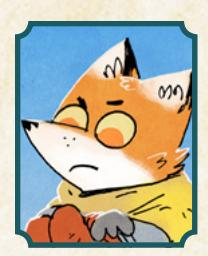
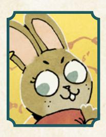
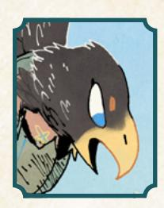
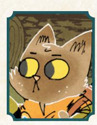
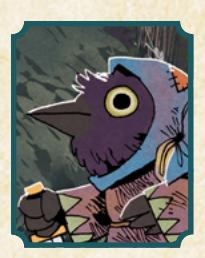
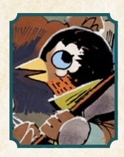
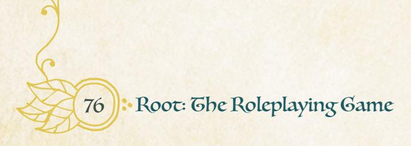
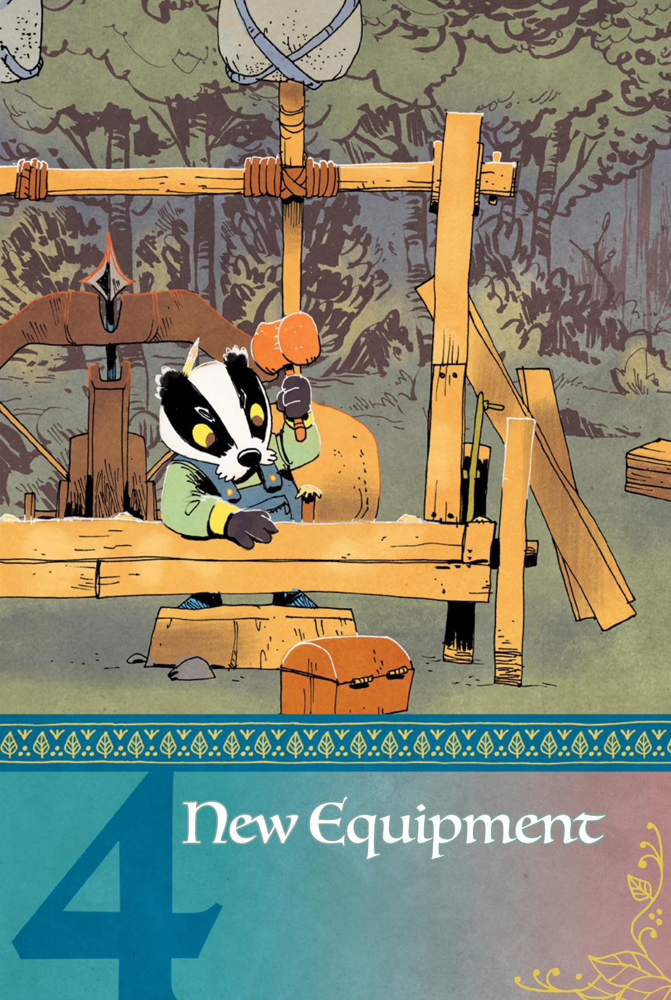
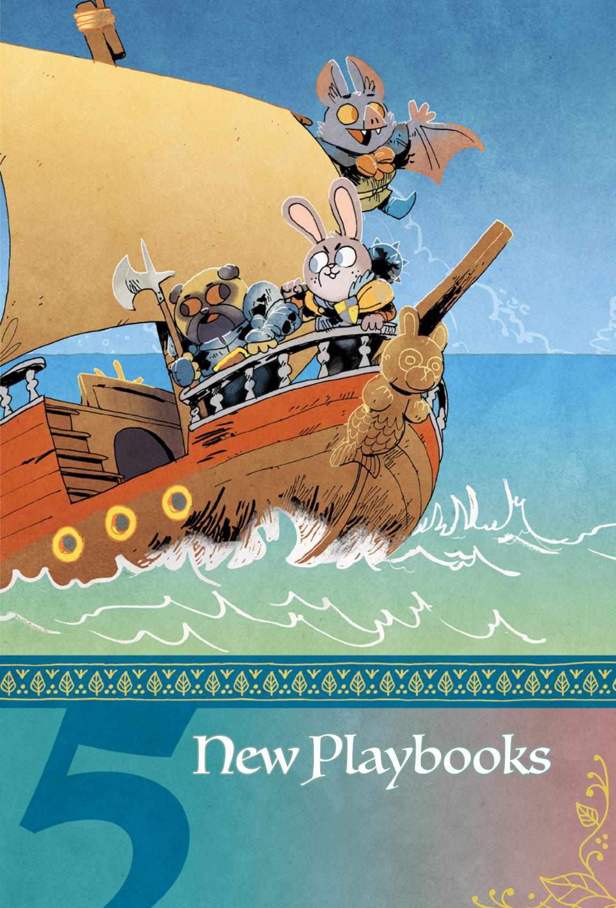
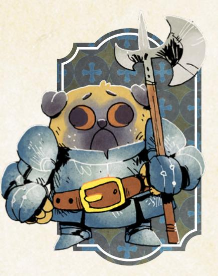

### Species Moves

By default in Root: The RPG, the different animal species aren't different mechanically. They are different in the fiction—birds can obviously fly, moles can burrow, wolves have good hearing, etc.—but any uncertainty that arises around these differences is easily resolved within the scope of the basic moves.

A wolf wants to listen closely? They either hear anything around them, or if there's some uncertainty about what they might hear, they assess a situation. A bird wants to fly to the top of the tree? If there is no tension, they just do it; if there is tension and uncertainty, then maybe it's attempting a roguish feat, or even just trusting fate.

But it can be fun to have more definition to the species' special abilities, adding interesting features to vagabond characters! A way for a player to call out their eagle's claws, rabbit's long hopping legs, or frog's amphibian nature, for example, with more than just the somewhat abstract basic moves.

This section is all about serving that goal. There are two versions of the species move system, and you'll find both here—the first one provides full-on moves, while the second provides a fairly versatile way to easily account for new species using custom abilities. But before getting into the mechanics, there are a few baseline principles to get straight.

一番「これでいる」ないない。

{59}------------------------------------------------

#### Denizens are Wildly Different

All denizens represent a grand and multitudinous variety of being. If you have two foxes, they are certainly far from identical—at bare minimum they're likely to be different culturally if they come from two different clearings, or two different social strata, or two different households! It's just as likely that they have different degrees of these inherent species abilities. A fox who files their nails every day is going to be a lot less likely to have anything close to claws than a fox who lives in the forest and uses their claws as their primary weapon!

Do not conceive of these abilities as true for all members of a given species. They can be true; a given denizen of a given species might have these abilities; but they are not guaranteed for every member of that species. They don't define some "essence" of the species, some essential trait that must be universal to them all. Such a thing doesn't really exist in Root: The RPG!

### Learning & Innate Ability

The species moves cover a combination of learning and innate ability. Some of them refer directly to the traits that an animal likely has—like claws or wings—but others refer to traits that an animal of that species would likely acquire through socialization. Adhering to the principle above means there are always plentiful exceptions to any such social acquisition, but that doesn't mean the socialization is absent—not least because the views of other animals, other species, can have a great impact in influencing how a denizen sees themself and acts growing up.

So when a species move for a mole grants a character the Hide roguish feat, the move is just as much saying that moles are socialized by their own family and culture and by the other denizens around them to hide, as it is saying that a mole is somehow naturally gifted with large paws and digging ability. Both ways of thinking can be incorporated into the move, and it's up to the player of that mole to say which factors matter the most.

### Description Over Balance

The species move systems described below aren't designed to set you up with a perfectly balanced character whose abilities are on par with a non-speciesmove-using character. Instead, these frameworks are here to provide additional ways to define and individualize your character, which means they're not guaranteed to grant you an equivalent stat bonus from move to move, or the same number of moves, or meet any other balancing test you might think up.

Use these systems because you're interested in adding additional definition to your characters, not because you're looking for an edge. The goal of these systems is to make species matter in interesting ways!

{60}------------------------------------------------

#### Species Moves as Separate Advances

Alternatively, if you're interested in characters with lots of options, you can take a new species move as appropriate to the fiction with each advancement, to a maximum of two total species moves. In this mode, they don't count against the number of moves you can have from your own playbook. All PCs can wind up with two more moves than usual, as a result.

### Species Moves as Playbook Moves

The first way to incorporate species moves into your game is essentially as additional playbook moves. This method uses fully-fledged moves, equivalent to any you'd find on a playbook, to define species abilities.

Implementing this system is simple:

- When you make a character, you can choose a species move appropriate for your animal species instead of choosing one of your playbook moves.
- You can take a new species move as an advancement, as long as it is appropriate to the fiction; you let your previously shorn talons grow long, thereby letting you take *Built-In Weapons* (page 61), for example.
- When you advance your character, any species moves count toward the limit of moves from your own playbook.

Every one of these moves calls out some appropriate species, noting a few animal types the move would normally fit. These lists aren't intended to be all-encompassing—players can play an enormous variety of animal species in **Root**: **The RPG**, far more than could be easily listed. Those appropriate species are pulled from those you are most likely to encounter in the Woodland, selected to provide a baseline for thinking about which animals might have the move. In the end, it's always down to a discussion at your table, with your GM and the other players, to determine if a move is appropriate to your species or your concept of your character.

{61}------------------------------------------------

#### Species (Noves List

#### Built-In Weapons

Applicable species: Cat, Fox, Bird of Prey, Lizard

Your claws, fangs, or talons are natural weaponry, with intimate range, using up no Load and inflicting injury instead of exhaustion. Choose one weapon tag from the list:

- Barbed: When you catch someone with this weapon's end, mark exhaustion to move to intimate range and *grapple with them* as if you had rolled a 10+.
- Fast: Mark wear when **engaging in melee** to suffer I fewer harm, even on a miss.
- Intimidating: When you flaunt this item to *persuade an NPC* through threats, you can mark 2-notoriety with their faction to shift a miss to a 7-9 or a 7-9 to a 10+.
- Precise: Mark wear to ignore your enemy's armor when you inflict harm.
- Quick: Mark exhaustion to engage in melee with Finesse instead of Might.
- Sharp: Mark wear when inflicting harm with this weapon to inflict I additional harm.
- Signature: Whenever you earn prestige or notoriety while showing this item, mark I additional prestige or notoriety.

And one weapon flaw from the list:

- Identifiable: This item is known to be associated with a particular individual. Anyone who sees it instantly recognizes it and associates you with that individual.
- Slow: When you **engage in melee** with this weapon, choose one fewer option. Mark wear to ignore this effect.
- Ugly: Take –I to *meet someone important* while they can see this item. Mark exhaustion to hide it.
- Unwieldy: Take a -I to all weapon moves—both basic and special weapon moves—made with this weapon. Mark exhaustion to ignore this effect.

{62}------------------------------------------------

#### Cached Resources

Applicable species: Fox, Squirrel, Mole

You've hidden resources all over the forest, sometimes even in locations that you've since forgotten. When you search for one of your caches, roll with Cunning. On a hit, you find a stash of resources; clear 2-depletion. On a 7-9, the search takes forever; mark exhaustion. On a miss, your wandering puts you in danger before you realize it.

#### Garner Sympathy

Applicable species: Rabbit, Mouse, Corvid

When you *plead with a PC* by guilting them into going along with you, mark exhaustion to allow them to clear 2-exhaustion instead of one when they agree to what you have proposed.

#### Scenting the Clearing

Applicable species: Cat, Dog, Wolf

When you sniff out the details of a new clearing, roll with Cunning. On a 10+, ask two questions from the list below. On a 7-9, ask one.

- What's the most surprising scent l pick up in the clearing's most public area?
- What interesting scent trail catches my attention, and where does it lead?
- What scent has somebody taken efforts to hide, and where do I smell it?
- What smells like the most dangerous place in the clearing?
- What smells like the safest place in the clearing?

On a miss, ask one, but your sniffing around leaves you distracted from another threat; it gets the drop on you.

{63}------------------------------------------------

#### Searching the Cracks

Applicable species: Fox, Mouse, Otter

When you carefully search someone's private space for secrets, roll with Luck. On a hit, the GM will either tell you there are none here—they're not hiding anything—or that you found something surprising, incriminating, or telling. On a 7-9, you leave no evidence behind or you can take something with you, your choice. On a 10+, both, or you can plant something. On a miss, something you find is strange and distracts you... just long enough to be caught!

#### Stroke of Luck

Applicable species: Rabbit

Take +1 Luck (max +3).

#### Gight Squeeze

Applicable species: Mouse, Cat, Lizard

When you squeeze through a tight space, roll with Finesse. On a hit, you make it through to the other side. On a 7-9, mark injury or mark 3-wear on your gear, your choice. On a miss, you're stuck and something on the other side isn't looking too friendly.

#### Convenient Hideout

Applicable species: Fox, Rabbit

Your eyes are adept at finding good, safe places to hunker down. When you attempt to lay low in the forest, roll with Cunning. On a hit, you find a convenient hideout nearby. On a 10+, pick 2. On a 7-9, pick 1:

- Food and water are easily accessible from the hideout
- The area is untouched and undisturbed by other denizens or threats
- The route to the hideout is safe and easy

On a miss, you reach the hideout—choose I—but you aren't alone when you arrive.

{64}------------------------------------------------

#### Nine Lives

**Applicable species: Cat, Corvids**

Once per session, when you mark your last box of injury, mark exhaustion to ignore the blow entirely and stay on your feet long enough for one last act of heroism. Once the deed is done, you collapse, unconscious.

#### Underground Tunnels

**Applicable species: Rabbit, Mouse, Mole**

Take the *Hide* roguish feat (it does not count against your limit). When you *attempt to hide by burrowing underground*, roll with Might instead of Finesse.

### Species Abilities System

The second way to incorporate species-traits into your game is with an ability system that gives every character a few active ways that they can take speciesspecific actions without adding the complexities of whole new moves.

In this system, you automatically get your species' abilities at character creation. Every species has three abilities, and at any appropriate time during play, you can use an ability by marking exhaustion.

You still have to be able to take the fictional action—no "lashing out with fangs and claws" when your paws are bound, for example. But otherwise, the only thing you have to do to trigger an ability is to mark exhaustion.

These abilities come with no uncertainty. As long as you can feasibly perform the action of the ability, you can mark exhaustion to get the effect. Just remember that the world moves around you—when you mark exhaustion and get the effect of "lashing out with fangs and claws," your opponent won't just sit there and take it; they'll respond.

Each of these sets of abilities also comes with an **instinct move**. Your instinct move becomes, essentially, another Nature, another way to clear your exhaustion as long as you follow your instincts. It's triggered and functions more or less exactly like Natures (page 49 in the Root: The RPG core book), but it only clears a single exhaustion and you can only use it once per session.

{65}------------------------------------------------

### Making Your Own Species Abilities

If you want to create a set of species abilities for an animal not listed here, follow these guidelines.

First, give them three different abilities. If any of the abilities on the lists below match up, use them—mix and match! There's no reason to write a whole new ability if "Sniff out a hidden stash of food or resources" pretty much sums up what you want your new species to be able to do.

If you need to write new abilities because none of them quite match, focus on abilities that just allow the vagabond to take some action, with no uncertainty. Add enough specificity to the action that it doesn't replace a basic move for all situations—they can "fly to any location within a clearing in moments," for example, which doesn't utterly preclude any basic move, as there will be situations when the vagabond is still trying to move but that ability doesn't apply.

If you want to write a more mechanical ability, limit its effects to inflicting 1-harm (of whatever type is appropriate); adding a +1 to a peripheral or less commonly used move; or providing a 12+ on a basic move but in a highly specific situation. You want the abilities to be useful and meaningful, but you don't want them to start to matter more than the basic moves!

The final list of three abilities should include no more than two highly mechanical abilities, and no more than one ability that gives a +1 or a 12+ on a move. If you end up with three mechanical abilities, you're likely giving the abilities too much weight in your game.

{66}------------------------------------------------

Then, after you've come up with your three abilities, create an instinct move for the species. These should always be unique to the species. All instinct moves are limited to restoring a single exhaustion only once per session, so they can be a bit easier to trigger, but you always want them to encourage the vagabond to do something interesting, dangerous, or distinctive. "Use the cover of darkness to your advantage in a dangerous situation" is interesting and cool, with a bit of specificity that means it's not too easy to use. "Spend several hours basking in heat" requires time and a source of heat; while the action itself isn't super exciting, the requirements help limit its use in interesting ways.

#### Species Ability Lists

#### Fox

Mark exhaustion to activate an ability:

- Sniff out a hidden stash of food or resources.
- Take a +1 to *travel through the forest* between clearings
- Lash out with fangs and claws; inflict 1-injury

Instinct move: Once per session, clear exhaustion when you use the cover of darkness to your advantage in a dangerous situation.

#### Mouse

Mark exhaustion to activate an ability:

- Gain access to or escape a location by squeezing through a tight space.
- Sniff out a hidden stash of food or resources
- Take a 12+ instead of rolling when *tricking an NPC* into underestimating you

Instinct move: Once per session, clear exhaustion when you scout out an area in advance of a conflict or scheme.

#### Rabbit

Mark exhaustion to activate an ability:

- Gain access to or escape a location by burrowing underground
- Sprint at speeds beyond nearly all other denizens
- Listen in on a nearby conversation without drawing attention

Instinct move: Once per session, clear exhaustion when you convince your allies to pursue a new strategy when a plan goes awry.

{67}------------------------------------------------

#### Otter

Mark exhaustion to activate an ability:

- Gain access to or escape a location by swimming underwater
- Improvise a simple but functional tool from nearby resources
- Find safe shelter for your band, regardless of your environment

Instinct move: Once per session, clear exhaustion when you keep the group together in circumstances that threaten to divide you.

#### Bird of Prey

Mark exhaustion to activate an ability:

- Track a denizen from the air without revealing yourself
- Lash out with talons and beak; inflict 1-injury
- Fly to any location within a clearing in a few moments

Instinct move: Once per session, clear exhaustion when you acquire information that gives you an advantage over an enemy.

#### Cat

Mark exhaustion to activate an ability:

- Track a denizen through an unguarded dark area without revealing yourself
- Fall from any height without harm
- Lash out with fangs and claws; inflict 1-injury

Instinct move: Once per session, clear exhaustion when you catch and corner someone you're hunting.

#### Lizard

Mark exhaustion to activate an ability:

- Quickly scurry through a survivable dangerous environment without suffering injury
- Gain access to or escape a location by squeezing through a tight space
- Clamber up a vertical surface or treacherous and narrow path

Instinct move: Once per session, clear exhaustion when you spend several hours basking in heat.

{68}------------------------------------------------

#### Corvid

Mark exhaustion to activate an ability:

- Sniff out a hidden stash of food or resources
- Snatch and pocket a single valuable or shiny object vulnerable to you
- Fly away into the darkness of night, losing any pursuers

Instinct move: Once per session, clear exhaustion when you use a tool or piece of equipment in a surprising or innovative way.

#### Small Bird

Mark exhaustion to activate an ability:

- Fly to any location within a clearing in a few moments
- Find a perfect hiding place out of sight of a pursuer
- Take a 12+ to *attempt a roguish feat of acrobatics* or *trust fate* when acting acrobatically, as long as you are carrying 2-Load or less

Instinct move: Once per session, clear exhaustion when you manage to lose or avoid unwanted attention.

#### Mole

Mark exhaustion to activate an ability:

- Dig into loose soil and dirt, emerging sometime later from a different, reachable point
- Touch nose to earth and detect vibrations of any nearby denizens.
- Take a +1 to *travel through the forest* between clearings

Instinct move: Once per session, clear exhaustion when you handle a beautiful, well-crafted, or otherwise tactilely pleasing object you haven't held before.

{69}------------------------------------------------

### Masteries

As the vagabonds advance through your campaign of Root: The RPG, they will get any number of new abilities (moves), new equipment, and simple improvements that can make a big difference to their potency (like raising stats or growing their harm tracks). Experienced vagabonds are formidable, capable of standing against many threats that send new PCs back to the forest to rest up and heal.

**Masteries** represent a new avenue for growth devoted to specialization. Instead of getting a whole new ability that changes how the character might approach situations entirely, or a stat boost that helpfully improves everything the character does with that stat, masteries allow a vagabond to obtain new, phenomenally better results from the basic moves and the weapon moves.

The core structure of a mastery is simple—it adds a new tier of results beyond 10+/full hits, a tier called **triumphs** representing results of 12 or higher. If you have the mastery for a given move, then you can get a miss (total of 6-), a partial hit (total of 7-9), a full hit (total of 10-11), or a triumph (total of 12+).

Triumphs give you phenomenally better results in the fiction than you might achieve otherwise—the equivalent of "critical hits" or "critical successes," where not only do you achieve your goal, but you also achieve something extra.

### Gaining a Mastery

You can gain a mastery as part of your normal advancement. Effectively, add this option to your list of advancement options:

· Master one basic move or up to two weapon skills you already know (max of 2 basic moves and 4 weapon skills mastered)

Each time you take this advancement, you can master a single basic move or two weapon skills. You must already possess those weapon skills to master them. You can only take this advancement a maximum of four times total twice for basic moves and twice for weapon skills.

While it's always great to tie advancements to the fiction, you don't have to do anything special to select a mastery once you advance. You already have the weapon skill you're mastering—or you're mastering a basic move—so it's safe to assume you've been using it as a vagabond for some time. You don't need a special teacher or months to practice, although you might introduce those ideas when you select the advancement to flavor your mastery!

{70}------------------------------------------------

#### **Mastery List**

Below, you'll find lists of masteries keyed to the basic moves and to the weapon skill moves. There are no masteries listed for the basic weapon moves—mastery in combat is represented by gaining skills and mastering those—although there are a few playbook moves such as Skill Against Skill Alone (*The Champion*, page 93) and Greatest of the Age (*The Exile*, page 101) that use a similar framework of 12+ results with basic weapon moves. Overall, however, the basic weapon moves are "basic" in the first place because they represent a lower level of skill with a lower ceiling for improvement.

Each move presented below comes with some advice that can be shared with a player who takes the move, explaining a bit more about the requirements, restrictions, or limits of their mastery.

#### Basic Ooves

#### Attempt a Roguish Feat MASTERY

On a 12+, in addition to the results of a 10+, choose one:

- immediately accomplish a second appropriate roguish feat, whether or not you possess that feat, as if you had rolled a 10+
- clear 2-exhaustion as you exert control over yourself and the situation

Remember that the second roguish feat you choose does not have to be one you are trained in—this is your chance to carry over your success right into a second roguish feat you haven't learned yet, without taking a risk!

#### Figure Someone Out MASTERY

On a 12+, in addition to the results of the 10+, mark down their name on your character sheet; from this point forward, you can always tell if they are lying to you. If you roll a 12+ against a character whose name you have already marked down, you instead take +1 ongoing to act on the answers to the questions you ask.

Marking down an NPC's name is a permanent change. You received enough insight into their character that you can read them at a low level, reliably, from that point forward. You should remind the GM if you're interacting with someone whose name you have marked down, so the GM remembers to tell you if they are lying.

70 Root: The Roleplaying Game

{71}------------------------------------------------

The +1 ongoing you gain for repeatedly figuring someone out with a 12+ lasts until the answers to your questions no longer matter, just like with *reading a tense situation*. If you discover that someone "wishes you would go away," for example, then your +1 ongoing would likely only last until they think you've left the area.

#### Persuade an NPC **mastery**

On a 12+, in addition to the results of the 10+, you may mark exhaustion to treat this move as a 12+ on the *sway an NPC* Reputation move, even if you don't have a high enough Reputation with their faction to normally *sway the NPC* in question.

The *sway an NPC* move is on page 117 of the Root: The RPG core book; it allows you to rewrite the drives of NPCs who are *swayed*, convincing them to view the world in a different way. You are so convincing that you change hearts and minds when you're just trying to get stuff done! Again, remember that a triumph (12+) here lets you ignore the normal Reputation requirements to use *sway an NPC*.

#### Read a Tense Situation **mastery**

On a 12+, in addition to the results of the 10+, you may also ask, "How could I \_\_\_\_\_\_\_\_\_\_\_\_\_\_\_\_\_\_\_\_?" and fill in the blank with any action you hope to accomplish. If you follow the answer to that question, take a 12+ on the first move you make toward your desired outcome, instead of rolling.

The extra question you get to ask is a lot like the equivalent question from *figure someone out*. You can name any course of action you want; as long as there is a way to accomplish that end using your surroundings and your own abilities, the GM will tell you what it is. Follow those guidelines, and on the first move you would trigger you can take a 12+ instead of rolling.

{72}------------------------------------------------

#### Trick an NPC **mastery**

On a 12+, they buy into your deception utterly and entirely; it would take obvious, incontrovertible evidence to shake their belief. You can always return to the same character and play up the same trick again, taking a 10+ to *trick* them the same way instead of rolling.

For this mastery, make a note that your mark buys your deception. You can also embellish your deception after you roll a 12+ to add more hooks that they might buy as well, additional schemes you can then benefit from later.

The key here is that whatever lie you're selling, they buy into in a way that can give you benefits again, and again, and again—if you're pretending you deserve access to the armory, then the guards now so thoroughly buy your deceit that they'll keep letting you in until someone else gives them incontrovertible evidence that you aren't who you say, or unambiguous orders that they should stop letting you in.

#### Trust Fate **mastery**

On a 12+, fate smiles upon you as you receive an incredible and surprising windfall of luck. You accomplish your aim without cost, and you receive an immediate fortunate benefit; the GM will tell you what bounty befalls you.

Mastering *trust fate* is a combination of being able to instantly recognize fleeting opportunities and chances to twist the odds in your favor, and also just being incredibly lucky. The line between unconscious skill or ability and just plain coincidence is blurred, especially here. But whatever the windfall of luck that befalls you, it's serendipitous and nearly unachievable through any other means.

{73}------------------------------------------------

#### Wreck Something MASTERY

On a 12+, in addition to the results of the 10+, choose one from the list:

- inflict 2-injury on any foes in the area (from splinters, debris, falling infrastructure, etc.)
- you break, smash, or destroy something far larger and more substantial than you normally could (an entire building, a mountain face, etc.)
- you can grab up shards of useful material from the wreckage; clear
   2-depletion

Two out of three options here just adjust the manner in which you wreck something to gain an additional benefit—harm to enemies, clearing depletion—but "Break, smash, or destroy something far larger and more substantial" does allow you to expand what you were originally wrecking and what your original goal might have been. You can go from smashing your jail cell's door to smashing the entire wing of the prison, for example, knocking down support beams whose destruction causes a larger, structural failure.

#### Weapon Skills

#### Cleave MASTERY

On a 12+, you inflict 6-wear instead. Any excess wear instead becomes injury or exhaustion (your choice) dealt to your foes.

As with most direct combat moves, the primary focus is use against NPCs. NPCs won't have individual wear tracks for different pieces of equipment. As a result, there will be no situation in which their sword is broken but they still have wear on their armor to mark to absorb the injury; when you inflict 6-wear, it's going to entirely obliterate their defenses and inflict the excess directly as injury or exhaustion to the NPCs.

If a situation arises in which this move is used against a PC, the cleaving vagabond can select the piece of equipment targeted by the 6-wear as appropriate. Excess wear is still inflicted as injury or exhaustion at the choice of the attacking vagabond.

{74}------------------------------------------------

#### Confuse Senses MASTERY

On a 12+, choose one:

- you successfully confuse the senses of a whole group; apply the results of the 10+ move to any foes you choose in range
- you knock a single foe so off-kilter you can take them out exactly as you choose right now, without triggering any move

Confusing the senses of a whole group lets you expand exactly what you did when you triggered the move to include many additional individuals in the area. "You can take them out exactly as you choose" means that you get to say what happens to them, whether they're knocked unconscious instantly, or they have a dagger to their throat with no chance at escape.

#### Disarm MASTERY

On a 12+, your opponent both marks 3-exhaustion and loses their weapon.

Note that this result is *not* in addition to the 10+ result of the move. Instead, it is effectively the 10+ result, but where your opponent must suffer both consequences instead of choosing one over the other (and with I additional exhaustion inflicted). Just like with a regular hit on this move, your opponent may still try to recover their weapon, but it is knocked away in such a fashion that it's not immediately easy to collect.

#### harry a Group MASTERY

On a 12+, in addition to the results of the 10+, you inflict an additional 2-injury or 2-morale, your choice.

On a triumph (a 12+), you still pin the targets and inflict the base 2-morale. You can also choose to inflict injury, allowing the weapon skill to actually cause harm to your targets, or choose to deal 2 additional morale, for a total of 4-morale—hopefully enough that you have a good chance of totally overwhelming your targets.

{75}------------------------------------------------

#### Improvise a Weapon MASTERY

On a 12+, you may choose your weapon's range and two beneficial tags it bears (as long as they make sense to the item).

Note that this result is *not* in addition to the 10+ result of the move. You create a new item with two beneficial tags and a range that makes sense—with the GM acting as final arbiter of whether the tags fit the item, but not actually choosing them.

#### Parry MASTERY

On a 12+, in addition to the results of the 10+, you can immediately riposte, choosing one:

- you inflict 2-injury with a strike that pierces their defenses; they cannot absorb the injury with armor
- you inflict 2-morale with an insulting line or gesture that demeans them
- you inflict 2-exhaustion with a quick punch or blow intended to disorient and knock them out

If you choose to inflict 2-injury, they cannot absorb the harm with armor. Make sure that for whatever you choose, you describe what you are actually doing as the follow-up to your parry—this is a chance for you to show off as the ultimate swashbuckler!

#### Quick Shot MASTERY

On a 12+, take all four options from the list and inflict 2-injury instead of 1-injury.

Instead of the results of the normal 10+ on this move, you get all four options from the list, and the base harm you deal becomes 2-injury instead of 1-injury. You don't have to move or change position every time you roll a 12+, but the option is available to you.

{76}------------------------------------------------

#### Storm a Group MASTERY

On a 12+, take all four options from the list and choose one for double effect.

Instead of the results of the normal 10+ on this move, you get all four options from the list, and choose one for double effect. If you double an option from the list that includes a cost (like mark exhaustion), you must pay the cost a second time. Remember that you do still trade harm as normal, modified by the options you choose.

#### Grick Shot MASTERY

On a 12+, take all four options from the list, and your shot strikes a third available target of your choice.

Instead of the normal 10+ on this move, you get all four options from the list, and you treat it as if you get an extra option that adds a third target struck by your shot. Remember that the harm you inflict applies in full to all three targets!

#### Vicious Strike MASTERY

On a 12+, in addition to the results of the 10+, you strike them so well you incapacitate them, choosing one from the list:

- they cannot change position—fleeing, advancing, maneuvering, etc. until they receive medical aid
- they cannot wield a weapon until they receive medical aid
- they cannot communicate until they receive medical aid

Incapacitating an enemy is a fictional effect that leaves them less able to function, removing certain moves and actions they might take—they can't run if they can't change position; they can't trade harm or fight back if they can't wield a weapon; and they can't call for help if they can't communicate.

{77}------------------------------------------------

### Custom Moves

Your game of Root: The RPG doesn't have to be limited to the moves you find here or in the core book. You may find yourself wishing for a specific move to match a very particular situation—a move for dodging the particularly ruthless traps of an Eyrie ruin, or a move for using astrology to make predictions about the future, or a move for playing a particularly vicious and cunning strategy game. The moves provided throughout this chapter will give you a solid framework, but you might want to bring a bit more specificity, a bit more flavor, to your game.

That's a fantastic instinct, and you should want to bring new and fun moves to your campaign! In fact, you can easily create your own custom moves to fulfill these specific needs in your game.

To make a custom move, you need to give it a trigger and an effect. Together, they form the structure, "When [x] happens, [y] happens, " allowing you to set up a fictional origin for the move that leads into the mechanics and other outcomes that drive play!

### Trigger

To reiterate from Chapter 3: The Fundamentals in the Root: The RPG core book, a move's trigger is the phrase that describes when it comes into effect the "when [x] happens" part of the move. A trigger points to the moment the move draws attention to in the fiction. Sometimes designing a very specific trigger, suited even to a single location, can be great—that's exactly what custom moves are for!

When you design custom moves, you want your trigger to point to a moment of uncertainty, when the GM wouldn't be certain of what happens next. The move helps fill in the gap, or guides the GM away from what they think might happen if they just had to decide without any dice. But in order to have meaningful uncertainty, you need the trigger to point to interesting ideas in the fiction:

A trigger of "When you dash across the molten lava" is clear, effective, and exciting—it points to an obvious situation where there is a lot of uncertainty! What's more, there are other moves that can address that situation, but it's specific and interesting enough that a custom move can provide new and different results.

A trigger of "When you walk across the clearing" is odd on the surface because the situation seems to have absolutely no uncertainty to it, nothing to be resolved. Denizens walk across clearings regularly without any tension, right?

{78}------------------------------------------------

That kind of trigger is either a weak trigger—pointing at a situation that's not inherently loaded with consequence and dramatic effect—or it's saying that the situation is more complicated than it seems. Maybe here, in this clearing, it actually *is* dangerous to walk across the clearing. If that's the desired goal, make sure that's clear in the trigger and the move, through and through.

Think about exactly what the situation is that you want to cover, and why it's uncertain. That uncertainty supports moves with die rolls and interesting, surprising results.

If the situation isn't uncertain so much as requiring greater specificity, then a custom move can still do the job. For example, a move that says "When you take strenuous action in the gas-filled mine, mark exhaustion" is great! There's no uncertainty—no roll of the dice, no random results, no real question to the move, just a simple "every time you do this, the same thing happens" structure. But the move calls out an interesting situation and pins an effect to it that suits the fiction. Speaking of effects...

### Effect

A move's effect is the other portion of your work, the "[y] happens" part of the move. The interesting trigger has to find some resolution, so the move helps the group figure out how things resolve once the trigger is hit.

Most of the time, your effects will be based on a roll. PCs roll 2d6 with one of their stats, and on a 10+, things go their way; on a 7-9, they get what they want but at a cost or with a complication; and on a 6-, things go awry in a way that's interesting, exciting, or different—never merely failure.

There are many different ways to write up a move's effects, from descriptive statements to lists of options. Take a look at the moves throughout this book and the Root: The RPG core book for some ideas on structures you can use. In general, lists are better when you want to give interesting options to the player, while direct statements are better for quick resolution and clear effects.

Don't hesitate to add costs or benefits into your move—everything from the harm tracks to the Reputation tracks to Value exists to be played with in your custom moves!

If you want a move that just adds an interesting effect to a setting or character, to draw them out, then you might not use a dice roll at all, as the "gaseous mine" example above calls out. A move without a dicme roll won't have nearly the same uncertainty, however, so make sure you only use those kinds of moves when you want to draw attention to a direct cause and effect relationship.

{79}------------------------------------------------

{80}------------------------------------------------

n addition to the new natures, drives, and connections found in Chapter 3 (page 57), this chapter details new rules for additional equipment for Root: The RPG, including new

positive and negative tags for weapons, armor, and other gear, alongside a new list of common Woodland equipment that showcases the new tags.

As a quick reminder, here is a summary of the basic rules for equipment in Root: The RPG, explained in full starting on page 182 of the Root: The RPG core book:

- Equipment refers to important, larger, specific, and nonreplaceable items. Items like lockpicks, torches, or other expendable gear are better represented by depletion, unless there's something about the gear that makes it special or unique.
- All equipment has wear, a special harm track unique to an individual piece of equipment, representing the equipment's durability. When all the boxes of a wear track are full, then the associated piece of equipment is damaged pretty badly. If you ever need to mark wear on equipment with a full wear track, it is destroyed entirely, beyond repair.
- Tags represent special traits, moves, abilities, and other mechanical effects that a piece of equipment might bear. You can see a list of tags starting on page 186 of the Root: The RPG core book.
- Weapon skill move tags (weapon move tags or weapon skill tags for short) are a specific kind of tag that allows a wielding vagabond to use a particular weapon skill move—as long as they also have the appropriate weapon skill. You can read more about weapon skills starting on page 90 of the Root: The RPG core book.
- A weapon has at least one **range** by default. That is the range at which the weapon can reach enemies, the range at which it is effective. There are only three ranges—intimate, close, and far. For more on ranges, see page 91 of the Root: The RPG core book.
- Equipment also has a **Load**, a measure of its weight and bulk. Most pieces of equipment have between o and 2 Load, from small items like daggers (Load o) to larger items like a sword (Load 1) or even a warhammer or greatsword featuring the Weighty tag to represent its bulk (Load 2). Every vagabond can carry only so much Load without being burdened—4 by default, modified by the vagabond's Might. Carrying more than the maximum means the vagabond is burdened, slowed by the gear they are carrying. Vagabonds can't carry more than twice their maximum Load.

上命し、このでは一番し、このでは一番し、このでは、このでは、このでは、このでは、このでは、このでは、このでは、このでは

{81}------------------------------------------------

Instructions for buying, selling, and crafting gear can be found starting on page 184 of the Root: The RPG core book. In short, each box of wear, additional range past the first, special tag, and weapon skill tag adds 1-Value to the total price of a piece of gear; negative tags (flaws) reduce the total price of a piece of equipment by 1-Value each. Buying or selling a piece of gear is based on the Value of the gear, but might be modified by the social situation. Crafting the gear requires you to pay a skilled enough craftsdenizen (akin to buying it) or requires a Tinker—or otherwise capable vagabond—and materials as determined by the GM, usually through the **Toolbox** move (see page 162 of the Root: The RPG core book) and often equal in Value to the equipment's price, although the Luxury special tag can mess with this calculation.

### New Tags

The list of tags found on page 186 of the Root: The RPG core book are not by any means exhaustive. Enterprising vagabonds, inventors, and blacksmiths all endeavor to develop new weapons, armor, and other gear in the Woodland, and you are always free to create new tags to reflect their innovative ideas or give mechanical weight to everyday equipment.

As a reminder, equipment tags are special traits held by a piece of equipment that give it additional abilities. Each positive tag adds 1-Value to the overall worth of the item in question. Each negative tag refunds 1-Value from the overall worth of the item, lowering its price by 1-Value.

In parentheses after each tag, you'll once again find an idea of the kind of item the tag could apply to; although, as always, use these tags as inspiration to create more specific or appropriate tags as you need them.

### Positive Tags

These positive tags, like the others listed on page 186 of the Root: The RPG core book, can be added to any appropriate weapon, armor, or other piece of gear:

- + **Accurate**: When you inflict injury with this weapon, mark exhaustion to target a specific part of your target's body and impair it until they have time to heal. (Bow, knives)
- + Barbed: When you catch someone with this weapon's end, mark exhaustion to move to intimate range and *grapple with them* as if you had rolled a 10+. (Spears, axes, chains)
- + **Blend**: When you use this item to blend into the appropriate environment, mark wear to roll Sneak or Hide as if you had those feats. If you do have those feats, mark wear in the same situation to instead take +1 ongoing for the scene. (Camouflage, local clothing, etc.)

{82}------------------------------------------------

- + **Cathartic**: When you use this item for a recreational activity with another vagabond, mark 2-wear for both vagabonds to each clear 2-exhaustion. (Art supplies, bow and arrow, etc.)
- + **Common**: When repairing this item, you can repair twice as much wear for the same Value. (Anything)
- + **Disarming**: When wearing this item, you are underestimated. Mark exhaustion to change a miss to a 7-9 or a 7-9 to a 10+ when *tricking an NPC by appearing weak or nonthreatening*. (Tattered-seeming clothes, burlap robes)
- + **Distracting**: When you *grapple with an enemy* while you wield or display this item, mark exhaustion to change a miss to a 7-9 or a 7-9 to a 10+. (Anything visibly or audibly distracting for your enemy)
- + **Disguised**: Until this item is revealed as a weapon, it will be treated as if it isn't one. When you *attempt the Blindside roguish feat* with this weapon while it is still unrevealed, mark wear to shift a miss to a 7-9 or a 7-9 to a 10+. (Any weapon disguised as a commonplace object)
- + **Hidden**: Mark exhaustion when being searched or examined to ensure this item goes unnoticed. Mark wear to *attempt the Blindside roguish feat* if you don't have it, or to take a 10+ to Blindside if you do have it. (Stiletto, baton)
- + **Impressive**: When you *storm a group* wielding this item, mark wear to inflict 2-morale harm on them, in addition to the consequences of your roll. (Skull-shaped hammer, black sword)
- + **Incendiary**: This item inspires members of one faction, and angers and upsets members of another. When you openly give this item to an interested party in order to spread its message, mark prestige equal to this item's Value with the positive faction, and notoriety equal to this item's Value with the negative faction. (Pamphlets, libel, slanderous texts)
- + **Intimidating**: When you flaunt this item to *persuade an NPC* through threats, you can mark 2-notoriety with their faction to shift a miss to a 7-9 or a 7-9 to a 10+. (Any weapon)
- + **Inspiring**: When you use this item to *help another vagabond*, you can mark wear instead of exhaustion. (Anything)
- + **Invigorating**: When you consume this item, mark 2-injury to clear all your exhaustion and add 2 boxes to your exhaustion track for the rest of the scene (they go away at the end of the scene, whether they are marked or unmarked, with no further harmful effects either way). (Stimulant)

{83}------------------------------------------------

#### A Miss to a Hit?

Some of the positive tags in this chapter can change a miss to a hit (7–9) or a soft hit (7-9) to a strong hit (10+). If a vagabond uses one of these abilities, other vagabonds cannot *interfere* with the roll to change it back to a miss from a 7-9 or a 7-9 from a 10+, but it's possible a vagabond could *interfere* before the ability is used—for example, turning a total roll of 8 into a 6 by interfering, only to find that the vagabond they *interfered* with turns the roll back into a hit by activating the tag.

- + **Legendary**: This item has its own reputation track, referred to as Legend, equivalent to 15 boxes of Prestige. It starts with Legend +1, and has no Legend boxes marked. To reach Legend +2, it would have to have 10 boxes of Legend marked, and then would clear its track. To reach Legend +3, it would have to have 15 boxes of Legend marked. This item also has a favored faction and a hated faction. Any time you wield this item openly, you do not mark prestige or notoriety at all. Instead, you mark Legend on this item when you aid the favored faction and injure the hated faction. For Reputation moves, roll with the item's Legend instead of your own Reputation. Whenever any session goes by in which you did not mark any Legend on this item, clear 1 box of Legend from this item. If you have no boxes to clear, reduce its Legend by 1. (Anything)
- + **Light**: This item doesn't count towards your Load. (Anything made from lighter materials than normal)
- + **Nasty**: When you *grapple with an enemy*, both yours and your enemy's first choice is doubled in effect. (Heavy gauntlet or other heavy weapon)
- + **Poison**: When you *target a vulnerable foe*, inflict exhaustion instead of injury; your target is poisoned until cured. While poisoned, each time they take a significant or strenuous action, inflict exhaustion. If they fall unconscious, inflict injury every 6 hours until they receive the cure or perish. (Anything envenomed or poisoned)
- + **Precise**: Mark wear to ignore your enemy's armor when you inflict harm. (Thin weapons)
- + **Reinforced**: While wearing this armor, you may absorb injury as exhaustion 1-for-1 instead of absorbing it as wear. (Armor)
- + **Sturdy**: When you would mark wear on this item, you may mark exhaustion instead. You cannot mark exhaustion to absorb injury with this tag. (Anything)

{84}------------------------------------------------

#### Negative Tags

These tags, like the others listed on page 188 of the Root: The RPG core book, can be added to any appropriate weapon, armor, or other piece of gear.

- **Conspicuous**: When you *target a vulnerable foe at far range*, you cannot keep your position hidden, even on a 10+. Mark wear to ignore this effect. (Any far-range weapon that is particularly noisy or visible)
- **Cursed**: Allied NPCs suffer morale harm when they see you bearing this item. (Anything with a hateful myth around it)
- **Dangerous**: Mark injury—in addition to any other consequences—when you make a weapon move with this item and roll a 7-9. (Some explosives, difficult weapons)
- **Hard to Hold**: When you *grapple with an enemy*, if you roll a 7-9, you lose your grip on this item in addition to the other consequences of your roll. Mark exhaustion to ignore this effect. (Anything with poor grip)
- **Identifiable**: This item is known to be associated with a particular individual. Anyone who sees it instantly recognizes it and associates you with that individual. (Anything)
- **Immoral**: While this item is displayed, you cannot *persuade* or *ask for a favor* from denizens most directly insulted by its immoral nature. Take -1 to *ask for a favor* from all other denizens while this item is visible. (Cat claw knuckles, bird beak necklace, etc.)
- **Incriminating**: When any significant individual member of the faction offended by this item first sees you bearing it, mark notoriety with that faction. (Anything)
- **Makeshift**: This item cannot be repaired. This negative tag refunds 2-Value instead of 1-Value. (Anything created with *Improvise a Weapon*)
- **Noisy**: When you *wreck something* using this item, you always attract attention, regardless of the roll. (Explosives)
- **Scarce**: The tools to repair this item are not commonplace. Standard repairs can clear wear to one box fewer than maximum (so an item with 3 boxes of wear could only ever be repaired through standard means to 2-wear marked). Full repairs for this item require specialists with rare equipment. (Anything antique or rare)

{85}------------------------------------------------

### New Pre-Made Equipment

Here is a new set of pre-made equipment, weapons, armor, and other gear all commonly found in the Woodland. Use these when you need to stat up a piece of equipment quickly, or when you need a template you can change to make something special.

As a reminder, adding a tag, weapon move tag, additional range, or box of wear increases Value by 1 each, while removing a tag, range, or box of wear decreases Value by 1 each. The only exception are negative tags: adding a negative tag decreases Value by 1, and removing a negative tag increases Value by 1

#### Weapons

#### **Lizard Cult Ritual Blade**

**Value:** 3 | **Load:** 0 | **Range:** Intimate, close **Weapon skill tags:** Vicious strike

- + **Intimidating**: When you flaunt this item to *persuade an NPC* through threats, you can mark 2-notoriety with their faction to shift a miss to a 7-9 or a 7-9 to a 10+.
- **Incriminating**: When any individual member of the faction offended by this item (the Lizard Cult) first sees you bearing it, mark notoriety with that faction.

#### **Spiked Flail/Chain**

**Value:** 5 | **Load:** 1 | **Range:** Close **Weapon skill tags:** Storm a group, cleave

- + **Impressive**: When you *storm a group* wielding this item, mark wear to inflict 2-morale harm on them, in addition to the consequences of your roll.
- **Dangerous**: Mark injury—in addition to any other consequences—when you make a weapon move with this item and roll a 7-9.

#### **Spring-loaded Wristblade**

**Value:** 6 | **Load:** 0 | **Range:** Intimate **Weapon skill tags:** Vicious strike

- + **Hidden**: Mark exhaustion when being searched or examined to ensure this item goes unnoticed. Mark wear to *attempt the Blindside roguish feat* if you don't have it, or to take a 10+ to Blindside if you do have it.
- + **Accurate**: When you inflict injury with this weapon, mark exhaustion to target a specific part of your target's body and impair it until they have time to heal.
- **Scarce**: The tools to repair this item are not commonplace. Standard repairs can clear wear to one box fewer than maximum (so an item with 3 boxes of wear could only ever be repaired through standard means to 2-wear marked). Full repairs for this item require specialists with rare equipment.

{86}------------------------------------------------

#### **Lizard Stinger**

**Value:** 4 | **Load:** 0 | **Range:** Intimate

- + **Hidden**: Mark exhaustion when being searched or examined to ensure this item goes unnoticed. Mark wear to *attempt the Blindside roguish feat* if you don't have it, or to take a 10+ to Blindside if you do have it.
- + **Poison**: When you *target a vulnerable foe*, inflict exhaustion instead of injury; your target is poisoned until cured. While poisoned, each time they take a significant or strenuous action, inflict exhaustion. If they fall unconscious, inflict injury every 6 hours until they receive the cure or perish.

#### **Dueling Rapier**

**Value:** 6 | **Load:** 1 | **Range:** Close **Weapon skill tags:** Disarm, parry

- + **Precise**: Mark wear to ignore your enemy's armor when you inflict harm.
- + **Quick**: Mark exhaustion to *engage in melee* with Finesse instead of Might.
- **Fragile**: When you make a weapon move with this weapon, mark wear on it. Mark exhaustion to ignore this effect.

#### **Bird Talon Gauntlets**

**Value:** 4 | **Load:** 1 | **Range:** Intimate, close **Weapon skill tags:** Vicious strike

- + **Nasty**: When you *grapple with an enemy*, both yours and your enemy's first choice is doubled in effect.
- **Immoral**: While this item is displayed, you cannot *persuade* or *ask for a favor* from denizens most directly insulted by its immoral nature (birds). Take -1 to *ask for a favor* from all other denizens while this item is visible.

#### **Royal Oak Bow**

**Value:** 7 | **Load:** 1 | **Range:** Far **Weapon skill tags:** Trick shot

- + **Accurate**: When you inflict injury with this weapon, mark exhaustion to target a specific part of your target's body and impair it until they have time to heal.
- + **Heavy Draw Weight**: When you *target a vulnerable foe* with this bow, mark exhaustion to inflict 1 additional injury.
- **Weighty**: This item counts as 1 additional Load.

#### **Riverboat Paddle**

**Value:** 2 | **Load:** 1 | **Range:** Close **Weapon skill tags:** Storm a group

- + **Blunted**: This weapon inflicts exhaustion, not injury.
- **Hard to Hold**: When you *grapple with an enemy*, if you roll a 7-9, you lose your grip on this item in addition to the other consequences of your roll. Mark exhaustion to ignore this effect.
- **Unwieldy**: Take a –1 to all weapon moves—both basic and special weapon moves—made with this weapon. Mark exhaustion to ignore this effect.

#### **Stiletto Dagger**

**Value:** 5 | **Load:** 0 | **Range:** Intimate **Weapon skill tags:** Vicious strike

- + **Precise**: Mark wear to ignore your enemy's armor when you inflict harm.
- + **Hidden**: Mark exhaustion when being searched or examined to ensure this item goes unnoticed. Mark wear to *attempt the Blindside roguish feat* if you don't have it, or to take a 10+ to Blindside if you do have it.

{87}------------------------------------------------

#### **Automatic Crossbow**

**Value:** 5 | **Load:** 1 | **Range:** Far **Weapon skill tags:** Harry a group, storm a group

- + **Hair Trigger**: Mark wear to *target a vulnerable foe* at close range instead of far.
- **Conspicuous**: When you *target a vulnerable foe* at far range, you cannot keep your position hidden, even on a 10+. Mark wear to ignore this effect.
- **Scarce**: The tools to repair this item are not commonplace. Standard repairs can clear wear to one box fewer than maximum (so an item with 3 boxes of wear could only ever be repaired through standard means to 2-wear marked). Full repairs for this item require specialists with rare equipment.

#### **Polearm**

**Value:** 6 | **Load:** 1 | **Range:** Close **Weapon skill tags:** Cleave, disarm

- + **Common**: When repairing this item, you can repair twice as much wear for the same Value.
- + **Reach**: When you *engage in melee*, mark wear on this weapon to inflict harm instead of trading harm; you cannot use this tag if your enemy's weapon also has Reach.
- **Bulky**: This weapon cannot be hidden and is always visible while on your body. Mark exhaustion whenever you *attempt a roguish feat* or *trust fate* to sneak, hide, blindside, or perform an act of acrobatics

#### **Harp Bow**

**Value:** 6 | **Load:** 1 | **Range:** Close **Weapon skill tags:** Quick shot

- + **Disguised**: Until this item is revealed as a weapon, it will be treated as if it wasn't one. When you *attempt the Blindside roguish feat* with this weapon while it is still unrevealed, mark wear to shift a miss to a 7-9 or a 7-9 to a 10+.
- + **Short Limbs**: Mark wear to fire a *quick shot* at far range.
- **Fragile**: When you make a weapon move with this weapon, mark wear on it. Mark exhaustion to ignore this effect.

#### **Sword Cane**

**Value:** 6 | **Load:** 1 | **Range:** Close **Weapon skill tags:** Parry, disarm

- + **Disguised**: Until this item is revealed as a weapon, it will be treated as if it wasn't one. When you *attempt the Blindside roguish feat* with this weapon while it is still unrevealed, mark wear to shift a miss to a 7-9 or a 7-9 to a 10+.
- + **Quick**: Mark exhaustion to *engage in melee* with Finesse instead of Might
- **Hard to Hold**: When you *grapple with an enemy*, if you roll a 7-9, you lose your grip on this item in addition to the other consequences of your roll. Mark exhaustion to ignore this effect.

{88}------------------------------------------------

#### **Blade of the Last Dynasty / Sword of the True King**

**Value:** 12 | **Load:** 1 | **Range:** Close | **Weapon skill tags:** Parry, vicious strike

- + **Legendary**: This item has its own reputation track, referred to as Legend, equivalent to 15 boxes of Prestige. It starts with Legend +1, and has no Legend boxes marked. To reach Legend +2, it would have to have 10 boxes of Legend marked, and then would clear its track. To reach Legend +3, it would have to have 15 boxes of Legend marked. This item also has a favored faction (the Eyrie) and a hated faction (the Alliance). Any time you wield this item openly, you do not mark prestige or notoriety at all. Instead, you mark Legend on this item when you aid the favored faction and injure the hated faction. For Reputation moves, roll with the item's Legend instead of your own Reputation. Whenever any session goes by in which you did not mark any Legend on this item, clear 1 box of Legend from this item. If you have no boxes to clear, reduce its Legend by 1.
- + **Eaglecraft**: Mark wear when *engaging in melee* to both make and suffer another exchange of harm.
- + **Luxury**: After creation, this item is worth +3-Value.
- **Identifiable**: This item is known to be associated with a particular individual. Anyone who sees it instantly recognizes it and associates you with that individual.

### Armor

#### **Bear Skull Helmet**

**Value:** 2 | **Load:** 1

- + **Impressive**: When you *storm a group* wielding this item, mark wear to inflict 2-morale harm on them, in addition to the consequences of your roll.
- **Cursed**: Allied NPCs suffer morale harm when they see you holding this item.

#### **Spiked Shield**

**Value:** 4 | **Load:** 1

- + **Nasty**: When you *grapple with an enemy*, both yours and your enemy's first choice is doubled in effect.
- + **Distracting**: When you *grapple with an enemy* while you wield or display this item, mark exhaustion to change a 7-9 to a 10+ or a miss to a 7-9.

#### **Heavy Gambeson**

**Value:** 2 | **Load:** 1

+ **Reinforced**: While wearing this armor, you may absorb injury as exhaustion 1-for-1 instead of absorbing it as wear.

#### **Scavenged Armor**

**Value:** 2 | **Load:** 1

- + **Disarming**: When wearing this item, you are underestimated. Mark exhaustion to change a 7-9 to a 10+ or a miss to a 7-9 when *tricking an NPC* by appearing weak or nonthreatening.
- **Makeshift**: This item cannot be repaired. This negative tag refunds 2-Value instead of 1 Value.

{89}------------------------------------------------

#### **Turtle Shell Pavise**

**Value:** 5 | **Load:** 1

- + **Arrow-proof**: Ignore the first hit dealing injury from arrows that you suffer in a scene.
- + **Thick**: When you mark wear on this shield to block a hit, you only ever mark 1-wear, even if you are blocking more harm from a single hit.
- **Immoral**: While this item is displayed, you cannot *persuade* or *ask for a favor* from denizens most directly insulted by its immoral nature (turtles). Take -1 to *ask for a favor* from all other denizens while this item is visible.

### Gear

#### **Collapsible Paraglider**

**Value:** 4 | **Load:** 2

- + **Thief Kit**: When you *attempt a roguish feat* appropriate for this item, you may mark wear on this item instead of marking exhaustion to avoid a risk coming to bear on a 7–9.
- + **Sturdy**: When you would mark wear on this item, you may mark exhaustion instead. You cannot mark exhaustion to absorb injury with this tag.
- **Weighty**: This item counts as 1 additional Load.

#### **Libelous Documents**

**Value:** 3 | **Load:** 1

- + **Incendiary**: This item inspires members of one faction, and angers and upsets members of another. When you openly give this item to an interested party in order to spread its message, mark prestige equal to this item's Value with the positive faction, and notoriety equal to this item's Value with the negative faction.
- **Incriminating**: When any significant individual member of the faction offended by this item first sees you bearing it, mark notoriety with that faction.

#### **Forest Cloak**

**Value:** 3 | **Load:** 1

+ **Blend**: When you use this item to blend into the appropriate environment, mark wear to roll Sneak or Hide as if you had those feats. If you do have those feats, mark wear to instead take +1 ongoing for the scene.

#### **Portable Easel & Paints**

**Value:** 4 | **Load:** 2

- + **Cathartic**: When you use this item for a recreational activity with another vagabond, mark 2-wear for both vagabonds to each clear 2-exhaustion.
- **Weighty**: This item counts as 1 additional Load.

#### **Corvid Explosives**

**Value:** 2 | **Load:** 1

- + **Mighty**: When you *wreck something* with this item, mark 2-wear to shift a miss to a 7–9 or a 7–9 to a 10+ result.
- **Noisy**: When you *wreck something*  using this item, you always attract attention, regardless of the roll.

{90}------------------------------------------------

#### **Box of Fine Snuff**

**Value:** 6 | **Load:** 0

- + **Invigorating**: When you consume this item, mark 2-injury to clear all your exhaustion and add 2 boxes to your exhaustion for the rest of the scene (they go away at the end of the scene, whether they are marked or unmarked, with no further harmful effects either way).
- + **Luxury**: After creation, this item is worth +3-Value.

#### **Belt of Smoke Bombs**

**Value:** 4 | **Load:** 0

- + **Thief Kit**: When you *attempt a roguish feat* appropriate for this item, you may mark wear on this item instead of marking exhaustion to avoid a risk coming to bear on a 7–9.
- + **Light**: This item doesn't count towards your Load.

#### **Masterwork Instrument**

**Value:** 6 | **Load:** 1

- + **Inspiring**: When you use this item to *help another vagabond*, you can mark wear instead of exhaustion.
- + **Signature**: Whenever you earn prestige or notoriety while showing this item, mark 1 additional prestige or notoriety.

#### **Grappling Gun**

**Value:** 4 | **Load:** 1

- + **Thief Kit**: When you *attempt a roguish feat* appropriate for this item, you may mark wear on this item instead of marking exhaustion to avoid a risk coming to bear on a 7–9.
- **Scarce**: The tools to repair this item are not commonplace. Standard repairs can clear wear to one box fewer than maximum (so an item with 3 boxes of wear could only ever be repaired through standard means to 2-wear marked). Full repairs for this item require specialists with rare equipment.

#### **Performer's Garb**

**Value:** 4 | **Load:** 1

- + **Disarming**: When wearing this item, you are underestimated. Mark exhaustion to change a 7-9 to a 10+ or a miss to a 7-9 when *tricking an NPC* by appearing weak or nonthreatening.
- + **Distracting**: When you *grapple with an enemy* while you wield or display this item, mark exhaustion to change a 7-9 to a 10+ or a miss to a 7-9.

{91}------------------------------------------------

{92}------------------------------------------------

he playbooks available in Root

he playbooks available in Root: The RPG core book are not the only vagabonds who wander the Woodland in search of treasure, adventure, and justice. There are other outlaws and

oddballs traveling from clearing to clearing, seeking work and building reputations for their deeds and misdeeds alike.

The ten additional playbooks featured here expand the original list to encompass those additional types. Each of these new vagabonds can easily integrate into an existing band...or compose a new band in total, without any from the original set. For more on the individual parts of the playbooks, make sure to check out Chapter 4: Making Vagabonds in the Root: The RPG core book starting on page 41.

The list of playbooks included in this chapter is:

- Champion A heroic, capable vagabond dedicated to the cause of the Woodland War and the denizens caught up in the conflict.
- Chronicler An erudite, focused vagabond, whose interest in history and learning can work Woodland wonders.
- Envoy A diplomatic, professional vagabond, acting often as an agent for the greater powers and factions of the Woodland.
- Exile A dangerous, banished vagabond, forced to find a new direction after their enemies drove them out of their faction.
- **Nerectic** A fervent, disruptive vagabond whose belief in a cause makes others uneasy and wary of their intentions.
- Pirace A water-based, mischievous vagabond whose true home and true love is the river and the lakes of the Woodland.
- **Prince** A second-generation, skillful vagabond, determined to follow the paths laid down by their vagabond parents.
- Raconteur A flashy, romantic vagabond, interested in singing songs and spinning tales across the Woodland.
- Raider A battle-hardened, intimidating vagabond, interested in taking treasures from those who can't hold on to what's theirs.
- Secker An adventurous, daring vagabond, interested in exploring the secrets and mysteries of the ruins of the Woodland.

While any of these new playbooks can be included in a game of **Root**: **Gbe RPG**, they are probably best suited to experienced players. Many of them invoke additional mechanics and systems, and all of them push the game in a new direction. It might be best for a new player to start with one of the original nine playbooks first!

{93}------------------------------------------------

