# The Champion

*You are a would-be hero and legend, a defender of the innocent and a standard-bearer of lost causes. Yours is the heroic narrative, even if you sometimes oversimplify things.*

#### Species

• fox, mouse, rabbit, bird, dog, other

#### Demeanor

• gruff, thoughtful, dramatic, kind

#### Details

- he, she, they, shifting
- stout, focused, disheveled, vain
- ornate belt, heirloom ring, poetry book, token of chivalry

#### Charm +1

Cunning -1

Add +1 to a stat of your choice, to a max of +2

### Weapon Skills

Choose one weapon skill to start

- Cleave
- Quick Shot
- Storm a Group
- Trick Shot

### Roguish Feats

You start with this one: Sleight of Hand

Equipment Starting Value 11

#### Your Nature choose one

- Advocate: Clear your exhaustion track when you confront a powerful NPC about their mistreatment of the powerless or weak.
- Exemplar: Clear your exhaustion track when you publicly take on a challenging task on behalf of the Just and those they represent.

#### Your Drives choose two

- Justice: Advance when you achieve justice for someone wronged by a powerful, wealthy, or high-status individual.
- Principles: Advance when you express or embody your moral principles at great cost to yourself or your allies.
- Loyalty: You're loyal to someone; name them. Advance when you obey their order at a great cost to yourself.
- Ambition: Advance when you increase your reputation with any faction.

#### Your Connections

See Root: The RPG page 51 for mechanical effects.

- Protector: \_\_\_\_\_\_\_\_\_\_\_\_ is a true hero, someone whom even I look up to for their moral clarity. What did they do that convinced me of their righteousness?
- Family: \_\_\_\_\_\_\_\_\_\_\_\_ and I are more-or-less siblings after years spent in each other's company. Why have we struggled to get along in the past?

{94}------------------------------------------------

#### Champion Moves

you get **take up the call**, then choose one more

 Take Up the Call

Name two non-denizen factions: declare one to be the best hope for the Woodland (*The Just*) and the other evil tyrants (*The Enemy*). Take +1 ongoing to protect members of the Just or harm agents of the Enemy. You may switch which factions you consider to be the Just or the Enemy at the end of any session by clearing all prestige from the faction which no longer inspires you; your reputation with both factions remains the same.

|                                           | session by clearing all prestige from the faction which no longer inspires you; your reputation with both factions remains the same.                                                                                                                                                                                                                                                                                                                                                       |
|-------------------------------------------|-----------------------------------------------------------------------------------------------------------------------------------------------------------------------------------------------------------------------------------------------------------------------------------------------------------------------------------------------------------------------------------------------------------------------------------------------------------------------------------------------|
|                                           | The Just: The Enemy:                                                                                                                                                                                                                                                                                                                                                                                                                                                                          |
|                                           | Choose a role you often fill as a champion:                                                                                                                                                                                                                                                                                                                                                                                                                                                   |
| " " "                               | Luminary: When you persuade an NPC to fight for the Just or resist the charms of the Enemy, roll with Might instead of Charm. Paladin: When you inflict harm on the Enemy, inflict 1 additional harm; when you suffer harm protecting the Just, suffer 1 fewer harm. Emissary: When you mark prestige with the Just, mark an additional prestige. When you mark notoriety with the Enemy, mark an additional notoriety.                                                        |
| " Of the People                        | When your band travels along a path at a relaxing pace, roll with +1 instead of -1. On a hit, you encounter friendly faces on the journey who offer food and assistance; your band marks half as much depletion as normal. On a 7-9, the characters you meet are in a bit of trouble; they expect you to lend a hand. On a miss, a dangerous foe committed to ending your "righteousness" catches you (and your friends) unaware and unprepared.                               |
| "                                         | Skill Against Skill Alone When you grapple with an enemy and roll a 12+, you may take their blows to incapacitate them; suffer their full harm to fill their exhaustion or injury track.                                                                                                                                                                                                                                                                                                |
| " A Just Cause were led to believe. | When you threaten an authority on behalf of the downtrodden, mark notoriety with the authority's faction and roll with Might. On a hit, the force of your defiance unnerves them; they must make a concession right now to your cause or openly attack you. On a 10+, your words are inspirational; you and your allies take a +1 ongoing against them and their allies if they attack you. On a miss, the authority reveals that the cause you champion is not as just as you |
| " Raw Force to roll with Might.     | Take one of the following weapon skills: Disarm or Parry (it does not count against your limit). When you use either weapon skill, you can mark exhaustion                                                                                                                                                                                                                                                                                                                                 |

{95}------------------------------------------------

#### Background Questions

| Where do you call home?                                                                                      | Whom have you left behind?                                                              |
|--------------------------------------------------------------------------------------------------------------|-----------------------------------------------------------------------------------------|
| " clearing                                                                                                | " my spouse                                                                          |
| " the forest                                                                                              | " my mentor                                                                          |
| " a place far from here                                                                                   | " my best friend                                                                     |
| Why are you a vagabond?                                                                                      | " my ward                                                                            |
|                                                                                                              | " my commander                                                                       |
| " I seek justice for all the Woodland " I wish to become a legend across many clearings          | Which faction have you served the most? (mark two prestige for appropriate group) |
| " My enemies will burn any home I try to make " I have sworn to redeem a lost or failed cause | With which faction have you earned a special enmity? (mark one notoriety             |
| " I am running from a terrible secret                                                                     | for appropriate group)                                                                  |

Driven, noble, righteous, fervent. The Champion is a would-be hero who has chosen a side in the Woodland War, an eager representative of one of the factions…and a scourge and enemy of another.

As the Champion, you are a capable warrior and dangerous opponent, but you're also a self-proclaimed voice for the ordinary denizens of the Woodland. You're intensely interested in ensuring those who rule the Woodland do right by even the smallest mouse—which means taking a side among the real contenders in the battle for Woodland rule.

Those you consider the Just are your idea of "the good guys," your idea of the faction that can actually deliver a better, united, righteous future for the whole Woodland. The Just can't be the denizens—they aren't a united faction like the Woodland Alliance; they're just the individual dwellers of the myriad clearings, leading independent lives. Remember that you don't want the Woodland to devolve into a bunch of smaller fiefdoms. Someone has to rule the Woodland, right? You know which faction can be trusted to govern justly…and which faction must be opposed with every ounce of strength you have to give to the cause.

That said, the Enemy doesn't always need to stand as a symbol of all that is terrible. You may oppose them because you find some part of their philosophy to be dangerous, or because a particular leader within the faction can't be trusted. Be aware, though, that the more intense your loathing of the Enemy, the less likely you can change your opposition to them in the future. It's much easier to decide that a disorganized faction has become trustworthy than to accept that the monsters you've fought your whole life are redeemable.

{96}------------------------------------------------

Provided your band can make use of your cause, you'll likely find they are willing to support your demands for justice. But if you don't bother convincing your band that the Just are truly worth supporting—and the Enemy is worth opposing—you may find your vagabond friends are willing to let you fight the good fight alone. You can always change your beliefs—if you find yourself out of sync with your band, maybe it's time to reevaluate whose side you're on! As you learn more about the Woodland, it's pretty likely you'll develop a more nuanced image of justice, after all.

Your two natures, "Advocate" and "Exemplar," both point to the work you need to do to build your legacy. The powerful NPC you confront about their mistreatment of the weak can be from any faction, including the one you've labeled as the Just. After all, they above all others should act justly! And if you take on a task for the Just in private, it's totally fine if you're the one that makes it public; the denizens deserve to know of the good work you do.

#### Notes on The Champion Moves

For *Take Up the Call*, pick the two factions from the list of factions included in your campaign. You can't name the Marquisate if the Marquise and her forces aren't really present in the Woodland. If you decide to change which faction you consider the Just or the Enemy, you can also change the role you fill to match your new understanding of your work as a champion. When you make the switch, remember that you always keep whatever notoriety you've accrued with the Enemy.

The +1 ongoing for protecting members of the Just or harming agents of the Enemy only covers moves directly in line with those goals. Take the +1 when you *persuade* an authority to release members of the Just from prison, but you can't take the +1 to *trick someone* into giving you access to a location that might be useful to the cause.

For *Of the People*, you completely replace the –1 you would normally roll when you *travel along a path at a relaxing pace* with a +1. Everyone still clears 3-exhaustion, and you still have to mark a total of 2-depletion. If you meet friendly faces on the path using this move, you can expect them to have already heard of your exploits as a champion of justice.

For *Skill Against Skill Alone*, you have to suffer the full harm they would normally inflict before you can fill their exhaustion or injury track. If you're facing a bear that normally inflicts 5-injury, you've got to mark it all—and still be standing—in order to break the bear's neck with your paws and fill its injury track.

For *A Just Cause*, name what you want them to do to address the problems of the downtrodden, and say what you will do if they don't act. The authority doesn't have to give in completely if they make a concession, but their offering must be in line with your threat. If they attack you, the +1 ongoing lasts for the rest of the scene.

For *Raw Force*, remember that your weapons must also have the weapon skill tag for *disarm* or *parry* to make use of the associated weapon move.

{97}------------------------------------------------

# The Chronicler

*You are a sage who honors history and the written word, keeper of lost, banned, or forbidden texts of truths the great Woodland powers would rather be forgotten.*

#### Species

• fox, mouse, rabbit, bird, otter, other

#### Demeanor

• clumsy, endearing, sly, thoughtful

#### Details

- he, she, they, shifting
- fastidious, rumpled, proper, colorful
- old scrolls, letter of introduction, small glasses, vest with secret pockets

#### Charm -1

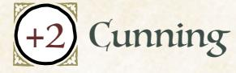

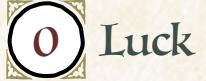

Add +1 to a stat of your choice, to a max of +2

#### Weapon Skills

Choose one weapon skill to start

- Confuse Senses
- Improvise
- Parry
- Trick Shot

#### Roguish Feats

You start with these: Counterfeit, Disable Device, Pickpocket

Equipment Starting Value 8

#### Your Nature choose one

- Observer: Clear your exhaustion track when you enter a dangerous situation to try to witness a significant or secret event or meet an important individual.
- Activist: Clear your exhaustion track when you publicly confront the leadership of a clearing about changes you think are vital to the community's success.

#### Your Drives choose two

- Justice: Advance when you achieve justice for someone wronged by a powerful, wealthy, or high-status individual.
- Discovery: Advance when you encounter a new wonder or ruin in the forests.
- Ambition: Advance when you increase your reputation with any faction.
- Clean Paws: Advance when you accomplish an illicit, criminal goal while maintaining a believable veneer of innocence.

#### Your Connections

See Root: The RPG page 51 for mechanical effects.

- Partner: \_\_\_\_\_\_\_\_\_ and I exposed a dark secret of a faction, leading to a meaningful political change. What was it? And which member of that faction hates us for it?
- Peer: I think \_\_\_\_\_\_\_\_\_ sees the truth of the world, and I value their perspective deeply. What kinds of information do they see that I often overlook?

{98}------------------------------------------------

#### Chronicler Moves

you get **the worth of a book**, then choose two more

#### The Worth of a Book

When you **study your tomes and scrolls to discover old techniques or methods**  to solve an intractable problem—curing a deadly disease, ending a drought, legally unseating a leader, etc.—decide what you want to accomplish and tell the GM. The GM will give you between 1 to 4 conditions you must fulfill to discover a path forward, including time taken, additional information needed, mentors or translators needed, facilities/tools needed, or the limits of your solution. When you fulfill the conditions, you gain whatever knowledge you were seeking—it's up to you to put it to use.

#### An Eye for the Real Story

When you *read a tense situation*, mark exhaustion—even on a miss—to spot someone who knows more than they're letting on. Take a +1 ongoing to convince them to share their secrets with you when you get them in private.

#### Search the Records

When you **examine the documents, records, or assorted notes of an important NPC (your call)**, roll with Cunning. On a hit, you discover evidence of their secrets; the GM will tell you who would pay for the information you've uncovered. On a 10+, you also take a 12+ instead of rolling the next time you try to *figure them out*. On a miss, your search yields terrible news—someone is acting against you or your interests in an unexpected arena.

#### Loremaster

When you **consult your knowledge in order to understand a political conflict**, roll with Cunning. On a hit, the GM tells you what information you remember that completes your understanding of the messy situation. On a 10+, you can ask a followup question; the GM will answer honestly. On a miss, something about the situation doesn't fit the history—the GM will tell you what has radically shifted.

#### Good Advice

When you **offer an NPC advice about a sticky situation**, offer them the best advice you've got and roll with Cunning. On a hit, they see the wisdom of your suggestion; they have to mark exhaustion or incorporate your advice into their plans. On a 7-9, you let something about your own plans or allegiances slip as you try to help them out. On a miss, the advice angers or offends them; the GM will tell you what local custom you've overstepped with your meddling.

#### Dedicated Scholar

Take an extra box of exhaustion. When you **acquire a new tome or scroll documenting the history of the Woodland**, clear your exhaustion track.

{99}------------------------------------------------

#### Background Questions

| Whom have you left behind?                                                                            |
|-------------------------------------------------------------------------------------------------------|
| " my parents                                                                                       |
| " an older sibling                                                                                 |
| " an old mentor                                                                                    |
| " a lover or friend " a formal school                                                        |
| Which faction have you served the most? (mark two prestige for                                     |
| appropriate group)                                                                                    |
| With which faction have you earned a special enmity? (mark one notoriety for appropriate group) |
|                                                                                                       |

Curious, perceptive, clever, demanding. The Chronicler is a historian of the Woodland, a scribe and scholar dedicated to uncovering and recording the secrets others might prefer to keep hidden.

As the Chronicler, you have a unique relationship with information. You're good at getting it—searching through documents, reading the room, finding those with the real story—and you know how to put it to use to get things done. Other vagabonds might sharpen their blade before a fight; you know that no strike of the sword is as mighty as a properly placed stroke of the pen.

But your inquisitive demeanor is likely to get you into trouble—denizens with secrets don't want their business spread around. You may need a fellow vagabond with a sword to keep that pen in good working order. If you're ready to learn the truth (and spread it to the Woodland), make sure to have a few friends on hand to help you keep your head!

Your two natures, "Observer" and "Activist," reflect your desire both to get the Woodland's secrets and to use them to make life better for denizens and their communities. "Observer" puts you in harm's way, but it doesn't say you have to go alone! "Activist," on the other hand, demands you make a public pronouncement about a "vital" change; you have to believe in the value of the change, although fulfilling your nature doesn't require you to present a dissertation on the subject.

Your drives point you towards all sorts of goals you can latch onto as you dig into the Woodland's history. You might take on the causes of the local community, dedicate yourself to exploring the forests, or even champion one of the factions in the Woodland War!

{100}------------------------------------------------

#### Notes on The Chronicler Moves

For The Worth of a Book, you are a bearer of real knowledge, a vagabond who can end a plague, reshape a clearing's infrastructure, or even reform failed institutions with knowledge that can pave a path to solve otherwise intractable problems.

- "Time taken" means the GM can tell you how long it will take to study your materials; you need a safe space to consult your tomes and scrolls for all that time, and new events may occur while you're busy.
- "Information needed," "mentors or translators needed," and "facilities/ tools needed" all center around additional resources or aid of a specialized nature that you need to accomplish your goal. Obtain those resources or aid to fulfill the condition. The GM will tell you what specifically you need—whether it's a general category ("a translator of Ancient Ka-Kaw") or a specific thing or person you've heard of ("the old sage Philias Wren").
- "The limits of your solution" means the GM can tell you in what way you can't quite manage the full extent of what you hope to accomplish; if you want to unseat an important member of the Marquisate, the GM might tell you that the limit is only removing their authority over this clearing, not removing them from power entirely. Accept that limit, and the condition is satisfied.

Once you satisfy the conditions, you earn the knowledge—a cure for the plague, a new plan for aqueducts, a legal case to establish a trade guild—but you still have to put that knowledge into practice. The cure still has to be made and distributed; the aqueducts still have to be constructed; the legal case still has to sit before a court.

For An Eye for the Real Story, you can decide to mark the exhaustion before, during, or after you read a tense situation. The GM will tell you who you discover when you mark the exhaustion; it's up to you to get them alone to get the bonus.

For **Search the Records**, you must make use of the information granting you the 12+ to *figure someone out* in a reasonable time period; if you leave the clearing and come back, the situation may have changed.

For Loremaster, you need to be explicit when triggering the move; consulting your knowledge might just look like you are thinking hard. Your knowledge of Woodland history is broad! Nearly any political conflict is a fair target of this move, since even the newest turmoil has roots in old disputes.

For Good Advice, you don't have to wait for NPCs to ask for advice—you're offering it! That said, the NPC must be someone who would consider your thoughts on the sticky situation in question. Most denizens are willing to listen to a vagabond with a good idea, but your bitter rival might shut you down before you can get a word in!

For **Dedicated Scholar**, acquiring a new tome or scroll filled with Woodland history effectively becomes a second nature. Whatever you get your hands on has to be a work of some significance to trigger the move!

{101}------------------------------------------------

# The Exile

*You were once a prominent member of a powerful faction, but now you are exiled from it, and defined by what you do in relation to the group you once called your own.*

#### Species

• fox, mouse, rabbit, bird, lizard, other

#### Demeanor

• bitter, cautious, clever, vain

#### Details

- he, she, they, shifting
- shabby, flashy, formal, inconspicuous
- precious heirloom, mark of privilege, ragged cloak, old book

Cunning -1

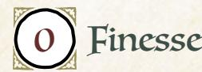

Add +1 to a stat of your choice, to a max of +2

#### Weapon Skills

Choose one weapon skill to start

- Cleave
- Quick Shot
- Storm a Group
- Vicious Strike

#### Roguish Feats You start with this one:

Sneak

Equipment Starting Value 11

|  | Your Nature choose one |  |  |
|--|------------------------|--|--|
|--|------------------------|--|--|

- Schemer: Clear your exhaustion track when you promise valuable resources to a dangerous Woodland figure to secure their aid.
- Avenger: Clear your exhaustion track when you openly attack those who have wronged you or your sworn vassals and wards.

#### Your Drives choose two

- Loyalty: You're loyal to someone; name them. Advance when you obey their order at a great cost to yourself.
- Revenge: Name your foe. Advance when you cause significant harm to them or their interests.
- Chaos: Advance when you topple a tyrannical or dangerously overbearing figure or order.
- Infamy: Advance when you decrease your reputation with any faction.

#### Your Connections

See Root: The RPG page 51 for mechanical effects.

- Protector: I see greatness in \_\_\_\_\_\_\_\_\_ that I wish to nurture...and perhaps turn to my own purposes. What is it about them that inspires me so?
- Family: \_\_\_\_\_\_\_\_\_ sheltered me in the earliest days of my exile when I was at my most vulnerable. Why did they offer me such kindness in my moment of need?

{102}------------------------------------------------

#### Exile Moves

you get **known by all**, then choose two more

| " | Known by All |  |
|---|--------------|--|
|---|--------------|--|

When you **first encounter an important NPC from your former faction**, you may declare them to be an old ally—choose and mark one unmarked option from the list below instead of *meeting someone important*—and roll.

 They shared your political networks; roll with +1.

 You worked closely with them for years; roll with +2.

 They were a loyal friend or dutiful servitor; roll with +3.

On a hit, their loyalty has not diminished; they offer whatever aid they can, even risking their own reputation and safety. On a 7-9, they can only assist you if they can pretend you forced their hand and cover their tracks when you leave; mark as much notoriety with their faction as you added to your roll. On a miss, your attempt to reconnect only reveals your desperation; mark as much notoriety as you added to your roll and know that those who hunt you will be here soon. When you have **marked all three options,** clear them all; your agents will tell you of an opportunity to redeem yourself in the eyes of your faction now that they know you are still active.

#### Above It All

When you *trick an NPC* into granting you access or information by pretending to be a high-ranking faction leader, roll with Charm instead of Cunning.

#### I Bring You...

When you **spend time talking to the denizens of a clearing**, mark exhaustion to learn what vital resource or fugitive the powers that be seek. When you deliver a vital resource or prisoner to a faction, you may *ask for a favor* from the faction as if you rolled a 12+ in addition to marking prestige. If your Reputation with that faction is already +2 or greater, you may instead *sway the NPC* whose cause you most directly benefited with your contribution as if you rolled a 12+.

#### Greatest of the Age

When you *engage an enemy in melee*, you take all four options and one for double effect when you roll a 12+.

#### Born to Be a King

Take +1 Charm (max+3).

#### Fancy Paper

You gain the roguish feat *Counterfeit* (it does not count against your limit). When you *attempt a roguish feat* to produce counterfeit documents using your intimate knowledge of your home faction's politics and procedures, mark notoriety with that faction to make the move as if you had rolled a 12+.

{103}------------------------------------------------

### Background Questions

| Where do you call home?                       | Why are you a vagabond?                |  |
|-----------------------------------------------|----------------------------------------|--|
| " clearing                                 | " I seek a new home in the Woodland |  |
| " the forest                               | " I want to reclaim my prestige     |  |
| " a place far from here                    | " I wish to make amends for my sins |  |
| What caused your fall?                        | " I seek revenge against my enemies |  |
| " I led a failed coup or rebellion         | Which faction exiled you? (set your    |  |
| " I committed a terrible crime             | reputation with them to -2)            |  |
| " I was betrayed by my closest allies      |                                        |  |
| " I fell prey to my rival's schemes        | Which faction now seeks your loyalty   |  |
| Why were you exiled (not killed)?             | or allegiance? (set your reputation    |  |
| " a complex legal system protected my life | with them to +1)                       |  |
| " the last of my allies saved my life      |                                        |  |
| " my enemies granted me mercy              |                                        |  |
| " I fled before facing judgment            |                                        |  |

Resilient, fallen, persistent, dangerous. The Exile is a former power player of the Woodland, a once important figure who has been consigned to the life of a vagabond upon banishment from their former faction.

As the Exile, you have a unique relationship with one of the factions in the Woodland War; everyone in that faction likely knows you and probably has an opinion about you and your fall. Other vagabonds may be able to slip into a clearing without drawing much attention—you tend to make a scene wherever you go!

*Known by All* lets you decide when (and how often) you meet your former allies. Use it as often as you'd like, but know that traipsing across the Woodland invoking old alliances will make it easier for those who hunt you to find and confront you. Of course, if you want to start a fight with your old enemies, there's no reason to be shy…

Your natures, "Schemer" and "Avenger," speak to the choices you face now that you've been cast out into the Woodland. Will you plot your return to power by forging alliances with former enemies and dangerous outlaws? Or will you focus on destroying those who wronged you and your loyal vassals? Whatever you choose, look for opportunities to dig into the politics of the clearings—you'll find many allies and enemies alike amongst those who seek power in the Woodland. Either way, you don't have to deliver the resources to activate "Schemer"—just promising the resources is enough. Nor do you have to win the fight to activate "Avenger"; all that matters is that you strike openly with blade, bow, or claw.

Your drives similarly point you at powerful people, close allies…and vengeance. Decide early on how to handle your exile, and choose drives that fit your goals.

Chapter 5: New Playbooks 103

{104}------------------------------------------------

If you want to reclaim your position, look to "Loyalty" and "Chaos"; if you want to burn down those who hurt you, "Revenge" and "Infamy" are more likely to suit your plans. You may find yourself in a tough spot if you try to both reclaim your old standing and burn down your old faction at the same time. But remember, you can change your mind about your goal over time if you want—switching drives and natures—even though it can be especially difficult to reverse some of the work you've already undertaken.

#### Notes on The Exile Moves

For *Known by All*, you can only declare an NPC an old ally the first time you meet them; remember that this move completely replaces *meeting someone important* when you use it. Other PCs in your band may still *meet someone important*, but you're declaring that you definitely know this particular figure! If you get a 7–9, you immediately mark the notoriety; the ally starts the ruse right then and there, possibly requiring you to play along as a threatening outcast who is forcing their hand.

The agents who come forward with an opportunity after you've marked all three options don't have to be the same characters you're declaring as old allies. You may have other members of your former faction who want to see you return to power! The GM details those agents and their relationship to you.

For *Above It All*, you don't have to claim to be a member of your former faction. As long as you're *tricking someone* by pretending to be a high-ranking member of an active Woodland faction, you can use the move.

For *I Bring You…*, the information you gather by marking exhaustion is the result of you asking around about the current gossip. If you deliver a vital resource or prisoner to a faction without asking around first, you can still *ask for a favor* as if you rolled a 12+.

For *Greatest of the Age*, you get all the options listed while *engaging an enemy in melee* on a 12+ and one option a second time. If you "inflict serious (+1) harm" or "suffer little (–1) harm" for double effect, then you get a +2-harm or –2-harm modifier to the outcome; if you "shift your range one step" for double effect, then you shift your range twice. Selecting "impress, dismay, or frighten your foe" for double effect indicates that you greatly shake the will and resolve of your opposition, perhaps inflicting additional morale harm or just scaring them off entirely; the GM details the full effect.

For *Fancy Paper*, you are using your knowledge of terminology, style, patterns, insignias and so on—nothing that requires any special equipment to replicate. The GM may still have you mark depletion to pull together the basic supplies like ink, paper, wax, and other accoutrements necessary for the ruse, as with any Counterfeit attempt.

{105}------------------------------------------------

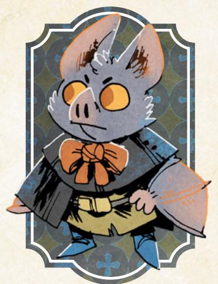

# The Envoy

*You are a professional representative, capable of speaking for other powers while maintaining plausible deniability, fashioned as the ultimate neutral agent and diplomatic mercenary.*

#### Species

• fox, mouse, rabbit, bird, bat, other

#### Demeanor

• commanding, kind, professional, sleazy

#### Details

- he, she, they, shifting
- bucolic, decadent, elegant, traveled
- fancy boots, token of esteem, rugged scarf, pipe and leaf

#### Charm 0

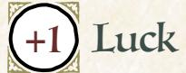

Add +1 to a stat of your choice, to a max of +2

#### Weapon Skills

Choose one weapon skill to start

- Confuse Senses
- Improvise
- Parry
- Quick Shot

### Roguish Feats

You start with these: Hide, Sneak, Pick Lock

Equipment Starting Value 8

#### Your Nature choose one

- Agent: Clear your exhaustion track when you convince someone influential to allow you to represent their interests.
- Sworn: Clear your exhaustion track when you openly commit to resolve a dangerous conflict on behalf of someone vulnerable.

#### Your Drives choose two

- Loyalty: You're loyal to someone; name them. Advance when you obey their order at a great cost to yourself.
- Greed: Advance when you secure a serious payday or treasure.
- Ambition: Advance when you increase your reputation with any faction.
- Clean Paws: Advance when you accomplish an illicit, criminal goal while maintaining a believable veneer of innocence.

#### Your Connections

See Root: The RPG page 51 for mechanical effects.

- Watcher: \_\_\_\_\_\_\_\_\_\_\_\_ reminds me of a powerful political figure of the Woodland. Whom do they resemble? Why is the resemblance so striking to me?
- Peer: \_\_\_\_\_\_\_\_\_\_\_\_ and I negotiated a truce between two warring parties within a clearing. Why were they so important to closing the deal?

{106}------------------------------------------------

### Envoy Moves

you get **diplomat**, then choose two more

#### Diplomat +0 +1 +2 +3

You are known across the Woodland as an accomplished diplomat; **you have a track (Diplomat) to reflect your professional reputation, starting at a +1**. When you raise your reputation with any faction, raise Diplomat; when you lower your reputation with any faction, lower Diplomat. You cannot lower Diplomat below +0 or raise it above +3.

- Mark exhaustion to use Diplomat when you *ask for a favor* or *meet someone important* for the first time, regardless of the faction of your target.
- When you *persuade* or *figure out* an important NPC while acting on behalf of another—not you or your band—roll with Diplomat instead of Charm.

#### Fancy Meeting You Here

When you **carouse in a popular locale**, roll with Luck. On a hit, you meet a lackey of a powerful faction in the area—the GM will tell you what they do for the faction, and you tell the GM when and how you met them in the past. On a 10+, they get sloppy: they let a secret slip about the faction's plans or offer to introduce you to the faction's leaders on friendly terms. On a miss, someone who is looking for you finds you first.

#### Turncoat

You gain the roguish feats *Blindside* and *Counterfeit* (they do not count against your limit). When you *attempt a roguish feat to Blindside* someone who trusts you, roll with Cunning instead of Finesse.

#### Plots and Schemes

Take +1 Cunning (max+3).

#### Trust in Me

When you **soothe or placate an angry NPC**, roll with Cunning. On a hit, you calm their rage. On a 7-9, choose 1. On a 10+, choose 2:

- They reveal an unexpected vulnerability
- They hesitate in their fury; you create an opportunity
- They take you further into their confidence

On a miss, you can only calm them by redirecting their frustrations.

#### Kiss the Ring

When you **exit a meeting with someone rich or powerful**, say you took a few of their things and roll with Cunning. On a hit, the GM tells you what valuable or interesting item you got. On a 7-9, it will be missed, but not until you are gone; mark notoriety with that faction. On a miss, they're going to notice; mark 2-notoriety with that faction and either run or come up with a good excuse.

{107}------------------------------------------------

### Background Questions

| Where do you call home?                    | Whom have you left behind?            |  |
|--------------------------------------------|---------------------------------------|--|
| " clearing                              | " my commander                     |  |
| " the forest                            | " my family                        |  |
| " a place far from here                 | " my loved one                     |  |
|                                            | " my master                        |  |
| Why are you a vagabond?                    | " my mentor                        |  |
| " I am called to serve a noble cause    |                                       |  |
| " I want to make a name for myself with | Which faction have you served         |  |
| every faction                              | the most? (mark two prestige for      |  |
| " I hold no loyalty save to the highest | appropriate group)                    |  |
| bidder                                     |                                       |  |
| " I have many conflicting loyalties     | With which faction have you earned    |  |
| " I seek the truth behind an ally's     | a special enmity? (mark one notoriety |  |
| disappearance                              | for appropriate group)                |  |

Charming, subtle, political, respected. The Envoy is the trusted neutral agent of the Woodland, a political operative and mercenary whose greatest asset is the plausible deniability they offer to the powers that be.

As the Envoy, you have a light touch for a vagabond—one of the few outcasts who is welcome nearly anywhere you go. Every faction has a use for you! They may wish to employ you to resolve some difficult situation, to deliver a message or threat, or even just to help them understand how best to proceed in a conflict with unfamiliar foes. You are useful to their plans, and they will gladly offer you prestige and coin if you're willing to work on their behalf.

But you are still a vagabond. The factions of the Woodland find you valuable precisely because you are expendable, and many won't hesitate to turn on you if they feel you've outstayed your welcome. Don't be afraid to use your moves— *Turncoat*, *Trust in Me*, *Kiss the Ring*—to turn on them before they cast you aside, and never forget to use your position and influence to secure the best deal you can from the powers that be. Just be careful not to acquire too much notoriety, lest your status as a diplomat be called into question!

Your natures, "Agent" and "Sworn," both involve you working on someone else's behalf. "Agent" points you at powerful, influential denizens, those who need a vagabond like you to carry messages and negotiate deals. "Sworn" puts the focus on the vulnerable and downtrodden, setting you up as a mediator for those who have no other advocates. The former is perfect if you want to endear yourself to the powers that be; choose the latter if you prefer to instead be a hero to the masses.

{108}------------------------------------------------

You will often be called upon by the band to negotiate on their behalf too, so lean into those connections and your drives as you act as the negotiator for the other PCs. Remember to *plead* with other vagabonds to go along with the deals you've struck; sometimes it takes just a little push to get everyone on the same page.

#### Notes on The Envoy Moves

You can use *Diplomat* instead of the normal stat when you meet the conditions listed, effectively leveraging your professional reputation over your personal reputation or natural attributes. You are "acting on behalf of another" anytime you are working for an NPC instead of yourself, even if you expect to benefit from their success.

For *Fancy Meeting You Here*, you need time to carouse and indulge long enough to meet someone of note. You can suggest a faction, seeking out one particular group, but ultimately the lackey you encounter is detailed by the GM. On a hit, you establish the relationship, but it's still up to you to *figure out*, *persuade*, or *trick* your new mark.

For *Turncoat*, the denizen who trusts you must believe you are on their side long enough to turn their back or reveal a weakness in their defenses. It's unlikely anyone you just met trusts you, unless you've *tricked* them into thinking you're someone they already know or someone loyal to the same cause or faction.

For *Trust in Me*, the peace you grant an NPC on a hit lasts only for a scene or two. As soon as the situation flares up again, the NPC will return to their rage. No matter how long the reprieve, however, the other benefits you gain are generally more permanent. The vulnerability they reveal remains true beyond their anger, and the trust they place in you when they take you further into their confidence remains until you betray it. The opportunity you create when they hesitate is more transient, based on that moment, but it's always possible a job opportunity might remain on the table past that scene.

For *Kiss the Ring*, you establish that you swiped a few things after the scene in which you met with someone wealthy or powerful; you don't have to decide in advance that you're stealing. If you score a full hit, you get away clean, but a weak hit means someone not only noticed the theft, but also directly associated the larceny with you. On a miss, you may have swiped something valuable the GM will tell you—but whatever you took matters enough that the folks you stole it from notice right away, even if it's effectively worthless. Mark the notoriety regardless of how you react to their discovery of your thieving…and make your decision to run or lie quickly!

{109}------------------------------------------------

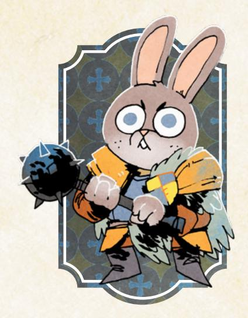

## The Heretic

*You are a fervent believer in a cause or ideology that most Woodland denizens and factions find distasteful and unacceptable, even if your beliefs are genuinely for the greater good of the denizens.*

#### Species

• fox, mouse, rabbit, bird, other

#### Demeanor

• passionate, naive, eccentric, proud

#### Details

- he, she, they, shifting
- unkempt, young, cleareyed, lithe
- colorful robes, facial tattoo, token of belief, unique jewelry

#### Charm +2

Cunning 0

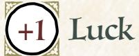

Add +1 to a stat of your choice, to a max of +2

#### Weapon Skills

Choose one weapon skill to start

- Cleave
- Disarm
- Quick Shot
- Storm a Group

#### Roguish Feats

You start with these: Counterfeit, Sleight of Hand

Equipment Starting Value 9

#### Your Nature choose one

- Believer: Clear your exhaustion track when you publicly call out a symbol or authority dedicated to beliefs opposed to yours.
- Healer: Clear your exhaustion track when you attempt to start a dialogue between two foes from different factions.

#### Your Drives choose two

- Principles: Advance when you express or embody your moral principles at great cost to yourself or your allies.
- Protection: Name your ward. Advance when you protect them from significant danger, or when time passes and your ward is safe.
- Freedom: Advance when you free a group of denizens from oppression.
- Chaos: Advance when you topple a tyrannical or dangerously overbearing figure or order.

### Your Connections

See Root: The RPG page 51 for mechanical effects.

- Protector: \_\_\_\_\_\_\_\_\_\_\_\_ has come to share my beliefs; I must stand with them, no matter the cost. What happened to us that convinced them of the wisdom of my cause?
- Watcher: \_\_\_\_\_\_\_\_\_\_\_\_ was once hurt greatly by someone who shared my cause. Why do I think I might still win them over? What have I already tried to do to earn their trust?

{110}------------------------------------------------

#### Heretic Moves

you get **friends indeed** & **hear me**, then choose one more

#### Friends Indeed

When you **first seek out those who share your cause** after arriving in a clearing, roll with Charm. On a hit, you find one or two; they provide what they can in service to your collective work. On a 7-9, they also tell you about a threat to your shared ideology that has arisen in the clearing. On a miss, you are caught by someone in the clearing who openly despises your kind.

#### Hear Me!

When you **give an inspiring speech to a persuadable crowd** in the service of your cause, mark exhaustion and roll with Charm. On a hit, you sway them; pick 2. On a 7-9, you must put yourself at the crowd's mercy and lead them directly for them to follow through.

- They tear down an opposing symbol
- They overthrow a vulnerable tyrant
- They destroy the trappings of tradition
- They elevate someone overlooked
- They deliver justice to the wicked

On a miss, the crowd is moved to action but ignores your guidance, leading to terrible consequences.

#### Destroy Something Beautiful

When you *wreck* **a false idol or symbol of oppression** alongside your allies, roll with Charm instead of Might; you and all your allies clear an exhaustion, even on a miss.

#### Devilish Charm

When you *trick an NPC* you've previously aided or impressed, mark exhaustion to make the move as if you had rolled a 12+ instead of rolling.

#### Center of the Universe

Take +1 Charm (max +3).

#### You Shall Not Pass

When you plant yourself in the way of your enemies, roll with Charm. On a hit, your foes cannot get past you until they take you down—brace yourself. On a 10+ choose 1. On a 7-9, choose 2:

- You suffer +1 harm from all your enemies' attacks
- A single enemy (GM's choice) slips past you
- You cannot retreat from your position

On a miss, your enemies find or create a new way past you that makes your situation far worse.

{111}------------------------------------------------

### Background Questions

| Where do you call home?                                                                                                                                                                 |                                                                                                                                                                                                                                                                                               |  |  |  |  |
|-----------------------------------------------------------------------------------------------------------------------------------------------------------------------------------------|-----------------------------------------------------------------------------------------------------------------------------------------------------------------------------------------------------------------------------------------------------------------------------------------------|--|--|--|--|
| " clearing " the forest                                                                                                                                                        | " a place far from here                                                                                                                                                                                                                                                                    |  |  |  |  |
| What are the fundamental tenets of your cause? (Pick 2): " To overturn a tradition " To exalt the worthy " To unseat the corrupt " To uplift the downtrodden | Whom have you left behind? " my devotee " my family " " my guru my secret love Which faction is known to hate those who share your cause? (set your Reputation with them to -1) Which faction is known to harbor those who share your cause? (set your |  |  |  |  |
| " To destroy a falsehood Why are you a vagabond? " I must make amends for my past                                                                                           |                                                                                                                                                                                                                                                                                               |  |  |  |  |
| " I want to bring my truth to all " I seek still greater understanding " I'm being hunted by the powerful                                                                | Reputation with them to +1)                                                                                                                                                                                                                                                                   |  |  |  |  |

Abrasive, outspoken, committed, divergent. The Heretic is a vagabond who has come to adhere to a cause or ideology that has no true home in any clearing or faction, a believer who refuses to compromise on what truly matters.

As the Heretic, you have a belief system that drives you to action, an internal motivation that pushes you to take risks in order to make the world a better place. You don't have to subscribe to a particularly complex religious or cultural belief system, but you do need to pick at least two fundamental tenets and be clear about how and why they matter to you. Work with the GM to make sure it's understood what other denizens who subscribe to this ideology think as well.

Make sure your band knows what you believe! They will have to live with the consequences of your beliefs nearly as often as you do; you don't want them to be surprised by your ideology. You may be driven by your cause, but as long as you are a PC, you must have a place in the band as well. Find ways through your connections, drives, and other relationships to balance your beliefs against your membership in the band.

Your natures, "Believer" and "Healer," are deeply contrasting. "Believer" focuses on your enacting the tenets of your cause in the world, calling out authorities who hold opposing beliefs—such confrontations almost always lead to further conflicts. "Healer," in contrast, focuses on resolving conflicts between foes from different factions, relying less on your ideology and more on the general idea that you see the world differently from the rest of the Woodland; you're more open to new ways of resolving old fights, and starting a productive conversation between those foes will activate the nature.

{112}------------------------------------------------

Your drives can help you direct yourself towards your beliefs—several of them line up with the two fundamental tenets of your cause, and picking the ones that match perfectly is a great way to ensure that you are rewarded for adhering to your belief system.

#### Notes on The Heretic Moves

For *Friends Indeed*, whatever denizens you find are true believers like you, but they may be keeping their allegiance to your cause quiet to avoid trouble. Few of them will be vagabonds whose outcast status insulates them from the consequences of being outspoken, and just as few will be members of other factions who must keep their beliefs well hidden to remain in their positions. The sympathetic ordinary denizens you find will often know better than to flaunt their odd beliefs.

For *Hear Me*, the crowd must be persuadable! In other words, you must have a reasonable chance at moving them to action. You can't use this move to turn the Marquisate army against its leaders unless you have some way of making that army susceptible to your words and your cause. If you must put yourself at the crowd's mercy and lead them, you must join them in the work you've called them to do and expose yourself as a main leader of the movement.

For *Destroy Something Beautiful*, you need at least one other accomplice for this move to trigger. You can't *wreck something* by yourself using this move.

For *Devilish Charm*, you're working the long game when you *trick someone* you helped or impressed. You've got to have earned at least a bit of their trust in a previous scene or encounter to take advantage of it later!

For *You Shall Not Pass*, you've got to have a reasonable chance of holding off your enemies with your position, like on a bridge or at some other chokepoint like a doorway or a hallway. It doesn't have to be a perfect block to their progress, but you can't stop them in a big open field! If you choose to suffer additional harm, every attack against you inflicts additional harm until you abandon your position; if you choose that you can't retreat, it means your avenue of escape is cut off…and your only options are victory or defeat.

{113}------------------------------------------------

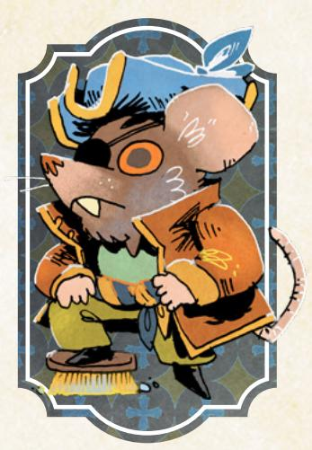

# The Pirate

*You are a rogue boat captain, at home on the waters of the Woodland's rivers, lakes, or bays, free from the sway of land-bound life and more than willing to do whatever it takes to maintain that freedom.*

#### Species

• fox, mouse, rabbit, bird, rat, other

#### Demeanor

• honest, flamboyant, stoic, strange

#### Details

- he, she, they, shifting
- branded, fancy, grizzled, attractive
- flashy hat, lucky trinket, flask of rum, lodestone and compass

#### Charm +1

Cunning 0

Add +1 to a stat of your choice, to a max of +2

#### Weapon Skills

Choose one weapon skill to start

- Parry
- Storm a Group
- Trick Shot
- Vicious Strike

#### Roguish Feats

You start with these: Acrobatics, Blinside, Pick Lock

Equipment Starting Value 8

#### Your Nature choose one

- Rogue: Clear your exhaustion track when you attempt to doublecross, triplecross, or betray a powerful or dangerous NPC.
- Merchant: Clear your exhaustion track when you carry valuable goods or treasure past danger, difficulty, or blockade.

#### Your Drives choose two

- Freedom: Advance when you free a group of denizens from oppression.
- Revenge: Name your foe. Advance when you cause significant harm to them or their interests.
- Crime: Advance when you illicitly score a significant prize or pull off an illegal caper against impressive odds.
- Infamy: Advance when you decrease your reputation with any faction.

### Your Connections

See Root: The RPG page 51 for mechanical effects.

- Partner: \_\_\_\_\_\_\_\_\_\_ and I seized valuable cargo from a faction together. Who did we rob? Why?
- Family: \_\_\_\_\_\_\_\_\_\_ had a good relationship with my former captain. How have they supported me in taking on the role as my own?

{114}------------------------------------------------

#### Pirate Moves

you get **small ship** & **sail on**, then choose one more

| " | Small Ship |
|---|------------|
|---|------------|

By default, your ship has a wear track with four boxes. Mark wear when it suffers serious damage or when a move calls for it. When your ship's wear track is filled, it is dead in the water and must be repaired at port. If you must mark wear on your ship but its whole track is full, your ship is lost. If you ever lose the ship the GM may present you with an opportunity to get a new one.

| Your Ship's Name: Wear                                                                                                                                                                                                                                                                                                                                                                                                |                               |
|---------------------------------------------------------------------------------------------------------------------------------------------------------------------------------------------------------------------------------------------------------------------------------------------------------------------------------------------------------------------------------------------------------------------------|-------------------------------|
| Blessings (choose 2):                                                                                                                                                                                                                                                                                                                                                                                                     |                               |
| " stocked: your ship gains a 2-box depletion track of cargo and gear " nimble: take +1 ongoing to tricking NPCs when relying on your ship's speed " renowned: take +1 to Reputation with a chosen faction while on your ship " swift: once per session, mark wear to outrun any pursuer on the water                                                                                                 |                               |
| Flaws (choose 2):                                                                                                                                                                                                                                                                                                                                                                                                         |                               |
| " dreaded: take -1 to Reputation with a chosen faction while on your ship " rickety: your ship has one fewer box of wear than usual " clumsy: take -1 ongoing to trusting fate when piloting your ship carefully " stolen: someone dangerous is pursuing you to recover their property                                                                                                               |                               |
| " Sail On When you travel from clearing to clearing by ship, mark wear on the ship and roll with Luck. On a hit, you reach the next port; the GM will tell you one (mostly) friendly denizen you know there. On a 7-9, they are holding a grudge—work it out or offer at least 2-Value to let things go. On a miss, you are caught in a dangerous situation along your route before you arrive at port. |                               |
| " Swashbuckler When you first charge into battle by swinging, diving, or leaping to engage an enemy in melee at close range, roll with Luck instead of Might.                                                                                                                                                                                                                                                    |                               |
| " Eye for Treasure When you ask around a port about valuable trade, roll with Luck. On a hit, you learn of nearby cargo worth your time. On a 10+, you know exactly where the cargo is held or how to intercept the shipment. On a miss, you hear only of well-guarded or difficult-to-reach cargoand your questions start drawing attention.                                                              |                               |
| " Plenty of Rum Once per session, you may plead with a vagabond a second time in a session by sharing your rum (mark depletion) with the target of your pleading.                                                                                                                                                                                                                                                |                               |
| " Sea Legs When you attempt a roguish feat aboard a ship perform Acrobatics, roll with Luck instead of Finesse.                                                                                                                                                                                                                                                                                               | to Blindside, Sneak, Hide, or |

114 Root: The Roleplaying Game

{115}------------------------------------------------

### Background Questions

| Where do you call home?                                                                              | What happened to your captain?                                              |
|------------------------------------------------------------------------------------------------------|-----------------------------------------------------------------------------|
| " clearing                                                                                        | " disappearance                                                          |
| " the forest                                                                                      | " died in a blaze of glory                                               |
| " a place far from here                                                                           | " mutiny                                                                 |
|                                                                                                      | " imprisonment                                                           |
| Why are you a vagabond?                                                                              | " retirement                                                             |
| " I believe I'm haunted by a powerful curse                                                    | Which faction have you served                                               |
| " I hear the call of gold and silver                                                              | the most? (mark two prestige for                                            |
| " I am despised by other denizens                                                                 | appropriate group)                                                          |
| " I am fleeing the legal consequences of my piracy " I wish to build a network of fellow | With which faction have you earned a special enmity? (mark one notoriety |
| pirates and freebooters                                                                              | for appropriate group)                                                      |

Flamboyant, connected, skillful, chaotic. The Pirate is the captain of a ship, capable of moving cargo and people up and down the rivers of the Woodland, all while finding a little extra time for mischief and adventure!

As the Pirate, you're a bit of a paradox: you love chaos and adventure and double crosses and rumors...yet you also have the responsibility of managing your boat and its cargo! The truth is that your position as captain is what makes your chaotic adventures possible—you aren't bound to any home because your true place in the Woodland is on your boat. No one can demand your servitude when you rule the rivers!

Your natures, "Rogue" and "Merchant," highlight two different aspects of a life on the open water: treachery and cargo. "Rogue" rewards you for changing sides or finding a better deal, but you don't need to succeed at treachery to activate your nature—you just have to take the first steps towards the double cross. You can also activate your nature multiple times by betraying your current employer, then betraying your new ally to go back to the original deal! Triple cross! "Merchant," however, requires that you actually have the cargo on hand as you try to pass "danger, difficulty, or blockade," but your nature activates as soon as that obstacle becomes a threat to you and your cargo!

While your boat is a huge asset for you and your band, don't be afraid to venture away from it in search of adventure. You won't be able to make use of your boat directly, but only one of your moves really relies on it; the others and all your basic moves, weapon moves, and roguish feats—are all available to you when you're on dry land.

{116}------------------------------------------------

#### Notes on The Pirate Moves

For *Small Ship*, you have a small riverboat (or equivalent vessel) capable of hauling your band and some cargo across the rivers or lakes of the Woodland. Your ship—like any other meaningful piece of equipment—has a wear track. Fill the track, and the ship must be repaired by a skilled craftsdenizen; the ship is lost if you ever have to mark wear when the track is full. You can't just throw your boat over your shoulder and hike with it to the next clearing, so you have to find somewhere to dock it and someone to keep it safe if you need to travel by foot to the next clearing.

- If you choose "stocked," you can use the additional depletion track whenever you're on your boat; clearing the depletion from your ship's track works like clearing depletion from your own track.
- If you choose "renowned" or "dreaded," you choose the affected faction at the start of play and only apply the modifier to your Reputation when you're on, near, or around your ship (or when you invoke it in a conversation directly). In other words, if someone can't see your ship and doesn't know you captain her, the modifier doesn't apply.
- If you choose "stolen," whoever is hunting you has the means and focus to hunt you all across the Woodland; you can't stay in one place for long.

For *Sail On*, you can travel between clearings along rivers or over a lake instead of *traveling along a path* or *through the forest*, provided a waterway connects the two clearings. Neither you nor any of the other vagabonds have to mark any exhaustion or depletion in addition to the wear you mark on the ship. If whoever you know in port is holding a grudge, they will act against you—alerting the authorities, refusing you service, etc.—if you don't work it out or offer them a bribe.

For *Swashbuckler*, you can only make use of Luck when you first charge into battle with a spectacular entrance. That said, if you've defeated one foe and you charge into battle against someone different with enough distance to swing, dive, or leap into the fight, you may be able to use the move again in the same scene.

For *Eye for Treasure*, the cargo you hear of may be in port...or it may have just left on a boat bound for another clearing. Either way, it's on you to get access to it, track it down, or make use of the information you've gained; you only get specific information about the cargo on a 10+.

For *Plenty of Rum*, you get to *plead* with a fellow vagabond a second time in the same session by marking depletion. You can *plead* with the same vagabond about a new issue or with a new vagabond for the first time, but you can't *plead* about the same issue (and offer 2-exhaustion) with the same vagabond; once the target of your pleading has decided, that's it. Convince a different vagabond, me heartie!

For **Sea Legs**, you can use Luck instead of Finesse to perform roguish feats on any ship, not just your own vessel.

{117}------------------------------------------------

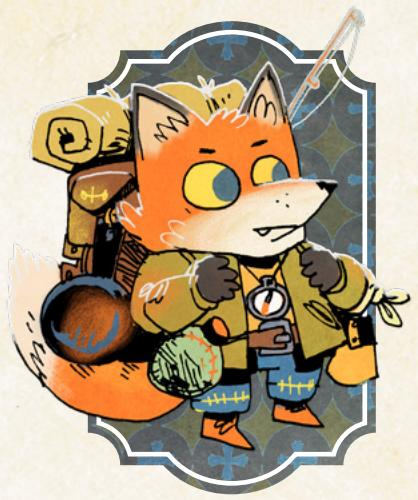

# The Prince

*You are a second-generation vagabond, heir to your parents' masteries and knowledge, but also born to this life of roguery and independence—you are not a vagabond by your own volition.*

#### Species

• fox, mouse, rabbit, bird, other

#### Demeanor

• arrogant, curious, foolhardy, brave

#### Details

- he, she, they, shifting
- bright-eyed, practical, short, simple
- trusty backpack, comfortable jacket, family compass, walking stick

#### Charm -1

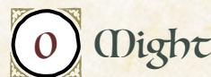

Add +1 to a stat of your choice, to a max of +2

#### Weapon Skills

Choose one weapon skill to start

- Confuse Senses
- Disarm
- Harry Parry

#### Roguish Feats

You start with Hide and Sneak. Then choose any two more roguish feats.

Equipment Starting Value 7

#### Your Nature choose one

- Scion: Clear your exhaustion track when you enter danger to attack the enemies or defend the allies of your parents.
- Trailblazer: Clear your exhaustion track when you depart on a wild and risky new course of action with others.

#### Your Drives choose two

- Protection: Name your ward. Advance when you protect them from significant danger, or when time passes and your ward is safe.
- Freedom: Advance when you free a group of denizens from oppression.
- Crime: Advance when you illicitly score a significant prize or pull off an illegal caper against impressive odds.
- Wanderlust: Advance when you finish a journey to a clearing.

#### Your Connections

See Root: The RPG page 51 for mechanical effects.

- Peer: \_\_\_\_\_\_\_\_\_\_ used to work with one of my parents and invited me to join the band when I came of age. How did I impress them with my talents?
- Family: \_\_\_\_\_\_\_\_\_\_ was mentored by one of my parents. What vagabond skills did they learn from my parents that I've always struggled to master?

{118}------------------------------------------------

#### Prince Moves

you get **heirloom weapon** & **legacy**, then choose one more

| " Heirloom Weapon Wear                                                                                                                                                                                                                                                                                                                                                                       |
|----------------------------------------------------------------------------------------------------------------------------------------------------------------------------------------------------------------------------------------------------------------------------------------------------------------------------------------------------------------------------------------------------|
| Your parents bestowed a family heirloom upon you—it has 4 boxes of wear, and whatever its Value, it is priceless to you. If the weapon is ever destroyed, the GM will tell you what tasks you must undertake to restore it.                                                                                                                                                                  |
| • Choose a weapon type: dagger, axe, hammer, sword, spear, crossbow, bow • Choose an appropriate range: intimate, close, far • Choose two features:                                                                                                                                                                                                                                 |
| " Reliable: +2 boxes of wear and an additional range. " Feared: When you engage in combat against foes who recognize this weapon, inflict morale harm on them.                                                                                                                                                                                                                         |
| " Deadly: When you inflict harm with this weapon, inflict +1 harm. " Double-Headed: One edge inflicts injury, the other exhaustion. Declare which side you are using at the start of a fight.                                                                                                                                                                                          |
| " Flexible: Choose 2 weapon skill tags for this weapon. " Unique: Your weapon is of unusual design; once per session, mark exhaustion to ignore the harm inflicted on you by a single attack.                                                                                                                                                                                          |
| " Rousing: After you successfully inflict injury on a dangerous enemy, mark wear to clear exhaustion from every ally who saw you land the blow.                                                                                                                                                                                                                                              |
| " Legacy When you meet someone important for the first time, mark your legacy track to take a 10+ instead of rolling. When your legacy track is full, tell the GM, clear the track, and roll. Take +1 for each "yes" to the following questions:                                                                                                                                       |
| • Are you in a clearing? • Do you have +2 or -2 Reputation with • Is anyone looking for you? at least one faction? On a hit, someone with unfinished business with your parents finds you. On a 10+, they arrive without warning. On a miss, an ordinary denizen warns you about someone who might seek you out; mark your legacy track.                                |
| " One of Us When you try to figure out or persuade vagabonds, bandits, revolutionaries, or outcasts, roll with Luck instead of Charm.                                                                                                                                                                                                                                                     |
| " Tall Tales When you attempt to impress a crowd with a wild story, roll with Luck. On a hit, the crowd is moved; everyone in your band takes +1 ongoing to persuade or trick someone in line with the story. On a 10+, someone foolish even approaches you with profitable work! On a miss, your stories attract someone in desperate need of help you're not equipped to give. |
| " No Jail Can Hold Me Take the roguish feat Pick Lock (it does not count against your limit). When you attempt to escape confinement, mark exhaustion to shift a miss to a 7-9.                                                                                                                                                                                                           |
| " Favored Take +1 Luck (max+3).                                                                                                                                                                                                                                                                                                                                                              |

118 Root: The Roleplaying Game

{119}------------------------------------------------

#### Background Questions

#### Why did your parents raise you as a vagabond?

 they rejected the ordinary life of a clearing of the Woodland they feared their enemies would find them if they settled down they wanted me to make my own choices free of society's influence they never fit in with the denizens they didn't know how else to live

#### What happened to your parents?

- captured by a powerful faction felled by a rival vagabond retired to a Woodland clearing missing in the forest, now presumed dead
- killed in battle by agents of a powerful faction

Which faction did your parents serve the most? (mark two prestige for appropriate group)

With faction did your parents most often oppose? (mark one notoriety for appropriate group)

Precocious, scrappy, savvy, inheritor. The Prince is a scion of a vagabond family, a second-generation rogue who has come into their own in the shadow of their parent's legacy, acquiring their skills, their tools…and their old allies and enemies.

The Prince is a younger character—not a child per se, but also not a denizen whose own adventures and accomplishments have eclipsed their parents' legacy. They are a skilled and competent vagabond! After all, they've been raised from birth to be an outlaw!

As the Prince, your Heirloom Weapon is a huge part of your character—take the time to design something that excites you and give it a cool story! Maybe that's a reliable crossbow with flexible skills your parents stole from an Eyrie weaponsmith or a deadly sword with a feared reputation they forged themselves long before the Marquisate came to the Woodland.

Your natures point to your past or your future. "Scion" activates when you engage old conflicts, protecting those who were allied with your parents and attacking old enemies. "Trailblazer," on the other hand, activates when you join, follow, or lead a group in some new, risky, and exciting direction. It doesn't have to be a literal new path—a new plan or new idea is good enough—but you have to be pursuing a new way of doing things, a new approach, a new direction, any of which comes with its own array of unknowns and new surprises.

Either way, get used to the idea that many denizens of the Woodland already think they know you. Your drives give you some goals you may choose to focus on, but you'll find no shortage of NPCs in the Woodland who think they already know what side you should be on based on how your parents handled things.

{120}------------------------------------------------

#### Notes on The Prince (Noves

For *Heirloom Weapon*, you still get your normal equipment like everyone else and your family's unique gift. Other than its unique powers, the weapon functions as normal—marking wear, engaging in melee, etc. If it's destroyed, the tasks the GM gives you might involve forging it anew, gathering information about it from allies of your parents, or traveling to a specific clearing to restore it.

- If you choose "Reliable," you must choose two ranges that work for the weapon (i.e., a sword can't be intimate and far).
- If you choose "Feared," you inflict the morale harm when you draw or display the weapon for the first time in the combat.
- If you choose "Deadly," you cannot choose to do less harm with the weapon; you must always apply your full harm to the target, including the +1 harm.
- If you choose "Double-Headed," the GM may allow you to switch your stance if you get a moment to reset your fighting stance and balance.
- If you choose "Flexible," you can choose any weapon skill tags you like; make sure you take the weapons skills as well to make use of the tags.
- If you choose "Unique," you choose to mark the exhaustion and avoid all the harm from a single attack once you know the full impact of the blow. Make sure to tell the table how your heirloom weapon helps you narrowly escape!
- If you choose "Rousing," you can activate this ability as many times in a scene as you would like, marking wear each time.

For *Legacy*, marking the legacy track means whoever you are meeting has heard of you and your parents; you can play up the connection between their faction and yourself or your parents to take the +I forward. When you mark the third box, clear the track and roll immediately. For the questions of that move, someone is "looking for you" if you've previously established in the fiction that someone—a faction, an ally of your parents, etc.—is trying to find you. The results of filling in all three boxes in a prior instance will often lead to someone "looking for you"!

For *Tall Tales*, the crowd is moved in line with your story. If you regale them with a tale of your band killing a fearsome bear, they are likely to be persuaded that you can rid them of a similar trouble; if you brag that you freed a clearing from the tyrannical Marquisate, they are likely to be tricked into thinking you are members of the Woodland Alliance. The +1 ongoing lasts until your band leaves the clearing or your tall tale is revealed to be an exaggeration. Note that your tale can be true if your band has done some exciting, wild stuff.

For **No Jail Can Hold Me**, you can mark exhaustion to shift a miss to a 7–9 when you're picking a lock, shimmying out of ropes, or making any other move designed to secure your freedom. You cannot be held by mere bonds or cages!

{121}------------------------------------------------

# The Raconteur

*You are a storyteller, making coin and earning trust by moving amid the clearings and weaving tales that ultimately teach the denizens what you want them to believe about the Woodland's goings-on.*

#### Species

• fox, mouse, rabbit, bird, weasel, other

#### Demeanor

• ingenuous, passionate, verbose, smooth

#### Details

- he, she, they, shifting
- shabby, flashy, haphazard, effete
- gold tooth, swirling cloak, homespun memento, tuning fork

#### Charm +2

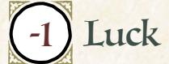

Add +1 to a stat of your choice, to a max of +2

#### Weapon Skills

Choose one weapon skill to start

- Confuse Senses
- Disarm
- Improvise
- Vicious Strike

#### Roguish Feats

You start with these: Counterfeit, Pickpocket, Pick Lock

Equipment Starting Value 8

|  | Your Nature choose one |  |  |
|--|------------------------|--|--|
|--|------------------------|--|--|

- Legend: Clear your exhaustion track when you put on a performace in front of a large, attentive audience.
- Companion: Clear your exhaustion track when you effusively praise a friend to a powerful person or group.

#### Your Drives choose two

- Discovery: Advance when you encounter a new wonder or ruin in the forests.
- Thrills: Advance when you escape from certain death or incarceration.
- Infamy: Advance when you decrease your reputation with any faction.
- Clean Paws: Advance when you accomplish an illicit, criminal goal while maintaining a believable veneer of innocence.

#### Your Connections

See Root: The RPG page 51 for mechanical effects.

- Friend: \_\_\_\_\_\_\_\_\_\_ and I still talk about the time we were run out of a clearing, even though we thought our adventures would lead the powers that be to treat us as heroes. What did we do? How did it go wrong?
- Family: \_\_\_\_\_\_\_\_\_\_\_ and I have been through battles, ruin-delves, heists, and more together. Which particular incident made us close? How did I make it famous?

{122}------------------------------------------------

### Raconteur Moves

YOU GET TOOLS OF THE TRADE, THEN CHOOSE TWO MORE

| & Gools of the Grade Wear LLL                                                                                                                                                                                                                                                                                                                                                                                                                                                                                                  |
|--------------------------------------------------------------------------------------------------------------------------------------------------------------------------------------------------------------------------------------------------------------------------------------------------------------------------------------------------------------------------------------------------------------------------------------------------------------------------------------------------------------------------------|
| You have a valued (at least to you) symbol of your skill and talent; it starts with 3 boxes of wear and whatever its Value, it is essentially priceless to you.                                                                                                                                                                                                                                                                                                                                                                |
| <ul> <li>Choose a type: musical instrument, poetry book, unique costume, stage prop</li> <li>Choose a look: battered, fancy, delicate, stained, pristine</li> <li>Choose three features:</li> </ul>                                                                                                                                                                                                                                                                                                                            |
| ☐ <b>Sturdy</b> : +2 boxes of wear; when you tend to your symbol after a public performance, clear a box of wear.                                                                                                                                                                                                                                                                                                                                                                                                              |
| ☐ Enchanting: Mark wear instead of exhaustion to add +2 when you help                                                                                                                                                                                                                                                                                                                                                                                                                                                          |
| another vagabond by distracting someone with your performance.                                                                                                                                                                                                                                                                                                                                                                                                                                                                 |
| ☐ Versatile: Choose two equipment tags for your symbol.                                                                                                                                                                                                                                                                                                                                                                                                                                                                        |
| ☐ <b>Revealing</b> : When you perform in public, mark wear to ask any one character who watched "what truly motivates your character?"; take +1 when acting on                                                                                                                                                                                                                                                                                                                                                                 |
| The answer.                                                                                                                                                                                                                                                                                                                                                                                                                                                                                                                    |
| Pleasant: When you perform for your band while <i>traveling along the path</i> , mark wear to clear up to 2 additional exhaustion from each vagabond.                                                                                                                                                                                                                                                                                                                                                                          |
| When you first put on an earnest, public performance in a clearing, roll with                                                                                                                                                                                                                                                                                                                                                                                                                                                  |
| Charm. On a hit, name a faction you flatter; an important member comes forward                                                                                                                                                                                                                                                                                                                                                                                                                                                 |
| to offer you work. On a 10+, mark prestige with their faction as well. On a miss, you                                                                                                                                                                                                                                                                                                                                                                                                                                          |
| draw the worst kind of attention to you and your friends.                                                                                                                                                                                                                                                                                                                                                                                                                                                                      |
| ☐ Adoring Fans                                                                                                                                                                                                                                                                                                                                                                                                                                                                                                                 |
| When you <b>first enter a clearing</b> , roll with Charm. On a hit, a fan recognizes you; they relate gossip, offer a place to stay, and show your band around. On a 10+, your fan will go even further to help you. On a miss, you meet a fan with good intentions who immediately makes your situation much, much worse.                                                                                                                                                                                                     |
| ☐ All Eyes on Me                                                                                                                                                                                                                                                                                                                                                                                                                                                                                                              |
| When you <b>create</b> a <b>distraction through outlandish performance</b> , mark exhaustion and roll with Charm. On a hit, the room can't look away; your allies take +1 ongoing to <i>Sneak</i> , <i>Hide</i> , <i>Pickpocket</i> , or <i>trust fate</i> while you perform. On a 10+, hold I; spend the hold to grant an ally a +3 for one of the aforementioned rolls instead. On a miss, your audience finds something about your performance insulting or misguided; they fall over themselves to give you their opinion. |
| Quick Fingers, Quicker Eyes When you read a tense situation while performing, you may always ask one question, even on a miss.                                                                                                                                                                                                                                                                                                                                                                                                 |
| □ Silver Gongue                                                                                                                                                                                                                                                                                                                                                                                                                                                                                                                |
| When you <i>persuade an NPC</i> with a colorful anecdote, mark exhaustion on a hit to make them reveal something important and relevant about the situation.                                                                                                                                                                                                                                                                                                                                                                   |
| □ Sweet as honey                                                                                                                                                                                                                                                                                                                                                                                                                                                                                                               |
| Take +1 Charm (max +3).                                                                                                                                                                                                                                                                                                                                                                                                                                                                                                        |
|                                                                                                                                                                                                                                                                                                                                                                                                                                                                                                                                |
| 122): Root: The Roleplaying Game                                                                                                                                                                                                                                                                                                                                                                                                                                                                                               |

{123}------------------------------------------------

#### Background Questions

| Where do you call home?                                           | Whom have you wronged and how?                               |
|-------------------------------------------------------------------|--------------------------------------------------------------|
| " clearing                                                     | " a lover, with my words                                  |
| " the forest                                                   | " a friend, with my actions                               |
| " a place far from here                                        | " an innocent, with my silence                            |
| Why are you a vagabond? " I want to see all of the Woodland | " an ally, with my inaction " a sibling, many times |
| " I want to find a worthy hero to write                        | Which faction have you served                                |
| about                                                             | the most? (mark two prestige for                             |
| " I want to witness a legendary                                | appropriate group)                                           |
| moment firsthand                                                  | With which faction have you earned                           |
| " I want to find the kind of true love                         | a special enmity? (mark one notoriety                        |
| found in epic poetry                                              | for appropriate group)                                       |
| " I have been run out of too many                              |                                                              |
| clearings to stay still                                           |                                                              |

Dashing, adroit, distracting, audacious. The Raconteur is a performer and a storyteller, a vagabond who shapes the future of the Woodland with a song or story.

The Raconteur is a lover, not a fighter. They would far rather sing a song than swing a sword! That doesn't mean the Raconteur is a pushover; they can fight like any other vagabond and also shape public opinion, their performances impacting how the denizens think about the events of the Woodland.

The symbol of your skill is a crucial part of your character. When you get out your symbol, everyone knows you're about to launch into a performance! Take some time to work out both what it is and how you got it. You might have a versatile, revealing, and delicate costume you created yourself as you taught yourself your trade, or a battered book of pleasant and enchanting poetry that you were given as a young student in a faraway land. Either way, declaring how you obtained both your skill and your symbol is crucial to fleshing out your character.

Your natures, "Legend" and "Companion," both give you an excuse to show off your talent. "Legend" puts the focus on your performance, assuming you can gather a large audience. "Companion" requires smaller audiences and a less extravagant production, but you still need to put on a show to talk up a friend in a meaningful way, one that endears your subject to the targeted person or group.

Your drives should remind you that you must create stories to provide the best performances! Likely some part of why you are a vagabond is to be in the thick of it, participating in and witnessing firsthand the escapades of heroic figures so you can memorialize them later (perhaps with a bit of embellishment).

{124}------------------------------------------------

#### Dotes on The Ranconteur Moves

For *Tools of the Trade*, you still get your normal equipment like everyone else; your symbol of your skill and talent is in addition to your regular gear.

- If you choose "Sturdy," it only takes you a few minutes to tend to your symbol and clear I-wear: cleaning your instrument or costume, storing a book, etc.
- If you choose "Enchanting," you are far better at *helping* with distracting performances; you don't mark exhaustion when you mark wear, and you add +2 instead of +1. If you want to conceal your aid or interference or create an opportunity or obstacle in addition to adding +2, you must mark exhaustion.
- If you choose "Revealing," the bonus lasts until you leave the clearing or the denizen's motivation changes substantially.
- If you choose "Pleasant," you can perform for your band no matter which option your band chooses for traveling. You clear the exhaustion after all other costs are considered, which means that someone might mark 2-exhaustion for traveling and then immediately clear that 2-exhaustion thanks to your performance.

Anyone who offers you work after a public performance hails from the faction your performance flattered. The performance can't be merely ironic or silly; it's got to be an earnest attempt to convey your artistic intent, even if that intent is satirical towards one faction and complimentary towards another.

For *Adoring Fans*, the move triggers the first time you enter a clearing. You've got to leave the clearing for some time before the move triggers a second time—going for a walk in the woods for a few hours and coming back doesn't count as "first entering a clearing." On a weak hit, your fan will do everything a friendly host would do...but they aren't going to take any risks, like breaking the law or hurting someone, to help you. On a 10+, they are willing to do much, much more, however, even to the point of putting themselves in danger.

For *All Eyes on Me*, note that you can't put on an earnest performance (*Tools of the Trade*) and a distracting, outlandish performance at the same time. You decide who your allies are that receive the +1 ongoing while you perform, and you must spend your hold—granting the +3—before that particular ally rolls.

For *Quick Fingers, Quicker Eyes*, your performance can be small or more intimate; you don't have to be engaging in a large, public performance to ask your additional question.

For *Silver Tongue*, the colorful anecdote can't be a trick unto itself, even if the story isn't true or factual; you're *persuading* someone with a story, not *tricking* them into doing what you want. You can say "Oh, I've fought plenty of bears before!"—and regale someone with tales of your adventures fighting those bears—to *persuade* them to let you hunt down a bear for them, but you can't use this move to *trick* them into thinking you're "Edgar Bearsbane, the famous slayer of bears."

{125}------------------------------------------------

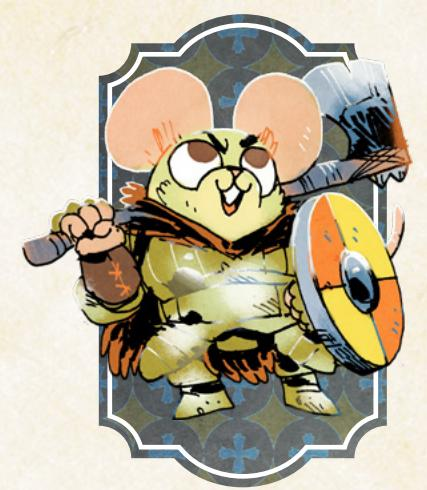

## The Raider

*You are a bandit, a thief-by-force, dangerous and threatening, but perhaps with the capacity to turn your axe to good use...and all the better if you get paid for it.*

#### Species

• fox, mouse, rabbit, bird, other

#### Demeanor

• intimidating, jovial, curt, curious

#### Details

- he, she, they, shifting
- well-groomed, huge, scarred, lean
- sigil pendant, dark cloak, face paint, sentimental talisman

#### Charm 0

Add +1 to a stat of your choice, to a max of +2

#### Weapon Skills

Choose one weapon skill to start

- Cleave
- Confuse Senses
- Storm a Group
- Vicious Strike

#### Roguish Feats

You start with these: Acrobatics, Blindside

Equipment Starting Value 9

| Your Nature choose one |  |  |  |
|------------------------|--|--|--|
|------------------------|--|--|--|

- Bandit: Clear your exhaustion track when you try to use the threat of force to secure valuables from formidable opposition.
- Hero: Clear your exhaustion track when you outright attack a dangerous, oppressive, or villainous NPC.

#### Your Drives choose two

- Loyalty: You're loyal to someone; name them. Advance when you obey their order at a great cost to yourself.
- Chaos: Advance when you topple a tyrannical or dangerously overbearing figure or order.
- Crime: Advance when you illicitly score a significant prize or pull off an illegal caper against impressive odds.
- Greed: Advance when you secure a serious payday or treasure.

#### Your Connections

See Root: The RPG page 51 for mechanical effects.

- Protector: The first time I saw \_\_\_\_\_\_\_\_\_\_\_\_ they piqued my curiosity; I went out of my way to protect them from the ire of my own band. What about them sparked my loyalty?
- Watcher: \_\_\_\_\_\_\_\_\_\_\_\_ bested me in combat when I got out of hand. How? Why did I thank them for it?

{126}------------------------------------------------

#### Raider Moves choose three Eye For Battle When you *read a tense situation* just as violence breaks out, roll with Might instead of Cunning. Ironhide When **a group inflicts harm on you**, suffer 2 fewer harm from each attack (minimum 1-harm); when you inflict harm on a group, inflict 1 additional harm. Loot and Plunder When you **loot a rich area for valuables**, roll with Finesse. On a hit, something out of the ordinary catches your eye; claim it and it's yours. On a 10+ all 3. on a

- 7-9 choose 1: • It is worth a lot of money (+2-Value)
- It is of special value to a particular faction (+4 prestige if traded to them)
- It is extremely durable (+1-wear)

On a miss, you can get your hands on it, but it is sought by dangerous denizens who are all too willing to kill to take it from whoever possesses it.

#### Merciful Might

When you **try to befriend an NPC you've saved from the wrath of another**, spend time helping them further (mark exhaustion) or buy them a drink (mark depletion). Your continued kindness pays dividends; they'll share a valuable secret or grant you a serious favor.

#### Plan of Attack

When you **work out a plan of attack with someone**, roll with Might. On a 10+, hold 3. On a 7-9, hold 2. You can spend your hold 1-for-1, regardless of distance, while the plan is being carried out to:

- Lend a hand; add +1 to someone's roll (choose after rolling)
- Soften a blow; reduce by one the harm someone suffers from a single attack
- Ensure your gear holds; allow someone to ignore marking depletion or wear On a miss, hold 1, but your plan encounters some disastrous opposition right from the start.

#### Fearsome Visage

You can *make a pointed threat* or *publicly draw attention to yourself* as an enemy of a faction when you have a Reputation of 0 or lower with that faction, not just the usual -3 or -2 reputation required. Remember, you roll as if your negative reputation was positive, so a -1 Reputation becomes a +1 for the roll and a 0 remains a 0.

{127}------------------------------------------------

#### Background Questions

| Where do you call home?                                                                                                                                                                   | Whom have you left behind?                                                                                                                                                                       |
|-------------------------------------------------------------------------------------------------------------------------------------------------------------------------------------------|--------------------------------------------------------------------------------------------------------------------------------------------------------------------------------------------------|
| " clearing " the forest " a place far from here Why are you a vagabond? " I am feared by most denizens                                                            | " my mentor " my ward " my loved one " my sibling " my best friend                                                                                                    |
| " I wish to see all the Woodlands have to offer " I refuse to serve someone unworthy " I seek to overthrow all oppressors " I am running from powerful enemies | Which faction have you served the most? (mark two prestige for appropriate group) With which faction have you earned a special enmity? (mark one notoriety for appropriate group) |

Rough, pragmatic, threatening, dangerous. The Raider is a bandit of the Woodland, a brigand who takes what they want by the sword, forgoing stealth and guile in favor of raw force.

The Raider is an aggressive fighter. They are as strong as some of the other martial vagabonds—the Arbiter, the Ronin, the Champion—and they have moves like *Plan of Attack* and *Fearsome Visage* that allow them to set the conflict on their terms, leaving even the strongest forces vulnerable and exposed. Woe to any opposition that underestimates how much damage the Raider and their allies can do!

As the Raider, you can strike some heavy blows against even the most dangerous opposition, but you've got to decide whose side you're on. Do you want to forge an alliance with a faction that pays well and stays out of your way? Or do you want to keep things even, seeking a balance with all the factions of the Woodland War in the hopes they worry about bigger problems? Do you fight for someone else or yourself?

Your natures, "Bandit" and "Hero," give you the option of affirming what others think of you or attempting to rise above your baser instincts in the service of others. "Bandit" rewards you for attempting to seize valuables from real, dangerous opposition—a whole unit of Marquisate soldiers, for example—while "Hero" incentivizes you to take the side of the vulnerable. The latter may still turn a profit if the dangerous or villainous NPCs have valuables for you to seize, but it's not guaranteed! Either way, you don't have to win either fight to activate your nature; clear your exhaustion when you make the attempt!

{128}------------------------------------------------

That said, the Raider tends to come across as a villain themselves, even when they mostly target the powerful and cruel. Look to your connections and drives to find reasons to restrain your violence productively and work with your band to accomplish objectives greater than mere banditry. After all, there will be plenty of loot along the way!

#### Notes on The Raider Moves

For *Eye for Battle*, you can be the reason that violence is breaking out—just tell the GM you want to *read a tense situation* as you throw the first punch.

For *Ironhide*, you're much more effective fighting groups than any other vagabond; the harm the group inflicts on you is reduced greatly, but it's still a minimum of 1-harm. Your harm is also increased; you inflict one additional harm that can be further raised by choosing an option like "inflict serious (+1) harm." A group has to consist of at least five opponents to count as a group (see Root: The RPG, page 214 for more on groups).

For *Loot and Plunder*, you're taking stock of an area you've already gained access to or captured, looking for valuables a cut above the ordinary spoils. On a hit, the GM will tell you what you find, including the Value and wear of the item. If you choose that it's worth a lot of money or is extremely durable, add Value or wear to whatever the GM told you; if you choose that it's of special value to a faction, you can gain +4 prestige with that faction for returning the item to them.

For *Merciful Might*, you mark the exhaustion or depletion after you save the NPC, further spending time helping them out or buying a drink. If you don't have the time (or money) to spend, you can't trigger the move.

For *Plan of Attack*, you can't invoke any of the benefits for yourself, but you can spend your hold at any time during the plan's execution to help any ally—even an NPC—involved in the plan; tell the GM how your planning improved your ally's chances of success or helped them avoid a cost.

For *Fearsome Visage*, you usually can't even trigger *make a pointed threat* or *publicly draw attention to yourself* until you have an appropriately negative Reputation; this move allows you to make those moves with a –1 or +0 Reputation because you are so well known as a threat to any faction that doesn't see you positively.

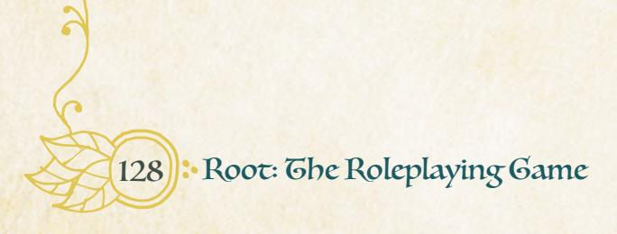

{129}------------------------------------------------

# The Seeker

*You are an explorer by nature, interested in freeranging discovery, delving into ruins, and uncovering whatever secret wonders and ancient truths lie hidden amid the Woodland.*

#### Species

• fox, mouse, rabbit, bird, mole, other

#### Demeanor

• absentminded, driven, jovial, quiet

#### Details

- he, she, they, shifting
- honest, traveled, whimsical, young
- trusty satchel, large and grandiose hat, book of stamps, sturdy boots

#### Charm -1

Add +1 to a stat of your choice, to a max of +2

#### Weapon Skills Choose one weapon skill

to start

- Confuse Senses
- Disarm Parry
- Trick Shot

#### Roguish Feats

You start with these: Acrobatics, Disable Device, Pick Lock

Equipment Starting Value 8

| Your Nature choose one |  |  |  |
|------------------------|--|--|--|
|------------------------|--|--|--|

- Explorer: Clear your exhaustion track when you enter a ruin or other dangerous area of the forest.
- Historian: Clear your exhaustion track when you refuse to allow someone to cover up or obscure the truth.

#### Your Drives choose two

- Justice: Advance when you achieve justice for someone wronged by a powerful, wealthy, or high-status individual.
- Discovery: Advance when you encounter a new wonder or ruin in the forests.
- Greed: Advance when you secure a serious payday or treasure.
- Wanderlust: Advance when you finish a journey to a clearing.

#### Your Connections

See Root: The RPG page 51 for mechanical effects.

- Partner: \_\_\_\_\_\_\_\_\_\_\_\_ and I have seen the wonders of the Woodland together. What makes them a stalwart companion on my travels?
- Peer: \_\_\_\_\_\_\_\_\_\_\_\_ is famous for a discovery of their own. I greatly respect them! What did they discover? How?

{130}------------------------------------------------

### Seeker Moves

you get **word on the street**, then choose two more

#### Word on the Street

When you **spend time in a clearing talking with locals**, roll with Finesse. On a hit, you catch wind of a nearby unexplored wonder or ruin; someone promises to take you to it for a fair fee (1-Value). On a 7-9, the dangers make their price steeper—an additional 1-Value of coin or gear. On a miss, the location is under threat—soon it will be plundered, destroyed, or claimed by another power.

#### Never Lost

Take two additional boxes of injury and depletion you can mark when you confront dangers within a ruin and a +1 ongoing to *trusting fate* and **performing roguish feats** while exploring such ancient locales.

#### Treasurer Hunter

When you **sell the treasures you found in a ruin** at market, roll with Cunning. On a hit, you find some buyers. On a 7-9, take 1. On a 10+, both:

- You get a good price; you get double what such findings are usually worth
- You are popular; mark two prestige with the controlling faction On a miss, you still sell the items for a fair price, but someone powerful takes offense at your plunder of such sacred sites.

#### Adventurer Contract

When you **try to convince a powerful NPC to supply an exploratory adventure**, roll with Cunning. On a hit, they give you 8-Value in resources and depletion—but you must fulfill a request. On a 10+, they ask for something general—more riches, information, a prize or trophy. On a 7-9, they want something specific—a singular treasure, secret knowledge, a lost ritual. On a miss, they mount a competing expedition based on what you have told them.

#### Watch the Signs

When you **first attune yourself to a ruin or mysterious site** by taking in its signs, symbols, particular traits, and layout, roll with Cunning. On a 10+, hold 3. On a 7-9, hold 2. On a miss, you may mark exhaustion to hold 1. While within that ruin or mysterious site, you can spend your hold 1-for-1 to:

- Identify the quickest path to the closest valuable treasure or knowledge
- Disarm a trap or overcome a natural hazard without cost
- Name a character within reach about to suffer harm; you suffer it instead
- Name a character in the ruin; you cross the distance to them instantly
- Take cover in the ruin; ignore all harm from a single attack or catastrophe

#### Unstable Ground

When you use a rough or chaotic environment—slippery rocks, a crowded market, etc.—to gain an advantage over your opponents in a fight, you can *grapple with them* using Finesse instead of Might.

{131}------------------------------------------------

#### Background Questions

| Where do you call home?                                                                                                               | Whom have you left behind?                                                                              |
|---------------------------------------------------------------------------------------------------------------------------------------|---------------------------------------------------------------------------------------------------------|
| " clearing " the forest " a place far from here Why are you a vagabond?                                             | " my family " my spouse or loved one " my best friend " my fellow explorer         |
| " I want to wander the Woodland. " I'm seeking answers to a mystery " I need to find and reconnect with a loved one | " my idol Which faction have you served the most? (mark two prestige for appropriate group) |
| " I am pursuing a treasure " I stole and sold something precious from someone dangerous                                   | With which faction have you earned a special enmity? (mark one notoriety for appropriate group)   |

Obsessed, prepared, experienced, perceptive. The Seeker is an expert on the ruins and mysteries of the forest, an excavator of old treasures and forbidden places who seeks riches and answers in equal measure.

As the Seeker, you've got a bunch of useful skills for getting into difficult places, whether you're gaining entrance to an ancient Eyrie ruin or breaking into a vault in a Marquisate-controlled clearing. You're also pretty good at *trusting fate* to see you through difficult times! Some may see you as nothing more than a glorified tourist, but you're a vagabond through and through, capable of the same amount of trouble as any other outlaw!

That said, your focus is always going to be the ruins and mysteries of the forest. One of your natures—"Explorer"—points directly at the ruins, and *Word on the Street* allows you to hear of nearby sites when you get some time to talk to the locals. Most of your other moves also give you unique abilities inside and around ruins, and you can usually create all manner of profitable opportunities for your band. But your other nature—"Historian"—points to a deeper truth: you seek knowledge and answers about the Woodland, the truth behind the ruins and mysteries of the forest. You know that there are secrets hidden everywhere, both in the ruins and in the clearings, that must be exposed. You and your band are some of the only denizens that can stand up to those who would cover up or obscure the truth!

Your drives are all designed to help further point at the reasons why you seek answers—is it greed? Is it curiosity? Is it just a general desire to see and do new things? Pick the drives that most satisfy your reasons for delving into ruins and other places you shouldn't go.

{132}------------------------------------------------

#### Notes on The Seeker Moves

For *Word on the Street*, you need to spend a bit chatting with locals to trigger the move. It's possible you could find the local wonder or ruin on your own, but paying the fee ensures you get there quickly and without issue. On a miss, you might still be able to hire someone to take you to the site, but you'll have to negotiate a fair price.

For *Never Lost*, you don't have to transfer any injury or depletion you marked in these boxes when you leave a ruin, and those boxes go away; they represent your ability to navigate the ruin and acquire resources within it. The next time you enter a ruin, you get two cleared boxes of injury and two cleared boxes of depletion, no matter what you marked in the last ruin.

For *Treasurer Hunter*, the buyers might be the wealthy elites of a clearing looking for treasures worthy of their status or ordinary denizens who wish to recover their own heritage from the ruins. Either way, a hit means everyone is happy with the sale and eager to pay extra or award you prestige; a miss means you still get paid—less than you would on a hit—but someone isn't happy with your entrepreneurial spirit.

For *Adventurer Contract*, your benefactor's request is determined by how strong a hit you get. A weaker hit means a more specific request; a strong hit means something more general and easier to obtain or deliver. If you don't honor the request on and after your expedition, the NPC will take action in accordance with their nature…up to and including attempting to murder those vagabonds who made promises they didn't intend to keep!

For *Watch the Signs*, it doesn't take long to attune to a ruin or mysterious site; a few minutes is usually enough if you're able to concentrate and stay alert. The benefits happen immediately—and in full—when you spend hold: if you "cross the distance" to someone else in the ruin, for example, you take a shortcut that gets you there instantly, and if you "disarm a trap without cost," you shut it down without marking depletion, injury, or exhaustion.

For *Unstable Ground*, the environment has to be chaotic enough to knock your opponent off balance. A room that's on fire is plenty tumultuous, but a lightly attended town meeting is not, even if it's held in a small or cramped room.

{133}------------------------------------------------

{134}------------------------------------------------

ou can easily play a single game of Root: The RPG and have a satisfying, heroic, charming, and brilliant adventure. But the game comes alive when you play a full campaign, when the

madcap antics of your last adventure have real consequences, when the powerful factions of the War aren't just immovable forces, but actually come to notice the vagabonds and care about them—for good or ill.

The core book for Root: the RPG contains plenty of guidance for playing a satisfying campaign of Root: The RPG. This chapter is about expanding that information and providing still more tools to bring your version of the Woodland to life for many sessions.
