### The First Session

Every campaign of Root: the RPG starts with one session. Running a good first session is key to getting players invested in your Woodland and creating good inciting incidents from which a whole campaign will flow. The tips here can be useful when you're only playing a single session, but they're primarily focused on helping you set up a strong start to a campaign.

#### Before the First Session

There are a few things you need to do before your first session:

First, make sure you've read the core book. Players can probably get away with reading only Chapters 2-5, but if you're running the game, you should really read the whole thing. Don't worry about memorizing everything—just make sure you have some idea where to find things in the book when you need to look them up!

Second, make sure you have the needed materials. You need all the playbooks you're using—printed if you're playing in person or available online if you're playing digitally. You want the full set of moves sheets, including the basic moves, the weapon skill moves, the reputation moves, and the travel moves. If you're playing a one-shot game without much use for Reputation or travel, you might eschew those.

Third, make sure you know your location. Start with a few details about the clearing or ruin where you're starting. If it's a clearing, include details about some of its major figures and conflicts. If it's a ruin, think about whose ruin it is, what is valuable about it, and why you're picking up there. For a long-term game, get a map of the Woodland (Root: The RPG core book, page 225), premade and ready to put in front of players.

るが、このでは、一番「これでは、一番」という。

{135}------------------------------------------------

#### Starting the First Session

**First, explain a bit about your Woodland and starting clearing**. You might work with your players to decide which factions you're playing with, or you might have already decided on the factions you want to see in your game. Either way, this is the time to tell the players a bit about the Woodland overall, about how the War has progressed in this version of it, and about which factions are at play and where they hold power. Use the Woodland map to support your discussion as you go, and provide your players with a few details about the clearing or ruin where you're starting. That way, players can make PCs who fit your Woodland and the starting situation.

**Second, make characters**. Spread out the playbooks if you're in person, and go through them one by one, explaining a smidge about them. Let each player take the one that most interests them.

Then, give the players some time to create their characters, filling out each section. Make sure you're available to answer questions as they come up, and to guide the group through the process, explaining what they should be doing next and what decisions they should be making. Encourage the players to discuss their choices out loud to build up excitement, but don't put pressure on anyone—it's fine if they make characters with their heads down and share a bit later in the process.

Players should fill in everything except for their connections before the next step.

**Third, introduce the characters to each other**. Go through the players one by one, having each player introduce their character, saying their name, describing what the others see when they look at the character, and explaining a bit about the character's background and interests. Ask probing questions the whole while—help the players fill in details and create interesting new facets with leading questions like "Why does the Marquisate care so deeply about the crime you committed?" or "What was the last thing you and your parents angrily said to each other before you left to be a vagabond?"

**Fourth, fill in the connections**. Go back through the players, having them each choose one connection and fill in the name of another PC. Ask questions to help flesh out their relationship. Once every PC has one connection, go back through again, filling in the second connection.

{136}------------------------------------------------

#### During the First Session

Your goals during the first session are these:

- Build on the decisions the players have made during character creation
- Get to know the vagabonds through their actions and interactions with each other and the clearing
- Set the stakes for the Woodland War and the struggle between the factions
- Go through the basic moves and several of the other mechanics of the game (definitely Reputation at least)
- Create an interesting inciting incident to lead to more adventure

After your players have made their characters and connected them to each other, take a break. While your players have a snack or use the restroom, look at your preparation for your starting place, be it a clearing or a ruin. If any changes occur to you to hook into the PCs and their issues, ways to introduce NPCs who matter to them, or objects they care about, make those changes. When your players come back from their break, make sure you speak a bit about why the PCs are going to this location—looking for treasure in a ruin, hoping to repair equipment at a clearing (and likely needing to start with some depletion or wear marked, see below), etc.

Dive into the game with the vagabonds arriving at the location. If it's a clearing, make sure they get some sense of the clearing's main problems and issues immediately, whether through an incident they witness (and might intercede in) or by being approached quickly by an NPC who would like to hire their services. Involve them in the clearing's issues; entice them with beds, food, gold, and equipment if need be. Play on any personal relationships or connections to the clearing as well.

If it's a ruin, dive into play as more of a romp through a potentially dangerous place. Make sure the ruin isn't devoid of NPCs—another group of vagabonds, bandits, soldiers, grave robbers, treasure hunters, refugees, etc. The ruin itself can be a physical threat, but without NPCs to interact with and provide a different kind of tension, ruins often run flat quickly. It's hard to *persuade* and *trick* NPCs—or *engage them in melee*—if there aren't any around!

If you want to make sure the cycle of play is accelerated into action, then start your PCs with a few boxes of their harm tracks marked—three to six total boxes per PC, spread among their exhaustion, injury, and depletion tracks. If you would like their equipment to start somewhat dinged up, then have them mark 2-wear total on whatever equipment they choose, in addition to the harm.

{137}------------------------------------------------

#### One-Shot Gips

If you are playing a one-shot—meaning a single session of the game, intended to stand alone—you can either treat your session as if it were the first session of a whole new campaign, or you can play it as a more directed, singular game.

A "one-shot as first session" follows many of the same tips and ideas in this section, excepting anything forward looking—no reason to think about what happens next or the consequences of the PCs' actions when there is no second session!

A "directed one-shot" means you have a much stronger, tighter situation. You not only tell the PCs that they are arriving in Bennary Field, but you also tell them that they are arriving after having barely escaped the nearby Marquisate prison, and they are looking for a way to get to safety. The immediate reasons the PCs are in this situation are pre-chosen and very clear. That way, you can also predict when the session has met its ending—when that initial situation is resolved for good or ill. If the prison escapees are captured again, then the one-shot is over, same as if the prison escapees successfully ditch their pursuers and trek away into the Woodland.

Either way, don't expend unneeded effort on one-shots. For example, if you're just playing a one-shot, you don't need a map of the whole Woodland; you can just use a few details about the one or two places where play will take place.

<u></u>

Starting the vagabonds with no harm marked is also an option—it just means they won't be under the gun for a little while, as they have plenty of ways to absorb consequences on their myriad harm tracks. They'll get to be awesome and exciting from the start, and they'll feel like they get away scot-free (until they realize that they're out of harm to mark and up against real trouble).

During the first session, make sure the players collectively encounter the following mechanics:

- Every basic move, at least once
- Prestige or notoriety gain
- Marking harm tracks and the use of nature to clear exhaustion
- Drives and advancement

{138}------------------------------------------------

#### Key Beats

Here are some other key things to strive for during your first session, ideas and moments that will help make for a solid first experience for your players:

- Engage in action
- Offer up opportunities to trigger drives and natures
- Ask questions constantly
- Call out moves when they happen
- Offer moves when the players flinch
- Frame scenes with multiple PCs
- Give them a chance to be awesome

#### **ENGAGE IN ACTION**

Having action scenes—not necessarily combat, but action—in your first session of **Root**: **The RPG** is practically a must. The vagabonds get a chance to show off their myriad skills for getting into and out of dangerous situations, and you get to have a thrilling, over-the-top encounter. So make GM moves to escalate to the point of action, of vagabonds racing around, diving out of windows, wielding swords, and so on.

#### OFFER UP OPPORTUNITIES TO TRIGGER DRIVES AND NATURES

Throughout a campaign of **Root: The RPG**, you'll be providing opportunities for PCs to hit their drives and natures. But it's especially important to at least show the PCs how those systems work so they can also participate in pushing towards those triggers. You don't have to provide a chance for every single PC to hit every single drive and nature, but you should try to hold them in your head, and make GM moves towards a few drives and natures a bit more aggressively than you might otherwise.

#### **ASK QUESTIONS CONSTANTLY**

When you start a game of **Root**: **The RPG**, there are plenty of holes, blank spaces left throughout your fictional world and the backstories of the PCs. Ask questions constantly to fill in those holes! And use leading questions, pointed questions that aren't just entirely open-ended. When a PC comes into the tavern, ask "What impression would the taverngoers have of you? What music would be playing on the soundtrack?" When they speak to the bartender, ask "You've probably met this denizen before, right? Are you good buddies? Why?" You'll flesh out your world far more quickly than you think.

{139}------------------------------------------------

#### **Call Out Moves When They Happen**

As the GM, you're probably the most familiar with the rules of the game. You can help all the other players get used to the rules by calling out moves and triggers when they happen. Over time, players will learn to call out moves themselves, to say, "I want to *trick* him," prompting you to ask, "Okay, how do you do that?" But in that first session, the phrase "It sounds like you're trying to [trigger x move]…" is going to be one you utter a lot. That's great! It helps prime everyone to see what triggering a move looks like, and to think about the moves during play.

#### **Offer Moves When the Players Flinch**

Sometimes, especially in that first session, players can feel stymied, confused, unclear on what they can or should do. Help them out! Suggest that they might want to get more information by *figuring someone out* or *reading a tense situation*. Point out that they could get past the guard by *persuading* her, *tricking* her, maybe even vaulting over the wall by *attempting a roguish feat*. When the players are still learning the game, it helps to have someone familiar with the rules and the possibilities prompt some of the action.

#### **Frame Scenes with Multiple PCs**

It can be easy for vagabonds to start pursuing their own goals or desires, splitting up and doing their own thing. When you frame scenes as the GM, you can say who is present in the scene—and that means you can help combat this impulse to split up. Frame scenes with multiple PCs present so that they have a chance to interact, speak to each other, learn about each other, and help each other out! It helps you share the spotlight between them and build the group as a band.

#### **Give Them a Chance to Be Awesome**

The easiest way to get players quickly into the mindset of Root: The RPG is to let them play with their abilities, expertises, and action-oriented moves. Putting them into dangerous situations where they take action, trick or talk their way out of trouble, and otherwise pull out all their tricks is a good idea! They'll take actions that can have consequences in the next session and beyond, giving you plenty to play with for the campaign, while having an awesome adventure up front.

{140}------------------------------------------------

### After the First Session

When you're done with the first session of a campaign, take a look at your notes. Take a look at the NPCs you've developed, the events that occurred, the factions at play, the nature of your clearing. Start percolating on how things will play out next, based on the vagabonds' actions. You can draw on the PCs' backstories, but that might come more easily down the line—for now, make sure that what the vagabonds do *matters* and really changes the fiction.

In many first sessions of Root: The RPG (and one-shots, as well), PCs play fast and loose, causing chaos, setting fires, butting right into dangerous foes without any hesitation. They play like action adventurers! The key to thinking about your next session is to really extend the natural consequences of those actions, good and bad.

If the PCs saved someone from prison, that character probably feels indebted to them and may offer them aid or a reward…but only if the vagabonds can retrieve the reward from where it's held in a faction's storehouse. If the PCs fought and defeated a powerful member of a faction, then that character will come back after them, hunting them, determined to redeem themself! If the PCs caused major damage to a clearing, then its denizens will be in real trouble…they may come after the PCs in anger or plead with the vagabonds for aid.

Think about how the PCs' actions changed the situation in myriad ways, and who all would be interested in those changes, whether supporting or undoing them. That will give you plenty of ideas to draw on for new troubles, problems, and characters to introduce in future sessions.

You can also take this time to start looking into the larger faction mechanics ([page 182\)](#page-182-1) or the character-specific campaign mechanics [\(page 150\)](#page-150-1) and prompt further new surprising and interesting things. The first session is the inciting incident of your entire campaign, the start of your vagabonds' story! Make it count!

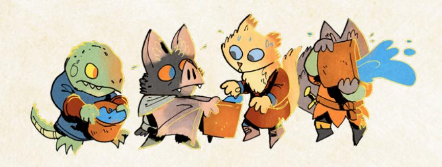

{141}------------------------------------------------

### During the Campaign

As you play out the campaign, your most important job as the GM is to maintain and support the campaign by using all the myriad tools and systems built into Root: The RPG. Internalize your agendas, your principles, and your moves, and always play to them (page 196 of the core book). Use the random generators to create new requests, new rumors, and new events to spice up your play (page 236 of the core book or 160 of this book). Use the faction mechanics [\(page 182](#page-182-1) of this book) to have the factions change the Woodland and progress the War. GMing a game of Root: The RPG is much more about using these systems wisely than about coming up with a big story for the vagabonds, and you'll find yourself well-supported with all of the general tools throughout this book and the Root: The RPG core book.

Here are a few additional principles and ideas that can help you build an amazing campaign while you honor those existing systems:

### Watch for Recurring Places and Characters

The Woodland that you create has twelve clearings. In all likelihood, the vagabonds won't even visit all twelve, let alone become invested in each one. They will invest a lot of time, effort, and emotion in one or two clearings, and those should be the focus of play. The other clearings can make great settings for periodic missions, quests, or events, but the vagabonds will likely always choose to return to their most important clearings.

You don't have to force the issue—just follow the vagabonds wherever they choose to go—but if the vagabonds pay a lot of attention to a particular clearing, that's a signal that you should, as well. That clearing is now a more important place, and keeping an eye on it, its issues, and the ways that it changes becomes all the more important. Your effort is far better spent focusing on those important clearings than trying to fully map out all conflicts and nuance across all twelve.

Similarly, pay attention to the NPCs that the vagabonds pay attention to. If the PCs focus on a foe from their past, then that foe is worth bringing back time and again. If the PCs focus on some random sergeant they made enemies with in the very first session, then that sergeant should recur as well, perhaps even moving up the faction ranks to become more and more dangerous. If the PCs try to protect and aid a local blacksmith, then that blacksmith might in turn become a frequent face, whether because the blacksmith also rises to prominence as a leader in their clearing, or because they start traveling between clearings, encountering the PCs the Woodland over.

{142}------------------------------------------------

Any NPC the PCs pay close attention to becomes a good choice for you to invest your off-screen thinking and preparation. You never plan any specific plots or tracks of events—but you can plan on a given NPC arriving in a new clearing, or creating a new complication or set of problems, or hunting the PCs. Your stable of recurring NPCs becomes a great choice for hard moves, as well—a recurring foe can always arrive where least they're wanted as a hard move, and a recurring ally can be put in danger or captured.

### Give Their Actions Weight

The principles, moves, and agendas for GMing (page 196 of the core book) all guide you to this place, but it's worth emphasizing again—the vagabonds' actions should have real weight upon the Woodland. The factions and their War are huge, dangerous, and difficult for any individual to influence. But the vagabonds are heroes and larger-than-life figures, in the end—if any individual has the power to affect the factions, to change the course of the War, it's them.

Honor their actions, their fights, and their words. What they do always has consequence, and the more you can build off that consequence, the better. If they encourage and help a denizen to become a leader to their community, then that leader actually takes up the vagabonds' words and encouragement as best they can—albeit not without problems. If they casually break into a prison or defeat a whole guard station, then the faction in charge of those forces responds with fear and caution, amping up its defenses substantially to actually honor the threat the vagabonds proved themselves to be.

The more often a consequence or change to the Woodland points back to something the vagabonds actually did, the better. Always be looking to tie things back to how the vagabonds' own actions led to the current situation, for good or for ill.

### Make Time Pass

Root: The RPG can flow forward as an endless string of events, one after another, always with plenty to pay attention to and focus on. There's always another adventure, another threat, another escapade. You can fall into the temptation of constantly following the PCs, almost without a break, just watching their lives flow by from hour to hour.

Break up that flow; use time jumps to allow the world to move forward, to grow and change, to have the consequences of the vagabonds' actions actually come to the fore and to have the Woodland War advance. That's the most important element to internalize as a GM: when the timeline advances, it's just a chance for you to make GM moves that change the Woodland and keep it alive and fresh.

The easiest way to do this is with time passing when the vagabonds travel from

{143}------------------------------------------------

clearing to clearing—those trips can take days or even weeks for particularly long trips. Don't hesitate to make time passing a "consequence" of traveling—it may seem like it's no big deal, but whenever a week or more passes, it's a chance for you to make moves and change the Woodland.

Time passing isn't meant to be a weapon against the PCs, preventing them from acting while the clock moves forward. If they're desperate to say they would have acted, then it's reasonable to let them, although that can be simple enough to handle through custom moves (see [page 77\)](#page-77-1). But for the most part, you're better off having time pass when every player is on the same page that the vagabonds are resting, participating in some long, slow project, or otherwise not taking any action that requires moment-to-moment attention. In particular, use time passing to give the PCs a bit of a reset, too—they can recover most of their exhaustion and some of their depletion, injury, or wear whenever time passes. Usually if a week passes, you can just let them recover their exhaustion and, depending upon their fictional circumstances and the aid they are receiving, some amount of the other harm tracks.

### Reward and Consume Resources

Over the course of play, the vagabonds will take on jobs for powerful parties: they'll plunder golden treasures from lost ruins; they'll steal their foes' legendary weapons; and they'll otherwise seek and obtain useful or valuable resources. If the vagabonds are seeking those resources, all the better—their pursuits will help them obtain new cool equipment and valuables. But even if they aren't purposefully pursuing those resources, you should keep in mind that they exist, and the PCs will encounter and obtain such resources whether they seek them or not.

The simplest way to do this is to give cool or exciting new pieces of equipment to particularly notable characters, especially foes. When a foe is defeated, that piece of equipment becomes something a PC can take from them, if only to sell. You don't have to fully write up the equipment in terms of Value and wear and tags until it is about to fall (or already has fallen) into a PC's hands. Before that point, focus on making the equipment notable, memorable, and cool.

PCs who try to loot too much—say, by taking every single piece of equipment from every single foe they face and defeat—should be reminded of their Load limits and the fact that the Woodland is a place intended to make internal sense. If they're selling, they need a buyer, and it may not be easy to find a buyer with the money and interest to pay for 10 or 20 swords all at once.

But NPCs who are happy and thankful for the PCs' aid will also provide them with rewards, be they pouches of coin (1- to 3-Value) or new, custom-made equipment. Gratitude can extend beyond the fulfillment of a contract alone.

Chapter 6: Tailoring Campaign Play 143

{144}------------------------------------------------

One of the best ways to signal that the PCs' actions have consequences is to have NPCs take note and respond with these symbols of gratitude.

The flip side of rewarding the PCs with resources is also demanding they use up those resources. Inflict wear on equipment; inflict depletion on the PCs; have NPCs ask for money (or equivalent resources) to take action; and so on. If PCs are never under the gun for their resources, never really seeking repairs or brand-new equipment to replace the lost, then one of the fundamental cycles of Root: The RPG falls apart. A PC who is unsure what to do or which side of a complicated conflict to stand with can always make a decision based on profit, resources, or equipment—and that requires a pressure that pushes the PCs to seek more money or new equipment.

### Shake Things Up

Root: The RPG is all about playing to find out what happens next. On the one hand, that means you shouldn't plan out the events of your game—the PCs' actions have to have meaning and consequence, such that they can completely disrupt any planned chain of events. On the other hand, that means you never want the game to be boringly predictable—if everybody at the table is 100% confident of "what happens next" in a way that deflates the game, then it's time for something to happen that breaks those expectations.

Make sure to keep your campaign of Root: The RPG fresh as you play. If the Woodland War is tipping too far into one direction, such that the victor seems clear—shake it up by using one of the events later in this chapter [\(page 160\)](#page-160-1) or just straight up introducing a whole new faction into the Woodland, one that's going to complicate the entire situation. If one NPC has become a predictable, evil villain with no nuance, reveal truths about them that complicate the PCs' understanding and give them new insight. If one clearing appears like a frustrating quagmire of bad leadership and bad decisions, perhaps a new leader begins to rise, one who represents a kind of hope.

Don't upend every possible prediction—Root: The RPG requires the perception of internal consistency, a feeling that the world fits together and makes sense. Players making predictions is a sign that they believe the world is, on some level, predictable and therefore sensible. If you try to shake things up when it is unwarranted, you can easily tire the players with endless chaos and unpredictability. For example, introducing a new faction when the War is beginning to simplify or come to an end (but the campaign isn't over) is a great move; introducing a new faction just because, however, can be disruptive and chaotic, and doing it more than once risks increasing that sense of uncontrolled, unpredictable, and uninteresting chaos each time. But players becoming bored by predictable outcomes can kill all the momentum of a campaign, and it's a sure sign that you need to shake things up.

{145}------------------------------------------------

### Ending the Campaign

At some point, your Woodland no longer looks anything like it did when you started. The War has churned through one or two factions, and new ones have been introduced. The vagabonds have become the heroes of some factions, or the terrible villains of others and earned many, many advancements. The challenges that face them involve massively changing the Woodland or leading huge forces. When you get to this stage, you're probably close to the end of your campaign.

### When to End Your Campaign

At some level, you can play a campaign of Root: The RPG for a very long time. If you're cycling in new PCs, continuing to change the Woodland, experiencing new adventures and new conflicts, the game can last for quite some time.

But aside from reasons beyond the game itself— like your group wanting to try something new, or not having the time for RPGs anymore—there are a few signs that suggest it might be time for you to bring your campaign to a close.

- · **The PCs have advanced a great deal or aren't advancing much anymore.** Once the average vagabond has about 12 advancements, they're significantly beyond their initial limitations and difficulties, such that they functionally aren't facing the same challenges anymore. Oftentimes, this will lead to players caring less and less about pursuing their drives (and thereby advancing) and just pursuing what they want in the fiction. Just because players are pursuing their own goals instead of drives doesn't mean the campaign must end—but it's a sign that the game has become something different, and it's likely that once the PCs achieve their big in-fiction goals—like toppling a faction—the campaign could easily come to a close.
- · **The PCs Reputations are highly polarized and fairly similar**. When the PCs achieve +3s and –3s for their Reputations, maintain those polarized scores through consistent action, and largely fall into the same Reputations for the myriad factions, then one of the major shifting facets of the game is no longer dynamically changing. That suggests that the PCs are shifting away from being true vagabonds with shifting, mercenary allegiances, and instead have become committed to particular causes and goals in the Woodland. That's great, especially for a big, epic conclusion to your campaign! But it's not tenable over the long run—essentially, once PCs have reached such high or low Reputations, they're just next door to not being vagabonds anymore, and that's a good sign the campaign is coming to an end.

{146}------------------------------------------------

· **One or two factions have lost, and/or one or two factions are very powerful and likely to win**. If the conflict between the factions in the Woodland looks like it's coming to a close—with only one or two factions dominant, and the others falling by the wayside or even being totally destroyed—that's a good sign the campaign is coming to a close. You can always try to revitalize that kind of campaign by introducing a new faction, but instead, consider how long you've been playing and where the PCs are. It might be more satisfying for all involved to wrap up this conflict and come to a conclusion instead of trying to goose it into a new conflict.

### How to End Your Campaign

If you think it's about time to end your campaign, there are a few things you need to do, and a few things you might *think* you need to do but don't.

#### Don't Force It

Root: The RPG is all about playing to find out what happens—it doesn't thrive well if you plan out exactly what the events are. You can know exactly what will happen if the vagabonds never interfere with the situation—in that case, there would be no uncertainty, and everything would fall under your (the GM's) call. But the instant the PCs get involved, the situation changes and becomes something wildly different.

As such, you might think that ending your campaign means planning out a big three or four session concluding arc, to make sure it closes with a bang. After all, you need a finale! But don't make such a plan and then force it down the players' throats!

Coming up with a plan that heightens the factions' actions and activities, that brings villains' own schemes to fruition, that requires the PCs to take drastic and immediate action to stave off the worst possible fate—that's perfect. But it's much more difficult to plan on it taking exactly four sessions, with important plot beats happening at specific points in time. The heightened plans of the NPCs and factions exist in the same way they always have—as part of the Woodland landscape for the PCs to interact with and respond to as they will.

You're a lot safer saying "We have one or two sessions left" once you've moved into a place where the PCs have responded, they have a plan, and they are enacting their plan, with some big final conflict right around the corner. But otherwise, you are still responsible for playing to find out and being a fan of the PCs, letting them come up with the plans they choose, no matter where they take the story. Play to find out what happens, and you'll find your finale is far more satisfying than a heavily scripted three-episode extravaganza.

{147}------------------------------------------------

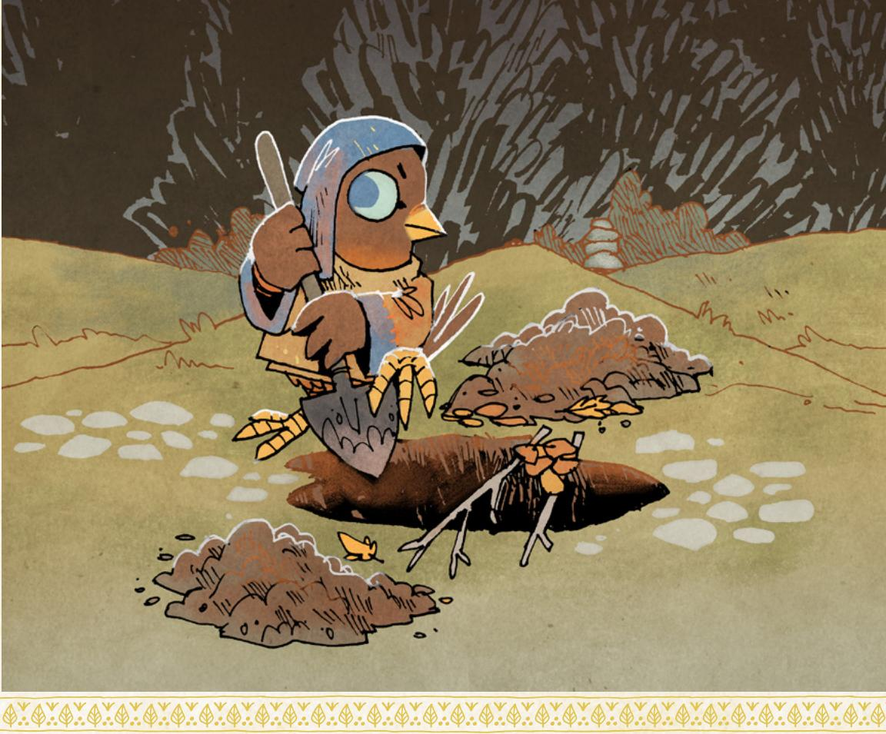

#### Amp It Up

As stated, once you have a sense that your campaign is ending, that's a good time to pull out all the stops.

The Marquisate has had plans and developments all throughout the campaign to increase its army through mechanical soldiers? Well, now it's actually deploying a vast mechanical army in an all-out attack upon the Eyrie Dynasties.

The Arbiter has become a dire foe of the most dangerous assassin in the Lizard Cult? Well, now that assassin is determined to take the Arbiter down, no matter the cost, including burning down a whole clearing to draw the Arbiter out for a final battle.

As always, you (the GM) are responsible for the plans and schemes of the NPCs and the factions, and with the conclusion of your campaign, those plans and schemes can reach their most intense, most irrevocable, and highest stakes. The factions will pull out their last-ditch efforts to win the War; enemies will try dangerous, risky ploys to defeat the vagabonds; allies will rally to desperate fights.

{148}------------------------------------------------

You're still playing to find out, but the moves you make no longer have to be restrained or slowly build tension. Your whole campaign has been doing that work—now's the time to deliver the goods! Big battles, powerful and very dangerous enemies (with lots of injury, exhaustion, wear, and morale), and the final clashes of conflicting philosophies!

In turn, this is your chance to make dramatically hard moves against the PCs. The stakes are terribly high—if ever there was a time for a PC to die heroically in battle against a terrible villain, it's now!

#### Wrap It Up

Run through all the big questions and plotlines and characters from throughout your campaign, and get some sense of which of those are still unresolved and interesting by making a list of questions you want to explore through the finale. Try to come up with one or two for the group of vagabonds as a group, one or two for the Woodland setting as a whole, one or two for each major clearing (of which there should be two or three at most), and one or two for each PC.

With five PCs, that's going to generate a list of up to 20 questions—and that may seem like a lot! But your job is to really drill down to which of those questions are the best to ultimately resolve, and to come up with ways that multiple questions can actually combine into fewer shared answers. There's no reason to resolve "What happened to the evil Sergeant Clayfur?" and "Will Ripper's Den free itself from Marquisate control?" separately, when you can have Sergeant Clayfur be the face of Marquisate control.

As always, you're still playing to find out—you're not planning an answer, exactly. You're planning which questions you'll draw attention to through your moves and the situations that arise, such that the PCs' actions will help come to an answer.

You almost certainly won't bring back every single character who has ever been important throughout your campaign—you don't have enough time or space. So make sure you have a sense of the most important stuff that the players themselves also care about.

#### Build to a Big Conclusion

The easiest and simplest way to make sure your campaign has a big, satisfying end is to bring it to a gigantic over-the-top conflict. That doesn't have to be an actual physical battle (though it very, very often will be)—it could be the final moment of confronting the Marquise de Cat herself and convincing her to leave the Woodland, even in the face of her insidious adviser saying the opposite!

{149}------------------------------------------------

The further you get into your campaign's conclusion, the clearer the big, final confrontation will become. If you've only just decided to start concluding your campaign, it's possible that the PCs have several different conflicts they might pick up, but once they do pick one up and respond to it, you'll begin to have an idea of how the big, final conflict might take shape.

That big, final conflict doesn't have to resolve every last thread, even of the questions you proposed in the prior step. The key is that it presents a culmination of a real conflict that has plagued the vagabonds and the Woodland throughout the campaign, something that they can deal with seemingly once and for all. The more complicated, the higher the stakes, the more difficult, the better. This isn't a time for a simple conflict—the vagabonds almost certainly have plenty of tools for handling smaller, simpler conflicts at this stage. It's a time for the biggest, most intense form of the conflict at the highest level so the vagabonds are really facing off against the big forces of the Woodland.

And once you get into that conclusion, don't pull your punches—but always remember that the hard moves you make don't have to be about "failure." When a PC rolls a miss in their desperate plea to convince the Marquise de Cat to leave the Woodland, it doesn't mean the Marquise says "No!" It could just as easily mean the Marquise looks like she's convinced…only to have the insidious adviser stab her in a surprise attack! When a PC rolls a miss in a duel with the Lizard Cult assassin, it could mean the assassin deals a lethal blow to the PC… but it could also mean the assassin throws away all semblance of morality, lighting the homes of the innocent denizens nearby on fire to distract the PC and leave them utterly vulnerable!

You can modulate your moves to amp up the drama, all without ever seizing victory from the PCs. Making victory cost a great deal is a far more effective move in this kind of epic conclusion.

#### Remember the Epilogues

And finally, once you're all the way through the epic final conflict, and most of the major questions you singled out have been resolved, and you're really ready to close things out…make sure to give every player a chance to describe an epilogue for their PC. At this stage, let go of the need for uncertainty entirely, and just allow them to describe what happens, what their PC does, where they go, and what effect they have on the Woodland. Give each player a chance, even those whose PCs have paid the ultimate price in the final battle. They get a chance to say how their legacy reshapes the Woodland. Epilogues like these are crucial for a final satisfying punctuation mark on such an awesome campaign.

{150}------------------------------------------------

### Beneath the Surface (Playbooks)

Every playbook in Root: The RPG has its own focus and brings its own issues to the fore. To better play into the styles of the individual playbooks over the course of a campaign, here are some GM-side guidelines and a few playbook-specific GM moves you can use during play. These tips include every playbook in the game as of publication, whether in the core book or in Travelers & Outsiders.

#### Adventurer

The Adventurer is one of the most social and charismatic playbooks in the entire core set. They are going to try to solve problems by talking—sometimes by tricking, but most often by persuading. That's great! Be sure to give them NPCs who are receptive to their words, who can actually be convinced, whose minds can be changed without ulterior motive or deception. But also make sure

there are NPCs who pose a real challenge to them—true believers who won't be easily swayed, tricksters who lie and betray, dangerous warriors who strike first.

- Nave someone commit to the Adventurer's ideals and words fully
- \* Betray the Adventurer's trust
- Strike at their noblest ideals

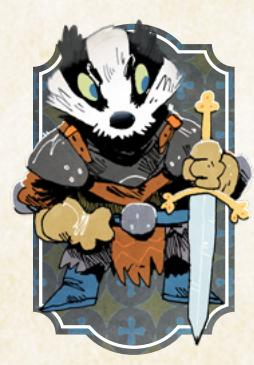

#### Arbiter

The Arbiter is a very capable fighter, so having one in your game means providing them with fights. Those fights don't always have to be evenly matched—giving the Arbiter a chance to show off against weaker foes can be very satisfying, as can matching the Arbiter against truly dangerous enemies capable of standing toe-to-toe with them. But just as importantly, the Arbiter needs enemies to

stand against and innocents to protect. They are an interventionist force, so be sure to confront them with opportunities to intervene.

- · Garget innocents in front of them
- Offer them resources to serve a principle
- Threaten them with overpowering tyranny

{151}------------------------------------------------

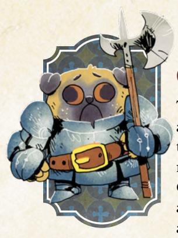

### Champion

The Champion is a warrior, not unlike the Arbiter, but they are even more so a fighter for causes. They seek reasons to fight, and they simplify the world into good and bad, right and wrong, just and unjust. Part of the arc of the Champion will always involve challenges to that outlook, as well. The causes and challenges to the Champion, then, are yours to support and supply. Make sure to give the

Champion clear causes to champion, clear enemies to face, and moments that remove the clarity and simplicity from both.

- · Begthem for aid
- · Cause great harm or suffering in front of them
- Add complicating details to characters around them

#### Chronicler

The Chronicler is focused on history and learning—on an understanding of truth and the past. Without a Chronicler in play, it's possible to play most of a campaign of **Root**: **The RPG** without ever really contending with issues of false narratives or fake histories, but the Chronicler demands that those issues become real. Emphasize that current powers, current leaders, build their strength on the stories of the

past. Those stories have a real effect on the present, and they are often built on lies. The Chronicler can face those stories, destroy them, strengthen them, and reshape the Woodland through them. What's more, through the knowledge they have gained, the Chronicler can create opportunities to effect real, broad, overwhelming change throughout the Woodland. Remind the Chronicler that they have such a potent tool at their disposal!

- Spread rumors of a valuable secret history or text
- Make claims of power and truth based on the past
- Share purposeful lies about history and current events

{152}------------------------------------------------

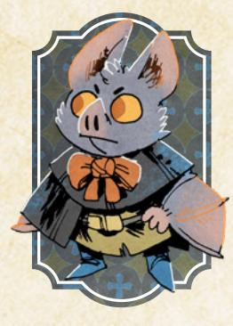

### Envoy

The Envoy specializes in acting as an intermediary, a deniable asset for use by the factions. Their power lives in their ability to negotiate independently. To give them a chance to show off, make sure that other factions largely treat them as a valuable resource. Any faction will always have a use for an Envoy, even if that use is somewhat... duplicitous. After all, they can send in an Envoy to keep

a foe distracted with diplomacy while the sponsoring faction takes other actions. The Envoy is going to face difficult decisions about how to (and if they should) remain aloof and neutral among the factions just by virtue of constantly dealing with them, so always make sure the factions take a repeated interest in the Envoy and their skills.

- · Offer them a lucrative assignment
- · Blame them for their sponsor-faction's misdeeds or failures
- Confront them with difficult negotiations

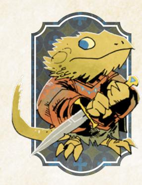

#### Exile

The Exile is a vagabond, yes, but they are just as much or more of a player within the War between the factions. Their faction of origin may hate them, and they might never be able to rise back to a high Reputation with that faction (at least, not without really changing the entire leadership of the faction to friendly faces). But they still care and will seek either to repair their Reputation with

their home faction or to find a new home. Expect the Exile to play at the level of factions and influence, and give them offers and rewards that affect those elements of the Woodland. You won't have to do too much to complicate their position in interesting ways—their starting faction relationships and the fiction surround them; the notoriety and prestige they will naturally accrue push them into interesting places. The key as a GM is to recognize the Exile as a truly skilled political player—they might be down and out right now, but no canny operator within any faction would ever ignore the Exile.

- Offer them favors and prestige for difficult jobs
- Provide opportunities to depose unfriendly leaders
- Confront them with the continued problems of their past

{153}------------------------------------------------

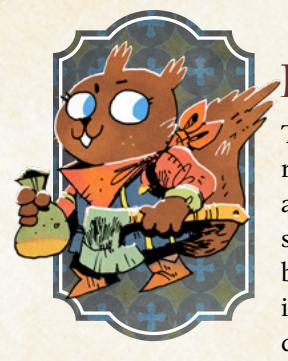

#### **harrier**

The Harrier is a smuggler, a courier, and an acrobat all rolled up into one. They're expert at moving, getting into and out of places, and even crossing the Woodland. As such, when you have a Harrier in your game, locations become all the more important. The Harrier needs interesting strongholds to break into, secret passages to discover, and difficult paths to tread. The Harrier's skill

lies in traversal, and NPCs should recognize that too—they'll definitely want to entrust important messages to a messenger who will never fail to deliver.

- Offer them difficult but lucrative jobs
- Confront them with dangerous passage
- Present rumors or evidence of an interesting locale

#### heretic

The Heretic is a fervent believer in a dangerous or problematic ideology. The key to helping the Heretic be an interesting full character lies in the balance between skepticism and loyalty—the Heretic cannot be just a doubted mad rabbit or a beloved prophet, but something in between. The Heretic's moves will help the Heretic find some friendly faces scattered around the Woodland,

denizens who actually believe in and share the Heretic's ideology. If someone does have beliefs in accord with the Heretic, the Heretic should feel the difference of having a real ally. But always make sure there are far more who doubt and suspect the Heretic, and who pose a threat to those friendly believers (who, after all, probably aren't vagabonds themselves).

- Offer support and interest from a believer
- Gake away safety with a persecutor
- Provide opportunities to give a speech or sermon to a group

{154}------------------------------------------------

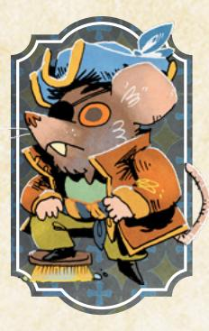

#### Pirate

The Pirate has a ship and requires one key feature—travel along the water. The Pirate doesn't *have* to remain aboard a boat at all times, of course, but their boat means they will likely want to travel along the river or lake when possible. Having a Pirate means making sure the Woodland has appropriate waterways so that the Pirate isn't inherently unable to operate—if you're just starting out, feel free to

add waterways that make sense; otherwise, if you're already playing, the Pirate may not be a good choice for a new player. The Pirate also seeks opportunities for piracy—battling other ships on the water, stealing cargo they might be able to sell, etc. Make sure that the waterways are alive with trade for all the factions.

- \* Chase them on the water or on land
- Spread rumors of appealing targets
- Threaten their ship or their cargo

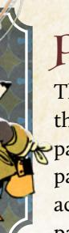

#### Prince

The Prince is tied to a prior generation of vagabonds, and the issues they face today should be similarly tied to the past. They keep running into their parents' allies, their parents' enemies, and the consequences of their parents' actions—essentially dealing with the fullness of their parents' legacy wherever they go. That doesn't mean the Prince is without chances to define their identity, to claim

their own legacy and path, but opportunities to do so entirely without reference to their parents are few and far between. In effect, the same way that your job as GM is to make the vagabonds' actions have consequences, your job for the Prince is to make their *parents*' actions have consequences that the Prince is still contending with today, for good or for ill.

- Confront them with a terrible truth about their parent(s)
- Gempt them with a chance for recognition on their own
- Make them choose to support or walk back their parents' actions

{155}------------------------------------------------

#### Raconteur

The Raconteur is a storyteller, first and foremost. They might be a singer, dancer, actor, whatever—but wherever they go, they don't just spread innocent, harmless entertainments. They spread *ideas*, versions of the world and history and themes that can have consequences, albeit without the Raconteur having precise control over those effects. Oftentimes, the Raconteur will play a more jesterly

role, joking and being lighthearted and playing songs for background color or as a distraction while other vagabonds take direct action. But always ask the Raconteur what stories they are telling, about whom, and what those stories mean—above and beyond all the normal vagabond actions that can have deep consequences, the tales the Raconteur chooses to share can spread like wildfire across the Woodland.

- Challenge them with a rival performer or a distortion of their work
- · Show how the stories they tell can lead to unforeseen ideas spreading
- · Confront them with a demand for direct action

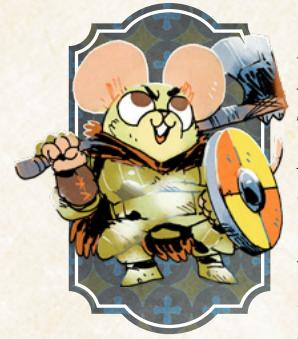

#### Raider

The Raider is a fighter, just as much or more so than the Arbiter or the Champion. But where those playbooks are often about using physical force in service of a cause, the Raider is about a selfish use of force, to get what they want, when they want it, by punching and swinging an axe. As such, the chief issue the Raider most often encounters is a tip towards villainy—they look more like a straight-up

bandit than any other vagabond playbook. Work with the Raider and their player throughout play to help explore the parts of them that are not villainous, that add depth and make them both sympathetic and sympathized with. Ask them leading questions, and confront them with denizens who need help of their particularly combative variety.

- Attack them with an equivalent or greater physical threat
- · Submit to them and beg them for mercy or help
- Reveal a situation that pure force cannot resolve

{156}------------------------------------------------

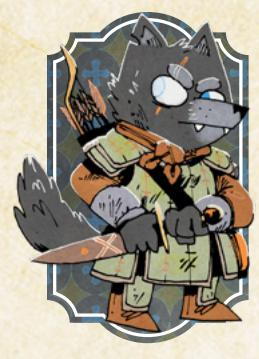

### Ranger

The Ranger seems a nature-loving loner on the surface, but they're just as much a member of the vagabond band as any other. As the GM, it's your job to help the Ranger stick with the band, giving them opportunities to light out and stealth past danger, while always reconnecting them with the other vagabonds. The Ranger is capable of straight-up confrontation but is often more adept at indirect routes

to victory, slipping away from danger and poisoning foes' food or drink. These are the coolest moments for the Ranger, and if they manage to defeat an entire barrack without ever unsheathing a blade, that's awesome! Just make sure to make moves after that epic victory that push the Ranger back towards the rest of the band.

- Threaten them in a way that requires another vagabond's help
- Offer them paths through shadows
- · Make an NPC pass judgment on their tactics

#### Ronin

The Ronin is a masterful warrior in search of something new experiences, new lessons, new skills, new causes, and lords to serve. By asking questions during character creation, try to determine what the Ronin is most interested in, and then constantly provide varied and contradictory examples of that thing throughout their journeys. If everyone playing the game is on the same

page about it, you can bring in the Ronin's nature as someone definitely from elsewhere, especially with how the Woodland factions view the Ronin—they'll often see a dangerous outsider or a useful tool, and they'll try to confront or manipulate the Ronin accordingly. Providing adversity similar to this is key to helping the Ronin's journey to find a new place be appropriately dramatic.

- \* Show them new teachers lords and rivals
- · Give them chances to show off their skills, combat and otherwise, to NPCs who underestimate them
- Challenge them with worthy causes to consider and join

{157}------------------------------------------------

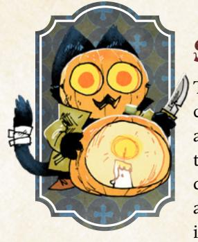

#### Scoundrel

The Scoundrel is a miscreant: dangerous, explosive, and chaotic. The upside is that the Scoundrel's responses and actions will largely fall into a comprehensible set—causing trouble and lighting things on fire, for instance. The downside is that a completely unrestrained Scoundrel can actually disrupt the rest of the band's narratives and actions in a way that can grow old fast. As GM, be sure to provide

the Scoundrel with opportunities to light fires, dive through windows, and so on, but also find things the Scoundrel actually cares about and play on them. Invite them to participate by asking them not "Do you care about any denizens who live here?" but instead "Who in this place do you care about and why?" Help them find the hooks they need to be a fully fleshed-out character, chaos and all.

- Ask them questions about what they care about and why
- Provide opportunities for explosive and dangerous action
- Return to the consequences of their actions, good and ill

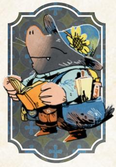

#### Seeker

The Seeker is an explorer, very likely focused on ruins in particular. Having a Seeker in the vagabond band means that you have to make ruins a presence throughout your campaign, to honor their abilities and their interests. Obviously, not every single session of a campaign needs to be in a ruin, but your go-to solution for forested locations should default to ruins. Where are the bandits

hiding? Where is the lost diadem of the Mole Empress? Where does the special medicinal flower grow? Where is the bear hiding out? In a ruin. In turn, the more you can do to make other PCs' goals and interests live inside the ruins, as well, the more you can do to ensure that every PC is interested in the same adventurous locations as the Seeker.

- \* Bribe them with word about a fascinating location or place to explore
- Present them with opportunities to show off their talents
- \* Attempt to steal from them their spoils or their chances to explore

{158}------------------------------------------------

#### **Ghief**

The Thief is an expert at criminal action and roguish feats, and very much a "problem-solver." When they're confronted with a problem that can be solved through their roguish feats, they will try to solve it directly with their high Finesse. It's not at all a problem if the Thief blows straight through some obstacles or challenges without issue; they're likely to pay some costs along the

way, even if they're only using up exhaustion. Don't undermine these moments! Part of the fun of the Thief is using competence and skill to overcome challenges. But then, confront them with other problems, problems they can't overcome by sneaking or stealing—denizens who need to be persuaded, foes who need to be fought blade-to-blade—but where the Thief will need their comrades and will need to think creatively.

- Offer them dangerous jobs to restore worn-down harm tracks
- · Sometimes, directly attack and threaten them
- · Present targets of personal value instead of monetary value

#### Ginker

The Tinker is a technical character, interested in equipment and devices. They can obviate the need for the vagabonds to find friendly smiths and merchants, but they should never entirely resolve those problems—their **Toolbox** move will still require them to periodically obtain additional resources to achieve their goals, and having access to a friend's forge and tools is a common, interesting

requirement. Use the Tinker's Toolbox move to create all manner of interesting challenges by pointing at new characters, new places, and new challenges; the requirements you can set with that move are all designed to generate interesting fiction. Even if the requirement is just about how long it takes, that gives you, the GM, an opportunity to make moves in the world. Having a Tinker in your group means the PCs actually have a way to resolve nearly any problem, even if it takes a lot of time and resources to do so, so always point the Tinker back at their Toolbox move.

- Confront them with difficult, towering problems
- Damage equipment and resources around them
- Provide opportunities to invent impressive new solutions at a cost

{159}------------------------------------------------

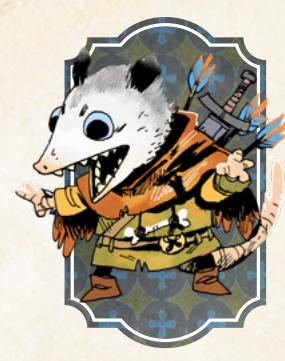

### Vagrant

The Vagrant is a charmer and a liar, solving problems with words first and foremost. They're not always inherently sycophantic or groveling, but they often tend to say whatever they need to in order to get their way. A side effect of tricking their way through the world is that the Vagrant will rarely want to return to places they've been—after all, if they left a trail of deception behind them, then

the only thing facing them on a return trip will be the consequences of those lies. As a GM, make sure to give the Vagrant reasons to return where they came from, to show them those consequences in a varied way—some denizens angry, some still believing exactly what the vagabond said—and to help build relationships that can pierce through the Vagrant's tricksy exterior.

- Show them the consequences of their tricks
- · Make an NPC believe in and care about them, truly
- Confront them with problems that cannot be talked past

{160}------------------------------------------------

### Wilds at the Edge

Simply running a campaign of Root: The RPG is usually enough to keep any GM busy, but if you'd like to push the boundaries of what you can do while playing the game, here are a few options you can use in your campaign.

### Major Random Events

Your campaign of Root: The RPG covers a longer span of time: your vagabonds move around the Woodland (traveling maybe even weeks at a time), the factions push and pull for control over the clearings, the seasons turn, and the weather changes. The passage of time gives the campaign a chance to show the consequences of actions, to show how the factions' and vagabonds' choices have a real effect upon the Woodland.

But there are plenty of times when something completely unexpected or unforeseen can occur, changing the entire nature of the world and demanding a new response from everyone, be they the leaders of powerful factions or scrappy vagabonds traveling the Woodland.

Major random events are huge and important—not the small-scale random event of "A fire started, and the clearing can no longer produce enough food!" That kind of random event is best served when setting up a clearing's issues and conflicts, made through a GM move. It deeply affects that clearing, but other clearings might never even be aware of what's going on with that smaller-scale event.

Instead, major random events are wide-scale—"A fire in the biggest breadbasket clearing of the Woodland leads to widespread food shortages everywhere!"—reshaping the Woodland all on their own and creating a whole new situation that complicates your story. They are the kind of events that remind the vagabonds that the Woodland is real…and that they, the PCs, can never really control the future of the whole of the setting, no matter which faction they ally with or oppose.

As such, these events are best used sparsely, if at all. They certainly aren't necessary to play a full campaign of Root: The RPG; you can come to a wonderfully satisfying conclusion without ever hitting this kind of major event. If you and your group don't like the sound of some major, surprising event really reshaping the Woodland in the face of all the vagabonds' hard work, then you should leave these random events out of your game.

{161}------------------------------------------------

#### When to Use Random Events

The simplest answer is "when your campaign is stagnating." The objective of using these events is to shake up your world in new and interesting ways. If your Woodland War has achieved a state in which one faction is largely winning and seems unlikely to ever fall behind, these major events can help shake things up again, leaving them uncertain. These moves are here to keep your overarching campaign fresh. So if you find your campaign seems to have arrived in a state where the War has a foregone conclusion, these events are a fantastic tool.

You can also introduce these events into your game in a more procedural fashion.

At the end of every session, roll, taking +1 for each of the following statements that are true:

- The Woodland is currently chaotic, complex, and interesting (not settling down or becoming static)
- You have played five or fewer sessions
- The total number of character advancements among the PCs is six or fewer

On a hit, nothing happens—keep playing as usual. On a miss, however, a major random event comes into play. Roll on the Random Events table, and spend some time between sessions thinking about the exact consequences of the event and how to bring it to the fore.

#### Random Events

| 2d6 | 1–2                                                                | 3–4                                                              | 5–6                                                                         |
|-----|--------------------------------------------------------------------|------------------------------------------------------------------|-----------------------------------------------------------------------------|
| 1–2 | Schemes come to fruition (introduce new faction)                   | Extreme weather slowly damages entire Woodland                   | Dangerous sickness begins to spread among Woodland denizens           |
| 3–4 | Valuable new technology requiring new resource discovered | Losing faction makes submissive alliance (introduce new faction) | Sickness or parasite begins to spread among Woodland plants           |
| 5–6 | A star falls on the Woodland                                    | Massive storm or earthquake reshapes the Woodland                | Winning faction draws ire of "sleeping giant" (introduce new faction) |

The next few sections detail each of these random events in more detail, including giving you some custom mechanics for bringing each event to life.

{162}------------------------------------------------

#### **Schemes come to fruition (introduce new faction)**

A hidden, secret plan that has been growing within the Woodland for some time suddenly comes to fruition, and without warning, a new faction springs to power. Perhaps the Corvid Conspiracy suddenly launches a coordinated cross-Woodland seizure of power; perhaps the Riverfolk Company, after slowly building trust and value as the most important trading house in the Woodland, suddenly restricts prices and trade to control riverside clearings.

This event introduces a new faction into the Woodland and is best suited to introducing a more covert or manipulative faction—it can be good for the Grand Duchy to suddenly launch a concerted surprise attack across the Woodland, but this event wouldn't cover the kind of direct Marquisate invasion, for example, that started the War. This event doesn't require an old faction to be removed from power inherently, but if you would take your faction count up to four or more factions, consider how the scheme's fruition might eliminate one of the other (nondenizen) factions, perhaps just by weakening them to the point of irrelevancy.

To introduce a new faction with this event, pick four target clearings—any four in which the schemers centered their efforts. Suddenly, without warning, this new faction clears out any fortifications or structures of opposing factions from those four clearings and seizes control in whatever way is appropriate to their means. Then proceed to include them in faction rolls as usual [\(page 182\)](#page-182-1).

#### **Extreme weather slowly damages entire Woodland**

A terrible winter sets in, worse than any seen in living memory. A harsh, burning summer makes trees dry and combustible, makes water scarce, and kills crops. This event doesn't happen in a singular moment, and it is best built up to as the PCs come to see signs of the worsening weather over the course of one or two sessions, before its most dramatic effects come into play.

Ultimately, though, the effect is that every clearing in the Woodland suffers the same intense weather. Many clearings will be better suited than others to suffer those ill effects, but that kind of inequality of harm only leads to further problems across the Woodland. Consider how any given clearing's conflicts and issues would change with the advent of these new harsh conditions. And even if time moves on and the seasons would turn again, the aftereffects of the extreme weather won't leave the Woodland quickly.

To show the effects of the extreme weather, give each clearing a Value Health—a numerical representation of the Value the clearing's economy can support. Even though every individual denizen might have a different amount of money, this limited Value represents the overall economic health of a clearing, pushed to the brink by bad conditions.

{163}------------------------------------------------

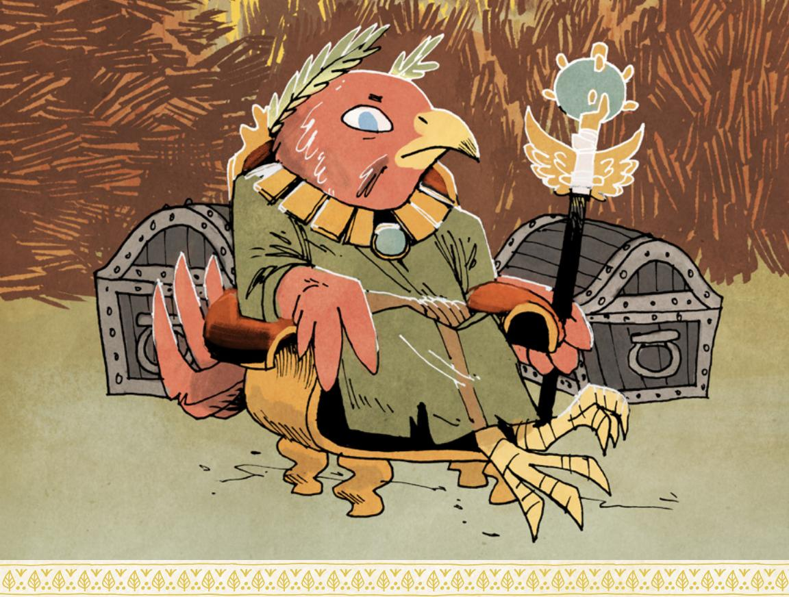

No individual vagabond can receive more Value (including cleared depletion, worth 1-Value per cleared box) from a clearing than its Value Health without receiving specific or difficult-to-attain aid from wealthier denizens.

| Value Health | Clearing's Financial Health                                                                                                                                                                                                                       |  |
|--------------|---------------------------------------------------------------------------------------------------------------------------------------------------------------------------------------------------------------------------------------------------|--|
| 1–2          | Most clearings without special resources or aid: In the midst of a major Woodland crisis of weather and resources, most clearings will have precious few extra resources to share with vagabonds. A clearing at this level is on the brink. |  |
| 3–4          | A clearing at this level is surviving the crisis relatively intact, though not faring as well as it would if there was no crisis.                                                                                                              |  |
| 5–6          | A clearing at this level is surviving the crisis as well as it would have survived without the crisis—it is set up well with its own resources to weather the harsh conditions.                                                                |  |
| 7+           | A clearing at this level is profiting from the crisis in some way, likely through trade with worse-off clearings.                                                                                                                              |  |

Value Health only rarely changes. For every 3-Value in general supplies or 1-Value of vitally important goods that the vagabonds contribute to a stressed clearing, increase its Value Health by 1.

{164}------------------------------------------------

### Dangerous sickness begins to spread among Woodland denizens

An illness begins to spread across the denizens of the Woodland, affecting most, without regard for species or social status or wealth. The Woodland is not well-equipped for any kind of widespread medical care or public health campaigns, and most clearings would just have to weather the illness.

To show the effect of the sickness, emphasize it in your description of the clearing based on the clearing's Outbreak Rating (see below). To randomly determine if any given NPC is infected, roll a single d6; the NPC is infected on a 1–2 if the clearing's Outbreak Rating is 1, infected on a 1–4 if the clearing's Outbreak Rating is 2, and infected on a 1–5 if the clearing's Outbreak Rating is a 3. The actual symptoms of the sickness and the way it shows itself shouldn't be bizarre or lethal—this isn't a disease that causes denizens' fur to turn purple or causes them to literally burst into flames in the sun. They have fevers, they are tired, they are in pain, they are confused and off-kilter, and they have a hard time being active. An infected NPC should have I fewer exhaustion for a minor infection, 2 fewer exhaustion for a moderate infection, and 3 fewer exhaustion for a major infection.

If PCs come into close contact with the infected without taking any precautions, they roll with Might at the end of the session. On a hit, the PC remains uninfected. On a miss, the PC becomes infected. Once infected, the PC crosses off one exhaustion box—they cannot clear this box at all while infected. At the end of every session, an infected PC rolls with Might again. On a hit, the PC is moving towards becoming healthy; they can uncross one crossed-off exhaustion box, treating it as normal again. On a miss, the infection worsens; they must cross off another exhaustion box. If all their exhaustion boxes are crossed off by infection and they must cross off another, they are in terrible straits—they will die at the end of the session without a cure.

To represent the spread of the sickness when time passes, pick three adjacent clearings where the outbreak has begun, and give one of them an Outbreak Rating of 2 (this is where the sickness began), and the other two an Outbreak Rating of 1. When time passes, roll 2d6, and add +1 to the roll for every 3 total points of Outbreak Rating in the Woodland. On a 7–9, choose one option from below per clearing with an Outbreak Rating. On a 10+, both.

- The clearing's Outbreak Rating goes up by +1
- The disease spreads to an adjacent clearing without an outbreak, giving it an Outbreak Rating of I

On a miss, every clearing's Outbreak Rating decreases by 1.

{165}------------------------------------------------

An Outbreak Rating of 1 means the sickness is spreading in the clearing, but denizens may not be highly aware or fixated on it yet—those who are sick may just remain home. An Outbreak Rating of 2 means the sickness is very apparent in the clearing, and the clearing's functions have been impacted. An Outbreak Rating of 3 means the disease is widespread, and every denizen directly knows at least one other denizen who is infected and in danger.

The disease can be stymied by vagabond action—characters like the Tinker or the Chronicler have their ways to just find solutions, and NPCs throughout the Woodland can use the vagabonds' help in pursuing ancient knowledge, hidden secrets, or lost herbs and resources to make cures. If the PCs get involved with attempts to cure the disease, then the needed components for an NPC to cure the disease should always be clear—if the PCs do secure the proper treatise or the right flowers, then the NPC can create a cure, although it may take some time. But then, those resources—the treatise, the flowers, and even the NPC apothecary or doctor themselves—should be treated as any other incredibly valuable resource of the Woodland. If there is a chance that a cure can be found in the white-orange flowers of the mountain clearing, then every faction in the Woodland will try to secure control over those flowers.

The factions and NPCs of the Woodland will come up with a cure on their own eventually, but it will take even more time.

Whenever time passes, roll 2d6–3 to see if a faction independently invented a cure. Add +1 to the roll for each prior roll of this sort. On a hit, the faction creates a cure. On a 10+, the cure is potent; any clearing to which the cure is distributed reduces its Outbreak Rating by 2 whenever time passes. On a 7–9, the cure is effective but less potent; any clearing to which the cure is distributed reduces its Outbreak Rating by 1 whenever time passes. On a miss, no cure is yet forthcoming.

To determine which faction invented the cure, roll randomly for a particular clearing, and then roll randomly to determine if it is one of the factions present in that clearing, or if it was the denizens themselves.

If you are interested in making the event even more divisive and dangerous, then perhaps one species of denizen remains unaffected—for example, the illness doesn't appear to affect mice nearly as much as rabbits, foxes, or birds. The effect of that kind of unequal distribution of cases could lead to massive strife throughout the Woodland, especially as the denizens seize on any reason at all for the spread of the disease. Every clearing's resources would be strained, and panicked denizens could flock to the most dangerous of voices.

{166}------------------------------------------------

### VALUABLE NEW TECHNOLOGY REQUIRING NEW RESOURCE DISCOVERED

A major technology innovation, powered by a previously disregarded or largely ignored resource, stands to reshape the whole Woodland. Carts, self-moving, powered by the special long-burning yellow trees of the Woodland; weapons, powerful and far-ranging, using the explosive bluerocks from the mountains; and more.

Control of the new technology and the resource required to make it work becomes massively important to the Woodland War—the technology, even if it isn't blatantly martial in its applications, more or less guarantees the victory of a faction that solely controls it. In turn, that means every faction will do their best to find new caches of the resource, to steal plans and documents, to gather its own version of the technology. The conflict between the factions ceases to be about overall Woodland control and becomes centered in this one, primary thing. Suddenly, the places where the resource can be found are the most important holdings.

To introduce the new technology and valuable new resource into the Woodland, decide what the new technology is, what resource it requires, and who in the Woodland developed it. Examples include guns (and a gunpowder analogue), basic engines (and a fuel or steam-power analogue), powerful medicine (which must be made from a particular herb or plant), and a fast-growing hearty crop (which needs a particular climate in the clearing). Pinpoint where the resource is on the map—highlighting the location of a single well-known cache, controlled by the faction in charge of the nearest clearing—and the clearing where the technology is most produced and present at the moment.

Every time you make faction rolls within the core book's system (repeated on page 182), add the following options:

- Minor boon: obtain a usable blueprint of the new technology
- Major boon: discover a new cache of the resource to power the technology

If you are using the full faction system within this book (page 184), focus instead on the fiction tied to those options—a faction might gain a blueprint through research, or by kidnapping artisans from another faction, or by intercepting documents, etc. They might create an alternative synthetic fuel, or discover a new resource cache, or steal a store of fuel, etc. All of these options can be accomplished using their existing mechanics.

{167}------------------------------------------------

#### **Losing faction makes submissive alliance (introduce new faction)**

A faction that is losing the Woodland War—or believes it is losing the War might use any number of desperate tactics and strategies to try to survive. The most desperate? Not giving in to their direct foes—no, every faction is far too proud for that outcome—but instead, pledging some kind of loyalty or submission to another new power to create a partnership that bolsters the losing faction's strength enough to soldier on. The Marquisate or the Eyrie Dynasties could submit to the Grand Duchy or the Riverfolk Company; the Woodland Alliance could submit to the Corvid Conspiracy; nearly any faction could pledge to adopt the Lizard Cult's theology to gain access to the Cult's resources. This event reveals that, true or not, the leaders of the faction in question believed their situation was absolutely dire, and they were willing to bet everything on this submissive alliance…and the introduction of a whole new power to the Woodland.

To represent the new alliance in your campaign, introduce the new faction by supplanting the old. Control of at least half of the old faction's clearings (rounded up) switches to the new faction—the new faction would pick the most favorable clearings to take. The old faction can continue to be a presence, but can never harm or attack its partner. Or the old faction (if you would be at 4+ factions total) can completely fade away, sublimated into and disintegrated by the weight of the new faction. What remains of it would either be a rogue force or a subordinate, nigh-powerless presence.

#### **Sickness or parasite begins to spread among Woodland plants**

The Woodland is its trees, its vines, its berry bushes…its plant life. When some kind of invasive species, parasite, or disease begins to kill off the plants, the result can be just as disastrous as any other unforeseen event—especially as it reshapes the Woodland, both depriving clearings of the ample resources they've come to depend on and creating wide new expanses of cleared-out land. What happens to the Woodland when the dangerous forest that used to keep clearings all but separate (except for the paths) suddenly opens up?

To represent the death of the Woodland's forests, pick one forest where the infection begins—one area bounded by paths, clearings, or the edge of the map. Mark that area as infected. When time passes, take the following steps in order: any ailing forest area becomes dead; any infected forest area becomes ailing; and up to three total forest areas (your choice) adjacent to an infected or ailing forest area become infected.

The infection spreads fairly rapidly and without uncertainty—short of investigating the infection and finding some way to prevent it through

{168}------------------------------------------------

herbicide or other means, the only way to stop the infection is to burn down the next areas of forest to create a kind of break.

An infected area shows signs of sickness and dying trees; adjacent clearings begin to suffer some ill effects to local plant-based resources, but nothing dire yet. An ailing area has begun to suffer real harm from the damage to the trees and plants; food and resource shortages in neighboring clearings are common. A dead area is full of lifeless trees; they will crack and fall apart in the next significant storm. It becomes much easier to travel, especially for military forces willing to clear-cut the dead trees. Dead forested areas no longer require any special skill or risk to travel; travel over them as if they were paths.

#### **A star falls on the Woodland**

For ages, denizens of the Woodland have looked up, wondering what lives in the sky above them, what lies in the inky blackness, what those twinkling lights might portend. Very rarely, astral phenomena occur and have a major impact on the denizens—when strange, beautiful colored lights dance above, or when the moon disappears all of a sudden. Plenty of lost civilizations seem to have had astronomical knowledge long since lost, and now the denizens rely upon folklore and seers.

So when a star falls from the sky and lands among the denizens, smashing a crater into the earth and burning with an otherworldly hue, it is no surprise that the denizens take notice. The meteorite that lands in the Woodland doesn't have to cause any real damage (though it could) to have a major effect on Woodland psyches, to lead to doomsaying and belief in strange omens and prophecies.

To represent the fall of the star on the Woodland, take your Woodland map and drop a single die on it from about three or four inches above. If the die falls off the side of the map, just drop it again until it stays on. That's where the meteorite lands; add a crater to that location. Any paths beneath it are destroyed; any forest is blown apart; any clearing is left in ruins. In general, the reaction of the factions and denizens depends upon the state of the Woodland, but incorporate the following key motivations when you take your faction turns.

Factions will try to seize control of the crater and the meteorite; the meteorite iron can be valuable in its own way, but the superstitious power of the meteorite might be just as valuable as a symbol of the faction's power and righteous claim to rule.

Individual denizens will try to seize power by interpreting what this means, claiming the fallen star is an omen in favor of this faction or that; as the War rages on, individuals whose predictions happen to be right will rise to even greater power, eventually usurping clearing leadership with new cults.

{169}------------------------------------------------

#### **Massive storm or earthquake reshapes Woodland**

The Woodland is, far and away, a stable place. Storms come and go, but the forests survive, and the land remains stable under denizens' paws. But every couple generations, the Woodland might face a strange, surprising, incredible event—a storm that levels massive swathes of trees, an earthquake that tears the earth asunder, a flood that washes whole clearings into the bay. And now that time has come again, as the Woodland changes in a sudden, violent fashion.

To introduce the effects of a massive storm or earthquake to your Woodland, first decide which event it actually is—if you're undecided, roll 1d6, with evens being a storm and odds being an earthquake.

Then, scatter four dice across your Woodland map. For an earthquake, drop them on the map from about three inches above the center. For a storm, gently toss them onto the map from the edge corresponding to the nearest body of water. (If you aren't sure which edge that is, pick one at random.)

The location of the die represents a heavily impacted area, and the number you roll on the die indicates the severity of the effect in that area.

| Roll | General Effect              | Storm Effect                                                                                                                                                                                                                                                                 | Earthquake Effect                                                                                                                                                                                                                                                                        |
|------|-----------------------------|------------------------------------------------------------------------------------------------------------------------------------------------------------------------------------------------------------------------------------------------------------------------------|------------------------------------------------------------------------------------------------------------------------------------------------------------------------------------------------------------------------------------------------------------------------------------------|
| 1–2  | Significant, but limited | The storm in this area caused damage, harming any nearby clearing, damaging any nearby paths, but not flattening or utterly destroying anything.                                                                                                                 | The earthquake in this area caused damage, destroying buildings and damaging nearby paths but not causing any irrevocable harm.                                                                                                                                              |
| 3–4  | Substantial destruction  | The storm in this area caused substantial damage, flooding or blowing trees all over nearby paths, flattening some nearby buildings, and pushing back the forest. Any nearby clearings are damaged and nearby paths are inaccessible until time passes. | The earthquake in this area caused substantial damage, flattening most of a nearby clearing or causing landslides to cover the entirety of nearby paths. One nearby clearing or path is highly damaged or inaccessible until significant repairs are undertaken. |
| 5–6  | Massive devastation      | The storm in this area wrecked the environment, flattening trees, blasting away clearings, and washing away paths. Any nearby clearings and paths are damaged and inaccessible until significant repairs are undertaken; nearby forest is erased.       | The earthquake in this area left a massive trail of devastation and chasms. One nearby clearing or path is utterly destroyed; others are damaged until significant repairs are undertaken.                                                                             |

{170}------------------------------------------------

#### **Winning faction draws ire of "sleeping giant" (introduce new faction)**

Other factions, the ones not currently active within the Woodland War, are not without their opinions on the outcome of the War. Many of the uninvolved factions don't want there to be a winner in the Woodland War—they'd rather the involved factions just keep warring, weakening themselves and each other, until they are no longer threats in any context outside of the Woodland.

If one faction is actually winning the War, or at least appears to be, then one of the uninvolved factions might step up and enter the War to prevent a winner from coming out on top. An uninvolved Marquise de Cat could invade to stop the Eyrie Dynasties from reasserting control; an uninvolved Riverfolk Company could send plentiful merchants and mercenaries into the Woodland to ensure the Woodland Alliance can't build a new Woodland-wide government that might be able to exist free from the Company's interference; an uninvolved Lizard Cult might send missionaries galore to unite the denizens against the ever-present, controlling talons of a dominant Corvid Conspiracy.

To represent the introduction of a new faction in response to one faction's excessive victory, first determine who is "winning" in the War. The key here isn't any objective measure of success; it's about the faction that appears to be winning to the majority of denizens and outsiders, regardless of any actual facts. The intervening powers may or may not actually understand the situation on the ground—but there is gossip and rumor that points them toward doing *something* to keep another faction from "winning."

Thinking about who appears to be winning can lead you to some interesting outcomes. The Corvid Conspiracy, for example, might rarely appear to be winning because of the largely covert nature of its actions, while the Marquisate might appear to be winning because it controls so many clearings, regardless of how destabilized it actually is. If you have doubt, go with the most overt faction among the possible "winning" factions; factions that have a subtle touch enjoy a bit of anonymity when it comes to the intervention of outside powers hoping to keep the region destabilized.

Once you've determined who is "winning" the War, choose an unintroduced faction who would most have issue with that "winner" actually emerging victorious. For example, if the Woodland Alliance appears to be winning, and the Eyrie Dynasties aren't currently in the War, they would absolutely object to a Woodland in which the Alliance is victorious; they'd make a great faction to introduce in opposition. Because this assessment depends heavily upon which factions are involved in your game, you'll have to make the call yourself, but the Opposed Foes table on the opposite page can give you some guidance.

{171}------------------------------------------------

#### Opposed Foes

| Winning Faction Opposed Foes |                                                         |
|------------------------------|---------------------------------------------------------|
| Marquisate                   | Eyrie Dynasties, Grand Duchy, Woodland Alliance         |
| Eyrie Dynasties              | Marquisate, Grand Duchy, Woodland Alliance              |
| Woodland Alliance            | Eyrie Dynasties, Marquisate, Riverfolk Company          |
| Riverfolk Company            | Corvid Conspiracy, Lizard Cult, Eyrie Dynasties         |
| Lizard Cult                  | Woodland Alliance, Riverfolk Company, Corvid Conspiracy |
| Corvid Conspiracy            | Marquisate, Woodland Alliance, Riverfolk Company        |
| Grand Duchy                  | Marquisate, Eyrie Dynasties, Woodland Alliance          |

Once you know which new faction is going to be introduced, they invade the Woodland. Set them up as having attacked and taken control over two total clearings, one of which came from the "winning" faction, and the other of which came from (if possible) uncontrolled clearings or from clearings controlled by any of the other "losing" factions. Then include them in all new faction turns as appropriate.

### Generational Play

You might bring your campaign to a close with a single massive final struggle, as the vagabonds try to enact their last great change. Or you might simply end your story with the vagabonds still on the road, still searching for answers to their questions and gold to line their pockets. Or you might narrate some final end for each character, declaring an epilogue (page 149) that wraps up each individual story.

Then, you could call it quits...or you could start again with a new generation of vagabonds! Generational play involves taking the "end" of your Woodland, and using it as a jumping off point for a new campaign set years later. The PCs are a new set of vagabonds, and the old PCs are the movers and shakers of the new Woodland.

To set up your campaign for generational play, follow these steps:

- Determine the fate of each vagabond
- Shift forward one or more decades—change the Woodland landscape
- Create new vagabonds, each with a tie to the past
- Play!

{172}------------------------------------------------

#### Determine the Fate of Each Vagabond

Each player can choose a finale for their vagabond, assuming they still live. Have each player choose one option, adding a bit of description to emphasize what the denizens of the Woodland hear or know about the vagabond's fate:

- The vagabond settles down into a clearing and takes up a simpler life
- The vagabond becomes a leading figure of a remaining faction
- The vagabond departs the Woodland for other faraway places
- The vagabond remains active as a roguish independent figure

#### Shift Forward One or More Decades— Change the Woodland Landscape

Next, "time passes" in your Woodland at a high scale. At least one decade, and possibly more, passes. You don't have to define exactly how many years fly by—the only requirement is that enough time passed that the Woodland would "reset," achieving a new form that new PCs can approach with fresh eyes.

When you advance time by one or more decades, take the following steps:

- Add one path—connect two unconnected clearings in proximity to each other.
- Choose any two paths—cross them out. They were overgrown or lost and have not been repaired. To choose at random, drop two dice on your map from three to four inches above, and eliminate the two closest paths.
- Rename one clearing—something has massively changed its structure and identity. Treat that clearing as if it were a brand-new clearing, and think about what cataclysm or other event so thoroughly reset its identity.
- Choose which factions will be active in the Woodland after the time jump. At least one of them should be a holdover; the others can be new or holdovers.
- For holdover factions, roll 2d6: On a 7–9, the faction loses one clearing it had control over at the end of your campaign and gains a different one (determine randomly or choose each). On a 10+, it loses one clearing it controlled and gains two. On a miss, it loses two clearings it controlled and gains one.
- For new factions, add them as if they were new, including their taking control over currently controlled clearings (page 178, and page 228 of the core book).

#### Create New Vagabonds, Each with a Tie to the Past

Create new vagabonds as if you are starting a brand-new campaign, but have each new vagabond declare a tie to at least one of the old vagabonds—maybe they were trained by the older generation; maybe they're hunting a vagabond of the older generation for a crime they may or may not have committed; or maybe the new vagabond seeks to topple the old vagabond's new regime within a faction. And with that, you're good to go!

172): Root: The Roleplaying Game

{173}------------------------------------------------

### Moving to a New Woodland

Most denizens of the Woodland think of it in just those terms—*the* Woodland, the only Woodland. The one that matters. There is no other Woodland for them to seek refuge within, for no other Woodland matters quite like this one.

But the forest is enormous, and while this batch of clearings has ample resources, enough to attract the attention of plenty of powerful factions…it's not necessarily the only batch of clearings in the middle of the thick forest. It's always possible for the vagabonds—the individuals best suited to trekking through the depths of the forest to find a new home—to find a new patch of clearings, a new place to continue their story and maybe start anew…

Before undertaking such a journey, however, players and characters alike should understand a few things. There are no easy paths to the next Woodland, no clear trails for the vagabonds to follow. There will be costs to be paid when the band leaves one Woodland for another—costs that cannot be avoided.

{174}------------------------------------------------

#### Graveling Between Woodlands

First, any group thinking of moving away from their existing Woodland should understand that this isn't a small trip. In the fiction, the kind of journey to go to another patch of clearings elsewhere in the woods is long, dangerous, and not easily undertaken. It's not the kind of journey that vagabonds can take regularly—so you're not expanding your Woodland to two different collections of 12 clearings so much as you are replacing it entirely.

To represent this, when vagabonds travel from one set of Woodland clearings to another, they each roll 2d6. On a 10+, they choose two; on a 7-9, they choose three; and on a miss, they choose four.

- Suffer 5-injury; this can be blocked by armor as normal
- Mark 6 boxes of exhaustion and depletion, in any combination
- Lose I piece of equipment of Value 5 or less
- Mark 4-wear (total) on equipment, in any combination

These costs inform the state in which the vagabonds enter the new Woodland—they are tired, spent, and in desperate need of supplies and a good night's sleep. They will need to quickly understand the clearing of their arrival and find some way to get some help or indulge their drives. There are new opportunities—and new factions—for them to encounter, but they begin their lives in the new Woodland under harsh conditions.

### Setting Out on the Journey

To move to a new Woodland, the players and characters should both have a discussion. The decision to go should certainly be unanimous at the player level—if not everybody is interested in leaving the Woodland, then you should discuss exactly why those who want to leave wish to do so, and why those who want to stay wish to do so. As always, this is part and parcel of being on the same page with all players to make sure everyone is having a good time!

It's possible that proposing such a journey might split your band! In that case, the desire for half the band to leave for greener forests might actually be an indicator that those characters are simply ready to retire. There's nothing that says the whole band has to be dragged out into a new set of clearings if half the group is content to deal with their current problems in the Woodland.

In fact, the primary reason to move Woodlands is if the situation in the original set of clearings has become so dire that continuing there is simply untenable. One faction has taken a commanding lead—the story of the War there is functionally

{175}------------------------------------------------

#### Traveling Back Home

In general, players should be discouraged from traveling between sets of Woodland clearings. It's an arduous journey, and any individual set of clearings has plenty of room for storytelling inside of its boundaries. This trip is only for those vagabonds brave (or desperate) enough to make an epic journey across an unfriendly land.

Should the group ever wish to travel back to their old Woodland, however, they must make the same move again. The GM reshapes their old Woodland according to what makes sense in their absence; they should not expect to find it at all similar to what they left.

over. Or one vagabond has achieved such a low reputation with the dominant faction (or even the denizens) that they will be functionally hunted wherever they go; their only option is to leave. Journeying to a new set of clearings can act as a bit of a reset, a chance to start anew; but it is far from a cure-all.

If the band does decide to make the long, hard trip to another Woodland, take a session to settle as many loose ends as you can with the existing clearings and the NPCs who live in them. Now is the time for tearful goodbyes! The band is about to set out on a journey they may never return from, and all of their allies would be interested in seeing them one last time. And there may be a few enemies who might want to take one last swing at the vagabonds before they go...

### Creating a New Woodland

If the vagabonds leave one Woodland for another, the GM creates the new Woodland just as if they were creating one from scratch. It should have no more than one (non-denizen) faction in common with the old Woodland. The factions competing and battling over this new set of clearings can make up a different set, whose struggle has followed a different course so far.

If the players have chosen this option, the GM should be thoughtful about what the vagabonds say they want from their new home. Are they running from an enemy? Seeking riches in far-off lands? Merely looking for new adventures?

The GM should design the new Woodland to play to some of those ideas, but they should also think about what is unexpected or different about this new Woodland. Perhaps the main faction in control is one the vagabonds have not met before their travels; perhaps the treasures they say they seek are located in ruins that are even more dangerous than those they once knew back home.

{176}------------------------------------------------

#### What You Keep

Every vagabond traveling to a new Woodland keeps most everything—their stats, their equipment, their drives, their nature, their advancements, etc. The only thing that changes substantially is their reputation.

Any Reputation with a faction that is no longer present in the new Woodland can be recorded off to the side, and then erased; it won't be actively tracked or changing, and by recording it to the side, if that faction ever does arrive in the new Woodland, or if the vagabond returns to the old, it can be added back into the tracker.

Any Reputation with a non-denizen faction that is present in the new Woodland shifts one full point towards 0. So a Reputation of –2 would become –1; a Reputation of +1 would become 0. The faction still has some knowledge of you from your old exploits, but that knowledge is diluted by distance.

Your Reputation with the denizens resets to 0. This group of denizens is functionally an entirely different community from the other, and they don't have any internal knowledge of you. You can similarly record your old denizen Reputation on the side, in the event you return to the old Woodland.

{177}------------------------------------------------

Advances

{178}------------------------------------------------

he Root: The RPG core book contains the basic rules for creating your Woodland map and modeling the ongoing War in the Woodland using the faction roll (page 182). This chapter

opens with instructions for adding the four expansion factions—the Grand Duchy, the Corvid Conspiracy, the Riverfolk Company, and the Lizard Cult—to the Woodland map at the start of play, then expands the faction roll to include these new factions and their various actions and machinations.

In addition to that expansion, this chapter also contains a more complex and intricate faction-specific system that creates unexpected, interesting, and unique outcomes with more nuance and detail than the faction roll. The steps of this new faction phase system (page 184) take a bit longer to run through, but the reward is a living, fleshed-out Woodland, all without preplanning every political move, every chaotic event, and every devious scheme.

Finally, this chapter also contains information on using ROOT: A GAME of Woodland Might and Right to set up your game of Root: The RPG. The board game is already a fantastic system for playing out the dynamics of these factions, and it can easily be used to set up your own Woodland for your vagabond band.
