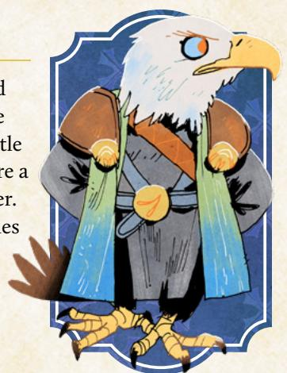
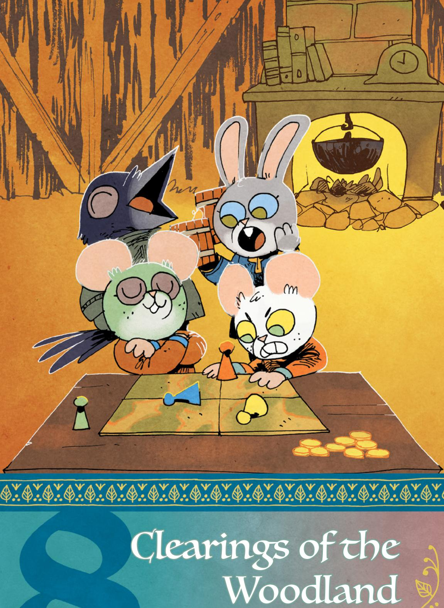

### Woodland Setup

### Control of Clearings

When including additional expansion factions, create your clearings and paths as normal (page 224 of the core book), then run through the Woodland setup in the following order: Marquisate, Eyrie Dynasties, Woodland Alliance, Lizard Cult, Riverfolk Company, Grand Duchy, Corvid Conspiracy, and then Denizens. If a faction is not included in your game, skip its setup instructions!

#### Random Clearing

|     |             | 0           |
|-----|-------------|-------------|
| 2d6 | 1-3         | 4-6         |
| 1   | Clearing 1  | Clearing 2  |
| 2   | Clearing 3  | Clearing 4  |
| 3   | Clearing 5  | Clearing 6  |
| 4   | Clearing 7  | Clearing 8  |
| 5   | Clearing 9  | Clearing 10 |
| 6   | Clearing 11 | Clearing 12 |

You can find the rules for setting up all the base factions on page 228 of the Root: The RPG core book, but read on here for the rules for the new factions!

{179}------------------------------------------------

#### Outcast Table

| 1d6 | Outcast Denizen Type |
|-----|----------------------|
| 1–2 | Fox                  |
| 3–4 | Rabbit               |
| 5–6 | Mouse                |

#### Random Corner Table

| 1d6 | Woodland Corner  |
|-----|------------------|
| 1   | Northwest Corner |
| 2   | Northeast Corner |
| 3   | Southwest Corner |
| 4   | Southeast Corner |
| 5–6 | Reroll           |

#### Map Edge Table

| 1d6 | Map Edge |
|-----|----------|
| 1   | Top      |
| 2   | Bottom   |
| 3   | Left     |
| 4   | Right    |
| 5–6 | Reroll   |

#### Fourth: The Lizard Cult

Roll on the Outcast Table to determine which population of denizens is, at the start of play, the most downtrodden and thus the most likely to be interested in the messages of the Lizard Cult. From the clearings where that denizen species is dominant, choose two at random for the Lizard Cult to have presence.

Then, place one garden and give control to the Lizard Cult in a corner of the Woodland. Choose the corner opposite the Marquisate stronghold or Eyrie Roost if possible. If both are in play, choose either of the other two corners at random. If neither is in play, roll for a random corner.

#### Fifth: The Riverfolk Company

The Riverfolk Company almost always enter into the Woodland using waterways, and they place a heavy emphasis on travel across rivers and lakes. If you have not already added a river or a lake to your Woodland, do so now, using the following process.

First, determine randomly if you are adding a river, lake, or both. Roll a die: on a 1–3, add a river; 4–5, add a lake; 6, add both.

To add a river, choose a random edge of the map using the Map Edge Table.

Draw the river moving into the Woodland from that edge, towards the single closest clearing to that edge, so that the river passes into that clearing and past it. Then, determine where the river exits the Woodland.

If you are drawing both a lake and a river, then the river empties into the lake. If you are drawing just a river, roll again for a random map edge—the river exits at that edge. Connect it to the nearest clearing as before. The river will otherwise wind its way between entrance and exit, across and throughout the Woodland.

If you have a lake and a river, then the lake will connect directly to (and either flow into or from) the lake. To fill in the path of the river as it wends its way through your Woodland, drop a handful of dice—about 5 or 6—on the map, from about 6 inches above. Draw the river's course so it winds around those dice, connecting with any clearing it gets particularly close to, and ultimately exiting at the appropriate location.

{180}------------------------------------------------

#### Control vs Presence

In the new additions to the boons, you'll find mentions of "presence," as in "Corvid Conspiracy presence" or "Lizard Cult presence." These factions don't wage war as directly as do the Marquisate or the Eyrie Dynasties, and as such, they must build up presence in a clearing before being able to act. Presence means they have some significant set of agents or supporters in the clearing—a bit like sympathy for the Woodland Alliance, but not focused on building up to an eventual insurgent action.

Presence is binary—a faction either has a presence in the clearing, meaning they have a buildup of agents or resources there, taking action in the clearing, or they don't.

Presence cannot, in and of itself, provide control over a clearing. Every faction that gains presence has an alternative way to gain control of clearings.

Don't track presence for other factions—they are much more militarily oriented, so they are unlikely to have "presences" that can easily coexist with other factions.

To add a lake, choose a single large space adjacent to a clearing. Roll randomly for the clearing using the table on page 178 if needed. The lake begins there. For each nearby clearing, roll 2d6 and subtract –1 for each clearing past the first connected to the lake. If you roll a hit, then expand the lake to connect to that clearing. Don't erase more than two paths to expand the lake, and stop

Then, add the Riverfolk Company. The Riverfolk Company begin with presence in four different clearings. Choose the clearings using the following criteria—the four clearings with the most "yeses" are the four with Riverfolk presence:

- Is the clearing on a lake or river?
- Does the clearing have 3 or more paths connecting it to other clearings?
- Does the clearing have 4 or more paths connecting it to other clearings?
- Does the clearing have any valuable resources in it or nearby?

expanding the lake once four clearings are connected to it.

For the single clearing with the most yeses, give the Riverfolk Company control and place a trading post in that clearing. If there is a tie, break the tie randomly. If the clearing with the most yeses cannot be given to the Riverfolk Company—it includes the Marquisate stronghold or an Eyrie Roost, for example—go to the second most yeses.

{181}------------------------------------------------

#### Sixth: The Grand Duchy

The Grand Duchy begins with a tunnel and an invading force (providing control of the clearing) in a corner of the Woodland. See the Duchy Invasion Table to see which corner to use, depending upon which factions are in play.

Then, for any and all clearings directly connected to that starting clearing, roll 2d6. On a 10+, the Duchy takes control of that clearing.

Finally, roll for a random clearing in the Woodland; reroll if the result is a clearing the Grand Duchy has control of. Add a tunnel to that random clearing.

#### Seventh: The Corvid Conspiracy

The Corvid Conspiracy start with presence spread out across the Woodland. Roll for four random clearings. Each of these clearings starts with Corvid Conspiracy presence, but none starts with Corvid Conspiracy control.

#### Last: The Denizens

As the last step whenever you set up the Woodland, roll to see if control to any of the clearings has returned to the denizens. Do not roll for the Marquisate stronghold, any Eyrie Dynasties Roost clearings, or the Woodland Alliance base clearing. Do not roll for any uncontrolled clearings, either—they simply remain uncontrolled.

Becoming uncontrolled is most often the result of a faction's withdrawal or retreat, or of a faction's forces in that clearing becoming independent. Notably, this is not the result of a Woodland Alliance revolt or uprising.

#### Duchy Invasion Table

| Factions in Play                                | Which Corner the Duchy Invades                                            |
|-------------------------------------------------|------------------------------------------------------------------------------|
| Marquisate, Eyrie, Lizard Cult               | The only corner that no other faction has used as their starting point |
| Any combination of two of the above factions | Either of the two remaining corners at random                             |
| Any one of the above factions                | The opposite corner to that faction                                       |
| None of the above factions                   | Choose randomly using the Random Corner Table (page 179)               |

#### Denizen Control

| 2d6   | Result               |
|-------|----------------------|
| 1–10  | Remains in control   |
| 11–12 | Becomes uncontrolled |
|       |                      |
|       |                      |

{182}------------------------------------------------

### Faction Roll

Here is the simpler system from the core book, reprinted with all boons and moves needed to incorporate all the new factions in this book.

#### Faction Roll

When time passes, roll for each non-denizen faction. Start with the faction that controls the most clearings, then work down the list:

- +I if the faction operated unfettered by PC actions since the last roll
- -I if the faction has recently suffered a blow from the PC vagabonds
- -I if the faction controls the most clearings (and is thus a juicy target)

Add +1 if the faction in question controls the following:

- Marquisate: 5+ total clearings, workshops, sawmills, or recruiters
- Eyrie Dynasties: 2+ Roosts or 4+ clearings
- Woodland Alliance: 3+ sympathy or at least one base
- Lizard Cult: 2+ gardens
- Riverfolk Company: 3+ trading posts
- Grand Duchy: 2+ clearings and at least one market and one citadel
- Corvid Conspiracy: plots in 3+ clearings

On a hit, the faction scores a victory; choose one minor boon. On a 10+, choose another minor boon—in the same clearing or another—or a major boon instead. On a miss, the faction suffers a defeat—it loses control of a clearing (returning it to the control of its own denizens); a fortification or structure (Roost, base, Marquisate building, garden, citadel, market, trading post, or other at GM's discretion); or a valuable resource.

#### **MINOR BOONS**

**Attack**: Take control of a clearing adjacent to one already controlled. If that clearing has fortifications, destroy those instead. If that clearing has no fortifications but has a Roost, a Woodland Alliance base, any Marquisate structures, or a Grand Duchy citadel or market, destroy all of those instead.

**Fortify:** Fortify a controlled clearing with defensive structures and more troops. The next time an enemy faction would take control of a fortified clearing, they only remove the fortifications instead.

**Obtain:** Gain a valuable resource from the forests, ruins, or a clearing. On the next faction roll, the faction takes +2 if it retains control of the resource.

Establish cells: Add sympathy to any two clearings. [Woodland Alliance]

**Stamp cells**: Remove sympathy from all clearings the faction controls. [All factions except Woodland Alliance]

{183}------------------------------------------------

**Build industry**: Construct one sawmill, workshop, or recruiting post in each of two different controlled clearings. [Marquisate]

**Begin/finish building garden**: Begin construction of a single garden in a clearing with Lizard Cult presence, or finish a garden begun on a prior faction roll. [Lizard Cult]

**Proselytize**: Add Lizard Cult presence to any clearing. [Lizard Cult]

**Conduct commerce**: Add Riverfolk Company presence to any clearing. [Riverfolk Company]

**Build trading post**: Construct one trading post in a clearing with Riverfolk Company presence. [Riverfolk Company]

**Connect tunnel**: Build a tunnel from the Burrow to any clearing, making it "adjacent" to the Burrow for the Duchy. [Underground Duchy]

**Build market or citadel**: Build a market or a citadel in a controlled clearing. [Underground Duchy]

**Expand network**: Add Corvid Conspiracy presence to up to two clearings adjacent to its presence. [Corvid Conspiracy]

**Enact plot**: Launch a plot in a clearing with Corvid Conspiracy presence. (A plot here means the Corvid Conspiracy is undertaking illicit action to gain power—exactly what they are doing is up to you.) [Corvid Conspiracy]

**Stamp plot**: Remove all plots from all clearings the faction controls. [All factions except Corvid Conspiracy]

#### **MAJOR BOONS**

**Revolt**: A revolt occurs in a clearing with sympathy; the Woodland Alliance gains a base there, taking control and removing all other faction structures. [Woodland Alliance]

**Build Roost**: Add a Roost to a clearing the Eyrie controls without a Roost. [Eyrie]

**Capture**: Seize an important figure in an enemy faction; that faction takes –1 on all faction rolls while that figure is held captive.

**Rapidly build garden**: Begin and finish construction of a single garden in a clearing with Lizard Cult presence. Take control of that clearing. [Lizard Cult]

**Trade war**: Take control of a clearing with a trade post and add a trade post to an adjacent clearing. [Riverfolk Company]

**Culminate plot**: Bring a plot to fruition, giving the Conspiracy control over the clearing and either destroying or subverting all buildings and warriors in the clearing (as fits the fiction). The plot is not removed—it remains active (think ongoing protection racket, ongoing extortion, etc.). If the Conspiracy loses control, the plot must be stamped out, lest it culminate in a new form. [Corvid Conspiracy]

{184}------------------------------------------------

### The Faction Phase

The faction roll ([page 182](#page-182-1)) is a simple way to handle factions acting whenever time passes. The "faction phase," however, is a more complex and intricate way to handle the same idea, giving each faction a much more robust and unique system that dictates its own actions, plots, and events.

Think of the faction phase occurring whenever time passes, so the faction roll and faction phase are somewhat synchronous. But the faction phase is the series of individual rolls, decisions, and processes you must make in order to fully track the conduct of each faction instead of the quick and simple faction roll that resolves with just a few choices.

| Faction Order Table |  |
|---------------------|--|

| Order | Faction           |
|-------|-------------------|
| 1     | Marquisate        |
| 2     | Eyrie Dynasties   |
| 3     | Woodland Alliance |
| 4     | Lizard Cult       |
| 5     | Riverfolk Company |
| 6     | Grand Duchy       |
| 7     | Corvid Conspiracy |
| 8     | Denizens          |

The faction phase takes more time to implement successfully, but the outcomes are organic and surprising. If you have little time, and you feel comfortable making those dramatic moves on your own according to your agendas, principles, moves, and the established fiction—and using the faction roll system described in the core book—then go for it! But especially early on, if you find yourself questioning exactly what can happen next, these rules are here to help.

In general, follow the faction phase in the order the factions are presented here and listed in the Faction Order Table. Within each faction, follow the steps as described under that header, in order. This is of great consequence for factions like the Woodland Alliance, for example, in that you should first judge military actions, then revolts, then sympathy. If you aren't including a faction in your game, skip it; only do the faction phase actions for factions that are present in the narrative.

For each faction, you'll find a description and its two overarching drives, alongside its instructions for the faction phase. These drives are like an NPC's drives (Root: The RPG core book, page 201) in that they dictate how the organization acts as a whole. But every faction has two drives to represent the two competing impulses at its heart. Any given NPC representative of a faction might represent either drive, a balance point between them, or anywhere else on that continuum.

The overall portrayal section is intended to give you some guidelines for bringing the faction as a group to life—how to think as that faction when you make decisions within these rules, for example. But these factions are not characters. They make the decisions that you, the GM, want them to make for interesting and dramatic action. Don't worry about them making the best possible plan for their success—they'll act in their own favor, but you're better off not spending huge amounts of time planning out exactly what they'll do.

{185}------------------------------------------------

In addition, you might find that an action taken by a late-acting faction, like the Riverfolk Company, might make the actions the Marquisate took earlier in the order make less sense. Why would the Marquise de Cat hire the Company when Riverfolk mercenaries destroyed her keep? In these cases, you might either need to invent a justification based on the fiction—the Company's attack came after the Marquisate purchased resources—or you might need to revisit the Marquisate's actions and reconfigure them to make sense for the fiction you've created.

#### Time Passes

As stated previously, all of the faction-specific rules presented here kick into action during the faction phase, when time passes—that is to say, when you advance the timeline of the Woodland without portraying every individual moment. Time can pass when the vagabonds travel between distant clearings or when they rest and recover, staying in a single clearing for a couple weeks. It is not the case that literally all these actions take place only during those times, but that "time passing" is a useful trigger for knowing when to focus on the larger Woodland War. These events might have taken place simultaneously with the vagabonds' other adventures, and they just didn't hear about them.

A "faction phase" refers to the general notion of time passing, and to the GM using these rules for each present faction to determine what happened to it. Since faction phases likely require some rolling and attention, they are usually best handled either during a break in a single session of play, or between sessions. You don't always have to do a faction phase when time passes, but you should usually try to do so, to make sure the factions are moving and acting.

### Rumors

Changes that the factions might wreak upon the Woodland won't be immediately apparent to the vagabonds unless they wander through the appropriate clearings. Instead, after each faction phase or whenever time passes, each vagabond can pick up rumors from their contacts and the denizens themselves.

When you *pick up rumors while time passes*, roll with your Reputation with a faction of your choice. On a hit, you pick up rumors pointing at one important event or undertaking of that faction while time passed. On a 10+, you may ask a follow-up question. On a miss, you hear a couple of rumors, some of which might be true, some of which might be false.

{186}------------------------------------------------

### The Marquisate

The Marquisate represents an invading foreign power, but not exactly a full-on invading empire. The Marquise de Cat, leader of the Marquisate, represents Le Monde de Cat…but is not its direct agent. The Marquise serves herself and her own ends, and while she must obey the edicts of the home country, her goal is to create a functional, resource-rich, and obedient domain for herself, carving her own fiefdom out of a place Le Monde de Cat does not directly control.

### Portraying the Marquisate

The Marquisate's two overarching drives are:

- ·*To take control over the Woodland and its vast resources (including its inhabitants)*
- ·*To ensure the Woodland is an internally reliant, functional society*

The Marquisate's first drive is all about its imperialistic, colonialist desire for control. The Marquisate wishes to ultimately be the sole real power of the Woodland, although it is content to have de facto power over de jure power, ruling through obedient local leaders.

The Marquisate's second drive is about its desire for the Woodland to be much more than a burned-out, strip-mined, slash-cut husk. The Marquisate does not want to run the Woodland into the ground. Instead, it wants the Woodland to be a bastion of strength. In essence, the Marquisate aims to actually improve the Woodland and its denizens' lives—but ultimately because doing so will benefit the Marquisate.

As an institution, the Marquisate is focused on progress, control, and order. It has a fairly clean and clear hierarchy, but it lacks the resources to accomplish its ends without further bolstering from the Woodland. As such, it will regularly woo the denizens and the clearings, improving their lives so they are more likely both to help the Marquisate now, and to be of greater benefit in the future.

The Marquisate will always focus on building its own strength and on destroying obvious, dangerous opposition. It will sometimes ignore less obvious threats (like the Riverfolk Company or Corvid Conspiracy) to target direct opponents (like the Eyrie).

{187}------------------------------------------------

#### Resources

The Marquisate has numerous resources with which to accomplish its goals. Keep track of the Marquisate's resources on a list when you include the faction in your game. Each resource should refer to a single significant group, installation, or commodity. Generally, think of them as important, "clearing-level" resources—not the army as a whole (because that stretches across all the Woodland), but a significant individual force that could invade a clearing. Not a basic squad of soldiers (because that's not going to affect a whole clearing), but an elite assassination squad that can depose the leader of any clearing. Not just "Iron," but the "Iron of the Limmery Post Mine."

#### Starting Resources:

- The Stronghold and Guard
- The First Regiment Soldiers

#### Sample Resources:

- Sawmill
- Recruiting Station
- Workshop
- Mine
- Farmland
- Elite Soldiers
- Elite Assassins or Spies

Resources exist in the Woodland. They can be destroyed or stolen (especially by the vagabonds). If they are active somewhere in the Woodland (say, for a project), they aren't present elsewhere. You don't have to track every single resource's exact location at all times, but you should have enough of an idea about the resources the Marquisate posseses that you can place them when you need to on the map. If a resource is destroyed or damaged by the actions of another faction, then make sure to remove it from the Marquisate.

Whenever the Marquisate takes a new clearing, it gets at least one new resource. At your discretion, it might get more for particularly rich clearings, based on the established fiction of that clearing and that clearing's own resources and advantages.

At the start of the game, give the Marquisate the resources named above under "Starting Resources," plus one resource of your choice for each clearing it controls.

#### Projects

The Marquisate surged across the Woodland early on because there was no real power to oppose it, but since that time, it has encountered significant resistance and found itself pushed back. It might seem as if the Marquisate is thus fighting a retreating action, being slowly pushed out of its clearings.

Instead, the Marquisate is working towards its goals still, in a slow, inexorable fashion. As it builds up a stronger, more industrialized, more loyal, or more orderly power base, it can start to push back into the clearings it lost, ultimately extending across the whole of the Woodland.

{188}------------------------------------------------

To represent this, the Marquisate works on projects. An individual project consists of a goal, a means, a countdown clock, and major actors.

A project's goal is the intended purpose— "retake Opensky Haven," "build a lumber mill in Windgap Refuge," "create a clockwork army," etc. Nearly anything that might feasibly fit the Marquisate's abilities can be a project, but make sure you split overly large projects into multiple individual projects—so, no "take over the Woodland"! Instead, split that idea into its constituent clearings and the creation of the resources for the overall endeavor. Projects can absolutely include eliminating other factions' presence, sympathy, or plots.

#### Sample Projects

- Conquer [x clearing]
- Build a new sawmill in [x clearing]
- Assassinate [x important NPC]
- Build a new path between [x clearing] and [y clearing]
- Recruit a new force of soldiers from [x clearing]
- · Build new arms and equipment for [x soldier forcel
- Eliminate dissident sympathy from [x clearing]

A project's **means** is the manner by which it seeks to pursue its project. Specifically, choose at least one appropriate resource that the Marquisate is using to accomplish its project. Each resource can apply to one project at a time, as long as it makes fictional sense. If there are no appropriate resources for a project, the Marquisate can't undertake it.

A project's **countdown clock** is a representation of how difficult the project is, and how long it will take to complete. A countdown clock consists of 4, 6, 8, or 10 segments, depending upon whether the project is easy, reasonable, difficult, or far-fetched. An easy project is one that the Marquisate can certainly accomplish with time; a reasonable project is one that has some risks but seems within the Marquisate's capabilities; a difficult project is one that the Marquisate must really stretch itself and its resources to accomplish; and a farfetched project is an outlandish, strange, or exceedingly difficult project, one that will tax the Marquisate substantially.

As the project pushes towards completion, you fill in segments of its countdown clock. If events occur that would significantly set back the project—a targeted clearing is reinforced, or the workshop where the clockwork army is being built is burned down—erase segments from the countdown clock, or eliminate the project altogether. If it's a setback, erase I segment, or 2 segments for a major setback. If the project would have to start over from scratch, erase all segments. If the project is now impossible, then all progress is lost.

A project's major actors are two to three important NPC characters associated with the project, spearheading its efforts. Reuse existing NPCs wherever possible for this.

{189}------------------------------------------------

The Marquisate should always have three projects going. They can be whatever you choose that make sense for the larger organization according to the Woodland situation and the War as a whole.

During a faction phase, when time passes, assign the Marquisate's resources to its projects. Assign them as makes sense to you in the fiction—a resource must be able to actually contribute to the goal for it to be assigned. Each project's means must be assigned to that project. If you cannot assign every one of the Marquisate's resources to projects, that is not a problem—those resources are simply not committed yet.

After resources are assigned to the Marquisate's projects, roll 2d6 for each project, with the following modifications:

- +I for each resource assigned to the project
- ◆ -1 if there is direct opposition to the project, or -2 for significant direct opposition

On a hit, fill in segments of the project's countdown clock equal to the number of assigned resources. On a 10+, fill in 1 additional segment. On a 7-9, one resource assigned to the project is damaged or destroyed. On a miss, unexpected events (weather, a fire, a drought) interfere with the project, stymieing it entirely and destroying one assigned resource.

After the roll, if the clock is not filled, then the project is ongoing; those resources remain committed to the wider project when you pick up play, meaning that they are present in the appropriate clearings, doing the work of advancing the project. During the next faction phase, the Marquisate can reassign those resources or keep them committed, where they will again contribute to the next roll.

When the clock is full, the project comes to fruition, and the Marquisate achieves its ends—gaining new resources, conquering new clearings, or otherwise changing the Woodland as the project suggests. The vagabonds will see these changes if they are in the area, but otherwise, they might only hear about these changes through rumor.

When the project's countdown clock is full, the Marquisate accomplishes its goals regardless of opposition. The opposition might slow it down by removing its resources or undoing its progress with that opposition's own faction mechanics, but once the Marquisate finishes the clock, it conquers the clearing, builds the device, or whatever else the project was intended to accomplish, no matter who opposes the project or what forces they've mustered in opposition.

189

{190}------------------------------------------------

### The Eyrie Dynasties

The Eyrie Dynasties represent the old powers and sovereigns of the Woodland. Once, they ruled the Woodland whole, but now they are stuck in a battle for control with the other, newer powers. They are a feudal, monarchic, bureaucratic, traditional power. Not an invading outside force—the Eyrie Dynasties are rooted within the Woodland—but far from a liberator. Ultimately, the Eyrie is as defined by the internal power struggles among its own nobility as it is by its outward drives.

### Portraying the Eyrie Dynasties

The Eyrie Dynasties' two drives are:

- ·*To reconquer the Woodland entirely*
- ·*To beat back other dangerous, usurping powers*

The Eyrie's first drive is tyrannical and regressive—a desire to control, to conquer, and to command. The Eyrie ultimately would only accept local governments that are explicitly subordinate to and integrated within its own structures. These are the structures of the Eyrie of the past, and the Eyrie Dynasties of the present seek nothing so much as a return to those glory days.

The Eyrie's second drive is paternalistic. The Eyrie Dynasties see the Marquisate for certain as an invading power, and they want to keep the Woodland free of that kind of external meddling. The Woodland Alliance is a dangerous, young, nascent organization—the most sympathetic members of the Eyrie can understand the Alliance's cause but do not believe it has the planning or maturity to actually govern once it is victorious. Other factions are even more alien than the Marquisate—Lizard Cultists, Duchy tunnels, and Riverfolk trading posts all upset the natural order as well! This drive for the Eyrie is all about a desire to protect the Woodland—because the Eyrie does see the Woodland not as a fief or a territory, but as its own home.

As an institution, the Eyrie Dynasties are privileged and grasping. They are led by figures who seek power for themselves and their own benefit, and who then seek to hold onto the power they have claimed. And the Eyrie Dynasties do have power and resources. They have loyalists spread across the Woodland, accumulated stores of treasure and matériel, old guard experienced veterans… plenty that should ease their way into control of the Woodland.

{191}------------------------------------------------

The reason they do not easily seize control is the infighting that results from the struggles between members. It is a rare Eyrie official who is satisfied with their lot, and most are more than willing to use circumstance, Eyrie tradition, and subterfuge in different combinations to take more power. This infighting inherently leaves the Eyrie scattered, unfocused, and poorly prepared to handle crises.

On the whole, the Eyrie will target big, visible powers—in any game in which it is present, the Marquisate is almost always the Eyrie's number one target. The Woodland Alliance appears to the Eyrie as dismissible, until it absolutely cannot be dismissed. Other powers are watched cautiously—as soon as they appear to hold real power, they become targets of the Eyrie's ire.

#### Roosts

Throughout map creation and the rest of the game, the Eyrie Dynasties may build Roosts. A Roost is a center of power, a physical space coupled with an actual bureaucratic structure. A Roost can almost be understood as a combination of a noble court, a small keep or safe building, and a set of governing institutions. In essence, when the Eyrie builds a Roost, they gain direct control over the clearing. The Eyrie Dynasties would, as an institution, like to have a Roost in every clearing, but they are limited to seven Roosts around the map in total. They cannot build another Roost if they already have seven Roosts in the Woodland.

### Bureaucracy

The Eyrie Dynasties are defined by a deeply shifting, changing, and complicated internal bureaucracy and court. There are many nobles and agents and courtesans, all vying for power—such that anyone who is the official ruler or leader might have little to no power compared to their viziers.

To represent this, when time passes, during the faction phase, roll a single die for each clearing the Eyrie Dynasties control. After rolling, gather the dice into sets based on the number showing—all the 1s and 2s, all the 3s and 4s and all the 5s and 6s. If there are more than three dice in a set, start a second set of the same value. For example, if you rolled two 3s and two 4s, you would actually have one set of three dice, and a second set of one die, both with the value "3–4 - Build!"

Each set of dice allows the Eyrie to undertake one action, according to the Eyrie Bureaucracy Table.

However, if the total of all rolled dice is 18 + Number of Roosts or higher—for example, a total dice roll of 23 or more alongside 5 Roosts in the Woodland the Eyrie Dynasties face a major crisis. Take actions on behalf of the Eyrie with the Bureaucracy Table as normal until the dice spent on actions sums up to 18 or higher, and then roll for a random major crisis. Once a major crisis is reached, the Eyrie can take no further actions this faction phase.

{192}------------------------------------------------

#### Eyrie Bureaucracy Table

| Dice Set Value | 1 die                                                                                                            | 2 dice                                                                                                                                                                                         | 3 dice                                                                                                                                                                          |
|----------------|------------------------------------------------------------------------------------------------------------------|------------------------------------------------------------------------------------------------------------------------------------------------------------------------------------------------|---------------------------------------------------------------------------------------------------------------------------------------------------------------------------------|
| 1–2 - Sway!    | Sway the denizens of a controlled clearing to quell dissent or trouble.                                 | Sway the denizens of a controlled clearing to build significant loyalty among a particular cohort; can remove sympathy, a plot, or one faction's presence from the clearing. | Sway the denizens of a controlled clearing to build overarching loyalty across most denizens; can remove all sympathy, plots, and presence from the clearing. |
| 3–4 - Build!   | Begin construction of a Roost or other significant building, or finish a construction already begun. | Begin and finish the construction of a Roost or other significant building.                                                                                                              | Begin and finish the construction of up to two major building projects, Roosts or otherwise.                                                                           |
| 5–6 - Attack!  | Begin an attack on another clearing, or finish (victoriously) an attack already begun.                  | Begin and finish (victoriously) an attack on another clearing.                                                                                                                           | Begin and finish (victoriously) an attack on another clearing. Build a Roost there.                                                                                    |

#### Eyrie Major Crises

| 1d6 | Crisis                                                                                                                                                                                                                                               |  |
|-----|------------------------------------------------------------------------------------------------------------------------------------------------------------------------------------------------------------------------------------------------------|--|
| 1   | Succession Crisis—a natural disaster, illness, or other circumstance outside of control befalls the Eyrie's leadership, destroying one Roost and leading to strife between leading powers of the Eyrie.                                        |  |
| 2   | Tactical Disarray—miscommunications and poor planning abound as the Eyrie are forced to retreat from one of their holdings, ceding a clearing to independence.                                                                                    |  |
| 3   | Hierarchical Disobedience—at least one clearing's governor refuses the orders handed down by the structure of the Eyrie Dynasties, leading to the Eyrie's processes grinding to a halt until they can bring the offending clearing(s) to heel. |  |
| 4   | Overthrow—one important NPC of the Eyrie overthrows the dominant regime. Until the regime settles, every individual Eyrie bastion and group is on its own for making decisions and has access only to local resources.                         |  |
| 5   | Internal Dispute—two important NPCs of the Eyrie have a massive dispute in what the Eyrie should pursue next, leading to Eyrie forces across the Woodland receiving conflicting orders and taking unnecessary, contradictory actions.          |  |
| 6   | Resource Misallocation—bureaucratic mishaps lead to one clearing having far too much of                                                                                                                                                              |  |

Whatever crisis you roll occurs at the same time as the Eyrie's other actions and ultimately grinds the Eyrie's forward progress to a halt. The vagabonds can become aware of these either through rumor or by seeing the affected clearings, and they can shift the outcome of these catastrophes. If unaffected by the vagabond band, the catastrophe will resolve itself during the next faction phase, instead of the Eyrie making any other bureaucracy roll during the faction phase. When the catastrophe "resolves itself," the Eyrie more or less return to a state of stability, the specifics of which are decided upon by the GM.

one resource and far too little of another, and a second clearing having the inverse problem!

{193}------------------------------------------------

### The Woodland Alliance

The Woodland Alliance is a new organized rebellion in the Woodland. There have been rebellions and uprisings before, but the Woodland Alliance is noteworthy in its cross-clearing organization and capabilities. While its ability to fight with the Eyrie and the Marquisate at the start of play is very limited, it still has the chance to actually take the Woodland and free it from those powers.

#### Portraying the Woodland Alliance

The Woodland Alliance's overarching drives are:

- ·*To remove any domineering, tyrannical, or outsider power from the Woodland*
- ·*To pave a path to a new and better government order for the Woodland*

The Woodland Alliance's first drive is all about the core nature of its revolt. The Marquisate is a foreign invader—its dominion over the Woodland is both tyrannical and unwanted by the denizens. The Eyrie Dynasties are from the Woodland, but they represent an old, fascist order—they are just as unacceptable. The Woodland Alliance is going to fight back against any and all of those powers until they no longer exert dominant control over any clearing.

The Woodland Alliance's second drive is about hope and the promise of a better tomorrow. At its best, the Woodland Alliance promises a better future, a freer tomorrow, and a new government. Exactly what that government is, the Alliance as a whole does not agree upon. Exactly how this new world will work, that's a problem the Alliance has consigned to tomorrow. But this drive is about how the Alliance pushes towards better outcomes for the Woodland as a whole—a Woodland burned to ashes is contrary to their goals.

As an institution, the Woodland Alliance is bound together by a shared goal to oust the other factions from power in the Woodland. They are defined in opposition to other factions. In practice, this means it's a bit like the proverbial "dog chasing a car." If the Woodland Alliance achieved its goal, and the other factions were entirely ousted, it would fall apart as its myriad members pushed for their own individual visions of what the Woodland should become. That diversity of agents and leadership is a crucial component in portraying the Woodland Alliance—its members largely agree that the other factions must be dealt with, but the exact "how" and "why" vary widely.

{194}------------------------------------------------

Similarly, the Woodland Alliance is not defined by a shared opinion towards the denizens. Some Alliance members are absolutely "hero-of-the-people" types, but others see the denizens' complacency as the reason the Woodland is under threat in the first place. Some would protect the denizens at all costs, while others would easily sacrifice a clearing or two to win the War. Portraying the Woodland Alliance, in general, requires adherence to the fact that the Woodland Alliance and the Denizens are two different factions. Their goals are not in sync.

The Woodland Alliance will always target the other factions with as much practical force as it can muster. It will try to target the strongest faction in the Woodland, but more generally the Alliance will seize any opportunity to strike a blow available to it.

### **Wilitary Actions**

The Woodland Alliance will use its bases and built-up military forces to wage outright war upon the other factions when it can. If the Alliance has a base, they will make use of it!

When time passes, for each base the Woodland Alliance has in the Woodland, it attacks a clearing controlled by another non-denizen faction, connected by paths to a Woodland Alliance–controlled clearing. Roll 2d6 for the attack, with the following modifiers:

- -I if the attacked clearing has a Roost, a stronghold, a fortification, or other notable faction-built defensive structure
- -I if the attacked clearing has any other notable buildup of forces or elite defenders
- +1 if more than one Woodland Alliance-controlled clearing is adjacent to the target
- +1 if the clearing has Woodland Alliance sympathy

On a 7–9, the attack damages the opposing faction's control over the targeted clearing but is unsuccessful at ousting them. The opposition's forces are reduced, their defenses damaged. If they have a Roost, stronghold, or other equivalent fortification structure, then that is destroyed. Sympathy is added to the target clearing (if not already present) to indicate the Woodland Alliance's growing strength in that clearing. On a 10+, the Alliance attack succeeds, and the clearing is now under Woodland Alliance control.

{195}------------------------------------------------

#### Revolt

The Woodland Alliance also seeks "revolts," moments when the Woodland Alliance sympathizers in the clearing can actually surge into action and quickly take control of the clearing, ousting any non-denizen faction previously in control there. Revolts are very open and obvious; after a revolt, the Alliance starts using that clearing as a base of operations for more direct actions, recruiting actual soldiers and deploying them more like one of the other major factions.

When time passes, during the faction phase, after adjudicating sympathy in all clearings, roll to see if any revolt occurs. Roll 2d6 for each sympathetic clearing, with the following adjustments to the result:

- ◆ −2 if the Marquisate keep, Eyrie Roost, or equivalent stronghold of the controlling faction is present
- +I if the denizens are in control of that clearing

On a 7–9, the clearing is preparing for revolt; make a note of such. Attempts to remove sympathy from this clearing during the next faction phase take a -2, and rolling for a revolt from this clearing during the next faction phase takes a +1. On a 10+, the clearing revolts. The Woodland Alliance takes control of the clearing, quickly establishing a base and some openly acknowledged soldiers. The former controller of the clearing is ousted and forced to retreat. If there was a Roost, fortress, or similar base of power there, it is destroyed by the Alliance.

{196}------------------------------------------------

### Sympathy

After taking military actions and staging revolts, the Woodland Alliance gathers "sympathy" in clearings across the Woodland. Sympathy here doesn't just mean localized attitudes favorable to the Woodland—it means that the clearing in question is sympathetic and radicalized enough that, functionally, a Woodland Alliance cell exists in the clearing, and that cell takes actions to push the clearing towards an outright revolt.

Sympathy isn't contiguous, so it can spring up nearly anywhere, as long as the conditions are right and the Woodland Alliance deploys some resources there. But other factions have a tendency to stamp out sympathy, whether that's through direct action (finding cell members and imprisoning them) or by undercutting the cell indirectly (building public sentiment against the Woodland Alliance).

When time passes, during the faction phase, the Woodland Alliance can add sympathy for itself into any two clearings of its choice.

Then, for every sympathetic clearing that is not controlled by the Woodland Alliance, roll to see if that sympathy is stamped out. Roll 2d6 for each sympathetic clearing with the following adjustments to the result:

- -I if the clearing changed control between the last faction phase and now
- → I if the clearing is denizen controlled
- +2 if the controlling faction has a stronghold, Roost, or other fortification in the clearing
- +I if the controlling faction has any other kind of notably strong buildup or presence in that clearing

On a hit, the sympathy in that clearing is wiped out. On a 7-9, that faction takes a -1 to eradicate sympathy in any further rolls during this faction phase.

"Notably strong buildup or presence in that clearing" here means anything that would catch your attention as the GM. If you can't think of anything, then it's not "notable," but this caveat can capture moments where you know the Eyrie is building up military forces in a clearing, or the Marquisate has just constructed a mechanical army near the Marquisate keep.

{197}------------------------------------------------

### The Lizard Cult

The Lizard Cult is a religious movement and organization, drawn in origin from a far-off theocratic power, but taking a new, adaptable form here in the Woodland. The hierarchy at the heart of the Lizard Cult is still part of the teachings of the first missionaries, the lizards who traveled from afar to bring the word of the Great Wyrm to the Woodland. But to convert new members into the Cult, they couldn't adhere only to the strict rules of a far-off place—they had to adapt their learnings to the Woodland, and so they have, capitalizing on a nascent spiritual revolution among the trees.

### Portraying the Lizard Cult

The Lizard Cult's two drives are:

- ·*To improve the lives of the Woodland denizens through good works and good teachings*
- ·*To convert the Woodland denizens in mind and practice*

The Lizard Cult's first drive is a seemingly altruistic one. The Cult's followers build gardens—lush, verdant, full of fruit and medicinal herbs, beautiful and functional—and then share the bounty of those gardens with the denizens. They will defend the denizens from assault, sometimes bodily throwing themselves in front of soldiers to halt the violence. They will share learning with children, spending time day after day teaching important lessons. They will serve and contribute, and they better the denizens' lives.

But the "seemingly altruistic" aspect lives inside the interpretation of "better." Lizard Cult members often focus on the obvious—providing food to the hungry, water to the thirsty, shelter to the homeless. But they also can "improve" the lives of the denizens in ways that the Lizard Cult is confident are good—for example, by insisting the denizens take up arms in holy struggle against their oppressors.

The Lizard Cult's second drive is the more aggressive of the two and represents the Lizard Cult's reason for being in the Woodland in the first place. They aim to spread their faith and their belief as far and wide as possible, and they are willing to take extraordinary action in pursuit of that end. And it isn't enough for them to be satisfied just with acceptance as a part of the Woodland—they ultimately seek total conversion and fully-fledged belief.

{198}------------------------------------------------

As an institution, the Lizard Cult is an odd mix of things: rigid hierarchy and rules; flexible beliefs and practices designed to attract new converts; altruistic intent and actions; and hard-edged fervency. The Lizard Cult doesn't have nearly the organizational or military strength that the Marquisate or Eyrie might, but it is built on a base of followers who are devoted to it and its cause they do not serve the Cult for pay or to keep their families safe, but instead because they believe serving is the right thing to do. That devotion is the Cult's truest strength.

The practices of the Lizard Cult can complicate the degree to which the denizens are receptive towards it. The nature of the sacrifice needed to become a member, the icons and images taken from a place fairly alien to most Woodlanders, the strictness…if the Lizard Cult has had difficulty gaining a foothold in the Woodland, it is because denizens weren't yet receptive to the Cult. But now the denizens are as receptive to the Cult's messaging as they would ever be. Add to that numerous Cult apostles and missionaries who are willing to change the Cult's teachings and practices to better suit the Woodland—even incorporating Woodland beliefs and traditions—and the likelihood of denizens, especially the downtrodden, throwing themselves wholeheartedly into the Cult grows a hundredfold.

The Cult's overall relationship with the other factions of the Woodland lives in that battle for hearts and minds. The Cult has defenders and would fight to protect itself and its members if it had to, but the real struggle is over belief and loyalty. It will work to lure members of other factions into its fold, just as it works to supply aid and succor to denizens and thereby earn their adherence. Where the Cult is met with violence and stamped out, it takes on the visage of martyrdom; where the Cult is met with tolerance and acceptance, it returns the same until its presence has become indistinguishable from the majority of a clearing's occupants.

### Faith and Martyrdom

On the whole, the Lizard Cult will focus its efforts on converting the most downtrodden of the masses in the Woodland. This will practically never be birds—a combination of leftover social inequity from the days of the Eyrie's dominion and elements of Lizard Cult orthodoxy that are fairly anti-avian excludes the birds from being good targets for conversion and mercy—but the rabbits, mice, and foxes of the Woodland are exactly the denizens the Lizard Cult will focus on recruiting.

During the faction phase, determine the four clearings in the Woodland whose denizens are in the most desperate or dire straits. Use your judgment as the GM to make the call on which four clearings those are; if you need to break the tie, you can roll for a random clearing, or roll on the Outcast Table to see which kind of denizen is the most widely downtrodden and viewed with disdain or mistrust across the Woodland and then choose a clearing with an appropriate majority population.

{199}------------------------------------------------

#### Outcast Table

| 1d6 | Outcast |  |  |
|-----|---------|--|--|
| 1–2 | Foxes   |  |  |
| 3–4 | Mice    |  |  |
| 5–6 | Rabbits |  |  |

The four clearings you select are the viable targets for Lizard Cult action—they may have presence in other clearings, seeing as a single Lizard Cult disciple can spread the word of the Great Wyrm and rally some support, but clearings in dire straits represent places where the Cult's efforts to aid the denizens will be most appreciated.

In each of those four clearings, the Cult gains one acolyte, a representative of the Cult who holds real sway in the clearing. The Cult gains one more acolyte for every garden in the Woodland. The Cult also gains an acolyte for every action another faction takes against it—removing its people, destroying its gardens, etc. These extra acolytes must be assigned to one of the four dire clearings, as the Cult desires.

The Cult can "spend" acolytes to make changes—using their influence to achieve an outcome. The acolyte must build up influence before acting again. The Cult will always act if it has enough acolytes to take an appropriate action within the clearing, but it won't take an action it doesn't have to take, and it won't repeat the same action unless necessary. For example, the Cult won't convert denizens a second time unless its first group of converts has been imprisoned.

The Cult will always work its way down the list of acolyte actions within a clearing, advancing towards building a garden and securing control there. The Cult will always tend to build gardens instead of converting gardens, but if it gains extra acolytes because it was attacked by other factions, that might give it the extra impetus needed to convert a garden outright.

#### Acolyte Actions

| Acolytes Spent | Action                                                                                                                                                                                                                                                                |
|----------------|-----------------------------------------------------------------------------------------------------------------------------------------------------------------------------------------------------------------------------------------------------------------------|
| 1              | Convert denizens - a small group of denizens within the clearing are converted to the Cult, granting presence within the clearing.                                                                                                                                 |
| 2              | Convert forces - a small set of faction forces within the clearing are (secretly or publicly as appropriate) converted to the Cult.                                                                                                                                |
| 3              | Remove threats - through intimidation, violence, pressure, or other means, non converted threats to the Cult in the clearing are removed; this action can eliminate fortifications and other structures, as well as sympathy and presence of enemy factions. |
| 4              | Build a garden - the Cult builds a new garden in the clearing, taking control from whatever faction had been dominant and establishing a strong, stable sect there.                                                                                                |
| 5              | Convert a garden - the Cult converts an existing faction structure into a garden, taking control and successfully converting the majority of the faction's presence and forces in the clearing instead of ousting it.                                           |

{200}------------------------------------------------

#### Inquisition

The other factions of the Woodland strongly dislike the Lizard Cult—not only is the Cult alien and strange, but it also has the potential to unravel the careful control the other factions have spent time building up across the Woodland. Whenever possible, the other factions do their best to remove Cultists from the clearings they control.

After spending acolytes, roll to see if the Lizard Cult's presence is removed by controlling factions, upset by its rhetoric and its preaching. Roll once for the entire Woodland, modified by the following:

- +I if the Lizard Cult has presence in six or more clearings
- +I if the Lizard Cult has built three or more gardens
- -ı if the Lizard Cult has presence in three or more clearings where the outcast denizens are the dominant population
- -I if the Lizard Cult has been the target of any significant military action

On a hit, there is enough anti-Cult sentiment to oust its members from one clearing; determine which clearing randomly from those where it has presence but not control. On a 10+, oust its members from two clearings. On a miss, sentiment is on the Cult's side; it gains presence in a new random clearing.

{201}------------------------------------------------

### The Riverfolk Company

The Riverfolk Company are a mercantile guild, a collection of individual agents, merchants, and mercenaries working together under a common set of rules and an agreed-upon hierarchy. The Company goes where it's lucrative to be and, as an institution, has no problem serving as many sides of a conflict as possible. If the Company became the lifeline, the institution upon which a clearing (or even the Woodland as a whole) depended upon for all its important resources...that would be perfect from the Company's perspective.

### Portraying the Riverfolk Company

The Riverfolk Company's two drives are:

- ·*To make maximum profit from the Woodland, its resources, and its denizens*
- ·*To become the dominant providers in the Woodland*

The Riverfolk Company's first principle is about straightforward acquisitional greed. The Company is a merchant guild, and it exists to make profit through trade. That means the Company wants to capitalize on the resources available in the Woodland, and it wants to capitalize on the existing economies in the Woodland. Every clearing has something to offer, from labor to wood to food to metal, and the Company as an institution is geared to identify those valuables and figure out ways to obtain them and begin selling them for greater wealth.

The Company's second principle is about a more insidious kind of mercantile imperialism. The Company doesn't just want to squeeze every place dry and leave behind an empty husk, as the first principle might indicate. That way lies an ultimate poverty. Instead, the Company wants to become the single dominant provider, keeping the places that provide it with resources functional enough to continue to provide, even as those places become so dependent upon the Company that it more or less controls them.

The Riverfolk Company's dominant ethos is a kind of capitalistic opportunism that is to say, the Company identifies ways to make money, and it pursues those opportunities. That requires both the long-term and the short-term thinking its two principles point to, from trying to immediately and clearly gain wealth, to trying to support communities that might provide a significant return on investment later. But it's always framed around the idea of a very pragmatic sense of gain; there's no point in investment without the chance for profit later.

{202}------------------------------------------------

Individual merchant captains (skippers) might form attachments and pursue connections (or even mercy) in different places, and they might be greeted with cheers and happiness by delighted denizens who desperately need the skippers' shipments of food and medicine. But just as likely, a more mercenary skipper will dock their ship laden with medicinal herbs…and jack up the prices to take the denizens of the clearing for all they are worth.

The Riverfolk Company do not seek direct, forceful control of clearings in the way of many of the other factions. Its members don't aim to occupy or use soldiers to command denizens. But the control it desires—becoming the only provider of consistent, real value, such that even if another faction occupies the clearing with soldiers, those soldiers can't eat if they don't buy from the Company—is still a form of domination. At its most benevolent, the Riverfolk Company can ease the burdens of life in a clearing by providing hard-to-obtain but important resources. At its most insidious, the Company can functionally trap and enslave denizens through debt and dependency on its services.

As a merchant guild, the Company never seeks direct conflict with any faction on behalf of itself, but the Company does have mercenaries at its beck and call if it needs to defend itself. And it is more than happy to sell the services of those mercenaries to other factions, thus sending Riverfolk Company agents into direct conflict—just, on behalf of another faction. But the Company seeks to creep its way into and around other factions' presence, making them dependent and subordinate to the Company's will.

### Debt, Funds, and Trading Posts

The Riverfolk Company, as a faction, try to obtain funds from their actions throughout the Woodland, ultimately using those funds to reinvest, build further infrastructure, and wheedle their way into all the clearings.

At the start of play, the Riverfolk Company have three funds. They receive additional funds from their structures and trade routes, as well as when they cash in debt on other factions. They earn debt from other factions when those factions use the Company's services.

When time passes, during the faction phase, the Riverfolk Company spend the funds they have accrued.

{203}------------------------------------------------

#### Earning Debt

At the beginning of every other faction's turn, that faction may "purchase" Riverfolk Company resources. Crucially, this roll happens on other factions' turns, so make sure you remember to do it if you're using this system and the Riverfolk Company!

On the other faction's turn, roll 2d6, with the following modifiers:

- +I if the faction owes o-debt to the Riverfolk Company
- +I if the faction is losing in a conflict with another faction
- +1 if the faction is in desperate need of aid
- -I if the faction has recently acquired a valuable new resource
- -I if the faction is leading in the Woodland War
- -I if the faction owes 3-debt or more to the Riverfolk Company

On a hit, that faction buys a service from the Riverfolk Company. On a 10+, the faction buys two services. You choose purchased services based on what would be most valuable to that faction. On a miss, the faction doesn't buy any services from the Riverfolk Company and reclaims 1-debt from the Riverfolk Company, reducing their debts owed by one.

#### Services:

- **RIVERBOATS:** A faction that buys riverboats treats all clearings along the body of water as adjacent.
- **MERCENARIES:** A faction that buys mercenaries assigns them to a clearing adjacent to that faction's control or presence; the mercenaries attack the clearing, destroying fortifications or structures, or delivering control of the clearing to the purchasing faction.
- **RESOURCES:** A faction that buys resources takes a +1 on any roll it makes during this turn.

For each service the Riverfolk Company sell to another faction, they take I-debt on that faction, indicating that the faction owes the Riverfolk a sum of money. This isn't a favor or an informal currency—this is straight-up financial credit, and the Company will keep strict track of it.

{204}------------------------------------------------

#### Earning Funds

On its turn within the faction phase, the Riverfolk Company earns a baseline amount of funds based on how it is spread throughout the Woodland:

- I for each functional trading post in the Woodland
- I for every two clearings with a non-tradingpost Riverfolk Company trade contract
- I for every clearing the Riverfolk Company controls

The Riverfolk Company can then cash in debt on any faction to earn additional funds, according to the Debt to Funds Table. By default, the Company will wait until it can cash in 4-debt on a faction before doing so, but if you judge that the Company desperately needs funds for its actions, then it can cash in early at your discretion.

#### Debt to Funds

| Total Debt Cashed In | Funds Earned |
|----------------------|--------------|
| 1                    | 1            |
| 2                    | 2            |
| 3                    | 4            |
| 4                    | 6            |

#### Spending Funds

The Riverfolk Company spends as many of their funds as they can during every faction phase.

| Funds | Action                                                                                     |
|-------|--------------------------------------------------------------------------------------------|
| 1     | Attack a clearing adjacent to Riverfolk Company control (destroying structures and forces) |
| 1     | Send an emissary to any clearing                                                           |
| 1     | Form a trade contract in a clearing with an emissary                                       |
| 2     | Build a trading post in a clearing with a trade contract                                   |
| 3     | Take control of a clearing with a trading post                                             |

"Send an emissary" means that the Riverfolk Company have agents engaging with a clearing over which they do not have control. Imagine this as the Company assigning a skipper and their ship to add the clearing to its trade routes.

"Form a trade contract" means that the Riverfolk Company's representatives in the clearing create a consistent, codified trading arrangement with the government or with important denizens of the clearing in question. The arrangement provides funds to the Company and important supplies to the clearing.

204): Root: The Roleplaying Game

{205}------------------------------------------------

"Build a trading post" means that the Riverfolk Company build a new structure from which to host significant trading conduct over the Woodland, from setting prices to haggling complicated deals to codifying and storing. The trading post means the Company now has a permanent presence in the clearing, guarded by Riverfolk soldiers.

"Take control of a clearing with a trading post" means the Riverfolk Company assume control over the clearing, either indirectly by controlling trade to such an extent that the clearing is at the Company's mercy, or directly by seizing control of its government. The Riverfolk Company cannot seize control of clearings with fortifications, like the Marquisate stronghold or other defenses that allow the factions there to be self-sufficient.

"Attack a clearing (destroying structures and forces)" means the Riverfolk Company work to destroy the assets of other factions. Most likely they attack those assets outright with mercenaries, but "attack" can cover any action the Riverfolk Company would take to deplete those resources directly, including gifting money to other factions so they can do it. Attacking a clearing in this fashion does not grant the Company control over the attacked clearing.

#### Eviction

Finally, the Riverfolk Company might be ousted from clearings where they have presence but not control. Determine the faction that controls the most clearings with Riverfolk Company presence. If there is a tie, go to the faction with the least debt held by the Riverfolk Company. If it's still a tie, determine randomly.

Roll for that faction to see if it ousts the Company from one of its clearings. Roll with the following:

- -I if the faction owes any debt to the Company
- -I if the faction owes 3-debt or more to the Company
- +I if the faction has suffered any ill effects at the hands of the Company or thanks to a Company-sold service
- +1 if the faction is under threat in the clearing(s) in question

On a 10+, the faction removes Company presence from one clearing it controls of its choice. On a 7–9, the Company can instead choose to forgive 2-debt from the faction. On a miss, the Riverfolk Company are secure in that faction's clearings.

{206}------------------------------------------------

### The Grand Duchy

The Grand Duchy (also sometimes known as the Great Underground Duchy or just the Underground Duchy) is a fiercely feudal underground nation. The Duchy is an aggressive, imperialistic power, actively seeking new subordinate fiefdoms and territories to continue to feed the homeland. It has its own parliament and its own complicated internal politics that simultaneously drive further expansion and action and stymie the Duchy's efforts when bureaucracy clogs up. But the Duchy is not to be underestimated—it is the military equivalent of the Marquisate and the Eyrie, with the additional benefit of building tunnel systems that allow it to strike where it chooses without warning.

### Portraying the Grand Duchy

The Grand Duchy's two drives are:

- ·*To bring the Woodland to heel under the Duchy's rule and leadership*
- ·*To eliminate chaos, strife, and disorder*

The Duchy's first drive is entirely about domination and control. The Duchy wants the Woodland's resources to be its own, and the only means by which the Duchy is equipped to achieve that end is outright military invasion and control. There is room in this drive for minor variations—for example, areas controlled by a denizen governor who was, of course, handpicked by Duchy operatives to enforce their will. But all in all, the Duchy wants the Woodland to obey when it makes a demand.

The Duchy's second drive is about the primary benefit it offers to the Woodland—stability. The Duchy's actual governance can be exploitative and is often defined by the bureaucratic whims of its own parliament…but at its best, it's far, far safer and more stable than the equivalent status of the average clearing. A Duchy-controlled clearing that faces a flood or a famine, for example, is easily bolstered by additional Duchy resources and agents arriving from underground tunnels. While the Duchy is absolutely an authoritarian state and can be oppressive and tyrannical, it can also eliminate the conditions that make life in the Woodland so difficult.

{207}------------------------------------------------

As an institution, the Duchy is an overbearing tyrannical nation. It has no elected officials, only appointed officers and nobles. The population of nonmoles that call the Duchy home isn't zero, but it's a substantial minority, especially in the Duchy's capital of the Burrow. It sees territories and other populations as resources to be used. It's not impossible that, with a real push for revolution, the Duchy might change—if the system were altered, if new leaders replaced the old, etc. But as an organization, the Duchy is likely to veer closest to straight-up villainy in its aims and goals.

The Duchy's myriad representatives and officers are always themselves trying to balance any sense of righteousness with what they actually are ordered to do. Most of them are used to being cogs in the larger machine, fulfilling the functions to which they are set. Even those in positions of authority are highly aware of the boundaries of what they are allowed to do or say. So while an individual Duchy officer is still a fleshed-out character with a personality and needs and drives all their own, they are also less likely to truly stand out from the Grand Duchy and act in contravention of its desires and goals for any kind of higher ideal.

The greatest challenge for you as the GM in portraying the Duchy will be to add enough nuance that the Duchy can appear as both ally and foe. In that, emphasize both the humanity ("denizenity") of the Grand Duchy's representatives, and the resources and power of the Grand Duchy. The Duchy is an institution that can make huge changes to the Woodland, but it's also an institution that makes changes to its own benefit long before it voluntarily makes life better for the denizens or other factions.

As far as the Duchy's representatives go, they're still characters, with other interests and with personalities, and they're capable of empathy. Some will be monsters, but some will come to care about individual denizens, or even be moved to aid a whole clearing's population. They will run headfirst into the problems of dealing with the larger faction and its own selfish goals, but they can stand as possible allies, just like any other denizen.

As far as the Grand Duchy's power goes, it is both very advantageous as an ally, and very dangerous as a foe. Much like the Marquisate and the Eyrie, its reach and strength are not to be underestimated, and the Duchy is perhaps even better funded and secure in its position than the Marquisate (a relatively unsupported arm of a far-off empire) or the Eyrie (a shadow of its former self and power). In other words, the Duchy is the closest thing to an empire the vagabonds face in the Woodlands; portray it accordingly.

{208}------------------------------------------------

### Duchy Actions

During the faction phase, when time passes, the Grand Duchy takes actions to further its invasion of the Woodland. But it also tries to rally the support of its top leaders in parliament, for without their investment, it's severely hamstrung in what it can actually do.

The Duchy has action points during each faction phase, equivalent to 2 + the number of clearings it controls + any it receives from parliament.

It spends those action points to build new tunnels, invade new clearings, and fortify controlled clearings. Each turn, the Duchy can build one tunnel, perform one invasion, and build a market and/or a citadel in any number of clearings.

First, the Duchy will invest points in building a new tunnel if it doesn't already have one connecting the Burrow to a clearing the Duchy does not control. The tunnel the Duchy builds will always connect the Burrow to a valuable clearing or target. If you can't pick one the Duchy would target, roll for a random clearing.

Then, the Duchy will invest points in invading a clearing connected by tunnel or by path, whichever is cheaper. Finally, it will spend points on other actions, including fortifying clearings and eliminating presence or sympathy from clearings where it has control. The Duchy will invade the most valuable clearing it can afford to invade.

#### Action Point Cost Table

| Action                                                                        | Point Cost                                                                                                                              |  |
|-------------------------------------------------------------------------------|-----------------------------------------------------------------------------------------------------------------------------------------|--|
| Build a new tunnel from Burrow to unconnected clearing                     | 1 + the number of tunnels already built                                                                                                 |  |
| Invade from the Burrow along a tunnel                                         | 4 + 1 for each significant fortification in the target clearing                                                                      |  |
| Build a market or citadel in a controlled clearing                            | 2 each                                                                                                                                  |  |
| Invade from one clearing to an adjacent clearing along paths               | 7 – the number of Duchy-controlled clearings adjacent to the target + 2 for each significant fortification in the target clearing |  |
| Target and remove sympathy, a plot, or presence from a controlled clearing | 2                                                                                                                                       |  |

The action points costs for the Duchy to take any of these actions can be found in the Action Point Cost Table. Some of the ministers who support the War ([page 209\)](#page-209-0) may modify these costs or provide free actions the Duchy can take during the faction phase.

{209}------------------------------------------------

#### Parliament and Sway

Nine ministers make up parliament. They are all important officials, though they can be replaced and deposed. They rarely visit the Woodland directly.

At the start of play, roll a die for each minister—an odd result indicates they are against the War; an even result indicates they are in favor of it. If you end two faction phases in a row with every minister against the War, then the Duchy will withdraw from the Woodland, abandoning its claim by the next faction phase.

| Against | Minister                                                             | For |
|---------|----------------------------------------------------------------------|-----|
|         | Foremole: Builds one market or citadel at no cost each faction phase |     |
|         | Captain: Reduces the cost of tunnel invasion by 1                    |     |
|         | Marshal: Reduces the cost of path invasion by 1                      |     |
|         | Brigadier: Allows for a second invasion along path or tunnel         |     |
|         | Banker: Provides 1 action point                                      |     |
|         | Mayor: Copies another minister's ability at random                   |     |
|         | Duchess of Mud: Provides 1 action point per tunnel                   |     |
|         | Baron of Dirt: Provides 1 action point per market                    |     |
|         | Earl of Stone: Provides 1 action point per citadel                   |     |

After it takes its actions, the Duchy rolls to see where members of its parliament fall on the issue of the Woodland War—whether they can be counted on for support, or whether they are cautiously holding back.

When the Duchy assesses the state of its ministers with regard to the War, roll with the following modifiers:

- +1 if the Duchy has acquired any new clearings or major resources since the last roll
- +I if the Duchy has at least five clearings under its control
- +I if any other faction has suffered a major blow since the last roll
- -1 if the Duchy has lost any clearings or major resources since the last roll
- -I if any faction controls more clearings than the Duchy

On a hit, one minister shifts from being against the War to being for the War, and another shifts from being for the War to being against the War—pick two, or choose randomly. On a 10+, an additional minister shifts from being against the War to being for the War. On a miss, two ministers shift from being for the War to being against the War.

{210}------------------------------------------------

### The Corvid Conspiracy

The Corvid Conspiracy is an anarchic, criminal organization, beholden to no great power and busy launching criminal plots and conspiracies across the Woodland. For the most part, the Corvids operate secretly in hidden cells and places, ostensibly trying to remain out of sight of the authorities of the Woodland.

And yet, the Conspiracy worms its way into everything. Denizens come to owe Conspiracy members numerous favors—the Conspiracy often provides aid and goods without any demand for restitution, knowing that a debt is powerful currency

indeed. Leaders accept Conspiracy bribes and find themselves under the sway of the Corvids. Soldiers sent against the Conspiracy rapidly find that the power of coin may far outweigh the terrible might of the threats the Conspiracy can make…and deliver on.

The Corvid Conspiracy's two drives are:

- ·*To create a subversive cell wherever possible in the Woodland*
- ·*To undermine systems of codified power and authority*

The Corvid Conspiracy's first drive is about ubiquity and having exactly the right agents, favors, and resources in the right places at the right time. The Conspiracy doesn't have the might to go toe-to-toe with any of the fully militarized powers of the Woodland, and likely never will. But the Conspiracy's leaders know full well that they can derail an entire army with the right words placed in the right ears. To do that, they need beaks ready to speak those words wherever and whenever possible. They need agents and allies and pawns all over the Woodland, in the halls of power and in the homes of peasants. They need spies and assassins and thieves and more, ready to act when given the order.

The Corvid Conspiracy's second drive is about the real threat and power of the Corvid Conspiracy—to find the cracks in existing systems, to wheedle its way in, and to spread those cracks wide. No system is ever without its imperfections, and the Corvid Conspiracy's expertise lies in finding those weaknesses and exploiting them. Blackmail, bribery, intimidation, manipulation—whatever it takes, the Conspiracy comes to subvert the will and purpose of codified power and authority, bending it to the Corvid's will. Even the more chaotic powers, like the Woodland Alliance, can fall prey to the manipulations of the Corvid Conspiracy!

210 Root: The Roleplaying Game

{211}------------------------------------------------

As an institution, the Corvid Conspiracy is deeply informal—at least as far as most know. Within its ranks, it has a known and understood hierarchy of agents and chiefs, a clear divide between the corvids who make decisions and the corvids who enact those decisions in the world. But when the Conspiracy interfaces with civilians, its agents act as members of the communities, as one of them. That's not some Corvid Conspiracy chieftain—it's Uncle Goldfoot! Everybody knows you can trust Uncle Goldfoot; he brought food to May when she was starving that one time, and he protected Juster's house from the Marquisate taxcat.

Tied to this is a subtle contradiction built inside of the Corvid Conspiracy its members are simultaneously very well-known and purposefully unacknowledged. Relatively few members of the Conspiracy are fully secret in their roles; most denizens, if pressed, could identify the Conspiracy's agents based on reputation and rumor. But therein lies the dilemma—you would have to press those denizens very, very hard to get them to point a claw in the Conspiracy's direction.

The Conspiracy's existence and acts might never be entirely hidden, but a kind of collective fear and collective appreciation leads to the Conspiracy never being explicitly acknowledged or spoken about. Even the larger factions will avoid referring to the Conspiracy—what self-respecting faction of the Woodland would deal with a criminal conspiracy, let alone allow it to continue to exist in their controlled clearings? What conquering power would want to admit control of a clearing might not extend into the deepest criminal shadows?

And yet most larger factions find themselves needing the Conspiracy, whether to obtain rare or illicit resources, to gain information, or just because the Conspiracy is so interwoven into the clearing's makeup that they can't hope to rule without the Corvids' consent. Vagabonds can often take on roles no one wants to play in a clearing, but vagabonds—by their nature—will leave and move on to other clearings. The Conspiracy is always present. Always watching.

The Conspiracy isn't innately evil or darkly selfish—its members and leadership know well the utility of quid pro quo arrangements, and they do deliver useful, important, or necessary goods and services to many, especially the denizens themselves. Every criminal organization, at some level, must exist to serve some broad need, and many denizens know that the Conspiracy might be willing to provide when no one else will even offer to help.

But agents of the Conspiracy don't ever truly act out of the goodness of their own hearts. Even when they appear to be doing just that, doing favors for denizens with no request for recompense or reminder of debt, they are consciously doing it to earn another currency—goodwill—which they can cash in later.

{212}------------------------------------------------

### Plots

The Corvid Conspiracy acts subtly and quietly in the War, spreading influence and corrupting systems, until suddenly unleashing the might of its traps and accrued resources without warning.

#### Plot Quantity Table

| 1d6 | Number of Conspiracies |  |
|-----|------------------------|--|
| 1–2 | 1                      |  |
| 3–5 | 2                      |  |
| 6   | 3                      |  |

Every faction phase, the Corvid Conspiracy adds

presence to any one clearing in the Woodland. Determine it at random. Then, the Conspiracy launches any culminated plots they planted on prior faction phases.

Roll 2d6. On a 7–9, one plot reaches fruition. On a 10+, up to two plots reach fruition. On a miss, one plot is eliminated and another reaches fruition (if there is a second). When a plot reaches fruition, choose one plot from the list as appropriate for that clearing, and that effect takes place.

Next, the surviving plots encounter opposition from other factions.

Then, the Corvids plant plots in clearings where the Conspiracy has presence. Roll 1d6 on the Plot Quantity Table; place that many plots. No more than one plot may be in any clearing at a time. A "plot" means the Conspiracy is pursuing some secret goal, although you do not have to choose the plot's nature when you place the plot.

The plots affect the clearings in secret, although any faction present becomes aware that something is up. Once the Corvid Conspiracy has placed a plot into a clearing, that plot is advancing towards fruition—on a later faction phase, it might culminate and produce an effect, at which point the plot is over and it is removed.

Each plot has its own effect when it reaches completion. When the Corvid Conspiracy brings a plot to fruition, select an effect from the Plot Effects Table.

#### Plot Effects Table

| Plot Name     | Effect                                                                                                                                                                          |  |
|---------------|---------------------------------------------------------------------------------------------------------------------------------------------------------------------------------|--|
| Bomb          | Remove a fortification from the clearing, or destroy another faction's military forces in the clearing.                                                                      |  |
| Snare         | Destroy or trap a path from this clearing.                                                                                                                                      |  |
| Extortion     | Force another faction in the clearing to take a particular action.                                                                                                              |  |
| Raid          | Capture a leader or valuable resource from a faction, or gain presence in up to three adjacent clearings.                                                                    |  |
| Obtain Favors | Perform some valuable service for local denizens, earning their goodwill and defense—the denizens become a fortification for the Corvid Conspiracy.                          |  |
| Seize         | Take control of vulnerable clearing—lacking significant military presence or fortifications—after successfully Extorting or Obtaining Favors in a previous faction phase. |  |

212 Root: The Roleplaying Game

{213}------------------------------------------------

### The Denizens

The denizens are a "faction" only in that they share information and stories across the Woodland, and in that they generally share a similar goal—to live their lives comfortably and in peace. They may seek fortune or fame in brief moments, but denizens as a whole would rather live quiet, unassuming lives than even consider taking to the road as a soldier or vagabond.

Thus, this faction is the equivalent of "the citizenry," "the civilians," the individuals living throughout the Woodland who are unassociated

or committed to a particular faction, but who are forced to live with those factions' rule and actions, especially the factions that control the clearings in which they live and work.

### Portraying the Denizens

There is generally no need to portray the denizens as a faction—their unity as a group is very weak, defined by their shared position outside of the other factions. The denizens of one clearing can be wildly different in ideology, temperament, history, and culture compared to the denizens of another clearing. They have no driving ideology and only rarely think of themselves as part of a community that extends past their individual clearing or family.

The denizens only have a single drive of note as a faction:

### ·*To live peacefully and comfortably*

For the most part, when individual denizens come to seek a greater goal than a simple and peaceful life, they will likely join one of the other factions. A denizen who decides that the Marquisate could remake the Woodland for the better isn't really *just a denizen* by the time they join up with the Marquisate and march on a new clearing!

The denizen faction as a whole is thus characterized by keeping its head down until it absolutely cannot, taking real action only in the most drastic, dramatic, or intense of cases. The denizens might have an uprising, for example, but that uprising would be a lot less like the organized Woodland Alliance revolt, and more like an outraged mob getting lucky and causing enough chaos and damage to force a faction to retreat.

{214}------------------------------------------------

#### Denizen Uprisings

The only action the denizens take during a faction phase is to sometimes have an uprising that restores control of a clearing to the denizens directly. These moments are rare, though, and likely the result of extreme situations—starvation, abuse, and other chaotic occurrences that arise when the faction governing the clearing can no longer adequately manage their holdings.

Uprisings are unplanned and, therefore, often dangerous and damaging to the clearing—rarely does a denizen uprising lead to a more stable and well cared-for clearing, at least in the short term. A Woodland Alliance revolt is dedicated to seizing the reins of power and establishing a new controlling faciton; an uprising is a riot that hopes to throw out the powers that be without a concrete plan for the future!

A denizen uprising can never happen in a well-fortified and controlled clearing. An Eyrie Roost, a Woodland Alliance base, a Grand Duchy citadel—all would block a denizen uprising. Don't even roll for those clearings. Furthermore, no Marquisate-controlled clearing ever has an uprising—the Marquisate controls its clearings too tightly for the denizens to chaotically revolt. Finally, uprisings generally do nothing to affect non-controlling factions, especially ones defined by presence—the Woodland Alliance, Riverfolk Company, Lizard Cult, and Corvid Conspiracy can all weather an uprising relatively intact, as long as they aren't the ones in control being targeted by the uprising.

During the faction phase, roll for each non-denizen faction-controlled clearing, with the following modifiers:

- +1 if the clearing has undergone intensely oppressive, chaotic, or destructive circumstances
- +1 if the clearing has changed control since the last faction phase
  On a 12+, the denizens of the clearing have an uprising and overthrow
  the controlling faction, restoring control to themselves...at least for
  now.

Uncontrolled clearings are ripe targets for factions seeking to grow a base of power in the Woodland, but denizens who have thrown out the old powers are unlikely to welcome new overlords with open arms. It's not unusual for a faction that controls a nearby clearing to hire vagabonds as neutral diplomats to win over the populace of an uncontrolled clearing so that the faction can move in and take control at a later date.

{215}------------------------------------------------

### Using the Board Game

If you have Root: A Game of Woodland Might and Right, you can actually use your board game to help set up your version of the Woodland!

This is a lot simpler than it might sound. Essentially, to create a Woodland using your version of the board game, set up the board game as normal. Choose your map—this will be the map of the Woodland that you use for the entirety of your campaign of Root: The RPG. You can name the clearings later, but the paths, the position of the clearings, and the dominant populations will all be the same.

Choose the factions you're going to play as for the board game—those will be the higher-level factions present in your version of the Woodland for Root: The RPG. DO NOT choose the Vagabond to play for the board game, but any others are fair game.

{216}------------------------------------------------

Then, play three full rounds of the board game! Play it as normal, with every player playing to win, just like a standard version of the board game. A "full round" means that every player has gotten a turn, so by the time you finish, every player will have had three turns.

Then, stop playing, and take note of your Woodland! If you'd like to give it a chance for further dynamism, you can always play a fourth round, but three is likely enough to have an interesting Woodland where things have shifted substantially.

#### Make sure to take note of:

- Which factions are in control of which clearings, including clearings that are uncontrolled (or nigh-uncontrolled—when thinking about it for **Root**: **The RPG**, a single military unit might provide control in the board game but would barely be holding onto control in the fictional setting of your RPG campaign).
- Any buildings built in the Woodland: the Marquisate keep and structures, Eyrie Dynasty Roosts, Woodland Alliance bases, Lizard Cult gardens, Riverfolk Company trading posts, and Great Underground Duchy tunnels/citadels/markets.
- Any ruins located on the map. These shouldn't have changed at all because you aren't playing with the vagabonds, but it's good to note where they are and what clearings they might have been affecting definite jobs that nearby factions will want to hire vagabonds for!
- Any interesting battles or fights that had taken place during those three turns—anything that catches your attention.
   Those fights will leave scars on the involved clearings.
- Any faction-specific resources or tokens—Woodland Alliance sympathy, the current Lizard Cult outcast suit, any Corvid Conspiracy plots, etc.
- The winning (and losing) factions on the point track—this provides a general sense in the Woodland for who is winning and who is losing, and NPCs will act accordingly on all sides of the Woodland War.
- Anything else that caught your attention—betrayals, clever moves, interesting card plays, etc. That can all be fodder for interesting history and events!

At this stage, either roll randomly or decide on the names for your twelve clearings, and then make characters—you're ready to play! You can bring in the events that occurred during the first few turns as the "history" of the Woodland, such as the vagabonds might know it.

If you want to see time pass in the Woodland, you could play another set of turns—or even just a single turn—to represent a few weeks or months passing while the vagabonds rest or travel. Just remember to update your current game board map to reflect whatever trouble the vagabonds caused in your Woodland!

{217}------------------------------------------------

Woodland

{218}------------------------------------------------

hile the mechanics of Root: The RPG consistently create opportunities for you and your players to engage new conflicts and discover surprising twists in the story, the game often

works best when you take the time to prepare a clearing for the vagabonds before they arrive. Root: The RPG is a game of contested loyalties and difficult choices—themes that are much easier to center for your players when you have taken some time to prepare conflicts, NPCs, locations, and special rules in advance of the session.

This chapter offers some advice about creating your own clearings from scratch, including tips on making the most of the essential components of a clearing, alongside a few new clearings that feature the four expansion factions (page 5) from this book:

- Heartwood is a mouse-dominated clearing controlled by the Grand Duchy, a hotbed of political unrest which Mayor Cornelius VonSkyward is struggling to control...just as his plans to expand the local tunnel network and establish a new artisans guild are coming to fruition. Yet, the Corvid Conspiracy lurks in the background, ready to take advantage of unrest among the local denizens—the ordinary citizens who feel the Duchy hasn't lived up to its promises—by spreading chaos and corruption.
- Sundew Bend is a formerly abandoned clearing—the rabbit-dominated populace burned down their homes and fled the Bend years ago to avoid attempts by the Marquisate to establish an outpost in the area. While the denizens foraged in the woods, staying alive despite the dangers, the Lizard Cult established new, beautiful gardens, supported by the imports of the Riverfolk Company. The return of the denizens to the clearing has left both factions on edge; the denizens want their homes back, but the Company and the Cult don't want to give up what they've built.

Both of these clearings have everything you need to run a session of **Root: The RPG**, including descriptions of all the conflicts, a list of important residents (with stats), important locations, and special rules. They also contain information about what would have happened if the vagabonds never arrived in the clearing, a baseline you can use to judge what will happen if the vagabonds decide (or fail) to intervene.

As always, these clearings contain plenty of room for you to add your own characters, conflicts, and locations. Good luck!

218 Root: The Roleplaying Game

{219}------------------------------------------------

### Making Your Own Clearing

If you want to make your own clearings with new conflicts, the model provided in *Heartwood* (page 221) and *Sundew Bend* (page 238) is a good start for your prep. Here are a few of the core components of a clearing used in all published clearings, alongside instructions for how best to make use of these elements.

### Name and Description

Pick a **name** for the clearing, alongside **a brief description** of the major conflicts you'd like to see the PCs engage with while there. Think also about what the vagabonds might see as they enter the clearing—"At First Sight" text can easily convey the feeling of the clearing as the PCs approach.

#### Conflicts

Since you're playing to find out what happens (Root: The RPG core book, page 197), you don't want to box the vagabonds into a specific conflict with a specific set of outcomes—the joy of playing Root: The RPG is discovering the unexpected adventure! That said, define at least one core conflict and a few additional conflicts you expect to explore through the clearing.

- Core conflicts are the fundamental issues of a clearing, the obvious problems that the vagabonds can't avoid, even if they try. Create one core conflict, then make it obvious there's a problem or issue as the vagabonds enter the clearing.
- Additional conflicts are less readily apparent, perhaps requiring some digging
  on the part of the PCs to understand that a conflict is even happening.
   Think about two to three additional conflicts, tying NPCs and locations
  to them so you're ready to talk about them when the PCs look around!

### Important Residents

The characters whom the vagabonds meet are how the Woodland comes to life, and providing a variety of interesting, exciting, threatening, complicated, and intriguing NPCs is one of your most important goals. Take some time before you play to create useful NPC outlines, complete with harm tracks and drives so you're ready to portray them when they show up in the story. And tie them to conflicts!

### Important Locations

The vagabonds can't see the whole clearing all at once; they need some locations they can understand and engage with as they wander the clearing. Create a few interesting locations that you're ready to use—a mix of dynamic spots that grab the eyes and quieter locales that might house some secrets.

Chapter 8: Clearings of the Woodland : 219

{220}------------------------------------------------

### Special Rules

If your clearing needs special rules, like custom moves [\(page 77\)](#page-77-1), try to design them ahead of time. If you know, for example, you need moves for exploring mines or sailing boats, don't try to design them in the middle of the session!

Not every clearing needs special rules! If you feel like the existing moves and mechanics cover everything you expect the vagabonds to do in your clearing, don't write up a dozen special moves you probably don't need...

### Introducing the Clearing

Finally, take a few minutes before play to think about how to introduce the clearing. Which NPCs will approach the PCs with offers of work or intimidating threats? What conflicts are obviously on display as the vagabonds arrive?

Think also in terms of escalations—specific events you can introduce if the session slows down and you need to ramp up the pressure. Be specific when prepping escalations! It's easy to say "Someone causes trouble," but you will be grateful for your own prep work if you've already decided that "Dru Gale will send soldiers to round up and execute his political opposition!"

### Additional Tips

Once you've got those elements in play, you're ready to go! But here are a few additional tips that might be useful as you prep clearings for your players:

#### Create Messy Situations

In Root: The RPG, there may be individual denizens who are heroic or villainous, but the overall factions themselves cannot be easily defined by good and evil. There might be a noble, kind, caring mouse who offers the vagabonds aid—but she wants absolutely no part in the larger Woodland wars, and will resist anyone who wants to play at war. There might be a villainous bird in command of a contingent of Eyrie forces in the clearing—but if removed from power, their lieutenant will take over, and that lieutenant might be even more dangerous. Make it messy!

#### Tie In Your Players

One of the biggest advantages you have as a GM—over any published material—is knowing your players and their interests. Design clearings that strike right at the heart of the PCs' conflicts, looking for opportunities to challenge their allegiances to their allies and complicate their relationships with rivals and enemies. Don't be afraid to include the denizens they left behind, the ones they defined at character creation, to draw them into their problems!

{221}------------------------------------------------
