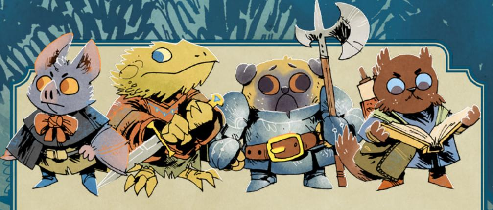

# Heartwood

### Description

Heartwood is a quiet clearing, a minor rest stop for travelers and an oftenunderappreciated exporter of high-quality lumber. Once known throughout the Woodland for skilled woodcarvers, Heartwood's reputation has waned after it fell under the watchful (and obtrusive) eye of the Grand Duchy.

While mistrust and unrest now flourish within the mouse-dominated clearing, Heartwood was once a symbol of cooperation with the Duchy; swayed by promises of a better life, the residents of Heartwood worked alongside the Duchy to cast off their Marquisate occupiers in the hopes that the Duchy could bring peace and prosperity amidst the Woodland War. The "liberation" of Heartwood was originally cause for much rejoicing among the denizens!

As the Duchy's plans have faltered—and new red tape and regulations have limited exports—many residents openly wonder if they made the right decision. The lumber that was once exported to virtually every other clearing in the Woodland now sits in lumberyards unsold, the proper paperwork required unfiled by the locals denizens who are still struggling to navigate the Duchy's labyrinthine system of approvals and taxes.

Mayor Cornelius VonSkyward has plans to rejuvenate the local economy with a new tunnel that will live up to the Duchy's promises—finally linking Heartwood to other Woodland clearings directly—and a new organization—The Heartwood Artisan Woodcarvers Guild—to oversee the flow of goods and manage the paperwork. Two key mole representatives of the Grand Duchy's parliament, Rufus Arvica and Lucilla Publius, are visiting the clearing to oversee these initiatives; Cornelius knows their approval is crucial.

But the Corvid Conspiracy lurks in the shadows, eager to upset Cornelius's efforts and enact their own plans for the clearing. Crawford Night, Corvid agent extraordinaire, has been working to stoke tensions and create conflict behind the scenes while maintaining a plausibly deniable cover. He wants the incorruptible and stubborn Cornelius to fail so that the Conspiracy can finally install Deputy Mayor Helena Tenpenny, a Corvid agent herself, as Mayor of Heartwood...

{222}------------------------------------------------

### At First Sight

Rust-colored dirt, jagged rocks, and tall evergreen trees surround the wooden buildings that make up Heartwood. The smell of freshly cut wood from the nearby sawmill hangs heavy in the air and leaves little doubt about the importance of lumber to the town's economy.

 Two half-finished, single-story buildings stand near the main road leading into Heartwood's center. The slight weathering of the exposed wooden frames hints that work on these structures halted some time ago.

A large colorfully-painted banner hung across the road is being taken down by a group of mice. The word "Founders" is briefly visible as the denizens neatly fold and flatten the decoration. Voices carry across the road and while the exact content of their words isn't audible from this distance, the unhappy tones and grim expressions of the mice are unmistakable. Two moles in formal military uniforms watch over them as they work.

Intricately carved wooden statues, posts, doors, and railings decorate the entire town, bringing an unexpected beauty to its otherwise mundane buildings.

### Conflicts

Heartwood is beset by many troubles, but the vagabonds are most likely to encounter the following conflicts. One of them—*The Founders' March*—is the core issue for the clearing, while the others are conflicts likely to appear.

### Core Conflict: The Founders' March

Two years ago, the residents of Heartwood helped the Grand Duchy seize Heartwood from the Marquisate, joining the Duchy's military forces in a coordinated strike on the unwitting Marquisate troops. Emerging from tunnels below the clearing, the Duchy's soldiers were met with local supplies, support, and intelligence that led to a clean sweep of the Marquisate's already tenuous hold on Heartwood.

Yet what started as a partnership—the Duchy had promised peaceful civic improvements to the clearing in place of the Marquisate's aggressive military occupation—has slowly degraded as a tremendous amount of Duchy paperwork and regular delays took hold in Heartwood. The denizens of the clearing once believed the Duchy could help them build a thriving trade hub; now the Duchy has imposed daily bouts of paperwork and complex taxes that have strangled the economy and left many out of work.

As tensions rose over the past few years, the Duchy has responded by

222 Root: The Roleplaying Game

{223}------------------------------------------------

demanding greater and greater displays of fealty from the denizens, insisting that old traditions be put aside for new Duchy sensibilities on the issues of the day. Many denizens are bristling under what they increasingly see as a colonial power masquerading as helpful benefactors who never live up to their word.

Nowhere is the conflict more evident than the cancellation of the Founders' Day festival, a beloved annual event that Duchy official Lucilla Publius claims will be used to showcase embarrassing anti-Duchy sedition. The festival has been one of the most successful trade events of the year (even during the Marquisate occupation), but at Lucilla's request, Mayor Cornelius has denied the permits for the event completely! Most residents are outraged, and some appear to be willing to do something about it!

Summer Swiftland, a descendant of Heartwood's founder Valoria Swiftland, is organizing a march, calling upon the angry denizens to stand up for themselves. Initial discussions between Summer—as a representative of the denizens—and Cornelius held some promise for restoring the festival without protests, but Cornelius fears that any concession to the denizens of Heartwood at this point might cost him Lucilla's support for his own projects, the tunnel and the new Heartwood Artisan Woodcarvers Guild.

Each leader involved in the negotiations to address the Founders' March has their own position on the issues at hand:

- Summer Swiftland wants the festival restored, and she's convinced the march could be an efficacious show of solidarity among Heartwood's denizens. She believes the Duchy will offer concessions when faced with a unified population, like an advisory seat in the local government for the denizens or a relaxation of trade restrictions. She is unwavering in her focus on a better future for Heartwood.
- \* Cornelius VonSkyward wants both of his proposed plans—the tunnel and the guild—to be approved by the Parliamentary representatives. Thus, he needs to look like he has Heartwood under control; he wants Summer and other community leaders to publicly support his administration. Ideally, he would also like Summer to step aside and let him run the clearing without any further opposition...

Yet any possible resolution has been derailed by the stubbornness of both sides. Cornelius claims the denizens of Heartwood are simply impatient and need to show some fealty to the Duchy in order to ensure their partnership thrives; Summer says the Duchy has had long enough to show progress and further delays are evidence of their mendacity. Now neither side will even talk to the other at all!

{224}------------------------------------------------

#### How it Develops

*If the vagabonds never arrived in Heartwood, the town guard would imprison Summer and the other denizens who gathered for the chaotic and tumultuous march. Summer would be led very publicly to the town jail...and would never be seen again in Heartwood. The official Duchy statement would be that she was remanded into the custody of officials from the Duchy homeland.*

*Summer's disappearance would inspire "The Ballad of Cornelius VonDuchy":*

*"So lift a mug and remember the mole Who came to town and the dreams he stole Cornelius the fool, the liar, and thief A Grand Duchy of words that led to our grief"*

*As the song spreads, Cornelius would be removed as mayor, humiliated and in disgrace, his plans for the tunnels and the guild both failing as his allies withdraw their support for his continued governance.*

*In his place, Helena would be appointed mayor—the Conspiracy would gain control of the clearing, using it to organize a black market for woodcarvings from the region instead of an open, transparent, and fair guild. The residents of Heartwood would be forced to labor under the dual injustice of the Duchy's paperwork and the Conspiracy's criminal "taxes."*

### Conflict: The Smallest Change

Two things are certain; Duchy bureaucrats always have a form that needs to be filed...and courier Penelope Primrose is always on time. Yet Penelope missed a delivery of crucial documents, leaving Rufus Arvica, aide to the Duchess of Mud, without the paperwork he needs to approve a newly proposed tunnel in Heartwood.

Rufus is worried about Penelope's tardiness. Penelope and her guards travel regularly using the Duchy's system of tunnels; she is unlikely to be lost. Worse yet, the documents in Penelope's possession are quite valuable—plans for Cornelius's new tunnel linking Heartwood to new clearings. And the worst of all, Rufus and Penelope have been in love for some time—though their relationship is riddled with fits and starts as their respective duties call them away from each other.

Rufus has demanded Cornelius send a force to tunnel 1439, Penelope's last known location. Yet Captain Pleasant Strong refuses to deviate from protocol, even when both Cornelius and Rufus demand it. Standard procedure dictates Pleasant must wait another two days before dispatching a search team. Desperate to get things moving, Rufus has asked the deputy mayor, Helena Tenpenny, to see if she can find some way to circumvent the red tape and find someone to locate the courier.

Like any good Conspirator, Helena has an angle. She has already agreed to help Rufus—so long as he agrees not to look too closely at the returned tunnel plans. Helena knows a cursory examination by Rufus would uncover any secret

224 Root: The Roleplaying Game

{225}------------------------------------------------

changes she tried to make, so she needs Rufus's complicity to subtly alter the expansion's route to give the Conspiracy access to the Duchy's tunnel network. Rufus hates the price Helena has set, but his will to say no erodes every moment that Penelope remains missing. Helena, meanwhile, has already begun looking for a good group of agents to find Penelope and alter the plans, and she offers a substantial bonus in addition to the reward already offered by the Duchy.

#### How it Develops

*If the vagabonds never arrived in Heartwood, Rufus would agree to Helena's terms and send out a group of ill-equipped miscreants and ne'er-do-wells—the only crew Helena and Crawford could assemble to do the job in time. That poor group of agents would fail to find Penelope before Captain Strong sends a search party of Duchy soldiers. Helena's crew becomes lost in the tunnels, while the Duchy soldiers discover Penelope and her two guards trapped in the rubble. All three would be dead, slowly crushed under the debris. Despite some damage, the plans would be usable and replacements not needed.*

*Basic investigation would prove that if the rescuers had arrived sooner, Penelope would have survived. Grief stricken, Rufus would turn his pain and anger upon Helena, accusing the deputy mayor of purposely delaying the search and sending out fools instead of competent agents. Helena would be forced to flee Heartwood to avoid Rufus's wrath, leaving Crawford to manage the Conspiracy...and find someone new to replace Cornelius as mayor.*

### Conflict: A Cook's Tale

Two nights ago, a formal reception for Lucilla Publius, aide to the Baron of Dirt, was marred by an attack. Lucilla came to Heartwood to review the mayor's proposal to create an artisan woodcarvers guild, but the feast planned for the night of her arrival went terribly awry when every guest became violently ill shortly after the soup was served.

Duchy agents quickly discovered small chunks of purple snakeroot in the kitchen's soup pot. Head cook Arlo Cutter was the only member of the kitchen staff seen preparing the soup; he was immediately arrested for the attempted assassination of a Parliamentary official.

Arlo is a beloved mouse resident of Heartwood; everyone is truly shocked at the crime he allegedly committed. Summer Swiftland sees Arlo regularly and has been caring for his daughter Ayla while he is in jail. Arlo hasn't said a word about his guilt or innocence to the local guard, but he has confessed to Summer that he did add the snakeroot, claiming that he wasn't trying to kill Lucilla only make her sick (and teach the Duchy a lesson). Summer can tell Arlo is lying about his reasons, but doesn't know why he would lie.

What Arlo hasn't shared with Summer is that he added the snakeroot to the soup at the not-so-innocent request of Crawford Night and Helena Tenpenny.

Chapter 8: Clearings of the Woodland 225

{226}------------------------------------------------

Crawford smuggled in medicine over the winter when Ayla fell ill, asking for nothing in return; but then some time later, he asked for Arlo's help in removing the dangerous Lucilla Publius from Heartwood. Arlo at first told himself that Crawford's request to add the snakeroot to the soup was a small price to pay for his daughter's life...but as the actual act drew nearer, he became more and more reluctant. Finally, when the time came, he acted—making a "mistake" that avoided Lucilla's death, but hopefully looked convincing enough that Crawford wouldn't deem Arlo's actions a betrayal.

Crawford intended the tainted soup to kill Lucilla and ruin Cornelius's chances of getting the Heartwood Artisan Woodcarvers Guild approved, but Arlo used the snakeroot in the entire pot of soup instead of just Lucilla's bowl. The diluted toxin wasn't enough to kill anyone.

Lucilla became deeply paranoid after what she saw as an obvious assassination attempt by an idiot—the only reason she survived was because Arlo was a fool. Her increasing paranoia and contempt for Heartwood drives her to ever greater heights of tyrannical commands...and making her all the more demanding of Cornelius, raising the bar on the loyalty and commitment he must show to the Duchy for his own projects to be approved.

Crawford wishes Lucilla had simply been removed, but he also thinks there is almost no likelihood of the Heartwood Artisan Woodcarvers Guild receiving any kind of approval from the paranoid and angry Lucilla. The crow has shifted his focus to other conflicts that might derail the mayor's plans. Crawford is counting on Arlo's fear for Ayla's safety to keep the mouse cook's snout shut. Summer knows that Arlo didn't intend to kill anyone, but she has had no luck convincing him to offer up any information that might explain further.

Lucilla herself has also asked for any denizen with information about the attempt on her life to come forward under an agreement of amnesty. She senses a deeper hand at play and wants to get to the bottom of it. So far, no one has taken her up on her offer.

#### How it Develops

*If the vagabonds never arrived in Heartwood, Arlo would be convicted of treason, attempted murder of a parliamentary official, attempted murder of 17 Duchy citizens, and sentenced to public execution. At Lucilla's order, soldiers would go door to door forcing denizens out of their homes and businesses to watch Arlo's sentence carried out.*

*Fear of the Duchy's power and might would be palpable over the coming days. Lucilla would see to it that the Duchy deemed Heartwood's denizens as untrustworthy and dangerous, ensuring they and Cornelius lose their chance at building the woodcarvers guild and also lose their voice in guiding Heartwood's future. Ayla would continue to live with Summer and in time officially become part of her family.*

{227}------------------------------------------------

#### Form 17b: Confirmation of Danger

Several woodcutters have gone missing and Chance Blackwood, chief woodcutter, has asked for help from Captain Pleasant Strong from the Duchy's guard force. The Captain's unit is responsible for security for that logging section of the forest. Despite his claim that he can't act because no one in his squad has proof of danger, Chance suspects it is simply cowardice. She has collected a small number of coins and baubles from the families of the missing workers in hopes of either bribing the guards or hiring vagabonds with the skills to help.

The official Duchy policy requires guards to abide by the criteria laid out by Form 17b: Confirmation of Danger. The form requires verifiable eyewitness statements, proof of major injury, a verified presence of an impending threat, or proven loss of life. Captain Strong is the arbiter of what is considered verification of danger.

Woodcutters have started working in pairs to minimize danger but even that hasn't kept people safe. Today Chance's sister Daphne and fellow woodcutter Kevin disappeared while felling a tree in the backwoods. The only evidence at the worksite was a small torn piece of bloody fabric, an unusual mark in the upper part of a tree, and drag marks that enter the woods but quickly disappear. Chance is sure that the mark on the tree came from a bear's claw but Captain Strong claims it is simply an errant axe mark.

Given the direction of the drag marks and the possible presence of a bear, she has an idea where its den might be. Chance is frantically trying to find denizens with the skills to back her up in the search for the two latest missing woodcutters. She knows that going alone means certain death but she is running out of options. Other workers want to help but worry about what will happen to their families if things go badly.

#### How it Develops

*If the vagabonds never arrived in Heartwood, Chance would go after Kevin and Daphne on her own. She returns badly injured but still breathing. Her wounds would be the final piece that would force Captain Strong to complete Form 17b and hunt down the ursine predator.*

*Sadly, Kevin and Daphne would not survive to be rescued. The giant bear would be killed and the remains of other missing denizens discovered in its den. Captain Strong would receive honors for his bravery and become something of a local hero to townsfolk after they hear a distorted form of the truth, telling how he single-handedly felled the beast and wept over the remains of its victims.*

*Chance would eventually recover from her injuries but be unable to ever work as a woodcutter again due to her damaged arms. Her bitterness at seeing Captain Strong celebrated as a hero would drive her to move away from Heartwood and seek work elsewhere in the Woodland.*

{228}------------------------------------------------

### Important Residents

| EXHAUSTION INJURY WEAR MORALE                                                                                                |  |
|------------------------------------------------------------------------------------------------------------------------------|--|
| <b>DRIVE:</b> To gain political powe                                                                                         |  |
| Moves:  • Stop progress with a request for paperwork • Confuse with political doublespeak • Use the system to achieve a goal |  |
| • A satchel of forms • A magnifying glass                                                                                    |  |

#### Cornelius VonSkyward

Cornelius is certainly a pompous bureaucrat of a mole with an intense love of power and procedure. He is also a public servant that takes his responsibility to the Duchy and those under his leadership seriously. He wants to grow Heartwood into something special and genuinely doesn't understand why the denizens are so impatient. From his perspective, the system takes time but it works. He is on the cusp of making the Heartwood Artisan Woodcarvers Guild a reality, which would be a major political win.

| ☐ EXHAUSTION                         |  |  |
|--------------------------------------|--|--|
| ☐ INJURY                             |  |  |
| WEAR                                 |  |  |
| □□□□ MORALE                          |  |  |
| <b>Drive:</b> To keep Heartwood safe |  |  |

- Teach with the power of song
- Build trust through honesty
- Step forward to lead

#### **EQUIPMENT:**

- · Small lute
- Locket with a small painting of her mom inside

#### Summer Swiftland

Summer's ties to Heartwood are rooted in the town's founding mice. She carries on the Swiftland family tradition of leadership and offering guidance to any residents in need. The weight of that responsibility sometimes wears her down but her desire to affect change for those that need her never wavers. In good times, she can often be found singing in the town square near city hall. She sings songs that cover Heartwood's history, tells folk tales, and mourns the losses of those that came before.

{229}------------------------------------------------

| □□□□ EXHAUSTION                    |  |  |
|------------------------------------|--|--|
| ☐ INJURY                           |  |  |
| □□ WEAR                            |  |  |
| □□□ MORALE                         |  |  |
| <b>Drive:</b> To make the delivery |  |  |

#### Moves:

- Move improbably fast
- · Head in the right direction
- Produce a key for any lock

#### EQUIPMENT:

- Oversized ring of keys
- Courier pouch
- Hidden dagger

### Penelope Primrose

Penelope is a plucky mouse with a heart for adventure. Some question her sense of selfpreservation in the execution of her duties, and she is the most highly respected courier in the entire Grand Duchy. After the death of her parents, Penelope was taken in by a loving mole family that raised her in the traditions of the Duchy. Through them, she learned the importance of serving the Duchy and its leaders. She takes great pride in her ability to make every delivery given to her, safely and on time. She has had a love affair going on with Rufus Arvica for some time now, albeit only when the two find each other in the same location—she loves the way he sees the tunnels as alive and beautiful, though she can never see herself settling down, with him or any other.

**Note:** Penelope should start with 2-wear, 2-exhaustion, and 1-injury marked if she is discovered while still crushed by the debris in the tunnel.

| EXHAUSTION |
|------------|
| INJURY     |
| WEAR       |
| MORALE     |

**DRIVE:** To place Helena Tenpenny in the mayorship of Heartwood

#### Moves:

- Blend anonymously in a crowd
- Turn strangers into friends with the right offer
- Apply pressure with a vicious threat

#### **EQUIPMENT:**

- Hollow walking stick
- Notebook filled with random letters and numbers

### Crawford Night

Upon first meeting, Crawford looks for all the world to be a very average, friendly, and straightforward crow. Crawford prefers to help people in their darkest time without asking anything in return. This gives him emotional leverage over others that doesn't break down easily—his assets are among the most loyal in the entire Conspiracy. But there are times when kindness is not a viable option. In those moments his target hears the darkness of his voice when issuing a threat. Few ever live long after seeing the cold indifference in his eyes when he follows through.

{230}------------------------------------------------

| □ E  | XHAUSTION |
|------|-----------|
| ☐ II | NJURY     |
| □ W  | /EAR      |
|      | IORALE    |

**DRIVE:** To provide for and protect Ayla

#### Moves:

- Share a bit of food or drink
- Quietly take decisive action
- Describe a heartwarming memory of his daughter

#### EQUIPMENT:

- Meat cleaver
- Thick canvas apron

#### Arlo Cutter

Arlo is an exceptional cook, loyal friend, and devoted family mouse. His cakes, breads, stews, and roasted vegetables are well known and coveted throughout the area. While many think of chefs as loud and boisterous personalities, Arlo is a soft-spoken mouse that listens respectfully to those around him. The one exception is when he is with his daughter, Ayla. The pure loving joy and enthusiasm that they share together is a gift to all that witness it. All of this paints a picture of a soul that none in Heartwood ever expected to poison anyone, let alone attempt murder—but Arlo will never say or do anything that could put Ayla in even more danger by implicating Crawford.

**Note:** The listed equipment represents what Arlo would normally be carrying, but he is currently imprisoned, and has none of it.

#### **EXHAUSTION** ☐ INJURY WEAR MORALE

**DRIVE**: To save the woodcutters and her sister

#### Moves:

- Fell the strongest of barriers with an axe
- Display knowledge of the forest
- Discover a path in the deepest woods

#### EQUIPMENT:

- Double headed axe
- Sharpening stone
- Thick leather belt

#### Chance Blackwood

Chance is a thick-armed mouse that leads the local woodcutters. She takes her responsibility as their leader and advocate very seriously. Chance grew up in the woods and is the third generation of her family to make their living from forestry. She is deeply concerned with the recent disappearance of her fellow woodcutters, and distraught with the disappearance of her sister Daphne today. She has previously worked hard to keep morale up with an unending stream of terrible and usually inappropriate jokes, but now she uses those jokes to hide what she can of her panic. Her gruff nature and good humor are appreciated during these difficult times.

{231}------------------------------------------------

|                                                   | EXHAUSTION |  |
|---------------------------------------------------|------------|--|
|                                                   | □□□ INJURY |  |
|                                                   | □□□ WEAR   |  |
|                                                   | □□ MORALE  |  |
| <b>Drive:</b> To gain glory while avoiding danger |            |  |
| Moves:                                            |            |  |
| Rally the troops to action                        |            |  |
| Attack with precision                             |            |  |

- Shield himself from danger

#### EQUIPMENT:

- Standard issue armor
- Shield
- War pick

### Captain Pleasant Strong

Captain Pleasant Strong is an ambitious soldier who has managed to move his way up the ranks primarily on the strength of his paperwork and ability to take credit for the work of others. On the surface, he is the model mole of a Duchy soldier. In reality, he is a coward that cares little for the world around him. His carefully crafted facade of the heroic protector covers his unwillingness to risk his personal safety unless absolutely forced to.

| EXHAUSTION |
|------------|
| INJURY     |
| WEAR       |
| MORALE     |

**DRIVE:** To tighten the Duchy's fist around Heartwood

#### Moves:

- Issue a decree to stymie denizen power or growth
- Make a sudden decision to seize power
- Point out the flaw in a plan

#### **EOUIPMENT:**

- Ledger
- Case of quills
- · Large ink bottle

#### Lucilla Publius

Lucilla serves the Baron of Dirt and acts as the final word on what new business ventures and investments the Duchy allows to move forward in Heartwood. Her job requires her to be equal parts actuary, accountant, logistician, and sage. Lucilla strives to understand situations in their entirety and to solve puzzles no matter who is involved. This has served her well in her position over the years but also made her several enemies in the Duchy's upper ranks. Lucilla has little patience for the shortsightedness demonstrated by most of her fellow parliamentarians, Rufus Arvica in particular. After the assassination attempt on her life, she is becoming more and more harsh, more and more convinced that Heartwood cannot be of any profit or use without strict Duchy control.

{232}------------------------------------------------

| ☐ EXHAUSTION |
|--------------|
| □□ INJURY    |
| WEAR         |
| □□□ MORALE   |

**DRIVE:** To save Penelope and serve the Duchy

#### Moves:

- Decry a wasteful decision
- · See through faulty logic
- Get needed supplies suddenly

#### **EQUIPMENT:**

- Set of blueprints
- Official wax seal of the Duchy
- Pick axe

#### Rufus Arvica

Rufus is a mole with a lifetime's accumulation of dirt in his claws. His entire life has been devoted to the Duchy's system of tunnels, their growth, and the legacy he will leave behind. To Rufus, the tunnels are the intersection of art and engineering. Where others see a labyrinth of tunnels, he sees a beautifully intricate system of arteries carrying life to every part of the Duchy. Just about the only thing he sees as more beautiful is Penelope Primrose. with whom he has a torrid romance whenever their work carries them to the same place. In general, he strives to ensure that few resources are wasted in the ever-growing expansion of the Duchy's reach. He is always seeking to better understand the intricacies of politics and looks up to Lucilla Publius as a mentor and role model.

| EXHAUSTION |
|------------|
| INJURY     |
| WEAR       |
| MORALE     |

**Drive:** To become mayor of Heartwood

#### Moves:

- Falsify documents
- Deescalate a situation with placating words
- Lie with practiced ease

#### **EQUIPMENT:**

- Pouch of incriminating documents
- Skeleton key
- Mayoral wax seal

#### helena Genpenny

Helena is the deputy mayor of Heartwood and a mole that most describe as timid upon first meeting her. She is one of the last people her superiors suspect of being an agent for the Corvid Conspiracy but that relationship has allowed her to move up the Duchy's political ranks. Coldly calculating, Helena does what is in her best interest without remorse or ego. Cornelius adores her and considers Helena a trusted friend.

{233}------------------------------------------------

### Grand Duchy Soldiers

Heartwood has a company of 89 Duchy soldiers stationed in Heartwood. Brigadier Claudius Mundus normally commands the town's entire military force with subordinate Captains taking control of a squad of eight Grand Duchy soldiers, but Mundus has been called away to another clearing, leaving Pleasant Strong in temporary command. The fighting force is highly trained, well regimented, and strictly adheres to the chain of command.

**Note:** The average Duchy patrol is around eight soldiers and uses the attached stats. Create individual soldiers as needed using the NPC creation rules on page 212 of the Root: The RPG core book

{234}------------------------------------------------

### Important Locations

### City Hall

A large two-story wooden building sits off of the town square with a large sign out front that labels it as City Hall. Attached to the roof is a statue of a large mouse locked in battle with a bear. Two soldiers stand guard at the front entrance with more inside. Both Mayor Cornelius VonSkyward and Brigadier Claudius Mundus have their offices inside of the government building. There are offices for visiting dignitaries and both civilian and military aides, and it is also home to the town courthouse.

### Heartwood Jail

On Heartwood's western edge, the town jail sits isolated from the rest of the town's buildings. Constructed from massive hardwood beams, the structure is impressive despite its relatively small size. Inside are four cells, each built with a combination of iron bars and the same thick beams. When there is a prisoner, guards rotate every two hours. Two guards sit inside the building with one patrolling the parameter. The jail normally sits empty and unguarded but with the recent incarceration of a suspected poisoner, the building is now fully staffed.

### Tunnel 1439

This is a part of a tunnel subsystem primarily devoted to couriers and the covert movement of Duchy officials. It is not as well traveled as the rest of the underground network due to its specialized and discrete nature. Maintenance on these areas does not occur with the same regularity that of the main system so issues are often discovered en route. Tunnel 1439 leads directly from the Duchy homeland to Heartwood with six stops at various clearings along the way.

### Dangerous Woods

The denizens of Heartwood have been logging the forests surrounding the town for many generations. Trees have always been chosen individually with new trees planted every year. While there are open spaces between the trees from areas already cleared, the forest still feels healthy and intact. The area currently being worked by the woodcutters is surrounded by low, rocky foothills. A small logging road intended for the carts used to transport the freshly cut logs runs through the middle of the area.

{235}------------------------------------------------

### Special Rules

When you **discreetly seek out agents of the Corvid Conspiracy in Heartwood**, roll with your Reputation with them. On a hit, an agent of the Conspiracy is willing to take you to meet with Crawford Night. On a 7-9, your guide demands payment first—2-Value—and a favor to be named later; mark notoriety if you are unwilling to make such a commitment. On a miss, your bumbling inquiries only alert the agents of the Conspiracy; mark 2-notoriety with the Corvid Conspiracy as one of those agents corners you to get some answers...

When you search the tunnels below Heartwood for missing denizens, roll with Cunning. On a 7-9, you find a trail you can follow, but there's a large obstacle or danger ahead that makes the journey difficult. On a 10+, you get a stroke of luck; the path is clear and your search successful. On a miss, a collapse of the tunnel nearly buries you; mark 2-injury and 2-exhaustion as you dig yourself out.

When you travel from clearing to clearing through the unfinished tunnels connected to Heartwood, the band collectively decides how it travels and one member rolls:

- quietly, secretly, mostly in darkness: the band collectively marks a total of 2-depletion; -2 to the roll
- openly, fowardly, torches lit: the band collectively marks a total of 2-exhaustion and 4-depletion; +o to the roll
- urgently, rushing, burning bright: the band collectively marks 5-exhaustion and 5-depletion; +2 to the roll

On a hit, you travel through the tunnels to a clearing nearby. On a 10+, the journey is quiet and largely unobstructed. On a 7-9, you encounter a danger or obstacle along the path; mark an additional exhaustion and depletion each to navigate around it...or blunder right through it and do your best, your choice. On a miss, something in the tunnels is hunting you; it strikes the night before you reach your destination.

{236}------------------------------------------------

### Introducing the Clearing

The town of Heartwood is an inland crossroads through which roads to several major clearings spread out. Because of its central location, it is a natural place for the vagabonds to rest and resupply. Because it serves a variety of travelers, residents are less fearful than at other clearings when strangers arrive in town. The Duchy imposes heavy taxes on every official sale, but the denizens are happy to give the vagabonds good prices if the money changes hands quietly.

Three of Heartwood's key leaders are more or less present as they enter town:

- Cornelius VonSkyward is ever the consummate politician who welcomes the vagabonds with warmth and questions about what brings them to Heartwood. He is likely to offer a job if the conversation goes well. He can, with the proper filing of Form 927-5, allocate discretionary funds to hire unaffiliated vagabonds to eliminate threats to Duchy assets. He wants Summer Swiftland to be forced to either publicly acknowledge his authority over Heartwood or have her leave the clearing.
- Summer Swiftland believes in the strength of popular resistance but understands the reality of the power imbalance between the local denizens and the Grand Duchy. She is looking for help from those like the vagabonds that she thinks Cornelius can't bully. She is willing to hire the vagabonds as negotiators, muscle, or even daring escape artists (if they can rescue Arlo without implicating her).
- Melena Genpenny watches the entire situation unfold from the mayor's side. If the vagabonds reject or ignore advances from both Cornelius and Summer, Helena makes contact with them later. She is happy to hire them to rescue Penelope and alter the plans for the tunnel. She will never mention Crawford Night's name or that of the Corvid Conspiracy to any vagabond with a less than positive reputation with the Conspiracy.

As things continue, make an escalation—a move designed to intensify the situation and draw the PCs in further. Escalations can provide new opportunities, create new dangers, or close down outlets for escape. If things get too quiet or slow, or the vagabonds aren't sure what to do, make an escalation. Here are some examples:

• The vagabonds are bumped and shoved as a group of playing mouse pups, sent by Crawford Night, runs through the area. One of the vagabonds feels a sudden weight in their pocket and discovers a small bag of coins with a note. "Midnight. Behind city hall. More coin to follow. - A friend." Crawford wants to hire the vagabonds to cause more trouble between the denizens and the Duchy.

{237}------------------------------------------------

- Two Duchy guards have Chance Blackwood backed against the wall of a building. She yells, "Cowards! You do nothing while our friends and family disappear!" She shouts over their shoulder towards a nearby crowd, "Who will join me tracking down whatever monster hunts our brave people? These fools won't even accept my money to do what's right!" Denizens in the area, clearly not warriors, shift uncomfortably and look down to avoid Chance's questioning glare.
- The vagabonds are awakened by loud huffing noises and the crack of breaking wood. Screams erupt from nearby denizens. The metallic scent of blood fills the area and the unmistakable roar of a bear cuts through the night from nearby.
- A sobbing young mouse, Arlo's daughter Ayla, stands in front of a poster in the town square. Scrawled across the paper are the words, "Please help my daddy. Reward my toys." A guard is about to rip it off of the post while explaining that she isn't allowed to put signs up unless they've been approved by the mayor.

If the vagabonds choose to engage with the conflict *A Cook's Tale* (page 225), there are several possible approaches. Summer could help them find evidence pointing towards the work of an outside assassin or simply hire them outright to break Arlo out of prison. If Arlo could be convinced that it would be safer or better for Ayla to reveal the truth than to keep his snout shut, he might expose Crawford Night's involvement and share the entire story. Lucilla wants the truth and will spare Arlo (only exiling him, of course) if she knows the true source of the attack.

Because Helena Tenpenny is firmly entrenched in both the Grand Duchy and the Corvid Conspiracy, she can be used to help escalate or resolve conflicts with either faction. If her involvement with Crawford is proven, she paints herself as a victim of the Corvid Conspiracy and claims her treachery was only due to fearing for her safety. If her secret is kept, she could set up the mayor to be killed, kidnapped, or humiliated by the vagabonds.

Both Cornelius and Summer want the guild to be approved but are at odds due to a fundamental lack of communication and the need to look strong to those they serve. Summer needs the town to see her as their protector and advocate. Cornelius needs the Duchy to see him as a smart and capable leader that has control of Heartwood. Crawford Night wants control of the town to use as a tool to further the Conspiracy's goals.

Use these escalations, singularly or in combination, to move the story forward and push Heartwood towards a moment where it feels like a point of no return for all involved. Bring the problem to the PCs' doorstep, create dangerous and fraught situations, and keep applying pressure until they have to make a choice and deal with the fallout from those decisions. Build tension and have fun!

{238}------------------------------------------------

# Sundew Bend

### Description

Marquisate troops arrived in Sundew Bend nearly five years ago, intending to establish an outpost in the clearing. The unit assigned to Sundew Bend was particularly callous, seizing supplies—and even killing a few locals who resisted—before moving on to attack nearby Eyrie forces. But they left behind the built-up garrison infrastructure with notices that the denizens were to touch none of it—the Marquisate would be back.

Faced with the cruel reality of the soldiers' return, the elder rabbits of the village council decided to "salt the earth," leaving nothing behind for the Marquisate (or the Eyrie) to exploit. The denizens of Sundew Bend burned their fields, homes, and village stockpiles...and fled into the woods, promising themselves to return to their clearing.

The Woodland War raged in the area for years, subsiding only when both the Marquisate and Eyrie Dynasties relocated troops from Sundew Bend and its environs to other parts of the Woodland. The original denizens returned exhausted by years of nomadic wandering—only to find that the Lizard Cult had taken over the abandoned area, transforming the ashen rubble into the greatest of gardens. The Riverfolk Company, in turn, established a trading post in the clearing as well, building docks and warehouses on what little land the Cult did not seize and delivering construction and gardening supplies.

Unsure how to proceed, the original denizens of Sundew Bend resigned themselves to a makeshift camp at the edge of the clearing, using the nowfamiliar forest for shelter. Many refugees from other clearings have joined their wandering band over the last five years, and the camp is overflowing with enough denizens that some whisper that the poorly armed, untrained mob could retake the clearing by force. After all…they faced worse in the forest.

Yet the leader of the refugees, Clem Glenn, believes the situation can be resolved without violence by negotiating the return of at least some of their land. Trademaster Edric Hoegl of the Riverfolk Company and Elder Opal Moonrider of the Lizard Cult have both agreed to discuss the issue, but Clem knows he has a time limit—Tasha Eelpen, another refugee, has gathered enough support for a more violent solution...

{239}------------------------------------------------

### At First Sight

Clouds hang low across the clearing, rejecting the rising sun's attempt to greet the workers as they slog towards the lush gardens in the middle of the clearing. The dour weather is normal for this time of year, but the river seems to be on the verge of flooding beyond its seasonally expected rise.

The two large warehouses clustered at the docks, surrounded by tall wooden fences, and the nearby outbuildings are stark in their utilitarian design. They seem downright crude when compared to the carved gates of the Lizard Cult's central compound. A network of muddy trails spread out from the main road that runs between the trading post and the Cult's compound.

Terraced gardens, filled with crops and exotic flowers, fill the center of the clearing adjacent to the Cult's buildings. Construction on new terraces in the areas has clearly begun, alongside aqueducts and other complex water delivery systems that sustain the crops.

### Conflict

Sundew Bend is beset by many troubles, but the vagabonds are most likely to encounter the following conflicts. One of them—*The Denizens Return*—is the core issue for the clearing, while the others are conflicts likely to appear.

### Core Conflict: The Denizens Return

Elder Opal Moonrider was once gifted with what they interpreted as a holy vision—a dream of a charred and barren clearing transformed into the greatest of gardens for the Grand Dragon. Together with a few other acolytes, Opal found Sundew Bend after years of wandering the Woodland, seeking a clearing that matched the vision even when it appeared to be nothing more than a false prophecy. Upon finally discovering Sundew Bend, Opal looked upon the ashen clearing as an opportunity for a supreme act of faith...and immediately set to building the first garden.

The bustling development in Sundew Bend quickly attracted the attention of the Riverfolk Company, specifically Trademaster Edric Hoegl, a skipper who prides himself on seizing rare opportunities and understanding his customer's needs. Trademaster Hoegl was fascinated with the project that Elder Opal has undertaken—admiring the audacity and grit such work would require and petitioned his superiors at the Company to open trade negotiations immediately, offering supplies in exchange for the Cult's crops.

Just a few weeks later, the Riverfolk Company proved themselves an invaluable trading partner—moving food grown in the garden to other clearings and

{240}------------------------------------------------

construction and gardening materials into Sundew Bend. Elder Opal was delighted! After all, was this not also a part of the Great Wyrm's will?

Despite the often joyous success of the existing partnership, the sudden arrival of an army of ragged denizens has set both the Cult and the Company on edge—both factions believed that Sundew Bend had been completely abandoned! No denizens remained when the Cult seized the land; no one protested when the Company built a new trading post on the fallen remnants of the old docks near the river.

And yet...more than a hundred hungry, forest-tested denizens now eye both the new trading post and the fragile gardens. Violence looms large, but everyone knows that trade will slow to a trickle if the trading post is seized...and only the most devout Cultists actually know how to manage the gardens and their complex irrigation.

Both Opal and Edric have sent emissaries to the refugees offering land, support, food, and money...with conditions. The Cult wants the returning denizens to convert and work in the gardens, helping to preserve Opal's glorious vision;

{241}------------------------------------------------

the Company would be happy to see Sundew Bend be rebuilt without such conversion, but is demanding the local economy be run on River Scrip instead of coin or open barter.

Clem Glenn, the leader of the refugees, has been unable to sell the other refugees on either of these compromises. While a few are willing to convert to the Cult's strange practices, most of the denizens aren't interested in joining up as cultists to secure their home. The Company's offer sounds better—River Scrip is a trusted currency all along the river—but many of the older refugees recognize that handing control of their internal economy over to the Company would give them little bargaining power in future negotiations.

Thus, the returning denizens themselves are split on how to move forward now that they have finally returned to Sundew Bend: Tasha Eelpen, a Marquisate deserter, thinks the refugees should seize the clearings from both factions and live with the consequences...while Clem, the former mayor of Sundew Bend, still believes there is room for negotiation with the new claimants.

Clem is a well-liked and honored member of the refugee group—he disagreed with the original plan to leave Sundew, but went along with the group and guided them through many a terrible situation in the forest. But his steady leadership doesn't hold the same attraction as it did in the dangerous forests, not when Tasha's more active proposals promise true, unabashed victory something these refugees have found in short supply.

#### How it develops

*If the vagabonds never arrived in Sundew Bend, the denizens would eventually rally to Tasha Eelpen's cause and attack both the Cult compound and the trading post, attempting to sack both and reclaim the clearing.*

*Just as the fighting begins, however, Clem would take one last stand, blocking the trail into the clearing and demanding the denizens find another way. While the violent mob around Tasha raged and shouted at Clem, one of its members would lash out, killing Clem with a thrown rock to the head.*

*Shocked by Clem's sudden demise, the other refugees would back down, their anger subsiding into grief. Tasha's attempts to rally the mob would fail, and any remaining attacking denizens would be easily held off by the Company and Cult. The terrible attack so feared by both the Cult and the Company would sputter out and die off.*

*Left without anywhere to go, the denizens would abandon their forest encampment, some joining one of the clearing's factions, others departing to desperately seek refuge in another clearing altogether, and still others returning to the woods and their nomadic, near-vagabond lives.*

Chapter 8: Clearings of the Woodland 241

{242}------------------------------------------------

### Conflict: The Price of Faith

The Company and the Cult have worked for more than a year to rebuild Sundew Bend, transforming the ashen rubble into beautiful gardens and the scorched docks into a thriving port. Their success has attracted new denizens (in addition to the refugees) as word has spread—some arriving by boat to work at the port for the Company, others traveling on pilgrimage to the miraculous gardens.

But the balance of power between the two partners shifted just before the returning refugees arrived. Hibiscus Gray, exchequer for the Cult, stopped selling crops and buying supplies from the Riverfolk Company completely, demanding they agree to new prices for the foodstuffs and a 10% tithe on all shipments through Sundew Bend, "a small fee worthy of the garden's beauty."

Flummoxed by the sudden drop in revenue, Edric has begun putting pressure on the Cult by sending his forces to steal key pieces of gardening and construction materials under the cover of night. Plows, small carts, pickaxes, and other supplies have all disappeared recently, and the Cult has been forced to rely on their stockpiles of wood and fertilizer to keep their garden construction on track. While Hibiscus suspects Edric of the crime, there is no way to prove anything!

Hoping to weather the shortages, Hibiscus secretly sent a small group of drakes (Lizard Cult followers) upstream to procure replacement equipment and supplies. Company forces discovered them on their return, and Edric took them captive at the trading post, accusing the seekers of stealing the supplies from the Company's warehouse. The captives are being kept inside of a locked room in the basement of the trading post; so far Opal and the other acolytes have been unable to free them.

The Cult offers free lodging, three lavish daily meals, and a sizable stipend to vagabonds that join their forces under the command of Silverpelt, the commander of the local Claws of the Dragon; Silverpelt needs some additional forces to stage a rescue of the captured acolytes. On the other hand, Edric Hoegl offers a tidy sum to anyone willing to make sure the Cult's stockpiled supplies don't last the week...

#### How it develops

*If the vagabonds never arrived in Sundew Bend, the trading post would pay some of the desperate refugees to burn down warehouses filled with supplies. Several Cult seekers and acolytes would be killed trying to fight the fire and multiple buildings would be destroyed. While the Cult would still be able to harvest fresh food from the gardens, the loss of their stockpiles would force them to resume trade with the Company at steep markups.*

*Frustrated by her failures, Silverpelt would attempt to rescue the acolytes herself without sufficient support. Company forces, led by Solfrid Pawsmore, would kill Silverpelt and the other Claws of the Dragon, leaving the Cult in Sundew Bend without any real defenses.*

*Unable to compete financially or physically with the Company, the Cult would be forced to concede most of the clearing, retaining only their compound and existing gardens.*

242 Root: The Roleplaying Game

{243}------------------------------------------------

### Conflict: The Cult Provides

Solfrid Pawsmore, enforcer and second-in-command of the trading post, has come to suspect that Trademaster Hoegl is plotting something—secret messages arriving at night, covert meetings in the dark forest, notes thrown into a fire instead of carefully filed away. Solfrid has concluded that Edric is doing *something* with the nascent Woodland Alliance, but the Trademaster has kept his true motivations (and machinations) to himself, even when Solfrid has hinted at what she knows.

Solfrid has a plan to discover the truth—the pollen from the Woodland's Heart flower, grown only in Sundew Bend, is a powerful intoxicant that also acts as a "truth serum"; anyone under its effects answers questions honestly and loses their short-term memories when the pollen's effects wear off. Unfortunately, the drug can be fatal if the dosage is even a little off. There are rumors that another flower unseen for several years, River's Breath, has pollen that acts as an antidote to the effects of the Woodland's Heart.

Solfrid wants someone to kidnap and drug Edric (using Woodland's Heart) and discover the truth. She's largely unwilling to drug Edric herself—she's not familiar with herbalism and such a direct action is risky. But if a group of vagabonds could drug Edric, Solfrid thinks she could find out what Edric is up to, and if necessary, use the information to get the Company to strip Edric of his title and promote her to skipper of the trading post.

For his part, Edric doesn't care that Solfrid has grown suspicious. He's conspiring with agents of the Woodland Alliance to undermine the Cult. Company leadership hasn't given him permission to negotiate with them, but Edric's trying to do a deal anyway, hoping that forgiveness is more forthcoming than permission, and views Solfrid as too stupid to figure out his schemes. He has documented all of his negotiations on ledgers in a secret safe under his floorboards—he remains a Riverfolk Company Skipper and still ultimately wants to present proper books to the Company—and he readily confesses to their existence and location if drugged.

#### How it develops

*If the vagabonds never arrived in Sundew Bend, Solfrid would try to surreptitiously drug Edric herself via his morning coffee. The dose would prove to be fatal to Hoegl, leaving Solfrid without answers...but with an opportunity to seize control. Solfrid's guilt and ambitions would seize her will, and she would quickly blame the Cult for poisoning Edric and start planning the Company's "vengeance" on the Lizard Cult for their treachery.*

*The Cult would honestly deny any involvement, but the anger amongst the Company would allow Solfrid to distract from her crimes by plotting the assassination of Hibiscus Gray, the most likely Cult culprit, using Company mercenaries. Solfrid would order the murder a week after Edric's death, and the resulting assassinations would spark open warfare between the two factions.*

Chapter 8: Clearings of the Woodland 243

{244}------------------------------------------------

### Conflict: Seeds of History

The Company has made formal work offers to the refugees, but the Cult has been more charitable, giving them free food and operating a school for children at the Cult's compound. Emmy Summer, an elder rabbit, agreed to help Peeta Clawrunner, a bat seeker and cook, with the school, telling stories of Sundew Bend to the children. Emmy mostly helped to keep the children entertained with fictitious stories, but...she is proud of Sundew Bend. Soon, she started to sneak in bits of real history—embellished and made thrilling or fantastical...but grounded in truth.

One day, Silverpelt, a former vagabond turned Claw of the Dragon, overheard Emmy telling the tale of the River's Breath flower, an antidote to the Woodland's Heart said to have been stored away long ago in a secret vault by the people of Sundew Bend. Silverpelt quickly realized the secret seed vault was real, taking the elder hostage and forcing her to reveal what she knew. The Cult has now taken possession of the vault and the secret barrels filled with seed, posting a rotating guard while managing to keep the seizure almost entirely under wraps.

Excited by the discovery (and ignorant of the means), Opal has arranged for seekers from nearby clearings to take the seeds and distribute them throughout the Woodland. These plants, unseen anywhere else, would be a huge boon to the Cult to improve their gardens—using the Woodland's Heart and River's Breath pollen to produce both the powerful drug and its antidote—and bring beauty to the faithful.

Silverpelt continues to hold Emmy in secret, in a burrow at the edges of the clearing—she knows Opal would never approve, but she can't bring herself to execute the elder. At some point, Silverpelt knows she has to make a terrible choice.

While none of the denizens yet realize that Emmy is missing, Bee "Baby" Glenn is convinced she disappeared the same day he saw Silverpelt asking Emmy questions. The only person Baby trusts—his father, Clem—is busy trying to keep the refugees in check, so Baby has been looking for someone to listen to his story and rescue Emmy. He is looking for mighty warriors...or maybe even heroes.

#### How it develops

*If the vagabonds never arrived in Sundew Bend, Silverpelt would eventually kill Emmy and dump her body far away. Baby, ashamed he was unable to rescue Emmy, would be inconsolable for months, eventually leaving the clearing to become a vagabond himself.*

*The Cult would send seeds from both the Woodland's Heart and River's Breath to select gardens throughout the Woodland. The flowers and their pollen would become such an important resource that the Cult sends reinforcements to all clearings that grow them, including Sundew Bend—helping the local garden to become something closer to a beautiful fortress with enough martial power to fend off and defeat the Riverfolk Company. Denizens from the camp would be offered opportunities to move to other Cult clearings to work as cultivation specialists.*

244 Root: The Roleplaying Game

{245}------------------------------------------------

### Important Residents

| □□□□ EXHAUSTION                               |  |  |
|-----------------------------------------------|--|--|
|                                               |  |  |
| □□□ WEAR                                      |  |  |
| □□□ MORALE                                    |  |  |
| D                                             |  |  |
| <b>Drive:</b> To move up the Company's ladder |  |  |
| Company's tadder                              |  |  |
| Moves:                                        |  |  |
| Appear without warning                        |  |  |
| Throw a knife with                            |  |  |
| unerring accuracy                             |  |  |
| Panic an opponent     with a smile            |  |  |
|                                               |  |  |
| EQUIPMENT:                                    |  |  |

Hidden knivesSpyglass

#### Solfrid Pawsmore

An incredibly charming otter that keeps the docks under her constantly watchful eye, Solfrid is the one trading post official most feared by the workers. It only took a couple of instances of denizens falling asleep on the job—only to be awakened with a knife to the throat and a terrible smile—for her to establish her authority.

When Edric Hoegl has a problem that needs to be solved, Solfrid resolves it in the Company's favor. She believes in the Company, its methods and its purpose. Yet...she hungers for more power and control and would gladly take over the trading post as soon as the opportunity presents itself. She has no real loyalty to Edric, and while she might not usurp him as long as such an action could hurt the Company, the instant she can without cost to the Riverfolk, she will...

| EXHAUSTIO INIURY |
|---------------------|
| WEAR                |
| MORALE              |

**Drive:** To build faith in the Cult through service

#### Moves:

- Restore hope with a bowl of warm stew
- Earnestly demand the truth
- Remind the faithful of their duty to the Cult

#### **EQUIPMENT:**

- Wooden ladle
- Bubbling cauldron of stew
- Razor sharp cleaver

### Peeta Clawrunner

This bat with a wide smile and kindly eyes is in charge of the kitchens for the Cult. He is quick to offer food to those in need if the Cult's current situation allows it. He is a genuinely caring soul who wants to make the clearing the best it can be.

He is also a true believer in both the Cult's teaching and Opal Moonrider's vision for the garden. He would sacrifice himself without hesitation for the good of either. He knows that Silverpelt holds Emmy hostage, but he believes the Cult will release her unharmed once they are done asking her questions.

{246}------------------------------------------------

| □□□ EXHAUSTION |
|----------------|
| □□ INJURY      |
| □□□ WEAR       |
| □□□□ MORALE    |

**DRIVE:** To gain control of the clearing's economy

#### Moves:

- Force someone into a bad deal
- Tell a believable lie with conviction
- Notice a crucial small detail

#### **EQUIPMENT:**

- High quality armor and sword
- Key to the local Company treasury vault
- Golden stylus

# | EXHAUSTION | INJURY | WEAR | MORALE

**DRIVE:** To find a safe home for his people

#### Moves:

- Calm a crowd with a stirring speech
- Organize an escape from danger
- Protect others by stepping forward

#### **EQUIPMENT:**

- Wooden walking stick
- Backpack with bits of dried food

#### Edric hoegl

Edric is a stern otter known both for his ability to drive a hard bargain and for his almost preternatural business-development instincts. Regardless of whether it's force, bloodshed, blackmail, or simply superior pricing needed to close a deal, he's willing to do what's necessary...and often knows what's required before anyone else does. As he proudly reminds those that work at the trading post, "The deal justifies the means...and the deal is always afoot."

Edric lives his life with stark simplicity. His living quarters, office, and clothing are plain to the point of standing out for their lack of personality. There are only two exceptions to this: the intricately engraved sword he wears at his waist and the ornate carved stylus he uses to sign every contract.

#### Clement "Clem" Glenn

Clem, a bunny born in Sundew Bend, still has clear memories of his life during that time. His wife, Hazel, was killed for resisting the Marquisate army during its initial invasion of the clearing. Two of his three children were killed over the next several years—lost to dangers in the forest—leaving only him and his son Baby.

Clem has accepted the mantle of leadership not due to a desire for power but instead to fill a void desperately needed by his community. The burden of that responsibility weighs heavily on him and he hopes to find a safer and more permanent home inside of the clearing for everyone. He is convinced that violence is not the answer to their problems, no matter how tempting Tasha Eelpen makes it sound.

{247}------------------------------------------------

| □□□□ EXHAUSTION                                 |
|-------------------------------------------------|
| □□□ INJURY                                      |
| □□□ WEAR                                        |
| □□ MORALE                                       |
|                                                 |
| <b>DRIVE:</b> To retake Sundew Bend at any cost |
| at any cost                                     |
| Moves:                                          |
| Share a hard truth                              |
| with an enemy                                   |
| <ul> <li>Demand action now,</li> </ul>          |
| no matter the cost                              |
| Strike at or threaten an                        |

#### **EQUIPMENT:**

• Marquisate sword

enemy's weakness

- Ragged armor
- Faded military insignia

| □□□ EXHAUSTION □□□ INJURY □□□ WEAR □□ MORALE                    |
|-----------------------------------------------------------------|
| HARM INFLICTED: 2-injury                                        |
| <b>DRIVE:</b> To protect the Company's interests in Sundew Bend |
| EQUIPMENT: • Common weapons and light armor                     |

#### Tasha Eelpen

Tasha is a former Marquisate fox soldier who signed up for the War believing it would advance her career. After several major battles, she grew deeply discontented with the leadership of the Marquisate's forces...and took an "indefinite leave" from the Marquisate military. She joined the refugee band a few years ago and has repeatedly proven herself a capable leader in tough spots.

Since arriving at Sundew Bend, Tasha has been vocal about seizing the clearing—the garden and the docks—no matter the cost. Tired of the forest, she would rather deal with angry otters and difficult irrigation than go back to their wandering ways.

### Company Mercenaries

The Riverfolk Company trafficks in all sorts of goods, but none are in demand quite like the mercenaries they move up and down the river in the service of the factions fighting the Woodland War. The ongoing conflict has depleted most military forces, and the Company is all too happy to charge a premium to supply enough troops to keep fighting to the Marquisate, the Eyrie Dynasties, and any other buyer with deep enough pockets. Of course, the constant deployment of such forces means they sometimes aren't available to skippers like Edric, but a quick requisition form can usually ensure at least a patrol or two are on hand to address problems.

**Note:** The attached stats are the traits for a single mercenary. An entire unit together—roughly eight mercenaries—gains +2 harm boxes and doubles their inflicted harm when acting as a small group.

{248}------------------------------------------------

# □□ EXHAUSTION □ INJURY □ WEAR □□□ MORALE

**DRIVE:** To be heroic and help those in need

#### Moves:

- Share a story about the clearing
- Call for help from competent adults
- Sneak past adults into secure areas

#### **EQUIPMENT:**

- Inaccurate map of the Sundew Bend settlement
- Shovel
- Personal journal

### Bee "Baby" Glenn

Clem's only living child, Baby, is a shining light of hope in the oppressive reality that Sundew Bend brings each day. Baby is eager to help all in need but also precociously wary of a dangerous world.

Baby has no personal memory of the clearing, having only been an infant when his family was forced to flee. He has committed every story, piece of history, and rumor that the adults have shared with him to his journal. He has a special bond with Emmy Summer, the elderly rabbit who keeps all of Sundew Bend's stories since the clearing was burned.

| EXHAUSTION |
|------------|
| INJURY     |
| WEAR       |
| MORALE     |

**DRIVE:** To ensure that the stories of Sundew will continue to be told

#### Moves:

- Recall a fact previously lost to history
- Remain quietly aloof when questioned
- Give unsolicited advice

#### **EQUIPMENT:**

- Illustrated scroll
- Jar containing ashes from her childhood home
- Personal journal

### Emmy Summer

This elderly bunny is the only remaining living member of the original Sundew Bend village council that made the decision to burn the old clearing to the ground and flee. She has appointed herself the keeper of stories for Sundew Bend both to preserve the past and as an act of penance for being part of the destruction of her childhood home.

As the twilight of her time draws to an end, Emmy works to share the stories and legends of the community with the younger members of the group, albeit with a flare for the dramatic. She has a particular fondness for Baby, as she believes he will one day be a great hero.

{249}------------------------------------------------

| DDD EXHAUSTION DDD INJURY DDDD WEAR |
|-------------------------------------|
| □□□□□ WEAR                          |
| HARM INFLICTED: 4-injury            |
| DRIVE: To reclaim Sundew            |
| Bend from non-denizen factions      |

#### Denizen Militia

The denizens who have survived the forest for these past few years have become a tough bunch of wanderers. They've fought bears together, taken refuge in ruins, and killed bandits, telling stories of Sundew Bend to keep their spirits bright in moments of darkness. Now that they've arrived, however, they've found the conflict to be more complicated than expected, and they are starting to listen to Tasha's promises of a clearing free of these intruders. Their swords may be dull and their spirits weakened...but these denizens are still capable of putting up a real fight if pushed to that point.

**Note:** The average militia group is a mob of around 20 members and uses the attached stats. Create individual militia members as needed using the NPC creation rules on page 212 of the Root: The RPG core book; give them 2-3 boxes of exhaustion and injury, but reduce their wear and morale to 1-2 boxes to reflect the cost of their forest travels.

#### **EXHAUSTION** INJURY WEAR MORALE **DRIVE:** To secure the Cult's control of Sundew Bend

#### Moves:

- Win a negotiation with economic pressure
- Haughtily deny involvement with a plan gone wrong
- Hide behind the power of the Cult

#### EQUIPMENT:

- A meticulously maintained ledger
- A small vial of poisoned ink

### **hibiscus** Gray

Hibiscus, a lizard, is incredibly precise with his words and even more so with every contract. Tasked with growing the Lizard Cult's local coffers, he has been very effective at balancing short-term losses for long-term gains.

While he keeps careful control of all financial decisions, he delegates more physical tasks to Silverpelt and the other Claws of the Dragon. Though devoted to the Cult, he wouldn't die for it if escape presented itself.

{250}------------------------------------------------

| □□□□ EXHAUSTION | 1 |
|-----------------|---|
| □□□□ INJURY     |   |
| □□□□ WEAR       |   |
| □□ MORALE       |   |
|                 |   |

**DRIVE:** To prove her commitment to the Great Wyrm

#### Moves:

- Outsmart an ambush or trap
- End a conversation with a cold stare
- Smash through a physical barrier

#### **EQUIPMENT:**

- High quality armor and sword
- Oaken shield
- Battle horn

### Silverpelt

A recently converted otter, Silverpelt joined the Lizard Cult in Sundew Bend after years of adventuring as a vagabond. Moved by Opal's words to join the Cult, she quickly rose from seeker to acolyte, becoming the leader of the Claws of the Dragon within the year. She is eager to show that her faith is deeper than it might appear and is willing to take risks to prove to Opal and the others that they have not misplaced their faith in her.

# □□□ EXHAUSTION □ INJURY □□ WEAR □□□ MORALE

**DRIVE:** To turn Sundew into the greatest of all gardens

#### Moves:

- Summon the guards for protection
- Enrapture an audience with the spoken word
- End a conversation with the declaration of a vision

#### **EQUIPMENT:**

- Thick woolen robes and a golden helmet
- Pouch of Woodland's Heart flower seeds
- An exquisitely carved bone staff

#### Opal Moonrider

A particularly driven rabbit acolyte, Opal has spent their whole life following a vision they had as a child—terraced gardens amidst ashes that missionaries of the Cult explained as a gift from the Great Wyrm. They are a devout believer in the Cult and the importance of the garden. Convincing them to stray from that path would be a monumental task.

As the Voice of Sundew Bend, Opal genuinely wants to help those that come willingly into the Cult's embrace. They stay purposely ignorant of the means Hibiscus and Silverpelt use to solve problems, and they've decided to allow seekers to "sacrifice" seed and other grains (instead of the usual sacrifices) in the hopes that a swell of new cultists can help seize control of the clearing. After all, the Cult can always return to the more traditional ways later...

Opal always speaks as if in a dreamlike state—their words spilling out with an unusually poetic meter. Most find their speeches a bit perplexing, wholly inspirational, and with a hint of an otherworldly presence.

{251}------------------------------------------------

| exhaustion                                               |
|-----------------------------------------------------------------|
| injury                                                   |
| wear                                                     |
| morale                                                  |
| Harm Inflicted: 2-injury                                        |
| Drive: To protect the Lizard Cult's interests in Sundew Bend |
|                                                                 |

#### **Equipment:**

• Common weapons and light armor

### Lizard Cult Guards

While the Lizard Cult is not a heavily militarized religion, they are not without armed guards. Patrols of seekers—with the occasional acolyte—watch over the compound and the gardens, look out for trouble, and try to keep the cultists safe. They mostly follow orders from Silverpelt, but they are quick to come to the aid of any senior cultist in need of their assistance.

Note: The average guard unit is five to ten seekers and uses the attached stats. Create individual guards as needed using the NPC creation rules on page 212 of the Root: The RPG core book; some of the individual guards might be acolytes—the Claws of the Dragon with 3 harm boxes of each type, capable of inflicting 2-injury per attack.

{252}------------------------------------------------

### Important Locations

#### Sundew Bend Grading Post

The Sundew Bend Trading Post is made up of a tight group of buildings, a sturdy awning, and a large storefront. Tall wooden walls with a thick wooden gate at their center surround the entire area. The rear of the trading post backs to the river where a busy dock covered in wooden crates accepts cargo from across the Woodland.

Workers stay in a large bunkhouse, and the upper level of the storefront has private living spaces for Edric Hoegl, Solfrid Pawsmore, and their families. There are always at least two guards patrolling inside the walls who swap out every ten hours.

### Sundew Lizard Cult Compound

The main road from the trading post leads to an ornately carved wooden arch that welcomes the Woodland faithful into the compound. Protective walls spread out from the arch and surround the area. Lush green foliage lines the paths inside the walls as one of the many tangible tributes to the Great Wyrm.

A score of barracks, many still empty, stand along the southern area of the compound. A large meeting and dining hall is located to the north with a bustling kitchen at the building's rear. Three warehouses are clustered to the eastern edge of the compound and always under heavy guard.

- Warehouse #1 contains dry goods to feed the compound. Spices, preserved meats, flour, and oil fill the building. Peeta Clawrunner, the Cult's cook, and his kitchen staff have unrestricted access to this building.
- Warehouse #2 contains specialty gardening supplies: bone meal, sealed containers of seeds, garden tools, coils of rope, and ladders of varying sizes. Cult members and denizens working in the gardens have access to the building during normal work hours.
- Warehouse #3 contains the Claws' armory, moderately valuable Cult documents and books, and a variety of overflow storage crates. Only Hibiscus Gray and the guards have unrestricted access to this warehouse.

Warehouse #1 is the most vulnerable to attack. Peeta runs an informal school for children of both the Cult members and the local denizens nearby, teaching the ways of the Cult, basic reading, and basic counting skills. It is normal to see children running around throughout the compound during their breaks, and many workers come and go each day.

{253}------------------------------------------------

#### The Gardens

The Cult's compound opens to an already impressive set of gardens. Each massive garden terrace consists of three tiers—the lowest is filled with food crops, the middle with standard Lizard Cult flora, and the uppermost is reserved exclusively for the flower of Sundew Bend, Woodland's Heart.

Each level of the garden is connected by several wooden ladders. Narrow rope bridges at the uppermost section connect each terrace to the adjoining terrace. During the day, both cultists and local denizens work the existing terraces and construct new ones.

### The Denizen Camp

A small group of ramshackle buildings stands at the western edge of the forest. Only the desperate would be willing to live so close to the boundary of safety that the clearing brings. The smell of wood smoke and damp straw hangs heavy in the air. The expected aroma of cooking food is noticeably absent and many of the denizens appear bedraggled and hungry.

The structures here aren't solid enough to keep out the driving rain let alone the danger that the forest presents. The rabbits are welcoming, if hesitant, around strangers, eager to hear news of other clearings. Many speak openly about seizing Sundew Bend, but the talk of violence makes the other refugees obviously nervous. It's easy to find Tasha Eelpen wandering through the camp, attempting to sway people to her cause.

### Seed Vault

The entrance to the tunnel is mostly buried under dirt and the base of a burned tree stump. A short climb down into the opening leads to a sharply angled downward sloping passage adorned with murals from skilled rabbit artisans. There are no lights or torches inside the structure. The vault itself contains barrels of flower seeds, notebooks of local plant lore, and a letter from the previous denizen council of Sundew Bend.

Silverpelt and her acolytes, on high alert for trouble, guard the area. The vault's entrance is surrounded by charred husks of trees, mounds of muddy earth, and a complete lack of living vegetation.

{254}------------------------------------------------

### Special Rules

Woodland's Heart is a startlingly red flower whose pollen is a powerful and dangerous intoxicant; too much is lethal. Denizens under its effect lose their ability for subtlety, answer questions honestly, and are known to suffer from memory loss.

When you ingest the pollen of Woodland's Heart, roll with Might. On a hit, you must answer the next two significant questions asked of you truthfully. On a 7 - 9, you also pick 2:

- you lose an important memory forever
- you cannot lie at all for the rest of the scene
- you won't remember that you ingested the drug

On a miss, answer one question honestly before the poison knocks you out. You'll need to find an antidote before the pollen slowly kills you.

When you give the pollen of Woodland's Heart to an NPC, roll with Luck. On a hit, they answer two questions honestly before they pass out. On a 10+, they also won't remember you gave them the pollen or you can keep them awake (and honest) for a scene, your choice. On a miss, the dose is sure to be fatal; find an antidote quickly or else!

River's Breath is a mirror version of the Heart—nightblooming pale lavender petals whose pollen is an antidote to the effects of the Woodland's Heart. It can even save those dying from an overdose of the Heart's pollen, if administered in time.

When you ingest the pollen of River's Breath, take a 12+ instead of rolling when you next ingest the pollen of Woodland's Heart.

When you give River's Breath pollen to someone dying from Woodland's Heart, roll with Cunning. On a hit, the antidote works and they'll make a full recovery. On a 10+, they also recover all harm caused by the poison.

**For NPCs:** On a miss, you're too late—the poison has claimed them. It haunts you; you are unable to clear exhaustion until you honor their death.

**For PCs:** On a miss, you save them, but they've lost a piece of who they were and must change one of their drives.

{255}------------------------------------------------

### Introducing the Clearing

Sundew Bend is a welcome stop in a relatively isolated part of the Woodlands to restock supplies for the vagabonds. With the tensions that have built in the clearing, newcomers are of great interest to all of the leaders in the area. Some natural options for introductions include:

- Edric Hoegl. He invites them into the trading post and questions them to make sure that they're not agents of the Cult. He tries to hire them to destroy the warehouses and offers free weapons and supplies as payment. If any of them are friendly with the Woodland Alliance, he might also be interested in hiring them as emissaries to his new allies.
- Opal Moonrider. With a flourish of robes and grand pronouncements, Opal invites the vagabonds to dinner at the Cult's dining hall. They also introduce the group to Hibiscus Gray at dinner. Hibiscus wants to make the best use of their talents and pays well for success. He is extremely interested in whatever skills the band has that can be put to use, especially with regard to freeing the captive group of drakes held by the Riverfolk Company.
- Clem Glenn. Clem is desperately looking for help for his struggling community and invites them to share in what little food they have. He lets them know he has a meeting with both Opal and Edric to negotiate land for the denizens, but has little to offer the vagabonds in terms of payment for their help.

If the PCs stop to talk with the inhabitants of the clearing, they receive a spectrum of opinions about what is happening. Cult members are mostly happy with their lives but may feel the Cult is overly demanding on their time. Others believe the conflict with the trading post distracts from the holy work of tending the gardens and may even consider Hibiscus's economic maneuverings as blasphemous.

Denizens from the camp have a clear understanding that their situation is unsustainable and something needs to change soon. If asked why they don't just leave the clearing for somewhere easier, they speak about their history, ties to the land, the struggle of sacrificing their home only to have lost it anyway. The clearing is tied to their grief at what they lost and their sense of self.

The Riverfolk at the trading post see the financial opportunities that the clearing brings. Some worry that Edric is pushing things too far and that the entire situation will explode, driving out the cult and making the trading post no longer viable. Many want to see Edric make some minor concessions to return things to profitability; others, like Solfrid, have grown suspicious of Edric's other dealings...

{256}------------------------------------------------

With three distinct groups in the clearing, there is a lot of space for the PCs to support the NPC that interests them and their playstyle. As things continue, make an escalation—a move designed to intensify the situation and draw the PCs in further. Escalations can provide new opportunities, create new dangers, or close down outlets for escape. If things get too quiet or slow, or the vagabonds aren't sure what to do, make an escalation. Here are some examples:

- Tasha Eelpen attempts to hire the vagabonds to strike at key locations in both the Cult's compound and the Company trading post. She's taken up a collection from the other denizens and can pay well to have the vagabonds smooth the path toward a clearing-wide massacre.
- Solfrid Pawsmore announces the public execution of the group of Cultists who were caught sneaking in supplies to the clearing. Peeta Clawrunner comes to the PCs to beg for them to intervene.
- Hibiscus Gray demands that the children attending Peeta Clawrunner's school start working a shift in the gardens to help pay for their parents' tithe and compensate the Cult for their education. Two guards are dragging Baby off towards the gardens while he yells for help.
- An intense rainstorm moves in, flooding parts of the clearing at an alarming rate. The denizen's camp is rapidly being washed away due to its poor construction and the heavy rains. Clem comes looking for help, but time is short!
- Denizens start shouting that there is a fire at the trading post.

  The PCs catch sight of Silverpelt sneaking away as the screams of frightened children come from the main building's living quarters.

If players engage with the conflict *Seeds of History* (page 244), Emmy provides information about the seeds and their uses if rescued. While others in the camp have much of the same knowledge, Emmy is the camp's leading expert. Of course, the Cult is in charge of the seed vault now, and trying to take the seeds leads to a whole new conflict...

Use these escalations, singularly or in combination, to push Sundew Bend to the point where all sides are desperate enough that the situation exploding feels inevitable. At the heart of the central conflict is the question: should one group have power over the rest or can compromise between all three factions be found? Bring the problem to their doorstep, create dangerous and fraught situations, and keep applying pressure until the PCs have to make a choice and deal with the fallout from those decisions. Have fun!

{257}------------------------------------------------

#### New faces haunt the Woodland's paths!

As the War rages on, new factions take interest in the Woodland's resources. The Riverfolk Company sends trade boats up and down the rivers; the Lizard Cult makes a new push for converts; the Grand Duchy digs tunnels to seize new territory; and the Corvid Conspiracy toils to claim ill-beggoten gains from the foolish. Who are these new factions? And what do they have in store for the Woodland?

**Travelers** & Outsiders is a supplement for Root: The Roleplaying Game—the officially-licensed tabletop RPG based on the award-winning Root: A Game of Woodland Might and Right board game by Leder Games—that expands the game to include the first four expansion factions!

Here's what you'll find inside this book:

- Ten new playbooks, expanding the types of vagabonds you can play to include pirates, raiders, scholars, heretics, raconteurs, and more.
- · Four new expansion factions—The Riverfolk Company, Lizard Cult, Grand Duchy, and Corvid Conspiracy—for you to add to any campaign.
- · Dozens of expanded moves and tags, including weapons skills, roguish feats, natures, drives, connections, equipment tags, and pre-made gear.
- · Robust faction turn mechanics that bring the setting to life as factions seize holdings, build structures, and plot mischief across the Woodland.
- · Two new clearings—*Heartwood* and *Sundew Bend*—that focus on adventures involving the new expansion factions and their conflicts.

**Root: The RPG** is a fantasy adventure tabletop roleplaying game for three to six players of woodland creatures fighting for money, justice, and freedom from powers far greater than them. The Woodland calls!

Players Time 3-6 2-4 hrs

Rating Everyone

Root" and Leder Games" logo and key art TM & © 2017 Leder Games. All Rights Reserved